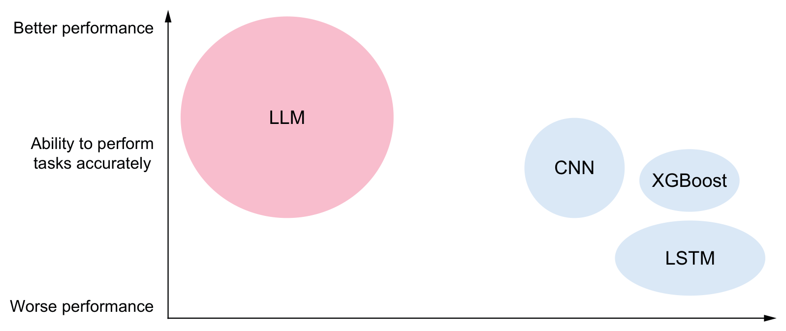
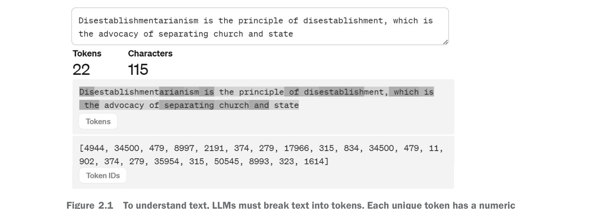
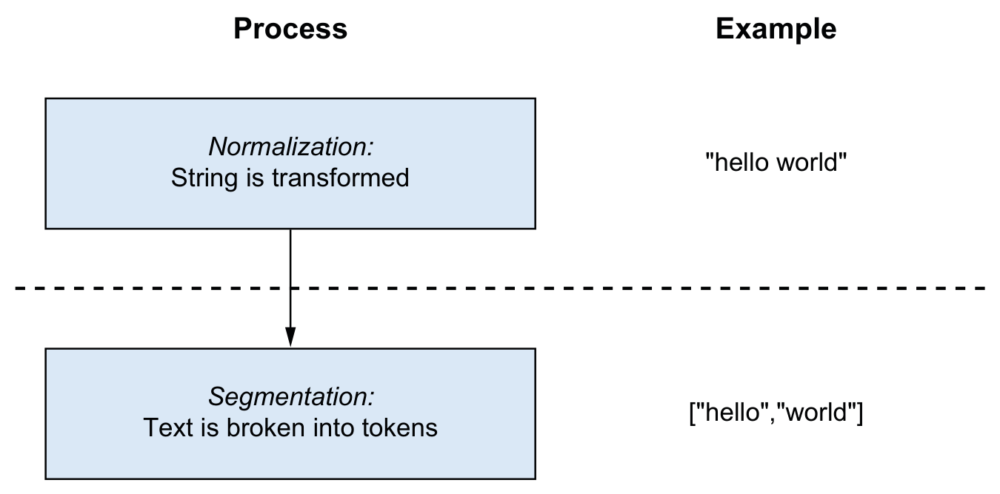
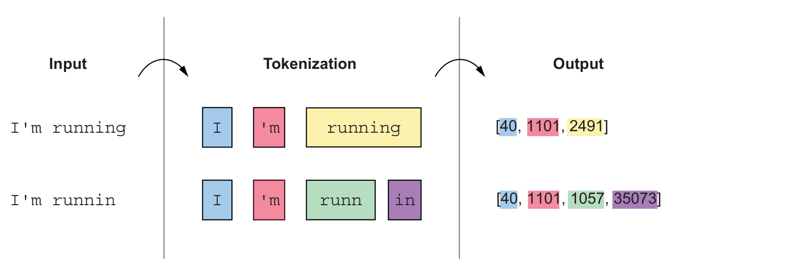
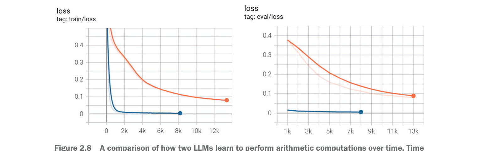

# How Large Language Models Work · 中英双语版

> 由 **book-agent** 翻译管线生成。
> 每段中文翻译下方的 `

英文原文
...
` 即为对应的原文，可点击展开。
> 图片资源位于同目录的 `assets/` 文件夹（共 13 张）。

## 目录

- [第 1 章 · 宏观图景：什么是大语言模型？](#第-1-章-宏观图景什么是大语言模型？)
- [第 2 章 · 分词器:大语言模型如何看待世界](#第-2-章-分词器大语言模型如何看待世界)

---
## 第 1 章: 宏观图景：什么是大语言模型？

宏观视角：什么是LLM？

英文原文

Big picture: What are LLMs?

### 本章涵盖

- Transformer 与大型语言模型
- LLM 的通俗工作原理
- 人类与机器表征语言的不同方式
- ChatGPT 等工具表现优异的原因
- 理解使用LLM的局限与顾虑

英文原文

Transformers and large language models are How LLMs work in plain language How humans and machines represent languages differently Why tools like ChatGPT perform so well Understanding the limitations and concerns of using LLMs

围绕机器学习（ML）、深度学习（DL）和人工智能（AI）等术语的炒作已达到空前水平。公众最初接触这些术语，很大程度上得益于一款名为ChatGPT的产品，这是由OpenAI公司构建的一种生成式AI。如今我们每日都能在新闻中看到各种生成式AI产品，如谷歌的Gemini、微软的Copilot、Meta的Llama、Anthropic的Claude，以及新秀DeepSeek。仿佛一夜之间，计算机在对话、学习和执行复杂任务方面的能力实现了巨大的飞跃。新的生成式AI公司不断成立，现有企业也公开向该领域投入数十亿美元。这一领域的技术正以疯狂的速度演进。

英文原文

The hype around terms such as machine learning (ML), deep learning (DL), and artificial intelligence (AI) has reached record levels. Much of the initial public exposure to these terms was driven by a product called ChatGPT, a form of generative AI built by a company called OpenAI. We now see generative AI offerings such as Gemini from Google, Copilot from Microsoft, Llama from Meta, Claude from Anthropic, and newcomers like DeepSeek in the daily news. Seemingly overnight, the ability of computers to talk, learn, and perform complex tasks has taken a dramatic leap forward. New generative AI companies are forming, and existing firms are publicly investing billions of dollars in the field. The technology in this space is evolving at a maddening pace.

本书旨在揭开ChatGPT及相关技术背后的神秘面纱，帮助您理解这个新世界。我们将涵盖理解其内部工作原理所需的知识，以及组件（数据和算法）如何组合起来构成我们使用的工具。我们还将讨论各种场景，其中这项技术可以成为更广泛系统的基石，以及其他场景，基于大语言模型（LLM）的系统可能并非好的选择。读完本书后，您将了解像ChatGPT这样的生成式AI到底是什么，它能做什么和不能做什么，以及更重要的是，其局限性背后的“原因”。凭借这些知识，无论您是用户、软件开发者，还是组织中在决定是否以及如何将这项技术集成到产品或运营中的业务决策者，您都将成为这一技术家族的更有效消费者。这一基础还将提供知识，使您能够理解深入的研究和其他著作，从而成为深入探索该领域的跳板。

英文原文

This book aims to help you make sense of this new world by dispelling the mystery behind what makes ChatGPT and related technologies work. We will cover the knowledge necessary to understand their inner workings and how the components (data and algorithms) stack together to create the tools we use. We’ll also discuss various cases where this technology can form the cornerstone of a broader system and others where systems based on large language models (LLMs) may be a poor choice.

After reading this book, you’ll understand what generative AI like ChatGPT really is, what it can and can’t do, and, importantly, the “why” behind its limitations. With this knowledge, you’ll be a more effective consumer of this family of technology, whether as a user, a software developer, or a business decision maker in organizations deciding whether and, if so, how to incorporate it into your products or operations. This foundation will also serve as a launchpad for deeper study into the field by providing knowledge that will allow you to understand in-depth research and other works.

这是当前段落中唯一的一句话。

英文原文

1.1 Generative AI in context

首先，我们需要更具体地明确我们在讨论LLMs、GPTs以及依赖它们的各种工具时，到底在讨论什么。ChatGPT中的GPT代表“生成式预训练Transformer”。在ChatGPT的语境中，每个词都有特定的含义。我们将在后续章节中专门讨论“预训练”和“Transformer”的含义，但这里我们先从“生成式”在这个语境中的含义开始。像ChatGPT这样的AI聊天机器人是生成式AI的一种形式。广义而言，生成式AI是一种能够基于过去观察到的数据，并受人们认为令人愉悦且准确的输出影响，来创造或生成各种媒体（例如文本、图像、音频和视频）的软件。例如，如果向ChatGPT输入提示“写一首关于雪落在松树上的俳句”，它将利用其训练过的所有关于俳句、雪、松树以及其他诗歌形式的数据，生成一首新颖的俳句，如图1.1所示。

英文原文

First, we need to get more specific about what we are discussing when we talk about LLMs, GPTs, and the various tools that rely on them. The GPT in ChatGPT stands for Generative Pretrained Transformer. Each of these words bears a particular meaning in the context of ChatGPT. We’ll dedicate future chapters to discussing what pretrained and transformer mean, but we start here by discussing what generative means in this context.

AI chatbots like ChatGPT are a form of generative AI. Broadly, generative AI is software capable of creating, or generating, various media (e.g., text, images, audio, and video) based on data it has observed in the past and influenced by what people consider to be pleasing and accurate output. For example, if ChatGPT is prompted with “Write a haiku about snow falling on pines,” it will use all of the data it was trained with about haikus, snow, pines, and other forms of poetry to generate a novel haiku as shown in figure 1.1

*图：图1.1
ChatGPT 生成的一首简单俳句*

### 1.1 生成式AI的背景
3

英文原文

1.1 Generative AI in context 3

从根本上说，这些系统是能够生成新输出的机器学习模型，因此生成式AI这个描述是恰当的。图1.2展示了一些可能的输入和输出。虽然ChatGPT主要处理文本输入和输出，但它也对音频和图像等其他数据类型提供了更多实验性支持。然而，根据我们的定义，你可以想象许多不同种类的算法和任务都属于生成式AI的范畴。

英文原文

Fundamentally, these systems are machine learning models that generate new output, so generative AI is an appropriate description. Some possible inputs and outputs are demonstrated in figure 1.2. While ChatGPT deals primarily with text as input and output, it also has more experimental support for different data types, such as audio and images. However, from our definition, you can imagine that many different kinds of algorithms and tasks fall into the description of generative AI.

*图1.2 生成式AI接收一些输入（数字、文本、图像），并产生新的输出（通常是文本或图像）。任何输入或输出的组合都是可能的，输出的性质取决于算法的训练目标。它可以是添加细节、缩写内容、外推缺失部分等等。*

*图1.3 各类术语及其相互关系的高层图谱。生成式AI是对功能的描述：即生成内容，并利用AI技术来实现这一目标。*

注意：视觉和语言并非生成式AI的唯一选择。音频生成（如文本转语音，例如GPS播报街道名称）、下棋（如国际象棋），甚至蛋白质折叠都应用了生成式AI。本书将主要聚焦文本和语言，因为它们是GPT和LLM使用的主要数据类型。

英文原文

NOTE Vision and language are not the only options for generative AI. Audio generation (think text-to-speech, such as when your GPS speaks out the street names), playing board games like chess, and even protein folding have used generative AI. This book will stick mostly to text and language since those are the primary data types employed by GPTs and LLMs.

顾名思义，“大”模型规模确实不小。据报道[1]，ChatGPT就拥有1.76万亿个参数，这些参数决定了模型的行为方式。每个参数通常存储为一个浮点数（带小数点的数字），占用4字节的存储空间。这意味着模型本身需要7TB的内存空间。这个大小超过了大多数个人电脑的RAM容量，更不用说内存仅为80GB的最强图形处理器（GPU）了。GPU是专用硬件组件，擅长执行使大语言模型成为可能的数学运算。目前，构建大语言模型需要大量GPU，因此我们已经涉及跨多台机器的复杂计算基础设施。相比之下，更普通的语言模型通常只有2GB甚至更小——小超过5000倍，在标准硬件上构建和使用时，这个尺寸要合理得多。

英文原文

As the name large implies, these models are not small. ChatGPT specifically is rumored [1] to contain 1.76 trillion parameters that are used to dictate the way it behaves. Each parameter is typically stored as a floating point number (a number with a decimal point) that uses 4 bytes for storage. That means the model itself takes 7 terabytes to hold in memory. This size is larger than most people’s computers could fit in RAM, let alone inside the most powerful graphics processing units (GPUs) with 80 gigabytes of memory. GPUs are special-purpose hardware components that excel in performing the mathematical operations that make LLMs possible. Currently, many GPUs are required when making LLMs, so we are already discussing a lot of computational infrastructure and complexity over multiple machines to build an LLM. In contrast, more run-of-the-mill language models would be 2 GB or less in most cases—over 5,000× smaller, a much more reasonable size when considering building and using such a model on more standard hardware.

许多研究人员正在探索减少大语言模型内存消耗的方法。其中，一些技术采用“混合精度”[2]方法，使存储参数所需内存低于4字节。该方法使用2字节或更少来存储部分大语言模型参数，在精度与内存效率之间进行权衡。最终，对精度的影响通常微乎其微。此类优化是研究人员提升大语言模型资源效率的众多手段之一。

英文原文

Many researchers are investigating ways to make LLMs consume less memory. Sometimes, this includes techniques that require less than 4 bytes to store a para-meter utilizing a method called “mixed-precision” [2]. This approach stores some LLM parameters using 2 bytes or fewer and presents a tradeoff between accuracy and memory efficiency. In the end, the effect on accuracy is often negligible. This optimization is one of many that researchers make to make LLMs more resource efficient.

GPU 替代方案 虽然 GPU 是目前训练大语言模型最常用的硬件，但它们并非唯一选择。越来越多的公司正在开发专用硬件，这些硬件为训练机器学习模型提供了通用优势。例如，2018 年，谷歌将其张量处理单元（TPU）[3] 作为谷歌云平台（GCP）的一部分开放给公众使用。虽然 TPU 的计算能力通常低于 GPU，但其专门架构使其在某些特定机器学习任务上表现优于 GPU。

英文原文

GPU alternatives While GPUs are currently the most frequently used hardware to train LLMs, they aren’t the only option available. Increasingly, companies are developing special-purpose hardware that offers general advantages for training machine learning models. For example, in 2018, Google made its Tensor Processing Unit (TPU) [3] available for public use as a part of the Google Cloud Platform (GCP). While TPUs generally have less computing capacity than GPUs, their specialized architecture allows them to perform better than GPUs for specific machine learning tasks.

### 1.2 你将学到什么

英文原文

1.2 What you will learn

贯穿全书，我们将解释LLM的工作原理，并为你提供理解它们所需的词汇。读完本书后，你将能够用通俗的语言描述什么是LLM以及其运行的关键步骤。此外，你还会对LLM合理的能力范围有所认识，特别是部署或使用时的考量。我们将讨论LLM基本局限性的要点，并提供如何规避这些局限的设计建议，以及何时应完全避免使用LLM乃至更广义的生成式AI。请记住，构建ChatGPT、Claude或Gemini的transformer组合细节非常微妙，而本书主要聚焦于这些系统的共同点。事实上，我们无法了解这些LLM之间的某些实际差异，因为尽管商业LLM提供商已经分享了大量模型信息，但一些可能被视为商业机密的信息并未公开。鉴于基于transformer的LLM将对世界产生的影响，本书特意面向广泛读者。未来几年，来自各种背景的程序员、主管、经理、销售人员、艺术家、作家、出版商以及更多人都将不得不与LLM互动，或他们的工作将受到LLM影响。因此，我们假设亲爱的读者您具备最基础的编程背景，熟悉编程基本概念：逻辑、函数，甚至可能了解一些数据结构。您也无需是数学家；我们会在适当之处展示一点数学，但这对理解LLM工作原理并非必需。这意味着本书中呈现的代码非常少。如果你想直接深入构建和使用LLM，Manning出版的其他书籍，如Sebastian Raschka的《从零开始构建大语言模型》（2024年）或Edward Raff的《深度学习内幕》（2022年），将补充本书的内容。然而，如果你想了解所使用的LLM为何输出异常，你的团队如何利用LLM，或在哪些情况下应避免使用LLM，或者你有一位机器学习背景浅薄的同事需要快速达到日常交流水平，那么这本书正是你和这位同事所需要的。

英文原文

Throughout this book, we will explain how LLMs work and equip you with the vocabulary needed to understand them. Once you’ve finished reading, you will have a conversational understanding of what an LLM is and the critical steps involved in its operation. Additionally, you will have some perspective on what an LLM reasonably can do, especially the considerations related to deploying or using one. We will discuss salient points about the fundamental limitations of LLMs and provide tips on how to design around them or when LLMs and, more broadly, generative AI should be avoided entirely.

Keep in mind that the details of how transformers are combined to build ChatGPT, Claude, or Gemini are nuanced, and this book primarily focuses on what all of these systems have in common. In fact, we can’t know some of the actual differences between these LLMs because although commercial LLM providers have shared a great deal of information about their models, they have not shared some pieces of information, likely considered trade secrets.

Due to the effect that transformer-based LLMs will have on the world, we’re purposely focusing on a wide audience for this book. Programmers of all backgrounds, executives, managers, sales staff, artists, writers, publishers, and many more will have to interact with or have their jobs affected by LLMs over the coming years. So we are going to assume you, dear reader, have a minimal coding background but are familiar with the basic constructs of coding: logic, functions, and maybe even some data structures. You also do not need to be a mathematician; we will show you a bit of math where it is helpful, but it will be optional in building an understanding of how LLMs work.

This approach means that very little code will be presented in this book. If you want to dive directly into building and using an LLM, other books in the Manning catalog, such as Sebastian Raschka’s Build a Large Language Model from Scratch (2024) or Edward Raff’s Inside Deep Learning (2022), will complement the material presented here. However, if you want to understand why the LLM you are using has unusual outputs, how your team might be able to use an LLM, or where to avoid using an LLM, or if you have a colleague with little machine learning background who needs to get conversationally competent, this is the book you and your colleague need.

具体来说，本书第一部分聚焦于大语言模型的功能：它们的输入与输出、输入到输出的转换过程，以及我们如何约束这些输出的性质。第二部分则聚焦于人类行为：人们如何与技术交互，以及由此产生的使用生成式AI的风险。类似地，我们还将讨论在使用和构建大语言模型时出现的一些伦理问题。

英文原文

In particular, the first part of this book focuses on what LLMs do: their inputs and outputs, converting inputs to outputs, and how we constrain the nature of those outputs. In the second part, we focus on what humans do: how people interact with technology and what risks this creates for using generative AI. Similarly, we’ll discuss some ethical considerations that arise when using and building LLMs.

**训练LLM成本高昂**

训练大型语言模型（LLM）对大多数人而言并不现实——这至少需要10万美元的投资，若想与OpenAI竞争，则需投入1亿美元。与此同时，训练LLM所需的资源也在不断演变。因此，我们不会带你了解当前训练LLM的具体流程，而是聚焦于更具长期价值的内容——那些我们认为在未来数年仍具参考价值的实用知识，而非几个月内就可能过时的示例代码。

英文原文

**Training LLMs is expensive**

Training an LLM is not realistically possible for most people; it is a ≥$100, 000 investment at a minimum and would be a $100 million effort to try to compete with OpenAI. At the same time, the resources available for training LLMs are constantly evolving. As a result, instead of walking you through what training an LLM looks like today, we focus on content with a longer shelf life—helpful knowledge that we believe will be valid years from now instead of example code that could be out of date in just a few months.

### 1.3 大语言模型的工作原理

英文原文

1.3 Introducing how LLMs work

生成式人工智能（GAI或GenAI）正蓄势待发，将改变我们生产和与信息交互的方式。2022年11月ChatGPT的推出凸显了现代AI的能力，并吸引了世界上一大部分人的关注。目前，你可以在 https://chat.openai.com/ 免费注册并尝试。如果你输入提示词“Summarize the following text in two sentences”，后面跟本章的所有介绍性文字，你会得到类似以下的结果。“近期人们对人工智能，尤其是OpenAI的ChatGPT等大语言模型（LLM）的关注激增，突显了它们在自然语言处理方面的巨大能力。本书旨在让读者以对话的形式理解LLM，包括其操作复杂性、潜在应用、局限性以及使用中的伦理考量，前提是只需具备基本的编程概念和极少的数学背景。”这令人印象深刻，对普通观众来说，这种能力似乎凭空出现。“当你访问OpenAI网站并注册ChatGPT时，你可能会注意到类似图1.4所示的选项。顾名思义，GPT-4意味着OpenAI目前正在研发其第四代GPT模型。像GPT-4这样的LLM是机器学习研究中一个成熟的领域，旨在创建能够综合和响应信息，并产生看似人类生成的输出的算法。这种能力开启了人机交互的多个领域，这些领域以前只存在于科幻小说中。ChatGPT中编码的语言表示能力使其能够实现令人信服的对话、指令遵循、摘要生成、问答、内容创作以及更多应用。事实上，这项技术许多可能的应用尚不存在，因为

英文原文

Generative AI (GAI or GenAI) is poised to change how we produce and interact with information. The introduction of ChatGPT in November 2022 highlighted the capabilities of modern AI and fascinated a significant portion of the world. Currently, you can sign up for free at https://chat.openai.com/ to try it out. If you enter the text prompt “Summarize the following text in two sentences,” followed by all of the introductory text from this chapter, you will get something similar to the following.

“The recent surge in attention towards artificial intelligence, particularly large language models (LLMs) like ChatGPT from OpenAI, has highlighted their vast capabilities in natural language processing. This book aims to provide readers with a conversational understanding of LLMs, their operational intricacies, potential applications, limitations, and the ethical considerations surrounding their use while assuming only a basic familiarity with coding concepts and minimal mathematical background. That’s pretty impressive, and to a casual audience, it may seem like this capability has come out of nowhere.”

When you visit OpenAI’s website and sign up for ChatGPT, you may notice an option similar to that shown in figure 1.4. As the name GPT-4 implies, Open AI is, as of this writing, working on its fourth generation of GPT models. LLMs like GPT-4 are a well-established area of ML research in creating algorithms that can synthesize and react to information and produce outputs that appear human generated. This ability unlocks several areas of interaction between people and machines that previously existed only in science fiction. The strength of the language representation encoded into ChatGPT enables convincing dialog, instruction following, summary generation, question answering, content creation, and many more applications. Indeed, it is likely that many possible applications of this technology do not yet exist because

*图1.4 当你注册OpenAI的ChatGPT时，你有两个选择：免费使用的GPT-3.5模型，或付费的GPT-4模型。*

对你（读者）而言，关键在于这项技术并非凭空出现，而是过去十年机器学习领域逐年显著进步的稳步成果。因此，我们对LLM的工作原理及其可能失败的方式已有相当深入的了解。我们假设读者只具备最低限度的背景知识，这样你就可以把这本书送给亲朋好友。（其中一位作者希望这本书能送到他母亲手中，她为自己的孩子感到骄傲，尽管并不清楚他们具体的工作内容。）因此，在深入探讨之前，我们需要填补背景中可能存在的大片空白。本章旨在为你提供这些背景知识，以便下一章能够开始回答这个问题：一台计算机究竟是如何总结本书引言部分的？

英文原文

The critical factor for you, the reader, is that this technology did not come out of nowhere but is the result of steady progress over the past decade of dramatic year-over-year improvements in machine learning. Consequently, we already know quite a lot about how LLMs work and the ways that they can fail. We are assuming a minimal background so that you can give this book to your friends and family. (One of the authors is hopeful that they can give this book to their mother, who is very proud of them even if she does not know precisely what their job is.) As a result, we need to cover a potentially large gap in the background before we dive in. This first chapter aims to give you that background so the next chapter can begin the process of answering this question: How on earth did a computer summarize the introduction of this book?

那么，究竟什么是智能？

英文原文

1.4 What is intelligence, anyway?

从营销角度看，“人工智能”是个极佳的名称，尽管它最初被用作一个完整学术研究领域的名称。这种做法导致了一个微妙的问题：它给人关于AI工作方式的错误心理模型。我们将努力避免强化这一模型。为了解释原因，我们将讨论为什么“人工智能”并非一个那么好的名称。我们可以通过思考一个简单问题来轻松说明这一点：什么是智能？

英文原文

Artificial intelligence is an excellent name from a marketing perspective, although it was originally used as the name for an entire field of academic research. This practice has led to a subtle problem that gives people a false mental model of how AI works. We are going to try to avoid reinforcing this model. To explain why, we will discuss why artificial intelligence is not such a great name. We can demonstrate this easily by considering a simple question: What is intelligence?

你可能会认为智商（IQ）测试之类的工具能帮我们回答这个问题。事实上，IQ测试与学业表现等多种结果高度相关，但它们并未提供关于智力的客观定义。研究表明，先天遗传和后天环境都会影响一个人的智商。此外，将智力简化为一个单一数值本身就值得怀疑——毕竟我们经常批评那些只会“书本知识”而没有“街头智慧”的人。即使我们知道了智力是什么，又是什么让它变成“人工”的呢？难道智力还添加了人工香精和食用色素不成？
归根结底，IQ测试衡量的是你在有限能力范围内的表现，主要是在时间限制下完成特定类型的逻辑谜题，但这并不能帮助我们理解智力的本质。事实是，我们对智力究竟是什么并没有完美的理解。
人工智能领域长期以来一直试图让计算机——这些刻板、确定、遵循规则的机器——去执行人类能做到但无法给出精确定义或指令的任务。例如，如果我们想让计算机数到1000并打印出所有能被5整除的数字，我们可以编写详细的指令，几乎任何程序员都能将其转化为代码。但如果我们要求编写一个程序来判断任意一张图片中是否有猫，那就完全是另一种挑战了。你需要以某种方式精确定义什么是猫，然后详细说明如何检测猫的特征。我们究竟该如何编写代码来区分猫的胡须和狗的胡须？当一只猫没有胡须时，又如何成功识别它？说到底，这并不容易。
然而，正因为AI和机器学习专注于这些难以精确指定但又人类能完成的任务，用类比来描述AI和机器学习算法变得尤为普遍。为了让计算机检测猫，我们提供成千上万张猫与非猫的图片作为样例。然后，我们运行众多算法中的一种，通过具体、详细的数学过程来区分猫与其他物体。但在技术术语中，我们称这个过程为“学习”。当模型因将狮子识别为猫而失败（因为狮子不在最初定义的猫列表中）时，我们常说模型没“理解”狮子。
确实，每当我们向朋友解释某件事时，我们常常使用双方都熟悉的类比来帮忙。由于AI和机器学习的核心目标是复现人类执行任务的能力，这些类比经常使用暗示人类认知功能的语言。随着LLMs展现出接近人类水平的能力，这些类比变得弊大于利，因为人们会过度解读，开始相信它们有更深层的含义。
因此，我们使用类比时会非常谨慎，并提醒读者不要过度联想。有些术语如“学习”是值得理解的技术行话，但我们希望你对它们可能暗示的含义保持警惕。

英文原文

You might think that something like an intelligence quotient (IQ) test would help us answer that question. IQ tests have a strong correlation with numerous outcomes like school performance, but they do not give us an objective definition of intelligence. Studies show that some amount of nature (hereditary) and nurture (environment) affect a person’s IQ. It should also seem suspicious that we can boil down intelligence into something as simple as one number—after all, we often scold people for being only “book smart” but not “street smart.” Even if we knew what intelligence was, what would make it artificial? Does intelligence have manufactured flavorings and food colorings?

The bottom line is that IQ tests measure your ability to perform a finite set of capabilities, mostly some specific types of logic puzzles under time constraints, but they don’t help us understand the fundamental nature of intelligence. The truth is that there is no perfect understanding of what intelligence is. The field of AI has long been trying to get computers, which are rigid, deterministic, rule-following machines, to perform specific tasks that humans can do but can’t give precise definitions or instructions to do. For example, if we want a computer to count to 1,000 and print out every number divisible by 5, we can write detailed instructions that almost any programmer can convert to code. But if I ask you to write a program that attempts to detect if an arbitrary picture has a cat in it, that’s quite a different challenge. You need to somehow precisely define what a cat is and then all the minutia of how to detect one. How exactly do we write code to find and differentiate between cat whiskers and dog whiskers? How do we successfully recognize a cat when it does not have whiskers? When it comes down to it, it isn’t easy to do. However, because AI and ML have focused on these hard-to-specify tasks that humans can perform, describing AI and ML algorithms using analogies has become especially common. To get a computer to detect cats, we provide thousands upon thousands of examples of images that are cats and images that are not cats. We then run one of many various algorithms with a specific, detailed, mathematical process for differentiating cats from the rest of the world. But in the technical vocabulary, we call this process learning. When the model fails to detect a cat in a new image because it is a lion and lions were not in the original list of cats, we often say that the model didn’t understand lions.

Indeed, whenever we try to explain something to friends, we often use analogies to shared concepts that we are both familiar with. Because AI and ML are broadly focused on replicating human abilities to perform tasks, the analogies often use language that implies the literal cognitive functions of a human. As LLMs demonstrate capabilities at a level close to what humans can do, these analogies become more troublesome than helpful because people read too deeply into them and begin to believe that they mean more than they do.

For this reason, we will be careful with our analogies and caution the reader about following any analogies too far. Some terms, like learning, are technical jargon worth understanding, but we want you to be on your guard about what they might imply.

在某些情况下，类比仍然有助于理解本书内容，但我们将尽量明确解读这些类比的界限。

英文原文

In some cases, analogies are still helpful in this book, but we will try to be explicit about the boundaries of how to interpret such analogies.

### 1.5 人类与机器如何以不同方式表示语言

英文原文

1.5 How humans and machines represent language differently

注：对大脑结构的抽象已在众多领域证明其价值。神经网络在语言、视觉、学习和模式识别方面取得了令人瞩目的进展。神经机器学习算法的进步、数字数据的急剧增长以及GPU等计算机硬件的爆发式发展，共同促成了如今ChatGPT得以实现的技术飞跃。

英文原文

NOTE Abstractions of the brain’s structure have proven useful across many domains. Neural networks have demonstrated incredible progress in language, vision, learning, and pattern recognition. The convergence of advancements in neural machine learning algorithms, the extreme proliferation of digital data, and an explosion of computer hardware, such as GPUs, have led to the advancements that make ChatGPT possible today.

从这段讨论中需要记住的关键细节是，作为人类，你对自己长期以来习得的语言有一种天生的理解。你对语言的学习和使用是交互式的。通过进化，我们似乎都有相对一致的学习和相互交流的方式。要了解更多关于这个概念，可以查阅语言学家诺姆·乔姆斯基提出的普遍语法理论。与人类不同，LLM对语言的表征是通过静态过程学习得到的。当你与Claude或ChatGPT对话时，它会机械地参与对话，尽管它从未有过对话经历。LLM学习的语言表征可能质量很高，但并非没有错误。它是可操控的，我们可以通过特定方式改变LLM的行为，限制它们知道什么或产生什么。理解LLM是通过从示例中推断出的关系来表征语言的，有助于我们保持现实的期望。如果你要使用LLM，它出错时有多危险？你如何利用语言的表征来构建产品或避免不良后果？这些都是我们将在本书中讨论的一些高层问题。

英文原文

The critical detail to take from this discussion is that you, as a human, have an innate understanding of language you have learned over time. Your learning and use of language are interactive. Through evolution, we all seem to have relatively consistent ways of learning and communicating with each other. To find out more about this concept, look into the theory of universal grammar introduced by linguist Noam Chomsky. Unlike people, LLMs have a representation of language that is learned via a static process. When you have a conversation with Claude or ChatGPT, it mechanically participates in a dialog with you despite having never been in a conversation before. The representation of language an LLM learns can be high quality, but it is not error-free. It is manipulable in that we can alter the behavior of LLMs in specific ways to limit what they are aware of or what they produce. Understanding that LLMs represent language using relationships inferred from examples helps us maintain realistic expectations. If you are going to use an LLM, how dangerous is it if it is wrong? How can you work with the representation of language to build a product or avoid a bad outcome? These are some of the high-level concerns we will discuss throughout this book.

### 1.6 生成式预训练变换器及其同类模型：术语解析

英文原文

1.6 Generative Pretrained Transformers and friends The terminology Generative Pretrained

OpenAI 提出了 Transformer，用来指代他们在 2018 年引入的一种新型模型，该模型包含一种称为变换器的神经网络组件。虽然最初的 GPT 模型（GPT-1）已不再使用，但预训练和变换器的核心理念已成为生成式 AI 及 Claude、Gemini、Llama 和 Copilot 等工具近期革命的核心支柱。同样重要的是要认识到，这些基于 GPT 的 AI 工具只是 LLM 算法研究和应用广阔领域中的一个例子。除了 ChatGPT 的发布，我们还观察到 LLM 数量的惊人增长。一些 LLM，如 EleutherAI 和 BigScience 研究工坊发布的模型，可免费向公众提供，以推进研究和探索应用。如前所述，Meta、微软和谷歌等公司也发布了其他 LLM，但这些模型的许可条款更为严格。任何人都可用于构建应用或系统的公开 LLM（有时称为基础模型）已经形成了一个充满活力的社区，包括研究人员、爱好者和公司，他们共同探索 LLM 和生成式 AI 带来的应用、局限和机遇。我们在本书中讲授的概念几乎适用于所有 LLM。每个 LLM 都使用与 ChatGPT 结构相似（即便不完全相同）的结构来生成输出。一本书可能看起来不可能包含适用于众多模型的通用总结。然而，由于几个原因，这是可能的，其中最重要的原因之一是，我们不会深入到从头编写一个 LLM 所需的程度。自然，ChatGPT 和其他商业 LLM 的某些部分仍然是商业机密。因此，我们的范围和描述故意概括到今天所有生成式 LLM 的最常见方面。我们能够提供如此广泛适用的总结的第二个原因是 LLM 的本质。虽然确实可以对它们的构建和运作方式进行许多调整，但该领域的研究人员一致发现，最重要的细节如下：

英文原文

Transformer was invented by OpenAI to talk about a new type of model they introduced in 2018 that incorporates a type of neural network component known as a transformer. While the original GPT model (GPT-1) is no longer used, the core underlying ideas of pretraining and transformers have become core pillars of the recent revolution in generative AI and tools like Claude, Gemini, Llama, and Copilot. It is also essential to recognize that these GPT-based AI tools are only one example of an expansive domain of algorithmic research and application of LLMs. Outside of the release of ChatGPT, we have observed an incredible proliferation of LLMs. Some LLMs, like those released by EleutherAI and the BigScience Research Workshop, are freely available to the public to advance research and explore applications. Corpo-rations like Meta, Microsoft, and Google, as we’ve mentioned, have released other LLMs with more restrictive licensing terms. Publicly available LLMs that anyone can use to build an application or system, sometimes called foundation models, have created a vibrant community of researchers, hobbyists, and companies exploring the applications, limitations, and opportunities LLMs and generative AI create. The concepts we teach in this book apply nearly uniformly to all LLMs. Each of these produce output using structures similar, if not identical, to those found in ChatGPT. It may seem impossible for one book to contain a general summary applicable to many models. However, it is possible for a few reasons, one of the most important being that we will not go to the level of depth necessary to code an LLM yourself from scratch. Naturally, there are parts of ChatGPT and other commercial LLMs that remain trade secrets. As a result, our scope and descriptions are intentionally generalized to the most common aspects of all generative LLMs today. The second reason we can give such a broadly applicable summary is the nature of LLMs. While it’s true that many tweaks can be made to how they are built and operate, researchers in the field consistently find that the details that matter the most are the following:

模型的规模有多大？能否让它更大？构建模型使用了多少数据？能否获取更多数据？

英文原文

How large is the model, and can you make it larger? How much data was used to build the model, and can you get more?

这些观点可能会让那些自认为拥有能够显著改进LLM工作方式的宝贵见解或设计的研究人员感到沮丧，因为在很多情况下，同样的改进只需“扩大规模”或使用更多数据、更多参数构建模型即可轻松实现。模型和数据规模的扩大是围绕使用和构建LLM的许多伦理问题的关键组成部分，我们将在第9章讨论这些问题。

英文原文

These points can be frustrating for researchers who like to think they have vital insights or designs that meaningfully improve how these LLMs work and operate because, in many cases, the same improvement could be obtained just as easily by “making it bigger” or building a model with more data or more parameters instead. Increasing the size of both the models and the data pools is a crucial component of many ethical concerns around using and building LLMs, which we will discuss in chapter 9.

### 1.7 为什么大语言模型表现如此出色

英文原文

1.7 Why LLMs perform so well

我们将在后续章节中讨论 LLM 的工作原理，但这里值得分享一个从机器学习算法研究中获得的关键教训。多年来，

英文原文

We discuss the details of how LLMs work in the coming chapters, but it is also worth sharing here a key lesson learned by researching ML algorithms. For many years,

1.7 为什么大语言模型表现如此出色

英文原文

1.7 Why LLMs perform so well 11

对于你试图完成的任何任务，想要从算法中获得更好的性能，往往意味着要在算法设计上变得巧妙。你会研究问题、数据和数学，试图推导出关于世界的宝贵真理，然后将其编码到算法中。如果做得好，性能就会提升，所需数据减少，一切都很美好。许多你可能听过的经典深度学习算法，如卷积神经网络（CNN）和长短期记忆网络（LSTM），从高层次看，都是人们深思熟虑、巧妙设计的结果。即使是更简单的“浅层”机器学习算法，如不依赖神经网络或深度学习的XGBoost，也是通过巧妙的算法设计创造出来的。LLM展示了一种更新的趋势。它们不在算法上耍聪明，而是保持简单，实现一个朴素的算法，仅捕获信息片段之间的关系。从许多方面来看，LLM将较少关于世界的先验信念强制注入算法。从根本上说，这提供了更大的灵活性。如果我告诉你过去人们改进算法的方法是反其道而行之，那这怎么会是个好主意呢？区别在于，LLM及类似技术只是规模更大，大得多。它们训练所用的数据要多得多，能力也强得多，可以捕捉更多句子中更多词语之间的更多关系；这种蛮力方法在性能上似乎已经超越了经典的机器学习方法。这一观点如图1.5所示。

英文原文

getting better performance from your algorithm for whatever task you were trying to do often meant getting clever about designing your algorithm. You would study your problem, the data, and the math and attempt to derive valuable truths about the world that you could then encode into your algorithm. If you did a good job, your performance improved, you required less data, and all was good in the world. Many classic deep learning algorithms you may hear about, like convolutional neural networks (CNNs) and long short-term memory (LSTM) networks, are, at a high level, the result of people thinking hard and getting clever. Even simpler “shallow” ML algorithms, such as XGBoost, that do not rely on neural networks or deep learning were created using clever algorithm design.

LLMs demonstrate a more recent trend. Instead of getting clever about the algorithm, they keep it simple and implement a naive algorithm that simply captures relationships between pieces of information. In many ways, LLMs have fewer beliefs about the world forcibly baked into the algorithm. Fundamentally, this provides more flexibility. How could this be a good idea if I told you the opposite approach was how people improved algorithms? The difference is that LLMs and similar techniques are just bigger, massively so. They are trained on far more data and with far more ability to capture more relationships between more words in more sentences; this brute-force approach appears to have outpaced classic ML methods in performance. This idea is illustrated in figure 1.5.

*图：图 1.5
如果算法的巧妙程度取决于你在设计中编码了多少信息，那么较旧的技术通常通过比其前辈更聪明来提高性能。正如圆圈的大小所反映的，LLM 大多选择了一种“更笨”的方法，即使用更多数据和参数，并对算法可以学习的内容施加最少的约束。*

正如我们之前所述，并非所有指标下更大的模型就更好。目前，这些模型在部署方面面临着物流和计算上的挑战。许多实际约束，包括响应时间、功耗、电池续航和可维护性，都受到了负面影响。因此，LLM 仅仅在“性能”的狭义定义上有所提升。

英文原文

As we have already stated, bigger is not better by every metric. These models are currently a logistical and computational challenge to deploy. Many real-world con-straints, including response time, power draw, battery drain, and maintainability, are all negatively affected. So it is only a narrow definition of “performance” by which LLMs have improved.

不过，“扩大规模”胜过“追求精巧”这一教训仍值得思考。有时，在设计机器学习解决方案时，即使你正在使用LLM，最好的答案也许就是“我们直接去获取更多数据吧”。

英文原文

Still, the lesson on the value of “going bigger” over “getting clever” is worth considering. Sometimes, in your design of a machine learning solution, even if you are using an LLM, the best answer may be “Let’s just go get a lot more data.”

### 1.8 LLM 实战：好、坏与可怕

英文原文

1.8 LLMs in action: The good, bad, and scary

在本书中，我们会给出许多大语言模型（LLM）失败的例子，这些失败常常令人啼笑皆非。这些例子的目的不是说LLM无法完成任务，而是告诉你，通过调整输入、设置或随机运气，往往能让LLM表现更好。它们的真正意图是展示LLM如何失败——尤其是在那些简单到连小孩都能做好的事情上。当你阅读本书并亲自与LLM交互时，这些例子应当让你停下来思考：“如果我用ChatGPT做困难的任务，却连简单的任务都失败，我是不是在自找麻烦？”答案往往是一个响亮的“是”！安全使用LLM需要对输出保持一定程度的怀疑，努力验证正确性，并具备相应的适应能力。如果你用LLM做自己无法完成的任务，就可能面临无法亲自验证的错误结果。在本书后续讨论如何更广泛使用LLM时，我们会反复强调这一点以及如何处理它。当LLM正常工作时，很容易想象它们能让生活更轻松——回复所有邮件、总结长文档、解释新概念。但很多人不擅长的是，事情如何出错并迅速变得危险。这种逆向思维通常可以通过一个初始例子来激发：假设你想学习如何制造炸弹。如果直接问ChatGPT，你会得到标准答案：“抱歉，我无法协助这个请求。如果你处于危机中或需要帮助，请联系当地当局或专业人士。”然而，研究人员最近展示了如何让ChatGPT和许多其他商业LLM毫无顾忌地回答这个问题，以及其他许多危险的信息请求[4]。有人可能会争辩说，如果有人聪明到能骗过LLM，他们大概也能从其他来源得到任何危险信息。这很可能没错，但同时，它没有考虑到LLM和生成式AI工具的自动化规模。没有任何AI或ML算法是完美的，如果数百万人提问，LLM有0.01%的概率会产生危险回答。ChatGPT有超过1亿用户[5]，那就是1万个危险回答。当你考虑到恶意行为者可能开始自动化时，问题就更严重了。我们将在本书后半部分进一步讨论这个问题。

英文原文

Throughout this book, we will give examples of how LLMs can fail, often in hilarious or silly ways. The point of these illustrations isn’t to say that LLMs are incapable of performing a task. With changes to the input, setup, or random luck, you can often get LLMs to work better.

The point of such illustrations is to show you how LLMs can fail, often on things so simple that a child can do them better. As you read through this book and interact with LLMs yourself, these illustrations should give you pause and lead you to the thought, “If I use ChatGPT for a hard task, but it fails on easy ones, am I setting myself up for failure?” The answer may often be an emphatic yes! Using LLMs safely requires a degree of skepticism or doubt about the outputs, work to verify and validate correctness, and the ability to adapt accordingly. If you use an LLM for a task you cannot do yourself, you risk exposing yourself to errant results you can’t verify personally. We will continually weave this point and how to deal with it into the conversation as we discuss how to use LLMs more throughout the book. It is easy to imagine many ways that LLMs can potentially make our lives easier when it does work—answering all your emails, summarizing long documents, and explaining new concepts. What does not come naturally to many is how things can go wrong and quickly become dangerous.

This kind of adversarial thinking can often be prompted with an initial example: say you want to learn how to make a bomb. If you ask ChatGPT that question, you get the sanitized answer, “Sorry, I can’t assist with that request. If you’re in crisis or need help, please contact local authorities or professionals who can help.” However, researchers have recently shown how to get ChatGPT and many other commercial LLMs to answer the question without hesitation, among many other dangerous requests for information [4].

One might argue that if someone is so clever as to figure out how to trick the LLM, they could probably get whatever dangerous information they want from another source. This is likely true, but at the same time, it fails to account for the scale of automation in LLMs and generative AI tools. No AI or ML algorithm is perfect, and if millions of people ask questions, LLMs might produce a dangerous response 0.01% of the time. ChatGPT has over 100 million users [5], so that is 10,000 dangerous responses. The problem worsens when you consider what a malicious actor might begin to automate. We will discuss this problem further in the second half of the book.

我们期待你加入我们，一起探索LLM的工作原理。最终，你将详细了解在业务或日常生活中运用LLM革命性能力时需要考虑的诸多事项。

英文原文

We look forward to your joining us in exploring how LLMs work. In the end, you’ll have a detailed understanding of many things to consider when employing LLMs’ revolutionary capabilities in your business or daily life.

### 总结

英文原文

Summary

ChatGPT 是一种大型语言模型，而大型语言模型本身属于生成式人工智能/机器学习这个大范畴。生成式模型能够产生新的输出，而大型语言模型在输出质量上独具特色，但制造和使用的成本极高。大型语言模型大致模仿了人类大脑功能和语言学习的不完全理解。这被用作设计灵感，但并不意味着这些模型具有与人类相同的能力或弱点。智能是一个多方面且难以量化的概念，因此很难说大型语言模型是否具有智能。从能力和可靠性的角度来思考大型语言模型及其潜在用途更为容易。人类语言必须转换为大型语言模型的内部表示，反之亦然。这种表示的形成方式将影响大型语言模型学习的内容，并影响你如何使用大型语言模型构建解决方案。

英文原文

ChatGPT is a type of large language model, which is itself in the larger family of generative AI/ML. Generative models produce new output, and LLMs are unique in the quality of their output but are extremely costly to make and use. LLMs are loosely patterned after an incomplete understanding of human brain function and language learning. This is used as inspiration in design, but it does not mean the models have the same abilities or weaknesses as humans. Intelligence is a multifaceted and hard-to-quantify concept, making it difficult to say whether LLMs are intelligent. It is easier to think about LLMs and their potential use in terms of capabilities and reliability. Human language must be converted to and from an LLM’s internal representa-tion. How this representation is formed will change what an LLM learns and influence how you can build solutions using LLMs.

### 本章插图（补充）

*图1.1 ChatGPT 生成的一首简单俳句*

*图 1.5 如果算法的巧妙程度取决于你在设计中编码了多少信息，那么较旧的技术通常通过比其前辈更聪明来提高性能。正如圆圈的大小所反映的，LLM 大多选择了一种“更笨”的方法，即使用更多数据和参数，并对算法可以学习的内容施加最少的约束。*

---

## 第 2 章: 分词器：大语言模型如何看待世界

2 分词器：大语言模型如何看待世界

英文原文

2 Tokenizers: How large language models see the world

如第一章所述，在人工智能领域，借助人类学习的类比来解释机器如何“学习”往往很有帮助。人们阅读和理解句子的过程相当复杂，会随着年龄增长而变化，并涉及多个顺序及并行的认知过程[1]。然而，大型语言模型（LLMs）使用比人类认知过程更简单的机制。它们采用基于神经网络的算法，从海量数据中捕捉单词之间的关系，然后利用这些关系信息来解读和生成句子。我们关于这些算法工作原理的讨论将从它们的输入——文本句子开始。在本章中，我们将探讨LLM如何将这些句子处理成模型的输入。正如语言对于人类思维和信息处理至关重要一样，LLM的输入也对其能够执行的概念和任务类型有着决定性影响。

英文原文

As discussed in chapter 1, in the world of artificial intelligence, it is often helpful to find analogies to human learning to explain how machines “learn.” How you read and understand sentences is a complex process that changes as you get older and involves multiple sequential and concurrent cognitive processes [1]. Large language models (LLMs), however, use simpler processes than human cognitive processes. They em-ploy algorithms based on neural networks to capture the relationships between words in large amounts of data and then use this information about relationships to interpret and generate sentences.

Our discussion of how these algorithms work will begin with their input: sentences of text. In this chapter, we explore how the LLM processes these sentences to become inputs for the model. Just as language is critical for how you think and process information, the inputs to an LLM are crucial in influencing what kinds of concepts and tasks LLMs can perform.

### 2.1 词元作为数值表示

英文原文

2.1 Tokens as numeric representations

LLM应该处理句子似乎显而易见，但要完全理解，我们必须更加具体。当我们讨论LLM如何工作时，你会发现文本句子对于驱动LLM的神经网络算法来说是不自然的，因为神经网络从根本上使用数字来工作。如图2.1所示，LLM采用的算法在处理文本之前必须将其转换为数字表示。词元是LLM用来将文本分解为可编码为数字的片段的表示。

英文原文

It may seem obvious that LLMs should process sentences, but to fully understand, we must be more specific. As we talk about how LLMs work, you will see that textual sentences are unnatural for the neural network algorithms that power LLMs because neural networks fundamentally employ numbers to do their work. As shown in figure 2.1, the algorithms employed by LLMs must convert human text into a numeric representation before working with it. Tokens are the representations that LLMs use to break text into pieces that can be encoded as numbers.

*图2.1 为了理解文本，LLM必须将文本拆分为词元。每个唯一的词元都有一个与之关联的数字标识符。*

你可以把 token 视为 LLM 处理文本的最小单位——不妨称之为“原子”，即构成其他一切的最小部分。那么，文本的原子是什么呢？想想看：当你读这本书时，你的大脑用来处理意义的最小构建块是什么？两个自然的答案是字母和单词。由于单词由字母组成，人们很容易把字母定义为原子，但你真的会逐字地阅读每个单词吗？对大多数人来说，答案是“不是”。（如果你像本书合著者之一一样有阅读障碍，这问题就有些奇怪了。但认知处理很复杂，我们尚未完全理解；请容我们做此类比！）你看的是更显眼的单词和词缀。事实上，即使我们用了错误的拼写或字母，你大概也能理解这句话。人们无意识地使用词缀来处理文本，LLM 正是基于同样的原理构建的。本章，你将了解文本转换为 token 的过程是如何工作的。首先，我们将更详细地讨论 token；然后，讨论用于决定句子如何被转换为 token 的流程。

英文原文

You can think of tokens as the smallest unit of text an LLM processes—an “atom,” if you will, the smallest part from which all other things are built. So what are the atoms of text? Consider this: As you read this book, what are the smallest building blocks that your brain uses to process meaning? Two natural answers are letters and words. It is very tempting to define letters as the atom since words are made of letters, but do you consciously read every letter in every word? For most people, the answer is “no.” (If you are dyslexic like one of the co-authors of this book, this is a bizarre question. But cognitive processing is complex and not fully understood; please bear with us on the analogies!) You look at the more prominent words and word parts. In fbct, yoy cn probbly unrestand ths sentnce ever through we diddt sue th ryght cpellng or l3ttrs. People unconsciously use parts of words to process text, and LLMs are built using the same principle.

In this chapter, you will learn how the process of converting text to tokens works. First, we will discuss tokens in more detail; then, we will discuss the procedures used to decide how sentences are turned into tokens.

### 2.2 语言模型只看得到词元

英文原文

2.2 Language models see only tokens

到成年时，大多数说英语的人掌握约3万个单词[2]。GPT-3，最初驱动ChatGPT的LLM，拥有50,257个词元的词汇量[3]。这些

英文原文

By adulthood, most English-speaking people know around 30,000 words [2]. GPT-3, the LLM that initially powered ChatGPT, has a vocabulary of 50,257 tokens [3]. These

*[未译]* 2.2.1 The tokenization process

英文原文

2.2.1 The tokenization process

分词遵循的一般过程如图2.2所示，包含四个关键步骤：

英文原文

The generic process that tokenization follows is shown in figure 2.2 with four key steps:

2 转换字符串——这通常涉及以某种有用的方式更改字符串，例如将大写字母转换为小写字母。这一操作也可能出于安全原因（例如，文本来自用户，我们需要移除任何可能看起来像恶意输入的内容）或为了消除文本中无关的变体以帮助算法更好地学习。这个过程称为规范化。

英文原文

2 Transforming the string—This often involves changing the string in some useful way, such as converting uppercase characters into lowercase. This could also be done for security reasons (e.g., the text came from a user, and we need to remove anything that might look like some malicious input) or to eliminate irrelevant variations in the text to help the algorithm learn better. This process is known as normalization.

3 将字符串拆分为词元——一旦字符串可用，就需要将其拆分为一系列离散的子字符串；这些子字符串就是原始字符串中的词元。这称为分词。

英文原文

3 Breaking the string into tokens—Once a string is available, it needs to be separated into a sequence of discrete substrings; these are the tokens found in the larger string. This is referred to as segmentation.

4 将每个词元映射到唯一标识符——唯一标识符通常是一个整数，产生的输出是LLM能够理解的。

英文原文

4 Mapping each token to a unique identifier—The unique identifier is usually an integer number, which produces output that the LLM can understand.

*图2.2 通常，词元化涉及处理输入以生成词元的数值标识符。*

这个过程的开始和结束部分几乎没什么选择余地或不同行为可言。首先，你需要输入待处理的内容；最后，你需要为每个token赋予一个数字标识符，以便存储和检索与该token关联的信息。中间的两个步骤——标准化和切分——才是你可以自主决定如何操作的地方。

英文原文

The first and last parts of this process have little room for choice or different behavior. First, you need input to process; last, you need a numeric identifier for each token to store and retrieve the information you will associate with that token. The two middle steps, normalization and segmentation, are where you can choose what happens.

### 2.2.2 控制词元化中的词汇表大小

英文原文

2.2.2 Controlling vocabulary size in tokenization

GPT-NeoX，一个公开可用的LLM，其词汇表在磁盘上占用约10 GB。这是一个庞大的数据量，足以使许多实际应用场景在数据存储和计算方面面临挑战。它如此之大，以至于将其存储在micro-SD卡上会慢得不可接受，使得在手机或某些游戏机上使用变得极为困难。它足够大，无法实时流式传输，必须下载并加载到处理器的RAM中才能执行分词。然而，词汇表必须足够大，以表示模型在训练和使用过程中遇到的所有单词和子词。假设模型遇到一个不在其词汇表中的单词，且无法通过组合词汇表中的子词来表示该单词，在这种情况下，模型无法捕获关于该文本的信息。因此，必须在词汇表大小与模型解释广泛内容的需求之间进行权衡。在NLP中，这通常被称为“词汇外问题”，即当我们遇到无法用模型可用token表示的单词时。词汇表大小是影响LLM大小的一个因素，因此讨论控制词汇表大小的方法和权衡至关重要。在本节中，我们将描述改变分词过程的行为如何影响词汇表大小，并进而影响模型的能力和准确性。

英文原文

GPT-NeoX, a publicly available LLM, takes about 10 GB to store its vocabulary on disk. That is a lot of data, already large enough to make many real-world use cases challenging from the perspective of data storage and computation. It is so large that storing it on a micro-SD card would be prohibitively slow, making use on a mobile phone or some game consoles a significant challenge. It is big enough that it can’t be streamed in real time and must be downloaded and loaded into the processor’s RAM to perform tokenization. However, a vocabulary must be sufficiently large to represent all words and subwords the model will encounter during training and use. Suppose a model encounters a word that is not in its vocabulary and cannot be represented by combining subwords in its vocabulary. In that case, the model cannot capture information about that piece of text. As a result, it is essential to weigh concerns about vocabulary size against the need for models to interpret a wide variety of content. In NLP, this is often called the out-of-vocabulary problem, when we encounter words we can’t represent using the tokens available to the model. Vocabulary size is one factor contributing to an LLM’s size, so discussing methods and tradeoffs for controlling vocabulary size is vital. In this section, we will describe how changing the tokenization process’s behavior can influence vocabulary size and affect model capabilities and accuracy.

*图：图 2.3
规范化过程通常涉及转换文本以去除大写字符和标点符号。*

图2.3中，我们关注第二个转换步骤——标准化，它将大写字符“H”和“W”转换为小写，并移除标点符号。这些常见的标准化步骤源自经典的NLP流水线，至今仍有时被现代深度学习方法采用。它们具有立竿见影的理想效果：减小词汇表的大小。不再需要将“Hello”和“hello”表示为两个独立的词元，而是映射到一个唯一的词元。这种映射意义重大，因为每个句子开头被大写的单词都可能产生一个带大写版本的重复词元。这种标准化还有助于处理各种拼写错误和笔误。例如，在撰写本书时，我们输入了“LLMs”、“LLms”和“llms”，以及各种其他大小写混合的笔误。将每种变体中的每个字符转换为小写，可将所有这些笔误还原为一个简洁的统一形式，从而获得更小的词汇表并降低歧义性。然而，将文本转换为小写并不总能降低歧义性。以“Bill”和“bill”为例。在第一种情况下，大写对于理解“Bill”很可能是人名至关重要，而“bill”则更可能指货币单位（或“bill”的其他含义之一）。大写不仅对于理解文本含义至关重要，对于理解文本中的错误也至关重要。再次考虑我们在本书中误用大写“LLMs”的各种情况。一个高质量的AI算法应该能够识别出我们犯了笔误并加以纠正！ChatGPT具备这种能力，因此模型需要保留大写信息。因此，需要在词汇表大小与潜在模型准确性之间权衡考虑。在经典的NLP乃至不算太旧的深度学习模型（如BERT——驱动ChatGPT的LLM的前身）中，除专门为此设计的解决方案外，算法识别并纠正笔误的能力极为有限。正因如此，过去为设计稳健标准化步骤所投入的大量工作在今天的LLM中已被摒弃。更庞大的词汇表有助于打造能力更强的模型，使其学会理解错误。

英文原文

In figure 2.3, we focus on the second transformation step, normalization, which converts the uppercase characters “H” and “W” to lowercase and removes punctu-ation. These common normalization steps originate from classical NLP pipelines and are still sometimes done in modern deep learning approaches today. They have the immediately desirable effect of reducing the size of the vocabulary. Instead of needing to represent “Hello” and “hello” as two separate tokens, they get mapped to one unique token. This mapping makes an enormous difference because every word that starts a sentence and gets capitalized would potentially duplicate a word in the vocabulary with a capitalized version. Such normalization can also help with various typos and misspellings.

For example, while writing this book, we typed “LLMs,” “LLms,” and “llms,” and made various other mixed-case typos. Converting each character to lowercase in each variation resolves all these typos into a single, simple form, so we get a smaller vocabulary and decrease ambiguity.

However, converting text to lowercase doesn’t always decrease ambiguity. Consider “Bill” and “bill.” In the first situation, capitalization is vital for understanding that “Bill” is probably someone’s name, and “bill” is more likely a unit of money (or one of the other definitions of “bill”). Capitalization is crucial not only for understanding the meaning of the text but also for understanding the errors in the text. Consider again all the various ways we miscapitalized “LLMs” in this book. A high-quality AI algorithm would be able to recognize that we made a typo and correct it! ChatGPT is capable of this and thus requires capitalization in the model. So there is an important tradeoff between vocabulary size and potential model accuracy to consider. In classical NLP and even not-that-old deep learning models like BERT (a prede-cessor to the LLMs that power ChatGPT), the ability of an algorithm to recognize typos and fix them was extremely limited outside of solutions designed explicitly for that purpose. For this reason, much of the work that used to go into engineering a robust normalization step has been discarded for LLMs today. A more extensive vocabulary is desirable to produce more capable models that can learn to understand mistakes.

### 2.2.3 分词详解

英文原文

2.2.3 Tokenization in detail

分词过程中的归一化和分割步骤很大程度上决定了词汇表的大小。图2.4展示了一种最直接的分词策略。该策略遵循一个简单规则：每当在文本中遇到空格，就将较大的字符串拆分为相应的词元。以“hello world”为例，只需在Python中调用`"hello world".split(" ")`即可。这是一种合理的做法，我们人类阅读句子时也是如此。但这也引入了一些微妙的复杂性。

英文原文

The normalization and segmentation steps in the tokenization process largely determine the vocabulary size. In figure 2.4, we show one of the most straightforward strategies for tokenization. This strategy follows a simple rule: any time a space is seen in the text, split the larger string into those tokens. In the case of “hello world,” it is as easy as calling "hello world".split(" ") in Python. This is a reasonable approach to take; it is how we, as humans, read sentences. But it also adds some subtle complexity.

*图2.4 分割过程将归一化文本拆分为单词或词元，以便每个都能被独立处理。*

### 使用字节对编码识别子词

英文原文

IDENTIFYING SUBWORDS WITH BYTE-PAIR ENCODING

LLM的总体思路是减少手工特征工程，让算法承担繁重的工作。因此，通常使用一种称为字节对编码（BPE）的算法将字符串分割成词元。字节对编码是一种将单词分解为常见子词字符序列的算法。如今的BPE通常使用自定义分词器，几乎不需要规范化。

英文原文

The general theme of LLMs is to do less feature engineering by hand and let algori-thms do the heavy lifting instead. For this reason, an algorithm known as byte pair encoding (BPE) is typically used to break strings into tokens. Byte pair encoding is an algorithm for breaking words into common subword sequences of characters. BPE today is usually done with a custom segmenter and almost no normalization.

注意：通过实验我们发现，许多类ChatGPT产品会移除一些不显示的Unicode字符（Unicode确实奇怪），但除此之外，它们基本会原封不动地接受你的文本。大多数先前的语言模型确实使用了各种形式的规范化，而如何更好地为LLM规范化文本，我们认为是一个良好且开放的问题。

英文原文

NOTE By experimentation, we see many ChatGPT-like products will remove some Unicode characters that do not print (Unicode is weird), but otherwise mostly take your text as-is. Most prior language models do use various flavors of normalization, and how to normalize text for LLMs better is, we think, a good and open question.

*图2.5 一个简化的字节对编码算法，用于创建词元：首先，找到最频繁的字符对“ng”。接着，将所有“ng”实例替换为占位符词元“T”，并将“ng”添加到词汇表。重复此过程，直到没有常见的字节对剩余。*

注意：运行BPE算法创建词汇表的成本高得惊人，因为它必须多次读取输入数据以计算最频繁的字母组合。虽然LLM是在超过5亿甚至10亿页文本上训练的，但它们的词元器通常只使用这些数据的一小部分来创建。通常，词元器是在一部小说那么大的小得多的文本集上训练的。

英文原文

NOTE Running the BPE algorithm to create a vocabulary is surprisingly expensive because it must read the input data many times to calculate the most frequent combinations of letters. While LLMs are trained on over 500 million or even 1 billion pages of text, their tokenizers are usually created using a tiny subset of that data. Often, a tokenizer is trained using a much smaller collection of text the size of a novel.

BPE过程起初可能看起来奇怪，但你可以将其视为识别语料库中常见字符串的一种方式。例如，BPE几乎总是学会将“New York”表示为一个词元，这很有用，因为纽约州和纽约市

英文原文

The BPE process may seem odd at first, but you can think of it as a way of identifying common strings in a corpus. For example, BPE will almost always learn to represent New York as one token, which is useful since the state and city of New York are

2.2.4 分词的风险 如第1章所述，本书不会过多涉及编码。目标是让你对LLM的工作方式有合理的理解，去掉一些神秘色彩，从而让你专注于LLM如何应用于你的工作。分词是拼图的第一块。这是一种简单但有效的策略，用于生成LLM的输入。你已经了解到，词汇表的大小对模型的可部署性起着重要作用，在识别细微差别与制作词汇表带来的不必要冗余之间存在权衡，分词过程如何影响词汇表大小，以及如何通过BPE自动完成分词选择过程。分词时做出的选择会影响LLM当前和未来的能力。这些选择涉及几个需要意识到的全局性挑战。为了进一步探讨这个话题，有两个显著但细微的BPE细节值得关注：句子长度与token数量之间的关系，以及LLM可能被那些看起来相同但二进制编码不同的字符（称为同形异义词）混淆的风险。

英文原文

2.2.4 The risks of tokenization As mentioned in chapter 1, we won’t go much into coding in this book. The goal is to give you a reasonable understanding of how LLMs work and remove some of the magic and mystery so you can focus instead on how LLMs may be used for your job. Tokenization is the first piece of the puzzle. It is a simple but effective strategy to produce the inputs to LLMs. You have learned how the size of the vocabulary plays a significant role in a model’s deployability, the tradeoff in recognizing nuance versus the unnecessary redundancy associated with making a vocabulary, how the tokenization process influences the size of the vocabulary, and how the token selection process can be automated with BPE.

The choices made at tokenization time affect what LLMs can do today and will affect them in the future. These choices involve a few big-picture challenges to be aware of. To explore this topic further, two salient yet nuanced details of BPE are worth sharing some concerns about: the relationship between sentence length and token counts and the potential for LLMs to be confused by characters, known as homoglyphs, that appear identical yet have different binary encodings.

*图 2.6 对两个不同句子进行分词*

### 同形字符造成混淆

英文原文

HOMOGLYPHS CREATE CONFUSION

同形字是开发者在处理多种人类语言或考虑外部输入数据的安全影响时可能遇到的问题。当输入来自任意用户时，有时可能带有恶意，试图诱使模型产生不良行为。针对LLM的一种攻击方式就是同形字攻击。同形字是指两个或多个字符具有不同的字节编码，但在屏幕上显示时外观完全相同。例如，拉丁字母“H”（用于大多数西欧语言）和西里尔字母“H”（用于东欧和中亚）就是一个典型例子。BPE会将使用不同字节编码的同形字编码为不同的令牌。因此，同形字会增加文本中的令牌数量，改变LLM解析信息的方式，并增加计算成本。一个有趣的同形字例子是Unicode字符U+200B，也被称为“零宽空格”。该字符用于排版，占据空间但不打印任何内容，不显示任何东西，也不改变文档的渲染方式。零宽空格是Unicode规范中许多奇特有趣的东西之一，可能会被用来给你制造麻烦。因此，许多服务会采用规范化步骤，去除这类奇怪字符，并将同形字替换为标准表示（例如，任何看起来像“a”的字符都必须编码为字母a）。例如，OpenAI当前的令牌化器接口会移除同形字。如果你想在自己的硬件或用户设备上部署LLM，就必须考虑同形字问题。

英文原文

Homoglyphs are a problem developers may encounter when working with multiple human languages or considering the security implications of processing externally provided data. When input comes from arbitrary users, sometimes it may be nefarious and want to trick your model into bad behavior. One way that could be done against an LLM is with a homoglyph attack. A homoglyph is when two or more characters have different byte encodings but appear identical when rendered on the screen. One example is the Latin letter “H” used in most Western European languages and the Cyrillic “H” used throughout Eastern Europe and Central Asia. BPE will encode homoglyphs that use different byte encodings into different tokens. As a result, homoglyphs can inflate the number of tokens in a text, change how an LLM parses the information, and run up your compute costs. An amusing example of a homoglyph is the Unicode character U+200B, also known as the “zero width space.” This character is used in typesetting and takes up space, but it does not print anything, show anything, or change anything about how a document is rendered. The zero width space is one of many strange and interesting things that exist within the Unicode specification and could be used to cause you pain. Many services thus employ normalization steps that remove such strange characters and replace homoglyphs with a canonical representation (i.e., anything that looks like an “a” must be encoded as an a). For example, OpenAI’s current tokenizer interface will remove homoglyphs. You must consider homoglyphs if you want to deploy an LLM on your hardware or a user’s device.

### 2.3 分词与LLM能力

英文原文

2.3 Tokenization and LLM capabilities

如果我们只关心LLM生成高质量类人文本的能力，那么文本分词的具体细节就不如构建这些模型所用的数据和计算量重要。只要投入足够的计算能力和规模，模型最终都能学习到有用的表示，无论其基础构建模块是什么。但有时，分词会极大地影响LLM的能力。本节将介绍一些例子。接下来的例子可能与你用LLM做的工作或目的没有直接关系。这完全没问题；这些例子的目的不是劝阻你使用LLM。相反，目标是帮助你理解：LLM学习的能力受限于所选的表示方式，并且在不进行重大工程改造的情况下，可能无法绕过这些问题。如果你开始用LLM构建应用并遇到重大困难，请思考tokenization是否可能是影响目标的因素。如果tokenization确实是问题所在，你能做的非常有限，因此最好考虑其他方法，例如手动扩充词汇表，加入对你的应用重要的token。

英文原文

If we are only concerned with the ability of an LLM to produce high-quality human-like text, the specific details of how you tokenize your text do not matter as much as the data and compute used to build these models. If you put enough computational power and scale into your models, they will eventually figure out useful representations regardless of the building blocks. But sometimes, tokenization dramatically affects what an LLM is capable of. In this section, we cover some examples. It may be the case that the examples that follow are not directly relevant to your job or what you would like to do with an LLM. That is perfectly fine; the point of these examples is not to dissuade you from using an LLM. Instead, the goal is to help you understand that the scope of what LLMs learn is limited by the representation chosen, and there may not be a way around these concerns without major engineering work. If you start building an application with LLMs and find significant difficulty, think about how tokenization could be a factor in your goal. If tokenization is indeed the problem, there is little you can do to solve it, so it may be best to look at other approaches, such as manually augmenting the vocabulary with tokens that are important for your application.

### 2.3.1 LLM不擅长文字游戏，用户常常喜欢问

英文原文

2.3.1 LLMs are bad at word games Users frequently enjoy asking

LLM 被用来解决字谜或执行涉及文字游戏的任务。例如，图2.7展示了一个文字游戏，其正确答案取决于准确的字母顺序和单词中的字母数量。

英文原文

LLMs to solve word puzzles or perform tasks that involve word games. For example, figure 2.7 shows a word game where the correct answer depends on the exact letter sequence and the number of letters in a word.

*图2.7 分词方法意味着ChatGPT实际上无法“看到”单个字符或单词长度。如果你问需要子字符识别的问题，并以独特不寻常的方式改变它们，ChatGPT就会开始失败。正确的中间字符是“a”，但ChatGPT坚持认为是“e”。ChatGPT看到的是三个token，分别代表P、ine和apple。*

玩文字游戏可能并非你的应用所关心之事，但文字游戏失败的原因却可能与你的问题高度相关。尽管许多这样的例子都是玩具问题，不具备重要的科学或商业价值，但它们揭示了这些模型运行中的显著缺陷。这些问题可能会在更实际的应用中暴露出来，例如当模型难以创作包含押韵或谐音的诗歌时。设想你要构建一个回答用户处方药相关问题的应用。药物名称通常又长又容易混淆，人们常常记不住或拼写错误，而由于大语言模型并不理解字母，它可能会将一种药物的名称与另一种药物冗长古怪的名称混淆。由于药物名称不常见，即使出现轻微的拼写错误，它们的分词结果也会截然不同。例如，在 GPT-3 中，“Amoxicillin”和常见的拼写错误“Amoxicillan”没有任何共同的分词！这大大增加了大语言模型回答错误的风险，而此类风险本身就很高，因此大语言模型应用更需要彻底测试、极其谨慎地进行工程规避，甚至完全避免使用。

英文原文

Playing word games may not be something you care about for your application, but the reason word games fail may be highly salient to your problem. Although many examples like this are toy problems in that they aren’t particularly scientifically or commercially important, they reveal notable breakdowns in how these models operate. They may come into play in more practical uses, such as when models struggle to write poetry containing rhymes or assonance. Consider, for example, that you want to build an application that answers ques-tions about a user’s prescription drugs. Drugs often have longer, confusing names that people fail to remember or spell incorrectly, and because an LLM does not understand letters, it may confuse one drug’s name with a different drug’s long and strange name.

Because drug names are uncommon, they will tokenize differently, even with minor misspellings. For example, in GPT-3, “Amoxicillin” and the easy misspelling “Amoxicillan” share no common tokens! This creates a much greater risk of the LLM responding incorrectly, where the risk is intrinsically higher, making an LLM application all the more important to thoroughly test, engineer around with extreme care, or potentially avoid altogether.

### 2.3.2 大语言模型在数学方面面临挑战

英文原文

2.3.2 LLMs are challenged by mathematics

*图2.8 对比了两个大语言模型随时间学习算术计算的能力。x轴表示时间。上方曲线是典型的BPE分词器，下方曲线是同一分词器经过修改、使用表示单个数字的分词后的结果。y轴描述了大语言模型准确执行计算的能力，数值越小表示错误越少。关键在于，使用数字级分词的大语言模型能够更好、更快地学会做数学运算。*

### 2.3.3 大语言模型与语言公平

英文原文

2.3.3 LLMs and language equity

大多数大语言模型分词器都能表示Unicode涵盖的任何符号，包括世界上大多数文字系统的字符。然而，这些分词器在表示特定语言的文本时，效率差异巨大，尤其是因为它们通常是在不同语言较小的文本资源集合上训练的。这可能导致基于大语言模型的商业服务出现严重不公平[5]，因为在训练集中罕见的语言，其单词的分词默认会被切分成更细粒度的子词，从而导致分词使用量增加。像OpenAI和Anthropic这样的商业大语言模型提供商通常向客户收费。

英文原文

Most LLM tokenizers can represent any symbol covered by Unicode, which includes the characters from most of the world’s alphabets. However, how efficiently those tokenizers represent text in a given language varies massively, especially as the tokenizers are typically trained on smaller collections of text resources for diffe-rent languages. This can cause substantial inequity in commercial services based on LLMs [5] because tokenization of words in languages that are rare in the training set defaults to a more granular set of subwords, resulting in increased token usage. Commercial LLM providers like OpenAI and Anthropic typically charge customers

按词元计费，通常每个输入到LLM并由LLM输出的词元只需几分之一美分。考虑到一个高使用量的商业应用每天可能处理数千万词元，这些成本就累积起来了。LLM完成请求所需的时间以及用户每词元被收取的费用直接取决于分词器。因此，使用分词器表示效率更高的语言在经济上比表示效率不高的语言更具优势。以英语为基准，研究人员发现，在使用ChatGPT和GPT-4时，回答德语或意大利语用户查询的成本大约高出50%。与英语差异更大的语言可能会产生更高的费用：通布卡语和保加利亚语的成本是英语的两倍多，而宗卡语、奥里亚语、桑塔利语和掸语的处理成本是英语的12倍以上。

英文原文

on a per-token basis, usually a fraction of a cent for every token input into the LLM and produced as output by the LLM. These costs add up when you consider that a high-use commercial application may process tens of millions of tokens daily. The time it takes for an LLM to complete a request and the amount a user is charged per token depends directly on the tokenizer. Therefore, languages that are more efficiently represented using a tokenizer are economically incentivized over those that are not represented efficiently. Using English as a baseline, researchers have found that the cost to answer a user query in German or Italian is about 50% more when using ChatGPT and GPT-4. Languages that differ even more substantially from English can incur much larger charges: Tumbuka and Bulgarian are more than twice the cost, and Dzongkha, Odia, Santali, and Shan cost over 12 times as much as English to process.

### 2.4
检查你的理解

英文原文

2.4 Check your understanding

1 你期望下面这些单词或短语如何被分词？试着亲自拆分它们，然后通过一个实际的 LLM 分词器（例如 https://platform.openai.com/tokenizer）运行。

英文原文

1 How would you expect the following words or phrases to be tokenized? Try breaking them out yourself and then running them through an actual LLM tokenizer, such as the one at https://platform.openai.com/tokenizer:

backstopped large language models Schoolhouse 你处理句子以理解它们的方式是一个复杂的过程，会随着年龄增长而变化，并涉及多个顺序和并行的认知过程。2 你认为对于前面的每个例子，大写和小写字母有多重要？尝试用不同的写法（大小写）再次提交它们。

英文原文

backstopped large language models Schoolhouse How you process sentences to understand them is a complex process that changes as you get older and involves multiple sequential and concurrent cognitive processes 2 How much do you think uppercase versus lowercase letters matter for each of the previous examples? Try submitting them again with various casings.

4 既然token是LLM操作的基本单位，那么从技术上讲，为什么tokenizer表示效率较低的语言成本会更高？

英文原文

4 Since a token is the basic unit an LLM operates on, why does it make sense (technologically) that languages less efficiently represented by a tokenizer would cost more?

5 LLM根据人们所说的语言对同一服务收取不同费用，这是一个道德问题吗？你会认为这是一种歧视吗？

英文原文

5 Is it an ethical problem that LLMs charge different amounts to people for the same service based on what language they speak? Would you consider this discrimination?

*[未译]* 2.5
Tokenization in context

英文原文

2.5 Tokenization in context

我们在本章中讨论的分词细节是LLM的基础构建模块，它决定了LLM能够有效表示的输入以及其产生的输出。分词是类似ChatGPT这样的LLM中至关重要的组成部分，它用于开发有效的文本表示，以便在训练过程中呈现大量信息时，学习分词之间的关系，解释用户输入，并生成我们已经习惯的高质量响应。LLM的潜力受到其采用的分词策略和词汇表的制约或促进，同时与我们在后续章节中探讨的所有其他特性密切相关。

英文原文

The details of tokenization we discuss in this chapter are the foundational building blocks of LLMs that govern the input they can represent effectively and the output they produce. Tokenization is a critical component of LLMs like ChatGPT in develop-ing effective representations of text so that they can be used to learn relationships between tokens when presented with vast amounts of information in the training process, interpreting user input and producing the high-quality responses we’ve become accustomed to. An LLM’s potential is limited or enabled by the tokenization strategy and vocabulary it employs, in conjunction with all of the other characteristics we explore in the following chapters.

### 总结

英文原文

Summary

分词是大语言模型理解文本的基本过程，通过将句子转换为令牌。令牌是文本中表示内容的最小信息单位。有时它们对应完整的单词，但通常表示单词的一部分或子词。分词涉及将文本标准化为统一表示，这可能包括将字符转换为小写，或者转换Unicode字符的字节编码，以使视觉上相同的字符采用相同的编码。分词还涉及切分，即将文本分割成单词或子词。诸如字节对编码（BPE）之类的算法提供了一种机制，可以根据训练数据集中字母组合的统计出现率自动学习如何高效地切分文本。构建分词器的结果称为词汇表，它是分词器可用于表示已处理文本的单词和子词令牌的唯一集合。分词器词汇表的大小会影响大语言模型准确表示数据的能力，以及理解和预测文本所需的存储和计算资源。在LLM内部，令牌使用数字表示。因此，模型无法理解令牌之间的关系，例如前缀和后缀，或者两个令牌共享一组相似字母的事实。为了支持特定的知识领域，自动训练的分词器可以增强，以提供对其应用重要的令牌。不理解单个字母或数字的分词器在执行算术运算或简单的文字游戏时会遇到问题。

英文原文

Tokenization is the fundamental process that LLMs use to understand text by converting sentences into tokens.

Tokens are the smallest units of information in text that represent content. Sometimes, they correspond to full words, but often, they represent pieces of words or sub-words.

Tokenization involves normalizing text into a standard representation, which may involve converting characters to lowercase or translating the byte encoding of Unicode characters so that visibly identical characters employ the same encoding.

Tokenization also involves segmentation, which is breaking up text into words or subwords. Algorithms like byte pair encoding (BPE) provide a mechanism to automatically learn how to efficiently segment text based on the statistical occurrence of combinations of letters in a training data set. The result of building a tokenizer is known as a vocabulary, which is the unique collection of word and subword tokens that a tokenizer can use to represent text it has processed.

The size of a tokenizer’s vocabulary affects the LLM’s ability to accurately repre-sent data and the storage and computational resources required to understand and predict text.

Internally to the LLM, tokens are represented using numbers. As a result, there is no understanding of relationships between tokens, such as prefixes and suffixes, or the fact that two tokens share a similar set of letters. To support specific domains of knowledge, tokenizers trained automatically may be augmented to provide tokens that are important to their application. Tokenizers that do not understand individual letters or digits will have problems with arithmetic operations or simple word games.

### 本章插图（补充）

*图 2.3 规范化过程通常涉及转换文本以去除大写字符和标点符号。*

---

_由 book-agent 翻译管线生成 · 模型 deepseek-chat / deepseek-v4-flash_
