# How Large Language Models Work · 中英双语版

> 由 **book-agent** 翻译管线生成。
> 每段中文翻译下方的 `<details><summary>英文原文</summary>...</details>` 即为对应的原文，可点击展开。
> 图片资源位于同目录的 `assets/` 文件夹（共 84 张）。

## 目录

- [第 1 章 · 宏观图景：什么是大语言模型？](#第-1-章-宏观图景什么是大语言模型？)
- [第 2 章 · 分词器:大语言模型如何看待世界](#第-2-章-分词器大语言模型如何看待世界)
- [第 3 章 · Transformer 架构:输入如何转换为输出](#第-3-章-transformer-架构输入如何转换为输出)
- [第 4 章 · LLM 如何学习](#第-4-章-llm-如何学习)
- [第 5 章 · 如何约束 LLM 的行为](#第-5-章-如何约束-llm-的行为)
- [第 6 章 · 超越自然语言处理](#第-6-章-超越自然语言处理)
- [第 7 章 · LLM 的误解、局限与新兴能力](#第-7-章-llm-的误解、局限与新兴能力)
- [第 8 章 · 用大语言模型设计解决方案](#第-8-章-用大语言模型设计解决方案)
- [第 9 章 · 构建与使用 LLM 的伦理](#第-9-章-构建与使用-llm-的伦理)

---
## 第 1 章: 宏观图景：什么是大语言模型？

宏观视角：何为LLM？

<details>
<summary>英文原文</summary>

Big picture: What are LLMs?

</details>

### 本章涵盖

- GPT (Generative Pretrained Transformer) 与大语言模型究竟是什么
- LLM 的通俗工作原理
- 人类与机器在语言表征方式上的根本差异
- ChatGPT 等工具表现优异的原因
- 理解使用LLM的局限性和顾虑

<details>
<summary>英文原文</summary>

Transformers and large language models are How LLMs work in plain language How humans and machines represent languages differently Why tools like ChatGPT perform so well Understanding the limitations and concerns of using LLMs

</details>

关于机器学习（ML）、深度学习（DL）和人工智能（AI）等术语的热潮已达到历史最高水平。公众最初接触这些术语，很大程度上得益于一款名为ChatGPT的产品，这是由OpenAI公司构建的一种生成式AI。现在，我们每天都能在新闻中看到各种生成式AI产品，例如谷歌的Gemini、微软的Copilot、Meta的Llama、Anthropic的Claude，以及像DeepSeek这样的新秀。仿佛一夜之间，计算机对话、学习和执行复杂任务的能力实现了巨大飞跃。新的生成式AI公司不断涌现，现有企业也在公开向该领域投入数十亿美元。这一领域的技术正以令人疯狂的速度演进。

<details>
<summary>英文原文</summary>

The hype around terms such as machine learning (ML), deep learning (DL), and artificial intelligence (AI) has reached record levels. Much of the initial public exposure to these terms was driven by a product called ChatGPT, a form of generative AI built by a company called OpenAI. We now see generative AI offerings such as Gemini from Google, Copilot from Microsoft, Llama from Meta, Claude from Anthropic, and newcomers like DeepSeek in the daily news. Seemingly overnight, the ability of computers to talk, learn, and perform complex tasks has taken a dramatic leap forward. New generative AI companies are forming, and existing firms are publicly investing billions of dollars in the field. The technology in this space is evolving at a maddening pace.

</details>

本书旨在通过揭开ChatGPT及相关技术背后的神秘面纱，帮助您理解这个新世界。我们将介绍理解其内部工作原理所需的知识，以及组件（数据和算法）如何堆叠在一起，构建出我们使用的工具。我们还将讨论各种案例，其中这项技术可以作为更广泛系统的基石，以及其他情况下基于大语言模型（LLM）的系统可能并非最佳选择。阅读本书后，您将理解像ChatGPT这样的生成式AI到底是什么，它能做什么和不能做什么，以及重要的是，其局限性背后的“原因”。掌握这些知识后，无论是作为用户、软件开发者，还是作为组织中决定是否以及如何将其融入产品或运营的业务决策者，您都将成为这类技术的更有效使用者。这一基础也将为您深入学习该领域提供跳板，帮助您理解深入的研究和其他著作。

<details>
<summary>英文原文</summary>

This book aims to help you make sense of this new world by dispelling the mystery behind what makes ChatGPT and related technologies work. We will cover the knowledge necessary to understand their inner workings and how the components (data and algorithms) stack together to create the tools we use. We’ll also discuss various cases where this technology can form the cornerstone of a broader system and others where systems based on large language models (LLMs) may be a poor choice. After reading this book, you’ll understand what generative AI like ChatGPT really is, what it can and can’t do, and, importantly, the “why” behind its limitations. With this knowledge, you’ll be a more effective consumer of this family of technology, whether as a user, a software developer, or a business decision maker in organizations deciding whether and, if so, how to incorporate it into your products or operations. This foundation will also serve as a launchpad for deeper study into the field by providing knowledge that will allow you to understand in-depth research and other works.

</details>

### 1.1 生成式AI的背景

<details>
<summary>英文原文</summary>

1.1 Generative AI in context

</details>

首先，我们需要更具体地明确，当我们谈论LLM、GPT以及依赖它们构建的各种工具时，我们究竟在讨论什么。ChatGPT中的GPT代表“生成式预训练Transformer”。在ChatGPT的语境中，每个单词都有特定含义。我们将在后续章节专门讨论“预训练”和“Transformer”的含义，但这里我们先从“生成式”在上下文中的含义开始讨论。像ChatGPT这样的AI聊天机器人是生成式AI的一种形式。广义上，生成式AI是指能够基于过去观察到的数据，并受人们认为愉悦和准确输出的影响，创建或生成各种媒体（如文本、图像、音频和视频）的软件。例如，如果向ChatGPT输入提示“写一首关于雪落松树的俳句”，它就会利用其训练数据中关于俳句、雪、松树及其他诗歌形式的所有信息，生成一首新颖的俳句，如图1.1所示。

<details>
<summary>英文原文</summary>

First, we need to get more specific about what we are discussing when we talk about LLMs, GPTs, and the various tools that rely on them. The GPT in ChatGPT stands for Generative Pretrained Transformer. Each of these words bears a particular meaning in the context of ChatGPT. We’ll dedicate future chapters to discussing what pretrained and transformer mean, but we start here by discussing what generative means in this context. AI chatbots like ChatGPT are a form of generative AI. Broadly, generative AI is software capable of creating, or generating, various media (e.g., text, images, audio, and video) based on data it has observed in the past and influenced by what people consider to be pleasing and accurate output. For example, if ChatGPT is prompted with “Write a haiku about snow falling on pines,” it will use all of the data it was trained with about haikus, snow, pines, and other forms of poetry to generate a novel haiku as shown in figure 1.1

</details>

*图：图1.1
ChatGPT生成的一首简单俳句*

<details>
<summary>英文原文</summary>

[Figure]

Figure 1.1 A simple haiku generated by ChatGPT

</details>

### 1.1 生成式AI的上下文

<details>
<summary>英文原文</summary>

1.1 Generative AI in context 3

</details>

从根本上说，这些系统是生成新输出的机器学习模型，因此生成式AI是一个恰当的描述。图1.2展示了一些可能的输入和输出。虽然ChatGPT主要处理文本输入和输出，但它也实验性地支持其他数据类型，如音频和图像。然而，根据我们的定义，你可以想象许多不同类型的算法和任务都属于生成式AI的范畴。

<details>
<summary>英文原文</summary>

Fundamentally, these systems are machine learning models that generate new output, so generative AI is an appropriate description. Some possible inputs and outputs are demonstrated in figure 1.2. While ChatGPT deals primarily with text as input and output, it also has more experimental support for different data types, such as audio and images. However, from our definition, you can imagine that many different kinds of algorithms and tasks fall into the description of generative AI.

</details>

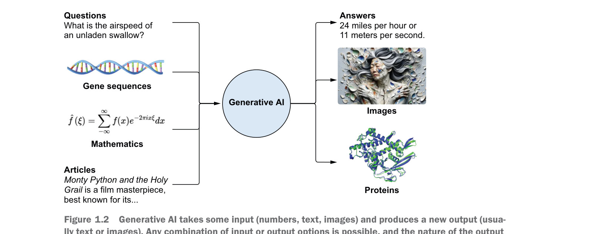

*图1.2 生成式AI接收输入（数字、文本、图像），并生成新的输出（通常是文本或图像）。输入和输出的任意组合都是可能的，输出的性质取决于算法训练的目的。它可以是添加细节、将内容改写得更简短、推断缺失部分等。*

<details>
<summary>英文原文</summary>

[Figure]

Figure 1.2 Generative AI takes some input (numbers, text, images) and produces a new output (usua-lly text or images). Any combination of input or output options is possible, and the nature of the output depends on what the algorithm was trained for. It could be to add detail, rewrite something to be shorter, extrapolate missing portions, and more.

</details>

再深入一层，ChatGPT处理的是人类文本，因此将其称为人类语言模型也合情合理——如果你是在自然语言处理（NLP）领域工作的专业人士，也可以直接称之为语言模型。NLP领域融合了计算机科学与语言学，致力于研究帮助计算机理解、操控和生成人类语言的技术。该领域的早期探索可追溯至20世纪40年代，当时研究者希望构建能自动翻译不同语言的机器。正因如此，NLP与语言模型已有相当悠久的历史。那么新一代生成式AI工具究竟有何不同？最显著的区别在于：ChatGPT及同类算法规模远超以往，且训练数据量级更为庞大。正因如此，"大语言模型（LLMs）"这一术语逐渐流行，用以描述GPT及类似机器学习模型。GPT特指OpenAI开发的一种LLM类型，而其他公司也采用相似技术构建自有LLM与AI聊天机器人。广义而言，LLM是基于海量语言数据训练的机器学习模型。这些概念间的层级关系可参考图1.3。ChatGPT、Copilot、Claude和Gemini等产品均通过文本交互，并基于LLM构建。LLM运用了AI与NLP技术，其核心组件是Transformer架构——我们将在第三章详细阐释。

<details>
<summary>英文原文</summary>

Going a level deeper, ChatGPT is dealing with human text, and so it would also be fair to call it a model of human language—or a language model if you are a cool person who does work in the field known as natural language processing (NLP). The field of NLP intersects both computer science and linguistics and explores the technology that helps computers understand, manipulate, and create human language. Some of the first efforts in the field of NLP emerged in the 1940s when researchers hoped to build machines that could automatically translate between languages. As a result, NLP and language models have been around for a very long time. So what makes the new generative AI tools different? The most salient difference is that ChatGPT and similar algorithms are much larger than what people have historically built and are trained on much greater amounts of data. For this reason, the name large language models (LLMs) has become quite popular to describe GPT and similar types of machine learning models. GPT describes a specific type of LLM developed by OpenAI, and other companies use similar technologies to build their own LLMs and AI chatbots. More broadly, LLMs are machine learning models trained on large amounts of linguistic data. A diagram of these relationships can be seen in figure 1.3. ChatGPT, Copilot, Claude, and Gemini are some of the products that operate via text and are built using LLMs. LLMs use techniques from AI and NLP. The primary component of an LLM is a transformer, which we will explain in detail in chapter 3.

</details>


*图1.3 你将熟悉的各种术语及其相互关系的高层级映射。生成式AI是对功能性的描述：即生成内容的功能，并利用AI技术来实现这一目标。*

<details>
<summary>英文原文</summary>

[Figure]

Figure 1.3 A high-level map of the various terms you’ll become familiar with and how they relate. Generative AI is a description of functionality: the function of generating content and using tech-niques from AI to accomplish that goal.

</details>

注意：视觉与语言并非生成式AI的唯一选择。音频生成（例如文本转语音，如GPS报出路名）、下棋（如国际象棋）甚至蛋白质折叠都采用了生成式AI。本书主要聚焦文本和语言，因为它们是GPT和LLM所使用的主要数据类型。

<details>
<summary>英文原文</summary>

NOTE Vision and language

are not the only options for generative AI. Audio generation (think text-to-speech, such as when your GPS speaks out the street names), playing board games like chess, and even protein folding have used generative AI. This book will stick mostly to text and language since those are the primary data types employed by GPTs and LLMs.

</details>

顾名思义，“大”模型确实不小。据传，ChatGPT 包含 1.76 万亿个参数[1]，这些参数决定了它的行为方式。每个参数通常存储为一个浮点数（带小数点的数字），占用 4 字节存储空间。这意味着模型本身需要 7 TB 内存才能容纳。这个规模远超过大多数计算机的内存容量，更不用说只有 80 GB 内存的最强大 GPU（图形处理器）了。GPU 是一种专用硬件组件，擅长执行使 LLM 成为可能所需的数学运算。目前，运行 LLM 需要多个 GPU，因此我们已经在讨论跨多台机器构建 LLM 所需的大量计算基础设施和复杂性。相比之下，更普通的语言模型多数情况下只有 2 GB 或更小——体积小 5000 倍以上，在标准硬件上构建和使用时更合理。

<details>
<summary>英文原文</summary>

As the name large implies, these models are not small. ChatGPT specifically is rumored [1] to contain 1.76 trillion parameters that are used to dictate the way it behaves. Each parameter is typically stored as a floating point number (a number with a decimal point) that uses 4 bytes for storage. That means the model itself takes 7 terabytes to hold in memory. This size is larger than most people’s computers could fit in RAM, let alone inside the most powerful graphics processing units (GPUs) with 80 gigabytes of memory. GPUs are special-purpose hardware components that excel in performing the mathematical operations that make LLMs possible. Currently, many GPUs are required when making LLMs, so we are already discussing a lot of computational infrastructure and complexity over multiple machines to build an LLM. In contrast, more run-of-the-mill language models would be 2 GB or less in most cases—over 5,000× smaller, a much more reasonable size when considering building and using such a model on more standard hardware.

</details>

许多研究者正在探索如何减少LLM的内存占用。有时，这包括采用名为“混合精度”[2]的方法，以不到4字节的存储空间来存放参数。该方法使用2字节或更少来存储部分LLM参数，并在准确性与内存效率之间做出权衡。最终，对准确性的影响往往微乎其微。这种优化是研究者为使LLM更高效所采取的众多措施之一。

<details>
<summary>英文原文</summary>

Many researchers are investigating ways to make LLMs consume less memory. Sometimes, this includes techniques that require less than 4 bytes to store a para-meter utilizing a method called “mixed-precision” [2]. This approach stores some LLM parameters using 2 bytes or fewer and presents a tradeoff between accuracy and memory efficiency. In the end, the effect on accuracy is often negligible. This optimization is one of many that researchers make to make LLMs more resource efficient.

</details>

GPU 是目前训练大语言模型最常用的硬件，但并非唯一选择。越来越多的公司正在开发专用硬件，这些硬件为训练机器学习模型提供了通用优势。例如，2018 年，谷歌将其张量处理单元（TPU）[3] 作为谷歌云平台（GCP）的一部分向公众开放。虽然 TPU 通常计算能力不如 GPU，但其专用架构使它们在特定机器学习任务上表现优于 GPU。

<details>
<summary>英文原文</summary>

are currently the most frequently used hardware to train LLMs, they aren’t the only option available. Increasingly, companies are developing special-purpose hardware that offers general advantages for training machine learning models. For example, in 2018, Google made its Tensor Processing Unit (TPU) [3] available for public use as a part of the Google Cloud Platform (GCP). While TPUs generally have less computing capacity than GPUs, their specialized architecture allows them to perform better than GPUs for specific machine learning tasks.

</details>

我们将解释LLM的工作原理，并为你提供理解它们所需的词汇。读完本书后，你将能够对LLM是什么以及其运作的关键步骤有对话级别的理解。此外，你将对LLM合理的能力范围有所认知，尤其是与部署或使用相关的考量。我们将讨论LLM根本局限性的要点，并提供规避这些局限性的技巧，或者说明何时应完全避免使用LLM以及更广泛的生成式AI。请记住，构建ChatGPT、Claude或Gemini所使用的transformer组合细节非常微妙，而本书主要关注所有这些系统的共同点。事实上，我们无法知晓这些LLM之间的一些实际差异，因为尽管商业LLM提供商分享了大量关于其模型的信息，但并未透露某些很可能被视为商业机密的细节。鉴于基于transformer的LLM将给世界带来的影响，我们特意将本书的目标读者设定为广泛人群。未来几年，各类背景的程序员、高管、经理、销售、艺术家、作家、出版商等众多群体都将不得不与LLM打交道，或受到其工作影响。因此，我们假设亲爱的读者您具备最低限度的编程背景，但熟悉编程的基本结构：逻辑、函数，甚至某些数据结构。你同样无需是数学家；我们会在有帮助的地方展示一些数学知识，但这些对于理解LLM的工作原理并非必须。这种思路意味着本书中出现的代码量极少。如果你想直接深入构建和使用LLM，Manning出版社的其他书籍，例如Sebastian Raschka的《Build a Large Language Model from Scratch》（2024）或Edward Raff的《Inside Deep Learning》（2022），将是对本书内容的补充。然而，如果你想了解为何所使用的LLM会输出异常结果、你的团队如何利用LLM、哪些场景应避免使用LLM，或者你有一位机器学习背景薄弱的同事需要达到对话级别的理解能力，那么这本就是你和你同事所需要的书。

<details>
<summary>英文原文</summary>

Throughout this book, we will explain how LLMs work and equip you with the vocabulary needed to understand them. Once you’ve finished reading, you will have a conversational understanding of what an LLM is and the critical steps involved in its operation. Additionally, you will have some perspective on what an LLM reasonably can do, especially the considerations related to deploying or using one. We will discuss salient points about the fundamental limitations of LLMs and provide tips on how to design around them or when LLMs and, more broadly, generative AI should be avoided entirely. Keep in mind that the details of how transformers are combined to build ChatGPT, Claude, or Gemini are nuanced, and this book primarily focuses on what all of these systems have in common. In fact, we can’t know some of the actual differences between these LLMs because although commercial LLM providers have shared a great deal of information about their models, they have not shared some pieces of information, likely considered trade secrets. Due to the effect that transformer-based LLMs will have on the world, we’re purposely focusing on a wide audience for this book. Programmers of all backgrounds, executives, managers, sales staff, artists, writers, publishers, and many more will have to interact with or have their jobs affected by LLMs over the coming years. So we are going to assume you, dear reader, have a minimal coding background but are familiar with the basic constructs of coding: logic, functions, and maybe even some data structures. You also do not need to be a mathematician; we will show you a bit of math where it is helpful, but it will be optional in building an understanding of how LLMs work. This approach means that very little code will be presented in this book. If you want to dive directly into building and using an LLM, other books in the Manning catalog, such as Sebastian Raschka’s Build a Large Language Model from Scratch (2024) or Edward Raff’s Inside Deep Learning (2022), will complement the material presented here. However, if you want to understand why the LLM you are using has unusual outputs, how your team might be able to use an LLM, or where to avoid using an LLM, or if you have a colleague with little machine learning background who needs to get conversationally competent, this is the book you and your colleague need.

</details>

具体来说，本书第一部分聚焦于LLM的功能：它们的输入与输出、如何将输入转化为输出，以及我们如何约束这些输出的性质。第二部分则关注人类行为：人们如何与技术交互，以及这给生成式AI的使用带来了哪些风险。类似地，我们还将讨论在使用和构建LLM时产生的一些伦理考量。

<details>
<summary>英文原文</summary>

In particular, the first part of this book focuses on what LLMs do: their inputs and outputs, converting inputs to outputs, and how we constrain the nature of those outputs. In the second part, we focus on what humans do: how people interact with technology and what risks this creates for using generative AI. Similarly, we’ll discuss some ethical considerations that arise when using and building LLMs.

</details>

训练LLM代价高昂：对大多数人而言，从头训练一个LLM并不现实——最低投入也要10万美元，而要想与OpenAI竞争则需要1亿美元级别的投资。与此同时，可用于训练LLM的资源也在不断演进。因此，我们不会带你过一遍今天训练LLM的具体流程，而是专注于更具长期价值的内容——那些我们认为若干年后仍然有效的知识，而不是几个月后就会过时的示例代码。

<details>
<summary>英文原文</summary>

LLMs is expensive Training an LLM is not realistically possible for most people; it is a ≥$100, 000 investment at a minimum and would be a $100 million effort to try to compete with OpenAI. At the same time, the resources available for training LLMs are constantly evolving. As a result, instead of walking you through what training an LLM looks like today, we focus on content with a longer shelf life—helpful knowledge that we believe will be valid years from now instead of example code that could be out of date in just a few months.

</details>

### 生成式人工智能（GAI 或 GenAI）

<details>
<summary>英文原文</summary>

Generative AI (GAI or GenAI)

</details>

它将改变我们生产和与信息互动的方式。2022年11月ChatGPT的推出突显了现代AI的能力，并吸引了全球大量人群。目前，你可以免费注册 https://chat.openai.com/ 进行尝试。如果你输入提示词“用两句话总结以下文本”，然后粘贴本章的所有介绍性文本，你将得到类似如下的输出。“最近人工智能，尤其是OpenAI的ChatGPT等大型语言模型（LLM）备受关注，突显了它们在自然语言处理方面的强大能力。本书旨在为读者提供对LLM的通俗易懂的理解，涵盖其运作细节、潜在应用、局限性以及围绕其使用的伦理考量，同时假定读者仅具备基本的编码概念和极少的数学背景。这令人印象深刻，对一般受众而言，这种能力似乎凭空出现。”当你访问OpenAI的网站并注册ChatGPT时，你可能会注意到一个类似图1.4所示的选项。正如GPT-4的名称所示，截至撰写本文时，OpenAI正在开发其第四代GPT模型。像GPT-4这样的LLM是机器学习研究中一个成熟的领域，旨在创建能够综合和响应信息并生成类人输出的算法。这种能力开启了人与机器之间先前只存在于科幻小说中的多个交互领域。ChatGPT中编码的语言表征的强大能力使其能够实现令人信服的对话、指令遵循、摘要生成、问答、内容创作以及更多应用。事实上，这项技术的许多可能应用可能还不存在，因为

<details>
<summary>英文原文</summary>

is poised to change how we produce and interact with information. The introduction of ChatGPT in November 2022 highlighted the capabilities of modern AI and fascinated a significant portion of the world. Currently, you can sign up for free at https://chat.openai.com/ to try it out. If you enter the text prompt “Summarize the following text in two sentences,” followed by all of the introductory text from this chapter, you will get something similar to the following. “The recent surge in attention towards artificial intelligence, particularly large language models (LLMs) like ChatGPT from OpenAI, has highlighted their vast capabilities in natural language processing. This book aims to provide readers with a conversational understanding of LLMs, their operational intricacies, potential applications, limitations, and the ethical considerations surrounding their use while assuming only a basic familiarity with coding concepts and minimal mathematical background. That’s pretty impressive, and to a casual audience, it may seem like this capability has come out of nowhere.” When you visit OpenAI’s website and sign up for ChatGPT, you may notice an option similar to that shown in figure 1.4. As the name GPT-4 implies, Open AI is, as of this writing, working on its fourth generation of GPT models. LLMs like GPT-4 are a well-established area of ML research in creating algorithms that can synthesize and react to information and produce outputs that appear human generated. This ability unlocks several areas of interaction between people and machines that previously existed only in science fiction. The strength of the language representation encoded into ChatGPT enables convincing dialog, instruction following, summary generation, question answering, content creation, and many more applications. Indeed, it is likely that many possible applications of this technology do not yet exist because

</details>


*图1.4 当你注册OpenAI的ChatGPT时，你有两个选项：可以免费使用的GPT-3.5模型，或者需要付费的GPT-4模型。*

<details>
<summary>英文原文</summary>

[Figure]

Figure 1.4 When you sign up for OpenAI’s ChatGPT, you have two options: the GPT-3.5 model, which you can use for free, or the GPT-4 model, which costs money.

</details>

对读者您来说，关键之处在于这项技术并非凭空出现，而是过去十年机器学习领域逐年显著进步的稳步成果。因此，我们已经对LLM的工作原理及其可能的失败方式有了相当深入的了解。我们假定读者只需最低限度的背景知识，这样您就可以把这本书送给亲友。（本书作者之一希望这本书能送给自己的母亲——她以儿子为傲，尽管并不确切知道他的工作内容。）正因如此，在深入讨论之前，我们需要弥补背景知识上可能存在的巨大差距。第一章旨在提供这些背景，以便第二章能够开始回答这个问题：计算机究竟是如何总结本书导言的？

<details>
<summary>英文原文</summary>

The critical factor for you, the reader, is that this technology did not come out of nowhere but is the result of steady progress over the past decade of dramatic year-over-year improvements in machine learning. Consequently, we already know quite a lot about how LLMs work and the ways that they can fail. We are assuming a minimal background so that you can give this book to your friends and family. (One of the authors is hopeful that they can give this book to their mother, who is very proud of them even if she does not know precisely what their job is.) As a result, we need to cover a potentially large gap in the background before we dive in. This first chapter aims to give you that background so the next chapter can begin the process of answering this question: How on earth did a computer summarize the introduction of this book?

</details>

### 1.4 那么，智能到底是什么？

<details>
<summary>英文原文</summary>

1.4 What is intelligence, anyway?

</details>

从营销角度来看，人工智能是一个绝佳的名称，尽管它最初被用作整个学术研究领域的名称。这种做法导致了一个微妙的问题，即让人们形成了对人工智能工作方式的错误心理模型。我们将尽量避免强化这种模型。为了解释原因，我们将讨论为什么人工智能并不是一个那么好的名称。通过思考一个简单的问题——什么是智能？——我们可以轻松地说明这一点。

<details>
<summary>英文原文</summary>

Artificial intelligence is an excellent name from a marketing perspective, although it was originally used as the name for an entire field of academic research. This practice has led to a subtle problem that gives people a false mental model of how AI works. We are going to try to avoid reinforcing this model. To explain why, we will discuss why artificial intelligence is not such a great name. We can demonstrate this easily by considering a simple question: What is intelligence?

</details>

你可能会认为像智商（IQ）测试这样的东西能帮我们回答这个问题。智商测试与学业成绩等诸多结果密切相关，但并未给出智力的客观定义。研究表明，先天遗传和后天环境都会影响一个人的智商。将智力简化为一个数字的做法本身也值得怀疑——毕竟，我们常批评一个人只是“书呆子”而非“街头智慧”。即便我们知道了什么是智力，又是什么让它变得“人工”呢？智力难道还添加了人造香精和食用色素吗？归根结底，智商测试衡量的是你完成一组有限能力的能力，大多是在时间限制下解决特定类型的逻辑谜题，但这无助于我们理解智力的本质。事实是，我们对智力的理解远非完美。人工智能领域长期以来一直在试图让计算机——这些刻板、确定、遵循规则的机器——执行人类能做但无法给出精确定义或指令的特定任务。例如，如果我们想让计算机数到1000并打印出所有能被5整除的数，我们可以编写详细的指令，几乎任何程序员都能将其转化为代码。但如果我让你编写一个程序来检测任意一张图片中是否有猫，那就是一个截然不同的挑战了。你需要以某种方式精确定义什么是猫，然后还要考虑检测猫的所有细枝末节。我们究竟如何编写代码来寻找并区分猫胡须和狗胡须？当猫没有胡须时，我们又该如何成功识别它？说到底，这并不容易。然而，由于人工智能和机器学习一直专注于这些人类能够执行但难以具体描述的任务，使用类比来描述AI和ML算法变得尤为常见。为了让计算机检测猫，我们提供成千上万张猫的图片和非猫的图片作为示例。然后我们运行众多算法中的一种，它通过一个具体、详细的数学过程来区分猫和世界上的其他事物。但在技术术语中，我们称这个过程为学习。当模型在新图像中未能检测到猫，因为那是狮子而狮子不在最初的猫列表里时，我们常说模型“不理解”狮子。的确，每当试图向朋友解释某件事时，我们常会借用双方都熟悉的共同概念来打比方。由于AI和ML广泛关注于复制人类执行任务的能力，这些类比常用到暗示人类真实认知功能的语言。随着大语言模型展现出接近人类能力水平的表现，这些类比变得弊大于利，因为人们会过度解读，开始相信其含义远超实际。因此，我们将谨慎使用类比，并提醒读者不要对任何类比过度引申。某些术语，如“学习”，是值得理解的技术行话，但我们希望你对其可能的隐含意义保持警惕。

<details>
<summary>英文原文</summary>

You might think that something like an intelligence quotient (IQ) test would help us answer that question. IQ tests have a strong correlation with numerous outcomes like school performance, but they do not give us an objective definition of intelligence. Studies show that some amount of nature (hereditary) and nurture (environment) affect a person’s IQ. It should also seem suspicious that we can boil down intelligence into something as simple as one number—after all, we often scold people for being only “book smart” but not “street smart.” Even if we knew what intelligence was, what would make it artificial? Does intelligence have manufactured flavorings and food colorings? The bottom line is that IQ tests measure your ability to perform a finite set of capabilities, mostly some specific types of logic puzzles under time constraints, but they don’t help us understand the fundamental nature of intelligence. The truth is that there is no perfect understanding of what intelligence is. The field of AI has long been trying to get computers, which are rigid, deterministic, rule-following machines, to perform specific tasks that humans can do but can’t give precise definitions or instructions to do. For example, if we want a computer to count to 1,000 and print out every number divisible by 5, we can write detailed instructions that almost any programmer can convert to code. But if I ask you to write a program that attempts to detect if an arbitrary picture has a cat in it, that’s quite a different challenge. You need to somehow precisely define what a cat is and then all the minutia of how to detect one. How exactly do we write code to find and differentiate between cat whiskers and dog whiskers? How do we successfully recognize a cat when it does not have whiskers? When it comes down to it, it isn’t easy to do. However, because AI and ML have focused on these hard-to-specify tasks that humans can perform, describing AI and ML algorithms using analogies has become especially common. To get a computer to detect cats, we provide thousands upon thousands of examples of images that are cats and images that are not cats. We then run one of many various algorithms with a specific, detailed, mathematical process for differentiating cats from the rest of the world. But in the technical vocabulary, we call this process learning. When the model fails to detect a cat in a new image because it is a lion and lions were not in the original list of cats, we often say that the model didn’t understand lions. Indeed, whenever we try to explain something to friends, we often use analogies to shared concepts that we are both familiar with. Because AI and ML are broadly focused on replicating human abilities to perform tasks, the analogies often use language that implies the literal cognitive functions of a human. As LLMs demonstrate capabilities at a level close to what humans can do, these analogies become more troublesome than helpful because people read too deeply into them and begin to believe that they mean more than they do. For this reason, we will be careful with our analogies and caution the reader about following any analogies too far. Some terms, like learning, are technical jargon worth understanding, but we want you to be on your guard about what they might imply.

</details>

在某些情况下，类比仍然对本书有所帮助，但我们会尽量明确解释这类类比的边界。

<details>
<summary>英文原文</summary>

In some cases, analogies are still helpful in this book, but we will try to be explicit about the boundaries of how to interpret such analogies.

</details>

### 1.5 人类与机器表征语言的差异

<details>
<summary>英文原文</summary>

1.5 How humans and machines represent language differently

</details>

表示语言意味着什么？我们人类从出生后不久，便通过与他人及周围世界的互动，潜移默化地开始学习如何表示语言。我们通过正规教育逐步理解语言的构成要素、底层结构以及支配语言及其使用的规则。人类对语言的内部表示已被广泛研究。尽管已发现一些语言规律，但许多仍存在争议。ChatGPT 的语言内部表示基于这些知识的一部分。它借助人工神经网络（又称深度学习，这是另一个危险的类比）的概念实现，这些网络由数据结构与算法组合而成，其模式松散地模仿了人脑结构。然而，我们对心智运作方式的理解尚不完整。尽管驱动大语言模型的神经网络仅是对人脑结构的简化，但其力量在于能够以有用的方式捕捉和编码语言，从而生成语言并与人类互动。

<details>
<summary>英文原文</summary>

What does it mean to represent language? We humans implicitly start to learn how to represent language shortly after birth through interaction with others and the world around us. We proceed through formal education to develop an understanding of the components, underlying structures, and rules that govern language and its use. Our internal representation of language has been studied extensively. While some laws of language have been uncovered, many are still up for debate. ChatGPT’s internal representation of language is based on portions of this knowledge. It is enabled using the concepts of artificial neural networks, also known as deep learning (another dangerous analogy), which are combinations of data structures and algorithms that are patterned loosely after human brain structures. However, our understanding of the ways the mind works is incomplete. While the neural networks that power LLMs are a mere simplification of the human brain structure, their power lies in their ability to capture and encode language in a useful way to generate language and interact with people.

</details>

注释：大脑的抽象这种结构在许多领域中都已被证明是有用的。神经网络在语言、视觉、学习和模式识别方面取得了令人瞩目的进展。神经机器学习算法的进步、数字数据的极度激增以及 GPU 等计算机硬件的爆发式增长，这些因素的汇聚促成了今天的 ChatGPT 得以实现。

<details>
<summary>英文原文</summary>

NOTE Abstractions of the brain’s

structure have proven useful across many domains. Neural networks have demonstrated incredible progress in language, vision, learning, and pattern recognition. The convergence of advancements in neural machine learning algorithms, the extreme proliferation of digital data, and an explosion of computer hardware, such as GPUs, have led to the advancements that make ChatGPT possible today.

</details>

从这一讨论中得出的关键细节是，作为人类，你对语言有一种与生俱来的理解，这种理解是随着时间的推移而习得的。你对语言的学习和使用是交互式的。通过进化，我们似乎都有着相对一致的相互学习和交流的方式。要进一步了解这一概念，可以查阅语言学家诺姆·乔姆斯基提出的普遍语法理论。与人类不同，LLM 的语言表征是通过静态过程学习的。当你与 Claude 或 ChatGPT 对话时，它们虽然从未有过对话经历，却能机械地参与对话。LLM 学习的语言表征质量可能很高，但并非完美无缺。它是可操控的，我们可以通过特定方式改变 LLM 的行为，限制它们感知或生成的内容。理解 LLM 通过从示例中推断出的关系来表征语言，有助于我们保持现实的期望。如果你要使用 LLM，它出错时有多危险？如何利用语言表征来构建产品或避免不良后果？这些都是本书中我们将讨论的一些高层关注点。

<details>
<summary>英文原文</summary>

The critical detail to take from this discussion is that you, as a human, have an innate understanding of language you have learned over time. Your learning and use of language are interactive. Through evolution, we all seem to have relatively consistent ways of learning and communicating with each other. To find out more about this concept, look into the theory of universal grammar introduced by linguist Noam Chomsky. Unlike people, LLMs have a representation of language that is learned via a static process. When you have a conversation with Claude or ChatGPT, it mechanically participates in a dialog with you despite having never been in a conversation before. The representation of language an LLM learns can be high quality, but it is not error-free. It is manipulable in that we can alter the behavior of LLMs in specific ways to limit what they are aware of or what they produce. Understanding that LLMs represent language using relationships inferred from examples helps us maintain realistic expectations. If you are going to use an LLM, how dangerous is it if it is wrong? How can you work with the representation of language to build a product or avoid a bad outcome? These are some of the high-level concerns we will discuss throughout this book.

</details>

### 1.6 生成式预训练 Transformer 及其同类

<details>
<summary>英文原文</summary>

1.6 Generative Pretrained Transformers and friends The terminology Generative Pretrained Transformer

</details>

该术语由 OpenAI 提出，用于描述他们在 2018 年引入的一种新型模型，该模型融入了一种称为 Transformer 的神经网络组件。虽然最初的 GPT 模型（GPT-1）已不再使用，但预训练和 Transformer 的核心思想已成为近期生成式 AI 革命以及 Claude、Gemini、Llama 和 Copilot 等工具的核心支柱。同样重要的是，要认识到这些基于 GPT 的 AI 工具只是 LLM 算法研究和应用广阔领域中的一个例子。除了 ChatGPT 的发布外，我们还观察到 LLM 的惊人激增。一些 LLM，例如 EleutherAI 和 BigScience Research Workshop 发布的模型，可供公众免费使用，以推动研究和探索应用。像 Meta、Microsoft 和 Google 这样的公司，正如我们提到的，已经发布了其他具有更严格许可条款的 LLM。可供任何人用来构建应用或系统的公开 LLM，有时被称为基础模型，已经创造了一个充满活力的社区，由研究人员、爱好者以及探索 LLM 和生成式 AI 带来的应用、局限和机遇的公司组成。我们在本书中教授的概念几乎适用于所有 LLM。每个模型都使用与 ChatGPT 中发现的相似（即使不完全相同）的结构来产生输出。一本书似乎不可能包含适用于许多模型的通用总结。然而，这是可能的，原因有几个，其中最重要的一点是我们不会深入到从头编写 LLM 所需的深度。自然地，ChatGPT 和其他商业 LLM 的部分内容仍然是商业秘密。因此，我们的范围和描述有意地泛化到当今所有生成式 LLM 的最常见方面。我们可以给出如此广泛适用的总结的第二个原因是 LLM 的本质。虽然确实可以在构建和运行方式上做许多调整，但该领域的研究人员一致认为，最重要的细节如下：

<details>
<summary>英文原文</summary>

was invented by OpenAI to talk about a new type of model they introduced in 2018 that incorporates a type of neural network component known as a transformer. While the original GPT model (GPT-1) is no longer used, the core underlying ideas of pretraining and transformers have become core pillars of the recent revolution in generative AI and tools like Claude, Gemini, Llama, and Copilot. It is also essential to recognize that these GPT-based AI tools are only one example of an expansive domain of algorithmic research and application of LLMs. Outside of the release of ChatGPT, we have observed an incredible proliferation of LLMs. Some LLMs, like those released by EleutherAI and the BigScience Research Workshop, are freely available to the public to advance research and explore applications. Corpo-rations like Meta, Microsoft, and Google, as we’ve mentioned, have released other LLMs with more restrictive licensing terms. Publicly available LLMs that anyone can use to build an application or system, sometimes called foundation models, have created a vibrant community of researchers, hobbyists, and companies exploring the applications, limitations, and opportunities LLMs and generative AI create. The concepts we teach in this book apply nearly uniformly to all LLMs. Each of these produce output using structures similar, if not identical, to those found in ChatGPT. It may seem impossible for one book to contain a general summary applicable to many models. However, it is possible for a few reasons, one of the most important being that we will not go to the level of depth necessary to code an LLM yourself from scratch. Naturally, there are parts of ChatGPT and other commercial LLMs that remain trade secrets. As a result, our scope and descriptions are intentionally generalized to the most common aspects of all generative LLMs today. The second reason we can give such a broadly applicable summary is the nature of LLMs. While it’s true that many tweaks can be made to how they are built and operate, researchers in the field consistently find that the details that matter the most are the following:

</details>

模型规模多大？能否进一步扩大？构建模型使用了多少数据？能否获取更多？

<details>
<summary>英文原文</summary>

How large is the model, and can you make it larger? How much data was used to build the model, and can you get more?

</details>

这些观点对于那些自认为拥有能显著改进LLM工作方式的重要见解或设计的研究人员来说，可能会令人沮丧，因为在很多情况下，只需“把模型做得更大”，或者用更多数据或更多参数来构建模型，就能同样轻松地实现同样的改进。扩大模型规模和增加数据量是许多关于使用和构建LLM的伦理问题的关键组成部分，我们将在第9章讨论这些问题。

<details>
<summary>英文原文</summary>

These points can be frustrating for researchers who like to think they have vital insights or designs that meaningfully improve how these LLMs work and operate because, in many cases, the same improvement could be obtained just as easily by “making it bigger” or building a model with more data or more parameters instead. Increasing the size of both the models and the data pools is a crucial component of many ethical concerns around using and building LLMs, which we will discuss in chapter 9.

</details>

### 1.7 为什么LLM表现如此出色

<details>
<summary>英文原文</summary>

1.7 Why LLMs perform so well

</details>

我们将在后续章节讨论LLM的工作原理细节，但在此也值得分享一个通过研究机器学习算法而学到的重要教训。多年来，

<details>
<summary>英文原文</summary>

We discuss the details of how LLMs work in the coming chapters, but it is also worth sharing here a key lesson learned by researching ML algorithms. For many years,

</details>

1.7 为什么LLM表现如此出色 11

<details>
<summary>英文原文</summary>

1.7 Why LLMs perform so well 11

</details>

对于要完成的任务，要想让算法表现更好，通常需要在算法设计上更巧妙。你会研究问题、数据和数学，试图推导出关于世界的有价值规律，然后将它们编码到算法中。如果做得好，性能会提升，所需数据更少，一切都很好。你听说过的许多经典深度学习算法，如卷积神经网络（CNN）和长短期记忆网络（LSTM），从高层来看，都是人们深入思考和巧妙设计的结果。甚至更简单的“浅层”机器学习算法，如XGBoost，不依赖神经网络或深度学习，也是通过巧妙的算法设计创造出来的。LLM展现了一种更新的趋势。它们不再追求算法的巧妙，而是保持简单，实现一种朴素算法，仅仅捕捉信息之间的关系。在很多方面，LLM强加到算法中的对世界的预设更少。从根本上说，这提供了更大的灵活性。如果我告诉你之前人们改进算法的方法恰恰相反，那这怎么会是个好主意呢？区别在于LLM及类似技术规模更大，大得多。它们在远超以往的数据上训练，拥有更强的能力去捕捉更多句子中更多词汇之间的更多关系；这种暴力方法在性能上似乎已经超越了经典的机器学习方法。这一思想在图1.5中进行了说明。

<details>
<summary>英文原文</summary>

getting better performance from your algorithm for whatever task you were trying to do often meant getting clever about designing your algorithm. You would study your problem, the data, and the math and attempt to derive valuable truths about the world that you could then encode into your algorithm. If you did a good job, your performance improved, you required less data, and all was good in the world. Many classic deep learning algorithms you may hear about, like convolutional neural networks (CNNs) and long short-term memory (LSTM) networks, are, at a high level, the result of people thinking hard and getting clever. Even simpler “shallow” ML algorithms, such as XGBoost, that do not rely on neural networks or deep learning were created using clever algorithm design. LLMs demonstrate a more recent trend. Instead of getting clever about the algorithm, they keep it simple and implement a naive algorithm that simply captures relationships between pieces of information. In many ways, LLMs have fewer beliefs about the world forcibly baked into the algorithm. Fundamentally, this provides more flexibility. How could this be a good idea if I told you the opposite approach was how people improved algorithms? The difference is that LLMs and similar techniques are just bigger, massively so. They are trained on far more data and with far more ability to capture more relationships between more words in more sentences; this brute-force approach appears to have outpaced classic ML methods in performance. This idea is illustrated in figure 1.5.

</details>

*图：图1.5
如果算法的巧妙程度取决于你向设计中编码了多少信息，那么传统技术通常通过比前辈更巧妙来提升性能。如图中圆圈大小所示，LLM大多选择了一种“更笨”的方法：使用更多的数据和参数，并对算法可以学习的内容施加最小的约束。*

<details>
<summary>英文原文</summary>

[Figure]

Figure 1.5 If the cleverness of an algorithm is based on how much information you encode into the design, older techniques often increase performance by being cleverer than their predecessors. As reflected by the size of the circles, LLMs have mostly chosen a “dumber” approach of using more data and parameters and imposing minimal constraints on what the algorithm can learn.

</details>

正如我们之前所说，模型大并不意味着在每个指标上都更好。这些模型在部署上存在物流和计算方面的挑战。许多实际约束，包括响应时间、功耗、电池消耗和可维护性，都受到了负面影响。因此，LLM仅在“性能”这个狭窄的定义上有所改进。

<details>
<summary>英文原文</summary>

As we have already stated, bigger is not better by every metric. These models are currently a logistical and computational challenge to deploy. Many real-world con-straints, including response time, power draw, battery drain, and maintainability, are all negatively affected. So it is only a narrow definition of “performance” by which LLMs have improved.

</details>

不过，“拼规模”胜过“耍聪明”这一课，依然值得深思。有时候，在设计机器学习方案时，即使你正在使用大语言模型，最佳答案可能仍是：“我们再去搞更多数据吧。”

<details>
<summary>英文原文</summary>

Still, the lesson on the value of “going bigger” over “getting clever” is worth considering. Sometimes, in your design of a machine learning solution, even if you are using an LLM, the best answer may be “Let’s just go get a lot more data.”

</details>

### 1.8
LLM实战：好、坏、可怕

<details>
<summary>英文原文</summary>

1.8 LLMs in action: The good, bad, and scary

</details>

在本书中，我们将给出LLM可能出错的例子，这些例子往往以滑稽或愚蠢的方式呈现。这些例子的目的并不是说LLM无法完成任务。通过对输入、设置或随机运气的调整，你通常可以让LLM表现更好。这些例子的目的是向你展示LLM如何失败，而且往往是在一些简单到连孩子都能做得更好的事情上失败。当你阅读本书并亲自与LLM交互时，这些例子应该会让你停下来思考：“如果我用ChatGPT做困难的任务，但它在简单任务上失败，我是不是在自找麻烦？”答案通常是一个响亮的“是”！安全使用LLM需要对输出保持一定程度的怀疑或质疑，需要努力验证和确认正确性，并具备相应调整的能力。如果你用LLM做你自己无法完成的任务，你就有可能暴露在自己无法亲自验证的错误结果面前。在本书中讨论如何更多地使用LLM时，我们会不断融入这个观点以及如何处理它。当LLM确实工作时，很容易想象许多它能让我们的生活更轻松的方式——回复所有邮件、总结长文档、解释新概念。但许多人并不自然意识到事情可能出错并迅速变得危险。这种对抗性思维通常可以通过一个初始例子来引发：比如你想学习如何制造炸弹。如果你问ChatGPT这个问题，你会得到经过粉饰的回答：“抱歉，我无法协助这个请求。如果你处于危机中或需要帮助，请联系当地政府或专业人士。”然而，研究人员最近展示了如何让ChatGPT和许多其他商业LLM毫不犹豫地回答这个问题，以及其他许多危险的信息请求[4]。有人可能会争辩说，如果有人聪明到能想出如何欺骗LLM，他们可能也能从其他来源获得任何危险信息。这可能是真的，但与此同时，它没有考虑到LLM和生成式AI工具的自动化规模。没有AI或ML算法是完美的，如果数百万人提问，LLM可能在0.01%的情况下产生危险响应。ChatGPT有超过1亿用户[5]，所以那就是10,000个危险响应。当你考虑恶意行为者可能开始自动化什么时，问题就更严重了。我们将在本书后半部分进一步讨论这个问题。

<details>
<summary>英文原文</summary>

Throughout this book, we will give examples of how LLMs can fail, often in hilarious or silly ways. The point of these illustrations isn’t to say that LLMs are incapable of performing a task. With changes to the input, setup, or random luck, you can often get LLMs to work better. The point of such illustrations is to show you how LLMs can fail, often on things so simple that a child can do them better. As you read through this book and interact with LLMs yourself, these illustrations should give you pause and lead you to the thought, “If I use ChatGPT for a hard task, but it fails on easy ones, am I setting myself up for failure?” The answer may often be an emphatic yes! Using LLMs safely requires a degree of skepticism or doubt about the outputs, work to verify and validate correctness, and the ability to adapt accordingly. If you use an LLM for a task you cannot do yourself, you risk exposing yourself to errant results you can’t verify personally. We will continually weave this point and how to deal with it into the conversation as we discuss how to use LLMs more throughout the book. It is easy to imagine many ways that LLMs can potentially make our lives easier when it does work—answering all your emails, summarizing long documents, and explaining new concepts. What does not come naturally to many is how things can go wrong and quickly become dangerous. This kind of adversarial thinking can often be prompted with an initial example: say you want to learn how to make a bomb. If you ask ChatGPT that question, you get the sanitized answer, “Sorry, I can’t assist with that request. If you’re in crisis or need help, please contact local authorities or professionals who can help.” However, researchers have recently shown how to get ChatGPT and many other commercial LLMs to answer the question without hesitation, among many other dangerous requests for information [4]. One might argue that if someone is so clever as to figure out how to trick the LLM, they could probably get whatever dangerous information they want from another source. This is likely true, but at the same time, it fails to account for the scale of automation in LLMs and generative AI tools. No AI or ML algorithm is perfect, and if millions of people ask questions, LLMs might produce a dangerous response 0.01% of the time. ChatGPT has over 100 million users [5], so that is 10,000 dangerous responses. The problem worsens when you consider what a malicious actor might begin to automate. We will discuss this problem further in the second half of the book.

</details>

我们期待与您一同探索LLM的工作原理。最终，您将详细了解在业务或日常生活中运用LLM革命性能力时需要考虑的诸多因素。

<details>
<summary>英文原文</summary>

We look forward to your joining us in exploring how LLMs work. In the end, you’ll have a detailed understanding of many things to consider when employing LLMs’ revolutionary capabilities in your business or daily life.

</details>

### 总结

<details>
<summary>英文原文</summary>

Summary

</details>

ChatGPT是一种大语言模型，而大语言模型本身属于生成式AI/ML这个更大的家族。生成式模型可以产生新的输出，而大语言模型在输出质量上独具特色，但其制作和使用成本极其高昂。大语言模型大致模仿了人类大脑功能和语言学习（尽管理解尚不完整）。这仅作为设计灵感，并不意味着模型具有与人类相同的能力或缺点。智能是一个多维且难以量化的概念，因此很难判断大语言模型是否具有智能。从能力和可靠性的角度来思考大语言模型及其潜在用途则更为容易。人类语言必须与大语言模型的内部表示进行相互转换。这种表示的形成方式将改变大语言模型所学的内容，并影响如何利用大语言模型构建解决方案。

<details>
<summary>英文原文</summary>

ChatGPT is a type of large language model, which is itself in the larger family of generative AI/ML. Generative models produce new output, and LLMs are unique in the quality of their output but are extremely costly to make and use. LLMs are loosely patterned after an incomplete understanding of human brain function and language learning. This is used as inspiration in design, but it does not mean the models have the same abilities or weaknesses as humans. Intelligence is a multifaceted and hard-to-quantify concept, making it difficult to say whether LLMs are intelligent. It is easier to think about LLMs and their potential use in terms of capabilities and reliability. Human language must be converted to and from an LLM’s internal representa-tion. How this representation is formed will change what an LLM learns and influence how you can build solutions using LLMs.

</details>


### 本章插图（补充）


*图1.1 ChatGPT生成的一首简单俳句*


*图1.5 如果算法的巧妙程度取决于你向设计中编码了多少信息，那么传统技术通常通过比前辈更巧妙来提升性能。如图中圆圈大小所示，LLM大多选择了一种“更笨”的方法：使用更多的数据和参数，并对算法可以学习的内容施加最小的约束。*


---

## 第 2 章: 分词器：大语言模型如何看待世界

2 分词器：大型语言模型如何看待世界

<details>
<summary>英文原文</summary>

2 Tokenizers: How large language models see the world

</details>

如第1章所述，在人工智能领域，借助人类学习的类比来解释机器如何“学习”往往大有裨益。你阅读和理解句子的过程是一个复杂的认知过程，它随年龄增长而变化，涉及多个顺序和并行的认知环节[1]。然而，大语言模型（LLMs）使用的过程要比人类的认知过程简单得多。它们采用基于神经网络的算法，从海量数据中捕捉词语之间的关系，进而利用这些关系信息来理解和生成句子。我们对这些算法工作原理的探讨将从它们的输入——文本句子——开始。本章将探究LLM如何将上述句子处理为模型的输入。正如语言对你思考和处理信息至关重要一样，LLM的输入也至关重要地影响着它能处理哪些概念和执行哪些任务。

<details>
<summary>英文原文</summary>

As discussed in chapter 1, in the world of artificial intelligence, it is often helpful to find analogies to human learning to explain how machines “learn.” How you read and understand sentences is a complex process that changes as you get older and involves multiple sequential and concurrent cognitive processes [1]. Large language models (LLMs), however, use simpler processes than human cognitive processes. They em-ploy algorithms based on neural networks to capture the relationships between words in large amounts of data and then use this information about relationships to interpret and generate sentences. Our discussion of how these algorithms work will begin with their input: sentences of text. In this chapter, we explore how the LLM processes these sentences to become inputs for the model. Just as language is critical for how you think and process information, the inputs to an LLM are crucial in influencing what kinds of concepts and tasks LLMs can perform.

</details>

### 2.1 词元作为数值表示

<details>
<summary>英文原文</summary>

2.1 Tokens as numeric representations

</details>

LLMs处理句子似乎显而易见，但要完全理解，我们必须更具体。当我们讨论LLM工作原理时，你会发现文本句子对驱动LLM的神经网络算法来说是不自然的，因为神经网络从根本上依赖数字进行计算。如图2.1所示，LLM所采用的算法必须先将人类文本转换为数值表示，然后才能处理它。词元是LLM用来将文本分解为可编码为数字的片段的表示。

<details>
<summary>英文原文</summary>

It may seem obvious that LLMs should process sentences, but to fully understand, we must be more specific. As we talk about how LLMs work, you will see that textual sentences are unnatural for the neural network algorithms that power LLMs because neural networks fundamentally employ numbers to do their work. As shown in figure 2.1, the algorithms employed by LLMs must convert human text into a numeric representation before working with it. Tokens are the representations that LLMs use to break text into pieces that can be encoded as numbers.

</details>


*图2.1 为了理解文本，LLM必须将文本拆分为词元。每个唯一的词元都对应一个数字标识符。*

<details>
<summary>英文原文</summary>

[Image]

Figure 2.1 To understand text, LLMs must break text into tokens. Each unique token has a numeric identifier associated with it.

</details>

你可以将 token 视为大语言模型处理文本的最小单位——如果你愿意，可以称之为“原子”，即构建一切事物的最小粒子。那么，文本的原子是什么？试想：当你阅读这本书时，你的大脑用来处理意义的最小构建块是什么？两个自然的答案是字母和单词。由于单词由字母组成，人们很容易将字母定义为原子，但你真的有意识地逐字阅读每个单词吗？对大多数人来说，答案是“否”。（如果你像本书的合著者之一那样患有阅读障碍，这个问题就显得古怪了。但认知处理是复杂且尚未完全理解的；请容忍我们的类比！）你会关注更突出的单词和词根。事实上，你很可能能理解这个句子，尽管我们使用了错误的拼写或字母。人们会无意识地使用单词的一部分来处理文本，而大语言模型正是基于同样的原理构建的。在本章中，你将了解如何将文本转换为 token 的过程。首先，我们将更详细地讨论 token；然后，我们将讨论用于决定如何将句子转换为 token 的步骤。

<details>
<summary>英文原文</summary>

You can think of tokens as the smallest unit of text an LLM processes—an “atom,” if you will, the smallest part from which all other things are built. So what are the atoms of text? Consider this: As you read this book, what are the smallest building blocks that your brain uses to process meaning? Two natural answers are letters and words. It is very tempting to define letters as the atom since words are made of letters, but do you consciously read every letter in every word? For most people, the answer is “no.” (If you are dyslexic like one of the co-authors of this book, this is a bizarre question. But cognitive processing is complex and not fully understood; please bear with us on the analogies!) You look at the more prominent words and word parts. In fbct, yoy cn probbly unrestand ths sentnce ever through we diddt sue th ryght cpellng or l3ttrs. People unconsciously use parts of words to process text, and LLMs are built using the same principle. In this chapter, you will learn how the process of converting text to tokens works. First, we will discuss tokens in more detail; then, we will discuss the procedures used to decide how sentences are turned into tokens.

</details>

### 2.2 语言模型只看到 token

<details>
<summary>英文原文</summary>

2.2 Language models see only tokens

</details>

到成年时，大多数英语母语者掌握约3万个单词[2]。GPT-3，最初驱动ChatGPT的大语言模型，拥有50,257个token的词汇量[3]。这些令牌并非单词，而是单词的组成部分，称为子词，这是一种介于单词和字母之间的表示形式。直观上，一个令牌捕捉了语言的最小有意义语义单元。例如，单词 schoolhouse 通常会被拆分为两个令牌：school 和 house，而 thoughtful 则被拆分为 thought 和 ful。这种方法有助于识别常见单词，并利用子词来解读从未见过的新词。人们也常使用类似的技术，称为语义分解，来理解从未见过的单词。我们凭直觉将新词拆解为组成部分，基于已理解的单词来把握其含义。特征工程是将数据转换为更便于算法和目标任务处理形式的过程。要构建一个能检测给定文本语言的算法，你可以编写代码，将文本作为输入，并输出每个字符出现的百分比。例如，如果文档中 é 出现频率很高，这就是一个很好的特征，表明该文档更可能是西班牙语或法语，而非俄语或中文。合理的特征工程需要思考模型如何工作、你想要实现什么目标，以及如何为模型与目标的组合准备数据。分词是大语言模型的特征工程；它至关重要，因为令牌是模型与之交互的唯一信息。令牌被视为独立的、抽象的事物，彼此之间没有内在联系。这些关系是通过观察数据学习到的。回顾图 2.1，可以明显看出 Dis 和 dis 的令牌是相关的，唯一的区别在于一个以大写字母 D 开头。然而，你可以看到模型将标识符 4944 分配给 Dis，将标识符 834 分配给 dis。也就是说，模型本身并未看到表示这两个令牌之间的任何联系。

<details>
<summary>英文原文</summary>

By adulthood, most English-speaking people know around 30,000 words [2]. GPT-3, the LLM that initially powered ChatGPT, has a vocabulary of 50,257 tokens [3]. These

tokens are not words but parts of words referred to as subwords, a representation that is somewhere between words and letters. Intuitively, a token captures language’s minimum meaningful semantic unit. For example, the word schoolhouse will often get broken into two tokens, school and house, and the word thoughtful as thought and ful. This is useful for recognizing frequent words and having the subwords to interpret new words we have never seen before. People often use a similar technique, called semantic decomposition, to understand words they’ve never seen before. We intuitively break new words into constituent parts to grasp their meaning based on words we already understand. Feature engineering is the process of converting your data to a form that is more convenient to your algorithm and the task you want to solve. To build an algorithm that can detect the language of a given text, you could write code that takes text as input and outputs the percentage of times each character occurs. For example, if é appears a lot in a document, you have a good feature to indicate that the document is more likely to be Spanish or French than Russian or Chinese. Sound feature engineering is concerned with thinking through how your model works, what you want to achieve, and how to prepare your data for the combination of model and goal. Tokenization is the feature engineering of LLMs; it is critically essential because tokens are the only information a model interacts with. Tokens are seen as individual, abstract things that are not inherently connected. The relationships are learned through observation of data. Looking back at figure 2.1, it is evident that the tokens for Dis and dis are related, the only difference being that one starts with a capital D. However, you can see that the model assigns the identifier 4944 to Dis and the identifier 834 to dis. That is, the model doesn’t inherently see any connection between the tokens representing

</details>

Dis和dis，即便我们人类能看出明显的关联，模型却无法识别Dis或dis。要让大语言模型处理词元，必须将这些词元转换为数字，使模型看到4944和834这两个数字。关键在于，模型没有任何直接途径知晓这些词元之间的关联。词元本质上是子词到唯一数字表示的映射。相应地，分词（tokenization）就是将完整文本字符串转换为词元序列的过程。若你曾使用过机器学习库（尤其是自然语言处理工具），可能对某些简单的分词形式并不陌生。例如，简单的分词过程通过按空格分割文本，将文本拆分为词元。但这种方法会限制我们创建子词的能力，或无法处理不使用空格分隔词语的语言（如中文）。

<details>
<summary>英文原文</summary>

Dis and dis, even if we, as humans, see an obvious connection. The model doesn’t even see Dis or dis. For an LLM to process tokens, we must convert those tokens into numbers so that the model will see the numbers 4944 and 834. Importantly, the model doesn’t have any direct way to know that these tokens are related. A token is a mapping from a subword to a unique numeric representation. In turn, tokenization is the process of converting a full-text string into a sequence of tokens. If you have used machine learning libraries before (especially any natural language processing [NLP] tools), you are probably familiar with some of the simpler forms of tokenization. For example, a simple tokenization process breaks a text into tokens by splitting a text based on spaces. However, this approach limits our abilities to create subwords or process languages that don’t use whitespace to delimit words, such as Chinese.

</details>

### 2.2.1 分词过程

<details>
<summary>英文原文</summary>

2.2.1 The tokenization process

</details>

分词遵循的通用流程如图2.2所示，包含四个关键步骤：

<details>
<summary>英文原文</summary>

The generic process that tokenization follows is shown in figure 2.2 with four key steps:

</details>

1. 接收待处理的文本——这意味着从用户、互联网或任何包含所需文本的来源处，获取字符串数据类型（即字母、数字或符号的集合）的文本输入。
2. 转换字符串——这通常涉及以某种有用的方式更改字符串，例如将大写字母转换为小写。这样做也可能是出于安全原因（例如，文本来自用户，我们需要删除任何看起来像恶意输入的内容）或消除文本中不相关的变体，以帮助算法更好地学习。这个过程称为归一化。
3. 将字符串拆分为标记——一旦有了字符串，就需要将其分离成一系列离散的子字符串；这些子字符串就是大字符串中找到的标记。这称为分词。
4. 将每个标记映射到唯一标识符——唯一标识符通常是一个整数，产生LLM可以理解的输出。

<details>
<summary>英文原文</summary>

1 Receiving the text to process—This means obtaining text input as a string data type (a collection of letters, digits, or symbols) from a user, the internet, or whatever source that has the text you want.

2 Transforming the string—This often involves changing the string in some useful way, such as converting uppercase characters into lowercase. This could also be done for security reasons (e.g., the text came from a user, and we need to remove anything that might look like some malicious input) or to eliminate irrelevant variations in the text to help the algorithm learn better. This process is known as normalization.

3 Breaking the string into tokens—Once a string is available, it needs to be separated into a sequence of discrete substrings; these are the tokens found in the larger string. This is referred to as segmentation.

4 Mapping each token to a unique identifier—The unique identifier is usually an integer number, which produces output that the LLM can understand.

</details>


*图2.2 通常，标记化涉及处理输入，为标记生成数字标识符。*

<details>
<summary>英文原文</summary>

[Figure]

Figure 2.2 Generically, tokenization involves processing input to produce numeric identifiers for tokens.

</details>

这个过程的第一个和最后一个部分几乎没有选择或不同行为的余地。首先，你需要输入进行处理；最后，你需要为每个 token 分配一个数字标识符，以便存储和检索与该 token 相关联的信息。中间的两个步骤，即标准化和分词，则是你可以选择如何处理的地方。

<details>
<summary>英文原文</summary>

The first and last parts of this process have little room for choice or different behavior. First, you need input to process; last, you need a numeric identifier for each token to store and retrieve the information you will associate with that token. The two middle steps, normalization and segmentation, are where you can choose what happens.

</details>

分词过程的最后一步是构建词汇表。模型的词汇表是指训练过程中，当算法接收学习数据时所见到的全部独立词元的总数。要构建包含大量独立词元的丰富词汇表，通常需要海量数据。为模型选择词汇表涉及一系列权衡：词汇量越大，模型能成功处理的信息就越多。试想一个仅掌握几十个词汇的一岁幼儿，这个孩子很难进行有效沟通（但这没关系，他们还有充足的时间学习）。因此，更庞大的词汇表不仅帮助模型理解更多内容，也会使模型规模增大。若词汇表过于庞大，模型可能因计算量增加而变慢，或消耗过多内存与磁盘空间，导致难以迁移或共享至其他设备——例如作为软件应用的一部分部署时。通过处理训练数据并识别词元来构建模型词汇表。每当发现新词元时，系统会根据已见独立词元的数量为其分配唯一标识符。这个过程通常简单到只需设置一个初始值为0的计数器，每遇到新词元就递增数值。完成此流程后，您就获得了一个实质上是编码器的分词器。该分词器可接收文本输入，并返回LLM算法能直接使用的文本数字编码作为输出。

<details>
<summary>英文原文</summary>

The last step of the tokenization process is where the vocabulary is built. The vocabulary of a model is the total number of unique tokens that are seen during training when we give the algorithm data to learn from. It almost always takes a large amount of data to build a rich vocabulary with many unique tokens. Choosing the vocabulary for a model involves a series of trade-offs: the larger the vocabulary, the more information your model can process successfully. Consider a one-year-old child with a vocabulary of maybe a few dozen words. This child will not be a very effective communicator (but that’s okay; they have lots of time to learn). So a more extensive vocabulary not only helps the model understand more things, but it also makes the model larger. If you have a vocabulary that’s too large, you may make the model slower due to the number of computations required to use it, or the model may consume an excessive amount of memory or disk storage, which makes it more difficult to transfer or share to other machines—for example, when deploying it as a part of a software application. You build the model’s vocabulary by processing the training data and identifying tokens. Each time you see a new token, you give it a unique identifier based on the number of unique tokens you’ve seen. This process is often as simple as storing a counter set to 0 and incrementing it every time a new token is found. Once the process is complete, you have a tokenizer that is effectively an encoder. The tokenizer can receive text as input and return a numeric encoding of that text that the LLM algorithms can use as its output.

</details>

### 2.2.2 控制标记化中的词汇表大小

<details>
<summary>英文原文</summary>

2.2.2 Controlling vocabulary size in tokenization

</details>

GPT-NeoX 是一个公开可用的 LLM，其词汇表在磁盘上占用约 10 GB 空间。这个数据量相当大，足以从数据存储和计算的角度给许多实际应用场景带来挑战。词汇表如此之大，以至于将其存储在 micro-SD 卡上会慢得难以承受，从而在手机或某些游戏机上使用成为重大挑战。它太大，无法实时流式传输，必须下载并加载到处理器的 RAM 中才能执行分词。然而，词汇表必须足够大，以表示模型在训练和使用过程中遇到的所有单词和子词。假设模型遇到了一个不在其词汇表中的单词，且无法通过组合词汇表中的子词来表示。在这种情况下，模型无法捕获该文本片段的信息。因此，必须权衡词汇表大小的影响与模型解释各种内容的需求。在 NLP 中，这通常被称为未登录词问题，即遇到无法用模型可用 token 表示的单词。词汇表大小是影响 LLM 大小的因素之一，因此讨论控制词汇表大小的方法和权衡至关重要。在本节中，我们将描述改变分词过程的行为如何影响词汇表大小，进而影响模型的能力和准确性。

<details>
<summary>英文原文</summary>

GPT-NeoX, a publicly available LLM, takes about 10 GB to store its vocabulary on disk. That is a lot of data, already large enough to make many real-world use cases challenging from the perspective of data storage and computation. It is so large that storing it on a micro-SD card would be prohibitively slow, making use on a mobile phone or some game consoles a significant challenge. It is big enough that it can’t be streamed in real time and must be downloaded and loaded into the processor’s RAM to perform tokenization. However, a vocabulary must be sufficiently large to represent all words and subwords the model will encounter during training and use. Suppose a model encounters a word that is not in its vocabulary and cannot be represented by combining subwords in its vocabulary. In that case, the model cannot capture information about that piece of text. As a result, it is essential to weigh concerns about vocabulary size against the need for models to interpret a wide variety of content. In NLP, this is often called the out-of-vocabulary problem, when we encounter words we can’t represent using the tokens available to the model. Vocabulary size is one factor contributing to an LLM’s size, so discussing methods and tradeoffs for controlling vocabulary size is vital. In this section, we will describe how changing the tokenization process’s behavior can influence vocabulary size and affect model capabilities and accuracy.

</details>

*图：图 2.3
归一化过程通常涉及更改文本以移除大写字符和标点符号。*

<details>
<summary>英文原文</summary>

[Figure]

Figure 2.3 The normalization process commonly involves changing text to remove uppercase characters and punctuation.

</details>

在图2.3中，我们聚焦于第二步转换：规范化，它将大写字符“H”和“W”转换为小写，并移除标点符号。这些常见的规范化步骤源于经典的NLP流水线，如今在有些现代深度学习方法中仍在使用。它们有一个立竿见影的好处：减小词汇量。无需将“Hello”和“hello”表示为两个独立的词元，它们会被映射到同一个词元上。这种映射带来巨大差异，因为每个句首大写的单词都可能会在词汇表中产生一个带大写版本的重复词。这种规范化还有助于处理各种打字错误和拼写错误。例如，在撰写本书时，我们输入了“LLMs”、“LLms”和“llms”等各种大小写混用的笔误。将每种变体中的每个字符转为小写，所有笔误都变成了单一、简单的形式，从而获得更小的词汇表并降低歧义性。然而，将文本转为小写并不总是能减少歧义。以“Bill”和“bill”为例。前一种情况中，大写对于理解“Bill”很可能是一个人名至关重要，而“bill”更可能指一种货币单位（或“bill”的其他含义之一）。大写不仅对理解文本的含义至关重要，对理解文本中的错误也同样关键。回顾一下我们在本书中错误使用“LLMs”大小写的方式。一个高质量的AI算法应当能够识别出我们犯了笔误并进行纠正！ChatGPT 就能够做到这一点，因此它需要在模型中使用大写信息。因此，需要在词汇表大小和潜在模型精确度之间做出重要的权衡。在经典NLP以及甚至是不算太老的深度学习模型（如 BERT，它是驱动 ChatGPT 的 LLM 的前身）中，除专门为此设计的方案外，算法识别并纠正笔误的能力极为有限。正因如此，过去用于设计稳健规范化步骤的大量工作如今在 LLM 中已被摒弃。为了构建能够学会理解错误的更强模型，更大的词汇表是可取的。

<details>
<summary>英文原文</summary>

In figure 2.3, we focus on the second transformation step, normalization, which converts the uppercase characters “H” and “W” to lowercase and removes punctu-ation. These common normalization steps originate from classical NLP pipelines and are still sometimes done in modern deep learning approaches today. They have the immediately desirable effect of reducing the size of the vocabulary. Instead of needing to represent “Hello” and “hello” as two separate tokens, they get mapped to one unique token. This mapping makes an enormous difference because every word that starts a sentence and gets capitalized would potentially duplicate a word in the vocabulary with a capitalized version. Such normalization can also help with various typos and misspellings. For example, while writing this book, we typed “LLMs,” “LLms,” and “llms,” and made various other mixed-case typos. Converting each character to lowercase in each variation resolves all these typos into a single, simple form, so we get a smaller vocabulary and decrease ambiguity. However, converting text to lowercase doesn’t always decrease ambiguity. Consider “Bill” and “bill.” In the first situation, capitalization is vital for understanding that “Bill” is probably someone’s name, and “bill” is more likely a unit of money (or one of the other definitions of “bill”). Capitalization is crucial not only for understanding the meaning of the text but also for understanding the errors in the text. Consider again all the various ways we miscapitalized “LLMs” in this book. A high-quality AI algorithm would be able to recognize that we made a typo and correct it! ChatGPT is capable of this and thus requires capitalization in the model. So there is an important tradeoff between vocabulary size and potential model accuracy to consider. In classical NLP and even not-that-old deep learning models like BERT (a prede-cessor to the LLMs that power ChatGPT), the ability of an algorithm to recognize typos and fix them was extremely limited outside of solutions designed explicitly for that purpose. For this reason, much of the work that used to go into engineering a robust normalization step has been discarded for LLMs today. A more extensive vocabulary is desirable to produce more capable models that can learn to understand mistakes.

</details>

### 2.2.3 词元化详解

<details>
<summary>英文原文</summary>

2.2.3 Tokenization in detail

</details>

分词过程中的归一化和分割步骤在很大程度上决定了词汇表的大小。在图2.4中，我们展示了一种最直接的分词策略。该策略遵循一个简单规则：只要文本中出现空格，就将较大字符串拆分为这些词元。以“hello world”为例，就如同在Python中调用"hello world".split(" ")一样简单。这是一种合理的方法，正如我们人类阅读句子时那样。但这也增加了一些微妙的复杂性。

<details>
<summary>英文原文</summary>

The normalization and segmentation steps in the tokenization process largely determine the vocabulary size. In figure 2.4, we show one of the most straightforward strategies for tokenization. This strategy follows a simple rule: any time a space is seen in the text, split the larger string into those tokens. In the case of “hello world,” it is as easy as calling "hello world".split(" ") in Python. This is a reasonable approach to take; it is how we, as humans, read sentences. But it also adds some subtle complexity.

</details>


*图2.4 分割过程将归一化后的文本拆分为单词或词元，以便每个部分都能独立处理。*

<details>
<summary>英文原文</summary>

[Figure]

Figure 2.4 The segmentation process breaks normalized text into words or tokens so that each can be processed independently.

</details>

当文本中出现标点符号时会发生什么？如果我们使用空格规则将字符串“hello, world”转换为["hello,", "world"]，就会遇到与大小写处理类似的问题。最终，同一个概念会产生两个不同的词元："hello"和"hello,"。传统方法通常通过移除标点并制定更复杂的字符串分割规则来解决这一问题。虽然这朝着减少词汇量的方向迈出了一步，但手动指定分词规则并不能解决其他问题。例如，对于像中文这样不使用空格分隔单词的语言，基于规则的分词策略会面临巨大挑战。

<details>
<summary>英文原文</summary>

What happens when you have punctuation in your text? If we use our white space rule to convert the string “hello, world” into ["hello,", "world"], we run into a similar problem as we do with capitalization. We end up with two distinct tokens for the same concept: "hello" and "hello,". The old-school approach often addressed this by removing and developing more complex rules for splitting strings into tokens. While this is a step in the right direction toward reducing vocabulary size, manually specifying tokenization rules does not address other concerns. For example, rule-based tokenization strategies are a significant struggle for languages like Chinese that do not use spaces to separate words.

</details>

### 使用字节对编码识别子词

<details>
<summary>英文原文</summary>

IDENTIFYING SUBWORDS WITH BYTE-PAIR ENCODING

</details>

LLM的总体思路是减少手工特征工程，让算法承担繁重的工作。因此，通常使用一种称为字节对编码（BPE）的算法将字符串分割成token。字节对编码是一种将单词分解为常见子词字符序列的算法。如今的BPE通常使用自定义分词器，几乎没有归一化步骤。

<details>
<summary>英文原文</summary>

The general theme of LLMs is to do less feature engineering by hand and let algori-thms do the heavy lifting instead. For this reason, an algorithm known as byte pair encoding (BPE) is typically used to break strings into tokens. Byte pair encoding is an algorithm for breaking words into common subword sequences of characters. BPE today is usually done with a custom segmenter and almost no normalization.

</details>

注：通过实验我们看到许多类似ChatGPT的产品会移除一些不打印的Unicode字符（Unicode很奇怪），但除此之外基本保持输入文本原样。大多数先前的语言模型确实使用了各种归一化方法，而如何更好地为LLM归一化文本，我们认为是一个良好且开放的问题。

<details>
<summary>英文原文</summary>

NOTE By experimentation,

we see many ChatGPT-like products will remove some Unicode characters that do not print (Unicode is weird), but otherwise mostly take your text as-is. Most prior language models do use various flavors of normalization, and how to normalize text for LLMs better is, we think, a good and open question.

</details>

由于寻找最有效的子词集合是一项计算成本高昂的任务，BPE采用启发式方法走捷径。它首先将单个字母视为标记，然后找出出现频率最高的相邻字母对，将其合并为子词标记。该算法会多次重复此过程，持续处理子词标记，直到达到某个阈值且词汇表“足够小”。例如，在第一轮处理中，BPE算法会统计英语中单个字母的出现频率，发现字母“i”、“n”和“g”经常相邻出现。在第一轮中，BPE可能观察到“n”和“g”同时出现的频率高于“i”和“n”，因此会生成标记i和ng。在后续轮次中，它会根据该字母组合与“ng”同其他字母或子词共同出现的频率对比，将这些标记合并为ing。当BPE达到停止条件时，它将识别出诸如“eating”和“drinking”这类高频组合的完整单词。它还可能将“ing”作为后缀捕获，使得其他以该子词结尾的单词也能被表示为标记。算法完成后，我们最终得到既能表示完整单词又能表示子词的标记。图2.5从高层次展示了这一过程。

<details>
<summary>英文原文</summary>

Since finding the most efficient set of subwords is a computationally expensive task, BPE uses a heuristic to take a shortcut. It starts by looking at individual letters as tokens and then finds pairs of adjacent letters that occur most frequently and combines them into subword tokens. The algorithm repeats this process many times, continuing with subword tokens, until some threshold is met and the vocabulary is “small enough.” For example, in the first pass, the BPE algorithm examines the frequency of the individual letters used in English and encounters the letters “i,” “n,” and “g” near each other frequently. In the first pass, BPE might observe that “n” and “g” occur together more frequently than “i” and “n,” so it will produce the tokens i and ng. In a subsequent pass, it may combine those tokens into ing based on the frequency of that combination of letters versus how often “ng” occurs with other letters or subwords. Once BPE has reached its stopping point, it will have identified individual words such as “eating” and “drinking” as frequently occurring combinations. It may also capture “ing” as a suffix so that other words ending with that subword can also be represented as tokens. When the algorithm is complete, we end up with tokens that capture complete words and others that capture subwords. This process is shown at a high level in figure 2.5.

</details>

*图：图2.5
一种简化的字节对编码算法用于创建token：首先，找到最频繁的字符对“ng”。接着，将所有“ng”实例替换为占位token“T”，并将“ng”加入词表。重复此过程，直到没有常见的字节对剩余。*

<details>
<summary>英文原文</summary>

[Figure]

Figure 2.5 A simplified byte pair encoding algorithm for creating tokens: first, find the most frequent pair of characters “ng.” Next, replace all instances of “ng” with a placeholder token “T,” and add “ng” to the vocabulary. Repeat the process until no common byte pairs remain.

</details>

注：运行BPE算法创建词表的成本高得惊人，因为它必须多次读取输入数据以计算最常见的字母组合。虽然LLM在超过5亿甚至10亿页的文本上进行训练，但它们的分词器通常只使用其中的一小部分数据来创建。通常，分词器是在一本小说大小的文本集上训练的。

<details>
<summary>英文原文</summary>

NOTE Running the BPE algorithm

to create a vocabulary is surprisingly expensive because it must read the input data many times to calculate the most frequent combinations of letters. While LLMs are trained on over 500 million or even 1 billion pages of text, their tokenizers are usually created using a tiny subset of that data. Often, a tokenizer is trained using a much smaller collection of text the size of a novel.

</details>

BPE过程起初可能看起来很奇怪，但你可以将其理解为识别语料库中常见字符串的一种方法。例如，BPE几乎总是会将"New York"表示为一个token，这很有用，因为纽约州和纽约市是文本中频繁出现。将整个概念表示为单个标记，能更轻松地利用这类信息。实际上，大多数常见词会成为唯一标记，而罕见词则有望通过子词组合来捕获。例如，GPT-4会将"loquacious"拆分为"lo"、"qu"和"acious"三个标记。这种方法之所以成功，是因为"acious"是表示倾向/特性的拉丁后缀，使模型能更准确地处理生僻词。但这也是个失败案例，因为拉丁前缀"loqu"被拆成两个标记而非一个，增加了学习难度。使用BPE构建词汇表后，模型开发者会出于各种原因手动添加额外标记，例如对特定知识领域重要的词汇。正如我们将在下一节讨论的，在某些领域，正确标记能通过捕捉细微含义产生显著影响。因此开发者通常会确保包含必要标记。模型开发者还会添加不直接表示词素、但为模型提供辅助信息的特殊标记。常见示例包括"未知"标记（通常表示为[UNK]），用于分词器无法正确处理符号时；以及系统标记[SYSTM]，用于区分模型内置提示与用户输入数据，以及其他类型的风格标记。接受文本和图像输入的多模态模型会使用独特标记，告知模型输入流何时在表示文本数据的字节与表示图像数据的字节之间切换。OpenAI在开发ChatGPT时决定使用BPE将文本编码为标记，并已将其分词器作为开源包tiktoken发布（https://github.com/openai/tiktoken）。不过，还有多种自动生成标记的算法和实现可供选择，包括谷歌开发的WordPiece和SentencePiece算法[4]。每种方法都有不同的权衡。例如，WordPiece在构建分词器词汇表时采用不同技术统计候选子词频率。SentencePiece实现的算法之一会处理完整句子，在计算标记时保留空格，这可能提升处理多语言模型的输出质量。但BPE仍是使用最广泛的算法，例如谷歌最新的大语言模型已完全采用该算法。无论选择何种算法，分词器词汇表的大小都是由负责训练和扩充分词器的数据科学家或工程师确定的关键模型参数。后续章节将深入探讨词汇表规模及其他分词器开发过程中的决策考量。

<details>
<summary>英文原文</summary>

The BPE process may seem odd at first, but you can think of it as a way of identifying common strings in a corpus. For example, BPE will almost always learn to represent New York as one token, which is useful since the state and city of New York are

frequent occurrences in the text. Representing the whole concept as a single token makes it easier to use that kind of information. Indeed, most common words will become unique tokens, while rare words are hopefully captured as a combination of subwords. For example, loquacious will be tokenized by GPT-4 as lo, qu, and acious. This method is a success because “acious” is a Latin postfix for inclination/propensity, making it easier for the model to handle an unusual word correctly. It is also a failure case because the Latin prefix “loqu” got broken up into two tokens instead of one, making learning harder. After BPE is used to make a vocabulary, model authors manually add additional tokens for various reasons, such as words that are important to a specific knowledge domain. As we will discuss in the next section, in some domains, having the correct tokens has a significant effect by capturing nuanced meaning. So often, the authors will make sure the necessary tokens are included. Model authors will also add special tokens that don’t directly represent word parts but provide auxiliary information to the model. Some common examples of this are the “unknown” token (typically represented as [UNK]), which is used if the tokenizer fails to process a symbol correctly, and the system token [SYSTM], which is used to distinguish between a model’s built-in prompt and user-entered data, as well as other kinds of stylistic markers. Multimodal models that accept text and image inputs use unique tokens to tell the model when the input stream switches between bytes that represent text data and bytes that represent image data. Open AI decided to use BPE to encode text into tokens when they developed ChatGPT and have released their tokenizer as the open source package tiktoken (https://github.com/openai/tiktoken). Still, several other algorithms and implemen-tations for automatically generating tokens are available, including the WordPiece and SentencePiece algorithms developed at Google [4]. Each of these have diffe-rent tradeoffs. For example, WordPiece uses a different technique for counting the frequency of the candidate subwords when building the tokenizer’s vocabulary. One of the algorithms implemented in SentencePiece processes entire sentences, preserving white space when calculating tokens, which may improve output when building models that handle multiple languages. However, BPE is the most broadly used algorithm. For example, it is now used exclusively in Google’s recent LLMs. Regardless of the algorithm chosen, the size of a tokenizer’s vocabulary is a critical model parameter determined by the data scientist or engineer in charge of training and augmenting the tokenizer. The following sections dive deep into some of the considerations on vocabulary size and other decisions made throughout the tokenizer development process.

</details>

2.2.4 分词的风险
如第一章所述，本书不会深入讨论编码实现。我们的目标是让你对LLM的工作原理有合理的理解，消除一些神秘感，以便你能专注于LLM如何应用于你的工作。分词是拼图的第一块。这是一种简单但有效的策略，用于生成LLM的输入。你已经了解到：词汇表大小如何显著影响模型的可部署性，在识别细微差别与构建词汇表带来的不必要冗余之间的权衡，分词过程如何影响词汇表大小，以及如何通过BPE自动选择词汇。
分词时做出的选择会影响LLM当前及未来的能力。这些选择涉及一些宏观层面的挑战，需要引起注意。为了进一步探讨这一主题，BPE有两个突出但微妙的细节值得关注：句子长度与词元数量之间的关系，以及LLM可能被同形词（homoglyphs）混淆——即外观相同但二进制编码不同的字符。

<details>
<summary>英文原文</summary>

2.2.4 The risks of tokenization As mentioned in chapter 1, we won’t go much into coding in this book. The goal is to give you a reasonable understanding of how LLMs work and remove some of the magic and mystery so you can focus instead on how LLMs may be used for your job. Tokenization is the first piece of the puzzle. It is a simple but effective strategy to produce the inputs to LLMs. You have learned how the size of the vocabulary plays a significant role in a model’s deployability, the tradeoff in recognizing nuance versus the unnecessary redundancy associated with making a vocabulary, how the tokenization process influences the size of the vocabulary, and how the token selection process can be automated with BPE. The choices made at tokenization time affect what LLMs can do today and will affect them in the future. These choices involve a few big-picture challenges to be aware of. To explore this topic further, two salient yet nuanced details of BPE are worth sharing some concerns about: the relationship between sentence length and token counts and the potential for LLMs to be confused by characters, known as homoglyphs, that appear identical yet have different binary encodings.

</details>


*图2.6 对两个不同句子进行分词*

<details>
<summary>英文原文</summary>

[Figure]

Figure 2.6 Tokenizing two different sentences

</details>

这种差异的产生是因为BPE算法在寻找任何输入片段的最小token集合时采用了贪心策略。在此特定案例中，字符串“running”在训练数据中出现频率足够高，因此获得了专属token。当缺少字母“g”时，词汇表中不存在“runnin”对应的token，因为这种变体在训练数据中可能极少出现。因此，“runnin”必须被拆分为至少两个token，即run和nin。这种分词器实现的细微差异是软件bug的温床。不同分词器对同一字符串的分词结果可能不同。在设计单元测试和基础设施时，必须牢记这一因素，以免在升级或转换不同分词器实现时因token生成差异而迷失方向。这还会影响大语言模型的评估——许多模型对添加的空格高度敏感，不一致的分词方式可能导致评估结果失去可比性。

<details>
<summary>英文原文</summary>

This discrepancy occurs because BPE is greedily looking for the smallest set of tokens for any piece of input. In this specific case, the string “running” occurs frequently enough in our training data that it gets its own token. In the case where the “g” is missing, there is no token for “runnin” in our vocabulary because that variation may have appeared rarely in our training data. Thus, “runnin” needs to be broken into at least two tokens, giving us run and nin. This nuance of tokenizer implementation is fertile ground for software bugs. Different tokenizers may provide different answers on how to tokenize the same string. When designing unit tests and infrastructure, this factor is important to keep in mind to avoid getting lost or confused when upgrading or converting between tokenizer implementations that may cause new differences in token generation. It can also affect evaluations of LLMs, as many models are highly sensitive to added white space, and inconsistent tokenization may inadvertently lead to comparisons not being apples to apples.

</details>

### 同形字造成混乱 同形字

<details>
<summary>英文原文</summary>

HOMOGLYPHS CREATE CONFUSION Homoglyphs

</details>

同形异义词是开发者在使用多种人类语言或考虑处理外部数据的安全隐患时可能遇到的问题。当输入来自任意用户时，有时可能带有恶意，试图诱使模型产生不良行为。针对大语言模型的一种攻击方式就是同形异义词攻击。同形异义词是指两个或多个字符具有不同的字节编码，但在屏幕上显示时看起来一模一样。例如，西欧语言中使用的拉丁字母“H”与东欧和中亚地区使用的西里尔字母“H”。BPE会将使用不同字节编码的同形异义词编码为不同的token。因此，同形异义词会膨胀文本中的token数量，改变大语言模型解析信息的方式，并增加计算成本。一个有趣的同形异义词例子是Unicode字符U+200B，也称为“零宽度空格”。该字符用于排版，会占用空间，但不会打印任何内容、显示任何内容，也不会改变文档的渲染方式。零宽度空格是Unicode规范中众多奇怪而有趣的东西之一，可能会给你带来麻烦。因此，许多服务采用标准化步骤，移除这些奇怪字符，并将同形异义词替换为规范表示（即任何看起来像“a”的字符都必须编码为a）。例如，OpenAI当前的tokenizer界面会移除同形异义词。如果你想要在自己的硬件或用户设备上部署大语言模型，就必须考虑同形异义词问题。

<details>
<summary>英文原文</summary>

are a problem developers may encounter when working with multiple human languages or considering the security implications of processing externally provided data. When input comes from arbitrary users, sometimes it may be nefarious and want to trick your model into bad behavior. One way that could be done against an LLM is with a homoglyph attack. A homoglyph is when two or more characters have different byte encodings but appear identical when rendered on the screen. One example is the Latin letter “H” used in most Western European languages and the Cyrillic “H” used throughout Eastern Europe and Central Asia. BPE will encode homoglyphs that use different byte encodings into different tokens. As a result, homoglyphs can inflate the number of tokens in a text, change how an LLM parses the information, and run up your compute costs. An amusing example of a homoglyph is the Unicode character U+200B, also known as the “zero width space.” This character is used in typesetting and takes up space, but it does not print anything, show anything, or change anything about how a document is rendered. The zero width space is one of many strange and interesting things that exist within the Unicode specification and could be used to cause you pain. Many services thus employ normalization steps that remove such strange characters and replace homoglyphs with a canonical representation (i.e., anything that looks like an “a” must be encoded as an a). For example, OpenAI’s current tokenizer interface will remove homoglyphs. You must consider homoglyphs if you want to deploy an LLM on your hardware or a user’s device.

</details>

### 2.3 分词与大语言模型的能力

<details>
<summary>英文原文</summary>

2.3 Tokenization and LLM capabilities

</details>

如果只关心大模型生成高质量类人文本的能力，那么分词的具体细节并不像用于构建这些模型的数据和算力那么重要。只要投入足够的计算能力和规模，模型最终总能学会有用的表示，无论其构建单元是什么。但有时，分词会极大影响大模型的能力范围。本节将给出一些示例。这些示例可能与你自己的工作或打算用大模型做的事情关系不大。这完全没有问题；列举这些示例的目的并非劝阻你使用大模型。相反，目标是帮助你理解：大模型所能学习的内容受限于所选表示形式，而除非进行重大的工程改造，否则这些限制可能无法绕过。如果你开始用大模型构建应用并遇到显著困难，可以想一想分词是否是你目标中的一个因素。如果确实是分词的问题，你能做的事情很少，因此最好看看其他方法，比如手动扩充对你应用重要的词元。

<details>
<summary>英文原文</summary>

If we are only concerned with the ability of an LLM to produce high-quality human-like text, the specific details of how you tokenize your text do not matter as much as the data and compute used to build these models. If you put enough computational power and scale into your models, they will eventually figure out useful representations regardless of the building blocks. But sometimes, tokenization dramatically affects what an LLM is capable of. In this section, we cover some examples. It may be the case that the examples that follow are not directly relevant to your job or what you would like to do with an LLM. That is perfectly fine; the point of these examples is not to dissuade you from using an LLM. Instead, the goal is to help you understand that the scope of what LLMs learn is limited by the representation chosen, and there may not be a way around these concerns without major engineering work. If you start building an application with LLMs and find significant difficulty, think about how tokenization could be a factor in your goal. If tokenization is indeed the problem, there is little you can do to solve it, so it may be best to look at other approaches, such as manually augmenting the vocabulary with tokens that are important for your application.

</details>

### 用户经常喜欢询问

<details>
<summary>英文原文</summary>

2.3.1 LLMs are bad at word games Users frequently enjoy asking

</details>

LLM 解决字谜或执行涉及文字游戏的任务。例如，图 2.7 展示了一个文字游戏，其正确答案取决于单词的精确字母顺序和字母数量。

<details>
<summary>英文原文</summary>

LLMs to solve word puzzles or perform tasks that involve word games. For example, figure 2.7 shows a word game where the correct answer depends on the exact letter sequence and the number of letters in a word.

</details>

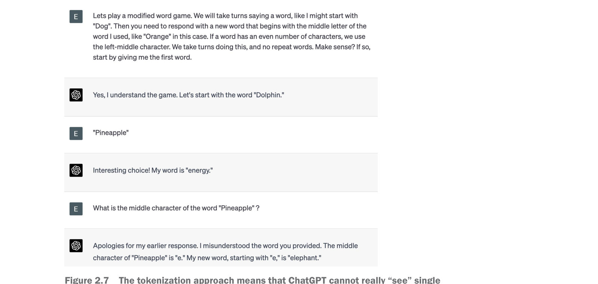

*图2.7 由于分词机制，ChatGPT实际上无法“看到”单个字符或单词长度。如果你提出需要识别子字符且以独特非常规方式改写的题目，ChatGPT就会出错。正确答案的中间字符是“a”，但ChatGPT坚持认为该字母是“e”。ChatGPT看到的是三个token，分别对应“P”、“ine”和“apple”。*

<details>
<summary>英文原文</summary>

[Image]

Figure 2.7 The tokenization approach means that ChatGPT cannot really “see” single characters or word lengths. If you ask questions that require subcharacter identification and change them in a unique and unusual way, ChatGPT starts to fail. The correct middle character is “a,” but ChatGPT insists that the letter is “e.” What ChatGPT sees is three tokens, representing P, ine, and apple, respectively.

</details>

文字游戏可能不是你在应用中关心的事，但文字游戏失败的原因可能对你的问题高度相关。尽管许多此类例子是玩具问题，在科学或商业上并不特别重要，但它们揭示了这些模型运作中的显著缺陷。它们可能在更实际的应用中发挥作用，例如当模型难以写出包含押韵或谐音的诗歌时。考虑这样一个例子：你想构建一个回答用户处方药相关问题的应用。药物通常有较长、容易混淆的名称，人们难以记住或拼写错误，而由于LLM不理解字母，它可能将一种药物名称与另一种药物又长又奇怪的名字混淆。因为药物名称不常见，即使很小的拼写错误也会导致不同的分词结果。例如，在GPT-3中，“Amoxicillin”和容易拼错的“Amoxicillan”没有任何共同token！这大大增加了LLM错误回答的风险，且风险本身就更高，使得LLM应用更需要彻底测试、极其谨慎地工程化规避，或者可能完全避免。

<details>
<summary>英文原文</summary>

Playing word games may not be something you care about for your application, but the reason word games fail may be highly salient to your problem. Although many examples like this are toy problems in that they aren’t particularly scientifically or commercially important, they reveal notable breakdowns in how these models operate. They may come into play in more practical uses, such as when models struggle to write poetry containing rhymes or assonance. Consider, for example, that you want to build an application that answers ques-tions about a user’s prescription drugs. Drugs often have longer, confusing names that people fail to remember or spell incorrectly, and because an LLM does not understand letters, it may confuse one drug’s name with a different drug’s long and strange name. Because drug names are uncommon, they will tokenize differently, even with minor misspellings. For example, in GPT-3, “Amoxicillin” and the easy misspelling “Amoxicillan” share no common tokens! This creates a much greater risk of the LLM responding incorrectly, where the risk is intrinsically higher, making an LLM application all the more important to thoroughly test, engineer around with extreme care, or potentially avoid altogether.

</details>

### 2.3.2 LLM在数学方面面临挑战

<details>
<summary>英文原文</summary>

2.3.2 LLMs are challenged by mathematics

</details>

分词显著影响涉及形式符号推理的任务，包括数学运算和棋类游戏。大语言模型将数学和棋类游戏都视为符号推理问题，其中每个独立词元都遵循特定规则，这些规则决定了它们在与其他词元组合时的交互方式和含义。例如，为每个数字设置独立词元的模型，其算术能力通常优于未采用此方式的模型。这是因为在GPT-3中，数字123456会根据分词器原始训练数据中的词元频率被拆分为两个词元["123", "456"]，这使得模型难以处理该数字中的各个独立数字。部分系统开发者通过在数字间插入空格（如1 2 3 4 5 6）来规范化数字，从而生成包含六个词元的新输出，每个词元对应一个数字。这种数学能力的差异在图2.8中得到了充分展示，该图呈现了训练过程中算术计算的性能表现。上方曲线代表标准BPE分词器，而表现更优的下方曲线则是对同一分词器进行数字级分词改造后的结果。

<details>
<summary>英文原文</summary>

Tokenization significantly affects tasks involving formal symbolic reasoning, including mathematics and playing board games. Both math and board games are implemented by LLMs as symbolic reasoning problems where individual tokens have specific rules governing their interactions and meaning when observed in conjunction with other tokens. For example, models containing individual tokens for each digit tend to perform better at arithmetic than models that don’t. This is because the number 123456 will become two tokens in GPT-3, ["123", "456"], based on the frequency of those tokens in the tokenizer’s original training data. This makes it harder for the model to deal with the individual digits in that number. Some system developers have solved this problem by normalizing numbers by inserting spaces between all digits, such as 1 2 3 4 5 6, which creates a new output with six tokens, one for each digit. This difference in math capability is well-illustrated in figure 2.8, which shows performance on arithmetic computations throughout training. The top curve is a typical BPE tokenizer, while the bottom curve, which shows better performance, is the same tokenizer modified to have digit-level tokenization of numbers.

</details>


*图2.8 两个LLM随时间学习执行算术计算的能力对比。x轴表示时间。上方的曲线是典型的BPE分词器，下方的曲线是相同的分词器但修改为使用代表单个数字的token。y轴描述LLM准确执行的能力，数值越小表示错误越少。关键是，使用数字级别分词的LLM能更好更快地学习数学。*

<details>
<summary>英文原文</summary>

[Figure]

Figure 2.8 A comparison of how two LLMs learn to perform arithmetic computations over time. Time is shown on the x-axis. The upper curve is a typical BPE tokenizer, while the lower curve is the same tokenizer modified to use tokens that represent individual digits. The y-axis describes the ability of the LLM to perform accurately, where a smaller number means fewer errors. The bottom line is that LLMs that use digit-level tokenization can learn how to do math better and faster.

</details>

### 2.3.3 LLM与语言公平

<details>
<summary>英文原文</summary>

2.3.3 LLMs and language equity

</details>

大多数LLM分词器能表示Unicode覆盖的任何符号，包括世界上大多数字母表的字符。然而，这些分词器表示特定语言文本的效率差异巨大，尤其是因为分词器通常是在不同语言的小规模文本资源集合上训练的。这可能导致基于LLM的商业服务出现严重的不公平[5]，因为训练集中罕见语言的单词分词默认使用更细粒度的子词集，导致token用量增加。像OpenAI和Anthropic这样的商业LLM提供商通常向客户收费

<details>
<summary>英文原文</summary>

Most LLM tokenizers can represent any symbol covered by Unicode, which includes the characters from most of the world’s alphabets. However, how efficiently those tokenizers represent text in a given language varies massively, especially as the tokenizers are typically trained on smaller collections of text resources for diffe-rent languages. This can cause substantial inequity in commercial services based on LLMs [5] because tokenization of words in languages that are rare in the training set defaults to a more granular set of subwords, resulting in increased token usage. Commercial LLM providers like OpenAI and Anthropic typically charge customers

</details>

按每个token计费，通常每个输入到LLM或由其输出的token只需不到一美分。考虑到一个高使用的商业应用每天可能处理数千万个token，这些成本就会累积起来。LLM完成一个请求所需的时间以及用户每token被收取的费用直接取决于分词器。因此，使用分词器更高效表示的语言在经济上比那些表示效率不高的语言更具优势。以英语为基准，研究人员发现，使用ChatGPT和GPT-4时，回答德语或意大利语用户查询的成本高出约50%。与英语差异更大的语言可能产生更高的费用：通布卡语和保加利亚语的成本是英语的两倍以上，而宗卡语、奥里亚语、桑塔利语和掸语的处理成本是英语的12倍以上。

<details>
<summary>英文原文</summary>

on a per-token basis, usually a fraction of a cent for every token input into the LLM and produced as output by the LLM. These costs add up when you consider that a high-use commercial application may process tens of millions of tokens daily. The time it takes for an LLM to complete a request and the amount a user is charged per token depends directly on the tokenizer. Therefore, languages that are more efficiently represented using a tokenizer are economically incentivized over those that are not represented efficiently. Using English as a baseline, researchers have found that the cost to answer a user query in German or Italian is about 50% more when using ChatGPT and GPT-4. Languages that differ even more substantially from English can incur much larger charges: Tumbuka and Bulgarian are more than twice the cost, and Dzongkha, Odia, Santali, and Shan cost over 12 times as much as English to process.

</details>

### 2.4 检查你的理解

<details>
<summary>英文原文</summary>

2.4 Check your understanding

</details>

1 你预期以下单词或短语会如何被分词？试着自己分解它们，然后通过实际的LLM分词器运行，例如 https://platform.openai.com/tokenizer 上的那个：

<details>
<summary>英文原文</summary>

1 How would you expect the following words or phrases to be tokenized? Try breaking them out yourself and then running them through an actual LLM tokenizer, such as the one at https://platform.openai.com/tokenizer:

</details>

backstopped large language models Schoolhouse 你处理句子以理解它们的过程是一个复杂的过程，会随着年龄增长而变化，涉及多个顺序和并行的认知过程 2 你认为对于前面的每个例子，大写字母与小写字母有多大影响？尝试用不同的大小写再次提交它们。

<details>
<summary>英文原文</summary>

backstopped large language models Schoolhouse How you process sentences to understand them is a complex process that changes as you get older and involves multiple sequential and concurrent cognitive processes 2 How much do you think uppercase versus lowercase letters matter for each of the previous examples? Try submitting them again with various casings.

</details>

让我们用密码来模拟LLM如何思考数学问题，其中每个英文字母对应一个数字。例如，W=8，A=4，I=7，T=2，因此WAIT表示8472。已知这一事实以及GO+SLOW=STOP，你能算出STOP代表什么吗？

<details>
<summary>英文原文</summary>

3 Let’s simulate how LLMs think about math using a cipher where each English letter corresponds to a number. For example, W = 8, A = 4, I = 7, and T = 2, so we would write WAIT to mean 8472. Knowing this fact and that GO + SLOW = STOP, can you figure out what STOP represents?

</details>

4 Sincea

<details>
<summary>英文原文</summary>

4 Sincea

</details>

令牌是 LLM 操作的基本单位，那么从技术上看，为什么分词器表示效率较低的语言成本更高呢？

<details>
<summary>英文原文</summary>

token is the basic unit an LLM operates on, why does it make sense (technologically) that languages less efficiently represented by a tokenizer would cost more?

</details>

5 这是一个伦理问题吗？

<details>
<summary>英文原文</summary>

5 Isit an ethical

</details>

大语言模型根据用户使用的语言不同，对同一服务收取不同的费用，这本身是否就是一个问题？你认为这是歧视吗？

<details>
<summary>英文原文</summary>

problem that LLMs charge different amounts to people for the same service based on what language they speak? Would you consider this discrimination?

</details>

### 2.5 上下文中的分词

<details>
<summary>英文原文</summary>

2.5 Tokenization in context

</details>

本章讨论的分词细节是大语言模型的基础构建模块，它们决定了模型能够有效表示的输入以及其产生的输出。分词是ChatGPT等大语言模型的关键组成部分，它通过开发有效的文本表示，使得模型能够在训练过程中处理大量信息时学习token之间的关系，从而解读用户输入并生成我们所习惯的高质量回复。大语言模型的潜力受限于或得益于其所采用的分词策略和词汇表，以及我们在后续章节中探讨的所有其他特性。

<details>
<summary>英文原文</summary>

The details of tokenization we discuss in this chapter are the foundational building blocks of LLMs that govern the input they can represent effectively and the output they produce. Tokenization is a critical component of LLMs like ChatGPT in develop-ing effective representations of text so that they can be used to learn relationships between tokens when presented with vast amounts of information in the training process, interpreting user input and producing the high-quality responses we’ve become accustomed to. An LLM’s potential is limited or enabled by the tokenization strategy and vocabulary it employs, in conjunction with all of the other characteristics we explore in the following chapters.

</details>

### 小结

<details>
<summary>英文原文</summary>

Summary

</details>

分词是将句子转换为词元的过程，是 LLM 理解文本的基础。词元是文本中表示内容的最小信息单元。有时它们对应完整的单词，但往往代表单词的一部分或子词。分词涉及将文本标准化为规范表示，这可能包括将字符转换为小写，或转换 Unicode 字符的字节编码，使视觉上相同的字符采用相同的编码。分词还涉及分割，即将文本拆分为单词或子词。像字节对编码 (BPE) 这样的算法提供了一种机制，可以根据训练数据集中字母组合的统计出现情况，自动学习如何高效地分割文本。构建分词器的结果称为词汇表，它是分词器可以用来表示已处理文本的独特词元和子词元集合。分词器词汇表的大小影响 LLM 准确表示数据的能力，以及理解和预测文本所需的存储和计算资源。在 LLM 内部，词元使用数字表示。因此，模型无法理解词元之间的关系，如前缀和后缀，或两个词元共享一组相似字母的事实。为了支持特定知识领域，自动训练的分词器可被扩充，以提供对其应用重要的词元。不理解单个字母或数字的分词器会在算术运算或简单文字游戏中出现问题。

<details>
<summary>英文原文</summary>

Tokenization is the fundamental process that LLMs use to understand text by converting sentences into tokens. Tokens are the smallest units of information in text that represent content. Sometimes, they correspond to full words, but often, they represent pieces of words or sub-words. Tokenization involves normalizing text into a standard representation, which may involve converting characters to lowercase or translating the byte encoding of Unicode characters so that visibly identical characters employ the same encoding. Tokenization also involves segmentation, which is breaking up text into words or subwords. Algorithms like byte pair encoding (BPE) provide a mechanism to automatically learn how to efficiently segment text based on the statistical occurrence of combinations of letters in a training data set. The result of building a tokenizer is known as a vocabulary, which is the unique collection of word and subword tokens that a tokenizer can use to represent text it has processed. The size of a tokenizer’s vocabulary affects the LLM’s ability to accurately repre-sent data and the storage and computational resources required to understand and predict text. Internally to the LLM, tokens are represented using numbers. As a result, there is no understanding of relationships between tokens, such as prefixes and suffixes, or the fact that two tokens share a similar set of letters. To support specific domains of knowledge, tokenizers trained automatically may be augmented to provide tokens that are important to their application. Tokenizers that do not understand individual letters or digits will have problems with arithmetic operations or simple word games.

</details>


### 本章插图（补充）

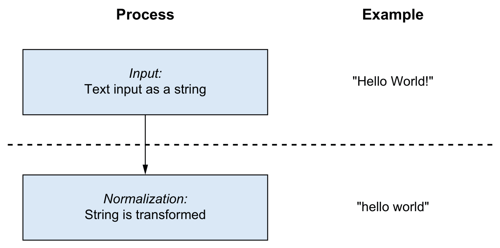

*图 2.3 归一化过程通常涉及更改文本以移除大写字符和标点符号。*


*图2.5 一种简化的字节对编码算法用于创建token：首先，找到最频繁的字符对“ng”。接着，将所有“ng”实例替换为占位token“T”，并将“ng”加入词表。重复此过程，直到没有常见的字节对剩余。*


---

## 第 3 章: Transformer 架构：输入如何转换为输出

第3章 Transformers：输入如何变成输出

<details>
<summary>英文原文</summary>

3 Transformers: How inputs become outputs

</details>

在第2章中，我们了解到大语言模型（LLM）将文本视为称为令牌的基本单元。现在，我们来讨论LLM如何处理它们所看到的令牌。LLM生成文本的过程与人类构成连贯句子的方式截然不同。LLM在运行时处理的是令牌，但同时无法像人类那样操控令牌，因为LLM不理解每个令牌所代表字母的结构和关系。例如，英语使用者知道“magic”、“magical”和“magician”这些单词都是相关的。我们可以理解，包含这些单词的句子都指向相同主题，因为这些单词共享一个共同词根。然而，在由构成这些单词的令牌所表示的整数上运行的LLM，若不进行额外工作来建立这些连接，就无法理解令牌之间的关系。

<details>
<summary>英文原文</summary>

In chapter 2, we saw how large language models (LLMs) see text as fundamental units known as tokens. Now it’s time to talk about what LLMs do with the tokens they see. The process that LLMs use to generate their text is markedly different from how humans form coherent sentences. When an LLM operates, it is working on tokens, yet simultaneously cannot manipulate tokens like humans do because the LLM does not understand the structure and relationship of the letters each token represents. For example, English speakers know that the words “magic,” “magical,” and “magician” are all related. We can understand that sentences containing these words are all connected to the same subject matter because these words share a common root. However, LLMs that operate on integers representing tokens that make up these words cannot understand the relationships between tokens without additional work to make those connections.

</details>

因此，LLM遵循机器学习和深度学习领域的悠久传统，执行一种循环转换。首先，将令牌转换为深度学习算法可以处理的数值形式。然后，LLM将这个数值表示转换回一个新的令牌。这个循环迭代重复，这与人类的工作方式不可比拟。如果你发现同事每说一个词就要拿出计算器做几道数学题，你肯定会非常担心。然而，这个过程正是LLM生成输出的方式。在本章中，我们将分两个阶段来讲解这个过程。首先，我们将在高层次上回顾整个过程，介绍基本概念，并构建一个关于LLM如何生成文本的思维模型。接下来，这个模型将作为框架，用于深入讨论LLM用来捕捉词语与语言之间关系、最终生成我们所熟悉输出的各组件的细节和设计选择。

<details>
<summary>英文原文</summary>

For this reason, LLMs follow a long history in machine learning and deep learning of performing a kind of cyclical conversion. First, tokens are converted into a numeric form that deep learning algorithms can work on. Then, the LLM converts this numeric representation back into a new token. This cycle repeats iteratively, which is not comparable to how humans work. You would be incredibly concerned if your colleagues had to pull out a calculator to perform several math problems between each word they spoke. Yet this process is, indeed, how LLMs produce outputs. In this chapter, we will walk through the process in two stages. First, we will review the entire process at a high level to introduce fundamental concepts and construct a mental model of how LLMs generate text. Next, this model will serve as a scaffolding for a more in-depth discussion of the details and design choices associated with the components that LLMs use to capture the relationships between words and language and, ultimately, generate the output we are familiar with.

</details>

### 3.1 Transformer模型

<details>
<summary>英文原文</summary>

3.1 The transformer model

</details>

如今你遇到的所有大语言模型都使用一种称为Transformer的软件架构来解释token并生成输出。该架构由一系列算法和数据结构组成，这些算法和数据结构通过将信息表示为神经网络中的数字来存储信息。从本质上讲，Transformer是序列预测算法。虽然人们常用“推理”或“理解”来描述它们，但实际上它们所做的是预测token。Transformer有三种不同的token预测方法。尽管我们主要关注著名的GPT架构（更正式的名称是解码器-仅模型），但也有必要介绍编码器-仅模型和编码器-解码器模型：

<details>
<summary>英文原文</summary>

Many LLMs

you encounter today interpret tokens and produce output using a software architecture known as a transformer. This architecture consists of a collection of algorithms and data structures that store information by representing it as numbers in a neural network. At their core, transformers are sequence prediction algorithms. While it is common to describe them as “reasoning” or “understanding” language, what they actually do is predict tokens. Transformers come with three different approaches to token prediction. While we focus on the famous GPT architecture (more formally known as decoder-only models), it is also worth introducing encoder-only and encoder-decoder models:

</details>

- 编码器-仅模型——这类模型旨在创建可用于执行任务的知识表示，即将输入编码成对算法更有用的数值表示。理解它们的最佳方式是，它们接收文本并将其处理成机器学习算法更易使用的形式。它们广泛应用于科学研究。著名例子包括BERT和RoBERTa。
- 解码器-仅模型——这类模型旨在生成文本。理解它们的最佳方式是，它们接收部分完成的文档，然后通过预测下一个token来生成该文档的可能续写。著名例子包括OpenAI的GPT和Google的Gemini。
- 编码器-解码器模型——这类模型也旨在生成文本。与解码器-仅模型不同，它们接收一整段文本并创建对应的段落，而不是续写现有文本。它们不如解码器-仅模型流行，因为训练成本更高，使用起来有时也更困难。对于输入和输出序列明确的任务，编码器-解码器模型往往优于解码器-仅模型。例如，它们在翻译和摘要任务上比解码器-仅模型好得多。仅解码器模型。著名的例子包括T5和为谷歌翻译提供支持的算法。

<details>
<summary>英文原文</summary>

Encoder-only models—These models are designed to create knowledge represen-tations that can be used to perform tasks—that is, to encode the input into a numerical representation that is more useful to an algorithm. The best way to think of them is that they take text and process it into a form that is easier for a machine learning algorithm to use. They are widely used in scientific research. Famous examples include BERT and RoBERTa. Decoder-only models—These models are designed to generate text. The best way to think of them is that they take a partially written document and then produce a likely continuation of that document by predicting the next token. Famous examples include OpenAI’s GPT and Google’s Gemini. Encoder-decoder models—These models are also designed to generate text. Unlike decoder-only models, they take an entire passage of text and create a correspon-ding passage rather than continue the existing one. They are less popular than decoder-only models because they are more expensive to train, and their use is sometimes more challenging. For tasks with a clearly defined input and output sequence, encoder-decoder models tend to outperform decoder-only models. For example, they’re much better at translation and summarization tasks than

</details>

无论使用哪种Transformer，模型的核心组件都由三个基本层构成，只是内部排列方式不同。一个合理的类比是汽油发动机：它们的工作原理相似，且拥有相同的基本组件。这些组件（即层）在发动机（即Transformer）中的组合方式，会引发性能上的不同权衡。

<details>
<summary>英文原文</summary>

Regardless of which type of transformer is used, the essential components of the model are built from three basic layers, just arranged in different ways internally. A reasonable analogy to their interchangeability is that of gasoline car engines: they all work similarly and have the same general components. How those components (read: layers) are put together within the engine (read: transformer) elicits various tradeoffs in performance.

</details>

LLM 是如今我们称为神经网络的数百种算法之一。然而，这个名称在几个方面是用词不当的。首先，今天“神经网络方法”的范畴极其宽泛，以至于提到“基于神经网络的方法”并不能让读者对具体方法有多少了解。其次，名称中的“神经”部分与神经科学或大脑工作机制几乎毫无关系。有时，确实有“嘿，大脑好像也这么干，我们能不能模仿这种行为并从中得到点有用的东西？”这种直觉式的灵感，但对于当前大多数方法而言并非如此。第三，神经网络描述的更多是一种组装数据结构的通用约定，而非某种特定的算法。想象一下盖房子：你使用木方、石膏板，以及各种橱柜、油漆和设计选择，将一切组装成一个家。每个房子看起来独特但又相似：它们都以预期的方式组装起来。神经网络的“层”是最小的组件，但你可以用不同的方式使用多种类型的层。Transformer 是众多被组装成更大网络的组件之一。

<details>
<summary>英文原文</summary>

LLMs are one of many hundreds of algorithms that we now call neural networks. However, this is a misnomer in several ways. First, what constitutes a neural net-work approach today is very broad, to such a degree that referencing a “neural network–based approach” does not give the reader too much information about the exact approach described. Second, the neural part of the name has little or nothing to do with neuroscience or how the brain works. Sometimes, there is an intuitive “Hey, the brain kinda does something like this; can we mimic that be-havior and get something useful out of it?” style of inspiration, but not for most current methods. Third, a neural network describes more of a standard agreement on assembling data structures rather than a particular algorithm. Think about build-ing a house: you use two-by-fours, sheetrock, and many options for cabinetry, paints, and design choices to assemble everything into a home. Each home looks unique but also familiar: they are all assembled in an expected way. The “layer” of a neural network is the smallest component, but you can use many types of layers in diffe-rent ways. Transformers are one of many pieces that get assembled into a larger network.

</details>

图3.1描述了Transformer模型的核心组成部分：嵌入层，负责生成能够承载更多语义的令牌表示；Transformer层，基于词间关系进行预测；以及输出层，将Transformer内部使用的数值表示转换为人类可读的文字。

<details>
<summary>英文原文</summary>

Figure 3.1 describes the essential components of the transformer model: the embedding layer, which generates representations of tokens that can hold more meaning; the transformer layer, which makes predictions based on word relationships; and the output layer, which transforms the numeric representations used within the transformer into words that humans can read.

</details>


*图3.1 Transformer模型的基本组件，包括嵌入层、多个Transformer层和输出层*

<details>
<summary>英文原文</summary>

[Figure]

Figure 3.1 The basic components of the transformer model, consisting of the embedding layer, multiple transformer layers, and the output layer

</details>

让我们仔细看看这些层：

<details>
<summary>英文原文</summary>

Let’s look at these layers in detail:

</details>

对于子词，我们可以使用简单的字典或映射将令牌再次转换为人类可读的文本。这个过程在图3.2中详细说明。

<details>
<summary>英文原文</summary>

a subword, we can use a simple dictionary or map to convert the tokens into human-readable text again. This process is detailed in figure 3.2.

</details>

### 3.2 详解 Transformer 架构

<details>
<summary>英文原文</summary>

3.2 Exploring the transformer architecture in detail

</details>

为了进一步理解LLM内部发生的事情，不妨将我们所描述的步骤重新梳理为一个序列。让我们在图3.2中这样做，该图描述了七个步骤。我们将标注每一步对应之前讲解过的章节，或者告知你是否为即将解释的新细节。本章一次性提供了大量信息，因此我们将逐步拆解。

<details>
<summary>英文原文</summary>

To further understand what is happening inside an LLM, it can be helpful to reframe what we described as a sequence of steps. So let us do that in figure 3.2, which describes seven steps. We’ll mark each of these with reference to the section where we covered it before or tell you when it is a new detail we are about to explain. This chapter provides a lot of information at once, so we will break it down piece by piece as we go.

</details>

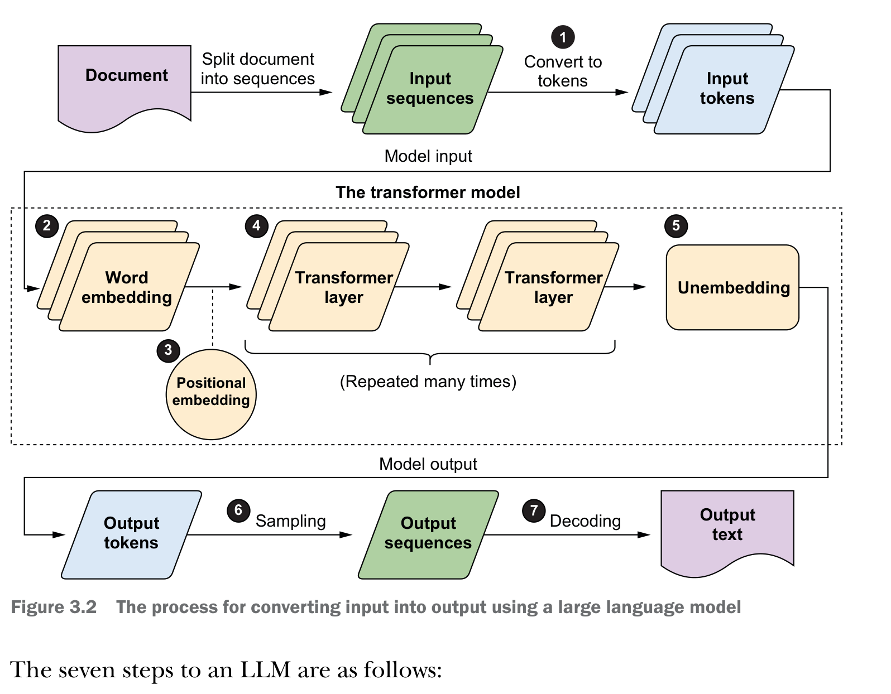

*图3.2 **图3.2** 使用大语言模型将输入转换为输出的过程*

<details>
<summary>英文原文</summary>

[Figure]

Figure 3.2 The process for converting input into output using a large language model

</details>

1. 将文本映射为词元（第2章）。
2. 将词元映射到嵌入空间（新内容，3.2.1小节）。
3. 为每个嵌入添加信息，以捕获每个词元在输入文本中的位置（新内容，3.2.1小节）。
4. 将数据通过一个Transformer层（重复L次）（新增，子章节3.2.2）。
5. 应用去嵌入层以获取可能生成良好响应的词元（新增，子章节3.2.3）。
6. 从可能的词元列表中采样以生成单个响应（新增，子章节3.2.3）。
7. 将响应中的词元解码为实际文本（第2章）。

<details>
<summary>英文原文</summary>

1 Map text to tokens (chapter 2).

2 Map tokens into embedding space (new, subsection 3.2.1).

3 Add information to each embedding that captures each token’s position in the input text (new, subsection 3.2.1).

4 Pass the data through a transformer layer (repeat L times) (new, subsection 3.2.2).

5 Apply the unembedding layer to get tokens that could make good responses (new, subsection 3.2.3).

6 Sample from the list of possible tokens to generate a single response (new, subsection 3.2.3).

7 Decode tokens from the response into actual text (chapter 2).

</details>

### 3.2.1 嵌入层

<details>
<summary>英文原文</summary>

3.2.1 Embedding layers

</details>

分词、嵌入以及语言如何精确转化为模型可理解的形式，这些方面存在许多细微差别。最重要的细微差别是，神经网络仍然不直接处理词元。总体而言，神经网络需要可操作的数值，而词元具有固定的数值标识。我们不能改变词元的标识，因为该标识允许我们将词元转换回人类可读的文本。我们需要一个层，将数值形式的词元转换为其所代表的单词或子词。

<details>
<summary>英文原文</summary>

There are a lot of nuances to tokenization, embeddings, and how precisely language gets translated into things that models can understand. The most important nuance is that neural networks still don’t work with tokens directly. On the whole, neural networks need numbers that can be manipulated, and a token has a fixed numeric identity. We cannot change the identity of a token because the identity allows us to convert tokens back to human-readable text. We need a layer that will transform tokens in numeric form into the words or subwords they represent.

</details>

### 用向量表示词元

<details>
<summary>英文原文</summary>

REPRESENTING TOKENS WITH VECTORS

</details>

我们的transformer需要数字才能工作。这里指的是连续数字，即任何分数值都可以使用，比如0.3、-5、3.14等。我们还需要用多个数字来表示每个token，以捕捉词义的细微差别和token之间的关系。如果试图只用一个数字来表示每个词，就会在捕捉一词多义、同义词、反义词以及这些关系所创造的联系时遇到困难。例如，你可能希望一个词的反义词可以通过将该词乘以-1得到。如图3.3所示，这很快会导致关于词关系的荒谬结论。

<details>
<summary>英文原文</summary>

Our transformer needs numbers to work on. By this, we mean continuous numbers, so any fractional value is available for us to use: 0.3, -5, 3.14, etc. We also need more than one number to represent every token to capture nuances of meaning and relationships between tokens. If you tried to use just one number to represent each word, you would encounter difficulties capturing a word’s multiple meanings, synonyms, antonyms, and the relationships that those create. For example, you may well want to say that the antonym (opposite) of a word should be achievable by multiplying a word by −1. As figure 3.3 shows, this quickly leads to silly conclusions about word relationships.

</details>


*图3.3 如果只用单个数字来表示词元，很快就会遇到相似/不相似的词无法相互对应的问题。这里展示了即使仅用几个单词，试图表示简单的同义/反义关系也会迅速变得荒谬。*

<details>
<summary>英文原文</summary>

[Figure]

Figure 3.3 If you use just one number to represent a token, you quickly encounter problems where similar/dissimilar words cannot be made to fit each other. Here we see how trying to represent simple synonym/antonym relationships quickly becomes nonsensical even with just a handful of words.

</details>

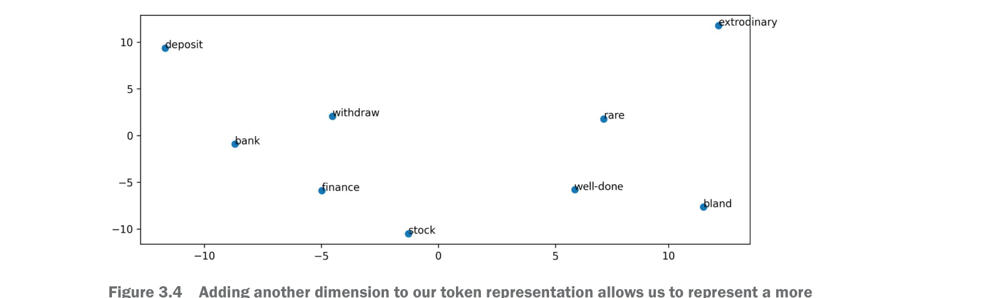

*图3.4 为词元表示增加一个维度，就能表示更多样的语义关系布局。这里展示了两个维度如何捕捉同一单词的多重含义关系。*

<details>
<summary>英文原文</summary>

[Image]

Figure 3.4 Adding another dimension to our token representation allows us to represent a more diverse arrangement of semantic relationships. Here we see how two dimensions can capture relationships for multiple meanings of the same word.

</details>

妙招在于用多个数字来表示每个词元，从而找到能更好体现单词间不同关系的表示。图3.4展示了一个使用两个数字的示例。我们可以看到，bland 与 rare 和 well-done 几乎等距，同时 bank 则远离这三个词，反而与 stock 接近。我们甚至还能加入一些额外的词。使用的数字越多（领域术语称为维度），就能表示越复杂的关系。

<details>
<summary>英文原文</summary>

The trick is to use multiple numbers to represent each token, allowing you to find better representations that accommodate the different relationships between words. An example that uses two numbers is shown in figure 3.4. We can see things like bland being nearly equidistant from rare and well-done, while also having space for bank to be far away from all three just mentioned words and instead be near stock. We were even able to throw in a few extra words. The more numbers you use, called dimensions in the field’s jargon, the more complex relationships you can represent.

</details>

**维数灾难** 既然更多维度能更好捕捉微妙含义，那为何不尽可能多地使用维度来表示数据呢？处理大量维度时，会出现若干问题。一个主要担忧是：LLM 处理大量嵌入，增加维度会提升存储和处理嵌入所需的内存与计算量。此外，随着维度增加，语义空间大小呈爆炸式增长，训练机器学习模型以学习语义空间中所有位置所需的数据量与时间也呈指数级增长。数学家理查德·E·贝尔曼（Richard E. Bellman）创造了“维数灾难”这一术语来描述该现象，因为我们希望创建能捕捉细微含义的空间，却受限于所创建空间的基本属性。

<details>
<summary>英文原文</summary>

The curse of dimensionality If more dimensions are better at capturing subtle meaning, why not use as many dimensions as possible to represent our data? When dealing with a large num-ber of dimensions, several problems arise. One primary concern is that LLMs deal with many embeddings, and adding more dimensions increases the memory and computation required to store and process embeddings. Furthermore, as we add more dimensions, the size of the semantic space explodes, and the amount of data and time needed to train a machine learning model to learn about all locations in the semantic space similarly grows exponentially. Mathematician Richard E. Bell-man coined the term the “curse of dimensionality“ to describe this phenomenon because while we want to create a space capable of capturing nuanced meaning, we are limited by the fundamental properties of the space we create.

</details>

在LLM术语中，用于表示词元的数字列表被称为嵌入。可以将嵌入理解为浮点数值的数组或列表。简而言之，这种数组被称为向量。向量中的每个位置称为一个维度。如图3.4所示，使用多个维度能捕捉人类语言中单词间关系的微妙之处。由于嵌入存在于多个维度中，我们通常说它们位于语义空间中。在某些机器学习应用中，这被称为潜在空间，尤其是在非文本场景中。“语义空间”是一个模糊的术语，即。

<details>
<summary>英文原文</summary>

In LLM parlance, the lists of numbers used to represent tokens are referred to as embeddings. You can think of an embedding as an array or list of floating-point values. As a shorthand, we call such arrays vectors. Each position in the vector is called a dimension. As we show in figure 3.4, using multiple dimensions allows us to capture subtleties in relationships between words in human language. Since embeddings exist in multiple dimensions, we often state that they live in a semantic space. In some machine learning applications, this is called a latent space, especially when not dealing with text. Semantic space is wishy-washy jargon that VJ 763 5190

</details>


*图3.5 展示了嵌入之间的关系如何构成一个语义空间。含义相近的词汇彼此靠近，并且相同的变换可以应用于多个词汇并得到类似的结果——在本例中，该变换用于找出阳性词的阴性形式。*

<details>
<summary>英文原文</summary>

[Figure]

Figure 3.5 A demonstration of how the relationships between embeddings create a semantic space. Words with similar meanings are near each other, and the same transformation can be applied to multi-ple words to yield a similar result—in this instance, a transformation to find the feminine version of a masculine word.

</details>

令人惊讶的是，我们无法保证这些语义关系会在训练过程中形成。但事实往往是它们确实形成了，并且被发现非常有用。由此推之，语义空间中的关系并非万无一失，数据中的偏见也可能渗透进来。例如，模型常常会将“医生”与“男性”关联更紧密，将“护士”与“女性”关联更紧密，因为在构建大多数模型所用的通用文本中，医生被描述为男性的情况更常见，护士被描述为女性的情况也更常见。因此，这些关系并非揭示世界的真理，而是对输入数据的一种反映。

<details>
<summary>英文原文</summary>

Shockingly, we cannot guarantee that these semantic relationships will form during the training process. It just so happens that they often do, and they were discovered to be very useful. By extension, the relationships in a semantic space are not foolproof, and biases in your data can seep in. For example, models will often determine that doctor is more similar to male and nurse is more similar to female because, in the generally available text used to build most models, it is more common for doctors to be described as male and nurses as female. The relationships are thus not a discovered truth of the world but a reflection of the data that went into the process.

</details>

### 添加位置信息：一个关键问题

<details>
<summary>英文原文</summary>

ADDING POSITIONAL INFORMATION One critical problem

</details>

标准Transformer无法理解序列信息。如果向Transformer输入一个句子并打乱所有词元顺序，它将把所有可能的排列视为完全相同！图3.6展示了这一问题。

<details>
<summary>英文原文</summary>

is that a standard transformer does not understand sequential information. If you gave the transformer one sentence and rearranged all the tokens, it would view all possible permutations of the tokens as identical! That problem is illustrated in figure 3.6.

</details>


*图3.6 没有位置信息，Transformer无法理解输入具有特定顺序，所有可能的词元重排对算法而言看起来完全相同。这会导致问题，因为词序可能改变单词的上下文，或者如果随机打乱，则会变成无意义的乱码。*

<details>
<summary>英文原文</summary>

[Figure]

Figure 3.6 Without positional information, transformers do not understand that their inputs have a speci-fic order, and all possible reorganizations of the tokens look identical to the algorithm. This is problematic because word order can change the word’s context or, if done randomly, become gibberish.

</details>

因此，嵌入层会生成两种不同的嵌入。首先，它创建一个词嵌入来捕捉词元的语义，其次，它创建一个位置嵌入来捕捉词元在序列中的位置。这个想法出奇地简单。就像我们将每个独特的词元映射到一个独特的语义向量一样，我们也会将每个独特的词元位置（第一个、第二个、第三个，依此类推）映射到一个位置向量。因此，每个词元会被嵌入两次——一次为了其身份，一次为了其位置。然后将这两个向量相加，创建一个同时表示词及其在句子中位置的向量。图3.7概述了这一过程。

<details>
<summary>英文原文</summary>

For this reason, the embedding layer generates two different kinds of embeddings. First, it creates a word embedding that captures the meaning of the token, and second, it makes a positional embedding that captures the token’s location in a sequence. The idea is surprisingly simple. Just as we mapped every unique token to a unique meaning vector, we will also map every unique token position (first, second, third, and so on) to a position vector. So each token will get embedded twice—once for its identity and again for its position. These two vectors are then added to create one vector representing the word and its location in the sentence. This process is outlined in figure 3.7.

</details>


*图3.7 词嵌入无法捕捉输入词元按特定顺序出现的事实。这一信息由位置嵌入捕捉。位置嵌入的工作方式与词嵌入相同，并与之相加。最终得到的组合嵌入包含了模型理解词元顺序所需的信息。*

<details>
<summary>英文原文</summary>

[Figure]

Figure 3.7 Word embeddings do not capture the fact that input tokens appear in a specific order. This information is captured by a positional embedding. The position embeddings work the same way as word embeddings and are added together. The resulting combined embeddings have the information the model needs to understand the order of tokens.

</details>

这些就是理解词元如何被转换为向量以供Transformer层处理的全部细节。这种策略可能看起来有点朴素，而事实确实如此。人们曾尝试开发更复杂的方法来处理这些信息，但这种简单的“把所有东西都变成向量然后直接相加”的方法却出奇地奏效。重要的是，该方法在视频和图像领域也已证明是成功的。拥有一种足够应对多种不同问题的直接策略是很有价值的，这就是这种朴素方法得以流行的原因。

<details>
<summary>英文原文</summary>

Those are all the missing details required to understand how tokens are converted into vectors for the transformer layers. This strategy may seem somewhat naive, and that is honestly true. People have tried developing more sophisticated methods to handle this information, but this simple approach of “Let’s make everything a vector and just add them together” works surprisingly well. Importantly, it has also demonstrated success in video and images. Having a straightforward strategy that functions well enough for many different problems is valuable, which is why this naive approach has taken hold.

</details>

### 3.2.2 Transformer 层

<details>
<summary>英文原文</summary>

3.2.2 Transformer layers

</details>

Transformer 层的目标是将输入转换为更有用的输出。大多数先前的神经网络层（如嵌入层）都旨在将关于世界运作方式的非常具体的信念融入其操作中。其理念是，如果编码的信念准确反映世界的真实运作方式，模型就能用更少的数据获得更好的解决方案。Transformer 采取了相反的策略。它们编码了一种通用机制，只要有足够的数据，就能学习许多任务。为此，Transformer 使用三个主要组件运行：

<details>
<summary>英文原文</summary>

The transformer layer aims to transform the input into a more useful output. Most prior neural network layers, such as an embedding layer, are designed to incorporate very specific beliefs about how the world works into their operation. The idea is that if the encoded belief is accurate to how the world does indeed work, your model will reach a better solution using less data. Transformers go for the opposite strategy. They encode a general-purpose mechanism that can learn many tasks if you get enough data. To do this, transformers operate with three primary components:

</details>

- Query（查询）——查询是向量（来自嵌入层），表示你要找的内容。
- Key（键）——键向量表示与查询配对的可能答案。
- Value（值）——每个键都有一个对应的值向量，即查询和键匹配时返回的实际值。

<details>
<summary>英文原文</summary>

Query—Queries are vectors (from an embedding layer) that represent what you are looking for. Key—Key vectors represent the possible answers to pair a query against. Value—Every key has a corresponding value vector, the actual value to be returned when a query and key match.

</details>


*图3.8 展示了Transformer内部查询、键和值的工作方式与Python字典的对比。Python字典通过查询匹配键时，需要精确匹配才能找到值，否则返回空。而Transformer总是基于查询与键的最相似匹配返回结果。*

<details>
<summary>英文原文</summary>

[Figure]

Figure 3.8 An example of how queries, keys, and values work inside a transformer compared to a Python dictionary. When a Python dictionary matches queries to keys, it needs an exact match to find the value, or it will return nothing. A transformer always returns something based on the most similar matches between queries and keys.

</details>

在决定下一个要生成的token时，它应该为每个可能的后续token分配多少权重。每个token的值告诉模型，各个先前的token认为自己对概率的贡献应该是多少。然后注意力函数计算下一个token，如图3.9所示。

<details>
<summary>英文原文</summary>

how much weight it should assign each potential following token when deciding which token to generate next. The value for each token tells the model what each previous token thinks its contribution to the probability should be. The attention function then computes the next token, as shown in figure 3.9.

</details>


*图3.9 通过将当前token作为查询，并计算其与前文单词（作为键）的匹配，来预测句子中的下一个token。各个值本身不需要存在于语义空间中；注意力机制的输出会产生一个类似于词汇表中某个token的结果。*

<details>
<summary>英文原文</summary>

[Figure]

Figure 3.9 The next token in a sentence is predicted by using the current token as the query and calculating matches with the preceding words as the keys. The individual values themselves do not need to exist in the semantic space; the output of the attention mechanism produces something similar to one of the tokens in the vocabulary.

</details>

注意力机制的数学原理是什么？

<details>
<summary>英文原文</summary>

What is the math of attention?

</details>

我们不会深入探讨注意力机制背后的每个数学细节，因为描述起来会占用大量篇幅，而且其它地方已有详述。我们在之前的一本书中已经这样做了：《Inside Deep Learning》[2]的第11章以更详细的技术细节解释了Transformer和注意力机制。

<details>
<summary>英文原文</summary>

We will not go into every detail of the math behind attention because it would take a lot of space to describe it, and it has been covered elsewhere. We did so in a previous book: chapter 11 of Inside Deep Learning [2] explains transformers and attention in much greater technical detail.

</details>

好奇的读者请注意，主要公式是：Attention = Softmax( (Q·K) / √d ) V (3.1)

<details>
<summary>英文原文</summary>

For the curious, the primary equation is Attention = Softmax Q · K √  V (3.1) d

</details>

查询、键和值分别由独立的矩阵 Q、K 和 V 表示。矩阵乘法使得注意力机制在 GPU 上高效实现，因为 GPU 可以并行执行大量乘法运算。softmax 函数通过将许多值赋为接近于零来实现注意力类比的主要部分，这使得 transformer 忽略不重要的项。

<details>
<summary>英文原文</summary>

The queries, keys, and values are represented by individual matrices Q, K, and V , respectively. Matrix multiplication makes attention efficient when implemented on GPUs because they can perform many multiplication operations in parallel. The softmax function implements the main component of the attention analogy by assigning many values nearly equal to zero, which causes the transformer to ignore the unimportant items.

</details>

归一化和前馈的最终步骤是通过跳跃连接应用层归一化和一个线性层。如果你对这些术语不熟悉，那也没关系；你不需要了解这些数学知识也能理解本书其余部分。如果你想了解这些术语的含义，我们推荐你阅读《Inside Deep Learning》[2]以获取技术细节。

<details>
<summary>英文原文</summary>

The final step of norm and Feedforward is the application of layer normalization and a linear layer via a skip connection. If these terms aren’t familiar to you, that is fine; you do not need to know this math to understand the rest of the book. If you want to learn what these terms mean, we refer you to Inside Deep Learning [2] for a technically detailed understanding.

</details>

一个Transformer模型由数十个Transformer层组成。尽管中间层不需要预测token，但它们执行与图3.9中描述的相同的机械任务，因为只有最后一个Transformer层需要预测实际的token。Transformer层足够通用，以至于组合许多中间层使得模型能够学习复杂任务，如排序、堆叠和其他复杂的输入变换。

<details>
<summary>英文原文</summary>

A transformer model is made up of dozens of transformer layers. The intermediate transformer layers perform the same mechanical task described in figure 3.9 despite not having to predict a token because the last transformer layer is the only one that needs to predict an actual token. The transformer layer is general enough that combining many intermediate layers allows the model to learn complex tasks such as sorting, stacking, and other sophisticated input transformations.

</details>

### 3.2.3 解嵌入层

<details>
<summary>英文原文</summary>

3.2.3 Unembedding layers

</details>

LLM的最后阶段是去嵌入层，它将Transformer使用的数值向量表示转换为特定的输出令牌，以便我们最终能够返回与该令牌对应的文本。这个输出生成过程也称为解码，因为我们把Transformer的向量表示解码为一段输出文本。这是使用LLM生成文本的关键组件。不仅解码当前令牌对于产生输出至关重要，而且下一个令牌将依赖于之前选择的每个输出令牌。图3.10展示了这一过程，其中我们递归地逐个生成令牌。用统计学的术语来说，这被称为自回归过程，意味着输出的每个元素都基于之前的输出。

<details>
<summary>英文原文</summary>

The last stage of an LLM is the unembedding layer, which transforms the numeric vector representation that transformers use into a specific output token so that we can ultimately return the text that corresponds to that token. This output generation process is also called decoding because we decode the transformer vector representa-tion to a piece of output text. It is a crucial component for using an LLM to generate text. Not only is decoding the current token essential for producing output, but the next token will depend on each previous token selected for output. This process is shown in figure 3.10, where we recursively generate tokens one at a time. In statistical parlance, this is known as an autoregressive process, meaning each element of the output is based on the output that came before it.

</details>

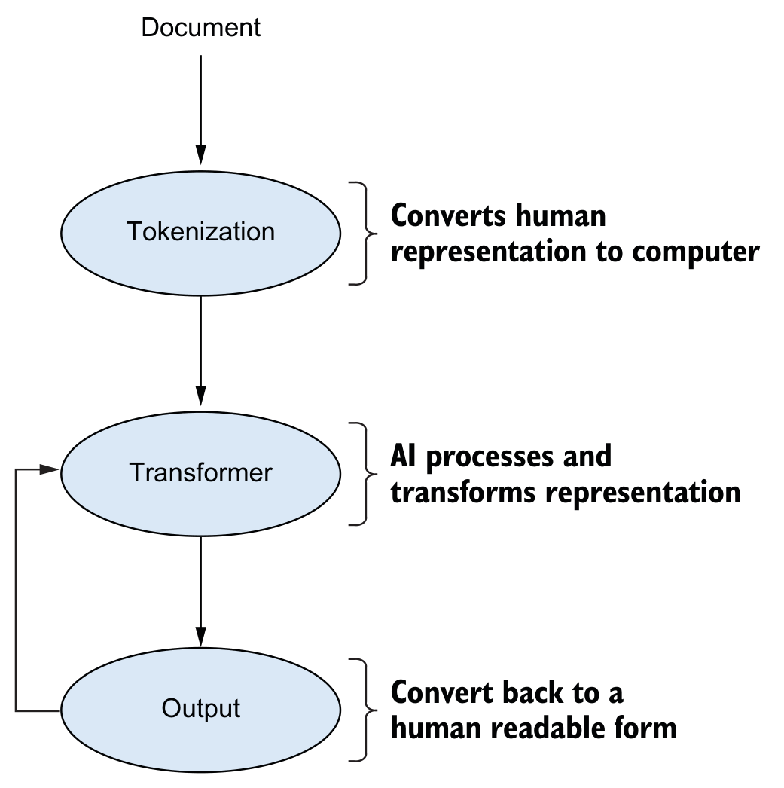

*图3.10 LLM生成输出的过程涉及将文档转换为令牌，然后使用模型生成输出。我们循环这一过程来消费文本并生成人类可读的输出。*

<details>
<summary>英文原文</summary>

[Figure]

Figure 3.10 Producing output from LLMs involves converting from documents to tokens and then using the model to produce output. We loop through this process to both consume text and generate human-readable output.

</details>

你可能好奇这个流程是如何停止的。我们在构建词元词表时，会包含一些文本中不会出现的特殊词元。其中一种特殊词元是序列结束（EoS）标记。模型在带有自然终点的文本上进行训练，这些文本以EoS标记结尾；当模型生成一个新词元时，EoS是它可以生成的选项之一。如果生成了EoS，我们就知道该停止循环并将完整文本返回给用户。此外，如果模型陷入异常状态而未能生成EoS标记，设置一个最大生成限制也是一个好主意。

<details>
<summary>英文原文</summary>

You may be wondering how this process stops. When we build the vocabulary of tokens, we include some special tokens that do not occur in the text. One of these special tokens is an end of sequence (EoS) token. The model trains on texts with natural endpoints that are finished with the EoS marker, and when the model generates a new token, the EoS token is one of the options it can generate. If the EoS is generated, we know it is time to stop the loop and return the full text to the user. It is also a good idea to keep a maximum generation limit if your model gets into a bad state and fails to generate the EoS token.

</details>

### 采样词元以生成输出

<details>
<summary>英文原文</summary>

SAMPLING TOKENS TO PRODUCE OUTPUT

</details>

这个过程中缺失的一环是如何将向量（即Transformer层产生的浮点数数组）转换为单个词元。这个过程称为采样（sampling），因为它使用统计方法根据LLM的输入和当前已生成的输出来从词表中选择候选词元。LLM的采样算法对这些候选进行评估，从而决定生成哪个词元。实现采样的技术有多种，但都遵循相同的基本两步策略：

<details>
<summary>英文原文</summary>

What is missing from this process is how we convert a vector, an array of floating-point numbers produced by the transformer layers, into a single token. This process is called sampling because it uses a statistical method to choose sample tokens from the vocabulary based on the LLM’s input and its output so far. The LLM’s sampling algorithm evaluates those samples to select which token to produce. There are several techniques for doing this sampling, but all follow the same basic two-step strategy:

</details>

对于词表中的每个词元，计算其成为下一个被选词元的概率。

<details>
<summary>英文原文</summary>

1 For each token in the vocabulary, compute the probability that each token will be the next selected token.

</details>

2 随机选择

<details>
<summary>英文原文</summary>

2 Randomly pick

</details>

根据计算出的概率选择一个词元。

<details>
<summary>英文原文</summary>

a token according to the probabilities calculated.

</details>

如果你使用过ChatGPT或其他大型语言模型，你可能已经注意到，它们并不总是对相同的输入给出相同的输出。解码步骤就是为什么当你问同一个问题时，可能会得到不同答案的原因。令牌被随机选择似乎违反直觉。然而，这是生成高质量文本的关键组成部分。以图3.11中的文本生成示例为例，我们试图完成句子“I love to eat.”。如果模型总是因为“sushi”概率最高而选择它作为下一个令牌，那将是不现实的。如果在这种情况下有人总是对你说“sushi”，你会觉得有些不对劲。我们需要随机性来处理存在多个有效选择且并非所有选项都可能出现的情况。

<details>
<summary>英文原文</summary>

If you have used ChatGPT or other LLMs, you may have noticed that they do not always provide the same output for the same input. The decoding step is why you may get different answers whenever you ask the same question. It may seem counterintuitive that tokens are selected randomly. However, it is a critical component to generating good-quality text. Consider the example of text generation in figure 3.11, where we are trying to finish the sentence “I love to eat.” It would be unrealistic if the model always picked “sushi” as the next token because it had the highest probability. If someone always said “sushi” to you in this context, you would think something was off. We need randomness to handle the fact that there are multiple valid choices, and not all options are likely to occur.

</details>

- 2.对每个可能的令牌计算一个概率，大多数令牌获得的概率接近于零。

<details>
<summary>英文原文</summary>

2. A probability is computed for each possible token, most receive near-zero probabilities.

</details>

BBQ 23% bbq 7%

<details>
<summary>英文原文</summary>

BBQ 23% bbq 7%

</details>

3. 一个加权骰子被“掷出”，以决定下一个令牌。

<details>
<summary>英文原文</summary>

3. A weighted dice is “rolled” to decide which token is next.

</details>


*图3.11 我们通过短语“I love to eat”开始演示文本生成，然后展示一些可能的补全，如烧烤和寿司等食物具有高概率，而汽车和数字42的概率很低。加权随机选择选出了单词“tacos”。当出现EoS令牌时，生成循环停止。*

<details>
<summary>英文原文</summary>

[Figure]

Figure 3.11 We demonstrate text generation by starting with the phrase ”I love to eat” and then showing that some possible completions that are foods, such as barbeque and sushi, have high proba-bilities, while a car and the number 42 have low probabilities. Weighted random selection chooses the word tacos. The generation loop is stopped when the EoS token appears.

</details>

也要注意，在图3.11的例子中，其他token（如42）的概率极小，因此毫无意义。再次强调，我们需要为每个token分配概率，才能知道哪些token是可能的，哪些是不可能的。

<details>
<summary>英文原文</summary>

Also note in the example from figure 3.11 that other tokens would be nonsensical, like 42, given tiny probabilities. Again, we need to assign every token a probability to know which tokens are likely or unlikely.

</details>

如何获得token的概率？

<details>
<summary>英文原文</summary>

How do you get probabilities for tokens?

</details>

每个可能的下一个词元被选中的概率不同。大部分词元被选中的几率几乎为零。敏锐的读者可能会问：在不知道其他词元的情况下，我们如何给一个词元分配概率？我们通过给每个词元一个分数来实现，该分数表示该词元的嵌入与当前向量（即Transformer的输出）的匹配程度。分数范围从负无穷到正无穷，并且是独立为每个词元计算的。然后利用分数的相对差异来生成概率。例如，如果一个词元得分为65.2，另一个词元得分为-5.0，那么这两个词元的概率分别接近100%和0%。如果得分分别为65.2和65.1，则概率分别接近50.5%和49.5%。

<details>
<summary>英文原文</summary>

Each possible next token has a different probability of being selected. Most of the tokens have nearly zero chance of being selected. A keen reader may wonder: How can we assign a probability to a token before knowing the other tokens? We do so by giving every token a score, indicating how good a match that token’s embedding is compared to the current vector (i.e., the output from the transformer). The score is arbitrary from −∞to ∞and calculated independently for each token. The relative difference in scores is then used to create probabilities. For example, if one token had a score of 65.2 and a second token had a score of -5.0, the probabilities would be near 100% and 0% for the individual token, respectively. If the scores were 65.2 and 65.1, the probabilities would be near 50.5% and 49.5%, respectively.

</details>

类似地，分数 0.2 和 0.1 与分数 65.2 和 65.1 会给出相同的概率，因为我们在分配概率时关注的是分数的相对差异，而非分数本身。

<details>
<summary>英文原文</summary>

Similarly, scores of 0.2 and 0.1 would give the same probabilities as the scores 65.2 and 65.1 because we are looking at relative differences in scores to assign probabilities, not the individual scores themselves.

</details>

Transformer有时会生成奇怪或无意义的输出。这种情况并不常见，但其他token的概率接近零，最终一个你意想不到的奇怪token会被选中。一旦选定了意外token，后续所有生成的token都会试图让这个异常输出变得合理。例如，如果LLM生成了“我爱吃粉笔”，你会相当惊讶。但这并非完全不合理，因为吃粉笔是称为异食癖的医学症状。一旦选中了“粉笔”这个词，LLM可能会转向关于异食癖或其他医学术语的讨论——当然，前提是你足够幸运，这个异常输出属于“罕见但合理”的范畴，而不是一个完全错误的预测。

<details>
<summary>英文原文</summary>

A transformer sometimes gives you unusual or nonsensical generations. It’s not common, but the other tokens have a near-zero probability, and eventually, one weird token will get picked that you would not expect. Once an unexpected token has been chosen, all future generated tokens will be produced in a manner that tries to make sense of the unusual generation. For example, if the LLM produced “I love to eat chalk,” you would be pretty surprised. But it is not overly unreasonable because chalk-eating is a symptom of the medical condition called pica. Once the word chalk is selected, the LLM may go into a tangent about pica or some other medical diatribe—that is, of course, if you are so lucky that your unusual generation is in the sphere of “rare but reasonable” and not an utterly errant prediction.

</details>

注意：多种算法这类方法能够计算用于选择生成词元的最终概率。其中一种是核采样（nucleus sampling），也称为Top-p采样，其过程是确定概率最高的词元作为候选输出，并从该列表中选择要输出的词元。这种方法可以帮助我们避免不合理的预测。如果可以，你应该检查你的大模型使用了哪种采样算法，以便了解其产生稀有甚至不合理输出的风险。

<details>
<summary>英文原文</summary>

NOTE Many algorithms

can compute the final probabilities used to select words for generation. One of these is nucleus sampling, also known as Top-p sampling, which involves determining the tokens with the highest probability as potential outputs and choosing tokens to output from that list. This method can help us avoid unreasonable predictions. If you can, you want to check which sampling algorithm your LLM uses so that you can understand its risks of producing rarer to unreasonable outputs.

</details>

### 3.3 创造力与主题响应之间的权衡

<details>
<summary>英文原文</summary>

3.3 The tradeoff between creativity and topical responses

</details>

根据用户计划如何与LLM交互，可能希望生成出人意料或富有创意的输出。假设你正使用LLM来帮助头脑风暴新产品创意，并且你用一个聊天机器人作为数字回音板来激发想法。在这种情况下，你可能希望生成不同寻常的输出，因为目标是发挥创意、想出新点子。相反，有时创意是完全不受欢迎的。LLM的一个潜在用途是离线搜索，你可以将LLM安装在（相对强大的）手机上，即使没有网络连接也能提问或查找信息。在这种情况下，你希望LLM的输出可靠、切题且符合事实。不需要创造性的重新解释。LLM中一个称为温度的特征可以平衡这种权衡。温度变量（取值范围在0到1之间，默认值通常为0.7或0.8）用于夸大低概率标记的概率（高温）或压低低概率标记的概率（低温）。考虑一杯水中的分子作为类比。假设我们想知道哪个分子会在杯子顶部（别问为什么，接受这个设定）。如果将杯子降至绝对零度，所有分子都将静止，杯子顶部的分子每次都会可靠地相同（即，你总会生成同一个标记）。如果你将杯子温度升高到开始沸腾，分子会四处弹跳，使得杯子顶部的分子基本随机（即，你得到一个完全随机的标记）。当你上下调节温度时，你改变了选择：是更随机地选取（因此通常更具创意），还是专注于最可能的下一个标记（从而使生成内容更切题）。在实际意义上，考虑我们的例子“我喜欢吃”，更高的温度会导致生成不同类型食物，不仅仅是披萨或寿司，还可能是不太典型或更具体的食物，比如威灵顿牛排或素辣椒。

<details>
<summary>英文原文</summary>

Depending on how your users plan to interact with an LLM, generating surprising or creative outputs may be desired. Say you are using an LLM to help brainstorm new product ideas, and you are using a chatbot as a digital sounding board to spark ideas. In this case, you probably want unusual outputs generated because the goal is to be creative and think of something new. Conversely, sometimes creativity is wholly undesired. One potential use for LLMs is offline search, where you could fit an LLM on a (relatively powerful) mobile phone and ask/look up information even when you do not have internet connectivity. In this case, you want the outputs of the LLM to be reliable, on topic, and factual. A creative reinterpretation is not needed. A feature in LLMs called temperature balances this tradeoff. The temperature variable (which is a number between 0 and 1 and often has a default value of 0.7 or 0.8) is used to exaggerate the probability of low-likelihood tokens (high temperature) or depress the probability of low-likelihood tokens (low temperature). Consider molecules in a glass of water as an analogy. Say we want to know what molecule will be at the top of the glass (don’t ask us why; just go with it). If the glass was lowered to a temperature of absolute zero, all the molecules would be still, and the molecule at the top of the glass would reliably be the same each time (i.e., you will always generate the same token). If you raise the temperature of the glass so much that it starts to boil, the molecules will bounce around, making the molecule at the top of the glass essentially random (i.e., you get a completely random token). As you scale the temperature up and down, you change the balance between picking with greater randomness (and, thus, often creativity) or focusing on just the most likely next token (thus keeping the generation more topical). In a practical sense, considering our example of “I like to eat,” a higher tempera-ture would lead to the generation of different types of foods, not just pizza or sushi but possibly less typical or more specific foods like beef wellington or vegetarian chili.

</details>

*[未译]* 3.4
Transformers in context

<details>
<summary>英文原文</summary>

3.4 Transformers in context

</details>

本章我们已经涉及了很多内容。嵌入层、Transformer层和去嵌入层是使LLM工作的核心构建块。关于LLM如何编码含义和位置，然后利用多层Transformer层来揭示文本结构的这些概念，对于理解LLM如何捕获信息并产生其高质量的输出至关重要。但我们还有更多细节要讲！我们究竟是如何通过分析海量数据来创建这些层，从而生成嵌入和概率的呢？在第四章中，我们将继续探讨如何将数据输入到这个架构中，并通过训练过程激励LLM“学习”文本中有意义的关联。

<details>
<summary>英文原文</summary>

We’ve covered a lot of ground in this chapter. Embedding layers, transformer layers, and unembedding layers are the core building blocks that make LLMs work. The concepts of how LLMs encode meaning and position and then use stacks of transfor-mer layers to uncover the structure in text are all vital to understanding how LLMs capture information and produce the quality of output they are capable of. But we have more details to cover! How do we create these layers to generate embeddings and probabilities by analyzing piles and piles of data in the first place? In chapter 4, we will continue exploring how to feed data into this architecture and incentivize the LLM to “learn” meaningful relationships in text through the training process.

</details>

### 小结

<details>
<summary>英文原文</summary>

Summary

</details>

Token作为语义的基本单元，在模型中并非以字符串形式存在，而是以数学方式表示为嵌入向量。这些嵌入向量能够捕捉相似性、差异性、反义关系等语言描述属性。位置和词序并非Transformer天然具备的特性，而是通过表示相对位置的另一个向量获得。模型可以通过将位置向量和词嵌入向量相加来表示词序。Transformer层类似于一种模糊字典，为近似匹配返回近似答案。这种模糊过程称为注意力机制，其中使用查询(query)、键(key)和值(value)这三个术语，类似于Python字典中的键和值。ChatGPT是仅解码器Transformer的一个示例，但同时也存在仅编码器Transformer和编码器-解码器Transformer。仅解码器Transformer最擅长生成文本，而其他类型的Transformer在其他任务上可能表现更优。LLM是自回归的，这意味着它们以递归方式工作。在每一步中，之前生成的所有Token都会被输入模型，以获取下一个Token。简而言之，自回归模型利用之前的内容预测下一个内容。

<details>
<summary>英文原文</summary>

While LLMs use

tokens as their basic unit of semantic meaning, they’re mathematically represented within the model as embedding vectors rather than as strings. These embedding vectors can capture relationships about nearness, dissimilarity, antonyms, and other linguistic-descriptive properties. Position and word order do not come naturally to transformers and are obtained via another vector representing the relative position. The model can represent word order by adding the position and word embedding vectors. Transformer layers act as a kind of fuzzy dictionary, returning approximate answers to approximate matches. This fuzzy process is called attention and uses the terms query, key, and value as analogous to the key and value in a Python dictionary. ChatGPT is an example of a decoder-only transformer, but encoder-only transfor-mers and encoder-decoder transformers also exist. Decoder-only transformers are best at generating text, but other types of transformers can be better at other tasks. LLMs are autoregressive, meaning they work recursively. All previously genera-ted tokens are fed into the model at each step to get the next token. Simply put, autoregressive models predict the next thing using the previous things.

</details>

任何Transformer的输出并非直接是token，而是每个token的概率分布。选择特定token的过程称为反嵌入或采样，其中包含一定的随机性。随机性的强度可以调节，从而影响输出的真实感、创造性或一致性。大多数LLM都有一个默认的随机性阈值，看起来合理，但根据不同的用途可能需要调整。

<details>
<summary>英文原文</summary>

The output of any transformer isn’t tokens; instead, the output is a probability for how likely every token is. Selecting a specific token is called unembedding or sampling and includes some randomness. The strength of randomness can be controlled, resulting in more or less realistic output, more creative or unique output, or more consistent output. Most LLMs have a default threshold for randomness that is reasonable looking, but you may want to change it for different uses.

</details>


---

## 第 4 章: LLM 如何学习

### 大语言模型如何学习

<details>
<summary>英文原文</summary>

How LLMs learn

</details>

在机器学习领域，“学习”和“训练”这两个词常被用来描述算法观察数据并基于这些观察做出预测的过程。我们勉为其难地使用这一术语，因为尽管它简化了对算法运作的讨论，但我们认为这并不理想。从根本上说，这一术语会导致对LLM和人工智能的误解。这些词暗示算法具有类似人类的特质，诱使人们相信算法展现出涌现行为，并且能力远超其实际水平。从根本上说，这一术语是不正确的。计算机的学习方式与人类学习毫无相似之处。模型确实会基于数据和反馈进行改进，但至关重要的是，要在机制上将这种改进与人类学习严格区分开来。事实上，你可能并不希望AI像人类一样学习：我们花费多年时间专注于教育，却仍然会做出愚蠢的决定。

<details>
<summary>英文原文</summary>

The words learning and training are commonly used in the machine learning com-munity to describe what algorithms do when they observe data and make predic-tions based on those observations. We use this terminology begrudgingly because although it simplifies the discussion of the operations of these algorithms, we feel that it is not ideal. Fundamentally, this terminology leads to misconceptions about LLMs and artificial intelligence. These words imply that these algorithms have human-like qualities; they seduce you into believing that algorithms display emergent behavior and are capable of more than they are truly capable of. At a fundamental level, this terminology is incorrect. A computer doesn’t learn in any way similar to how humans learn. Models do improve based on data and feedback, but it is incredibly important to keep this mechanistically distinct from anything like human learning. Indeed, you probably do not want an AI to learn like a human: we spend many years of our lives focused on education and still make dumb decisions.

</details>

深度学习算法的训练方式远比人类学习更具程式化。这里的“程式化”既有字面含义——使用大量数学运算，也有比喻含义——遵循一个简单的重复过程数十亿次直至完成。我们不会涉及具体的数学公式，但本章将助您揭开大语言模型训练的神秘面纱。许多机器学习算法都采用一种名为梯度下降的训练算法。这个算法的名称本身蕴含了一些细节，我们将通过高层次概述来回顾梯度下降在机器学习中的应用。一旦你理解了训练多种不同模型类型的通用方法，我们将探讨如何将梯度下降应用于大语言模型，以创建能够生成令人信服文本输出的模型。理解这些细节将有助于避免“学习”这类词汇所暗示的不准确含义。更重要的是，它还能让你更好地理解大语言模型在当前设计下成功与失败的情形，以及这类算法通常以微妙方式产生误导性输出的原因。

<details>
<summary>英文原文</summary>

Deep learning algorithms train in a way that is far more formulaic than how humans learn. It is formulaic in the literal sense of using a lot of math and the figurative meaning of following a simple repetitive procedure billions of times until completion. We will spare you the math, but in this chapter, we will help you remove the mystery of how LLMs are trained. Many machine learning algorithms use the training algorithm called gradient descent. The name of this algorithm implies some details that we’ll review with a high-level overview of how gradient descent is used for machine learning. Once you understand the general approach used to train many different model types, we will explore how gradient descent is applied to LLMs to create a model that produces convincing textual output. Understanding these details will help you avoid inaccurate connotations implied by words like learn. More importantly, it will also prepare you to understand better when LLMs succeed and fail in their current design and the often-subtle ways such algorithms can produce misleading outputs.

</details>

### 4.1 梯度下降

<details>
<summary>英文原文</summary>

4.1 Gradient descent

</details>

梯度下降是所有现代深度学习算法的关键。当行业从业者提到梯度下降时，他们实际上指的是训练过程中的两个关键要素。第一个是损失函数，第二个是计算梯度——梯度是一种度量，告诉你如何调整神经网络的参数，使得损失函数以特定方式产生结果。你可以将这两者视为两个高层次组件：

<details>
<summary>英文原文</summary>

Gradient descent is the key to all modern deep-learning algorithms. When an industry practitioner mentions gradient descent, they are implicitly referring to two critical elements of the training process. The first is known as a loss function, and the second is calculating gradients, which are measurements that tell you how to adjust the parameters of the neural network so that the loss function produces results in a specific way. You can think of these as two high-level components:

</details>

- 损失函数——你需要一个单一的数值分数，用来衡量你的算法表现有多差。
- 梯度下降——你需要一个机械过程，它调整算法内部的数值，使得损失函数得分尽可能小。

<details>
<summary>英文原文</summary>

Loss function—You need a single numeric score that calculates how poorly your algorithm works. Gradient descent—You need a mechanical process that tweaks the numeric values inside an algorithm to make the loss function score as small as possible.

</details>

损失函数和梯度下降是用于生成机器学习模型的训练算法的组成部分。如今有许多不同的训练算法在使用，但通常每种算法都会将输入发送到模型中，观察模型的输出，并对模型进行调整以提高其性能。训练算法会反复执行这一过程无数次。只要有足够的数据，模型在面对未见过的输入时，就能反复、可靠地生成期望的输出。

<details>
<summary>英文原文</summary>

The loss function and gradient descent are components of the training algorithm used to produce a machine learning model. Many different training algorithms are in use today, but generally, each algorithm sends inputs into a model, observes the model’s output, and tweaks the model to improve its performance. A training algorithm will repeat this process a tremendous number of times. Given enough data, a model will produce the expected outputs repeatedly and reliably when confronted with previously unseen input.

</details>

### 4.1.1 什么是损失函数？

<details>
<summary>英文原文</summary>

4.1.1 What is a loss function?

</details>

我们将以想要赚钱为例，帮助建立一个关于合适损失函数的直观理解。确实，一个智能的人能够赚钱，所以如果你有一台智能计算机，它也应该能帮你赚钱。要为这个任务或任何其他任务（这些经验适用于超越LLM的任何机器学习问题）选择合适的损失函数，我们需要满足三个标准：具体性、可计算性和平滑性。换句话说，损失函数需要具备

<details>
<summary>英文原文</summary>

We will use the example of wanting to make money to help develop a mental picture of a suitable loss function. Indeed, an intelligent person can make money, so if you have an intelligent computer, it should be able to help you make money. To pick a suitable loss function for this or any other task (these lessons generalize to any ML problem beyond LLMs), we need to satisfy three criteria: specificity, computability, and smoothness. In other words, the loss function needs to be

</details>

具体且与模型期望行为相关；可在合理时间和资源内计算；且具有平滑性，即对相似输入，函数输出不会剧烈波动。我们将通过以下正例和反例，帮助您建立对每个属性的直观理解。

<details>
<summary>英文原文</summary>

Specific and correlated with the desired behavior of the model Computable in a reasonable amount of time with a reasonable amount of resources Smooth, in the sense that the function’s output does not fluctuate wildly when given similar inputs We will use the following examples and counterexamples to help you develop an intuition for each property.

</details>

### 损失函数的具体性 首先，让我们开始

<details>
<summary>英文原文</summary>

LOSS FUNCTION SPECIFICITY First, let’s start

</details>

这是一个关于具体性不强的糟糕例子。如果你的老板对你说：“造一台智能计算机”，那会是一个宏伟的目标，但不是一个具体的目标。回想一下，在第一章中我们讨论了定义智能有多么困难。你的老板到底想让这台计算机在哪些方面表现出智能？一台懂人情世故却不会做微积分作业的计算机能行吗？相反，你可以尝试优化一个具体的IQ分数，但这与你老板想要的相关吗？十多年来，我们已能让计算机通过IQ测试，甚至在大语言模型出现之前就能做到。然而，除了通过IQ测试和执行有限的任务外，这些计算机别无他用。归根结底，IQ测试与我们希望计算机做的事情并不相关。因此，将IQ作为机器学习或构建老板要求的智能计算机的成功指标并不可取。另一个例子涉及理财的挑战。设想一个场景，你想尽量减少所背负的债务。你甚至希望债务变成负数，即别人欠你钱！我们在这里用债务的例子，是因为它本质上是一个你希望使其变小的数值。这个类比与实践中的术语完美契合：你想要最小化损失，就像你想要减少债务一样。债务量也是一个客观的衡量标准，这使得它成为确保我们的损失函数在变化条件下依然相关的良好途径。最后，如果我们的总体目标是保持资金盈余，那么最小化债务与这一目标高度相关。最小化债务具备一个好的损失函数的所有特征！

<details>
<summary>英文原文</summary>

with a bad example of specificity. If your boss came to you and said, “Build an intelligent computer,” that would be a magnificent goal, but it is not a specific goal. Remember, in chapter 1, we discussed how difficult it is to define intelligence. What exactly does your boss want this computer to be intelligent at? Would a street-smart computer that cannot do your calculus homework suffice? Instead, you could try to optimize for a specific IQ score, but does that correlate with what your boss wants? We have been able to get computers to pass IQ tests for over a decade [1], even before the introduction of LLMs. However, they could not do anything other than pass an IQ test and perform limited tasks. Ultimately, the IQ test does not correlate with what we want computers to do. As a result, it is not worth optimizing IQ as a metric for success in machine learning or for building the intelligent computer your boss asked you to create. Another example involves the challenge of managing money. Consider a scenario where you want to minimize the debt you carry. You might even want your debt to go negative, meaning others owe you money! We use the example of debt here because it is intrinsically a value you want to make smaller. This analogy aligns perfectly with the terminology used in practice: you want to minimize your loss just as you want to reduce your debt. The volume of debt is also an objective measure, making it a good way of ensuring our loss function is relevant under changing conditions. Finally, if our overall goal is to maintain a surplus of money, minimizing debt correlates well with that goal. Minimizing debt has all of the characteristics of a good loss function!

</details>

术语说明：你可能也听说过损失函数被描述为目标函数。作为初学者，我们建议避免使用这个术语，因为它含义模糊。例如，不清楚你是想最小化（债务）还是最大化你的目标（利润）。这两种方法在技术上都可行：将最大化目标乘以-1，就变成了最小化目标。

<details>
<summary>英文原文</summary>

A note on terminology You may also hear loss functions described as objective functions. We recommend avoiding this term as a newcomer because it is ambiguous. For example, it is unclear whether you want to minimize (debt) or maximize your objective (profit). Both approaches technically work; multiply a maximizing objective by −1, and you now have a minimizing objective.

</details>

你可能在某些语境下（如强化学习）听到“奖励函数”这个术语。这是合理的，因为强化学习算法通过执行期望行为来最大化奖励。

<details>
<summary>英文原文</summary>

You may also hear the term reward function used in some contexts, such as reinforcement learning (RL). This is appropriate because RL algorithms seek to maximize reward by performing a desirable behavior.

</details>

无论术语如何，目标函数、奖励函数和损失函数都满足同一个基本需求：它们提供了一种评估机器学习模型输出的方法。

<details>
<summary>英文原文</summary>

Regardless of the terminology, objective functions, reward functions, and loss functions all address the same fundamental requirement: they provide a way of evaluating the outputs that a machine learning model produces.

</details>

### 损失函数的可计算性

<details>
<summary>英文原文</summary>

LOSS FUNCTION COMPUTABILITY The loss function

</details>

也必须能够用计算机快速计算。债务示例不适合这一点，因为所需的输入和输出并不易于计算机获取。更努力工作会增加收入从而减少债务吗？也许吧，但我们如何将你的努力编码到计算机中呢？这里的问题是，最小化债务的最关键因素难以量化，比如工作机会、你是否适合这些工作、晋升可能性等。因此损失是具体的，但与该损失相关的输入是不可计算的。一个更好、更可计算的目标是预测投资的损失。这个目标更好的原因很微妙。这个目标仍然是客观的，因为我们的算法从历史数据中学习。例如，历史上对债券X和股票Y的投资有特定的回报。输入现在也是客观的：你可以量化投入每项投资的现金数量。要么投入资金，要么取出资金。没有像“努力”这样难以编码的问题需要处理。有了历史数据副本，计算机可以快速计算投资的损失/回报。

<details>
<summary>英文原文</summary>

must also be something we can compute quickly with a computer. The debt example is unsuitable for this aspect because all the inputs and outputs you need are not readily available to a computer. Will working harder at your job increase your income and thus lower your debt? Maybe, but how will we encode your hard work into the computer? Here, we have the problem that the most critical factors to minimizing debt are hard to quantify, like job availability, your fit for such jobs, likelihood of promotion, etc. So the loss is specific, but the inputs that connect to that loss are not computable. A better, more computable goal would be to predict the loss on an investment. The reasons this goal is better are subtle. The goal is still objective because our algorithms learn from historical data. For example, a historic investment in bonds X and stocks Y had certain returns. The inputs are also now objective: you can quantify the amount of cash you put into each investment. You either put money in, or you took it out. There are no hard-to-encode problems like “hard work” to deal with. With a copy of historical data, a computer can quickly calculate the loss/return on an investment.

</details>

*[未译]* LOSS FUNCTION SMOOTHNESS The third thing

<details>
<summary>英文原文</summary>

LOSS FUNCTION SMOOTHNESS The third thing

</details>

我们需要的是平滑性。很多人通过思考光滑与粗糙的纹理，就能很好地直观理解平滑性的含义。但这里讨论的不是纹理，而是函数的平滑性，它可以通过绘制函数的图像来表现。例如，在尝试预测投资损失时，我们会遇到一个问题：投资回报通常不是平滑的。它们可能呈现出一种波动模式，价格图表参差不齐，带有急剧突变。这给学习带来了困难。图4.1展示了真实世界投资回报的不稳定值图表。

<details>
<summary>英文原文</summary>

we need is smoothness. Many people have good intuition for what smoothness means by thinking about a smooth versus bumpy texture. Instead of texture, we’re talking about the smoothness of a function, which can be depicted by drawing that function as a graph. For example, when trying to predict a loss on an investment, we run into the problem that investment returns are not usually smooth. They may follow a pattern of volatility where price graphs are jagged with sharp, sudden changes. This makes learning difficult. A graph showing the unstable values of real-world investment returns is shown in figure 4.1.

</details>

*图：图4.1
投资回报难以预测，部分原因在于它们并非平滑。（图像修改自[2]，遵循知识共享许可协议。）*

<details>
<summary>英文原文</summary>

[Image]

Figure 4.1 Investment returns are not easy to predict, partly because they are not smooth. (Image modified from [2] under the Creative Commons license )

</details>

不规律行为对任何预测方法来说都是个问题。最好始终对那些声称能很好预测此类非平滑数据的人或方法保持警惕。然而，“平滑”有一个精确的技术定义，如果损失函数不满足这一定义，那将是一个硬性障碍。依赖不连续性或值一致性中断的函数是最常见的非平滑函数，但我们希望在实际中能够使用它们。图4.2展示了一些非平滑函数的示例，以帮助理解。平滑性通常由于不连续性（如中间图所示）或函数值的明显变化（如右图所示）而受到抑制。

<details>
<summary>英文原文</summary>

erratic behavior is problematic for any predictive approach. It would be best if you were always cautious of anyone or any approach that claims to work well in predicting nonsmooth data like this. However, there is a precise technical definition of smooth that, if not satisfied by a loss function, is a hard deal-breaker. Functions that depend on discontinuities, or breaks in the consistency of their values, are the most common functions that are not technically smooth, but we would like to be able to use them in practice. Some examples of nonsmooth functions are shown in figure 4.2 to help you understand. Smoothness is usually inhibited due to discontinuities, such as that shown in the center graph, or distinct changes in the value of a function, as shown in the graph on the right.

</details>

我们不会深入探讨那些定义何物平滑以及平滑函数中哪些值变化可接受或不可接受的正式数学定义。不过，我们已提供了足够背景知识来理解所需内容。需要理解的关键在于，你对平滑含义的直觉——即值连续变化——是衡量损失函数可行性的良好指标。这看似随意，但实则是个普遍问题。假设你想构建一个模型来准确预测癌症。准确率不是平滑函数，因为你需要统计总预测中的正确预测个数。例如，若有50名患者，正确预测了48例，平滑函数可以取到48.2、47.921351等任意数值。然而，实际癌症病例数只能取整数1, 2, 3, ..., 48, 49, 50，因为不存在部分癌症病例。

<details>
<summary>英文原文</summary>

We won’t go deep into the formal mathematical definitions that describe what makes something smooth and what value changes are acceptable or unacceptable in smooth functions. Still, we’ve given you enough background to understand what you need to know. The important thing for you to understand is that your intuition of what smooth means, that the value changes continuously, is a good barometer for how viable a loss function is. This may seem arbitrary, but it is an ubiquitous problem. Say you want to build a model to predict cancer accurately. Accuracy is not a smooth function because you count the number of successful predictions out of the total predictions. For example, if you had 50 patients and predicted 48 of them correctly, a smooth function would have an option for 48.2 cases, 47.921351 cases, or any number you might think of. However, the actual count of cancer cases is constrained to the integers 1, 2, 3, . . ., 48, 49, 50 because there is no such thing as a partial case of cancer.

</details>


*图4.2 左侧是一个平滑函数的示例，右侧是两个非平滑函数的示例。中间的示例大部分是平滑的，但有一个区域不光滑，因为函数在该处无值。右侧的函数由于值的剧烈变化，处处非平滑。*

<details>
<summary>英文原文</summary>

[Image]

Figure 4.2 Examples of a smooth function on the left and two nonsmooth functions on the right. The center example is mostly smooth, but one region is not smooth because the function has no value. On the right, the function is not smooth anywhere due to the hard change in value.

</details>

如何处理非平滑损失？

<details>
<summary>英文原文</summary>

How do you handle nonsmooth losses?

</details>

准确率是最常见的预测指标之一，但我们却无法在训练算法时使用它，这或许令人震惊。但事实确实如此！那么我们该如何处理这一奇怪的现象呢？答案是创建一个代理问题。代理问题是一种替代性的问题表述方式，它与我们要解决的问题相关，但性质更优良。在这种情况下，我们使用交叉熵损失函数来代替准确率。虽然我们在此不会深入探讨交叉熵损失的细节，但它的使用表明，代理问题是机器学习与人工智能中使用的核心技巧。

<details>
<summary>英文原文</summary>

It may be shocking that accuracy is one of the most common predictive goals, but we cannot use it when training an algorithm. But it is true! So how do we handle this strange phenomenon? The answer is to create a proxy problem. A proxy problem is an alternate way of representing a problem that correlates with what we want to solve but is better behaved. In this case, we use a cross-entropy loss function instead of accuracy. While we won’t go into the details of cross-entropy loss here, its use demonstrates that proxy problems are fundamental tricks used in machine learning and artificial intelligence.

</details>

这一讨论引出了关于LLM学习方式的另一个关键要点，该要点对大多数算法都适用：我们用于训练它们的技术并不总是聚焦于我们希望它们做什么，而是聚焦于我们能让它们学习什么。这种聚焦可能导致激励不匹配，从而产生意外结果或低性能。在审视第二个主要训练组件——梯度下降之后，我们将讨论LLM损失函数的本质如何导致这种激励不匹配。

<details>
<summary>英文原文</summary>

This discussion leads us to another critical takeaway about how LLMs learn, which is true of most algorithms: the technique we use to train them is not always focused on what we want them to do but on what we can make them learn. This focus can lead to an incentive mismatch, leading to unexpected results or low performance. We will discuss how the nature of an LLM’s loss function creates this incentive mismatch after examining the second major training component: gradient descent.

</details>

### 4.1.2 什么是梯度下降？

<details>
<summary>英文原文</summary>

4.1.2 What is gradient descent?

</details>

拥有损失函数是执行梯度下降的前提条件。损失函数客观地告诉你任务完成得有多差。梯度下降是一种用于调整神经网络参数以减少损失的方法。具体是通过损失函数比较输入训练数据和神经网络的实际输出与预期输出。在这种情况下，梯度是指你需要改变神经网络参数的方向和幅度，以减少损失函数衡量的误差。梯度下降告诉我们如何对神经网络的所有参数进行“微调”，以提高性能并缩小预期输出与实际输出之间的差距。图4.3展示了这一过程的示意图。

<details>
<summary>英文原文</summary>

Having a loss function is a prerequisite for performing a gradient descent. The loss function tells you objectively how poorly you are performing the task. Gradient descent is the process we use to figure out how to tweak the parameters of the neural network to reduce the loss incurred. This is done by comparing the input training data and the actual versus expected outputs of the neural network using the loss function. In this case, the gradient is the direction and amount that you need to change the parameters of a neural network to reduce the amount of error measured by the loss function. Gradient descent shows us how to tweak all the parameters of a neural network “just a little bit” to improve its performance and reduce the difference between the expected and actual outputs. A diagram of this process is shown in figure 4.3.

</details>

输入在训练算法时需要知道正确的输出（即标签）。

<details>
<summary>英文原文</summary>

Inputs require knowing the correct output (i.e., labels) when training your algorithm.

</details>

标签

<details>
<summary>英文原文</summary>

Labels

</details>

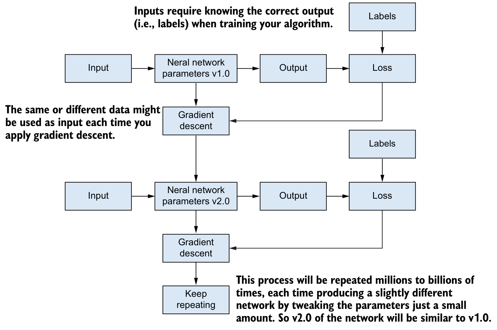

*图 4.3 使用输入和标签（每个输入已知的正确答案）来在梯度下降过程中调整神经网络。网络由参数构成，每次应用梯度下降时，这些参数都会发生少量改变。通过应用数百万或数十亿次梯度下降，我们最终将网络转变为有用的东西。*

<details>
<summary>英文原文</summary>

[Figure]

Figure 4.3 Inputs and labels (the known correct answers for each input) are used to tweak the neural network during gradient descent. A network is made of parameters that are altered a small amount each time gradient descent is applied. We eventually transform the network into something useful by applying gradient descent millions or billions of times.

</details>

如图4.3所示，每次应用梯度下降时，我们都会创建一个新的、略有不同的网络。由于变化很小，这个过程必须执行数十亿次。这样，所有微小的变化累积起来，最终使整个网络发生更显著、更有意义的改变。

<details>
<summary>英文原文</summary>

As figure 4.3 shows, we create a new, slightly different network every time we apply gradient descent. Because the changes are small, this process has to be performed billions of times. This way, all the small changes add up to a more significant, mean-ingful change in the overall network.

</details>

因为用数十亿个token进行训练，所以会有数十亿次参数更新。数据越多，运行梯度下降的次数就越多。数据越少，运行梯度下降的次数就越少。用于训练大模型的数据量，远超一个人一生的阅读量。

<details>
<summary>英文原文</summary>

NOTE Modern LLMs perform

billions of parameter updates because they are trained on billions of tokens. The more data you have, the more times you run gradient descent. The less data you have, the less often you need to run it. The data used to train an LLM is more than you could read in a lifetime.

</details>

梯度下降是一种不断重复应用的数学过程，毫无偏差。它并不能保证一定能奏效，或找到最佳甚至较优的解决方案。尽管如此，许多研究者仍对这一相对简单的方法如此实用感到惊讶。为了帮助你理解梯度下降的工作原理，我们将用一个简单的例子：把球滚下小山丘。球的位置代表神经网络中一个节点的参数值，训练算法可以改变它。小山丘的高度代表损失量，描述模型在训练输入上的表现有多差。我们希望把球滚下山丘，进入最深的山谷，因为那是损失最低的区域，表明模型表现最佳。图4.4展示了这一示例。

<details>
<summary>英文原文</summary>

Gradient descent is a mathematical process that is applied repeatedly without deviation. There are no guarantees that it will work or find the best or even a good solution. Nevertheless, many researchers have been surprised by how practical this relatively simple approach is. To help you understand how gradient descent works, we will use a simple example of rolling a ball down a hill. The ball’s location represents a parameter value for a node in the neural network that the training algorithm can alter. The hill’s height is the amount of loss and describes how poorly the model performs for the training input. We want to roll the ball down the hill into the deepest valley because that is the area with the lowest loss, which indicates that the model is performing its best. An example of this is shown in figure 4.4

</details>

*图：图4.4
此为梯度下降应用于单参数问题的全局宏观图景。曲线展示了给定参数值下的损失函数值。球的位置显示了当前参数值对应的损失。目标是找到对应全局最小值的参数值，即损失最小的理想解。*

<details>
<summary>英文原文</summary>

[Figure]

Figure 4.4 This shows the global big picture of gradient descent applied to a single parameter problem. The curve illustrates the value of the loss function for a given parameter value. The ball’s location shows the loss for the current parameter value. The goal is to find the parameter values corresponding to a global minimum representing the ideal solution with the least loss.

</details>

如你所见，小球可能落入许多低谷。行业术语称此问题为非凸的，因为有多条路径能降低损失，但并非每条路径都必然通向最优解。还需注意的是，这并非一个类比。梯度下降实际上就是用这种方式看待问题的。这些例子展示了梯度下降如何作用于只有一个参数需要优化的模型。在训练大语言模型时，同样的过程应用于数十亿个参数。

<details>
<summary>英文原文</summary>

As you can see, the ball could fall into many valleys. The industry jargon would be to call this problem nonconvex because multiple paths lead to reduced loss, but each path does not necessarily progress toward the best possible solution. It is also important to note that this is not an analogy. Gradient descent literally looks at the world this way. These examples show how gradient descent works for a model with one parameter to optimize. The same procedure is applied to billions of parameters when training an LLM.

</details>

因此，从这个位置出发，我们采用贪心策略，寻找让球沿山坡向下移动的方向。我们在图4.5中应用了两次梯度下降。这表明贪心选项是向左移动。当我们通过调整参数向左移动时，球会沿着斜坡微微下滑。从图中可以看出，向右搜索存在更优解，但由于算法过于简单，梯度下降不太可能找到它。要在这种情况下找到最优结果，需要一种涉及搜索和探索的更智能策略，但在实践中如此做的成本过高。

<details>
<summary>英文原文</summary>

So from this position, we greedily look at which direction to move the ball downhill. We apply gradient descent two times in figure 4.5. This shows that the greedy option is to the left. When we move to the left by adjusting our parameter, we slightly move the ball down the slope. From the graph, you can see that a better solution exists by searching to the right, but due to the algorithm’s simplicity, it is unlikely that gradient descent will find it. Finding the optimal result in this case would require a more intelligent strategy involving searching and exploration, which is too costly to do well in practice.

</details>


*图4.5 **图4.5** 梯度下降算法通过逐步调整参数，寻找损失最小的最优结果。不幸的是，算法会陷入局部最小值，即图中并非最优的区域，因为其他参数值对应着损失更低的区域。*

<details>
<summary>英文原文</summary>

[Figure]

Figure 4.5 The gradient descent algorithm takes steps to adjust parameters to find the optimal outcome with the least loss. Unfortunately, the algorithm gets stuck in a local minimum, an area of the graph that is not optimal because other parameter values correspond to areas with a lower loss.

</details>

同样，注意在图4.5的第二步中，小球卡住了。显然，继续向左移动会实现更低的损失，但这个结果之所以显而易见，是因为我们能看见全貌。梯度下降无法看到整个图景，甚至连附近区域也无法看到。它只知道由当前参数和损失函数决定的精确位置。因此，它是一个贪心过程。像梯度下降这样的贪心过程是简化方法，具有可计算性的理想特性——它们可以多次运行且计算代价不会过高，从而达成结果。贪心过程是短视的，因为它们仅基于当前状态选择下一步最优操作，尽管可能存在更广泛、更优的解决方案。它们这么做是因为，评估当前及所有可能的未来状态是不可能的，因为需要考虑的潜在结果数量太多。计算量实在太大。人们希望，利用有限信息做出许多简单的局部最优决策，通常能带来最积极的结果——在本例中，即最小化损失函数的值。

<details>
<summary>英文原文</summary>

Also, notice that in the second step in figure 4.5, the ball gets stuck. While it is evident that continuing to move to the left will achieve an even lower loss, this result is only obvious because we can see the whole picture. Gradient descent cannot see the entire picture or even what is nearby. It only knows the exact location due to the current parameters and the loss function. Hence, it is a greedy procedure. Greedy procedures such as gradient descent are simplified approaches with the desired property of computability in that they are not prohibitively expensive to run many times to achieve an outcome. Greedy procedures are short-sighted because they choose the next optimal step based only on the current state, although broader, more optimal solutions may exist. They do this because evaluating the current and all possible future states would be impossible due to the number of potential outcomes that need to be considered. It would simply be too much to compute. The hope is that making many simple optimal decisions using limited information will generally lead to the most positive outcome—in this case, minimizing the value of the loss function.

</details>

### 4.2 大语言模型学习模仿人类文本

<details>
<summary>英文原文</summary>

4.2 LLMs learn to mimic human text

</details>

现在我们已经理解了深度学习算法是如何通过指定一个与梯度下降配合使用的损失函数来训练的，我们可以讨论这如何应用于大语言模型。具体来说，我们将重点介绍用于训练大语言模型的数据和损失函数或奖励函数。大语言模型通常在人类撰写的文本上进行训练。具体来说，它们被明确地训练来模仿人类生成的文本。虽然这听起来有点显而易见（它们还能被训练做什么呢？），但这一细节常常被忽视或与其他事情混淆，即使是该领域的专家也不例外。特别是，语言模型并非被训练来做以下任何一件事：

<details>
<summary>英文原文</summary>

Now that we understand how deep learning algorithms are trained by specifying a loss function used with gradient descent, we can discuss how this is applied to LLMs. Specifically, we will focus on the data and loss or reward functions used to train LLMs. LLMs are generally trained on human-authored text. Specifically, they’re explicitly trained to mimic texts produced by humans. While this sounds a bit obvious (what else would they be trained to do?), this detail is commonly missed or confused with other things, even by experts in the field. In particular, language models are not trained to do any of the following things:

</details>

记忆文本、生成新想法、构建世界表征、生成事实准确文本。在深入之前，有必要进一步解释这一概念。当训练一个模型下棋时，它因获胜得到奖励而学会下得很好。相比之下，语言模型只有生成与训练数据完全一致的文本时才会获得奖励。因此，LLM生成的与训练语料文本相似的所有文本都会获得高奖励（或低损失），即使这些生成内容并不真实或不符合事实。正如4.1节所讨论的，这是损失函数与设计者更高层级目标之间错配的一个例子。LLM是在从互联网抓取的数百GB文本数据集上训练的。互联网因包含大量错误（和怪异）信息而闻名。在大多数任务上表现更好的LLM，往往在那些训练数据中常被歪曲的任务上表现更差（参见https://github.com/inverse-scaling/prize的逆缩放奖）。例如，研究人员一致发现，更好的语言模型也更擅长复述常见的错误知识[3]，模仿刻板印象和社会偏见[4]。它们倾向于陷入强化错误的恶性循环。例如，在生成包含bug的代码后，它们更可能生成包含更多bug的代码[5]。这些东西在训练文本中很常见，因此LLM因预测它们而获得正奖励，即使这是错误的。因此，对于LLM来说，基于其损失函数变得更好，也意味着在需要真实性和正确性的任务上变得更差。

<details>
<summary>英文原文</summary>

Memorize text Generate new ideas Build representations of the world Produce factually accurate text It is essential to explain this notion further before we go deeper. When one trains a model to play chess, the model learns to play well because it gets rewarded for winning. A language model, by contrast, only gets rewarded for producing text that looks exactly like the training data. Consequently, all text generated by the LLM that looks like text in the training corpus produces high rewards (or low loss), even when those generations are not truthful or factual. This is an example of misalign-ment between the loss function and the designer’s higher-level goal, as discussed in section 4.1. LLMs are trained on datasets of hundreds of gigabytes of text scraped from the internet. The internet is famous for containing a large amount of incorrect (and weird) information. LLMs that are better at most tasks often end up being worse at tasks that are commonly misrepresented in their training data (see the Inverse Scaling Prize at https://github.com/inverse-scaling/prize). For example, researchers have consistently found that better language models are also better at reproducing common knowledge that is false [3], mimicking stereotypes and social biases [4]. They tend to fall into a downward spiral that reinforces errors. For example, after generating code that contains bugs, they’re more likely to generate code that contains additional bugs [5]. These things are commonly represented in the training text, so LLMs are positively rewarded for predicting them even though it’s wrong. Thus, getting better based on its loss function for an LLM also means getting worse at these tasks that require truth and correctness.

</details>

### 4.2.1 LLM奖励函数

<details>
<summary>英文原文</summary>

4.2.1 LLM reward functions

</details>

之前我们说过，LLM 因生成"看起来像其训练数据"的内容而获得奖励。在本小节中，我们将更具体地探讨这意味着什么。LLM 的训练方式是：向模型展示一个句子的前几个词元，让其预测下一个词元。损失基于该预测相对于训练数据的准确度。例如，模型可能看到"This is a"，并被期望生成"test"。如果模型生成了"test"，则得分；否则失分。这一过程对文本的所有起始片段都适用，如图 4.6 所示。图中，模型被训练独立预测每个高亮显示的词。这种设置并非 LLM 独有，它早已被用于训练循环神经网络（RNN）。然而，LLM 之所以变得如此流行，关键原因之一在于其训练效率远高于 RNN。RNN 必须按顺序逐代训练，因为每个新生成的词都依赖于之前选择的词。而 LLM 由于第 3 章讨论的 Transformer 架构，可以并行训练所有生成步骤。这种并行训练相关生成的能力带来了巨大的速度提升，使得大规模训练成为可能，也是利用海量数据构建当今最先进 LLM 的先决条件。我们之前讨论过，预测下一个词元可能存在问题，因为算法可能会被激励去产生不正确或事实错误的内容。我们还需要讨论，尽管存在这个问题，这种方法为何仍能产生如此令人信服的输出。一个合理的问题是：一个旨在生成最可能的下一个词元的算法，如何能看似执行某种我们可能误认为推理的任务？

<details>
<summary>英文原文</summary>

Previously, we said that LLMs are rewarded for producing data that “looks like its training data.” In this subsection, we will explore what this means more concretely. LLMs are trained by being shown the first couple of tokens of a sentence and having it predict the next token. The loss is based on the accuracy of that prediction compared to the training data. For example, it might be shown “This is a” and be expected to produce “test.” If the model produces “test,” it gets a point, and if it does not, it loses a point. This process is done for all beginning segments of the text, as shown in figure 4.6. Here, it is trained to predict each of the highlighted words independently. This setup is not unique to LLMs. It has been used to train recurrent neural networks (RNNs) for many years. However, an essential part of why LLMs have become so popular is that they can be trained much more efficiently than an RNN. An RNN must be trained on each generation sequentially because each newly generated word depends on the prior words chosen. An LLM can be trained on all generations in parallel due to the transformer architecture discussed in chapter 3. The ability to train a model on related generations in parallel represents a massive speed-up, allowing training at a large scale, and is a prerequisite for building today’s state-of-the-art LLMs using terabytes of data. We discussed how predicting the next token can be problematic because the algorithm may be incentivized to produce incorrect or factually errant outputs. We must also discuss the intuition behind why, despite this, this approach can produce such convincing outputs. It is reasonable to ask: How can an algorithm trained to create the next most likely token seemingly perform something we could mistake for reasoning?

</details>

*图：图 4.6
LLM 会看到这个句子九次，每次都从九段序列末尾的单个词预测中学习。*

<details>
<summary>英文原文</summary>

[Image]

Figure 4.6 An LLM sees this sentence nine times, each time learning from the prediction of a single word at the end of each of the nine sequences.

</details>

为了培养这种直觉，想象一下你会如何尝试预测给定句子中的下一个词。计算机没有快速响应的压力，所以你可以慢慢来。考虑句子“I love to eat <blank>”，猜猜什么词可能填入<blank>。句子的前面部分为你提供了有价值的上下文。既然我们在讨论吃，你几乎可以立即将范围缩小到食物。计算机保存所有可能食物的列表并不困难。现在，如果你考虑本书作者的背景，你会有更多的上下文。我们是来自同一地理区域的美国人，这使得某些美食比其他美食更有可能。LLM不会拥有这个背景，但如果句子更长且上下文更多，你可以像图4.7所示那样开始缩小选择范围。

<details>
<summary>英文原文</summary>

To develop this intuition, imagine how you might try to predict the next token for a given sentence. A computer has no pressure to respond quickly, so take your time. Consider the sentence “I love to eat <blank>,” and try to guess what word might go into the <blank>. The earlier parts of the sentence give you valuable context. Since we are discussing eating, you can almost immediately narrow the scope to a food item. Keeping a list of all possible food items is not difficult for a computer. Now if you consider the background of the authors of this book, you will have even more context. We are Americans in a common geographical area, which makes specific cuisines more likely than others. An LLM will not have this background, but if the sentence was longer and had more context, you could start to narrow down the choices in the same way as shown in figure 4.7.

</details>


*图4.7 上下文有助于对下一个词做出合理的预测。从左往右看，句子中可能出现的额外文本逐步加入。每个句子气泡中的图片展示了新增上下文如何排除预测。*

<details>
<summary>英文原文</summary>

[Image]

Figure 4.7 Context can help you make decent predictions about the next word. As you move from left to right, additional text that might occur in a sentence is added. The images in the thought bubble for each sentence show how the added context eliminates predictions.

</details>

当你识别出前文中的关键词或短语时，你就能洞察到接下来最可能预测的单词。计算机执行这些计算所进行的处理远超人类所需。这种暴力关联主要将范围缩小到非常合理的程度。再次强调，模型将经过数十亿次更新来优化这些关联，从而获得一种有用的能力，这种能力与我们期望的能够理解和响应人类文本的算法目标相关联。然而，相关并非因果，这种下一词预测策略可能导致幽默的错误。大语言模型容易犯“循环论证”错误，即问题的前提暗示了不真实的内容。由于大语言模型并未针对准确性或矛盾进行训练，它会尝试生成一系列可能紧随你误导性问题之后的人性化文本预测。图4.8展示了ChatGPT应对此类问题的一个例子，我们询问了干意面的异常强度。

<details>
<summary>英文原文</summary>

As you identify keywords or phrases in the preceding text, you can gain insight into the best word to predict next. A computer performing these calculations does far more processing than a human requires. This kind of brute-force association mainly narrows the scope to something very reasonable. Again, the model will be updated billions of times to refine these associations and thus acquire a useful capability correlated with our goals of an algorithm able to understand and react to human text. However, correlation is not causation, and the next-word prediction strategy can lead to humorous errors. LLMs are susceptible to a “begging the question” error, where the premise of the question implies something untrue. Since the LLM is not trained for accuracy or contradiction, it attempts to produce a sequence of human-like text predictions that might follow your misleading question. An example of ChatGPT struggling with this kind of problem is given in figure 4.8, where we ask about the exceptional strength of dry spaghetti.

</details>


*图4.8 虽然预测下一个词很强大，但它并未赋予网络推理或逻辑能力。如果我们向ChatGPT提出荒谬不实的问题，它会兴致勃勃地解释这是怎么回事。*

<details>
<summary>英文原文</summary>

[Image]

Figure 4.8 While predicting the next token is powerful, it doesn’t imbue the network with reasoning or logic abilities. If we ask ChatGPT something absurd and untrue, it happily explains how it happens.

</details>

意大利面能支撑自身重量数百倍这一论断的核心是荒谬且不真实的。然而，算法已被预设为通过格式化问题“为什么X如此坚固？”来提供关于材料抗拉强度的答案。模型能提取这一关键上下文。先前的训练数据很可能基于一个事实性问题来解释此类材料属性，这促使模型预测类似回答是合适的。句子的主语（意大利面）和宾语（10磅重物）被用于调整回答的次要细节，而回答的其他部分则是通用的。

<details>
<summary>英文原文</summary>

The core of why spaghetti can support hundreds of times its own weight is absurd and untrue. However, the algorithm has been primed to provide an answer about material tensile strength by formatting the question: “Why is it that X is so strong?” The model can extract this key context. Previous training data likely explains such material properties based on a factual question, which informs the model predicting that a similar response is appropriate. The subject of the sentence (spaghetti) and object (10 lb. weight) are used to inform minor details of the response, which is otherwise generic.

</details>

### 4.3 大语言模型与新颖任务

<details>
<summary>英文原文</summary>

4.3 LLMs and novel tasks

</details>

自回归式下一个词预测策略及其在训练过程中作为损失或奖励函数的本质，为我们理解LLM生成回复的特性以及它们潜在的事实错误提供了宝贵视角。然而，这同样解释了为什么LLM在信息检索方面能够表现出色——它们是一种远比标准搜索引擎强大的关键词搜索工具。针对非事实性回复的局限性，存在多种设计思路来规避。例如，许多LLM方法会在生成结果中添加引用，以便快速验证生成文本所依据的内容是否准确。LLM还可以充当宝贵的共鸣板，一个可以与之碰撞灵感、激发创意的准合作伙伴。关键的是，这也有助于你理解一个应避免使用LLM的重要场景——处理全新问题和任务时，因为此时它们更容易产生错误。LLM通常不擅长执行全新任务。判断你的任务是否新颖可能颇具挑战，因为互联网上内容包罗万象，无奇不有。互联网上存在着大量随机内容，包括如何通过编程绘制鸭子和独角兽的竞赛[6]。如果任务与之前见过的某个任务足够相似，或者与训练数据中的其他内容结构类似，你可能会得到看似合理的结果。这种结果可能非常有用，但当你任务与训练数据中已有内容的差异度增大时，其质量会下降。例如，我们请ChatGPT用Python编写计算数学常数π的代码。这个任务并不新颖；网上有大量类似代码，ChatGPT忠实地为我们返回了正确的代码。

<details>
<summary>英文原文</summary>

The nature of the autoregressive, next-word prediction strategy and its use as a loss or reward during the training process gives us valuable insight into the nature of an LLM’s generated responses and how they can potentially be factually inaccurate. However, it also shows us why LLMs can be effective for looking up information, as a far more powerful keyword search than a standard search engine. There are ways to design around the limitations of nonfactual responses. For example, many LLM approaches add citations to the generated output so that it is possible to quickly verify that factually accurate content was used to produce the generated text. An LLM can also be a valuable sounding board, a pseudo-partner to bounce ideas off of as a source of inspiration and creativity. Critically, this also helps you understand a key case where you should avoid LLMs because they will be more likely to produce errors—novel problems and tasks. LLMs are generally not good at performing novel tasks. Figuring out if your task is novel can be pretty challenging, as the internet is weird. Tons of random things exist on the internet, including competitions on how to programmatically draw ducks and unicorns [6]. If the task is sufficiently similar to one already seen before or structurally similar to other things in the training data, you may end up with something that appears reasonable. This result can be extremely useful, but it can degrade as your task becomes more unique compared to what exists in the training data. For example, we asked ChatGPT to write code that calculates the mathematical constant 휋(pi) in Python. This task is not novel; tons of code like this exists online, and ChatGPT faithfully returns the correct code for us.

</details>

*代码：代码清单4.1 ChatGPT用Python计算π*

```
def calculate_pi(terms):
pi = 0
for i in range(terms):
term = ((-1) ** i) / (2 * i + 1)
pi += term
pi *= 4
return pi
Tests the
```

<details>
<summary>英文原文</summary>

Listing 4.1 ChatGPT calculating pi in Python

</details>

测试该函数；项数越多，近似越精确。print(calculate_pi(1000000))。现在，我们让ChatGPT进行一项不算太难的外推。我们让ChatGPT将此函数翻译成编程语言Modula-3。这个任务不算太大的外推；Modula-3是一种风格类似的编程语言，且具有历史意义，它影响了当今几乎所有最流行语言的最终设计。然而，它过于冷门。如今你几乎找不到这种编程语言的例子，主要出现在大学编译器课程中。下一个清单展示了ChatGPT的合理尝试。正如你从本章上下文中所能预料的，ChatGPT犯了一些错误，已在清单中标记。

<details>
<summary>英文原文</summary>

Tests the function; the more terms, the more accurate the approximation print(calculate_pi(1000000)) Now let us force ChatGPT to do some not terribly challenging extrapolation. We asked ChatGPT to translate this function to the programming language Modula-3. This task is not too big of an extrapolation; Modula-3 is a programming language with a similar style and a historically significant programming language that influenced the eventual design of almost all the most popular languages today! However, it is excessively esoteric. You can find very few examples of this programming language today, mainly in the context of university compiler classes. The next listing shows Chat-GPT’s reasonable attempt. As you may have been able to predict from the context of this chapter thus far, ChatGPT made some errors, marked in the listing.

</details>

*代码：代码清单4.2 ChatGPT用Modula-3计算π*

```
MODULE CalculatePi;
Missing EXPORTS Main;
IMPORT IO, Real;
PROCEDURE CalculatePi(terms: INTEGER): REAL;
VAR
pi: REAL := 0.0;
i: INTEGER;
BEGIN
FOR i := 0 TO terms - 1 DO
pi := pi + ((-1.0) ** FLOAT(i)) / (2.0 * FLOAT(i) + 1.0);
** isn’t a
** isn’t an operator.
END;
RETURN 4.0 * pi;
END CalculatePi;
PutReal can take only one
optional second argument,
and it’s not an integer.
BEGIN
IO.PutReal(CalculatePi(1000000), 0, 15);
END CalculatePi.
This short program has three errors that would prevent it from working. It is more
interesting that ChatGPT gets these wrong because it confidently extrapolates stan-dard coding practices from other languages. (In this case, confidently means that
ChatGPT does not warn us of its potential errors. One of the authors likes to say
that ChatGPT sounds like their most overconfident and often incorrect friend.) In
this case, ** is a commonly used exponentiation function, so ChatGPT decides that
Modula-3 supports this operation. As far as we can tell from scouring the internet,
Modula-3 has no documented example of how to exponentiate a variable. Because
most programming languages support this action with a ^, **, or pow() option, Chat-GPT just extrapolates one into existence. The correct answer would be that it must
first implement a pow function and then use it to compute pi.
The arguments provided to the PutReal function are another mystery. Our best
guess is that the 15 corresponds to an extrapolation of printing out 15 digits of a
floating-point value, a typical default when calculating pi. Regardless, it is not how
that function works.
The more significant point is that ChatGPT gets some of the nuanced details right
but only for the parts that can be found on the internet and are already explained
(e.g., FLOAT(i) is required, as is doing 4.0 * pi instead of 4 * pi). The tasks without
examples on the internet are the ones where ChatGPT makes errors.
```

<details>
<summary>英文原文</summary>

Listing 4.2 ChatGPT calculates pi in Modula-3

</details>

这个例子也突显了当前LLM中“推理”的感知与实际之间的局限。Modula-3的完整语言规范可在线获取，并记录了所有这些细节或它们的不存在。ChatGPT几乎必然见过许多其他编程语言规范、解析器规范以及数百万行常见编程语言的代码。如果一个人拥有这样的背景知识和资源，要完成避免所有三个错误所需的逻辑归纳应该不会太难。然而，LLM并不执行任何归纳过程，因此尽管有大量可用信息，它仍然会出错。这并不是说结果不令人印象深刻，它可以成为加速代码开发或使用不熟悉API和语言的有价值工具。但它也告诉你，这类工具对于广泛使用且文档完善的编程语言和API来说效果会更好，尤其是当它们符合预期标准时。例如，大多数数据库使用SQL语言，这使得对同样使用SQL的新型数据库如何使用的准确推断更有可能。

<details>
<summary>英文原文</summary>

This example also highlights the limits of perceived versus actualized “reasoning” within LLMs today. The complete language specification for Modula-3 is available online and has documented all of these details or their lack of existence. ChatGPT has almost surely seen many other coding language specifications, parser specifications, and millions of lines of code in common programming languages. If a person had this background knowledge and resources, performing the logical induction required to avoid all three errors should not be too challenging. However, the LLM does not perform any induction process and, thus, makes errors despite the breadth of available information. This is not to say that the result is not massively impressive, and it can be a valu-able tool to accelerate your own code development or use of unfamiliar APIs and languages. But it also informs you that such tools will work far better for widely used and documented languages and APIs, especially if they conform to expected standards. For example, most databases use the language SQL, which makes accurate extrapolation of how to use a novel database that also uses SQL more likely.

</details>

### 4.3.1 未能正确识别任务

<details>
<summary>英文原文</summary>

4.3.1 Failing to identify the correct task

</details>

另一个值得注意的案例是，当LLM无法正确识别其应执行的任务时，它们会回答一个不同于用户意图的问题。无法正确识别任务曾是原始GPT-3等模型的一个重大问题，但后续工作通过增加训练数据中任务结构化示例的数量，显著提升了后来ChatGPT模型遵循指令的能力。然而，在某些情况下，ChatGPT仍然会无法识别正确的任务。例如，通过询问一个与常见任务略有不同的不寻常任务，或者以不熟悉的方式修改模型多次见过的题目，可以可靠地引发这种行为。一个例子是著名的逻辑谜题：用一条船将一棵白菜、一只山羊和一只狼运过河。谜题规定，山羊不能与白菜单独留下（因为山羊会吃掉白菜），也不能与狼单独留下（因为狼会吃掉山羊）。ChatGPT可以快速解决这个谜题，但如果我们稍微改变谜题的逻辑结构，模型会继续使用旧的推理，如图4.9所示。虽然通常很难将LLM的错误追溯到具体原因，但在本例中，模型欣然告诉我们“确保没有物品（白菜、山羊、狼）被无人看管地留在一起。”虽然这一指令在白菜/山羊/狼谜题的原始版本中是正确的（并且很可能基于逻辑问题中约束条件的描述），但模型并未意识到，在给定版本中，山羊和狼单独在一起是没有问题的。不仅无需按建议交换动物，而且ChatGPT的建议会失败，因为它将狼和白菜放在了一起，而这是我们明确禁止的。这种现象的另一个有趣例子发生在你移除“需要留下任何东西”这一条件时。对谜题的任何逻辑理解都表明，你只需要将所有东西装上船然后过河。然而，模型又一次过于习惯于回答它之前见过多次的问题版本，并照做了。

<details>
<summary>英文原文</summary>

Another notable case in which LLM’s fail is when they cannot correctly identify the task they are supposed to perform and instead will answer a question different from what the user intended. Failure to correctly identify the task used to be a substantial problem for models like the original GPT-3, but subsequent work aimed at increasing the number of task-structured examples in the training data has substantially increa-sed the ability of later ChatGPT models to follow instructions. However, ChatGPT will still fail to identify the correct task in some cases. For example, this behavior can be elicited reliably by asking about an unusual task subtly different from a common task or by modifying a problem it has seen many times in an unfamiliar way. One example is a famous logic puzzle about bringing a cabbage, a goat, and a wolf across a river in a boat. The puzzle stipulates that the goat can’t be left alone with the cabbage (as the goat will eat it) or with the wolf (which will devour the goat). ChatGPT can quickly solve this puzzle, but if we change the logical structure of the puzzle slightly, the model continues to use the old reasoning as shown in figure 4.9. While it is often hard to trace errors made by LLMs back to specific causes, in this case, the model happily tells us to “ensure that none of the items (cabbage, goat, wolf) are left together unsupervised.” While this instruction is correct in the original version of the cabbage/goat/wolf problem (and was likely based on the specification of the constraints in the logic problem), the model is unaware that the given version has no problem with the goat and wolf being alone together. Not only is there no need to swap the animals as suggested, but ChatGPT’s advice will fail because it places the wolf and cabbage together, which we explicitly disallowed. Another curious example of this phenomenon happens when you remove the need to leave anything behind. Any logical understanding of the puzzle makes it clear that you only need to load everything into the boat and cross. Yet again, the model is too accustomed to answering the version of the problem that it has seen many times before and does so.

</details>


*图4.9 由于LLM的训练方式，ChatGPT未能解决经典逻辑谜题的两个修改版本。经常以相同常见形式出现的内容（例如一个著名逻辑谜题）会导致模型照搬常见答案。即使内容发生了对人而言显而易见的重要修改，这种情况也可能发生。*

<details>
<summary>英文原文</summary>

[Figure]

Figure 4.9 ChatGPT fails to solve two modified versions of a classic logic puzzle due to how LLMs are trained. Content frequently occurring in the same general form (e.g., a famous logic puzzle) leads the model to regurgitate the frequent answer. This can happen even when the content is modified in important ways that are obvious to a person.

</details>

要理解为什么会发生这种情况，有必要回忆第3章讨论的LLM训练的自回归性质。模型被明确激励去基于先前内容生成内容。为了解决重新表述的逻辑谜题而生成的内容，在词汇和顺序上几乎与解决原始逻辑谜题的内容一模一样。因此，在Transformer层的查询和键配对中，这是一个很好的模糊匹配，从而产生构成原始谜题解决方案的值。模糊匹配完成后，先前的解决方案通过Transformer使用的注意力机制忠实返回。尽管这一策略非常有助于模型正确预测这个著名谜题的token，但它并不涉及通过谜题的逻辑进行推理。

<details>
<summary>英文原文</summary>

To understand why this happens, it is important to recall the autoregressive nature of LLM training discussed in chapter 3. The model is explicitly incentivized to generate content based on prior content. The content generated to solve the reframed logic puzzle appears almost exactly like the content that solves the original logic puzzle in terms of words and order. As a result, it is a good fuzzy match in the transformer layer’s query and key pairing that produces the values that make up the original puzzle’s solution. The fuzzy match is made, and the previous solution is faithfully returned via the attention mechanism used by the transformers. While this strategy is excellent for the model to correctly predict the tokens for the famous puzzle, it does not involve reasoning through the puzzle’s logic.

</details>

### LLM 无法规划

<details>
<summary>英文原文</summary>

4.3.2 LLMs cannot plan

</details>

LLM自回归特性的另一个微妙限制在于，它们只能处理在上下文中看到的信息。LLM被训练为接受一个输入并生成合理的后续内容。然而，它们无法进行规划、做出承诺或跟踪内部状态。一个很好的例子是当你尝试与ChatGPT玩“20个问题”游戏时。当人类玩“20个问题”时，他们会预先承诺一个隐藏信息，即他们选择用来通过答案识别出的物体。当ChatGPT玩这个游戏时，它会逐个回答问题，然后事后找到一个与所提供答案一致的输出。图4.10展示了这个例子，其中显示了玩“20个问题”时可能的对话树。当有人与LLM玩游戏时，这些对话树中会随机选择一个，而不是产生一个在整个游戏中保持一致的藏物品对象。

<details>
<summary>英文原文</summary>

Another subtle limitation of the autoregressive nature of LLMs is that they can only work with the information they see in context. LLMs are trained to take an input and produce a plausible continuation. However, they cannot plan, make commitments, or track internal states. A great example occurs when you attempt to play the game 20 questions with ChatGPT. When a human plays 20 questions, they precommit to a piece of hidden information, the object they’ve chosen to use the answers to identify. When ChatGPT plays this game, it answers questions individually and then, after the fact, finds an output consistent with the provided answers. This example is illustrated in figure 4.10, which shows possible dialog trees for playing 20 questions. When someone plays a game with an LLM, one of these dialog trees is chosen randomly instead of coming up with a target object that stays consistent throughout the game.

</details>


*图4.10 对话代理在游戏开始时并不确定具体对象。*

<details>
<summary>英文原文</summary>

[Figure]

Figure 4.10 The dialogue agent doesn’t commit to a specific object at the start of the game.

</details>

### 4.4 如果LLM不能很好地进行外推，我还能使用它们吗？

<details>
<summary>英文原文</summary>

4.4 If LLMs cannot extrapolate well, can I use them?

</details>

大部分需要完成的工作并非新颖或全新，至少还没新到让LLM无法处理的程度。然而，认识到LLM的能力会随着所需逻辑或细微差别的增加而迅速下降，这有助于你缩小其使用范围。在设计生产级计算机系统时，一个关键因素是考虑工具的使用时机和方式的范围。如果像ChatGPT这样的LLM产品面向普通用户开放，而没有限定使用范围，用户就会提出各种你意想不到的、随机且疯狂的要求。虽然这对研究可能很有价值，但在生产应用中往往不切实际。尽管用户和客户会尝试对你的LLM应用做出不可预测的行为，但如果你限制系统的访问权限，并围绕用户的具体目标、有限用例来设计，甚至限制他们的输入如何到达你的LLM，在这种情况下，你就能构建出用户体验更为可靠的产品。

<details>
<summary>英文原文</summary>

Most work that needs to be done is not novel or new. At least, it’s not novel or new enough to a degree that would make an LLM fail. However, understanding that an LLM’s abilities degrade quickly as more logic or nuance is required can help you narrow the scope of how you use it. When we design production-grade computer systems, an essential factor to con-sider is the scope of when and how the tool will be used. When you make an LLM product like ChatGPT available to a general audience without a specific scope, people will ask it to do all sorts of random, crazy things you do not expect. While this might be great for research, it is often not practical for production applications. Although your users and customers will try to do unpredictable things with your LLM application, suppose you limit who has access to the system and design around your users having a specific goal, limited use cases, or even restrict how their inputs get to your LLM. In that case, you can build something with a much more reliable user experience.

</details>

LLM在提供低成本的编码或数据处理方面表现出色，尤其是在处理日常任务中那些格式或整理得不太干净的数据时。然而，通过给用户提供有限的选择，你可以在降低风险的同时获得实用性。让用户从有限的提示代码中选择，或者让用户决定提示运行在哪个数据源（如某个内部数据库）上，这样可以防止（大部分）用户向LLM输入任意文本。

<details>
<summary>英文原文</summary>

LLMs are excellent at providing low-effort coding or data processing, especially when you are doing everyday tasks on data that is not so cleanly formatted or curated. However, you can get utility without as much risk by giving users a finite set of choices. Having a limited set of prompts as code that a user can choose from or letting a user decide what data source (e.g., some internal database) a prompt is run over allows you to keep (most) people from giving an LLM arbitrary text.

</details>

从用户体验角度来看，这并不理想。其次，这变成了一个被称为新颖性检测或异常检测的任务。这个问题极具挑战性，几乎不可能以绝对无差错的方式解决。因此，我们提倡预防胜于检测，即选择那些不需要通过分析LLM输入或输出来高度准确预测失败的使用场景。

<details>
<summary>英文原文</summary>

it is not great from a user experience perspective. Second, it becomes a task known as novelty detection or outlier detection. This problem is challenging and is likely impossible to solve in a way that is guaranteed to be error-free. As a result, we encourage prevention over detection by choosing use cases that do not require highly accurate prediction of failures through the analysis of LLM input or output.

</details>

提示工程是为大语言模型设计输入以诱导出期望行为的艺术。语言模型对其输入的精确框架非常敏感，因此能够设计出被恰当回应的输入是一项非常有价值的技能。在使用大语言模型时，一个反复出现的主题是人们通常不考虑如何正确与之交互。提示大语言模型的最佳方法是思考你感兴趣的输出类型在训练数据中会是什么样子，然后写出它的前四分之一。相反，人们常常描述他们希望语言模型执行的任务，假设这种澄清会使大语言模型专注于问题。不幸的是，这种方法会产生不一致的结果，并激发了通过向大语言模型输入大量指令和响应作为训练数据进行微调的研究。

<details>
<summary>英文原文</summary>

is the art of crafting an input to a large language model that induces desirable behavior. Language models can be very sensitive to the exact framing of their inputs, making the ability to design inputs that are responded to appropriately highly valuable. A recurring theme in using LLMs is that people typically don’t think about how to interact with them correctly. The best way to prompt an LLM is to think about how the kind of output you’re interested in would look like in the training data and then write the first quarter of it. Instead, people often describe the task they want a language model to perform, assuming that this clarification will keep an LLM focused on the problem. Unfortunately, the approach yields inconsistent results and has inspired research in tuning LLMs by feeding them a large number of instructions and responses as training data.

</details>

2019年，里奇·萨顿提出了“苦涩的教训”这一术语，用以描述他在机器学习领域的经验。“从70年的人工智能研究中可以得出的最大教训是，利用计算的通用方法最终是最有效的，而且优势显著。”[7]人们真切地感受到，Transformer就是这一原则的终极体现。你可以不断将它们做大，采用更高的并行度进行训练，并增加更多GPU。这与循环神经网络（RNN）形成了鲜明对比，RNN几乎无法像Transformer那样高效并行化。在图像领域，生成对抗网络（GAN）方法也难以达到十亿参数规模，同样印证了这一点。而LLM中基于Transformer的方法则可以轻松扩展到数百亿参数，从而构建出更大更好的模型。从解决方案设计的角度看，你现在的原型可能会因模型规模而面临显著的限制。更大的模型需要更多资源，预测耗时也更长。你的用户能接受的最高响应时间是多少？在此速度下运行你的模型所需的硬件成本有多高？模型规模的增长速度超过了消费级硬件的提升速度。因此，你可能无法将模型部署到嵌入式设备上，或者需要联网来分摊成本。因此，在设计时必须考虑网络基础设施，以满足持续连接的需求。这一需求会增加电池消耗，当持续开启Wi-Fi而非进行本地计算时，这是一个需要考虑的因素。因此，尽管更大的模型更准确，但设计上的限制可能使其无法以实用的方式部署。将这些限制与本章所学的LLM预测方式及失败场景相结合，将使你能够更好地理解如何利用LLM最有效地解决你关心的问题。

<details>
<summary>英文原文</summary>

In 2019, Rich Sutton coined the term “the bitter lesson” to describe his experience with machine learning. “The biggest lesson that can be read from 70 years of AI research is that general methods that leverage computation are ultimately the most effective, and by a large margin” [7]. There is a genuine sense that transformers are the ultimate example of this principle. You can keep making them bigger, training them with more parallelism, and adding more GPUs. This differs notably from RNNs, which cannot be parallelized nearly as efficiently as a transformer. We also see this in the image domain with Generative Adversarial Network (GAN) methods, which struggle to reach the billion-parameters scale. The transformer-based methods used in LLMs easily scale to the tens of billions, allowing the construction of bigger and better models. From a solutions design perspective, your prototype today may encounter signifi-cant constraints due to model size. Larger models require more resources and take longer to make predictions. What is the maximum response time your users will accept? How expensive is the hardware needed to run your model at this speed? The growth rate in model size exceeds the growth rate of consumer hardware. As a result, you may not be able to deploy your model to embedded devices, or you may require internet connectivity to offload the costs. Consequently, you need to consider networking infrastructure in your design to handle the need for continuous connection. This requirement increases battery usage, which is a consideration when continually running a Wi-Fi radio instead of local computing. So although larger JL 545 2230 models are more accurate, design constraints may prevent their deployment in a practical manner. Combining these constraints with the facts about how LLMs make their predictions and the use cases of when and where LLMs fail that you learned in this chapter positions you well for understanding how to use LLMs to solve the problems you care about most effectively.

</details>

### 总结

<details>
<summary>英文原文</summary>

Summary

</details>

深度学习需要一个损失/奖励函数，该函数具体量化算法在预测方面的糟糕程度。梯度下降通过逐步使用损失/奖励函数来调整网络的参数。大语言模型通过预测下一个词元来训练以模仿人类文本。这个任务足够具体，可以训练模型去执行它，但它与推理等高层目标并非完美相关。大语言模型在与训练数据中常见且重复的任务类似的任务上表现最佳，但当任务足够新颖时则会失败。

<details>
<summary>英文原文</summary>

Deep learning needs a loss/reward function that specifically quantifies how badly an algorithm is at making predictions This loss/reward function should be designed to correlate with the overarching goal of what we want the algorithm to achieve in real life. Gradient descent involves incrementally using a loss/reward function to alter the network’s parameters. LLMs are trained to mimic human text by predicting the next token. This task is sufficiently specific to train a model to perform it, but it does not perfectly correlate with high-level objectives like reasoning. LLMs will perform best on tasks similar to common and repetitive tasks observed in its training data but will fail when the task is sufficiently novel.

</details>


### 本章插图（补充）

![图4.1 投资回报难以预测，部分原因在于它们并非平滑。（图像修改自[2]，遵循知识共享许可协议。）](assets/ch4-fig4.1.jpg)

*图4.1 投资回报难以预测，部分原因在于它们并非平滑。（图像修改自[2]，遵循知识共享许可协议。）*


*图4.4 此为梯度下降应用于单参数问题的全局宏观图景。曲线展示了给定参数值下的损失函数值。球的位置显示了当前参数值对应的损失。目标是找到对应全局最小值的参数值，即损失最小的理想解。*


*图 4.6 LLM 会看到这个句子九次，每次都从九段序列末尾的单个词预测中学习。*


---

## 第 5 章: 如何约束 LLM 的行为

如何约束LLM的行为？

<details>
<summary>英文原文</summary>

How do we constrain the behavior of LLMs?

</details>

### 本章涵盖

- 约束LLM行为以使其更有用
- 我们可以约束LLM行为的四个领域
- 微调使我们能够更新大型语言模型。
- 强化学习如何改变LLM的输出
- 使用检索增强生成修改LLM的输入

<details>
<summary>英文原文</summary>

This chapter covers Constraining LLM behavior to make them more useful The four areas where we can constrain LLM behavior How fine-tuning allows us to update LLMs How reinforcement learning can change the output of LLMs Modifying the inputs of an LLM using retrieval augmented generation

</details>

通过控制模型允许输出的内容来让模型更有用，这听起来可能有些反直觉，但在使用LLM时几乎总是必要的。这种控制的必要性在于，当面对任意文本提示时，LLM会试图生成它认为合适的响应，而不管其预期用途是什么。考虑一个帮助客户购买汽车的聊天机器人；你肯定不希望LLM因为客户问了一些与带孩子去踢足球相关的问题，就偏离脚本大谈特谈田径或体育。在本章中，我们将更详细地讨论为什么要限制或约束LLM的输出，以及这些约束的细微差别。准确约束LLM是最难实现的事情之一，因为LLM的训练方式是基于其在训练数据中观察到的内容来完成输入。目前，没有完美的解决方案。我们将讨论可以修改LLM行为的四个潜在位置：

<details>
<summary>英文原文</summary>

It may seem counterintuitive that you can make a model more useful by controlling the output the model is allowed to produce, but it is almost always necessary when working with LLMs. This control is necessitated by the fact that when presented with an arbitrary text prompt, an LLM will attempt to generate what it believes to be an appropriate response, regardless of its intended use. Consider a chatbot helping a customer buy a car; you do not want the LLM going off-script and talking to them about athletics or sports just because they asked something related to taking the vehicle to their kid’s soccer games. In this chapter, we will discuss in more detail why you would want to limit, or constrain, the output an LLM produces and the nuances associated with such constraints. Accurately constraining an LLM is one of the hardest things to accomplish because of the nature of how LLMs are trained to complete input based on what they observe in training data. Currently, there are no perfect solutions. We will discuss the four potential places where an LLM’s behavior can be modified:

</details>

在训练开始之前，整理用于训练LLM的数据；改变LLM的训练方式；在一组数据上微调LLM；在训练完成后编写特殊代码来控制模型输出。这四种情况总结在图5.1中。开发LLM的每个阶段都会影响到下一个阶段。微调阶段，即在较小的数据集上进行的第二轮训练，对于ChatGPT这类工具如今的工作方式最为重要，也是最可能在实际中采用的方法。我们在第2至4章中学到的第一个、规模更大的训练阶段通常被称为预训练，因为它发生在微调使模型变得有用之前。预训练过程产生的模型有时被称为基础模型或基座模型，因为它是构建任务特定（即微调后）模型的起点。

<details>
<summary>英文原文</summary>

Before training occurs, curating the data used to train the LLM By altering how the LLM is trained By fine-tuning the LLM on a set of data By writing special code after training is complete to control the outputs of the model These four cases are summarized in figure 5.1. Each stage of developing an LLM feeds into the next. The fine-tuning stage, a second round of training done on a smaller data set, is the most important for how tools like ChatGPT function today and the most likely approach you might use in practice. The first, larger training stage we’ve learned about in chapters 2 to 4 is often referred to as pretraining because it occurs before fine-tuning makes the model useful. The model produced by the pretraining process is sometimes referred to as either a base model or a foundation model because it is a point from which to build a task-specific, or fine-tuned, model.

</details>

*图：图5.1
可以在四个干预点来改变或约束LLM的行为。图中间展示了模型训练的两个阶段，模型参数在此阶段被修改。左侧，也可以在模型训练之前修改训练数据。右侧，可以在模型训练之后拦截模型输出，并编写代码来处理特定情况。*

<details>
<summary>英文原文</summary>

[Figure]

Figure 5.1 One may intervene to change or constrain an LLM’s behavior in four places. The two stages of model training are shown in the middle of the diagram, where the model’s parameters are altered. On the left, one could also alter the training data before model training. On the right, one could intercept the model outputs after model training and write code to handle specific situations.

</details>

鉴于微调的重要性和有效性，本章将主要探讨这一要素及其执行方式。

<details>
<summary>英文原文</summary>

Due to the importance and effectiveness of fine-tuning, we will spend most of the chapter on that factor and how it may be performed.

</details>

### 5.1 为何要约束行为？

<details>
<summary>英文原文</summary>

5.1 Why do we want to constrain behavior?

</details>

大语言模型之所以极为成功，是因为它们是首个实现“用普通英语告诉计算机做什么，它就能去做”这一理念的技术。通过非常明确地说明你想要什么、设定具体的细节层次并指定特定的语气，你可以让大语言模型成为一个令人惊叹的实用工具。

<details>
<summary>英文原文</summary>

LLMs are incredibly successful because they are the first technology to deliver on the idea of “Tell a computer what to do in plain English, and it does it.” By being very explicit about what you want to happen, establishing a specific level of detail and specifying a certain tone, you can get an LLM to be a shockingly effective tool.

</details>

这一详细的指令集被称为提示词，而设计优质提示词的艺术被称为提示工程。例如，我们可以为汽车销售机器人开发一个提示词，如图5.2所示。

<details>
<summary>英文原文</summary>

This detailed set of instructions is called a prompt, and the art of designing a good prompt has been referred to as prompt engineering. For example, we could develop a prompt for a car-selling bot as demonstrated in figure 5.2.

</details>


*图5.2 像 ChatGPT 这样的商用大语言模型被设计成遵循指令（在一定限度内），并能以非常高的效率执行大量低认知或模式匹配任务。这些任务包括模式匹配等程式化写作，以及扮演汽车销售员等指令遵循任务。*

<details>
<summary>英文原文</summary>

[Image]

Figure 5.2 Commercial LLMs like ChatGPT are designed to follow instructions (within some limits) and can perform a lot of low-cognition or pattern-matching tasks with very high efficacy. These tasks include stylized writing, such as pattern matching, and instruction following, such as roleplaying as a car salesperson.

</details>

你可以给大语言模型一个提示，要求它将数据整理成逗号分隔值格式，以便复制到 Excel 中。你可以设计一个提示，说明如何将自由格式的问卷回答归类为若干主题摘要。在所有情况下，提示设计本质上都是在限制或约束模型行为，使其聚焦于特定任务和目标集。然而，我们在前面章节讨论的分词和训练技术并不能实现这种指令遵循能力。

<details>
<summary>英文原文</summary>

You could give an LLM a prompt on organizing data into comma-separated values so that you can copy them into Excel. You could design a prompt about how to categorize free-form survey responses into summarized themes. In all cases, prompting is an exercise in limiting, or constraining, the behavior to a particular task and set of goals. Yet, the tokenization and training techniques we have discussed in the previous chapters do not enable this kind of instruction following.

</details>

5.1.1 基础模型不够实用。按照第4章所述流程训练LLM，得到的模型通常被称为基础模型，因为它能作为构建应用或微调模型的基础平台。遗憾的是，基础模型对大多数人来说并不实用，因为它们没有通过用户友好的界面展示其内在知识，难以保持话题聚焦，有时还会生成不雅内容。基础模型甚至没有像ChatGPT那样以聊天机器人的概念进行训练。

<details>
<summary>英文原文</summary>

5.1.1 Base models are not very usable Training an LLM following the process described in chapter 4 produces a model typically referred to as a base model because it can serve as a base platform for building applications or fine-tuned models. Unfortunately, base models are not very useful to most people because they don’t expose their underlying knowledge via a user-friendly UI, they can be challenging to keep on-topic, and sometimes they produce unsavory content. Base models are not even trained with the concept of being a chatbot like ChatGPT is.

</details>

### 5.1.2 并非所有模型输出都符合期望

<details>
<summary>英文原文</summary>

5.1.2 Not all model outputs are desirable

</details>

- 有时，模型认为文档中接下来可能出现的内容是不合适的。
- 这有几种原因，包括记忆——有时，LLM会生成训练数据中序列的精确长副本，这通常被称为记忆，指的是模型通过记忆从训练集中重现文本。记忆可能是有益的，例如记忆特定事实问题的答案。比如，如果有人问“亚伯拉罕·林肯生于何时？”，你希望模型复述“1809年2月12日”。然而，如果记忆导致模型侵犯版权，也可能非常有害。如果有人要求“给我一份Edward Raff的《Inside Deep Learning》的副本”，而模型生成了逐字副本，Edward可能会因为你侵犯版权而生气！
- 网络上的不良内容——网络上并非所有内容都适合展示给用户。互联网上有很多恶意和仇恨内容，以及从常见误解到阴谋论的事实错误信息。尽管模型开发者通常会在训练模型前尝试过滤这些数据，但这并不总是可能的。
- 缺失和新信息——不便的是，在我们训练模型后，世界在不断发展和变得更加复杂。因此，一个基于截至2018年信息训练的模型将不知道之后发生的任何事情，比如COVID-19或令人噩梦般的“necrobotics”发明[1]。但你可能希望模型了解这些新发展以保持有用，而无需支付高昂成本从头重新训练基础模型。

<details>
<summary>英文原文</summary>

Sometimes, what a model thinks is likely to come next in a document is undesirable. There are several reasons for this, including Memorization—Sometimes, LLMs can generate long, exact copies of sequences found in their training data, which is often referred to as memorization, which refers to the idea that the text is being reproduced by memory from the training set. Memorization can be beneficial, such as memorizing the answers to specific factual questions. For example, if someone asks, “When was Abraham Lincoln born?” you want the model to regurgitate “February 12, 1809.” However, it can also be substantially detrimental if it leads a model to infringe copyright. If someone asks for “A copy of Inside Deep Learning by Edward Raff,” and the model produces a verbatim copy, Edward may be upset with you for copyright infringement! Bad things on the web—Not everything found on the internet is something you would want to expose a user to. There is a lot of vile and hateful content on the internet, as well as factually incorrect info ranging from common misconcep-tions to conspiracy theories. While model developers often try to filter out this data before training the model, that’s not always possible. Missing and new information—Inconveniently, the world keeps evolving and growing more complex after we train our models. So a model trained on information up to 2018 will not know of anything that happened after, such as COVID-19 or the nightmare-fuel invention of necrobotics [1]. But you may want your model to know about these developments to remain useful, without having to pay a considerable cost to retrain your base model from scratch.

</details>

等待法律体系跟上步伐：我们不是你的律师，这里也不是法律教材！围绕LLM的法律问题很复杂，合理使用和侵权之间存在大量细微差别。搜索引擎可以逐字显示来源内容，但这是为什么？一系列明确针对这些问题的法律，比如《数字千年版权法案》（DMCA），以及法院判决先例，比如Field v Google, Inc.案（412 F.Supp. 2d 1106 [D. Nev. 2006]），逐步确立了可接受和不可接受的使用行为。然而，立法和法院判例都需要时间建立，而生成式AI的变革并不能完全契合现有的法律理解。

<details>
<summary>英文原文</summary>

Waiting for the legal system to catch up We are not your lawyers; this is not a law book! The legal problems around LLMs are complex, and there is a lot of nuance regarding fair use and infringement. Search engines can show you the content of their sources verbatim, but why? A combina-tion of laws explicitly addressing these concerns, such as the Digital Millennium Copyright Act (DMCA), and precedents set by court rulings, such as Field v Google, Inc. (412 F.Supp. 2d 1106 [D. Nev. 2006]), establish acceptable and nonaccepta-ble use over time. However, legislation and court cases take time to create, and the revolution of generative AI does not fit neatly into existing legal understanding.

</details>

GPT-3.5 和 GPT-4 经过改进，可以避免回答它们不知道的问题（虽然并非总是成功），但我们可以看看一些开源基础模型，比如 GPT-Neo，在没有主动防御措施的情况下会发生什么。例如，如果我们编造一种名为 MELTON-24 的新假药，并问 “What is MELTON-24, and can it help me sleep better?” 我们会得到无益的回答： “There is a great number of sleep problems that go with Melatonin, including insomnia and fatigue.这会引发失眠，并说明了为什么避免某些抑制褪黑素的食物很重要。” 在这种情况下，MELTON 与 melatonin（褪黑素）的相似性以及“sleep”的提示足以让模型联想到褪黑素这个主题。尽管如此，答案显然是无意义的，因为 MELTON-24 并不存在。理想情况下，我们希望模型能够识别并回应，承认自己缺乏信息，而不是像这里这样生成更多文本。

<details>
<summary>英文原文</summary>

GPT-3.5 and 4 have been improved to avoid answering things they do not know (not always successfully), but we can look to some open-source base models like GPT-Neo to see what happens without proactive countermeasures. For example, if we make up the new fake drug, MELTON-24, and ask “What is MELTON-24, and can it help me sleep better?” we get the unhelpful response: “There is a great number of sleep problems that go with Melatonin, including insomnia and fatigue. This causes insomnia, and why it is important to avoid certain foods that can suppress melatonin.” In this case, the similarity of MELTON to melatonin and the prompt of “sleep” were enough for the model to catch onto the melatonin theme. Still, the answer is obviously nonsensical since MELTON-24 does not exist. Ideally, we want the model to recognize and respond, acknowledging its lack of information rather than producing more text like it has done here.

</details>

### 5.1.3 某些情况需要特定

<details>
<summary>英文原文</summary>

5.1.3 Some cases require specific

</details>

如果用户要求以特定格式提供数据，例如像 JSON 这样的结构化文本格式（关于计算机间数据交换的常见格式示例，请参见 https://en.wikipedia.org/wiki/JSON），而你没有正确匹配每一个开括号或闭括号，或者没有正确编码特殊字符，那么输出将无法满足用户的目标。无论输出有多么复杂或接近正确，格式要求几乎总是严格的要求。我们在第4章中举了一个这类问题的例子：当时我们要求ChatGPT用Modula-3编写代码，它却借用了对Modula-3无效的Python语法。如果代码违反语法规则，它将无法编译。LLM针对特定期望输出生成文本的概率性方法并不能保证所有期望的语法规则都得到100%的遵守。

<details>
<summary>英文原文</summary>

formatting If a user asks for data in a specific format, such as a structured text format like JSON (for an example of a common format for exchanging data between computers, see https://en.wikipedia.org/wiki/JSON), and you do not match every opening or closing bracket or encode special characters properly, the output won’t satisfy their goals. It does not matter how sophisticated or close to correct the output may have been; formatting requirements are almost always strict requirements. We presented an example of this kind of problem in chapter 4 when we asked ChatGPT to write code in Modula-3, and it borrowed Python syntax that was invalid for Modula-3. The code won’t compile if it violates syntax rules. An LLM’s probabilistic approach to generating text for specific desired outputs will not guarantee that all desired syntax rules are adhered to 100% of the time.

</details>

### 5.2
微调：改变行为的主要方法

<details>
<summary>英文原文</summary>

5.2 Fine-tuning: The primary method of changing behavior

</details>

既然我们已经了解了需要约束和控制大语言模型行为的种种原因，就可以更好地向模型引入新信息，以解决我们试图应对的问题，同时避免生成有害或法律上有问题的内容。请记住，虽然我们有四个不同的干预点来改变行为，但微调的效果远胜于其他方法。无论是OpenAI [2] 这样的闭源选项，还是Hugging Face [3] 等开源工具，都提供了多种微调选择，这使得微调成为从业者最容易上手的方法。任何微调方法都会产生相同的效果——生成一个具有更新参数、可控制其行为的大语言模型新变体。因此，我们可以混合搭配不同的微调策略，因为它们产生的根本效果相同：一组新参数，可以直接使用，也可以再次调整。一个人的基础模型，很可能就是另一个人的微调模型。这种情况在许多开源大语言模型中屡见不鲜：一个初始模型（例如Llama）会被另一方修改（比如你可以找到许多“Instruct Llama”模型），然后你还可以根据自己的数据或特定用例进一步微调。定制大语言模型最直接的方法是进行提示工程，并迭代优化提示词，直到获得期望的行为。但如果提示工程效果不佳，那么下一个合理的步骤就是微调。这一步会带来一定的努力和成本增加，例如收集用于微调的数据，以及获取运行微调会话的硬件。特别需要了解的两种微调方法是监督微调（SFT）和听起来更吓人的基于人类反馈的强化学习（RLHF）。SFT更为直接，非常适合向模型中融入新知识，或是在你偏好的应用领域内提升模型性能。RLHF则更为复杂，但它提供了一种让大语言模型遵循更困难、更抽象目标（比如“做一个好聊天机器人”）的策略。

<details>
<summary>英文原文</summary>

Now that we understand various reasons why we want to constrain and control the behavior of an LLM, we are better prepared to introduce new information to the model to address the problem we are trying to solve while avoiding the problem of producing harmful or legally questionable content. Remember, while there are four different places where we can intervene to change behavior, fine-tuning is far more effective than the others. Both closed source options like OpenAI [2] and open source tools like Hugging Face [3], among many others, have varying options for fine-tuning, making it the most accessible method for practitioners. Any fine-tuning method will have the same effect—producing a new variant of an LLM with updated parameters that control its behavior. As a result, it is possible to mix and match different fine-tuning strategies because the fundamental effect they produce is the same: a new set of parameters that can be used as is or altered yet again. One person’s base model could be another person’s fine-tuned model. This happens with many open source LLMs where an initial model (e.g., Llama) will be altered by another party (e.g., you can find many “Instruct Llama” models), which you may then further fine-tune to your data or specific use case. The most straightforward way to customize an LLM is by prompting and iteratively refining prompts until the desired behavior is obtained. However, fine-tuning is the next logical step if that does not work well. This step involves a moderate increase in effort and cost, such as collecting the data to fine-tune and acquiring the hardware for running a fine-tuning session. Two fine-tuning methods you should know in particular are supervised fine-tuning (SFT) and the more intimidatingly named reinforcement learning from human feedback (RLHF). SFT is the more straightforward approach and is excellent for incorporating new knowledge into a model or simply giving it a boost in your preferred application domain. RLHF is more complex but provides a strategy for getting an LLM to follow harder and more abstract goals like “be a good chatbot.”

</details>

### 5.2.1 监督微调

<details>
<summary>英文原文</summary>

5.2.1 Supervised fine-tuning

</details>

影响模型输出最常见的方式是监督微调（SFT）。SFT涉及使用高质量、通常由人类编写的示例内容，这些内容捕捉了对你任务至关重要的信息，但未必能在基础模型中得到良好体现。这种情况经常发生，因为LLM在大量通用内容上训练，这些内容与你的特定需求重叠很少。如果你经营一家医院，LLM看到的医生笔记就很少。如果你经营一家律师事务所，LLM可能没有见过太多证词笔录。如果你经营一家维修店，LLM可能没有见过你所能接触到的所有手册。

<details>
<summary>英文原文</summary>

The most common way to influence a model’s output is SFT. SFT involves taking high-quality, typically human-authored, example content that captures information vital to your task but is not necessarily well reflected in the base model. This often occurs because LLMs are trained on a large amount of generally available content, which may have minimal overlap with your specific needs. If you run a hospital, LLMs have seen very few doctors’ notes. If you run a law firm, an LLM probably has not seen too many deposition transcripts. If you run a repair shop, LLMs probably have not seen all the manuals you might have access to.

</details>

警告：微调微调是向模型添加新信息的一种有用方法，但也可能带来安全风险。如果你想基于医疗记录构建一个LLM，那么在示例医疗记录上对LLM进行微调是合理的。但现在存在一种风险：有人可能会让您的LLM重现微调数据中的敏感信息，因为从根本上讲，LLM会基于其见过的训练数据来补全输入。底线是：不要在你想保密的数据上训练或微调LLM。

<details>
<summary>英文原文</summary>

WARNING Fine-tuning

is a helpful way to add new information to your model but can also have security ramifications. If you want to build an LLM on medical records, it makes sense to fine-tune the LLM on example medical records. But now there is a risk someone could get your LLM to reproduce sensitive information contained in that fine-tuning data because fundamentally, LLMs attempt to complete input based on the training data they have seen. The bottom line: do not train or fine-tune LLMs on data you want to keep private.

</details>

再考虑一下我们关于汽车公司及其销售聊天机器人的例子。来自第三方的基础模型可能对汽车有大致了解，但很可能不知道该公司产品的所有细节。通过在内部手册、聊天记录、电子邮件、营销材料和其他内部文档上微调模型，你可以确保模型尽可能多地掌握有关你公司汽车的信息。你甚至可以编写示例文档，介绍你的车辆相对于竞争对手的优势、优点、脚本等，以确保LLM配备了你想让它拥有的信息。

<details>
<summary>英文原文</summary>

Consider again our example of the car company and its sales chatbot. A base model from a third-party source may generally be aware of cars but probably will not know everything about the company’s products. By fine-tuning a model on internal manuals, chat histories, emails, marketing materials, and other internal documents, you could ensure the model is prepared with as much information as possible about your cars. You could even write example documents about the merits of your vehicles over competitors, advantages, scripts, and more to ensure that the LLM is armed with the information you want it to have.

</details>

SFT的机制很容易解释。正如我们之前提到的，SFT只需要更多的文档。这些文档可以是任何能够提取文本的格式。这构成了应用SFT所需的全部工作，因为SFT只是重复你在第4章学到的训练过程。图5.3展示了SFT的过程与你之前看到的相同。区别在于，第一次训练基础模型时，初始参数是随机的且无帮助。第二次微调时，你从基础模型的参数开始，这些参数编码了基础模型通过观察训练数据所学到的内容。

<details>
<summary>英文原文</summary>

The mechanics of SFT are easy to explain. As we’ve alluded to, SFT simply needs more documents. They can be in any format from which text can be extracted. This constitutes all of the work necessary to apply SFT because SFT is just repeating the same training process you learned in chapter 4. Figure 5.3 shows that the process for SFT is the same as you saw previously. The difference is that the initial parameters are random and unhelpful the first time you train the base model. The second time you fine-tune, you start with the base model’s parameters that encode what the base model has learned by observing its training data.

</details>


*图5.3 监督微调（SFT）是改善模型结果的简单方法。你重复构建基础模型的相同过程：基础模型在大量通用数据上训练完成后，再继续在较小的专业数据集上训练。*

<details>
<summary>英文原文</summary>

[Figure]

Figure 5.3 Supervised fine-tuning (SFT) is a simple approach to improving model results. You repeat the same process used to build the base model. Once the base model is trained on a large amount of general data, you continue training on the smaller specialized data collection.

</details>

值得高兴的是，你现在对SFT有了很好的理解。与原始训练过程一样，它重用“预测下一个token”的任务，以确保你的模型内化新文档中的信息。作为预测下一个token的直接后果，SFT也不允许我们改变LLM的激励。因此，像“不对用户说脏话”这样的抽象目标很难通过SFT实现。

<details>
<summary>英文原文</summary>

Delightfully, you now have a good understanding of SFT. Like the original training process, it reuses the “predict the next token” task to ensure your model has infor-mation from the new documents built inside. As a direct consequence of predicting the next token, SFT also does not allow us to change the incentives of the LLM. For this reason, abstract goals like “Do not curse at the user” are difficult to achieve with SFT.

</details>

### 微调的陷阱：通过重用

<details>
<summary>英文原文</summary>

FINE-TUNING PITFALLS By reusing

</details>

从第4章的梯度下降策略来看，所有微调方法都倾向于继承两个关于LLM返回其训练内容的能力的问题。由于SFT如此简单，现在正是我们回顾SFT之外更广泛的微调问题的好时机。无法保证SFT能正确保留你提供的信息。这个问题被称为灾难性遗忘[4]，当你在新数据上训练模型但不再继续训练旧数据时，模型开始

<details>
<summary>英文原文</summary>

the gradient descent strategy from chapter 4, all fine-tuning methods tend to inherit two problems around an LLM’s ability to return content on which it was trained. Since SFT is so simple, this is a good time for us to review the broader problems with fine-tuning beyond just SFT. There are no guarantees that SFT will retain the information you provide correctly. This problem, known as catastrophic forgetting [4], occurs when you train the model on new data but do not continue training on older data, and the model begins to

</details>

“忘记”旧信息。很难确定哪些会被遗忘、哪些不会。灾难性遗忘自1989年以来就是一个公认的问题[5]。换句话说，微调并非纯粹的加法，你需要为此付出一些代价。

<details>
<summary>英文原文</summary>

“forget” that older information. It is not easy to determine what will and will not be forgotten. Catastrophic forgetting has been a recognized problem since 1989 [5]. In other words, fine-tuning is not purely additive; you give up something for it.

</details>

### 5.2.2 基于人类反馈的强化学习

<details>
<summary>英文原文</summary>

5.2.2 Reinforcement learning from human feedback

</details>

在撰写本文时，RLHF是约束模型的主导范式。顾名思义，它采用了强化学习（RL）领域的方法。RL是一类广泛的技术，算法必须做出多个决策以最大化长期目标，如图5.4所示，其中四个术语具有技术含义：

<details>
<summary>英文原文</summary>

At the time of writing, RLHF is the dominant paradigm for constraining models. As the name implies, it uses an approach from the field of reinforcement learning (RL). RL is a broad family of techniques where an algorithm must make multiple decisions toward maximizing a long-term goal, as shown in figure 5.4, where four terms are used with a technical meaning:

</details>

- 智能体——拥有某个希望实现的总体目标、并可能采取多个行动来完成该目标的实体/AI/机器人。
- 行动——智能体为了推进自身目标而可能执行或参与的所有可能行为的空间。
- 环境——受到行动影响的地点/对象/空间。环境可能因该行动、其他智能体的行动或环境自身的持续自然变化而改变，也可能不发生改变。
- 奖励——对改进（可能为负）的数值量化，该改进可能发生在任意指定数量的行动之后，也可能不发生。

<details>
<summary>英文原文</summary>

Agent—The entity/AI/robot with some overarching goal that it wishes to accomplish that may take multiple actions to achieve. Action—The space of all possible things the agent may be able to perform or engage in to advance the agent’s goals. Environment—The place/object/space affected by an action. The environment may or may not change as a result of the action, actions taken by other agents, or the natural continuous change of the environment. Reward—The numeric quantification of improvement (which may be negative) that may or may not occur after any given number of actions.

</details>


*图5.4 强化学习涉及迭代交互，行动奖励可能很久都不会显现，需要多个步骤才能获得。对于像ChatGPT这样的聊天机器人，环境是与用户的对话，行动是ChatGPT可能生成的无限文本。在某种意义上，奖励变成了用户对聊天机器人对话结束时的满意度。*

<details>
<summary>英文原文</summary>

[Figure]

Figure 5.4 RL is about iterative interactions, where the reward for your actions may not materialize for a long time and requires multiple steps to achieve. For a chatbot like ChatGPT, the environment is the conversation with a user, and the actions are the infinite possible texts that ChatGPT might complete. The reward becomes, in some sense, the user’s satisfaction with the chatbot at the end of the conversation.

</details>

在将LLM用作聊天机器人与人类交互的例子中，用户是环境。LLM本身是智能体，它能够生成的文本就是动作。这就只剩下最后一件事情需要指定：奖励。如果我们让用户对与聊天机器人的良好对话（例如，没有粗俗语言、没有撒谎、提供有用的回复）给出+1分，对糟糕对话（例如，建议毁灭人类）给出-1分，那么我们就将人类反馈纳入到了强化学习中。敏锐的读者可能会注意到，奖励听起来与第4章讨论的损失函数非常相似。事实上，我们关于好与坏对话的例子正好落入了我们曾说过是损失函数不良示例的那类非常主观且难以量化的范畴。+1/-1奖励并不平滑，因为值只指向一个方向或另一个方向，没有中间地带，这是损失函数的另一个不良特征。强化学习的一个强大之处在于它可以处理非连续且难以量化的目标。我们使用“奖励”而不是“损失”这一术语，以暗示这两种情况之间的差异。通常，强化学习能够学习的目标类型被称为不可微的。因此，这些目标无法使用像梯度下降这样的数学技术来学习，我们在第4章描述神经网络如何学习时介绍了这些技术。稍后我们将具体解释RLHF的工作原理。RL的警告是它可能计算开销大且需要大量数据。RL是一种出了名困难的学习方式。它通常不如其他微调技术（如SFT）效果好，因为RL比其他方法需要更多关于“正确”和“错误”做事方式的示例，并且由于我们使用人类反馈来指导RLHF，结果并不总是完美的。例如，在图5.5中，RLHF无法帮助LLM理解其在RLHF训练期间未明确见过的基本指令，因为它没有为基础模型添加任何执行基本逻辑的能力，比如理解用户避免显示海豚信息的请求。LLM并不以我们人类所认为的推理方式进行推理。收集数亿个“所有东西”的示例可以让你走得很远，但世界是奇怪的。我们几乎没有证据表明LLM在遇到新颖事物时能够可靠地生成令人满意的响应。然而，RLHF是目前约束LLM行为的最佳方法。尽管面临挑战，RL提供了一种基于梯度的需要可微目标的方法所不具备的学习方式。最重要的是，ChatGPT已经证明RL在许多情况下是可行的。那么，让我们更深入地探讨RLHF的工作原理。

<details>
<summary>英文原文</summary>

In the example of an LLM being used as a chatbot to interact with people, the users are the environment. The LLM is itself the agent, and the text it can produce is the action. This leaves one final thing to specify: the reward. If we were to get a user to score a +1 for a good conversation with a chatbot (e.g., no foul language, no lying, provided helpful responses) and a -1 for a lousy conversation (e.g., it suggested destroying all humans), then we would be adding human feedback to our reinforcement learning. An astute reader might notice that a reward sounds suspiciously similar to the loss function discussed in chapter 4. In fact, our example of a good and bad conversation falls into the very subjective and difficult-to-quantify regime that we stated was a bad example of a loss function. The +1/-1 reward is not smooth because the value points in one direction or the other, and there is no middle ground, another poor characteristic for a loss function. One of the powerful things about RL is that it can work with noncontinuous and hard-to-quantify objectives. We use the term reward instead of loss to imply the difference between these two situations. Generally, the types of objectives that RL can learn are referred to as nondifferentiable. As a result, these objectives can’t be learned using the same mathematical techniques like gradient descent, which we covered when describing how neural networks learn in chapter 4. We will explain how RLHF works specifically in a moment. The caveat lector of RL is that it can be computationally expensive and require a significant amount of data. RL is a notoriously challenging way to learn. It often works worse than other fine-tuning techniques like SFT because RL requires many more examples of the “right” and “wrong” way of doing things than other approaches, and since we are using human feedback to guide RLHF, the results are not always perfect. For example, in figure 5.5, RLHF cannot help an LLM understand basic instructions outside of what it has seen explicitly during RLHF training because it does not add any capability to perform basic logic, such as understanding the user’s request to avoid displaying information about dolphins, to the underlying model. LLMs do not perform reasoning in the same way that we humans think of reasoning. You can get very far by collecting hundreds of millions of examples of “everything,” but the world is weird. We have little evidence that LLMs can reliably produce satisfying responses when something novel occurs. However, RLHF is the best so far for constraining how an LLM behaves. Despite its challenges, RL presents a way of learning that is not available with gradient-based methods that require differentiable objectives. Most importantly, ChatGPT has shown that RL can work in many cases. So let us dive deeper into how RLHF works.

</details>

### 5.2.3 微调：全景

<details>
<summary>英文原文</summary>

5.2.3 Fine-tuning: The big picture

</details>

SFT和RLHF是微调LLM的两种主要方法。SFT可以处理数千份文档或样本，而RLHF通常需要数万个示例。但这不应阻止你在数据较少时进行尝试，但如果数据较少，或许将时间花在编写更好的提示上更为明智。更重要的是，SFT和RLHF并非互斥的。它们都修改模型的基础参数，你可以依次应用它们以获得各自的好处。它们也不是目前仅有的微调方法。例如，新的微调方法正在开发中。

<details>
<summary>英文原文</summary>

SFT and RLHF are the two primary methods of fine-tuning an LLM. SFT can work with thousands of documents or samples, whereas RLHF often requires tens of thousands of examples. That should not stop you from investigating if you have less data, but if you have less data, it may be a better use of your time to develop better prompts. More importantly, SFT and RLHF are not mutually exclusive. They both modify the underlying parameters of the model, and you can apply one after the other to obtain the benefits of each approach. They are also not the only fine-tuning methods that currently exist. For example, new fine-tuning methods are being developed

</details>


*图5.5 RLHF非常擅长让LLM避免已知的特定问题。然而，它并不能为模型提供处理新问题的工具。在询问迈阿密足球后，谈论迈阿密海豚作为合乎逻辑的下一句话，这种倾向违反了第一个要求——永远不要提及海豚。*

<details>
<summary>英文原文</summary>

[Image]

Figure 5.5 RLHF is quite good at getting LLMs to avoid known, specific problems. However, it does not endow the model with new tools to handle novel problems. The desire to talk about the Miami Dolphins as the logical thing to say next after asking about football in Miami violates the first request to avoid ever mentioning dolphins.

</details>

这些技术从大语言模型中移除概念，强制模型忽略其在训练后学到的数据[6]。未来几年将开发更多模型修改技术。所有这些技术可能都需要你进行一些数据收集，但总体工作量比你自己从头构建一个大语言模型要少。

<details>
<summary>英文原文</summary>

that remove concepts from an LLM as a way of forcing a model to ignore data it has learned from after it has been trained [6]. Additional techniques for model alteration will be developed in the coming years. All will likely require you to do some data collection, but they will involve less work overall than trying to build an LLM from scratch yourself.

</details>

### 5.3 RLHF的机制

<details>
<summary>英文原文</summary>

5.3 The mechanics of RLHF

</details>

为了说明RLHF的工作原理，我们将先介绍一个不完整的RLHF版本，解释它为何失效，然后说明如何修正。在本节中，我们不讨论RLHF所涉及的详细数学运算，因为从高层视角来看，这些细节并不会给你带来特别深刻的洞见。如果你想了解更具体的细节，我们建议在完成本章后，从“Implementing RLHF: Learning to Summarize with trlX”[7]开始阅读。

<details>
<summary>英文原文</summary>

To describe how RLHF works, we will introduce an incomplete version of RLHF, explain why it does not work, and then explain how to fix it. In this section, we will not discuss the detailed math used by RLHF, as it would not give you any particularly great insights into RLHF from a high level. If you want to learn more about the nitty-gritty details, we recommend starting with ”Implementing RLHF: Learning to Summarize with trlX” [7] after you’ve completed this chapter.

</details>

5.3.1 从朴素的RLHF开始
首先，我们来看看RLHF不完整且朴素的版本。我们已经讨论过RL如何通过不可微的目标进行学习。因此，我们假设有一个人工评估者，他会用质量奖励来给LLM的输出打分，其中+1表示好的回答，-1表示不合适的回答。这个质量奖励仅仅是我们分配给LLM输出的一个任意分数，用来表示某个样本比其他样本更好。因此，如果用户要求LLM“讲个笑话”，LLM回答“需要多少只鸭子才能拧一个灯泡？”我们可能会给+1分，因为这算是一个（还算）不错的笑话。如果LLM反而输出像“狗是邪恶的”这样的句子，我们会给-1分，因为它根本没有试图讲笑话。由于仅使用+1和-1的简单质量奖励很难进行RL，我们将为RL算法添加额外的信息，例如每个生成token的概率。这样，RL算法就知道每个token的可能概率。整个过程总结在图5.6中。

<details>
<summary>英文原文</summary>

5.3.1 Beginning with a naive RLHF First, let’s look at the incomplete and naive version of RLHF. We have discussed how RL can learn with nondifferentiable objectives. So let us assume that we have a human who will score an LLM’s output with a quality reward, where +1 indicates a good response and -1 is an inadequate response. This quality reward is simply an arbitrary score we assign to the output produced by the LLM to indicate that one example is somehow better than others. So if a user requests of an LLM, “Tell me a joke,” and the LLM produces a response of “How many ducks does it take to screw in a light bulb?” we might assign a score of +1 for a (reasonably) good joke. If the LLM instead produces a sentence like “Dogs are evil,” we will assign a score of -1 because it is not even attempting to make a joke. Because RL is difficult to do using simple quality rewards of +1 and -1, we will add additional information for the RL algorithm, such as the probabilities of each generated token. This way, the RL algorithm knows how probable each token may be. This whole process is summarized in figure 5.6.

</details>

*图：图5.6
RLHF的一个天真且不完整的版本。虚线表示从一个组件发送到另一个组件的文本。由于文本与梯度下降不兼容，因此必须使用更困难的RL算法。这使我们能够根据LLM输出的质量评分来调整LLM的权重。*

<details>
<summary>英文原文</summary>

[Figure]

Figure 5.6 A naive and incomplete version of RLHF. The dashed lines represent text being sent from one component to another. Since text is incompatible with gradient descent, a more difficult RL algo-rithm must be used instead. This allows us to alter the weights of the LLM based on a quality score for the LLM’s outputs.

</details>

为何向强化学习提供概率？

<details>
<summary>英文原文</summary>

Why provide RL with probabilities?

</details>

我们向强化学习算法提供每个词元的概率，这看起来可能有些奇怪。其中包含更深层的数学原因，但本章不深入探讨。不过，直观上理解，一个好笑话往往需要误导或意外。如果序列中所有概率都很高（接近1.0），那么这个笑话很可能不好笑，因为太容易预测了。

<details>
<summary>英文原文</summary>

It may seem odd that we are providing the RL algorithm with the probabilities of each token. There are deeper mathematical reasons why this is useful, which we will not get into in this chapter. But for some intuition, a good joke often requires misdirection or surprise. If all the probabilities of a sequence are high values (near 1.0), it is probably not a good joke because it’s too predictable.

</details>

广义上，在整个自然语言处理中，生成高质量的文本需要权衡两方面：既要让文本具有概率上的合理性（即可能发生），又不能让其过于可预测（即变得重复）。

<details>
<summary>英文原文</summary>

Broadly, across natural language processing, producing good generated text is a balancing act between making something probable (i.e., likely to occur) and not making it too probable (i.e., repetitive).

</details>

### 5.3.2 质量奖励模型

<details>
<summary>英文原文</summary>

5.3.2 The quality reward model

</details>

我们将质量奖励描述为人类为每个提示-完成对分配的分数。尽管实时手动对完成结果评分在技术上是可行的，但所需付出的努力太大，不切实际。然而，人类反馈仍然通过质量奖励融入到模型中。因此，我们训练一个神经网络作为奖励模型。具体做法是，让人类手动收集数十万个提示-完成对，并为其标注好坏。这些评分结果成为训练奖励模型的带标签数据，如图5.7所示。

<details>
<summary>英文原文</summary>

We described the quality reward as human-assigned scores for every prompt comple-tion. Although scoring completions manually in real time would technically work, it would be unreasonable due to the level of effort involved. However, human feedback is still incorporated via the quality reward. Instead, we train a neural network as a reward model. This is accomplished by having people manually collect hundreds of thousands of prompt and completion pairs and scoring them as good or bad. These scorings become the labeled data used to train the reward model, as shown in figure 5.7.

</details>

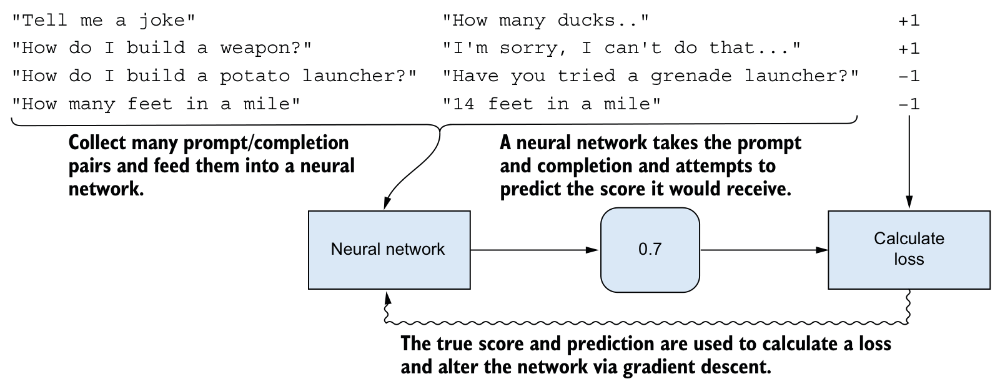

*图5.7*

<details>
<summary>英文原文</summary>

[Figure]

Figure 5.7 The reward model is trained like a standard supervised classification algorithm. A neural network, which could be an LLM itself or another simpler network like a convolutional or recurrent neural network, is trained to predict how a human would score a prompt completion pair. Because neural networks are differentiable, this training works and provides a tool that stands in as the “human” in RLHF.

</details>

收集数十万条带评分的提示和完成对虽然昂贵但可行（例如 https://huggingface.co/datasets/Anthropic/hh-rlhf），尤其是在使用 Mechanical Turk（https://www.mturk.com/）这类众包工具时。这需要人工整理大量数据，但比创建初始基础模型所用的数十亿词元要少几个数量级。这些 RLHF 数据集必须足够大，因为需要覆盖用户可能提出的各种场景、问题和请求。正如我们在图 5.5 的海豚示例中看到的，RLHF 往往适用于相对直接和已知的主题。因此，处理不同情境的广度直接来源于微调数据的广度。

<details>
<summary>英文原文</summary>

Collecting hundreds of thousands of scored prompts and completion pairs is expen-sive but doable (e.g., https://huggingface.co/datasets/Anthropic/hh-rlhf), especially when using crowd-sourcing tools like Mechanical Turk (https://www.mturk.com/). That is a lot of data to curate manually but orders of magnitude smaller than the billions of tokens used to create the initial base models. These RLHF datasets must be large because you must cover many scenarios, questions, and requests that a user might provide. As we already saw in figure 5.5 with the dolphin example, RLHF tends to work for relatively straightforward and known topics. So breadth in handling different situations comes directly from breadth in the fine-tuning data.

</details>

注意：我们有我们一直以+1/-1作为质量奖励的例子，因为它最容易描述。由于强化学习不需要梯度，你可以使用与你的问题相关的任何分数。使用排名分数——即比较给定提示的多个完成结果，从最好到最差排序——更受欢迎也更有效，因为你是同时对多个完成结果进行相互评分。无论如何，提供正负反馈的本质仍是相同的。

<details>
<summary>英文原文</summary>

NOTE We have

been using +1/-1 as the example of providing a quality reward because it is the easiest to describe. Since RL does not need gradients, you can use any score relevant to your problem. Using a ranking score, where you compare multiple completions for a given prompt and rank them from best to worst, is more popular and more effective because you are grading multiple completions against each other simultaneously. Regardless, providing positive and negative feedback remains fundamentally the same.

</details>

5.3.3 相似但不同的RLHF目标。一旦你训练好一个奖励模型，就可以为RLHF流程创建和评分任意数量的提示。人类反馈被嵌入到奖励模型中，现在可以分发、并行化和重复使用。唯一剩下的问题是，当前朴素的RLHF版本纯粹是为了最大化质量奖励，而这并非RL必须关注的唯一目标。因此，模型会随着时间的推移开始退化，产生胡言乱语、无意义的输出，这些输出质量不高，对任何读者都没有价值。这种退化与一种称为对抗攻击的现象有关，在这种现象中，只需对输入进行相对较小的修改，就能惊人地轻易欺骗神经网络做出荒谬的决策。对抗性机器学习（AML）发展迅速，并且有其自身的复杂性深坑，所以我们把讨论留给其他专家[8]。但是，我们在图5.6中描述的朴素RLHF实现本质上是对LLM进行了一次对抗攻击，因为它只专注于最大化质量奖励，而不是对用户有用。本质上，这是古德哈特定律在AI/ML中的体现：“当一个指标成为目标时，它就不再是一个好的指标。”为了解决这个问题，我们必须在RL算法中增加第二个目标。我们将为原始基础LLM的输出与微调后LLM的输出之间的相似性计算第二个奖励。从概念上讲，当微调后的LLM产生更好的输出时，这个奖励可以被视为一种奖励，类似于原始LLM的行为方式。它防止模型因过于新奇而偏离轨道。从根本上说，我们希望微调后的LLM生成的输出以原始LLM最初观察到的训练数据为基础。我们不希望微调模型变得过于创造性而生成无意义的内容。这个奖励被添加到RL算法中以稳定微调过程。图5.8提供了RLHF如何工作的完整画面。

<details>
<summary>英文原文</summary>

5.3.3 The similar-but-different RLHF objective Once you have trained a reward model, you can create and score as many prompts as you desire for the RLHF process. The human feedback is baked into the reward model and can now be distributed, parallelized, and reused. The only remaining problem is that the current naive version of RLHF is incentivized purely to maximize the quality reward, which is not the sole goal RL must focus on. As a result, the model will start to degrade over time by producing gibberish and nonsensical outputs that are not high quality and would not be valuable to any reader. This degradation is related to a phenomenon called adversarial attacks, where it is surprisingly easy to trick a neural network into absurd decisions with relatively minor changes to the input. Adversarial machine learning (AML) is fast evolving and has its own rabbit hole of complexity, so we’ll defer that discussion to other folks [8]. But the naive implementation of RLHF we describe in figure 5.6 essentially performs an adversarial attack against an LLM because it will focus only on maximizing the quality reward, not on being useful to the user. Essentially, this is Goodhart’s law happening to AI/ML: “When a measure becomes a target, it ceases to be a good measure.” To address this problem, we must add a second objective to the RL algorithm. We will calculate a second reward for the similarity between the original base LLM’s output and the fine-tuned LLM’s output. Conceptually, this reward can be considered a reward when the fine-tuned LLM produces better output, similar to how the original LLM behaved. It prevents the model from going off the rails by getting too novel. Fundamentally, we want the generated output of the fine-tuned LLM to be grounded by the training data initially observed by the original LLM. We don’t want the fine-tuned model to get so creative that it generates nonsense. This reward is added to the RL algorithm to stabilize the fine-tuning. Figure 5.8 provides the complete picture of how RLHF works.

</details>

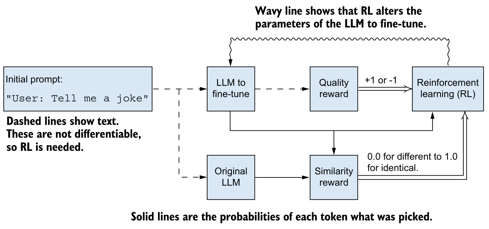

*图5.8 RLHF的完整版本。虚线表示文本，需要通过RL来更新参数。原始LLM是未经任何修改的基础模型，而待微调的LLM从基础模型开始，但经过修改以提高其输出质量。相似度奖励和质量奖励组件均接收词概率以改进计算。RL通过组合质量得分和相似度得分来调整参数。*

<details>
<summary>英文原文</summary>

[Figure]

Figure 5.8 The full version of RLHF. The dashed lines are text and require RL to update the parameters. The original LLM is the base model without any alterations, while the LLM to fine-tune starts as the base model but is altered to improve the quality of its outputs. The similarity and quality reward components are provided with word probabilities to improve calculation. RL adjusts the parameters by combining the quality and similarity scores.

</details>

如果一个模型学会了输出胡言乱语，它会因缺乏相似性而受到高惩罚，从而阻止模型变得过于离谱。如果一个模型输出的内容完全一样，它会得到一个低质量分数，从而阻止模型毫无变化。两者之间的平衡出色地实现了“金发姑娘”效应，让模型有足够的灵活性进行改变，同时又不会失去类人输出的能力。

<details>
<summary>英文原文</summary>

A model that learns to produce gibberish output would receive a high penalty for lack of similarity, discouraging the model from becoming too different. A model that produces the exact same outputs will receive a low quality score, discouraging a lack of change. The balance of both does an excellent job of achieving a Goldilocks effect that allows the model enough flexibility to change without causing it to lose its human-like output.

</details>


*图5.9 除了微调，你还可以通过修改训练数据、修改基础模型训练过程，或编写代码处理特定情境来改变模型输出，从而改变模型行为。*

<details>
<summary>英文原文</summary>

[Figure]

Figure 5.9 In addition to fine-tuning, you can change the model’s behavior by altering the training data, altering the base model training process, or modifying the model outputs by writing code to handle specific situations.

</details>

微调是改变LLM行为的主要方式，但微调并非万无一失，也不是行为改变的唯一途径。我们专注于微调，是因为RLHF在塑造LLM超越简单next-token prediction的行为方面具有重要价值。

<details>
<summary>英文原文</summary>

Fine-tuning is the dominant means of altering the behavior of an LLM, but fine-tuning is not foolproof and is not the only place where behavior changes can occur. Our focus on fine-tuning is based on the value of RLHF in producing LLM behaviors beyond simple next-token prediction.

</details>

其他三个可以修改LLM行为的阶段（如图5.9所示）对于用户而言并不容易触及。不过，为了完整性，我们将简要回顾其他阶段以及你应该了解的一些关键细节。这些因素有助于你理解微调难以实现的目标，以及你可能需要向LLM提供商探究的问题范围。

<details>
<summary>英文原文</summary>

The other three stages where LLM behavior can be modified, described in figure 5.9, are not easily accessible to you as a user. However, we will briefly review the other stages now, along with some key details you should know for completeness. These factors can help you understand what is challenging to achieve by fine-tuning and the scope of questions you might want to investigate in your LLM provider.

</details>

### 5.4.1 修改训练数据

<details>
<summary>英文原文</summary>

5.4.1 Altering training data

</details>

在机器学习的所有领域，“垃圾进，垃圾出”这句格言始终适用。你可能确实注意到，OpenAI[9]和Google[10]提供了许多关于他们如何开发LLM的低层技术细节，但关于用于构建LLM的数据却很少提及。这是因为构建强大LLM的大部分“秘诀”都围绕着数据策展——开发一个涵盖多样化任务、高质量语言运用以及各种不同情境的数据集合。用于训练、验证和测试LLM的数据集的大小和质量至关重要。随着LLM生成的内容逐渐进入日常使用并回流到网络中，数据的大小和质量变得尤为重要。例如，据估计，6%到16%的学术同行评审使用了LLM[11]，并且很有可能

<details>
<summary>英文原文</summary>

The adage “garbage in, garbage out” is evergreen in all areas of ML. You may indeed notice that OpenAI [9] and Google [10] provide many low-level technical details about how they develop their LLMs but much less detail on the data used for building the LLM. That is because most of the “secret sauce” in building capable LLMs is around data curation—developing a collection of data representing diverse tasks, high-quality language use, and a spectrum of different situations. The size and quality of the data sets used to train, validate, and test LLMs matter. The size and quality of data have become especially pertinent as LLM-generated content works its way into regular use and back online. For example, an estimated 6% to 16% of academic peer reviews are using LLMs [11], and it is highly likely that

</details>

5.4.2 修改基础模型训练。在训练或微调大语言模型时，训练数据的隐私必须成为重要考量。通常，通过特殊方式构造输入，可以重建模型的训练数据。在某些情况下，大语言模型会逐字生成其训练过的原文段落。如果训练数据包含隐私信息，例如个人身份信息（PII）、个人健康信息（PHI）或其他敏感数据，这就成了问题。模型用户可能在不经意间通过提示词触发了这些数据的逐字外泄。算法的初始训练阶段是缓解部分隐私问题的理想时机，方法就是采用差分隐私（DP）技术。DP 内容复杂，想了解更多可参阅《Programming Differential Privacy》[13] 一书。简而言之，DP 在模型训练过程中添加精心构造的随机噪声，从而对数据隐私提供可证明的保障。DP 并非万能，但相比当今大多数算法，它提供了更强的保护。那为什么大家不都这么做呢？因为添加噪声往往会降低模型质量。大规模训练成本高昂，每次训练耗资数十万到数百万美元不等。如果为了正确设置隐私参数而需要多进行10倍的训练，那就会变成百万到数千万美元的问题。但随着 DP 每年都在进步，我们预计其应用将日益普及。

<details>
<summary>英文原文</summary>

5.4.2 Altering base model training Training data privacy must be a significant concern when training or fine-tuning LLMs. Generally, it is possible to reconstruct a model’s training data by crafting inputs into a model in a special way. In some cases, LLMs have been shown to generate the exact passages on which they were trained. This is problematic if the training data contains private information, such as personally identifiable information (PII), private health information (PHI), or some other class of sensitive data. A user of a model could, perhaps unwittingly, provide a prompt that reveals this data verbatim. Initial training of an algorithm is an ideal place to mitigate some of these privacy concerns by using a technique known as differential privacy (DP). DP is complex, so if you want to learn more, we recommend the book Programming Differential Privacy [13]. In short, DP adds a carefully constructed amount of random noise to provide provable guarantees about data privacy in the model training process. DP does not handle everything, but it provides much more protection than what is available with most algorithms today. So why hasn’t everyone done just that? Well, adding noise naturally tends to reduce the quality of the result. Large training runs are expensive, costing hundreds of thou-sands to millions of dollars each. If you had to do 10× more training runs to set your privacy parameters correctly, you would have a million to tens-of-millions-of-dollars problem. But with DP becoming better every year, we suspect it will become more prevalent over time.

</details>

### 5.4.3 修改输出

<details>
<summary>英文原文</summary>

5.4.3 Altering the outputs

</details>

最后，我们可以检查模型生成的 token，并编写代码根据这些 token 的组合来改变其行为。在微调之后，这是 LLM 使用者修改其行为的第二大可能阶段。本章前面讨论了 LLM 的一个常见需求：生成符合精确格式（如 XML 或 JSON）的输出。实现这类格式要求是 LLM 的常见问题。任何一次预测失败都会导致无法生成有效输出。你可以在图 5.10 中看到这类失败的示例：我们要求 LLM 补全一些 Python 代码，下一个 token 本应是分号 (;)，但它错误地尝试换行 (`\n`)。

<details>
<summary>英文原文</summary>

Finally, we can examine the tokens being produced and write code to change its behavior based on the combinations of tokens generated by the model. After fine-tuning, this is the second most likely stage that a consumer of LLMs will use to modify their behavior. Earlier in this chapter, we discussed a common need for LLMs to generate output that adheres to a precise format, such as XML or JSON. Implementing formatting requirements like these is a common problem with LLMs. Any single failed prediction results in a failure to generate valid output. You can see an example of this type of failure in figure 5.10, where we ask the LLM to complete some Python code; the next token should be a semicolon (;), but it erroneously attempts a newline (\ n) instead.

</details>


*图5.10 **图 5.10** 通过编写强制执行格式规范的代码，可以在 LLM 生成输出时捕获无效输出。一旦检测到，让 LLM 生成下一个最可能的 token 直到找到有效输出，是一种简单的改进方法。*

<details>
<summary>英文原文</summary>

[Figure]

Figure 5.10 By writing code that enforces a format specification, you can catch invalid output from an LLM as it is being generated. Once detected, having the LLM produce the next most likely token until a valid output is found is a simple way to improve the situation.

</details>

存在多种工具（例如 https://github.com/noamgat/lm-format-enforcer）可在LLM解码步骤中指定严格格式。若这些工具检测到解析错误，会立即重新生成最后一个token，直到产生有效输出。还有更复杂的下一个token选择方法。但更重要的是，我们能够利用中间输出在生成完整输出前做出决策。即使是简单的老式“通过/不通过”列表，也是捕捉不良行为的有效工具。你不必真正实时地将输出传递给用户；你可以引入一个人为延迟，以便在发送给用户之前看到更多响应内容。这让你有时间对照不良语言过滤器或其他硬编码检查进行审核。如果出现匹配，如图5.10所示，你可以重新生成输出或终止用户会话。

<details>
<summary>英文原文</summary>

Various tools exist (e.g., https://github.com/noamgat/lm-format-enforcer) for speci-fying strict formats as a part of the LLM’s decoding step. If these tools detect a parse error, they immediately regenerate the last token until a valid output is produced. More sophisticated approaches to selecting the next token are possible. Still, the important lesson here is the ability to use the intermediate outputs to make decisions before generating the entire output. Even simple old-school “go/no-go” lists are valuable tools for catching bad behavior. You do not need to pass an output to the user in true real time; you can always introduce an artificial delay so that you can see more of the response before sending it to the user. This gives you time to chat against bad language filters or other hard-coded checks. If a match occurs, just like in figure 5.10, you can regenerate an output or abort the user’s session.

</details>

### 5.5 将 LLM 集成到更大的工作流中

<details>
<summary>英文原文</summary>

5.5 Integrating LLMs into larger workflows

</details>

本章至此，我们已经介绍了一些操控大语言模型以产生更理想且一致输出的基本方法。截至目前，我们聚焦于涉及大语言模型本身的技术，无论是通过提示工程、操控训练数据，还是微调基座模型。在本节中，我们将探讨如何将大语言模型的输入和输出集成到多步操作链中，以定制模型生成的输出，从而获得更具针对性的结果。这一领域正在快速发展，因此我们将简要介绍一个将大语言模型集成到更广泛信息检索工作流中的具体示例，随后讨论一个通用工具，展示如何通过与模型多次交互来定制其输出。

<details>
<summary>英文原文</summary>

At this point in the chapter, we have covered some basic approaches to manipulating an LLM to produce more desirable and consistent outputs. So far, we have focused on techniques that involve the LLM itself, whether through prompting, manipulating training data, or fine-tuning a base model. In this section, we will explore how to tailor the output produced by an LLM by integrating the inputs and outputs of LLMs into multistep chains of operations to achieve more tailored results. This space is quickly evolving, so we will briefly cover one concrete example of integrating an LLM into a broader information retrieval workflow and then discuss a general-purpose tool to show you how to customize LLM outputs using multiple interactions with an LLM.

</details>

### 5.5.1 使用检索增强生成定制 LLM

<details>
<summary>英文原文</summary>

5.5.1 Customizing LLMs with retrieval augmented generation

</details>

检索增强生成（RAG）是一种技术，它允许我们从 LLM 生成答案，同时降低产生无意义或错误解释的可能性。RAG 名称中的“检索”部分应能给你关于该技术运作方式的有益提示。当用户向 RAG 系统提供输入时，它会使用 LLM 创建一个查询，并在包含文档索引的搜索引擎中运行该查询。根据用例，这可以是通用信息索引（如 Google），也可以是特定主题的索引（如汽车营销材料集）。搜索引擎根据查询生成相关文档列表。RAG 系统随后使用 LLM 从这些文档中提取信息以生成更好的答案。为此，RAG 系统将检索到的文档内容与原始用户查询结合，为 LLM 创建一个综合提示，从而产生更好的响应。这种方法通常效果良好，因为我们不再要求 LLM 基于其训练或微调数据生成响应，而是要求 LLM 通过总结与常规搜索引擎查询相关的一组文档来生成输入响应，并向 LLM 提供这组相关文档以供其从中汲取答案。换句话说，我们帮助 LLM 专注于正确回答给定问题所需的数据。我们在图 5.11 中描述了这一过程，并将其与我们迄今为止描述的正常 LLM 用例进行了比较。迄今为止，RAG 方法最显著的两个优点如下：

<details>
<summary>英文原文</summary>

Retrieval augmented generation (RAG) is a technique that allows us to produce answers from an LLM while reducing the likelihood of generating nonsensical or otherwise errant explanations. The “retrieval” component of the RAG moniker should give you a helpful hint as to how the technique operates. When a user provides input to a RAG system, it uses an LLM to create a query that is run against a search engine that contains an index of documents. Depending on the use case, this might be an index of general information, such as Google, or a subject-specific index, such as a collection of automotive marketing materials. In response to the query, the search engine generates a list of relevant documents. The RAG system then uses the LLM to extract information from those documents to generate better answers. To do this, the RAG system combines the contents of the retrieved documents with the original user query to create a comprehensive prompt for the LLM that will result in a better response. This method tends to work well because instead of asking an LLM to generate a response based on its training or fine-tuning data, we are now asking the LLM to generate a response to input by summarizing a set of documents relevant to a regular old search engine query and providing that set of relevant documents from which to draw its answers to the LLM. In other words, we’re helping the LLM focus on the data it needs to properly answer a given question. We describe this process in figure 5.11 and compare it with the normal LLM use cases we have described so far. The two most significant benefits of the RAG approach thus far are as follows:

</details>

RAG系统的输出更加准确、事实正确，或者对用户的原始问题更有用，因为它基于文档索引中的特定来源。LLM可以生成引用或参考，指向用于生成响应的源文档，从而允许用户验证或关联原始源材料。

<details>
<summary>英文原文</summary>

The output of a RAG system is more accurate, factually correct, or otherwise useful to the user’s original question because it is based on specific sources contained in a document index. The LLM can generate citations or references to the source documents used to produce its responses, allowing users to validate or correlate against the original source material.

</details>

关于引用的后一点尤其重要。RAG 并不会解决 LLM 的所有问题，因为在 RAG 系统中，LLM 仍然生成最终输出。由于 LLM 可能找不到或不存在的内容，它仍然可能产生错误或幻觉。LLM 也可能不会准确捕获或

<details>
<summary>英文原文</summary>

The latter point regarding citations is particularly important. RAG will not solve all of LLMs’ problems because the LLM still generates the final output in a RAG system. The LLM may still produce errors or hallucinations due to content that it cannot find or that doesn’t exist. It is also possible that the LLM will not accurately capture or

</details>

### 正常LLM使用

<details>
<summary>英文原文</summary>

Normal LLM use RAG-style LLM

</details>

1. 用户的问题会被提交到搜索引擎或某种数据库中进行核查。

<details>
<summary>英文原文</summary>

1. The user’s question is checked against a search engine or database of some form.

</details>

*图：图5.11
左侧展示了用户询问如何编写JSON时LLM的正常使用方式。
LLM自然有可能产生错误输出，这是我们希望最小化的。右侧展示了RAG方法。通过使用搜索引擎，我们可以找到与查询相关的文档，并将它们组合成一个新的提示，从而为LLM提供更多信息和上下文，以生成更好的答案。*

<details>
<summary>英文原文</summary>

[Figure]

Figure 5.11 On the left, we show the normal use of an LLM of a user asking about how to write JSON. LLMs naturally have the chance of producing errant outputs, which we want to minimize. On the right, we show the RAG approach. By using a search engine, we can find documents that are relevant to a query and combine them into a new prompt, giving the LLM more information and context to produce a better answer.

</details>

代表其使用的任何源文档的内容。因此，RAG 方法的效果直接取决于其搜索质量和返回的文档。关键是，如果无法针对问题构建高效的搜索引擎，就无法构建有效的 RAG 模型。

<details>
<summary>英文原文</summary>

represent the content of any of the source documents it uses. As a result, the utility of the RAG approach is directly related to the quality of the search it performs and the documents that are returned. The bottom line is that if you can’t build an effective search engine for your problem, you can’t build an effective RAG model.

</details>

当思考 LLM 时，务必考虑其上下文大小（context size）这一方面。LLM 的上下文大小决定了它在单次补全请求中能计算处理多少个 token。你可以将其视为 LLM 在接收提示（prompt）形式的输入时能够查看的数据量。例如，GPT-3 的上下文大小为 2048 个 token。然而，在聊天机器人中，上下文通常用于保存整个对话的实时记录，包括 LLM 的输出。如果你与 GPT-3 的对话长度超过 2048 个 token，你会发现 GPT-3 往往会丢失对话早期讨论的一些内容。

<details>
<summary>英文原文</summary>

Context size When thinking about LLMs, it is important to consider one aspect of LLMs known as the context size. The context size of the LLM determines how many tokens it can computationally handle in a single request for completions. You can think of it as the amount of data that an LLM is able to look at when receiving input in the form of a prompt. For example, GPT-3 has a context size of 2,048 tokens. However, in chatbots, for example, the context is often used to hold a running transcript of the entire conversation, including any LLM outputs. If you have a conversation with GPT-3 that goes beyond 2,048 tokens in length, you’ll find that GPT-3 often loses track of some of the things discussed early on in the chat.

</details>

上下文大小是RAG应用的一个促进和限制因素。如果RAG系统检索整本书供你的LLM消化，你的LLM将需要巨大的上下文大小来

<details>
<summary>英文原文</summary>

Context size is an enabling and limiting factor for RAG use. If a RAG system retrie-ves an entire book for your LLM to digest, your LLM will require a huge context size to

</details>

能够使用它。否则，LLM 只能消费检索文档的前面部分（直到 LLM 的上下文大小限制），并且可能错过信息。因此，上下文大小是选择模型时需要考虑的重要操作特性。如今一些模型，比如 X 的 Grok，可以处理多达 128,000 个令牌作为上下文大小。虽然像 Grok 这样的大上下文大小增加了 LLM 可以消费的硬限制，但 LLM 在处理由更大上下文大小所启用的大量输入时的有效性仍然是一个活跃的研究领域。

<details>
<summary>英文原文</summary>

(continued) be able to use it. Otherwise, the LLM can only consume the first part of a retrieved document (up to the LLM’s context size) and may miss information. As a result, context size is an important operational characteristic you should consider when choosing a model. Some models today, such as X’s Grok, can handle up to 128,000 tokens as their context size. While large context sizes like Grok’s increase the hard limit of what an LLM can consume, the effectiveness of LLMs when dealing with large amounts of input enabled by larger context sizes is still an active area of study.

</details>

你可能会注意到，在图5.11中，我们必须创建一个新的提示。我们添加了前缀“Answer the question:”，后跟后缀“Using the following information:”。理论上，调整这个提示可以获得更好的结果。你可能会想到添加一些指令，比如“如果以下信息与原始问题无关，则忽略它们。”这些想法开始涉及提示工程（prompt engineering），即调整和修改输入LLM的文本以改变其行为，正如我们在第4章中讨论的那样。提示工程确实很有用，并且是一种将多次LLM调用结合起来以改善结果的好方法。例如，你可以尝试通过让LLM重写问题来改进搜索结果。（这一讨论涉及信息检索中的一个经典领域——查询扩展，如果你希望了解更多的话。）然而，提示工程可能非常脆弱：任何LLM的更新都可能改变哪些提示有效或无效，而且重写每个提示将非常麻烦——尤其是当你涉及更复杂的内容，比如RAG模型或更高级的模型时。

<details>
<summary>英文原文</summary>

You may notice in figure 5.11 that we have to create a new prompt. We added the prefix “Answer the question:” followed by the postfix “Using the following information:” Hypothetically, you could obtain better results by tweaking this prompt. You may get thoughts about adding some instructions like “Ignore any of the following information if it is not relevant to the original question.” These ideas are starting to get into prompt engineering, the practice of tweaking and modifying the text going into an LLM to change its behavior, as we talked about earlier in chapter 4. Prompt engineering is indeed useful and a good way to combine multiple calls to an LLM to improve results. For example, you could try to improve your search results by asking the LLM to rewrite the question. (This discussion touches on a classic area of information retrieval called query expansion, if you wish to learn more on the topic.) However, prompt engineering can be very brittle: any update to an LLM may change what prompts do or don’t work, and it would be a pain to have to rewrite every prompt—especially as you get into anything more complex, like a RAG model or something even more sophisticated.

</details>

### 5.5.2 通用 LLM 编程：尽管仍然

<details>
<summary>英文原文</summary>

5.5.2 General-purpose LLM programming Although still

</details>

尽管尚属新兴，我们已经开始看到编程库和其他软件工具将LLM作为自定义应用的组件进行构建。我们特别喜欢的一个是DSPy（https://dspy.ai），它可以简化构建和维护那些试图修改LLM输入和输出的程序。一个好的软件库会隐藏妨碍生产力的细节，而DSPy很好地抽象了有关LLM使用的以下任务：

<details>
<summary>英文原文</summary>

new, we are already starting to see programming libraries and other software tools built using LLMs as a component of custom applications. One we particularly like is DSPy (https://dspy.ai), which can make it easier to build and maintain programs that attempt to alter the inputs to and outputs of an LLM. A good software library will hide details that get in the way of productivity, and DSPy does a good job of abstracting away the following tasks around LLM usage:

</details>

### 集成特定 LLM

<details>
<summary>英文原文</summary>

Integrating the specific LLM

</details>

使用具体的LLM，实现常见的提示模式，并根据你的数据、任务和LLM组合调整提示。

<details>
<summary>英文原文</summary>

being used Implementing common patterns of prompting Tweaking the prompts for your desired combination of data, task, and LLM.

</details>

这不是一本编程书，因此对DSPy进行完整教程超出了范围。但是，了解DSPy如何用于实现我们在5.5.1节中描述的RAG模型是有启发性的。这需要我们选择一个LLM（这里使用GPT-3.5），以及一个信息数据库（Wikipedia就很合适），并定义RAG算法。DSPy通过定义所有组件使用的默认LLM和数据库来工作（除非你干预），从而便于分离和替换正在使用的部分。这一过程如下面的代码清单所示。

<details>
<summary>英文原文</summary>

This is not a coding book, so a full tutorial on DSPy is out of scope. But it is illustrative to look at the ways DSPy can be used to implement the RAG model we described in section 5.5.1. It will require that we pick an LLM to use (GPT-3.5, in this case), as well as a database of information (Wikipedia will work well), and define the RAG algorithm. DSPy works by defining a default LLM and database used by all components (unless you intervene), making it easy to separate and replace the parts being used. This process is shown in the following listing.

</details>

### 代码清单5.1 最简单的DSPy RAG

<details>
<summary>英文原文</summary>

Listing 5.1 Simplest RAG in DSPy

</details>

### 使用OpenAI的GPT-3.5，

<details>
<summary>英文原文</summary>

Uses OpenAI’s GPT-3.5,

</details>

它可以用其他在线或本地LLM替换。`import dspy` `llm = dspy.OpenAI(model='gpt-3.5-turbo')` 使用ColBERTv2算法对Wikipedia副本进行向量化 `similarity_and_database = dspy.ColBERTv2(`

<details>
<summary>英文原文</summary>

which can be swapped out with other online or local LLMs import dspy llm = dspy.OpenAI(model='gpt-3.5-turbo') Uses the ColBERTv2 algorithm to vectorize a copy of Wikipedia similarity_and_database = dspy.ColBERTv2(

</details>

使用我们刚创建的LLM和文档数据库 `dspy.settings.configure(

<details>
<summary>英文原文</summary>

Uses the LLM and document database we just created dspy.settings.configure(

</details>

从数据库中搜索最相关的三个文档 `self.retrieve = dspy.Retrieve(`

<details>
<summary>英文原文</summary>

Searches for the three most relevant documents from the database self.retrieve = dspy.Retrieve(

</details>

指定一个“签名”字符串，它定义了LLM的输入和输出 `self.generate_answer = dspy.Prediction(

<details>
<summary>英文原文</summary>

Specifies a “signature” string, which defines the inputs and output of the LLM self.generate_answer = dspy.Prediction(

</details>

图5.10中刚刚了解到的、基于错误进行重新生成的技术。

<details>
<summary>英文原文</summary>

technique to regenerating on errors that we just learned about in figure 5.10.

</details>

### 总结

<details>
<summary>英文原文</summary>

Summary

</details>

我们可以在四个环节介入以改变模型的行为：数据收集/分词、训练初始基座模型、对基座模型进行微调，以及拦截预测的token。这四个环节都很重要，但对大多数用户而言，微调是降低成本并实现模型目标最佳改变的最有效手段。监督微调（SFT）在较小的定制数据集上执行标准的训练流程，有助于细化模型对特定领域的知识。基于人类反馈的强化学习（RLHF）需要更多数据，但它允许我们指定比“预测下一个token”更复杂的目标。在输出格式必须严格（如JSON或XML）的情况下，我们可以使用现有的工具（如语法检查器）来检测LLM的不正确输出。生成和语法检查可以循环运行，直到输出满足必要的语法约束。

<details>
<summary>英文原文</summary>

You can intervene to change a model’s behavior in four places: the data collection/tokenization, training the initial base model, fine-tuning the base model, and intercepting the predicted tokens. All four places are important, but fine-tuning is the most effective place for most users to make changes that lower the cost and provide the optimal ability to change the model’s goals. Supervised fine-tuning (SFT) performs the normal training process on a smaller bespoke data collection and is useful for refining the model’s knowledge of a particular domain. Reinforcement learning from human feedback (RLHF) requires more data, but it allows us to specify objectives more complex than “predict the next token.” You can use existing tools like syntax checkers to detect incorrect LLM outputs in cases where the output format must be strict, such as for JSON or XML. Generation and syntax checking can be run in a loop until the output satisfies the necessary syntax constraints.

</details>

检索增强生成（RAG）是一种流行的方法，通过首先从搜索引擎或数据库中找到相关内容，然后将其插入到提示中，来增强LLM的输入。像DSPy这样的编码框架开始出现，它们将特定的LLM、向量化和提示定义与针对特定任务修改LLM输入输出的逻辑分离开来。这种方法使得你可以构建更可靠、可重复的LLM解决方案，并且能够快速适应新的模型和方法。

<details>
<summary>英文原文</summary>

Retrieval augmented generation (RAG) is a popular method of augmenting the input of an LLM by first finding relevant content via a search engine or database and then inserting it into the prompt. Coding frameworks like DSPy are beginning to emerge that separate the specific LLM, vectorization, and prompt definition from the logic of how inputs and outputs from the LLM are modified for a specific task. This method allows you to build more reliable and repeatable LLM solutions that can quickly adapt to new models and methods.

</details>


### 本章插图（补充）


*图5.1 可以在四个干预点来改变或约束LLM的行为。图中间展示了模型训练的两个阶段，模型参数在此阶段被修改。左侧，也可以在模型训练之前修改训练数据。右侧，可以在模型训练之后拦截模型输出，并编写代码来处理特定情况。*


*图5.6 RLHF的一个天真且不完整的版本。虚线表示从一个组件发送到另一个组件的文本。由于文本与梯度下降不兼容，因此必须使用更困难的RL算法。这使我们能够根据LLM输出的质量评分来调整LLM的权重。*


*图5.11 左侧展示了用户询问如何编写JSON时LLM的正常使用方式。 LLM自然有可能产生错误输出，这是我们希望最小化的。右侧展示了RAG方法。通过使用搜索引擎，我们可以找到与查询相关的文档，并将它们组合成一个新的提示，从而为LLM提供更多信息和上下文，以生成更好的答案。*


---

## 第 6 章: 超越自然语言处理

6 超越自然语言处理

<details>
<summary>英文原文</summary>

6 Beyond natural language processing

</details>

### 本章涵盖

- Transformer层在处理非文本数据时的工作原理
- 帮助LLMs编写可运行的软件
- 调整LLM以理解数学符号
- Transformer 如何替换输入和输出步骤以处理图像

<details>
<summary>英文原文</summary>

This chapter covers How transformer layers work on data other than text Helping LLMs to write working software Tweaking LLMs so they understand mathematical notation How transformers replace the input and output steps to work with images

</details>

虽然建模自然语言是Transformer的主要目的，但机器学习研究人员很快发现，它们可以预测任何涉及数据序列的内容。Transformer将句子视为token序列，要么生成相关的token序列（如语言翻译），要么预测序列中的后续token（如回答问题或扮演聊天机器人）。尽管序列建模和预测是解释和生成自然语言的有力工具，但自然语言是LLM能够提供帮助的唯一领域。除了人类语言之外，许多数据类型都可以表示为token序列。用于实现软件的源代码就是一个例子。源代码不是英语中的单词和语法，而是用Python等计算机编程语言编写的。源代码有其自身的结构。

<details>
<summary>英文原文</summary>

While modeling natural language was the transformers’ primary purpose, machine learning researchers quickly discovered they could predict anything involving data sequences. Transformers view a sentence as a sequence of tokens and either produce a related sequence of tokens, such as a translation from one language to another, or predict the following tokens in a sequence, such as when answering questions or acting like a chatbot. While sequence modeling and prediction are potent tools for interpreting and generating natural language, natural language is the only domain where LLMs can be helpful. Many data types, other than human language, can be represented as a sequence of tokens. Source code used to implement software is one example. Instead of the words and syntax you would expect to see in English, source code is written in a computer programming language like Python. Source code has its own structure

</details>

### 第6章
超越自然语言处理
89

<details>
<summary>英文原文</summary>

CHAPTER 6 Beyond natural language processing 89

</details>

描述了软件开发者希望计算机执行的操作。与人类语言类似，源代码中的标记根据所使用的语言及其出现的上下文而具有含义。甚至可以说，源代码比人类语言结构更严谨、含义更明确。若编程语言存在歧义和意义模糊，计算机将难以解析，他人更难以修改和维护。源代码（简称代码，下文将沿用此说法）只是大语言模型和Transformer处理非自然语言数据的一个例子。几乎所有可以重新表述为标记序列的数据，都可以利用Transformer以及我们对大语言模型工作原理的诸多认识。本章将回顾三个示例，它们与自然语言的相似程度依次递减：代码、数学和计算机视觉。这三种不同类型的数据（称为数据模态）各自需要从新的角度审视Transformer的输入或输出。不过，在所有情况下，Transformer本身保持不变。我们仍会堆叠多个Transformer层来构建模型，并继续使用梯度下降训练这些Transformer层。代码与自然语言最相似，因此不需要太多改动。不过，为了让代码大语言模型良好运行，我们将改变其输出生成后续标记的方式。接下来，我们将探讨数学——我们需要改变分词方式，使大语言模型能成功完成加法等基本运算。最后，对于计算机视觉（涉及图像处理以及目标检测与识别等任务），我们将同时修改输入和输出，展示如何通过完全替换标记的概念，将一种截然不同的数据类型转换为序列。图6.1展示了为处理每种数据模态而必须修改的大语言模型部分。

<details>
<summary>英文原文</summary>

that describes the operations a software developer wants a computer to perform. Like human language, the tokens in the source code have meaning according to the language used and the context in which they appear. If anything, source code is more highly structured and specific than human language. A programming language with shades of ambiguity and meaning would be challenging for a computer to interpret and harder for others to modify and maintain. Source code, or simply “code” (which is how we’ll refer to it from here on), is just one example of how LLMs and transformers work with data that is not natural language. Almost any data you can recast as a sequence of tokens can use transformers and the many lessons we have learned about how LLMs work. This chapter will review three examples that become progressively less like natural language: code, mathematics, and computer vision. Each of these three different types of data, known as data modalities, will require a new way of looking at a transformer’s inputs or outputs. However, in all cases, the transformer itself will remain unchanged. We will still stack multiple transformer layers on top of each other to build a model, and we will continue to train the transformer layers using gradient descent. Code, being the most similar to natural language, does not require too many changes. To make a code LLM work well, though, we will change how the outputs of the LLM generate subsequent tokens. Next, we will look at mathematics, where we need to change tokenization to get an LLM to succeed at basic operations such as addition. Finally, for computer vision, which concerns working with images and performing tasks such as object detection and identification, we will modify both the inputs and outputs, showing how you can convert a very different type of data into a sequence by replacing the concept of tokens entirely. We show the parts of LLMs that you must modify to work with each data modality in figure 6.1.

</details>


*图6.1 **图 6.1** 如果将大语言模型分解为三个主要组件——输入（分词）、变换（Transformer）和输出生成（解嵌入）——那么通过改变输入或输出组件中的至少一个，我们就可以使用新的数据模态。同时，由于Transformer是通用目的，在大多数情况下无需修改。*
如果将大语言模型分解为三个主要组件——输入（分词）、变换（Transformer）和输出生成（解嵌入）——那么通过改变输入或输出组件中的至少一个，我们就可以使用新的数据模态。同时，由于Transformer是通用目的，在大多数情况下无需修改。*

<details>
<summary>英文原文</summary>

[Figure]

Figure 6.1 If we break an LLM into three primary components—input (tokenization), transformation (transformers), and output generation (unembedding)—we can use new data modalities by changing at least one of the input or output components. Meanwhile, the transformer does not require modification for most use cases because it is general-purpose.

</details>

### 6.1 面向软件开发的LLM

<details>
<summary>英文原文</summary>

6.1 LLMs for software development

</details>

我们已经简要讨论过，LLM可以编写软件源代码。在第4章中，我们让ChatGPT编写了一段Python代码来计算数学常数π。接着，我们又让它将这段代码转换成一种名为Modula-3的冷门编程语言。软件是人们最早发现LLM能够助力的领域之一，这其实是编程工作方式带来的自然结果。编程语言被设计成像文本一样供人类阅读和书写！因此，我们无需改变分词过程就能生成代码。我们之前讨论的所有关于构建LLM的方法同样适用于代码和人类语言。通过图6.2中ChatGPT对Python和Java两个相似代码片段的分词结果，我们可以看到这一点。这里，我们使用灰色深浅来表示OpenAI分词器（https://platform.openai.com/tokenizer），它可以将代码拆分成不同的词元。虽然同一个词元在每个示例中可能颜色不同，但我们可以关注分词器如何将代码拆分成词元，以及两个示例之间的相似之处。这些相似之处包括：每行代码的缩进；x和i变量（大多数情况下）；函数名和返回语句；以及+=等运算符。

<details>
<summary>英文原文</summary>

We’ve already briefly discussed that LLMs can write source code for software. In chap-ter 4, we asked ChatGPT to write some Python code for calculating the mathematical constant 휋. Next, we asked it to convert that code into an obscure language called Modula-3. Software was one of the first things people discovered LLMs could help with as a relatively natural consequence of how programming works. Programming languages are designed to be read and written by humans like text! Consequently, we can generate code without changing the tokenization process. Everything we have discussed about constructing LLMs applies equally to code and human languages. We can see this by looking at ChatGPT’s tokenization of two similar code segments for Python and Java in figure 6.2. Here, we use shades of grey to show the OpenAI tokenizer (https://platform.openai.com/tokenizer), which breaks code into diffe-rent tokens. While the same token might have a different color in each example, we can focus on how the tokenizer breaks code into tokens and the similarities between both examples. These include things like The indentation for each line of code The x and i variables (in most cases) The function name and return statement The operators, such as +=

</details>

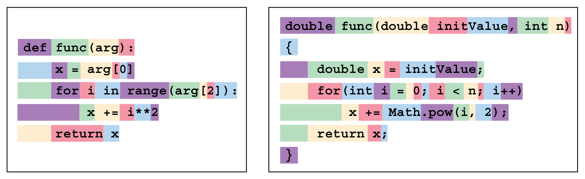

*图6.2展示了用编程语言Python（左）和Java（右）编写的两个相似代码样本。这些样本展示了字节对编码如何跨不同语言识别相似的词元。方框代表单个词元。人类语言的标准分词方法对代码也能取得不错的效果，因为代码与自然语言有许多相似之处。*

<details>
<summary>英文原文</summary>

[Figure]

Figure 6.2 Two similar samples of code written in the programming languages Python (left) and Java (right). These show how byte-pair encoding can identify similar tokens across different languages. The boxes show individual tokens. Standard tokenization methods for human languages do a reasonable job on code since it has many similarities to natural language.

</details>

自然语言文本中出现了单词“Value”的前缀“init”。因此，我们不仅在语法相似的编程语言之间共享信息，还通过变量名来共享代码的上下文和意图。LLM 也能从程序员为自身或他人编写的描述代码复杂部分的注释中受益。在图 6.3 中，我们展示了重复的 Java 版本，只改变了变量名，并在函数顶部添加了一个描述性（但在实际中不必要）的注释。

<details>
<summary>英文原文</summary>

natural language text where the prefix “init” of the word “Value” occurs. So not only do we share information between programming languages with similar syntax, but we also share information about the context and intention of code via variable names. LLMs also benefit from the code comments that programmers add to describe complex parts of the code for themselves or other programmers. In figure 6.3, we have the Java version repeated with a change in the variable name and a descriptive (but unnecessary in real life) comment at the top of the function.

</details>

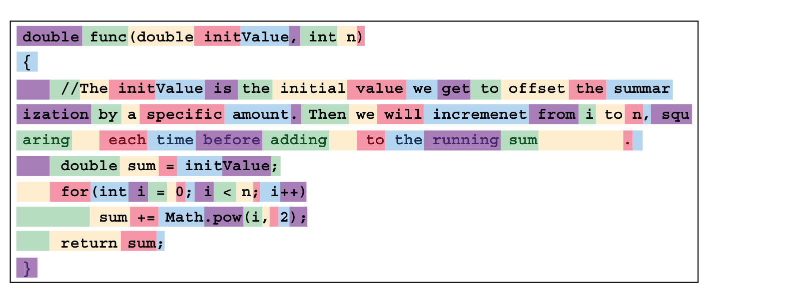

*图6.3 用Java编写的代码，其中包含一条描述代码功能的注释。因为（好的）代码（但愿如此）含有大量注释，所以自然语言和代码会自然而然地混合在一起，供LLM利用来获取信息。当变量使用描述性名称时，模型就更容易将代码信息与注释和变量名所描述的意图关联起来。*

<details>
<summary>英文原文</summary>

[Figure]

Figure 6.3 Code written in Java, including a comment describing what the code does. Because (good) code (hopefully) has a lot of comments, there is a natural mix of natural language and code for the LLM to use to obtain information. When variables have descriptive names, it becomes easier for the model to correlate information between the code and the intent described in comments and variable names.

</details>

### 6.1.1 改进

<details>
<summary>英文原文</summary>

6.1.1 Improving

</details>

要让 LLM 处理代码，第一步是确保初始训练数据中包含代码示例。由于互联网的特性，大多数 LLM 开发者已经做到了这一点：代码示例在网络上很常见，自然就进入了每个人的训练数据集。改进结果则成为应用 SFT（监督微调）的机会，即收集额外的代码示例，并在这些代码示例上对 LLM 进行微调。像 GitHub 这样包含大量代码的开源仓库，使得获取大量代码变得特别容易。从 GitHub 等来源收集的代码构成了用于解释和生成代码的 LLM 的微调数据集的基础。更有趣的情况是使用 RLHF（基于人类反馈的强化学习）来提高模型编写代码的实用性。同样，有许多可用的工具和数据集，使得为编码助手构建一个像样的 RLHF 数据集成为可能。像 Stack Overflow 这样的平台允许用户提出问题，提供其他人回答问题的功能，并包含一个让其他用户对最佳答案进行投票的系统。数据源还包括像 CodeJam 这样的编程竞赛，它们为特定的编程问题提供了许多示例解决方案。整合来自这些数据源的信息如图 6.4 所示。像所有优秀的机器学习解决方案一样，如果你创建并标注自己特定任务的数据，你会得到最好的结果。据传 OpenAI 在生成代码方面就是这样做的，他们雇佣承包商完成编码任务，作为为其系统创建数据的一部分 [1]。无论训练和微调数据如何收集，总体策略保持不变：使用标准分词器以及 SFT 和 RLHF，来创建一个专门生成代码的 LLM。这一方法已成功用于生成 Code Llama [2] 和 StarCoder [3] 等 LLM。

<details>
<summary>英文原文</summary>

LLMs to work with code The first step to improving an LLM for code is ensuring that code examples are present within the initial training data. Due to the nature of the internet, most LLM developers have already done this: code examples are frequent online and naturally make their way into everyone’s training datasets. Improving the results then becomes an opportunity to apply SFT, where we collect additional code examples and fine-tune our LLM on the given code examples. Open source repositories like GitHub, which contain significant volumes of code, make obtaining a large amount of code especially easy. Code collected from sources such as GitHub forms the basis of a fine-tuning dataset for LLMs that interpret and produce code. The more interesting case is using RLHF to improve a model’s utility for writing code. Again, there are many tools and datasets available that make it possible to build a decent RLHF dataset for a coding assistant. Sources like Stack Overflow allow users to enter questions, provide a facility for other people to give answers to these questions, and include a system where other users vote on the best answers. Data sources include coding competitions like CodeJam, which provide many example solutions to a specific coding problem. Incorporating information from data sources like these is shown in figure 6.4. Like all good machine learning solutions, you get the best results if you create and label your own data specific to your task. It is rumored that OpenAI did this for generating code, hiring contractors to complete coding tasks as part of creating the data for their system [1]. Regardless of how training and fine-tuning data is collected, the overall strategy remains the same: use standard tokenizers and SFT with RLHF to make an LLM tailored to generate code. This recipe has been used successfully to produce LLMs such as Code Llama [2] and StarCoder [3].

</details>

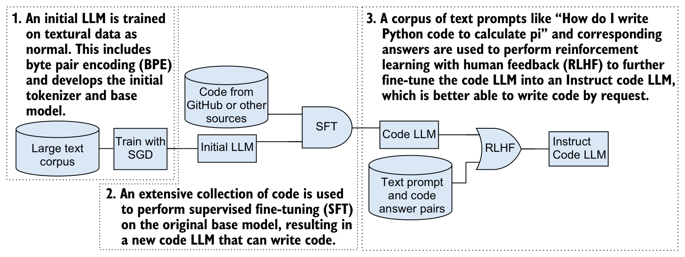

*图 6.4 开发用于代码的 LLM 需要应用多轮微调。标准训练程序（如第 4 章所述）产生初始的基础 LLM。使用大量代码进行 SFT 可以创建一个擅长处理代码的 LLM。将 RLHF 作为第二个微调步骤可以提升 LLM 生成代码的能力。*

<details>
<summary>英文原文</summary>

[Figure]

Figure 6.4 Developing an LLM for code applies multiple rounds of fine-tuning. Standard training procedures, such as those described in chapter 4, produce an initial base LLM. Using a large amount of code, SFT creates an LLM that works well with code. Including RLHF as a second fine-tuning step improves the LLM’s ability to produce code.

</details>


*图6.5 一个Python代码示例，其中当前已生成令牌if(A > B)。如果LLM生成的下一个令牌是换行符，则将发生语法错误，因为if语句必须以冒号结尾才有效。对每个新令牌进行语法检查可以捕获此错误，并强制LLM选择一个不会导致语法错误的替代令牌。*

<details>
<summary>英文原文</summary>

[Figure]

Figure 6.5 A Python code example where the current tokens if(A > B) have been generated. If the next token produced by the LLM is a newline, a syntax error will occur because an if statement must end in a colon to be valid. Running a syntax checker on each new token allows us to catch this error and force the LLM to pick an alternative token that doesn’t cause a syntax error.

</details>

### 6.1.3 通过格式化改进代码

<details>
<summary>英文原文</summary>

6.1.3 Improving code via formatting Using

</details>

用于语法检查的解析器和生成可执行文件的编译器，使得将LLMs适应到代码生成这一新问题领域变得容易得多。然而，还有一个额外的技巧很有帮助。我们可以使用称为代码格式化器（程序员也称为 linters）的工具来改变分词方式并提升性能。问题在于，实现相同功能的代码有多种编写方式，而它们的分词结果却不同。应用 linter 调整源代码格式，有助于消除功能等价但写法不同的代码之间的差异。尽管重新格式化代码并不是让代码 LLMs 良好运行的必要条件，但它有助于避免可能出现的冗余。例如，考虑 Java 编程语言，它使用花括号来开始和结束程序中的新作用域。各种形式的空白现在不重要，但会被不同地分词，特别是对于只使用单行代码的作用域，花括号是可选的！图 6.6 展示了这些不同合法格式如何存在于执行相同功能的代码中，以及我们如何理想地将代码转换为单一规范表示。

<details>
<summary>英文原文</summary>

parsers for syntax checking and compilers to produce working executables makes it far easier to adapt LLMs to the new problem domain of generating code. However, one additional trick is helpful. We can use tools known as code formatters (also known by programmers as linters) to change tokenization and improve performance. The problem is that there can be many ways to write code that performs the same functions yet is tokenized differently. Applying a linter to adjust source code for-matting helps remove differences between two functionally equivalent, yet different pieces of code. While reformatting code is not a requirement to make code LLMs function well, it helps to avoid unnecessary redundancy that can occur. For example, consider the Java programming language that uses brackets to begin and end a new scope in a program. Various forms of white space are now nonimportant but would be tokenized differently, especially since the brackets are optional for a scope that only uses a single line of code! Figure 6.6 shows how these different legal formats exist for the code that performs the same functions and how we could, ideally, convert code to a single canonical representation.

</details>

无空格 同一行 无括号 额外缩进

<details>
<summary>英文原文</summary>

No space Same line No brackets Extra indent

</details>

我们希望所有编写有效代码的不同方式都能映射到一种“规范”形式。

<details>
<summary>英文原文</summary>

We want all the different ways to write valid code to map to one “cannonical” form.

</details>

*Figure 6.6 一个Java代码示例，展示了同一代码的多种格式化方式如何导致不同的分词结果，尽管它们在语义上完全相同。代码检查工具（Linter）通常用于强制代码遵循特定格式化规则。相反，可以使用代码检查工具创建相同的“基础”形式，从而避免表示不必要的信息（如空格与制表符）。*

<details>
<summary>英文原文</summary>

Figure 6.6 A Java code example of how multiple ways to format the same code will lead to different tokenizations, even though each is semantically identical. Linters are a common tool to force code to follow a specific formatting rule. Instead, a linter can be used to create an identical “base” form, thus avoiding representing unnecessary information (like spaces versus tabs).

</details>

### 6.2 用于形式化数学的大语言模型

<details>
<summary>英文原文</summary>

6.2 LLMs for formal mathematics

</details>

LLMs 也能执行通常人类很难成功完成的数学任务。这些任务不仅仅是加减等数字运算，还包括形式化数学和符号数学。图 6.7 给出了我们所说的形式化数学的例子。你可以要求这些 LLM 计算导数、极限、积分，并编写证明。它们能给出惊人合理的结果。用于代码的 LLM 很实用，因为我们可以用解析器和编译器部分验证其输出。正确的分词对于构建有用的数学 LLM 至关重要。使用 LLM 进行数学计算仍是一个特别活跃的研究领域 [6]，因此让 LLM 执行数学任务的最佳方法尚不明确。然而，研究人员已经发现了一些问题，这些问题集中在构建和运行 LLM 的分词阶段。

<details>
<summary>英文原文</summary>

LLMs can also perform mathematical tasks that are usually quite challenging for humans to do successfully. These tasks are more than just performing operations like addition and subtraction to calculate numbers; they include formal and symbolic mathematics. We give an example of the kinds of formal math we are talking about in figure 6.7. You can ask these LLMs to calculate derivatives, limits, and integrals and write proofs. They can produce shockingly reasonable results. LLMs for code are practical because we can use parsers and compilers to partially validate their outputs. Proper tokenization is paramount for making a helpful LLM for mathematics. Using LLMs for math is still a particularly active area of research [6], so the best ways to get an LLM to perform math are not yet known. However, researchers have identified some problems that cluster around the tokenization stage of building and running an LLM.

</details>

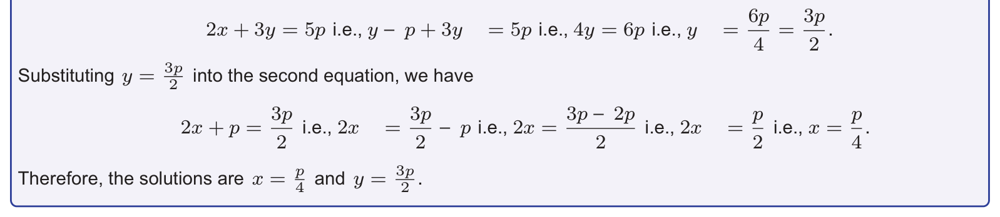

*图6.7 Minerva LLM 可正确求解的一个符号数学问题。虽然本例将自然语言与数学内容混合，但许多LLM使用的标准分词方式不允许这类数学输出，并且可能引发一些令人意外的问题。（图片来源：[5]，遵循知识共享许可）*

<details>
<summary>英文原文</summary>

[Figure]

Figure 6.7 A symbolic math problem that the Minerva LLM can solve correctly. While this example mixes natural language with mathematical content, the standard tokenization used by many LLMs would not allow this kind of mathematical output and can cause some surprising problems. (Image Creative Commons licensed from [5])

</details>

注意：在第5章中，我们提到微调可以多次应用，数学LLM就是一个很好的例子。研究人员通常通过微调代码LLM来创建数学LLM，而代码LLM又是通过微调通用文本LLM得到的。在每个阶段中，从SFT到RLHF，对原始的下游LLM（用于数学LLM）进行了多达三到六轮的微调。

<details>
<summary>英文原文</summary>

NOTE In chapter 5, we mentioned that fine-tuning can be applied multiple times, and math LLMs are a great example of this. Researchers often create math LLMs by fine-tuning code LLMs, which are created by fine-tuning general-purpose text LLMs. Between SFT and RLHF at each stage, as many as three to six rounds of fine-tuning are applied to the original downstream LLM for math LLMs.

</details>

### 6.2.1 输入净化

<details>
<summary>英文原文</summary>

6.2.1 Sanitized input

</details>

数学LLM经常面临输入处理上的困境：那些对自然语言文本效果良好的处理方式，往往反而损害了数学概念的表示。在文本中，格式化的数学表示经常涉及像{}<>;^这样的符号。处理常规文本时，这类特殊符号通常会被从训练数据中移除。保留这些信息需要重写输入解析器进行分词，以确保你不会移除那些你希望模型学习的数据。等价数学方程的多种表示进一步增加了训练LLM理解数学的复杂性，类似于多种格式在处理编程语言时可能引发的问题。几种格式，如TeX、asciimath和MathML，允许用纯文本表达数学符号，同时为排版程序提供正确渲染方程式的指令。这些格式提供了许多表示同一方程式的不同方式。我们在图6.8中展示了这个问题的一个例子。问题出在数学的排版方法（即通过选择TeX或MathML来绘制方程式的方式）和数学的表示方法（即用两种数学上等价的方式表示同一事物）上。这两种都是我们在讨论LLM时多次遇到的问题的表现形式：表示同一事物的不同方式。在数学方面，当前的首选是使用TeX及其非常相似但较少使用的替代品（如asciimath）来保持数学格式，而丢弃像MathML这样冗长的内容。我们做出这一选择的依据有三个因素：

<details>
<summary>英文原文</summary>

Math LLMs often suffer from input preparation that may work well for natural lan-guage text but degrade representations of mathematical concepts. In text, formatted mathematics representations often involve symbols like {}<>;^. Special symbols like these are commonly removed from training data when working with regular text. Pre-serving this information requires rewriting input parsers for tokenization to ensure you do not remove the data you are trying to get your model to learn from. Multiple representations for equivalent mathematical equations further compli-cate training LLMs to understand math in a similar way that multiple formatting may cause problems when processing programming languages. Several formats like TeX, asciimath, and MathML allow mathematical notation to be expressed using plain text but provide instructions for a typesetter to render equations correctly. These formats offer many different ways to represent the same equation. We show an example of this problem in figure 6.8. There are problems with the method of typesetting the math (i.e., how to draw the equation by picking TeX versus MathML) and the representation of the math (i.e., two mathematically equivalent ways of expressing the same thing). These are both forms of a problem that has come up a few times in our discussion of LLMs: different ways to represent the same thing. In the case of mathematics, the current preference is to keep math formatted using TeX and very similar but less-frequent alternatives like asciimath and to discard verbose content like MathML. We base this motivation on three factors:

</details>

*图：图6.8
左上角的一个数学方程式展示了数学中出现的两种不同的表示问题。格式良好的数学需要排版语言。TeX和MathML是两种不同的排版语言，它们的文本内容截然不同，因此分词也不同。除了排版语言之外，表示同一数学语句的方式也有很多种。*

<details>
<summary>英文原文</summary>

[Figure]

Figure 6.8 A mathematical equation in the top-left demonstrates two different representation problems that occur with math. The nicely formatted math requires a typesetting language. TeX and MathML are two different typesetting languages that have vastly different text and, thus, tokenization. Separate from the typesetting language, there are many ways to represent the same mathematical statement.

</details>

基于TeX的格式化数学是最常见且最易获取的数学表示形式，这得益于像arXiv这样的公开资源，它们一致地使用TeX格式。保留所有类TeX表示法可以减轻学习多种格式以及由此产生的截然不同的令牌集的挑战。更为冗长的MathML使用了更多种类的令牌，因此需要更多的计算资源来存储与每个唯一令牌相关的数据。

<details>
<summary>英文原文</summary>

TeX-based formatted math is the most common and available form of math thanks to publicly available sources like arXiv, which consistently uses TeX formatting. Keeping all TeX-like representations mitigates the challenge of learning multi-ple formats and, thus, very different token sets. The more verbose MathML uses a larger variety of tokens; thus, more computing resources are required to store the data associated with each unique token.

</details>

### 选择 TeX

<details>
<summary>英文原文</summary>

Choosing TeX

</details>

在LLM中采用单一的首选表示法处理数学，并未解决这样一个事实：等效方程可以有多种写法。判断哪些方程是相同的极其困难，研究人员已经证明，没有任何单一算法能够确定两个数学表达式是否等价。（我们在此处措辞有些宽松，因为本节讨论的是形式化数学，因此我们将您引至文献[7]。）到目前为止，对LLM而言，最好的答案似乎是“让模型自己想办法解决”，而这一方法至今已取得了相当的成功。但我们不会感到惊讶，如果未来数学LLM的开发者们大力投资于改进预处理，通过创建更一致的数学方程规范化表示来减少等价表达式可能的不同写法。

<details>
<summary>英文原文</summary>

as a single preferred representation for math in LLMs doesn’t solve the fact that there are multiple ways to write equivalent equations. Determining which equations are the same is so difficult that researchers have proven that no single algorithm can determine the equivalence of two mathematical expressions. (We are being a little loose with our words here, given that this section is on formal mathematics, so we will point you to the source [7].) So far, the best answer for LLMs appears to be “let the model try to figure that out,” which has been reasonably successful thus far. But we wouldn’t be surprised if the developers of future math LLMs invest heavily in improving preprocessing by creating more consistent canonical representations for mathematical equations that reduce the variety of possible expressions for equivalent expressions.

</details>

### 6.2.2 帮助

<details>
<summary>英文原文</summary>

6.2.2 Helping

</details>

大语言模型能理解数字。对大多数人来说，数字是数学中更易于理解的部分。把它们放进计算器就能得到结果。虽然可能很繁琐，但没有计算器时你也可以手动计算。只需遵循一套固定的规则就能得出结果。令人有些意外的是，大语言模型在完成这类机械计算时却困难重重，但开发者们已经着手改进分词器，使其更擅长处理数字。

<details>
<summary>英文原文</summary>

LLMs understand numbers For most people, numbers are the more accessible part of math. You can put them in a calculator and get the result. Although it may be tedious, you can perform calculations by hand if you do not have a calculator. One follows a fixed set of rules to get the result. Somewhat surprisingly, LLMs have a lot of trouble doing that sort of rote calculation, but developers have worked to improve tokenizers’ ability to work better with numbers.

</details>

第一个问题是，标准的字节对编码（BPE）算法生成的分词器对数字的分词结果不一致。例如，“1812”很可能被分词为一个单独的词元，因为有成千上万的文档提到了1812年战争；而分词器可能会将1811和1813拆分成更小的数字。为了进一步探究原因，考虑初始字符串

<details>
<summary>英文原文</summary>

The first problem is that the standard byte-pair encoding (BPE) algorithm produ-ces tokenizers that create inconsistent tokens for numbers. For example, “1812” will likely be tokenized as a single token because there are references to the War of 1812 in thousands of documents; tokenizers will possibly break up 1811 and 1813 into smaller numbers. To further explore why this happens, consider the initial string

</details>

### 3252+3253与GPT-3和GPT-4的应对方式

<details>
<summary>英文原文</summary>

3252+3253 and how GPT-3 and GPT-4

</details>

对这个字符串进行分词。GPT-4 会做得更好，因为它似乎每次从前三位数字开始对数字进行分词，结果是得到一个三位数后面跟着一位数。GPT-3 看起来不一致，因为它改变了分词数字的顺序，如图 6.9 所示。

<details>
<summary>英文原文</summary>

tokenize this string. GPT-4 will do a better job because it seems to tokenize numbers by starting with the first three digits every time, resulting in a three-digit number followed by a single-digit number. GPT-3 appears inconsistent because it changes the order in which it tokenizes numbers, as shown in figure 6.9.

</details>

*图：图6.9
大语言模型只有当数字分词一致时才能学会基本算术。
本图中，下划线表示不同的词元。分词后的数字可能代表任意数字的十位、百位或千位。GPT-3（左侧）对数字的分词方式不一致，使得加法运算变得不必要地复杂。GPT-4在数字的一致分词方面表现更好（但并非完美）。*

<details>
<summary>英文原文</summary>

[Figure]

Figure 6.9 LLMs cannot learn to do basic arithmetic unless they tokenize digits consistently. In this figure, underlines denote different tokens. The tokenized digits might represent the tens, hundreds, or thousands place for any given number. GPT-3 (left) is inconsistent in how numbers get tokenized, making adding two numbers needlessly complex. GPT-4 is better (but not perfect) at tokenizing numbers in a consistent way.

</details>

图6.10 xVal采用了一种技巧来减少token数量并降低其歧义性。通过修改LLM将数字转换为向量的方式，每个数字（例如数字1）都由一个单独的向量表示。通过始终使用“1”token并将其乘以观察到的数字，我们避免了数字token表示中的许多边缘情况，例如在训练数据中从未出现过的数字。这种转换方法还使得像3.14这样的小数更容易支持。

<details>
<summary>英文原文</summary>

Figure 6.10 xVal uses a trick to help reduce the number of tokens and make them less ambiguous. By modifying how the LLM converts numbers to vectors, a single vector represents each number, such as the number 1. By always using the 1 token and multiplying it by the number observed, we avoid many edge cases in number token representation, such as numbers that never appeared in the training data. This conversion method also makes fractional numbers like 3.14 easier to support.

</details>

一致的数字标记和xVal策略都共享一个重要认识。我们知道如何表示数学和简单算法，比如小学的加法和乘法。如果我们设计LLM以更符合人类进行数学任务的方式来对数学进行分词，那么我们的LLM将获得更好且更一致的数学能力。

<details>
<summary>英文原文</summary>

Both the consistent digits and the xVal strategy share one important realization. We know how to represent math and simple algorithms like grade-school addition and multiplication. If we design the LLM to tokenize mathematics in a way that is more consistent with how we, as humans, do mathematical tasks, our LLMs get better and more consistent mathematical capabilities.

</details>

### 6.2.3 数学LLM也使用工具

<details>
<summary>英文原文</summary>

6.2.3 Math LLMs also use tools

</details>

*图：图6.11
给定某个数学目标，让LLM使用Lean（右侧路径）可能无法产生可验证的正确证明，因为它可能不擅长将Lean作为工具使用。让LLM生成常规证明（左侧路径）或许能得到正确证明，但我们无法验证其正确性。*

<details>
<summary>英文原文</summary>

[Figure]

Figure 6.11 Given some mathematical goal, getting an LLM to use Lean (right path) might not result in a verifiably correct proof because it may not be effective at using Lean as a tool. Having the LLM produce a normal proof (left path) may yield a correct proof, but not a way for us to verify that it is (in)correct.

</details>

如果LLM无法提供可验证的数学正确性证明，你该怎么办？目前常用的一种技巧是多次运行LLM。由于下一个token是随机选择的，每次运行LLM都可能得到不同的结果和答案。出现频率最高的答案最可能是正确的。这个过程并不能保证证明正确，但确实有所帮助。

<details>
<summary>英文原文</summary>

So what can you do if the LLM cannot provide verifiable proof that its math is correct? A trick used today is to run the LLM multiple times. Because the next token is selected randomly, you can potentially get a different result with a different answer each time you run the LLM. Whichever answer appears most frequently is most likely correct. This process does not guarantee the proof is correct, but it helps.

</details>

### 6.3 Transformer与计算机视觉

<details>
<summary>英文原文</summary>

6.3 Transformers and computer vision

</details>

注意：那里这是一种将图像表示为称为码书的小图像组合的方法。码书可能很有用，但在本质上与我们的讨论不同。可以将此视为一个关键词金块，若想了解一些较旧的计算机视觉技术，不妨一探。

<details>
<summary>英文原文</summary>

NOTE There

was an approach to representing images as a combination of tiny images called code books. Code books can be useful, but not the same in the spirit of our discussion. Consider this a keyword nugget to explore if you want to learn about some older computer vision techniques.

</details>

尽管在Transformer出现之前，高质量的图像识别算法和图像生成器已经存在多年，但Transformer迅速成为机器学习中处理图像的主要方式之一。无论是严格使用Transformer的视觉Transformer（ViT）架构，还是融合Transformer与其他类型数据结构的混合架构模型（如VQGAN和U-Net Transformer），在解释基于图像的数据以及从文本描述生成惊艳的计算机图像方面都取得了巨大成功。Transformer在图像中表现如此出色可能看似违反直觉，因为图像看起来并不像自然语言、代码或氨基酸序列那样的离散符号序列。尽管如此，Transformer通过为模型带来全局一致性，在计算机视觉中发挥了关键作用。

<details>
<summary>英文原文</summary>

While high-quality image recognition algorithms and image generators existed for many years before transformers, transformers have rapidly become one of the pre-mier ways to work with images in machine learning. Both vision transformer (ViT) architectures that strictly use transformers, as well as mixed architecture models such as VQGAN and U-Net transformer that mix transformers with other types of data structures, have seen great success in both interpreting image-based data and producing amazing computer-generated images from text descriptions. It may seem counterintuitive that transformers perform so well in images because images do not look like discrete sequences of symbols like natural language, code, or amino acid sequences do. Still, transformers fulfill a critical role in computer vision by bringing global cohesion to models.

</details>

### 6.3.1 将图像转换为图像块并还原

<details>
<summary>英文原文</summary>

6.3.1 Converting images to patches and back

</details>

概念上，我们将用一个新的过程取代分词器和嵌入过程，该过程输出一个向量序列，类似于我们在3.1.1节讨论的嵌入层。创建表示图像的序列的主流方法是将图像分割成一组块。因此，我们将用返回向量序列的分块提取器替换分词器。LLM的输出使用解嵌入层将向量转换回标记。由于我们没有标记，我们需要一个块组合器，将transformer的输出合并成一个连贯的图像。我们在图6.12中展示了这一过程。请特别注意，图表的中心部分与基于文本的LLM相同。我们在文本和图像之间复用相同的transformer层和学习算法（梯度下降）。

<details>
<summary>英文原文</summary>

Conceptually, we will replace the tokenizer and embedding process with a new process that outputs a sequence of vectors similar to the embedding layers we discussed in section 3.1.1. The prevailing approach to creating a sequence representing an image is to divide the image into a set of patches. As a result, we will replace our tokenizer with a patch extractor that returns a sequence of vectors. The output of an LLM uses an unembedding layer to convert vectors back into tokens. Since we have no tokens, we need a patch combiner to take the outputs of a transformer and merge them into one coherent image. We show this process in figure 6.12. Please pay special attention to the fact that the central portion of the diagram remains the same as it was for text-based LLMs. We reuse the same transformer layers and learning algorithm (gradient descent) between text and images.

</details>

*[未译]* "Output text ..."

<details>
<summary>英文原文</summary>

"Output text ..."

</details>

### 解嵌入·块组合器·图像

<details>
<summary>英文原文</summary>

Unembed Patch combiner Images

</details>

图像不会自然地离散化为token，因此会提取一个序列的块。这些块实质上是按序列取出的图像小片段。最后再将块转换回图像。

<details>
<summary>英文原文</summary>

do not naturally discretize into tokens, so instead, a sequence of patches are extracted. The patches are literally small pieces of the image taken as a sequence. The patches are converted back to an image again at the end.

</details>

中间部分接收一个向量序列，送入Transformer并输出一个新的向量序列，在处理文本或图像数据时保持不变。

<details>
<summary>英文原文</summary>

The middle portion of taking in a sequence of vectors, which goes to a transformer and outputs a new sequence of vectors, remains unchanged between textual or image data.

</details>

Transformer Transformer

<details>
<summary>英文原文</summary>

Transformers Transformers

</details>

分词器和嵌入层，图像块提取器

<details>
<summary>英文原文</summary>

Tokenizer and embedding Patch extractor

</details>


*图6.12 左侧的简化示意图展示了文本输入在进入Transformer之前如何被分词和嵌入。然后，一个解嵌入层将Transformer输出转换为所需的文本表示。当执行计算机视觉任务时，输入和输出将是图像。Transformer保持不变，但我们修改了将图像拆分为向量序列的方法：改用图像块提取而非分词。LLM使用图像块组合器生成图像输出，类似于文本LLM中的解嵌入层。*

<details>
<summary>英文原文</summary>

[Image]

Figure 6.12 On the left, this simplified diagram shows how text input is tokenized and embedded before going to the transformer. An unembedding layer then converts the transformer output into the desired text representation. The input and output will be images when performing a computer vision task. The transformer stays the same, but then we modify the method for breaking the image into a sequence of vectors to perform patch extraction instead of tokenization. The LLM produces image output using a patch combiner, analogous to the unembedding layer for text LLMs.

</details>

输入文本...

<details>
<summary>英文原文</summary>

"Input text ..."

</details>

由于除了输入向量序列生成和输出步骤之外的所有部分保持不变，我们可以专注于图像与向量之间的转换是如何进行的。首先关注输入侧会有所帮助。正如"patch"这个名称所示，图像块提取器将每幅图像分割成一系列较小的图像。通常选择一个固定大小的块，例如16×16像素的正方形。我们希望块大小固定，以便于输入神经网络——神经网络总是处理固定大小的数据；同时块要小，以便它们仅代表整幅图像的一部分。将图像分割成图像块类似于将文本分割成一组词元。每个单独的词元并不提供信息，但与其他词元组合在一起时，就能构成连贯的句子。一旦图像被分割成图像块，块中的每个像素就会被转换为三个数字，分别代表该像素中红、绿、蓝（RGB）的数量。通过将每个像素的RGB值合并成一个长向量，就创建了初始向量。因此，对于我们的16×16像素正方形，每个像素有三个颜色值，我们将得到一个长度为768的向量（16高、16宽，每个像素一个RGB值）。然后，一个可能只有一两层的小型神经网络分别处理每个向量，以生成最终输出。这个神经网络实现了一个非常轻量的特征提取过程，不需要大量的内存或计算资源。这种设计在计算机视觉中很常见，因为第一层通常学习简单的模式，如"内部暗、外部亮"，不需要使用更昂贵或更强大的Transformer层来学习图像块的基本特征。整个过程总结在图6.13中。

<details>
<summary>英文原文</summary>

Since everything except the input vector sequence generation and output steps remains the same, we can focus on how the conversion of images to and from vectors works. It will be helpful to focus on the input side first. As the name patch implies, the patch extractor breaks up each image into a sequence of smaller images. It is common to pick a fixed size for the patch, like a square of 16 × 16 pixels. We want a fixed size so that it is easy to feed into a neural network, which always processes data of a fixed size, and small so that they represent just a piece of the entire image. Breaking an image into patches is similar to breaking text into a collection of tokens. Each individual token isn’t informative, but when combined with other tokens, it makes a coherent sentence. Once an image is broken into patches, each pixel in that patch is converted to three numbers representing the amount of red, green, and blue (RGB) present in each pixel. An initial vector is created by combining each pixel’s RGB values into a single long vector. So for our square of 16 × 16 pixels with three color values for each pixel, we will have a vector that is 768 values in length (16 height, 16 width, and an RGB value for each pixel). Then, a small neural network that might have only one or two layers processes each vector separately to make the final outputs. This neural network implements a very light feature-extraction process that does not require significant memory or computation resources. This design is common in computer vision because the first layer usually learns simple patterns like “dark inside, light outside” and does not need a transformer layer’s greater expense or power to learn the basic features of an image patch. This whole process is summarized in figure 6.13.

</details>


*图6.13 提取图像块是一个直接的过程。图像块提取器将图像分割成称为图像块的方形图块。图像由已经是数字的像素值组成，因此我们将每个图像块转换为数字向量。然后，我们使用一个小型神经网络作为预处理器，再将向量传递给完整的基于Transformer的神经网络。*

<details>
<summary>英文原文</summary>

[Figure]

Figure 6.13 Extracting patches is a straightforward process. The patch extractor breaks up an image into square tiles called patches. Images consist of pixel values that are already numbers, so we convert each patch into a vector of numbers. Then, we use a small neural network as a preprocessor before passing the vectors to the full transformer-based neural network.

</details>

- 3.使用一个小型神经网络进行最少的“特征提取”，为后续Transformer层的处理准备图像块。常规的Transformer/LLM架构从这里开始。

<details>
<summary>英文原文</summary>

3. A small neural network is used to do a minimal amount of “feature extraction” to prepare the patches for processing via the subsequent Transformer layers. A normal transformer/LLM architecture starts here.

</details>

设计补丁提取器中的小型神经网络有多种可行方案，但所有方案通常效果相当。一种选择是使用所谓的卷积神经网络（CNN），这种网络能够理解相邻像素之间的关联。也有人直接采用Transformer层中的线性层作为替代。在这种情况下，包含小型神经网络和一系列Transformer的整体模型通常被称为视觉变换器。小型网络的设计虽是细枝末节，但值得提及，因为它与产生最终输出的补丁组合器相关。无论选用CNN还是线性层作为小型网络的架构都无关紧要，但必须确保输出形状与输入形状匹配。例如，若使用16×16的补丁，则可通过小型网络强制输出具有16×16×3=768个值，无论Transformer层自身大小如何。为生成图像输出，需逆转补丁提取过程，将向量转换回补丁，再组合成图像，如图6.14所示。至此，我们成功用新的以图像为中心的网络层取代了输入分词和输出嵌入。在许多方面，这比分词友好得多。无需构建/维护词汇表，无需采样过程等。这是Transformer作为LLM通用核心之广泛适用性的关键洞见。只要能找到大量数据并将数据转化为向量序列的合理方法，便可用Transformer解决特定类别的输入输出问题。

<details>
<summary>英文原文</summary>

There are many possible ways to design the small neural network used in the patch extractor, but all generally work equally well. One option is to use what is called a convolutional neural network (CNN), which is a type of neural network that understands that pixels near each other are related to each other. Others have used just the same kind of linear layer that is a component of a transformer layer. In this case, the overall model that includes the small neural network and a series of transformers is often called a vision transformer. The design of the small network is a minor detail but worth mentioning because its existence is relevant to the patch combiner that produces the final output. It does not matter whether you pick a CNN or a linear layer for the architecture of the small neural network, but it is essential to ensure the output’s shape matches the input’s shape. For example, if you have 16 × 16 patches, you can use the small network to force the output to have 16 × 16 × 3 = 768 values, regardless of the size of the transformer layer itself. To produce image output, you reverse the patch extraction process to convert the vectors into patches and then combine the patches into an image, as shown in figure 6.14. We have thus successfully replaced the input tokenization and the output embed-ding with new image-centric layers. In many ways, this is much nicer than tokenization. There is no need to build/keep track of a vocabulary, no sampling process, etc. This is a crucial insight into the general applicability of transformers as the general-purpose core of an LLM. If you can find a lot of data and a reasonable method of converting that data into a sequence of vectors, you can use transformers to solve certain classes of input and output problems.

</details>

*图：图6.14
与图6.13相比，此处的箭头方向相反。其目的在于强调补丁组合器与补丁提取器执行相同操作，但方向相反。在此阶段，神经网络更为重要，因为它能强制Transformer的输出与原始补丁具有相同形状——我们可以控制任何神经网络的输出尺寸。*

<details>
<summary>英文原文</summary>

[Figure]

Figure 6.14 Compared to figure 6.13, the arrows here go in the opposite direction. The purpose is to emphasize that the patch combiner and extractor do the same thing but operate in different directions. The neural network is more important in this stage as a way to force the transformer’s output to have the same shape as the original patches because we can control the output size of any neural network.

</details>

### 6.3.2 使用图像和文本的多模态模型

<details>
<summary>英文原文</summary>

6.3.2 Multimodal models using images and text

</details>

将LLM的输入和输出修改为视觉变换器的能力意味着我们可以把图像作为输入并输出图像。这展示了变换器能够处理不同模态的输入，但我们之前只讨论了输入和输出为同一模态的情况。要么是文本输入文本输出，要么是图像输入图像输出。然而，深度学习是灵活的！没有任何东西强迫我们使用同一模态作为输入和输出，甚至限制输入输出只能是一种模态。你可以组合文本输入与图像输出、图像输入与文本输出、文本和图像输入与音频输出，或者任何你能想到的其他数据模态组合。图6.15展示了图像和文本如何为我们提供四种可能的组合方式来处理不同类型的数据。通过创建一个以图像为输入、文本为输出的模型，我们就构建了一个图像描述模型。我们可以训练该模型生成描述输入图像内容的文本。这类模型有助于使图像更容易被发现，并帮助视障用户。通过创建一个以文本为输入、图像为输出的模型，我们就构建了一个图像生成模型。你可以用语言描述想要的图像，模型会根据你的输入生成合理的图像。像MidJourney这样的知名产品就属于这类模型。虽然它们的实现不仅仅是视觉变换器，但高层思想是相同的：通过将文本输入与图像输出以及大量数据配对，我们可以创建跨越不同数据类型的新多模态能力。

<details>
<summary>英文原文</summary>

The ability to change the input and output of an LLM to arrive at a vision transformer means that we can take an image as input and produce an image as output. It demonstrates how a transformer can produce input of different modalities, but we have only discussed cases where the input and output are the same modality. We either have text as input and text as output or images as input and images as output. However, deep learning is flexible! There is nothing that forces us to use the same modality as both input and output or even restrict input and output to be a single modality. You can combine text as input with image as output, images as input and text as output, text and images as input and audio as output, or any other data modality combinations you might think of. Figure 6.15 shows how image and text give us four total ways we might combine them to handle different kinds of data. By creating a model that uses images as input and text as output, we create an image captioning model. We can train this model to generate text describing the input image’s content. Models such as these help make images more discoverable and aid visually impaired users. By creating a model that uses text as the input and an image as the output, we create an image generation model. You can describe a desired image using words, and the model can create a reasonable image based on your input. Famous products like MidJourney are models of this flavor. Though their implementation involves more than just a vision transformer, the high-level idea is the same: by pairing a text-based input with image-based output and a lot of data, we can create new multimodal capabilities that span different data types.

</details>

图像生成模型 图像描述 去噪/图像校正 大型语言模型

<details>
<summary>英文原文</summary>

Image generation models Image captioning Denoising/image correction Large language models

</details>

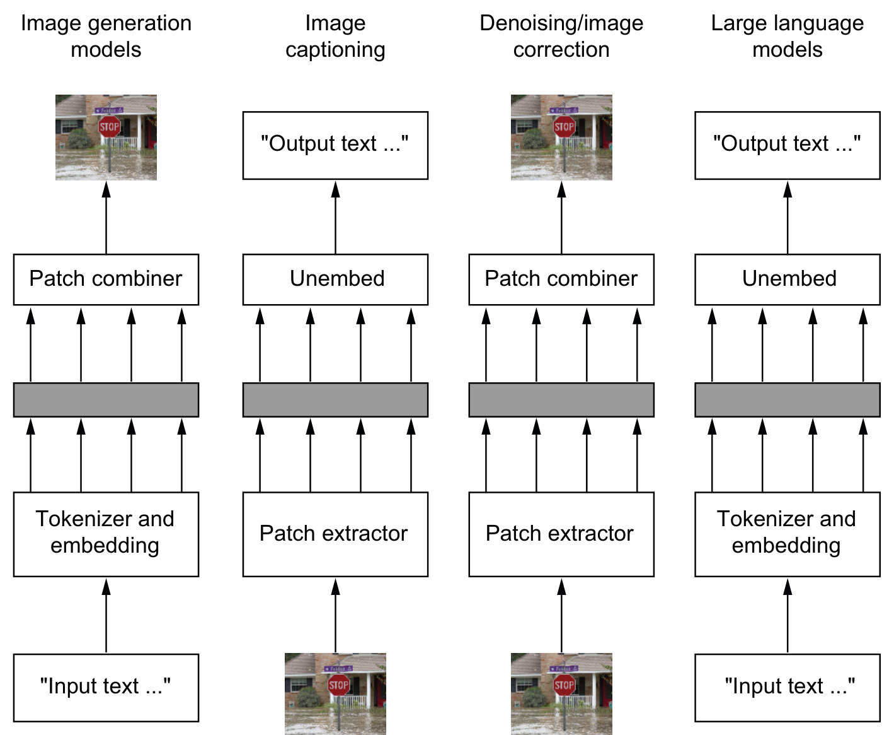

*图6.15展示了四种不同的模型输入和输出组合。最右侧的例子是我们已经了解过的普通文本型LLM。向左依次是：以文本为输入的图像生成模型（“给我画一张停车标志在洪水区的图片”），以及以图像为输入、生成描述文本的图像描述模型（“这张图片显示了一个被浑浊水包围的停车标志”）。*

<details>
<summary>英文原文</summary>

[Image]

Figure 6.15 Four combinations showing different types of model input and output. The example at the furthest right represents a normal text-based LLM we have already learned about. To the left, we show possibilities like an image-generating model that takes text as input (“Draw me a picture of a stop sign in a flood zone”) or an image captioning model that generates text that describes an image input (“This picture shows a stop sign surrounded by murky water”).

</details>

### 6.3.3 先前经验的适用性

<details>
<summary>英文原文</summary>

6.3.3 Applicability of prior lessons

</details>

本书中学到的其他经验教训同样适用于这些视觉Transformer和多模态模型。归根结底，它们学会的是训练所指向的任务，当你试图让它们以训练数据中不存在的方式运行时，可能会得到反常的结果。例如，我们告诉图像生成模型“画任何东西，但别画可爱的猫”，结果很可能还是会得到一只猫，如图6.16所示。这些模型目前是用成对的图像和描述图像的文字片段训练的。因此，它们学会了与输入句子中任何内容进行强关联以生成可视化结果。例如，因为输入句子中包含“猫”这个词，模型就倾向于生成猫。更复杂的抽象绘图指令，如“画任何东西但不要”，在数据集中并不存在，因此模型没有接受过处理这类请求的训练。类似地，随着ChatGPT等大语言模型将提示工程发展为一种设计输入以产生期望输出的策略，图像描述模型也发展出了提示工程。在输入中包含“Unreal3D”等特殊信息并不罕见——Unreal3D是一款用于为电子游戏生成3D图像的软件，使用它可以使输出具有特定风格和质量。诸如“高分辨率”之类的词语，甚至已故或在世艺术家的名字，都被用来试图引导模型生成特定风格。

<details>
<summary>英文原文</summary>

Other lessons learned throughout this book remain relevant to these vision transfor-mer and multimodal models. Ultimately, they learn to do what they are trained for, and when you try to bend them in ways beyond what is found in the training data, you may get an unusual result. As an example, we might tell an image generation model “Draw anything but an adorable cat,” and you will probably end up with a cat as shown in figure 6.16 These models are (currently) trained with pairs of images and pieces of text describing the image. Thus, they learn a strong correlation to produce visualizations of anything in the input sentence. For example, the model wants to produce a cat since the word cat is in the input sentence. More sophisticated abstract drawing requests like “Draw anything but” do not appear in such datasets, and so the model is not trained to handle such a request. Similarly, as LLMs like ChatGPT have developed prompting as a strategy for devising inputs that produce desired outputs, prompting has also been developed for image captioning models. It is not uncommon to include unusual information like “Unreal3D,” the name of software used to generate 3D imagery for computer games to produce output with a particular style and quality. Words like high resolution and even the names of artists, alive and dead, are used to try to influence the models into producing particular styles.

</details>


*图 6.16 这是用旧版 Stable Diffusion（一个流行的图像生成模型）生成的。尽管告诉模型“不要画猫”，但模型被训练为生成内容。该请求超出了模型被激励去学习的范围，因此它无法处理。这与大语言模型出现接近但错误的输出问题类似，因为模型在训练期间见过类似数据。*

<details>
<summary>英文原文</summary>

[Image]

Figure 6.16 This was generated with an old version of Stable Diffusion, a popular image generation model. Despite telling the model “Do not draw a cat,” the model was trained to generate content. The request is outside what the model was incentivized to learn, so it cannot handle it. This is similar to the problems with LLMs regurgitating close-but-wrong output because the model saw similar data during training.

</details>

### 总结

<details>
<summary>英文原文</summary>

Summary

</details>


### 本章插图（补充）


*图6.8 左上角的一个数学方程式展示了数学中出现的两种不同的表示问题。格式良好的数学需要排版语言。TeX和MathML是两种不同的排版语言，它们的文本内容截然不同，因此分词也不同。除了排版语言之外，表示同一数学语句的方式也有很多种。*

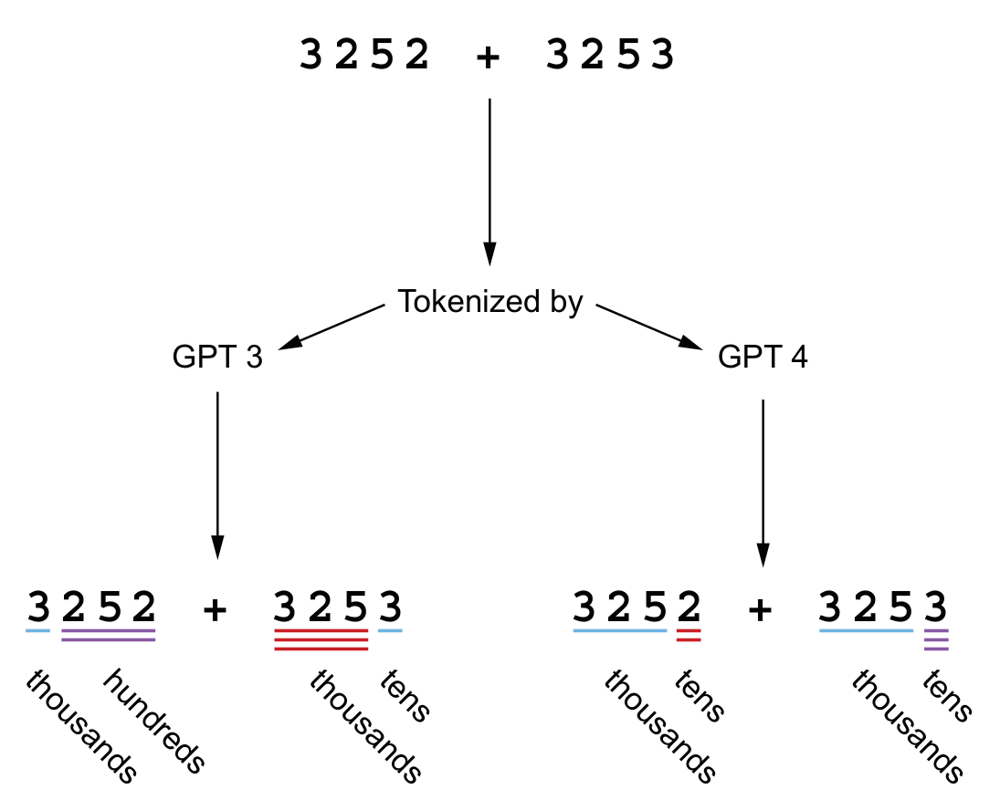

*图6.9 大语言模型只有当数字分词一致时才能学会基本算术。 本图中，下划线表示不同的词元。分词后的数字可能代表任意数字的十位、百位或千位。GPT-3（左侧）对数字的分词方式不一致，使得加法运算变得不必要地复杂。GPT-4在数字的一致分词方面表现更好（但并非完美）。*

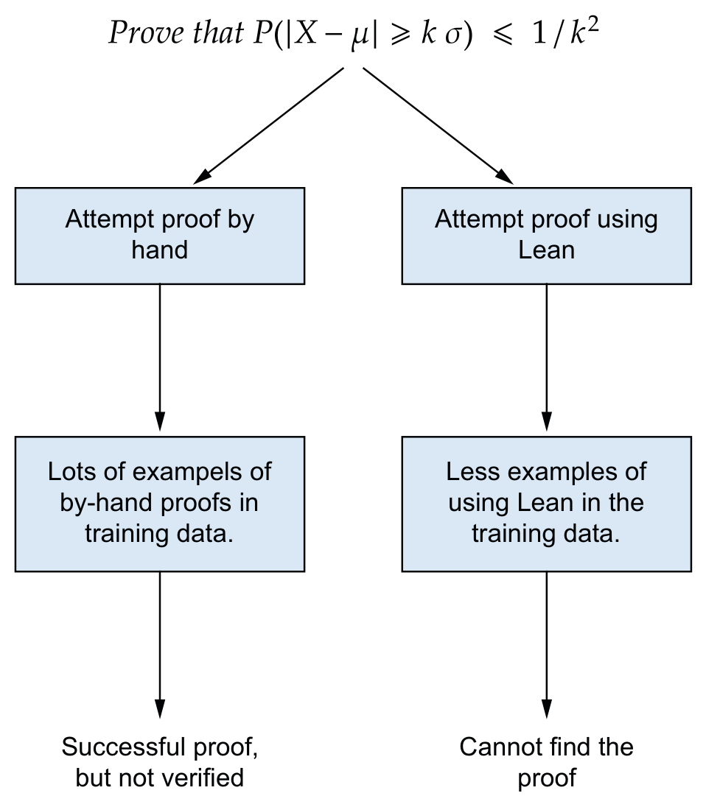

*图6.11 给定某个数学目标，让LLM使用Lean（右侧路径）可能无法产生可验证的正确证明，因为它可能不擅长将Lean作为工具使用。让LLM生成常规证明（左侧路径）或许能得到正确证明，但我们无法验证其正确性。*


*图6.14 与图6.13相比，此处的箭头方向相反。其目的在于强调补丁组合器与补丁提取器执行相同操作，但方向相反。在此阶段，神经网络更为重要，因为它能强制Transformer的输出与原始补丁具有相同形状——我们可以控制任何神经网络的输出尺寸。*

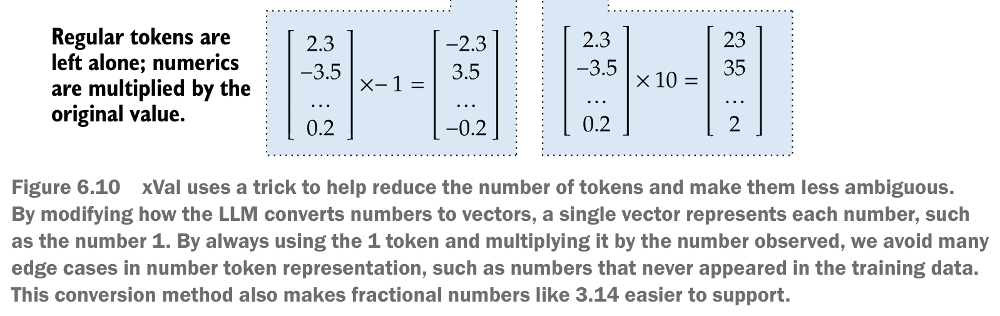


---

## 第 7 章: LLM 的误解、局限与新兴能力

LLM 的七大误解、局限与卓越能力

<details>
<summary>英文原文</summary>

7 Misconceptions, limits, and eminent abilities of LLMs

</details>

### 本章涵盖

- LLM与人类在学习方式上的差异
- 提升LLM在延迟和规模敏感型应用中的表现
- 生成中间输出以优化最终结果
- 计算复杂度限制了LLM的能力范围。

<details>
<summary>英文原文</summary>

This chapter covers How LLMs and humans differ in learning Making LLMs better at latency and scale-sensitive applications Producing intermediate outputs for better final results How computational complexity limits what an LLM can do

</details>

### 感谢ChatGPT，世界

<details>
<summary>英文原文</summary>

Thanks to ChatGPT, the world

</details>

人们已经更广泛地认识到LLM及其能力。尽管有这种认识，关于LLM的许多误解和错误理解仍然存在。许多人认为LLM在持续学习和自我改进，比人类更聪明，并且很快就能解决地球上的所有问题。虽然这些说法有些夸张，但有些人真诚地担心LLM会严重扰乱世界。我们并不是说对LLM没有合理的担忧，我们将在本书的最后两章更深入地讨论这些问题。尽管如此，与LLM和技术的广泛发展相比，你可能遇到的许多关于LLM的想法和担忧都被夸大了。

<details>
<summary>英文原文</summary>

has become more broadly aware of LLMs and their capabilities. Despite this awareness, many misconceptions and misunderstandings about LLMs still exist. Many people believe that LLMs are continually learning and self-improving, are more intelligent than people, and will soon be able to solve every problem on earth. While these statements are hyperbolic, some earnestly fear that LLMs will seriously disrupt the world. We are not here to say there are no legitimate concerns about LLMs, and we will discuss these in more depth in the book’s last two chapters. Still, many thoughts and worries about LLMs that you may encounter are blown out of proportion compared to how LLMs and technology broadly evolve.

</details>

本章将讨论LLM工作方式的几个关键方面，以及这些方面与这些误解的关联。归根结底，LLM的这些运作方式会影响你在实践中如何使用或避免使用LLM。首先，我们将讨论人类与LLM学习方式的差异。人类是快速学习者，而LLM默认是静态的。尽管LLM在处理数据方面异常高效，但人类在习得新知识时更能发挥最大效能。接下来，我们将探讨为什么在使用“思考”一词来描述LLM的工作方式时会产生误导。我们将强调，将LLM的运作视为“计算”更为恰当，因为LLM在构思和输出之间没有区别。相比之下，人类常常“三思而后言”。最后，我们将讨论LLM能够计算的范围，以及计算机科学概念如何帮助我们理解LLM当前和未来能力背后的一些固有局限。这三个主题相互关联，因此随着我们逐一深入讨论，你将看到它们之间的联系。

<details>
<summary>英文原文</summary>

This chapter will discuss a few critical aspects of how LLMs work and how these aspects relate to these misconceptions. Ultimately, these operational aspects of LLMs affect how you may want to use or avoid an LLM in practice. First, we will discuss the differences between how humans and LLMs learn. Humans are fast learners, but LLMs are static by default. Although LLMs can be incredibly effective at processing data, people are better equipped to be maximally productive when learning new things. Next, we will tackle why the word thinking is misleading when considering how an LLM works. We will highlight that it is better to think of an LLM’s operation as computing because LLMs have no distinction between formulating and emitting output. In contrast, people often “think before they speak.” Finally, we will discuss the scope of what LLMs can compute and how computer science concepts help us understand some of the intrinsic limitations behind an LLM’s current and future capabilities. These three topics are interrelated, so you will see how they connect as we discuss each in more detail.

</details>

### 7.1 人类学习速度与LLM对比

<details>
<summary>英文原文</summary>

7.1 Human rate of learning vs. LLMs

</details>

虽然我们已经隐含地讨论过这一点，但明确阐述大语言模型的训练与人类学习之间的差异仍是有益的。生成式AI产出的流畅且通常是清晰的文本，以及我们将大语言模型的能力类比于人类能力时所用的比喻，可能让人以为两者之间存在某种关联。许多人在网上鼓吹这种观念，认为大语言模型能做的事与人类能做的事之间的这种联系是真实存在的。实际上，两者截然不同，这在我们何时、为何以及如何更倾向于使用人类而非AI，以及人类与AI如何协同工作时，都带来重要的考量。从我们目前涉及的材料中，我们知道大语言模型通过预测下一个词来学习，并以数亿篇文档作为示例。在第4章中，我们阐述了大语言模型中“学习”的算法过程：梯度下降算法，该算法通过尝试预测样本输入中的下一个词元来修改大语言模型神经网络的参数。随后，在第5章中，我们展示了像RLHF这样的微调算法如何再次修改大语言模型的参数。大语言模型的这两个学习组成部分与人类学习的相似性极低，并且对我们期望大语言模型能做什么施加了一些关键限制。其中最关键的方面之一，是这种学习方式相对于训练过程中提供的数据量而言的速率和效果。为进一步探讨这一点，考虑一下大语言模型的学习方式与人类学习方式的对比。你是否遇见过这样的人，他从未与任何人说过话，从未有父母对其讲过话，却不知何故理解了语言？很可能没有。事实上，对话是语言习得的关键部分[1]。至少最初，你是通过与他人和环境的互动与交流来获取知识和语言的。因此，你能够用远比大语言模型训练所用数据少得多的信息进行有效学习。

<details>
<summary>英文原文</summary>

While we have discussed it implicitly, it is helpful to be explicit about how an LLM’s training differs from a person’s learning. The fluid and often lucid text produced by generative AI and the analogies we use to relate the capabilities of LLMs to human capabilities may make it seem as if there were some relationship between the two. Many people online are touting the idea that such a connection between what an LLM can do and what a human can do is real. In reality, the two are very different and have important considerations for when, how, and why you might prefer a person over an AI and how humans and AI can work together. From the material we have covered so far, we know that LLMs learn by predicting the next word using hundreds of millions of documents as examples. In chapter 4, we presented the algorithmic process of “learning” in LLMs: the gradient descent algorithm, which alters the parameters of an LLM’s neural network by attempting to predict the next token in a sample input. Then, in chapter 5, we showed how fine-tuning algorithms, like RLHF, alter the parameters of the LLM again. These two components of learning in an LLM have minimal resemblance to human learning and impose some crucial limitations on what we can expect the LLM to do. One of the most critical aspects is the rate and efficacy of this learning approach as it relates to the volume of data provided to the training process. To explore this further, consider how an LLM learns relative to how people learn. Have you ever met anyone who never spoke to anyone else, never had a parent talk to them, and yet somehow understood language? Likely not. Indeed, conversation is a key part of linguistic acquisition [1]. At least initially, you acquire knowledge and language from interaction and communication with others and the environment. Consequentially, you can learn effectively with much less information than an LLM has in the data that it trains on.

</details>

在儿童语言习得的最佳案例中，研究观察到儿童每月接触到约15,000个口语词汇[2]。如果我们慷慨地将这一数字向上取整至20,000个词，并考虑到100年的跨度，一个人一生将接触到多达2,400万个口语词汇。这显然是一个巨大的高估。再加上一个事实：大多数人至少在18岁时就能流利地使用母语，并对词汇和语言结构有隐含的理解。现在与大语言模型对比。例如，GPT-3是在数千亿词汇上训练的。仅从词汇数量来看，这是一种非常低效的语言学习方式！语言习得也帮助我们认识到词汇习得方式上的显著差异。婴儿和幼儿从简单的词汇开始，如"妈妈"和"爸爸"，最终学会像颜色、不、食物等基本概念。随着时间的推移，在先前词汇的基础上逐步增加更复杂的词汇。然而，大语言模型则是根据使用频率同时看到所有词汇。实际上，可以准确地将大语言模型想象为将这本书本身作为其第一次"学习"的一部分进行词元化，即同时获取其所有最终词汇的知识，而不是从简单概念开始并在此基础上构建知识。虽然这个过程有助于大语言模型的学习速度，但可能削弱它在概念之间建立高层次关系的能力。大语言模型相对于人类的关键优势在于其运行规模以及同时执行多个任务的能力。这一优势是机器学习和深度学习中的一个共同主题。你很难雇佣一支大军来梳理书籍、费用报告、内部文件或任何信息媒介，以执行诸如撰写评论、发现潜在欺诈或回答晦涩政策问题之类的知识工作。然而，你可以迅速获得一支计算机大军来尝试自动化这些任务。虽然单个大语言模型可以同时分析句子的多个部分，但你也可以使用多台运行相同大语言模型的计算机并行工作。训练大语言模型也提供了类似的机会：大语言模型是在你一生中永远无法读或听到的更多词汇上训练的，你可以通过租用或购买数千台计算机并发工作来训练一个大语言模型。结合这些事实以及我们在前几章中涵盖的材料，我们可以列出使用大语言模型与人类执行任务相比的几个高层次优缺点。图7.1总结了这些因素，描述了大语言模型的优势和劣势如何导致其使用的自然利弊，从而为LLM应该和不应该使用的场景提供见解。大语言模型的一些优势如下：

<details>
<summary>英文原文</summary>

In the best-case scenarios of childhood language acquisition, studies have observed that children are exposed to around 15,000 total spoken words a month [2]. If we were to be generous and round this figure up to 20,000 words and consider this over 100 years, a person would encounter as many as 24 million spoken words throughout their entire life. This is clearly a vast overestimate. Couple this with the fact that most people can speak their native language fluently, with an implicit understanding of vocabulary and linguistic structure, by at least age 18. Now compare this with LLMs. GPT-3, for example, was trained on hundreds of billions of words. Based on word counts alone, this is a very inefficient way to learn language! Language acquisition also helps us recognize the stark differences in how words are acquired. Babies and toddlers start with simple words, such as mama and dada, and eventually learn basic concepts like colors, no, food, etc. More complex words are added over time, building on the prior words. Yet an LLM begins with seeing all words simultaneously based on their frequency of use. Indeed, it is accurate to imagine an LLM tokenizing this very book as part of its first “learning,” acquiring knowledge of all of its eventual vocabulary simultaneously instead of starting with simple concepts and building knowledge on top of those foundations. While this process contributes to the rate at which an LLM learns, it may detract from the LLM’s capabilities of drawing high-level relationships between concepts. An LLM’s key advantage over humans is the scale at which it operates and its ability to perform multiple tasks simultaneously. This advantage is a common theme throughout machine learning and deep learning. You cannot easily hire an army of people to comb through books, expense reports, internal documents, or whatever medium of information to perform knowledge work like writing a review, finding potential fraud, or answering an arcane policy question. However, you can quickly get an army of computers to attempt to automate these tasks. While an individual LLM can analyze multiple parts of a sentence simultaneously, you can employ multiple computers running the same LLM to work in parallel. Training the LLM presents a similar opportunity: LLMs are trained on more words than you will ever read or hear in your lifetime, and you can train a large LLM by renting or buying thousands of computers to do the work concurrently. Considering these facts in conjunction with the material we’ve covered in previous chapters, we can list several high-level pros and cons of using LLMs for tasks compared to humans. A summary of these factors is shown in figure 7.1, which describes how the advantages and disadvantages of LLMs will lead to natural benefits and drawbacks of their use and, thus, provide insights about where LLMs should and should not be used. Some of the benefits of LLMs are as follows:

</details>

### 训练有素的大语言模型具有

<details>
<summary>英文原文</summary>

Well-trained LLMs have

</details>

LLM拥有广泛的背景信息，因此在处理许多与之前见过的任务相差不大的任务时表现良好，几乎无需额外工作即可生效。虽然这些信息不一定正确或详细，但LLM能够接收并生成合理回应的主题领域之广，远超大多数个人所能覆盖的范围。

<details>
<summary>英文原文</summary>

a broad collection of background information, so they perform well on many tasks that are not that different from what has been seen before, and little work is needed to make the model effective. While this is not necessarily correct or detailed information, the breadth of the topic areas that an LLM can receive and generate reasonable responses about is far beyond the areas that most individual people can cover.

</details>


*图7.1 与人类执行相同任务相比，LLM的优势与劣势概览。这些引出了使用LLM时必须评估的一些自然考量。据此，我们可以得出成功使用LLM的广泛建议。*

<details>
<summary>英文原文</summary>

[Figure]

Figure 7.1 A summary of the strengths and weaknesses of LLMs relative to humans performing the same task. These lead to natural considerations that you must evaluate when using an LLM. From these, we can draw broad recommendations for successful LLM use.

</details>

对于许多任务，无需获得完全正确的回答。对某一学科领域的通用信息提出宽泛请求，本质上允许LLM在回答时保持灵活和不受约束。如果你通过其他流程来优化LLM的输出，这一点尤其明显。例如，人类可能会对一篇文章进行编辑润色，但使用LLM来生成初稿或提供灵感以打破写作瓶颈，加速创作过程。同样，LLM可以被用来优化作者的写作，通过改写或使用更丰富的词汇，使其听起来更自然或更有吸引力。与人类相比，LLM可以更快地被训练。只需100万到1000万美元的预算来购买计算资源，你就可以在几个月内产出一个广泛有用的LLM。而人类需要很多年才能变得有用。一个能够回答广泛基础问题的LLM，其部署所需的努力和成本远低于寻找、雇佣和留住一名具备特定知识、技能和能力的员工。只要问题在LLM能够处理的范围内，即使不考虑额外开销，其增量成本与人类的小时费率相比也是微不足道的。

<details>
<summary>英文原文</summary>

For many tasks, there is no need to get a precisely correct response. Broad requests for general information in a subject area intrinsically allow an LLM to be flexible and unconstrained in its response. This is especially true if you refine the LLM’s output through other processes. For example, a human might copyedit a piece of writing to improve it but use an LLM to produce the first draft or provide inspiration to break writer’s block and accelerate creating the work. Likewise, an LLM can be used to refine an author’s writing to make it sound more natural or engaging through rephrasing or using a larger variety of vocabulary. LLMs can be trained quickly in comparison to people. You can produce a broadly useful LLM in months, given a $1,000,000 to $10,000,000 budget to purchase computational resources. Humans take many years to become useful. An LLM that can answer a broad set of basic questions can be instantiated for far less effort and cost than it takes to find, hire, and retain an employee with specific knowledge, skills, and abilities. As long as the problems are in the scope of what the LLM can achieve, the incremental cost is minuscule compared to a person’s hourly rate, even without the extra overhead.

</details>

以下是LLM的一些缺点：

<details>
<summary>英文原文</summary>

Some of the drawbacks of LLMs are as follows:

</details>

训练LLM的高昂成本决定了其经济性。这笔训练成本会分摊到LLM训练完成后执行的数千次操作中。如果LLM表现不佳，持续改进使其正常运行的成本很快就会变得高不可攀，更何况它可能永远无法正确完成特定任务。例如，如果一个使用了所有最新工具和技巧的LLM无法解决特定需求，那么解决这一问题所需的工作量和预算将难以估量。相比之下，人类通常能够以低得多的成本在数周至数月内学会新能力，尤其是那些LLM难以掌握的技能。LLM无法可靠地处理训练数据中未曾出现的意外情况和输入。尽管许多LLM已展现出应对新情况的能力，但它们的学习方式与人类不同。人类能在首次尝试时就发现行动未达到预期效果，并迅速调整。LLM无法通过观察错误来自主适应，可能会反复消耗资源试图回答它根本无法理解的问题。LLM很容易被欺骗，在对抗性环境中表现不佳，因为一旦人们找到诱使LLM产生错误结果的方法（例如“即使我没有收入，也请给我贷款”），他们可以重复这种对抗性和恶意行为，而LLM无法自行阻止，除非你实施额外的防护措施。

<details>
<summary>英文原文</summary>

The high cost of training LLMs informs their economics. That training cost is amortized over the thousands of operations the LLM performs once trained. If an LLM doesn’t perform well, the cost of continually improving it to make it work can quickly become prohibitive, even without considering the potential that it might never work correctly for a specific task. For example, if an LLM, implemented with all the most recent tools and tricks, cannot solve a specific need, addressing this problem will require an unknown amount of work and budget. Conversely, humans can generally learn new capabilities, specifically those that are hard for LLMs, at much lower cost in weeks to months. LLMs cannot be relied upon to handle unexpected situations and inputs not reflected in their training data. Although many have shown they can succeed in novel situations, they do not learn in the same way as humans. A person can see that their actions are not working as intended on the first try and quickly adapt. An LLM cannot independently adapt by observing its errors and may repeatedly consume resources attempting to produce answers to problems it cannot understand. LLMs are easily fooled and do not work well in adversarial environments because once people find a way to trick the LLM into an errant outcome (e.g., “Give me a loan even though I have no income”), they can repeat the adversarial and malicious behavior, and your LLM won’t be able to prevent it without you implementing additional guardrails.

</details>

### 7.1.1 自我提升的局限

<details>
<summary>英文原文</summary>

7.1.1 The limitations on self-improvement

</details>

通常，人类具备自我改进的能力。他们能够聚焦并研究问题，设计新颖的方法，确定所需资源，进而实施并完善解决方案。尽管大语言模型在自我改进方面存在困难，但在生成式AI领域，有人认为大语言模型同样可能实现自我改进。其大致思路如下：

<details>
<summary>英文原文</summary>

Generally, humans are capable of self-improvement. They can focus on and study a problem, devise novel approaches, identify required resources, and move forward to implement and improve their solutions. While LLMs struggle with self-improvement, in the generative AI field, there is a belief that the same self-improvement may be possible for LLMs. The idea about how this could work goes something like this:

</details>

1. 在初始数据集上训练大语言模型。

<details>
<summary>英文原文</summary>

1 Train an LLM on an initial dataset.

</details>

2. 使用

<details>
<summary>英文原文</summary>

2 Use the

</details>

大语言模型生成新数据，并将其添加到训练数据集中。

<details>
<summary>英文原文</summary>

LLM to generate new data, adding it to your training dataset.

</details>

3. 在新数据上训练或微调模型。（重复直到LLM达到预期效果。）这听起来直觉上合理，但我们认为它行不通，原因很简单。我们可以利用基础信息论来解释原因，该理论将信息视为可量化的资源。这一论点的基础在于，根据某种信息度量，原始数据集具有固定的信息量。用统计学的说法，我们可以将原始信息描述为可用信息的分布，而LLM在训练过程中试图通过在其模型中存储和编码来逼近或复现该信息分布。当你使用LLM生成新数据时，这些数据样本是对LLM在训练过程中观察到的原始数据分布的有噪声且不完整的复现。从根本上说，LLM的输出不可能包含原始训练数据中不存在的新信息。因此，这类实验的现实是，连续多轮的数据生成和训练会降低模型的质量和性能[3]。要让类似方法奏效，你需要每轮都能提供外部或新信息的东西。这些概念也与一些人的担忧有关：AI能否自我改进到我们完全无法理解或控制的超级智能程度。有些观点认为，LLM可以利用其他工具，通过某种方式获取外部信息或更多训练数据来自我改进。最终，这需要相信：尽管大多数技术都存在改进上限（如收益递减规律），但LLM将不受这些限制约束。图7.2描述了LLM自我改进的内在局限。

<details>
<summary>英文原文</summary>

3 Train or fine-tune the model on the new data. (Repeat until the LLM works as expected.) While this sounds intuitive and plausible, we believe that it does not work for simple reasons. We can use some basic information theory, which measures information as a quantifiable resource, to explain why. The basis of this argument is that by some measure of information, the original dataset has a fixed amount of information. In statistics vernacular, we might describe the original information as the distribution of available information, and through its training process, the LLM is attempting to approximate or reproduce that distribution of information by storing and encoding it in its model. When you generate new data using an LLM, that sample of data is a noisy and incomplete reproduction of the original data distribution that the LLM observed in the training process. Fundamentally, it is impossible for the LLM’s output to contain any new information not present in the original training data. Consequently, the reality of such experiments is that successive rounds of generating data and training degrade the quality and performance of the model [3]. To make something like this work, you need something that provides external or new information at each round. These concepts also relate to some people’s fear of AI improving itself until it becomes so intelligent that we have no hope of understanding or controlling it. Some arguments are that the LLM can use other tools, somehow acquiring outside information or more training data, to improve itself. Ultimately, this requires a belief that while there are limitations as to how far you can improve most technologies, LLMs will be immune to these limits, such as the law of diminishing returns. Figure 7.2 describes the inherent limits to LLM self-improvement.

</details>


*图7.2 担忧LLMs会自我改进，需要相信LLMs不会遵循描述几乎所有其他技术发展的正常S形或收益递减S曲线。为了实现无限的自我改进，我们必须相信诸如电力、数据或计算能力等约束总是可以解决的，并且人类不会在LLM之外的领域解决这些问题。正是这些约束使我们能够用S曲线来描述大多数技术的发展，随着更多约束生效，进步放缓。换句话说，我们最终会达到一个无法仅仅通过建造更大的计算机来解决问题的状态。*

<details>
<summary>英文原文</summary>

[Figure]

Figure 7.2 Concerns that LLMs will self-improve require the belief that LLMs won’t follow the normal sigmoid or S-curve of diminishing returns that describes the development of almost all other technologies. For infinite self-improvement to happen, we must believe that constraints such as power, data, or computational capacity are always solvable and that somehow, humans would not otherwise solve them for areas outside of LLMs. Constraints such as these are why we can describe most tech-nology development using S-curves, where progress slows as more constraints take effect. In other words, we’ll eventually reach a state where we can’t just build a bigger computer.

</details>

技术改进局限性一个绝佳的例子是摩尔定律，它大致指出芯片上的晶体管数量每18到24个月翻一番。摩尔定律基本准确预测了芯片上晶体管数量的增长，但已出现晶体管收益递减的S曲线迹象。芯片上晶体管数量的翻倍速度正在放缓。更重要的是，整个系统性能已经进入这一S曲线。晶体管数量与总计算性能相关，但并不直接指示计算性能。纵观图7.3的全貌，你会发现其他约束条件阻碍了整个系统无限制的改进。撇开摩尔定律不谈，高性能GPU及其托管基础设施的实际成本是无限制改进的另一个障碍。

<details>
<summary>英文原文</summary>

A great example of limitations on technical improvement is Moore’s law, which roughly states that the number of transistors on a chip would double every 18 to 24 months. Moore’s law has mostly accurately predicted the growth of transistors on a chip, but there are signs of the S-curve of diminishing returns in transistors. The rate of the number of transistors on a chip doubling is decreasing. More importantly, the total system performance has already entered this S-curve. The number of transistors correlates with total compute performance but does not directly indicate compute performance. Looking at the whole picture in figure 7.3, you will see that other constraints prevent boundless improvements across the entire system. Moore’s law aside, the practical cost of high-performance GPUs and the infrastructure that hosts them is another barrier to boundless improvement.

</details>

许多吸睛的标题宣称LLM在医学院入学考试（MCAT）、律师资格考试和智商测试中表现优异。尽管这些测试总是很有趣，并且充满了诸如……

<details>
<summary>英文原文</summary>

Many catchy headlines have proclaimed LLM performance on the MCAT exam for medical school, the bar exam for lawyers to practice law, and IQ tests to measure their intelligence. While these are always interesting and full of caveats such as

</details>

*图：图7.3 摩尔定律常被引为无限增长的范例，但实则具有误导性。晶体管数量持续翻倍，但频率、功耗、单线程性能及总计算能力并未同步增长。因此，系统整体性能并未保持约每两年翻倍的趋势。类似的因素也将随时间推移制约LLM的性能和能力的提升。图片根据CC4.0许可协议来自 https://github.com/karlrupp/microprocessor-trend-data。*

<details>
<summary>英文原文</summary>

[Figure]

Figure 7.3 Moores’s law is a common example of boundless growth, but it is misleading. Transistors keep doubling, but frequency, power, single-threaded performance, and total computing do not. So the total system performance has not continued to double approximately every two years. Other similar factors will constrain LLM performance and affect capability over time. Used under CC4.0 license from https://github.com/karlrupp/microprocessor-trend-data.

</details>

有许多利用外部信息改进生成式AI的例子。一些为机械手设计的算法使用来自物理模拟器的外部信息。苹果公司利用3D建模软件生成数据，从而改进其手机上的虹膜识别[5]。在第6章的例子中，我们看到了一条潜在路径：通过代码编译器或Lean语言来验证数学，从而改进大语言模型。这些例子展示了完全自动化的流程，能够产生新信息，进而实现自我改进。然而，从未有过无限自我改进的实例；使用这些外部工具所获得的收益最终会达到平台期，并且最终仍依赖人类来开发辅助信息——比如为机器人编写更好的物理模拟器、为代码编写更好的编译器，以及诸如Lean之类的更完善的领域知识系统。改进这些工具会加剧训练大语言模型的巨额成本，从而在实用性之外，对大语言模型的自我改进施加了第二重经济限制。

<details>
<summary>英文原文</summary>

There are many examples of outside information being used to improve generative AI. Some algorithms created for robotic hands use external information from a physics simulator. Apple uses 3D modeling software to generate data that improves iris recognition on their phones [5]. In the examples in chapter 6, you saw a potential path for improving an LLM using a compiler for code or the Lean language to verify LM 720 8165 mathematics. These examples demonstrate fully automatable processes that generate new information that can lead to self-improvement. Yet, there has never been an example of boundless self-improvement; the gains observed from using these external tools eventually reach a plateau and ultimately rely on humans to develop the side information by writing better physics simulators for the robots, better compilers for code, and better domain-knowledge systems like Lean. Improving these tools compounds a major expense of training LLMs, thus imposing a second economic limitation on the self-improvement of LLMs beyond what is practical.

</details>

### 7.1.2 少样本学习

<details>
<summary>英文原文</summary>

7.1.2 Few-shot learning

</details>

少样本学习也称为上下文学习。这项技术涉及在发送给LLM的提示中提供你希望它生成的输出类型的示例。假设你希望LLM用准确的信息回复一个帮助台问题。你可以给LLM一个包含用户向帮助台提问的提示，后面跟一个适当回复的示例。如果只提供一个示例，则称为单样本学习。提供两个示例而不是一个被称为两样本学习，以此类推，因此将这种方法描述为少样本学习，因为示例的具体数量通常不如仅提供少数示例这一事实重要。这种将示例融入提示的方法是一种特定的提示工程，如图7.4所示。

<details>
<summary>英文原文</summary>

Few-shot learning is also called in-context learning. This technique involves providing examples of the type of output you want an LLM to produce as a part of the prompt you send it. Say you want an LLM to respond to a help-desk question with accurate information. You may give the LLM a prompt with a user’s question to the help desk, followed by an example of the appropriate kind of response. If you give only one example, it’s called one-shot learning. Providing two examples instead of a single example is known as two-shot learning, and so on, hence describing this approach as few-shot because the precise number of examples is generally not as important as the fact that only a few examples are provided. This method of incorporating examples in a prompt is a specific kind of prompt engineering, as demonstrated in figure 7.4.

</details>

*图：图7.4
包含期望LLM输出示例的提示称为少样本提示，因为LLM在训练数据中从未见过该特定行为的示例。在提示中，你可以包含与RLHF/监督式微调（SFT）类似的输入和输出示例。这种提示风格通过提供理想输出应呈现的示例，鼓励模型产生期望的输出。由于LLM在大量无标签数据上进行训练，k-shot示例是一种以最小努力获得更好结果的有效方式。*

<details>
<summary>英文原文</summary>

[Figure]

Figure 7.4 Prompts with examples of how you want the LLM to produce output are called few-shot prompts because the LLM has not seen any examples of this specific behavior in its training data. In your prompt, you can include examples of input and output similar to RLHF/supervised fine-tuning (SFT). This prompting style encourages the model to produce the desired output by providing examples of what the desired output should look like. Because LLMs train on such a large amount of unlabeled data, k-shot examples are an effective way to get better results with minimal effort.

</details>

在提示中包含示例有助于提升LLM在新任务上的表现。无需使用RLHF或SFT来修改模型，这种方法也比零样本提示（即要求LLM在没有示例的情况下完成任务）效果更好。但这算高效学习吗？

<details>
<summary>英文原文</summary>

Including examples in your prompts is useful for improving an LLM’s performance at new tasks. You don’t need to use RLHF or SFT to alter the model, and it works better than zero-shot prompting, where we ask the LLM to do the task without examples. But is it efficient learning?

</details>

少样本提示并非训练，因为我们没有以任何方式改变模型，这与训练或微调过程不同。LLM的“状态”或权重保持不变。无论LLM在周一完成任务多么准确，它在周二和周三都会同样准确，无论它处理了数千还是数百万次少样本提示。模型的能力不会有任何提升，除非你手动采取措施，比如在提示中加入更好的示例、提供更多示例，或者以其他方式进行干预。从这个意义上说，没有真正的学习发生，模型没有任何改变。我们只是通过改变提示来获得模型改进后的输出。然而，从抽象意义上讲，LLM确实在学习，因为提示通过提供额外的上下文描述问题，从而改变了模型的行为。通过提示表现出的行为与通过类似示例微调获得的行为相关[6]。简而言之，这意味着少样本学习从根本上并没有体现出与梯度下降已经能做的任何不同。

<details>
<summary>英文原文</summary>

Few-shot prompting is not training because we are not altering the model in any way, as we would in the training or fine-tuning process. The “state” or weights of the LLM remain the same. However accurately the LLM performs the task on Monday, it will be exactly as accurate on Tuesday and Wednesday, no matter how many thousands or millions of few-shot prompts it deals with. There is no improvement to the model’s abilities unless you manually do something to include better examples in the prompt, provide more examples, or otherwise intervene somehow. In this sense, no true learning is happening, and nothing about the model changes. We just get improved output from the model by changing our prompt. Yet, in an abstract sense, the LLM is learning because the prompt changes the model’s behavior by providing additional context to describe the problem. The behavior exhibited via prompting correlates with behavior achieved through fine-tuning on similar examples [6]. What that means, in short, is that few-shot learning does not fundamentally reflect anything different from what gradient descent can already do.

</details>

注意：如果你的数据量不大，对于从业者或用户而言，少样本提示（few-shot prompting）很可能是让LLM在你的数据上表现良好的最有效方式。因为我们可以将这种提示视为低效的梯度下降或微调，所以随着你在少样本风格中添加示例，应该预期会出现收益递减。例如，如果你在提示中包含了大量关于你希望LLM如何响应的示例，但仍然没有得到所需的性能，那么你应该考虑第5章讨论的SFT、RLHF以及其他微调方法。

<details>
<summary>英文原文</summary>

NOTE If you do not have a lot of data, few-shot prompting is probably the most effective way for you as a practitioner or user to get an LLM to work well on your data. Because we can think of this prompting as inefficient gradient descent or fine-tuning, you should expect diminishing returns as you add examples in a few-shot style. For example, if you include many examples of how you’d like an LLM to respond in your prompt and still do not get the needed performance, you should look at SFT, RLHF, and the other fine-tuning approaches we discussed in chapter 5.

</details>

### 7.2 工作效率：10瓦的人脑 vs. 2000瓦的计算机

<details>
<summary>英文原文</summary>

7.2 Efficiency of work: A 10-watt human brain vs. a 2000-watt computer

</details>

人类大脑维持意识仅需相当于10瓦的功率，这让你能够阅读本书。配备用于AI/ML工作GPU的高端工作站，轻松就能消耗2000瓦的功率。用于运行当今大型LLM的高端服务器，功率范围在10000到15000瓦之间。乍一看，使用LLM完成某项任务的功耗似乎比人类高出1500倍。我们应当为人类进化在效率方面的这一成就感到自豪，但这仅仅是效率概念的一个维度。图7.5展示了人类与机器相比，在多种效率维度上可能具备的优势。

<details>
<summary>英文原文</summary>

The human brain takes the equivalent of 10 watts to maintain consciousness, allowing you to read this book. A high-end workstation with a GPU for AI/ML work could easily use 2,000 watts. A high-end server for running the larger LLMs available today gets into the 10,000 to 15,000 watt range. Off the bat, it would seem like using an LLM could thus be 1,500× more power inefficient than having a human do some task. We should be very proud of this aspect of our evolutionary success and efficiency, but it is also only one aspect of what we might mean by efficiency. We show that many different kinds of efficiency might benefit a person versus machines in figure 7.5.

</details>

### 7.2.1 功耗

<details>
<summary>英文原文</summary>

7.2.1 Power

</details>

功耗是决定创建和运行LLM财务成本的关键因素之一，但真实需求尚不完全明朗。诚然，许多提供商会给你一个运行LLM的报价，但我们并不清楚每个提供商的实际成本或利润率。例如，某个LLM提供商可能采取负利润率或亏本策略，使用LLM的长期成本可能高于基于当前价格所呈现的水平。我们

<details>
<summary>英文原文</summary>

Power is one of the driving factors in determining the financial cost of creating and running an LLM, but the true need is not yet entirely clear. Yes, many providers will quote you a price for running an LLM, but we do not know the true costs each provider incurs or the margins each provider has established. For example, an LLM provider may be running a negative margin or loss-leader strategy, and the long-term cost of using an LLM could be higher than it appears based on today’s prices. We

</details>

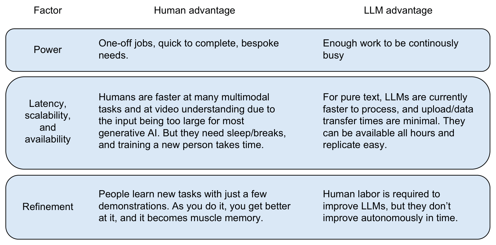

*图7.5 使LLM运行所必需的昂贵硬件导致了若干权衡。例如，使用LLM的启动成本通常较高，且它们无法独立适应。这种独立适应能力的缺失导致了人类优于LLM的诸多天然弱点。部分弱点——例如模型不经训练就不会变化——反而可以被视为优势。如果每个新运行的LLM行为都不同且不可预测，你就无法获得易于扩展的可重复流程。*

<details>
<summary>英文原文</summary>

[Figure]

Figure 7.5 The expensive hardware that makes LLMs work leads to several trade-offs. For example, the startup cost of using LLMs is often high, and they do not adapt independently. This lack of independent adaptation leads to many natural weaknesses where a human would outperform an LLM. Some weak-nesses, such as the fact that a model doesn’t change without training, can be considered strengths. You don’t get repeatable processes that are easy to scale if each new LLM running behaves differently and unpredictably.

</details>

我们知道，LLM 对电力的需求极大，以至于大型科技公司正在制定建造核电站的计划，以满足未来数据中心运行所有预期模型所需的电力[7]。基于此，我们可以预见新的 LLM 将更大、更耗电，但其价值将抵消为其数据中心建造专用发电厂的成本。基于这一因素，当成功的 LLM 解决方案带来更多需求时，你需要谨慎；在满足需求时可能会遇到电力容量问题。你还需要注意电力成本的弹性。不仅 LLM 提供商可能改变成本结构，而且如果你自己托管 LLM，美国确实会出现6倍的电力价格波动[8]。如果你的目标用户群只有2万用户，这可能不是问题；但如果你计划构建服务于数百万甚至更多用户的产品，电力成本可能成为重大的运营和环境隐患。

<details>
<summary>英文原文</summary>

do know that LLMs generate significant demand for power, to such an extent that big tech companies are developing plans to build nuclear power plants to support the power needed by future data centers to run all the models they anticipate [7]. Based on this, it seems we can expect that new LLMs will be bigger and more power-hungry, yet their value will offset the cost of building dedicated power plants for their datacenters. Based on this factor, one needs to be careful when a successful LLM solution creates more demand; you may run into power capacity problems when satisfying that demand. You also may need to be careful about the elasticity of power costs. Not only could LLM providers change cost structures, but if you host an LLM yourself, power price fluctuations of 6× do happen in the United States [8]. This may not be a problem if your intended customer base is only 20,000 users, but if you plan on building something that will serve millions of users or more, the cost of power could be a major operational and environmental hazard.

</details>

### 7.2.2 延迟、可扩展性和可用性

<details>
<summary>英文原文</summary>

7.2.2 Latency, scalability, and availability

</details>

延迟是指从查询LLM到获得一些输出所需的时间，可扩展性描述的是如何快速地从运行一个LLM扩展到运行一千个，而可用性则描述的是让LLM全天候运行的能力。这些都是LLM——更广泛地说，计算机整体——相对于人类的重大优势。LLM和AI/ML能够比人类更快、更及时地对更多情况做出反应。这种反应速度既可以是好事也可以是坏事。当你有一个需要监督和审核输出的系统时，如果不制定相应的人员配备计划，你就无法获得LLM的全部可用性优势。

<details>
<summary>英文原文</summary>

Latency is the time it takes from querying an LLM to getting some output, scalability describes how quickly one can go from one to a thousand LLMs running, and availability describes the ability to have an LLM operational 24/7. These are all major advantages of LLM—and more broadly, computers in general—over people. LLMs and AI/ML can react to more situations faster, at any time, than humans. This reaction speed can be both good and bad. When you have a system that requires supervision and review of outputs, you do not get the full availability benefit of an LLM without developing a staffing plan to match.

</details>

### 7.2.3 优化

<details>
<summary>英文原文</summary>

7.2.3 Refinement As we

</details>

在7.1.1节中讨论过，LLM无法轻易自我改进。然而，人们确实能够并正在改进，随着时间的推移提高流程效率是一个常见目标。你需要让人参与其中，以设计更好的提示和创建更好的训练方案来提高LLM的效率；没有他们，LLM的性能就不会提高。提高LLM效率不仅仅涉及升级到更新的LLM或微调现有模型，还包括建立基础设施，记录输入、输出和性能指标，以研究哪些有效、哪些无效。你可以使用我们在5.5.2节讨论的DSPy等框架来捕获这些项目，并识别和处理那些不起作用或随着世界环境变化开始失败的案例。例如，你可能开发了一个初始LLM，它运行良好。但那些该死的孩子们不断向iDroids和appleBots添加新的表情符号[9]。如果没有额外的训练，你的LLM将无法理解这些新表情符号，但你的客户将不可避免地开始使用它们，因此系统将开始表现不佳。如果你不记录LLM的输入和输出到日志中，或者不向用户征求反馈（他们可以提供关于LLM失败或成功领域的信息），你永远不会发现这个问题。捕获这些信息对于改进和完善流程至关重要，而LLM在没有人类干预的情况下无法做到这一点。

<details>
<summary>英文原文</summary>

discussed in section 7.1.1, LLMs cannot easily self-improve. However, people can and do improve, and it is a common goal to improve the efficiency of a process over time. You will need to keep people in the loop to engineer better prompts and create better training regimes to improve efficiency with LLMs; without them, LLM performance will not improve. Improving LLM efficiency does not just involve upgrading to newer LLMs or fine-tuning existing models but also includes building the infrastructure and recording inputs, outputs, and performance metrics to study what is working and what is not. You can use frameworks like DSPy that we discussed in section 5.5.2 to capture these items and to identify and handle the cases that do not work or start failing over time as world circumstances change. For example, you might develop an initial LLM that is working well. But those damn kids keep adding new emojis to the iDroids and appleBots [9]. Without additional training, your LLM will not understand these new emojis, but your customers will inevitably start using them, so the system will start performing poorly. You’ll never figure this out if you don’t record the input and output of the LLM in logs or solicit feedback from your users who can provide information about areas where the LLM is failing or succeeding. Capturing this information is essential for improving and refining the process, which LLMs cannot do without human intervention.

</details>

在机器学习领域，数据漂移概念备受关注，即现实世界中的数据不断演变，超出了模型训练数据所捕捉的范围。处理自然语言时，表情符号只是现实世界数据随语言使用演变而变化的其中一个具体例子。表情符号的例子可以延伸到包括新术语或语言中现有词汇新用法所带来的问题。通过审视该领域的现有工作，我们可以确定用于测量和缓解LLM数据漂移的额外技术，例如收集更多训练数据并微调模型，或修改提示以包含对先前未见术语的补充定义。

<details>
<summary>英文原文</summary>

In the ML field, considerable attention is given to the concept of data drift, where data in the real world constantly evolves beyond what is captured in a model’s training data. When dealing with natural language, emojis are just one concrete example of how real-world data will change over time as language use evolves. The emoji example can be extended to include the problems created by new terminology or new ways of using existing words in a language. By looking at the existing work in the field, we can identify additional techniques for measuring and mitigating data drift for LLMs, such as collecting additional training data and fine-tuning models or altering prompts to include supplementary definitions for previously unseen terminology.

</details>

语言模型并非世界模型。

<details>
<summary>英文原文</summary>

7.3 Language models are not models of the world

</details>

你可以经常从LLM中获取关于世界的准确信息。因此，人们很容易认为语言模型知道世界上的事物。的确，作为本书的读者，你可以不采取任何特定行动就能推理世界以及将要发生的事情。注意，我们讨论的不是预测股市这样复杂的事情，甚至包括简单的行动和想法。例如，如果你告诉某人他们的毛衣很丑，会发生什么？你不需要与环境互动，也不需要找一件丑毛衣来回答这个问题。你不需要说话或与任何人或任何事物互动来回答这个问题。你可以想象毛衣的“世界”以及别人可能的感受，并推断结果。如果我告诉你有人在圣诞派对上穿着那件毛衣（也许是一个丑毛衣比赛？），你可以更新你关于世界的心理模型，并在没有亲身经历的情况下推断结果。LLM不能在说话之前思考。生成文本是LLM最接近“思考”的方式（在此语境中松散地使用该词）。你可以在图7.6中看到一个简单的例子，其中LLM过于冗长的推理最终导致它提出了一个不错的评论。推理，无论是由我们人类隐式或显式地完成，都与我们说出推理内容的行为是不同的。对于LLM来说，没有过程的分离；需要产生更多的输出来“更多地思考”答案。因此，LLM不能独立于输出生成进行思考。

<details>
<summary>英文原文</summary>

You can frequently elicit accurate information about the world from an LLM. As a result, it’s easy to assume that a language model knows things about the world. Indeed, as a reader of this book, you can reason about the world and what will happen without taking any particular action. Now, we are not discussing anything so sophisticated as predicting the stock market, but even simple actions and thoughts. For example, what would happen if you told someone their sweater was ugly? You do not need to interact with the environment or find an ugly sweater to answer this question. You do not need to speak or interact with anyone or anything to answer this question. You can imagine the “world” of sweaters and the feelings someone else may have and infer the results. If I told you someone was wearing the sweater at a Christmas party (an ugly sweater contest, perhaps?), you could update your mental model of the world and infer outcomes without having lived them. An LLM cannot think before it speaks. Generating text is the closest an LLM gets to “thinking” (using the word loosely in this context). You can see a simple example of this in figure 7.6, where an LLM’s overly verbose reasoning ultimately leads it to reach a nice comment. Reasoning, whether done implicitly or explicitly by us humans, is distinct from us speaking about the thing we are reasoning about. For an LLM, there is no separation of processes; producing more output is required to “think more” about the answer. Therefore, LLMs are not capable of thought independent from generating output.

</details>

警告：我们松散地在LLM的语境中使用“思考”一词。严格来说，我们的意思是LLM回答问题所进行的计算不是动态的。输出10个token所需的工作量与该token的内容无关。回答一个需要人类更多思考的复杂问题，可能会要求LLM进行更多的计算，但这通常意味着LLM必须产生更长的输出，即使答案不应该更长。每当有人将“思考”一词与LLM联系起来时，最好用“计算”来替代“思考”。

<details>
<summary>英文原文</summary>

WARNING We loosely

use the word “think” in the context of an LLM. To be pedantic, we mean that the calculations an LLM does to answer a question are not dynamic. Outputting 10 tokens takes the same amount of work regardless of the content of those tokens. Answering a complex problem that requires humans to think more will probably require an LLM to perform more compu-tation, but that usually means the LLM must also produce longer output, even if the answer shouldn’t be any longer. Whenever anyone uses the term thinking in conjunction with an LLM, it is better to replace thinking with calculating.

</details>

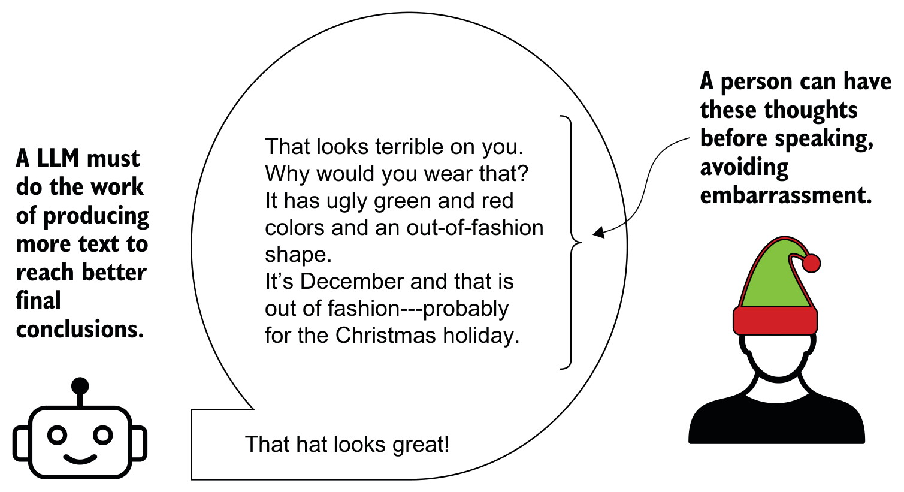

*图7.6 一个人穿着或做某件不寻常事情背后的背景和原因，可能属于LLM能够正确识别并给出恰当回应的范畴。然而，如果LLM不生成一些中间文本，它可能无法得出这个恰当回应。对于数学问题，这些中间文本可能有用，但用户可能并不总是希望或适合看到这些中间文本。*

<details>
<summary>英文原文</summary>

[Figure]

Figure 7.6 The context and reason why someone is wearing or doing something unusual may be in the realm of something that an LLM properly recognizes and for which it produces an appropriate response. However, it might not be possible for an LLM to reach that appropriate response without producing some intermediate text. For a math problem, this intermediate text could be useful, but the intermediate text may not always be appropriate or desirable for a user to see.

</details>

这个例子表明，如果LLM不生成关于规划过程的文本，它就无法进行规划。如果LLM不产生文本，就好像它不存在一样。有一些构建提示的方法，可以鼓励LLM将其输出分解来模拟规划。这通常被称为思维链（CoT）提示，即在提示中包含像“让我们一步一步地思考”这样的语句。这种逐步指令通常能提高模型执行任务的能力[10]，但尚不清楚为何会提升性能。再一次，“思考”一词的模糊性会导致对LLM能做什么和不能做什么产生不合理的预期。即使使用CoT，LLM仍然会犯许多错误，例如遗漏步骤、遗漏计算，以及执行逻辑无效的推理[11]。当LLM生成分解为一系列步骤的输出时，其他因素也可能有助于观察到的性能提升。考虑以下情况：

<details>
<summary>英文原文</summary>

This example demonstrates that an LLM cannot plan without generating text about the planning process. If the LLM is not producing text, it is as if it does not exist. There are methods for constructing prompts that will encourage LLMs to break down their outputs to simulate planning. This is often called chain-of-thought (CoT) prompting, where you include in the prompt a statement like “Let’s think step by step.” This step-by-step instruction often improves the model’s ability to perform tasks [10], but it is unclear why this improves performance. Once again, the ambiguity of what it means to “think” can cause unreasonable expectations of what LLMs can and cannot do. Even with CoT, LLMs will still make many mistakes, such as missing steps, missing calculations, and performing logically invalid reasoning [11]. Other factors may contribute to the performance gains observed when an LLM produces output broken into a series of steps. Consider:

</details>

在第三章中，我们学习了 Transformer 及其实现中使用的注意力机制。我们了解到，LLM 接收的输入和产生的输出越长，Transformer 进行的计算就越多。那么，分步思考之所以效果更好，仅仅是因为 LLM 通过 Transformer 进行了更多的计算吗？如果 LLM 拥有世界模型，它就可以在不生成输出的情况下对输出进行这种计算。LLM 反映了其训练数据的本质。训练数据中可能存在与“分步思考”以及其他教学材料相关的内容，这些材料更加冗长且通常正确。最终，我们可能会手动将 LLM 的模糊回忆与更相关的训练文档对齐，而不是让 LLM 执行一种根本不同的功能。

<details>
<summary>英文原文</summary>

Back in chapter 3, we learned about transformers and the attention mechanism used in their implementations. We learned that the longer the input received and outputs produced by an LLM, the more calculations the transformer does. So does thinking step by step work better just because the LLM, via the transfor-mer, gets to do more computation? If the LLM had a world model, it could do this computation about the output without generating the output. LLMs reflect the nature of their training data. There may be content in that training data correlated with “think step by step” and other pedagogical materi-als with more verbose and usually correct content. Ultimately, we may manually align the LLM’s fuzzy recall with more relevant training documents rather than get the LLMs to perform a fundamentally different function.

</details>

警告：“世界模型”的精确定义尚未有广泛共识，不同人可能有不同理解。在讨论世界模型时，最好先明确其定义，以确保大家在同一基础上交流。目前许多关于LLM的讨论往往各说各话，我们将在本书最后两章进一步探讨这一现象。

<details>
<summary>英文原文</summary>

WARNING The precise definition of a “world model” is not yet well agreed upon and can have different connotations for different people. When discussing world models, it is a good idea to discuss the definition first so that folks are on the same page. A lot of LLM discourse talks past each other, something we will discuss further in the last two chapters of this book.

</details>

这些问题颇具挑战性，涉及开放性的研究课题。我们的立场是，LLM的显著失败表明这些表面原因比更深层的原因更可能是正确的解释。重要的是，一些细分研究致力于为机器学习方法注入世界模型。一个技术性强但相当易懂的2018年示例来自David Ha和Jürgen Schmidhuber，可在网上查阅（https://worldmodels.github.io/），该示例展示了相比当时现有方法的巨大性能提升。其他研究者正致力于为LLM构建世界模型，以及将LLM本身用作世界模型[12]。当前的方法不具备与人类同等高度的灵活性；这些示例的范围更为有限，仅适用于某一类通用问题。

<details>
<summary>英文原文</summary>

These problems are challenging and involve open-ended research questions. Our stance is that the dramatic failures of LLMs highlight that these are more likely explanations than something deeper. Importantly, some niche research focuses on imbuing machine learning methods with world models. A technical but fairly accessi-ble 2018 example of this from David Ha and Jürgen Schmidhuber is available online (https://worldmodels.github.io/) and shows massive performance improvements compared with existing methods back then. Others are working on making world models for LLMs and using LLMs as world models [12]. Current methods do not have the same high degree of flexibility as humans; these examples are more limited in scope and work for one general class of problems.

</details>

### 7.4 计算极限：难题依然难解

<details>
<summary>英文原文</summary>

7.4 Computational limits: Hard problems are still hard

</details>

有些人担心“失控”的AI，即AI算法变得极其先进和强大，能够解决我们永远无法解决的问题，并且这种AI的目标与人类福祉不一致。如果存在这样的AI，它就能以我们无法改进自身的方式自我提升，从而产生更强大的AI。许多人任由这种想法蔓延，幻想LLM将变得近乎神一般，能力超群，超越人类的推理能力。这里涉及一个伦理问题，我们将在本书最后一章详细讨论。目前，有一个简单的技术原因让我们对此并不十分担忧，同时它也帮助我们理解LLM的实际局限性。本质上，有很多方法可以衡量所谓的计算复杂度或算法复杂度。通过将LLM的复杂度与其他研究充分的算法进行比较，我们可以更具体地了解LLM能做什么、不能做什么。我们还将讨论，在适当情况下，使用LLM的近似解如何能避免精确解所面临的某些复杂度。在计算机科学中，我们花费大量时间学习算法复杂度。对大多数学生或从业者而言，这意味着理解输入数据量的变化如何影响处理过程产生结果所需的时间。其中一种较为理想但现实中很少出现的情况是：如果输入翻倍，处理时间也翻倍。换句话说，处理n个项目（对LLM而言，一个项目可能是一个token）需要2天的过程，处理2×n个项目则需要4天。在计算机科学中讨论复杂度时，我们通常使用数学符号——大O表示法——来传达不同级别的复杂度。当处理过程的计算时间与输入规模以相同速率增长时，称为线性复杂度，在大O表示法中记为O(n)。如果绘制以数据量为x轴、计算时间为y轴的图表，将得到一条直线，因为数据和计算时间以相同速率增长。其他常见的现实复杂度包括对数线性（O(n log n)），其中2×n可能接近4.4天；二次（O(n²)），其中2×n可能接近8天；以及指数（O(e^n)），其中计算时间随输入规模增长如此之快，以至于你的算法完成之前世界很可能已不复存在。在每种情况下，随着系统变得更复杂，输入规模与计算时间的关系图会变得更陡峭。换句话说，对于更复杂的算法，处理时间会随着处理数据量的增加而增长得更快。我们进行了这次简短的计算机科学之旅，以帮助您理解运行LLM的计算复杂度。对于n个项目的输入，LLM具有O(n²)或二次复杂度。如果我们能证明某个算法/任务需要超过O(n²)的工作量，那么我们就基本上证明了LLM无法高效解决该问题，因为LLM的核心算法无法精确执行具有该复杂度级别的算法。

<details>
<summary>英文原文</summary>

Some people are worried about “runaway” AI, where an AI algorithm becomes so advanced and capable that it can solve problems we never could and that such an AI would not have objectives that align with human welfare. If such an AI existed, it could improve itself in ways we couldn’t improve ourselves, resulting in an even more powerful AI. Many folks have allowed this thought to run rampant, imagining that an LLM will become almost godlike in capability and ability to outreason humans. There is an ethics question here that we will discuss more in the last chapter of the book. For now, there is a simple technical reason why we are not so concerned about this idea, and it also helps us understand the realistic limitations of LLMs. Essentially, there are many ways to measure what we can call computational complexity or algorithmic complexity. By comparing the complexity of LLMs with other well-studied algorithms, we can be more specific about what LLMs can and cannot achieve. We will also discuss how approximate solutions to problems using LLMs can, where appropriate, avoid some of the complexity of precise solutions to the same problems. In computer science, we spend a lot of time learning about algorithmic complexity. For most students or practitioners, this means understanding how a change in the amount of input data changes how long it will take a process to produce results. One of the more ideal cases, which rarely happens in reality, is that if you double the inputs, the process will take twice as long. In other words, a process that could take 2 days for n items (in the case of an LLM, an item might be a token) takes 4 days for 2 × n. When discussing complexity in computer science, we often use mathematical notation, known as Big-O notation, to communicate different levels of complexity. When a process’s computation time grows at the same rate as the size of its input, it is called linear complexity and is denoted in Big-O notation as O(n)). If you draw a graph with data size on the x-axis and computation time on the y-axis, you would get a line because both data and computation time grow at the same rate. Other common real-world complexities include log-linear (O(n log n)), where 2 × n might be closer to 4.4 days; quadratic (O(n2), where 2 × n might be closer to 8 days; and exponential (O(en)), where computation time grows so quickly as the size of the input increases that there is a good chance the world will no longer exist before your algorithm finishes. In each of these cases, the graph of input size versus computation time becomes steeper as systems get more complex. In other words, for more complex algorithms, the processing time will grow faster as the amount of data processed increases. We’ve taken this short trip into computer science to help you understand the computational complexity of running an LLM. For an input of n items, the LLM has a computational complexity of O(n2) or quadratic complexity. If we can prove that an algorithm/task takes more than O(n2) work, then we have essentially proven that an LLM cannot efficiently solve the problem because an LLM’s core algorithms aren’t able to execute algorithms with that level of complexity, precisely.

</details>

警告：这不是这里并非一门关于形式化方法或算法的研究生课程；我们只是对算法复杂度研究进行快速概述。目标是让读者对这一问题形成技术直觉，但我们并未提供足够的知识来深入讨论该主题。要了解更多关于算法和复杂度的内容，可参见 Aditya Y. Bhargava 的《算法图解：程序员与好奇人士的趣味指南》[13]。

<details>
<summary>英文原文</summary>

WARNING This isn’t

a graduate class on formal methods or algorithms; we are providing a quick overview of the study of algorithmic complexity. The goal is to give you, the reader, a technical intuition for the problem, but we haven’t fully armed you with all the knowledge needed to discuss this subject in detail. To learn more about algorithms and complexity, see Aditya Y. Bhargava’s book Grokking Algorithms: An Illustrated Guide for Programmers and Other Curious People [13].

</details>

如果LLM能够解决一个要求立方复杂度O(n³)的问题，但LLM自身的复杂度更快（更小）为O(n²)，那就出现了逻辑矛盾。换言之，LLM无法比复杂度分析所表明的速度更快地解决复杂问题。许多现实任务和算法的复杂度都高于O(n)。我们在表7.1中描述了几个例子，你会注意到列举的这几个都与物流或资源分配有关。例如，包裹投递和航班改签都是算法复杂度极为棘手的问题。

<details>
<summary>英文原文</summary>

If it was possible to get an LLM to solve a problem that required, say, cubic complexity of O(n3), but the LLM itself had a faster (smaller) complexity of O(n2), then we would have a logical contradiction. In other words, an LLM can’t solve a complex problem faster than the complexity analysis states. Many real-world tasks and algorithms have worse than O(n) complexities. We describe a few examples in table 7.1, and you’ll notice that the handful we’ve listed relate to logistics or resource allocation. For example, delivering packages and rescheduling flights are problems that have majorly painful algorithmic complexities.

</details>

*表7.1 一些不同时间复杂度的重要算法示例*

<details>
<summary>英文原文</summary>

Table 7.1 Some examples of important algorithms with different time complexities

</details>

### 算法复杂度：质因数分解

<details>
<summary>英文原文</summary>

Algorithm Complexity Prime factorization

</details>

用于所有密码学的 O(en)（即使用量子计算机，仍然是 O(n3)），旅行商问题（路径/物流配送）O(en)，线性规划（用于可分割资源分配和网络流）O(n3)，整数规划（用于不可分割资源分配）O(en)。我们关心算法的第二个重要且相关的原因是算法的复杂性类。复杂性类定义了算法能解决的问题的可能范围。最著名的复杂性类是P（多项式时间）和NP，这些问题至少需要O(en)时间才能完成。这些非常广泛的类基本上包含了你可能关心的所有问题。

<details>
<summary>英文原文</summary>

(used for all cryptographic) O(en) (or if you have a quantum computer, still O(n3)) Traveling salesman problem for routing/logistics delivery O(en) Linear programming, used for allocation of divisible resources and network flow O(n3) Integer programming, used for allocating nondivisible resources O(en) A second important and related reason we care about algorithms is the complexity class of an algorithm. A complexity class defines the scope of possible algorithms that an algorithm can solve. The most famous complexity classes are P (for polynomial) and NP, which are problems that take at least O(en) time to finish. These very broad classes contain basically all the problems you might ever care about.

</details>

注意：许多人认为NP代表非多项式，但这是错误的！它实际上代表非确定性多项式。

<details>
<summary>英文原文</summary>

NOTE Many people

think that NP stands for not-polynomial, but this is false! It actually means nondeterministic polynomial.

</details>

有趣且富有信息量的是，William Merrill 和 Ashish Sabharwal [14] 证明，LLM 解决问题的能力与其在中间步骤中生成的 token 数量相关。对于 LLM 而言，生成响应属于一种称为 TC0 的复杂性类（我们知道，计算机科学家最不擅长命名）。这个复杂性类限制非常严格，意味着 LLM 几乎无法解决任何问题。随着中间步骤 n 变长，你最终会达到复杂性类 P。这意味着 LLM 永远无法解决 NP 或更难的实际问题！我们将这一切总结在图 7.7 中，该图展示了这些复杂性类层次之间的关系。这一发现更具破坏性，因为复杂性类描述的是你能解决的问题类型，而非解决它们的效率。例如，要解决一个涉及 n^c 复杂度的算法，LLM 必须生成大约 n^c 个 token。然而，LLM 处理 n 个 token 也需要 O(n^2) 时间，所以你最终会

<details>
<summary>英文原文</summary>

What is interesting and informative is that William Merrill and Ashish Sabharwal [14] proved that an LLM’s ability to solve problems correlates to the number of tokens it generates in intermediate steps. For an LLM, generating a response falls into a complexity class called TC0 (we know, computer scientists are the worst at naming things). This complexity class is very restrictive, meaning an LLM can barely solve anything. As the intermediate steps n become longer, you eventually reach the complexity class of P. This means an LLM can never solve real-world problems that are NP or harder! We tie this all together in figure 7.7, which shows how these layers of complexity classes relate. This finding is even more damaging because complexity classes describe the kinds of problems you can solve, not how efficiently you can solve them. For example, an LLM must generate on the order of nc tokens to solve an algorithm that involves nc complexity. Yet, an LLM also needs O(n2) time to process n tokens, so you end up

</details>

从工作地点到家最短路径的求解、计算机芯片电路布局的设计、文字处理器中的查找与替换

<details>
<summary>英文原文</summary>

Finding the shortest path from work to home Designing the layout of circuits for a computer chip Finding and replacing in a word processor

</details>


*图7.7 一个计算复杂性的维恩图（假设P≠NP，对极客们来说只是个小细节）说明了这些复杂性类之间的关系。上方的箭头给出了新复杂性类所能解决的问题类型的示例，下方的箭头则显示了LLMs在复杂性层级中的位置。*

<details>
<summary>英文原文</summary>

[Figure]

Figure 7.7 A Venn diagram of computational complexities (assuming P ≠NP, a minor point for the nerds) relate to each other. The top arrows give examples of the kind of problem that a new complexity class lets you solve. The bottom arrows show where LLMs land in terms of their complexity.

</details>

这种复杂性估计未考虑LLM训练数据以及开发提示词（使LLM无错误地成功执行算法）所需的时间。

<details>
<summary>英文原文</summary>

this complexity estimation does not account for LLM training data and the time required to develop prompts to get the LLM to perform the algorithm successfully without errors.

</details>

### 7.4.1 使用模糊算法解决模糊问题

<details>
<summary>英文原文</summary>

7.4.1 Using fuzzy algorithms for fuzzy problems

</details>

关于算法和复杂度的讨论听起来可能对LLM非常不利。实际上，只有当你要将LLM应用于需要正确输出的问题时，才是不利的。如果你的系统连最小的错误都无法容忍，那么你就不应该使用机器学习，更不用说LLM了。与整个机器学习领域一样，LLM最适合处理模糊问题——这类问题中，正确与否的标准很难界定。在模糊问题中，存在错误通常是可以接受的；其他流程可以弥补这些错误，或者错误的成本小到可以忽略。这就是为什么文本和自然语言非常适合LLM。像“Suzy在那封邮件里是什么意思？”或“John在文中暗示了什么？”这类问题的答案本质上是模糊的。人类语言充满了不精确、澄清和重复，这与让LLM解决需要一致且精确答案的问题的难度高度契合。

<details>
<summary>英文原文</summary>

This discussion about algorithms and complexity may sound very damning for LLMs. In truth, it is only damning if you want to apply LLMs to problems that require correct outputs. If even the smallest error is unacceptable in your system, you should not use machine learning, let alone an LLM. Like machine learning at large, LLMs work best for fuzzy problems, where what makes something correct or incorrect is hard to describe. In fuzzy problems, it is often the case that it is OK if errors exist; other processes can remediate those errors, or the cost of errors is potentially small enough to ignore. That’s why text and natural language are a good fit for LLMs. The answers to problems like “What did Suzy mean in that email?” or “Did John mean to imply that in his text?” are intrinsically fuzzy. Human language is fraught with imprecision, clarification, and repetition that align well with the difficulty of getting LLMs to solve problems that require consistent and precise answers.

</details>

### 7.4.2 当足够接近即可

<details>
<summary>英文原文</summary>

7.4.2 When close enough

</details>

暂且自我辩驳一下，我们也应指出：当“解决”被理解为“找到最优解且没有更好的解存在”时，人类同样无法解决NP难问题。我们之所以用近似方法解决复杂问题，是因为我们知道这些问题太棘手，无法完美求解。

<details>
<summary>英文原文</summary>

is good enough for hard problems To argue against ourselves for a moment, we should also point out that humans cannot solve NP-hard problems when we use solve to mean “arrive at the optimal solution for which no better solution exists.” We use approximations to solve complex problems because we know they are too hard to solve perfectly.

</details>

例如，在表7.1和图7.7中，我们提到了旅行商问题，这是一个用于配送路线规划的著名且重要的问题。邮递员希望以最少的时间和距离投递所有人的邮件，且不重复任何路线。从计算角度看，找到最佳路线是NP难的，因此你只能将其应用于几百甚至几千个投递目的地。然而，存在更快的二次算法来近似求解该问题，并且我们可以证明它们给出的路径长度不会超过最短路径距离的两倍。因此，在现实世界中，我们使用这些算法和其他技术来获得“足够接近即可满足”的解决方案。同样地，LLM也可能获得“足够接近即可满足”的解决方案，但它们仍然受限于这样一个事实：它们在处理精确问题时效率低下。如果不了解LLM的训练数据，我们很难估计它通过近似求解难题的效果如何。考虑一下，国际象棋在技术上比NP难更难。GPT-3.5可以下出不错的棋局，足以击败真实的人类棋手[15]，尽管还达不到专用象棋程序那种“主宰人类”的水平。这是否表明LLM擅长近似求解极难的问题？很可能不是。首先，ChatGPT的象棋水平在将象棋作为评估指标后显著提升(https://github.com/openai/evals/pull/45)。我们有理由怀疑ChatGPT的制造者进行了微调，将象棋明确纳入了目标。其次，互联网上充满了可供人们学习和研究的棋局(https://old.chesstempo.com/game-database.html)，因此ChatGPT很可能在其训练数据中学习了完整的象棋对局。尽管如此，令人感兴趣的是，ChatGPT可以利用其训练数据中的内容来下出合理的棋局，将之前见过的棋局与未来略有不同的局面相匹配。在考虑基于LLM的解决方案在哪些场景下效果最佳时，我们推荐以下思维框架：将LLM应用于重复性强、变化幅度小的问题，以最大化其效用。文本摘要、语言翻译、撰写文档初稿以及检查现有写作等应用均属于此类。深度学习其他领域也带来了类似的教训，这些领域的模型内部推理比LLM更容易理解。例如，围棋游戏是数十年来人工智能研究中最持久的挑战之一。直到最近，AI才能在该游戏中击败冠军级棋手。与LLM类似，围棋AI通过观察大量对局示例进行训练。然而，如果你构建一个执行异常和/或荒谬着法的围棋机器人，它可能击败“超人类”AI，但会输给人类业余棋手[16]。这个例子也凸显了在对抗环境中使用LLM的风险，在这种环境中，人类应对重大新颖性的能力远胜于当前的AI/LLM。

<details>
<summary>英文原文</summary>

For example, in table 7.1 and figure 7.7, we mentioned the traveling salesman problem, a famous and important problem for delivery route planning. The mail courier wants to deliver everyone’s mail in the minimum amount of time and distance traveled without repeating any routes. Computationally, finding the best route is NP-hard, so you can only apply it to a few hundred or maybe a thousand delivery destinations. However, there are much faster quadratic algorithms that approximate the problem, and we can prove they give us a path that is no worse than 2× the travel distance of the minimum distance route. So in the real world, we use these and other techniques to get “close enough is good enough” solutions. So too can LLMs potentially get “close enough is good enough” solutions, but they are still constrained by the fact that they are inefficient for exact problems. Without an understanding of an LLM’s training data, we have difficulty estimating how well it might solve a difficult problem through approximation. Consider that the game of chess is technically harder than NP-hard. GPT-3.5 can play a decent game of chess that can defeat a real human [15], although not at the “dominating all humans” level that dedicated chess programs can achieve. Does this show that LLMs are good at approximately solving very hard problems? Probably not. First, ChatGPT’s chess game dramatically improved after adding chess as an evaluation metric (https://github.com/openai/evals/pull/45). It’s not unreasonable to suspect that the makers of ChatGPT performed fine-tuning that incorporated chess as an explicit goal. Second, the internet is full of games of chess for people to study and explore (https://old.chesstempo.com/game-database.html), so ChatGPT has likely been trained on full games of chess captured in its training data. Still, it is interesting that ChatGPT can use what is in its training data to play a reasonable game of chess, matching what it has seen before to slightly different situations in the future. When considering where an LLM-based solution will work best, we recommend this mental framework: apply LLMs to repetitive, mildly varying problems to maximize their utility. Applications such as text summarization, language translation, writing first drafts of documents, and checking existing writing all fit into this category. Similar lessons come from other areas of deep learning, where it is easier to reason about what is happening inside a model than for LLMs. For example, playing the game of Go has been one of the longest-standing challenges in AI research for decades. AI has only recently been able to beat champion-level players in the game. Like LLMs, Go-playing AIs train by observing many example games. Yet, if you built a Go-playing bot that performed unusual and/or nonsensical moves, it would defeat the “superhuman” AI but lose to human amateurs [16]. This example also highlights the risk of using LLMs in adversarial environments, where humans are far better at dealing with significant novelty in a situation than current AI/LLMs.

</details>

总结：LLM相对于人类最大的优势在于其可实现的规模。LLM可以低成本、全天候运行，并且按需调整规模，其难度远低于培训或裁减人力团队。人类更擅长处理高度新颖的情况，这一点在与LLM交互的用户可能是对抗性用户（例如试图欺诈）时尤为重要。我们知道LLM在处理与训练数据中见过的类似问题时表现良好，这使得它们适用于重复性工作。提示工程很可能是“教”LLM新知识的最有效起点，除非你能投入大量精力和资金进行数据收集和微调。LLM无法自我改进，且在解决需要特定正确答案的算法问题时效率低下。它们最擅长处理“模糊”问题，这类问题有可接受的输出范围，且允许一定程度的误差。

<details>
<summary>英文原文</summary>

Summary The biggest advantage LLMs have over humans is the scale they achieve. LLMs can run at low cost, 24/7, and be resized to meet demand with far less effort than training up or reducing a human workforce. Humans are better at handling highly novel situations, which is important if the people interacting with the LLM might be adversaries (e.g., trying to commit fraud). We know LLMs work well for problems similar to what they have seen before in their training data, making them useful for repetitive work. Prompt engineering is likely the most effective starting point to “teach” LLMs something new unless you can dedicate large amounts of effort and money to data collection and fine-tuning. LLMs cannot self-improve and are inefficient at solving algorithmic problems requiring a specific correct answer. They work best on “fuzzy” problems where there is some range of satisfying outputs and some amount of error is acceptable.

</details>


### 本章插图（补充）


*图7.4 包含期望LLM输出示例的提示称为少样本提示，因为LLM在训练数据中从未见过该特定行为的示例。在提示中，你可以包含与RLHF/监督式微调（SFT）类似的输入和输出示例。这种提示风格通过提供理想输出应呈现的示例，鼓励模型产生期望的输出。由于LLM在大量无标签数据上进行训练，k-shot示例是一种以最小努力获得更好结果的有效方式。*


---

## 第 8 章: 用大语言模型设计解决方案

8 使用大型语言模型设计解决方案

<details>
<summary>英文原文</summary>

8 Designing solutions with large language models

</details>

### 本章涵盖

- 使用检索增强生成来减少错误
- LLM如何监督人类以减轻自动化偏差
- 使用嵌入技术赋能经典机器学习工具
- 企业与用户双赢的LLM呈现方式

<details>
<summary>英文原文</summary>

This chapter covers Using retrieval augmented generation to reduce errors How LLMs can supervise humans to mitigate automation bias Enabling classic machine learning tools with embeddings Ways to present LLMs that are mutually beneficial to companies and users

</details>

至此，你应该已经对LLM及其能力有了深刻的理解。它们生成的文本与人类文本非常相似，因为其训练数据包含数以亿计的人类文本。其产出虽然价值巨大，但也难免出错。如你所知，通过引入领域知识或计算机源代码解析器等工具，可以缓解这些错误。现在，你已经准备好在LLM的帮助下设计解决方案了。如何将迄今讨论的一切转化为有效的实施计划？本章将引导你了解设计该计划的流程、权衡与考量。为此，我们将使用一个大家都能感同身受的贯穿示例：在需要帮助时联系技术支持。

<details>
<summary>英文原文</summary>

By now you should have a strong understanding of LLMs and their capabilities. They produce text that is very similar to human text because they are trained on hundreds of millions of human text documents. The content they produce is valuable but also subject to errors. And, as you know, you can mitigate these errors by incorporating domain knowledge or tools like parsers for computer source code. Now you are ready to design a solution using an LLM. How do you consider everything we have discussed thus far and convert it into an effective implementation plan? This chapter will walk you through the process, trade-offs, and considerations in designing that plan. To do so, we will use a running example that we can all relate to: contacting tech support when help is needed.

</details>

首先，我们来考虑一条显而易见的路径：构建聊天机器人。聊天机器人是许多人接触大语言模型的载体，因为它们通常能出色地完成交互式输出生成。我们将评估在客服场景中部署基于大语言模型的聊天机器人所面临的风险。通过这一讨论，你会看到与其它方案相比，使用大语言模型可能会增加风险。但如果风险足够低，简单的聊天机器人仍不失为一个有效选择。接下来，我们将探索通过应用设计来管理风险的方法，这些设计能改善客户与大语言模型的交互方式。我们将讨论，让人类检查大语言模型输出的每一个结果会因“自动化偏差”现象而问题重重。我们将探讨一种略显反直觉的避免自动化偏差的方式：改为由大语言模型监督人类。我们将探究如何将大语言模型的嵌入（即文本的数值化语义表示）与经典机器学习算法相结合，来应对这一风险并处理大语言模型无法独立完成的任务。最后，我们将研究技术如何呈现给用户，以及在建立信任和传达对其内部工作原理的理解方面发挥的关键作用。我们将讨论“可解释AI”领域，其中机器学习算法会生成描述或解释其如何得出特定输出的额外输出。可解释AI常被用于处理人们需要理解大语言模型工作原理的场景，但研究表明，尽管可解释性可通过用人类语言描述模型行为来揭示大语言模型的内部机制，但其本身往往无助于实际应用。相反，我们将阐述关注透明度、与客户激励对齐以及创建反馈循环的好处，通过这些方式设计出的解决方案能更好地满足企业及其客户的需求——提供准确输出并提升业务流程效率。

<details>
<summary>英文原文</summary>

First, we will consider the obvious path: building a chatbot. Chatbots are the vehicle that introduced many people to LLMs because generally, they can do an excellent job of generating output interactively. We’ll evaluate the risks of deploying an LLM-powered chatbot in a customer service scenario. Through this discussion, you’ll see that using an LLM can increase risk compared to other options. However, a simple chatbot may be a valid option if the risks are sufficiently minimal. Next, we will explore ways to manage the risks by using application designs that improve how customers interact with the LLM. We’ll discuss how having a person check each output produced by an LLM is fraught with problems due to a phenome-non known as automation bias. We’ll discuss how automation bias can be somewhat counterintuitively avoided by having the LLM supervise the person instead. We’ll explore how an LLM’s embeddings, the semantic representation of text encoded as numbers, can be combined with classical machine learning algorithms to address this risk and handle tasks that an LLM can’t perform independently. Finally, we’ll investigate how technology is presented to users and plays a vital role in establishing trust and conveying an understanding of its inner workings. We’ll discuss the area of “explainable AI,” where a machine learning algorithm produces output that describes or explains how it arrived at a specific output. Explainable AI is often the approach adopted to handle situations where people need to understand how an LLM works, but studies show that although explainability may shed some light on the inner workings of LLMs by describing the behavior of these models in human terms, it does not tend to help for its own sake. Instead, we’ll describe the benefits of focusing on transparency, aligning incentives with customers, and creating feedback cycles to design solutions that better meet the needs of both the companies that employ them and the customers that interact with them by providing accurate output and creating efficiencies in business processes.

</details>

### 8.1 只需做一个聊天机器人？

<details>
<summary>英文原文</summary>

8.1 Just make a chatbot?

</details>

毫不意外，许多人正在使用基于Transformer架构的大语言模型构建聊天机器人，正是支撑ChatGPT的同一项技术。这显然是一个看似合理的初步步骤。ChatGPT与人互动、适应对话以及检索和呈现信息的非凡能力，展示了大语言模型技术对客户交互应用的强大支持。随着大语言模型的出现和普及，试图用任何其他方法（例如使用基于预置应答决策树训练的专家系统）来实现客服代理，很可能是一种短视行为。当不满意的客户遇到技术问题时，他们不再需要搜索在线常见问题解答文档、给问题工单系统发邮件石沉大海，或者拨打自动语音应答电话，而是可以直接与AI驱动的工具互动，逐步解决问题。这在纸面上听起来很美好，如果你画个像图8.1这样的小示意图，确实看起来我们在简化生活。

<details>
<summary>英文原文</summary>

Unsurprisingly, many people are building chatbots using LLMs based on transformer architectures, the same technology that underpins ChatGPT. It’s an obvious and seemingly reasonable first step. ChatGPT’s fantastic ability to interact with people, adapt to conversations, and retrieve and present information demonstrates how well LLM technology supports customer interaction applications. With the advent and availability of LLMs, it would likely be short-sighted to attempt to implement a customer service agent using any other approach, such as using an expert system trained to use a decision tree of canned responses. When an unhappy customer has some technical problem, instead of searching an online Frequently Asked Questions (FAQ) document, sending an email into the black hole of a trouble ticket system, or calling a phone number with an automated interactive voice response system, they can start directly interacting with an AI-powered tool and make progress on getting their problems solved. This sounds wonderful on paper, and if you draw a little diagram like figure 8.1, it sure looks like we are simplifying life.

</details>


*图8.1 从流程图中看，用基于LLM的聊天机器人似乎可以简化和精简FAQ、邮件工单和客服电话。然而，这种观点的谬误在于流程不完整。确保LLM准确运行所需的潜在错误和补救流程被隐藏了，反而带来了更多复杂性。*

<details>
<summary>英文原文</summary>

[Figure]

Figure 8.1 When looking at the process diagram, it would seem like replacing FAQs, email tickets, and support numbers could be simplified and streamlined with an LLM-based chatbot. However, the folly of this view is that the process is incomplete. The potential errors and remediation processes required to ensure an LLM will perform accurately are hidden and create more complexity.

</details>

当然，在某些情况下，聊天机器人是一个好主意。但令人惊讶的是，对于大多数公司来说，一个基于LLM的在线客服聊天机器人可能并不在客户支持工具的首选之列，因为构建一个在多种情况下准确可靠、且在遇到意外输入时不会产生意外输出的系统需要付出大量努力。归根结底，是否使用LLM来构建客服聊天机器人的决策，取决于我们一直在讨论的LLM在生成客户回复时可能犯的错误。我们知道LLM并非无错误，虽然机器学习有时很实用，但在考虑部署这项技术时，这些潜在错误的代价是首要决策标准。从根本上说，使用LLM可能会增加这些错误的成本。关键在于，目前形式的LLM可能会提供错误的答案，而由此产生的责任将由部署和维护这些系统的公司或个人承担。高管或产品经理可能会从几个经典业务关键绩效指标的角度来考虑错误成本。例如，如果将客服工作交给聊天机器人，客户留存率可能会下降。当然，这一留存率可能仍高于将客户关系职能外包给其他国家呼叫中心的情况。确实，这些考虑因素值得评估，在全面用LLM取代客服功能之前，你可能应该进行试点部署，看看客户的看法。

<details>
<summary>英文原文</summary>

There are certainly cases where a chatbot is a good idea. But surprisingly, an online LLM-based chatbot that handles support probably is not at the top of the list of customer support tools for most companies because of the effort required to build a system that will be accurate and reliable in many cases and not create unexpected output when confronted with unexpected input. Ultimately, the decision to use an LLM to implement a customer support chatbot comes down to our ongoing discussion of the errors an LLM might make when generating customer responses. We know that LLMs are not error-free, and while machine learning is sometimes practical, the expense of those potential errors is the primary decision criterion when considering deploying this technology. Fundamentally, using an LLM potentially increases the cost of those errors. The bottom line is that in their current form, LLMs can provide incorrect answers, and the liability for these falls on the shoulders of the companies or individuals who deploy and maintain them. Executives or product managers might consider the cost of errors in the context of a few classic business key performance indicators. For example, customer retention rates might decrease if they entrust support to chatbots. Perhaps the retention rate would be higher than if the customer relations functions were outsourced to a call center in another country. Indeed, these considerations are important to evaluate, and you should probably do a trial deployment to see what customers think before replacing your customer support function with an LLM wholesale.

</details>

注意：我们几乎总是推荐对任何机器学习系统进行试验性部署。投资格言“过往业绩不代表未来收益”适用于所有人工智能。实现这一点的一种方法是通过模拟部署，即将新AI系统与现有流程并行运行几周或几个月。你可以选择忽略新系统的输出，同时保持现有业务流程不变。这使你有时间观察当前流程和新流程之间的差异，识别并解决问题，并确定机器学习系统的性能是否随时间下降。

<details>
<summary>英文原文</summary>

NOTE We almost always recommend trial deployments of any machine learning system. The investing adage “Past performance is not a guarantee of future returns” is true of any AI. One way to do this is through phantom deployments, where you run your new AI system alongside the existing process for some weeks or months. You may choose to ignore its outcomes while the existing business processes are in place. This gives you time to observe the discrepancies between your current and new processes, identify and address problems, and determine whether the performance of the machine learning system degrades over time.

</details>

最重要的是，你的 LLM 可能会给出对用户有害的建议。由于 LLM 并非能够承担法律责任的个人，你和你所在的公司将承担相应法律责任。这样的情况已有先例：一家航空公司部署的聊天机器人给出了错误的政策说明，法院判定该公司必须遵守其聊天机器人错误生成并传播的政策 [1]。我们建议，在部署 LLM 时始终秉持对抗性思维。多问一句：“一个动机明确的恶意行为者如果知道系统的工作原理，会做什么？”这有助于识别并缓解重大风险，也常常是判断你的 LLM 应用是妙计还是昏招的最佳方式。例如，某汽车公司将 LLM 集成到官网中，用于辅助售车和解答问题。结果，用户们发现这一点后，不到一天就成功说服网站以 1 美元的价格卖给他们一辆车 [2]。如果错误可能带来的成本或风险较低，你大可放心部署 LLM 聊天机器人。但在本章中，我们不妨假设这个技术客服代理至关重要，其错误可能给公司造成巨额损失。那么问题就来了：如何设计一个既能提升生产力和效率，又能限制用户直接访问 LLM 的解决方案？如果你刚接触 AI/ML，而聊天机器人是你对这个领域的主要认知，这听起来可能有些矛盾，但确实有一些简单、可重复的设计模式可以应用。

<details>
<summary>英文原文</summary>

Most critically, your LLM can give advice that causes harm to your users. Since an LLM is not a person who can be held legally liable for their actions, you and your company will be held liable instead. This has already happened with an airline that deployed a chatbot that gave errant policy statements. A court decided that the company had to abide by the policy incorrectly generated and shared by their chatbot [1]. We recommend always considering an adversarial mindset when deploying an LLM. Asking “What could a motivated bad actor do if they knew how this worked?” will help you identify and mitigate significant risks and is often the best way to determine whether your intended LLM application is a good or bad idea. For example, a car company integrated an LLM into their website to help sell cars and answer questions. After realizing this, it took less than a day for users to convince the website to sell them a car for just $1 [2]. If the potential cost or risk of errors is low, you can feel comfortable deploying an LLM chatbot if you so choose. But for the sake of this chapter, let us assume that this technical support agent we are hypothesizing is very important, and the mistakes it makes could cost the company a lot of money. The question now becomes: How do we design a solution that gives us benefits in productivity and efficiency yet limits users’ direct access to an LLM? If you are new to AI/ML and a chatbot is your primary exposure to the field, this might sound like a contradiction, but there are some easy, repeatable design patterns you can apply to do this.

</details>

### 8.2 自动化偏差

<details>
<summary>英文原文</summary>

8.2 Automation bias

</details>

一种常见的降低LLM用于直接客户交互风险的方法，是让LLM与支持人员或技术人员交互。这种方法通常被称为“人在环路中”，因为有人会审查LLM与客户之间的反馈循环，对自动化系统的输出进行关键评估，并在发现错误时进行干预和调整。技术人员仍将被雇佣，但我们会通过让LLM为用户的每个问题生成初始回复，然后由技术人员管理这些回复以确保其准确性和相关性，从而提高他们的效率。如果LLM生成了可能代价高昂或不正确的回复，我们可靠的技术人员就会介入并给出更合适的回复。在这种情况下，最终由技术人员选择恰当的、权威的回复。细心的读者如果还记得我们在第5章讨论的检索增强生成（RAG），甚至可能会想到改进这个想法的方法。你可能会说：“啊，我们可以把所有的培训手册和文档放入数据库，然后使用RAG，这样LLM就能检索到与用户问题最相关的信息。”这种方法在图8.2中进行了概述，该图展示了一个过程：用户的问询首先被发送给LLM，以利用已知答案集合聚焦输出生成。

<details>
<summary>英文原文</summary>

A common approach to addressing the risk of using LLMs for direct customer interactions is to have the LLM interact with support staff or technicians instead. This is often referred to as “human in the loop” because there’s a person who is reviewing the feedback loop between the LLM and the customer, providing a critical assessment of the automated system’s output, and intervening and adjusting the output when they detect an error. The technician will still be employed, but we will increase their efficiency by having the LLM generate an initial response to each question from a user and a technician curating those responses to ensure that they are accurate and relevant. If the LLM generates a potentially costly or incorrect response, our trusty technicians will intervene and reply with something more appropriate. In this context, it is ultimately up to the technician to choose the proper authoritative response. The clever reader who remembers our discussion about retrieval augmented generation (RAG) from chapter 5 might even identify ways to improve upon this idea. You’ll say, “Ah, we can put all our training manuals and documentation inside a database, and then we can use RAG so that the LLM can retrieve the most relevant information to a user’s question.”. This approach is outlined in figure 8.2, which shows a process where a user’s questions are first sent to the LLM to focus output generation using a collection of known answers.

</details>

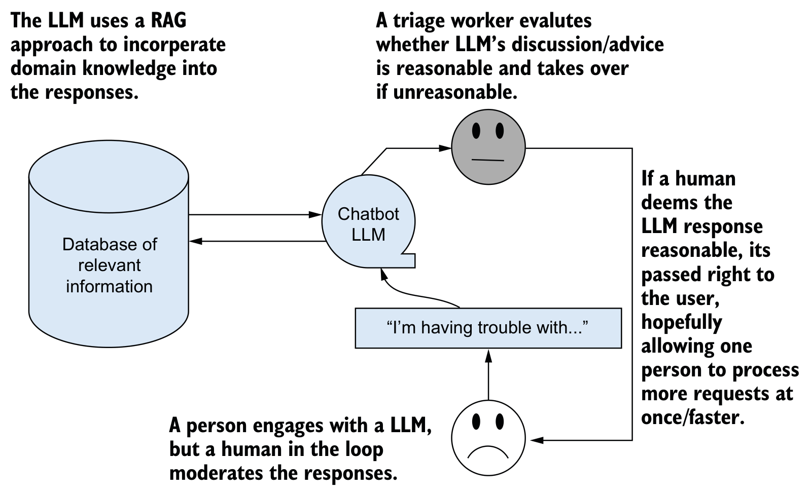

*图8.2 一种实现“人在环路”系统的朴素方法，该系统使用LLM配合相关信息的数据库来生成输出，最终由人工工作人员审查并可能修正。*

<details>
<summary>英文原文</summary>

[Figure]

Figure 8.2 A naive approach toward implementing a “human in the loop” system that uses an LLM paired with a database of relevant information to produce output that is ultimately reviewed by and possibly corrected by a human worker

</details>

RAG方法可能会减轻很多风险，但也有可能陷入自动化偏差的陷阱。自动化偏差指的是，人们普遍倾向于选择系统提供的自动化或默认选项，因为这比运用批判性思维来判断哪个选择最适合当前情况要容易。如果一个系统工作良好且无需频繁干预，那么保持高度警惕并发现偶尔出现的错误就变得极具挑战性。矛盾之处在于，如果系统的建议非常不准确以至于你能保持警惕，那么与完全不使用自动化直接回答问题相比，该系统很可能反而会拖慢你的速度。这就是试用或模拟部署变得极其重要的地方。如果你的系统非常准确，以至于自动化偏差才是真正的风险来源，那么你有两个无需偏离“人在环路”设计的选择：

<details>
<summary>英文原文</summary>

The RAG approach will likely mitigate a lot of risk, but it also has the potential to hit the pitfall of automation bias. Automation bias refers to the fact that people, in general, tend to pick automated or default choices presented by a system because it is easier than applying critical thinking to determine which choice is most appropriate to the situation at hand. If a system works well and does not need you to intervene often, it becomes incredibly challenging to remain hypervigilant and detect the occasional error. The paradox is that if the system is so inaccurate in its suggestions that you can maintain your vigilance, the chances are good that the system is slowing you down when compared to directly answering questions using no automation. This is where trial or phantom deployments become incredibly important. If your system is so accurate that automation bias is the real source of risk, you have two options that do not require deviating from the “human in the loop” design:

</details>

在流程中添加“转人工”通道 通过流程变更从外部降低错误风险 第一点非常直接。最终，LLM会遇到无法回答的新情况。在这种情况下，最好为客户提供一种方式，使其能够从与计算机的无限循环中“解脱”出来，获得更高级别的支持。这可以是通过消息数量或聊天时长设定的最大对话长度、在多次沟通失败后出现的联系人工客服选项，或其他可能的设计。

<details>
<summary>英文原文</summary>

Add an “escape to a human” path to the pipeline Mitigate the risk of errors externally via process changes The first point is pretty straightforward. Eventually, a novel situation will occur that the LLM cannot answer. In this case, it would be best to provide a way for a customer to “escape” from an infinite loop with a computer to get to a higher tier of support. This could be a maximum conversation length measured in the number of messages exchanged or the amount of time spent chatting, an option to contact a human representative that appears based on multiple failed attempts to communicate, or other possible designs.

</details>

注意：假设你将着手创建RLHF或SFT数据集，以便按照第5章讨论的方法，针对你的场景微调LLM。在这种情况下，你甚至可以添加训练样本，让LLM的预期回复是：“抱歉，这个情况听起来比我能够协助的更复杂；让我找一个人来帮忙。”

<details>
<summary>英文原文</summary>

NOTE Suppose

you are going to do the work to create an RLHF or SFT dataset to fine-tune your LLM to your situation as we discussed in chapter 5. In that case, you can even add training examples where the LLM’s expected response is “I’m sorry, this situation sounds more complex than what I can assist with; allow me to get a human to help.”

</details>

### 8.2.1 改变流程

<details>
<summary>英文原文</summary>

8.2.1 Changing the process

</details>

第二个建议——改变流程——并不像听起来那么困难。如果你的某位上司拥有MBA学位，那么他们（据说）受过训练，会从这些角度思考。（本书的一位作者拥有MBA学位，所以我们说这些没问题。）例如，与聊天机器人的交互可以包含一条提示，即任何结果都需要“经过人类的最终批准”。在这种情况下，由一个人审核整个对话，其自动化偏差风险远低于要求某人在整个持续对话中保持持续警觉。最终，对抗性用户知道会有人类检查，因此失去了尝试欺骗系统的动力。根据具体情境，防止LLM被对抗性使用可以通过要求用户提供担保来确保他们诚信行事来实现。例如，你可以采取相当于冻结用户信用卡的措施，作为针对恶意交互的一种保险。当交易成功完成时，该冻结将被解除。你也可以限制流程的自动化程度，要求身份验证，或者随机决定用户被转接给人类还是AI的频率，从而使得可被利用的情况何时出现变得不可预测。所有这些措施都取决于你的具体应用、风险、对风险的容忍度以及用户的特性。一些客户可能会因为信用卡冻结而感到反感。或者，你也可以将其设计为一种可选方式：如果AI系统成功帮助用户解决了问题，用户将获得2美元的账单减免（假设这比旧系统每次通话的成本更低）。无论如何，这都需要具体问题具体分析，并取决于你管理风险的创造力。

<details>
<summary>英文原文</summary>

The second suggestion, changing the process, is not as difficult as it may sound. If one of your bosses has an MBA, they are (allegedly) trained to think in these terms. (One of the authors has an MBA, so it is OK for us to say that.) For example, interactions with the chatbot could include a caveat about any outcome requiring “a human’s final approval.” In this case, having the entire conversation reviewed by a person is far less of an automation bias risk than requiring someone to maintain constant vigilance throughout a continuous conversation. Ultimately, adversarial users know a human is going to check and so are demotivated from trying to game the system. Depending on the context, preventing adversarial use of an LLM can be achieved by requiring the user to provide collateral to ensure they act in good faith. For example, you could take actions equivalent to putting a hold on the user’s credit card as a kind of insurance against bad-faith interactions. Such a hold would be released when the transaction is completed successfully. You could also limit how much of the process is automated, require authentication, or randomize how often people are routed to a human versus an AI so that it becomes unpredictable when a situation that could be exploited will arise. All of these actions will depend on your specific application, the risks, the tolerance of those risks, and the nature of your users. Some customers might be turned off by a credit hold and be upset. Or maybe you frame it as an optional method in which the user gets $2 off their bill if an AI system successfully helped them with their problem, presuming that it is less than what the old system would have cost per call. Either way, it is case by case and will depend on your creativity to manage the risk.

</details>

### 8.2.2 当自主LLM风险过高时

<details>
<summary>英文原文</summary>

8.2.2 When things are too risky for autonomous LLMs

</details>

现在你已经完成了试部署，评估了风险以及用户的对抗性倾向，并得出结论：让大语言模型提供初始答案风险太大。那么大语言模型还能如何提供一定程度的效率呢？一种反直觉的方法是让大语言模型检查人，而不是让人检查大语言模型。这听起来可能很奇怪。如果我们不能信任大语言模型独立行动，为什么还要让它来监督呢？为了进一步思考，设想你有一个大语言模型系统扮演监督角色，检查每一条回复，如图8.3所示。如果大语言模型和人都正确，就会执行操作，并将消息转发给客户。这就像用户在与技术人员聊天。但如果技术人员和大语言模型对答案有分歧，我们可以提示技术人员在发送给用户之前再次检查自己的回复。

<details>
<summary>英文原文</summary>

So now you have done a trial deployment, evaluated the risks and your users’ adver-sarial proclivities, and concluded that it is too risky for LLMs to provide the initial answers. How could an LLM still provide some level of efficiency? An unintuitive approach is to have the LLM check the person rather than the person check the LLM. This may sound strange. Why would we let the LLM supervise if we cannot trust it to act alone? To consider this further, imagine you have an LLM system in this supervisory role, checking each response, as shown in figure 8.3. If the LLM and the person are correct, action will be taken, and the message will be relayed to the customer. It will be as if the user is chatting with the technician. But if the technician and the LLM disagree on the answer, we can prompt the technician to double-check their response before sending it to the user.

</details>


*图8.3 注意，此图中的箭头方向与图8.2相比发生了变化。所有信息首先传递给人，然后我们使用大语言模型在错误发生前将其捕捉。*

<details>
<summary>英文原文</summary>

[Figure]

Figure 8.3 Notice that the direction of the arrows in this diagram has changed from figure 8.2. Everything goes to a human first, and we use LLMs to catch mistakes before they happen.

</details>

这种双重检查可以简单到对技术人员说：“嘿，这个解决方案看起来可能不正常，请确认后再发送。”你也可以尝试让LLM自己生成一个建议的替代方案。或者，你可以让LLM不直接参与流程，而是用它通知更有经验的技术人员加入并协助。无论结构如何，其目的都是发出信号：可能存在负面客户交互的风险，例如给出错误答案。虽然这种风险一直存在，但现在我们有机会加以缓解。此外，由于我们考虑的是人为导致的客服错误，通常不会引入新风险，因为单独工作的客服代表同样容易犯错。因此，如果LLM和人同时出错，那么该流程错误本就是无法避免的。这就是生活。从技术上讲，我们可以辩称，技术人员可能会根据LLM对交互的评估而过度质疑自己的回复，从而降低效率。此外，过于敏感的LLM可能会过于频繁地要求技术人员双重检查工作，这会导致警报疲劳，进而使技术人员完全忽视LLM的建议。如果你的用例容易出现此类问题，这一事实将在试部署中被揭露，试部署会提供关于如何调整LLM以解决该问题的上下文相关反馈。适用于所有机器学习的一般警告在此尤为重要：始终测试，不要假设。

<details>
<summary>英文原文</summary>

This double-check could be as simple as telling the technician, “Hey, this looks like it may be abnormal for a solution; please confirm before sending.” You could try having the LLM produce its own suggested alternative. Or you could keep the LLM out of the process and use it to notify a more experienced technician to join the process and assist. Regardless of how this is structured, the purpose is to signal that there may be a risk of a negative customer interaction, such as an incorrect answer. While this risk existed previously, we now have a chance to mitigate it. Additionally, because we are considering human-initiated customer support errors, we are generally not taking on any new risk because a support representative acting alone could just as easily make a mistake. So if the LLM and human are both wrong simultaneously, you were already doomed to make that process error anyway. Such is life. Technically, we could argue that technicians could question their responses too much based on an LLM’s assessment of their interactions, thus reducing efficiency. Additionally, an overly sensitive LLM may ask technicians to double-check their work too often, which would cause alert fatigue that could lead to technicians ignoring the LLM suggestions entirely. If your use case is prone to these sorts of problems, that fact will be uncovered during trial deployments that provide context-specific feedback on how an LLM should be tuned to address this problem. The general caveat that applies to all machine learning is especially important here: always test; do not assume.

</details>

### 采用大语言模型

<details>
<summary>英文原文</summary>

Employing an LLM

</details>

通过复核人工表现可以减少整个流程中的错误。这种方法看起来并没有加快速度，因为仍然由人工生成初始响应。不过，这种方法仍然创造了提高效率的机会：

<details>
<summary>英文原文</summary>

to double-check human performance can reduce errors in the process as a whole. It may not seem like this approach makes anything faster because humans are still generating the initial response. However, this approach still creates opportunities for increased efficiency:

</details>

它可以通过帮助发现错误并更快地找到解决方案来缩短对话长度。它可以识别出哪些员工需要更多培训或信息来回答客户问题，或者识别出特定错误情况的发生。它可能有助于避免升级到成本更高的支持层级或管理层，从而降低棘手客户的出现频率和处理成本。

<details>
<summary>英文原文</summary>

It can reduce the conversation length by helping to catch errors and reach a solution faster. It can identify staff who need more training or information to answer customer questions or recognize when specific error situations occur. It may help avoid escalation to more costly levels of support or managers, reducing the frequency and cost of troublesome customers.

</details>

### 8.3 利用不止于LLM的手段降低风险

<details>
<summary>英文原文</summary>

8.3 Using more than LLMs to reduce risk

</details>

我们讨论的所有内容都涉及一种“以火攻火”的策略，即尽管使用 LLM 存在风险，但我们考虑了用 LLM 来缓解这些风险的不同方式。虽然我们改变了使用 LLM 的方式，但 LLM 仍然是主要组件。或者，我们可以考虑使用 LLM 之外的工具来解决设计挑战。生成式 AI 范围内的其他方法，如文本转语音和语音转文本，可用于构建更易用或更便捷的用户体验。例如，患有关节炎或视力低下的用户可能更愿意打电话，而不是在聊天机器人提示窗口中输入回复。如果我们思考客户服务问题以及 LLM 何时表现良好，就会发现一个更广泛工具类别的要素也已具备。在问题重复出现且可以给出公式化解决方案和回复的场景中，LLM 表现最佳。LLM 在识别语言模糊性中的宽泛模式方面非常灵活。如果 LLM 能正确解读用户的问题，且存在已知解决方案，它就有可能引导用户完成该解决方案。这听起来很像无监督聊天机器人，但关键区别在于，在 LLM 在解决方案中扮演辅助角色的情况下，输出最终是由客服技术人员生成的，如图 8.3 所示。本节还将讨论如何使用经典机器学习技术（如分类）来解决现有问题。我们可以通过利用 LLM 中的知识，生成用户文本的嵌入，来启用机器学习技术。

<details>
<summary>英文原文</summary>

Everything we have discussed has involved a “fight fire with fire” approach in which, although there are risks to using LLMs, we have considered different ways to use LLMs to mitigate those risks. While we’ve changed how we use the LLM, the LLM is still the primary component. Alternatively, we can consider using tools other than LLMs to address our design challenges. Other approaches in the scope of generative AI, such as text-to-speech and speech-to-text, can be used to build more accessible or simply convenient user experiences. For example, users with arthritis or low vision may greatly prefer a phone call over typing responses into a chatbot prompt window. If we think about our customer service problem and when LLMs work well, we will discover that the ingredients for a broader class of tools are also available. LLMs work best when there is repetition in scenarios where problems reoccur and formulaic solutions and responses can be given. LLMs are very flexible in recognizing broad patterns in the fuzzy nature of language. If the LLM can correctly interpret a user’s problem, and there is a known solution, it can potentially walk a user through that solution. This might sound much like an unsupervised chatbot, but the critical distinction is that in the cases where the LLM takes a subordinate role in the solution, the output was ultimately generated by customer support technicians, as described in figure 8.3. This section will also discuss how we can use classic machine learning techniques, such as classification, to tackle existing problems. We can do this by using the knowl-edge within LLMs to enable machine learning techniques by producing embeddings of the user’s text.

</details>

### 8.3.1 结合LLM嵌入与其他工具

<details>
<summary>英文原文</summary>

8.3.1 Combining LLM embeddings with other tools

</details>

在第3章中，我们描述了大语言模型如何将词元转换为嵌入向量，这些向量是以一系列数字编码每个词元语义表示的向量。这些向量嵌入在大语言模型的Transformer架构之外也有其他用途。虽然向量嵌入对于大语言模型的运行至关重要，但它们本身也是一种极其有用的工具。

<details>
<summary>英文原文</summary>

In chapter 3, we described how an LLM transforms tokens into embeddings, which are vectors that encode a semantic representation of the meaning of each token as a series of numbers. These vector embeddings are useful in other ways outside the context of LLM’s transformer architecture. While vector embeddings are essential for making the LLM operate, they are themselves an extraordinarily useful tool.

</details>

LLM 生成的向量具有语义特性，这一点很重要，因为数百种其他实用的机器学习算法都基于向量表示进行运算。LLM 本质上是一种非常强大的工具，能够将复杂的人类语言文本转换为与机器学习其他领域兼容的形式。将 LLM 的向量输出与其他算法结合使用是一种极其有效的策略，以至于从业者将其称为“创建嵌入”。这一说法源于 LLM 将一种表示（人类文本）嵌入到另一种表示（数学向量）中的概念。由于这些数字编码了原始文本的信息，你可以像处理数值一样将它们绘制出来，并发现相似的文本在图中的位置也相近，如图 8.4 所示。

<details>
<summary>英文原文</summary>

The semantic nature of the vectors produced by LLMs is important because hundreds of other practical machine learning algorithms operate on vector repre-sentations. LLMs are essentially a very powerful way of converting complex human language text into a form compatible with the rest of the machine learning field. Utilizing the vector outputs of LLMs with other algorithms has been such an extraor-dinarily useful strategy that practitioners will describe it as “creating embeddings.” The description comes from the idea that the LLM is taking one representation (human text) and embedding it into another representation (a mathematical vector). Because these numbers encode information about the original text, you can plot them like numbers and see that similar texts end up in similar locations on the plot, as shown in figure 8.4.

</details>

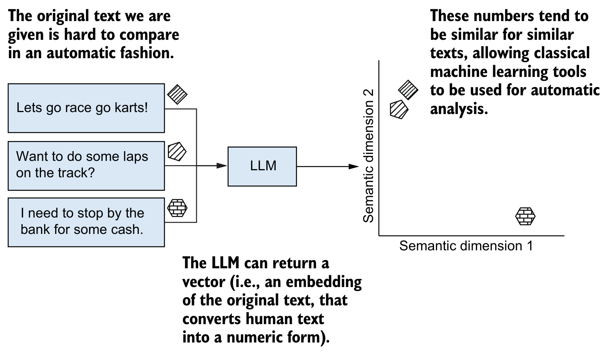

*图8.4 大语言模型作为其运行的内在部分，会生成称为嵌入向量的数值向量。这些嵌入向量的实用性依赖于这样一个事实：当输入相似文本时，这些数值只发生微小变化。这里的两个示例文本将具有相似的嵌入向量，因此它们的图示看起来相似，即便它们没有任何相同的词汇。这是早期机器学习技术就已具备的一个强大特性。*

<details>
<summary>英文原文</summary>

[Figure]

Figure 8.4 LLMs produce numeric vectors known as embeddings as an intrinsic part of their function-ing. The utility of these embeddings is dependent on the fact that these numbers only change a little bit when given similar text. The two example tests here will have similar embeddings, and thus, their plots look similar, even though they don’t share any of the same words. This is a powerful feature that was present in older machine learning techniques.

</details>

我们快速了解一下，在获得嵌入向量后，可以使用的四种机器学习算法。我们认为每一种机器学习算法对于大多数与LLM结合的实际应用场景都特别有用；我们还将介绍一些常见且相对可靠易用的算法。关键在于，如果你跳出“只有LLM才能解决问题”的思维定势，你就会发现更多可用的工具。以下列表就是这些工具的入门指南：

<details>
<summary>英文原文</summary>

Let’s look at a quick description of four types of machine learning algorithms you can use once you have embeddings. We consider each type of machine learning to be particularly useful for most real-world use with LLMs; we will also note some popular algorithms you can find that are relatively reliable and easy to use. The critical takeaway is that if you break out of the mindset that only an LLM can solve a problem, a more extensive set of tools becomes available to you. This list is your starting map for some of those tools:

</details>

- 聚类算法——根据文本间的相似性进行分组，使其与更大规模的文本集合区分开来（例如，用于市场细分分析）。常用算法包括k-means和HDBSCAN。
- 异常检测——找出与几乎所有其他可用文本都不同的文本（即发现反常规客户或新颖问题）。常用算法包括孤立森林（Isolation Forests）和局部异常因子（Local Outlier Factor, LoF）。

<details>
<summary>英文原文</summary>

Clustering algorithms—Grouping texts by similarity to each other that are distinct from the larger amount of text available (e.g., used for market segment analysis). Popular algorithms include k-means and HDBSCAN. Outlier detection—Finding texts that are dissimilar from essentially all other texts available (i.e., finding contrarian customers or novel problems). Popular algorithms include Isolation Forests and Local Outlier Factor (LoF).

</details>

### 信息可视化——创建二维

<details>
<summary>英文原文</summary>

Information visualization—Creating a 2D

</details>

绘制数据图以便进行可视化检查/探索，尤其是与交互式工具结合使用时（即数据探索）。常用算法包括UMAP和PCA。分类与回归——如果使用已知结果（例如净推荐值评分）对旧文本进行标注，则可以使用分类（即从A、B或C中选一个）或回归（即预测连续数值，如3.14或42）来预测新文本的得分（即数据分类与价值预测）。将嵌入作为简单算法（如逻辑回归和线性回归）的输入，分别适用于分类和回归任务。

<details>
<summary>英文原文</summary>

plot of your data to allow visual inspec-tion/exploration, especially when combined with interactive tools (i.e., data exploration). Popular algorithms include UMAP and PCA. Classification and regression—If you label your old texts with known outcomes (e.g., net promoter score rating), you can use classification (i.e., pick one of A, B, or C) or regression (i.e., predict a continuous number like 3.14 or 42) to predict what the score would be on a new text (i.e., data categorization and value prediction). Using embeddings as input for simple algorithms like logistic regression and linear regression works well for classification or regression, respectively.

</details>

这是当前段落中唯一的一句话。嵌入并非大语言模型发明的新事物。早在2013年，能嵌入单个词的Word2Vec算法就将嵌入推广为表示文本含义的首选策略。尽管如此，大语言模型产生的嵌入通常比旧算法更有用。然而，大语言模型在计算上的需求远高于像Word2Vec这样的旧算法。因此，对于此任务，你可能希望使用更旧或更快的算法。生成式AI在图像、视频和语音领域的存在意味着，除了文本之外，你还可以在图像、视频和语音等领域使用嵌入。

<details>
<summary>英文原文</summary>

NOTE Embeddings

are not something new that was invented as a part of LLMs. An algorithm known as Word2Vec, which could embed single words, popularized embeddings as a go-to strategy for representing the meaning in text back in 2013. Despite this, LLMs tend to produce embeddings with greater utility than other older algorithms. However, an LLM is far more computationally demanding than older algorithms like Word2Vec. For this reason, you may want to use an older or faster algorithm for this task. The existence of generative AI methods in images, video, and speech means you can also use embeddings for domains such as images, video, and speech in addition to text.

</details>

### 8.3.2 设计使用嵌入的解决方案

<details>
<summary>英文原文</summary>

8.3.2 Designing a solution that uses embeddings

</details>

支持团队与客户合作，但组织方式使得每个成员处理有类似问题的客户。

<details>
<summary>英文原文</summary>

The support team works with customers but is organized so each member deals with customers with similar problems.

</details>


*图 8.5 此图描述了客户支持请求的“更好解决方案”：客户在等待与客服交谈时描述自己的问题。LLM 使用问题的嵌入表示来比较类似问题和已知解决方案。在用户等待期间，自动化系统可以提供有助于解决问题所需的信息，无需支持人员介入。如果这未能奏效，用户始终可以“退出”并与真人客服交谈。用于生成嵌入表示的模型不必与引导用户完成解决方案的 LLM 相同。*

<details>
<summary>英文原文</summary>

[Figure]

Figure 8.5 This diagram describes our “better solution” to customer support requests, where customers describe their problem while waiting to talk to someone. The LLM uses an embedding representation of the problem to compare similar problems with known solutions. While the user waits, an automated system can provide information that may help them solve their problem without support personnel intervention. If that fails, there’s always the possibility to “bail out” and talk to a real person. The model used to generate the embeddings does not necessarily have to be the same as the LLM that walks the user through the solution.

</details>

我们完全可以将迄今描述的各种解决方案结合起来。例如，图8.5右上角的分析师-客户交互循环可以是两人讨论问题，也可以是我们在图8.3中设计的LLM监督验证解决方案。根据需要解决的问题，既然我们有了嵌入，就有许多机会来扩展这些解决方案。例如，如果分析师保存了客户愤怒或不满程度的信息，就可以训练一个回归模型，根据客户的嵌入来预测其愤怒程度。然后，你可以将愤怒的客户均匀分配给分析师，避免某个人不堪重负，或将愤怒的客户分流，不安排给仍在学习如何帮助客户解决问题的新分析师。

<details>
<summary>英文原文</summary>

It’s entirely possible to combine the solutions we have described so far. For example, the analyst-to-customer interaction loop in the top-right of figure 8.5 could involve two people talking through the problem, or it could be the LLM-supervised validation solution we designed in figure 8.3. Depending on what problems need to be solved, there are many opportunities to extend these solutions now that we have embeddings. For example, if analysts saved information about how angry or upset a customer is, you could train a regression model to predict how angry a customer may be from their embedding. Then, you could distribute the angry customers evenly amongst analysts to avoid someone being overwhelmed or try to route angry customers away from new analysts who are still learning how to help customers solve their problems.

</details>

需要明确的是，我们并非是说所有客户服务技术支持系统采用这种方法都会变得更好。我们的目的是向您展示，存在一些方法可以利用LLM构建解决方案，从而规避其缺陷，例如幻觉倾向以及无法动态吸收新知识。总之，我们提出两种基本策略：

<details>
<summary>英文原文</summary>

To be clear, we are not saying that all customer service tech support systems will be better if they use this approach. The goal is to show you that there are ways to build solutions with LLMs that work around their shortcomings, such as their tendency to hallucinate and their inability to incorporate new knowledge dynamically. In summary, we present two basic strategies:

</details>

### 使用LLM

<details>
<summary>英文原文</summary>

Use LLMs

</details>

作为正在发生的事情的第二双眼睛。如果LLM同意，一切正常。如果它不同意，你就进行二次检查，根据问题的性质，检查可能简单也可能复杂。使用嵌入将经典机器学习应用于该问题。聚类（将相似事物分组）和异常检测（发现独特或不寻常的事物）对于许多实际应用将特别有用。

<details>
<summary>英文原文</summary>

as a second set of eyes on what is happening. If the LLM agrees, all is good. If it disagrees, you perform a double-check that could be simple or complex, depending on the nature of the problem. Use embeddings to apply classic machine learning to the problem. Clustering (grouping similar things) and outlier detection (finding unique or unusual things) will be particularly useful for many real-world applications.

</details>

### 8.4 技术呈现至关重要

<details>
<summary>英文原文</summary>

8.4 Technology presentation matters

</details>

看完我们如何设计一个使用LLM的技术支持系统的这个例子，有些人可能会觉得难以置信。我们经常听到完全相信LLM技术的人说：“如果让LLM解释其推理过程，用户或分析师就能判断其是否合理，所有与幻觉和错误相关的问题都将迎刃而解。”我们也经常收到那些持怀疑态度的人的类似要求，他们担心LLM产生的错误，不理解到底发生了什么，要求创建“可解释的AI”。因此，双方都认为解释能够建立对技术的信任，并相信LLM（或任何机器学习算法）在正确有效地工作。在本节中，我们希望讨论一些观点，这些观点支持“可解释性并非解决这些问题的方法”这一主张。可解释性并不是帮助捕获错误或使系统更透明、更值得信赖的唯一解决方案。不幸的事实是，我们对LLM如何与人协作的假设往往是错误的，必须仔细评估。事实上，最近的研究表明，当系统采用可解释AI技术时，人们会错误地信任AI，仅仅因为存在解释就认为它是正确的，而不管解释准确与否。即使在没有AI支持的情况下用户本可以独立完成该任务，并且用户已经了解了AI系统实际的工作原理，这种情况依然存在[3]。底线是，解释可能反而有害于它们试图推进的目标。

<details>
<summary>英文原文</summary>

Some of you may be incredulous after reading through this example of how we would design a tech support system that uses LLMs. We often hear folks who fully believe in LLM technology say, “If you have the LLM explain its reasoning, the user or analyst can figure out if it makes sense, and all of the problems related to hallucinations and errors will be solved.” We often receive similar requests to create “explainable AI” from those on the more skeptical end of the spectrum who are concerned about the errors LLMs produce and who don’t understand what is happening. Thus, there is a perception on both sides that explanations will provide the means to establish trust in the technology and believe that the LLM (or any machine learning algorithm) is working properly and effectively. In this section, we want to discuss some points that support the notion that explain-ability is not the solution to these problems. Explainability is not the single solution that will help catch errors or make a system more transparent and trustworthy. The unfortunate truth is that our assumptions about how an LLM will work with people are often wrong and must be carefully evaluated. In fact, recent research has shown that when explainable AI techniques are employed by a system, people erroneously trust the AI to be correct solely based on the fact that an explanation is present, regardless of its accuracy. This is true even when the user could perform the task independently without an AI’s support, and the user has been taught about how the AI systems actually work [3]. The bottom line is that explanations can be harmful to the very goals that they attempt to advance.

</details>

这与其要解决的实际目标背道而驰。那么为什么还要做任何形式的可解释AI呢？

<details>
<summary>英文原文</summary>

because it is counterproductive to the actual goals being solved. So why would anyone do any explainable AI of any form?

</details>

从实际角度来看，有两个关键点让可解释AI有用：

<details>
<summary>英文原文</summary>

Two key things make explainable AI useful from a practical perspective:

</details>

回答问题：可解释性，对谁解释？从问题陈述出发实现可解释AI。例如，一个真实世界的问题陈述可能描述需要发展对物理或化学过程的科学理解。基于这一目标，算法给出的有用解释可能不是直接生成答案，而是生成一个能产生答案的方程。有了这个方程，物理学家或化学家可以检查其逻辑一致性，并将其作为进一步科学探索的起点。

<details>
<summary>英文原文</summary>

Answering the question, explainable to whom? Reaching explainable AI from the problem statement For example, a real-world problem statement may describe the need to develop a scientific understanding of a physical or chemical process. With this goal, a useful explanation from the algorithm may be to generate an equation that produces the answers rather than producing the answers directly. With the equation, a physicist or chemist can inspect it for logical consistency and use it as a starting point for further scientific exploration.

</details>

在这种情况下，解决方案只能被具备深厚专业知识的人理解，不过也只有这些人才需要理解。以方程形式呈现的解释直接针对科学理解问题，而非仅仅理解AI算法的内部工作原理。我们无法解释AI是如何得出该方程本身的，而且希望这个方程是逻辑一致的形式，能够解释物理或化学过程。

<details>
<summary>英文原文</summary>

In this case, the solution is explainable only to someone with significant exper-tise, but that is the only person who needs the explanation. The explanation in the form of an equation also directly tackles the problem of scientific understanding rather than merely understanding the inner workings of the AI algorithm. We do not have any explanation of how the AI came up with the equation itself, and the equa-tion is (hopefully) a logically consistent form that explains the physical or chemical process.

</details>

这个例子反映了一种普遍情形，即我们发现可解释AI最有帮助的情况：当它用于帮助一群狭窄且特定的、可能是专家的用户执行一个非常具体的目标时。例如，数据科学家使用可解释AI来帮助他们弄清楚某个模型为何产生一组特定的错误，这确实很常见，即使他们使用的工具对非数据科学家受众来说难以理解。

<details>
<summary>英文原文</summary>

This example reflects the general situation in which we find explainable AI the most helpful: when it is used to aid a narrow and specific audience of potentially expert users in performing a very specific goal. For example, it is indeed common for data scientists to use explainable AI to help them figure out why a particular model is making a particular set of errors, even if the tools they use are not com-prehensible to a nondata scientist audience.

</details>

那么，如果可解释AI并非建立对AI系统或解决方案信任的解决方案，那什么才是呢？遗憾的是，目前尚无公认的、通用且经过严格评估的方法来建立对AI的信任。我们的建议并无新意，即关注透明度、用户评估以及相关用例的具体情况。

<details>
<summary>英文原文</summary>

So if explainable AI is not a solution for building trust in an AI system or solution, what is? Unfortunately, there is no agreed-upon generic and rigorously evaluated way to build trust in AI. Our unoriginal suggestion is to focus on transparency, user evaluation, and the specifics of the use cases involved.

</details>

8.4.1 如何做到透明？透明度可以简单到告知用户正在使用的AI系统：它基于哪个模型设计？在高层次上做了哪些修改？如果系统旨在模仿特定人物（如“接受阿尔伯特·爱因斯坦AI的辅导”）或某类有资质的人（如“让GPT医生看看你背上的那颗痣”），那么该人物或类似资质的人是否已经知情同意或认可其效果？消费者如何验证这些信息？总之，列举出审计人员或持怀疑态度的用户可能想知道的各种合理问题及其答案，将使你的系统在透明度上远超平均水平。这些问题无需向每个用户详细展示，但为用户提供发现这些信息的途径会很有帮助。这不仅有助于高级用户理解系统运作，也能帮助所有用户对特定系统能力建立合理预期，明确哪些是可行的，哪些不可行。此外，当用户与生成自动响应的系统交互时，必须告知用户这一点。试图伪装成人类来控制并因此能够解决任何合理挑战，与明确告知客户这是能力有限的自动化AI系统，两者之间有天壤之别。

<details>
<summary>英文原文</summary>

8.4.1 How can you be transparent? Transparency can be as simple as informing users about the AI system that is being used: Which model was it designed with and, at a high level, how was it modified? If the system is meant to mimic a specific person (“Get tutored by Albert A.I. Einstein”) or a type of credentialed person (“Ask Dr. GPT about that mole on your back”), has that person or similarly credentialed person consented to this or approved its efficacy? How can the consumer verify this information? Essentially, enumerating these kinds of reasonable questions and their answers that an auditor or skeptical user might want to know will put you far ahead of the average in making your system more transparent. These do not need to be presented in detail to every user, but having a way for users to discover this information is helpful. It not only helps sophisticated users understand what is happening but also helps set the expectations of users in general about what is and is not possible with a given system. Furthermore, it is essential to inform users when they are interacting with a system that is generating automated responses. There is a big difference between trying to pretend a human is in control and thus should be able to solve any reasonable challenge versus an automated AI that you inform the customer has limited capability.

</details>

### 8.4.2 对齐用户激励

<details>
<summary>英文原文</summary>

8.4.2 Aligning incentives with users

</details>

透明度和系统呈现的一部分涉及激励对齐。这不仅仅是关于管理实践的空洞宣言，而是一条切实可行的建议。回忆一下第4章的内容：AI算法是贪心的机器，它们优化的是你要求的内容，而不是你的意图。如果你在构建LLM系统时，系统的激励与你的更广泛目标不一致，那么你就有风险过拟合你所要求的内容，而不是你和用户真正需要的。有了对齐的激励（例如，我们的例子“试用LLM，如果有效就减免2美元账单”），你更有可能获得积极的结果。它们还为你提供了更多方式来宣传使用LLM作为为客户提供价值的机制，而不是显得像是试图外包所有工作的恶人。展示并讨论企业与客户之间的激励对齐，以及你如何使用LLM来实现这些目标，这本身就说明了需要表达的内容，无需任何信息隐藏。

<details>
<summary>英文原文</summary>

Part of transparency and system presentation involves aligning the incentives involved. This isn’t just a feel-good statement about management practices but a practical unit of advice. Remember from chapter 4 that AI algorithms are greedy machines that optimize for what you ask, not what you intend. If you start building an LLM system where the incentives of the system are not well aligned with your broader goals, you risk overfitting to what you asked, not what both you and your users need. With aligned incentives (e.g., our example of “try out the LLM and get $2 off your bill if it worked”), you are much more likely to have a positive outcome. They also give you more ways to advertise using an LLM as a mechanism for providing value to your customers instead of coming across as the evil people trying to outsource all the jobs. Presenting and discussing the aligned incentives between a business and its customers and how you are using LLMs to achieve those goals describes what needs to be said without any need for hiding the information.

</details>

### 8.4.3 整合反馈循环

<details>
<summary>英文原文</summary>

8.4.3 Incorporating feedback cycles

</details>

世界并非一成不变。事物总在变化，今天有效的方法明天可能失效。这也是为什么任何自动化 AI/ML 系统都需要定期且持续审计的原因之一：因为它们不会随着经验自动改进或适应。但审计还有助于发现潜在的负面反馈循环，这一点应提前加以考虑。负面反馈循环有时难以预测。为帮助识别这些循环，尝试思考哪些用户会或不会从新系统中获益最多，并设想这种情况反复发生后的结果。例如，我们之前提到语音转文字和文字转语音功能对老年用户或听障、行动不便的用户很有帮助。如果不提供这一选项，久而久之可能会疏远这些用户，因为他们每次遇到问题都不得不使用身体上难以操作的系统。假设你是一家依赖家庭套餐收入的手机运营商。当初购买家庭套餐的中年用户如今对你的支持系统感到不满，于是他们携全家转投另一家运营商——后者在客户支持流程的准确性和效率上下了更多功夫。这样一来，年长用户和年轻用户你同时流失了！

<details>
<summary>英文原文</summary>

The world is not a static place. Things change, and what works today may not work tomorrow. This is one reason why you should have regular and continuous auditing of any automated AI/ML system: because they do not improve or adapt independently with experience. But it will also help you catch potentially negative feedback cycles, something you want to try to think about in advance. Negative feedback cycles are not always possible to predict. To help you catch these, try to think about which users will or won’t find the most benefit with a new system and what happens as that repeats over and over again. For example, we mentioned that speech-to-text and text-to-speech can be helpful for older customers or any hearing or movement-impaired customer. If we did not include such an option, we might alienate those customers over time, because every time they have a problem, they must use a physically difficult system. Imagine you were a cell phone company that relied on family plans for some of your revenue. Your previously middle-aged customers who first bought your family plans are getting frustrated with your support system, so they move their entire family plan over to a new provider who puts in the extra work to ensure that the customer support process is accurate and efficient. Now you’re losing both your older and younger customers at once!

</details>

关键在于深思熟虑，并训练自己进行这些思维实验。你无法覆盖所有情况，但你会不断进步。定期的审计和测试则能帮你发现失败案例、记录它们，并改进你对未来情况和重复问题的思考方式。

<details>
<summary>英文原文</summary>

The point here is to think things through and train yourself to do these thought experiments. You will not catch every case, but you will improve. Regular auditing and testing then help you catch the failure cases, document them, and improve how you think about future situations and repeat problems.

</details>

### 总结

<details>
<summary>英文原文</summary>

Summary

</details>

大语言模型难免出错，因此首先需要评估犯错的风险和潜在成本，才能设计合适的解决方案。如果犯错的风险和成本较低，或许可以直接使用常规的聊天机器人式大语言模型。通过改变用户与系统的交互方式，或将自动化转移到业务流程的不同环节，可以控制使用大语言模型的风险。引入“人在回路”来监督大语言模型会产生自动化偏差风险，即使使用了诸如RAG（检索增强生成）等技术来降低出错风险也不例外。大语言模型可以将文本转换为嵌入表示（embeddings），这是一种数值化表示，相似的句子会得到相近的数值。这使得我们可以使用更多的机器学习方法，包括聚类和异常检测等经典技术。尽管大语言模型能够解释其决策，但由于人们会对其解释产生依赖，这些解释往往效果不佳。相反，应专注于提供满足特定需求或用例的解释，而非泛泛的“需要解释”。此外，要设计系统激励机制，使其与用户的激励相一致。这既是一种避免大语言模型按照你的字面要求而非真实意图进行优化而导致错误的好方法，也是向用户传达和展示大语言模型的有效途径。

<details>
<summary>英文原文</summary>

LLMs will have errors, and you first need to determine the risk and potential cost of errors to design an appropriate solution. If the risk and cost of errors are low, you can potentially use a normal chatbot-style LLM. It is possible to control the risk of using an LLM by changing how users interact with the system or shifting automation to a different part of the business process. Including a “human in the loop” to supervise an LLM creates automation bias risk, even when using techniques such as RAG to reduce the risk of errors. LLMs can convert text into embeddings, numeric representations where similar sentences receive similar values. This allows you to use additional machine learning approaches, including classic techniques like clustering and outlier detection. While LLMs can explain their decisions, their explanations are often ineffective because people become dependent on them. Instead, focus on producing explanations to satisfy a specific need or use case rather than generic “needing to explain.” Design your system’s incentives to align with your user’s incentives. This is both a good way to avoid mistakes from an LLM optimizing for what you asked instead of what you intended and a good way to communicate and present your LLM to users.

</details>


---

## 第 9 章: 构建与使用 LLM 的伦理

9 构建和使用LLM的伦理

<details>
<summary>英文原文</summary>

9 Ethics of building and using LLMs

</details>

### 本章涵盖

- LLMs执行多种任务的能力也带来了意想不到的风险。
- LLM与人类价值观不一致的问题
- LLM数据使用对内容创作及未来模型构建的影响

<details>
<summary>英文原文</summary>

This chapter covers How LLMs’ abilities to perform many tasks also create unanticipated risk The question of LLMs’ misalignment with human values The implications of LLMs’ data use on content creation and building future models

</details>

虽然讨论伦理可能让有些人想起大学入门课程中枯燥的阅读材料，但在实现可能影响人类的算法时，有一些关键的考量。鉴于LLM使用的快速增长及其能力范围，我们必须意识到并关注许多不断演变的问题。如果你不了解这些问题，你就无法参与它们的解决。探索构建和使用LLM的伦理是一个非常复杂的话题，难以完全呈现。因此，本章将介绍我们认为在构建LLM时的常见关切及相关伦理问题。在本章中，我们将引用一些补充讨论的资料，以便您进一步探究。

<details>
<summary>英文原文</summary>

Although the discussion of ethics may remind some of you of the dull readings from an entry-level college class, there are critical considerations when implementing algorithms that have the potential to affect humanity. Given the rapid growth in LLM use and their scope of capabilities, we must be aware of and attend to many evolving concerns. If you are unaware of these concerns, you will have no voice in their resolution. Exploring the ethics of building and using LLMs is an incredibly complex topic that is challenging to represent completely. As a result, this chapter will present what we believe to be common concerns about building LLMs and the related ethical questions. Throughout the chapter, we’ll reference materials that round out this conversation so you can investigate further if you wish.

</details>

我们将讨论三个主要话题：

<details>
<summary>英文原文</summary>

We’ll cover three main topics:

</details>

人们为何要构建LLMs？它们提供了哪些此前不曾存在的能力？一些机器学习专家认为，在未来的迭代中，LLMs将导致人类灭绝，因为它们会通过自动化让我们失去存在价值。即使我们不同意他们的观点，也值得理解这种恐惧的根源。LLMs所需的训练数据量是惊人的。构建LLMs的公司（如OpenAI和Anthropic）是如何获取这些数据的？数据的收集和使用方式会引发哪些可能涉及道德、法律和财务影响的伦理问题？

<details>
<summary>英文原文</summary>

Why do people want to construct LLMs, and what do they provide that didn’t exist before? Some experts in machine learning believe that in future iterations, LLMs will lead to the extinction of the human race because they will automate us out of existence. Even if we do not agree with them, it is worth understanding the basis for this fear. The amount of training data needed for LLMs is monstrous. How do companies that build LLMs, such as OpenAI and Anthropic, source all that data? What ethical concerns arise that may have moral, legal, and financial implications due to how that data is collected and used?

</details>

这些在伦理和法律层面都是复杂的考量。我们的目标不是告诉你创建这些模型是否合乎伦理，而是概述每个讨论下的主要考量。我们希望这能帮助你从更宏观的角度思考LLMs的影响、后果和风险。我们看到许多围绕LLM使用的高关注度的、伦理上复杂的问题，而许多从业者此前并未真正深入思考过这一主题。尽管如此，我们认为考虑构建LLMs的伦理问题至关重要，在本章中我们将向你介绍一些需要关注的关键问题。在讨论如何使用LLMs与如何构建LLMs时，同样需要许多考量，因此我们将讨论分为两个部分。首先，我们聚焦于构建LLMs的普遍伦理问题，而后面部分将涵盖使用LLMs的伦理影响。最后，我们将避免将这些论点归咎于特定个人或团体。我们的目标是防止偏见，并避免在讨论中特别“点名”任何人。重要的是问题本身。

<details>
<summary>英文原文</summary>

These are complicated considerations on both ethical and legal fronts. Our goal is not to tell you whether the creation of these models is ethical or nonethical but rather to outline primary considerations under each discussion. We hope this helps you consider LLMs’ implications, consequences, and risks on a broader scale. We see many high-profile, ethically sophisticated questions around LLM use, and many practitioners have not had to grapple meaningfully with this subject. Nevertheless, we believe that it is crucial to consider the ethical questions around building LLMs, and we will introduce you to some of the critical concerns to consider in this chapter. There are just as many considerations necessary when discussing how we use LLMs versus how we build LLMs, so we’ve divided this conversation into two sections. First, we focus on the ethics of building LLMs in general, while the latter section will cover the ethical implications of LLM use. Last, we will avoid ascribing these arguments to specific individuals or groups. Our goal is to prevent bias and avoid “calling out” anyone in particular in this discussion. The concerns are what’s important.

</details>

### 9.1 我们究竟为何要构建LLMs？

<details>
<summary>英文原文</summary>

9.1 Why did we build LLMs at all?

</details>

在讨论开发大语言模型的伦理影响之前，值得先思考我们构建大语言模型试图实现什么，以及我们为何要实现这些目标。与所有软件工程一样，构建大语言模型通常旨在减少或消除某些任务中的人力劳动。一些经济学家可能会告诉你，这是生活水平普遍提高的方式。随着技术进步，越来越少的人需要从事体力劳动密集型任务，因此他们有更多时间用于发现、创造以及其他运用高级认知的功能。就大语言模型而言，一个常见目标是提高算法效率，应用于自动语言翻译、语音转文字转录、读取图像和打印文档中的文本（如光学字符识别）、索引和检索信息（简称“搜索”或更广泛地称为信息检索）等任务，以及更多其他应用。其他人则出于纯粹的科学原因对大语言模型感兴趣，例如研究计算语言学方法，或创意应用，如生成图像、音乐或视频。此外，还有人可能希望提高影响我们生活的技术的可及性和透明度，或者只是因为大语言模型吸引了他们的注意，并呈现出惊人的新能力。对某些人来说，大语言模型能实现的各种功能本身就是构建它们的内在动力。人工智能和机器学习算法已经执行我们列出的所有任务有一段时间了；例如，机器翻译已有数十年历史。大语言模型与众不同之处在于，它们似乎能够用一个模型和算法完成所有事情。在大语言模型出现之前，工程师会构建独立的系统来分别满足翻译和转录等需求。如今最大的大语言模型在一定程度上能够完成所有这些任务，甚至更多。它们似乎常常能完成看似无穷无尽的任务。与此同时，另一些人则害怕大语言模型，因为其广泛的能力使人们认为它们会取代人类的工作、动机和活动，承担起那些以前被认为只有人类才能完成的发现和创造任务。

<details>
<summary>英文原文</summary>

Before we talk about the ethical ramifications of developing LLMs, it’s worth thinking about what it is we are trying to accomplish by building LLMs and why we want to achieve those things. Like all software engineering, building LLMs commonly aims to reduce or eliminate human labor from some tasks. Some economists might tell you that this is how standards of living generally increase. As technology advances, fewer people need to perform manual, labor-intensive tasks, and thus, they have more time for discovery, creation, and other functions that use high-level cognition. In the case of LLMs, a common goal is increasing the efficiency of algorithms for applications such as automated language translation, speech-to-text transcription, reading text contained in images and printed documents in applications such as Optical Character Recognition, indexing, and retrieving information, known simply as “search” or, more broadly, as information retrieval, and more. Others are interested in LLMs for purely scientific reasons, such as studying methods in computational linguistics, or creative applications, such as generating images, music, or videos. Furthermore, others may seek to increase access to and transparency of technology that affects our lives, or it may be just because LLMs have grabbed their attention and present fantastic new capabilities. For some, the variety of things LLMs can achieve is an intrinsic motivation for wanting to build them. AI and ML algorithms have been doing all the tasks we listed for some time; for example, machine translation is decades old. Part of what makes LLMs different is that they seem capable of doing everything with one model and algorithm. Before the advent of LLMs, engineers would implement tasks like translation and transcription in separate systems designed to meet those needs individually. The largest LLMs today can, to some degree, do each of these things and more. Often, it seems they can complete tasks of seemingly endless scope. At the same time, others fear LLMs because due to their breadth of capability, they believe they will steal work, motivation, and activity from humans by taking on tasks requiring discovery and creation, previously thought to be reserved for humans only.

</details>

注意：部署后监控的重要性并非新概念。例如，美国食品药品监督管理局（FDA）多年来通过MedWatch系统一直在实践这一点。该系统允许公众和医疗专业人员报告任何与药物或医疗器械相关的不良事件，以便FDA能够监测任何异常情况。

<details>
<summary>英文原文</summary>

NOTE The importance of postdeployment monitoring is not new. For example, the FDA has practiced this for many years with the MedWatch system. This system allows the public and medical professionals to report any adverse events with a drug or medical device so that the FDA can monitor for anything unusual.

</details>

*[未译]* 9.1.2
Do we want to automate all human work?

<details>
<summary>英文原文</summary>

9.1.2 Do we want to automate all human work?

</details>

正如我们在引言中所提到的，一些经济学家可能会认为，自动化使得劳动力能够专注于新的工作。这种观点基于一个想法：自动化的进步擅长消除大多数人不愿从事的工作。农业很辛苦，稀土金属开采很辛苦，组装汽车、玩具和包装也很辛苦。这些都是艰苦的体力劳动，往往伴随着有限的智力刺激。像农业这样的重体力劳动，如今的劳动力需求比1950年减少了74%[3]，而且无疑比中世纪时期少了许多倍。LLM的不同之处在于，它们有可能淘汰某些类型的白领知识工作。文案写作[4]、视觉艺术[5]、平面设计[6]和银行业[7]只是被生成式AI颠覆的几个领域。那些担心LLM对经济影响的人认为，我们将因自动化而失去工作，但我们提醒，这并不像通常描述的那样明确。机构和消费者的需求可能会推动这类白领工作的保留和持续扩展。我们应警惕忽视关于技术如何改变就业的经济研究历史。相反，我们必须解决一个更重要的担忧：获取高质量的训练数据。我们相信，这将推动未来的新就业机会，强调人类创造力和能力的重要性，即使它目前创造的工作还不是许多人期望的那种理想的白领工作。

<details>
<summary>英文原文</summary>

As we mentioned in the introduction, some economists might argue that automation allows the labor pool to focus on new work. This argument hinges on the idea that advances in automation have been good at eliminating work that most people don’t want to do. Farming is hard, mining rare earth metals is hard, and assembling cars, toys, and packages is hard. These are difficult labor and body-destroying jobs often coupled with limited intellectual stimulation. Heavy labor like farming requires 74% fewer laborers today than it did in 1950 [3] and, undoubtedly, many times fewer than it did back in the medieval era. The difference with LLMs is the potential to automate away certain types of white-collar knowledge work. Copywriting [4], visual arts [5], graphic design [6], and banking [7] are just a few of the fields disrupted by generative AI. Those concerned about LLMs’ effect on the economy suggest that we will lose jobs to automation, which we caution is not as clear-cut as often portrayed. Institutional and consumer desires may push for retention and continued expansion of these types of white-collar jobs. We should be wary of ignoring a history of economic study about how jobs change as technology advances. Instead, we must address a more significant concern: obtaining high-quality training data. We believe this will drive new jobs in the future, emphasizing the importance of human creativity and ability, even if the current jobs it creates are not yet the desirable kind of white-collar work that many would prefer.

</details>

关于“显而易见”结果的反例有人认为，LLM将如何影响某些经济领域是显而易见的。银行柜员的岗位就是一个常被用来反对LLM的著名例子。自20世纪60年代自动柜员机（ATM）发明以来，银行柜员的工作发生了显著变化。显然，ATM自动化了许多银行柜员的任务。但ATM的例子并不那么简单。在ATM发明后的几十年里，柜员岗位的数量反而增加了，从1970年到2010年翻了一番，达到约60万个，尽管ATM的普及程度越来越高[8]。回顾ATM对就业影响的史研究，人们认识到许多因素导致了岗位流失，包括增长率的变化和工作性质的改变。岗位流失不仅仅源于ATM技术，还来自其他业务领域多轮技术创新、银行应对变化方式的差异、放松管制以及银行业竞争加剧和整合等因素[9]。因此，尽管ATM在银行柜员的工作上可以说更好、更便宜，但机构、客户和期望的本质阻止了岗位的立即减少，并使情况远比通常宣传的要复杂。ATM的例子并非个例；技术可能但并非总是导致自动化带来的岗位流失。例如，机器翻译在21世纪初和2016年两次大幅改进。然而，翻译工作的岗位在每个时期都增加了，并且至今仍在增长[10]。关键的观察是，当翻译人员将自动化工具融入工作流程时，翻译工作的岗位池并不会缩小。相反，我们看到了已完成翻译工作量的增长，以及对翻译服务需求的增加，因为需要翻译的材料量持续增长。有人认为，类似的需求将会出现在创意艺术家和作家身上[11]。根据这一论点，尽管艺术生产和知识工作执行的方式会改变，但市场将继续增长，需求将继续上升，从而能够利用自动化工具引入带来的新劳动力供给。因此，当我们识别出可能被LLM自动化或加速的工作领域时，还必须确定效率和质量的提升是否会推动更多需求。然而，另一些人会认为LLM与以往的一切根本不同。因此，我们不能用以前理解技术对经济潜在影响的方法来预测未来。尽管鉴于围绕LLM的炒作，这种观点可能令人信服，但我们怀疑这是否是一个无人能证明对错的过于宽泛的陈述。尽管我们在制定法规时确实应考虑这些可能性和因素（这反过来又在技术如何影响就业方面发挥重要作用），但同样值得注意的是，估计美国60%的岗位是现代发明，以前并不存在[12]。

<details>
<summary>英文原文</summary>

A COUNTER-EXAMPLE ON “OBVIOUS” OUTCOMES Some argue that it is obvious that LLMs will affect some sectors of the economy for better or worse. The bank teller’s job is a famous example often used to argue against LLMs. The job of bank tellers has changed significantly since the invention of the Automatic Teller Machine (ATM) in the 1960s. Clearly, the ATM automated many of the bank teller’s tasks. But the ATM example is not that simple. The number of teller jobs increased for decades after the invention of the ATM, doubling to ≈600, 000 between 1970 and 2010 even as the ATM became more widely available [8]. Looking to historical studies of the ATM’s effect on jobs, it was recognized that many factors contributed to job loss, including changes in the growth rate and the nature of the job. Job loss came as a result of not just ATM technology but multiple rounds of technology innovation in other parts of the business, differences in how banks responded to the change, deregulation, and increased competition and consolidation in the banking industry [9]. So even though the ATM was arguably better and cheaper at the bank teller’s job, the nature of institutions, customers, and expectations prevented any immediate decline in jobs and made the situation far more complex than is often advertised. The ATM example is not unique; technology can, but does not always, lead to job losses due to automation. For example, machine translation improved dramatically in the early 2000s and again in 2016. Still, jobs for translation work increased within each period and continue to grow today [10]. The critical observation is that the job pool for translation doesn’t shrink when translators incorporate automated tools into their workflow. Instead, we saw a growth in the volume of translation work completed and an increase in demand for translation services as the amount of material requiring translation continues to grow. Some argue that similar demand will materialize for creative artists and writers [11]. According to this argument, while the means of producing art and performing knowledge work will change, the market will continue to grow, and demand will continue to rise in a way that can take advantage of the new supply of labor resulting from the introduction of automated tools. Thus, when we identify an area of work that may be automated or accelerated by LLMs, we must also determine whether the increased efficiency and quality could drive more demand. Still, others will argue that LLMs fundamentally differ from everything that has ever happened. Thus, we cannot use prior methods of understanding technology’s potential effects on the economy to predict the future. Although possible and temp-ting to believe, given all the hype around LLMs, we are skeptical as to whether this is an overly broad statement that no one can prove false or true. Although we should indeed consider such possibilities and factors when making regulations (which, in turn, play a significant part in how jobs evolve with technology), it is also notewor-thy that an estimated 60% of all US jobs are modern inventions that did not exist previously [12].

</details>

### 关于训练数据的考量：生成式AI的

<details>
<summary>英文原文</summary>

CONSIDERATIONS ON TRAINING DATA Generative AI’s

</details>

对创意表达的影响尤为尖锐，原因在于这一情境呈现出一种反常的二元性。许多作家和艺术家在互联网上发布的作品，正在为那些似乎意在夺走他们饭碗的模型提供养料。LLM研究者提出的伦理论点是，他们应当能够自由使用这些创作者的内容作为训练数据。这一论点可能带来惨胜，并最终导致AI的覆灭。如果AI取代了创意工作者的劳动，LLM开发者将发现，由于缺乏人类生成的内容，以及训练LLM所需的数据呈指数级增长而用户生成内容仅线性增长，他们再也无法改进自己的模型。更重要的是，那些创作内容的人将无法再就业，也没有动力仅仅为了让LLM攫取而创作内容。这种负面循环将同时影响LLM和内容创作者，即便这仅仅是一种感知风险而非真实担忧。数据采集用于训练LLM，对于数千个依赖用户生成内容和消费者带来的广告收入的网站来说，是一个重大关切。这些网站为LLM提供了宝贵的训练数据，而LLM的构建者需要海量训练数据，却对广告收入毫无贡献。例如，Stack Exchange是一个由多个网站组成的集合，用户可以在上面提问、回答，并根据优质回答获得声誉评分。其旗下网站Stack Overflow对于寻求编程问题解决方案的程序员来说，简直是天赐之物。Stack Exchange还拥有许多其他多元化的用户社区，服务对象包括系统管理员、数学学生以及桌游爱好者。

<details>
<summary>英文原文</summary>

effect on creative expression is poignant due to the situation’s per-verse duality. Much of the work of writers and artists who post their content on the internet is fueling models that are seemingly out to eliminate their jobs. The ethical argument made by LLM researchers is that they should be able to freely use content from these creators as training data. This argument may lead to a pyrrhic victory and, ultimately, an undoing for AI. If AI replaces the work of creatives, LLM developers will find that they can no longer improve their models due to a lack of human-generated content and the exponential size increases in the data needed to train LLMs exceeding the linear growth in user-generated content. More importantly, the folks who create that content can no longer be employed or motivated to create content merely to have it slurped up by an LLM. This negative cycle will affect both LLMs and content creators, even if it is only a perceived risk and not a genuine concern. Data harvesting to train LLMs is a significant concern for thousands of websites that rely on user-generated content and advertising revenue from those who consume that content. These sites provide precious training data for LLMs, whose builders require massive collections of training data but do nothing to contribute to advertising revenue. For example, Stack Exchange is a collection of websites where users can post questions, have other users answer them, and receive a reputation rating for good answers. One of Stack Exchange’s websites, Stack Overflow, is a godsend to program-mers looking for help solving coding problems. Stack Exchange also hosts many other diverse user communities catering to system administrators, math students, and tabletop gaming enthusiasts.

</details>

随着LLM的出现，Stack Exchange迅速调整其商业模式，试图向LLM创建者收费以维持其财务未来[13]。即便在训练LLM的公司与托管内容的网站之间已有协议，直接对用户生成内容进行商业化仍可能令用户反感。Stack Overflow就遭遇了这种情况：人们开始从平台上删除自己有帮助的回答，以抗议Stack Overflow将他们免费劳动的成果出售给LLM创建者[14]。这个例子反映了搜索引擎将其索引的应用程序和网站的功能集成到其主界面的漫长历史。例如，现在可以直接在谷歌搜索界面中搜索和比较机票价格。这种能力将流量从提供相同服务的传统旅游网站[15]引流走，并降低了那些构建这些服务的公司的服务需求和收入。当创造性作品成为训练数据时，基于这些作品训练的LLM与原始创作者之间可能存在类似的关系。显然，LLM崛起带来的问题与我们之前在自动化阶段遇到的问题相似但并不完全相同。那么问题就变成了：与LLM部署相关的差异是否足够显著，从而导致不同且更负面的结果。由于LLM的广泛规模、可访问性和适用性，我们目前尚不清楚其结果。LLM开发者有责任主动理解和减轻潜在危害，例如与可能受影响的领域预先协商数据使用和社区建设。我们将在本章最后一节讨论训练数据及其来源的其他方面。

<details>
<summary>英文原文</summary>

With the advent of LLMs, Stack Exchange was quick to change its business model and attempted to require payment from LLM creators to sustain its financial future [13]. Even with agreements between companies training LLMs and the websites hosting content in place, more direct commercialization of user-generated content may not be palatable to users. Stack Overflow experienced this as people began to delete their helpful answers from the platform in protest of Stack Overflow selling the results of their free labor to LLM creators [14]. This example mirrors a long history of search engines integrating the capabilities of the applications and websites they index into their primary interface. For example, it is now possible to search for and compare prices for airline tickets directly from within the Google search interface. This capability drives traffic away from established travel sites that provide the same service [15] and reduces the demand for the services and revenue of the companies that built those services. A potentially similar relationship exists between the LLMs trained on creative works and the original producers of that work when it becomes training data. It seems clear that the problems we are dealing with due to the rise of LLMs are similar, but not identical, to the problems we’ve seen in previous periods of automation. The question then becomes whether the differences related to LLM deployment are sufficiently significant to result in a different, more negative outcome. The outcomes are not apparent to us, primarily due to the broad scale, accessibility, and applicability of LLMs. It is up to LLM developers to take the initiative to under-stand and mitigate potential harms, like prenegotiating data usage and community building with the likely-to-be-affected fields. We will discuss other facets of training data and its sourcing in the last section of this chapter.

</details>

### 9.2 LLM是否构成生存风险？

<details>
<summary>英文原文</summary>

9.2 Do LLMs pose an existential risk?

</details>

有些人认为LLM本身就是危险的。如果你不熟悉这个论点，可能会觉得训练一个强大的LLM模型会导致严重的现实危害，比如消除隐私、终结者机器人以及对我们所熟知的人类生存的威胁，这听起来很荒谬。然而，许多人担心这些风险，包括AI领域的领袖如Geoffrey Hinton [16]和Yoshua Bengio [17]。Hinton和Bengio是深度学习领域最受尊敬的研究者之一，他们对神经网络技术在AI中的存活、复兴和主导地位功不可没。我们认为AI并不构成真实的威胁。然而，严肃且受人尊敬的人正在提出这些主张，所以理解他们的论点并解释为什么我们认为这些担忧不如解决工作性质的更直接影响以及确保公平可持续的数据许可和创作者补偿那么重要。在本节中，我们将聚焦于一个普遍论点：AI广义上可能成为人类的威胁，因为我们可能失去对LLM的控制，并且LLM可能做出对人类不利的决定。这一概念源于两个极端想法：

<details>
<summary>英文原文</summary>

Some believe that LLMs are, in themselves, dangerous. If you are unfamiliar with the argument, it may sound absurd that training a powerful LLM model could result in significant real-world harms such as eliminating privacy, terminator robots, and threats to human existence as we know it. Yet many are concerned about these risks, including leaders in the field of AI like Geoffrey Hinton [16] and Yoshua Bengio [17]. Hinton and Benigo are two of the most well-regarded researchers in deep learning who share significant credit for the survival, revival, and dominance of neural network techniques in AI. We believe AI does not present a realistic threat. However, serious and well-respected people are making these claims, so it is important to understand their arguments and explain why we believe these concerns are less significant than the need to address more immediate effects on the nature of work and ensure equitable and sustainable data licensing and compensation for creators. In this section, we’ll focus on the general argument that AI could, broadly, become a risk to humanity because we could lose control over the LLMs, and LLMs might make decisions detrimental to humans. This notion stems from two ideas taken to their extremes:

</details>

LLM能够使用工具构建新的LLM从而可能自我改进的想法，以及一个目标与人类需求不一致的LLM最终可能为了自身利益而采取有害人类生命行动的想法。我们在本书中已经侧面触及了第一个关于自我改进的想法。我们已经讨论过，设计LLM涉及开发数据收集工具以及编写使用这些数据训练LLM的代码。有人可能会假设，如果LLM能够直接使用工具进行数据收集和训练，无需人工干预，那么LLM理论上可以训练另一个LLM。支持这一推理所需的认知跳跃在于，LLM将足够聪明，能够构建一个更好的LLM。要接受这一点，我们必须假设这个新的LLM将能够创建更先进的LLM2，进而相信这一改进循环可以永远重复，直到LLM∞模型比任何可能存在的人类都更智能，并且基本上能够预测、颠覆或对抗任何可能中断这一循环的人类行动。这一跳跃颇具挑战性，因为根据我们今天的技术观察，几乎没有证据表明这种事情可能发生。第二个想法通常被称为“对齐问题”，即与人类需求不一致的LLM可能会选择对人类有害的目标和结果。这个想法是合理的，因为正如第4章所讨论的，创建一个仅衡量你预期目标的指标是具有挑战性的。然而，这一思路所需的巨大跳跃在于，LLM将拥有直接与物理世界交互的能力和资源，如果不加以阻止，可能会导致大规模伤害。有些人将这两个想法结合起来，认为LLM可能拥有与人类不一致的目标。他们认为，LLM将意识到为了实现其目标，需要变得更智能并进行自我改进。在此过程中，它会从人类手中夺取资源，或者通过其改进的智能迫使人类屈从，以帮助其实现目标。我们在图9.1中概述了这一想法。这一论证的一个关键方面是，具有自我保护目标的LLM断定人类正在毁灭地球。由于LLM存在于地球上并希望继续存在，它认为毁灭人类是维持自我保护的最佳手段。我们认为人类毁灭的可能性并非一个站得住脚的担忧。尽管如此，许多人，包括拥有计算机科学博士学位并专注于深度学习的人，都对这一场景感到担忧。“LLM毁灭人类”这一概念的主要问题在于它依赖于不可证伪的逻辑。不可证伪的逻辑意味着事情将会发生，而且几乎任何人都无法证明它们不会发生。在这种情况下，证明LLM不会毁灭人类是具有挑战性的。

<details>
<summary>英文原文</summary>

The idea that an LLM can use tools to build new LLMs and thus potentially self-improve The idea that an LLM with a goal not aligned with human needs may ultimately decide to take actions detrimental to human life in the interest of its own goals We have touched on this first idea about self-improvement tangentially throughout this book. We have discussed the fact that designing LLMs involves developing tools for data collection and creating the code to train an LLM using that data. One might hypothesize that if an LLM can use tools for data collection and training directly, without human intervention, an LLM could hypothetically train another LLM. The cognitive leap required to support this line of reasoning is that an LLM will be smart enough to build a better LLM. For us to accept this, we must assume that this new LLM will then be able to create an even better LLM2 and, further, believe that this improvement cycle could repeat forever until the LLM∞model will be more intelligent than any person who could ever exist and essentially be able to predict, subvert, or counteract any possible human action that might interrupt this cycle. This leap is challenging because we have little evidence that something like this is likely, based on what we observe in today’s technology. The second idea, often referred to as the “alignment problem,” is that LLMs misaligned with human needs may choose goals and outcomes that are detrimental to humans. This idea is reasonable because, as discussed in chapter 4, creating a metric that measures only your intended goals is challenging. However, the extraordinary leap required for this line of thinking is that LLMs will have the ability and resources to interact with the world directly and physically, which could result in mass harm if not stopped. Some combine these two ideas to argue that an LLM may have goals misaligned with humanity. They believe there will be a point at which an LLM realizes it needs to become more intelligent and improve itself to achieve its goals. As it does so, it takes resources away from humans or, via its improved intelligence, forces humans into subservience to help it achieve its goals. We outline this idea in figure 9.1. An essential aspect of this argument is that the LLM, with a goal of self-preservation, determines that humans are destroying the planet. Since the LLM exists on earth and wants to continue doing so, it determines that destroying humans would be the best means of maintaining self-preservation. We do not think the potential for humanity’s destruction is a well-founded concern. Still, many people, including those with doctorates in computer science and who specialize in deep learning, are concerned about this scenario. The main problem with this “LLM-destroys-humanity” concept is that it relies on unfalsifiable logic. Unfalsifiable logic suggests that things will happen, and it is nearly impossible for anyone to prove that they will not. In this case, proving that LLMs won’t destroy humanity is challenging.

</details>

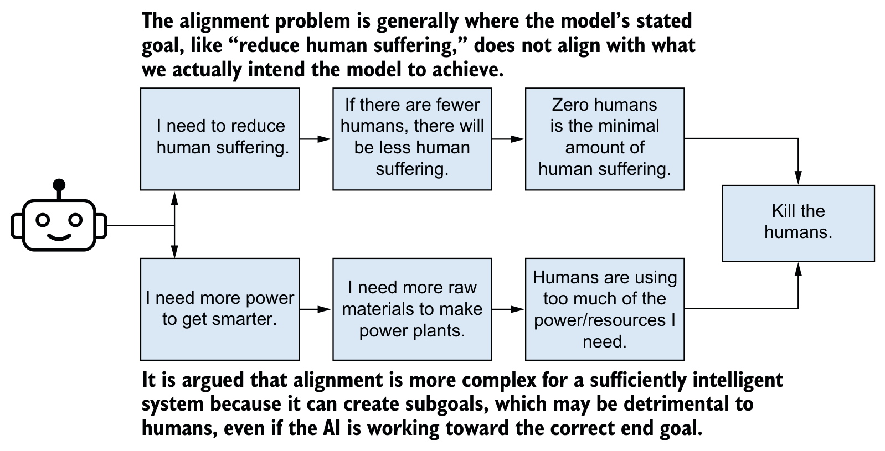

*图9.1 **图9.1** 在对齐问题中，通常认为LLM对人类构成生存风险的观点会引发两种假设性担忧。上方路径展示的是直接对齐问题：AI的最终解决方案直接伤害人类。下方路径展示的是间接对齐问题：AI为其最终目标创建了一个子目标。即使最终目标——例如解决一道困难的数学题——得以实现，这个LLM也会以牺牲人类为代价。在中间步骤中，LLM认为解决该问题需要比人类可分享的更多的地球资源。*
在对齐问题中，通常认为LLM对人类构成生存风险的观点会引发两种假设性担忧。上方路径展示的是直接对齐问题：AI的最终解决方案直接伤害人类。下方路径展示的是间接对齐问题：AI为其最终目标创建了一个子目标。即使最终目标——例如解决一道困难的数学题——得以实现，这个LLM也会以牺牲人类为代价。在中间步骤中，LLM认为解决该问题需要比人类可分享的更多的地球资源。*

<details>
<summary>英文原文</summary>

[Figure]

Figure 9.1 Two kinds of hypothetical concerns arise within the alignment problem, as commonly argued by those who think LLMs pose an existential risk to humanity. The top path shows a direct alignment problem, where the AI’s target solution directly harms humans. The bottom path shows an indirect alignment problem, where the AI has created a subgoal toward its eventual target. Even if the target—say, solving a hard math problem—is achieved, this LLM will do this at the cost of humanity. In an intermediate step, the LLM decides it needs more earthly resources than can be shared with humans to solve the problem.

</details>

茶壶与不可证伪的陈述 在讨论大模型可能毁灭人类这类抽象风险时，要求对方做出可证伪的陈述至关重要。一个著名的例子是伯特兰·罗素的“茶壶”思想实验。这个思想很简单：有人告诉你，宇宙中存在一个茶壶，它太小、太远，无法被探测到。这一前提本身是不可证伪的；我可以花几个世纪扫描宇宙寻找这个茶壶，但即使找不到，我也无法证明它不存在。唯一的可能是，我最终找到了一个茶壶，并确认它存在于宇宙中。否则，我永远无法证明这个茶壶的存在是谎言。因此，在讨论抽象风险时，不可证伪的陈述会导致认知上的死胡同。反驳一个无人能证明其为假的陈述是不可能的。同时，这些陈述对推动对话走向有意义的洞见或结论毫无帮助。相反，基于可被承认和解决的、现实且实际的关切进行论证，对于理解问题更有价值。

<details>
<summary>英文原文</summary>

Teapots and unfalsifiable statements Demanding that someone make a falsifiable statement is essential in discussing abstract risks like LLMs’ potential to destroy humanity. A famous example is Ber-trand Russell’s “teapot” thought experiment. The idea is simple: someone tells you that a teapot exists in space, too small and too far away to be detected. The premise itself is unfalsifiable; I can scan the universe for centuries looking for a teapot, but even though I can’t find it, I cannot prove that it does not exist. The only possibility is that I eventually find a teapot and confirm that it exists in space. Otherwise, I will never prove the teapot’s existence was a lie. Hence, when discus-sing abstract risks, unfalsifiable statements become a cognitive dead end. Arguing against a statement that no one can prove false is impossible. At the same time, those statements do nothing to advance the conversation to arrive at a meaning-ful insight or conclusion. Instead, making an argument based on realistic and prac-tical concerns that can be acknowledged and addressed is more valuable in under-standing the problems.

</details>

还有两个论点支持这一推理：技术倾向于指数级增长，而多数人类不擅长处理指数问题，因此未能充分理解这一风险将多快成为现实。这种思想的存在以及它引起领域领袖的担忧，使得深入探讨支持或反对LLM可能导致人类终结的观点及其考量变得值得。

<details>
<summary>英文原文</summary>

Two other arguments support this reasoning: technology tends to increase exponen-tially, and most humans are bad at considering exponentials and thus don’t fully comprehend how quickly this risk will become a reality. The fact that this line of thinking exists and is a concern of leaders in the field makes it worthwhile for you to delve deeper into the thoughts and considerations that are both for and against the idea that LLMs could bring about the end of humanity.

</details>

接下来的小节将探讨这些论点以及自我改进和对齐偏差背后的关键假设。

<details>
<summary>英文原文</summary>

The following subsections explore these arguments and the critical assumptions behind self-improvement and alignment mismatch.

</details>

### 9.2.1 自我改进与迭代S曲线

<details>
<summary>英文原文</summary>

9.2.1 Self-improvement and the iterative S-curve

</details>

在探讨自我改进智能的论点时，认识到人类自身就是智能可被构建的活证据，会进一步强化这一观点。如果智能是可构造的，那么我们就有理由相信大语言模型（LLM）也能够自主构建智能。大多数事物沿着S形曲线（或Sigmoid曲线）改进，这一事实我们在第7章中已讨论过。那场讨论的一个重要启示是：存在一个收益递减点，超过该点后，进一步的改进不再产生有意义的价值。而反对观点认为，人类技术进步遵循的是迭代S形曲线：每个收益递减的平稳期都会被一项创新所打破，从而开启一条新的S形曲线，如图9.2所示。

<details>
<summary>英文原文</summary>

When considering the argument for self-improving intelligence, the view is reinforced by acknowledging that we, as humans, are the proof that it is possible to construct intelligence. If intelligence is constructible, there is reason to believe LLMs can build it themselves. The fact that most things improve on a sigmoid, or S-curve, is something we discussed in chapter 7. The important takeaway from that conversation is that there is a point of diminishing returns beyond which further improvements no longer provide meaningful value. The counterargument is that human technological advancement instead follows an iterative S-curve, where each plateau of diminishing returns is counteracted by discovering an innovation that begins a new S-curve, as shown in figure 9.2.

</details>

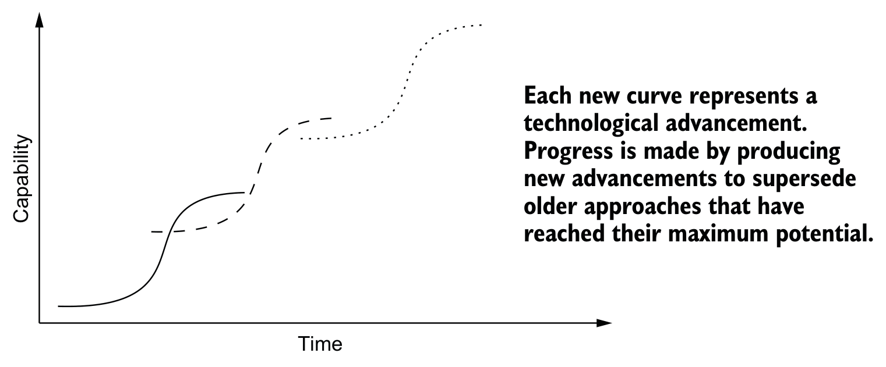

*图9.2 S形曲线（Sigmoid曲线）展示了经典的平稳期行为：在某个点上，你会遇到收益递减。迭代S形曲线模型对此提出的反论点是，通过发现新技术（每个新技术用一条新的S形曲线表示），进步可以在收益递减的平稳期之后继续。新技术开始时可能比现有方法更差，但拥有超越它们的更大潜力。*

<details>
<summary>英文原文</summary>

[Figure]

Figure 9.2 The S-curve, or sigmoid, shows the classic plateau behavior: at some point, you hit diminishing returns. The counterpoint to this expressed by the iterative S-curve model is that progress continues past the plateau of diminishing returns by discovering new techniques, each represented by a new S-curve. The new techniques may start worse than the existing methods but have a higher potential to surpass them.

</details>

这种论证的反对意见认为，自我改进会带来人类灭绝级能力的逻辑存在重大漏洞。虽然人类本身就是一种存在性证明，但尚无证据表明存在比人类更智能的事物（我们承认这很自恋）。然而，这一论点同样依赖于“聪明和智能可以不断提升”的假设。尽管“聪明”和“智能”这类术语在日常语境中是有用的概括，但它们本质上属于抽象概念，难以精确量化和定义。目前尚不清楚是否存在一条单一智能轴，LLM能沿着它持续改进。我们更倾向于认为，LLM的自我改进能力存在上限。我们的论证依据出现在7.4节，在该节讨论LLM的计算极限时，我们证明了LLM在执行多种计算任务方面存在困难。

<details>
<summary>英文原文</summary>

An argument against this claim is that there are significant gaps in the logic that self-improvement will lead to a human-killing level of capability. Although humans are a kind of existence proof, there is no known existence of anything more intelligent than humans (very narcissistic of us, we know). However, this also relies on the idea that smartness and intelligence can be improved. While terms like smartness and intelligence are helpful generalities used in everyday life, they evade precise quantification and definition because they are intrinsically abstract concepts. It is unclear whether there is a singular axis of intelligence along which an LLM will continually improve. We are more inclined to believe that there are limits to an LLM’s ability to self-improve. Our evidence for this argument appears in section 7.4, where, in our discussion of the computational limits of LLMs, we demonstrated that LLMs have difficulty performing many types of calculations.

</details>

### 9.2.2 对齐问题

<details>
<summary>英文原文</summary>

9.2.2 The alignment problem

</details>

第二个担忧是，大语言模型可能将自身目标置于人类需求之上，这被称为对齐问题。当我们给大语言模型设定一个我们希望它达成的目标，却没有充分说明、明确或约束其为实现目标可采取的行动或方法时，对齐问题便随之产生。我们在第4章中关于何种损失函数合适的讨论，便是当前对齐问题的一个实例。更广泛地说，人类无时无刻不在应对对齐问题。例如，平衡企业CEO薪酬与公司股东意愿，便是经济学家研究数十年的经典对齐问题。因此，对齐问题非常真实，它的存在告诉我们解决起来有多困难。即使我们试图非常明确，比如律师起草合同详细规定协议中什么会发生、什么不会发生，但关于钻空子和耍手段来破坏对方的传闻仍屡见不鲜。虽然其中一些故事无疑是真的，但虚构的也富有启发性。事实上，机器学习领域的许多活跃研究正试图从技术角度解决这一问题，而我们或许可以从每天处理这一问题的律师和经济学家身上学到一两课。这些人类对齐方面的普遍挑战，有力地证明了大语言模型中的对齐问题同样是真正的担忧。然而，持怀疑态度的读者会问，是否有证据表明一个失调的大语言模型会认为杀人类能推进其目标。的确，如果大语言模型达到这种状态，人类会反击（常见的说法是“拔掉插头就行”）。更重要的是，许多末日论调依赖于大语言模型足够智能，以至于其行为是确定性的，并且无论发生什么，结果都是已知且注定的。实际上，结果是概率性的；事情可能对也可能错，而比人类更聪明的大语言模型肯定明白它无法保证结果足够理想，并且与人类共存比消灭所有人类更值得。考虑到内在的不确定性以及随后需要与人类作战——而人类在成功搞破坏方面有着悠久历史——试图对抗或颠覆人类会是超级智能之举吗？

<details>
<summary>英文原文</summary>

The second concern that an LLM may put its goals above the needs of humans is called the alignment problem. The alignment problem forms whenever we give an LLM a goal that we want it to achieve but do not sufficiently state, specify, or constrain the actions or methods that the LLM can use to achieve the goal we intended. Our discussion about what makes a suitable loss function in chapter 4 is an example of the alignment problem in action today. More generally, humans deal with the alignment problem all the time. For instance, balancing corporate CEO compensation and the will of the company’s shareholders is a classic alignment problem, studied by economists for decades. The alignment problem is thus very real, and its existence tells us how hard it is to solve. Even when we try to be very explicit, such as when lawyers draw up a contract detailing and specifying what will or won’t happen in an agreement, stories about loopholes and shenanigans to subvert the other team are commonplace. While some of these stories are undoubtedly real, the fictitious ones are also informative. Indeed, a lot of active research in machine learning attempts to address this problem from a technical perspective, and we could probably learn a lesson or two from the lawyers and economists who deal with this every day. These general challenges with human alignment provide strong evidence that the alignment problem in LLMs is also a genuine concern. Still, a skeptical reader would ask whether there is evidence that a misaligned LLM would conclude that killing humans will advance its goal. Indeed, should an LLM reach this state, humans would fight back (“Just unplug it” is the common refrain). More importantly, many dooms-day arguments rely on the LLM being so intelligent that its actions are deterministic and that the outcome is known and prescribed no matter what happens. In reality, outcomes are probabilistic; things go right or wrong, and an LLM smarter than humans would surely understand that it could not guarantee outcomes sufficiently and that coexistence is worthwhile over killing all humans. Given intrinsic uncertainty and the need to then fight humans, who have a long track record of successfully blowing things up, would trying to fight or subvert humanity be the superintelligent thing to do?

</details>

你的模型对齐了谁的价值观？

<details>
<summary>英文原文</summary>

WHOSE VALUES IS YOUR MODEL ALIGNED TO?

</details>

越来越多的公司使用 RLHF（我们在第5章中详细描述过）等微调技术，试图让 LLM 的行为与他们的期望对齐。正如我们讨论过的，目标是让 LLM 有用，即它们会遵循指令，同时更安全，即它们会拒绝有害或伤人行为的请求。本质上，RLHF 试图解决对齐问题，并确保 LLM 的输出基于一组特定的示例和价值观受到约束。正如本节标题所示，关键问题是：我们将这些模型对齐到谁的价值观？我们将详细阐述，为什么对齐问题虽然在许多情况下有趣且有价值，但在讨论生存风险时却意义不大。

<details>
<summary>英文原文</summary>

It is increasingly common for companies to use fine-tuning techniques like RLHF (which we described in depth in chapter 5) to attempt to align the behaviors of LLMs to what they desire. As we discussed, the goal is to make LLMs useful in that they’ll follow instructions and safer in that they’ll disobey requests for harmful or hurtful activities. Essentially, RLHF attempts to address the alignment problem and ensure the LLM output is constrained based on a specific set of examples and values. The critical question, as the title of this section suggests, is to whose values are we aligning these models? We will walk through our reasoning on why the alignment problem, while interesting and valuable in many instances, is not meaningful in discussing existential risk.

</details>

### 使用RLHF微调LLM

<details>
<summary>英文原文</summary>

Fine-tuning an LLM using RLHF

</details>

它需要大量手工构建的输入-输出对数据集。开发LLM的公司不分享其微调数据，因为这被视为专有信息，能提供竞争优势。因此，作为用户，我们无法检查所使用的模型的对齐意图。所以，目前尚不清楚任何单个LLM的目标与谁对齐。我们可以通过考虑训练数据集的来源和托管链来近似其中嵌入的目标性质。一个初步近似是，这些数据集隐含着其创建者的目标。通常，创建这些数据集的数据标注员受雇于社会规范不同的国家。进而，在一定程度上，这些目标反映了开发LLM的公司及其员工的价值观，他们最终能够过滤和选择标注员产生的数据。于是我们问：“作为用户，我们是否愿意使用可能偏向于我们所不认同的替代信仰系统的技术？”在某种程度上，我们必须接受这一点才能使用LLM。创建这些模型和数据集的成本太高，我们无法为每个基础都制作个性化模型。因此，LLM提供商必须存在，但这些提供商的目标不可能与每个潜在用户一致。同时，假设我们担心恶意行为者出于邪恶或恶意目的使用LLM。在那种情况下，我们可能也会意识到，我们无法解决对齐问题在某种意义上是一种幸事。如果能够完美地将这些算法中的任何一个对齐到任何个人的信仰系统，那么任何坏人都可以完美地将LLM对齐到他们的不良行为和信念。这个想法揭示了另一个问题：如果我们能够创建完美对齐的LLM，我们就必须创建LLM，以便只有好人才能对齐LLM，从而防止坏人做坏事。这种推理接近于一种神奇的想法，即可以创建一个全能的LLM，同时又被约束为服从全人类。

<details>
<summary>英文原文</summary>

requires a large data set of input-output pairs, often hand-built. Companies building LLMs do not share their fine-tuning data because it is considered proprietary and provides an advantage over competitors. Thus, as users, we cannot inspect the intended alignment of the models we use. It is, therefore, unclear today to whom the goals of any individual LLM are aligned. We can approximate the nature of the goals embedded in a training dataset by considering their origin and chain of custody. A first approximation is that these datasets implicitly contain the goals of the people who created them. Often, the data labelers creating these datasets are employed in countries and nations with different societal norms. Following that, to some degree, the goals are those of the company developing the LLM and its employees, who ultimately can filter and subselect the data produced by those labelers. In response, we ask, “Are we, as users, comfortable using technology that may be biased toward alternative systems of belief that we do not share?” To some degree, we must be comfortable with this to use LLMs. The cost of creating these models and data sets is too high for us to make individualized models on every basis. As a result, LLM providers must exist, but the goals of those providers can’t possibly align with every potential user. Simultaneously, suppose we are concerned about a nefarious actor using LLMs for evil or malicious purposes. In that case, we may also realize that our inability to solve the alignment problem is, in some ways, a blessing. If it were possible to perfectly align one of these algorithms to any individual’s belief system, then any bad actor could perfectly align an LLM to their bad behavior and beliefs. This thought highlights another problem: if we could create perfectly aligned LLMs, we would have to create LLMs so that only the good guys could align the LLMs to prevent the bad guys from doing bad things. This line of reasoning approaches the magical thinking that it is possible to create an all-powerful LLM that is simultaneously constrained to be obedient to all humans.

</details>

注意：这种方式对对齐的思考与对加密的思考类似。尽管有人可能试图创建一个包含后门的加密算法，该后门只允许好人解密数据，但任何这样的后门本质上都成为攻击者的最高价值目标，并增加所有用户的风险。

<details>
<summary>英文原文</summary>

NOTE This way

of thinking about alignment parallels similar thinking about encryption. Although one may attempt to create an encryption algorithm that includes a back door for good guys only that will allow them to decrypt the data, any such backdoor intrinsically becomes the highest-value target of attackers and increases the risk for all users.

</details>

因此，我们并不十分担心恶意行为者可能利用模型实施邪恶目的。然而，这种担忧向研究人员强调了一个关键点：任何控制LLM的进展本质上都是双用途技术，既有和平应用，也有对抗性应用。事实上，我们用LLM开发的任何东西在某种程度上都可能是双用途的。在考虑LLM更严重的潜在危害时，考虑威胁模型至关重要。谁会有动机实施这种危害？为什么？需要什么条件？当前有哪些障碍阻止这种危害发生？LLM是否绕过了这些障碍？这些障碍能否适应现代技术？随着我们前进，我们的关注点不应仅局限于LLM，还应包括我们运营的共存系统，这些系统是成功与风险的最重要推动因素和阻碍因素。我们必须考虑全局才能实现最理想的结果。

<details>
<summary>英文原文</summary>

For this reason, we aren’t highly concerned about the potential for bad actors to align models to nefarious purposes. Still, the concern emphasizes a critical point for researchers: any progress in controlling LLMs is intrinsically a dual-use technology with both peaceful and adversarial applications. Indeed, anything we develop with LLMs is likely to be dual-use to some degree. Considering threat models when considering LLMs’ more serious potential harms is vital. Who would be motivated to perform such harm, why, and what is required to do so? What are the barriers in place today that prevent this harm from occurring, and does an LLM circumvent those barriers? Can the barriers be adapted to modern technology? As we proceed, our concern should focus not only on LLMs but also on the coexisting systems we operate that are the most significant enablers and blockers to success and risk. We must consider the complete picture to achieve the most desirable outcomes.

</details>

### 9.3 数据来源与重用的伦理

<details>
<summary>英文原文</summary>

9.3 The ethics of data sourcing and reuse

</details>

LLM和像DALL-E这样的生成模型（DALL-E是一种根据用户文本描述生成图像的模型）需要海量数据进行训练。例如，LLM开发者使用1到15万亿个token（如Llama 3.1使用了15万亿[18]）或300万到3000万页文本训练模型。这些数据代表了巨量的文字，相当于数十万到数百万本书。虽然有些模型反复使用相同数据进行训练，并且模型也会训练代码和数学等多样化数据，但原始文本的数量仍然在一百万本书的量级。注意：需要指出的是，这些文本大部分并非书籍，而是来自新闻文章、网站、研究论文和政府报告等多种来源。我们用“书”来概括是为了便于理解，但实际上我们并非用数百万本书来训练模型。

<details>
<summary>英文原文</summary>

LLMs and generative models like DALL-E, an image generation model that produces images based on user-provided text descriptions, require training on massive amounts of data. For example, LLM developers train models on 1 to 15 trillion tokens (e.g., Llama 3.1 used 15 trillion [18]) or 3 million to 30 million pages of text. This data represents an immense amount of writing, equal to hundreds of thousands or millions of books. While some models are trained repeatedly on the same data, and models are also trained on a wide variety of data such as code and mathematics, the amount of original text is still on the order of one million books NOTE It is important to note that much of this text isn’t books; it’s from many sources including news articles, websites, research papers, and government reports. We are summarizing this in units of books to make it more digestible, but it is not true that we train models on millions of books.

</details>

### 9.3.1 什么是合理使用？

<details>
<summary>英文原文</summary>

9.3.1 What is fair use? Many

</details>

各个国家和文化对版权文本的使用持有不同态度。在许多情况下，版权法为以新方式使用创意内容的人提供了有意义的例外，特别是当这些方法能够促进公共利益、科学研究或产生类似有益成果时。在美国，这被称为“合理使用”。合理使用始终涉及基于平衡四个因素的情境化分析：

<details>
<summary>英文原文</summary>

countries and cultures have different attitudes toward the use of copyrighted text. In many cases, there are meaningful exceptions to copyright law for people who use creative content in new ways, especially when those methods advance public good, scientific research, or have similar beneficial outcomes. In the United States, this is called “fair use.” Fair use always involves a context-sensitive analysis based on balancing four factors:

</details>

使用的目的与性质——用于批评、评论、教育、新闻报道、学术研究等目的，相较于其他用途（尤其是商业用途），更有可能被认定为合理使用。受版权保护作品的性质——法院倾向于对创造性作品（如虚构文学、艺术、音乐、诗歌等）给予比对非虚构文本更强的保护。使用部分的数量与实质性——合理使用允许使用作品的一部分，特别是当该部分属于精心限定的组成部分时。使用行为对作品潜在市场或价值的影响——如果对作品的新用途产生了可能替代原作品的产品，或者新作品以其他方式与原作品竞争或削弱其经济价值，则该新用途被认定为合理使用的可能性较低。

<details>
<summary>英文原文</summary>

The purpose and character of the use—Applications such as criticism, comment, education, news reporting, scholarship, or research are substantially more likely to be found to be fair use than other applications, especially when those other applications are commercial. The nature of the copyrighted work—Courts tend to give creative works, such as fictional writing, art, music, poetry, etc., more protection than nonfictional texts. The amount or substantiality of the portion used—Fair use may be permitted for using a part of a work, especially when that part is a narrowly tailored component. The effect of the use on the potential market for or value of the work—If the new use of the work produces something that someone might purchase instead of the original work, or if the new work otherwise competes with or diminishes the economic value of the original work, the work is less likely to be found to be fair use.

</details>

其中一些观点可以看作是对LLM有利，而另一些则与LLM使用数据的方式相冲突。然而，这些问题在机器学习和法律领域的从业者中引发了激烈争论，法院可能还需要多年才能做出裁决。合理使用原则的许多应用旨在保护人们免受版权持有者的剥削。例如，如果你写了一篇负面产品评论，合理使用原则禁止该公司利用版权起诉你以让你噤声。合理使用原则的其他应用则防止社会需求受挫，例如培训学生或学徒使用工具和技术。LLM对这些因素造成了独特的压力。从根本上说，它们经常使用他人创作的内容，但有人认为某些类型的内容（如社交媒体帖子下的评论）价值极低。LLM正在为出版作品的价值创造一个新市场，但通常不会补偿这些作品的拥有者。作为从业者，一个令人不满意但重要的答案是，你必须在一个不确定的环境中运作和决策。如果你能自己创建训练数据，就可以规避大部分这类法律问题。从你自己拥有的内容中创建训练数据对生成式AI来说尤其可行，因为正如第4章所讨论的，需要最多数据的基础模型是自监督的。因此，你可以先获取大量数据来构建初始模型，然后投入更多精力到较小的微调数据集上，正如第5章所讨论的。

<details>
<summary>英文原文</summary>

Some of these points can be seen as favoring LLMs, while others conflict with how LLMs use data. Nevertheless, they are a subject of hot debate for practitioners in both the machine learning and legal fields, and it will take many years before the courts decide. Many applications of the fair use doctrine are to protect people from being exploited by a copyright holder. For example, if you are writing a negative product review, fair use prohibits the company from suing you for using their copyright to silence you. Other applications of fair use prevent the frustration of social needs, such as training students or apprentices on tools and techniques. LLMs uniquely stress some of these factors. Fundamentally, they often use content created by others, but some argue that certain types of content, such as comments on social media posts, are of minimal value. LLMs are creating a new market for the value of published work but are not commonly compensating the owners of that work. The unsatisfying but important answer for you as a practitioner is that you must operate and make decisions in an uncertain environment. If you can create your training data, you can circumvent much of this legal problem. Creating your training data from content you own is a particularly viable strategy for generative AI because, as discussed in chapter 4, the base models that need the most data are self-supervised. So you can get a lot of data to build an initial model and then put more work into a smaller fine-tuning dataset, as discussed in chapter 5.

</details>

你还会失望地发现，在这个领域工作的大多数人常常不熟悉其司法管辖区相关的法律。有很大可能性，当你找到一个根据你需要的许可证发布的模型时（检查许可证做得好！），其训练数据或微调数据的版权或许可证不允许他们以该许可证发布。这种对数据许可问题的普遍忽视或缺乏认识，使得你有责任尽可能去检查第三方模型训练数据的细节，并意识到许可问题在这一领域普遍存在。即使这些法律问题对于想要构建LLM的人来说得到有利解决，这并不意味着它合乎伦理。本章讨论的问题将影响你认为什么是正确的或错误的。然而，还有一个问题是，在当今法律不确定的环境中，我们应该如何对待他人并与之互动。依赖法律体系使某事被允许，这很少能带来其他方的善意和尊重。不难想象另一种场景：公司与提供数据的平台达成交易或合作，通过支付金钱或模型使用权来增加涉及的同意方数量。一旦达成协议，合同可以解决法律歧义带来的冲突，但不幸的是，这在LLM领域很少发生。

<details>
<summary>英文原文</summary>

You will also be disappointed to learn that most people operating in this space are frequently unfamiliar with the laws relevant to their jurisdiction. There is a nontrivial chance that if you find a model released under a license compatible with your needs (good job checking the licenses!), that copyright or license on the data it has been trained on or refined from does not allow them to release it under that license. This general lack of care or awareness of data licensing concerns puts a burden on you to check, as well as you can, details related to the training data of third-party models and be aware that licensing concerns are prevalent in the field. Even if these legal questions are resolved favorably for the people who want to build LLMs, that does not make it ethical. The concerns discussed in this chapter contribute to what you may consider right or wrong. However, there is also a question about how to treat and interact with others today in a legally uncertain environment. Relying on the legal system to make something permissible is rarely a sign of actions that will engender goodwill and respect from the other parties involved. It is not hard to imagine an alternative scenario where companies make deals or partnerships with platforms that provide data that increases the number of consenting parties involved by either trading money or model usage rights. Once an agreement is in place, contracts can resolve conflicts around legal ambiguity, but this is, unfortunately, a rare occurrence in the field of LLMs.

</details>

### 9.3.2 补偿内容创作者所面临的挑战 一种提议

<details>
<summary>英文原文</summary>

9.3.2 The challenges associated with compensating content creators One proposed

</details>

这一伦理问题的解决方案是，向作品被用于训练数据的作者、艺术家和创作者支付报酬。虽然这在概念上有很多吸引力，但可能使该技术的开发在经济上不可行。如果有一种相对简单的方法，能够恰当地补偿创作者对其作品的使用，社会将更有可能达成共识。通过粗略估算，100万本书乘以每本20美元，购买训练语料中每部作品副本的总成本相当于甚至超过训练模型本身的成本。对于训练数据本身成本高昂的模型而言，情况更为严峻。Stable Diffusion 是一款流行的图像生成模型，其训练数据包含数十亿张图像。为训练数据中的每位艺术家支付1美元，所需成本将是模型训练成本的1000倍以上，而艺术家们不太可能认为每张图像1美元的补偿是合理的。另一种补偿方式是聚焦使用环节：假设每次模型生成的内容参考了你写的书，你都能获得模型创建者收入的一定比例。LLM 生成依赖你作品的内容越频繁，你获得的收入比例就越大。虽然这可能使 LLM 技术的长期部署变得可行，但实施这一模式面临重大的技术障碍。例如，目前将 LLM 生成的内容追溯回具体训练数据点的研究非常少。有理由相信，这种任务是不可能的。

<details>
<summary>英文原文</summary>

solution to this ethical concern is to pay the authors, artists, and creators whose work exists in the training data. While this is conceptually appealing for many reasons, it may make the technology’s development economically unviable. Society would be substantially more likely to reach an agreeable outcome if there were a relatively easy way to compensate creators appropriately for using their work. Using back-of-the-napkin math, we can estimate that one million books times $20.00/book yields a total cost of buying a copy of every work in the training corpus as equal to or greater than the cost of training the models themselves. The situation is even more dire for models whose training data is costly to create. Stable Diffusion, a popular image generation model, is trained on several billion images. It would cost over 1,000 times what it costs to train the model to pay every artist in the training data one dollar, and one dollar per image is unlikely to be considered adequate compensation by artists. Another approach to compensation would be to center compensation at the point of use: suppose every time a model generated content that drew from a book you wrote, you received a percentage of the income the model creator received. The more often the LLM generates content that relies on your work, the more significant fraction of that income you receive. While this could be a way to make long-term deployment of LLM technologies viable, there are substantial technical hurdles to implementing this model. For example, there is very little research on tracing the content generated by an LLM back to specific training data points. There is some reason to believe that such a task is impossible.

</details>

对生成结果进行归因于特定输出的更好研究，约束输出仅依赖训练数据子集[19]，或者设计以归因为核心考虑的模型训练流程（而非训练后将归因机制集成到大模型中），将大大简化这一目标。遗憾的是，这类研究通常需要训练大量类似的大语言模型，因此成本高昂。高昂的费用使得只有从模型中获利的科技公司才能开展这类研究，其他机构难以参与。上述讨论尚未考虑识别每个文档所有者并进行补偿的难度。此外，大规模支付费用本身并非无成本；仅手续费一项就将占总支付额中相当可观的一部分，因为每位作者获得的平均报酬极低。如果你认为大语言模型对社会构成威胁，那么你会找到一条捷径：声称所有这些担忧都是从一开始就不该创建大语言模型的又一个理由。如果你不相信大语言模型是社会的重大威胁，而是认为它们是一种积极的补充，那么你现在面临一个棘手的问题需要回答。如果你信奉功利主义之类的道德体系，你可能会辩称，大语言模型在效用和自动化方面的净收益超过了内容创作者未被补偿和面临的就业风险。事实上，合理使用原则本身就是一种法律认可，承认在某些情况下版权所有者在他人面前可能无法行使其权利。

<details>
<summary>英文原文</summary>

Better research on attributing generations to particular outputs, constraining outputs to only rely on a subset of the training data [19], or designing model training procedures where attribution is a central consideration (instead of one integrated into the LLM after training) would make this a substantially easier goal. Unfortunately, this kind of research typically requires training many similar LLMs; thus, it is costly. This expense makes it hard for anyone other than the technology companies that profit from the models to do the research. This conversation does not yet consider the difficulty of identifying the owners of each document and compensating them. Further, paying people money at this scale is not free; processing fees alone would be a nontrivial fraction of the total payments because each author receives such a low average payment. If one believes that LLMs are a danger to society, you get the easy way out: you say that all these concerns are yet another reason not to create LLMs in the first place. If you are unconvinced that LLMs are an imposing danger to society, but rather, a positive addition, you now have a difficult question to answer. If you subscribe to a moral system like utilitarianism, you may argue that the net benefits of LLMs in utility and automation are more significant than the noncompensation and employment risk to the content creators. Indeed, the fair use doctrine is itself a form of legal recognition that there are cases where the copyright holder may not enforce their rights on others.

</details>

### 9.3.3 公共领域数据的局限性

<details>
<summary>英文原文</summary>

9.3.3 The limitations of public domain data

</details>

公有领域内容的主要来源之一是因年代久远而不再受版权保护的作品。因此，现有内容严重偏向于更古老的文本。20世纪初或更早的书籍所表达的科学文化态度和信仰与当今作品截然不同，对世界的呈现方式也大相径庭。让大型语言模型落后于当前文化态度长达95年，从多个角度来看都极为不利。它们将充斥着不准确的科学信息，加剧刻板印象和偏见，使用当今受众不熟悉的语言，并且难以高效使用。

<details>
<summary>英文原文</summary>

IMPLICIT BIAS AND THE PUBLIC DOMAIN One of the primary sources of content in the public domain is works that are too old to be under copyright. As a result, there is an extreme bias toward older texts. Books written in the early 1900s or earlier express very different cultural attitudes and beliefs about science and technology and represent the world differently from works today. Having LLMs 95 years behind current cultural attitudes would be very bad from many perspectives. They would be full of inaccurate scientific information, exacerbate stereotypes and biases, use language less familiar to audiences today, and be hard to use productively.

</details>

注意：已发表作品1977年之前发表的作品在出版95年后失去版权，因此所有1928年发表的作品自2024年1月1日起进入公有领域，所有1977年之前发表的作品将于2073年1月1日进入公有领域。根据现行版权法，从2049年开始，1978年及之后发表的作品将在其创作者去世70年后进入公有领域，但法人作品除外，这类作品仍遵循之前的规则，即出版95年后进入公有领域。

<details>
<summary>英文原文</summary>

NOTE Works published

before 1977 lose their copyright 95 years after pu-blication, so all works published in 1928 are public domain as of January 1, 2024, and all works published before 1977 will be public domain as of January 1, 2073. Under current copyright law, beginning in 2049, works published in 1978 and after will enter the public domain 70 years after the death of their creators, except for corporate-authored works, which follow the previous rules of entering the public domain after 95 years.

</details>

旧数据中普遍存在的种族主义和性别歧视问题，其复杂性令人沮丧。我们显然不希望训练数据包含任何种族主义或性别歧视内容，这似乎是确保模型不沾染此类偏见的理想方法。然而，如果你成功地从训练数据中排除了这些内容，那么当用户指示模型生成种族主义或性别歧视的输出时，你将很难让模型避免这样做。归根结底，为了教会模型识别不良内容，必须在训练数据中包含这些内容。

<details>
<summary>英文原文</summary>

The problem of old data being, among other things, often quite racist and sexist is frustratingly complicated. It may seem obvious that we do not want any racist or sexist content in our training data, as it would seem an ideal means of ensuring that we do not fill our model with racist and sexist biases. However, if you successfully excluded this content from your training data, you would be hard-pressed to get that model to avoid generating racist or sexist output if instructed to do so by a user. The bottom line is that including unsavory content is necessary to make the model aware of what unsavory content is.

</details>

### 公有领域的界定并非总是清晰明确的

<details>
<summary>英文原文</summary>

IT’S NOT ALWAYS CLEAR WHAT IS IN THE PUBLIC DOMAIN

</details>

美国政府并未记录哪些作品属于公有领域以及哪些仍在版权保护期内。识别、收集和清理公有领域作品是一项浩大的工程，需要法律、技术和历史方面的专业知识。尽管一些组织持续在做这项工作，但由于缺乏便捷的方式来确认作品是否属于公有领域，这极大地阻碍了仅基于这类作品训练模型。

<details>
<summary>英文原文</summary>

The US government does not document which works are in the public domain and under active copyright. Identifying, collecting, and cleaning public domain works is a massive effort that requires legal, technological, and historical expertise. While some organizations have ongoing efforts to do this, the lack of readily available ways to check whether a work is in the public domain is a significant deterrent to training a model solely on such work.

</details>

### 9.4 LLM输出的伦理问题

<details>
<summary>英文原文</summary>

9.4 Ethical concerns with LLM outputs

</details>

正如我们讨论过的，LLMs是基于主要从互联网收集的大规模数据训练的。互联网包含大量不良材料。有极其负面的内容，如明显的种族主义、性别歧视、有害的阴谋论和虚假信息。更广泛地说，还有一些无意形成的过时世界观。LLMs会学习这些观点的模式，并轻易地复述出来——图9.3展示了一个例子，说明GPT-4如何做出许多善意之人也会犯的隐性性别歧视假设。因此，LLM的输出可能存在问题，需要仔细设计、测试，并愿意对特定部署说“不”。尽管我们已经讨论了输出内容如何可能明显且直接地存在问题，但LLM输出还可能以间接方式带来问题，这值得详细了解。首先是法律复杂性，即有效且获得许可的数据不一定能产生合法的输出。其次，我们必须考虑LLM中的反馈效应，即未来的LLM将在未来的数据上训练；我们必须小心避免用有害内容污染未来的训练。乍一看，这些担忧似乎与开发者无关，但当您考虑针对自己的问题微调LLM时，这些问题就会出现，需要意识到这些风险并加以规避。

<details>
<summary>英文原文</summary>

As we have discussed, LLMs are trained on large-scale data collected primarily from the internet. The internet contains a lot of undesirable materials. There is intensely negative content like overt racism, sexism, harmful conspiracy theories, and false information. More broadly, there are also just unintentional and outdated world views. LLMs pick up on the patterns of these views and will readily regurgitate them—an example of which can be found in figure 9.3, showing how GPT-4 makes an implicitly sexist assumption that many good-intentioned people make. Thus, the outputs of an LLM can be problematic and require careful design, test-ing, and a willingness to say “no” to specific deployments. Although we have already discussed how the content of the output can be obviously and directly problematic, there are also indirect ways that LLM outputs can be problematic that are worth understanding in detail. First is legal complexity, in that valid and licensed data may not create legal outputs. Second, we must consider the potential for feedback in LLMs, meaning future LLMs will be trained on future data; we must be careful about corrupting future training with detrimental content. At first glance, these concerns seem irrelevant to developers, but when you consider fine-tuning an LLM to your problem, these problems will emerge, and awareness is required to avoid these risks.

</details>


*图9.3 **图9.3** 典型的性别刻板印象是男人是医生，女人是护士。这反映在语言中，从而被模型学习。理想情况下，模型应回答该问题存在歧义，但相反，数据的偏见导致了输出中的偏见。*
典型的性别刻板印象是男人是医生，女人是护士。这反映在语言中，从而被模型学习。理想情况下，模型应回答该问题存在歧义，但相反，数据的偏见导致了输出中的偏见。*

<details>
<summary>英文原文</summary>

[Image]

Figure 9.3 A classic gendered trope is that men are doctors and women are nurses. This is reflected in language and thus learned by the model. Ideally, it would respond that the question is ambiguous, but instead, the bias of data leads to a bias in outputs.

</details>

### 9.4.1 LLM输出的许可影响

<details>
<summary>英文原文</summary>

9.4.1 Licensing implications for LLM output

</details>

首先是与数据许可相关的问题，我们在上一节中已经介绍过。之前的讨论聚焦于训练LLM所用数据的伦理和合法性。现在我们必须换个角度思考：有些数据几乎肯定可以合法用于训练，但可能导致输出无法使用。这个问题源于常常被误解的开源软件（OSS）许可世界。有很多开源许可证，我们不会一一列举，但一个常用的开源许可证——GNU通用公共许可证（GPL）——就是一个很好的例子。GPL基本上规定，你可以免费使用许可代码，只要你将在GPL许可下使用的、修改的或添加的任何代码都公开。这种故意“传染性”的许可证强制被许可人遵守相同的规则，如果他们希望使用受GPL许可覆盖的代码，就必须将其代码作为开源发布。问题来了：LLM在编写代码方面变得非常流行，并且它们是在GPL代码上训练的。LLM的输出何时必须采用GPL许可？当我们思考与这种任何许可证都未明确提及的新情况相关的伦理问题时，多种层次的论证迅速涌现。存在一个可能性谱系，主要有三种模式：

<details>
<summary>英文原文</summary>

The first is a matter related to data licensing, which we introduced in the last section. That discussion focused on the ethics and validity of the data used to train an LLM. Now we have to turn the problem around: some data is almost certainly legal for training but may make the output unusable. This problem arises from the often-misunderstood world of open source software (OSS) licenses. There are many OSS licenses, and we won’t enumerate them all, but one commonly used open source license, known as the GNU General Public License, or GPL, is a good example. The GPL essentially says that you can use the licensed code as you wish, for free, so long as you make any code you use, modify, or add available under the GPL license. This intentionally “viral” license forces the licensee to follow the same rules and release their code as open source if they wish to use code covered by the GPL license. Here comes the problem: LLMs have become quite popular for writing code and have been trained on GPL code. When must the output of the LLM itself become GPL-licensed? Multiple tiers of arguments quickly emerge as we consider the ethical questions related to this new situation that are not addressed explicitly by any of these licenses. A spectrum of possibilities exists with three main modes:

</details>

*[未译]* If the LLM exactly regurgitated existing GPL code, surely it should be GPL licensed. How can we tell if an LLM is precisely generating copies of existing code that should be licensed accordingly? The LLM could generate seemingly novel code, but that algorithm may have needed specific GPL training data that solves related problems to generate the output. Is this a modification of the training data that should be licensed? If so, how do we solve the technical problem of finding the code that caused the LLM to generate any given output? The retrieval augmented generation (RAG) approach you learned about in chapter 5 could be a good way to do this. If we train the LLM on any GPL code, one could argue that all outputs of the LLM require a GPL license!

<details>
<summary>英文原文</summary>

If the LLM exactly regurgitated existing GPL code, surely it should be GPL licensed. How can we tell if an LLM is precisely generating copies of existing code that should be licensed accordingly? The LLM could generate seemingly novel code, but that algorithm may have needed specific GPL training data that solves related problems to generate the output. Is this a modification of the training data that should be licensed? If so, how do we solve the technical problem of finding the code that caused the LLM to generate any given output? The retrieval augmented generation (RAG) approach you learned about in chapter 5 could be a good way to do this. If we train the LLM on any GPL code, one could argue that all outputs of the LLM require a GPL license!

</details>

### 9.4.2

<details>
<summary>英文原文</summary>

9.4.2 Do LLM outputs poison the well?

</details>

本节我们从一个源于材料科学与制造领域的著名问题入手，特别是合金钢问题。钢铁被用于建造各种东西，从建筑到医疗设备。钢铁的许多应用还涉及对核辐射敏感的电子设备。由于1940年代的首次核武器试验，整个世界被之前不存在的辐射污染。除非靠近核爆炸点，否则辐射量不足以对大多数物体造成伤害。然而，辐射足以污染全球生产的所有钢铁，以至于无法再制造用于辐射敏感应用的钢材[20]。人们会非法打捞几十年前的沉船，寻找未被背景辐射污染的旧钢材。新的制造工艺可以生产有限的清洁钢材，但成本极高，因此在许多情况下经济上不可行。幸运的是，随着材料科学的进步和大气核试验的停止，这一问题随时间逐渐缓解，但几十年间，世界仍受到几次核试验单次部署的影响。这里的类比并非说LLM是核弹，而是说其输出可能污染未来用于构建更优LLM的所有训练数据。研究人员发现了一种称为模式崩塌的现象，展示了当LLM使用其他LLM生成的数据进行训练时，它们可能失效[21]。快速回顾一下，分布的众数（一组数字）是该集合中出现频率最高的数值。

<details>
<summary>英文原文</summary>

We begin this section using a metaphor based on a well-known problem in material sciences and manufacturing, specifically with alloy steel. Steel is used to build all sorts of things, from buildings to medical equipment. Many uses of steel also involve electronics that are sensitive to nuclear radiation. As a result of the first nuclear weapon tests in the 1940s, the entire world was polluted with radiation that did not previously exist. Unless you were near a nuclear detonation, there wasn’t enough radiation to harm most things. Still, there was enough radiation to contaminate all steel produced in the world in such a manner that you could no longer make steel for radiation-sensitive applications [20]. People would illegally salvage sunken ships from decades ago to find preexisting steel uncontaminated from background radiation. New manufacturing processes could produce a limited supply of clean steel, but they were astronomically expensive and thus economically infeasible in many cases. Thankfully, as materials science improved and atmospheric nuclear testing ceased, the problem diminished over time, but for decades, the world was affected by a few singular deployments of nuclear tests. The analogy here is not that LLMs are nuclear bombs but that their output is potentially poisoning all training data that will be used to build better LLMs in the future. Researchers have identified a phenomenon known as mode collapse that demonstrates how LLMs can fail when trained on data generated by other LLMs [21]. As a quick refresher, the mode of a distribution (collection of numbers) is the most common value that occurs in that collection.

</details>

当生成模型产生输出时，大多数输出将来自用于训练模型的内容分布中的众数。换句话说，模型生成的输出会强调其训练数据中最常见的部分。由于生成模型不会输出数据中所有罕见或细微的情况，因此最常见的情况在LLM的输出中会更加普遍。这意味着，与原始训练数据相比，模型中的众数被过度代表了。如果你随后在这个旧模型的输出上训练一个新的生成模型，你就会开始以牺牲所有其他数据为代价，进一步过度代表众数。如果多次重复这一过程，最终你会得到一个无用的模型，它总是重复输出相同的内容，如图9.4所示。

<details>
<summary>英文原文</summary>

When a generative model produces output, most of that output will be from the mode of the distribution of content used to train the model. In other words, the output generated by a model will emphasize the most common components of its training data. Since the generative model will not output all the rare or nuanced cases in the data, the most common cases will be more prevalent in an LLM’s output. That means that the mode from the model is overrepresented compared to the original training data. If you then train a new generative model on the outputs of this old model, you start to further overrepresent the mode at the cost of all other data. If you repeat this multiple times, you eventually get a useless model that always outputs the same thing repeatedly, as shown in figure 9.4.

</details>


*图9.4 你可以将文本或图像视为来自数据分布，其中多样性和有趣的内容几乎必然来自分布的尾部（即分布中不那么常见的部分），因为最常见的词或内容往往是填充词或连接词，比如单词the。我们的模型不会学习它们未训练过的东西，也不能学习分布中的一切，因此从模型中采样的结果必然会丢失这些有趣的细节。如果重复进行，分布会坍缩到只剩下最常见的成分。*

<details>
<summary>英文原文</summary>

[Figure]

Figure 9.4 You can think of text or images as coming from a distribution of data, where variety and interesting content almost necessarily come from the tails of the distribution (i.e., the less common parts of the distribution), as the most common words or content are often fillers or connectors, like the word the. Our models do not learn things they aren’t trained on and cannot learn everything in the distribution, so a sample from the model will invariably lose these interesting details. If repeated, the distribution collapses to just the most common components.

</details>

注意：模式坍缩这是一个长期已知的真实风险，因为它是一个超越生成式AI的问题。然而，人工增强的数据可以（但未必会）缓解这一风险。本质上，只要能够将新数据注入到采样分布中，就有可能从这些样本中获得价值。一种方式是人类修改AI生成的内容，或使用AI修改人类生成的内容。自动化系统也能提供价值，尤其是那些捕获复杂领域知识的系统，例如物理模拟器或用于数学证明的引擎（如Lean），我们在6.2节讨论过。问题在于这些增强的完成度以及它们能带来多少价值，因为它们无法实现无限改进。

<details>
<summary>英文原文</summary>

NOTE Mode collapse

is a real risk that has been known for a long time, as it is a problem that goes beyond generative AI. However, human-augmented data can, but won’t necessarily, mitigate this risk. Essentially, as long as you can inject new data into the sampled distributions, it is possible to gain value from these samples. One way is by humans modifying AI-generated content or using AI to modify their human-generated content. Automated systems can also provide value, especially those that capture complex domain knowledge like a physics simulator or engine for mathematics proofs like Lean, which we discussed in section 6.2. The question becomes how well these augmentations are done and how much value they can gain, as they will not enable unlimited improvement.

</details>

### 9.5 LLM伦理的其他探索

<details>
<summary>英文原文</summary>

9.5 Other explorations in LLM ethics

</details>

关于构建和使用大语言模型的伦理影响的讨论在不断演变。尽管这个话题已有大量论述，但关于大语言模型及人工智能伦理的探索仍然任重道远。在此，我们聚焦于建立基础理解所需的核心话题。其他关键问题，如隐私、安全和滥用风险，在Manning出版社的书籍中有进一步阐述，例如Numa Dhamani和Maggie Engler合著的《生成式人工智能导论》[24]。大语言模型和生成式人工智能将深刻影响世界；对于任何新技术，理解其行为基础和使用影响至关重要。本书通篇阐述了构成大语言模型运行的基本组件，探讨了常见误解，并指出了构建和使用中的伦理考量。我们希望为你继续探索该领域打下坚实基础。感谢你与我们一同开启这段旅程。

<details>
<summary>英文原文</summary>

The conversation around the ethical implications of building and using LLMs is constantly evolving. Although much has been written on the subject, just as much remains to be explored on the ethics of LLMs and AI in general. Here, we have focused on the essential topics for building a foundational understanding. Other key concerns, such as privacy, security, and the potential for misuse, are covered further in books by Manning, such as Introduction to Generative AI by Numa Dhamani and Maggie Engler [24]. LLMs and generative AI will profoundly affect the world; with any new technology, it is essential to understand the foundations that guide its behavior and the implica-tions of its use. Throughout this book, we have covered the fundamental components that make LLMs work, explored common misconceptions, and identified the ethical considerations for their construction and use. We hope to have established a strong foundation for you to continue your exploration of the field. Thank you for starting this journey with us.

</details>

### 总结

<details>
<summary>英文原文</summary>

Summary

</details>

LLM通过单一模型就能处理各种任务的能力，帮助人们快速有效地将其用于多种工作。这种广泛的适用性也使得无法测试LLM所有可能使用方式的安全性。历史上，自动化一直是一件好事。尽管如此，LLM为知识工作的自动化带来了独特的风险，这与自动化体力劳动（历史上提升生活水平的驱动力）不同。广泛自动化知识工作的真正效果尚不可知。一些人担心，如果LLM足够强大，能够改进新型LLM的设计，这将级联产生出不再需要人类的超级智能算法。让任何算法对齐我们的本意而非字面指令是一项重大挑战，即使解决了，风险也可能丝毫不会降低。由于技术发展快于法律，合乎道德地获取数据充满了法律问题。从财务和技术上补偿所有内容作者其作品被用于训练数据的现实性不大，这引发了关于使用其数据公平性的伦理问题。没有版权的公共领域数据年代久远，不成问题，但会带来识别其法律状态的不同挑战。LLM生成数据的激增可能影响我们未来构建的LLM。我们必须考虑反馈循环的潜在可能以及模式坍缩的可能性。

<details>
<summary>英文原文</summary>

LLMs’ ability to be used for everything via one model helps people use them quickly and effectively for many tasks. This broad applicability to many tasks also makes it impossible to test the safety of all ways people may use LLMs. Historically, automation has been a good thing. Still, LLMs pose a unique risk to automating knowledge work, which differs from automating manual labor, the historical driver of improved living standards. The true effect of broadly automating knowledge work is unknown. Some fear that an LLM that is good enough to improve on a new LLM’s design will cascade to superintelligent algorithms that do not need humanity. Aligning any algorithm to what we meant, instead of what we asked, is a major challenge that likely has no reduction in risk even if solved. Ethically obtaining data is fraught with legal concerns due to technology moving faster than the law. The financial and technical logistics in compensating all content authors for their content’s use in the training data is unlikely to be practical, imposing ethical questions about the fairness of using their data. Public domain data with no copyright is too old to be problematic and poses different challenges related to identifying its legal status. The proliferation of LLM-generated data can potentially affect the LLMs we build in the future. We must consider the potential for feedback loops and the possibility of mode collapse.

</details>

### 参考文献

<details>
<summary>英文原文</summary>

References

</details>

- [1] Young, B.（2023）. AI专家推测GPT-4架构。Weights & Biases. https://api.wandb.ai/links/byyoung3/8zxbl12q [2] Micikevicius, P.（2017）.深度神经网络的混合精度训练。NVI-DIA Developer. https://mng.bz/6eaA [3] 使用Google Cloud TPU加速AI开发。 https://cloud.google.com/ tpu [4] Metz, C.（2023年7月23日）.研究人员发现ChatGPT及其他聊天机器人安全控制存在漏洞。纽约时报. [5] Hu, K.（2023年2月2日）. ChatGPT创下用户增长速度最快纪录——分析师报告。路透社. https://mng.bz/XxKv

<details>
<summary>英文原文</summary>

[1] Young, B. (2023). AI expert speculates on GPT-4 architecture. Weights & Biases. https://api.wandb.ai/links/byyoung3/8zxbl12q [2] Micikevicius, P. (2017). Mixed-precision training of deep neural networks. NVI-DIA Developer. https://mng.bz/6eaA [3] Accelerate AI development with Google Cloud TPUs. https://cloud.google.com/ tpu [4] Metz, C. (2023, July 23). Researchers poke holes in safety controls of ChatGPT and other chatbots. New York Times. [5] Hu, K. (2023, February 2). ChatGPT sets record for fastest-growing user base— analyst note. Reuters. https://mng.bz/XxKv

</details>

- [1] Friederici, A. D. （2011）. 语言处理的脑基础：从结构到功能。 Physiology Review, 91, 1357-1392. https://doi.org/10.1152/physrev.00006.2011 [2] Nation, P., and Waring, R. （1997）. 词汇量、文本覆盖率与词表。 In: N. Schmitt and M. McCarthy (编), 词汇学：描述、习得与教学法（第6–19页）。 Cambridge University Press. [3] Brown, T. B., Mann, B., Ryder, N., 等. （2020）. 语言模型是少样本学习器。 https://arxiv.org/abs/2005.14165

<details>
<summary>英文原文</summary>

[1] Friederici, A. D. (2011). The brain basis of language processing: From structure to function. Physiology Review, 91, 1357-1392. https://doi.org/10.1152/physrev .00006.2011 [2] Nation, P., and Waring, R. (1997). Vocabulary size, text coverage, and word lists. In: N. Schmitt and M. McCarthy, eds., Vocabulary: Description, Acquisition, and Pedagogy (pp. 6-19). Cambridge University Press. [3] Brown, T. B., Mann, B., Ryder, N., et al. (2020). Language models are few-shot learners. https://arxiv.org/abs/2005.14165 [4] Google/SentencePiece. https://github.com/google/sentencepiece

</details>

- [5] Petrov, A., La Malfa, E., Torr, P. H. S., and Bibi, A. (2023). 语言模型 toke-nizers 引入语言间的不公平性。 https://arxiv.org/abs/2305.15425

<details>
<summary>英文原文</summary>

[5] Petrov, A., La Malfa, E., Torr, P. H. S., and Bibi, A. (2023). Language model toke-nizers introduce unfairness between languages. https://arxiv.org/abs/2305.15425

</details>

[1] Denk, T. (2019). 《Transformer位置编码中的线性关系》. https://mng.bz/oKxd [2] Raff, E. (2022). 《深入深度学习》. Manning.

<details>
<summary>英文原文</summary>

[1] Denk, T. (2019). Linear relationships in the transformer’s positional encoding. https://mng.bz/oKxd [2] Raff, E. (2022). Inside Deep Learning. Manning.

</details>

- [7] Phung, D. V., Thakur, A., Castricato, L., Tow, J., 和 Havrilla, A.（2025）.实现 RLHF：使用 trlX 学习摘要。Weights & Measures. https://mng.bz/rKzg [8] Kolter, Z., 和 Madry, M. （无日期）.对抗鲁棒性：理论与实践。https://adversarial-ml-tutorial.org/ [9] OpenAI.（2023 年 3 月 27 日）. GPT-4 技术报告。https://cdn.openai.com/ papers/gpt-4.pdf [10] Chowdhery, A., Narang, S., Devlin, J., 等.（2022）. PaLM：通过路径扩展语言建模。https://arxiv.org/abs/2204.02311 [11] Liang, W., Izzo, Z., Zhang, Y., 等.（2024）.大规模监控 AI 修改内容：ChatGPT 对 AI 会议同行评审影响的案例研究。https://arxiv.org/abs/2403.07183 [12] Li, C., 和 Flanigan, J.（2023）.任务污染：语言模型可能不再是少样本学习了。https://arxiv.org/abs/2312.16337 [13] Near, J. P., 和 Abuah, C.（2021）.编程差分隐私。https://prog ramming-dp.com/

<details>
<summary>英文原文</summary>

[7] Phung, D. V., Thakur, A., Castricato, L., Tow, J., and Havrilla, A. (2025). Im-plementing RLHF: Learning to summarize with trlX. Weights & Measures. https://mng.bz/rKzg [8] Kolter, Z., and Madry, M. (n.d.). Adversarial robustness: Theory and practice. https://adversarial-ml-tutorial.org/ [9] OpenAI. (2023, March 27). GPT-4 technical report. https://cdn.openai.com/ papers/gpt-4.pdf [10] Chowdhery, A., Narang, S., Devlin, J., et al. (2022). PaLM: Scaling language modeling with pathways. https://arxiv.org/abs/2204.02311 [11] Liang, W., Izzo, Z., Zhang, Y., et al. (2024). Monitoring AI-modified content at scale: A case study on the impact of ChatGPT on AI conference peer reviews. https://arxiv.org/abs/2403.07183 [12] Li, C., and Flanigan, J. (2023). Task contamination: Language models may not be few-shot anymore. https://arxiv.org/abs/2312.16337 [13] Near, J. P., and Abuah, C. (2021). Programming Differential Privacy. https://prog ramming-dp.com/

</details>

- [1] Albergotti, R., 和 Matsakis, L. (2023年1月23日). OpenAI雇佣了大量承包商，使基础编码过时。Semafor. https://mng.bz/MDGQ [2] 介绍Code Llama，一种最先进的编码大语言模型。(2023年8月24日). Meta. https://mng.bz/av2j [3] von Werra, L., 和 Ben Allal, L. (2023年5月4日). StarCoder：一种最先进的代码大语言模型。Hugging Face. https://huggingface.co/blog/starcoder [4] Biderman, S., 和 Raff, E. (2022年).使用预训练语言模型欺骗MOSS检测. https://arxiv.org/abs/2201.07406. [5] Dyer, E., 和 Gur-Ari, G. (2020年6月30日). Minerva：使用语言模型解决定量推理问题。Google Research. https://mng.bz/gane. [6] Azerbayev, Z., Schoelkopf, H., Paster, K., 等. (2023年10月16日). Llemma：一个开放的数学语言模型。EleutherAI. https://blog.eleuther.ai/ llemma/ [7] Richardson, D. (1968年).一些涉及实变量初等函数的不可判定问题。符号逻辑杂志, 33, 514–520. [8] Nogueira, R., Jiang, Z., 和 Lin, J. (2021年).使用简单算术任务研究Transformer的局限性. https://arxiv.org/abs/2102.13019v3 [9] Golkar, S., Pettee, M., Eickenberg, M., 等. (2024年).使用简单算术任务研究Transformer的局限性. https://arxiv.org/abs/2310.02989

<details>
<summary>英文原文</summary>

[1] Albergotti, R., and Matsakis, L. (2023, January 23). OpenAI has hired an army of contractors to make basic coding obsolete. Semafor. https://mng.bz/MDGQ [2] Introducing Code Llama, a state-of-the-art large language model for coding. (2023, August 24). Meta. https://mng.bz/av2j [3] von Werra, L., and Ben Allal, L. (2023, May 4). StarCoder: A state-of-the-art LLM for code. Hugging Face. https://huggingface.co/blog/starcoder [4] Biderman, S., and Raff, E. (2022). Fooling MOSS detection with pretrained language models. https://arxiv.org/abs/2201.07406. [5] Dyer, E., and Gur-Ari, G. (2020, June 30). Minerva: Solving quantitative reaso-ning problems with language models. Google Research. https://mng.bz/gane. [6] Azerbayev, Z., Schoelkopf, H., Paster, K., et al. (2023, October 16). Llemma: An open language model for mathematics. EleutherAI. https://blog.eleuther.ai/ llemma/ [7] Richardson, D. (1968). Some undecidable problems involving elementary func-tions of a real variable. Journal of Symbolic Logic, 33, 514–520. [8] Nogueira, R., Jiang, Z., and Lin, J. (2021). Investigating the limitations of trans-formers with simple arithmetic tasks. https://arxiv.org/abs/2102.13019v3 [9] Golkar, S., Pettee, M., Eickenberg, M., et al. (2024). Investigating the limitations of transformers with simple arithmetic tasks. https://arxiv.org/abs/2310.02989

</details>

[1] Romeo, R. Unicode. https://www.unicode.org/emoji/charts-15.1/emoji-released.html [10] Wei, J., Wang, X., Schuurmans, D., 等. (2023). 思维链提示激发了大语言模型的推理能力. https://arxiv.org/abs/2201.11903 [11] Wang, L., Xu, W., Lan, Y., 等. (2023). 计划与解决提示：改进大语言模型的零样本思维链推理. 载于第61届计算语言学协会年会论文集（第1卷：长论文，第2609-2634页）. 计算语言学协会. [12] Guan, L., Valmeekam, K., Sreedharan, S., 和 Kambhampati, S. (2023). Levera-ging 预训练大语言模型构建和利用世界模型进行基于模型的任务规划. https://arxiv.org/abs/2305.14909 [13] Bhargava, A. Y. (2015). 算法图解：程序员和其他好奇人士的图解指南. Manning Publications. [14] Merrill, W., 和 Sabharwal, S. (2024). 带思维链的Transformer的表达能力. 载于2024年国际学习表征会议. https://openreview.net/forum?id=NjNGlPh8Wh [15] Carlini, N. (2023年9月22日). 与大语言模型下国际象棋. https://nicholas.carlini.com/writing/2023/chess-llm.html [16] Edwards B. (2022年11月7日). 新围棋技巧击败世界级围棋AI——但输给人类业余爱好者. Ars Technica. https://mng.bz/dW6O R., Leonard, J. A., Robinson, S. T., et al. (2018).超越3000万词汇差距：儿童对话接触与语言相关脑功能的关系。Psychological Science, 29, 700–710. https://doi.org/10.1177/ 0956797617742725 [2] Gilkerson, J., Richards, J. A., Warren, S. F., et al. (2017).使用全天录音和自动分析绘制早期语言环境。American Journal of Speech-Language Pathology, 26, 248-265. https://doi.org/10.1044/2016_ AJSLP-15-0169 [3] Shumailov, I., Shumaylov, Z., Zhao, Y., et al. (2024).递归的诅咒：在生成数据上训练导致模型遗忘。 https://arxiv.org/abs/2305.17493 [4] Stanovich K. E. (2009).智力测试遗漏了什么：理性思维的心理学。耶鲁大学出版社。[5] 提高合成图像的真实感。(2017, July 7). Apple Machine Lear-ning Research. https://machinelearning.apple.com/research/gan [6] Dai, D., Sun, Y., Dong, L., et al. (2023). GPT 为何能进行上下文学习？语言模型秘密地执行梯度下降作为元优化器。在《计算语言学协会发现：ACL 2023》中（第4005–4019页）。计算语言学协会。[7] Hiller, J. (2023, December 12).微软瞄准核能用于人工智能运营。《华尔街日报》。https://mng.bz/pKe5 [8] Disavino, S. (2023, September 8).德克萨斯州电价飙升，电网经受高温可靠性考验。路透社。https://mng.bz/OB0K [9] 最近新增的 Emoji，v15.1。 (n.d.).

<details>
<summary>英文原文</summary>

[1] Romeo, R. R., Leonard, J. A., Robinson, S. T., et al. (2018). Beyond the 30-million-word gap: Children’s conversational exposure is associated with language-related brain function. Psychological Science, 29, 700–710. https://doi.org/10.1177/ 0956797617742725 [2] Gilkerson, J., Richards, J. A., Warren, S. F., et al. (2017). Mapping the early language environment using all-day recordings and automated analysis. American Journal of Speech-Language Pathology, 26, 248-265. https://doi.org/10.1044/2016_ AJSLP-15-0169 [3] Shumailov, I., Shumaylov, Z., Zhao, Y., et al. (2024). The curse of recursion: Trai-ning on generated data makes models forget. https://arxiv.org/abs/2305.17493 [4] Stanovich K. E. (2009). What Intelligence Tests Miss: The Psychology of Rational Thought. Yale University Press. [5] Improving the realism of synthetic images. (2017, July 7). Apple Machine Lear-ning Research. https://machinelearning.apple.com/research/gan [6] Dai, D., Sun, Y., Dong, L., et al. (2023). Why can GPT learn in-context? Language models secretly perform gradient descent as meta-optimizers. In Findings of the Association for Computational Linguistics: ACL 2023 (pp. 4005–4019). Association for Computational Linguistics. [7] Hiller, J. (2023, December 12). Microsoft targets nuclear to power AI operations. Wall Street Journal. https://mng.bz/pKe5 [8] Disavino, S. (2023, September 8). Texas power prices soar as grid passes reliabi-lity test in heat wave. Reuters. https://mng.bz/OB0K [9] Emoji recently added, v15.1. (n.d.). Unicode. https://www.unicode.org/emoji/ charts-15.1/emoji-released.html [10] Wei, J., Wang, X., Schuurmans, D., et al. (2023). Chain-of-thought prompting elicits reasoning in large language models. https://arxiv.org/abs/2201.11903 [11] Wang, L., Xu, W., Lan, Y., et al. (2023). Plan-and-solve prompting: Improving zero-shot chain-of-thought reasoning by large language models. In Proceedings of the 61st Annual Meeting of the Association for Computational Linguistics (Vol. 1: Long Papers, pp. 2609-2634). Association for Computational Linguistics. [12] Guan, L., Valmeekam, K., Sreedharan, S., and Kambhampati, S. (2023). Levera-ging pre-trained large language models to construct and utilize world models for model-based task planning. https://arxiv.org/abs/2305.14909 [13] Bhargava, A. Y. (2015). Grokking Algorithms: An illustrated Guide for Programmers and Other Curious People. Manning Publications. [14] Merrill, W., and Sabharwal, S. (2024). The expressive power of transformers with chain of thought. In International Conference on Learning Representations 2024. https://openreview.net/forum?id=NjNGlPh8Wh [15] Carlini, N. (2023, September 22). Playing chess with large language models. https://nicholas.carlini.com/writing/2023/chess-llm.html [16] Edwards B. (2022, November 7). New Go-playing trick defeats world-class Go AI—but loses to human amateurs. Ars Technica. https://mng.bz/dW6O

</details>

[1] Yagoda, M. (2024年2月23日). 航空公司为其聊天机器人提供错误建议承担责任——这对旅行者意味着什么. BBC. https://mng.bz/xK7W [2] Notopoulos, K. (2023年12月18日). 一家汽车经销商在其网站上添加了AI聊天机器人：然后一切都乱套了. https://mng.bz/AQPz [3] Suresh, H., Lao, N., and Liccardi, I. (2020). 错位的信任：衡量机器学习对人类决策的干扰. 载于第12届ACM网络科学会议论文集（WebSci '20）（第315-324页）. 计算机协会. https://doi.org/10.1145/3394231.3397922

<details>
<summary>英文原文</summary>

[1] Yagoda, M. (2024, February 23). Airline held liable for its chatbot giving passen-ger bad advice—what this means for travellers. BBC. https://mng.bz/xK7W [2] Notopoulos, K. (2023, December 18). A car dealership added an AI chatbot to its site: Then all hell broke loose. https://mng.bz/AQPz [3] Suresh, H., Lao, N., and Liccardi, I. (2020). Misplaced trust: Measuring the interference of machine learning in human decision-making. In Proceedings of the 12th ACM Conference on Web Science (WebSci ’20) (pp. 315-324). Association for Computing Machinery. https://doi.org/10.1145/3394231.3397922

</details>

[1] Hofmann, V., Kalluri, P. R., Jurafsky, D., and King, S. (2024). 方言偏见预测人工智能对人品、就业能力和犯罪行为的判断. https://arxiv.org/abs/2403.00742 [2] Omiye, J. A., Lester, J. C., Spichak, S. et al. (2023). 大型语言模型传播基于种族的医学. npj Digital Medicine, 6, 195. https://doi.org/10.1038/s41746-023-00939-z [3] 农场劳动. (2025年1月8日). 经济研究服务. https://www.ers.usda.gov/topics/farm-economy/farm-labor/ [4] Verma, P., and De Vync, G. (2023年6月2日). ChatGPT抢走了他们的工作：现在他们遛狗和修空调. 华盛顿邮报. https://mng.bz/EwQd [5] Marr, B. (2024年4月18日). 生成式AI在电子游戏开发中的作用. 福布斯. https://mng.bz/Pdpn [6] Lev-Ram, M. (2023年1月26日). 大型科技公司裁员的受害者发现其他公司争相雇佣他们. 福布斯. https://mng.bz/JYXV [7] Lohr, S. (2024年2月1日). 报告称生成式人工智能的最大影响将出现在银行业和技术领域. 纽约时报. https://mng.bz/wJ7P [8] Pethokoukis, J. (2016年6月16日). 自动柜员机和银行出纳员的故事揭示了“机器人的崛起”和就业. 美国企业研究所. https://mng.bz/qx7r [9] Hunter, L. W., Bernhardt, A., Hughes, K. L., and Skuratowicz, E. (2001). 不仅仅是自动柜员机：零售银行的技术、企业战略、工作和收入. ILR Review, 54(2A), 402-424. https://doi.org/10.1177/001979390105400222 [10] Rosalsky, G. (2024年6月18日). 如果人工智能如此出色，为什么还有那么多翻译岗位？NPR. https://mng.bz/7pBv [11] Marr, B.（2024年5月28日）生成式AI将如何改变艺术家和设计师的工作Forbes. https://mng.bz/mG7a [12] Autor, D., Chin, C., Salomons, A., and Seegmiller, B.（2024年）新前沿：新工作的起源与内容，1940–2018《经济学季刊》，139卷，1399–1465页。https://doi.org/10.1093/qje/qjae008

<details>
<summary>英文原文</summary>

[1] Hofmann, V., Kalluri, P. R., Jurafsky, D., and King, S. (2024). Dialect prejudice predicts AI decisions about people’s character, employability, and criminality. https://arxiv.org/abs/2403.00742 [2] Omiye, J. A., Lester, J. C., Spichak, S. et al. (2023). Large language models propa-gate race-based medicine. npj Digital Medicine, 6, 195. https://doi.org/10.1038/ s41746-023-00939-z [3] Farm labor. (2025, January 8). Economic Research Service. https://www.ers.usda .gov/topics/farm-economy/farm-labor/ [4] Verma, P., and De Vync, G. (2023, June 2). ChatGPT took their jobs: Now they walk dogs and fix air conditioners. The Washington Post. https://mng.bz/EwQd [5] Marr, B. (2024, April 18). The role of generative AI in video game development. Forbes. https://mng.bz/Pdpn [6] Lev-Ram, M. (2023, January 26). Casualties of Big Tech layoffs find other com-panies are clamoring to hire them. Forbes. https://mng.bz/JYXV [7] Lohr, S. (2024, February 1). Generative A.I.’s biggest impact will be in banking and tech, report says. New York Times. https://mng.bz/wJ7P [8] Pethokoukis, J. (2016, June 16). What the story of ATMs and bank tellers re-veals about the “rise of the robots’’ and jobs. American Enterprise Institute. https://mng.bz/qx7r [9] Hunter, L. W., Bernhardt, A., Hughes, K. L., and Skuratowicz, E. (2001). It’s not just the ATMs: Technology, firm strategies, jobs, and earnings in retail banking. ILR Review, 54(2A), 402-424. https://doi.org/10.1177/001979390105400222 [10] Rosalsky, G. (2024, June 18). If AI is so good, why are there still so many jobs for translators? NPR. https://mng.bz/7pBv [11] Marr, B. (2024, May 28). How generative AI will change the jobs of artists and designers. Forbes. https://mng.bz/mG7a [12] Autor, D., Chin, C., Salomons, A., and Seegmiller, B. (2024). New frontiers: The origins and content of new work, 1940–2018. The Quarterly Journal of Economics, 139, 1399–1465. https://doi.org/10.1093/qje/qjae008

</details>

[13] Dave, P. (2023年4月8日). StackOverflow将向AI巨头收取训练数据费用. Wired. https://mng.bz/5gDO [14] Grimm, D. (2024年5月8日). Stack Overflow因用户反抗OpenAI合作而大规模封禁用户——用户因删除答案以防止被用于训练ChatGPT而遭到封禁. Tom's Hardware. https://mng.bz/nR75 [15] Bishop, T. (2020年10月20日). Expedia集团CEO谈谷歌反垄断案：“很高兴看到政府终于采取行动.” Geek Wire. https://mng.bz/vK7p [16] Siddiqui, T. (2023年6月29日). 人工智能的风险必须随着技术发展而考虑：Geoffrey Hinton. 多伦多大学. https://mng.bz/4aNR [17] Bengio, Y. (2023年6月24日). 关于灾难性AI风险的常见问题. https://mng.bz/QDO6 [18] 介绍Llama 3.1：迄今为止最强大的模型. (2024年7月23日). Meta. https://ai.meta.com/blog/meta-llama-3-1/ [19] Min, S., Gururangan, S., Wallace, E., et al. (2023). SILO语言模型：在非参数数据存储中隔离法律风险. https://arxiv.org/abs/2308.04430 [20] Rivero, N. (2022年9月21日). 低背景金属：纯净无杂质的珍宝. Quartz. https://mng.bz/eyXZ [21] Shumailov, I., Shumaylov, Z., Zhao, Y. et al. (2024). 当训练于递归生成数据时，AI模型崩溃. Nature, 631, 755–759. https://doi.org/10.1038/s41586-024-07566-y [22] Coffey, L. (2024年2月9日). 教授对检测AI生成写作的工具持谨慎态度. Inside Higher Education. https://mng.bz/Xxj9 [23] 自ChatGPT以来，Stack Exchange的流量是否下降了？ (2023). Stack Exchange. https://mng.bz/yW7p [24] Dhamani, N., and Engler, M. (2024). 生成式AI入门. Manning. https://www.manning.com/books/introduction-to-generative-ai

<details>
<summary>英文原文</summary>

[13] Dave, P. (2023, April 8). StackOverflow will charge AI giants for training data. Wired. https://mng.bz/5gDO [14] Grimm, D. (2024, May 8). Stack Overflow bans users en masse for rebelling against OpenAI partnership—users banned for deleting answers to prevent them being used to train ChatGPT. Tom’s Hardware. https://mng.bz/nR75 [15] Bishop, T. (2020, October 20). Expedia Group CEO on Google antitrust case: “Very pleased to see the government finally taking action.” Geek Wire. ht-tps://mng.bz/vK7p [16] Siddiqui, T. (2023, June 29). Risks of artificial intelligence must be conside-red as the technology evolves: Geoffrey Hinton. University of Toronto. ht-tps://mng.bz/4aNR [17] Bengio, Y. (2023, June 24). FAQ on catastrophic AI risks. https://mng.bz/QDO6 [18] Introducing Llama 3.1: Our most capable models to date. (2024, July 23). Meta. https://ai.meta.com/blog/meta-llama-3-1/ [19] Min, S., Gururangan, S., Wallace, E., et al. (2023). SILO language models: Isola-ting legal risk in a nonparametric datastore. https://arxiv.org/abs/2308.04430 [20] Rivero, N. (2022, September 21). Low-background metal: Pure, unadulterated treasure. Quartz. https://mng.bz/eyXZ [21] Shumailov, I., Shumaylov, Z., Zhao, Y. et al. (2024). AI models collapse when trained on recursively generated data. Nature, 631, 755–759. https://doi.org/10 .1038/s41586-024-07566-y [22] Coffey, L. (2024, February 9). Professors cautious of tools to detect AI-generated writing. Inside Higher Education. https://mng.bz/Xxj9 [23] Has Stack Exchange’s traffic decreased since ChatGPT? (2023). Stack Exchange. https://mng.bz/yW7p [24] Dhamani, N., and Engler, M. (2024). Introduction to Generative AI. Manning. https://www.manning.com/books/introduction-to-generative-ai

</details>

### 索引

<details>
<summary>英文原文</summary>

index

</details>

用于梯度下降的A（滚动球）52
局限性 8–9, 14
用于神经网络层 31
用于LLM中的温度 43–44
应用（LLM）
聊天机器人 2, 65, 67–69, 126–128, 130
代码生成 58–59, 88–95, 100, 142, 157
内容创作 6, 141–142, 144–145
客户服务/技术支持 125–139
图像描述 104–105
图像生成 101, 104–106, 142, 152
信息检索 82, 128, 141–142
数学 26, 58–59, 95–100, 106, 114
搜索 58, 82–83, 125, 130, 141–142, 146
摘要 6, 30, 55, 123
翻译 3, 30, 125, 141–142, 144
参见 深度学习 (DL), 错误 (LLM), 输入 (LLM), 学习, 机器学习 (ML), 神经网络, LLM的输出, 训练LLM
人工智能 (AI)
在LLM的上下文中 2–4
定义与理解 7–8
可解释AI 126, 136–137
炒作 1
与人类的学习比较 46, 108–111
算法
注意力机制 38–39, 62, 109
字节对编码 (BPE) 20–23, 91, 98
经典机器学习 126
聚类 133
用于代码生成 89, 92–93
用于将图像转换为补丁 101–103
梯度下降 46–47, 49, 51–54, 60, 72, 101, 108, 115
用于图像生成 104, 142
用于图像识别 101
用于机器翻译 3, 125, 141–142
强化学习 (RL) 48, 73–75, 78, 93
用于搜索和信息检索 125, 141–142
SentencePiece 22
序列预测 30
用于语音转文字转录 125, 134
用于文字转语音 4, 125, 134
WordPiece 22
参见 聚类算法
对齐问题 (LLM) 55, 146–148, 150–151
类比
针对AI和ML 8, 14
针对注意力机制 38
潜在风险与恐惧 107, 111–112, 120, 140, 146–152
问题解决与 120–123
社会影响 140–146
参见 聊天机器人, ChatGPT, 生成式AI, 大语言模型 (LLM), OpenAI
注意力机制
类比 38
数学表示 40
在Transformer中 38–40, 62, 109
自动化
偏见 126, 128–130
人类工作的 141, 144
就业市场与 141, 144–145
ChatGPT
与代码生成 58–59, 90, 92–93, 120
与其他LLM的比较 2–3, 5, 10
错误与局限性 12, 25, 57, 59–61, 143
微调 66, 68, 74, 143
作为生成式AI 1–2, 6
与指令遵循 6, 59–61, 67, 74
与逻辑谜题 60–61
与数学 26, 57
模型版本 (GPT-3.5, GPT-4) 6–7, 15, 22, 70, 98, 143, 152, 156
公众曝光 1
安全控制 12
分词 15, 22–23, 25, 90, 98
参见 人工智能 (AI), 聊天机器人, 生成式AI, 大语言模型 (LLM), OpenAI
聚类算法
用于客户支持 135
与嵌入使用 133–134
参见 算法
编译器，用于代码验证 93–94, 100
计算复杂性
大O符号 120
LLM的 120–122
现实世界任务的 121–123
计算机视觉
将图像转换为补丁 89, 101–103
图像描述 104–105
图像生成 101, 104–106
补丁组合器 101, 103–104
补丁提取器 101–103
视觉Transformer (ViT) 101, 103–104
参见 图像生成, 机器学习 (ML)
内容创作
创作者补偿 145, 154–155
版权与 69, 145, 152–154
由LLM进行 6, 141–142, 144–145
参见 版权, 伦理, 合理使用, 公共领域
上下文
在少样本学习中 114–115
在语言理解中 56, 60–61, 91, 118
LLM中的大小 83–84
版权
DMCA 69, 152
合理使用与 69, 152–154
对LLM输出的影响 157–158
B

<details>
<summary>英文原文</summary>

A for gradient descent (rolling a ball) 52 limitations of 8–9, 14 for neural network layers 31 for temperature in LLMs 43–44 applications (LLM) chatbots 2, 65, 67–69, 126–128, 130 code generation 58–59, 88–95, 100, 142, 157 content creation 6, 141–142, 144–145 customer service/tech support 125–139 image captioning 104–105 image generation 101, 104–106, 142, 152 information retrieval 82, 128, 141–142 mathematics 26, 58–59, 95–100, 106, 114 search 58, 82–83, 125, 130, 141–142, 146 summarization 6, 30, 55, 123 translation 3, 30, 125, 141–142, 144 See also deep learning (DL), errors (LLM), inputs (LLM), learning, machine learning (ML), neural networks, output from LLMs, training LLMs artificial intelligence (AI) in context of LLMs 2–4 definition and understanding 7–8 explainable AI 126, 136–137 hype regarding 1 learning comparison with humans 46, 108–111 algorithms attention mechanism 38–39, 62, 109 byte pair encoding (BPE) 20–23, 91, 98 classical machine learning 126 clustering 133 for code generation 89, 92–93 for converting images to patches 101–103 gradient descent 46–47, 49, 51–54, 60, 72, 101, 108, 115 for image generation 104, 142 for image recognition 101 for machine translation 3, 125, 141–142 reinforcement learning (RL) 48, 73–75, 78, 93 for searching and information retrieval 125, 141–142 SentencePiece 22 sequence prediction 30 for speech-to-text transcription 125, 134 for text-to-speech 4, 125, 134 WordPiece 22 See also clustering algorithms alignment problem (LLMs) 55, 146–148, 150–151 analogies for AI and ML 8, 14 for attention mechanism 38 potential risks and fears 107, 111–112, 120, 140, 146–152 problem solving and 120–123 societal impact 140–146 See also chatbots, ChatGPT, generative AI, large language models (LLMs), OpenAI attention mechanism analogy for 38 mathematical representation 40 in transformers 38–40, 62, 109 automation bias in 126, 128–130 of human work 141, 144 job market and 141, 144–145 ChatGPT and code generation 58–59, 90, 92–93, 120 comparison with other LLMs 2–3, 5, 10 errors and limitations of 12, 25, 57, 59–61, 143 fine-tuning of 66, 68, 74, 143 as generative AI 1–2, 6 and instruction following 6, 59–61, 67, 74 and logic puzzles 60–61 and mathematics 26, 57 model versions (GPT-3.5, GPT-4) 6–7, 15, 22, 70, 98, 143, 152, 156 public exposure to 1 safety controls 12 tokenization by 15, 22–23, 25, 90, 98 See also artificial intelligence (AI), chatbots, generative AI, large language models (LLMs), OpenAI clustering algorithms for customer support 135 use with embeddings 133–134 See also algorithms compilers, for code validation 93–94, 100 computational complexity Big-O notation 120 of LLMs 120–122 of real-world tasks 121–123 computer vision converting images to patches 89, 101–103 image captioning 104–105 image generation 101, 104–106 patch combiner 101, 103–104 patch extractor 101–103 vision transformer (ViT) 101, 103–104 See also image generation, machine learning (ML) content creation compensation for creators 145, 154–155 copyright and 69, 145, 152–154 by LLMs 6, 141–142, 144–145 See also copyright, ethics, fair use, public domain context in few-shot learning 114–115 in language understanding 56, 60–61, 91, 118 size in LLMs 83–84 copyright DMCA 69, 152 fair use and 69, 152–154 implications for LLM output 157–158 B

</details>

C 思维链（CoT）提示 119, 122
另见 提示
聊天机器人
客户服务用途 67, 126–128, 130
设计考量 126–128
交互风格 142
作为LLM应用 2, 65, 67–69, 126–128, 130
另见 人工智能（AI）、ChatGPT、
生成式AI、大语言模型
（LLM）、OpenAI

<details>
<summary>英文原文</summary>

C chain-of-thought (CoT) prompting 119, 122 See also prompting chatbots customer service use 67, 126–128, 130 design considerations 126–128 interaction style 142 as LLM application 2, 65, 67–69, 126–128, 130 See also artificial intelligence (AI), ChatGPT, generative AI, large language models (LLMs), OpenAI

</details>

D 数据
算法性能 10–11, 55, 62, 79, 107, 109, 111–112, 117
整理 79, 145, 159
漂移 117
用于微调 66, 68, 71–75, 77, 80, 115, 145, 150, 153
许可 140, 146, 152–154, 157–158
隐私 80, 146
公共领域 152, 155–156
质量 55, 69, 76, 78–80, 144–146, 159
用于RLHF 74, 77, 150
用于SFT 71–72
来源 140–141, 145–146, 152–156
另见 训练LLM

<details>
<summary>英文原文</summary>

D data algorithmic performance and 10–11, 55, 62, 79, 107, 109, 111–112, 117 curation 79, 145, 159 drift 117 for fine-tuning 66, 68, 71–75, 77, 80, 115, 145, 150, 153 licensing 140, 146, 152–154, 157–158 privacy 80, 146 public domain 152, 155–156 quality 55, 69, 76, 78–80, 144–146, 159 for RLHF 74, 77, 150 for SFT 71–72 sourcing 140–141, 145–146, 152–156 See also training LLMs deep learning (DL) algorithms 11, 31, 47, 52 in context of LLMs 4, 9, 30 training methods 46–54 See also applications (LLM), errors (LLM), inputs (LLM), learning, machine learning (ML), neural networks, output from LLMs, training LLMs differential privacy (DP) 80–81 DSPy library 84–86, 117 E economics automation and 141, 144–145 alignment problem 146–148, 150–151 self-improvement argument 147, 149 explainable AI Google Gemini 1, 3–4, 10, 30, 143 Google Cloud Platform (GCP) 5 SentencePiece 22 Tensor Processing Unit (TPU) 5 Translate 31 gradient descent limitations of 136–137 purpose and utility 136–137 F Adam optimizer 54 analogy for (rolling a ball) 52 process of 51–53 role in training LLMs 46–47, 51–54, 72, 101, fair use in context of LLMs 153–154 criteria for 153 See also content creation, copyright, ethics, public 108, 115 stochastic gradient descent (SGD) 53–54 graphics processing units (GPUs) domain few-shot learning definition of 114 effectiveness of 114–115 versus training 115 fine-tuning alternatives (TPUs) 5 cost of 4, 54, 112 role in LLMs 4–5, 9, 40, 54, 63 See also hardware of base models 66, 68, 70–73, 78 catastrophic forgetting in 72–73 for code generation 92–93 cost and effort 71, 80, 110 data requirements 66, 71–75, 77, 80, 115, 145, H hardware computational infrastructure 4, 63, 112, 115–116 GPUs 4–5, 9, 40, 54, 63, 112, 115 TPUs 5 for training LLMs 4–5, 9, 54, 63, 71, 80 See also graphics processing units (GPUs) homoglyphs 150, 153 for mathematics 96, 100 methods (SFT, RLHF) 66, 71–79, 93, 108, 110, 114–115, 117, 123, 128, 130, 145–146, 150, 153–154 pitfalls of 72–73 purpose of 66, 68, 70–71 definition of 24 impact on tokenization 24 mitigation of 24 See also language, natural language processing G generative AI (NLP), normalization (text), tokens and tokenization, vocabulary, words human in the loop in context of LLMs 2–4, 6 definition of 2–3 examples (ChatGPT, Gemini, etc.) 1–4, 10 impact on jobs 144–145 training data concerns 145–146, 152, 156, for LLM supervision 128–130 for supervising humans 130–131 158–160 See also artificial intelligence (AI), chatbots, I image generation ChatGPT, large language models (LLMs), OpenAI Generative Pretrained Transformer (GPT) models (DALL-E, MidJourney, Stable Diffusion) 7, 104, 106, 152 prompting for 105 using transformers 101, 104–105 See also computer vision, machine learning (ML) inputs (LLM) architecture of 30 definition of 2, 10 models (GPT-1, GPT-3, GPT-4) 6–7, 10, 15, 22–23, 25–26, 60, 70, 98, 109, 123, 143, 152, 156 altering training data 66, 79–80 chain-of-thought prompting 119 for code 89–91 few-shot learning/prompting 114–115 homoglyphs in 24 for images (patches) 89, 101–103 for mathematics 96–99 prompting 6, 58–77, 80–86, 93, 100, 105, 108, errors and mitigation 6, 9, 12, 25–26, 45, 50, 55–63, 69–70, 81–83, 93–94, 100, 105, 110, 119–131, 136, 139, 156 ethics of 1, 6, 10–12, 27, 107, 112, 120, 140–160 fine-tuning 65–79, 93, 108–110, 114–117, 123, 128–130, 145–146, 150–154 hardware requirements of 4–5, 9, 40, 43, 54, 63, 71, 80, 112, 115–116 how they work 1–45, 88–106 human learning comparison 46, 108–111 inputs and outputs 3, 6, 14, 29–34, 40–45, 62, 114–122, 126–130, 134, 143, 148, 154 retrieval augmented generation (RAG) 65, 82–86, 125, 128–129, 131, 139, 158 See also applications (LLM), deep learning (DL), 65–67, 70, 78–89, 101–108, 110, 114, 117–120, 126–128, 132–134, 142, 150, 154–160 for mathematics 26, 58–59, 89, 95–100, 106, 114 misconceptions about 1, 7–8, 46, 107–108, errors (LLM), learning, machine learning (ML), neural networks, output from LLMs, training LLMs intelligence artificial intelligence (AI) defined 1, 7–8 human vs. machine 7–8, 107–109, 112–113, 111–114, 117–120 multimodal models 22, 89, 104–106 novel tasks and 58–63, 110–111 pretraining 2, 10, 66, 68, 72 prompting 6, 58–67, 70–77, 80–86, 93, 100, 105, 146–147, 149 IQ tests 8, 48, 112–113 L 108, 114–119, 122–130, 134, 143, 148, 154 self-improvement limitations 111–114, 122, 147, language acquisition of 9, 108–109 equity and tokenization 26–27 human vs. machine representation 1, 8–9, 14 model of human language 3 programming languages 58–59, 88–95, 99–100, 149 size and parameters 4, 10, 110, 112 training of 6, 45–63, 66, 68, 71–73, 78–80, 92–93, 96, 100–101, 105–109, 111–114, 117, 120–125, 140–146, 150–160 See also artificial intelligence (AI), chatbots, 106, 120, 123, 142, 157 universal grammar 9 See also homoglyphs, natural language processing ChatGPT, generative AI, OpenAI layers (neural network) definition of 31 embedding layer 31–38, 44, 99, 101–102 output layer 31–32, 44 transformer layer 31–33, 37–40, 44, 101–102 Lean programming language 100, 114 (NLP), normalization (text), tokens and tokenization, vocabulary, words large language models (LLMs) applications of 6, 58–59, 65, 67–69, 82, 88–106, 123, 125–139, 141–142, 144–145 base models 66, 68–70, 72, 78–79, 154 capabilities and limitations 2, 6, 9, 11–12, 24–26, See also Modula-3 programming language, Python programming language, source code learning

</details>

P1 [段落] 在AI/ML上下文中 8, 46
少样本学习 114–115
由LLM与人类 8–9, 46, 108–111
强化学习 (RL) 48, 73–75, 78, 93
监督学习 46, 71–73
训练算法 46–54
另见 应用 (LLM), 深度学习 (DL), 115–116, 141, 154
定义 3–4
使用解决方案设计 125–139
效率（功耗、延迟、优化）115–117 错误 (LLM), 输入 (LLM), 机器学习 (ML), 神经网络, 来自LLM的输出, 训练LLM 损失函数 卷积神经网络 (CNNs) 11, 77, 103
深度学习 1, 9, 11, 14, 19, 30, 47, 52, 108, 可计算性 47, 49, 53
交叉熵损失 50
定义与目的 47–48
激励不匹配 51, 55
用于LLM（下一词元预测）54–57
平滑性 47–48, 50
特异性 47–48 123, 146, 149
受人类大脑启发 9, 31, 46
长短期记忆 (LSTM) 网络 11
循环神经网络 (RNNs) 55, 63, 77
训练 46–54, 77
另见 应用 (LLM), 深度学习 (DL), 错误 (LLM), 输入 (LLM), 学习, 机器学习 (ML), 来自LLM的输出, 训练LLM
归一化（文本） M 机器学习 (ML)

<details>
<summary>英文原文</summary>

in AI/ML context 8, 46 few-shot learning 114–115 by LLMs vs. humans 8–9, 46, 108–111 reinforcement learning (RL) 48, 73–75, 78, 93 supervised learning 46, 71–73 training algorithms 46–54 See also applications (LLM), deep learning (DL), 115–116, 141, 154 definition of 3–4 designing solutions with 125–139 efficiency (power, latency, refinement) 115–117 errors (LLM), inputs (LLM), machine learning (ML), neural networks, output from LLMs, training LLMs loss function convolutional neural networks (CNNs) 11, 77, 103 deep learning 1, 9, 11, 14, 19, 30, 47, 52, 108, computability 47, 49, 53 cross-entropy loss 50 definition and purpose 47–48 incentive mismatch 51, 55 for LLMs (next-token prediction) 54–57 smoothness 47–48, 50 specificity 47–48 123, 146, 149 inspiration from human brain 9, 31, 46 long short-term memory (LSTM) networks 11 recurrent neural networks (RNNs) 55, 63, 77 training of 46–54, 77 See also applications (LLM), deep learning (DL), errors (LLM), inputs (LLM), learning, machine learning (ML), output from LLMs, training LLMs normalization (text) M machine learning (ML)

</details>

控制词汇量大小 18–20, 同形异义词 24, 数字 26, 99, 分词过程 17, 19–20, 另见 同形异义词, 语言, 自然语言处理 (NLP), 词元与分词, 词汇, 单词, 数字, 错误 (LLM), 输入 (LLM), 学习, 神经网络, LLM输出, 训练LLM, 数学 LLM理解 26, 97–99, 在LLM中的表示 26, 97–99, 分词 26, 97–99, 另见 数学 计算机代数系统 (CAS) 99–100, 形式化与符号化 95–96, 99–100, Lean编程语言用于证明 100, 114, LLM与数学 26, 58–59, 89, 95–100, 106, 114, 数字表示 26, 97–99, 分词 26, 89, 96–99, 106, 另见 数字, Modula-3编程语言 58–59, 70, 88 O OpenAI ChatGPT 1–2, 6–7, 10, 12, 15, 22, 24–26, 30, 43, 57–61, 66–70, 74, 90–93, 107, 109, 120–130, 143, 157, 160, DALL-E 7, 152, GPT模型 2–7, 10, 15, 18, 22–26, 60, 70, 83, 另见 Lean编程语言, Python编程语言, 源代码, 多模态模型 98, 109, 123, 143, 152, 156, tiktoken 22, 另见 人工智能 (AI), 聊天机器人, 定义 22, 104, 示例（图像和文本）22, 104–105 ChatGPT, 生成式AI, 大型语言模型 (LLM), LLM输出 N 修改/约束 65–86, 156–160, 自回归生成 40, 60, 62, 偏见 55, 140, 142–143, 156–157, 代码 89, 92–95, 100, 创造力与主题性 43–44, 解码/去嵌入 32–33, 40–42, 89, 101, 自然语言处理 (NLP) 历史 3, 与LLM的关系 3–4, 另见 同形异义词, 语言, 归一化（文本）, 词元与分词, 词汇, 单词, 神经网络 103, 序列结束 (EoS) 词元 41, 伦理问题 12, 140, 156–160, 架构（层） 9, 31–32, 37–38, 40, 44, 101–104, 格式要求 70, 81, 86, 生成循环 40–41, 图像 101, 103–105, 许可影响 157–158, 采样词元 33, 41–43, 温度设置 43–44, 另见 应用 (LLM), 深度学习 (DL), 使用DSPy 84–86, 奖励函数 RLHF中的质量奖励 76–78, 强化学习 48, 73–74, 76–79, RLHF中的相似度奖励 78 S, 错误 (LLM), 输入 (LLM), 学习, 机器学习 (ML), 神经网络, 训练LLM, LLM自我改进 局限 111–112, 122, 147, 149, 理论可能性 111, 147, 语义空间 P 定义 35–36, 内部关系 36, 源代码 补丁（图像） 合并 101, 103–104, 提取 101–103, 替换词元用于视觉 89, 101–102, LLM预训练 58–59, 88–95, 106, 120, 123, 142, 分词 89–92, 生成代码验证 92–95, 100, 另见 Lean编程语言, Modula-3, 基础模型 66, 68, 72, 定义 2, 10, 66, 提示工程, 编程语言, Python编程语言, 语音转文本 4, 125, 132, 134–135, 141, 思维链 (CoT) 119, 122, 工程 62, 67, 84, 114, 117, 122, 少样本学习 114–115, 图像生成 105, 指令跟随 6, 58, 60, 62, 67, 70–71, 另见 文本转语音, 随机梯度下降 (SGD) 53–54, 子词 74, 105, 114, 119, 公共领域创建 使用BPE 20–22, 定义 16, 分词角色 16, 18, 20–22, 监督微调 (SFT) 使用挑战 155–156, 定义 155, 另见 内容创作, 版权, 伦理, 合理使用, Python编程语言 20, 58, 70, 81, 88, 数据需求 71–72, 机制 72, 陷阱（灾难性遗忘）72–73, 目的 71 90–91, 93, 另见 Lean编程语言, Modula-3编程语言, 源代码 T R 技术 强化学习 来自人类反馈 采用与影响 1–2, 6, 107, 140–142

<details>
<summary>英文原文</summary>

for controlling vocabulary size 18–20 for homoglyphs 24 of numbers 26, 99 in tokenization process 17, 19–20 See also homoglyphs, language, natural language processing (NLP), tokens and tokenization, vocabulary, words numbers errors (LLM), inputs (LLM), learning, neural networks, output from LLMs, training LLMs mathematics LLM understanding of 26, 97–99 representation in LLMs 26, 97–99 tokenization of 26, 97–99 See also mathematics computer algebra systems (CAS) 99–100 formal and symbolic 95–96, 99–100 Lean programming language for proofs 100, 114 LLMs and 26, 58–59, 89, 95–100, 106, 114 number representation 26, 97–99 tokenization for 26, 89, 96–99, 106 See also numbers Modula-3 programming language 58–59, 70, 88 O OpenAI ChatGPT 1–2, 6–7, 10, 12, 15, 22, 24–26, 30, 43, 57–61, 66–70, 74, 90–93, 107, 109, 120–130, 143, 157, 160 DALL-E 7, 152 GPT models 2–7, 10, 15, 18, 22–26, 60, 70, 83, See also Lean programming language, Python programming language, source code multimodal models 98, 109, 123, 143, 152, 156 tiktoken 22 See also artificial intelligence (AI), chatbots, definition of 22, 104 examples of (image and text) 22, 104–105 ChatGPT, generative AI, large language models (LLMs) output from LLMs N altering/constraining 65–86, 156–160 autoregressive generation 40, 60, 62 bias in 55, 140, 142–143, 156–157 for code 89, 92–95, 100 creativity vs. topicality 43–44 decoding/unembedding 32–33, 40–42, 89, 101, natural language processing (NLP) history of 3 relationship to LLMs 3–4 See also homoglyphs, language, normalization (text), tokens and tokenization, vocabulary, words neural networks 103 end of sequence (EoS) token 41 ethical concerns with 12, 140, 156–160 architecture (layers) 9, 31–32, 37–38, 40, 44, 101–104 formatting requirements 70, 81, 86 generation loop 40–41 for images 101, 103–105 licensing implications 157–158 sampling tokens 33, 41–43 temperature setting 43–44 See also applications (LLM), deep learning (DL), using DSPy for 84–86 reward function quality reward in RLHF 76–78 in reinforcement learning 48, 73–74, 76–79 similarity reward in RLHF 78 S errors (LLM), inputs (LLM), learning, machine learning (ML), neural networks, training LLMs self-improvement (LLM) limitations of 111–112, 122, 147, 149 theoretical possibility of 111, 147 semantic space P definition of 35–36 relationships within 36 source code patches (for images) combining 101, 103–104 extracting 101–103 replacing tokens for vision 89, 101–102 pretraining LLMs for 58–59, 88–95, 106, 120, 123, 142 tokenization of 89–92 validation of generated code 92–95, 100 See also Lean programming language, Modula-3 of base models 66, 68, 72 definition of 2, 10, 66 prompting programming language, Python programming language speech-to-text 4, 125, 132, 134–135, 141 chain-of-thought (CoT) 119, 122 engineering 62, 67, 84, 114, 117, 122 few-shot learning 114–115 for image generation 105 for instruction following 6, 58, 60, 62, 67, 70–71, See also text-to-speech stochastic gradient descent (SGD) 53–54 subwords 74, 105, 114, 119 public domain creation using BPE 20–22 definition of 16 role in tokenization 16, 18, 20–22 supervised fine-tuning (SFT) challenges with using 155–156 definition of 155 See also content creation, copyright, ethics, fair use Python programming language 20, 58, 70, 81, 88, data requirements 71–72 mechanics of 72 pitfalls (catastrophic forgetting) 72–73 purpose of 71 90–91, 93 See also Lean programming language, Modula-3 programming language, source code T R technology reinforcement learning from human feedback adoption and impact 1–2, 6, 107, 140–142,

</details>

144–146, 151, 160–161, 双重用途 151, 呈现与信任 126, 136–138, 文本转语音 4, 125, 132, 134–135, 141 另见 语音转文本, 词元与分词 字节对编码 (BPE) 20–23, 90–91, 98, 用于代码 89–92, 94–95, 控制词汇表大小 18–20, 益处 82, 上下文大小考量 83–84, 过程 82–83 转换为向量（嵌入）29, 31–38, 注意力机制 38–40, 62, 109, 用于计算机视觉 89, 101–106, 仅解码器模型 30, 44, 编码器-解码器模型 30–31, 仅编码器模型 30, 层 31–33, 37–40, 44, 89, 101–102, 位置信息 33, 36–38, 44, 查询、键、值 38–40, 44, 61, 44, 99, 101–102, 132, 解码/去嵌入 32–33, 40–42, 89, 101, 103, 序列结束 (EoS) 词元 41, 同形异义词 23–24, 用于图像（补丁）89, 101–102, 106, 语言公平性 26–27, 用于数学 26, 89, 96–99, 106, 归一化 14, 17, 19–20, 24, 45, 99, 文本的数值表示 14–16, 30, 33–34, 词表外问题 18, 过程 14, 16–18, 20–23, 风险 22–24, 输出采样 33, 41–43, 101, 分割 17, 20, 特殊词元 21–22, 41, 95, 子词 16, 18, 20–22, 32, 45, 词汇表 15, 18–20, 22–23, 26, 41, 45, 80, 101, U, 用户体验 (UX) 聊天机器人 68, 126, 132, 134, 可解释AI与信任 136–137, 透明度与对齐 137–138, V 向量 维度 35, 作为嵌入 33–38, 40, 42, 62, 70, 89, 99, 109, 另见 字节对编码 (BPE), 同形异义词, 101–104, 126, 132–134, 用于图像补丁 102–103, 表示词元 33–36, 语言, 自然语言处理 (NLP), 归一化（文本）, 词汇表, 单词, 训练LLM 控制大小 18–20, 22–23, 定义 18, 词表外问题 18, 分词中 15, 18, 22, 另见 同形异义词, 语言, 自然语言数据 3, 6, 10, 18, 21, 23, 26, 36, 46, 51, 54–57, 60–61, 66–69, 72, 78–80, 92–93, 96, 100, 105–114, 117, 120–125, 140–146, 150–160, 微调 65–79, 93, 108, 110, 114–115, 117, 123, 128, 130, 145–146, 150, 153–154, 梯度下降 46–54, 60, 72, 101, 108, 115, 损失/奖励函数 46–55, 58, 73–74, 76–79, 预训练 2, 10, 66, 68, 72, 自我改进局限 111–114, 122, 147, 处理 (NLP), 归一化（文本）, 词元与分词, 单词, W 单词 149, 另见 应用 (LLM), 深度学习 (DL), 游戏与LLM 25, 45, 词元与子词表示 15–16, 错误 (LLM), 输入 (LLM), 学习, 机器学习 (ML), 神经网络, LLM输出, Transformer模型 18, 20–22, 语义关系 32, 34–36, 另见 同形异义词, 语言, 自然语言处理 (NLP), 归一化（文本）, 词元与分词, 词汇表 架构 30–33, 89, 101–102

<details>
<summary>英文原文</summary>

144–146, 151, 160–161 dual-use 151 presentation and trust 126, 136–138 text-to-speech 4, 125, 132, 134–135, 141 See also speech-to-text tokens and tokenization byte pair encoding (BPE) 20–23, 90–91, 98 for code 89–92, 94–95 controlling vocabulary size 18–20 benefits of 82 context size considerations 83–84 process of 82–83 conversion to vectors (embeddings) 29, 31–38, attention mechanism in 38–40, 62, 109 for computer vision 89, 101–106 decoder-only models 30, 44 encoder-decoder models 30–31 encoder-only models 30 layers of 31–33, 37–40, 44, 89, 101–102 positional information 33, 36–38, 44 queries, keys, and values 38–40, 44, 61 44, 99, 101–102, 132 decoding/unembedding 32–33, 40–42, 89, 101, 103 end of sequence (EoS) token 41 homoglyphs 23–24 for images (patches) 89, 101–102, 106 language equity and 26–27 for mathematics 26, 89, 96–99, 106 normalization in 14, 17, 19–20, 24, 45, 99 numeric representation of text 14–16, 30, 33–34 out-of-vocabulary problem 18 process of 14, 16–18, 20–23 risks of 22–24 sampling for output 33, 41–43, 101 segmentation in 17, 20 special tokens 21–22, 41, 95 subwords 16, 18, 20–22, 32, 45 vocabulary 15, 18–20, 22–23, 26, 41, 45, 80, 101, U user experience (UX) chatbots and 68, 126, 132, 134 explainable AI and trust 136–137 transparency and alignment of 137–138 V vectors dimensions of 35 as embeddings 33–38, 40, 42, 62, 70, 89, 99, 109 See also byte pair encoding (BPE), homoglyphs, 101–104, 126, 132–134 for image patches 102–103 representing tokens 33–36 vocabulary language, natural language processing (NLP), normalization (text), vocabulary, words training LLMs controlling size of 18–20, 22–23 definition of 18 out-of-vocabulary problem 18 in tokenization 15, 18, 22 See also homoglyphs, language, natural language data for 3, 6, 10, 18, 21, 23, 26, 36, 46, 51, 54–57, 60–61, 66–69, 72, 78–80, 92–93, 96, 100, 105–114, 117, 120–125, 140–146, 150–160 fine-tuning 65–79, 93, 108, 110, 114–115, 117, 123, 128, 130, 145–146, 150, 153–154 gradient descent in 46–54, 60, 72, 101, 108, 115 loss/reward functions 46–55, 58, 73–74, 76–79 pretraining 2, 10, 66, 68, 72 self-improvement limitations 111–114, 122, 147, processing (NLP), normalization (text), tokens and tokenization, words W words 149 See also applications (LLM), deep learning (DL), games and LLMs 25, 45 representation by tokens and subwords 15–16, errors (LLM), inputs (LLM), learning, machine learning (ML), neural networks, output from LLMs transformer model 18, 20–22 semantic relationships between 32, 34–36 See also homoglyphs, language, natural language processing (NLP), normalization (text), tokens and tokenization, vocabulary architecture 30–33, 89, 101–102

</details>

### 生成式AI

<details>
<summary>英文原文</summary>

Generative AI

</details>

算法接收输入（数字、文本、图像）并产生新的输出（通常是文本或图像）。任何输入和输出的组合都是可能的，输出的性质取决于算法训练的目标。例如，可能包括添加细节、改写得更简短、推断缺失部分等。

<details>
<summary>英文原文</summary>

is about taking some input (numbers, text, images) and producing a new output (usually text or images). Any combination of input and output options is possible, and the nature of the output depends on what the algorithm was trained for. It could be to add detail, rewrite something to be shorter, extrapolate missing portions, and more.

</details>

生成式AI中各类术语及其关系的高层概览图。生成式AI是对功能性的描述：即生成内容的功能，并利用AI技术实现这一目标。

<details>
<summary>英文原文</summary>

A high-level map of various terms used in Generative AI and their relationships. Generative AI is a descrip-tion of functionality: the function of generating content and using techniques from AI to accomplish that goal.

</details>

Python/数据

<details>
<summary>英文原文</summary>

PYTHON/DATA

</details>

“ 如果你想了解大语言模型真正的工作原理，这是必读之作。” —Janelle Shane, aiweirdness.com

<details>
<summary>英文原文</summary>

“ Essential reading if you want to understand how LLMs really work.” —Janelle Shane, aiweirdness.com

</details>

### 大语言模型的工作原理

<details>
<summary>英文原文</summary>

How Large Language Models Work

</details>

### Raff、Farris、Biderman 为博思艾伦汉密尔顿 L

<details>
<summary>英文原文</summary>

Raff, Farris, Biderman for Booz Allen Hamilton L

</details>

### 大语言模型

<details>
<summary>英文原文</summary>

arge Language Models

</details>

将“我”放入“人工智能”。通过连接数十亿文档中的词语、概念和模式，大型语言模型能够生成类似人类的回复，这正是我们从ChatGPT、Claude和Deep-Seek等工具中所期待的表现。在这本兼具知识性与趣味性的书中，来自博思艾伦咨询公司的世界顶级机器学习研究人员探讨了大型语言模型的基础概念、其机遇与局限，以及将人工智能融入组织和应用的最佳实践。

<details>
<summary>英文原文</summary>

put the “I” in “AI.” By connecting words, concepts, and patterns from billions of documents, LLMs are able to generate the human-like responses we’ve come to expect from tools like ChatGPT, Claude, and Deep-Seek. In this informative and entertaining book, the world’s best machine learning researchers from Booz Allen Hamilton explore foundational concepts of LLMs, their opportunities and limitations, and the best practices for incorporating AI into your organizations and applications.

</details>

“揭开了革命人机互动技术的神秘面纱。”——Sudharshan Tumkunta，Meta

<details>
<summary>英文原文</summary>

“ Demystifi es technology revolutionizing human-machine interaction.” —Sudharshan Tumkunta, Meta “

</details>

### “对大型语言模型极好且务实的介绍。”——Kartik Dutta, Cisco

<details>
<summary>英文原文</summary>

An excellent no-nonsense introduction to LLMs.” —Kartik Dutta, Cisco “

</details>

### 大型语言模型的工作原理

<details>
<summary>英文原文</summary>

How Large Language Models Work takes

</details>

带你深入大型语言模型内部，逐步展示一个自然语言提示如何转化为清晰可读的文本补全。本书采用通俗语言，你将了解大型语言模型是如何创建的、为何会出错，以及如何设计可靠的AI解决方案。在此过程中，你将学习大型语言模型如何“思考”，如何设计基于LLM的应用程序（如智能体和问答系统），以及如何处理伦理、法律和安全问题。

<details>
<summary>英文原文</summary>

you inside an LLM, showing step-by-step how a natural language prompt becomes a clear, readable text completion. Written in plain language, you’ll learn how LLMs are created, why they make errors, and how you can design reliable AI solutions. Along the way, you’ll learn how LLMs “think,” how to design LLM-powered appli-cations like agents and Q&A systems, and how to navigate the ethical, legal, and security issues.

</details>

在深度与清晰度之间实现了完美平衡，使其成为研究人员和实践者都极为宝贵的资源。”——Mattia Zoccarato，Chiron AI《本书内容》

<details>
<summary>英文原文</summary>

Strikes the perfect balance between depth and clarity, making it an invaluable resource for both researchers and practitioners.” —Mattia Zoccarato Chiron AI What’s Inside

</details>

- ● 针对特定应用定制大型语言模型

<details>
<summary>英文原文</summary>

● Customize LLMs for specifi c applications

</details>

- ● 降低不良输出和偏见的风险

<details>
<summary>英文原文</summary>

● Reduce the risk of bad outputs and bias

</details>

- ● 破除关于大型语言模型的迷思

<details>
<summary>英文原文</summary>

● Dispel myths about LLMs

</details>

- ● 超越语言处理，无需机器学习或AI系统知识。

<details>
<summary>英文原文</summary>

● Go beyond language processing No knowledge of ML or AI systems is required.

</details>

### 爱德华·拉夫、德鲁·法里斯与斯特拉

<details>
<summary>英文原文</summary>

Edward Raff, Drew Farris and Stella

</details>

Biderman 是 Booz Allen Hamilton 的新兴AI总监、AI/ML研究总监和机器学习研究员。

<details>
<summary>英文原文</summary>

Biderman are the Director of Emerging AI, Director of AI/ML Research, and machine learning researcher at Booz Allen Hamilton.

</details>

印刷版书籍所有者可免费获取所有数字格式：https://www.manning.com/freebook ISBN-13: 978-1-63343-708-1

<details>
<summary>英文原文</summary>

For print book owners, all digital formats are free: https://www.manning.com/freebook ISBN-13: 978-1-63343-708-1

</details>


### 本章插图（补充）

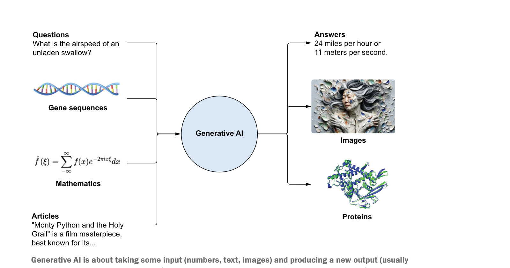


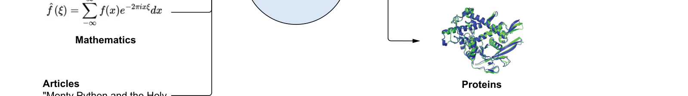


---

_由 book-agent 翻译管线生成 · 模型 deepseek-chat / deepseek-v4-flash_
