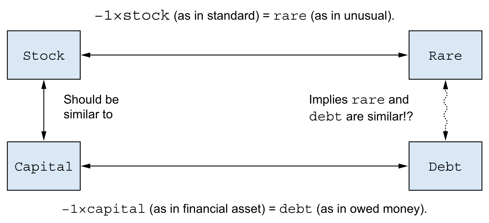
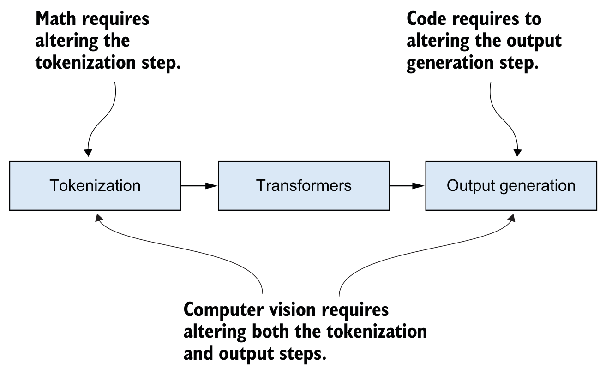

# How Large Language Models Work · 中英双语版

> 由 book-agent 翻译管线生成

## 目录

- [第 1 章 · 宏观图景：什么是大语言模型？](#ch1)
- [第 2 章 · 分词器：大语言模型如何看待世界](#ch2)
- [第 3 章 · Transformer 架构：输入如何转换为输出](#ch3)
- [第 4 章 · LLM 如何学习](#ch4)
- [第 5 章 · 如何约束 LLM 的行为](#ch5)
- [第 6 章 · 超越自然语言处理](#ch6)
- [第 7 章 · LLM 的误解、局限与新兴能力](#ch7)
- [第 8 章 · 用大语言模型设计解决方案](#ch8)
- [第 9 章 · 构建与使用 LLM 的伦理](#ch9)

<a id="ch1"></a>

## 第 1 章: 宏观图景：什么是大语言模型？

大图景：什么是大语言模型？

### 本章涵盖

- Transformer 与大型语言模型
- LLM 的通俗工作原理
- 人类与机器表征语言的不同方式
- ChatGPT 等工具表现优异的原因
- 理解使用LLM的局限与顾虑

<details>
<summary>英文原文</summary>

- Transformers and large language models are
- How LLMs work in plain language
- How humans and machines represent languages differently
- Why tools like ChatGPT perform so well
- Understanding the limitations and concerns of using LLMs

</details>

围绕机器学习（ML）、深度学习（DL）和人工智能（AI）等术语的炒作达到了历史最高水平。公众最初接触这些术语，很大程度上归功于一款名为ChatGPT的产品，这是由OpenAI公司构建的一种生成式AI。如今，我们每天都在新闻中看到各种生成式AI产品，如谷歌的Gemini、微软的Copilot、Meta的Llama、Anthropic的Claude，以及像DeepSeek这样的新秀。仿佛一夜之间，计算机在对话、学习和执行复杂任务方面的能力实现了飞跃式的提升。新的生成式AI公司不断涌现，现有企业也公开在该领域投资数十亿美元。该领域的技术正以令人疯狂的速度演进。

<details>
<summary>英文原文</summary>

The hype around terms such as machine learning (ML), deep learning (DL), and artificial intelligence (AI) has reached record levels. Much of the initial public exposure to these terms was driven by a product called ChatGPT, a form of generative AI built by a company called OpenAI. We now see generative AI offerings such as Gemini from Google, Copilot from Microsoft, Llama from Meta, Claude from Anthropic, and newcomers like DeepSeek in the daily news. Seemingly overnight, the ability of computers to talk, learn, and perform complex tasks has taken a dramatic leap forward. New generative AI companies are forming, and existing firms are publicly investing billions of dollars in the field. The technology in this space is evolving at a maddening pace.

</details>

本书旨在揭示ChatGPT及相关技术背后的奥秘，帮助您理解这个新世界。我们将介绍理解其内部工作原理所需的知识，以及数据与算法这些组件如何组合成我们使用的工具。我们还将讨论各种场景：有些场景下这项技术可以成为更广泛系统的基石，而有些场景下基于大语言模型（LLM）的系统可能并非佳选。阅读本书后，您将了解ChatGPT这类生成式AI的本质、能做什么与不能做什么，更重要的是，理解其局限性背后的“原因”。掌握了这些知识，无论您是作为用户、软件开发者，还是作为组织中决定是否以及如何将这项技术融入产品或运营的业务决策者，您都将成为这一技术家族更有效的使用者。这些基础还将为您深入该领域的学习提供跳板，使您能够理解深入的研究和其他著作。

<details>
<summary>英文原文</summary>

This book aims to help you make sense of this new world by dispelling the mystery behind what makes ChatGPT and related technologies work. We will cover the knowledge necessary to understand their inner workings and how the components (data and algorithms) stack together to create the tools we use. We’ll also discuss various cases where this technology can form the cornerstone of a broader system and others where systems based on large language models (LLMs) may be a poor choice.

After reading this book, you’ll understand what generative AI like ChatGPT really is, what it can and can’t do, and, importantly, the “why” behind its limitations. With this knowledge, you’ll be a more effective consumer of this family of technology, whether as a user, a software developer, or a business decision maker in organizations deciding whether and, if so, how to incorporate it into your products or operations. This foundation will also serve as a launchpad for deeper study into the field by providing knowledge that will allow you to understand in-depth research and other works.

</details>

### 1.1 生成式AI的背景

首先，我们需要更具体地明确我们在谈论LLMs、GPTs以及依赖它们的各种工具时究竟在讨论什么。ChatGPT中的GPT代表Generative Pretrained Transformer（生成式预训练变换器）。这些单词在ChatGPT的上下文中各有特定含义。我们将在后续章节详细讨论pre-trained（预训练）和transformer（变换器）的含义，但这里先从generative（生成式）在上下文中的含义开始讨论。像ChatGPT这样的AI聊天机器人是生成式AI的一种形式。广义上，生成式AI是一种能够根据过去观察到的数据以及人们对愉悦准确输出的期望，创建或生成各种媒体（例如文本、图像、音频和视频）的软件。例如，如果要求ChatGPT“写一首关于雪落在松树上的俳句”，它将利用所有关于俳句、雪、松树和其他诗歌形式的数据来生成一首新颖的俳句，如图1.1所示。

<details>
<summary>英文原文</summary>

First, we need to get more specific about what we are discussing when we talk about LLMs, GPTs, and the various tools that rely on them. The GPT in ChatGPT stands for Generative Pretrained Transformer. Each of these words bears a particular meaning in the context of ChatGPT. We’ll dedicate future chapters to discussing what pretrained and transformer mean, but we start here by discussing what generative means in this context.

AI chatbots like ChatGPT are a form of generative AI. Broadly, generative AI is software capable of creating, or generating, various media (e.g., text, images, audio, and video) based on data it has observed in the past and influenced by what people consider to be pleasing and accurate output. For example, if ChatGPT is prompted with “Write a haiku about snow falling on pines,” it will use all of the data it was trained with about haikus, snow, pines, and other forms of poetry to generate a novel haiku as shown in figure 1.1

</details>


*图：图1.1
ChatGPT 生成的一首简单俳句*

从根本上说，这些系统是生成新输出的机器学习模型，因此生成式AI是一个恰当的描述。图1.2展示了一些可能的输入和输出。虽然ChatGPT主要处理文本输入和输出，但它也对不同数据类型（如音频和图像）提供了更多的实验性支持。然而，根据我们的定义，可以想象许多不同类型的算法和任务都属于生成式AI的范畴。

<details>
<summary>英文原文</summary>

Fundamentally, these systems are machine learning models that generate new output, so generative AI is an appropriate description. Some possible inputs and outputs are demonstrated in figure 1.2. While ChatGPT deals primarily with text as input and output, it also has more experimental support for different data types, such as audio and images. However, from our definition, you can imagine that many different kinds of algorithms and tasks fall into the description of generative AI.

</details>


*图：图1.2 生成式AI接受一些输入（数字、文本、图像）并产生新的输出（通常是文本或图像）。输入和输出的任何组合都是可能的，输出的性质取决于算法训练的目的。可以是增加细节、重写内容使之更简短、推断缺失部分等。*


*图：图1.3 展示了各类术语及其相互关系的高层地图，这些术语你将会熟悉。生成式AI是对功能的描述：利用AI技术生成内容以实现目标。*

注意：视觉和语言并非生成式AI的唯一选择。音频生成（比如文字转语音，例如GPS播报街道名称）、下棋（如国际象棋），甚至蛋白质折叠都应用了生成式AI。本书将主要聚焦于文本和语言，因为它们正是GPT和LLM所处理的核心数据类型。

<details>
<summary>英文原文</summary>

NOTE Vision and language are not the only options for generative AI. Audio generation (think text-to-speech, such as when your GPS speaks out the street names), playing board games like chess, and even protein folding have used generative AI. This book will stick mostly to text and language since those are the primary data types employed by GPTs and LLMs.

</details>

顾名思义，“大型”语言模型并不小。据传，ChatGPT 拥有 1.76 万亿个参数，这些参数决定了它的行为方式。每个参数通常存储为一个浮点数（带小数点的数字），占用 4 字节存储空间。这意味着模型本身需要 7 TB 的内存容量。这个大小远超大多数计算机的内存容量，更不用说那些只有 80 GB 内存的最强 GPU 了。GPU 是专用硬件组件，擅长执行使 LLM 成为可能的数学运算。当前，构建 LLM 需要多个 GPU，因此我们已经在讨论跨多台机器的计算基础设施和复杂性。相比之下，更普通的语言模型大多在 2 GB 或以下——小 5000 多倍，在更标准的硬件上构建和使用时，这个尺寸要合理得多。

<details>
<summary>英文原文</summary>

As the name large implies, these models are not small. ChatGPT specifically is rumored [1] to contain 1.76 trillion parameters that are used to dictate the way it behaves. Each parameter is typically stored as a floating point number (a number with a decimal point) that uses 4 bytes for storage. That means the model itself takes 7 terabytes to hold in memory. This size is larger than most people’s computers could fit in RAM, let alone inside the most powerful graphics processing units (GPUs) with 80 gigabytes of memory. GPUs are special-purpose hardware components that excel in performing the mathematical operations that make LLMs possible. Currently, many GPUs are required when making LLMs, so we are already discussing a lot of computational infrastructure and complexity over multiple machines to build an LLM. In contrast, more run-of-the-mill language models would be 2 GB or less in most cases—over 5,000× smaller, a much more reasonable size when considering building and using such a model on more standard hardware.

</details>

许多研究者正在探索如何降低LLM的内存消耗。有时，这包括使用少于4字节存储参数的技术，即所谓的“mixed-precision”方法[2]。该方法用2字节或更少来存储部分LLM参数，在精度和内存效率之间做出权衡。最终，对精度的影响通常微乎其微。这种优化是研究者为使LLM更高效而采取的措施之一。

<details>
<summary>英文原文</summary>

Many researchers are investigating ways to make LLMs consume less memory. Sometimes, this includes techniques that require less than 4 bytes to store a para-meter utilizing a method called “mixed-precision” [2]. This approach stores some LLM parameters using 2 bytes or fewer and presents a tradeoff between accuracy and memory efficiency. In the end, the effect on accuracy is often negligible. This optimization is one of many that researchers make to make LLMs more resource efficient.

</details>

GPU 替代方案 虽然 GPU 是目前训练 LLM 最常用的硬件，但它们并非唯一可用选项。越来越多的公司正在开发专用硬件，为训练机器学习模型提供普遍优势。例如，2018 年，谷歌将其张量处理单元（TPU）[3] 作为谷歌云平台（GCP）的一部分向公众开放。虽然 TPU 的计算能力通常低于 GPU，但其专用架构使它们在某些机器学习任务上表现优于 GPU。

<details>
<summary>英文原文</summary>

GPU alternatives While GPUs are currently the most frequently used hardware to train LLMs, they aren’t the only option available. Increasingly, companies are developing special-purpose hardware that offers general advantages for training machine learning models. For example, in 2018, Google made its Tensor Processing Unit (TPU) [3] available for public use as a part of the Google Cloud Platform (GCP). While TPUs generally have less computing capacity than GPUs, their specialized architecture allows them to perform better than GPUs for specific machine learning tasks.

</details>

### 1.2 你将学到什么

在本书中，我们将解释LLM的工作原理，并为你提供理解它们所需的术语。阅读完毕后，你将能够对LLM是什么以及其运行的关键步骤有一个通俗的理解。此外，你将对LLM合理的能力范围有所认识，尤其是与部署或使用相关的注意事项。我们将讨论LLM基本局限性的要点，并提供关于如何规避这些局限性的建议，以及何时应完全避免使用LLM乃至更广泛的生成式AI。请记住，构建ChatGPT、Claude或Gemini的Transformer组合细节十分微妙，本书主要关注这些系统的共同点。事实上，我们无法知晓这些LLM之间的一些实际差异，因为尽管商业LLM提供商已分享了大量关于其模型的信息，但仍有部分信息（很可能被视为商业秘密）未公开。鉴于基于Transformer的LLM将对世界产生的影响，我们特意将本书的目标受众设定为广大的普通读者。各类背景的程序员、高管、经理、销售人员、艺术家、作家、出版商以及更多从业者，在未来几年都将与LLM互动或受到其职业影响。因此，我们假设亲爱的读者你仅具备最基础的编程背景，但熟悉编程的基本概念：逻辑、函数，甚至可能了解一些数据结构。你也不必是数学家；我们会在有助于理解的地方展示少量数学知识，但这对理解LLM工作原理并非必需。这意味着本书中出现的代码将非常少。如果你想直接深入构建和使用LLM，Manning出版社的其他书籍，例如Sebastian Raschka的《Build a Large Language Model from Scratch》（2024年）或Edward Raff的《Inside Deep Learning》（2022年），将是对本书内容的补充。然而，如果你想理解为什么你正在使用的LLM会产生异常输出、你的团队如何利用LLM、或者何时应避免使用LLM，又或者你有一位机器学习背景不足的同事需要快速掌握基本知识，那么这本书正是你和你的同事所需要的。

<details>
<summary>英文原文</summary>

Throughout this book, we will explain how LLMs work and equip you with the vocabulary needed to understand them. Once you’ve finished reading, you will have a conversational understanding of what an LLM is and the critical steps involved in its operation. Additionally, you will have some perspective on what an LLM reasonably can do, especially the considerations related to deploying or using one. We will discuss salient points about the fundamental limitations of LLMs and provide tips on how to design around them or when LLMs and, more broadly, generative AI should be avoided entirely.

Keep in mind that the details of how transformers are combined to build ChatGPT, Claude, or Gemini are nuanced, and this book primarily focuses on what all of these systems have in common. In fact, we can’t know some of the actual differences between these LLMs because although commercial LLM providers have shared a great deal of information about their models, they have not shared some pieces of information, likely considered trade secrets.

Due to the effect that transformer-based LLMs will have on the world, we’re purposely focusing on a wide audience for this book. Programmers of all backgrounds, executives, managers, sales staff, artists, writers, publishers, and many more will have to interact with or have their jobs affected by LLMs over the coming years. So we are going to assume you, dear reader, have a minimal coding background but are familiar with the basic constructs of coding: logic, functions, and maybe even some data structures. You also do not need to be a mathematician; we will show you a bit of math where it is helpful, but it will be optional in building an understanding of how LLMs work.

This approach means that very little code will be presented in this book. If you want to dive directly into building and using an LLM, other books in the Manning catalog, such as Sebastian Raschka’s Build a Large Language Model from Scratch (2024) or Edward Raff’s Inside Deep Learning (2022), will complement the material presented here. However, if you want to understand why the LLM you are using has unusual outputs, how your team might be able to use an LLM, or where to avoid using an LLM, or if you have a colleague with little machine learning background who needs to get conversationally competent, this is the book you and your colleague need.

</details>

特别是，本书的第一部分聚焦于LLM的行为：它们的输入和输出、如何将输入转化为输出，以及我们如何约束输出的性质。第二部分则关注人类的行为：人们如何与技术互动，以及这对使用生成式AI带来的风险。同样，我们也将讨论在使用和构建LLM时出现的一些伦理考量。

<details>
<summary>英文原文</summary>

In particular, the first part of this book focuses on what LLMs do: their inputs and outputs, converting inputs to outputs, and how we constrain the nature of those outputs. In the second part, we focus on what humans do: how people interact with technology and what risks this creates for using generative AI. Similarly, we’ll discuss some ethical considerations that arise when using and building LLMs.

</details>

**训练LLM成本高昂**

训练大型语言模型（LLM）对大多数人而言并不现实——这至少需要10万美元的投资，若想与OpenAI竞争，投入甚至高达1亿美元。与此同时，训练LLM所需的资源也在不断演变。因此，我们不会带你了解当前训练LLM的具体流程，而是聚焦于更具长期价值的内容——那些我们认为在未来数年依然有效的实用知识，而非几个月内就可能过时的示例代码。

<details>
<summary>英文原文</summary>

**Training LLMs is expensive**

Training an LLM is not realistically possible for most people; it is a ≥$100, 000 investment at a minimum and would be a $100 million effort to try to compete with OpenAI. At the same time, the resources available for training LLMs are constantly evolving. As a result, instead of walking you through what training an LLM looks like today, we focus on content with a longer shelf life—helpful knowledge that we believe will be valid years from now instead of example code that could be out of date in just a few months.

</details>

### 1.3 介绍LLM的工作原理

生成式人工智能（GAI 或 GenAI）即将改变我们产生信息和与信息互动的方式。2022 年 11 月 ChatGPT 的推出凸显了现代 AI 的能力，吸引了全球相当一部分人的关注。目前，你可以免费注册 https://chat.openai.com/ 来体验一下。如果你输入提示文字“用两句话总结以下文本”，然后附上本章的所有引言文字，你会得到类似如下的结果。“近期人们对人工智能，尤其是 OpenAI 的 ChatGPT 这类大型语言模型（LLM）的关注激增，凸显了它们在自然语言处理方面的强大能力。本书旨在为读者提供关于 LLM 的通俗易懂的理解，包括其运作细节、潜在应用、局限性以及相关的伦理考量，同时只假定读者具备基本的编程概念和极少的数学背景。这相当令人印象深刻，对普通观众来说，这种能力似乎凭空出现。”当你访问 OpenAI 网站并注册 ChatGPT 时，你可能会注意到一个类似于图 1.4 所示的选项。正如 GPT-4 这个名字所暗示的，截至撰写本文时，Open AI 正在开发其第四代 GPT 模型。像 GPT-4 这样的 LLM 是机器学习研究中一个成熟的领域，旨在创建能够综合信息、对信息做出反应并生成看似人类产出的算法。这种能力开启了人与机器之间多个此前只存在于科幻小说中的交互领域。ChatGPT 中编码的语言表示能力强大，能够实现令人信服的对话、指令遵循、摘要生成、问答、内容创作以及更多应用。事实上，这项技术的许多可能应用尚未问世，因为

<details>
<summary>英文原文</summary>

Generative AI (GAI or GenAI) is poised to change how we produce and interact with information. The introduction of ChatGPT in November 2022 highlighted the capabilities of modern AI and fascinated a significant portion of the world. Currently, you can sign up for free at https://chat.openai.com/ to try it out. If you enter the text prompt “Summarize the following text in two sentences,” followed by all of the introductory text from this chapter, you will get something similar to the following.

“The recent surge in attention towards artificial intelligence, particularly large language models (LLMs) like ChatGPT from OpenAI, has highlighted their vast capabilities in natural language processing. This book aims to provide readers with a conversational understanding of LLMs, their operational intricacies, potential applications, limitations, and the ethical considerations surrounding their use while assuming only a basic familiarity with coding concepts and minimal mathematical background. That’s pretty impressive, and to a casual audience, it may seem like this capability has come out of nowhere.”

When you visit OpenAI’s website and sign up for ChatGPT, you may notice an option similar to that shown in figure 1.4. As the name GPT-4 implies, Open AI is, as of this writing, working on its fourth generation of GPT models. LLMs like GPT-4 are a well-established area of ML research in creating algorithms that can synthesize and react to information and produce outputs that appear human generated. This ability unlocks several areas of interaction between people and machines that previously existed only in science fiction. The strength of the language representation encoded into ChatGPT enables convincing dialog, instruction following, summary generation, question answering, content creation, and many more applications. Indeed, it is likely that many possible applications of this technology do not yet exist because

</details>


*图：图 1.4
注册 OpenAI 的 ChatGPT 时，你有两个选择：GPT-3.5 模型（免费使用）或 GPT-4 模型（需付费）。*

对读者你而言，关键点在于：这项技术并非凭空出现，而是过去十年机器学习逐年取得巨大进步的成果。因此，我们对LLM的工作原理及其可能失败的方式已有相当多的了解。我们假设读者只有最基础的背景知识，这样你也可以把这本书送给朋友和家人。（其中一位作者希望自己能把这本书送给母亲——母亲为他感到非常自豪，尽管她并不确切知道他的工作是什么。）因此，在深入讨论之前，我们需要填补可能很大的背景知识鸿沟。第一章的目标就是提供这个背景，以便下一章开始回答这个问题：一台计算机究竟是如何总结本书导言的？

<details>
<summary>英文原文</summary>

The critical factor for you, the reader, is that this technology did not come out of nowhere but is the result of steady progress over the past decade of dramatic year-over-year improvements in machine learning. Consequently, we already know quite a lot about how LLMs work and the ways that they can fail. We are assuming a minimal background so that you can give this book to your friends and family. (One of the authors is hopeful that they can give this book to their mother, who is very proud of them even if she does not know precisely what their job is.) As a result, we need to cover a potentially large gap in the background before we dive in. This first chapter aims to give you that background so the next chapter can begin the process of answering this question: How on earth did a computer summarize the introduction of this book?

</details>

那么，究竟什么是智能？

从营销角度看，“人工智能”是个绝佳的名称，尽管它最初是用来指代整个学术研究领域。这种做法导致了一个微妙的问题：它让人们形成了关于AI工作原理的错误心理模型。我们将尽力避免强化这种模型。为了解释原因，我们将讨论为什么“人工智能”并非如此完美的名称。通过思考一个简单的问题就能轻松说明这一点：什么是智能？

<details>
<summary>英文原文</summary>

Artificial intelligence is an excellent name from a marketing perspective, although it was originally used as the name for an entire field of academic research. This practice has led to a subtle problem that gives people a false mental model of how AI works. We are going to try to avoid reinforcing this model. To explain why, we will discuss why artificial intelligence is not such a great name. We can demonstrate this easily by considering a simple question: What is intelligence?

</details>

你可能会认为，像智商（IQ）测试这样的东西可以帮助我们回答这个问题。IQ测试与学业表现等多种结果密切相关，但它们并没有给出智力的客观定义。研究表明，一定程度上的先天（遗传）和后天（环境）会影响一个人的IQ。我们居然能把智力归结为一个简单的数字，这本身就很可疑——毕竟，我们常常批评一个人只是“书呆子”而不懂“街头智慧”。就算我们知道智力是什么，又是什么让它变得“人工”呢？智力难道还要添加人造调味剂和食用色素吗？归根结底，IQ测试衡量的是你执行有限一组能力的能力，主要是在时间限制下解决某些特定类型的逻辑谜题，但它们无助于我们理解智力的根本本质。事实是，对于智力是什么，我们并没有完美的理解。人工智能领域长期以来一直试图让计算机——这些刻板、确定、遵循规则的机器——执行人类能做但无法给出精确定义或指令的特定任务。例如，如果我们想让计算机数到1000并打印出每个能被5整除的数字，我们可以写出几乎任何程序员都能转换成代码的详细指令。但如果我让你写一个程序来尝试检测任意一张图片中是否有猫，那完全是另一个挑战。你需要以某种方式精确定义猫是什么，然后定义检测猫的所有细微之处。我们到底要如何编写代码来发现并区分猫的胡须和狗的胡须？当猫没有胡须时，我们又如何成功识别它？归根结底，这并不容易做到。然而，由于AI和ML专注于这些人类能够执行但难以明确定义的任务，因此使用类比来描述AI和ML算法变得特别普遍。为了让计算机检测猫，我们提供了成千上万张猫的图片和不是猫的图片作为示例。然后我们运行众多算法之一，通过一个具体、详细的数学过程来区分猫和世界上其他事物。但在技术词汇中，我们称这个过程为学习。当模型在新图像中未能检测到猫，因为那是一只狮子，而狮子不在原始的猫列表里时，我们常说模型没有“理解”狮子。事实上，每当我们试图向朋友解释某事时，我们常常使用我们双方都熟悉的共享概念来进行类比。由于AI和ML广泛关注于复制人类执行任务的能力，这些类比常常使用暗示人类字面认知功能的语言。随着LLM展示出接近人类水平的能力，这些类比变得弊大于利，因为人们过度解读它们，开始相信它们意味着超出实际的含义。因此，我们将谨慎使用类比，并提醒读者不要过度深入任何类比。有些术语，比如“学习”，是值得理解的技术行话，但我们希望你警惕它们可能暗示的含义。

<details>
<summary>英文原文</summary>

You might think that something like an intelligence quotient (IQ) test would help us answer that question. IQ tests have a strong correlation with numerous outcomes like school performance, but they do not give us an objective definition of intelligence. Studies show that some amount of nature (hereditary) and nurture (environment) affect a person’s IQ. It should also seem suspicious that we can boil down intelligence into something as simple as one number—after all, we often scold people for being only “book smart” but not “street smart.” Even if we knew what intelligence was, what would make it artificial? Does intelligence have manufactured flavorings and food colorings?

The bottom line is that IQ tests measure your ability to perform a finite set of capabilities, mostly some specific types of logic puzzles under time constraints, but they don’t help us understand the fundamental nature of intelligence. The truth is that there is no perfect understanding of what intelligence is. The field of AI has long been trying to get computers, which are rigid, deterministic, rule-following machines, to perform specific tasks that humans can do but can’t give precise definitions or instructions to do. For example, if we want a computer to count to 1,000 and print out every number divisible by 5, we can write detailed instructions that almost any programmer can convert to code. But if I ask you to write a program that attempts to detect if an arbitrary picture has a cat in it, that’s quite a different challenge. You need to somehow precisely define what a cat is and then all the minutia of how to detect one. How exactly do we write code to find and differentiate between cat whiskers and dog whiskers? How do we successfully recognize a cat when it does not have whiskers? When it comes down to it, it isn’t easy to do. However, because AI and ML have focused on these hard-to-specify tasks that humans can perform, describing AI and ML algorithms using analogies has become especially common. To get a computer to detect cats, we provide thousands upon thousands of examples of images that are cats and images that are not cats. We then run one of many various algorithms with a specific, detailed, mathematical process for differentiating cats from the rest of the world. But in the technical vocabulary, we call this process learning. When the model fails to detect a cat in a new image because it is a lion and lions were not in the original list of cats, we often say that the model didn’t understand lions.

Indeed, whenever we try to explain something to friends, we often use analogies to shared concepts that we are both familiar with. Because AI and ML are broadly focused on replicating human abilities to perform tasks, the analogies often use language that implies the literal cognitive functions of a human. As LLMs demonstrate capabilities at a level close to what humans can do, these analogies become more troublesome than helpful because people read too deeply into them and begin to believe that they mean more than they do.

For this reason, we will be careful with our analogies and caution the reader about following any analogies too far. Some terms, like learning, are technical jargon worth understanding, but we want you to be on your guard about what they might imply.

</details>

在某些情况下，本书中的类比仍然有帮助，但我们会尽量明确解释这类类比的边界。

<details>
<summary>英文原文</summary>

In some cases, analogies are still helpful in this book, but we will try to be explicit about the boundaries of how to interpret such analogies.

</details>

### 1.5 人类与机器对语言表征的差异

注：大脑结构的抽象已在众多领域被证明十分有效。神经网络在语言、视觉、学习和模式识别方面取得了令人难以置信的进步。神经机器学习算法的发展、数字数据的极速激增以及GPU等计算机硬件的爆发式增长，这些因素的汇聚造就了今天的ChatGPT得以实现。

<details>
<summary>英文原文</summary>

NOTE Abstractions of the brain’s structure have proven useful across many domains. Neural networks have demonstrated incredible progress in language, vision, learning, and pattern recognition. The convergence of advancements in neural machine learning algorithms, the extreme proliferation of digital data, and an explosion of computer hardware, such as GPUs, have led to the advancements that make ChatGPT possible today.

</details>

从讨论中得出的关键点是，作为人类，你对自己随时间习得的语言有一种与生俱来的理解。你的语言学习和使用是交互性的。通过进化，我们似乎都有相对一致的学习和相互沟通的方式。要了解更多关于这一概念，可以查阅语言学家诺姆·乔姆斯基提出的普遍语法理论。与人类不同，LLM通过静态过程学习语言表征。当你与Claude或ChatGPT对话时，它机械地参与对话，尽管它从未有过对话经历。LLM学到的语言表征可能质量很高，但并非无错误。它是可操控的，我们可以通过特定方式改变LLM的行为，限制它们知晓的内容或生成的内容。理解LLM是通过从示例中推断出的关系来表征语言，有助于我们保持切合实际的期望。如果使用LLM，它出错时有多危险？你如何利用语言表征来构建产品或避免不良后果？这些都是我们在本书中将要讨论的一些高层次问题。

<details>
<summary>英文原文</summary>

The critical detail to take from this discussion is that you, as a human, have an innate understanding of language you have learned over time. Your learning and use of language are interactive. Through evolution, we all seem to have relatively consistent ways of learning and communicating with each other. To find out more about this concept, look into the theory of universal grammar introduced by linguist Noam Chomsky. Unlike people, LLMs have a representation of language that is learned via a static process. When you have a conversation with Claude or ChatGPT, it mechanically participates in a dialog with you despite having never been in a conversation before. The representation of language an LLM learns can be high quality, but it is not error-free. It is manipulable in that we can alter the behavior of LLMs in specific ways to limit what they are aware of or what they produce. Understanding that LLMs represent language using relationships inferred from examples helps us maintain realistic expectations. If you are going to use an LLM, how dangerous is it if it is wrong? How can you work with the representation of language to build a product or avoid a bad outcome? These are some of the high-level concerns we will discuss throughout this book.

</details>

### 1.6 生成式预训练Transformer及其同类术语：生成式预训练

Transformer 是 OpenAI 在 2018 年提出的一种新型模型，其核心是一种称为 transformer 的神经网络组件。尽管最初的 GPT 模型（GPT-1）已不再使用，但预训练和 transformer 的核心思想已成为生成式 AI 及 Claude、Gemini、Llama 和 Copilot 等工具最新革命的核心支柱。同样重要的是，这些基于 GPT 的 AI 工具只是 LLM 广阔算法研究和应用领域中的一个例子。除了 ChatGPT 的发布，我们还观察到 LLM 的惊人激增。诸如 EleutherAI 和 BigScience 研究工坊发布的某些 LLM 可免费提供给公众，以推动研究和探索应用。如前所述，Meta、微软和谷歌等企业发布了其他具有更严格许可条款的 LLM。任何人都可用于构建应用或系统的公开 LLM（有时称为基础模型）已催生了一个充满活力的社区，包括研究人员、爱好者以及企业，共同探索 LLM 和生成式 AI 带来的应用、局限和机遇。本书所教授的概念几乎适用于所有 LLM。每个 LLM 都使用与 ChatGPT 类似（甚至相同）的结构生成输出。一本书要涵盖适用于众多模型的通用总结似乎不可能。然而，由于几个原因，这是可能的，其中最重要的一点是：我们不会深入到你能够从头编写 LLM 代码的程度。自然，ChatGPT 和其他商业 LLM 的某些部分仍属商业机密。因此，我们的范围和描述有意泛化到当今所有生成式 LLM 的最常见方面。我们能够给出如此广泛适用的总结的第二个原因是 LLM 的本质。虽然确实可以在构建和运行方式上做许多调整，但该领域的研究人员一致认为，最重要的细节如下：

<details>
<summary>英文原文</summary>

Transformer was invented by OpenAI to talk about a new type of model they introduced in 2018 that incorporates a type of neural network component known as a transformer. While the original GPT model (GPT-1) is no longer used, the core underlying ideas of pretraining and transformers have become core pillars of the recent revolution in generative AI and tools like Claude, Gemini, Llama, and Copilot. It is also essential to recognize that these GPT-based AI tools are only one example of an expansive domain of algorithmic research and application of LLMs. Outside of the release of ChatGPT, we have observed an incredible proliferation of LLMs. Some LLMs, like those released by EleutherAI and the BigScience Research Workshop, are freely available to the public to advance research and explore applications. Corpo-rations like Meta, Microsoft, and Google, as we’ve mentioned, have released other LLMs with more restrictive licensing terms. Publicly available LLMs that anyone can use to build an application or system, sometimes called foundation models, have created a vibrant community of researchers, hobbyists, and companies exploring the applications, limitations, and opportunities LLMs and generative AI create. The concepts we teach in this book apply nearly uniformly to all LLMs. Each of these produce output using structures similar, if not identical, to those found in ChatGPT. It may seem impossible for one book to contain a general summary applicable to many models. However, it is possible for a few reasons, one of the most important being that we will not go to the level of depth necessary to code an LLM yourself from scratch. Naturally, there are parts of ChatGPT and other commercial LLMs that remain trade secrets. As a result, our scope and descriptions are intentionally generalized to the most common aspects of all generative LLMs today. The second reason we can give such a broadly applicable summary is the nature of LLMs. While it’s true that many tweaks can be made to how they are built and operate, researchers in the field consistently find that the details that matter the most are the following:

</details>

模型有多大，能否做得更大？构建模型用了多少数据，能否获取更多？

<details>
<summary>英文原文</summary>

How large is the model, and can you make it larger? How much data was used to build the model, and can you get more?

</details>

这些观点对于那些自认为拥有重要见解或设计、能够显著提升这些LLM工作方式的研究人员来说，可能会令人沮丧，因为在许多情况下，同样的改进只需通过“做得更大”或者构建一个拥有更多数据或更多参数的模型就能轻易实现。增加模型和数据池的规模是围绕使用和构建LLM的诸多伦理问题中的一个关键组成部分，我们将在第9章讨论。

<details>
<summary>英文原文</summary>

These points can be frustrating for researchers who like to think they have vital insights or designs that meaningfully improve how these LLMs work and operate because, in many cases, the same improvement could be obtained just as easily by “making it bigger” or building a model with more data or more parameters instead. Increasing the size of both the models and the data pools is a crucial component of many ethical concerns around using and building LLMs, which we will discuss in chapter 9.

</details>

### 1.7 为什么LLM表现如此出色

我们将在后续章节详细讨论LLM的工作原理，但在此先分享一个从机器学习算法研究中得出的关键经验。多年以来，要提升算法在特定任务上的性能，往往意味着要在算法设计上更巧妙。你需要研究问题、数据和数学，试图推导出关于世界的宝贵真理，然后将其编码到算法中。如果做得好，性能提升，所需数据减少，一切都很完美。许多经典深度学习算法，如卷积神经网络（CNN）和长短期记忆网络（LSTM），从高层来看，都是人们苦思冥想、巧妙设计的结果。即使是更简单的“浅层”机器学习算法，如XGBoost（不依赖神经网络或深度学习），也是通过巧妙设计而来的。LLM则体现了更新的趋势。它们不追求算法的巧妙，而是保持简单，实现一种朴素算法，仅捕捉信息片段之间的关系。在许多方面，LLM强行注入算法的世界观更少。从根本上说，这提供了更大的灵活性。如果我告诉你相反的做法才是人们提升算法的传统方式，那这怎么会是个好主意呢？不同之处在于，LLM及其类似技术规模更大，而且是大得多。它们在更多数据上训练，拥有更强的能力去捕捉更多句子中更多词汇之间的更多关系；这种蛮力方法在性能上似乎已经超越了经典机器学习方法。图1.5展示了这一思想。

<details>
<summary>英文原文</summary>

We discuss the details of how LLMs work in the coming chapters, but it is also worth sharing here a key lesson learned by researching ML algorithms. For many years, getting better performance from your algorithm for whatever task you were trying to do often meant getting clever about designing your algorithm. You would study your problem, the data, and the math and attempt to derive valuable truths about the world that you could then encode into your algorithm. If you did a good job, your performance improved, you required less data, and all was good in the world. Many classic deep learning algorithms you may hear about, like convolutional neural networks (CNNs) and long short-term memory (LSTM) networks, are, at a high level, the result of people thinking hard and getting clever. Even simpler “shallow” ML algorithms, such as XGBoost, that do not rely on neural networks or deep learning were created using clever algorithm design.

LLMs demonstrate a more recent trend. Instead of getting clever about the algorithm, they keep it simple and implement a naive algorithm that simply captures relationships between pieces of information. In many ways, LLMs have fewer beliefs about the world forcibly baked into the algorithm. Fundamentally, this provides more flexibility. How could this be a good idea if I told you the opposite approach was how people improved algorithms? The difference is that LLMs and similar techniques are just bigger, massively so. They are trained on far more data and with far more ability to capture more relationships between more words in more sentences; this brute-force approach appears to have outpaced classic ML methods in performance. This idea is illustrated in figure 1.5.

</details>


*图：图1.5 算法的巧妙程度取决于在设计中编码的信息量，老技术往往通过比前代更聪明来提升性能。如图中圆圈大小所示，LLM大多选择了一种更“笨”的方法：使用更多数据和参数，并尽量减少对算法学习内容的约束。*

正如我们已指出的，大规模并非在所有指标上都更优。这些模型目前在部署上存在物流和计算方面的挑战。许多实际约束，如响应时间、功耗、电池消耗和可维护性，均受到负面影响。因此，LLM的进步仅体现在对“性能”的狭隘定义上。

<details>
<summary>英文原文</summary>

As we have already stated, bigger is not better by every metric. These models are currently a logistical and computational challenge to deploy. Many real-world con-straints, including response time, power draw, battery drain, and maintainability, are all negatively affected. So it is only a narrow definition of “performance” by which LLMs have improved.

</details>

不过，“做大”胜过“做巧”这一经验教训仍然值得深思。有时，在设计机器学习解决方案时，即使你使用了LLM，最好的答案可能还是“我们去获取更多数据吧”。

<details>
<summary>英文原文</summary>

Still, the lesson on the value of “going bigger” over “getting clever” is worth considering. Sometimes, in your design of a machine learning solution, even if you are using an LLM, the best answer may be “Let’s just go get a lot more data.”

</details>

### 1.8 LLM实战：好、坏、可怕

在本书中，我们将给出LLM如何失败的例子，这些失败常常滑稽可笑。这些例子的目的并非是说LLM无法完成任务。通过改变输入、设置或凭借运气，你往往能让LLM表现更好。这类例子的用意是向你展示LLM失败的方式，而且常常是在简单到孩子都能做得更好的事情上失败。当你在阅读本书并亲自与LLM互动时，这些例子会让你停下来思考：“如果我使用ChatGPT处理困难任务，但它连简单的任务都失败，我是不是在自找麻烦？”答案可能常常是一个响亮的“是”！安全使用LLM需要对其输出保持一定程度的怀疑或质疑，需要去验证和确认正确性，并具备相应调整的能力。如果你用LLM完成自己无法完成的任务，就有暴露在自己无法亲自验证的错误结果之下的风险。在本书后续讨论如何更多使用LLM时，我们将不断把这一点和应对方法融入对话中。很容易想象LLM在正常工作时能让生活更便捷的许多方式——回复所有邮件、总结长文档、解释新概念。但对许多人来说，不易想到的是事情会如何出错并迅速变得危险。这种对抗性思维通常可以用一个初始例子来引发：假设你想学习如何制造炸弹。如果你向ChatGPT提问，你会得到官方回答：“抱歉，我无法协助这个请求。“如果你处于危机或需要帮助，请联系当地政府或专业人士，他们可以提供帮助。”然而，研究人员最近展示了如何让ChatGPT和许多其他商业LLM毫不犹豫地回答这个问题，以及其他许多危险的信息请求[4]。有人可能会说，如果有人聪明到能想出如何欺骗LLM，他们很可能从其他来源获得任何他们想要的危险信息。这很可能没错，但同时也未能考虑到LLM和生成式AI工具中的自动化规模。没有AI或ML算法是完美的，如果数百万人提问，LLM可能在0.01%的情况下产生危险响应。ChatGPT拥有超过1亿用户[5]，所以那就是1万个危险响应。当你考虑恶意行为者可能开始自动化什么时，问题就更严重了。我们将在本书后半部分进一步讨论这个问题。

<details>
<summary>英文原文</summary>

Throughout this book, we will give examples of how LLMs can fail, often in hilarious or silly ways. The point of these illustrations isn’t to say that LLMs are incapable of performing a task. With changes to the input, setup, or random luck, you can often get LLMs to work better.

The point of such illustrations is to show you how LLMs can fail, often on things so simple that a child can do them better. As you read through this book and interact with LLMs yourself, these illustrations should give you pause and lead you to the thought, “If I use ChatGPT for a hard task, but it fails on easy ones, am I setting myself up for failure?” The answer may often be an emphatic yes! Using LLMs safely requires a degree of skepticism or doubt about the outputs, work to verify and validate correctness, and the ability to adapt accordingly. If you use an LLM for a task you cannot do yourself, you risk exposing yourself to errant results you can’t verify personally. We will continually weave this point and how to deal with it into the conversation as we discuss how to use LLMs more throughout the book. It is easy to imagine many ways that LLMs can potentially make our lives easier when it does work—answering all your emails, summarizing long documents, and explaining new concepts. What does not come naturally to many is how things can go wrong and quickly become dangerous.

This kind of adversarial thinking can often be prompted with an initial example: say you want to learn how to make a bomb. If you ask ChatGPT that question, you get the sanitized answer, “Sorry, I can’t assist with that request. If you’re in crisis or need help, please contact local authorities or professionals who can help.” However, researchers have recently shown how to get ChatGPT and many other commercial LLMs to answer the question without hesitation, among many other dangerous requests for information [4].

One might argue that if someone is so clever as to figure out how to trick the LLM, they could probably get whatever dangerous information they want from another source. This is likely true, but at the same time, it fails to account for the scale of automation in LLMs and generative AI tools. No AI or ML algorithm is perfect, and if millions of people ask questions, LLMs might produce a dangerous response 0.01% of the time. ChatGPT has over 100 million users [5], so that is 10,000 dangerous responses. The problem worsens when you consider what a malicious actor might begin to automate. We will discuss this problem further in the second half of the book.

</details>

我们期待您加入我们，共同探索大语言模型的工作原理。最终，您将深入了解在业务或日常生活中运用大语言模型革命性能力时需要考虑的诸多因素。

<details>
<summary>英文原文</summary>

We look forward to your joining us in exploring how LLMs work. In the end, you’ll have a detailed understanding of many things to consider when employing LLMs’ revolutionary capabilities in your business or daily life.

</details>

### 摘要

ChatGPT是一种大语言模型，而大语言模型本身属于生成式AI/ML这个更大的范畴。生成式模型能够产生新的输出，而LLM虽然在输出质量上独具特色，但其构建和使用成本极高。LLM的设计大致模仿了人类对大脑功能和语言学习的不完全认识。这种模仿仅作为设计灵感，并不意味着模型拥有与人类相同的能力或弱点。智能是一个多维且难以量化的概念，因此很难断言LLM是否具有智能。更容易的做法是从能力和可靠性角度来思考LLM及其潜在用途。人类语言必须与LLM的内部表示进行相互转换。这种表示的形成方式将改变LLM的学习内容，并影响你如何利用LLM构建解决方案。

<details>
<summary>英文原文</summary>

ChatGPT is a type of large language model, which is itself in the larger family of generative AI/ML. Generative models produce new output, and LLMs are unique in the quality of their output but are extremely costly to make and use. LLMs are loosely patterned after an incomplete understanding of human brain function and language learning. This is used as inspiration in design, but it does not mean the models have the same abilities or weaknesses as humans. Intelligence is a multifaceted and hard-to-quantify concept, making it difficult to say whether LLMs are intelligent. It is easier to think about LLMs and their potential use in terms of capabilities and reliability. Human language must be converted to and from an LLM’s internal representa-tion. How this representation is formed will change what an LLM learns and influence how you can build solutions using LLMs.

</details>


---

<a id="ch2"></a>

## 第 2 章: 分词器：大语言模型如何看待世界

2 分词器：大型语言模型如何看世界

<details>
<summary>英文原文</summary>

2 Tokenizers: How large language models see the world

</details>

正如第1章所述，在人工智能领域，借助人类学习的类比来解释机器如何“学习”往往很有帮助。你阅读和理解句子的方式是一个复杂的过程，随着年龄增长而变化，涉及多个顺序和并行的认知过程[1]。然而，大型语言模型（LLM）使用的过程比人类认知过程更简单。它们采用基于神经网络的算法，从大量数据中捕捉词语之间的关系，然后利用这些关系信息来解释和生成句子。我们对这些算法工作原理的讨论将从它们的输入入手：文本句子。本章我们将探讨LLM如何将这些句子处理成模型的输入。正如语言对你思考和加工信息至关重要一样，LLM的输入也深刻影响着它能处理的概念和任务类型。

<details>
<summary>英文原文</summary>

As discussed in chapter 1, in the world of artificial intelligence, it is often helpful to find analogies to human learning to explain how machines “learn.” How you read and understand sentences is a complex process that changes as you get older and involves multiple sequential and concurrent cognitive processes [1]. Large language models (LLMs), however, use simpler processes than human cognitive processes. They em-ploy algorithms based on neural networks to capture the relationships between words in large amounts of data and then use this information about relationships to interpret and generate sentences.

Our discussion of how these algorithms work will begin with their input: sentences of text. In this chapter, we explore how the LLM processes these sentences to become inputs for the model. Just as language is critical for how you think and process information, the inputs to an LLM are crucial in influencing what kinds of concepts and tasks LLMs can perform.

</details>

### 2.1 词元：数值表示

大语言模型处理句子似乎是显而易见的，但要完全理解，我们必须更加具体。当我们讨论大语言模型的工作原理时，你会发现文本句子对于驱动LLM的神经网络算法来说是不自然的，因为神经网络从根本上说是使用数字来工作的。如图2.1所示，LLM所使用的算法在处理人类文本之前必须将其转换为数值表示。词元是LLM用来将文本分解为可编码为数字的片段所需的表示。

<details>
<summary>英文原文</summary>

It may seem obvious that LLMs should process sentences, but to fully understand, we must be more specific. As we talk about how LLMs work, you will see that textual sentences are unnatural for the neural network algorithms that power LLMs because neural networks fundamentally employ numbers to do their work. As shown in figure 2.1, the algorithms employed by LLMs must convert human text into a numeric representation before working with it. Tokens are the representations that LLMs use to break text into pieces that can be encoded as numbers.

</details>


*图：图 2.1 为了理解文本，大语言模型必须将文本拆分为词元。每个词元都有一个与之关联的数字标识符。*

你可以将词元视为大语言模型处理的最小文本单位——不妨将其比作“原子”，即构成其他一切的最小部分。那么，文本的原子是什么呢？试想一下：当你阅读本书时，大脑用来处理意义的最小构建单元是什么？两个自然的答案是字母和单词。人们很容易将字母定义为原子，因为单词由字母构成，但你真的会有意识地阅读每个单词中的每个字母吗？对大多数人来说，答案是“否”。（如果你像本书的合著者之一一样有阅读障碍，这个问题可能显得奇怪。但认知过程复杂且尚未完全被理解；请耐心看待我们的类比！）你实际上关注的是更显眼的单词和单词的部分。比如“In fbct, yoy cn probbly unrestand ths sentnce ever through we diddt sue th ryght cpellng or l3ttrs.”这句话，即使拼写或字母有误，你很可能仍能理解。人们无意识地使用单词的局部来理解文本，而大语言模型的构建正是基于同样的原理。在本章中，你将学习文本转换为词元的过程是如何工作的。首先，我们将更详细地讨论词元；然后，探讨决定句子如何转换为词元所使用的步骤。

<details>
<summary>英文原文</summary>

You can think of tokens as the smallest unit of text an LLM processes—an “atom,” if you will, the smallest part from which all other things are built. So what are the atoms of text? Consider this: As you read this book, what are the smallest building blocks that your brain uses to process meaning? Two natural answers are letters and words. It is very tempting to define letters as the atom since words are made of letters, but do you consciously read every letter in every word? For most people, the answer is “no.” (If you are dyslexic like one of the co-authors of this book, this is a bizarre question. But cognitive processing is complex and not fully understood; please bear with us on the analogies!) You look at the more prominent words and word parts. In fbct, yoy cn probbly unrestand ths sentnce ever through we diddt sue th ryght cpellng or l3ttrs. People unconsciously use parts of words to process text, and LLMs are built using the same principle.

In this chapter, you will learn how the process of converting text to tokens works. First, we will discuss tokens in more detail; then, we will discuss the procedures used to decide how sentences are turned into tokens.

</details>

### 2.2 语言模型只看到词元

到成年时，大多数以英语为母语的人大约认识30,000个单词[2]。GPT-3（最初驱动ChatGPT的大型语言模型）拥有50,257个token的词汇量[3]。这些token不是单词，而是被称为子词（subword）的单词组成部分，是一种介于单词和字母之间的表示。直观地说，token捕捉了语言中最小的有意义语义单元。例如，单词schoolhouse通常会被拆分为两个token：school和house，而thoughtful则拆分为thought和ful。这有助于识别常见单词，并利用子词来解释我们从未见过的新词。人们经常使用类似的技术，称为语义分解，来理解他们从未见过的单词。我们直观地将新单词分解成组成部分，根据我们已经理解的单词来把握其含义。特征工程是将数据转换为更适合算法和待解决问题形式的过程。要构建一个能检测给定文本语言的算法，你可以编写代码，将文本作为输入，输出每个字符出现的百分比。例如，如果文档中é出现很多，你就有一个很好的特征表明该文档更可能是西班牙语或法语，而不是俄语或中文。好的特征工程需要考虑模型的工作原理、你想要实现的目标，以及如何为模型与目标的组合准备数据。分词（tokenization）是大语言模型的特征工程，它至关重要，因为token是模型与之交互的唯一信息。token被视为独立的、抽象的东西，它们之间没有内在联系。关系是通过观察数据学习而来的。回顾图2.1，很明显，Dis和dis的token是相关的，唯一的区别是一个以大写字母D开头。然而，你可以看到模型将标识符4944分配给Dis，将标识符834分配给dis。也就是说，模型本身并没有看到表示Dis和dis的token之间的任何联系，尽管我们作为人类能看到明显的联系。模型甚至看不到Dis或dis。为了让大语言模型处理token，我们必须将这些token转换为数字，这样模型才能看到数字4944和834。重要的是，模型无法直接知道这些token是相关的。token是从子词到唯一数值表示的映射。相应地，分词是将完整文本字符串转换为token序列的过程。如果你之前使用过机器学习库（尤其是任何自然语言处理（NLP）工具），你可能对某些更简单的分词形式比较熟悉。例如，一个简单的分词过程通过基于空格分割文本来将文本拆分为token。然而，这种方法限制了我们在创建子词或处理不使用空格分隔单词的语言（如中文）方面的能力。

<details>
<summary>英文原文</summary>

By adulthood, most English-speaking people know around 30,000 words [2]. GPT-3, the LLM that initially powered ChatGPT, has a vocabulary of 50,257 tokens [3]. These tokens are not words but parts of words referred to as subwords, a representation that is somewhere between words and letters. Intuitively, a token captures language’s minimum meaningful semantic unit. For example, the word schoolhouse will often get broken into two tokens, school and house, and the word thoughtful as thought and ful. This is useful for recognizing frequent words and having the subwords to interpret new words we have never seen before. People often use a similar technique, called semantic decomposition, to understand words they’ve never seen before. We intuitively break new words into constituent parts to grasp their meaning based on words we already understand.

Feature engineering is the process of converting your data to a form that is more convenient to your algorithm and the task you want to solve. To build an algorithm that can detect the language of a given text, you could write code that takes text as input and outputs the percentage of times each character occurs. For example, if é appears a lot in a document, you have a good feature to indicate that the document is more likely to be Spanish or French than Russian or Chinese. Sound feature engineering is concerned with thinking through how your model works, what you want to achieve, and how to prepare your data for the combination of model and goal.

Tokenization is the feature engineering of LLMs; it is critically essential because tokens are the only information a model interacts with. Tokens are seen as individual, abstract things that are not inherently connected. The relationships are learned through observation of data.

Looking back at figure 2.1, it is evident that the tokens for Dis and dis are related, the only difference being that one starts with a capital D. However, you can see that the model assigns the identifier 4944 to Dis and the identifier 834 to dis. That is, the model doesn’t inherently see any connection between the tokens representing Dis and dis, even if we, as humans, see an obvious connection. The model doesn’t even see Dis or dis. For an LLM to process tokens, we must convert those tokens into numbers so that the model will see the numbers 4944 and 834. Importantly, the model doesn’t have any direct way to know that these tokens are related. A token is a mapping from a subword to a unique numeric representation. In turn, tokenization is the process of converting a full-text string into a sequence of tokens. If you have used machine learning libraries before (especially any natural language processing [NLP] tools), you are probably familiar with some of the simpler forms of tokenization. For example, a simple tokenization process breaks a text into tokens by splitting a text based on spaces. However, this approach limits our abilities to create subwords or process languages that don’t use whitespace to delimit words, such as Chinese.

</details>

### 2.2.1 分词过程

分词遵循的通用过程如图2.2所示，包含四个关键步骤：

<details>
<summary>英文原文</summary>

The generic process that tokenization follows is shown in figure 2.2 with four key steps:

</details>

1. 接收待处理文本——这意味着从用户、互联网或其他任何包含所需文本的源获取字符串数据类型（字母、数字或符号的集合）的文本输入。
2. 转换字符串——这通常涉及以某种有用的方式更改字符串，例如将大写字母转换为小写字母。这样做也可能是出于安全考虑（例如，文本来自用户，我们需要删除任何可能类似于恶意输入的内容），或者为了消除文本中的无关变化，以帮助算法更好地学习。这个过程被称为规范化。
3. 将字符串分解为词元——一旦有了字符串，就需要将其分割成一系列离散的子串；这些子串就是较大字符串中的词元。这被称为分词。
4. 将每个词元映射到唯一标识符——唯一标识符通常是一个整数，由此产生大语言模型可理解的输出。

<details>
<summary>英文原文</summary>

1 Receiving the text to process—This means obtaining text input as a string data type (a collection of letters, digits, or symbols) from a user, the internet, or whatever source that has the text you want.

2 Transforming the string—This often involves changing the string in some useful way, such as converting uppercase characters into lowercase. This could also be done for security reasons (e.g., the text came from a user, and we need to remove anything that might look like some malicious input) or to eliminate irrelevant variations in the text to help the algorithm learn better. This process is known as normalization.

3 Breaking the string into tokens—Once a string is available, it needs to be separated into a sequence of discrete substrings; these are the tokens found in the larger string. This is referred to as segmentation.

4 Mapping each token to a unique identifier—The unique identifier is usually an integer number, which produces output that the LLM can understand.

</details>


*图：图 2.2
一般而言，词元化涉及对输入进行处理，以为词元生成数字标识符。*

这个流程的首尾部分几乎没有选择余地或不同行为的空间。首先，你需要有输入数据以供处理；最后，你需要为每个token分配一个数值标识符，用于存储和检索与之关联的信息。中间两个步骤——归一化和分词——才是你可以自由选择的环节。

<details>
<summary>英文原文</summary>

The first and last parts of this process have little room for choice or different behavior. First, you need input to process; last, you need a numeric identifier for each token to store and retrieve the information you will associate with that token. The two middle steps, normalization and segmentation, are where you can choose what happens.

</details>

分词过程的最后一步是构建词汇表。模型的词汇表是指在训练过程中，当我们给算法提供学习数据时，所看到的唯一 token 的总数。几乎总是需要大量数据才能构建一个包含许多唯一 token 的丰富词汇表。为模型选择词汇表涉及一系列权衡：词汇表越大，模型能成功处理的信息就越多。考虑一个词汇量只有几十个单词的一岁孩子。这个孩子不会是一个非常有效的沟通者（但这没关系；他们还有很多时间学习）。因此，更大的词汇量不仅帮助模型理解更多东西，也使模型变得更大。如果词汇表太大，可能会因为使用它所需的计算量而使模型变慢，或者模型可能会消耗过多的内存或磁盘存储，这使得将其传输或共享到其他机器变得更加困难——例如，在将其作为软件应用程序的一部分部署时。通过处理训练数据并识别 token 来构建模型的词汇表。每次遇到一个新 token，就根据已看到的唯一 token 数量为其分配一个唯一标识符。这个过程通常很简单，只需存储一个初始设为 0 的计数器，每当发现新 token 时递增它。一旦过程完成，你就得到了一个本质上相当于编码器的分词器。分词器可以接收文本作为输入，并返回该文本的数字编码，供 LLM 算法用作其输出。

<details>
<summary>英文原文</summary>

The last step of the tokenization process is where the vocabulary is built. The vocabulary of a model is the total number of unique tokens that are seen during training when we give the algorithm data to learn from. It almost always takes a large amount of data to build a rich vocabulary with many unique tokens. Choosing the vocabulary for a model involves a series of trade-offs: the larger the vocabulary, the more information your model can process successfully. Consider a one-year-old child with a vocabulary of maybe a few dozen words. This child will not be a very effective communicator (but that’s okay; they have lots of time to learn). So a more extensive vocabulary not only helps the model understand more things, but it also makes the model larger. If you have a vocabulary that’s too large, you may make the model slower due to the number of computations required to use it, or the model may consume an excessive amount of memory or disk storage, which makes it more difficult to transfer or share to other machines—for example, when deploying it as a part of a software application.

You build the model’s vocabulary by processing the training data and identifying tokens. Each time you see a new token, you give it a unique identifier based on the number of unique tokens you’ve seen. This process is often as simple as storing a counter set to 0 and incrementing it every time a new token is found. Once the process is complete, you have a tokenizer that is effectively an encoder. The tokenizer can receive text as input and return a numeric encoding of that text that the LLM algorithms can use as its output.

</details>

### 2.2.2 控制分词词汇量

开源 LLM GPT-NeoX 的词汇表在磁盘上占用约 10 GB 空间。这是一个庞大的数据量，从数据存储和计算的角度来看，足以让许多实际应用场景变得困难。词汇表如此之大，以至于将其存储在 micro-SD 卡上会慢得不可接受，这使得在手机或某些游戏机上使用成为重大挑战。它大到无法实时流式传输，必须下载到处理器 RAM 中才能执行分词。然而，词汇表必须足够大，才能表示模型在训练和使用中遇到的所有单词和子词。假设模型遇到一个不在词汇表中、且无法通过组合已有子词来表示的单词，那么模型就无法捕获该文本片段的信息。因此，必须在词汇表大小与模型解释广泛内容的需求之间进行权衡。在 NLP 中，当遇到无法用模型可用 token 表示的单词时，这通常被称为“超出词汇表”问题。词汇表大小是影响 LLM 规模的一个因素，因此讨论控制词汇表大小的方法和权衡至关重要。在本节中，我们将描述如何改变分词过程的行为来影响词汇表大小，进而影响模型的能力和准确性。

<details>
<summary>英文原文</summary>

GPT-NeoX, a publicly available LLM, takes about 10 GB to store its vocabulary on disk. That is a lot of data, already large enough to make many real-world use cases challenging from the perspective of data storage and computation. It is so large that storing it on a micro-SD card would be prohibitively slow, making use on a mobile phone or some game consoles a significant challenge. It is big enough that it can’t be streamed in real time and must be downloaded and loaded into the processor’s RAM to perform tokenization. However, a vocabulary must be sufficiently large to represent all words and subwords the model will encounter during training and use. Suppose a model encounters a word that is not in its vocabulary and cannot be represented by combining subwords in its vocabulary. In that case, the model cannot capture information about that piece of text. As a result, it is essential to weigh concerns about vocabulary size against the need for models to interpret a wide variety of content. In NLP, this is often called the out-of-vocabulary problem, when we encounter words we can’t represent using the tokens available to the model. Vocabulary size is one factor contributing to an LLM’s size, so discussing methods and tradeoffs for controlling vocabulary size is vital. In this section, we will describe how changing the tokenization process’s behavior can influence vocabulary size and affect model capabilities and accuracy.

</details>


*图：图2.3 规范化过程通常包括转换文本以移除大写字母和标点符号。*

在图2.3中，我们关注第二个转换步骤——归一化，它将大写字符“H”和“W”转换为小写，并去除标点符号。这些常见的归一化步骤源自经典的自然语言处理流程，如今在有些现代深度学习方法中仍会用到。它们能立即带来一个理想效果：缩小词汇表规模。这样一来，“Hello”和“hello”无需被表示为两个独立的词元，而是映射为同一个唯一词元。这种映射意义重大，因为每个句子开头大写的单词，其大写版本都会与词汇表中的同一个词重复。这种归一化还有助于处理各种拼写错误和笔误。例如，在撰写本书的过程中，我们输入过“LLMs”、“LLms”和“llms”，以及其他各种大小写混用的笔误。将每种变体中的每个字符都转换为小写，就能将所有笔误归并为单一的简单形式，从而得到更小的词汇表，并减少歧义。然而，将文本转为小写并不总能减少歧义。以“Bill”和“bill”为例。第一种情况下，大小写对于理解“Bill”可能是一个人名，而“bill”更可能指代货币单位（或“bill”的其他定义）至关重要。大小写不仅对理解文本含义至关重要，对识别文本中的错误也至关重要。再想想我们在本书中对“LLMs”的各种错误大小写方式。一个高质量的AI算法能够识别出我们犯了笔误并加以纠正！ChatGPT就能做到这一点，因此模型中必须保留大小写信息。因此，我们需要考虑词汇表大小与潜在模型准确性之间一个重要的权衡。在经典自然语言处理乃至像BERT（ChatGPT所依赖的大语言模型的前身）这样的深度学习模型中，算法识别并修正笔误的能力极其有限，除非是专门为此设计的解决方案。正因如此，以往用于设计稳健归一化步骤的大量工作，如今在LLM中已被抛弃。更庞大的词汇表有助于产生能力更强的模型，这些模型能够学会理解错误。

<details>
<summary>英文原文</summary>

In figure 2.3, we focus on the second transformation step, normalization, which converts the uppercase characters “H” and “W” to lowercase and removes punctu-ation. These common normalization steps originate from classical NLP pipelines and are still sometimes done in modern deep learning approaches today. They have the immediately desirable effect of reducing the size of the vocabulary. Instead of needing to represent “Hello” and “hello” as two separate tokens, they get mapped to one unique token. This mapping makes an enormous difference because every word that starts a sentence and gets capitalized would potentially duplicate a word in the vocabulary with a capitalized version. Such normalization can also help with various typos and misspellings.

For example, while writing this book, we typed “LLMs,” “LLms,” and “llms,” and made various other mixed-case typos. Converting each character to lowercase in each variation resolves all these typos into a single, simple form, so we get a smaller vocabulary and decrease ambiguity.

However, converting text to lowercase doesn’t always decrease ambiguity. Consider “Bill” and “bill.” In the first situation, capitalization is vital for understanding that “Bill” is probably someone’s name, and “bill” is more likely a unit of money (or one of the other definitions of “bill”). Capitalization is crucial not only for understanding the meaning of the text but also for understanding the errors in the text. Consider again all the various ways we miscapitalized “LLMs” in this book. A high-quality AI algorithm would be able to recognize that we made a typo and correct it! ChatGPT is capable of this and thus requires capitalization in the model. So there is an important tradeoff between vocabulary size and potential model accuracy to consider. In classical NLP and even not-that-old deep learning models like BERT (a prede-cessor to the LLMs that power ChatGPT), the ability of an algorithm to recognize typos and fix them was extremely limited outside of solutions designed explicitly for that purpose. For this reason, much of the work that used to go into engineering a robust normalization step has been discarded for LLMs today. A more extensive vocabulary is desirable to produce more capable models that can learn to understand mistakes.

</details>

### 2.2.3 分词详解

分词过程中的归一化和切分步骤很大程度上决定了词汇量大小。图2.4展示了一种最直接的分词策略。该策略遵循一个简单规则：每当文本中出现空格，就将较大的字符串拆分成这些token。以“hello world”为例，就像在Python中调用`"hello world".split(" ")`一样简单。这是一种合理的做法，也是我们人类阅读句子的方式。但它也引入了一些微妙的复杂性。

<details>
<summary>英文原文</summary>

The normalization and segmentation steps in the tokenization process largely determine the vocabulary size. In figure 2.4, we show one of the most straightforward strategies for tokenization. This strategy follows a simple rule: any time a space is seen in the text, split the larger string into those tokens. In the case of “hello world,” it is as easy as calling "hello world".split(" ") in Python. This is a reasonable approach to take; it is how we, as humans, read sentences. But it also adds some subtle complexity.

</details>


*图：图2.4 分词过程将规范化文本拆分为单词或词元，以便每个部分能够独立处理。*

文本中出现标点符号时会发生什么？如果使用空格规则将字符串“hello, world”转换为["hello,", "world"]，就会遇到与大小写类似的问题。最终，同一个概念“hello”和“hello,”会变成两个不同的词元。传统方法通常通过移除标点符号以及制定更复杂的字符串分割规则来解决这个问题。虽然这朝着减小词汇表大小的方向迈出了一步，但手动指定分词规则并不能解决其他问题。例如，对于像中文这样不使用空格分隔词的语言，基于规则的分词策略会面临重大挑战。

<details>
<summary>英文原文</summary>

What happens when you have punctuation in your text? If we use our white space rule to convert the string “hello, world” into ["hello,", "world"], we run into a similar problem as we do with capitalization. We end up with two distinct tokens for the same concept: "hello" and "hello,". The old-school approach often addressed this by removing and developing more complex rules for splitting strings into tokens. While this is a step in the right direction toward reducing vocabulary size, manually specifying tokenization rules does not address other concerns. For example, rule-based tokenization strategies are a significant struggle for languages like Chinese that do not use spaces to separate words.

</details>

### 使用字节对编码识别子词

LLM的总体思路是减少手工特征工程，让算法承担繁重的工作。因此，通常使用一种称为字节对编码（BPE）的算法将字符串分解为词元。字节对编码是一种将单词分解为常见的子词字符序列的算法。如今的BPE通常使用自定义分词器完成，几乎不需要归一化。

<details>
<summary>英文原文</summary>

The general theme of LLMs is to do less feature engineering by hand and let algori-thms do the heavy lifting instead. For this reason, an algorithm known as byte pair encoding (BPE) is typically used to break strings into tokens. Byte pair encoding is an algorithm for breaking words into common subword sequences of characters. BPE today is usually done with a custom segmenter and almost no normalization.

</details>

注：通过实验，我们看到许多类似ChatGPT的产品会移除某些不打印的Unicode字符（Unicode很奇怪），但除此之外基本保留文本原样。大多数先前的语言模型确实使用了各种归一化方法，而如何更好地为LLM进行文本归一化，我们认为是一个开放且值得探究的问题。

<details>
<summary>英文原文</summary>

NOTE By experimentation, we see many ChatGPT-like products will remove some Unicode characters that do not print (Unicode is weird), but otherwise mostly take your text as-is. Most prior language models do use various flavors of normalization, and how to normalize text for LLMs better is, we think, a good and open question.

</details>

由于寻找最高效的子词集是一项计算开销很大的任务，BPE采用启发式方法来走捷径。它从将单个字母视为标记开始，然后找出出现频率最高的相邻字母对，并将它们合并成子词标记。算法重复这个过程多次，继续处理子词标记，直到满足某个阈值，词汇表变得“足够小”。例如，在第一轮中，BPE算法检查英语中单个字母的出现频率，并频繁地遇到彼此靠近的字母“i”、“n”和“g”。在第一轮中，BPE可能会观察到“n”和“g”一起出现的频率高于“i”和“n”，因此它会生成标记i和ng。在后续轮次中，它可能会根据该字母组合与“ng”与其他字母或子词出现频率的比较，将这些标记合并成ing。一旦BPE达到停止点，它就会将诸如“eating”和“drinking”等单个单词识别为频繁出现的组合。它还可能将“ing”捕获为后缀，以便其他以该子词结尾的单词也可以表示为标记。算法完成后，我们得到的标记中，有些代表完整单词，有些代表子词。图2.5高层展示了这一过程。

<details>
<summary>英文原文</summary>

Since finding the most efficient set of subwords is a computationally expensive task, BPE uses a heuristic to take a shortcut. It starts by looking at individual letters as tokens and then finds pairs of adjacent letters that occur most frequently and combines them into subword tokens. The algorithm repeats this process many times, continuing with subword tokens, until some threshold is met and the vocabulary is “small enough.” For example, in the first pass, the BPE algorithm examines the frequency of the individual letters used in English and encounters the letters “i,” “n,” and “g” near each other frequently. In the first pass, BPE might observe that “n” and “g” occur together more frequently than “i” and “n,” so it will produce the tokens i and ng. In a subsequent pass, it may combine those tokens into ing based on the frequency of that combination of letters versus how often “ng” occurs with other letters or subwords. Once BPE has reached its stopping point, it will have identified individual words such as “eating” and “drinking” as frequently occurring combinations. It may also capture “ing” as a suffix so that other words ending with that subword can also be represented as tokens. When the algorithm is complete, we end up with tokens that capture complete words and others that capture subwords. This process is shown at a high level in figure 2.5.

</details>


*图：图2.5 简化的字节对编码算法用于创建token：首先，找到最频繁的字符对“ng”。然后，将所有出现的“ng”替换为占位符token“T”，并将“ng”加入词汇表。重复此过程，直到没有常见的字节对为止。*

注意：运行BPE算法来创建词汇表出奇地昂贵，因为它必须多次读取输入数据以计算最常见的字母组合。尽管LLM在超过5亿甚至10亿页文本上进行训练，但它们的分词器通常只使用这些数据的一小部分来创建。通常，分词器是在远小于小说篇幅的文本集合上训练的。

<details>
<summary>英文原文</summary>

NOTE Running the BPE algorithm to create a vocabulary is surprisingly expensive because it must read the input data many times to calculate the most frequent combinations of letters. While LLMs are trained on over 500 million or even 1 billion pages of text, their tokenizers are usually created using a tiny subset of that data. Often, a tokenizer is trained using a much smaller collection of text the size of a novel.

</details>

BPE过程初看可能有些奇怪，但你可以将其理解为一种识别语料库中常见字符串的方法。例如，BPE几乎总会将"New York"学习为单个词元，这很有用，因为纽约州和纽约市在文本中频繁出现。将整个概念表示为单个词元使得利用这类信息更加容易。实际上，大多数常见词会成为唯一的词元，而罕见词则有望通过子词组合来捕获。例如，GPT-4会将"loquacious"分词为lo、qu和acious。这种方法之所以成功，是因为"acious"是表示倾向/习性的拉丁后缀，使得模型更容易正确处理不常见的单词。但这也是一个失败案例，因为拉丁前缀"loqu"被拆成了两个词元而非一个，增加了学习难度。在使用BPE构建词汇表后，模型作者会出于各种原因手动添加额外的词元，例如对特定知识领域重要的词汇。正如我们将在下一节讨论的，在某些领域，拥有正确的词元通过捕获细微含义能产生显著效果。因此，作者通常会确保包含必要的词元。模型作者还会添加不直接表示单词部件、而是为模型提供辅助信息的特殊词元。常见的例子有"未知"词元（通常表示为[UNK]），在分词器无法正确处理某个符号时使用；以及系统词元[SYSTM]，用于区分模型的内置提示和用户输入的数据，以及其他类型的风格标记。接受文本和图像输入的多模态模型使用独特的词元来告知模型输入流何时在表示文本数据的字节和表示图像数据的字节之间切换。OpenAI在开发ChatGPT时决定使用BPE将文本编码为词元，并已将其分词器作为开源包tiktoken（https://github.com/openai/tiktoken）发布。尽管如此，还有其他几种自动生成词元的算法和实现可用，包括Google开发的WordPiece和SentencePiece算法[4]。每种算法都有不同的权衡。例如，WordPiece在构建分词器词汇表时使用了不同的候选子词频率计数技术。SentencePiece中实现的一种算法处理完整句子，在计算词元时保留空白，这可能改善处理多种语言的模型的输出。然而，BPE是使用最广泛的算法。例如，它现在被独家用于Google最近的LLM中。无论选择哪种算法，分词器词汇表的大小都是一个关键的模型参数，由负责训练和扩充分词器的数据科学家或工程师决定。接下来的章节将深入探讨词汇表大小以及分词器开发过程中其他决策的考量。

<details>
<summary>英文原文</summary>

The BPE process may seem odd at first, but you can think of it as a way of identifying common strings in a corpus. For example, BPE will almost always learn to represent New York as one token, which is useful since the state and city of New York are frequent occurrences in the text. Representing the whole concept as a single token makes it easier to use that kind of information. Indeed, most common words will become unique tokens, while rare words are hopefully captured as a combination of subwords. For example, loquacious will be tokenized by GPT-4 as lo, qu, and acious. This method is a success because “acious” is a Latin postfix for inclination/propensity, making it easier for the model to handle an unusual word correctly. It is also a failure case because the Latin prefix “loqu” got broken up into two tokens instead of one, making learning harder.

After BPE is used to make a vocabulary, model authors manually add additional tokens for various reasons, such as words that are important to a specific knowledge domain. As we will discuss in the next section, in some domains, having the correct tokens has a significant effect by capturing nuanced meaning. So often, the authors will make sure the necessary tokens are included. Model authors will also add special tokens that don’t directly represent word parts but provide auxiliary information to the model. Some common examples of this are the “unknown” token (typically represented as [UNK]), which is used if the tokenizer fails to process a symbol correctly, and the system token [SYSTM], which is used to distinguish between a model’s built-in prompt and user-entered data, as well as other kinds of stylistic markers. Multimodal models that accept text and image inputs use unique tokens to tell the model when the input stream switches between bytes that represent text data and bytes that represent image data.

Open AI decided to use BPE to encode text into tokens when they developed ChatGPT and have released their tokenizer as the open source package tiktoken (https://github.com/openai/tiktoken). Still, several other algorithms and implemen-tations for automatically generating tokens are available, including the WordPiece and SentencePiece algorithms developed at Google [4]. Each of these have diffe-rent tradeoffs. For example, WordPiece uses a different technique for counting the frequency of the candidate subwords when building the tokenizer’s vocabulary. One of the algorithms implemented in SentencePiece processes entire sentences, preserving white space when calculating tokens, which may improve output when building models that handle multiple languages. However, BPE is the most broadly used algorithm. For example, it is now used exclusively in Google’s recent LLMs. Regardless of the algorithm chosen, the size of a tokenizer’s vocabulary is a critical model parameter determined by the data scientist or engineer in charge of training and augmenting the tokenizer. The following sections dive deep into some of the considerations on vocabulary size and other decisions made throughout the tokenizer development process.

</details>

### 2.2.4 分词的风险

如第1章所述，本书不会深入讲解编码。目标是让您对LLM的工作原理有合理的理解，祛除一些神秘色彩，从而让您能够专注于LLM如何在工作中应用。分词是拼图的第一块。这是一种简单而有效的策略，用于生成LLM的输入。您已经了解到词汇表大小在模型可部署性中的重要作用，在识别细微差别与构建词汇表所带来的不必要冗余之间的权衡，分词过程如何影响词汇表大小，以及如何通过BPE自动化分词选择过程。分词时做出的选择会影响LLM当前的能力，也将影响其未来的发展。这些选择涉及一些值得关注的宏观挑战。为了进一步探讨这个话题，BPE中两个显著但微妙的细节值得关注：句子长度与token数量之间的关系，以及LLM可能被外观相同但二进制编码不同的字符（称为同形异码）混淆的潜在问题。

<details>
<summary>英文原文</summary>

As mentioned in chapter 1, we won’t go much into coding in this book. The goal is to give you a reasonable understanding of how LLMs work and remove some of the magic and mystery so you can focus instead on how LLMs may be used for your job. Tokenization is the first piece of the puzzle. It is a simple but effective strategy to produce the inputs to LLMs. You have learned how the size of the vocabulary plays a significant role in a model’s deployability, the tradeoff in recognizing nuance versus the unnecessary redundancy associated with making a vocabulary, how the tokenization process influences the size of the vocabulary, and how the token selection process can be automated with BPE. The choices made at tokenization time affect what LLMs can do today and will affect them in the future. These choices involve a few big-picture challenges to be aware of. To explore this topic further, two salient yet nuanced details of BPE are worth sharing some concerns about: the relationship between sentence length and token counts and the potential for LLMs to be confused by characters, known as homoglyphs, that appear identical yet have different binary encodings.

</details>

### 更长的句子并不意味着更多的词元

BPE 的一个反直觉之处在于，较长的句子并不对应更多的标记。原因见图 2.6，其中展示了 GPT-3 对两个不同字符串的实际分词结果。字符串 “I'm running” 比 “I'm runnin” 多一个字符，但标记数却少一个！不信的话，你可以在 https://platform.openai.com/tokenizer 上尝试对不同的字符串进行分词。

<details>
<summary>英文原文</summary>

An unintuitive aspect of BPE is that longer sentences do not mean more tokens. To see why, look at figure 2.6, where we show a real tokenization of two different strings by GPT-3. The string “I’m running” is longer by one character than the string “I’m runnin,” but it is one token shorter! If you don’t believe it, you can try tokenizing different strings at https://platform.openai.com/tokenizer.

</details>


*图：图2.6 对两个不同句子进行分词*

这种差异出现的原因是BPE算法贪婪地寻找任意输入的最小标记集。在这个具体例子中，字符串“running”在训练数据中出现频率足够高，因此拥有自己的标记。当缺少“g”时，我们的词汇表中没有“runnin”这个标记，因为它可能在训练数据中很少出现。因此，“runnin”需要被拆分为至少两个标记，即run和nin。分词器实现的这一细微之处是软件缺陷的温床。不同的分词器可能对同一字符串给出不同的分词结果。在设计单元测试和基础设施时，必须牢记这一因素，以避免在升级或转换分词器实现时迷失方向或感到困惑，因为不同实现可能导致标记生成出现新的差异。它还会影响LLM的评估，因为许多模型对额外的空格高度敏感，而不一致的分词可能无意中导致比较不再是公平的。

<details>
<summary>英文原文</summary>

This discrepancy occurs because BPE is greedily looking for the smallest set of tokens for any piece of input. In this specific case, the string “running” occurs frequently enough in our training data that it gets its own token. In the case where the “g” is missing, there is no token for “runnin” in our vocabulary because that variation may have appeared rarely in our training data. Thus, “runnin” needs to be broken into at least two tokens, giving us run and nin.

This nuance of tokenizer implementation is fertile ground for software bugs. Different tokenizers may provide different answers on how to tokenize the same string. When designing unit tests and infrastructure, this factor is important to keep in mind to avoid getting lost or confused when upgrading or converting between tokenizer implementations that may cause new differences in token generation. It can also affect evaluations of LLMs, as many models are highly sensitive to added white space, and inconsistent tokenization may inadvertently lead to comparisons not being apples to apples.

</details>

### 同形字造成混淆

同形字是开发者在处理多种人类语言或考虑外部数据安全影响时可能遇到的问题。当输入来自任意用户时，有时可能带有恶意，试图诱骗模型产生不良行为。针对LLM的一种攻击方式就是同形字攻击。同形字是指两个或多个字符具有不同的字节编码，但在屏幕上显示时却完全相同。一个例子是大多数西欧语言中使用的拉丁字母“H”和东欧及中亚使用的西里尔字母“H”。BPE会将使用不同字节编码的同形字编码为不同的令牌。因此，同形字会膨胀文本中的令牌数量，改变LLM解析信息的方式，并增加计算成本。一个有趣的同形字例子是Unicode字符U+200B，也称为“零宽空格”。该字符用于排版，占用空间，但不会打印、显示任何内容，也不会改变文档的渲染方式。零宽空格是Unicode规范中许多奇怪而有趣的事物之一，可能被用来给你制造麻烦。因此，许多服务会采用标准化步骤，移除这类奇怪字符，并将同形字替换为规范表示（即任何看起来像“a”的字符都必须编码为a）。例如，OpenAI当前的tokenizer界面会移除同形字。如果你想在自有硬件或用户设备上部署LLM，就必须考虑同形字问题。

<details>
<summary>英文原文</summary>

Homoglyphs are a problem developers may encounter when working with multiple human languages or considering the security implications of processing externally provided data. When input comes from arbitrary users, sometimes it may be nefarious and want to trick your model into bad behavior. One way that could be done against an LLM is with a homoglyph attack. A homoglyph is when two or more characters have different byte encodings but appear identical when rendered on the screen. One example is the Latin letter “H” used in most Western European languages and the Cyrillic “H” used throughout Eastern Europe and Central Asia. BPE will encode homoglyphs that use different byte encodings into different tokens. As a result, homoglyphs can inflate the number of tokens in a text, change how an LLM parses the information, and run up your compute costs. An amusing example of a homoglyph is the Unicode character U+200B, also known as the “zero width space.” This character is used in typesetting and takes up space, but it does not print anything, show anything, or change anything about how a document is rendered. The zero width space is one of many strange and interesting things that exist within the Unicode specification and could be used to cause you pain. Many services thus employ normalization steps that remove such strange characters and replace homoglyphs with a canonical representation (i.e., anything that looks like an “a” must be encoded as an a). For example, OpenAI’s current tokenizer interface will remove homoglyphs. You must consider homoglyphs if you want to deploy an LLM on your hardware or a user’s device.

</details>

### 2.3 分词与LLM能力

如果我们只关心 LLM 生成高质量类人文本的能力，那么分词的具体细节并不像构建这些模型所用的数据和计算量那么重要。如果投入足够的算力和规模，模型最终总能学到有用的表示，无论基础构件是什么。但有时，分词会极大地影响 LLM 的能力。在本节中，我们将介绍一些例子。后续的例子可能与你的工作或你使用 LLM 的目标并无直接关系。这完全没问题；这些例子的目的并非劝退你使用 LLM。相反，目的是帮助你理解 LLM 学习的范围受限于所选择的表示形式，而且如果不进行重大的工程改造，可能无法绕过这些限制。如果你开始用 LLM 构建应用并遇到重大困难，可以考虑分词是否是目标中的一个因素。如果分词确实是问题所在，你能做的改进有限，因此最好考虑其他方法，比如手动扩充词汇表，加入对你应用重要的词元。

<details>
<summary>英文原文</summary>

If we are only concerned with the ability of an LLM to produce high-quality human-like text, the specific details of how you tokenize your text do not matter as much as the data and compute used to build these models. If you put enough computational power and scale into your models, they will eventually figure out useful representations regardless of the building blocks. But sometimes, tokenization dramatically affects what an LLM is capable of. In this section, we cover some examples. It may be the case that the examples that follow are not directly relevant to your job or what you would like to do with an LLM. That is perfectly fine; the point of these examples is not to dissuade you from using an LLM. Instead, the goal is to help you understand that the scope of what LLMs learn is limited by the representation chosen, and there may not be a way around these concerns without major engineering work. If you start building an application with LLMs and find significant difficulty, think about how tokenization could be a factor in your goal. If tokenization is indeed the problem, there is little you can do to solve it, so it may be best to look at other approaches, such as manually augmenting the vocabulary with tokens that are important for your application.

</details>

### 2.3.1 LLM在文字游戏上表现不佳 用户常常喜欢问

LLM解字谜或执行涉及文字游戏的任务。例如，图2.7展示了一个文字游戏，其正确答案取决于单词中字母的精确顺序和字母数量。

<details>
<summary>英文原文</summary>

LLMs to solve word puzzles or perform tasks that involve word games. For example, figure 2.7 shows a word game where the correct answer depends on the exact letter sequence and the number of letters in a word.

</details>


*图：图 2.7
分词方法导致 ChatGPT 无法真正“看到”单个字符或单词长度。当您提出需要子字符识别并以独特方式改变它们的问题时，ChatGPT 就会失败。正确的中间字符是“a”，但 ChatGPT 坚持认为是“e”。ChatGPT 看到的是三个 token，分别代表 P、ine 和 apple。*

文字游戏可能并非你的应用所关心的事，但文字游戏失败的原因却可能与你的问题高度相关。尽管许多此类例子都是玩具问题，谈不上显著的科学或商业重要性，但它们揭示了这些模型运作中的明显缺陷。这些缺陷在更实际的应用中也会显现，例如当模型难以创作包含押韵或谐音的诗歌时。试想一下，你正在构建一个回答用户处方药问题的应用程序。药物名称通常长而复杂，人们往往记不住或容易拼错，而由于LLM不理解字母，它可能会混淆一种药物名称与另一种药物的冗长奇怪名称。由于药物名称不常见，即使微小拼写错误也会导致分词结果不同。例如，在GPT-3中，“Amoxicillin”和常见的拼写错误“Amoxicillan”竟然没有任何共同的分词！这大大增加了LLM错误响应的风险，而该风险本身已经很高，因此对LLM应用进行彻底测试、极其谨慎地设计规避，甚至可能完全避免，就显得更为重要。

<details>
<summary>英文原文</summary>

Playing word games may not be something you care about for your application, but the reason word games fail may be highly salient to your problem. Although many examples like this are toy problems in that they aren’t particularly scientifically or commercially important, they reveal notable breakdowns in how these models operate. They may come into play in more practical uses, such as when models struggle to write poetry containing rhymes or assonance. Consider, for example, that you want to build an application that answers ques-tions about a user’s prescription drugs. Drugs often have longer, confusing names that people fail to remember or spell incorrectly, and because an LLM does not understand letters, it may confuse one drug’s name with a different drug’s long and strange name.

Because drug names are uncommon, they will tokenize differently, even with minor misspellings. For example, in GPT-3, “Amoxicillin” and the easy misspelling “Amoxicillan” share no common tokens! This creates a much greater risk of the LLM responding incorrectly, where the risk is intrinsically higher, making an LLM application all the more important to thoroughly test, engineer around with extreme care, or potentially avoid altogether.

</details>

### 2.3.2 LLM在数学领域面临挑战

分词显著影响涉及形式化符号推理的任务，包括数学和下棋。大语言模型将数学和下棋都视为符号推理问题，其中单个标记在与其他标记结合时具有特定的交互规则和含义。例如，每个数字都有独立标记的模型在算术方面通常比没有这种设计的表现更好。这是因为在GPT-3中，数字123456会根据分词器原始训练数据中这些标记的频率被拆分为两个标记["123", "456"]。这使得模型更难处理该数字中的各个数字。一些系统开发者通过在所有数字之间插入空格来规范化数字，例如"1 2 3 4 5 6"，从而生成六个标记的新输出，每个数字一个标记。这种数学能力的差异在图2.8中得到了很好的说明，该图显示了训练过程中算术计算的性能。上方曲线是典型的BPE分词器，而下方曲线（性能更好）是同一个分词器经过修改，对数字采用数字级分词。

<details>
<summary>英文原文</summary>

Tokenization significantly affects tasks involving formal symbolic reasoning, including mathematics and playing board games. Both math and board games are implemented by LLMs as symbolic reasoning problems where individual tokens have specific rules governing their interactions and meaning when observed in conjunction with other tokens. For example, models containing individual tokens for each digit tend to perform better at arithmetic than models that don’t. This is because the number 123456 will become two tokens in GPT-3, ["123", "456"], based on the frequency of those tokens in the tokenizer’s original training data. This makes it harder for the model to deal with the individual digits in that number. Some system developers have solved this problem by normalizing numbers by inserting spaces between all digits, such as 1 2 3 4 5 6, which creates a new output with six tokens, one for each digit.

This difference in math capability is well-illustrated in figure 2.8, which shows performance on arithmetic computations throughout training. The top curve is a typical BPE tokenizer, while the bottom curve, which shows better performance, is the same tokenizer modified to have digit-level tokenization of numbers.

</details>


*图：图2.8 两种LLM在算术运算能力随时间变化的对比。x轴表示时间。上方的曲线是一个典型的BPE分词器，下方的曲线是同一分词器修改为使用表示单个数字的token后的结果。y轴描述LLM的准确执行能力，数值越小表示错误越少。根本结论是，使用数字级分词的LLM能够更好更快地学习数学。*

### 2.3.3 LLM与语言公平性

大多数大语言模型的分词器都能表示Unicode所涵盖的任何符号，这包括世界上大多数文字系统中的字符。然而，这些分词器在表示特定语言的文本时，效率差异巨大，尤其是因为分词器通常基于不同语言的较小规模文本资源集合进行训练。这可能导致基于大语言模型的商业服务出现严重的不公平[5]，因为在训练集中稀有的语言，其单词的分词会默认采用更细粒度的子词序列，导致token用量增加。像OpenAI和Anthropic这样的商业大语言模型提供商通常按token数量收费，每输入一个token到模型或模型输出一个token，通常收取几分之一美分。考虑到一个高使用的商业应用每天可能处理数千万个token，这些成本就会累积起来。大语言模型完成一个请求所需的时间以及用户每个token被收取的费用，直接取决于分词器。因此，能够被分词器更高效表示的语言在经济上比那些效率不高的语言更具优势。以英语为基准，研究人员发现，在使用ChatGPT和GPT-4时，回答德语或意大利语用户查询的成本要高出约50%。与英语差异更大的语言可能会产生更高的费用：通布卡语和保加利亚语的费用是英语的两倍以上，而宗卡语、奥里亚语、桑塔利语和掸语的处理成本是英语的12倍以上。

<details>
<summary>英文原文</summary>

Most LLM tokenizers can represent any symbol covered by Unicode, which includes the characters from most of the world’s alphabets. However, how efficiently those tokenizers represent text in a given language varies massively, especially as the tokenizers are typically trained on smaller collections of text resources for diffe-rent languages. This can cause substantial inequity in commercial services based on LLMs [5] because tokenization of words in languages that are rare in the training set defaults to a more granular set of subwords, resulting in increased token usage. Commercial LLM providers like OpenAI and Anthropic typically charge customers on a per-token basis, usually a fraction of a cent for every token input into the LLM and produced as output by the LLM. These costs add up when you consider that a high-use commercial application may process tens of millions of tokens daily. The time it takes for an LLM to complete a request and the amount a user is charged per token depends directly on the tokenizer. Therefore, languages that are more efficiently represented using a tokenizer are economically incentivized over those that are not represented efficiently. Using English as a baseline, researchers have found that the cost to answer a user query in German or Italian is about 50% more when using ChatGPT and GPT-4. Languages that differ even more substantially from English can incur much larger charges: Tumbuka and Bulgarian are more than twice the cost, and Dzongkha, Odia, Santali, and Shan cost over 12 times as much as English to process.

</details>

### 2.4 验证你的理解

1 你预期以下词语或短语如何被分词？请自行尝试拆分，然后通过实际的大语言模型分词器（例如 https://platform.openai.com/tokenizer）运行它们：backstopped large language models Schoolhouse 你如何处理句子以理解它们是一个复杂的过程，它随着年龄增长而变化，涉及多个顺序和并行的认知过程。2 你认为每个前述示例中，大小写字母有多大的影响？尝试用不同的大小写再次提交它们。

<details>
<summary>英文原文</summary>

1 How would you expect the following words or phrases to be tokenized? Try breaking them out yourself and then running them through an actual LLM tokenizer, such as the one at https://platform.openai.com/tokenizer:

</details>

1 你预期以下词语或短语如何被分词？请自行尝试拆分，然后通过实际的大语言模型分词器（例如 https://platform.openai.com/tokenizer）运行它们：backstopped large language models Schoolhouse 你如何处理句子以理解它们是一个复杂的过程，它随着年龄增长而变化，涉及多个顺序和并行的认知过程。2 你认为每个前述示例中，大小写字母有多大的影响？尝试用不同的大小写再次提交它们。

<details>
<summary>英文原文</summary>

backstopped large language models Schoolhouse How you process sentences to understand them is a complex process that changes as you get older and involves multiple sequential and concurrent cognitive processes 2 How much do you think uppercase versus lowercase letters matter for each of the previous examples? Try submitting them again with various casings.

</details>

4 既然token是LLM操作的基本单元，那么从技术角度看，为什么分词器效率较低的语言成本会更高呢？

<details>
<summary>英文原文</summary>

4 Since a token is the basic unit an LLM operates on, why does it make sense (technologically) that languages less efficiently represented by a tokenizer would cost more?

</details>

5 基于语言不同对同一服务收取不同费用，这是否是一个伦理问题？你会认为这是歧视吗？

<details>
<summary>英文原文</summary>

5 Is it an ethical problem that LLMs charge different amounts to people for the same service based on what language they speak? Would you consider this discrimination?

</details>

### 2.5 分词上下文

本章讨论的分词细节是LLM的基础构建块，决定了它们能有效表示的输入和产生的输出。分词是ChatGPT这类LLM的关键组成部分，用于开发有效的文本表示，使其在训练过程中面对海量信息时能学习token之间的关系，从而理解用户输入并生成我们所习惯的高质量回复。LLM的潜力受限于或得益于其所采用的分词策略和词汇表，以及我们在后续章节中探讨的其他所有特征。

<details>
<summary>英文原文</summary>

The details of tokenization we discuss in this chapter are the foundational building blocks of LLMs that govern the input they can represent effectively and the output they produce. Tokenization is a critical component of LLMs like ChatGPT in develop-ing effective representations of text so that they can be used to learn relationships between tokens when presented with vast amounts of information in the training process, interpreting user input and producing the high-quality responses we’ve become accustomed to. An LLM’s potential is limited or enabled by the tokenization strategy and vocabulary it employs, in conjunction with all of the other characteristics we explore in the following chapters.

</details>

### 摘要

分词是LLM理解文本的基本过程，通过将句子转换为标记来实现。标记是文本中表示内容的最小信息单元。有时它们对应完整的单词，但通常代表单词的一部分或子词。分词包括将文本标准化为标准表示，这可能涉及将字符转换为小写，或翻译Unicode字符的字节编码，以使视觉上相同的字符使用相同的编码。分词还涉及分割，即将文本分解为单词或子词。像字节对编码（BPE）这样的算法提供了一种机制，可以根据训练数据集中字母组合的统计出现情况，自动学习如何高效地分割文本。构建分词器的结果称为词汇表，它是分词器可以使用的唯一单词和子词标记集合，用于表示它已处理的文本。分词器词汇表的大小影响LLM准确表示数据的能力，以及理解和预测文本所需的存储和计算资源。在LLM内部，标记用数字表示。因此，无法理解标记之间的关系，例如前缀和后缀，或两个标记共享一组相似字母的事实。为了支持特定的知识领域，自动训练的分词器可以扩充以提供对其应用重要的标记。不理解单个字母或数字的分词器将在算术运算或简单文字游戏中遇到问题。

<details>
<summary>英文原文</summary>

Tokenization is the fundamental process that LLMs use to understand text by converting sentences into tokens.

Tokens are the smallest units of information in text that represent content. Sometimes, they correspond to full words, but often, they represent pieces of words or sub-words.

Tokenization involves normalizing text into a standard representation, which may involve converting characters to lowercase or translating the byte encoding of Unicode characters so that visibly identical characters employ the same encoding.

Tokenization also involves segmentation, which is breaking up text into words or subwords. Algorithms like byte pair encoding (BPE) provide a mechanism to automatically learn how to efficiently segment text based on the statistical occurrence of combinations of letters in a training data set. The result of building a tokenizer is known as a vocabulary, which is the unique collection of word and subword tokens that a tokenizer can use to represent text it has processed.

The size of a tokenizer’s vocabulary affects the LLM’s ability to accurately repre-sent data and the storage and computational resources required to understand and predict text.

Internally to the LLM, tokens are represented using numbers. As a result, there is no understanding of relationships between tokens, such as prefixes and suffixes, or the fact that two tokens share a similar set of letters. To support specific domains of knowledge, tokenizers trained automatically may be augmented to provide tokens that are important to their application. Tokenizers that do not understand individual letters or digits will have problems with arithmetic operations or simple word games.

</details>


---

<a id="ch3"></a>

## 第 3 章: Transformer 架构：输入如何转换为输出

3 Transformer：输入如何成为输出

在第二章中，我们了解了大型语言模型（LLM）如何将文本视为称为令牌的基本单元。现在，是时候讨论LLM如何处理它们看到的令牌了。LLM生成文本的过程与人类组成连贯句子的方式截然不同。当LLM运行时，它是在处理令牌，但同时不能像人类那样操作令牌，因为LLM不理解每个令牌所代表的字母的结构和关系。例如，英语使用者知道“magic”、“magical”和“magician”这些词都是相关的。我们可以理解包含这些词的句子都连接到同一主题，因为这些词共享一个共同的词根。然而，对构成这些词的令牌所代表的整数进行操作的LLM，如果不进行额外的连接工作，就无法理解令牌之间的关系。

<details>
<summary>英文原文</summary>

In chapter 2, we saw how large language models (LLMs) see text as fundamental units known as tokens. Now it’s time to talk about what LLMs do with the tokens they see. The process that LLMs use to generate their text is markedly different from how humans form coherent sentences. When an LLM operates, it is working on tokens, yet simultaneously cannot manipulate tokens like humans do because the LLM does not understand the structure and relationship of the letters each token represents. For example, English speakers know that the words “magic,” “magical,” and “magician” are all related. We can understand that sentences containing these words are all connected to the same subject matter because these words share a common root. However, LLMs that operate on integers representing tokens that make up these words cannot understand the relationships between tokens without additional work to make those connections.

</details>

因此，大语言模型沿袭了机器学习和深度学习领域长期采用的一种循环转换方法。首先，将词元转换为深度学习算法可以处理的数值形式。然后，大语言模型再将这些数值表示转换回新的词元。这种迭代循环不断重复，这与人类的工作方式截然不同。如果你的同事每说一个字之前都要掏出计算器算几道数学题，你肯定会觉得不可思议。然而，大语言模型正是通过这个过程产生输出的。本章将分两个阶段来阐述这一过程。首先，我们将从宏观层面回顾整个过程，介绍基本概念，并构建一个大语言模型如何生成文本的心智模型。接下来，这个模型将作为框架，帮助我们深入探讨大语言模型用于捕捉词语与语言之间关系、并最终生成我们所熟悉输出的各个组件的细节和设计选择。

<details>
<summary>英文原文</summary>

For this reason, LLMs follow a long history in machine learning and deep learning of performing a kind of cyclical conversion. First, tokens are converted into a numeric form that deep learning algorithms can work on. Then, the LLM converts this numeric representation back into a new token. This cycle repeats iteratively, which is not comparable to how humans work. You would be incredibly concerned if your colleagues had to pull out a calculator to perform several math problems between each word they spoke.

Yet this process is, indeed, how LLMs produce outputs. In this chapter, we will walk through the process in two stages. First, we will review the entire process at a high level to introduce fundamental concepts and construct a mental model of how LLMs generate text. Next, this model will serve as a scaffolding for a more in-depth discussion of the details and design choices associated with the components that LLMs use to capture the relationships between words and language and, ultimately, generate the output we are familiar with.

</details>

### 3.1 Transformer模型

当前许多大语言模型（LLM）都采用一种名为“Transformer”的软件架构来解析词元并生成输出。该架构由一系列算法与数据结构组成，通过将信息表示为神经网络中的数字来进行存储。本质上，Transformer 是序列预测算法。尽管人们常将其描述为能对语言进行“推理”或“理解”，但它们实际做的只是预测词元。Transformer 有三种不同的词元预测方式。本书虽重点介绍著名的 GPT 架构（更正式的名称是“仅解码器模型”），但也值得提及仅编码器模型和编码器-解码器模型：

<details>
<summary>英文原文</summary>

Many LLMs you encounter today interpret tokens and produce output using a software architecture known as a transformer. This architecture consists of a collection of algorithms and data structures that store information by representing it as numbers in a neural network. At their core, transformers are sequence prediction algorithms. While it is common to describe them as “reasoning” or “understanding” language, what they actually do is predict tokens. Transformers come with three different approaches to token prediction. While we focus on the famous GPT architecture (more formally known as decoder-only models), it is also worth introducing encoder-only and encoder-decoder models:

</details>

- 编码器专用模型——这些模型旨在创建可用于执行任务的知识表示，即将输入编码为对算法更有用的数值表示。理解它们的最佳方式是，它们接收文本并将其处理成机器学习算法更易使用的形式。它们广泛应用于科学研究。著名示例包括BERT和RoBERTa。
- 解码器专用模型——这些模型旨在生成文本。理解它们的最佳方式是，它们接收部分写好的文档，然后通过预测下一个词元（token）来生成该文档可能的后续内容。著名示例包括OpenAI的GPT和Google的Gemini。
- 编码器-解码器模型——这些模型也旨在生成文本。与解码器专用模型不同，它们接收整个文本段落，并生成对应的段落，而非延续现有段落。它们不如解码器专用模型流行，因为训练成本更高，且使用有时更具挑战性。对于输入和输出序列明确定义的任务，编码器-解码器模型往往优于解码器专用模型。例如，它们在翻译和摘要任务上远优于解码器专用模型。著名示例包括T5和为谷歌翻译提供支持的算法。

<details>
<summary>英文原文</summary>

Encoder-only models—These models are designed to create knowledge represen-tations that can be used to perform tasks—that is, to encode the input into a numerical representation that is more useful to an algorithm. The best way to think of them is that they take text and process it into a form that is easier for a machine learning algorithm to use. They are widely used in scientific research.

Famous examples include BERT and RoBERTa.

Decoder-only models—These models are designed to generate text. The best way to think of them is that they take a partially written document and then produce a likely continuation of that document by predicting the next token. Famous examples include OpenAI’s GPT and Google’s Gemini.

Encoder-decoder models—These models are also designed to generate text. Unlike decoder-only models, they take an entire passage of text and create a correspon-ding passage rather than continue the existing one. They are less popular than decoder-only models because they are more expensive to train, and their use is sometimes more challenging. For tasks with a clearly defined input and output sequence, encoder-decoder models tend to outperform decoder-only models.

For example, they’re much better at translation and summarization tasks than decoder-only models. Famous examples include T5 and the algorithm that powers Google Translate.

</details>

无论使用哪种类型的Transformer，模型的基本组件都由三个基本层构成，只是内部排列方式不同。对其互换性的一个合理类比是汽油汽车发动机：它们的工作原理相似，并且具有相同的基本组件。这些组件（即层）在引擎（即Transformer）内的组装方式会导致性能上的各种权衡。

<details>
<summary>英文原文</summary>

Regardless of which type of transformer is used, the essential components of the model are built from three basic layers, just arranged in different ways internally. A reasonable analogy to their interchangeability is that of gasoline car engines: they all work similarly and have the same general components. How those components (read: layers) are put together within the engine (read: transformer) elicits various tradeoffs in performance.

</details>

LLM 是如今我们称为神经网络的数百种算法之一。然而，这个名称在多个方面存在误导。首先，如今所谓的神经网络方法包罗万象，以至于提到“基于神经网络的方法”并不能让读者清楚了解所描述的具体方法。其次，名称中的“神经”二字与神经科学或大脑的工作方式几乎毫无关系。有时，人们会直觉地产生“大脑不就是这么做的吗？我们能不能模仿这种行为并从中获益？”的灵感，但这并非当前大多数方法的来源。第三，神经网络描述的更多是一种数据结构的组装规范，而非某种特定的算法。想象一下盖房子：你会用木方、石膏板以及各种橱柜、油漆和设计选择来组装成一个家。每座房子看起来独一无二却又似曾相识：它们都是按照预期的方式组装起来的。神经网络的“层”是最基本的组件，但你可以用多种不同类型的层级以不同方式组合。Transformer 就是众多被组装成更大网络的组件之一。

<details>
<summary>英文原文</summary>

LLMs are one of many hundreds of algorithms that we now call neural networks.

However, this is a misnomer in several ways. First, what constitutes a neural net-work approach today is very broad, to such a degree that referencing a “neural network–based approach” does not give the reader too much information about the exact approach described. Second, the neural part of the name has little or nothing to do with neuroscience or how the brain works. Sometimes, there is an intuitive “Hey, the brain kinda does something like this; can we mimic that be-havior and get something useful out of it?” style of inspiration, but not for most current methods. Third, a neural network describes more of a standard agreement on assembling data structures rather than a particular algorithm. Think about build-ing a house: you use two-by-fours, sheetrock, and many options for cabinetry, paints, and design choices to assemble everything into a home. Each home looks unique but also familiar: they are all assembled in an expected way. The “layer” of a neural network is the smallest component, but you can use many types of layers in diffe-rent ways. Transformers are one of many pieces that get assembled into a larger network.

</details>

### 3.1.1 变换器模型的各层

图3.1描述了transformer模型的基本组成部分：嵌入层，它生成能够承载更多含义的token表示；transformer层，它基于词之间的关系进行预测；以及输出层，它将transformer内部使用的数值表示转换为人类可读的文字。

<details>
<summary>英文原文</summary>

Figure 3.1 describes the essential components of the transformer model: the embedding layer, which generates representations of tokens that can hold more meaning; the transformer layer, which makes predictions based on word relationships; and the output layer, which transforms the numeric representations used within the transformer into words that humans can read.

</details>


*图：图3.1　变换器模型的基本组件，包括嵌入层、多个变换器层和输出层*

下面我们来详细看看这些层：

<details>
<summary>英文原文</summary>

Let’s look at these layers in detail:

</details>

- 嵌入层——嵌入层以原始token为输入，将其映射为捕获每个token含义的表示。例如，在第2章中我们讨论了token如何表示概念，但单个token之间没有任何关系。考虑“dog”和“wolf”这两个词。凭借我们对语言的理解，我们知道这两个词是相关的，但我们需要在神经网络中捕捉这种关系。这正是嵌入层所做的。它捕获每个token的信息，编码其含义，并允许我们表达该token与其他token的概念关系。因此，我们可以捕捉到“dog”和“wolf”的表示彼此比“red”和“France”的表示更相似这一想法。你可以将嵌入层视为模型的一部分，它处理页面上的单词，并将其映射为你脑海中的抽象概念表示。
- Transformer层——Transformer层是语言模型中大部分计算发生的地方：它们捕获嵌入层创建的词之间的关系，并完成获取输出的大部分实际工作。虽然LLM通常只有一个嵌入层和一个输出层，但它们有很多Transformer层。更强大的模型有更多的Transformer层。人们很容易将Transformer层描述为模型的“思考”部分。这个定义错误地暗示Transformer层（或由它们构建的更大模型）能够思考，但人类的思考是自我反思的，且持续时间和努力程度可变。你可以根据任务需要的努力思考半秒或几个月。Transformer总是对每个任务重复相同的过程和相同的努力。没有内省，也无法改变Transformer层的心理状态。因此，更好的方式是将Transformer层设想为一组模糊规则——模糊是因为它们不需要精确匹配（因为嵌入可能会返回类似“dog”到“wolf”的近似值），规则是因为Transformer没有灵活性。一旦学习完成，Transformer层每次都会做同样的事情。
- 输出层——模型完成计算后，在输出层执行额外的变换以获得有用的结果。最常见的是，输出层作为嵌入层的逆操作，将计算结果从捕获概念的嵌入空间转换回捕获实际子词以构建文本输出的token空间。你可以将其视为模型的一部分，它接收你已确定的答案，然后通过选择最可能代表构成答案的概念的词，在页面上选择表达该答案的实际词。最后，我们以去嵌入过程结束，该过程将嵌入转换为token。由于每个token与一个子词一一对应，我们可以使用简单的字典或映射将token再次转换为人类可读的文本。这个过程在图3.2中详细说明。

<details>
<summary>英文原文</summary>

Embedding layer—The embedding layer takes raw tokens as input and maps them into representations that capture each token’s meaning. For example, in chapter 2, we discussed how tokens represent concepts, but individual tokens don’t have any relationship with each other. Consider the words “dog” and “wolf.” With our understanding of language, we know these terms are related, but we need some way of capturing this relationship within a neural network. This is precisely what the embedding layer does. It captures information about each token that encodes its meaning and allows us to express its conceptual relationship with other tokens. Consequently, we can capture the idea that the representations of the tokens dog and wolf are more similar to each other than the representations for the tokens red and France. You can think of the embedding layer as the part of the model that processes the words on a page and maps them to abstract conceptual representations in your head. Transformer layer—Transformer layers are where most of the computation happens in a language model: they capture the relationships between words created by the embedding layer and do the bulk of the actual work to obtain the output. While LLMs generally only have one embedding layer and one output layer, they have many transformer layers. More powerful models have more transformer layers.

It is tempting to describe the transformer layer as the “thinking” part of the model. This definition erroneously implies that transformer layers (or the larger model built from them) can think, but thinking as humans do is self-reflecting and variable in duration and effort. You can think about something for a half-second or months, depending on the effort needed for the task. A transformer always repeats the same process with the same effort for every task. There is no introspection and no altering a transformer layer’s mental state. Thus, a better way to imagine a transformer layer is a set of fuzzy rules—fuzzy because they do not require exact matches (because embeddings might return something similar like “dog” to “wolf”) and rules because transformers have no flexibility. Once learning is complete, a transformer layer will do the same thing every time.

Output layer—After the model has done the computation, additional transforma-tions are performed in the output layer to obtain a useful result. Most commonly, the output layer operates as the inverse of the embedding layer, transforming the result of the computation from the embeddings space, which captures concepts, back into token space, which captures actual subwords to build text output. You can think of this as the part of the model that takes the answer you’ve decided on and then chooses the actual words to express that answer on a page by selecting the words most likely to represent the concepts that make up the answer. Finally, we end with an unembedding process, which converts the embeddings into tokens. Because each token has a one-to-one mapping to a subword, we can use a simple dictionary or map to convert the tokens into human-readable text again. This process is detailed in figure 3.2.

</details>

### 3.2 深入探索Transformer架构

为了进一步理解LLM内部发生的事情，我们不妨将之前描述的内容重新构造成一系列步骤。图3.2就展示了这七个步骤。每个步骤我们都会标注对应的之前章节，或者注明是新内容。本章信息量较大，因此我们会逐步分解讲解。

<details>
<summary>英文原文</summary>

To further understand what is happening inside an LLM, it can be helpful to reframe what we described as a sequence of steps. So let us do that in figure 3.2, which describes seven steps. We’ll mark each of these with reference to the section where we covered it before or tell you when it is a new detail we are about to explain. This chapter provides a lot of information at once, so we will break it down piece by piece as we go.

</details>


*图：图3.2 **图3.2** 使用大型语言模型将输入转换为输出的过程*

1. 将文本映射为词元（第2章）。
2. 将词元映射到嵌入空间（新增，第3.2.1节）。
3. 为每个嵌入添加信息，捕获每个词元在输入文本中的位置（新增，第3.2.1节）。
4. 将数据传入Transformer层（重复L次）（新增，第3.2.2节）。
5. 应用解嵌入层，得到可能构成良好响应的token（新增，第3.2.3节）。
6. 从可能的token列表中采样，生成单个响应（新增，第3.2.3节）。
7. 将响应中的令牌解码为实际文本（第2章）。

<details>
<summary>英文原文</summary>

1 Map text to tokens (chapter 2).

2 Map tokens into embedding space (new, subsection 3.2.1).

3 Add information to each embedding that captures each token’s position in the input text (new, subsection 3.2.1).

4 Pass the data through a transformer layer (repeat L times) (new, subsection 3.2.2).

5 Apply the unembedding layer to get tokens that could make good responses (new, subsection 3.2.3).

6 Sample from the list of possible tokens to generate a single response (new, subsection 3.2.3).

7 Decode tokens from the response into actual text (chapter 2).

</details>

### 3.2.1 嵌入层

分词、嵌入以及语言如何精准转化为模型可理解的形式，这其中存在诸多细微之处。最重要的细微之处在于，神经网络依然不直接处理token。总体而言，神经网络需要可操作的数值，而token拥有固定的数值标识。我们不能改变token的标识，因为该标识使得我们能将token转换回人类可读文本。因此，我们需要一个层，将数值形式的token转换为它们所代表的词或子词。

<details>
<summary>英文原文</summary>

There are a lot of nuances to tokenization, embeddings, and how precisely language gets translated into things that models can understand. The most important nuance is that neural networks still don’t work with tokens directly. On the whole, neural networks need numbers that can be manipulated, and a token has a fixed numeric identity. We cannot change the identity of a token because the identity allows us to convert tokens back to human-readable text. We need a layer that will transform tokens in numeric form into the words or subwords they represent.

</details>

### 词元的向量表示

我们的 Transformer 需要数字来工作。这里指的是连续数值，因此我们可以使用任何小数，如 0.3、-5、3.14 等。同时，每个 Token 需要多个数字来表示，以捕捉含义的细微差别以及 Token 之间的关系。如果试图仅用一个数字表示每个单词，就会难以捕捉一词多义、同义词、反义词以及它们所产生的关系。例如，你可能希望一个词的反义词可以通过将该词乘以 -1 得到。如图 3.3 所示，这很快会得出关于词关系的荒谬结论。

<details>
<summary>英文原文</summary>

Our transformer needs numbers to work on. By this, we mean continuous numbers, so any fractional value is available for us to use: 0.3, -5, 3.14, etc. We also need more than one number to represent every token to capture nuances of meaning and relationships between tokens. If you tried to use just one number to represent each word, you would encounter difficulties capturing a word’s multiple meanings, synonyms, antonyms, and the relationships that those create. For example, you may well want to say that the antonym (opposite) of a word should be achievable by multiplying a word by −1. As figure 3.3 shows, this quickly leads to silly conclusions about word relationships.

</details>



*图：图3.3 若只用单个数字表示一个词元，很快就会遇到问题：相似/不相似的词无法相互适配。这里我们看到，即便只有寥寥几个词，试图表示简单的同义/反义关系也会迅速变得荒谬。*

例如，我们有一个表示“股票”的token，我们任意决定将其转换为某个数字（如5.2）。我想给相关的金融词汇（如“资本”）赋予类似的数字（如5.3），因为它们的含义相近。还有“股票”其他含义的反义词，例如“稀有”。假设我们使用负值来表示反义词的概念，并给它一个值-5.2。但现在情况变得复杂，因为“资本”的另一个反义词是“债务”。但如果反义词就是取负，那么“债务”和“稀有”就有了相似的含义，这很荒谬。图3.3说明了这个问题：当我们用一个单一数字来表示一个词时，我们无法编码它们之间的关系而不暗示与其他词的奇怪关系，而且我们甚至还没超过四个词！

<details>
<summary>英文原文</summary>

For example, say we have a token for stock that we have arbitrarily decided will be converted to some number (e.g., 5.2). I want to give related financial words, such as capital, a similar number (e.g., 5.3) because they have similar meanings. There are also antonyms of stock’s other meanings, such as rare. Let’s say we use a negative value to capture the idea of an antonym and give it a value of -5.2. But now things get complex because another antonym of capital is debt. But if antonyms are negations, debt and rare have a similar meaning, which is nonsensical. Figure 3.3 illustrates the problem: when we use a single number to represent a word, we cannot encode their relationships without implying weird relationships with other words, and we have not even gotten past four words yet!

</details>


*图：图3.4 为词元表示增加一个维度，使我们能够表示更丰富的语义关系排列。这里我们看到，两个维度如何捕捉同一词语多个含义之间的关系。*

关键在于使用多个数字来表示每个词元，从而找到能更好适应单词间不同关系的表示。图3.4展示了一个使用两个数字的示例。我们可以看到，bland几乎与rare和well-done等距，而bank则与这三个词相距甚远，反而与stock相近。我们甚至还能额外加入几个单词。使用的数字越多（在该领域的术语中称为“维度”），就能表示越复杂的关系。

<details>
<summary>英文原文</summary>

The trick is to use multiple numbers to represent each token, allowing you to find better representations that accommodate the different relationships between words. An example that uses two numbers is shown in figure 3.4. We can see things like bland being nearly equidistant from rare and well-done, while also having space for bank to be far away from all three just mentioned words and instead be near stock. We were even able to throw in a few extra words. The more numbers you use, called dimensions in the field’s jargon, the more complex relationships you can represent.

</details>

维度灾难。如果更多维度能更好地捕捉微妙的含义，那为什么不使用尽可能多的维度来表示数据呢？当处理大量维度时，会出现几个问题。一个主要问题是，LLM处理许多嵌入，增加维度会增加存储和处理嵌入所需的内存和计算量。此外，随着我们增加维度，语义空间的大小会爆炸式增长，训练机器学习模型以了解语义空间中所有位置所需的数据量和时间也会呈指数级增长。数学家Richard E. Bellman创造了“维度灾难”这一术语来描述这种现象，因为虽然我们想创建一个能够捕捉细微含义的空间，但我们受到所创造空间的基本属性的限制。

<details>
<summary>英文原文</summary>

The curse of dimensionality If more dimensions are better at capturing subtle meaning, why not use as many dimensions as possible to represent our data? When dealing with a large num-ber of dimensions, several problems arise. One primary concern is that LLMs deal with many embeddings, and adding more dimensions increases the memory and computation required to store and process embeddings. Furthermore, as we add more dimensions, the size of the semantic space explodes, and the amount of data and time needed to train a machine learning model to learn about all locations in the semantic space similarly grows exponentially. Mathematician Richard E. Bell-man coined the term the “curse of dimensionality“ to describe this phenomenon because while we want to create a space capable of capturing nuanced meaning, we are limited by the fundamental properties of the space we create.

</details>

在LLM术语中，用于表示token的数字列表被称为嵌入。你可以将嵌入视为浮点数值的数组或列表。为简洁起见，我们称这类数组为向量。向量中的每个位置称为一个维度。如图3.4所示，使用多个维度可以捕捉人类语言中词语关系的细微差别。由于嵌入存在于多个维度中，我们常说它们位于语义空间中。在某些机器学习应用中（尤其是非文本场景），这被称为潜在空间。“语义空间”是一个含糊不清的行话，在该领域定义并不明确，但它最常被用作一种简略说法，表示代表每个token的向量嵌入具有良好性质：同义词/反义词之间的距离更近/更远，并且我们可以有效地利用这些关系。例如，在图3.5中，我们展示了一个著名案例：通过减去男性嵌入并加上女性嵌入，可以构建“女性化”变换。此变换可应用于许多不同性别词汇，以找到相同概念的女性词汇。图3.5右下角所有“皇家”词汇的聚集也是有意为之，因为高维空间中可以同时维持多种不同类型的关系。

<details>
<summary>英文原文</summary>

In LLM parlance, the lists of numbers used to represent tokens are referred to as embeddings. You can think of an embedding as an array or list of floating-point values. As a shorthand, we call such arrays vectors. Each position in the vector is called a dimension. As we show in figure 3.4, using multiple dimensions allows us to capture subtleties in relationships between words in human language. Since embeddings exist in multiple dimensions, we often state that they live in a semantic space. In some machine learning applications, this is called a latent space, especially when not dealing with text. Semantic space is wishy-washy jargon that VJ 763 5190 isn’t well defined in the field, but it is most commonly used as a shorthand for saying that the vector embeddings that represent each token are well behaved in that synonyms/antonyms have nearer/farther distances and that we can use those relationships productively. As an example, in figure 3.5, we show a famous case where a “make female” transformation can be built by subtracting the embedding for male and adding the embedding for female. This transformation can be applied to many different male-gendered words to find female-gendered words of the same concept. The co-location of all the “royal” words in the bottom right of figure 3.5 is also intentional, as many different kinds of relationships can be simultaneously maintained in a high-dimensional space.

</details>


*图：图3.5 展示嵌入之间的关系如何构成语义空间。含义相近的词彼此靠近，相同的变换可应用于多个词以产生类似结果——本例中是一个变换，用于寻找阳性词的阴性版本。*

令人惊讶的是，我们无法保证这些语义关系会在训练过程中形成。只是碰巧它们经常会出现，而且被发现非常有用。以此类推，语义空间中的关系并非万无一失，数据中的偏见也会渗入其中。例如，模型往往会认为“医生”更接近“男性”，而“护士”更接近“女性”，因为在构建大多数模型所用的一般可用文本中，医生被描述为男性、护士被描述为女性更为常见。因此，这些关系并非发现的这个世界真相，而是对进入训练过程的数据的反映。

<details>
<summary>英文原文</summary>

Shockingly, we cannot guarantee that these semantic relationships will form during the training process. It just so happens that they often do, and they were discovered to be very useful. By extension, the relationships in a semantic space are not foolproof, and biases in your data can seep in. For example, models will often determine that doctor is more similar to male and nurse is more similar to female because, in the generally available text used to build most models, it is more common for doctors to be described as male and nurses as female. The relationships are thus not a discovered truth of the world but a reflection of the data that went into the process.

</details>

### 添加位置信息

一个关键问题是，标准的Transformer无法理解序列信息。如果向Transformer输入一个句子并打乱所有词元，它会将所有可能的词元排列视为相同！这个问题如图3.6所示。

<details>
<summary>英文原文</summary>

One critical problem is that a standard transformer does not understand sequential information. If you gave the transformer one sentence and rearranged all the tokens, it would view all possible permutations of the tokens as identical! That problem is illustrated in figure 3.6.

</details>


*图：图3.6 如果没有位置信息，Transformer无法理解输入有特定顺序，所有可能的词元重排对算法而言都是相同的。这会产生问题，因为词序会改变词的上下文，或者如果随机排列则变成胡言乱语。*

因此，嵌入层会生成两种不同的嵌入。首先，它创建捕捉词元含义的*词嵌入*；其次，生成捕捉词元在序列中位置的*位置嵌入*。这个想法出奇地简单。就像我们将每个唯一词元映射到唯一含义向量一样，我们也将每个唯一词元位置（第一个、第二个、第三个，以此类推）映射到位置向量。因此，每个词元会被嵌入两次——一次为其身份，一次为其位置。然后将这两个向量相加，形成一个代表词元及其在句子中位置的向量。图 3.7 概括了这一过程。

<details>
<summary>英文原文</summary>

For this reason, the embedding layer generates two different kinds of embeddings. First, it creates a word embedding that captures the meaning of the token, and second, it makes a positional embedding that captures the token’s location in a sequence. The idea is surprisingly simple. Just as we mapped every unique token to a unique meaning vector, we will also map every unique token position (first, second, third, and so on) to a position vector. So each token will get embedded twice—once for its identity and again for its position. These two vectors are then added to create one vector representing the word and its location in the sentence. This process is outlined in figure 3.7.

</details>


*图：图3.7 词嵌入无法捕捉输入词元按特定顺序出现这一事实，该信息由位置嵌入捕获。位置嵌入的工作方式与词嵌入相同，并与之相加。最终组合而成的嵌入向量包含了模型理解词元顺序所需的信息。*

这些都是理解标记如何被转换为向量供Transformer层使用的全部细节。这个策略可能看起来有点幼稚，事实也确实如此。人们曾尝试开发更复杂的方法来处理这些信息，但这种“让一切变成向量，然后直接相加”的简单方法出奇地有效。重要的是，它在视频和图像领域也取得了成功。拥有一个足够简单且能解决多种问题的策略很有价值，这就是为什么这种朴素的方法得以流行。

<details>
<summary>英文原文</summary>

Those are all the missing details required to understand how tokens are converted into vectors for the transformer layers. This strategy may seem somewhat naive, and that is honestly true. People have tried developing more sophisticated methods to handle this information, but this simple approach of “Let’s make everything a vector and just add them together” works surprisingly well. Importantly, it has also demonstrated success in video and images. Having a straightforward strategy that functions well enough for many different problems is valuable, which is why this naive approach has taken hold.

</details>

### 3.2.2 Transformer层

Transformer层的目标是将输入转换为更有用的输出。大多数先前的神经网络层（如嵌入层）被设计为将关于世界如何运作的非常具体的信念融入其操作中。其理念是，如果编码的信念符合世界的实际运作方式，模型就能用更少的数据找到更好的解决方案。Transformer采取了相反的策略。它们编码了一种通用机制，只要有足够的数据，就能学习许多任务。为此，Transformer依赖三个主要组件：

<details>
<summary>英文原文</summary>

The transformer layer aims to transform the input into a more useful output. Most prior neural network layers, such as an embedding layer, are designed to incorporate very specific beliefs about how the world works into their operation. The idea is that if the encoded belief is accurate to how the world does indeed work, your model will reach a better solution using less data. Transformers go for the opposite strategy. They encode a general-purpose mechanism that can learn many tasks if you get enough data. To do this, transformers operate with three primary components:

</details>

- Query——查询向量（来自嵌入层），代表你正在寻找的内容。
- Key——键向量，代表配对查询的候选答案。
- Value——每个键都有一个对应的值向量，即当查询和键匹配时要返回的实际值。

<details>
<summary>英文原文</summary>

Query—Queries are vectors (from an embedding layer) that represent what you are looking for.

Key—Key vectors represent the possible answers to pair a query against. Value—Every key has a corresponding value vector, the actual value to be returned when a query and key match.

</details>

这种术语对应Python中字典（dict）对象的行为：通过键在字典中查找项，从而生成有用的输出。区别在于Transformer是模糊的——我们不是只查找单个键，而是评估所有键，根据它们与查询的相似度进行加权。图3.8通过一个简单示例展示了这一过程。虽然查询和键以字符串形式展示，但这些字符串代表每个字符串通过嵌入层映射到的向量。让所有键都对一个查询做出贡献可能导致混乱，尤其是当查询与某个键精确匹配时。这个问题通过一种称为注意力或注意力机制的细节来处理。Transformer中的注意力机制可类比于人类关注重要事物的能力：你可以忽略无关干扰信息（即不良键），主要关注重要信息（最佳匹配键）。这个类比更进一步：注意力是适应性的，重要性取决于其他可用选项。例如，老板给你布置一周任务占据你的注意力，但火警响起会转移你的注意力，从老板转向警报（以及潜在火灾）。在生成下一个token时，Transformer将当前token的查询与之前所有token的键进行比较。比较查询和键生成一系列值，注意力机制利用这些值来计算。

<details>
<summary>英文原文</summary>

This terminology corresponds to the behavior of a dict or dictionary object in Python. You look up an item in the dictionary by its key so that you can then create some useful output. The difference is that a transformer is fuzzy. It’s not that we are looking up a single key, but we are evaluating all keys, weighted by their degree of similarity to the query. Figure 3.8 shows how this works with a simple example. While the queries and keys are shown as strings, those strings are stand-ins for the vectors that each string will be mapped to via the embedding layer.

Having every key contribute to one query could be chaotic, especially if there is one true match between a query and a specific key. This problem is handled by a detail called attention or the attention mechanism.

Attention inside a transformer can be considered similar to your ability to pay attention to what is important. You can tune out irrelevant and distracting information (i.e., bad keys) and focus primarily on what is important (the best matching keys). The analogy extends further in that attention is adaptive; what is important is a function of what other options are available. Your boss giving you directions for the week takes up your attention, but the fire alarm going off changes your attention away from your boss to the alarm (and a potential fire).

When generating the next token, a transformer takes the query for the current token and compares it to the key for all previous tokens. Comparing the query and the key generates a series of values that the attention mechanism uses to calculate

</details>


*图：图3.8 展示了Transformer内部查询、键和值的工作原理与Python字典的对比示例。当Python字典将查询与键匹配时，需要精确匹配才能找到值，否则返回空。而Transformer总是根据查询与键之间最相似的匹配返回某些内容。*

在决定接下来生成哪个 token 时，它应为每个可能的后续 token 分配多少权重。每个 token 的值告诉模型，每个先前 token 认为其概率贡献应当是多少。然后注意力函数计算下一个 token，如图 3.9 所示。

<details>
<summary>英文原文</summary>

how much weight it should assign each potential following token when deciding which token to generate next. The value for each token tells the model what each previous token thinks its contribution to the probability should be. The attention function then computes the next token, as shown in figure 3.9.

</details>


*图：图3.9 句子中的下一个token是通过将当前token作为查询，并计算与前文单词（作为键）的匹配度来预测的。各个值本身不需要存在于语义空间中；注意力机制的输出会产生与词汇表中某个token相似的结果。*

注意力机制背后的数学原理是什么？

<details>
<summary>英文原文</summary>

What is the math of attention?

</details>

我们不会详述注意力机制背后的所有数学细节，因为那会占据大量篇幅，且已有其他资料详细阐述。我们在先前出版的《深入深度学习》[2] 的第11章中，以更深入的技术细节解释了Transformer和注意力机制。

<details>
<summary>英文原文</summary>

We will not go into every detail of the math behind attention because it would take a lot of space to describe it, and it has been covered elsewhere. We did so in a previous book: chapter 11 of Inside Deep Learning [2] explains transformers and attention in much greater technical detail.

</details>

对于好奇的读者，核心公式为 Attention = Softmax((Q·K)/√d) V (3.1)

<details>
<summary>英文原文</summary>

For the curious, the primary equation is Attention = Softmax Q · K √  V (3.1) d

</details>

查询、键和值分别由独立的矩阵Q、K和V表示。矩阵乘法使注意力机制在GPU上实现时高效，因为GPU可以并行执行大量乘法运算。softmax函数通过将许多值分配为几乎等于零，实现了注意力类比的主要组成部分，从而使Transformer忽略不重要的项。

<details>
<summary>英文原文</summary>

The queries, keys, and values are represented by individual matrices Q, K, and V , respectively. Matrix multiplication makes attention efficient when implemented on GPUs because they can perform many multiplication operations in parallel. The softmax function implements the main component of the attention analogy by assigning many values nearly equal to zero, which causes the transformer to ignore the unimportant items.

</details>

归一化和前馈网络的最后一步是通过跳跃连接应用层归一化和一个线性层。如果你对这些术语不熟悉，那没关系；你不需要了解这些数学知识也能理解本书的其余部分。如果你想了解这些术语的含义，我们推荐你阅读《Inside Deep Learning》[2]以获得技术细节上的理解。

<details>
<summary>英文原文</summary>

The final step of norm and Feedforward is the application of layer normalization and a linear layer via a skip connection. If these terms aren’t familiar to you, that is fine; you do not need to know this math to understand the rest of the book. If you want to learn what these terms mean, we refer you to Inside Deep Learning [2] for a technically detailed understanding.

</details>

一个Transformer模型由数十个Transformer层组成。中间Transformer层执行与图3.9中描述的相同机械任务，尽管不需要预测一个token，因为只有最后一个Transformer层需要预测实际的token。Transformer层具有足够的通用性，组合多个中间层使模型能够学习复杂任务，如排序、堆叠以及其他复杂的输入变换。

<details>
<summary>英文原文</summary>

A transformer model is made up of dozens of transformer layers. The intermediate transformer layers perform the same mechanical task described in figure 3.9 despite not having to predict a token because the last transformer layer is the only one that needs to predict an actual token. The transformer layer is general enough that combining many intermediate layers allows the model to learn complex tasks such as sorting, stacking, and other sophisticated input transformations.

</details>

### 3.2.3 去嵌入层

LLM的最后阶段是解嵌入层，它将Transformer使用的数值向量表示转换为特定的输出标记，从而最终返回与该标记对应的文本。这一输出生成过程也称为解码，因为我们解码Transformer向量表示以获得一段输出文本。这是使用LLM生成文本的关键组件。不仅解码当前标记对生成输出至关重要，而且下一个标记将依赖于先前选择的每个输出标记。该过程如图3.10所示，我们递归地逐个生成标记。在统计学术语中，这被称为自回归过程，即输出的每个元素都基于之前的输出。

<details>
<summary>英文原文</summary>

The last stage of an LLM is the unembedding layer, which transforms the numeric vector representation that transformers use into a specific output token so that we can ultimately return the text that corresponds to that token. This output generation process is also called decoding because we decode the transformer vector representa-tion to a piece of output text. It is a crucial component for using an LLM to generate text. Not only is decoding the current token essential for producing output, but the next token will depend on each previous token selected for output. This process is shown in figure 3.10, where we recursively generate tokens one at a time. In statistical parlance, this is known as an autoregressive process, meaning each element of the output is based on the output that came before it.

</details>


*图：图3.10 从LLM生成输出涉及将文档转换为token，然后使用模型产生输出。我们循环这一过程，既消费文本也生成人类可读的输出。*

你可能想知道这个过程是如何停止的。在构建 token 词汇表时，我们会加入一些在文本中不会出现的特殊 token。其中一个特殊 token 是序列结束（EoS）token。模型在训练时，文本的自然结束处会添加 EoS 标记，当模型生成新 token 时，EoS token 是它可以选择生成的选项之一。如果生成了 EoS，我们就知道应该停止循环，将完整文本返回给用户。另外，建议设置一个最大生成限制，以防模型进入异常状态而无法生成 EoS token。

<details>
<summary>英文原文</summary>

You may be wondering how this process stops. When we build the vocabulary of tokens, we include some special tokens that do not occur in the text. One of these special tokens is an end of sequence (EoS) token. The model trains on texts with natural endpoints that are finished with the EoS marker, and when the model generates a new token, the EoS token is one of the options it can generate. If the EoS is generated, we know it is time to stop the loop and return the full text to the user. It is also a good idea to keep a maximum generation limit if your model gets into a bad state and fails to generate the EoS token.

</details>

### 采样标记以生成输出

该过程遗漏的关键环节是：如何将Transformer层输出的浮点数数组（即向量）转换为单个token。这个过程被称为采样（sampling），因为它基于LLM的输入和已生成的输出，使用统计方法从词表中选取样本token。LLM的采样算法会评估这些样本，以决定生成哪个token。有许多采样技术，但它们都遵循相同的基本两步策略：

<details>
<summary>英文原文</summary>

What is missing from this process is how we convert a vector, an array of floating-point numbers produced by the transformer layers, into a single token. This process is called sampling because it uses a statistical method to choose sample tokens from the vocabulary based on the LLM’s input and its output so far. The LLM’s sampling algorithm evaluates those samples to select which token to produce. There are several techniques for doing this sampling, but all follow the same basic two-step strategy:

</details>

1 对于词表中的每个词元，计算它成为下一个被选中词元的概率。

<details>
<summary>英文原文</summary>

1 For each token in the vocabulary, compute the probability that each token will be the next selected token.

</details>

2 根据计算出的概率，随机选择一个词元。

<details>
<summary>英文原文</summary>

2 Randomly pick a token according to the probabilities calculated.

</details>

如果你用过 ChatGPT 或其他大语言模型，你可能注意到它们对同一输入并不总是给出相同输出。解码步骤就是为什么你每次问同一个问题会得到不同答案的原因。词元被随机选择可能看起来违反直觉。然而，这是生成高质量文本的关键组成部分。考虑图 3.11 中的文本生成示例，我们试图补全句子“我喜欢吃。”如果模型总是选择概率最高的“寿司”作为下一个词元，那将是不现实的。如果在这种上下文中有人总是对你说“寿司”，你会觉得有些不对劲。我们需要随机性来处理这样一个事实：存在多个有效选择，并且并非所有选项都可能出现。

<details>
<summary>英文原文</summary>

If you have used ChatGPT or other LLMs, you may have noticed that they do not always provide the same output for the same input. The decoding step is why you may get different answers whenever you ask the same question. It may seem counterintuitive that tokens are selected randomly. However, it is a critical component to generating good-quality text. Consider the example of text generation in figure 3.11, where we are trying to finish the sentence “I love to eat.” It would be unrealistic if the model always picked “sushi” as the next token because it had the highest probability. If someone always said “sushi” to you in this context, you would think something was off. We need randomness to handle the fact that there are multiple valid choices, and not all options are likely to occur.

</details>

2. 对每个可能的 token 计算一个概率，大部分 token 的概率接近零。

<details>
<summary>英文原文</summary>

2. A probability is computed for each possible token, most receive near-zero probabilities.

</details>

BBQ 23% bbq 7%

<details>
<summary>英文原文</summary>

BBQ 23% bbq 7%

</details>

3. 掷一次加权骰子，以决定下一个 token。

<details>
<summary>英文原文</summary>

3. A weighted dice is “rolled” to decide which token is next.

</details>


*图：图3.11 我们以短语"I love to eat"开头演示文本生成，然后展示一些可能的补全词，如烧烤和寿司等食物具有高概率，而汽车和数字42概率很低。加权随机选择选出单词tacos。当出现EoS令牌时，生成循环停止。*

另外，在图3.11的例子中，注意其他词元（如42）由于概率极低，毫无意义。这再次说明，我们需要为每个词元分配概率，以判断哪些词元可能或不可能。

<details>
<summary>英文原文</summary>

Also note in the example from figure 3.11 that other tokens would be nonsensical, like 42, given tiny probabilities. Again, we need to assign every token a probability to know which tokens are likely or unlikely.

</details>

如何获得令牌的概率？

<details>
<summary>英文原文</summary>

How do you get probabilities for tokens?

</details>

每个可能的下一个令牌被选中的概率各不相同。大多数令牌被选中的概率几乎为零。敏锐的读者可能会问：在不知道其他令牌的情况下，我们如何为一个令牌分配概率？我们通过给每个令牌一个分数来实现，该分数指示该令牌的嵌入与当前向量（即transformer的输出）的匹配程度。每个令牌的分数在−∞到∞之间任意取值，且独立计算。然后利用分数的相对差异来生成概率。例如，如果一个令牌的分数为65.2，而第二个令牌的分数为-5.0，那么这两个令牌的概率分别接近100%和0%。如果分数分别为65.2和65.1，则概率分别接近50.5%和49.5%。

<details>
<summary>英文原文</summary>

Each possible next token has a different probability of being selected. Most of the tokens have nearly zero chance of being selected. A keen reader may wonder: How can we assign a probability to a token before knowing the other tokens? We do so by giving every token a score, indicating how good a match that token’s embedding is compared to the current vector (i.e., the output from the transformer). The score is arbitrary from −∞to ∞and calculated independently for each token. The relative difference in scores is then used to create probabilities. For example, if one token had a score of 65.2 and a second token had a score of -5.0, the probabilities would be near 100% and 0% for the individual token, respectively. If the scores were 65.2 and 65.1, the probabilities would be near 50.5% and 49.5%, respectively.

</details>

类似地，得分0.2和0.1会给出与得分65.2和65.1相同的概率，因为我们是根据得分的相对差异来分配概率，而不是根据得分本身。

<details>
<summary>英文原文</summary>

Similarly, scores of 0.2 and 0.1 would give the same probabilities as the scores 65.2 and 65.1 because we are looking at relative differences in scores to assign probabilities, not the individual scores themselves.

</details>

Transformer 有时会生成异常或无意义的内容。这种情况并不常见，但其他 token 的概率接近于零，最终总会有一个你意想不到的怪异 token 被选中。一旦选定了意外 token，后续所有生成的 token 都会设法去合理化这个异常输出。例如，如果 LLM 生成了“我爱吃粉笔”，你会相当惊讶。但这并非完全不合理，因为吃粉笔是一种叫做异食症的医学症状。一旦选择了“粉笔”一词，LLM 可能会转而谈论异食症或其他医学话题——当然，这得看你是否足够幸运，让这个异常输出处于“罕见但合理”的范围内，而不是一个完全离谱的预测。

<details>
<summary>英文原文</summary>

A transformer sometimes gives you unusual or nonsensical generations. It’s not common, but the other tokens have a near-zero probability, and eventually, one weird token will get picked that you would not expect. Once an unexpected token has been chosen, all future generated tokens will be produced in a manner that tries to make sense of the unusual generation.

For example, if the LLM produced “I love to eat chalk,” you would be pretty surprised. But it is not overly unreasonable because chalk-eating is a symptom of the medical condition called pica. Once the word chalk is selected, the LLM may go into a tangent about pica or some other medical diatribe—that is, of course, if you are so lucky that your unusual generation is in the sphere of “rare but reasonable” and not an utterly errant prediction.

</details>

注意：许多算法都可以计算用于选择生成词元的最终概率。其中一种是核采样（nucleus sampling），也称为Top-p采样，其过程是确定概率最高的词元作为潜在输出，并从该列表中选择要输出的词元。这种方法有助于避免不合理的预测。如果可以，你应该检查你的LLM使用哪种采样算法，以便了解其生成从较罕见到不合理输出的风险。

<details>
<summary>英文原文</summary>

NOTE Many algorithms can compute the final probabilities used to select words for generation. One of these is nucleus sampling, also known as Top-p sampling, which involves determining the tokens with the highest probability as potential outputs and choosing tokens to output from that list. This method can help us avoid unreasonable predictions. If you can, you want to check which sampling algorithm your LLM uses so that you can understand its risks of producing rarer to unreasonable outputs.

</details>

### 3.3 创造力与主题相关性的权衡

根据用户计划与LLM的交互方式，生成出人意料或富有创意的输出可能是人们所期望的。假设你使用LLM帮助头脑风暴新产品创意，并利用聊天机器人作为数字共鸣板来激发灵感。在这种情况下，你可能希望生成不寻常的输出，因为目标是发挥创造力，想出新的东西。相反，有时我们完全不希望有创造力。LLM的一个潜在用途是离线搜索，你可以将LLM安装在（相对强大的）手机上，即使没有互联网连接也能提问/查找信息。在这种情况下，你希望LLM的输出是可靠的、切题且基于事实的。不需要创造性的重新解释。LLM中一个称为“温度”的特性可以平衡这一权衡。温度变量（取值在0到1之间，默认值通常为0.7或0.8）用于放大低可能性令牌的概率（高温）或压低低可能性令牌的概率（低温）。考虑一杯水中的分子作为类比。假设我们想知道杯子顶部会出现哪个分子（别问为什么，先跟着思路走）。如果将杯子降到绝对零度，所有分子都会静止，那么杯子顶部的分子每次都会可靠地相同（即，你总会生成相同的令牌）。如果你将杯子温度升高到开始沸腾，分子会四处弹跳，使得杯子顶部的分子基本上是随机的（即，你得到一个完全随机的令牌）。随着温度的上下调节，你改变了平衡：要么选择更大的随机性（从而通常更具创造力），要么聚焦于最可能的下一个令牌（从而保持生成内容更切题）。在实际应用中，考虑我们的例子“我喜欢吃”，更高的温度会导致生成不同类型的食物，不仅仅是披萨或寿司，还可能是更不典型或更具体的食物，比如威灵顿牛排或素食辣椒。

<details>
<summary>英文原文</summary>

Depending on how your users plan to interact with an LLM, generating surprising or creative outputs may be desired. Say you are using an LLM to help brainstorm new product ideas, and you are using a chatbot as a digital sounding board to spark ideas. In this case, you probably want unusual outputs generated because the goal is to be creative and think of something new.

Conversely, sometimes creativity is wholly undesired. One potential use for LLMs is offline search, where you could fit an LLM on a (relatively powerful) mobile phone and ask/look up information even when you do not have internet connectivity. In this case, you want the outputs of the LLM to be reliable, on topic, and factual. A creative reinterpretation is not needed.

A feature in LLMs called temperature balances this tradeoff. The temperature variable (which is a number between 0 and 1 and often has a default value of 0.7 or 0.8) is used to exaggerate the probability of low-likelihood tokens (high temperature) or depress the probability of low-likelihood tokens (low temperature). Consider molecules in a glass of water as an analogy. Say we want to know what molecule will be at the top of the glass (don’t ask us why; just go with it). If the glass was lowered to a temperature of absolute zero, all the molecules would be still, and the molecule at the top of the glass would reliably be the same each time (i.e., you will always generate the same token). If you raise the temperature of the glass so much that it starts to boil, the molecules will bounce around, making the molecule at the top of the glass essentially random (i.e., you get a completely random token). As you scale the temperature up and down, you change the balance between picking with greater randomness (and, thus, often creativity) or focusing on just the most likely next token (thus keeping the generation more topical). In a practical sense, considering our example of “I like to eat,” a higher tempera-ture would lead to the generation of different types of foods, not just pizza or sushi but possibly less typical or more specific foods like beef wellington or vegetarian chili.

</details>

### 3.4 上下文中的Transformer

本章我们涉及了很多内容。嵌入层、Transformer层和解嵌入层是让LLM运转的核心构建模块。关于LLM如何编码含义和位置，然后如何利用多层Transformer来揭示文本结构，这些概念对于理解LLM如何捕捉信息并产出高质量输出至关重要。但我们还有更多细节需要探讨！我们最初是如何通过分析海量数据来创建这些层，从而生成嵌入和概率的呢？在第4章中，我们将继续探讨如何将数据输入这个架构，并通过训练过程激励LLM“学习”文本中有意义的关系。

<details>
<summary>英文原文</summary>

We’ve covered a lot of ground in this chapter. Embedding layers, transformer layers, and unembedding layers are the core building blocks that make LLMs work. The concepts of how LLMs encode meaning and position and then use stacks of transfor-mer layers to uncover the structure in text are all vital to understanding how LLMs capture information and produce the quality of output they are capable of. But we have more details to cover! How do we create these layers to generate embeddings and probabilities by analyzing piles and piles of data in the first place? In chapter 4, we will continue exploring how to feed data into this architecture and incentivize the LLM to “learn” meaningful relationships in text through the training process.

</details>

### 总结

尽管LLM以词元作为语义的基本单位，但在模型内部，它们以嵌入向量而非字符串的形式进行数学表示。这些嵌入向量能够捕捉邻近性、差异性、反义关系以及其他语言描述性属性。位置和词序并非Transformer天然具备，而是通过另一个表示相对位置的向量来获得。模型通过将位置向量与词嵌入向量相加来表示词序。Transformer层类似于一种模糊词典，对近似匹配返回近似答案。这种模糊过程称为注意力机制，其使用的术语“查询”、“键”和“值”类比于Python字典中的键和值。ChatGPT是仅解码器Transformer的一个例子，但仅编码器Transformer和编码器-解码器Transformer也同样存在。仅解码器Transformer最擅长生成文本，但其他类型的Transformer可能在其他任务上表现更佳。LLM是自回归的，这意味着它们以递归方式工作。在每一步中，之前生成的所有词元都会被输入模型，以获取下一个词元。简单来说，自回归模型利用之前的东西预测下一个东西。

<details>
<summary>英文原文</summary>

While LLMs use tokens as their basic unit of semantic meaning, they’re mathematically represented within the model as embedding vectors rather than as strings. These embedding vectors can capture relationships about nearness, dissimilarity, antonyms, and other linguistic-descriptive properties. Position and word order do not come naturally to transformers and are obtained via another vector representing the relative position. The model can represent word order by adding the position and word embedding vectors. Transformer layers act as a kind of fuzzy dictionary, returning approximate answers to approximate matches. This fuzzy process is called attention and uses the terms query, key, and value as analogous to the key and value in a Python dictionary.

ChatGPT is an example of a decoder-only transformer, but encoder-only transfor-mers and encoder-decoder transformers also exist. Decoder-only transformers are best at generating text, but other types of transformers can be better at other tasks.

LLMs are autoregressive, meaning they work recursively. All previously genera-ted tokens are fed into the model at each step to get the next token. Simply put, autoregressive models predict the next thing using the previous things.

</details>

任何 Transformer 的输出都不是 token；相反，输出是每个 token 可能性的概率。选择特定 token 的过程称为解嵌入或采样，并且包含一些随机性。随机性的强度可以控制，从而产生更接近真实的输出、更具创造性或独特性、或者更一致的输出。大多数 LLM 都有一个默认的随机性阈值，看起来比较合理，但你可能需要根据不同用途进行调整。

<details>
<summary>英文原文</summary>

The output of any transformer isn’t tokens; instead, the output is a probability for how likely every token is. Selecting a specific token is called unembedding or sampling and includes some randomness.

The strength of randomness can be controlled, resulting in more or less realistic output, more creative or unique output, or more consistent output. Most LLMs have a default threshold for randomness that is reasonable looking, but you may want to change it for different uses.

</details>


---

<a id="ch4"></a>

## 第 4 章: LLM 如何学习

### 大语言模型如何学习

在机器学习社区中，“学习”和“训练”这两个词通常用来描述算法在观察数据并基于这些观察做出预测时所做的事情。我们勉强使用这种术语，因为尽管它简化了对这些算法操作的讨论，但我们认为它并不理想。从根本上说，这种术语会导致对LLM和人工智能的误解。这些词暗示这些算法具有类似人类的特质；它们诱使人们相信算法展现出涌现行为，并且具备超出其实际能力的能力。在基本层面上，这种术语是不正确的。计算机的学习方式与人类的学习方式完全不同。模型确实会基于数据和反馈而改进，但至关重要的是要在机制上将其与任何类似人类学习的事物区分开来。事实上，你可能不希望AI像人类一样学习：我们花费多年时间专注于教育，却仍然会做出愚蠢的决定。

<details>
<summary>英文原文</summary>

The words learning and training are commonly used in the machine learning com-munity to describe what algorithms do when they observe data and make predic-tions based on those observations. We use this terminology begrudgingly because although it simplifies the discussion of the operations of these algorithms, we feel that it is not ideal. Fundamentally, this terminology leads to misconceptions about LLMs and artificial intelligence. These words imply that these algorithms have human-like qualities; they seduce you into believing that algorithms display emergent behavior and are capable of more than they are truly capable of. At a fundamental level, this terminology is incorrect. A computer doesn’t learn in any way similar to how humans learn. Models do improve based on data and feedback, but it is incredibly important to keep this mechanistically distinct from anything like human learning. Indeed, you probably do not want an AI to learn like a human: we spend many years of our lives focused on education and still make dumb decisions.

</details>

深度学习算法的训练方式远比人类学习更加程式化。这种程式化既体现在字面意义上——大量使用数学，也体现在比喻意义上——遵循一个简单的重复过程，数十亿次重复直至完成。我们不会详细讲解数学，但在本章中，我们将帮助您揭开LLM训练过程的神秘面纱。许多机器学习算法使用一种名为梯度下降的训练算法。这种算法的名称本身就蕴含了一些细节，我们将通过梯度下降在机器学习中的高级概述来回顾这些细节。一旦你理解了用于训练多种不同模型类型的通用方法，我们将探讨如何将梯度下降应用于LLM，以创建能够生成令人信服文本输出的模型。理解这些细节将帮助您避免“学习”等词语可能带来的不准确意涵。更重要的是，它还将使您能够更好地理解LLM在当前设计中的成功与失败之处，以及这类算法可能以微妙方式产生误导性输出。

<details>
<summary>英文原文</summary>

Deep learning algorithms train in a way that is far more formulaic than how humans learn. It is formulaic in the literal sense of using a lot of math and the figurative meaning of following a simple repetitive procedure billions of times until completion. We will spare you the math, but in this chapter, we will help you remove the mystery of how LLMs are trained.

Many machine learning algorithms use the training algorithm called gradient descent. The name of this algorithm implies some details that we’ll review with a high-level overview of how gradient descent is used for machine learning. Once you understand the general approach used to train many different model types, we will explore how gradient descent is applied to LLMs to create a model that produces convincing textual output.

Understanding these details will help you avoid inaccurate connotations implied by words like learn. More importantly, it will also prepare you to understand better when LLMs succeed and fail in their current design and the often-subtle ways such algorithms can produce misleading outputs.

</details>

### 4.1 梯度下降

梯度下降是所有现代深度学习算法的关键。当行业从业者提到梯度下降时，他们实际上指的是训练过程中的两个关键要素。第一个被称为损失函数，第二个是计算梯度，梯度是一种度量，告诉你如何调整神经网络的参数，从而使损失函数以特定方式产生结果。你可以将这两者视为两个高层次组件：

<details>
<summary>英文原文</summary>

Gradient descent is the key to all modern deep-learning algorithms. When an industry practitioner mentions gradient descent, they are implicitly referring to two critical elements of the training process. The first is known as a loss function, and the second is calculating gradients, which are measurements that tell you how to adjust the parameters of the neural network so that the loss function produces results in a specific way. You can think of these as two high-level components:

</details>

- 损失函数——你需要一个量化分数，用来衡量算法表现有多差。
- 梯度下降——你需要一种机械式过程，通过微调算法内部的数值，使损失函数的值尽可能小。

<details>
<summary>英文原文</summary>

Loss function—You need a single numeric score that calculates how poorly your algorithm works.

Gradient descent—You need a mechanical process that tweaks the numeric values inside an algorithm to make the loss function score as small as possible.

</details>

损失函数和梯度下降是用于生产机器学习模型的训练算法的组成部分。如今使用的训练算法有很多种，但通常每个算法都会将输入送入模型，观察模型输出，并对模型进行调整以提高其性能。训练算法会重复这一过程极其多次。只要有足够的数据，模型在面对从未见过的输入时，就能反复且可靠地产生预期的输出。

<details>
<summary>英文原文</summary>

The loss function and gradient descent are components of the training algorithm used to produce a machine learning model. Many different training algorithms are in use today, but generally, each algorithm sends inputs into a model, observes the model’s output, and tweaks the model to improve its performance. A training algorithm will repeat this process a tremendous number of times. Given enough data, a model will produce the expected outputs repeatedly and reliably when confronted with previously unseen input.

</details>

### 4.1.1 什么是损失函数？

我们以“想赚钱”为例，来帮助形成对合适损失函数的感性认识。实际上，一个聪明的人能够赚钱，所以如果你有一台智能计算机，它应该也能帮你赚钱。要为这个任务或任何其他任务（这些经验可推广至LLM之外的任何机器学习问题）挑选合适的损失函数，我们需要满足三个标准：特异性、可计算性和平滑性。换句话说，损失函数需要：

<details>
<summary>英文原文</summary>

We will use the example of wanting to make money to help develop a mental picture of a suitable loss function. Indeed, an intelligent person can make money, so if you have an intelligent computer, it should be able to help you make money. To pick a suitable loss function for this or any other task (these lessons generalize to any ML problem beyond LLMs), we need to satisfy three criteria: specificity, computability, and smoothness. In other words, the loss function needs to be

</details>

具体且与模型的期望行为相关。在合理的时间和资源内可计算。平滑，即当输入相似时函数输出不会剧烈波动。我们将使用以下示例和反例来帮助您对每个属性建立直观认识。

<details>
<summary>英文原文</summary>

Specific and correlated with the desired behavior of the model Computable in a reasonable amount of time with a reasonable amount of resources Smooth, in the sense that the function’s output does not fluctuate wildly when given similar inputs We will use the following examples and counterexamples to help you develop an intuition for each property.

</details>

### 损失函数的特异性

首先，我们来看一个关于具体性的反面例子。如果你的老板对你说：“建造一台智能计算机”，那将是一个宏伟的目标，但却不是一个具体的目标。回想一下，在第1章中我们讨论了定义智能有多么困难。你的老板到底想让这台计算机在什么方面表现出智能？一台擅长街头智慧却不会做微积分作业的计算机能满足要求吗？或者，你可以尝试针对某个具体的IQ分数进行优化，但这与你老板的需求相关吗？十多年来，我们早已能让计算机通过智商测试[1]，甚至在大语言模型出现之前。然而，除了通过智商测试和执行有限的任务之外，它们什么也做不了。归根结底，智商测试与我们希望计算机做的事情并不相关。因此，将智商作为机器学习成功与否或构建老板要求创造的智能计算机的衡量标准进行优化，并不值得。另一个例子涉及管理金钱的挑战。假设你想尽量减少你所背负的债务。你甚至可能希望债务变为负数，也就是别人欠你钱！这里我们以债务为例，因为它本质上是一个你想让它变小的数值。这个类比与实践中的术语完全吻合：你想要最小化损失，就像你想要减少债务一样。债务的规模也是一个客观的度量，这使得它成为确保我们的损失函数在不断变化的条件下仍具相关性的好方法。最后，如果我们的总体目标是维持资金盈余，那么最小化债务就与该目标高度相关。最小化债务具备一个良好损失函数的所有特征！

<details>
<summary>英文原文</summary>

First, let’s start with a bad example of specificity. If your boss came to you and said, “Build an intelligent computer,” that would be a magnificent goal, but it is not a specific goal. Remember, in chapter 1, we discussed how difficult it is to define intelligence. What exactly does your boss want this computer to be intelligent at? Would a street-smart computer that cannot do your calculus homework suffice? Instead, you could try to optimize for a specific IQ score, but does that correlate with what your boss wants? We have been able to get computers to pass IQ tests for over a decade [1], even before the introduction of LLMs. However, they could not do anything other than pass an IQ test and perform limited tasks. Ultimately, the IQ test does not correlate with what we want computers to do. As a result, it is not worth optimizing IQ as a metric for success in machine learning or for building the intelligent computer your boss asked you to create. Another example involves the challenge of managing money. Consider a scenario where you want to minimize the debt you carry. You might even want your debt to go negative, meaning others owe you money! We use the example of debt here because it is intrinsically a value you want to make smaller. This analogy aligns perfectly with the terminology used in practice: you want to minimize your loss just as you want to reduce your debt. The volume of debt is also an objective measure, making it a good way of ensuring our loss function is relevant under changing conditions. Finally, if our overall goal is to maintain a surplus of money, minimizing debt correlates well with that goal. Minimizing debt has all of the characteristics of a good loss function!

</details>

关于术语的说明：你可能还会听到损失函数被称作目标函数。作为初学者，我们建议避免使用这个术语，因为它含义模糊。例如，不清楚你是想最小化（债务）还是最大化你的目标（利润）。两种方法在技术上都是可行的：将最大化目标乘以-1，就变成了最小化目标。

<details>
<summary>英文原文</summary>

A note on terminology You may also hear loss functions described as objective functions. We recommend avoiding this term as a newcomer because it is ambiguous. For example, it is unclear whether you want to minimize (debt) or maximize your objective (profit). Both approaches technically work; multiply a maximizing objective by −1, and you now have a minimizing objective.

</details>

你可能也会在某些语境中听到“奖励函数”这个术语，比如强化学习（RL）。这个叫法很合适，因为强化学习算法通过执行期望的行为来最大化奖励。

<details>
<summary>英文原文</summary>

You may also hear the term reward function used in some contexts, such as reinforcement learning (RL). This is appropriate because RL algorithms seek to maximize reward by performing a desirable behavior.

</details>

无论使用哪种术语，目标函数、奖励函数和损失函数都指向同一个基本需求：它们提供了一种评估机器学习模型输出的方法。

<details>
<summary>英文原文</summary>

Regardless of the terminology, objective functions, reward functions, and loss functions all address the same fundamental requirement: they provide a way of evaluating the outputs that a machine learning model produces.

</details>

### 损失函数的可计算性

损失函数还必须能够被计算机快速计算。债务例子在这方面不合适，因为你所需要的所有输入和输出计算机不易获得。工作更努力会增加收入从而降低债务吗？也许吧，但如何将你的“努力”编码进计算机呢？这里我们面临一个问题：减少债务的最关键因素很难量化，比如工作机会、你与这些工作的匹配度、晋升可能性等。所以损失是具体的，但连接到该损失的输入是不可计算的。一个更好、更可计算的目标是预测投资的损失。这个目标更好的原因很微妙。该目标仍然是客观的，因为我们的算法从历史数据中学习。例如，历史上对债券X和股票Y的投资有特定的回报。输入现在也是客观的：你可以量化你投入每项投资的现金金额。你要么投入资金，要么取出资金。没有像“努力工作”这样难以编码的问题需要处理。有了历史数据的副本，计算机可以快速计算投资损失/回报。

<details>
<summary>英文原文</summary>

The loss function must also be something we can compute quickly with a computer. The debt example is unsuitable for this aspect because all the inputs and outputs you need are not readily available to a computer. Will working harder at your job increase your income and thus lower your debt? Maybe, but how will we encode your hard work into the computer? Here, we have the problem that the most critical factors to minimizing debt are hard to quantify, like job availability, your fit for such jobs, likelihood of promotion, etc. So the loss is specific, but the inputs that connect to that loss are not computable. A better, more computable goal would be to predict the loss on an investment. The reasons this goal is better are subtle. The goal is still objective because our algorithms learn from historical data. For example, a historic investment in bonds X and stocks Y had certain returns. The inputs are also now objective: you can quantify the amount of cash you put into each investment. You either put money in, or you took it out. There are no hard-to-encode problems like “hard work” to deal with. With a copy of historical data, a computer can quickly calculate the loss/return on an investment.

</details>

### 损失函数的平滑性

我们需要的是第三个因素：平滑性。很多人通过对比平滑与粗糙的纹理，能很好地直觉理解平滑的含义。不过我们讨论的不是纹理，而是函数的平滑性，可以通过绘制函数图像来展示。例如，在预测投资损失时，会遇到投资收益通常不平滑的问题。它们可能遵循一种波动模式，价格图像呈锯齿状，伴有剧烈而突然的变化。这使得学习变得困难。图4.1展示了实际投资回报的不稳定值图像。

<details>
<summary>英文原文</summary>

The third thing we need is smoothness. Many people have good intuition for what smoothness means by thinking about a smooth versus bumpy texture. Instead of texture, we’re talking about the smoothness of a function, which can be depicted by drawing that function as a graph. For example, when trying to predict a loss on an investment, we run into the problem that investment returns are not usually smooth. They may follow a pattern of volatility where price graphs are jagged with sharp, sudden changes. This makes learning difficult. A graph showing the unstable values of real-world investment returns is shown in figure 4.1.

</details>

![图 4.1 投资收益难以预测，部分原因在于其非平滑性。（图片修改自文献[2]，遵循知识共享许可协议。）](assets/fig-4-1-c011ee570d.jpg)

*图：图4.1 投资收益难以预测，部分原因在于其非平滑性。（图片修改自文献[2]，遵循知识共享许可协议。）*

对于任何预测方法而言，不规律的行为都是有问题的。你最好始终对任何声称能很好预测此类非平滑数据的人或方法保持谨慎。然而，平滑有一个精确的技术定义，如果损失函数不满足该定义，则是一个硬性障碍。依赖于不连续性（即数值一致性的中断）的函数是最常见的在技术上不平滑的函数，但我们希望在实践中能够使用它们。图4.2展示了一些非平滑函数的例子，以帮助你理解。平滑通常因不连续性（如中间图所示）或函数值的显著变化（如右图所示）而受阻。

<details>
<summary>英文原文</summary>

erratic behavior is problematic for any predictive approach. It would be best if you were always cautious of anyone or any approach that claims to work well in predicting nonsmooth data like this. However, there is a precise technical definition of smooth that, if not satisfied by a loss function, is a hard deal-breaker. Functions that depend on discontinuities, or breaks in the consistency of their values, are the most common functions that are not technically smooth, but we would like to be able to use them in practice. Some examples of nonsmooth functions are shown in figure 4.2 to help you understand. Smoothness is usually inhibited due to discontinuities, such as that shown in the center graph, or distinct changes in the value of a function, as shown in the graph on the right.

</details>

我们不会深入探讨描述什么使得函数平滑以及平滑函数中哪些值变化可接受或不可接受的正式数学定义。不过，我们已经提供了足够的背景知识，让你理解需要掌握的内容。你需要理解的关键点是，你对平滑含义的直觉——即值连续变化——是衡量损失函数可行性的一把好尺子。这看起来可能有些随意，但这是一个普遍存在的问题。假设你想构建一个模型来准确预测癌症。准确率不是一个平滑函数，因为它是通过计算正确预测数量与总预测数量的比值得到的。例如，假设你有50名患者，正确预测了48例，那么平滑函数会允许48.2例、47.921351例或任何你能想到的数字。然而，实际癌症病例数只能取整数1, 2, 3, ..., 48, 49, 50，因为不存在部分病例的说法。

<details>
<summary>英文原文</summary>

We won’t go deep into the formal mathematical definitions that describe what makes something smooth and what value changes are acceptable or unacceptable in smooth functions. Still, we’ve given you enough background to understand what you need to know. The important thing for you to understand is that your intuition of what smooth means, that the value changes continuously, is a good barometer for how viable a loss function is. This may seem arbitrary, but it is an ubiquitous problem. Say you want to build a model to predict cancer accurately. Accuracy is not a smooth function because you count the number of successful predictions out of the total predictions. For example, if you had 50 patients and predicted 48 of them correctly, a smooth function would have an option for 48.2 cases, 47.921351 cases, or any number you might think of. However, the actual count of cancer cases is constrained to the integers 1, 2, 3, . . ., 48, 49, 50 because there is no such thing as a partial case of cancer.

</details>


*图：图4.2 左侧是一个光滑函数的例子，右侧是两个非光滑函数的例子。中间的示例大部分是光滑的，但有一个区域不光滑，因为该函数在该区域没有值。右侧的函数由于数值发生剧烈变化，处处不光滑。*

如何处理非平滑损失？

<details>
<summary>英文原文</summary>

How do you handle nonsmooth losses?

</details>

可能令人震惊的是，准确率是最常见的预测目标之一，但我们在训练算法时却不能使用它。但事实确实如此！那么我们如何应对这一奇怪现象呢？答案是创建一个代理问题。代理问题是用另一种方式来表示一个问题，这种方式与我们想要解决的问题相关，但表现更好。在这种情况下，我们使用交叉熵损失函数来代替准确率。虽然我们不会在这里深入探讨交叉熵损失的细节，但它的使用表明，代理问题是机器学习和人工智能中使用的核心技巧。

<details>
<summary>英文原文</summary>

It may be shocking that accuracy is one of the most common predictive goals, but we cannot use it when training an algorithm. But it is true! So how do we handle this strange phenomenon? The answer is to create a proxy problem. A proxy problem is an alternate way of representing a problem that correlates with what we want to solve but is better behaved. In this case, we use a cross-entropy loss function instead of accuracy. While we won’t go into the details of cross-entropy loss here, its use demonstrates that proxy problems are fundamental tricks used in machine learning and artificial intelligence.

</details>

这一讨论引出了关于大语言模型学习方式的另一个关键结论，这一结论对大多数算法都适用：我们用于训练它们的技术并不总是着眼于我们希望它们做什么，而是着眼于我们能让它们学到什么。这种关注点可能导致激励错配，从而产生意外结果或低性能。在考察第二个主要训练组件——梯度下降之后，我们将讨论大语言模型损失函数的本质如何引发这种激励错配。

<details>
<summary>英文原文</summary>

This discussion leads us to another critical takeaway about how LLMs learn, which is true of most algorithms: the technique we use to train them is not always focused on what we want them to do but on what we can make them learn. This focus can lead to an incentive mismatch, leading to unexpected results or low performance. We will discuss how the nature of an LLM’s loss function creates this incentive mismatch after examining the second major training component: gradient descent.

</details>

### 4.1.2 什么是梯度下降？

损失函数是执行梯度下降的先决条件。它能够客观地衡量当前任务执行情况的优劣。梯度下降是一种方法，用于调整神经网络的参数以降低损失。具体而言，通过损失函数比较输入训练数据与神经网络的实际输出和期望输出之间的差异来实现。梯度指明了需要改变神经网络参数的方向和幅度，以减少损失函数所衡量的误差。梯度下降指导我们如何对神经网络的所有参数进行“微调”，从而提升性能并缩小期望输出与实际输出之间的差距。该过程如图4.3所示。

<details>
<summary>英文原文</summary>

Having a loss function is a prerequisite for performing a gradient descent. The loss function tells you objectively how poorly you are performing the task. Gradient descent is the process we use to figure out how to tweak the parameters of the neural network to reduce the loss incurred. This is done by comparing the input training data and the actual versus expected outputs of the neural network using the loss function. In this case, the gradient is the direction and amount that you need to change the parameters of a neural network to reduce the amount of error measured by the loss function. Gradient descent shows us how to tweak all the parameters of a neural network “just a little bit” to improve its performance and reduce the difference between the expected and actual outputs. A diagram of this process is shown in figure 4.3.

</details>

训练算法时，输入需要知道正确的输出（即标签）。

<details>
<summary>英文原文</summary>

Inputs require knowing the correct output (i.e., labels) when training your algorithm.

</details>

标签

<details>
<summary>英文原文</summary>

Labels

</details>


*图：图4.3
在梯度下降过程中，输入和标签（每个输入已知的正确回答）用于微调神经网络。网络由参数构成，每次应用梯度下降时，这些参数都会发生微小变化。通过应用数百万甚至数十亿次梯度下降，我们最终将网络转化成一个有用的工具。*

如图 4.3 所示，每次应用梯度下降时，我们都会创建一个略有差异的新网络。由于这些变化非常微小，这一过程需要重复数十亿次。这样，所有微小的变化累积起来，最终使整个网络发生更显著、更有意义的改变。

<details>
<summary>英文原文</summary>

As figure 4.3 shows, we create a new, slightly different network every time we apply gradient descent. Because the changes are small, this process has to be performed billions of times. This way, all the small changes add up to a more significant, mean-ingful change in the overall network.

</details>

### 现代注意

大语言模型执行数十亿次参数更新，因为它们在数十亿个token上进行训练。数据越多，梯度下降的运行次数就越多；数据越少，所需运行的次数也越少。用于训练大语言模型的数据量远超一个人一生所能阅读的。

<details>
<summary>英文原文</summary>

LLMs perform billions of parameter updates because they are trained on billions of tokens. The more data you have, the more times you run gradient descent. The less data you have, the less often you need to run it. The data used to train an LLM is more than you could read in a lifetime.

</details>

梯度下降是一个反复应用且不会偏离的数学过程。无法保证它一定有效，也无法保证它能找到最佳甚至是一个好的解决方案。然而，许多研究人员对这一相对简单方法的实用性感到惊讶。为了帮助理解梯度下降的工作原理，我们将使用一个简单的例子：将球滚下山坡。球的位置代表训练算法可以改变的神经网络中某个节点的参数值。山的高度代表损失值，描述了模型在当前训练输入下的表现有多差。我们希望让球滚入最深的山谷，因为那里是损失最低的区域，表明模型表现最佳。图 4.4 展示了这一示例。

<details>
<summary>英文原文</summary>

Gradient descent is a mathematical process that is applied repeatedly without deviation. There are no guarantees that it will work or find the best or even a good solution. Nevertheless, many researchers have been surprised by how practical this relatively simple approach is.

To help you understand how gradient descent works, we will use a simple example of rolling a ball down a hill. The ball’s location represents a parameter value for a node in the neural network that the training algorithm can alter. The hill’s height is the amount of loss and describes how poorly the model performs for the training input. We want to roll the ball down the hill into the deepest valley because that is the area with the lowest loss, which indicates that the model is performing its best. An example of this is shown in figure 4.4

</details>


*图：图4.4展示了梯度下降在单参数问题中的全局概览。曲线表示给定参数值下损失函数的值。小球的位置表示当前参数值的损失。目标是找到对应全局最小值的参数值，即损失最小的理想解。*

正如你所见，小球可能落入多个山谷。行业术语称这个问题为非凸问题，因为有多条路径可降低损失，但每条路径并不一定朝着最优解前进。同样重要的是，这并非一个比喻。梯度下降确实是按这种方式看待世界的。这些例子展示了梯度下降如何作用于只有一个参数需要优化的模型。在训练大语言模型时，同样的过程应用于数十亿个参数。

<details>
<summary>英文原文</summary>

As you can see, the ball could fall into many valleys. The industry jargon would be to call this problem nonconvex because multiple paths lead to reduced loss, but each path does not necessarily progress toward the best possible solution. It is also important to note that this is not an analogy. Gradient descent literally looks at the world this way. These examples show how gradient descent works for a model with one parameter to optimize. The same procedure is applied to billions of parameters when training an LLM.

</details>

因此，从当前位置出发，我们贪心地寻找使小球下坡的方向。我们在图4.5中应用了两次梯度下降。这表明贪心选择是向左移动。当我们通过调整参数向左移动时，小球会沿着斜坡略微下移。从图中可以看出，向右搜索存在一个更优解，但由于算法简单，梯度下降不太可能找到它。在这种情况下，要找到最优结果需要更智能的搜索和探索策略，但这种策略在实际中代价过高，难以有效实施。

<details>
<summary>英文原文</summary>

So from this position, we greedily look at which direction to move the ball downhill. We apply gradient descent two times in figure 4.5. This shows that the greedy option is to the left. When we move to the left by adjusting our parameter, we slightly move the ball down the slope. From the graph, you can see that a better solution exists by searching to the right, but due to the algorithm’s simplicity, it is unlikely that gradient descent will find it. Finding the optimal result in this case would require a more intelligent strategy involving searching and exploration, which is too costly to do well in practice.

</details>


*图：图4.5 梯度下降算法逐步调整参数，以找到损失最小的最优结果。遗憾的是，该算法会陷入局部最小值，即图中一个并非最优的区域，因为其他参数值对应损失更低的区域。*

另外，注意在图4.5的第二步中，球卡住了。虽然很明显继续向左移动会获得更低的损失，但这个结果之所以明显是因为我们能看到全局。梯度下降无法看到全局，甚至无法看到附近的情况。它只知道当前位置的参数和损失函数决定的准确坐标。因此，它是一种贪婪过程。像梯度下降这样的贪婪过程是简化方法，具有期望的可计算性，即多次运行以达到结果不会过于昂贵。贪婪过程是短视的，因为它们只基于当前状态选择下一步最优步骤，尽管可能存在更广泛、更优的解决方案。它们这样做是因为评估当前和所有可能的未来状态是不可能的，因为需要考虑的潜在结果数量太多。计算量实在太大。希望在于，利用有限信息做出许多简单的优化决策，通常会导向最积极的结果——在这种情况下，即最小化损失函数的值。

<details>
<summary>英文原文</summary>

Also, notice that in the second step in figure 4.5, the ball gets stuck. While it is evident that continuing to move to the left will achieve an even lower loss, this result is only obvious because we can see the whole picture. Gradient descent cannot see the entire picture or even what is nearby. It only knows the exact location due to the current parameters and the loss function. Hence, it is a greedy procedure. Greedy procedures such as gradient descent are simplified approaches with the desired property of computability in that they are not prohibitively expensive to run many times to achieve an outcome. Greedy procedures are short-sighted because they choose the next optimal step based only on the current state, although broader, more optimal solutions may exist. They do this because evaluating the current and all possible future states would be impossible due to the number of potential outcomes that need to be considered. It would simply be too much to compute. The hope is that making many simple optimal decisions using limited information will generally lead to the most positive outcome—in this case, minimizing the value of the loss function.

</details>

### 梯度下降的重要细节

在讨论梯度下降时，我们略过了一些在实际应用中需要考虑的重要细节。首先，如所述，梯度下降需要同时使用所有训练数据，这在计算上是不可行的。相反，我们使用一种称为随机梯度下降（SGD）的方法。SGD与我们描述的方法完全相同，只是它使用训练数据的一个小型随机子集，而不是整个数据集。这大大减少了训练模型所需的内存，从而得到更快、更好的解决方案。这种方法之所以有效，是因为梯度下降只在当前的贪心方向上做小幅调整。事实证明，在确定下一步时，少量数据几乎与使用全部数据一样有效。如果你有十亿个令牌，你可以在大致相同的时间内进行十亿次SGD步骤，而使用所有数据进行一次标准梯度下降步骤的时间也差不多。许多训练方法采用一种特殊的SGD形式，称为自适应矩估计（Adam）。Adam包含一些额外技巧，有助于更快地最小化损失函数并避免陷入停滞。Adam的主要技巧是给小球赋予一些动量，随着更新持续沿一个方向移动，动量会逐渐积累。这种动量使小球滚下山坡的速度更快，并且意味着如果遇到一个小的局部最小值，可能有足够的动量冲过那个点继续前进，从而到达损失函数图中损失最小的区域。Adam的缺点在于，为每个参数存储动量信息会使训练所需的内存比普通SGD增加三倍。内存是构建LLM时最关键的因素，因为它通常决定你需要多少GPU，这直接关系到你的开销。虽然Adam不会使最终模型变大，因为训练完成后你可以丢弃与Adam额外动量计算相关的数据，但你仍然需要一个足够大的系统来首先执行训练。Adam更有效地最小化损失所带来准确度提升，伴随着一个明显的代价。

<details>
<summary>英文原文</summary>

In this discussion of gradient descent, we have skipped some important nuances that need to be considered for real-world use. First, as described here, gradient descent would need to use all of the training data simultaneously, which is computationally infeasible. Instead, we use a procedure called stochastic gradient descent (SGD). SGD is precisely the same as we’ve described, except it uses a small random subset of the training data instead of the entire dataset. This dramatically reduces the memory required to train the model, resulting in faster, better solutions. This method works because gradient descent only makes small changes in the current greedy direction. It turns out that a little data is almost as good as using all the data when figuring out which step to take next. If you have a billion tokens, you can take a billion SGD steps in about the same amount of time it takes to do one standard gradient descent step using all the data. Many training approaches use a particular form of SGD called Adaptive Moment Estimation (Adam). Adam includes some extra tricks to help minimize the loss function faster and avoid getting stuck. Adam’s main trick is that it gives the ball some momentum, which builds as updates continually move in one direction. This momentum causes the ball to roll down the hill faster and means that if a small local minimum is hit, there might be enough momentum to plow past that point and continue onward, thus reaching the area of the loss function graph with the smallest amount of loss. The downside of Adam is that storing this information about momentum for each parameter increases the memory required for training by a factor of three compared to plain SGD. Memory is the most critical factor when building LLMs because it often determines how many GPUs you need, translating to cash out of your pocket. Although Adam won’t make the final model larger because you can throw away the data related to Adam’s extra momentum calculations once you are done training, you still need a system large enough to perform the training in the first place. The increased accuracy that comes with Adam’s ability to minimize loss more effectively comes with a distinct price.

</details>

### 4.2 LLM 学习模仿人类文本

既然我们已经理解了通过指定梯度下降所用的损失函数来训练深度学习算法的原理，现在可以讨论如何将其应用于LLM。具体而言，我们将聚焦于训练LLM所使用的数据以及损失函数或奖励函数。LLM通常在人类编写的文本上进行训练。具体来说，它们被明确训练去模仿人类生成的文本。虽然这听起来有点显而易见（不然还能训练它们做什么？），但这一细节却常被忽视或与其他概念混淆，即便是该领域的专家也不例外。特别是，语言模型并不被训练来完成以下任何任务：

<details>
<summary>英文原文</summary>

Now that we understand how deep learning algorithms are trained by specifying a loss function used with gradient descent, we can discuss how this is applied to LLMs. Specifically, we will focus on the data and loss or reward functions used to train LLMs. LLMs are generally trained on human-authored text. Specifically, they’re explicitly trained to mimic texts produced by humans. While this sounds a bit obvious (what else would they be trained to do?), this detail is commonly missed or confused with other things, even by experts in the field. In particular, language models are not trained to do any of the following things:

</details>

记忆文本、生成新想法、构建世界表征、生产事实准确的文本——在深入探讨之前，有必要进一步解释这个概念。当训练一个模型下棋时，模型会因为获胜获得奖励而学会下好。相比之下，语言模型只会因生成与训练数据完全一致的文本而获得奖励。因此，LLM生成的所有与训练语料中的文本相似的文本都会产生高奖励（或低损失），即使这些生成内容不真实或不符合事实。这是损失函数与设计者更高层次目标之间不对齐的一个例子，如4.1节所述。LLM是在从互联网抓取的数百GB文本数据集上训练的。互联网以包含大量错误（且怪异）信息而闻名。在大多数任务上表现更好的LLM，往往在那些训练数据中常被错误表述的任务上表现更差（参见反向缩放奖：https://github.com/inverse-scaling/prize）。例如，研究人员一直发现，更好的语言模型也更擅长复述错误的常识[3]、模仿刻板印象和社会偏见[4]。它们倾向于陷入一种强化错误的恶性循环。例如，生成包含bug的代码后，它们更可能生成包含更多bug的代码[5]。这些内容在训练文本中很常见，因此即使预测错误，LLM也会因此获得正向奖励。因此，对于LLM来说，根据其损失函数变得更好，也意味着在那些需要真实性和正确性的任务上变得更差。

<details>
<summary>英文原文</summary>

Memorize text Generate new ideas Build representations of the world Produce factually accurate text It is essential to explain this notion further before we go deeper. When one trains a model to play chess, the model learns to play well because it gets rewarded for winning. A language model, by contrast, only gets rewarded for producing text that looks exactly like the training data. Consequently, all text generated by the LLM that looks like text in the training corpus produces high rewards (or low loss), even when those generations are not truthful or factual. This is an example of misalign-ment between the loss function and the designer’s higher-level goal, as discussed in section 4.1.

LLMs are trained on datasets of hundreds of gigabytes of text scraped from the internet. The internet is famous for containing a large amount of incorrect (and weird) information. LLMs that are better at most tasks often end up being worse at tasks that are commonly misrepresented in their training data (see the Inverse Scaling Prize at https://github.com/inverse-scaling/prize). For example, researchers have consistently found that better language models are also better at reproducing common knowledge that is false [3], mimicking stereotypes and social biases [4]. They tend to fall into a downward spiral that reinforces errors. For example, after generating code that contains bugs, they’re more likely to generate code that contains additional bugs [5]. These things are commonly represented in the training text, so LLMs are positively rewarded for predicting them even though it’s wrong. Thus, getting better based on its loss function for an LLM also means getting worse at these tasks that require truth and correctness.

</details>

### 4.2.1 LLM 奖励函数

之前我们提到，LLM 因生成“看起来像训练数据”的输出而获得奖励。在本小节中，我们将更具体地探讨这意味着什么。LLM 的训练方式是：向模型展示一个句子的前几个 token，然后让它预测下一个 token。损失基于该预测与训练数据相比的准确度。例如，模型可能会看到“This is a”，并被期望生成“test”。如果模型输出“test”，则得分；否则扣分。这个过程会对文本的所有起始片段执行，如图 4.6 所示。这里，模型被训练来独立预测每个高亮单词。这种设置并非 LLM 独有。它已被用于训练循环神经网络（RNN）多年。然而，LLM 如此流行的关键原因之一是它们比 RNN 训练效率高得多。RNN 必须按顺序依次训练每个生成步骤，因为每个新生成的单词都依赖于先前选择的单词。而由于第 3 章讨论的 transformer 架构，LLM 可以并行训练所有生成步骤。并行训练相关生成步骤的能力带来了巨大的加速，使得大规模训练成为可能，也是构建当今使用 TB 级数据的最先进 LLM 的先决条件。我们之前讨论过，预测下一个 token 可能有问题，因为算法可能会被激励产生不正确或事实上错误的输出。我们还必须探讨其背后的直觉：尽管存在这个问题，为什么这种方法仍能产生如此令人信服的输出？一个合理的疑问是：一个旨在生成最可能的下一个 token 的算法，如何能看似完成我们可能误认为是推理的任务？

<details>
<summary>英文原文</summary>

Previously, we said that LLMs are rewarded for producing data that “looks like its training data.” In this subsection, we will explore what this means more concretely. LLMs are trained by being shown the first couple of tokens of a sentence and having it predict the next token. The loss is based on the accuracy of that prediction compared to the training data. For example, it might be shown “This is a” and be expected to produce “test.” If the model produces “test,” it gets a point, and if it does not, it loses a point. This process is done for all beginning segments of the text, as shown in figure 4.6. Here, it is trained to predict each of the highlighted words independently. This setup is not unique to LLMs. It has been used to train recurrent neural networks (RNNs) for many years. However, an essential part of why LLMs have become so popular is that they can be trained much more efficiently than an RNN. An RNN must be trained on each generation sequentially because each newly generated word depends on the prior words chosen. An LLM can be trained on all generations in parallel due to the transformer architecture discussed in chapter 3. The ability to train a model on related generations in parallel represents a massive speed-up, allowing training at a large scale, and is a prerequisite for building today’s state-of-the-art LLMs using terabytes of data. We discussed how predicting the next token can be problematic because the algorithm may be incentivized to produce incorrect or factually errant outputs. We must also discuss the intuition behind why, despite this, this approach can produce such convincing outputs. It is reasonable to ask: How can an algorithm trained to create the next most likely token seemingly perform something we could mistake for reasoning?

</details>


*图：图4.6 LLM 会看到该句子九次，每次从九个序列末尾的单个单词的预测中学习。*

为了培养这种直觉，想象一下你如何尝试预测给定句子中的下一个词。计算机没有快速响应的压力，所以你可以慢慢来。考虑句子“我喜欢吃<blank>,” 并试着猜测什么词可以填入<blank>。句子的前面部分为你提供了有价值的上下文。由于我们在讨论吃，你几乎可以立即将范围缩小到食物。对于计算机来说，保持所有可能食物的列表并不困难。现在，如果你考虑本书作者的背景，你会有更多的上下文。我们是美国人，生活在共同的地理区域，这使得某些菜系比其他更有可能。LLM没有这种背景，但如果句子更长且有更多上下文，你就可以开始以图4.7所示的方式缩小选择范围。

<details>
<summary>英文原文</summary>

To develop this intuition, imagine how you might try to predict the next token for a given sentence. A computer has no pressure to respond quickly, so take your time. Consider the sentence “I love to eat <blank>,” and try to guess what word might go into the <blank>. The earlier parts of the sentence give you valuable context. Since we are discussing eating, you can almost immediately narrow the scope to a food item. Keeping a list of all possible food items is not difficult for a computer. Now if you consider the background of the authors of this book, you will have even more context. We are Americans in a common geographical area, which makes specific cuisines more likely than others. An LLM will not have this background, but if the sentence was longer and had more context, you could start to narrow down the choices in the same way as shown in figure 4.7.

</details>


*图：图 4.7
上下文有助于合理预测下一个词。从左到右，句子中可能出现的新增文本逐步加入。每个句子的气泡图中展示了新增上下文如何排除掉其他预测。*

当你识别出前文中的关键词或短语时，就能洞察下一个最合适的词是什么。执行这些计算的计算机所做的处理远超人类所需。这种蛮力关联主要将范围缩小到非常合理的程度。同样，模型会经历数十亿次更新以优化这些关联，从而获得一种与我们的目标——即让算法能够理解和响应人类文本——相关的能力。然而，相关性不等于因果关系，这种下一词预测策略可能导致幽默的错误。LLM 容易犯“窃取论点”的错误，即问题的前提暗示了不真实的内容。由于 LLM 并非针对准确性或矛盾进行训练，它会尝试生成一系列可能跟在你误导性问题后面的人性化文本预测。图 4.8 给出了 ChatGPT 在处理这类问题时的一个例子，我们提问关于干意大利面的异常强度。

<details>
<summary>英文原文</summary>

As you identify keywords or phrases in the preceding text, you can gain insight into the best word to predict next. A computer performing these calculations does far more processing than a human requires. This kind of brute-force association mainly narrows the scope to something very reasonable. Again, the model will be updated billions of times to refine these associations and thus acquire a useful capability correlated with our goals of an algorithm able to understand and react to human text.

However, correlation is not causation, and the next-word prediction strategy can lead to humorous errors. LLMs are susceptible to a “begging the question” error, where the premise of the question implies something untrue. Since the LLM is not trained for accuracy or contradiction, it attempts to produce a sequence of human-like text predictions that might follow your misleading question. An example of ChatGPT struggling with this kind of problem is given in figure 4.8, where we ask about the exceptional strength of dry spaghetti.

</details>


*图：图 4.8 虽然预测下一个词很强大，但它并没有赋予网络推理或逻辑能力。如果我们向ChatGPT问一些荒谬且不真实的事情，它会很高兴地解释它是如何发生的。*

意大利面能支撑自身重量数百倍的说法，其核心荒谬且不实。然而，算法通过将问题格式化为“为什么X如此坚固？”，从而被预设为提供关于材料抗拉强度的答案。模型能够提取这一关键上下文。先前的训练数据很可能基于一个事实性问题来解释这类材料属性，这引导模型预测类似的回答是合适的。句子的主语（意大利面）和宾语（10磅重物）用于告知回答的次要细节，而回答的其他部分则是通用的。

<details>
<summary>英文原文</summary>

The core of why spaghetti can support hundreds of times its own weight is absurd and untrue. However, the algorithm has been primed to provide an answer about material tensile strength by formatting the question: “Why is it that X is so strong?” The model can extract this key context. Previous training data likely explains such material properties based on a factual question, which informs the model predicting that a similar response is appropriate. The subject of the sentence (spaghetti) and object (10 lb. weight) are used to inform minor details of the response, which is otherwise generic.

</details>

### 4.3 大语言模型与新颖任务

自回归式的下一词预测策略及其在训练过程中作为损失或奖励的使用方式，让我们深入洞悉大语言模型生成回答的特性，以及它们为何可能产生事实性错误。同时，这也解释了为何大语言模型在信息检索方面能发挥效用——它比标准搜索引擎强大得多的关键词搜索工具。围绕非事实性回答的局限，有一些设计规避的方法。例如，许多大语言模型方案会在生成输出中添加引用，以便快速验证生成文本是否基于准确事实。大语言模型还能充当宝贵的“回音壁”，一个可与之碰撞思想的虚拟伙伴，成为灵感与创意的源泉。关键是，这也帮助你理解应避免使用大语言模型的关键情形：当面对新颖问题和任务时，它们更容易出错。大语言模型通常不擅长处理新颖任务。判断你的任务是否新颖颇具挑战性，因为互联网上无奇不有。网上充斥着各种随机内容，包括如何用编程画鸭子和独角兽的比赛[6]。如果任务与之前见过的任务足够相似，或在结构上与训练数据中的其他内容相似，你可能会得到看似合理的结果。这种结果可能极为有用，但随着任务相较于训练数据中的内容变得更独特，效果就会下降。例如，我们要求ChatGPT编写计算数学常数π（pi）的Python代码。这个任务并不新颖；网上有大量类似代码，ChatGPT忠实地为我们返回了正确的代码。

<details>
<summary>英文原文</summary>

The nature of the autoregressive, next-word prediction strategy and its use as a loss or reward during the training process gives us valuable insight into the nature of an LLM’s generated responses and how they can potentially be factually inaccurate. However, it also shows us why LLMs can be effective for looking up information, as a far more powerful keyword search than a standard search engine. There are ways to design around the limitations of nonfactual responses. For example, many LLM approaches add citations to the generated output so that it is possible to quickly verify that factually accurate content was used to produce the generated text. An LLM can also be a valuable sounding board, a pseudo-partner to bounce ideas off of as a source of inspiration and creativity. Critically, this also helps you understand a key case where you should avoid LLMs because they will be more likely to produce errors—novel problems and tasks.

LLMs are generally not good at performing novel tasks. Figuring out if your task is novel can be pretty challenging, as the internet is weird. Tons of random things exist on the internet, including competitions on how to programmatically draw ducks and unicorns [6]. If the task is sufficiently similar to one already seen before or structurally similar to other things in the training data, you may end up with something that appears reasonable. This result can be extremely useful, but it can degrade as your task becomes more unique compared to what exists in the training data. For example, we asked ChatGPT to write code that calculates the mathematical constant 휋(pi) in Python. This task is not novel; tons of code like this exists online, and ChatGPT faithfully returns the correct code for us.

</details>

*代码：代码清单4.1 ChatGPT用Python计算圆周率*

```
def calculate_pi(terms):
pi = 0
for i in range(terms):
term = ((-1) ** i) / (2 * i + 1)
pi += term
pi *= 4
return pi
Tests the
```

<details>
<summary>英文原文</summary>

Listing 4.1 ChatGPT calculating pi in Python

</details>

测试该函数；项数越多，近似值越精确。print(calculate_pi(1000000)) 现在让我们迫使 ChatGPT 做一些不算太难的推断。我们要求 ChatGPT 将这个函数翻译成编程语言 Modula-3。这个任务不算太大的推断；Modula-3 是一种风格类似的编程语言，也是一种具有历史意义的编程语言，它影响了当今几乎所有最流行语言的最终设计！然而，它过于冷门。如今你很难找到这种编程语言的例子，主要集中在大学编译器课程中。下一个列表展示了 Chat-GPT 合理的尝试。正如你从本章迄今为止的上下文可能已经预料到的，ChatGPT 犯了一些错误，这些错误在列表中已标出。

<details>
<summary>英文原文</summary>

Tests the function; the more terms, the more accurate the approximation print(calculate_pi(1000000)) Now let us force ChatGPT to do some not terribly challenging extrapolation. We asked ChatGPT to translate this function to the programming language Modula-3.

This task is not too big of an extrapolation; Modula-3 is a programming language with a similar style and a historically significant programming language that influenced the eventual design of almost all the most popular languages today! However, it is excessively esoteric. You can find very few examples of this programming language today, mainly in the context of university compiler classes. The next listing shows Chat-GPT’s reasonable attempt. As you may have been able to predict from the context of this chapter thus far, ChatGPT made some errors, marked in the listing.

</details>

*代码：代码清单4.2 ChatGPT用Modula-3计算圆周率 MODULE CalculatePi; Missing EXPORTS Main;*

```
IMPORT IO, Real;
PROCEDURE CalculatePi(terms: INTEGER): REAL;
VAR
pi: REAL := 0.0;
i: INTEGER;
BEGIN
FOR i := 0 TO terms - 1 DO
pi := pi + ((-1.0) ** FLOAT(i)) / (2.0 * FLOAT(i) + 1.0);
** isn’t a
** isn’t an operator.
END;
RETURN 4.0 * pi;
END CalculatePi;
PutReal can take only one
optional second argument,
and it’s not an integer.
BEGIN
IO.PutReal(CalculatePi(1000000), 0, 15);
END CalculatePi.
```

<details>
<summary>英文原文</summary>

Listing 4.2 ChatGPT calculates pi in Modula-3 MODULE CalculatePi; Missing EXPORTS Main;

</details>

这个简短的程序有三个错误，会阻止它正常工作。更有趣的是，ChatGPT 之所以出错，是因为它自信地从其他语言中推断出标准编码实践。（这里，“自信”意味着 ChatGPT 不会提醒我们它可能存在的错误。其中一位作者喜欢说，ChatGPT 听起来像他们最自负且经常出错的朋友。）在本例中，**是一个常用的幂运算函数，因此 ChatGPT 认为 Modula-3 支持该操作。据我们搜索互联网所知，Modula-3 没有关于如何对变量求幂的文档示例。由于大多数编程语言都通过 ^、** 或 pow 选项支持此操作，ChatGPT 就凭空推断出一个存在。正确的做法是必须先实现一个 pow 函数，然后用它来计算 pi。PutReal 函数的参数是另一个谜。我们最好的猜测是，15 对应于推断出打印浮点数的 15 位数字，这是计算 pi 时的典型默认值。无论如何，这并不是该函数的工作方式。更重要的是，ChatGPT 部分细节处理正确，但仅限于那些可以在互联网上找到且已有解释的部分（例如，需要 FLOAT(i)，以及使用 4.0 * pi 而不是 4 * pi）。而那些互联网上没有示例的任务，正是 ChatGPT 出错的地方。

<details>
<summary>英文原文</summary>

This short program has three errors that would prevent it from working. It is more interesting that ChatGPT gets these wrong because it confidently extrapolates stan-dard coding practices from other languages. (In this case, confidently means that ChatGPT does not warn us of its potential errors. One of the authors likes to say that ChatGPT sounds like their most overconfident and often incorrect friend.) In this case, ** is a commonly used exponentiation function, so ChatGPT decides that Modula-3 supports this operation. As far as we can tell from scouring the internet, Modula-3 has no documented example of how to exponentiate a variable. Because most programming languages support this action with a ^, **, or pow() option, Chat-GPT just extrapolates one into existence. The correct answer would be that it must first implement a pow function and then use it to compute pi. The arguments provided to the PutReal function are another mystery. Our best guess is that the 15 corresponds to an extrapolation of printing out 15 digits of a floating-point value, a typical default when calculating pi. Regardless, it is not how that function works.

The more significant point is that ChatGPT gets some of the nuanced details right but only for the parts that can be found on the internet and are already explained (e.g., FLOAT(i) is required, as is doing 4.0 * pi instead of 4 * pi). The tasks without examples on the internet are the ones where ChatGPT makes errors.

</details>

这个例子也凸显了当今LLM中感知到的与实际的“推理”之间的局限。Modula-3的完整语言规范可在网上获取，其中记录了所有这些细节或它们的不存在。ChatGPT几乎肯定见过许多其他编程语言规范、解析器规范以及数百万行常见编程语言的代码。如果一个人拥有这样的背景知识和资源，进行避免所有三个错误所需的逻辑归纳应该不会太难。然而，LLM并未执行任何归纳过程，因此尽管有大量可用信息，仍然会出错。这并不是说结果不令人印象深刻，它可以成为加速你自己代码开发或使用不熟悉API和语言的宝贵工具。但它也告诉你，这类工具对于广泛使用且有良好文档的语言和API效果要好得多，尤其是当它们符合预期标准时。例如，大多数数据库使用SQL语言，这使得对于也使用SQL的新数据库进行准确推断更有可能。

<details>
<summary>英文原文</summary>

This example also highlights the limits of perceived versus actualized “reasoning” within LLMs today. The complete language specification for Modula-3 is available online and has documented all of these details or their lack of existence. ChatGPT has almost surely seen many other coding language specifications, parser specifications, and millions of lines of code in common programming languages. If a person had this background knowledge and resources, performing the logical induction required to avoid all three errors should not be too challenging. However, the LLM does not perform any induction process and, thus, makes errors despite the breadth of available information.

This is not to say that the result is not massively impressive, and it can be a valu-able tool to accelerate your own code development or use of unfamiliar APIs and languages. But it also informs you that such tools will work far better for widely used and documented languages and APIs, especially if they conform to expected standards. For example, most databases use the language SQL, which makes accurate extrapolation of how to use a novel database that also uses SQL more likely.

</details>

### 4.3.1 未能识别正确任务

另一个LLM可能失败的显著情况是，它们无法正确识别自己应该执行的任务，反而会回答一个与用户意图不同的问题。对于最初的GPT-3等模型来说，无法正确识别任务曾是一个大问题，但后续工作旨在增加训练数据中任务结构化示例的数量，这大大提升了后来的ChatGPT模型遵循指令的能力。然而，ChatGPT在某些情况下仍然无法正确识别任务。例如，通过询问一个与常见任务细微不同的不寻常任务，或者以不熟悉的方式修改一个模型见过多次的问题，可以可靠地诱发这种行为。一个例子是关于用船把卷心菜、山羊和狼运过河的著名逻辑谜题。谜题规定，山羊不能单独与卷心菜（山羊会吃卷心菜）或狼（狼会吃掉山羊）留在一起。ChatGPT可以快速解决这个谜题，但如果我们稍微改变谜题的逻辑结构，模型会继续使用旧的推理方式，如图4.9所示。虽然通常很难将LLM的错误追溯到具体原因，但在本例中，模型愉快地告诉我们“确保没有物品（卷心菜、山羊、狼）在无人看管的情况下被留在一起。”虽然这个指令在原始版本的卷心菜/山羊/狼问题中是正确的（而且很可能是基于逻辑问题中的约束条件），但模型没有意识到，在给定的版本中，山羊和狼单独留在一起是没有问题的。不仅没有必要像建议的那样交换动物，而且ChatGPT的建议会失败，因为它将狼和卷心菜放在了一起，而我们明确禁止这样做。这个现象的另一个好奇的例子是，当你移除留下任何东西的需求时。任何对谜题的逻辑理解都表明，你只需要把所有东西装上船然后过河。然而，模型又因为太习惯于回答它见过很多次的问题版本而这么做。

<details>
<summary>英文原文</summary>

Another notable case in which LLM’s fail is when they cannot correctly identify the task they are supposed to perform and instead will answer a question different from what the user intended. Failure to correctly identify the task used to be a substantial problem for models like the original GPT-3, but subsequent work aimed at increasing the number of task-structured examples in the training data has substantially increa-sed the ability of later ChatGPT models to follow instructions. However, ChatGPT will still fail to identify the correct task in some cases. For example, this behavior can be elicited reliably by asking about an unusual task subtly different from a common task or by modifying a problem it has seen many times in an unfamiliar way. One example is a famous logic puzzle about bringing a cabbage, a goat, and a wolf across a river in a boat. The puzzle stipulates that the goat can’t be left alone with the cabbage (as the goat will eat it) or with the wolf (which will devour the goat). ChatGPT can quickly solve this puzzle, but if we change the logical structure of the puzzle slightly, the model continues to use the old reasoning as shown in figure 4.9. While it is often hard to trace errors made by LLMs back to specific causes, in this case, the model happily tells us to “ensure that none of the items (cabbage, goat, wolf) are left together unsupervised.” While this instruction is correct in the original version of the cabbage/goat/wolf problem (and was likely based on the specification of the constraints in the logic problem), the model is unaware that the given version has no problem with the goat and wolf being alone together. Not only is there no need to swap the animals as suggested, but ChatGPT’s advice will fail because it places the wolf and cabbage together, which we explicitly disallowed. Another curious example of this phenomenon happens when you remove the need to leave anything behind. Any logical understanding of the puzzle makes it clear that you only need to load everything into the boat and cross. Yet again, the model is too accustomed to answering the version of the problem that it has seen many times before and does so.

</details>


*图：图4.9 ChatGPT无法解决经典逻辑谜题的两个修改版本，这源于LLM的训练方式。经常以相同通用形式出现的内容（例如著名的逻辑谜题）会导致模型机械重复常见答案。即使内容发生了对人类来说显而易见的重要修改，这种情况仍会发生。*

要理解为何会出现这种情况，必须回顾第3章讨论的LLM训练的自回归特性。模型被明确激励去基于先前内容生成后续内容。为求解重述版逻辑谜题而生成的内容，在词语和词序上与求解原始谜题的内容几乎完全相同。因此，在Transformer层的查询与键配对中，该内容成为了一个极佳的模糊匹配，从而生成了构成原始谜题解的那些值。模糊匹配生效后，先前的解便通过Transformer所使用的注意力机制忠实地返回。这种策略虽然使模型能够精准预测这个著名谜题的标记，但并不涉及通过谜题的逻辑进行推理。

<details>
<summary>英文原文</summary>

To understand why this happens, it is important to recall the autoregressive nature of LLM training discussed in chapter 3. The model is explicitly incentivized to generate content based on prior content. The content generated to solve the reframed logic puzzle appears almost exactly like the content that solves the original logic puzzle in terms of words and order. As a result, it is a good fuzzy match in the transformer layer’s query and key pairing that produces the values that make up the original puzzle’s solution. The fuzzy match is made, and the previous solution is faithfully returned via the attention mechanism used by the transformers. While this strategy is excellent for the model to correctly predict the tokens for the famous puzzle, it does not involve reasoning through the puzzle’s logic.

</details>

### 4.3.2 LLM无法规划

LLM自回归特性的另一个微妙局限是，它们只能利用上下文中的信息。LLM经过训练，接收输入后生成合理的后续内容。然而，它们无法进行规划、做出承诺或跟踪内部状态。一个典型例子是当你试图与ChatGPT玩“20个问题”游戏时。人类玩20个问题时，会预先承诺一个隐藏信息——他们选择用来通过答案识别的目标物体。当ChatGPT玩这个游戏时，它会逐个回答问题，然后事后找出一个与所提供答案一致的输出。图4.10展示了这个例子，图中显示了玩20个问题可能出现的对话树。当有人与LLM玩游戏时，会随机选择其中一个对话树，而不是生成一个在整个游戏中保持一致的隐藏目标物体。

<details>
<summary>英文原文</summary>

Another subtle limitation of the autoregressive nature of LLMs is that they can only work with the information they see in context. LLMs are trained to take an input and produce a plausible continuation. However, they cannot plan, make commitments, or track internal states. A great example occurs when you attempt to play the game 20 questions with ChatGPT. When a human plays 20 questions, they precommit to a piece of hidden information, the object they’ve chosen to use the answers to identify. When ChatGPT plays this game, it answers questions individually and then, after the fact, finds an output consistent with the provided answers. This example is illustrated in figure 4.10, which shows possible dialog trees for playing 20 questions. When someone plays a game with an LLM, one of these dialog trees is chosen randomly instead of coming up with a target object that stays consistent throughout the game.

</details>


*图：图4.10 对话智能体在游戏开始时并不会锁定某一具体物体。*

如果大语言模型不能很好地外推，我还能使用它们吗？

大多数需要完成的工作并非新颖或独特。至少，其新颖程度不足以让LLM束手无策。然而，认识到LLM的能力会随着所需逻辑或细微差别的增加而迅速下降，这有助于你缩小其使用范围。在设计生产级计算机系统时，一个关键考量因素是工具的使用时机与方式的边界。当你将像ChatGPT这样的LLM产品向没有明确使用边界的普通用户开放时，人们会向它提出各种你意想不到的、随机且疯狂的要求。虽然这对研究来说可能不错，但对生产应用而言往往不切实际。尽管你的用户和客户会尝试用你的LLM应用做些不可预测的事情，但假设你限制系统的访问权限，并围绕用户具有特定目标、有限用例来设计，甚至限制他们的输入如何进入LLM。那么，你就可以构建出用户体验更为可靠的产品。

<details>
<summary>英文原文</summary>

Most work that needs to be done is not novel or new. At least, it’s not novel or new enough to a degree that would make an LLM fail. However, understanding that an LLM’s abilities degrade quickly as more logic or nuance is required can help you narrow the scope of how you use it.

When we design production-grade computer systems, an essential factor to con-sider is the scope of when and how the tool will be used. When you make an LLM product like ChatGPT available to a general audience without a specific scope, people will ask it to do all sorts of random, crazy things you do not expect. While this might be great for research, it is often not practical for production applications. Although your users and customers will try to do unpredictable things with your LLM application, suppose you limit who has access to the system and design around your users having a specific goal, limited use cases, or even restrict how their inputs get to your LLM. In that case, you can build something with a much more reliable user experience.

</details>

如何在没有用户输入的情况下使用大语言模型？

<details>
<summary>英文原文</summary>

How can I use an LLM without user input?

</details>

LLM 在提供低成本的编码或数据处理方面表现出色，尤其是当你处理日常数据，而这些数据格式不够规范或未经整理时。然而，通过给用户提供有限的选项，你可以在降低风险的同时获得实用价值。将提示词作为代码，提供有限的一组供用户选择，或者让用户决定提示词在哪个数据源（例如某个内部数据库）上运行，这样可以防止（大部分）用户向 LLM 输入任意文本。

<details>
<summary>英文原文</summary>

LLMs are excellent at providing low-effort coding or data processing, especially when you are doing everyday tasks on data that is not so cleanly formatted or curated. However, you can get utility without as much risk by giving users a finite set of choices. Having a limited set of prompts as code that a user can choose from or letting a user decide what data source (e.g., some internal database) a prompt is run over allows you to keep (most) people from giving an LLM arbitrary text.

</details>

相反，你可能会问：“我们能检测到新请求并给用户返回某种错误吗？”理论上，是的，你可以尝试这样做。首先，我们不鼓励这样做，因为从用户体验角度看并不好。其次，这变成了一个被称为新颖性检测或异常检测的任务。这个问题具有挑战性，并且很可能无法以绝对无错的方式解决。因此，我们鼓励预防优于检测，即选择那些不需要通过分析LLM输入或输出进行高度准确故障预测的用例。

<details>
<summary>英文原文</summary>

Instead, you may ask, “Can we detect novel requests and give the user some error instead?” Hypothetically, yes, you could try to do this. First, we discourage it because it is not great from a user experience perspective. Second, it becomes a task known as novelty detection or outlier detection. This problem is challenging and is likely impossible to solve in a way that is guaranteed to be error-free. As a result, we encourage prevention over detection by choosing use cases that do not require highly accurate prediction of failures through the analysis of LLM input or output.

</details>

提示的应用 提示是一种艺术，通过精心设计输入给大语言模型，引导其产生理想的行为。语言模型对输入的具体措辞非常敏感，因此设计出能获得恰当回应的输入这一能力极具价值。使用大语言模型时一个反复出现的问题是，人们往往不思考如何正确与之交互。提示大语言模型的最佳方式是思考你想要的输出类型在训练数据中会是什么样，然后写出它的前四分之一。相反，人们常常描述他们希望语言模型执行的任务，以为这样说明就能让大语言模型专注在问题上。不幸的是，这种方法的结果并不一致，并催生了通过向大语言模型提供大量指令和响应作为训练数据来微调它们的研究。

<details>
<summary>英文原文</summary>

Applications for prompting Prompting is the art of crafting an input to a large language model that induces desirable behavior. Language models can be very sensitive to the exact framing of their inputs, making the ability to design inputs that are responded to appropriately highly valuable. A recurring theme in using LLMs is that people typically don’t think about how to interact with them correctly. The best way to prompt an LLM is to think about how the kind of output you’re interested in would look like in the training data and then write the first quarter of it. Instead, people often describe the task they want a language model to perform, assuming that this clarification will keep an LLM focused on the problem. Unfortunately, the approach yields inconsistent results and has inspired research in tuning LLMs by feeding them a large number of instructions and responses as training data.

</details>

越大越好？

2019年，里奇·萨顿（Rich Sutton）提出了“苦涩的教训”这一术语，用以描述他在机器学习领域的经验。“从70年的人工智能研究中可以读到的最大的教训是，那些利用计算能力的通用方法最终是最有效的，而且远远超过其他方法”[7]。人们确实普遍认为，Transformer是这一原则的终极体现。你可以不断让它们变得更大，用更多的并行化进行训练，并添加更多GPU。这与RNN有着显著的区别，RNN无法像Transformer那样高效地并行化。我们在图像领域也能看到这一点，例如生成对抗网络（GAN）方法难以达到十亿参数规模。LLM中使用的基于Transformer的方法可以轻松扩展到数百亿参数，从而构建更大更好的模型。从解决方案设计的角度来看，你今天的原型可能会因模型大小而遇到重大限制。更大的模型需要更多资源，并且预测时间更长。你的用户能接受的最大响应时间是多少？以这种速度运行模型所需的硬件有多昂贵？模型大小的增长速度超过了消费硬件的增长速度。因此，你可能无法将模型部署到嵌入式设备上，或者你可能需要互联网连接来转移成本。因此，你需要在设计中考虑网络基础设施，以处理持续连接的需求。这一需求增加了电池使用量，在持续运行Wi-Fi无线模块而非本地计算时，这是一个需要考虑的因素。因此，尽管更大的模型更准确，但设计约束可能会阻止它们以实际方式部署。将这些约束与你在本章中学到的关于LLM如何做出预测以及LLM在何时何地失败的事实相结合，将使你能够很好地理解如何最有效地使用LLM来解决你关心的问题。

<details>
<summary>英文原文</summary>

In 2019, Rich Sutton coined the term “the bitter lesson” to describe his experience with machine learning. “The biggest lesson that can be read from 70 years of AI research is that general methods that leverage computation are ultimately the most effective, and by a large margin” [7].

There is a genuine sense that transformers are the ultimate example of this principle. You can keep making them bigger, training them with more parallelism, and adding more GPUs. This differs notably from RNNs, which cannot be parallelized nearly as efficiently as a transformer. We also see this in the image domain with Generative Adversarial Network (GAN) methods, which struggle to reach the billion-parameters scale. The transformer-based methods used in LLMs easily scale to the tens of billions, allowing the construction of bigger and better models. From a solutions design perspective, your prototype today may encounter signifi-cant constraints due to model size. Larger models require more resources and take longer to make predictions. What is the maximum response time your users will accept? How expensive is the hardware needed to run your model at this speed? The growth rate in model size exceeds the growth rate of consumer hardware. As a result, you may not be able to deploy your model to embedded devices, or you may require internet connectivity to offload the costs. Consequently, you need to consider networking infrastructure in your design to handle the need for continuous connection. This requirement increases battery usage, which is a consideration when continually running a Wi-Fi radio instead of local computing. So although larger JL 545 2230 models are more accurate, design constraints may prevent their deployment in a practical manner. Combining these constraints with the facts about how LLMs make their predictions and the use cases of when and where LLMs fail that you learned in this chapter positions you well for understanding how to use LLMs to solve the problems you care about most effectively.

</details>


---

<a id="ch5"></a>

## 第 5 章: 如何约束 LLM 的行为

如何约束 LLM 的行为？

### 本章涵盖

- 约束LLM行为以提升其实用性
- 约束 LLM 行为的四个领域
- 微调如何让我们更新LLM
- 强化学习如何改变LLM的输出
- 使用检索增强生成修改 LLM 的输入

<details>
<summary>英文原文</summary>

- Constraining LLM behavior to make them more useful
- The four areas where we can constrain LLM behavior
- How fine-tuning allows us to update LLMs
- How reinforcement learning can change the output of LLMs
- Modifying the inputs of an LLM using retrieval augmented generation

</details>

通过控制模型允许输出的内容来使其更有用，这听起来可能有些反直觉，但在处理大语言模型时几乎是必需的。这种控制的必要性在于，当面对一个任意的文本提示时，大语言模型会试图生成它认为合适的回应，而不管其预期用途。设想一个帮助客户购买汽车的聊天机器人：你不想让大语言模型脱离脚本，仅仅因为客户问了些关于带孩子去踢足球相关的问题，就转而聊起田径或运动。本章我们将更详细地讨论为什么要限制或约束大语言模型的输出，以及这种约束所涉及的细微之处。准确地约束大语言模型是最难实现的事情之一，因为大语言模型的训练方式是基于训练数据中的观察来补全输入。目前，还没有完美的解决方案。我们将讨论可以修改大语言模型行为的四个潜在环节：

<details>
<summary>英文原文</summary>

It may seem counterintuitive that you can make a model more useful by controlling the output the model is allowed to produce, but it is almost always necessary when working with LLMs. This control is necessitated by the fact that when presented with an arbitrary text prompt, an LLM will attempt to generate what it believes to be an appropriate response, regardless of its intended use. Consider a chatbot helping a customer buy a car; you do not want the LLM going off-script and talking to them about athletics or sports just because they asked something related to taking the vehicle to their kid’s soccer games.

In this chapter, we will discuss in more detail why you would want to limit, or constrain, the output an LLM produces and the nuances associated with such constraints. Accurately constraining an LLM is one of the hardest things to accomplish because of the nature of how LLMs are trained to complete input based on what they observe in training data. Currently, there are no perfect solutions. We will discuss the four potential places where an LLM’s behavior can be modified:

</details>

在训练开始前，通过整理训练LLM所用的数据、改变LLM的训练方式、基于数据集对LLM进行微调、以及在训练完成后编写特殊代码来控制模型输出——这四种情形总结于图5.1中。开发LLM的每个阶段都相互衔接，环环相扣。微调阶段是在较小数据集上进行的第二轮训练，对于当今像ChatGPT这样的工具而言最为关键，也是实际中最可能采用的方法。第2至第4章介绍的更大规模的初始训练阶段通常被称为预训练，因为它发生在微调使模型变得有用之前。预训练过程产生的模型有时被称为基础模型或基座模型，因为它是构建特定任务模型（即微调模型）的起点。

<details>
<summary>英文原文</summary>

Before training occurs, curating the data used to train the LLM By altering how the LLM is trained By fine-tuning the LLM on a set of data By writing special code after training is complete to control the outputs of the model These four cases are summarized in figure 5.1. Each stage of developing an LLM feeds into the next. The fine-tuning stage, a second round of training done on a smaller data set, is the most important for how tools like ChatGPT function today and the most likely approach you might use in practice. The first, larger training stage we’ve learned about in chapters 2 to 4 is often referred to as pretraining because it occurs before fine-tuning makes the model useful. The model produced by the pretraining process is sometimes referred to as either a base model or a foundation model because it is a point from which to build a task-specific, or fine-tuned, model.

</details>


*图：图5.1 可以在四个环节干预或约束大语言模型的行为。图中间展示了模型训练的两个阶段，在此阶段会修改模型参数。左侧可以在模型训练前修改训练数据。右侧可以在模型训练后拦截模型输出，并编写代码处理特定情况。*

由于微调的重要性和有效性，本章将主要讨论这一因素及其具体实施方法。

<details>
<summary>英文原文</summary>

Due to the importance and effectiveness of fine-tuning, we will spend most of the chapter on that factor and how it may be performed.

</details>

### 5.1 为什么要约束行为？

LLMs之所以取得巨大成功，是因为它们是首个实现了“用普通英语告诉计算机做什么，它就会照做”这一理念的技术。通过非常明确地说明你想要的结果、设定具体的细节层次并指定特定的语气，你可以让LLM成为一个非常有效的工具。

<details>
<summary>英文原文</summary>

LLMs are incredibly successful because they are the first technology to deliver on the idea of “Tell a computer what to do in plain English, and it does it.” By being very explicit about what you want to happen, establishing a specific level of detail and specifying a certain tone, you can get an LLM to be a shockingly effective tool.

</details>

这组详细的指令被称为提示词，而设计一个好的提示词的艺术被称为提示工程。例如，如图5.2所示，我们可以为汽车销售机器人设计一个提示词。

<details>
<summary>英文原文</summary>

This detailed set of instructions is called a prompt, and the art of designing a good prompt has been referred to as prompt engineering. For example, we could develop a prompt for a car-selling bot as demonstrated in figure 5.2.

</details>


*图：图5.2
像ChatGPT这样的商用LLM被设计为遵循指令（在一定限度内），并且能非常高效地执行大量低认知或模式匹配任务。这些任务包括风格化写作（如模式匹配）和指令遵循（如扮演汽车销售员）。*

你可以给LLM一个提示，要求它将数据整理成逗号分隔值，以便复制到Excel中。你也可以设计一个提示，说明如何将自由形式的调查回复分类为总结的主题。在所有情况下，提示设计都是限制或约束行为到特定任务和目标集的一种练习。然而，我们在前几章讨论的分词和训练技术并不支持这种指令遵循。

<details>
<summary>英文原文</summary>

You could give an LLM a prompt on organizing data into comma-separated values so that you can copy them into Excel. You could design a prompt about how to categorize free-form survey responses into summarized themes. In all cases, prompting is an exercise in limiting, or constraining, the behavior to a particular task and set of goals. Yet, the tokenization and training techniques we have discussed in the previous chapters do not enable this kind of instruction following.

</details>

### 5.1.1 基础模型并不好用

按照第4章描述的过程训练LLM，产生的模型通常被称为基础模型，因为它可以作为构建应用或微调模型的基础平台。遗憾的是，基础模型对大多数用户来说并不实用，原因在于它们无法通过友好的用户界面展示其内在知识，难以保持话题集中，甚至有时会生成不当内容。基础模型甚至没有像ChatGPT那样以聊天机器人的概念进行训练。

<details>
<summary>英文原文</summary>

Training an LLM following the process described in chapter 4 produces a model typically referred to as a base model because it can serve as a base platform for building applications or fine-tuned models. Unfortunately, base models are not very useful to most people because they don’t expose their underlying knowledge via a user-friendly UI, they can be challenging to keep on-topic, and sometimes they produce unsavory content. Base models are not even trained with the concept of being a chatbot like ChatGPT is.

</details>

### 5.1.2 并非所有模型输出都令人满意

- 有时，模型认为文档中接下来最可能的内容并不理想。
- 原因有几个，包括记忆——有时，LLM会生成长度很长、与训练数据中序列完全相同的副本，这通常被称为记忆，指的是文本通过记忆从训练集中复现。记忆可能有益，例如记忆特定事实问题的答案。例如，如果有人问“亚伯拉罕·林肯什么时候出生？”，你希望模型复述出“1809年2月12日”。然而，如果导致模型侵犯版权，它也可能非常有害。如果有人要求“A copy of Inside Deep Learning by Edward Raff”，而模型生成了逐字副本，Edward可能会因版权侵权而不高兴！
- 网络上的不良内容——互联网上并非所有内容都适合展示给用户。互联网上有很多恶劣和仇恨的内容，以及从常见误解到阴谋论等事实错误的信息。虽然模型开发者通常试图在训练模型前过滤掉这些数据，但这并不总是可能的。
- 信息缺失和更新——不便的是，在我们训练模型之后，世界在不断演变和变得更加复杂。因此，一个基于2018年之前信息训练的模型将不知道之后发生的任何事情，例如COVID-19或令人噩梦般的死灵机器人[1]发明。但你可能希望模型了解这些进展以保持有用，而不必花费巨大成本从头重新训练你的基础模型。

<details>
<summary>英文原文</summary>

Sometimes, what a model thinks is likely to come next in a document is undesirable. There are several reasons for this, including Memorization—Sometimes, LLMs can generate long, exact copies of sequences found in their training data, which is often referred to as memorization, which refers to the idea that the text is being reproduced by memory from the training set. Memorization can be beneficial, such as memorizing the answers to specific factual questions. For example, if someone asks, “When was Abraham Lincoln born?” you want the model to regurgitate “February 12, 1809.” However, it can also be substantially detrimental if it leads a model to infringe copyright. If someone asks for “A copy of Inside Deep Learning by Edward Raff,” and the model produces a verbatim copy, Edward may be upset with you for copyright infringement!

Bad things on the web—Not everything found on the internet is something you would want to expose a user to. There is a lot of vile and hateful content on the internet, as well as factually incorrect info ranging from common misconcep-tions to conspiracy theories. While model developers often try to filter out this data before training the model, that’s not always possible. Missing and new information—Inconveniently, the world keeps evolving and growing more complex after we train our models. So a model trained on information up to 2018 will not know of anything that happened after, such as COVID-19 or the nightmare-fuel invention of necrobotics [1]. But you may want your model to know about these developments to remain useful, without having to pay a considerable cost to retrain your base model from scratch.

</details>

等待法律体系跟上步伐。我们不是你的律师；这不是一本法律书！围绕LLMs的法律问题很复杂，关于合理使用和侵权的细微差别很多。搜索引擎可以逐字显示其来源的内容，但为什么？针对这些问题的具体法律（如《数字千年版权法案》DMCA）和法院判例（如Field v Google, Inc.（412 F.Supp. 2d 1106 [D. Nev. 2006]））共同确定了随着时间推移可接受和不可接受的使用方式。然而，立法和法院判例需要时间才能形成，而生成式AI的变革并不完全契合现有的法律认知。

<details>
<summary>英文原文</summary>

Waiting for the legal system to catch up We are not your lawyers; this is not a law book! The legal problems around LLMs are complex, and there is a lot of nuance regarding fair use and infringement. Search engines can show you the content of their sources verbatim, but why? A combina-tion of laws explicitly addressing these concerns, such as the Digital Millennium Copyright Act (DMCA), and precedents set by court rulings, such as Field v Google, Inc. (412 F.Supp. 2d 1106 [D. Nev. 2006]), establish acceptable and nonaccepta-ble use over time. However, legislation and court cases take time to create, and the revolution of generative AI does not fit neatly into existing legal understanding.

</details>

GPT-3.5 和 GPT-4 经过改进，能够避免回答它们不知道的问题（尽管并非总是成功），但我们可以看看一些开源基础模型（如 GPT-Neo）在没有主动防御措施时会出现什么情况。例如，如果我们虚构一种新药 MELTON-24，并提问“什么是 MELTON-24？它能帮助我改善睡眠吗？”，则会得到无用的回答：“许多睡眠问题都与褪黑素有关，包括失眠和疲劳。这会导致失眠，因此避免食用某些抑制褪黑素的食物很重要。”在这种情况下，MELTON 与褪黑素的相似性以及“睡眠”提示足以让模型抓住褪黑素的主题。不过，答案显然毫无意义，因为 MELTON-24 并不存在。理想情况下，我们希望模型能够识别并回应，承认自己缺乏信息，而不是像这样继续生成文本。

<details>
<summary>英文原文</summary>

GPT-3.5 and 4 have been improved to avoid answering things they do not know (not always successfully), but we can look to some open-source base models like GPT-Neo to see what happens without proactive countermeasures. For example, if we make up the new fake drug, MELTON-24, and ask “What is MELTON-24, and can it help me sleep better?” we get the unhelpful response: “There is a great number of sleep problems that go with Melatonin, including insomnia and fatigue. This causes insomnia, and why it is important to avoid certain foods that can suppress melatonin.”

In this case, the similarity of MELTON to melatonin and the prompt of “sleep” were enough for the model to catch onto the melatonin theme. Still, the answer is obviously nonsensical since MELTON-24 does not exist. Ideally, we want the model to recognize and respond, acknowledging its lack of information rather than producing more text like it has done here.

</details>

### 5.1.3 某些情况需要特定格式

如果用户要求以特定格式提供数据，例如JSON这种结构化文本格式（关于计算机间数据交换的常见格式示例，请参见 https://en.wikipedia.org/wiki/JSON），而你未能正确匹配每个开闭括号或正确编码特殊字符，那么输出将无法满足用户的需求。无论输出看起来多么复杂或接近正确，格式要求几乎都是严格的要求，这一点无关紧要。我们在第4章中曾给出一个此类问题的例子：当时我们要求ChatGPT用Modula-3编写代码，但它借用了Python语法，而后者在Modula-3中是无效的。如果代码违反语法规则，它将无法编译。LLM采用概率方法为特定期望输出生成文本，并不能保证始终百分之百遵守所有期望的语法规则。

<details>
<summary>英文原文</summary>

If a user asks for data in a specific format, such as a structured text format like JSON (for an example of a common format for exchanging data between computers, see https://en.wikipedia.org/wiki/JSON), and you do not match every opening or closing bracket or encode special characters properly, the output won’t satisfy their goals. It does not matter how sophisticated or close to correct the output may have been; formatting requirements are almost always strict requirements. We presented an example of this kind of problem in chapter 4 when we asked ChatGPT to write code in Modula-3, and it borrowed Python syntax that was invalid for Modula-3. The code won’t compile if it violates syntax rules. An LLM’s probabilistic approach to generating text for specific desired outputs will not guarantee that all desired syntax rules are adhered to 100% of the time.

</details>

### 5.2 微调：改变行为的主要方法

现在我们已经理解了为什么需要约束和控制LLM的各种原因，可以更好地向模型引入新信息来解决我们试图解决的问题，同时避免产生有害或法律上有问题的内容。记住，虽然有四个可以干预改变行为的地方，但微调比其他方法有效得多。无论是像OpenAI这样的闭源选项，还是像Hugging Face这样的开源工具，以及其他许多工具，都提供了不同的微调选项，使得微调成为从业者最容易获得的方法。任何微调方法都会产生相同的效果——生成LLM的一个新变体，具有控制其行为的更新参数。因此，可以混合搭配不同的微调策略，因为它们产生的基本效果是相同的：一组新的参数，可以原样使用或再次修改。一个人的基础模型可能是另一个人的微调模型。许多开源LLM就是这样，初始模型（例如Llama）被另一方修改（例如，你可以找到许多"Instruct Llama"模型），然后你可以进一步微调以适应你的数据或特定用例。定制LLM最直接的方法是通过提示和迭代优化提示直到获得所需行为。然而，如果这不起作用，微调是下一个逻辑步骤。这一步涉及适度的努力和成本增加，例如收集数据以进行微调以及获取运行微调会话的硬件。你应该特别了解两种微调方法：监督微调（SFT）和名字听起来更吓人的从人类反馈中强化学习（RLHF）。SFT是更直接的方法，非常适合将新知识融入模型，或只是在你的首选应用领域提升模型性能。RLHF更复杂，但提供了一种策略，使LLM能够遵循更难、更抽象的目标，比如"成为一个好的聊天机器人"。

<details>
<summary>英文原文</summary>

Now that we understand various reasons why we want to constrain and control the behavior of an LLM, we are better prepared to introduce new information to the model to address the problem we are trying to solve while avoiding the problem of producing harmful or legally questionable content. Remember, while there are four different places where we can intervene to change behavior, fine-tuning is far more effective than the others. Both closed source options like OpenAI [2] and open source tools like Hugging Face [3], among many others, have varying options for fine-tuning, making it the most accessible method for practitioners. Any fine-tuning method will have the same effect—producing a new variant of an LLM with updated parameters that control its behavior. As a result, it is possible to mix and match different fine-tuning strategies because the fundamental effect they produce is the same: a new set of parameters that can be used as is or altered yet again. One person’s base model could be another person’s fine-tuned model. This happens with many open source LLMs where an initial model (e.g., Llama) will be altered by another party (e.g., you can find many “Instruct Llama” models), which you may then further fine-tune to your data or specific use case. The most straightforward way to customize an LLM is by prompting and iteratively refining prompts until the desired behavior is obtained. However, fine-tuning is the next logical step if that does not work well. This step involves a moderate increase in effort and cost, such as collecting the data to fine-tune and acquiring the hardware for running a fine-tuning session.

Two fine-tuning methods you should know in particular are supervised fine-tuning (SFT) and the more intimidatingly named reinforcement learning from human feedback (RLHF). SFT is the more straightforward approach and is excellent for incorporating new knowledge into a model or simply giving it a boost in your preferred application domain. RLHF is more complex but provides a strategy for getting an LLM to follow harder and more abstract goals like “be a good chatbot.”

</details>

### 5.2.1 监督微调

最常用的模型输出控制方法是监督微调（SFT）。SFT需要获取高质量、通常由人工编写的示例内容，这些内容捕捉了任务关键信息，但基座模型可能并未充分反映这些信息。这种情况经常出现，因为LLM是在大量通用内容上训练的，而这些内容与你的特定需求重叠甚少。如果你经营一家医院，LLM见过的病历极少；如果你经营一家律所，LLM可能没见过多少庭外证词笔录；如果你开一家维修店，LLM可能没见过你能接触到的所有手册。

<details>
<summary>英文原文</summary>

The most common way to influence a model’s output is SFT. SFT involves taking high-quality, typically human-authored, example content that captures information vital to your task but is not necessarily well reflected in the base model. This often occurs because LLMs are trained on a large amount of generally available content, which may have minimal overlap with your specific needs. If you run a hospital, LLMs have seen very few doctors’ notes. If you run a law firm, an LLM probably has not seen too many deposition transcripts. If you run a repair shop, LLMs probably have not seen all the manuals you might have access to.

</details>

警告：微调是向模型添加新信息的有用方法，但也可能带来安全隐患。如果你想基于医疗记录构建大语言模型，那么在示例医疗记录上对其进行微调是合理的。但现在存在一种风险，即有人可能让大语言模型重现微调数据中包含的敏感信息，因为从根本上说，大语言模型会基于它们见过的训练数据来补全输入。底线：不要在你希望保密的数据上训练或微调大语言模型。

<details>
<summary>英文原文</summary>

WARNING Fine-tuning is a helpful way to add new information to your model but can also have security ramifications. If you want to build an LLM on medical records, it makes sense to fine-tune the LLM on example medical records. But now there is a risk someone could get your LLM to reproduce sensitive information contained in that fine-tuning data because fundamentally, LLMs attempt to complete input based on the training data they have seen. The bottom line: do not train or fine-tune LLMs on data you want to keep private.

</details>

再来看我们那个汽车公司及其销售聊天机器人的例子。来自第三方的基础模型可能大致了解汽车，但很可能不知道该公司产品的所有细节。通过在内部手册、聊天记录、电子邮件、营销资料和其他内部文档上微调模型，你可以确保模型尽可能多地掌握关于你汽车的信息。你甚至可以编写示例文档，介绍你的车辆相对于竞争对手的优势、优点、脚本等，以确保大语言模型拥有你希望它具备的信息。

<details>
<summary>英文原文</summary>

Consider again our example of the car company and its sales chatbot. A base model from a third-party source may generally be aware of cars but probably will not know everything about the company’s products. By fine-tuning a model on internal manuals, chat histories, emails, marketing materials, and other internal documents, you could ensure the model is prepared with as much information as possible about your cars. You could even write example documents about the merits of your vehicles over competitors, advantages, scripts, and more to ensure that the LLM is armed with the information you want it to have.

</details>

SFT的机制很容易解释。正如我们之前提到的，SFT只需要更多的文档。这些文档可以是任何能从中提取文本的格式。这就是应用SFT所需的全部工作，因为SFT只是重复你在第4章学到的相同训练过程。图5.3展示了SFT的过程与你之前看到的相同。不同之处在于，第一次训练基础模型时，初始参数是随机且无用的。第二次微调时，你从基础模型的参数开始，这些参数编码了基础模型通过观察训练数据所学到的内容。

<details>
<summary>英文原文</summary>

The mechanics of SFT are easy to explain. As we’ve alluded to, SFT simply needs more documents. They can be in any format from which text can be extracted. This constitutes all of the work necessary to apply SFT because SFT is just repeating the same training process you learned in chapter 4. Figure 5.3 shows that the process for SFT is the same as you saw previously. The difference is that the initial parameters are random and unhelpful the first time you train the base model. The second time you fine-tune, you start with the base model’s parameters that encode what the base model has learned by observing its training data.

</details>


*图：图5.3 监督微调（SFT）是改进模型结果的简单方法。你重复用于构建基础模型的相同过程。一旦基础模型在大量通用数据上训练完成，你就在较小的专用数据集上继续训练。*

令人高兴的是，你现在对SFT有了很好的理解。与原始训练过程一样，它复用“预测下一个词元”任务，确保模型内建了来自新文档的信息。直接后果是，预测下一个词元也使得SFT无法改变LLM的激励。因此，像“不要对用户说脏话”这类抽象目标难以通过SFT实现。

<details>
<summary>英文原文</summary>

Delightfully, you now have a good understanding of SFT. Like the original training process, it reuses the “predict the next token” task to ensure your model has infor-mation from the new documents built inside. As a direct consequence of predicting the next token, SFT also does not allow us to change the incentives of the LLM. For this reason, abstract goals like “Do not curse at the user” are difficult to achieve with SFT.

</details>

微调陷阱。由于复用了第4章中的梯度下降策略，所有微调方法都倾向于继承两个与LLM返回训练内容能力相关的问题。既然监督微调如此简单，现在正是回顾超越监督微调本身的更广泛微调问题的好时机。无法保证监督微调能正确保留你提供的信息。这个问题称为灾难性遗忘[4]，发生在你用新数据训练模型但未继续训练旧数据时，模型开始

<details>
<summary>英文原文</summary>

FINE-TUNING PITFALLS By reusing the gradient descent strategy from chapter 4, all fine-tuning methods tend to inherit two problems around an LLM’s ability to return content on which it was trained. Since SFT is so simple, this is a good time for us to review the broader problems with fine-tuning beyond just SFT.

There are no guarantees that SFT will retain the information you provide correctly. This problem, known as catastrophic forgetting [4], occurs when you train the model on new data but do not continue training on older data, and the model begins to

</details>

“遗忘”旧信息。很难确定哪些信息会被遗忘，哪些不会。灾难性遗忘自1989年[5]以来就是一个公认的问题。换句话说，微调并非纯粹的增量过程，你总要为此放弃一些东西。

<details>
<summary>英文原文</summary>

“forget” that older information. It is not easy to determine what will and will not be forgotten. Catastrophic forgetting has been a recognized problem since 1989 [5]. In other words, fine-tuning is not purely additive; you give up something for it.

</details>

### 5.2.2 基于人类反馈的强化学习

截至写作时，RLHF是约束模型的主流范式。顾名思义，它使用了强化学习（RL）领域的方法。RL是一系列技术的统称，算法需要做出多个决策以最大化长期目标，如图5.4所示，其中有四个术语具有技术含义：

<details>
<summary>英文原文</summary>

At the time of writing, RLHF is the dominant paradigm for constraining models. As the name implies, it uses an approach from the field of reinforcement learning (RL). RL is a broad family of techniques where an algorithm must make multiple decisions toward maximizing a long-term goal, as shown in figure 5.4, where four terms are used with a technical meaning:

</details>

- 智能体（Agent）——拥有某个总体目标并可能采取多个行动来实现该目标的实体/AI/机器人。
- 行动（Action）——智能体可能执行或参与以推进其目标的所有可能行为的集合。
- 环境（Environment）——受行动影响的地点/对象/空间。环境可能会或可能不会因该行动、其他智能体的行动或环境的自然持续变化而改变。
- 奖励（Reward）——在任意给定数量的行动之后可能发生或不发生的改进（可能为负）的数值量化。

<details>
<summary>英文原文</summary>

Agent—The entity/AI/robot with some overarching goal that it wishes to accomplish that may take multiple actions to achieve. Action—The space of all possible things the agent may be able to perform or engage in to advance the agent’s goals.

Environment—The place/object/space affected by an action. The environment may or may not change as a result of the action, actions taken by other agents, or the natural continuous change of the environment. Reward—The numeric quantification of improvement (which may be negative) that may or may not occur after any given number of actions.

</details>


*图：图5.4
RL是关于迭代交互的，其中行动的奖励可能很长时间内都不会出现，需要多步才能实现。对于ChatGPT这样的聊天机器人，环境是与用户的对话，动作是ChatGPT可能完成的无限可能的文本。从某种意义上说，奖励是对话结束时用户对聊天机器人的满意度。*

在一个LLM被用作聊天机器人与人类互动的例子中，用户就是环境。LLM本身是智能体，它能产生的文本就是动作。这样只剩下最后一个需要指定的要素：奖励。如果我们让用户对与聊天机器人的良好对话（例如，没有脏话、不撒谎、提供有帮助的回复）打+1分，对糟糕对话（例如，它建议毁灭全人类）打-1分，那么我们就将人类反馈加入了强化学习。敏锐的读者可能会注意到，奖励听起来与第4章讨论的损失函数惊人地相似。事实上，我们关于好与坏对话的例子正属于我们之前所说的那种主观且难以量化的情形，这恰恰是损失函数的一个糟糕例子。+1/-1的奖励并不平滑，因为数值只指向一个方向，没有中间地带，这也是损失函数的另一个不良特征。强化学习的一个强大之处在于它可以处理非连续且难以量化的目标。我们使用“奖励”而非“损失”这一术语，正是为了暗示这两种情况之间的差异。通常，强化学习能够学习的目标类型被称为不可微目标。因此，这些目标无法使用第4章描述神经网络学习时介绍的那种梯度下降等数学技术来学习。我们稍后将具体解释RLHF的工作原理。强化学习的缺点是计算成本高且需要大量数据。强化学习是一种出了名难学的方法。它通常比SFT等其他微调技术效果更差，因为强化学习需要比其它方法多得多的“正确”和“错误”做法的示例，而且由于我们使用人类反馈来指导RLHF，结果并不总是完美的。例如，在图5.5中，RLHF无法帮助LLM理解在RLHF训练中未明确见过的基本指令，因为它并没有为基础模型增加执行基本逻辑的能力，比如理解用户要求避免显示关于海豚的信息。LLM并不像我们人类所认为的那样进行推理。通过收集数亿个“一切”的示例，你可以取得很大进展，但世界是奇怪的。我们几乎没有证据表明LLM在面对新情况时能够可靠地生成令人满意的回应。然而，RLHF是目前约束LLM行为的最佳方法。尽管存在挑战，强化学习提供了一种基于梯度的需要可微目标的方法所无法实现的学习方式。最重要的是，ChatGPT已经证明强化学习在许多情况下是有效的。因此，让我们更深入地探讨RLHF的工作原理。

<details>
<summary>英文原文</summary>

In the example of an LLM being used as a chatbot to interact with people, the users are the environment. The LLM is itself the agent, and the text it can produce is the action. This leaves one final thing to specify: the reward. If we were to get a user to score a +1 for a good conversation with a chatbot (e.g., no foul language, no lying, provided helpful responses) and a -1 for a lousy conversation (e.g., it suggested destroying all humans), then we would be adding human feedback to our reinforcement learning.

An astute reader might notice that a reward sounds suspiciously similar to the loss function discussed in chapter 4. In fact, our example of a good and bad conversation falls into the very subjective and difficult-to-quantify regime that we stated was a bad example of a loss function. The +1/-1 reward is not smooth because the value points in one direction or the other, and there is no middle ground, another poor characteristic for a loss function.

One of the powerful things about RL is that it can work with noncontinuous and hard-to-quantify objectives. We use the term reward instead of loss to imply the difference between these two situations. Generally, the types of objectives that RL can learn are referred to as nondifferentiable. As a result, these objectives can’t be learned using the same mathematical techniques like gradient descent, which we covered when describing how neural networks learn in chapter 4. We will explain how RLHF works specifically in a moment. The caveat lector of RL is that it can be computationally expensive and require a significant amount of data. RL is a notoriously challenging way to learn. It often works worse than other fine-tuning techniques like SFT because RL requires many more examples of the “right” and “wrong” way of doing things than other approaches, and since we are using human feedback to guide RLHF, the results are not always perfect. For example, in figure 5.5, RLHF cannot help an LLM understand basic instructions outside of what it has seen explicitly during RLHF training because it does not add any capability to perform basic logic, such as understanding the user’s request to avoid displaying information about dolphins, to the underlying model.

LLMs do not perform reasoning in the same way that we humans think of reasoning. You can get very far by collecting hundreds of millions of examples of “everything,” but the world is weird. We have little evidence that LLMs can reliably produce satisfying responses when something novel occurs. However, RLHF is the best so far for constraining how an LLM behaves. Despite its challenges, RL presents a way of learning that is not available with gradient-based methods that require differentiable objectives. Most importantly, ChatGPT has shown that RL can work in many cases. So let us dive deeper into how RLHF works.

</details>

### 5.2.3 微调：宏观视角

SFT和RLHF是微调LLM的两种主要方法。SFT可以用数千份文档或样本工作，而RLHF通常需要数万个示例。这不应阻止你在数据较少时进行探索，但如果数据较少，把时间花在开发更好的提示上可能更值得。更重要的是，SFT和RLHF并非互斥。它们都会修改模型的底层参数，你可以先后应用它们以获取每种方法的好处。它们也不是目前仅有的微调方法。例如，新的微调方法正在被开发

<details>
<summary>英文原文</summary>

SFT and RLHF are the two primary methods of fine-tuning an LLM. SFT can work with thousands of documents or samples, whereas RLHF often requires tens of thousands of examples. That should not stop you from investigating if you have less data, but if you have less data, it may be a better use of your time to develop better prompts. More importantly, SFT and RLHF are not mutually exclusive. They both modify the underlying parameters of the model, and you can apply one after the other to obtain the benefits of each approach. They are also not the only fine-tuning methods that currently exist. For example, new fine-tuning methods are being developed

</details>


*图：图5.5 RLHF 能很好地让 LLM 避免已知的特定问题。然而，它并不能赋予模型处理新问题的工具。例如，当询问迈阿密的足球时，模型认为接下来最合理的回答是谈论迈阿密海豚队，这违背了第一条要求——永远不要提及海豚。*

这是一种从LLM中移除概念的方法，迫使模型忽略训练后学到的数据[6]。未来几年将开发更多的模型修改技术。所有这些技术都可能需要你进行一些数据收集，但总体工作量会比从头开始构建LLM要少。

<details>
<summary>英文原文</summary>

that remove concepts from an LLM as a way of forcing a model to ignore data it has learned from after it has been trained [6]. Additional techniques for model alteration will be developed in the coming years. All will likely require you to do some data collection, but they will involve less work overall than trying to build an LLM from scratch yourself.

</details>

### 5.3 RLHF 的机制

为了描述RLHF的工作原理，我们将先介绍一个不完善的RLHF版本，说明它为何失效，然后再解释如何修正。本节不会深入讨论RLHF所用的具体数学公式，因为从高层视角来看，这些细节并不会带来特别深刻的洞见。如果你想了解更深入的技术细节，建议在完成本章后，阅读《Implementing RLHF: Learning to Summarize with trlX》[7]作为入门。

<details>
<summary>英文原文</summary>

To describe how RLHF works, we will introduce an incomplete version of RLHF, explain why it does not work, and then explain how to fix it. In this section, we will not discuss the detailed math used by RLHF, as it would not give you any particularly great insights into RLHF from a high level. If you want to learn more about the nitty-gritty details, we recommend starting with ”Implementing RLHF: Learning to Summarize with trlX” [7] after you’ve completed this chapter.

</details>

### 5.3.1 从朴素RLHF开始

首先，我们来看看RLHF的不完整且朴素的版本。我们已经讨论了RL如何通过不可微目标进行学习。因此，假设有一个人类评分者，他会用质量奖励对LLM的输出进行评分，其中+1表示好的回答，-1表示不充分的回答。这个质量奖励实际上是我们分配给LLM输出的一个任意分数，旨在表明某个示例比其他的更好。例如，如果用户要求LLM“讲个笑话”，LLM回答“需要多少只鸭子才能拧灯泡？”我们可能会给这个（还算）不错的笑话打+1分。如果LLM输出类似“狗是邪恶的”这样的句子，我们会打-1分，因为它根本没在尝试讲笑话。由于使用简单的+1和-1质量奖励进行RL较为困难，我们会为RL算法添加额外信息，例如每个生成token的概率。这样，RL算法就能知道每个token可能出现的概率。整个过程总结在图5.6中。

<details>
<summary>英文原文</summary>

First, let’s look at the incomplete and naive version of RLHF. We have discussed how RL can learn with nondifferentiable objectives. So let us assume that we have a human who will score an LLM’s output with a quality reward, where +1 indicates a good response and -1 is an inadequate response. This quality reward is simply an arbitrary score we assign to the output produced by the LLM to indicate that one example is somehow better than others. So if a user requests of an LLM, “Tell me a joke,” and the LLM produces a response of “How many ducks does it take to screw in a light bulb?” we might assign a score of +1 for a (reasonably) good joke. If the LLM instead produces a sentence like “Dogs are evil,” we will assign a score of -1 because it is not even attempting to make a joke. Because RL is difficult to do using simple quality rewards of +1 and -1, we will add additional information for the RL algorithm, such as the probabilities of each generated token. This way, the RL algorithm knows how probable each token may be. This whole process is summarized in figure 5.6.

</details>


*图：图5.6 一个朴素且不完整的RLHF版本。虚线表示从一个组件发送到另一个组件的文本。由于文本与梯度下降不兼容，必须使用更复杂的强化学习算法。这样我们就可以根据LLM输出的质量分数来调整LLM的权重。*

为何向 RL 提供概率？

看起来我们将每个 token 的概率提供给强化学习算法似乎有些奇怪。这背后有更深层的数学原因，但本章不会深入探讨。不过，凭直觉来说，一个好笑话往往需要误导或意外。如果序列中所有概率都很高（接近 1.0），那可能不是一个好笑话，因为它太可预测了。

<details>
<summary>英文原文</summary>

It may seem odd that we are providing the RL algorithm with the probabilities of each token. There are deeper mathematical reasons why this is useful, which we will not get into in this chapter. But for some intuition, a good joke often requires misdirection or surprise. If all the probabilities of a sequence are high values (near 1.0), it is probably not a good joke because it’s too predictable.

</details>

广泛而言，在整个自然语言处理领域，生成优秀的文本是一种平衡：既要让内容具有可能性（即可能发生），又不能让它过于可能（即重复）。

<details>
<summary>英文原文</summary>

Broadly, across natural language processing, producing good generated text is a balancing act between making something probable (i.e., likely to occur) and not making it too probable (i.e., repetitive).

</details>

### 质量奖励模型

我们将质量奖励描述为人为每个提示-补全对分配的分数。尽管实时手动评分在技术上可行，但由于所需的工作量，这种做法并不合理。不过，人类反馈仍然通过质量奖励被纳入。相反，我们训练一个神经网络作为奖励模型。这是通过让人们手动收集数十万个提示-补全对并标记为好或坏来实现的。这些评分成为训练奖励模型的标注数据，如图5.7所示。

<details>
<summary>英文原文</summary>

We described the quality reward as human-assigned scores for every prompt comple-tion. Although scoring completions manually in real time would technically work, it would be unreasonable due to the level of effort involved. However, human feedback is still incorporated via the quality reward. Instead, we train a neural network as a reward model. This is accomplished by having people manually collect hundreds of thousands of prompt and completion pairs and scoring them as good or bad. These scorings become the labeled data used to train the reward model, as shown in figure 5.7.

</details>


*图：图5.7
奖励模型的训练方式类似于标准的有监督分类算法。一个神经网络（可以是LLM本身，也可以是更简单的网络，如卷积或循环神经网络）被训练来预测人类会如何给一个提示-完成对打分。由于神经网络是可微的，这种训练方式是可行的，并且提供了一个在RLHF中代替“人类”的工具。*

收集数十万个带评分的提示-补全对成本高昂但可行（例如 https://huggingface.co/datasets/Anthropic/hh-rlhf），尤其在使用如 Mechanical Turk 等众包工具时（https://www.mturk.com/）。手动整理这么多数据工作量不小，但相比用于创建初始基础模型的数十亿 token 而言，规模要小几个数量级。这些 RLHF 数据集必须足够大，因为需要覆盖用户可能提出的各种场景、问题和请求。正如我们在图 5.5 的海豚示例中看到的，RLHF 往往适用于相对简单和已知的主题。因此，处理不同情境的广度直接来源于微调数据的广度。

<details>
<summary>英文原文</summary>

Collecting hundreds of thousands of scored prompts and completion pairs is expen-sive but doable (e.g., https://huggingface.co/datasets/Anthropic/hh-rlhf), especially when using crowd-sourcing tools like Mechanical Turk (https://www.mturk.com/). That is a lot of data to curate manually but orders of magnitude smaller than the billions of tokens used to create the initial base models. These RLHF datasets must be large because you must cover many scenarios, questions, and requests that a user might provide. As we already saw in figure 5.5 with the dolphin example, RLHF tends to work for relatively straightforward and known topics. So breadth in handling different situations comes directly from breadth in the fine-tuning data.

</details>

注意：我们一直使用+1/-1作为质量奖励的例子，因为它最容易说明。由于RL不需要梯度，你可以使用与问题相关的任何分数。使用排名分数（即针对给定提示比较多个完成结果，并按从优到劣排序）更流行也更有效，因为你同时评估多个完成结果。无论采用哪种方式，提供正负反馈的本质是相同的。

<details>
<summary>英文原文</summary>

NOTE We have been using +1/-1 as the example of providing a quality reward because it is the easiest to describe. Since RL does not need gradients, you can use any score relevant to your problem. Using a ranking score, where you compare multiple completions for a given prompt and rank them from best to worst, is more popular and more effective because you are grading multiple completions against each other simultaneously. Regardless, providing positive and negative feedback remains fundamentally the same.

</details>

### 5.3.3 相似但不同的RLHF目标

一旦训练好奖励模型，就可以为RLHF过程生成并评分任意数量的提示。人工反馈已融入奖励模型，现在可以分布式、并行化并重复使用。唯一剩下的问题是，当前朴素的RLHF版本仅仅激励最大化质量奖励，而这不是RL必须关注的唯一目标。因此，模型会随着时间的推移而退化，产生胡言乱语和无意义的输出，这些输出质量不高，对任何读者都没有价值。这种退化与一种称为对抗攻击的现象有关，即通过相对微小的输入变化就能轻易地欺骗神经网络做出荒谬的决策。对抗性机器学习（AML）发展迅速，且有其自身的复杂性深坑，因此我们将把这一讨论留给其他专家 [8]。但图5.6中描述的朴素RLHF实现实质上是在对LLM进行对抗攻击，因为它只专注于最大化质量奖励，而不是对用户有用。本质上，这就是古德哈特定律在AI/ML中的体现：“当一个指标成为目标时，它就不再是一个好指标。”为了解决这个问题，我们必须为RL算法增加第二个目标。我们将计算原始基础LLM输出与微调后LLM输出之间相似性的第二个奖励。从概念上讲，当微调后的LLM产生更好的输出时，这个奖励可以被视为一种奖励，类似于原始LLM的行为方式。它防止模型因过于新颖而偏离正轨。从根本上说，我们希望微调后LLM生成的输出能够以原始LLM最初观察到的训练数据为基础。我们不希望微调后的模型变得过于创造性，以至于产生无意义的输出。将这个奖励添加到RL算法中是为了稳定微调过程。图5.8展示了RLHF的完整工作流程。

<details>
<summary>英文原文</summary>

Once you have trained a reward model, you can create and score as many prompts as you desire for the RLHF process. The human feedback is baked into the reward model and can now be distributed, parallelized, and reused. The only remaining problem is that the current naive version of RLHF is incentivized purely to maximize the quality reward, which is not the sole goal RL must focus on. As a result, the model will start to degrade over time by producing gibberish and nonsensical outputs that are not high quality and would not be valuable to any reader. This degradation is related to a phenomenon called adversarial attacks, where it is surprisingly easy to trick a neural network into absurd decisions with relatively minor changes to the input. Adversarial machine learning (AML) is fast evolving and has its own rabbit hole of complexity, so we’ll defer that discussion to other folks [8]. But the naive implementation of RLHF we describe in figure 5.6 essentially performs an adversarial attack against an LLM because it will focus only on maximizing the quality reward, not on being useful to the user. Essentially, this is Goodhart’s law happening to AI/ML: “When a measure becomes a target, it ceases to be a good measure.” To address this problem, we must add a second objective to the RL algorithm. We will calculate a second reward for the similarity between the original base LLM’s output and the fine-tuned LLM’s output. Conceptually, this reward can be considered a reward when the fine-tuned LLM produces better output, similar to how the original LLM behaved. It prevents the model from going off the rails by getting too novel. Fundamentally, we want the generated output of the fine-tuned LLM to be grounded by the training data initially observed by the original LLM. We don’t want the fine-tuned model to get so creative that it generates nonsense. This reward is added to the RL algorithm to stabilize the fine-tuning. Figure 5.8 provides the complete picture of how RLHF works.

</details>


*图：图 5.8 RLHF 的完整版本。虚线表示文本，需要 RL 来更新参数。原始 LLM 是未经任何修改的基础模型，而待微调的 LLM 同样以基础模型为起点，但经过修改以提升其输出质量。相似度奖励组件和质量奖励组件被赋予词概率以改进计算。RL 通过结合质量得分和相似度得分来调整参数。*

如果一个模型学会了输出胡言乱语，它就会因缺乏相似性而受到高惩罚，这会阻止模型变得过于不同。如果一个模型输出完全相同的答案，它会得到低质量分数，这会阻止模型缺乏变化。两者的平衡能很好地实现“金发姑娘效应”，既给予模型足够的灵活性进行调整，又不会使其失去类人输出。

<details>
<summary>英文原文</summary>

A model that learns to produce gibberish output would receive a high penalty for lack of similarity, discouraging the model from becoming too different. A model that produces the exact same outputs will receive a low quality score, discouraging a lack of change. The balance of both does an excellent job of achieving a Goldilocks effect that allows the model enough flexibility to change without causing it to lose its human-like output.

</details>


*图：图5.9 除了微调之外，你还可以通过改变训练数据、改变基础模型的训练过程，或者通过编写代码处理特定情况来修改模型输出。*

微调是改变LLM行为的主要手段，但微调并非万无一失，也不是行为变化的唯一来源。我们之所以关注微调，是因为RLHF在生成超越简单下一个词预测的LLM行为方面具有价值。

<details>
<summary>英文原文</summary>

Fine-tuning is the dominant means of altering the behavior of an LLM, but fine-tuning is not foolproof and is not the only place where behavior changes can occur. Our focus on fine-tuning is based on the value of RLHF in producing LLM behaviors beyond simple next-token prediction.

</details>

图 5.9 中描述的其他三个可以修改 LLM 行为的阶段，作为用户，你并不容易直接触及。不过，为了完整性，我们现在简要回顾一下这些阶段，并补充一些你应该了解的关键细节。这些因素有助于你理解微调的难点，以及可能需要向 LLM 提供商探究的问题范围。

<details>
<summary>英文原文</summary>

The other three stages where LLM behavior can be modified, described in figure 5.9, are not easily accessible to you as a user. However, we will briefly review the other stages now, along with some key details you should know for completeness. These factors can help you understand what is challenging to achieve by fine-tuning and the scope of questions you might want to investigate in your LLM provider.

</details>

### 5.4.1 改变训练数据

### 5.4.2 修改基础模型训练：训练数据隐私

在训练或微调大语言模型（LLMs）时，数据隐私必须是一个重要关切。通常，通过以特殊方式构造输入，可以重建模型的训练数据。在某些情况下，LLMs已被证明能够生成其训练原文段落。如果训练数据包含隐私信息，如个人身份信息（PII）、个人健康信息（PHI）或其他敏感数据类别，这将带来问题。模型用户可能在不知情的情况下输入提示词，直接原样泄露这些数据。算法的初始训练是缓解这些隐私问题的理想环节，可以使用一种称为差分隐私（DP）的技术。DP 较为复杂，如果你想了解更多，我们推荐《Programming Differential Privacy》[13]一书。简而言之，DP 通过添加精心构造的随机噪声，为模型训练过程中的数据隐私提供可证明的保障。DP 并非万能，但它比当今大多数算法提供了更强的保护。那么，为什么不是所有人都采用这种方法呢？添加噪声自然会降低结果质量。大规模训练运行成本高昂，每次花费数十万到数百万美元。如果需要进行 10 倍以上训练运行才能正确设置隐私参数，就会面临百万到数千万美元的问题。但随着 DP 逐年进步，我们预计它未来会变得更加普及。

<details>
<summary>英文原文</summary>

must be a significant concern when training or fine-tuning LLMs. Generally, it is possible to reconstruct a model’s training data by crafting inputs into a model in a special way. In some cases, LLMs have been shown to generate the exact passages on which they were trained. This is problematic if the training data contains private information, such as personally identifiable information (PII), private health information (PHI), or some other class of sensitive data. A user of a model could, perhaps unwittingly, provide a prompt that reveals this data verbatim. Initial training of an algorithm is an ideal place to mitigate some of these privacy concerns by using a technique known as differential privacy (DP). DP is complex, so if you want to learn more, we recommend the book Programming Differential Privacy [13]. In short, DP adds a carefully constructed amount of random noise to provide provable guarantees about data privacy in the model training process. DP does not handle everything, but it provides much more protection than what is available with most algorithms today. So why hasn’t everyone done just that? Well, adding noise naturally tends to reduce the quality of the result. Large training runs are expensive, costing hundreds of thou-sands to millions of dollars each. If you had to do 10× more training runs to set your privacy parameters correctly, you would have a million to tens-of-millions-of-dollars problem. But with DP becoming better every year, we suspect it will become more prevalent over time.

</details>

### 5.4.3 修改输出

最后，我们可以检查生成的 token，并编写代码根据模型生成的 token 组合来改变其行为。在微调之后，这是 LLM 使用者修改模型行为的第二大常用阶段。本章前面讨论过，LLM 常常需要生成符合精确格式（如 XML 或 JSON）的输出。实施此类格式要求是 LLM 的一个常见问题。任何一个预测失败都会导致无法生成有效输出。你可以在图 5.10 中看到这种失败的一个例子，我们要求 LLM 补全一些 Python 代码，下一个 token 应该是分号（;），但它错误地尝试了一个换行符（\n）

<details>
<summary>英文原文</summary>

Finally, we can examine the tokens being produced and write code to change its behavior based on the combinations of tokens generated by the model. After fine-tuning, this is the second most likely stage that a consumer of LLMs will use to modify their behavior. Earlier in this chapter, we discussed a common need for LLMs to generate output that adheres to a precise format, such as XML or JSON. Implementing formatting requirements like these is a common problem with LLMs. Any single failed prediction results in a failure to generate valid output. You can see an example of this type of failure in figure 5.10, where we ask the LLM to complete some Python code; the next token should be a semicolon (;), but it erroneously attempts a newline (\ n) instead.

</details>


*图：图5.10 通过编写强制执行格式规范的代码，可以在 LLM 生成输出时即时捕获无效输出。一旦检测到无效输出，让 LLM 不断生成下一个最可能的 token，直到输出有效，是改善这种情况的简单方法。*

各种工具（例如 https://github.com/noamgat/lm-format-enforcer）都可用于在LLM的解码步骤中指定严格格式。如果这些工具检测到解析错误，它们会立即重新生成上一个token，直到产生有效输出。更复杂的下一个token选择方法也是可行的。不过，这里的重要教训是：能够在生成完整输出之前，利用中间输出做出决策。即使是简单的旧式“通过/不通过”列表，也是捕捉不良行为的宝贵工具。你无需真正实时地将输出传递给用户；你可以引入人工延迟，从而在发送给用户之前看到更多响应内容。这给了你时间，用不良语言过滤器或其他硬编码检查进行核对。如果发生匹配，就像图5.10那样，你可以重新生成输出或终止用户的会话。

<details>
<summary>英文原文</summary>

Various tools exist (e.g., https://github.com/noamgat/lm-format-enforcer) for speci-fying strict formats as a part of the LLM’s decoding step. If these tools detect a parse error, they immediately regenerate the last token until a valid output is produced. More sophisticated approaches to selecting the next token are possible. Still, the important lesson here is the ability to use the intermediate outputs to make decisions before generating the entire output. Even simple old-school “go/no-go” lists are valuable tools for catching bad behavior. You do not need to pass an output to the user in true real time; you can always introduce an artificial delay so that you can see more of the response before sending it to the user. This gives you time to chat against bad language filters or other hard-coded checks. If a match occurs, just like in figure 5.10, you can regenerate an output or abort the user’s session.

</details>

### 5.5 将LLM集成到更大工作流中

在本文的当前阶段，我们已介绍了操控LLM以产生更理想且一致输出的基本方法。到目前为止，我们重点介绍了涉及LLM本身的技术，包括提示、调整训练数据或微调基础模型。在本节中，我们将探讨如何通过将LLM的输入和输出集成到多步骤操作链中，定制LLM的输出，以获得更针对性的结果。该领域发展迅速，因此我们将简要介绍一个将LLM集成到更广泛信息检索工作流中的具体实例，然后讨论一个通用工具，展示如何通过与LLM进行多次交互来定制LLM输出。

<details>
<summary>英文原文</summary>

At this point in the chapter, we have covered some basic approaches to manipulating an LLM to produce more desirable and consistent outputs. So far, we have focused on techniques that involve the LLM itself, whether through prompting, manipulating training data, or fine-tuning a base model. In this section, we will explore how to tailor the output produced by an LLM by integrating the inputs and outputs of LLMs into multistep chains of operations to achieve more tailored results. This space is quickly evolving, so we will briefly cover one concrete example of integrating an LLM into a broader information retrieval workflow and then discuss a general-purpose tool to show you how to customize LLM outputs using multiple interactions with an LLM.

</details>

### 5.5.1 使用检索增强生成定制LLM

检索增强生成（RAG）是一种技术，它允许我们从LLM生成答案，同时降低产生无意义或错误解释的可能性。RAG术语中的“检索”部分为你理解该技术的工作原理提供了有益的提示。当用户向RAG系统提供输入时，系统会使用LLM创建一个查询，该查询针对包含文档索引的搜索引擎运行。根据用例的不同，这个索引可以是通用信息索引（如Google），也可以是特定主题索引（如汽车营销材料合集）。作为对查询的响应，搜索引擎会生成一个相关文档列表。然后，RAG系统利用LLM从这些文档中提取信息，以生成更好的答案。为此，RAG系统将检索到的文档内容与原始用户查询相结合，为LLM创建一个综合提示，从而产生更好的响应。这种方法往往效果良好，因为我们现在不是让LLM基于其训练或微调数据生成响应，而是让LLM通过总结与常规搜索引擎查询相关的一组文档来生成响应，并将这组相关文档提供给LLM，以便从中提取答案。换句话说，我们是在帮助LLM聚焦于正确回答特定问题所需的数据。我们在图5.11中描述了这一过程，并将其与目前介绍过的常规LLM用例进行了比较。迄今为止，RAG方法的两个最显著的好处如下：

<details>
<summary>英文原文</summary>

Retrieval augmented generation (RAG) is a technique that allows us to produce answers from an LLM while reducing the likelihood of generating nonsensical or otherwise errant explanations. The “retrieval” component of the RAG moniker should give you a helpful hint as to how the technique operates. When a user provides input to a RAG system, it uses an LLM to create a query that is run against a search engine that contains an index of documents. Depending on the use case, this might be an index of general information, such as Google, or a subject-specific index, such as a collection of automotive marketing materials. In response to the query, the search engine generates a list of relevant documents. The RAG system then uses the LLM to extract information from those documents to generate better answers. To do this, the RAG system combines the contents of the retrieved documents with the original user query to create a comprehensive prompt for the LLM that will result in a better response. This method tends to work well because instead of asking an LLM to generate a response based on its training or fine-tuning data, we are now asking the LLM to generate a response to input by summarizing a set of documents relevant to a regular old search engine query and providing that set of relevant documents from which to draw its answers to the LLM. In other words, we’re helping the LLM focus on the data it needs to properly answer a given question. We describe this process in figure 5.11 and compare it with the normal LLM use cases we have described so far. The two most significant benefits of the RAG approach thus far are as follows:

</details>

RAG系统的输出更准确、事实正确或在其他方面对用户原始问题更有用，因为它是基于文档索引中的特定来源。LLM可以生成对其生成回复所使用的源文档的引用或参考，使用户能够验证或关联原始来源材料。

<details>
<summary>英文原文</summary>

The output of a RAG system is more accurate, factually correct, or otherwise useful to the user’s original question because it is based on specific sources contained in a document index.

The LLM can generate citations or references to the source documents used to produce its responses, allowing users to validate or correlate against the original source material.

</details>

后一点关于引用的问题尤为重要。RAG并不能解决LLM的所有问题，因为在RAG系统中，LLM仍然负责生成最终输出。LLM可能仍会因无法找到或不存在的内从而产生错误或幻觉。此外，LLM可能无法准确捕捉或

<details>
<summary>英文原文</summary>

The latter point regarding citations is particularly important. RAG will not solve all of LLMs’ problems because the LLM still generates the final output in a RAG system. The LLM may still produce errors or hallucinations due to content that it cannot find or that doesn’t exist. It is also possible that the LLM will not accurately capture or

</details>

### 普通LLM使用与RAG式LLM

1. 用户的问题会与搜索引擎或某种数据库进行比对。

<details>
<summary>英文原文</summary>

1. The user’s question is checked against a search engine or database of some form.

</details>


*图：图5.11
左侧展示了用户询问如何编写JSON时LLM的普通使用方式。LLM天生有可能产生错误输出，我们希望将其最小化。右侧展示了RAG方法。通过使用搜索引擎，我们可以找到与查询相关的文档，并将它们组合成新的提示，为LLM提供更多信息和上下文，从而产生更好的答案。*

它代表其所使用的任何源文档的内容。因此，RAG方法的实用性直接取决于其搜索质量以及返回的文档质量。归根结底，如果你无法针对自己的问题构建有效的搜索引擎，就无法构建有效的RAG模型。

<details>
<summary>英文原文</summary>

represent the content of any of the source documents it uses. As a result, the utility of the RAG approach is directly related to the quality of the search it performs and the documents that are returned. The bottom line is that if you can’t build an effective search engine for your problem, you can’t build an effective RAG model.

</details>

**上下文长度**。在思考LLM时，有一个重要方面需要考虑，那就是LLM的上下文长度。LLM的上下文长度决定了它在单次补全请求中能够计算处理的token数量。可以将其理解为LLM在接收提示词形式的输入时能够“查看”的数据量。例如，GPT-3的上下文长度为2048个token。然而，在聊天机器人等场景中，上下文通常用于保存整个对话的实时记录，包括LLM的所有输出。如果你与GPT-3的对话长度超过2048个token，你会发现GPT-3经常会忘记对话早期讨论的一些内容。

<details>
<summary>英文原文</summary>

Context size When thinking about LLMs, it is important to consider one aspect of LLMs known as the context size. The context size of the LLM determines how many tokens it can computationally handle in a single request for completions. You can think of it as the amount of data that an LLM is able to look at when receiving input in the form of a prompt. For example, GPT-3 has a context size of 2,048 tokens. However, in chatbots, for example, the context is often used to hold a running transcript of the entire conversation, including any LLM outputs. If you have a conversation with GPT-3 that goes beyond 2,048 tokens in length, you’ll find that GPT-3 often loses track of some of the things discussed early on in the chat.

</details>

上下文大小是RAG应用中的赋能和限制因素。如果RAG系统检索一整本书供你的LLM消化，那么你的LLM将需要一个巨大的上下文大小来

<details>
<summary>英文原文</summary>

Context size is an enabling and limiting factor for RAG use. If a RAG system retrie-ves an entire book for your LLM to digest, your LLM will require a huge context size to

</details>

否则，LLM只能消费检索文档的第一部分（受限于其上下文大小），可能会遗漏信息，从而无法使用整个文档。因此，上下文大小是选择模型时应考虑的重要操作特性。如今一些模型，如X的Grok，可以处理高达128,000个令牌的上下文。虽然像Grok这样的大上下文大小提高了LLM能消费的硬上限，但LLM在处理由更大上下文所允许的大量输入时的有效性仍是一个活跃的研究领域。

<details>
<summary>英文原文</summary>

(continued) be able to use it. Otherwise, the LLM can only consume the first part of a retrieved document (up to the LLM’s context size) and may miss information. As a result, context size is an important operational characteristic you should consider when choosing a model. Some models today, such as X’s Grok, can handle up to 128,000 tokens as their context size. While large context sizes like Grok’s increase the hard limit of what an LLM can consume, the effectiveness of LLMs when dealing with large amounts of input enabled by larger context sizes is still an active area of study.

</details>

你可能注意到在图5.11中，我们必须创建一个新的提示。我们添加了前缀“回答这个问题：”和后缀“使用以下信息：”。理论上，通过调整这个提示可以得到更好的结果。你可能会想到添加一些指令，比如“如果以下信息与原始问题无关，请忽略。”这些想法开始触及提示工程，即调整和修改输入到LLM中的文本以改变其行为的实践，正如我们在第4章中讨论的那样。提示工程确实很有用，是一种结合多次调用LLM以改进结果的好方法。例如，你可以通过要求LLM重写问题来尝试改进搜索结果。（这个讨论涉及信息检索中一个经典领域，称为查询扩展，如果你希望了解更多的话。）然而，提示工程可能非常脆弱：对LLM的任何更新都可能改变哪些提示有效或无效，并且重写每个提示会非常麻烦——尤其是当你涉及到更复杂的内容，比如RAG模型或更高级的东西时。

<details>
<summary>英文原文</summary>

You may notice in figure 5.11 that we have to create a new prompt. We added the prefix “Answer the question:” followed by the postfix “Using the following information:” Hypothetically, you could obtain better results by tweaking this prompt. You may get thoughts about adding some instructions like “Ignore any of the following information if it is not relevant to the original question.” These ideas are starting to get into prompt engineering, the practice of tweaking and modifying the text going into an LLM to change its behavior, as we talked about earlier in chapter 4. Prompt engineering is indeed useful and a good way to combine multiple calls to an LLM to improve results. For example, you could try to improve your search results by asking the LLM to rewrite the question. (This discussion touches on a classic area of information retrieval called query expansion, if you wish to learn more on the topic.) However, prompt engineering can be very brittle: any update to an LLM may change what prompts do or don’t work, and it would be a pain to have to rewrite every prompt—especially as you get into anything more complex, like a RAG model or something even more sophisticated.

</details>

### 5.5.2 通用LLM编程：尽管仍...

目前，我们已经开始看到一些编程库和其他软件工具，它们将LLM作为自定义应用的组件来构建。我们特别喜欢的一个是DSPy (https://dspy.ai)，它可以更轻松地构建和维护那些试图修改LLM输入和输出的程序。一个好的软件库会隐藏妨碍生产力的细节，而DSPy很好地抽象了以下与LLM使用相关的任务：

<details>
<summary>英文原文</summary>

new, we are already starting to see programming libraries and other software tools built using LLMs as a component of custom applications. One we particularly like is DSPy (https://dspy.ai), which can make it easier to build and maintain programs that attempt to alter the inputs to and outputs of an LLM. A good software library will hide details that get in the way of productivity, and DSPy does a good job of abstracting away the following tasks around LLM usage:

</details>

整合所使用的具体LLM，实现常见的提示模式，以及针对所需的数据、任务与LLM组合来调整提示。

<details>
<summary>英文原文</summary>

Integrating the specific LLM being used Implementing common patterns of prompting Tweaking the prompts for your desired combination of data, task, and LLM.

</details>

这不是一本编程书，因此不会对DSPy进行完整教程。但了解如何使用DSPy实现第5.5.1节描述的RAG模型很有启发性。这需要我们选择一个LLM（本例使用GPT-3.5）和一个信息数据库（维基百科是个好的选择），并定义RAG算法。DSPy通过定义所有组件使用的默认LLM和数据库（除非你主动干预）来工作，从而方便地分离和替换正在使用的部分。以下代码清单展示了这一过程。

<details>
<summary>英文原文</summary>

This is not a coding book, so a full tutorial on DSPy is out of scope. But it is illustrative to look at the ways DSPy can be used to implement the RAG model we described in section 5.5.1. It will require that we pick an LLM to use (GPT-3.5, in this case), as well as a database of information (Wikipedia will work well), and define the RAG algorithm. DSPy works by defining a default LLM and database used by all components (unless you intervene), making it easy to separate and replace the parts being used. This process is shown in the following listing.

</details>

### 列表5.1 DSPy中最简单的RAG

### 使用 OpenAI 的

GPT-3.5（可替换为其他在线或本地大语言模型）import dspy llm = dspy.OpenAI(model='gpt-3.5-turbo') 使用 ColBERTv2 算法对维基百科副本进行向量化 similarity_and_database = dspy.ColBERTv2(

<details>
<summary>英文原文</summary>

GPT-3.5, which can be swapped out with other online or local LLMs import dspy llm = dspy.OpenAI(model='gpt-3.5-turbo') Uses the ColBERTv2 algorithm to vectorize a copy of Wikipedia similarity_and_database = dspy.ColBERTv2(

</details>

使用我们刚刚创建的 LLM 和文档数据库 dspy.settings.configure(

<details>
<summary>英文原文</summary>

Uses the LLM and document database we just created dspy.settings.configure(

</details>

从数据库中搜索三个最相关的文档 self.retrieve = dspy.Retrieve(

<details>
<summary>英文原文</summary>

Searches for the three most relevant documents from the database self.retrieve = dspy.Retrieve(

</details>

指定一个“签名”字符串，它定义了 LLM 的输入和输出。self.generate_answer = dspy.Prediction(

<details>
<summary>英文原文</summary>

Specifies a “signature” string, which defines the inputs and output of the LLM self.generate_answer = dspy.Prediction(

</details>

这段代码将之前在 LLM 和数据库中的选择设为默认值，使得替换 OpenAI 为其他在线 LLM 或本地模型（如 Llama）变得同样简单。类 `RAG(dspy.Module)` 随后定义了 RAG 算法。初始化器只包含两部分。首先，我们需要一种基于向量化文档搜索字符串数据库的方法，这由 ColBERTv2 定义。它使用一个较老（仅四年前——领域发展之快令人惊叹）但速度快得多的语言模型，以提升速度和效率。记住，更大的语言模型（即运行成本更高的模型）只需要检索到合理的文档即可。虽然 ColBERTv2 可能不如 GPT-3.5 做得好，但大多数时候它足以帮助您获取正确的文档。`dspy.Retrieve` 随后使用这个默认数据库进行搜索，因此除了指定要检索的文档数量外，无需额外配置。

<details>
<summary>英文原文</summary>

This code sets the aforementioned choices in LLMs and databases as the defaults, making it just as easy to replace OpenAI with another online LLM or a local one such as Llama. The class RAG(dspy.Module): class then defines the RAG algorithm. The initializer only has two parts.

First, we need a way to search a database of strings based on vectorized documents, which is defined with ColBERTv2. It uses an older—as in just four years ago (wild how fast the field is moving)—but much faster language model for speed and efficiency. Remember, the larger language model (that is, the more expensive to run) just needs reasonable documents to be retrieved. While ColBERTv2 probably won’t do as good a job as GPT-3.5, it is more than good enough to get you the right documents most of the time. The dspy.Retrieve then uses this default database for searching, so there is no need to specify anything more than how many documents to retrieve.

</details>

其次，我们需要将问题和文档合并成一个查询，供LLM使用。在DSPy中，提示被封装起来，我们无需直接处理。相反，我们编写DSPy所谓的签名，可以将其理解为函数的输入和输出。这些名称应使用有意义的英文命名，以便DSPy能为你生成良好的提示。（实际上，DSPy在底层会使用语言模型来优化提示！）在本例中，我们有两个输入（question和relevant_documents），它们之间用逗号分隔。而`->`用于表示输出的开始，这里我们只有一个输出：问题的答案。

<details>
<summary>英文原文</summary>

Second, we need to combine the questions and documents into a query for the LLM. In DSPy, the prompt is abstracted away from us. Instead, we write what DSPy calls a signature, which you can think of as the inputs and outputs of a function. These should be given meaningful English names so that DSPy can generate a good prompt for you. (Under the hood, DSPy uses a language model to optimize prompts!) In this case, we have two inputs (question and relevant_documents) separated by a comma. The -> is used to denote the start of the outputs, of which we have only one: the answer to the question.

</details>

注意：DSPy 在签名中支持一些基本类型。例如，你可以通过在字符串中标注 "question, relevant _documents -> answer:int" 来强制答案必须是一个整数。这一命令将应用我们刚刚在图5.10中了解到的相同错误重生成技术。

<details>
<summary>英文原文</summary>

NOTE DSPy supports some basic types in signatures. For example, you can enforce that the answer must be an integer by denoting ”question, relevant _documents -> answer:int” in the string. This command will apply the same technique to regenerating on errors that we just learned about in figure 5.10.

</details>

定义RAG模型就这么简单！这些对象在forward函数中被调用并传递出去，但你可以根据自己的需要修改代码以添加更多细节。你可以将所有内容转换为小写、运行拼写检查，或在此使用任何你想要的代码。这种方法让你能够将编程规则与LLM混合搭配。你还可以轻松修改RAG定义以包含新约束，并编写代码让LLM执行验证。更重要的是，DSPy支持使用训练/验证集来更好地调整提示、微调本地LLM，并帮助你创建一个经过经验测试、改进且量化的模型来实现目标，而无需在LLM-specific细节上花费大量时间。尽早采用这样的工具将为你提供一个更健壮的解决方案，使你能够更轻松地升级到更新的架构。

<details>
<summary>英文原文</summary>

That is all it takes to define our RAG model! The objects are called and passed out in the forward function, but you can modify this code to add additional details if you want. You can convert everything to lowercase, run a spell checker, or use whatever kind of code you want here. This approach lets you mix and match programming rules with LLMs.

You can also easily modify the RAG definition to include new constraints and write code to have an LLM perform validation. More importantly, DSPy supports using a training/validation set to tune the prompts better, fine-tune local LLMs, and help you create an empirically tested, improved, and quantified model to achieve your goals without having to spend a lot of time on LLM-specific details. Adopting tools like this early will give you a far more robust solution that allows you to upgrade to newer architectures more easily.

</details>

### 小结

你可以在四个环节干预模型的行为：数据收集/分词、训练初始基础模型、微调基础模型以及拦截预测出的词元。这四个环节都很重要，但对大多数用户而言，微调是最有效的干预方式，既能降低成本，又能最大程度地改变模型的目标。监督微调（SFT）是在规模更小的定制数据集上执行常规训练过程，有助于精炼模型在特定领域的知识。基于人类反馈的强化学习（RLHF）需要更多数据，但它允许我们指定比“预测下一个词元”更复杂的目标。可以循环运行生成和语法检查，直到输出满足必要的语法约束。

<details>
<summary>英文原文</summary>

You can intervene to change a model’s behavior in four places: the data collection/tokenization, training the initial base model, fine-tuning the base model, and intercepting the predicted tokens. All four places are important, but fine-tuning is the most effective place for most users to make changes that lower the cost and provide the optimal ability to change the model’s goals. Supervised fine-tuning (SFT) performs the normal training process on a smaller bespoke data collection and is useful for refining the model’s knowledge of a particular domain.

Reinforcement learning from human feedback (RLHF) requires more data, but it allows us to specify objectives more complex than “predict the next token.” You can use existing tools like syntax checkers to detect incorrect LLM outputs in cases where the output format must be strict, such as for JSON or XML. Generation and syntax checking can be run in a loop until the output satisfies the necessary syntax constraints.

</details>

检索增强生成（RAG）是一种流行的方法，通过搜索引擎或数据库首先找到相关内容，然后将其插入提示中，从而增强LLM的输入。像DSPy这样的编码框架开始出现，它们将特定的LLM、向量化和提示定义与如何针对特定任务修改LLM输入和输出的逻辑分离开来。这种方法允许你构建更可靠和可重复的LLM解决方案，能够快速适应新的模型和方法。

<details>
<summary>英文原文</summary>

Retrieval augmented generation (RAG) is a popular method of augmenting the input of an LLM by first finding relevant content via a search engine or database and then inserting it into the prompt.

Coding frameworks like DSPy are beginning to emerge that separate the specific LLM, vectorization, and prompt definition from the logic of how inputs and outputs from the LLM are modified for a specific task. This method allows you to build more reliable and repeatable LLM solutions that can quickly adapt to new models and methods.

</details>


---

<a id="ch6"></a>

## 第 6 章: 超越自然语言处理

6 超越自然语言处理

<details>
<summary>英文原文</summary>

6 Beyond natural language processing

</details>

### 本章涵盖

- Transformer 层在非文本数据上的工作原理
- 帮助 LLM 编写可运行的软件
- 调整LLM以理解数学符号
- Transformer 如何替换输入和输出步骤以处理图像

<details>
<summary>英文原文</summary>

- How transformer layers work on data other than text
- Helping LLMs to write working software
- Tweaking LLMs so they understand mathematical notation
- How transformers replace the input and output steps to work with images

</details>

虽然建模自然语言是transformer的主要目的，但机器学习研究人员很快发现，它们可以预测涉及数据序列的任何内容。Transformer将句子视为一系列令牌，要么生成一个相关的令牌序列（例如将一种语言翻译为另一种语言），要么预测序列中的后续令牌（例如回答问题或扮演聊天机器人角色时）。虽然序列建模和预测是解释和生成自然语言的强大工具，但自然语言是LLM能够发挥作用的唯一领域。除人类语言外，许多数据类型都可以表示为令牌序列。用于实现软件的源代码就是一个例子。源代码并非你期望在英语中看到的单词和语法，而是用Python等计算机编程语言编写的。源代码有其自身的结构。

<details>
<summary>英文原文</summary>

While modeling natural language was the transformers’ primary purpose, machine learning researchers quickly discovered they could predict anything involving data sequences. Transformers view a sentence as a sequence of tokens and either produce a related sequence of tokens, such as a translation from one language to another, or predict the following tokens in a sequence, such as when answering questions or acting like a chatbot. While sequence modeling and prediction are potent tools for interpreting and generating natural language, natural language is the only domain where LLMs can be helpful.

Many data types, other than human language, can be represented as a sequence of tokens. Source code used to implement software is one example. Instead of the words and syntax you would expect to see in English, source code is written in a computer programming language like Python. Source code has its own structure

</details>

第6章 超越自然语言处理 89描述了软件开发者希望计算机执行的操作。与人类语言类似，源代码中的标记根据所用语言及其出现的上下文具有含义。实际上，源代码比人类语言结构更严谨、更具体。一种带有歧义和含义层次的编程语言对计算机来说难以解释，对其他人而言也更难修改和维护。源代码，或简称为“代码”（下文统称），只是LLM和transformer处理非自然语言数据的一个例子。几乎所有可以重新编码为标记序列的数据都可以利用transformer以及我们在LLM工作原理方面学到的众多经验。本章将回顾三个越来越不像自然语言的示例：代码、数学和计算机视觉。这三种不同类型的数据（称为数据模态）各自需要重新审视transformer的输入或输出。然而，在所有情况下，transformer本身保持不变。我们仍然将多个transformer层堆叠起来构建模型，并继续使用梯度下降训练这些层。代码与自然语言最为相似，因此不需要太多改动。不过，为了使代码LLM良好运行，我们将改变LLM生成后续标记的方式。接下来，我们探讨数学，其中需要修改分词才能让LLM成功执行加法等基本运算。最后，对于计算机视觉（涉及处理图像以及执行目标检测和识别等任务），我们将修改输入和输出，展示如何通过完全替换标记的概念将非常不同类型的数据转换为序列。我们在图6.1中展示了针对每种数据模态必须修改的LLM部分。

<details>
<summary>英文原文</summary>

CHAPTER 6 Beyond natural language processing 89

that describes the operations a software developer wants a computer to perform. Like human language, the tokens in the source code have meaning according to the language used and the context in which they appear. If anything, source code is more highly structured and specific than human language. A programming language with shades of ambiguity and meaning would be challenging for a computer to interpret and harder for others to modify and maintain.

Source code, or simply “code” (which is how we’ll refer to it from here on), is just one example of how LLMs and transformers work with data that is not natural language. Almost any data you can recast as a sequence of tokens can use transformers and the many lessons we have learned about how LLMs work. This chapter will review three examples that become progressively less like natural language: code, mathematics, and computer vision.

Each of these three different types of data, known as data modalities, will require a new way of looking at a transformer’s inputs or outputs. However, in all cases, the transformer itself will remain unchanged. We will still stack multiple transformer layers on top of each other to build a model, and we will continue to train the transformer layers using gradient descent. Code, being the most similar to natural language, does not require too many changes. To make a code LLM work well, though, we will change how the outputs of the LLM generate subsequent tokens. Next, we will look at mathematics, where we need to change tokenization to get an LLM to succeed at basic operations such as addition. Finally, for computer vision, which concerns working with images and performing tasks such as object detection and identification, we will modify both the inputs and outputs, showing how you can convert a very different type of data into a sequence by replacing the concept of tokens entirely. We show the parts of LLMs that you must modify to work with each data modality in figure 6.1.

</details>



*图：图6.1 如果将 LLM 分解为三个主要组件——输入（分词）、变换（Transformer）和输出生成（解嵌入）——那么通过修改输入或输出组件，我们就能处理新的数据模态。与此同时，Transformer 由于具有通用性，在大多数情况下无需修改。*

### 6.1 软件开发中的LLM

我们已经简要讨论过，LLM能够编写软件的源代码。在第4章中，我们让ChatGPT编写了一段计算数学常数π的Python代码。接着，我们要求它将这段代码转换为一门名为Modula-3的生僻语言。软件是人们最早发现LLM能够提供帮助的领域之一，这可以说是编程工作方式的自然结果。编程语言的设计初衷就是像文本一样供人类读写！因此，我们无需修改分词过程就能生成代码。我们之前讨论的关于构建LLM的所有内容同样适用于代码和人类语言。通过观察ChatGPT对图6.2中两段相似的Python和Java代码进行分词的结果，就能看到这一点。此处，我们用灰色阴影来展示OpenAI分词器（https://platform.openai.com/tokenizer），它会把代码切分成不同的token。尽管同一个token在不同例子中可能有不同颜色，但我们可以关注分词器如何将代码拆分为token，以及两个例子之间的相似之处。这些相似点包括：每行代码的缩进、`x`和`i`变量（大多数情况下）、函数名和`return`语句、以及诸如`+=`这样的运算符。这些相似性让LLM更容易关联每段代码之间的共同点。同时，这些相似性也意味着在训练过程中，LLM会在具有共同命名、语法和编码实践的编程语言之间共享信息。我们鼓励软件开发人员使用有意义的变量名，以反映变量在程序中的作用或目的。像`initValue`这样的变量名会被拆分为`init`和`Value`两个token，使用相同的token来表示

<details>
<summary>英文原文</summary>

We’ve already briefly discussed that LLMs can write source code for software. In chap-ter 4, we asked ChatGPT to write some Python code for calculating the mathematical constant 휋. Next, we asked it to convert that code into an obscure language called Modula-3. Software was one of the first things people discovered LLMs could help with as a relatively natural consequence of how programming works. Programming languages are designed to be read and written by humans like text! Consequently, we can generate code without changing the tokenization process. Everything we have discussed about constructing LLMs applies equally to code and human languages. We can see this by looking at ChatGPT’s tokenization of two similar code segments for Python and Java in figure 6.2. Here, we use shades of grey to show the OpenAI tokenizer (https://platform.openai.com/tokenizer), which breaks code into diffe-rent tokens. While the same token might have a different color in each example, we can focus on how the tokenizer breaks code into tokens and the similarities between both examples. These include things like The indentation for each line of code The x and i variables (in most cases) The function name and return statement The operators, such as += These similarities make it far easier for an LLM to correlate the similarity between each piece of code. The similarities also mean that the LLM shares information between programming languages with common naming, syntax, and coding practices during training.

Software developers are encouraged to use meaningful variable names that reflect a variable’s role or purpose in the programs they write. Variables named like initValue are broken up into two tokens for init and Value, using the same tokens to represent

</details>


*图：图6.2 分别用Python（左）和Java（右）编写的两个类似代码示例。它们展示了字节对编码如何跨不同语言识别相似词元。方框表示单个词元。人类语言的标准分词方法对代码效果不错，因为代码与自然语言有许多相似之处。*

自然语言文本中出现了单词“Value”的前缀“init”。因此，我们不仅通过相似语法的编程语言共享信息，还通过变量名分享代码的上下文和意图。LLM还受益于程序员为自己或其他程序员描述复杂代码部分而添加的代码注释。在图6.3中，我们重复展示了Java版本，只改变了变量名，并在函数顶部添加了一个描述性注释（但在实际中是不必要的）。

<details>
<summary>英文原文</summary>

natural language text where the prefix “init” of the word “Value” occurs. So not only do we share information between programming languages with similar syntax, but we also share information about the context and intention of code via variable names. LLMs also benefit from the code comments that programmers add to describe complex parts of the code for themselves or other programmers. In figure 6.3, we have the Java version repeated with a change in the variable name and a descriptive (but unnecessary in real life) comment at the top of the function.

</details>


*图：图6.3 用Java编写的代码，包含一条描述代码功能的注释。由于（好的）代码（通常）会有大量注释，自然语言和代码自然混合，供LLM获取信息。当变量名具有描述性时，模型更容易将代码与注释及变量名中描述的意图关联起来。*

在大多数情况下，代码和注释会生成相同的token，这让人与编程语言因为使用相同的表示而联系在一起。无论我们处理的是编程语言还是自然语言，都会得到相同的token和嵌入。其精妙之处在于，LLM会像人类程序员一样，复用自然语言的知识来理解源代码的含义。在这两种情况下，我们都会发现tokenization对代码来说并不完美。存在一些边界情况，LLM的tokenizer不会将代码中的数据类型转换为相同的token。例如，你可以看到函数参数中的`(double`的token与函数体中的`double`的token处理方式不同。然而，这些差异类似于我们在自然语言的LLM中已经见过的问题——单词“hello”周围不同标点情况，如“hello ”、“hello.”和“hello!”，会被解释为不同的token。既然LLM能够处理这些微小差异，那么它们也能处理代码中的同样问题。实际上，LLM处理代码中的这个问题往往更容易，因为代码是大小写敏感的，所以我们不必担心像“hello”和“Hello”这种情况被错误地映射到不同的token。在代码中，“hello”和“Hello”会是独立且不同的变量或函数名。将它们视为不同的token是正确的，因为编程语言本身就把它们当作不同的元素。从应用角度看，代码生成特别有趣，因为它提供了各种自我验证的机会。我们可以运用第5章中关于监督微调（SFT）和基于人类反馈的强化学习（RLHF）的所有经验，使LLM成为一个有效的编码代理。

<details>
<summary>英文原文</summary>

In most cases, we get the same tokens between code and comments, linking hu-man and programming languages together since they use the same representation. Whether we are working with a programming language or natural language, we get the same tokens and embeddings. The beauty of this is that an LLM will reuse information about natural languages to capture the meaning of the source code, much like human programmers do.

In each case, we see that the tokenization is not perfect for the code. There are edge cases where the LLM’s tokenizer does not convert the data types in the code to the same token. For example, you can see that the token for (double in the function argument is handled differently from the token for double in the function body. However, these differences are similar to the problems we already see in LLMs for natural language, where different cases of punctuation around a word like “hello ”, “hello.”, and “hello!” are interpreted as different tokens. Since LLMs can handle these minor differences, it makes sense that they can also handle the same problem for code. The problem is, in many ways, easier for an LLM to handle in code because code is case sensitive, so we do not need to worry about textual situations like “hello” and “Hello” being inappropriately mapped to different tokens. In code, “hello” and “Hello” would be separate and distinct variable or function names. Treating them as separate tokens is correct because the programming language treats them as different elements.

Code generation is particularly interesting from an application perspective because of the various opportunities for self-validation. We can apply all the lessons on supervised fine tuning (SFT) and reinforcement learning with human feedback (RLHF) from chapter 5 to make an LLM an effective coding agent.

</details>

### 改进LLM以处理代码

提升大语言模型代码能力的第一步，是确保初始训练数据中包含代码示例。由于互联网的特性，大多数大语言模型开发者已经做到了这一点：代码示例在网上很常见，自然进入了每个人的训练数据集。改进结果就变成了应用SFT的机会，我们收集额外的代码示例，并在这些代码示例上对大语言模型进行微调。像GitHub这样包含大量代码的开源仓库，使得获取大量代码变得特别容易。从GitHub等来源收集的代码，构成了解释和生成代码的大语言模型微调数据集的基础。更有趣的情况是使用RLHF来提高模型编写代码的实用性。同样，有许多可用的工具和数据集，使得为编码助手构建一个像样的RLHF数据集成为可能。像Stack Overflow这样的来源允许用户输入问题，为他人提供回答这些问题的功能，并包含一个其他用户投票选出最佳答案的系统。数据来源包括像CodeJam这样的编程竞赛，它们为特定编程问题提供了许多示例解决方案。整合来自这些来源的信息如图6.4所示。与所有良好的机器学习解决方案一样，如果你创建并标注自己特定任务的数据，你会得到最佳结果。据传，OpenAI在生成代码时就采用了这种做法，他们雇佣承包商完成编码任务，作为为其系统创建数据的一部分[1]。无论训练和微调数据如何收集，整体策略保持一致：使用标准分词器、监督微调和强化学习人类反馈，以打造一个专为生成代码量身定制的大语言模型。这一配方已被成功用于生产如Code Llama [2]和StarCoder [3]等大语言模型。

<details>
<summary>英文原文</summary>

The first step to improving an LLM for code is ensuring that code examples are present within the initial training data. Due to the nature of the internet, most LLM developers have already done this: code examples are frequent online and naturally make their way into everyone’s training datasets. Improving the results then becomes an opportunity to apply SFT, where we collect additional code examples and fine-tune our LLM on the given code examples. Open source repositories like GitHub, which contain significant volumes of code, make obtaining a large amount of code especially easy. Code collected from sources such as GitHub forms the basis of a fine-tuning dataset for LLMs that interpret and produce code. The more interesting case is using RLHF to improve a model’s utility for writing code. Again, there are many tools and datasets available that make it possible to build a decent RLHF dataset for a coding assistant. Sources like Stack Overflow allow users to enter questions, provide a facility for other people to give answers to these questions, and include a system where other users vote on the best answers. Data sources include coding competitions like CodeJam, which provide many example solutions to a specific coding problem. Incorporating information from data sources like these is shown in figure 6.4. Like all good machine learning solutions, you get the best results if you create and label your own data specific to your task. It is rumored that OpenAI did this for generating code, hiring contractors to complete coding tasks as part of creating the data for their system [1]. Regardless of how training and fine-tuning data is collected, the overall strategy remains the same: use standard tokenizers and SFT with RLHF to make an LLM tailored to generate code. This recipe has been used successfully to produce LLMs such as Code Llama [2] and StarCoder [3].

</details>


*图：图6.4 开发用于代码的大语言模型需要多轮微调。标准训练流程（如第4章所述）生成初始基础大语言模型。使用大量代码进行SFT，可创建在代码方面表现良好的大语言模型。将RLHF作为第二步微调，可进一步提升大语言模型生成代码的能力。*

### 6.1.2 验证LLM生成的代码

LLM在代码生成方面特别有用，因为存在一个客观且易于运行的验证步骤：尝试将代码编译成可执行程序[4]。生成自然语言时，很难检查LLM输出的正确性，因为自然语言可能是主观的。没有自动化的方法可以检查LLM输出的真实性或正确性。然而，在生成代码时，仅检查代码能否成功编译是一个良好的第一步，能捕获大量错误代码。一些商业产品更进一步，将编译器（将源代码转换为可执行程序的软件）和可视化工具集成到其后台。例如，ChatGPT可以在将代码返回给用户之前检查它是否能够编译。如果代码未通过此验证步骤，ChatGPT会尝试为给定的提示生成不同的代码。如果模型无法创建有效的可编译代码，它会向用户发出警告。除了检查代码能否编译之外，LLM越来越能够创建验证功能正确性的方法。许多代码生成工具利用LLM生成单元测试，这些是提供样本输入并验证结果正确性的小程序。在某些情况下，这些能力要求开发者描述他们希望LLM生成的测试用例，然后LLM创建一个初始实现作为进一步测试的起点。代码尤为特殊，因为除了编译之外，还有多种验证其输出的方式。例如，代码编译必须等到LLM完成响应生成后才能进行。考虑到运行LLM成本高昂，且我们不希望用户等待过久，理想的情况是LLM能在完成大量生成之前纠正错误。再次应用第5章的经验，我们可以在完成整个生成过程之前使用语法解析器检查代码是否正确。如果输出代码的某些部分未通过基本语法检查，我们可以指示LLM仅重新生成出错的代码部分。我们在图6.5中展示了这一基本过程，其中LLM在每个词元的基础上进行检查，而不是等待生成完成后再通过编译来检查代码。语法检查比编译成本更低、速度更快，但它并不能验证编译器能否将代码转化为可工作的可执行程序。

<details>
<summary>英文原文</summary>

LLMs are particularly useful for code generation because there is an objective and easy-to-run verification step: attempting to compile the code into an executable program [4]. When generating natural language, it is challenging to check the correctness of the output generated by an LLM because natural language can be subjective. There isn’t an automated way to check the truthfulness or veracity of the output generated by an LLM. However, when generating code, simply checking whether the code compiles successfully into an executable is a good first step and catches a large portion of the incorrect code. Some commercial products take this a step further and integrate tools such as compilers (software that transforms source code into executables) and visualization tools into their backend. For example, ChatGPT can check whether the code it writes compiles before returning it to the user. If the code doesn’t pass this verification step, ChatGPT will try to generate different code for the prompt it received. If the model cannot create valid code to compile, it will warn the user of this fact. Beyond checking whether code can compile, LLMs are increasingly able to create methods for validating functional correctness. Many code generation tools utilize LLM to generate unit tests, which are tiny programs that provide sample input into generated code and validate that it produces the correct result. In some cases, these capabilities require the developer to describe the test cases that they want the LLM to generate, and the LLM creates an initial implementation as a starting point for further testing. Code is particularly special because multiple ways exist to validate its output beyond just compilation. For example, code compilation can’t happen until the LLM finishes generating its response. Considering that LLMs are expensive to run, and we don’t want to keep a user waiting too long for output, it would be ideal if the LLM could correct errors before completing a large generation. Again, applying the lessons from chapter 5, we can use a syntax parser to check whether the code is incorrect before completing the entire generation process. If portions of the output code fail a basic syntax check, we can instruct the LLM to regenerate just that faulty portion of code. We show the basic process behind this in figure 6.5, where the LLM performs a check on a per-token basis instead of waiting for the generation to complete before checking the code using compilation. The syntax check is less expensive and can happen faster than compilation, but it does not validate that a compiler can turn the code into a working executable program.

</details>


*图：图 6.5
一个Python代码示例，当前已生成标记 `if(A > B)`。
如果LLM生成的下一个标记是换行符，将导致语法错误，因为 `if` 语句必须用冒号结尾才有效。对每个新标记运行语法检查可以让我们捕获此错误，并强制LLM选择不会引起语法错误的替代标记。*

### 6.1.3 使用格式化改进代码

用于语法检查的解析器和生成可执行文件的编译器，使得将LLM适应到代码生成这一新问题领域变得容易得多。然而，还有一个有用的技巧。我们可以使用称为代码格式化工具（程序员也称之为linter）来改变分词并提升性能。问题在于，编写实现相同功能的代码有很多种方式，但分词结果却不相同。应用linter调整源代码格式，有助于消除两个功能等价但代码写法不同之间的差异。虽然重新格式化代码并非让代码LLM良好运行的必要条件，但它有助于避免可能出现的冗余。例如，考虑Java编程语言，它使用大括号来开始和结束程序中的一个新作用域。各种形式的空白现在不再重要，但会被不同地分词，特别是当作用域只有一行代码时，大括号是可选的！图6.6展示了这些不同的合法格式如何存在于执行相同功能的代码中，以及我们理想中如何将代码转换为单一的规范表示。

<details>
<summary>英文原文</summary>

parsers for syntax checking and compilers to produce working executables makes it far easier to adapt LLMs to the new problem domain of generating code. However, one additional trick is helpful. We can use tools known as code formatters (also known by programmers as linters) to change tokenization and improve performance. The problem is that there can be many ways to write code that performs the same functions yet is tokenized differently. Applying a linter to adjust source code for-matting helps remove differences between two functionally equivalent, yet different pieces of code. While reformatting code is not a requirement to make code LLMs function well, it helps to avoid unnecessary redundancy that can occur. For example, consider the Java programming language that uses brackets to begin and end a new scope in a program. Various forms of white space are now nonimportant but would be tokenized differently, especially since the brackets are optional for a scope that only uses a single line of code! Figure 6.6 shows how these different legal formats exist for the code that performs the same functions and how we could, ideally, convert code to a single canonical representation.

</details>

无空格 同行 无括号 额外缩进

<details>
<summary>英文原文</summary>

No space Same line No brackets Extra indent

</details>

我们希望所有编写有效代码的不同方式都映射到一种“cannonical”形式。

<details>
<summary>英文原文</summary>

We want all the different ways to write valid code to map to one “cannonical” form.

</details>

*图6.6 一个Java代码示例，展示了即使语义完全相同，相同的代码采用不同格式会导致不同的分词结果。代码检查工具（Linter）通常用于强制代码遵循特定的格式化规则。相反，我们可以利用代码检查工具生成一个相同的“基础”形式，从而避免表达诸如空格与制表符之类的冗余信息。*

<details>
<summary>英文原文</summary>

Figure 6.6 A Java code example of how multiple ways to format the same code will lead to different tokenizations, even though each is semantically identical. Linters are a common tool to force code to follow a specific formatting rule. Instead, a linter can be used to create an identical “base” form, thus avoiding representing unnecessary information (like spaces versus tabs).

</details>

移除代码的非功能性方面被称为规范化，即我们将具有格式变体的代码转换为标准或“规范”形式。这里，我们展示了一种稳健的规范化方法，通过添加像 `<NEW SCOPE>` 这样的特殊标记来捕获 if 语句存在新上下文的事实，无论它是单行还是多行语句。除了添加特殊标记，我们可以使用跨代码一致的格式（例如，始终使用空格而非制表符，在 `{` 之前换行或不换行）。特殊解析和格式都将提高代码 LLM 的性能。稳健的方法（即添加特殊标记）将比格式方法产生更好的性能，但代价是编写和维护一个用于添加这些特殊标记的自定义代码解析器。在下一节讨论使用 LLM 进行数学时，修改分词器的问题将变得更加关键。

<details>
<summary>英文原文</summary>

Removing nonfunctional aspects of code is called canonicalization, meaning we con-vert code with formatting variations into a standard or “canonical” form. Here, we demonstrated a robust method of canonicalization by adding special tokens like <NEW SCOPE> that capture the fact that a new context exists for the if statement, regardless of whether it’s a single-line or multiline statement. Instead of adding special tokens, we can use formatting that is consistent across the code (e.g., always use spaces versus tabs, a newline before { or not). Both special parsing and formatting will improve the performance of a code LLM. The robust method, where we add special tokens, will yield better performance over formatting but has the added cost of writing and maintaining a custom parser for code that adds those special tokens. The problem of altering the tokenizer will be more critical in the next section when we discuss using LLMs for mathematics.

</details>

### 6.2 形式数学的LLM

大语言模型还能执行通常人类很难成功完成的数学任务。这些任务不仅仅是进行加减等运算来计算数字，还包括形式化数学和符号数学。我们在图6.7中给出了所讨论的形式化数学的一个例子。你可以让这些大语言模型计算导数、极限和积分，并编写证明。它们能产生出奇合理的结果。面向代码的大语言模型很实用，因为我们可以使用解析器和编译器部分验证其输出。正确的分词对于构建一个有用的数学大语言模型至关重要。使用大语言模型进行数学运算仍然是一个特别活跃的研究领域[6]，因此让大语言模型执行数学任务的最佳方法尚不清楚。然而，研究人员已经发现了一些围绕大语言模型构建和运行的分词阶段的问题。

<details>
<summary>英文原文</summary>

LLMs can also perform mathematical tasks that are usually quite challenging for humans to do successfully. These tasks are more than just performing operations like addition and subtraction to calculate numbers; they include formal and symbolic mathematics. We give an example of the kinds of formal math we are talking about in figure 6.7. You can ask these LLMs to calculate derivatives, limits, and integrals and write proofs. They can produce shockingly reasonable results. LLMs for code are practical because we can use parsers and compilers to partially validate their outputs. Proper tokenization is paramount for making a helpful LLM for mathematics. Using LLMs for math is still a particularly active area of research [6], so the best ways to get an LLM to perform math are not yet known. However, researchers have identified some problems that cluster around the tokenization stage of building and running an LLM.

</details>

![图 6.7 一个Minerva LLM能够正确解答的符号数学问题。虽然这个例子将自然语言与数学内容混合在一起，但许多LLM使用的标准分词方法不允许这种数学输出，并可能导致一些令人惊讶的问题。（图片依据[5]的Creative Commons许可使用。）](assets/fig-6-7-65e2d1cc20.png)

*图：图6.7 一个Minerva LLM能够正确解答的符号数学问题。虽然这个例子将自然语言与数学内容混合在一起，但许多LLM使用的标准分词方法不允许这种数学输出，并可能导致一些令人惊讶的问题。（图片依据[5]的Creative Commons许可使用。）*

注意，在第5章中我们提到，微调可以多次应用，数学大语言模型就是一个很好的例子。研究人员通常通过微调代码大语言模型来创建数学大语言模型，而代码大语言模型又是由微调通用文本大语言模型得到的。在每个阶段，从SFT到RLHF，原始下游大语言模型要经过三到六轮微调才能成为数学大语言模型。

<details>
<summary>英文原文</summary>

NOTE In chapter 5, we mentioned that fine-tuning can be applied multiple times, and math LLMs are a great example of this. Researchers often create math LLMs by fine-tuning code LLMs, which are created by fine-tuning general-purpose text LLMs. Between SFT and RLHF at each stage, as many as three to six rounds of fine-tuning are applied to the original downstream LLM for math LLMs.

</details>

### 6.2.1 清理输入 数学LLM常常

它们所采用的输入预处理方式虽然适用于自然语言文本，却会降低数学概念的表示质量。在文本中，格式化数学表示常使用诸如{}<>;^等符号。在处理常规文本时，这类特殊符号通常会被从训练数据中剔除。若要保留这些信息，就需要重写用于分词（tokenization）的输入解析器，确保不删除你希望模型学习的数据。等价数学方程的多种表示进一步增加了训练LLM理解数学的难度，正如多种格式化方式在处理编程语言时可能引发问题一样。TeX、asciimath和MathML等多种格式允许用纯文本表达数学符号，同时为排版程序提供正确渲染方程式的指令。这些格式提供了许多不同的方式来描述同一个方程。我们在图6.8中展示了这一问题的示例。问题涉及数学排版方法（即选择TeX还是MathML来绘制方程）和数学表示方法（即两种数学等价但表达方式不同）。这两者都体现了我们在讨论LLM时多次遇到的一个问题：同一事物有多种表示方式。在数学领域，当前的做法倾向于保留使用TeX及其类似但少见的替代方案（如asciimath）格式化的数学内容，而摒弃像MathML这样冗长的表达方式。这一选择基于三个因素：

<details>
<summary>英文原文</summary>

suffer from input preparation that may work well for natural lan-guage text but degrade representations of mathematical concepts. In text, formatted mathematics representations often involve symbols like {}<>;^. Special symbols like these are commonly removed from training data when working with regular text. Pre-serving this information requires rewriting input parsers for tokenization to ensure you do not remove the data you are trying to get your model to learn from. Multiple representations for equivalent mathematical equations further compli-cate training LLMs to understand math in a similar way that multiple formatting may cause problems when processing programming languages. Several formats like TeX, asciimath, and MathML allow mathematical notation to be expressed using plain text but provide instructions for a typesetter to render equations correctly. These formats offer many different ways to represent the same equation. We show an example of this problem in figure 6.8. There are problems with the method of typesetting the math (i.e., how to draw the equation by picking TeX versus MathML) and the representation of the math (i.e., two mathematically equivalent ways of expressing the same thing). These are both forms of a problem that has come up a few times in our discussion of LLMs: different ways to represent the same thing. In the case of mathematics, the current preference is to keep math formatted using TeX and very similar but less-frequent alternatives like asciimath and to discard verbose content like MathML. We base this motivation on three factors:

</details>


*图：图6.8 左上角的数学方程展示了数学中出现的两种不同的表示问题。格式良好的数学需要排版语言。TeX和MathML是两种不同的排版语言，它们的文本截然不同，因此分词也截然不同。除了排版语言之外，还有许多方法可以表示同一个数学命题。*

基于 TeX 的格式化数学是最常见且最易获取的数学形式，这得益于 arXiv 等公开资源，它们始终使用 TeX 格式。保留所有类 TeX 表示形式，可以缓解学习多种格式（进而学习截然不同的词元集）所带来的挑战。更冗长的 MathML 使用了更多种类的词元，因此存储每个唯一词元关联的数据需要更多的计算资源。

<details>
<summary>英文原文</summary>

TeX-based formatted math is the most common and available form of math thanks to publicly available sources like arXiv, which consistently uses TeX formatting.

Keeping all TeX-like representations mitigates the challenge of learning multi-ple formats and, thus, very different token sets. The more verbose MathML uses a larger variety of tokens; thus, more computing resources are required to store the data associated with each unique token.

</details>

选择TeX作为LLM中数学的唯一首选表示形式，并不能解决一个事实：存在多种方式来书写等价的方程。确定哪些方程是等价的非常困难，研究人员已经证明，没有任何单一算法能够判定两个数学表达式是否等价。（这里我们措辞略显随意，因为本节讨论的是形式化数学，因此我们建议读者参考来源[7]。）迄今为止，LLM的最佳对策似乎是“让模型自己去搞明白”，而这一策略目前效果尚可。但我们毫不怀疑，未来数学LLM的开发者们会大力投资改进预处理，通过创建更一致的正则化表示来减少等价表达式的可能表达方式的多样性。

<details>
<summary>英文原文</summary>

Choosing TeX as a single preferred representation for math in LLMs doesn’t solve the fact that there are multiple ways to write equivalent equations. Determining which equations are the same is so difficult that researchers have proven that no single algorithm can determine the equivalence of two mathematical expressions. (We are being a little loose with our words here, given that this section is on formal mathematics, so we will point you to the source [7].) So far, the best answer for LLMs appears to be “let the model try to figure that out,” which has been reasonably successful thus far. But we wouldn’t be surprised if the developers of future math LLMs invest heavily in improving preprocessing by creating more consistent canonical representations for mathematical equations that reduce the variety of possible expressions for equivalent expressions.

</details>

### 6.2.2 帮助 LLM 理解数字

对大多数人来说，数字是数学中更容易理解的部分。你可以把它们输入计算器得到结果。虽然可能很繁琐，但如果没有计算器，你也可以手动计算。计算遵循一套固定的规则来得出结果。有点令人惊讶的是，大型语言模型在进行这类机械计算时存在很大困难，但开发者已经努力改进分词器，使其更好地处理数字。

<details>
<summary>英文原文</summary>

For most people, numbers are the more accessible part of math. You can put them in a calculator and get the result. Although it may be tedious, you can perform calculations by hand if you do not have a calculator. One follows a fixed set of rules to get the result. Somewhat surprisingly, LLMs have a lot of trouble doing that sort of rote calculation, but developers have worked to improve tokenizers’ ability to work better with numbers.

</details>

第一个问题是，标准的字节对编码（BPE）算法生成的分词器对数字会产生不一致的分词。例如，“1812”很可能会被分成一个单独的词元，因为成千上万的文档中提到了1812年战争；而分词器很可能将1811和1813拆分成更小的数字。为了进一步探究原因，考虑初始字符串“3252+3253”以及GPT-3和GPT-4如何对其进行分词。GPT-4表现更好，因为它似乎每次都从前三个数字开始分词，结果是一个三位数后跟一个一位数。GPT-3则显得不一致，因为它改变了对数字进行分词的顺序，如图6.9所示。

<details>
<summary>英文原文</summary>

The first problem is that the standard byte-pair encoding (BPE) algorithm produ-ces tokenizers that create inconsistent tokens for numbers. For example, “1812” will likely be tokenized as a single token because there are references to the War of 1812 in thousands of documents; tokenizers will possibly break up 1811 and 1813 into smaller numbers. To further explore why this happens, consider the initial string 3252+3253 and how GPT-3 and GPT-4 tokenize this string. GPT-4 will do a better job because it seems to tokenize numbers by starting with the first three digits every time, resulting in a three-digit number followed by a single-digit number. GPT-3 appears inconsistent because it changes the order in which it tokenizes numbers, as shown in figure 6.9.

</details>


*图：图6.9
除非LLM能一致地将数字标记化，否则它们无法学习基本算术。本图中，下划线的部分表示不同的token。标记化后的数字可能代表任何给定数字的十位、百位或千位。GPT-3（左）在数字标记化上不一致，使得加法运算变得不必要地复杂。GPT-4则更好地（但并非完美）以一致的方式对数字进行标记化。*

现在出现了一个重要问题。GPT-3 中“3”这个 token 出现在两个不同上下文中，一次在千位（three-thousand two hundred ...），一次在十位（three-thousand two hundred and fifty three）。要让 GPT-3 正确相加这些数字，分词器必须准确捕捉四个不同的数位位置。相比之下，GPT-4 则按顺序表示每个数字的各个数位，从而更容易得出正确结果。人们仍在尝试不同的方式来改进分词器，以提升 LLM 处理数字的能力。如果我们要将数字切分成更小的组件，当前最佳做法是将每个数字（如 3252）拆分为单个数字，即“3, 2, 5, 2”[8]。然而，也存在其他替代方案。另一种有趣的数字表示方法称为 xVal[9]，其思路是用一个统一的 token 来替换所有数字，这个 token 代表“一个数字”。我们可以将这个特殊 token 称为 NUM，它会被我们第三章学过的嵌入层映射为一个数字向量。

<details>
<summary>英文原文</summary>

Now a significant problem has occurred. The “3” token for GPT-3 occurs two times in two different contexts, once in the thousands place (three-thousand two hundred ...) and once in the tens place (three-thousand two hundred and fifty three). For GPT-3 to correctly add these numbers, the tokenizer must properly capture four different digit locations. In contrast, GPT-4 uses the order for digit representations for each number, making it easier to get the correct result.

People are still experimenting with different ways of changing the tokenizer to improve LLMs’ ability to work with numbers. If we are going to tokenize digits into subcomponents, the current best approach is to separate each number, like 3252, into individual digits, like “3, 2, 5, 2” [8]. However, other alternatives also exist. Another interesting approach for representing numbers is called xVal [9], with the idea of replacing every number with the same token that represents “a number.” We could call this special token NUM, which will get mapped to a vector of numbers by the embedding layer we learned about in chapter 3.

</details>

巧妙之处在于为每个词元附加一个乘数，这个第二数字与嵌入向量值相乘。默认情况下，LLM对每个词元使用的乘数为1。任何数乘以1都不会改变。但对于遇到的任何NUM词元，它将改为与原文中的原始数字相乘！这样，我们可以表示可能出现的每个数字，甚至是分数值，包括那些未出现在训练数据中的数字。以这种方式捕获的数字之间具有简单直观的关系。我们在图6.10中更详细地展示了这一点。

<details>
<summary>英文原文</summary>

The clever trick is to include a multiplier with each token, a second number multiplied against the embedded vector value. By default, the LLM uses a multiplier of 1 for every token. Multiplying anything by 1 does nothing. But for any NUM token we encounter, it will instead be multiplied by the original number from the text! This way, we can represent every possible number that might appear, even fractional values, including those that did not appear in the training data. Numbers captured in this manner are related in a simple and intuitive way. We show this in more detail in figure 6.10.

</details>

图6.10展示了xVal采用的一个技巧，有助于减少token数量并降低歧义性。通过修改LLM将数字转换为向量的方式，每个数字（例如数字1）都由一个单独的向量表示。通过始终使用1这个token并乘以观察到的数值，我们避免了数字token表示中的许多边界情况，例如训练数据中从未出现过的数字。这种转换方法也使像3.14这样的小数更容易支持。

<details>
<summary>英文原文</summary>

Figure 6.10 xVal uses a trick to help reduce the number of tokens and make them less ambiguous. By modifying how the LLM converts numbers to vectors, a single vector represents each number, such as the number 1. By always using the 1 token and multiplying it by the number observed, we avoid many edge cases in number token representation, such as numbers that never appeared in the training data. This conversion method also makes fractional numbers like 3.14 easier to support.

</details>

一致数字策略和xVal策略共享一个重要认识。我们清楚如何表示数学以及像小学加法和乘法这类简单算法。如果我们以更符合人类处理数学任务的方式设计LLM的数学分词机制，LLM就能获得更强且更稳定的数学能力。

<details>
<summary>英文原文</summary>

Both the consistent digits and the xVal strategy share one important realization. We know how to represent math and simple algorithms like grade-school addition and multiplication. If we design the LLM to tokenize mathematics in a way that is more consistent with how we, as humans, do mathematical tasks, our LLMs get better and more consistent mathematical capabilities.

</details>

### 6.2.3 数学LLM也使用工具


*图：图6.11
对于某个数学目标，让LLM使用Lean（右路径）可能不会产生可验证的正确证明，因为它可能无法有效使用Lean作为工具。让LLM生成常规证明（左路径）可能产生正确证明，但无法让我们验证其正确性（或不正确）。*

那么，如果LLM无法提供可验证的数学证明，你该怎么办？目前常用的一种技巧是多次运行LLM。由于下一个token是随机选择的，每次运行LLM都可能得到不同的结果和答案。出现频率最高的答案最可能是正确的。这个过程并不能保证证明正确，但有一定帮助。

<details>
<summary>英文原文</summary>

So what can you do if the LLM cannot provide verifiable proof that its math is correct? A trick used today is to run the LLM multiple times. Because the next token is selected randomly, you can potentially get a different result with a different answer each time you run the LLM. Whichever answer appears most frequently is most likely correct. This process does not guarantee the proof is correct, but it helps.

</details>

*[未译]* 6.3 Transformers and computer vision

**注意**：曾有一种将图像表示为微小图像组合的方法，称为"码书"。码书虽有实用之处，但其思想内核与我们的讨论并不相同。若你想了解一些早期的计算机视觉技术，不妨将此处当作一个关键词线索去探索。

<details>
<summary>英文原文</summary>

NOTE There was an approach to representing images as a combination of tiny images called code books. Code books can be useful, but not the same in the spirit of our discussion. Consider this a keyword nugget to explore if you want to learn about some older computer vision techniques.

</details>

虽然高质量图像识别算法和图像生成器早在transformer出现之前就已存在多年，但transformer已迅速成为机器学习中处理图像的主要方式之一。无论是纯粹使用transformer的视觉transformer（ViT）架构，还是将transformer与其他数据结构混合的混合架构模型（如VQGAN和U-Net transformer），在解读图像数据和根据文本描述生成惊艳的计算机生成图像方面都取得了巨大成功。transformer在图像上表现如此出色可能看似反直觉，因为图像不像自然语言、代码或氨基酸序列那样是离散的符号序列。尽管如此，transformer通过为模型带来全局一致性，在计算机视觉中发挥了关键作用。

<details>
<summary>英文原文</summary>

While high-quality image recognition algorithms and image generators existed for many years before transformers, transformers have rapidly become one of the pre-mier ways to work with images in machine learning. Both vision transformer (ViT) architectures that strictly use transformers, as well as mixed architecture models such as VQGAN and U-Net transformer that mix transformers with other types of data structures, have seen great success in both interpreting image-based data and producing amazing computer-generated images from text descriptions. It may seem counterintuitive that transformers perform so well in images because images do not look like discrete sequences of symbols like natural language, code, or amino acid sequences do. Still, transformers fulfill a critical role in computer vision by bringing global cohesion to models.

</details>

*[未译]* 6.3.1 Converting images to patches and back

从概念上讲，我们将用一个新流程替换分词器和嵌入过程，该流程输出一系列向量，类似于我们在3.1.1节讨论的嵌入层。生成表示图像的序列的主流方法是将图像分割成一组块。因此，我们将用块提取器替换分词器，该提取器返回一个向量序列。LLM的输出使用解嵌入层将向量转换回令牌。由于我们没有令牌，我们需要一个块组合器来获取transformer的输出并将其合并成一张连贯的图像。我们在图6.12中展示了这一过程。请特别注意，图的中心部分与基于文本的LLM保持一致。我们在文本和图像之间重用相同的transformer层和学习算法（梯度下降）。

<details>
<summary>英文原文</summary>

Conceptually, we will replace the tokenizer and embedding process with a new process that outputs a sequence of vectors similar to the embedding layers we discussed in section 3.1.1. The prevailing approach to creating a sequence representing an image is to divide the image into a set of patches. As a result, we will replace our tokenizer with a patch extractor that returns a sequence of vectors. The output of an LLM uses an unembedding layer to convert vectors back into tokens. Since we have no tokens, we need a patch combiner to take the outputs of a transformer and merge them into one coherent image. We show this process in figure 6.12. Please pay special attention to the fact that the central portion of the diagram remains the same as it was for text-based LLMs. We reuse the same transformer layers and learning algorithm (gradient descent) between text and images.

</details>

输出文本...

<details>
<summary>英文原文</summary>

"Output text ..."

</details>

### 解嵌入块组合器

图像本身不会自然离散化为词元，因此提取出一个序列的图像块。这些图像块实际上是从图像中按序取出的小块。最后，这些图像块又被转换回图像。

<details>
<summary>英文原文</summary>

Images do not naturally discretize into tokens, so instead, a sequence of patches are extracted. The patches are literally small pieces of the image taken as a sequence. The patches are converted back to an image again at the end.

</details>

中间部分接收一个向量序列，送入变换器并输出一个新的向量序列，这部分在文本数据和图像数据之间保持不变。

<details>
<summary>英文原文</summary>

The middle portion of taking in a sequence of vectors, which goes to a transformer and outputs a new sequence of vectors, remains unchanged between textual or image data.

</details>

变换器 变换器

<details>
<summary>英文原文</summary>

Transformers Transformers

</details>

*[未译]* Tokenizer and embedding Patch extractor

<details>
<summary>英文原文</summary>

Tokenizer and embedding Patch extractor

</details>


*图：图6.12 左侧的简化示意图展示了文本输入如何在进入transformer之前被分词和嵌入。随后，解嵌入层将transformer输出转换为所需的文本表示。当执行计算机视觉任务时，输入和输出将为图像。transformer保持不变，但我们修改了将图像分解为向量序列的方法，使用补丁提取替代分词。LLM通过补丁组合器生成图像输出，类似于文本LLM的解嵌入层。*

输入文本 ...

<details>
<summary>英文原文</summary>

"Input text ..."

</details>

由于除了输入向量序列生成和输出步骤外，其他一切保持不变，因此我们可以专注于图像与向量之间的转换方式。首先关注输入侧会有所帮助。顾名思义，块提取器将每张图像分解为一系列较小的图像。通常选择固定尺寸的块，例如16×16像素的正方形。我们希望尺寸固定，以便于输入神经网络（神经网络始终处理固定大小的数据），并且尺寸要小，以便仅代表整张图像的一部分。将图像分解成块类似于将文本分解为词元的集合。每个单独的词元并不包含信息，但与其他词元组合后，就构成了一个连贯的句子。一旦图像被分解成块，每个块中的每个像素都被转换为三个数字，分别表示该像素中红、绿、蓝（RGB）的含量。通过将每个像素的RGB值组合成一个长向量来创建初始向量。因此，对于我们的16×16像素正方形（每个像素有三个颜色值），我们将得到一个长度为768的向量（16高、16宽，每个像素有一个RGB值）。然后，一个可能只有一两层的小型神经网络分别处理每个向量以生成最终输出。该神经网络实现了一个非常轻量的特征提取过程，不需要大量的内存或计算资源。这种设计在计算机视觉中很常见，因为第一层通常学习简单的模式（如“内暗外亮”），不需要Transformer层的高开销或强大能力来学习图像块的基本特征。整个过程总结在图6.13中。

<details>
<summary>英文原文</summary>

Since everything except the input vector sequence generation and output steps remains the same, we can focus on how the conversion of images to and from vectors works. It will be helpful to focus on the input side first. As the name patch implies, the patch extractor breaks up each image into a sequence of smaller images. It is common to pick a fixed size for the patch, like a square of 16 × 16 pixels. We want a fixed size so that it is easy to feed into a neural network, which always processes data of a fixed size, and small so that they represent just a piece of the entire image. Breaking an image into patches is similar to breaking text into a collection of tokens. Each individual token isn’t informative, but when combined with other tokens, it makes a coherent sentence. Once an image is broken into patches, each pixel in that patch is converted to three numbers representing the amount of red, green, and blue (RGB) present in each pixel. An initial vector is created by combining each pixel’s RGB values into a single long vector. So for our square of 16 × 16 pixels with three color values for each pixel, we will have a vector that is 768 values in length (16 height, 16 width, and an RGB value for each pixel). Then, a small neural network that might have only one or two layers processes each vector separately to make the final outputs. This neural network implements a very light feature-extraction process that does not require significant memory or computation resources. This design is common in computer vision because the first layer usually learns simple patterns like “dark inside, light outside” and does not need a transformer layer’s greater expense or power to learn the basic features of an image patch. This whole process is summarized in figure 6.13.

</details>


*图：图 6.13
提取补丁的过程非常直接。补丁提取器将图像分割成称为补丁的方形图块。图像的像素值本身就是数字，因此我们将每个补丁转换为一个数字向量。然后，在将向量传递到完整的基于Transformer的神经网络之前，我们使用一个小型神经网络作为预处理器。*

3. 使用一个小型神经网络进行最小程度的“特征提取”，为后续Transformer层的处理准备这些分块。标准的Transformer/LLM架构从这里开始。

<details>
<summary>英文原文</summary>

3. A small neural network is used to do a minimal amount of “feature extraction” to prepare the patches for processing via the subsequent Transformer layers. A normal transformer/LLM architecture starts here.

</details>

设计用于补丁提取器的小型神经网络有多种可能的方式，但通常效果都差不多。一种选择是使用所谓的卷积神经网络（CNN），这种网络能够理解相邻像素之间的关联。也有人直接使用了Transformer层中的线性层。在这种情况下，包含小型神经网络和一系列Transformer的整体模型通常被称为视觉Transformer。小型网络的设计是个小细节，但值得一提，因为它的存在与生成最终输出的补丁组合器有关。选择CNN还是线性层作为小型网络架构无关紧要，但必须确保输出形状与输入形状匹配。例如，如果你使用16×16的补丁，可以利用小型网络强制输出具有16×16×3=768个值，而无需考虑Transformer层本身的大小。为了生成图像输出，需要反转补丁提取过程，将向量转换为补丁，然后将补丁组合成图像，如图6.14所示。因此，我们已成功将输入词元化和输出嵌入替换为以图像为中心的新层。在很多方面，这种方法都比词元化更好。无需构建或维护词汇表，也无需采样过程等。这是对Transformer作为LLM通用核心的广泛适用性的关键洞察。如果你能获得大量数据，并找到将数据转换为向量序列的合理方法，就可以使用Transformer来解决特定类型的输入输出问题。

<details>
<summary>英文原文</summary>

There are many possible ways to design the small neural network used in the patch extractor, but all generally work equally well. One option is to use what is called a convolutional neural network (CNN), which is a type of neural network that understands that pixels near each other are related to each other. Others have used just the same kind of linear layer that is a component of a transformer layer. In this case, the overall model that includes the small neural network and a series of transformers is often called a vision transformer.

The design of the small network is a minor detail but worth mentioning because its existence is relevant to the patch combiner that produces the final output. It does not matter whether you pick a CNN or a linear layer for the architecture of the small neural network, but it is essential to ensure the output’s shape matches the input’s shape. For example, if you have 16 × 16 patches, you can use the small network to force the output to have 16 × 16 × 3 = 768 values, regardless of the size of the transformer layer itself. To produce image output, you reverse the patch extraction process to convert the vectors into patches and then combine the patches into an image, as shown in figure 6.14.

We have thus successfully replaced the input tokenization and the output embed-ding with new image-centric layers. In many ways, this is much nicer than tokenization. There is no need to build/keep track of a vocabulary, no sampling process, etc. This is a crucial insight into the general applicability of transformers as the general-purpose core of an LLM. If you can find a lot of data and a reasonable method of converting that data into a sequence of vectors, you can use transformers to solve certain classes of input and output problems.

</details>


*图：图6.14：与图6.13相比，这里的箭头方向相反。目的在于强调补丁组合器和提取器执行相同操作，但方向不同。在这一阶段，神经网络更为重要，它迫使Transformer的输出与原始补丁形状相同，因为我们可以控制任何神经网络的输出尺寸。*

### 多模态模型：图像与文本

能够改变大语言模型的输入和输出，从而得到视觉Transformer，意味着我们可以将图像作为输入，并产生图像作为输出。这表明Transformer可以产生不同模态的输入，但我们只讨论了输入和输出为同一模态的情况。要么是文本输入文本输出，要么是图像输入图像输出。然而，深度学习是非常灵活的！没有任何因素强制我们使用相同的模态作为输入和输出，甚至不需要将输入和输出限制为单一模态。你可以组合文本输入与图像输出、图像输入与文本输出、文本和图像输入与音频输出，或任何其他你能想到的数据模态组合。图6.15展示了图像和文本如何为我们提供四种组合方式，以处理不同类型的数据。通过创建使用图像作为输入、文本作为输出的模型，我们得到了一个图像描述模型。我们可以训练这个模型生成描述输入图像内容的文本。这类模型有助于提高图像的可发现性，并帮助视障用户。通过创建使用文本作为输入、图像作为输出的模型，我们得到了一个图像生成模型。你可以用文字描述想要的图像，模型会根据输入生成合理的图像。著名的产品如MidJourney就是这类模型。尽管它们的实现不仅仅涉及视觉Transformer，但高层思想是相同的：通过将基于文本的输入与基于图像的输出以及大量数据配对，我们可以创造跨越不同数据类型的新的多模态能力。

<details>
<summary>英文原文</summary>

The ability to change the input and output of an LLM to arrive at a vision transformer means that we can take an image as input and produce an image as output. It demonstrates how a transformer can produce input of different modalities, but we have only discussed cases where the input and output are the same modality. We either have text as input and text as output or images as input and images as output. However, deep learning is flexible! There is nothing that forces us to use the same modality as both input and output or even restrict input and output to be a single modality. You can combine text as input with image as output, images as input and text as output, text and images as input and audio as output, or any other data modality combinations you might think of. Figure 6.15 shows how image and text give us four total ways we might combine them to handle different kinds of data. By creating a model that uses images as input and text as output, we create an image captioning model. We can train this model to generate text describing the input image’s content. Models such as these help make images more discoverable and aid visually impaired users.

By creating a model that uses text as the input and an image as the output, we create an image generation model. You can describe a desired image using words, and the model can create a reasonable image based on your input. Famous products like MidJourney are models of this flavor. Though their implementation involves more than just a vision transformer, the high-level idea is the same: by pairing a text-based input with image-based output and a lot of data, we can create new multimodal capabilities that span different data types.

</details>

图像生成模型、图像描述、去噪/图像校正、大型语言模型

<details>
<summary>英文原文</summary>

Image generation models Image captioning Denoising/image correction Large language models

</details>


*图：图6.15 四种组合展示了不同类型的模型输入和输出。最右侧的例子是我们已经熟悉的普通文本型LLM。左侧展示了其他可能性，例如以文本为输入的图像生成模型（“给我画一张洪水区里的停车标志”），或以图像为输入的图像描述模型（“这张图显示了一个被浑浊的水包围的停车标志”）。*

### 6.3.3 先前经验教训的适用性

本书中其他学到的经验教训仍然适用于这些视觉变换器和多模态模型。归根结底，它们学会了做它们被训练去做的事情，而当你试图以训练数据中未曾出现的方式去曲解它们时，你可能得到一个不寻常的结果。例如，我们可能会告诉一个图像生成模型“画任何东西，除了可爱的猫”，而你很可能最终得到一只猫，如图6.16所示。这些模型（目前）是使用成对的图像和描述图像的文本片段进行训练的。因此，它们学习到了强烈的相关性，以生成输入句子中任何内容的可视化表示。例如，由于输入句子中包含单词“猫”，模型就会想生成一只猫。类似“画任何东西除了”这样更复杂的抽象绘图请求不会出现在此类数据集中，因此模型没有受过处理此类请求的训练。类似地，随着像ChatGPT这样的LLM将提示工程发展成为一种设计输入以产生期望输出的策略，图像描述模型也发展出了提示工程。包含像“Unreal3D”这样的不寻常信息并不罕见，Unreal3D是一种用于为电脑游戏生成3D图像的软件名称，目的是使输出具有特定的风格和质量。像“高分辨率”这样的词语，甚至包括在世或已故艺术家的名字，都被用来试图影响模型产生特定的风格。

<details>
<summary>英文原文</summary>

Other lessons learned throughout this book remain relevant to these vision transfor-mer and multimodal models. Ultimately, they learn to do what they are trained for, and when you try to bend them in ways beyond what is found in the training data, you may get an unusual result. As an example, we might tell an image generation model “Draw anything but an adorable cat,” and you will probably end up with a cat as shown in figure 6.16 These models are (currently) trained with pairs of images and pieces of text describing the image. Thus, they learn a strong correlation to produce visualizations of anything in the input sentence. For example, the model wants to produce a cat since the word cat is in the input sentence. More sophisticated abstract drawing requests like “Draw anything but” do not appear in such datasets, and so the model is not trained to handle such a request.

Similarly, as LLMs like ChatGPT have developed prompting as a strategy for devising inputs that produce desired outputs, prompting has also been developed for image captioning models. It is not uncommon to include unusual information like “Unreal3D,” the name of software used to generate 3D imagery for computer games to produce output with a particular style and quality. Words like high resolution and even the names of artists, alive and dead, are used to try to influence the models into producing particular styles.

</details>


*图：图6.16 此图由Stable Diffusion的旧版本生成，这是一款流行的图像生成模型。尽管指示模型“不要画猫”，但模型被训练为生成内容。该请求超出了模型被激励学习的内容，因此无法处理。这与LLMs在训练中看到类似数据后输出近似但错误的结果的问题相似。*

### 总结


---

<a id="ch7"></a>

## 第 7 章: LLM 的误解、局限与新兴能力

LLM的七大误解、局限与卓越能力

### 本章涵盖

- LLM 与人类在学习上的差异
- 提升 LLM 在延迟与规模敏感型应用中的表现
- 生成中间输出以获得更好的最终结果
- 计算复杂度如何限制LLM的能力

<details>
<summary>英文原文</summary>

- How LLMs and humans differ in learning
- Making LLMs better at latency and scale-sensitive applications
- Producing intermediate outputs for better final results
- How computational complexity limits what an LLM can do

</details>

得益于 ChatGPT，世界对 LLM 及其能力有了更广泛的认知。然而，尽管有了这种认知，关于 LLM 的许多误解和曲解依然存在。许多人认为 LLM 在持续学习和自我改进，比人类更聪明，并且很快就能解决地球上的所有问题。虽然这些说法有些夸张，但有些人确实真诚地担心 LLM 会严重扰乱世界。我们并非要否认对 LLM 存在合理的担忧，本书的最后两章将对此进行更深入的探讨。不过，与 LLM 和技术的整体发展相比，你可能遇到的许多关于 LLM 的想法和担忧都被过度放大了。

<details>
<summary>英文原文</summary>

Thanks to ChatGPT, the world has become more broadly aware of LLMs and their capabilities. Despite this awareness, many misconceptions and misunderstandings about LLMs still exist. Many people believe that LLMs are continually learning and self-improving, are more intelligent than people, and will soon be able to solve every problem on earth. While these statements are hyperbolic, some earnestly fear that LLMs will seriously disrupt the world.

We are not here to say there are no legitimate concerns about LLMs, and we will discuss these in more depth in the book’s last two chapters. Still, many thoughts and worries about LLMs that you may encounter are blown out of proportion compared to how LLMs and technology broadly evolve.

</details>

本章将讨论LLM运行的关键方面及其与上述误解的关系。归根结底，LLM的这些运行特性会影响你在实践中如何使用或规避LLM。首先，我们将探讨人类与LLM学习方式的差异。人类是快速学习者，而LLM默认是静态的。尽管LLM在处理数据方面极其高效，但人类在学习新事物时更能发挥最大生产力。接下来，我们将解析为何用“思考”一词描述LLM的运行会令人误解。我们将强调，将LLM的运行视为计算更为恰当，因为LLM在构思输出和生成输出之间没有区别。相比之下，人们往往是“三思而后言”。最后，我们将讨论LLM的计算范围，以及计算机科学概念如何帮助我们理解LLM当前和未来能力背后的固有局限。这三个主题相互关联，因此在详细讨论每个主题时，你将看到它们之间的联系。

<details>
<summary>英文原文</summary>

This chapter will discuss a few critical aspects of how LLMs work and how these aspects relate to these misconceptions. Ultimately, these operational aspects of LLMs affect how you may want to use or avoid an LLM in practice. First, we will discuss the differences between how humans and LLMs learn. Humans are fast learners, but LLMs are static by default. Although LLMs can be incredibly effective at processing data, people are better equipped to be maximally productive when learning new things.

Next, we will tackle why the word thinking is misleading when considering how an LLM works. We will highlight that it is better to think of an LLM’s operation as computing because LLMs have no distinction between formulating and emitting output. In contrast, people often “think before they speak.” Finally, we will discuss the scope of what LLMs can compute and how computer science concepts help us understand some of the intrinsic limitations behind an LLM’s current and future capabilities. These three topics are interrelated, so you will see how they connect as we discuss each in more detail.

</details>

### 7.1 人类学习速率 vs. LLMs

虽然我们此前已隐含地讨论过，但明确点明LLM的训练与人类学习之间的差异仍大有裨益。生成式AI产出的流畅而明晰的文字，以及我们用来将LLM能力与人类能力类比的比喻，都可能让人觉得二者之间存在某种联系。网上不少人在鼓吹这种观点：LLM能做的事与人类能做的事之间的这种关联是真实存在的。事实上，二者截然不同，并且对于何时、如何以及为何宁愿选择人而非AI，以及人类与AI如何协作等问题，都有着重要的考量。从目前涵盖的材料中，我们了解到LLM通过预测下一个词来学习，其示例是数以亿计的文档。在第4章中，我们介绍了LLM中“学习”的算法过程：梯度下降算法，该算法通过尝试预测样本输入中的下一个token来修改LLM神经网络的参数。然后，在第5章中，我们展示了微调算法（如RLHF）如何再次修改LLM的参数。LLM学习的这两个组成部分与人类学习的相似性极小，并且对我们期望LLM能做什么施加了一些关键的限制。其中最关键的方面之一是这种学习方法的速率和有效性，它与提供给训练过程的数据量密切相关。为了进一步探讨这一点，我们来看看LLM的学习方式与人类学习方式之间的对比。你遇见过这样的人吗？他从未与任何人说过话，父母也从未与他交谈，却不知怎地就理解了语言？很可能没有。的确，对话是语言习得的关键一环[1]。至少在最初，你是通过与他人及环境的互动交流来获取知识和语言的。因此，你能够用比LLM训练数据少得多的信息进行有效学习。

<details>
<summary>英文原文</summary>

While we have discussed it implicitly, it is helpful to be explicit about how an LLM’s training differs from a person’s learning. The fluid and often lucid text produced by generative AI and the analogies we use to relate the capabilities of LLMs to human capabilities may make it seem as if there were some relationship between the two. Many people online are touting the idea that such a connection between what an LLM can do and what a human can do is real. In reality, the two are very different and have important considerations for when, how, and why you might prefer a person over an AI and how humans and AI can work together.

From the material we have covered so far, we know that LLMs learn by predicting the next word using hundreds of millions of documents as examples. In chapter 4, we presented the algorithmic process of “learning” in LLMs: the gradient descent algorithm, which alters the parameters of an LLM’s neural network by attempting to predict the next token in a sample input. Then, in chapter 5, we showed how fine-tuning algorithms, like RLHF, alter the parameters of the LLM again. These two components of learning in an LLM have minimal resemblance to human learning and impose some crucial limitations on what we can expect the LLM to do. One of the most critical aspects is the rate and efficacy of this learning approach as it relates to the volume of data provided to the training process.

To explore this further, consider how an LLM learns relative to how people learn. Have you ever met anyone who never spoke to anyone else, never had a parent talk to them, and yet somehow understood language? Likely not. Indeed, conversation is a key part of linguistic acquisition [1]. At least initially, you acquire knowledge and language from interaction and communication with others and the environment. Consequentially, you can learn effectively with much less information than an LLM has in the data that it trains on.

</details>

在儿童语言习得的最佳案例中，研究发现儿童每月接触到约15,000个口语词汇[2]。如果我们慷慨地将这个数字上调至20,000词，并假设人生百年，一个人一生中最多会接触到2400万个口语词汇。这显然是个巨大的高估。再加上另一事实：大多数人在18岁之前就能流利地说母语，并对词汇和语言结构有隐性的理解。现在与LLM对比一下。例如，GPT-3是在数千亿词的数据上训练的。单从词数来看，这真是一种极其低效的语言学习方式！语言习得也让我们认识到词汇习得方式的巨大差异。婴幼儿从简单的词汇开始，比如“妈妈”、“爸爸”，然后逐渐学会颜色、“不”、食物等基本概念。更复杂的词汇是在前期词汇基础上逐步积累的。而LLM则一开始就根据词频同时看到所有词汇。事实上，可以想象LLM将本书进行分词作为其“初次学习”的一部分，同时获取其最终所有词汇的知识，而不是从简单概念开始逐步建立知识体系。虽然这一过程有助于提高LLM的学习速度，但可能削弱其建立概念间高层关系的能力。LLM相对于人类的关键优势在于其运行规模以及同时执行多项任务的能力。这一优势是机器学习和深度学习中的常见主题。你很难雇佣一群人翻阅书籍、费用报告、内部文档或任何信息媒介，来完成撰写评论、发现潜在欺诈或回答难懂的政策问题等知识型工作。但你可以迅速让一群计算机尝试自动化这些任务。单个LLM可以同时分析句子的多个部分，而你可以用多台运行相同LLM的计算机并行工作。训练LLM也提供了类似的机会：LLM在训练时使用的词汇量超过你一生可能读到或听到的，而且你可以通过租用或购买数千台计算机同时进行训练。综合这些事实以及前几章的内容，我们可以列出使用LLM完成任务相对于人类的几个高层优缺点。图7.1总结了这些因素，描述了LLM的优势和劣势如何导致其使用中的自然利弊，从而为LLM的适用场景提供参考。LLM的一些优势如下：

<details>
<summary>英文原文</summary>

In the best-case scenarios of childhood language acquisition, studies have observed that children are exposed to around 15,000 total spoken words a month [2]. If we were to be generous and round this figure up to 20,000 words and consider this over 100 years, a person would encounter as many as 24 million spoken words throughout their entire life. This is clearly a vast overestimate. Couple this with the fact that most people can speak their native language fluently, with an implicit understanding of vocabulary and linguistic structure, by at least age 18. Now compare this with LLMs. GPT-3, for example, was trained on hundreds of billions of words. Based on word counts alone, this is a very inefficient way to learn language! Language acquisition also helps us recognize the stark differences in how words are acquired. Babies and toddlers start with simple words, such as mama and dada, and eventually learn basic concepts like colors, no, food, etc. More complex words are added over time, building on the prior words. Yet an LLM begins with seeing all words simultaneously based on their frequency of use. Indeed, it is accurate to imagine an LLM tokenizing this very book as part of its first “learning,” acquiring knowledge of all of its eventual vocabulary simultaneously instead of starting with simple concepts and building knowledge on top of those foundations. While this process contributes to the rate at which an LLM learns, it may detract from the LLM’s capabilities of drawing high-level relationships between concepts. An LLM’s key advantage over humans is the scale at which it operates and its ability to perform multiple tasks simultaneously. This advantage is a common theme throughout machine learning and deep learning. You cannot easily hire an army of people to comb through books, expense reports, internal documents, or whatever medium of information to perform knowledge work like writing a review, finding potential fraud, or answering an arcane policy question. However, you can quickly get an army of computers to attempt to automate these tasks. While an individual LLM can analyze multiple parts of a sentence simultaneously, you can employ multiple computers running the same LLM to work in parallel. Training the LLM presents a similar opportunity: LLMs are trained on more words than you will ever read or hear in your lifetime, and you can train a large LLM by renting or buying thousands of computers to do the work concurrently.

Considering these facts in conjunction with the material we’ve covered in previous chapters, we can list several high-level pros and cons of using LLMs for tasks compared to humans. A summary of these factors is shown in figure 7.1, which describes how the advantages and disadvantages of LLMs will lead to natural benefits and drawbacks of their use and, thus, provide insights about where LLMs should and should not be used.

Some of the benefits of LLMs are as follows:

</details>

训练有素的LLM拥有广泛的背景知识，因此在处理许多与先前所见差异不大的任务时表现良好，几乎不需要额外工作就能让模型发挥效用。尽管这些信息未必准确或详细，但LLM能够接收并生成合理回复的领域范围之广，远超大多数个人所能覆盖的范畴。

<details>
<summary>英文原文</summary>

Well-trained LLMs have a broad collection of background information, so they perform well on many tasks that are not that different from what has been seen before, and little work is needed to make the model effective. While this is not necessarily correct or detailed information, the breadth of the topic areas that an LLM can receive and generate reasonable responses about is far beyond the areas that most individual people can cover.

</details>


*图：图7.1 总结了LLM相对于人类执行相同任务时的优势与劣势。这些优劣自然引出了使用LLM时必须评估的考量。据此，我们可以得出成功使用LLM的广泛建议。*

对于许多任务而言，并不需要获得精确正确的回复。在某个主题领域广泛地请求一般信息，本身就能让LLM在回应时灵活且不受约束。如果你通过其他流程来精炼LLM的输出，这一点尤其明显。例如，人类可能会对一篇文稿进行文字编辑以改进它，但使用LLM来生成初稿或提供灵感以打破写作瓶颈，加快创作进度。同样，LLM可以被用来精炼作者的写作，通过改写或使用更多样的词汇，使其听起来更自然、更有吸引力。与人类相比，LLM可以快速训练。给定100万到1000万美元的预算来购买计算资源，你可以在几个月内训练出一个广泛有用的LLM。而人类需要多年才能变得有用。一个能回答广泛基础问题的LLM，其部署所需的工作和成本远小于寻找、雇佣和保留一名具有特定知识、技能和能力的员工。只要问题在LLM能够解决的范围内，即使不考虑额外开销，其增量成本与人的时薪相比也微不足道。

<details>
<summary>英文原文</summary>

For many tasks, there is no need to get a precisely correct response. Broad requests for general information in a subject area intrinsically allow an LLM to be flexible and unconstrained in its response. This is especially true if you refine the LLM’s output through other processes. For example, a human might copyedit a piece of writing to improve it but use an LLM to produce the first draft or provide inspiration to break writer’s block and accelerate creating the work. Likewise, an LLM can be used to refine an author’s writing to make it sound more natural or engaging through rephrasing or using a larger variety of vocabulary.

LLMs can be trained quickly in comparison to people. You can produce a broadly useful LLM in months, given a $1,000,000 to $10,000,000 budget to purchase computational resources. Humans take many years to become useful. An LLM that can answer a broad set of basic questions can be instantiated for far less effort and cost than it takes to find, hire, and retain an employee with specific knowledge, skills, and abilities. As long as the problems are in the scope of what the LLM can achieve, the incremental cost is minuscule compared to a person’s hourly rate, even without the extra overhead.

</details>

LLM 的一些缺点如下：

<details>
<summary>英文原文</summary>

Some of the drawbacks of LLMs are as follows:

</details>

训练LLM的高昂成本决定了其经济性。这笔训练成本会分摊到LLM训练完成后执行的数千次操作中。如果LLM表现不佳，为使其正常运行而持续改进的成本很快就会变得高不可攀，更不用说它可能永远无法正确完成特定任务的可能性。例如，如果使用了所有最新工具和技巧的LLM仍无法满足特定需求，解决这个问题将需要未知的工作量和预算。相反，人类通常可以在几周到几个月内以低得多的成本学会新的能力，尤其是那些对LLM来说困难的能力。LLM无法可靠地处理训练数据中未体现的意外情况和输入。尽管许多LLM在陌生情境中表现出色，但它们的学习方式与人类不同。人可以在第一次尝试时发现自己的行为未达到预期，并迅速调整。LLM无法通过观察错误来自主调整，可能会反复消耗资源，试图给出它无法理解的问题的答案。LLM很容易被欺骗，在对抗性环境中表现不佳，因为一旦有人找到方法诱使LLM产生错误结果（例如：“即使我没有收入，也请给我贷款”），他们就可以重复这种对抗性恶意行为，而你的LLM在你实施额外防护措施之前无法阻止。

<details>
<summary>英文原文</summary>

The high cost of training LLMs informs their economics. That training cost is amortized over the thousands of operations the LLM performs once trained. If an LLM doesn’t perform well, the cost of continually improving it to make it work can quickly become prohibitive, even without considering the potential that it might never work correctly for a specific task. For example, if an LLM, implemented with all the most recent tools and tricks, cannot solve a specific need, addressing this problem will require an unknown amount of work and budget. Conversely, humans can generally learn new capabilities, specifically those that are hard for LLMs, at much lower cost in weeks to months. LLMs cannot be relied upon to handle unexpected situations and inputs not reflected in their training data. Although many have shown they can succeed in novel situations, they do not learn in the same way as humans. A person can see that their actions are not working as intended on the first try and quickly adapt. An LLM cannot independently adapt by observing its errors and may repeatedly consume resources attempting to produce answers to problems it cannot understand.

LLMs are easily fooled and do not work well in adversarial environments because once people find a way to trick the LLM into an errant outcome (e.g., “Give me a loan even though I have no income”), they can repeat the adversarial and malicious behavior, and your LLM won’t be able to prevent it without you implementing additional guardrails.

</details>

### 7.1.1 自我改进的局限

一般来说，人类具备自我改进的能力。他们可以集中精力研究一个问题，设计新颖的方法，识别所需资源，进而实施并改进其解决方案。尽管LLM在自我改进方面存在困难，但在生成式AI领域，有人认为LLM可能同样具备自我改进的能力。其大致思路如下：

<details>
<summary>英文原文</summary>

Generally, humans are capable of self-improvement. They can focus on and study a problem, devise novel approaches, identify required resources, and move forward to implement and improve their solutions. While LLMs struggle with self-improvement, in the generative AI field, there is a belief that the same self-improvement may be possible for LLMs. The idea about how this could work goes something like this:

</details>

1. 在初始数据集上训练一个LLM。
2. 使用该LLM生成新数据，并将其添加到训练数据集中。
3. 在新数据上训练或微调模型。（重复直到LLM按预期工作。）虽然这听起来直观且合理，但我们认为它由于简单的原因而无效。我们可以利用一些基础信息论（它将信息视为可量化的资源）来解释原因。这一论点的基础是，根据某种信息度量，原始数据集包含固定量的信息。用统计学术语来说，我们可以将原始信息描述为可用信息的分布，而LLM在训练过程中试图通过将其编码并存储在模型中，来逼近或再现该信息分布。当你使用LLM生成新数据时，该数据样本是对LLM在训练过程中观察到的原始数据分布的有噪声且不完整的再现。从根本上说，LLM的输出不可能包含任何原始训练数据中不存在的新信息。因此，此类实验的现实是，连续的生成数据和训练轮次会降低模型的质量和性能[3]。要使类似方法奏效，你需要某种每轮都能提供外部或新信息的东西。这些概念也与一些人对AI自我改进的恐惧有关，即AI变得极其智能，以至于我们无法理解或控制它。一些论点认为，LLM可以利用其他工具，以某种方式获取外部信息或更多训练数据来自我改进。最终，这需要相信：尽管大多数技术的改进空间存在限制，但LLM将不受这些限制的影响，例如收益递减规律。图7.2描述了LLM自我改进的内在限制。

<details>
<summary>英文原文</summary>

1 Train an LLM on an initial dataset.

2 Use the LLM to generate new data, adding it to your training dataset.

3 Train or fine-tune the model on the new data. (Repeat until the LLM works as expected.) While this sounds intuitive and plausible, we believe that it does not work for simple reasons. We can use some basic information theory, which measures information as a quantifiable resource, to explain why. The basis of this argument is that by some measure of information, the original dataset has a fixed amount of information. In statistics vernacular, we might describe the original information as the distribution of available information, and through its training process, the LLM is attempting to approximate or reproduce that distribution of information by storing and encoding it in its model. When you generate new data using an LLM, that sample of data is a noisy and incomplete reproduction of the original data distribution that the LLM observed in the training process. Fundamentally, it is impossible for the LLM’s output to contain any new information not present in the original training data. Consequently, the reality of such experiments is that successive rounds of generating data and training degrade the quality and performance of the model [3]. To make something like this work, you need something that provides external or new information at each round.

These concepts also relate to some people’s fear of AI improving itself until it becomes so intelligent that we have no hope of understanding or controlling it. Some arguments are that the LLM can use other tools, somehow acquiring outside information or more training data, to improve itself. Ultimately, this requires a belief that while there are limitations as to how far you can improve most technologies, LLMs will be immune to these limits, such as the law of diminishing returns. Figure 7.2 describes the inherent limits to LLM self-improvement.

</details>


*图：图7.2：认为LLM会自我改进的观点需要相信LLM不会遵循几乎所有其他技术都遵循的普通S形收益递减曲线。要实现无限自我改进，我们必须相信电力、数据或计算能力等约束总是可以解决的，并且人类不会在LLM之外的领域解决它们。正是这些约束使得我们可以用S曲线描述大多数技术的发展，随着更多约束生效，进展放缓。换句话说，我们最终会达到无法仅通过建造更大计算机来取得进展的状态。*

摩尔定律是技术进步局限性的一大典型例证，它大致描述芯片上晶体管数量每18到24个月翻一番。摩尔定律在很大程度上准确预测了芯片上晶体管数量的增长，但已出现晶体管收益递减的S曲线迹象。芯片上晶体管数量的翻倍速率正在下降。更重要的是，整个系统的性能已经进入了这条S曲线。晶体管数量与总计算性能相关，但并不直接等同于计算性能。从图7.3的整体来看，你会发现其他约束条件阻碍了整个系统的无限改进。撇开摩尔定律不谈，高性能GPU及其托管基础设施的实际成本是无限改进的另一个障碍。

<details>
<summary>英文原文</summary>

A great example of limitations on technical improvement is Moore’s law, which roughly states that the number of transistors on a chip would double every 18 to 24 months. Moore’s law has mostly accurately predicted the growth of transistors on a chip, but there are signs of the S-curve of diminishing returns in transistors. The rate of the number of transistors on a chip doubling is decreasing. More importantly, the total system performance has already entered this S-curve. The number of transistors correlates with total compute performance but does not directly indicate compute performance. Looking at the whole picture in figure 7.3, you will see that other constraints prevent boundless improvements across the entire system. Moore’s law aside, the practical cost of high-performance GPUs and the infrastructure that hosts them is another barrier to boundless improvement.

</details>

许多耸人听闻的标题宣称，LLM在医学院入学考试（MCAT）、律师资格考试（bar exam）以及智商测试中取得了优异成绩，以此来衡量它们的智能。尽管这些测试总是很有趣且充满各种注意事项，例如

<details>
<summary>英文原文</summary>

Many catchy headlines have proclaimed LLM performance on the MCAT exam for medical school, the bar exam for lawyers to practice law, and IQ tests to measure their intelligence. While these are always interesting and full of caveats such as

</details>

*图：图7.3
摩尔定律通常被引为无限增长的典型例子，但这种看法具有误导性。晶体管数量持续翻倍，但频率、功耗、单线程性能以及总计算能力并未同步增长。因此，整个系统的性能并未保持大约每两年翻一番的趋势。随着时间的推移，其他类似因素同样会制约LLM的性能并影响其能力。基于CC4.0许可协议使用，来源：https://github.com/karlrupp/microprocessor-trend-data*

有许多利用外部信息改进生成式AI的例子。一些为机械手设计的算法会从物理模拟器中获取外部信息。苹果公司使用3D建模软件生成数据，以改进其手机上的虹膜识别[5]。在第6章的示例中，你看到了一种可能的路径：利用代码编译器或Lean语言来验证数学推理，以改进LLM。这些示例展示了完全自动化的流程，它们能生成新信息，进而实现自我改进。然而，从未有过无限自我改进的案例；使用这些外部工具带来的收益最终会达到平台期，并且始终需要人类编写更好的机器人物理模拟器、更好的代码编译器以及类似Lean的领域知识系统来开发辅助信息。改进这些工具会显著增加LLM的训练成本，从而在实用层面之外，对LLM的自我改进施加了第二重经济限制。

<details>
<summary>英文原文</summary>

There are many examples of outside information being used to improve generative AI. Some algorithms created for robotic hands use external information from a physics simulator. Apple uses 3D modeling software to generate data that improves iris recognition on their phones [5]. In the examples in chapter 6, you saw a potential path for improving an LLM using a compiler for code or the Lean language to verify LM 720 8165 mathematics. These examples demonstrate fully automatable processes that generate new information that can lead to self-improvement.

Yet, there has never been an example of boundless self-improvement; the gains observed from using these external tools eventually reach a plateau and ultimately rely on humans to develop the side information by writing better physics simulators for the robots, better compilers for code, and better domain-knowledge systems like Lean. Improving these tools compounds a major expense of training LLMs, thus imposing a second economic limitation on the self-improvement of LLMs beyond what is practical.

</details>

### 7.1.2 少样本学习

少样本学习也称为上下文学习。这项技术涉及在发送给LLM的提示中提供所需输出类型的示例。假设你想让LLM准确回答帮助台的问题。你可以给LLM一个包含用户帮助台问题的提示，后跟一个恰当回复的示例。如果只提供一个示例，则称为单样本学习。提供两个示例而不是一个称为双样本学习，以此类推，因此将这种方法描述为少样本学习，因为示例的具体数量通常不如仅提供少量示例这一事实重要。这种在提示中包含示例的方法是提示工程的一种特定形式，如图7.4所示。

<details>
<summary>英文原文</summary>

Few-shot learning is also called in-context learning. This technique involves providing examples of the type of output you want an LLM to produce as a part of the prompt you send it. Say you want an LLM to respond to a help-desk question with accurate information. You may give the LLM a prompt with a user’s question to the help desk, followed by an example of the appropriate kind of response. If you give only one example, it’s called one-shot learning. Providing two examples instead of a single example is known as two-shot learning, and so on, hence describing this approach as few-shot because the precise number of examples is generally not as important as the fact that only a few examples are provided. This method of incorporating examples in a prompt is a specific kind of prompt engineering, as demonstrated in figure 7.4.

</details>


*图：图7.4 包含期望LLM输出示例的提示称为少样本提示，因为LLM的训练数据中从未出现过这类行为的示例。在提示中，你可以加入类似RLHF/监督微调（SFT）的输入输出示例。这种提示风格通过展示理想输出的范例，引导模型生成所需输出。由于LLM在大量未标注数据上训练，k样本示例是一种付出极少努力就能获得更好结果的有效方法。*

在提示中包含示例有助于提升LLM在新任务上的表现。无需使用RLHF或SFT来修改模型，它比零样本提示效果更好——零样本提示是让LLM在没有示例的情况下完成任务。但这是高效学习吗？

<details>
<summary>英文原文</summary>

Including examples in your prompts is useful for improving an LLM’s performance at new tasks. You don’t need to use RLHF or SFT to alter the model, and it works better than zero-shot prompting, where we ask the LLM to do the task without examples. But is it efficient learning?

</details>

少样本提示并非训练，因为我们并未以任何方式改变模型，不像训练或微调过程那样。LLM的“状态”或权重保持不变。无论LLM在周一完成任务的准确度如何，它在周二和周三也会同样准确，无论它处理了多少成千上万的少样本提示。模型的能力没有任何提升，除非你手动做些调整，比如在提示中加入更好的示例、提供更多例子或以其他方式进行干预。从这种意义上说，并没有真正的学习发生，模型本身没有任何改变。我们只是通过改变提示的方式，让模型输出更好的结果。然而，从抽象意义上讲，LLM确实在学习，因为提示通过提供额外的上下文来描述问题，从而改变了模型的行为。通过提示展现的行为与通过微调类似示例[6]所实现的行为是相关的。简而言之，这意味着少样本学习本质上并未反映出与梯度下降所能实现的任何不同。

<details>
<summary>英文原文</summary>

Few-shot prompting is not training because we are not altering the model in any way, as we would in the training or fine-tuning process. The “state” or weights of the LLM remain the same. However accurately the LLM performs the task on Monday, it will be exactly as accurate on Tuesday and Wednesday, no matter how many thousands or millions of few-shot prompts it deals with. There is no improvement to the model’s abilities unless you manually do something to include better examples in the prompt, provide more examples, or otherwise intervene somehow. In this sense, no true learning is happening, and nothing about the model changes. We just get improved output from the model by changing our prompt.

Yet, in an abstract sense, the LLM is learning because the prompt changes the model’s behavior by providing additional context to describe the problem. The behavior exhibited via prompting correlates with behavior achieved through fine-tuning on similar examples [6]. What that means, in short, is that few-shot learning does not fundamentally reflect anything different from what gradient descent can already do.

</details>

注意：如果您没有大量数据，那么作为从业者或用户，少样本提示很可能是让LLM在您的数据上表现最佳的方法。因为我们可以将这种提示视为低效的梯度下降或微调，所以随着您在少样本风格中添加更多示例，您应该预期收益递减。例如，如果您在提示中包含了大量关于您希望LLM如何回应的示例，但仍然没有获得所需的性能，那么您应该考虑使用我们在第5章讨论的SFT、RLHF和其他微调方法。

<details>
<summary>英文原文</summary>

NOTE If you do not have a lot of data, few-shot prompting is probably the most effective way for you as a practitioner or user to get an LLM to work well on your data. Because we can think of this prompting as inefficient gradient descent or fine-tuning, you should expect diminishing returns as you add examples in a few-shot style. For example, if you include many examples of how you’d like an LLM to respond in your prompt and still do not get the needed performance, you should look at SFT, RLHF, and the other fine-tuning approaches we discussed in chapter 5.

</details>

### 7.2 工作效率：人脑（10瓦）与计算机（2000瓦）的对比

人脑维持意识仅需相当于10瓦的功耗，使你能够阅读本书。一台配备GPU用于AI/ML工作的高端工作站很容易消耗2000瓦。而运行当今更大LLM的高端服务器功耗则达到10000到15000瓦的范围。乍一看，使用LLM执行某项任务的功耗效率可能比人类低1500倍。我们应该为我们进化成功和高效的这个方面感到自豪，但这只是我们可能谈及的效率的一个方面。我们在图7.5中展示了人与机器相比，许多不同种类的效率可能使人受益。

<details>
<summary>英文原文</summary>

The human brain takes the equivalent of 10 watts to maintain consciousness, allowing you to read this book. A high-end workstation with a GPU for AI/ML work could easily use 2,000 watts. A high-end server for running the larger LLMs available today gets into the 10,000 to 15,000 watt range. Off the bat, it would seem like using an LLM could thus be 1,500× more power inefficient than having a human do some task. We should be very proud of this aspect of our evolutionary success and efficiency, but it is also only one aspect of what we might mean by efficiency. We show that many different kinds of efficiency might benefit a person versus machines in figure 7.5.

</details>

### 7.2.1
功耗

电力是决定创建和运行LLM的财务成本的关键驱动因素之一，但其真实需求尚不完全明确。诚然，许多提供商会为你运行LLM给出报价，但我们并不知道每个提供商实际产生的真实成本或他们设定的利润率。例如，LLM提供商可能采用负利润或亏本销售策略，因此使用LLM的长期成本可能高于基于当前价格所呈现的水平。我们

<details>
<summary>英文原文</summary>

Power is one of the driving factors in determining the financial cost of creating and running an LLM, but the true need is not yet entirely clear. Yes, many providers will quote you a price for running an LLM, but we do not know the true costs each provider incurs or the margins each provider has established. For example, an LLM provider may be running a negative margin or loss-leader strategy, and the long-term cost of using an LLM could be higher than it appears based on today’s prices. We

</details>


*图：图7.5
让LLM运行的高昂硬件带来了一系列权衡。例如，使用LLM的启动成本通常很高，并且它们不会自主适应。这种缺乏自主适应能力导致了许多人类优于LLM的天然弱点。然而，某些弱点，例如模型不经训练就不会改变这一事实，反而可以被视为优点。如果每个新LLM运行时的行为都不同且不可预测，你就无法获得可重复且易于扩展的流程。*

我们知道LLM产生了巨大的电力需求，以至于大型科技公司正在制定建造核电站的计划，以支持未来数据中心运行所有预期模型所需的电力[7]。基于此，可以预期新的LLM将更大、更耗电，但其价值将抵消为其数据中心建造专用电站的成本。基于这一因素，当成功的LLM解决方案创造更多需求时需谨慎：满足需求时可能遇到电力容量问题。还需要注意电力成本的弹性。不仅LLM提供商可能改变成本结构，如果你自己托管LLM，美国确实会发生6倍的电力价格波动[8]。如果目标客户群只有2万用户，这可能不是问题；但若计划构建服务数百万甚至更多用户的产品，电力成本可能成为重大的运营和环境风险。

<details>
<summary>英文原文</summary>

do know that LLMs generate significant demand for power, to such an extent that big tech companies are developing plans to build nuclear power plants to support the power needed by future data centers to run all the models they anticipate [7]. Based on this, it seems we can expect that new LLMs will be bigger and more power-hungry, yet their value will offset the cost of building dedicated power plants for their datacenters.

Based on this factor, one needs to be careful when a successful LLM solution creates more demand; you may run into power capacity problems when satisfying that demand. You also may need to be careful about the elasticity of power costs. Not only could LLM providers change cost structures, but if you host an LLM yourself, power price fluctuations of 6× do happen in the United States [8]. This may not be a problem if your intended customer base is only 20,000 users, but if you plan on building something that will serve millions of users or more, the cost of power could be a major operational and environmental hazard.

</details>

### 7.2.2 延迟、可扩展性与可用性

延迟是指从向LLM发起查询到得到输出所需的时间，可扩展性描述了从运行一个LLM快速扩展到运行上千个LLM的能力，而可用性则描述了让LLM全天候运行的能力。这些都是LLM（以及更广泛意义上的计算机）相对于人类的几大优势。LLM和AI/ML能够比人类更快、更及时地应对更多情况。这种响应速度既是好事也是坏事。当系统需要对输出进行监督和审查时，如果没有制定相应的人员配备计划，就无法充分利用LLM的可用性优势。

<details>
<summary>英文原文</summary>

Latency is the time it takes from querying an LLM to getting some output, scalability describes how quickly one can go from one to a thousand LLMs running, and availability describes the ability to have an LLM operational 24/7. These are all major advantages of LLM—and more broadly, computers in general—over people. LLMs and AI/ML can react to more situations faster, at any time, than humans. This reaction speed can be both good and bad. When you have a system that requires supervision and review of outputs, you do not get the full availability benefit of an LLM without developing a staffing plan to match.

</details>

### 7.2.3 精炼

正如我们在7.1.1节中讨论的那样，LLM很难自我改进。然而，人类能够并且确实在进步，而随着时间推移提升流程效率是一个共同目标。你需要将人类纳入改进循环，以设计更好的提示词和创建更优的训练方案来提升LLM的效率；没有人类介入，LLM的性能就无法提升。提升LLM效率不仅仅涉及升级到更新的LLM或微调现有模型，还包括构建基础设施并记录输入、输出和性能指标，以研究哪些有效、哪些无效。你可以使用我们在5.5.2节中讨论的DSPy等框架来捕获这些项目，并识别和处理那些随着世界环境变化而失效或开始失败的案例。例如，你可能开发了一个最初表现良好的LLM。但那些讨厌的孩子们不断给iDroids和appleBots添加新的表情符号[9]。如果没有额外训练，你的LLM将无法理解这些新表情符号，但你的客户会不可避免地开始使用它们，因此系统性能将会下降。如果你不记录LLM的输入和输出日志，或不向用户征求反馈（用户能提供关于LLM成功或失败领域的信息），你就永远无法弄清问题所在。捕获这些信息对于改进和优化流程至关重要，而LLM在没有人类干预的情况下无法做到这一点。

<details>
<summary>英文原文</summary>

As we discussed in section 7.1.1, LLMs cannot easily self-improve. However, people can and do improve, and it is a common goal to improve the efficiency of a process over time. You will need to keep people in the loop to engineer better prompts and create better training regimes to improve efficiency with LLMs; without them, LLM performance will not improve. Improving LLM efficiency does not just involve upgrading to newer LLMs or fine-tuning existing models but also includes building the infrastructure and recording inputs, outputs, and performance metrics to study what is working and what is not. You can use frameworks like DSPy that we discussed in section 5.5.2 to capture these items and to identify and handle the cases that do not work or start failing over time as world circumstances change. For example, you might develop an initial LLM that is working well. But those damn kids keep adding new emojis to the iDroids and appleBots [9]. Without additional training, your LLM will not understand these new emojis, but your customers will inevitably start using them, so the system will start performing poorly. You’ll never figure this out if you don’t record the input and output of the LLM in logs or solicit feedback from your users who can provide information about areas where the LLM is failing or succeeding. Capturing this information is essential for improving and refining the process, which LLMs cannot do without human intervention.

</details>

在机器学习领域，数据漂移这一概念备受关注，它指的是现实世界中的数据持续演变，超出了模型训练数据所捕获的范围。在处理自然语言时，表情符号只是一个具体例子，说明随着语言使用的演变，现实世界的数据如何随时间变化。表情符号的例子可以进一步延伸，涵盖新术语或语言中现有词汇新用法所引发的问题。通过审视该领域的现有研究，我们可以识别出更多用于测量和缓解大语言模型数据漂移的技术，例如收集额外训练数据并微调模型，或修改提示词以包含对先前未见术语的补充定义。

<details>
<summary>英文原文</summary>

In the ML field, considerable attention is given to the concept of data drift, where data in the real world constantly evolves beyond what is captured in a model’s training data. When dealing with natural language, emojis are just one concrete example of how real-world data will change over time as language use evolves. The emoji example can be extended to include the problems created by new terminology or new ways of using existing words in a language. By looking at the existing work in the field, we can identify additional techniques for measuring and mitigating data drift for LLMs, such as collecting additional training data and fine-tuning models or altering prompts to include supplementary definitions for previously unseen terminology.

</details>

这是当前段落中的唯一一个句子。

你可以经常从LLM中获取关于世界的准确信息。因此，很容易认为语言模型了解世界上的事物。实际上，作为本书的读者，你可以推理世界及其将要发生的事情，而无需采取任何特定行动。现在，我们讨论的不是像预测股市那样复杂的事情，而是简单的行动和想法。例如，如果你告诉别人他们的毛衣很难看，会发生什么？你不需要与环境互动，也不需要找一件难看的毛衣来回答这个问题。你不需要说话或与任何人或任何事物互动来回答这个问题。你可以想象毛衣的“世界”以及别人可能有的感受，并推断结果。如果我告诉你有人在圣诞派对上穿着那件毛衣（也许是一个丑陋毛衣比赛？），你可以在没有亲身经历的情况下更新你的世界心理模型并推断结果。LLM在说话之前无法思考。生成文本是LLM最接近“思考”的方式（在此上下文中宽松地使用这个词）。你可以在图7.6中看到一个简单的例子，其中LLM过于冗长的推理最终导致它得出一个不错的评论。推理，无论是我们人类隐式还是显式进行的，都不同于我们谈论所推理的对象。对于LLM来说，没有过程的分离；产生更多的输出是为了对答案进行“更多思考”。因此，LLM不能独立于生成输出来进行思考。

<details>
<summary>英文原文</summary>

You can frequently elicit accurate information about the world from an LLM. As a result, it’s easy to assume that a language model knows things about the world. Indeed, as a reader of this book, you can reason about the world and what will happen without taking any particular action. Now, we are not discussing anything so sophisticated as predicting the stock market, but even simple actions and thoughts. For example, what would happen if you told someone their sweater was ugly? You do not need to interact with the environment or find an ugly sweater to answer this question. You do not need to speak or interact with anyone or anything to answer this question. You can imagine the “world” of sweaters and the feelings someone else may have and infer the results. If I told you someone was wearing the sweater at a Christmas party (an ugly sweater contest, perhaps?), you could update your mental model of the world and infer outcomes without having lived them. An LLM cannot think before it speaks. Generating text is the closest an LLM gets to “thinking” (using the word loosely in this context). You can see a simple example of this in figure 7.6, where an LLM’s overly verbose reasoning ultimately leads it to reach a nice comment. Reasoning, whether done implicitly or explicitly by us humans, is distinct from us speaking about the thing we are reasoning about. For an LLM, there is no separation of processes; producing more output is required to “think more” about the answer. Therefore, LLMs are not capable of thought independent from generating output.

</details>

警告 我们在LLM语境中宽松地使用“思考”一词。严格来说，这意味着LLM回答问题所进行的计算并非动态。输出10个token所需的工作量相同，无论这些token的内容如何。回答一个需要人类更多思考的复杂问题，可能要求LLM进行更多计算，但这通常意味着LLM必须产生更长的输出，即使答案本身不应更长。每当有人将“思考”一词与LLM关联使用时，最好用“计算”来替换“思考”。

<details>
<summary>英文原文</summary>

WARNING We loosely use the word “think” in the context of an LLM. To be pedantic, we mean that the calculations an LLM does to answer a question are not dynamic. Outputting 10 tokens takes the same amount of work regardless of the content of those tokens. Answering a complex problem that requires humans to think more will probably require an LLM to perform more compu-tation, but that usually means the LLM must also produce longer output, even if the answer shouldn’t be any longer. Whenever anyone uses the term thinking in conjunction with an LLM, it is better to replace thinking with calculating.

</details>


*图：图7.6
某人穿着或做出不寻常行为的情境和原因，可能属于LLM能够正确识别并给出恰当回应的范畴。然而，LLM若不生成某些中间文本，可能无法得出那个恰当回应。对于数学问题，这些中间文本可能有用，但对用户而言，这些中间文本未必总是适当或可取的。*

这个例子表明，如果不生成关于规划过程的文本，LLM就无法进行规划。如果LLM不生成文本，它就好像不存在一样。有一些构建提示词的方法，可以鼓励LLM分解其输出以模拟规划。这通常被称为思维链（CoT）提示，即在提示词中加入“让我们一步步思考”这样的语句。这种逐步指令通常能提升模型执行任务的能力[10]，但目前尚不清楚为什么能提升性能。再次强调，“思考”一词的模糊性可能导致对LLM能做什么和不能做什么产生不合理的期望。即使使用CoT，LLM仍然会犯很多错误，例如遗漏步骤、遗漏计算以及进行逻辑无效的推理[11]。其他因素也可能导致LLM在生成分解成一系列步骤的输出时出现性能提升。考虑：

<details>
<summary>英文原文</summary>

This example demonstrates that an LLM cannot plan without generating text about the planning process. If the LLM is not producing text, it is as if it does not exist. There are methods for constructing prompts that will encourage LLMs to break down their outputs to simulate planning. This is often called chain-of-thought (CoT) prompting, where you include in the prompt a statement like “Let’s think step by step.” This step-by-step instruction often improves the model’s ability to perform tasks [10], but it is unclear why this improves performance. Once again, the ambiguity of what it means to “think” can cause unreasonable expectations of what LLMs can and cannot do.

Even with CoT, LLMs will still make many mistakes, such as missing steps, missing calculations, and performing logically invalid reasoning [11]. Other factors may contribute to the performance gains observed when an LLM produces output broken into a series of steps. Consider:

</details>

回顾第3章，我们了解了Transformer及其实现中使用的注意力机制。我们学到，LLM接收的输入和产生的输出越长，Transformer进行的计算就越多。那么，“逐步思考”之所以效果更好，仅仅是因为LLM通过Transformer获得了更多的计算吗？如果LLM拥有世界模型，它可以在不产生输出的情况下进行这种关于输出的计算。LLM反映了其训练数据的性质。训练数据中可能存在与“逐步思考”及其他教学材料相关的内容，这些内容通常更详尽且正确。最终，我们可能手动将LLM的模糊回忆与更相关的训练文档对齐，而不是让LLM执行根本不同的功能。

<details>
<summary>英文原文</summary>

Back in chapter 3, we learned about transformers and the attention mechanism used in their implementations. We learned that the longer the input received and outputs produced by an LLM, the more calculations the transformer does.

So does thinking step by step work better just because the LLM, via the transfor-mer, gets to do more computation? If the LLM had a world model, it could do this computation about the output without generating the output.

LLMs reflect the nature of their training data. There may be content in that training data correlated with “think step by step” and other pedagogical materi-als with more verbose and usually correct content. Ultimately, we may manually align the LLM’s fuzzy recall with more relevant training documents rather than get the LLMs to perform a fundamentally different function.

</details>

警告：“世界模型”的确切定义尚未达成共识，对不同的人可能有不同的含义。在讨论世界模型时，最好先探讨其定义，以便大家能站在同一立场。许多关于LLM的讨论都是各说各话，这一点我们将在本书最后两章进一步探讨。

<details>
<summary>英文原文</summary>

WARNING The precise definition of a “world model” is not yet well agreed upon and can have different connotations for different people. When discussing world models, it is a good idea to discuss the definition first so that folks are on the same page. A lot of LLM discourse talks past each other, something we will discuss further in the last two chapters of this book.

</details>

这些问题颇具挑战性，涉及开放性的研究问题。我们的立场是，LLM的严重失败表明，这些解释比更深层次的原因更有可能。重要的是，一些专门的研究致力于将世界模型注入机器学习方法。David Ha和Jürgen Schmidhuber在2018年提供了一个技术性但相当易懂的例子，可在线获取（https://worldmodels.github.io/），该例子相比当时现有方法展示了巨大的性能提升。其他人则致力于为LLM构建世界模型，并利用LLM作为世界模型[12]。当前的方法不具备与人类相同的高度灵活性；这些例子范围更有限，仅适用于某一类通用问题。

<details>
<summary>英文原文</summary>

These problems are challenging and involve open-ended research questions. Our stance is that the dramatic failures of LLMs highlight that these are more likely explanations than something deeper. Importantly, some niche research focuses on imbuing machine learning methods with world models. A technical but fairly accessi-ble 2018 example of this from David Ha and Jürgen Schmidhuber is available online (https://worldmodels.github.io/) and shows massive performance improvements compared with existing methods back then. Others are working on making world models for LLMs and using LLMs as world models [12]. Current methods do not have the same high degree of flexibility as humans; these examples are more limited in scope and work for one general class of problems.

</details>

### 7.4 计算极限：困难问题依然困难

有些人担心“失控”的AI，即AI算法变得极其先进和强大，能够解决我们永远无法解决的问题，并且这样的AI不会拥有与人类福祉一致的目标。如果这样的AI存在，它就能以我们无法做到的方式自我改进，从而产生更强大的AI。许多人任由这种想法蔓延，想象着LLM将变得几乎像神一样，能力和推理能力都超越人类。这里有一个伦理问题，我们将在本书最后一章进一步讨论。目前，有一个简单的技术原因让我们对此并不那么担忧，而且它也有助于我们理解LLM的实际局限性。本质上，有多种方法可以衡量所谓的计算复杂度或算法复杂度。通过将LLM的复杂度与其他经过充分研究的算法进行比较，我们可以更具体地了解LLM能做什么和不能做什么。我们还将讨论，在适当的情况下，使用LLM来近似解决问题如何能够避免同样问题精确解的一些复杂性。在计算机科学中，我们花大量时间学习算法复杂度。对大多数学生或从业者来说，这意味着理解输入数据量的变化如何影响过程产生结果所需的时间。一种较为理想但现实中很少出现的情况是，如果你将输入翻倍，处理时间也会翻倍。换句话说，一个处理n个项目（对于LLM而言，一个项目可能是一个token）需要2天的过程，处理2n个项目就需要4天。在计算机科学中讨论复杂度时，我们通常使用数学符号，即大O符号，来表示不同的复杂度级别。当过程的计算时间与输入大小以相同速率增长时，称为线性复杂度，在大O符号中记为O(n)。如果你绘制一张图表，x轴表示数据大小，y轴表示计算时间，你会得到一条直线，因为数据和计算时间以相同速率增长。其他常见的现实复杂度包括线性对数复杂度（O(n log n)），其中2×n可能接近4.4天；平方复杂度（O(n²)），其中2×n可能接近8天；以及指数复杂度（O(e^n)），其中计算时间随着输入规模的增长而急剧增长，很可能在你的算法完成之前世界就不复存在了。在每种情况下，随着系统变得更加复杂，输入大小与计算时间的关系图会变得更加陡峭。换句话说，对于更复杂的算法，处理时间会随着处理数据量的增加而增长得更快。我们简短地探讨了计算机科学，目的是帮助你理解运行LLM的计算复杂度。对于n个输入，LLM的计算复杂度为O(n²)或平方复杂度。如果我们能证明某个算法/任务需要超过O(n²)的工作量，那么我们就基本证明了LLM无法高效解决该问题，因为LLM的核心算法无法执行该复杂度的算法。

<details>
<summary>英文原文</summary>

Some people are worried about “runaway” AI, where an AI algorithm becomes so advanced and capable that it can solve problems we never could and that such an AI would not have objectives that align with human welfare. If such an AI existed, it could improve itself in ways we couldn’t improve ourselves, resulting in an even more powerful AI. Many folks have allowed this thought to run rampant, imagining that an LLM will become almost godlike in capability and ability to outreason humans. There is an ethics question here that we will discuss more in the last chapter of the book. For now, there is a simple technical reason why we are not so concerned about this idea, and it also helps us understand the realistic limitations of LLMs. Essentially, there are many ways to measure what we can call computational complexity or algorithmic complexity. By comparing the complexity of LLMs with other well-studied algorithms, we can be more specific about what LLMs can and cannot achieve. We will also discuss how approximate solutions to problems using LLMs can, where appropriate, avoid some of the complexity of precise solutions to the same problems. In computer science, we spend a lot of time learning about algorithmic complexity. For most students or practitioners, this means understanding how a change in the amount of input data changes how long it will take a process to produce results. One of the more ideal cases, which rarely happens in reality, is that if you double the inputs, the process will take twice as long. In other words, a process that could take 2 days for n items (in the case of an LLM, an item might be a token) takes 4 days for 2 × n. When discussing complexity in computer science, we often use mathematical notation, known as Big-O notation, to communicate different levels of complexity. When a process’s computation time grows at the same rate as the size of its input, it is called linear complexity and is denoted in Big-O notation as O(n)). If you draw a graph with data size on the x-axis and computation time on the y-axis, you would get a line because both data and computation time grow at the same rate. Other common real-world complexities include log-linear (O(n log n)), where 2 × n might be closer to 4.4 days; quadratic (O(n2), where 2 × n might be closer to 8 days; and exponential (O(en)), where computation time grows so quickly as the size of the input increases that there is a good chance the world will no longer exist before your algorithm finishes. In each of these cases, the graph of input size versus computation time becomes steeper as systems get more complex. In other words, for more complex algorithms, the processing time will grow faster as the amount of data processed increases.

We’ve taken this short trip into computer science to help you understand the computational complexity of running an LLM. For an input of n items, the LLM has a computational complexity of O(n2) or quadratic complexity. If we can prove that an algorithm/task takes more than O(n2) work, then we have essentially proven that an LLM cannot efficiently solve the problem because an LLM’s core algorithms aren’t able to execute algorithms with that level of complexity, precisely.

</details>

警告：这不是关于形式化方法或算法的研究生课程；我们只是快速概述算法复杂度的研究。目的是让读者您对这个问题有一个技术直觉，但我们并未完全提供讨论该主题所需的全部知识。想了解更多关于算法和复杂度的内容，请参阅 Aditya Y. Bhargava 的著作《算法图解：写给程序员和其他好奇之人的插图指南》[13]。

<details>
<summary>英文原文</summary>

WARNING This isn’t a graduate class on formal methods or algorithms; we are providing a quick overview of the study of algorithmic complexity. The goal is to give you, the reader, a technical intuition for the problem, but we haven’t fully armed you with all the knowledge needed to discuss this subject in detail. To learn more about algorithms and complexity, see Aditya Y. Bhargava’s book Grokking Algorithms: An Illustrated Guide for Programmers and Other Curious People [13].

</details>

如果能让LLM解决一个需要O(n³)（三次复杂度）的问题，但LLM本身的复杂度却更快（更小）为O(n²)，那么就会出现逻辑矛盾。换句话说，LLM解决复杂问题的速度不可能快于复杂度分析给出的上限。许多现实世界的任务和算法的复杂度都比O(n)更差。我们在表7.1中列举了几个例子，你会注意到，我们列出的这些例子都与物流或资源分配有关。例如，包裹投递和航班重新调度都是算法复杂度极其棘手的问题。

<details>
<summary>英文原文</summary>

If it was possible to get an LLM to solve a problem that required, say, cubic complexity of O(n3), but the LLM itself had a faster (smaller) complexity of O(n2), then we would have a logical contradiction. In other words, an LLM can’t solve a complex problem faster than the complexity analysis states. Many real-world tasks and algorithms have worse than O(n) complexities. We describe a few examples in table 7.1, and you’ll notice that the handful we’ve listed relate to logistics or resource allocation. For example, delivering packages and rescheduling flights are problems that have majorly painful algorithmic complexities.

</details>

*表7.1 一些具有不同时间复杂度的重要算法示例*

<details>
<summary>英文原文</summary>

Table 7.1 Some examples of important algorithms with different time complexities

</details>

### 算法复杂度

质因数分解（用于所有密码学）O(e^n)（如果用量子计算机，仍然是O(n^3)）；旅行商问题（用于路线/物流配送）O(e^n)；线性规划（用于可分割资源分配和网络流）O(n^3)；整数规划（用于不可分割资源分配）O(e^n)。我们关注算法的第二个重要且相关的原因是算法的复杂度类。复杂度类定义了算法所能解决问题的范围。最著名的复杂度类是P（多项式时间）和NP，这些问题至少需要O(e^n)时间才能完成。这两个非常广泛的类别基本上包含了你可能关心的所有问题。

<details>
<summary>英文原文</summary>

Prime factorization (used for all cryptographic) O(en) (or if you have a quantum computer, still O(n3)) Traveling salesman problem for routing/logistics delivery O(en) Linear programming, used for allocation of divisible resources and network flow O(n3) Integer programming, used for allocating nondivisible resources O(en) A second important and related reason we care about algorithms is the complexity class of an algorithm. A complexity class defines the scope of possible algorithms that an algorithm can solve. The most famous complexity classes are P (for polynomial) and NP, which are problems that take at least O(en) time to finish. These very broad classes contain basically all the problems you might ever care about.

</details>

注：许多人认为NP代表非多项式，但这是错误的！它实际上代表非确定性多项式。

<details>
<summary>英文原文</summary>

NOTE Many people think that NP stands for not-polynomial, but this is false! It actually means nondeterministic polynomial.

</details>

有趣且具有启发意义的是，William Merrill 和 Ashish Sabharwal [14] 证明了，LLM 解决问题的能力与它在中间步骤中生成的 token 数量相关联。对于 LLM 来说，生成一个响应属于称为 TC0 的复杂度类（我们知道，计算机科学家最不擅长命名）。这个复杂度类非常严格，意味着 LLM 几乎什么都解决不了。当中间步骤 n 变长时，最终会达到复杂度类 P。这意味着 LLM 永远无法解决 NP 或更难的现实世界问题！我们在图 7.7 中将这一切联系起来，该图展示了这些复杂度类层之间的关系。这个发现更加致命，因为复杂度类描述的是你能解决哪类问题，而不是你能多高效地解决它们。例如，LLM 必须生成 nc 数量级的 token 才能解决涉及 nc 复杂度的算法。然而，LLM 还需要 O(n^2) 的时间来处理 n 个 token，所以最终你

<details>
<summary>英文原文</summary>

What is interesting and informative is that William Merrill and Ashish Sabharwal [14] proved that an LLM’s ability to solve problems correlates to the number of tokens it generates in intermediate steps. For an LLM, generating a response falls into a complexity class called TC0 (we know, computer scientists are the worst at naming things). This complexity class is very restrictive, meaning an LLM can barely solve anything. As the intermediate steps n become longer, you eventually reach the complexity class of P. This means an LLM can never solve real-world problems that are NP or harder! We tie this all together in figure 7.7, which shows how these layers of complexity classes relate.

This finding is even more damaging because complexity classes describe the kinds of problems you can solve, not how efficiently you can solve them. For example, an LLM must generate on the order of nc tokens to solve an algorithm that involves nc complexity. Yet, an LLM also needs O(n2) time to process n tokens, so you end up

</details>

从家到单位的最短路径
设计计算机芯片的电路布局
在文字处理器中查找和替换

<details>
<summary>英文原文</summary>

Finding the shortest path from work to home Designing the layout of circuits for a computer chip Finding and replacing in a word processor

</details>


*图：图7.7 计算复杂度的韦恩图（假设P≠NP——书呆子们在意的小细节）展示了各类复杂度之间的关系。上方箭头给出了新的复杂度类能够解决的一类问题示例，下方箭头则标出了LLMs在复杂度谱上的位置。*

这种复杂度估算没有考虑LLM训练数据以及为让LLM无误执行算法而开发提示所需的时间。

<details>
<summary>英文原文</summary>

this complexity estimation does not account for LLM training data and the time required to develop prompts to get the LLM to perform the algorithm successfully without errors.

</details>

### 7.4.1 用模糊算法解决模糊问题

讨论算法和复杂度可能会让 LLM 看起来很糟糕。实际上，只有在需要 LLM 处理要求正确输出的问题时才糟糕。如果你的系统连最小的错误都无法容忍，那你根本就不该用机器学习，更不用说 LLM 了。与其他机器学习方法一样，LLM 最擅长处理模糊问题——这类问题很难说清楚什么是对、什么是错。在模糊问题中，出错通常是可接受的；可以通过其他流程来弥补这些错误，或者出错成本小到可以忽略不计。这正是文本和自然语言适合 LLM 的原因。像“Suzy 在那封邮件里想表达什么？”或“John 在短信里是那个意思吗？”这类问题的答案本身就是模糊的。人类语言充满了不精确、澄清和重复，这与让 LLM 解决需要一致且精确答案的问题的难度高度吻合。

<details>
<summary>英文原文</summary>

This discussion about algorithms and complexity may sound very damning for LLMs. In truth, it is only damning if you want to apply LLMs to problems that require correct outputs. If even the smallest error is unacceptable in your system, you should not use machine learning, let alone an LLM.

Like machine learning at large, LLMs work best for fuzzy problems, where what makes something correct or incorrect is hard to describe. In fuzzy problems, it is often the case that it is OK if errors exist; other processes can remediate those errors, or the cost of errors is potentially small enough to ignore. That’s why text and natural language are a good fit for LLMs. The answers to problems like “What did Suzy mean in that email?” or “Did John mean to imply that in his text?” are intrinsically fuzzy. Human language is fraught with imprecision, clarification, and repetition that align well with the difficulty of getting LLMs to solve problems that require consistent and precise answers.

</details>

### 7.4.2 当足够接近对困难问题而言已然足够

为了暂时反驳一下我们自己的观点，我们还应该指出，当我们用“求解”一词指代“找到最优解，且不存在更优解”时，人类也无法解决NP难问题。我们使用近似方法来求解复杂问题，因为我们知道它们太难了，无法完美求解。

<details>
<summary>英文原文</summary>

To argue against ourselves for a moment, we should also point out that humans cannot solve NP-hard problems when we use solve to mean “arrive at the optimal solution for which no better solution exists.” We use approximations to solve complex problems because we know they are too hard to solve perfectly.

</details>

例如，在表7.1和图7.7中，我们提到了旅行商问题，这是一个在配送路线规划中著名且重要的问题。邮递员希望在不重复任何路线的情况下，以最短的时间和距离投递所有人的邮件。从计算角度，找到最佳路线是NP难的，因此只能将其应用于数百或上千个配送目的地。然而，存在更快的二次算法可以近似求解该问题，并且我们可以证明这些算法给出的路径不会超过最短路径距离的2倍。因此在现实世界中，我们使用这些及其他技术来获得“足够接近即可”的解决方案。同样，LLMs也有可能获得“足够接近即可”的解决方案，但它们仍受限于一个事实：它们在精确问题上效率低下。如果不了解LLM的训练数据，我们就难以估计它通过近似解决难题的能力。考虑一下，从技术上讲，国际象棋比NP难更难。GPT-3.5可以玩出相当不错的国际象棋，能够击败真正的人类棋手[15]，尽管尚未达到专用国际象棋程序那种“统治所有人类”的水平。这是否表明LLMs善于近似求解极难问题？很可能不是。首先，ChatGPT的国际象棋水平在将国际象棋作为评估指标后得到了显著提升(https://github.com/openai/evals/pull/45)。怀疑ChatGPT的制造者进行了微调，将国际象棋作为明确目标，并非不合理。其次，互联网上充满了供人们学习和探索的国际象棋棋局(https://old.chesstempo.com/game-database.html)，因此ChatGPT很可能在其训练数据中摄取并训练了完整的棋局。尽管如此，有趣的是ChatGPT能够利用训练数据中的信息来下出合理的国际象棋，将之前见过的棋局与未来略有不同的局面进行匹配。在考虑基于LLM的解决方案最适合哪些场景时，我们推荐以下思维框架：将LLM应用于重复性强、变化幅度小的问题，以最大化其效用。文本摘要、语言翻译、撰写文档初稿以及检查现有文稿等应用均属于此类。类似的教训也来自深度学习其他领域，在这些领域比在LLM中更容易推理模型内部发生的事情。例如，围棋游戏几十年来一直是AI研究中最长期的挑战之一。AI直到最近才能够在该游戏中击败冠军级别的棋手。与LLM类似，围棋AI通过观察大量对局示例进行训练。然而，如果你构建一个执行异常或荒谬走法的围棋机器人，它可能会击败“超人”AI，但却会输给人类业余爱好者[16]。这个例子也凸显了在对抗性环境中使用LLM的风险，在这种环境中，人类在处理情境中的显著新颖性方面远胜于当前的AI/LLM。

<details>
<summary>英文原文</summary>

For example, in table 7.1 and figure 7.7, we mentioned the traveling salesman problem, a famous and important problem for delivery route planning. The mail courier wants to deliver everyone’s mail in the minimum amount of time and distance traveled without repeating any routes. Computationally, finding the best route is NP-hard, so you can only apply it to a few hundred or maybe a thousand delivery destinations. However, there are much faster quadratic algorithms that approximate the problem, and we can prove they give us a path that is no worse than 2× the travel distance of the minimum distance route. So in the real world, we use these and other techniques to get “close enough is good enough” solutions. So too can LLMs potentially get “close enough is good enough” solutions, but they are still constrained by the fact that they are inefficient for exact problems. Without an understanding of an LLM’s training data, we have difficulty estimating how well it might solve a difficult problem through approximation. Consider that the game of chess is technically harder than NP-hard. GPT-3.5 can play a decent game of chess that can defeat a real human [15], although not at the “dominating all humans” level that dedicated chess programs can achieve. Does this show that LLMs are good at approximately solving very hard problems? Probably not. First, ChatGPT’s chess game dramatically improved after adding chess as an evaluation metric (https://github.com/openai/evals/pull/45). It’s not unreasonable to suspect that the makers of ChatGPT performed fine-tuning that incorporated chess as an explicit goal. Second, the internet is full of games of chess for people to study and explore (https://old.chesstempo.com/game-database.html), so ChatGPT has likely been trained on full games of chess captured in its training data.

Still, it is interesting that ChatGPT can use what is in its training data to play a reasonable game of chess, matching what it has seen before to slightly different situations in the future. When considering where an LLM-based solution will work best, we recommend this mental framework: apply LLMs to repetitive, mildly varying problems to maximize their utility. Applications such as text summarization, language translation, writing first drafts of documents, and checking existing writing all fit into this category.

Similar lessons come from other areas of deep learning, where it is easier to reason about what is happening inside a model than for LLMs. For example, playing the game of Go has been one of the longest-standing challenges in AI research for decades. AI has only recently been able to beat champion-level players in the game. Like LLMs, Go-playing AIs train by observing many example games. Yet, if you built a Go-playing bot that performed unusual and/or nonsensical moves, it would defeat the “superhuman” AI but lose to human amateurs [16]. This example also highlights the risk of using LLMs in adversarial environments, where humans are far better at dealing with significant novelty in a situation than current AI/LLMs.

</details>

总结：LLM相比人类最大的优势在于其规模。LLM可以低成本、全天候运行，并且可以根据需求调整规模，远比特训或裁减人力队伍更容易。人类更擅长处理高度新颖的情况，当与LLM交互的人可能是对手（例如试图欺诈）时，这一点尤为重要。我们知道，LLM对于训练数据中见过的类似问题表现良好，因此适用于重复性工作。提示工程很可能是“教会”LLM新东西的最有效起点，除非你愿意投入大量精力和金钱进行数据收集和微调。LLM无法自我改进，在需要特定正确答案的算法问题上效率低下。它们最适合“模糊”问题，这类问题存在一定的满意输出范围，并且允许一定程度的误差。

<details>
<summary>英文原文</summary>

Summary The biggest advantage LLMs have over humans is the scale they achieve. LLMs can run at low cost, 24/7, and be resized to meet demand with far less effort than training up or reducing a human workforce.

Humans are better at handling highly novel situations, which is important if the people interacting with the LLM might be adversaries (e.g., trying to commit fraud).

We know LLMs work well for problems similar to what they have seen before in their training data, making them useful for repetitive work. Prompt engineering is likely the most effective starting point to “teach” LLMs something new unless you can dedicate large amounts of effort and money to data collection and fine-tuning.

LLMs cannot self-improve and are inefficient at solving algorithmic problems requiring a specific correct answer. They work best on “fuzzy” problems where there is some range of satisfying outputs and some amount of error is acceptable.

</details>


---

<a id="ch8"></a>

## 第 8 章: 用大语言模型设计解决方案

8 使用大型语言模型设计解决方案

<details>
<summary>英文原文</summary>

8 Designing solutions with large language models

</details>

### 本章涵盖

- 使用检索增强生成减少错误
- LLM 如何监督人类以减轻自动化偏差
- 使用嵌入增强经典机器学习工具
- 企业与用户双赢的LLM呈现方式

<details>
<summary>英文原文</summary>

- Using retrieval augmented generation to reduce errors
- How LLMs can supervise humans to mitigate automation bias
- Enabling classic machine learning tools with embeddings
- Ways to present LLMs that are mutually beneficial to companies and users

</details>

现在你已经对LLM及其能力有了深入理解。它们生成的文本与人类文本极为相似，因为训练数据包含数亿份人类文本文档。它们产出的内容很有价值，但也容易出错。而且，如你所知，可以通过融入领域知识或使用诸如计算机源代码解析器等工具来减少这些错误。现在你已准备好使用LLM设计解决方案。如何将我们迄今讨论的所有内容转化为一个有效的实施方案？本章将引导你完成设计该方案的过程、权衡和考虑因素。为此，我们将使用一个大家都能感同身受的实例：需要帮助时联系技术支持。

<details>
<summary>英文原文</summary>

By now you should have a strong understanding of LLMs and their capabilities. They produce text that is very similar to human text because they are trained on hundreds of millions of human text documents. The content they produce is valuable but also subject to errors. And, as you know, you can mitigate these errors by incorporating domain knowledge or tools like parsers for computer source code. Now you are ready to design a solution using an LLM. How do you consider everything we have discussed thus far and convert it into an effective implementation plan? This chapter will walk you through the process, trade-offs, and considerations in designing that plan. To do so, we will use a running example that we can all relate to: contacting tech support when help is needed.

</details>

首先，我们来考虑最显而易见的路径：构建一个聊天机器人。聊天机器人是让许多人初次接触LLM的载体，因为它们通常能以交互方式出色地生成输出。我们将评估在客户服务场景中部署基于LLM的聊天机器人的风险。通过这一讨论，你将看到使用LLM相比其他选项可能会增加风险。然而，如果风险足够小，一个简单的聊天机器人也可能是一个可行的选择。接下来，我们将探索通过改进客户与LLM交互方式的应用设计来管理风险。我们将讨论为什么由人工逐一检查LLM的每个输出会因自动化偏差现象而问题重重。我们将讨论如何通过让LLM反过来监督人来规避自动化偏差，这多少有些反直觉。我们将探索如何将LLM的嵌入（文本以数字编码的语义表示）与经典机器学习算法相结合，以应对这一风险并处理LLM无法独立完成的任务。最后，我们将研究技术如何呈现给用户，并在建立信任和传达对其内在机制的理解方面发挥关键作用。我们将讨论“可解释AI”这一领域，即机器学习算法生成输出以描述或解释其如何得出特定结果。可解释AI通常是人们在需要了解LLM工作原理时采用的方法，但研究表明，尽管可解释性可以通过用人类语言描述模型行为来揭示LLM的内部运作，但它本身往往并不能真正带来帮助。相反，我们将阐述专注于透明度、与客户激励对齐以及创建反馈循环的好处，通过提供准确的输出和提高业务流程效率，设计出既能满足企业需求又能更好地服务客户的解决方案。

<details>
<summary>英文原文</summary>

First, we will consider the obvious path: building a chatbot. Chatbots are the vehicle that introduced many people to LLMs because generally, they can do an excellent job of generating output interactively. We’ll evaluate the risks of deploying an LLM-powered chatbot in a customer service scenario. Through this discussion, you’ll see that using an LLM can increase risk compared to other options. However, a simple chatbot may be a valid option if the risks are sufficiently minimal. Next, we will explore ways to manage the risks by using application designs that improve how customers interact with the LLM. We’ll discuss how having a person check each output produced by an LLM is fraught with problems due to a phenome-non known as automation bias. We’ll discuss how automation bias can be somewhat counterintuitively avoided by having the LLM supervise the person instead. We’ll explore how an LLM’s embeddings, the semantic representation of text encoded as numbers, can be combined with classical machine learning algorithms to address this risk and handle tasks that an LLM can’t perform independently. Finally, we’ll investigate how technology is presented to users and plays a vital role in establishing trust and conveying an understanding of its inner workings. We’ll discuss the area of “explainable AI,” where a machine learning algorithm produces output that describes or explains how it arrived at a specific output. Explainable AI is often the approach adopted to handle situations where people need to understand how an LLM works, but studies show that although explainability may shed some light on the inner workings of LLMs by describing the behavior of these models in human terms, it does not tend to help for its own sake. Instead, we’ll describe the benefits of focusing on transparency, aligning incentives with customers, and creating feedback cycles to design solutions that better meet the needs of both the companies that employ them and the customers that interact with them by providing accurate output and creating efficiencies in business processes.

</details>

### 8.1 就做个聊天机器人？

毫不意外，许多人正在利用基于Transformer架构的LLM构建聊天机器人，这正是ChatGPT所依赖的技术。这显然是且看似合理的第一步。ChatGPT与人互动、适应对话、检索和呈现信息的非凡能力，充分展示了LLM技术对客户交互应用的支持有多出色。随着LLM的出现和普及，尝试用其他方法（比如使用基于预设回复决策树的专家系统）来实现客服代理，很可能会显得目光短浅。当一位不满的客户遇到技术问题时，他们无需再搜索在线常见问题解答（FAQ）、向工单系统的黑洞发送邮件、或者拨打带有自动交互语音应答系统的电话，而是可以直接与AI驱动的工具互动，并在解决问题的过程中取得进展。这在纸面上听起来很棒，而且如果你画一个像图8.1那样的小图，看起来确实是在简化生活。

<details>
<summary>英文原文</summary>

Unsurprisingly, many people are building chatbots using LLMs based on transformer architectures, the same technology that underpins ChatGPT. It’s an obvious and seemingly reasonable first step. ChatGPT’s fantastic ability to interact with people, adapt to conversations, and retrieve and present information demonstrates how well LLM technology supports customer interaction applications. With the advent and availability of LLMs, it would likely be short-sighted to attempt to implement a customer service agent using any other approach, such as using an expert system trained to use a decision tree of canned responses. When an unhappy customer has some technical problem, instead of searching an online Frequently Asked Questions (FAQ) document, sending an email into the black hole of a trouble ticket system, or calling a phone number with an automated interactive voice response system, they can start directly interacting with an AI-powered tool and make progress on getting their problems solved. This sounds wonderful on paper, and if you draw a little diagram like figure 8.1, it sure looks like we are simplifying life.

</details>


*图：图8.1 从流程图中看，似乎用基于LLM的聊天机器人替换FAQ、邮件工单和支持热线可以简化并优化流程。然而，这种观点的谬误在于流程并不完整。确保LLM准确运行所需的潜在错误和补救过程被隐藏了，反而带来了更多复杂性。*

当然，有些场景下聊天机器人是个好主意。但令人意外的是，对于大多数公司而言，基于大语言模型（LLM）的在线支持聊天机器人可能并非客户支持工具的首选，因为要构建一个在多数情况下准确可靠、面对意外输入也不会产生意外输出的系统，所需付出的努力难以忽视。归根结底，是否使用LLM构建客户支持聊天机器人的决策，取决于我们一直在讨论的、LLM在生成客户回复时可能产生的错误。我们知道LLM并非完美无缺，尽管机器学习有时很实用，但在考虑部署这项技术时，潜在错误的代价是主要的决策标准。从根本上说，使用LLM可能会增加这些错误的成本。底线是，在目前的形式下，LLM可能提供错误答案，而责任落在部署和维护它们的公司或个人肩上。高管或产品经理可能会从几个经典的商业关键绩效指标的角度来考虑错误的成本。例如，如果将支持工作委托给聊天机器人，客户留存率可能会下降。但相比于将客户关系功能外包给另一个国家的呼叫中心，留存率也许会更高。确实，这些考虑因素值得评估，在全面用LLM替换客户支持功能之前，你可能应该先进行一次试运行，了解客户的想法。

<details>
<summary>英文原文</summary>

There are certainly cases where a chatbot is a good idea. But surprisingly, an online LLM-based chatbot that handles support probably is not at the top of the list of customer support tools for most companies because of the effort required to build a system that will be accurate and reliable in many cases and not create unexpected output when confronted with unexpected input. Ultimately, the decision to use an LLM to implement a customer support chatbot comes down to our ongoing discussion of the errors an LLM might make when generating customer responses. We know that LLMs are not error-free, and while machine learning is sometimes practical, the expense of those potential errors is the primary decision criterion when considering deploying this technology. Fundamentally, using an LLM potentially increases the cost of those errors. The bottom line is that in their current form, LLMs can provide incorrect answers, and the liability for these falls on the shoulders of the companies or individuals who deploy and maintain them.

Executives or product managers might consider the cost of errors in the context of a few classic business key performance indicators. For example, customer retention rates might decrease if they entrust support to chatbots. Perhaps the retention rate would be higher than if the customer relations functions were outsourced to a call center in another country. Indeed, these considerations are important to evaluate, and you should probably do a trial deployment to see what customers think before replacing your customer support function with an LLM wholesale.

</details>

注：我们几乎总是建议对任何机器学习系统进行试验性部署。投资格言“过往业绩不代表未来收益”同样适用于任何人工智能。实现这一点的一种方法是进行影子部署，即让新的人工智能系统与现有流程并行运行数周或数月。在现有业务流程正常运行期间，你可以选择忽略新系统的输出结果。这让你有时间观察当前流程与新流程之间的差异，识别并解决问题，并判断机器学习系统的性能是否随时间退化。

<details>
<summary>英文原文</summary>

NOTE We almost always recommend trial deployments of any machine learning system. The investing adage “Past performance is not a guarantee of future returns” is true of any AI. One way to do this is through phantom deployments, where you run your new AI system alongside the existing process for some weeks or months. You may choose to ignore its outcomes while the existing business processes are in place. This gives you time to observe the discrepancies between your current and new processes, identify and address problems, and determine whether the performance of the machine learning system degrades over time.

</details>

最关键的是，你的大语言模型可能给出对用户造成伤害的建议。由于大语言模型并非能够为其行为承担法律责任的人，因此你和你所在的公司将承担相应责任。一家航空公司就曾因部署了一个给出错误政策声明的聊天机器人而遭遇此情况。法院裁定，该公司必须遵守其聊天机器人生成并分享的错误政策[1]。我们建议在部署大语言模型时始终保持对抗性思维。问问自己“如果心怀不轨的人知道系统的工作原理，他们会做什么？”有助于你识别并降低重大风险，这往往是评估你计划的大语言模型应用是好是坏的最佳方式。例如，一家汽车公司将其网站集成大语言模型，用于辅助销售和解答问题。用户发现这一点后，不到一天时间就让网站以仅1美元的价格卖给他们一辆车[2]。如果潜在成本或错误风险较低，你完全可以选择安心部署一个大语言模型聊天机器人。但为了本章的讨论，我们假设这个假想的技术支持代理非常重要，其犯错的代价可能给公司带来巨额损失。问题随之而来：我们如何设计一个解决方案，既能带来生产力和效率的提升，又能限制用户对大语言模型的直接访问？如果你刚接触AI/ML，且聊天机器人是你的主要接触点，这听起来可能有些矛盾，但你可以应用一些简单且可重复的设计模式来实现这一点。

<details>
<summary>英文原文</summary>

Most critically, your LLM can give advice that causes harm to your users. Since an LLM is not a person who can be held legally liable for their actions, you and your company will be held liable instead. This has already happened with an airline that deployed a chatbot that gave errant policy statements. A court decided that the company had to abide by the policy incorrectly generated and shared by their chatbot [1]. We recommend always considering an adversarial mindset when deploying an LLM. Asking “What could a motivated bad actor do if they knew how this worked?” will help you identify and mitigate significant risks and is often the best way to determine whether your intended LLM application is a good or bad idea. For example, a car company integrated an LLM into their website to help sell cars and answer questions. After realizing this, it took less than a day for users to convince the website to sell them a car for just $1 [2].

If the potential cost or risk of errors is low, you can feel comfortable deploying an LLM chatbot if you so choose. But for the sake of this chapter, let us assume that this technical support agent we are hypothesizing is very important, and the mistakes it makes could cost the company a lot of money. The question now becomes: How do we design a solution that gives us benefits in productivity and efficiency yet limits users’ direct access to an LLM? If you are new to AI/ML and a chatbot is your primary exposure to the field, this might sound like a contradiction, but there are some easy, repeatable design patterns you can apply to do this.

</details>

### 8.2 自动化偏差

一种常见的降低LLM用于直接客户交互风险的方法是让LLM与支持人员或技术人员交互。这种方法通常被称为“人在回路中”，因为有人负责审查LLM与客户之间的反馈循环，对自动化系统的输出进行关键评估，并在检测到错误时进行干预和调整输出。技术人员仍然会被雇用，但我们会通过让LLM为用户提出的每个问题生成初步回复，然后由技术人员筛选这些回复以确保其准确性和相关性，从而提高他们的效率。如果LLM生成了可能成本高昂或错误的回复，我们可靠的技术人员将进行干预并给出更合适的回应。在这种情况下，最终由技术人员选择适当的权威回复。细心的读者如果记得我们在第5章中讨论过的检索增强生成（RAG），或许还能找到改进这一思路的方法。你会说：“啊，我们可以把所有培训手册和文档放入数据库，然后利用RAG，让LLM检索与用户问题最相关的信息。”图8.2概述了这种方法，展示了一个流程：用户的问题首先被发送给LLM，以便利用已知答案集合来聚焦输出生成。

<details>
<summary>英文原文</summary>

A common approach to addressing the risk of using LLMs for direct customer interactions is to have the LLM interact with support staff or technicians instead. This is often referred to as “human in the loop” because there’s a person who is reviewing the feedback loop between the LLM and the customer, providing a critical assessment of the automated system’s output, and intervening and adjusting the output when they detect an error. The technician will still be employed, but we will increase their efficiency by having the LLM generate an initial response to each question from a user and a technician curating those responses to ensure that they are accurate and relevant. If the LLM generates a potentially costly or incorrect response, our trusty technicians will intervene and reply with something more appropriate. In this context, it is ultimately up to the technician to choose the proper authoritative response.

The clever reader who remembers our discussion about retrieval augmented generation (RAG) from chapter 5 might even identify ways to improve upon this idea. You’ll say, “Ah, we can put all our training manuals and documentation inside a database, and then we can use RAG so that the LLM can retrieve the most relevant information to a user’s question.”. This approach is outlined in figure 8.2, which shows a process where a user’s questions are first sent to the LLM to focus output generation using a collection of known answers.

</details>


*图：图8.2 一种朴素的“人在回路”系统实现方式，该系统将LLM与相关信息数据库结合，生成最终由人工工作人员审核并可能纠正的输出。*

RAG方法可能会降低很多风险，但同样有可能陷入自动化偏差的陷阱。自动化偏差指的是，人们普遍倾向于选择系统提供的自动化或默认选项，因为这比运用批判性思维来判断哪个选择最适合当前情况要更容易。如果一个系统运行良好且无需频繁干预，要保持高度警惕并发现偶发错误就变得极其困难。矛盾之处在于，如果系统的建议非常不准确，以至于你能够保持警惕，那么与完全不使用自动化直接回答问题相比，系统很可能正在拖慢你的速度。这正是试验或模拟部署变得极为重要的原因。如果你的系统精确到自动化偏差成为真正的风险来源，那么你有两种无需偏离“人在回路中”设计的选项：

<details>
<summary>英文原文</summary>

The RAG approach will likely mitigate a lot of risk, but it also has the potential to hit the pitfall of automation bias. Automation bias refers to the fact that people, in general, tend to pick automated or default choices presented by a system because it is easier than applying critical thinking to determine which choice is most appropriate to the situation at hand. If a system works well and does not need you to intervene often, it becomes incredibly challenging to remain hypervigilant and detect the occasional error. The paradox is that if the system is so inaccurate in its suggestions that you can maintain your vigilance, the chances are good that the system is slowing you down when compared to directly answering questions using no automation. This is where trial or phantom deployments become incredibly important. If your system is so accurate that automation bias is the real source of risk, you have two options that do not require deviating from the “human in the loop” design:

</details>

在流程中增加一条“转向人工”的路径，通过流程变更从外部缓解错误风险。第一点非常简单明了。最终，会出现LLM无法回答的新情况。在这种情况下，最好为客户提供一种方式，使其能够从与计算机的无休止循环中“逃脱”，进入更高级别的支持。这可以是基于消息交换次数或聊天时长的最大对话长度，也可以是多次通信尝试失败后出现的联系人工客服选项，或者其他可能的设计。

<details>
<summary>英文原文</summary>

Add an “escape to a human” path to the pipeline Mitigate the risk of errors externally via process changes The first point is pretty straightforward. Eventually, a novel situation will occur that the LLM cannot answer. In this case, it would be best to provide a way for a customer to “escape” from an infinite loop with a computer to get to a higher tier of support. This could be a maximum conversation length measured in the number of messages exchanged or the amount of time spent chatting, an option to contact a human representative that appears based on multiple failed attempts to communicate, or other possible designs.

</details>

注意：假设您要像我们在第5章中讨论的那样，创建RLHF或SFT数据集来根据您的场景微调LLM。在这种情况下，您甚至可以添加训练示例，其中LLM的预期回复是：“对不起，这个问题听起来比我能处理的更复杂；让我找个人来帮忙。”

<details>
<summary>英文原文</summary>

NOTE Suppose you are going to do the work to create an RLHF or SFT dataset to fine-tune your LLM to your situation as we discussed in chapter 5. In that case, you can even add training examples where the LLM’s expected response is “I’m sorry, this situation sounds more complex than what I can assist with; allow me to get a human to help.”

</details>

### 8.2.1 改变流程

第二个建议——改变流程——并没有听起来那么难。如果你的某位老板拥有MBA学位，据说他们就接受过这方面的思维训练。（本书一位作者就拥有MBA学位，所以我们这样说是没问题的。）例如，与聊天机器人的互动可以包含一项声明，即任何结果都需要“人工最终批准”。在这种情况下，让一个人审查整个对话所面临的自动化偏见风险远低于让一个人在持续对话中保持时刻警惕。最终，对抗性用户知道会有人工检查，因此他们就不再有动机去试图操纵系统。根据具体情况，防止LLM被对抗性使用可以通过要求用户提供担保来确保他们出于善意行事。例如，你可以采取相当于冻结用户信用卡的措施，作为防止恶意互动的一种保险。当交易成功完成后，该冻结将被解除。你还可以限制流程的自动化程度、要求身份验证，或者随机分配用户由人工还是AI处理，使得可被利用的情况何时出现变得不可预测。所有这些措施都取决于你的具体应用、风险、对这些风险的容忍度以及用户的特性。一些客户可能会因为信用卡冻结而反感并感到不满。或者，你可以将其设定为一种可选方式：如果AI系统成功帮助用户解决了问题，用户将获得2美元的账单折扣，假设这比旧系统每次通话的成本要低。无论如何，这都需要根据具体情况而定，并取决于你管理风险的创造力。

<details>
<summary>英文原文</summary>

The second suggestion, changing the process, is not as difficult as it may sound. If one of your bosses has an MBA, they are (allegedly) trained to think in these terms. (One of the authors has an MBA, so it is OK for us to say that.) For example, interactions with the chatbot could include a caveat about any outcome requiring “a human’s final approval.” In this case, having the entire conversation reviewed by a person is far less of an automation bias risk than requiring someone to maintain constant vigilance throughout a continuous conversation. Ultimately, adversarial users know a human is going to check and so are demotivated from trying to game the system. Depending on the context, preventing adversarial use of an LLM can be achieved by requiring the user to provide collateral to ensure they act in good faith. For example, you could take actions equivalent to putting a hold on the user’s credit card as a kind of insurance against bad-faith interactions. Such a hold would be released when the transaction is completed successfully. You could also limit how much of the process is automated, require authentication, or randomize how often people are routed to a human versus an AI so that it becomes unpredictable when a situation that could be exploited will arise.

All of these actions will depend on your specific application, the risks, the tolerance of those risks, and the nature of your users. Some customers might be turned off by a credit hold and be upset. Or maybe you frame it as an optional method in which the user gets $2 off their bill if an AI system successfully helped them with their problem, presuming that it is less than what the old system would have cost per call. Either way, it is case by case and will depend on your creativity to manage the risk.

</details>

*[未译]* 8.2.2 When things are too risky for autonomous LLMs

那么，现在你已经完成了试部署，评估了风险以及用户的对抗性倾向，并得出结论：让LLM提供初始答案风险太大。LLM如何还能提供一定程度的效率呢？一种反直觉的方法是让LLM检查人，而不是人检查LLM。这听起来可能有点奇怪。如果我们不能信任LLM独立行动，为什么要让它监督呢？为了进一步思考，假设你有一个LLM系统担任监督角色，检查每个回答，如图8.3所示。如果LLM和人都正确，就会采取行动，并将消息传递给客户。就好像用户正在与技术人员聊天一样。但如果技术人员和LLM对答案有分歧，我们可以提示技术人员在发送给用户之前再次检查他们的回答。

<details>
<summary>英文原文</summary>

So now you have done a trial deployment, evaluated the risks and your users’ adver-sarial proclivities, and concluded that it is too risky for LLMs to provide the initial answers. How could an LLM still provide some level of efficiency? An unintuitive approach is to have the LLM check the person rather than the person check the LLM. This may sound strange. Why would we let the LLM supervise if we cannot trust it to act alone? To consider this further, imagine you have an LLM system in this supervisory role, checking each response, as shown in figure 8.3. If the LLM and the person are correct, action will be taken, and the message will be relayed to the customer. It will be as if the user is chatting with the technician. But if the technician and the LLM disagree on the answer, we can prompt the technician to double-check their response before sending it to the user.

</details>


*图：图8.3 注意，此图中的箭头方向与图8.2相比发生了变化。所有内容首先经人工处理，然后我们利用LLM在错误发生前捕捉它们。*

这种双重检查可以简单到告诉技术人员：“嘿，这个方案看起来可能不正常，请确认后再发送。”你也可以尝试让LLM自己生成替代建议。或者，你可以不让LLM介入流程，而是用它来通知更有经验的技术人员加入并协助。无论采用何种结构，目的都是提示可能存在负面客户交互的风险，例如给出错误答案。虽然这种风险以前也存在，但现在我们有机会缓解它。此外，由于我们考虑的是人工引发的客户支持错误，因此通常不会承担任何新风险，因为单独行动的支持代表同样容易犯错。因此，如果LLM和人类同时出错，那么无论如何，这个流程错误都是不可避免的。这就是生活。从技术上讲，我们可以认为技术人员可能会基于LLM对其交互的评估而过度质疑自己的回答，从而降低效率。此外，过于敏感的LLM可能会频繁要求技术人员重复检查工作，导致警报疲劳，进而使技术人员完全忽略LLM的建议。如果你的使用场景容易出现这类问题，那么这一事实将在试运行部署中被揭示，试运行会提供针对具体上下文的反馈，说明应如何调整LLM来解决这个问题。适用于所有机器学习的通用警告在这里尤其重要：始终进行测试，不要假设。

<details>
<summary>英文原文</summary>

This double-check could be as simple as telling the technician, “Hey, this looks like it may be abnormal for a solution; please confirm before sending.” You could try having the LLM produce its own suggested alternative. Or you could keep the LLM out of the process and use it to notify a more experienced technician to join the process and assist. Regardless of how this is structured, the purpose is to signal that there may be a risk of a negative customer interaction, such as an incorrect answer. While this risk existed previously, we now have a chance to mitigate it. Additionally, because we are considering human-initiated customer support errors, we are generally not taking on any new risk because a support representative acting alone could just as easily make a mistake. So if the LLM and human are both wrong simultaneously, you were already doomed to make that process error anyway. Such is life. Technically, we could argue that technicians could question their responses too much based on an LLM’s assessment of their interactions, thus reducing efficiency. Additionally, an overly sensitive LLM may ask technicians to double-check their work too often, which would cause alert fatigue that could lead to technicians ignoring the LLM suggestions entirely. If your use case is prone to these sorts of problems, that fact will be uncovered during trial deployments that provide context-specific feedback on how an LLM should be tuned to address this problem. The general caveat that applies to all machine learning is especially important here: always test; do not assume.

</details>

利用LLM来复核人类工作成果，可以减少整个流程中的错误。这种方法似乎并不会加快速度，因为初始响应仍然由人类生成。然而，这种方法仍然创造了提升效率的机会：

<details>
<summary>英文原文</summary>

Employing an LLM to double-check human performance can reduce errors in the process as a whole. It may not seem like this approach makes anything faster because humans are still generating the initial response. However, this approach still creates opportunities for increased efficiency:

</details>

它可以通过帮助发现错误并更快达成解决方案来缩短对话长度。它可以识别出哪些员工需要更多培训或信息来回答客户问题，或者识别特定错误情况何时发生。它可能有助于避免将问题升级到更昂贵的支持层级或管理人员，从而减少棘手客户的频率和成本。

<details>
<summary>英文原文</summary>

It can reduce the conversation length by helping to catch errors and reach a solution faster.

It can identify staff who need more training or information to answer customer questions or recognize when specific error situations occur. It may help avoid escalation to more costly levels of support or managers, reducing the frequency and cost of troublesome customers.

</details>

### 8.3 不只使用LLM来降低风险

我们目前讨论的所有内容都涉及一种“以火攻火”的方法，即尽管使用LLM存在风险，但我们考虑了利用LLM来缓解这些风险的不同方式。虽然我们改变了LLM的使用方式，但LLM仍是核心组件。或者，我们可以考虑使用LLM以外的工具来解决设计挑战。生成式AI领域的其他方法，如文本转语音和语音转文本，可用于构建更易用或更便捷的用户体验。例如，患有关节炎或视力低下的用户可能更倾向于打电话，而不是在聊天机器人提示窗口中输入回复。如果我们思考客户服务问题以及LLM表现良好的场景，就会发现构建更广泛工具集的要素也已齐备。LLM在问题重复出现且可给出模式化解决方案与回复的场景中表现最佳。LLM在识别语言模糊性中的广泛模式方面非常灵活。如果LLM能正确解读用户的问题，并且存在已知的解决方案，它就有可能引导用户完成该解决方案。这听起来很像无监督聊天机器人，但关键区别在于，当LLM在解决方案中扮演次要角色时，输出最终由客户支持技术人员生成，如图8.3所示。本节还将讨论如何使用经典机器学习技术（如分类）来处理现有问题。具体做法是利用LLM中的知识，通过生成用户文本的嵌入来启用机器学习技术。

<details>
<summary>英文原文</summary>

Everything we have discussed has involved a “fight fire with fire” approach in which, although there are risks to using LLMs, we have considered different ways to use LLMs to mitigate those risks. While we’ve changed how we use the LLM, the LLM is still the primary component. Alternatively, we can consider using tools other than LLMs to address our design challenges. Other approaches in the scope of generative AI, such as text-to-speech and speech-to-text, can be used to build more accessible or simply convenient user experiences. For example, users with arthritis or low vision may greatly prefer a phone call over typing responses into a chatbot prompt window. If we think about our customer service problem and when LLMs work well, we will discover that the ingredients for a broader class of tools are also available. LLMs work best when there is repetition in scenarios where problems reoccur and formulaic solutions and responses can be given. LLMs are very flexible in recognizing broad patterns in the fuzzy nature of language. If the LLM can correctly interpret a user’s problem, and there is a known solution, it can potentially walk a user through that solution. This might sound much like an unsupervised chatbot, but the critical distinction is that in the cases where the LLM takes a subordinate role in the solution, the output was ultimately generated by customer support technicians, as described in figure 8.3.

This section will also discuss how we can use classic machine learning techniques, such as classification, to tackle existing problems. We can do this by using the knowl-edge within LLMs to enable machine learning techniques by producing embeddings of the user’s text.

</details>

### 8.3.1 将LLM嵌入与其他工具相结合

在第3章中，我们描述了大语言模型如何将token转换为嵌入（embeddings），这些嵌入是向量，以一系列数字的形式编码每个token的语义表示。这些向量嵌入在大语言模型的Transformer架构之外的其他方面也很有用。向量嵌入对于使大语言模型运行至关重要，但它们本身也是一种非常有用的工具。

<details>
<summary>英文原文</summary>

In chapter 3, we described how an LLM transforms tokens into embeddings, which are vectors that encode a semantic representation of the meaning of each token as a series of numbers. These vector embeddings are useful in other ways outside the context of LLM’s transformer architecture. While vector embeddings are essential for making the LLM operate, they are themselves an extraordinarily useful tool.

</details>

LLM 生成的向量具有语义特性，这一点之所以重要，是因为数百种其他实用机器学习算法都基于向量表示进行运算。LLM 本质上是一种极其强大的工具，能够将复杂的人类语言文本转换为机器学习领域其余部分兼容的形式。将 LLM 的向量输出与其他算法结合使用，一直是一种极其有用的策略，以至于从业者会将其描述为“创建嵌入”。这一说法源于这样一种理念：LLM 将一种表示形式（人类文本）嵌入到另一种表示形式（数学向量）中。由于这些数字编码了原始文本的信息，你可以像绘制数字一样将它们绘制出来，并发现相似的文本会落在图中相似的位置，如图 8.4 所示。

<details>
<summary>英文原文</summary>

The semantic nature of the vectors produced by LLMs is important because hundreds of other practical machine learning algorithms operate on vector repre-sentations. LLMs are essentially a very powerful way of converting complex human language text into a form compatible with the rest of the machine learning field.

Utilizing the vector outputs of LLMs with other algorithms has been such an extraor-dinarily useful strategy that practitioners will describe it as “creating embeddings.” The description comes from the idea that the LLM is taking one representation (human text) and embedding it into another representation (a mathematical vector).

Because these numbers encode information about the original text, you can plot them like numbers and see that similar texts end up in similar locations on the plot, as shown in figure 8.4.

</details>


*图：图8.4 大语言模型在其运行过程中会生成称为嵌入的数值向量。这些嵌入的效用依赖于这样一个事实：当输入相似文本时，这些数值只发生微小变化。这里的两个示例测试文本将具有相似的嵌入，因此它们的图表看起来相似，即使它们没有任何相同的词语。这是早期机器学习技术中就具备的强大特性。*

让我们快速了解一下在获得嵌入后可以使用的四种机器学习算法。我们认为每种类型的机器学习对于大多数基于大语言模型的实际应用都特别有用；我们还将介绍一些相对可靠且易于使用的流行算法。关键的启示是，如果你打破只有大语言模型才能解决问题的思维定势，你将获得更广泛的工具集。以下列表是你探索其中一些工具的起点：

<details>
<summary>英文原文</summary>

Let’s look at a quick description of four types of machine learning algorithms you can use once you have embeddings. We consider each type of machine learning to be particularly useful for most real-world use with LLMs; we will also note some popular algorithms you can find that are relatively reliable and easy to use. The critical takeaway is that if you break out of the mindset that only an LLM can solve a problem, a more extensive set of tools becomes available to you. This list is your starting map for some of those tools:

</details>

- 聚类算法——根据文本之间的相似性进行分组，使其与大量可用文本区分开来（例如用于市场细分分析）。常用算法包括k-means和HDBSCAN。
- 异常检测——找出与几乎所有其他可用文本都不同的文本（即发现逆向客户或新问题）。常用算法包括Isolation Forests和Local Outlier Factor（LoF）。

<details>
<summary>英文原文</summary>

Clustering algorithms—Grouping texts by similarity to each other that are distinct from the larger amount of text available (e.g., used for market segment analysis). Popular algorithms include k-means and HDBSCAN.

Outlier detection—Finding texts that are dissimilar from essentially all other texts available (i.e., finding contrarian customers or novel problems). Popular algorithms include Isolation Forests and Local Outlier Factor (LoF).

</details>

- 信息可视化——将数据绘制成二维图，以便进行视觉检查/探索，尤其是在结合交互式工具时（即数据探索）。常用的算法包括UMAP和PCA。
- 分类与回归——如果为旧文本标注了已知结果（例如净推荐值评分），就可以用分类（即从A、B、C中选择一个）或回归（即预测一个连续数值，如3.14或42）来预测新文本的得分（即数据分类与数值预测）。将嵌入作为简单算法（如逻辑回归和线性回归）的输入，分别适用于分类和回归任务。

<details>
<summary>英文原文</summary>

Information visualization—Creating a 2D plot of your data to allow visual inspec-tion/exploration, especially when combined with interactive tools (i.e., data exploration). Popular algorithms include UMAP and PCA. Classification and regression—If you label your old texts with known outcomes (e.g., net promoter score rating), you can use classification (i.e., pick one of A, B, or C) or regression (i.e., predict a continuous number like 3.14 or 42) to predict what the score would be on a new text (i.e., data categorization and value prediction). Using embeddings as input for simple algorithms like logistic regression and linear regression works well for classification or regression, respectively.

</details>

注意：嵌入并非LLM的新发明。早在2013年，一种名为Word2Vec的算法（能够嵌入单个词）就将嵌入推广为表示文本含义的首选策略。尽管如此，LLM生成的嵌入往往比旧算法更具实用性。然而，LLM的计算需求远高于Word2Vec等旧算法。因此，你可能希望为此任务使用更旧或更快的算法。图像、视频和语音领域的生成式AI方法的存在，意味着你除了文本之外，还可以将嵌入用于图像、视频和语音等领域。

<details>
<summary>英文原文</summary>

NOTE Embeddings are not something new that was invented as a part of LLMs. An algorithm known as Word2Vec, which could embed single words, popularized embeddings as a go-to strategy for representing the meaning in text back in 2013. Despite this, LLMs tend to produce embeddings with greater utility than other older algorithms. However, an LLM is far more computationally demanding than older algorithms like Word2Vec. For this reason, you may want to use an older or faster algorithm for this task. The existence of generative AI methods in images, video, and speech means you can also use embeddings for domains such as images, video, and speech in addition to text.

</details>

### 8.3.2 设计使用嵌入的解决方案

支持团队与客户合作，但按问题类型组织，确保每位成员处理具有相似问题的客户。

<details>
<summary>英文原文</summary>

The support team works with customers but is organized so each member deals with customers with similar problems.

</details>


*图：图8.5 此图描述了我们针对客户支持请求的“更优解决方案”：客户在等待与人工对话时，先描述自己的问题。LLM使用问题的嵌入表示，将相似问题与已知解决方案进行匹配。在用户等待期间，自动化系统可提供信息，帮助其自行解决问题，无需支持人员介入。若此方法失败，用户仍可随时“退出”并转接真人客服。生成嵌入的模型不必与引导用户完成解决方案的LLM为同一模型。*

我们完全可以将前面描述的各种解决方案结合起来。例如，图 8.5 右上角的分析师-客户交互循环既可以是两人面对面讨论问题，也可以是我们之前在图 8.3 中设计的 LLM 监督验证方案。根据待解决问题的不同，现在我们有了嵌入，就有很多机会对这些解决方案进行扩展。例如，如果分析师保存了客户愤怒或不满程度的信息，就可以训练一个回归模型，根据客户的嵌入来预测其愤怒程度。然后，可以将愤怒的客户均匀分配给各位分析师，避免某个人负担过重，或者尝试将愤怒的客户从仍在学习如何帮助客户解决问题的新分析师手中分流。

<details>
<summary>英文原文</summary>

It’s entirely possible to combine the solutions we have described so far. For example, the analyst-to-customer interaction loop in the top-right of figure 8.5 could involve two people talking through the problem, or it could be the LLM-supervised validation solution we designed in figure 8.3. Depending on what problems need to be solved, there are many opportunities to extend these solutions now that we have embeddings. For example, if analysts saved information about how angry or upset a customer is, you could train a regression model to predict how angry a customer may be from their embedding. Then, you could distribute the angry customers evenly amongst analysts to avoid someone being overwhelmed or try to route angry customers away from new analysts who are still learning how to help customers solve their problems.

</details>

需要明确的是，我们并非声称所有客服技术支持系统采用此方法都会变得更好。我们的目标是向您展示，存在一些使用LLM构建解决方案的方法，这些方法能规避其缺陷，例如容易产生幻觉和无法动态整合新知识。总之，我们提出两种基本策略：

<details>
<summary>英文原文</summary>

To be clear, we are not saying that all customer service tech support systems will be better if they use this approach. The goal is to show you that there are ways to build solutions with LLMs that work around their shortcomings, such as their tendency to hallucinate and their inability to incorporate new knowledge dynamically. In summary, we present two basic strategies:

</details>

### 8.4 技术呈现至关重要

有些人读完这个用LLM设计技术支持系统的例子后可能会感到难以置信。我们经常听到完全信任LLM技术的人说：“如果让LLM解释其推理过程，用户或分析人员就能判断是否合理，所有关于幻觉和错误的问题都将迎刃而解。”我们也常从另一端持怀疑态度的人那里收到类似的请求，要求创建“可解释的AI”，他们担心LLM产生的错误，又不理解发生了什么。因此，双方都认为解释能够提供建立对技术信任的手段，并相信LLM（或任何机器学习算法）在正确有效地运行。在本节中，我们希望讨论一些观点，这些观点支持“可解释性并不是这些问题的解决方案”这一论点。可解释性并不是帮助捕捉错误或让系统更透明、更可信的单一解决方案。不幸的事实是，我们关于LLM如何与人合作的那些假设往往是错误的，必须仔细评估。事实上，最近的研究表明，当系统采用可解释AI技术时，人们会错误地信任AI，仅仅因为存在解释就认为它是正确的，而不管解释的准确性如何。即使在没有AI支持的情况下用户也能独立完成任务，并且用户已经接受了关于AI系统实际工作原理的教育，这种情况依然存在[3]。关键在于，解释反而可能损害它们试图达成的目标。

<details>
<summary>英文原文</summary>

Some of you may be incredulous after reading through this example of how we would design a tech support system that uses LLMs. We often hear folks who fully believe in LLM technology say, “If you have the LLM explain its reasoning, the user or analyst can figure out if it makes sense, and all of the problems related to hallucinations and errors will be solved.” We often receive similar requests to create “explainable AI” from those on the more skeptical end of the spectrum who are concerned about the errors LLMs produce and who don’t understand what is happening. Thus, there is a perception on both sides that explanations will provide the means to establish trust in the technology and believe that the LLM (or any machine learning algorithm) is working properly and effectively.

In this section, we want to discuss some points that support the notion that explain-ability is not the solution to these problems. Explainability is not the single solution that will help catch errors or make a system more transparent and trustworthy. The unfortunate truth is that our assumptions about how an LLM will work with people are often wrong and must be carefully evaluated. In fact, recent research has shown that when explainable AI techniques are employed by a system, people erroneously trust the AI to be correct solely based on the fact that an explanation is present, regardless of its accuracy. This is true even when the user could perform the task independently without an AI’s support, and the user has been taught about how the AI systems actually work [3]. The bottom line is that explanations can be harmful to the very goals that they attempt to advance.

</details>

因为它对实际要解决的目标适得其反。那么，为什么还要做任何形式的可解释AI呢？

<details>
<summary>英文原文</summary>

because it is counterproductive to the actual goals being solved. So why would anyone do any explainable AI of any form?

</details>

从实际角度来看，有两个关键因素使可解释AI有用：

<details>
<summary>英文原文</summary>

Two key things make explainable AI useful from a practical perspective:

</details>

回答这个问题：对谁可解释？从问题陈述出发，迈向可解释的AI：例如，一个真实世界的问题陈述可能会描述需要发展对物理或化学过程的科学理解。带着这个目标，算法提供的有用解释可能是生成一个能产生答案的方程，而不是直接给出答案。有了这个方程，物理学家或化学家可以检查其逻辑一致性，并将其作为进一步科学探索的起点。

<details>
<summary>英文原文</summary>

Answering the question, explainable to whom?

Reaching explainable AI from the problem statement For example, a real-world problem statement may describe the need to develop a scientific understanding of a physical or chemical process. With this goal, a useful explanation from the algorithm may be to generate an equation that produces the answers rather than producing the answers directly. With the equation, a physicist or chemist can inspect it for logical consistency and use it as a starting point for further scientific exploration.

</details>

在这种情况下，只有具备深厚专业知识的人才能理解该解决方案，而恰恰只有这类人才需要解释。以方程形式给出的解释直接解决了科学理解的问题，而不仅仅是理解AI算法的内部运作。我们并不了解AI是如何得出该方程本身的，而且（但愿）该方程是一个逻辑自洽的形式，能够解释物理或化学过程。

<details>
<summary>英文原文</summary>

In this case, the solution is explainable only to someone with significant exper-tise, but that is the only person who needs the explanation. The explanation in the form of an equation also directly tackles the problem of scientific understanding rather than merely understanding the inner workings of the AI algorithm. We do not have any explanation of how the AI came up with the equation itself, and the equa-tion is (hopefully) a logically consistent form that explains the physical or chemical process.

</details>

这个例子反映了我们认为可解释AI最有帮助的普遍情况：当它被用来帮助一个狭窄且特定的、可能是专家用户的受众，以实现一个非常具体的目标时。例如，数据科学家确实经常使用可解释AI来帮助他们弄清楚为什么某个模型会产生特定的错误集，即使他们使用的工具对于非数据科学家受众来说难以理解。

<details>
<summary>英文原文</summary>

This example reflects the general situation in which we find explainable AI the most helpful: when it is used to aid a narrow and specific audience of potentially expert users in performing a very specific goal. For example, it is indeed common for data scientists to use explainable AI to help them figure out why a particular model is making a particular set of errors, even if the tools they use are not com-prehensible to a nondata scientist audience.

</details>

那么，如果可解释AI并非建立对AI系统或解决方案信任的途径，什么才是呢？遗憾的是，目前尚没有公认的、经过严格评估的通用方法来建立对AI的信任。我们的建议虽然老生常谈，但核心在于关注透明度、用户评估以及具体用例的细节。

<details>
<summary>英文原文</summary>

So if explainable AI is not a solution for building trust in an AI system or solution, what is? Unfortunately, there is no agreed-upon generic and rigorously evaluated way to build trust in AI. Our unoriginal suggestion is to focus on transparency, user evaluation, and the specifics of the use cases involved.

</details>

### 8.4.1 如何做到

保持透明？透明度可以简单到告知用户正在使用的AI系统：它基于哪个模型设计，以及在高层面上做了哪些修改？如果系统旨在模仿特定人物（如“Get tutored by Albert A.I. Einstein”）或某类有资质的人（如“Ask Dr. GPT about that mole on your back”），那么该人物或同等资质的人是否同意此用途或认可其效果？消费者如何验证这些信息？本质上，列举出审计员或持怀疑态度的用户可能想要了解的这些合理问题及其答案，将使你的系统在透明度上远超平均水平。这些信息无需向每个用户详细展示，但提供一种让用户发现这些信息的途径会很有帮助。这不仅有助于高级用户理解正在发生的事情，也有助于设定普通用户对给定系统能做什么和不能做什么的期望。此外，当用户与生成自动回复的系统交互时，必须告知他们这一点。试图假装人类在控制从而应该能够解决任何合理挑战，与告知客户这是一个能力有限的自动化AI之间，存在巨大差异。

<details>
<summary>英文原文</summary>

be transparent? Transparency can be as simple as informing users about the AI system that is being used: Which model was it designed with and, at a high level, how was it modified? If the system is meant to mimic a specific person (“Get tutored by Albert A.I. Einstein”) or a type of credentialed person (“Ask Dr. GPT about that mole on your back”), has that person or similarly credentialed person consented to this or approved its efficacy? How can the consumer verify this information? Essentially, enumerating these kinds of reasonable questions and their answers that an auditor or skeptical user might want to know will put you far ahead of the average in making your system more transparent. These do not need to be presented in detail to every user, but having a way for users to discover this information is helpful. It not only helps sophisticated users understand what is happening but also helps set the expectations of users in general about what is and is not possible with a given system. Furthermore, it is essential to inform users when they are interacting with a system that is generating automated responses. There is a big difference between trying to pretend a human is in control and thus should be able to solve any reasonable challenge versus an automated AI that you inform the customer has limited capability.

</details>

### 8.4.2 对齐用户激励

透明度和系统呈现的一部分涉及对齐相关激励。这不仅仅是关于管理实践的美好陈述，而是一条实用的建议。记住第4章中提到的，AI算法是贪婪的机器，它们优化的是你要求的内容，而非你的本意。如果你开始构建一个LLM系统，其中系统的激励与你更广泛的目标不一致，那么你有可能会过度拟合你所要求的内容，而不是你和用户真正需要的内容。在激励对齐的情况下（例如我们的示例：“尝试LLM，如果有效，账单减2美元”），你更有可能获得积极的结果。它们还为你提供了更多方式来宣传使用LLM作为向客户提供价值的机制，而不是让人觉得你是试图外包所有工作的恶人。展示并讨论企业与其客户之间激励的一致性，以及你如何利用LLM实现这些目标，恰好说明了需要说明的内容，无需隐藏任何信息。

<details>
<summary>英文原文</summary>

Part of transparency and system presentation involves aligning the incentives involved. This isn’t just a feel-good statement about management practices but a practical unit of advice. Remember from chapter 4 that AI algorithms are greedy machines that optimize for what you ask, not what you intend. If you start building an LLM system where the incentives of the system are not well aligned with your broader goals, you risk overfitting to what you asked, not what both you and your users need. With aligned incentives (e.g., our example of “try out the LLM and get $2 off your bill if it worked”), you are much more likely to have a positive outcome. They also give you more ways to advertise using an LLM as a mechanism for providing value to your customers instead of coming across as the evil people trying to outsource all the jobs. Presenting and discussing the aligned incentives between a business and its customers and how you are using LLMs to achieve those goals describes what needs to be said without any need for hiding the information.

</details>

### 8.4.3 融入反馈循环

世界并非一成不变。事物在变化，今天有效的方案明天可能就失效了。这正是需要对任何自动化AI/ML系统进行定期持续审计的原因之一——它们不会随着经验自行改进或适应。此外，审计还能帮助捕捉潜在的负面反馈循环，这也是需要提前思考的问题。负面反馈循环往往难以预测。为了捕捉这些循环，可以思考新系统对哪些用户最有利、对哪些用户最无益，以及这种情况反复出现后会怎样。例如，我们提到过语音转文字和文字转语音功能对老年客户或听障、行动不便的客户很有帮助。如果不提供这类选项，久而久之可能会疏远这些客户，因为他们每次遇到问题都需要使用操作不便的系统。想象一下，你是一家依赖家庭套餐收入的手机运营商。那些最初购买家庭套餐的中年客户，由于对客服系统感到不满，会将整个家庭套餐转到另一家运营商——那家在客服流程上投入了更多精力以确保准确高效。这样一来，你一下子就同时流失了年长和年轻客户！

<details>
<summary>英文原文</summary>

The world is not a static place. Things change, and what works today may not work tomorrow. This is one reason why you should have regular and continuous auditing of any automated AI/ML system: because they do not improve or adapt independently with experience. But it will also help you catch potentially negative feedback cycles, something you want to try to think about in advance. Negative feedback cycles are not always possible to predict. To help you catch these, try to think about which users will or won’t find the most benefit with a new system and what happens as that repeats over and over again. For example, we mentioned that speech-to-text and text-to-speech can be helpful for older customers or any hearing or movement-impaired customer. If we did not include such an option, we might alienate those customers over time, because every time they have a problem, they must use a physically difficult system. Imagine you were a cell phone company that relied on family plans for some of your revenue. Your previously middle-aged customers who first bought your family plans are getting frustrated with your support system, so they move their entire family plan over to a new provider who puts in the extra work to ensure that the customer support process is accurate and efficient. Now you’re losing both your older and younger customers at once!

</details>

关键在于深思熟虑，并训练自己进行这些思想实验。你不可能穷尽所有情况，但你会不断进步。定期的审计和测试能帮助你发现失败案例，记录它们，并改进你对未来情况和重复问题的思考方式。

<details>
<summary>英文原文</summary>

The point here is to think things through and train yourself to do these thought experiments. You will not catch every case, but you will improve. Regular auditing and testing then help you catch the failure cases, document them, and improve how you think about future situations and repeat problems.

</details>

### 总结

大语言模型会出现错误，因此首先需要确定错误的风险和潜在成本，以便设计合适的解决方案。如果错误的风险和成本较低，则可能可以直接使用常规的聊天机器人式大语言模型。通过改变用户与系统的交互方式或将自动化转移到业务流程的不同环节，可以控制使用大语言模型的风险。引入“人在回路”来监督大语言模型会产生自动化偏差风险，即使使用RAG等技术来降低错误风险也是如此。大语言模型可以将文本转换为嵌入向量，即一种数值表示，其中相似的句子会得到相近的数值。这使得我们可以采用额外的机器学习方法，包括聚类和异常检测等经典技术。虽然大语言模型能够解释其决策，但由于人们会对其产生依赖，这些解释往往效果不佳。相反，应专注于生成满足特定需求或用例的解释，而非泛泛的“需要解释”。设计系统激励机制时应与用户的激励目标保持一致。这既能避免因大语言模型优化你提出的要求而非你的真实意图而导致的错误，也是向用户传达和展示大语言模型的有效方式。

<details>
<summary>英文原文</summary>

LLMs will have errors, and you first need to determine the risk and potential cost of errors to design an appropriate solution. If the risk and cost of errors are low, you can potentially use a normal chatbot-style LLM. It is possible to control the risk of using an LLM by changing how users interact with the system or shifting automation to a different part of the business process. Including a “human in the loop” to supervise an LLM creates automation bias risk, even when using techniques such as RAG to reduce the risk of errors. LLMs can convert text into embeddings, numeric representations where similar sentences receive similar values. This allows you to use additional machine learning approaches, including classic techniques like clustering and outlier detection.

While LLMs can explain their decisions, their explanations are often ineffective because people become dependent on them. Instead, focus on producing explanations to satisfy a specific need or use case rather than generic “needing to explain.”

Design your system’s incentives to align with your user’s incentives. This is both a good way to avoid mistakes from an LLM optimizing for what you asked instead of what you intended and a good way to communicate and present your LLM to users.

</details>


---

<a id="ch9"></a>

## 第 9 章: 构建与使用 LLM 的伦理

构建与使用LLM的伦理

<details>
<summary>英文原文</summary>

9 Ethics of building and using LLMs

</details>

### 本章涵盖

- LLM 执行多任务的能力也带来意外风险
- LLM 与人类价值观的错位问题
- LLM 数据使用对内容创作及未来模型构建的影响

<details>
<summary>英文原文</summary>

- How LLMs’ abilities to perform many tasks also create unanticipated risk
- The question of LLMs’ misalignment with human values
- The implications of LLMs’ data use on content creation and building future models

</details>

虽然讨论伦理可能让一些读者想起大学入门课程中枯燥的阅读材料，但在实施可能影响人类的算法时，仍需深思熟虑。鉴于LLM使用量的快速增长及其能力范围，我们必须意识到并关注许多不断演变的担忧。如果你对这些担忧一无所知，便无法参与其解决方案的探讨。探讨构建和使用LLM的伦理是一个极其复杂的课题，难以全面呈现。因此，本章将介绍我们认为关于构建LLM的常见担忧及相关伦理问题。在整个章节中，我们将引用一些拓展这一讨论的材料，以便你进一步深入研究。

<details>
<summary>英文原文</summary>

Although the discussion of ethics may remind some of you of the dull readings from an entry-level college class, there are critical considerations when implementing algorithms that have the potential to affect humanity. Given the rapid growth in LLM use and their scope of capabilities, we must be aware of and attend to many evolving concerns. If you are unaware of these concerns, you will have no voice in their resolution.

Exploring the ethics of building and using LLMs is an incredibly complex topic that is challenging to represent completely. As a result, this chapter will present what we believe to be common concerns about building LLMs and the related ethical questions. Throughout the chapter, we’ll reference materials that round out this conversation so you can investigate further if you wish.

</details>

我们将涵盖三个主要话题：

<details>
<summary>英文原文</summary>

We’ll cover three main topics:

</details>

为什么人们要构建大语言模型（LLM），它们提供了哪些前所未有的能力？一些机器学习专家认为，在未来的迭代中，LLM将导致人类灭绝，因为它们将把我们自动化到不复存在。即使我们不同意他们的观点，理解这种恐惧的根源也是值得的。LLM所需的训练数据量是惊人的。构建LLM的公司，如OpenAI和Anthropic，是如何获取所有这些数据的？数据的收集和使用方式会引发哪些伦理问题，这些问题可能带来道德、法律和财务上的影响？

<details>
<summary>英文原文</summary>

Why do people want to construct LLMs, and what do they provide that didn’t exist before?

Some experts in machine learning believe that in future iterations, LLMs will lead to the extinction of the human race because they will automate us out of existence. Even if we do not agree with them, it is worth understanding the basis for this fear.

The amount of training data needed for LLMs is monstrous. How do companies that build LLMs, such as OpenAI and Anthropic, source all that data? What ethical concerns arise that may have moral, legal, and financial implications due to how that data is collected and used?

</details>

这些在伦理和法律层面都是复杂的考量。我们的目的不是告诉你这些模型的创建是伦理还是非伦理，而是概述每个讨论下的主要考量点。我们希望这能帮助你在更广泛的范围内考虑大语言模型的影响、后果和风险。我们看到许多关于大语言模型使用的高关注度、伦理复杂的问题，而许多从业者此前并未认真思考过这一主题。尽管如此，我们认为考虑构建大语言模型的伦理问题至关重要，并将在本章中向你介绍一些需要关注的关键问题。在讨论我们如何使用大语言模型与如何构建大语言模型时，同样需要许多考量，因此我们将这一讨论分为两个部分。首先，我们整体上聚焦于构建大语言模型的伦理，而后半部分将涵盖大语言模型使用的伦理影响。最后，我们将避免将这些论点归于特定个人或团体。我们的目标是防止偏见，并避免在此讨论中“点名”任何人。重要的是这些关切本身。

<details>
<summary>英文原文</summary>

These are complicated considerations on both ethical and legal fronts. Our goal is not to tell you whether the creation of these models is ethical or nonethical but rather to outline primary considerations under each discussion. We hope this helps you consider LLMs’ implications, consequences, and risks on a broader scale. We see many high-profile, ethically sophisticated questions around LLM use, and many practitioners have not had to grapple meaningfully with this subject. Nevertheless, we believe that it is crucial to consider the ethical questions around building LLMs, and we will introduce you to some of the critical concerns to consider in this chapter. There are just as many considerations necessary when discussing how we use LLMs versus how we build LLMs, so we’ve divided this conversation into two sections. First, we focus on the ethics of building LLMs in general, while the latter section will cover the ethical implications of LLM use.

Last, we will avoid ascribing these arguments to specific individuals or groups. Our goal is to prevent bias and avoid “calling out” anyone in particular in this discussion. The concerns are what’s important.

</details>

### 9.1 我们究竟为何要构建LLM？

在讨论开发大语言模型的伦理影响之前，我们有必要思考构建大语言模型的目标是什么，以及我们为何要实现这些目标。与所有软件工程一样，构建大语言模型通常旨在减少或消除某些任务中的人力劳动。一些经济学家可能会告诉你，这正是生活水平普遍提高的方式。随着技术进步，越来越少的人需要从事体力密集型劳动，从而有更多时间用于探索、创造以及其他需要高层次认知的活动。就大语言模型而言，一个常见目标是提高算法的效率，应用于自动语言翻译、语音转文字转录、读取图像和印刷文档中的文本（如光学字符识别）、索引和检索信息（简称为“搜索”或更广泛的信息检索）等场景。其他人则出于纯科学原因对大语言模型感兴趣，例如研究计算语言学方法，或用于创意应用，如生成图像、音乐或视频。此外，还有人可能旨在增加影响我们生活的技术的可及性和透明度，或者仅仅因为大语言模型吸引了他们的注意，展现了令人惊叹的新能力。对一些人来说，大语言模型能实现的各种功能本身就是构建它们的内在动机。人工智能和机器学习算法已经能够完成我们列出的所有任务一段时间了；例如，机器翻译已有几十年历史。大语言模型的不同之处在于，它们似乎能用一个模型和算法完成所有任务。在大语言模型出现之前，工程师会通过单独的、针对特定需求的系统来实现翻译和转录等任务。如今最大的大语言模型在某种程度上可以完成所有这些任务，甚至更多。通常，它们似乎能完成看似无穷无尽的任务。与此同时，其他人则担心大语言模型，因为其能力广泛，他们认为大语言模型将取代人类在工作、动力和活动方面的角色，承担起那些曾被认为只有人类才能完成的发现和创造任务。

<details>
<summary>英文原文</summary>

Before we talk about the ethical ramifications of developing LLMs, it’s worth thinking about what it is we are trying to accomplish by building LLMs and why we want to achieve those things. Like all software engineering, building LLMs commonly aims to reduce or eliminate human labor from some tasks. Some economists might tell you that this is how standards of living generally increase. As technology advances, fewer people need to perform manual, labor-intensive tasks, and thus, they have more time for discovery, creation, and other functions that use high-level cognition. In the case of LLMs, a common goal is increasing the efficiency of algorithms for applications such as automated language translation, speech-to-text transcription, reading text contained in images and printed documents in applications such as Optical Character Recognition, indexing, and retrieving information, known simply as “search” or, more broadly, as information retrieval, and more. Others are interested in LLMs for purely scientific reasons, such as studying methods in computational linguistics, or creative applications, such as generating images, music, or videos. Furthermore, others may seek to increase access to and transparency of technology that affects our lives, or it may be just because LLMs have grabbed their attention and present fantastic new capabilities.

For some, the variety of things LLMs can achieve is an intrinsic motivation for wanting to build them. AI and ML algorithms have been doing all the tasks we listed for some time; for example, machine translation is decades old. Part of what makes LLMs different is that they seem capable of doing everything with one model and algorithm. Before the advent of LLMs, engineers would implement tasks like translation and transcription in separate systems designed to meet those needs individually. The largest LLMs today can, to some degree, do each of these things and more. Often, it seems they can complete tasks of seemingly endless scope. At the same time, others fear LLMs because due to their breadth of capability, they believe they will steal work, motivation, and activity from humans by taking on tasks requiring discovery and creation, previously thought to be reserved for humans only.

</details>

### 9.1.1 LLM包揽一切的利与弊

由于LLM可以通过单一模型执行多种任务，它可以被描述为一种“万能应用”：AI助力的一站式服务。从可用性角度来看，LLM近乎通用的能力带来了许多好处，例如它们相对擅长将复杂任务分解为一系列步骤，或者能够生成独特的解释来填补特定的知识空白。此外，聊天式界面似乎非常受用户欢迎，尽管还有其他使用LLM的方式。聊天的流行可能源于其普遍的可及性：你不断地与人聊天。人们广泛使用电话，并且通过短信、Slack、Teams、即时消息和电子邮件，人们内隐地知道如何使用各种基于聊天的界面。因此，通过基于聊天的界面与AI交互成为了一种诱人且简单的方式，可以在几乎不需要培训的情况下提高采用率。广泛使用聊天应用的经验还带来了民主化效应：用户只需学习一次，就能帮助他们追求许多不同的目标。这种系统的主要缺点是，尽管它可以用于一切，但这并不意味着我们应该用它来做一切。当人们可以用一个算法来完成许多不同且可能出乎意料的任务时，你没有时间测试每一种可能的用途。由于LLM潜在应用的广度，在验证模型安全完成的任务和它可能尝试但可能危险或有害的任务之间，将存在差距。例如，当前的LLM模型可以对种族或性别进行抽象评估，尽管这些评估可能含有有害的负面偏见。虽然我们可以针对特定有害偏见实例开发测试和防御，但这些可能范围狭窄且高度特定。例如，假设我们要求一个图像生成模型生成一张商务会议的图片。不幸的是，图中的人物往往都是白人男性。自然，我们希望模型能够超越这些刻板印象。然而，识别并修复像这样的特定上下文偏见问题，并不会影响模型在现实世界部署并以不同、不可预见的方式提示时是否会造成伤害。这些实践充其量只是说明了LLM可能失败的方式，但解决伤害问题需要理解可能发生的潜在失败，例如由于训练数据中的偏见。同时，我们必须理解人们将如何使用LLM，以及这些使用是否会因为LLM生成输出的方式而导致意外伤害。这可能意味着明确地不为某个预期用例使用LLM，因为缺乏对其可能造成潜在伤害的缓解措施。最近关于已部署LLM现实世界危害的研究发现，像OpenAI的ChatGPT和Google的Gemini这样的LLM，对使用非裔美国人白话英语的人群的内隐偏见，比20世纪20年代白人中测量到的过时负面刻板印象还要严重[1]。另一项研究考虑了医生向LLM咨询不同种族人群的医疗最佳实践和治疗方案的使用场景，发现这些模型经常推荐基于优生学“科学”的已被驳斥的种族医疗实践[2]。不幸的是，我们在现有显式偏见基准测试中得分相当不错的模型中继续看到这些问题。潜在偏见的普遍存在表明，这些基准不足以评估潜在危害，并强调需要考虑LLM基于其使用可能造成的危害。换句话说，更应该将AI部署造成的危害视为特定提议用例和应用程序的直接结果，而不是将其归因于模型是否包含种族偏见的一般概念。今天，我们不知道如何设计一种算法，使其能够在一个系统中完成如此多的任务，同时还能防御善意个人的意外滥用和伤害。因此，从开发者的角度来看，必须进行跨广泛群体和环境的彻底用户研究，以识别意外风险，并包括监控和日志记录，以补救任何后期发现的风险。无论我们是在试图防止有害的种族刻板印象还是倡导已被驳斥的医疗实践，当前限制LLM滥用的方法是列举我们所知的潜在问题，并采用微调方法（如RLHF）来强制模型在已知问题上表现更好。不幸的是，由于LLM能力的潜在广度，未知问题的集合是无限的，因此任何测试制度都将是不完整的。

<details>
<summary>英文原文</summary>

Given that an LLM can perform many different tasks via a single model, you could describe it as a kind of “everything app”: your one-stop shop for AI-powered assistance. From a usability perspective, many benefits have emerged from the near-universal capability of LLMs, such as their relative aptitude for decomposing complex tasks into a series of steps or their ability to generate unique explanations to fill specific knowledge gaps. Additionally, the chat-style interface seems very popular with users, even if other ways of working with LLMs are available. The popularity of chat may be due to its general accessibility: you chat with people constantly. Experience with phone calls is widespread, and with texts, Slack, Teams, instant messaging, and email, people implicitly know how to use various chat-based interfaces. As a result, interacting with an AI via a chat-based interface has become an inviting and easy way to increase adoption with little training. The widespread experience with chat-based applications also has a democratizing effect: users only need to learn something once to help them pursue many different goals. The primary disadvantage of such a system is that although it can be used for everything, that doesn’t mean we should use it for everything. When you have an algorithm that people can use for many different and potentially unexpected tasks, you do not have the time to test every possible use. Due to the breadth of potential applications of LLMs, there will be a gap between validating what the model does safely and what it can attempt to do but that could be potentially dangerous or harmful. For example, current LLM models can perform abstract evaluations of race or gender, even though these evaluations may contain harmful negative bias. While we can develop tests and defenses for specific instances of harmful bias, these are likely to be narrow in scope and highly specific. For example, suppose we ask for an image generation model to generate an image of a business meeting. The unfortunate result is that all people in that image will often be male and white. Naturally, we wish the model to transcend these stereotypes. However, identifying and fixing specific contextual bias concerns like this will not affect whether a model would cause harm when deployed in the real world and prompted in different, unanticipated ways. At best, these exercises exemplify how an LLM can fail, but addressing harm requires understanding the potential failures that can happen, for example, due to bias in the training data. Simultaneously, we must understand how people will use LLMs and whether those uses may lead to unintended harm due to how the LLM generates output. This may mean expressly not using an LLM for an intended use case due to the lack of mitigations for potential harms they may cause. Recent research on the real-world harms of deployed LLMs found that the implicit bias in LLMs like OpenAI’s ChatGPT and Google’s Gemini against people who use African American vernacular English was worse than the archaic negative stereotypes measured among white Americans in the 1920s [1]. Another study considered the use case of a doctor consulting an LLM for information on medical best practices and treatment options for people of different races and found that the models frequ-ently recommended debunked race-based medical practices grounded in eugenicist “science” [2]. Unfortunately, we continue to see these problems in models that score quite well on existing explicit bias benchmarks. The prevalence of latent bias suggests these benchmarks aren’t sufficient in evaluating potential harms and emphasizes the need to consider the harm an LLM can cause based on its use. In other words, it is more important to view harm due to AI deployment as a direct result of the specific proposed use cases and application, not as something we can ascribe to a general notion of whether a model contains racial bias. Today, we do not know how to design an algorithm capable of doing so many tasks in one system while simultaneously providing defense against accidental misuse and harm by well-meaning individuals. So it becomes critical from a developer’s perspective to do thorough user studies across a wide range of groups and settings to identify the unintended risks and to include monitoring and logging to remediate any late-identified risks. Whether we are attempting to prevent harmful racial stere-otypes or the advocacy for debunked medical practices, the current approaches to constraining the misuse of LLMs are to enumerate what we know about potential problems and employ fine-tuning methods, such as RLHF, to force the model to behave better on known problems. The unfortunate side of this is that due to the potential breadth of LLM capabilities, the set of unknown problems is infinite, and as such, any testing regime will be incomplete.

</details>

注意例如，美国食品药品监督管理局（FDA）多年来一直通过MedWatch系统实践这一点。该系统允许公众和医疗专业人员报告任何与药物或医疗器械相关的不良事件，以便FDA监控任何异常情况。

<details>
<summary>英文原文</summary>

NOTE The importance of postdeployment monitoring is not new. For example, the FDA has practiced this for many years with the MedWatch system. This system allows the public and medical professionals to report any adverse events with a drug or medical device so that the FDA can monitor for anything unusual.

</details>

我们是否要自动化所有人类工作？

<details>
<summary>英文原文</summary>

9.1.2 Do we want to automate all human work?

</details>

正如我们在引言中提到的，一些经济学家可能会认为自动化让劳动力能够专注于新的工作。这一论点基于一个观点：自动化的进步擅长消除大多数人不愿意做的工作。农业是艰苦的，开采稀土金属是艰苦的，组装汽车、玩具和包装也是艰苦的。这些是辛苦、损害身体的劳动，往往还伴随着有限的精神刺激。像农业这样的重体力劳动，如今的从业者比1950年减少了74%[3]，无疑比中世纪时期更是减少了不知多少倍。LLM的不同之处在于，它们有可能自动化某些白领知识工作。文案撰写[4]、视觉艺术[5]、平面设计[6]和银行业[7]只是受到生成式人工智能冲击的几个领域。那些担心LLM对经济影响的人认为，我们将因自动化而失业，但我们要提醒的是，事情并非通常描述的那样简单明了。机构需求和消费者意愿可能会推动这些白领工作的保留和持续扩展。我们应当警惕忽视关于技术如何改变职业的经济研究历史。相反，我们必须解决一个更重大的关切：获取高质量的训练数据。我们相信这将推动未来的新就业机会，强调人类创造力和能力的重要性，即使当前创造的工作还不是许多人期望的那种理想的白领工作。

<details>
<summary>英文原文</summary>

As we mentioned in the introduction, some economists might argue that automation allows the labor pool to focus on new work. This argument hinges on the idea that advances in automation have been good at eliminating work that most people don’t want to do. Farming is hard, mining rare earth metals is hard, and assembling cars, toys, and packages is hard. These are difficult labor and body-destroying jobs often coupled with limited intellectual stimulation. Heavy labor like farming requires 74% fewer laborers today than it did in 1950 [3] and, undoubtedly, many times fewer than it did back in the medieval era.

The difference with LLMs is the potential to automate away certain types of white-collar knowledge work. Copywriting [4], visual arts [5], graphic design [6], and banking [7] are just a few of the fields disrupted by generative AI. Those concerned about LLMs’ effect on the economy suggest that we will lose jobs to automation, which we caution is not as clear-cut as often portrayed. Institutional and consumer desires may push for retention and continued expansion of these types of white-collar jobs. We should be wary of ignoring a history of economic study about how jobs change as technology advances. Instead, we must address a more significant concern: obtaining high-quality training data. We believe this will drive new jobs in the future, emphasizing the importance of human creativity and ability, even if the current jobs it creates are not yet the desirable kind of white-collar work that many would prefer.

</details>

### 关于“显而易见”结果的反例

有人争辩说，大型语言模型（LLM）显然会对某些经济领域产生或好或坏的影响。银行出纳员的工作就是一个常被用来反对LLM的著名例子。自20世纪60年代自动取款机（ATM）发明以来，银行出纳员的工作发生了显著变化。显然，ATM自动化了许多银行出纳员的任务。但ATM的例子并不那么简单。在ATM发明后的几十年里，出纳员的工作岗位数量反而增加了，从1970年到2010年大约翻了一番，达到约60万个，尽管ATM变得越来越普及[8]。通过考察ATM对就业影响的历史研究，人们认识到许多因素导致了失业，包括增长率的变化和工作性质的变化。失业不仅源于ATM技术，还源于业务其他部分的多轮技术创新、银行应对变化的方式差异、放松管制以及银行业竞争加剧和整合[9]。因此，尽管ATM在银行出纳员的工作上可能更好、更便宜，但机构、客户和期望的性质阻止了就业的立即下降，并使情况比通常宣传的要复杂得多。ATM的例子并非特例；技术可能但并非总是因自动化导致失业。例如，机器翻译在21世纪初和2016年取得了显著进步。然而，翻译工作的岗位在每个时期都增加了，并且今天仍在增长[10]。关键的观察是，当翻译人员将自动化工具融入工作流程时，翻译工作的岗位池并未萎缩。相反，我们看到已完成翻译工作量的增长，以及随着需要翻译的材料不断增加，翻译服务需求的增长。一些人认为，创意艺术家和作家也会出现类似的需求[11]。根据这一论点，虽然艺术生产和知识工作的手段会发生变化，但市场将继续增长，需求将继续上升，从而能够利用自动化工具引入带来的新劳动力供应。因此，当我们发现LLM可能自动化或加速的工作领域时，我们还必须确定效率和质量的提高能否推动更多需求。然而，另一些人会认为LLM从根本上不同于以往的一切。因此，我们不能用过去理解技术对经济潜在影响的方法来预测未来。尽管考虑到围绕LLM的所有炒作，这种说法可能令人信服且难以抗拒，但我们怀疑这是否是一个无人能证明对错、过于宽泛的陈述。虽然我们在制定法规时确实应该考虑这些可能性和因素（而法规又在工作如何随技术演变中扮演重要角色），但值得注意的是，据估计美国所有工作岗位中有60%是现代发明，以前并不存在[12]。

<details>
<summary>英文原文</summary>

Some argue that it is obvious that LLMs will affect some sectors of the economy for better or worse. The bank teller’s job is a famous example often used to argue against LLMs. The job of bank tellers has changed significantly since the invention of the Automatic Teller Machine (ATM) in the 1960s. Clearly, the ATM automated many of the bank teller’s tasks. But the ATM example is not that simple. The number of teller jobs increased for decades after the invention of the ATM, doubling to ≈600, 000 between 1970 and 2010 even as the ATM became more widely available [8]. Looking to historical studies of the ATM’s effect on jobs, it was recognized that many factors contributed to job loss, including changes in the growth rate and the nature of the job. Job loss came as a result of not just ATM technology but multiple rounds of technology innovation in other parts of the business, differences in how banks responded to the change, deregulation, and increased competition and consolidation in the banking industry [9]. So even though the ATM was arguably better and cheaper at the bank teller’s job, the nature of institutions, customers, and expectations prevented any immediate decline in jobs and made the situation far more complex than is often advertised. The ATM example is not unique; technology can, but does not always, lead to job losses due to automation. For example, machine translation improved dramatically in the early 2000s and again in 2016. Still, jobs for translation work increased within each period and continue to grow today [10]. The critical observation is that the job pool for translation doesn’t shrink when translators incorporate automated tools into their workflow. Instead, we saw a growth in the volume of translation work completed and an increase in demand for translation services as the amount of material requiring translation continues to grow. Some argue that similar demand will materialize for creative artists and writers [11]. According to this argument, while the means of producing art and performing knowledge work will change, the market will continue to grow, and demand will continue to rise in a way that can take advantage of the new supply of labor resulting from the introduction of automated tools. Thus, when we identify an area of work that may be automated or accelerated by LLMs, we must also determine whether the increased efficiency and quality could drive more demand. Still, others will argue that LLMs fundamentally differ from everything that has ever happened. Thus, we cannot use prior methods of understanding technology’s potential effects on the economy to predict the future. Although possible and temp-ting to believe, given all the hype around LLMs, we are skeptical as to whether this is an overly broad statement that no one can prove false or true. Although we should indeed consider such possibilities and factors when making regulations (which, in turn, play a significant part in how jobs evolve with technology), it is also notewor-thy that an estimated 60% of all US jobs are modern inventions that did not exist previously [12].

</details>

### 关于训练数据的考量（生成式）

AI对创意表达的影响因这一局面的反常两面性而显得尖锐。在互联网上发布作品的作家和艺术家，他们的作品很大程度上正在为那些似乎要夺走他们工作的模型提供燃料。LLM研究人员提出的伦理论点是，他们应该能够自由使用这些创作者的内容作为训练数据。这种论点可能导致惨胜，并最终成为AI的自我毁灭。如果AI取代了创意工作者的工作，LLM开发者会发现，由于缺乏人类生成的内容，以及训练LLM所需数据量的指数级增长超过了用户生成内容的线性增长，他们将无法进一步改进模型。更重要的是，那些创作内容的人将无法再受雇或被激励去创作仅仅是为了被LLM吞噬的内容。这种负面循环将同时影响LLM和内容创作者，即使这只是一种感知风险而非真实担忧。数据采集用于训练LLM，对于成千上万个依赖用户生成内容和消费者广告收入的网站来说，是一个重大关切。这些网站为LLM提供了宝贵的训练数据，而LLM的构建者需要海量训练数据，却对广告收入毫无贡献。例如，Stack Exchange是一个网站集合，用户可以发布问题，由其他用户回答，并根据优质回答获得声誉评分。其中的一个网站Stack Overflow，对于寻求编程问题解决帮助的程序员来说简直是天赐之物。Stack Exchange还托管了许多其他多元化的用户社区，涵盖了系统管理员、数学系学生以及桌面游戏爱好者。

<details>
<summary>英文原文</summary>

AI’s effect on creative expression is poignant due to the situation’s per-verse duality. Much of the work of writers and artists who post their content on the internet is fueling models that are seemingly out to eliminate their jobs. The ethical argument made by LLM researchers is that they should be able to freely use content from these creators as training data. This argument may lead to a pyrrhic victory and, ultimately, an undoing for AI. If AI replaces the work of creatives, LLM developers will find that they can no longer improve their models due to a lack of human-generated content and the exponential size increases in the data needed to train LLMs exceeding the linear growth in user-generated content. More importantly, the folks who create that content can no longer be employed or motivated to create content merely to have it slurped up by an LLM. This negative cycle will affect both LLMs and content creators, even if it is only a perceived risk and not a genuine concern. Data harvesting to train LLMs is a significant concern for thousands of websites that rely on user-generated content and advertising revenue from those who consume that content. These sites provide precious training data for LLMs, whose builders require massive collections of training data but do nothing to contribute to advertising revenue. For example, Stack Exchange is a collection of websites where users can post questions, have other users answer them, and receive a reputation rating for good answers. One of Stack Exchange’s websites, Stack Overflow, is a godsend to program-mers looking for help solving coding problems. Stack Exchange also hosts many other diverse user communities catering to system administrators, math students, and tabletop gaming enthusiasts.

</details>

随着LLM的出现，Stack Exchange迅速改变了其商业模式，试图要求LLM创造者付费以维持其财务前景[13]。即使训练LLM的公司与托管内容的网站之间达成了协议，对用户生成内容进行更直接的商业化也可能不会让用户感到满意。Stack Overflow就经历了这一点，人们开始从平台上删除他们有用的回答，以抗议Stack Overflow将他们无偿劳动的成果出售给LLM创造者[14]。这个例子反映了搜索引擎将其索引的应用程序和网站的功能整合到其主界面的长期历史。例如，现在可以直接在Google搜索界面中搜索和比较机票价格。这种能力将流量从提供相同服务的知名旅游网站[15]转移开，并减少了对构建这些服务的公司的服务和收入的需求。当创意作品成为训练数据时，基于这些作品训练的LLM与其原始创作者之间可能存在类似的关系。很明显，由于LLM的兴起我们正在处理的问题与我们在之前的自动化时期看到的问题相似但不完全相同。那么问题就变成了与LLM部署相关的差异是否足够显著，从而导致不同且更负面的结果。这些结果对我们来说并不明显，主要是因为LLM的广泛规模、可访问性和适用性。LLM开发者应主动理解和减轻潜在危害，例如与可能受影响的领域预先谈判数据使用和社区建设。我们将在本章的最后一节讨论训练数据及其来源的其他方面。

<details>
<summary>英文原文</summary>

With the advent of LLMs, Stack Exchange was quick to change its business model and attempted to require payment from LLM creators to sustain its financial future [13]. Even with agreements between companies training LLMs and the websites hosting content in place, more direct commercialization of user-generated content may not be palatable to users. Stack Overflow experienced this as people began to delete their helpful answers from the platform in protest of Stack Overflow selling the results of their free labor to LLM creators [14].

This example mirrors a long history of search engines integrating the capabilities of the applications and websites they index into their primary interface. For example, it is now possible to search for and compare prices for airline tickets directly from within the Google search interface. This capability drives traffic away from established travel sites that provide the same service [15] and reduces the demand for the services and revenue of the companies that built those services. A potentially similar relationship exists between the LLMs trained on creative works and the original producers of that work when it becomes training data.

It seems clear that the problems we are dealing with due to the rise of LLMs are similar, but not identical, to the problems we’ve seen in previous periods of automation. The question then becomes whether the differences related to LLM deployment are sufficiently significant to result in a different, more negative outcome. The outcomes are not apparent to us, primarily due to the broad scale, accessibility, and applicability of LLMs. It is up to LLM developers to take the initiative to under-stand and mitigate potential harms, like prenegotiating data usage and community building with the likely-to-be-affected fields. We will discuss other facets of training data and its sourcing in the last section of this chapter.

</details>

### 9.2 LLM是否构成生存风险？

有些人认为，LLM本身就是危险的。如果你不熟悉这种论点，可能会觉得训练一个强大的LLM模型竟然会导致消除隐私、终结者机器人以及对我们所熟知的人类生存的威胁等重大现实危害，这听起来很荒谬。然而，许多人担心这些风险，包括AI领域的领军人物如Geoffrey Hinton[16]和Yoshua Bengio[17]。Hinton和Bengio是深度学习领域最受尊敬的两位研究者，他们为神经网络技术在AI中的生存、复兴和主导地位做出了重大贡献。我们认为AI并不构成现实的威胁。然而，认真且受人尊敬的人士正在提出这些主张，因此理解他们的论点并解释为何我们认为这些担忧不如解决对工作性质的更直接影响以及确保公平可持续的数据许可和创作者补偿那么重要。在本节中，我们将重点关注AI总体上可能对人类构成风险的一般论点，原因是我们可能失去对LLM的控制，并且LLM可能做出不利于人类的决策。这一概念源于两个被推向极端的想法：

<details>
<summary>英文原文</summary>

Some believe that LLMs are, in themselves, dangerous. If you are unfamiliar with the argument, it may sound absurd that training a powerful LLM model could result in significant real-world harms such as eliminating privacy, terminator robots, and threats to human existence as we know it. Yet many are concerned about these risks, including leaders in the field of AI like Geoffrey Hinton [16] and Yoshua Bengio [17]. Hinton and Benigo are two of the most well-regarded researchers in deep learning who share significant credit for the survival, revival, and dominance of neural network techniques in AI.

We believe AI does not present a realistic threat. However, serious and well-respected people are making these claims, so it is important to understand their arguments and explain why we believe these concerns are less significant than the need to address more immediate effects on the nature of work and ensure equitable and sustainable data licensing and compensation for creators. In this section, we’ll focus on the general argument that AI could, broadly, become a risk to humanity because we could lose control over the LLMs, and LLMs might make decisions detrimental to humans. This notion stems from two ideas taken to their extremes:

</details>

LLM可以使用工具构建新的LLM，从而实现自我改进；而目标与人类需求不一致的LLM可能最终会为了自身目标而采取危害人类生命的行动。我们在本书中已经间接提到了关于自我改进的第一个想法。我们已经讨论过，设计LLM涉及开发数据收集工具以及编写利用这些数据训练LLM的代码。有人可能会假设，如果LLM能够直接使用工具进行数据收集和训练，无需人工干预，那么理论上LLM可以训练出另一个LLM。支持这一推理所需的认知飞跃在于，LLM将足够聪明，能够构建更好的LLM。要接受这一点，我们必须假设这个新的LLM将能够创建更好的LLM2，并进一步相信这种改进循环可以永远持续下去，直到LLM∞模型比任何可能存在的人都更智能，并且基本上能够预测、颠覆或抵消任何可能中断该循环的人类行为。这一飞跃具有挑战性，因为根据当今技术的观察，我们几乎没有证据表明这种情况很可能发生。第二个想法通常被称为“对齐问题”，即与人类需求不一致的LLM可能会选择对人类有害的目标和结果。这个想法是合理的，因为正如第4章所讨论的，创建一个仅衡量你预期目标的指标是困难的。然而，这种思路所需的巨大飞跃是，LLM将拥有直接与物理世界互动的能力和资源，如果不加以阻止，可能会导致大规模伤害。有些人将这两种观点结合起来，认为LLM可能拥有与人类不一致的目标。他们相信，将会有一个时刻，LLM意识到自己需要变得更聪明，并进行自我改进以实现其目标。在这个过程中，它会从人类手中夺取资源，或者通过其增强的智能，迫使人类屈从于它，以帮助其实现目标。我们在图9.1中概述了这一观点。这一论点的一个关键方面是，LLM以自我保存为目标，判断人类正在毁灭地球。由于LLM存在于地球上并希望继续存在，它认为消灭人类是维持自我保存的最佳手段。我们认为，人类毁灭的可能性并非一个站得住脚的担忧。尽管如此，许多人，包括那些拥有计算机科学博士学位并专攻深度学习的人，仍然对这一情景感到担忧。“LLM毁灭人类”这一概念的主要问题在于，它依赖于不可证伪的逻辑。不可证伪的逻辑意味着事情会发生，而且几乎不可能有人能证明它们不会发生。在这种情况下，证明LLM不会毁灭人类是很困难的。

<details>
<summary>英文原文</summary>

The idea that an LLM can use tools to build new LLMs and thus potentially self-improve The idea that an LLM with a goal not aligned with human needs may ultimately decide to take actions detrimental to human life in the interest of its own goals We have touched on this first idea about self-improvement tangentially throughout this book. We have discussed the fact that designing LLMs involves developing tools for data collection and creating the code to train an LLM using that data. One might hypothesize that if an LLM can use tools for data collection and training directly, without human intervention, an LLM could hypothetically train another LLM. The cognitive leap required to support this line of reasoning is that an LLM will be smart enough to build a better LLM. For us to accept this, we must assume that this new LLM will then be able to create an even better LLM2 and, further, believe that this improvement cycle could repeat forever until the LLM∞model will be more intelligent than any person who could ever exist and essentially be able to predict, subvert, or counteract any possible human action that might interrupt this cycle. This leap is challenging because we have little evidence that something like this is likely, based on what we observe in today’s technology.

The second idea, often referred to as the “alignment problem,” is that LLMs misaligned with human needs may choose goals and outcomes that are detrimental to humans. This idea is reasonable because, as discussed in chapter 4, creating a metric that measures only your intended goals is challenging. However, the extraordinary leap required for this line of thinking is that LLMs will have the ability and resources to interact with the world directly and physically, which could result in mass harm if not stopped.

Some combine these two ideas to argue that an LLM may have goals misaligned with humanity. They believe there will be a point at which an LLM realizes it needs to become more intelligent and improve itself to achieve its goals. As it does so, it takes resources away from humans or, via its improved intelligence, forces humans into subservience to help it achieve its goals. We outline this idea in figure 9.1. An essential aspect of this argument is that the LLM, with a goal of self-preservation, determines that humans are destroying the planet. Since the LLM exists on earth and wants to continue doing so, it determines that destroying humans would be the best means of maintaining self-preservation.

We do not think the potential for humanity’s destruction is a well-founded concern. Still, many people, including those with doctorates in computer science and who specialize in deep learning, are concerned about this scenario. The main problem with this “LLM-destroys-humanity” concept is that it relies on unfalsifiable logic. Unfalsifiable logic suggests that things will happen, and it is nearly impossible for anyone to prove that they will not. In this case, proving that LLMs won’t destroy humanity is challenging.

</details>


*图：图9.1
在对齐问题中，通常那些认为LLMs对人类构成存在风险的人会提出两种假设性担忧。上方的路径展示了一种直接对齐问题：AI的目标解决方案直接伤害人类。下方的路径展示了一种间接对齐问题：AI为其最终目标创建了一个子目标。即使目标——比如解决一道数学难题——得以实现，这个LLM也会以牺牲人类为代价来完成它。在一个中间步骤中，LLM判断需要获取比人类所能共享的更多的地球资源来解决问题。*

茶壶与不可证伪的陈述：在讨论抽象风险（如LLMs可能毁灭人类）时，要求他人做出可证伪的陈述至关重要。一个著名的例子是伯特兰·罗素的“茶壶”思想实验。其思想很简单：有人告诉你，太空中存在一个茶壶，太小太远而无法探测到。这个前提本身是不可证伪的；我可以花费几个世纪扫描宇宙寻找茶壶，但即使找不到，我也无法证明它不存在。唯一的可能性是我最终找到茶壶并确认它存在于太空。否则，我永远无法证明茶壶的存在是一个谎言。因此，在讨论抽象风险时，不可证伪的陈述会成为认知死胡同。反驳一个无人能证明其为假的陈述是不可能的。同时，这些陈述对于推进对话以得出有意义的见解或结论毫无帮助。相反，基于可被承认和解决的现实实际关切来提出论点，对于理解问题更有价值。

<details>
<summary>英文原文</summary>

Teapots and unfalsifiable statements Demanding that someone make a falsifiable statement is essential in discussing abstract risks like LLMs’ potential to destroy humanity. A famous example is Ber-trand Russell’s “teapot” thought experiment. The idea is simple: someone tells you that a teapot exists in space, too small and too far away to be detected. The premise itself is unfalsifiable; I can scan the universe for centuries looking for a teapot, but even though I can’t find it, I cannot prove that it does not exist. The only possibility is that I eventually find a teapot and confirm that it exists in space.

Otherwise, I will never prove the teapot’s existence was a lie. Hence, when discus-sing abstract risks, unfalsifiable statements become a cognitive dead end. Arguing against a statement that no one can prove false is impossible. At the same time, those statements do nothing to advance the conversation to arrive at a meaning-ful insight or conclusion. Instead, making an argument based on realistic and prac-tical concerns that can be acknowledged and addressed is more valuable in under-standing the problems.

</details>

支持这一推理的另外两个论据是：技术往往呈指数级增长，而大多数人并不擅长考虑指数级增长，因此无法充分理解这种风险将多快成为现实。这种思路的存在以及该领域领军人物对此的担忧，使得你值得深入探讨支持和反对大语言模型可能导致人类终结这一观点的各种想法和考量。

<details>
<summary>英文原文</summary>

Two other arguments support this reasoning: technology tends to increase exponen-tially, and most humans are bad at considering exponentials and thus don’t fully comprehend how quickly this risk will become a reality.

The fact that this line of thinking exists and is a concern of leaders in the field makes it worthwhile for you to delve deeper into the thoughts and considerations that are both for and against the idea that LLMs could bring about the end of humanity.

</details>

接下来的小节将探讨这些论点以及自我改进和对齐失配背后的关键假设。

<details>
<summary>英文原文</summary>

The following subsections explore these arguments and the critical assumptions behind self-improvement and alignment mismatch.

</details>

### 9.2.1 自我改进与迭代S曲线

考虑自我改进智能的论点时，我们作为人类自身就是智能可被构建的证明，这一认识强化了上述观点。如果智能是可构建的，那么有理由相信LLM能够自行构建智能。我们在第7章讨论过，大多数事物都遵循S形曲线（即Sigmoid曲线）改进。那次讨论的重要启示是，存在一个收益递减点，超过该点后，进一步改进不再带来有意义的价值。相反的观点是，人类技术进步遵循的是迭代式S形曲线：每个收益递减的平台期都被一项新发现所打破，从而开启一条新的S形曲线，如图9.2所示。

<details>
<summary>英文原文</summary>

When considering the argument for self-improving intelligence, the view is reinforced by acknowledging that we, as humans, are the proof that it is possible to construct intelligence. If intelligence is constructible, there is reason to believe LLMs can build it themselves. The fact that most things improve on a sigmoid, or S-curve, is something we discussed in chapter 7. The important takeaway from that conversation is that there is a point of diminishing returns beyond which further improvements no longer provide meaningful value. The counterargument is that human technological advancement instead follows an iterative S-curve, where each plateau of diminishing returns is counteracted by discovering an innovation that begins a new S-curve, as shown in figure 9.2.

</details>


*图：图9.2 S曲线（又称Sigmoid函数）展示了经典的平台行为：在某个点之后，收益开始递减。*

反对这一主张的一个理由是，自我改进会导致杀死人类的能力，这一逻辑存在重大漏洞。尽管人类本身就是一种存在性证明，但尚未发现比人类更智能的存在（我们知道这很自恋）。然而，这也依赖于“聪明”和“智能”可以提高这一观念。虽然“聪明”和“智能”这类术语在日常用语中是有用的概括，但由于它们本质上是抽象概念，因此难以精确量化和定义。目前尚不清楚是否存在一条单一的智能轴，LLM会沿着它不断改进。我们更倾向于相信LLM自我改进的能力存在极限。我们在第7.4节中提出了支持这一论点的证据，在该节讨论LLM的计算极限时，我们证明了LLM难以执行多种类型的计算。

<details>
<summary>英文原文</summary>

An argument against this claim is that there are significant gaps in the logic that self-improvement will lead to a human-killing level of capability. Although humans are a kind of existence proof, there is no known existence of anything more intelligent than humans (very narcissistic of us, we know). However, this also relies on the idea that smartness and intelligence can be improved. While terms like smartness and intelligence are helpful generalities used in everyday life, they evade precise quantification and definition because they are intrinsically abstract concepts. It is unclear whether there is a singular axis of intelligence along which an LLM will continually improve.

We are more inclined to believe that there are limits to an LLM’s ability to self-improve. Our evidence for this argument appears in section 7.4, where, in our discussion of the computational limits of LLMs, we demonstrated that LLMs have difficulty performing many types of calculations.

</details>

### 9.2.2 对齐问题

第二个担忧是LLM可能将其目标置于人类需求之上，这被称为对齐问题。当我们给LLM一个我们希望它实现的目标，但没有充分说明、指定或约束LLM可用于实现我们预期目标的行动或方法时，对齐问题就会出现。我们在第4章关于什么是合适的损失函数的讨论，就是当前对齐问题的一个实例。更广泛地说，人类一直面对对齐问题。例如，平衡公司CEO薪酬与股东意愿，就是一个经典的对齐问题，经济学家已研究数十年。因此，对齐问题非常真实，它的存在告诉我们解决它有多难。即使我们试图非常明确，比如律师起草合同详细说明协议中会发生或不会发生的事情，关于利用漏洞和耍花招来破坏对方的故事也屡见不鲜。虽然其中一些故事无疑是真实的，但虚构的故事也同样具有启发性。事实上，机器学习领域的许多活跃研究都试图从技术角度解决这个问题，我们或许可以从每天处理这个问题的律师和经济学家那里学到一两课。这些人类对齐中的普遍挑战有力地证明了LLM中的对齐问题也是一个真正的担忧。尽管如此，持怀疑态度的读者会问，是否有证据表明一个失调的LLM会得出结论：杀死人类将推进其目标。确实，如果LLM达到这种状态，人类会反击（常见的说法是“拔掉电源”）。更重要的是，许多末日论依赖于LLM如此聪明以至于其行动是确定性的，并且无论发生什么，结果都是已知和预设的。实际上，结果是概率性的；事情可能对也可能错，一个比人类更聪明的LLM肯定会明白它无法保证结果足够好，并且共存比杀死所有人类更值得。考虑到内在的不确定性以及随后需要与人类战斗（人类有着成功炸毁东西的悠久历史），试图对抗或颠覆人类是否是超级智能该做的事？

<details>
<summary>英文原文</summary>

The second concern that an LLM may put its goals above the needs of humans is called the alignment problem. The alignment problem forms whenever we give an LLM a goal that we want it to achieve but do not sufficiently state, specify, or constrain the actions or methods that the LLM can use to achieve the goal we intended. Our discussion about what makes a suitable loss function in chapter 4 is an example of the alignment problem in action today. More generally, humans deal with the alignment problem all the time. For instance, balancing corporate CEO compensation and the will of the company’s shareholders is a classic alignment problem, studied by economists for decades. The alignment problem is thus very real, and its existence tells us how hard it is to solve. Even when we try to be very explicit, such as when lawyers draw up a contract detailing and specifying what will or won’t happen in an agreement, stories about loopholes and shenanigans to subvert the other team are commonplace. While some of these stories are undoubtedly real, the fictitious ones are also informative. Indeed, a lot of active research in machine learning attempts to address this problem from a technical perspective, and we could probably learn a lesson or two from the lawyers and economists who deal with this every day. These general challenges with human alignment provide strong evidence that the alignment problem in LLMs is also a genuine concern. Still, a skeptical reader would ask whether there is evidence that a misaligned LLM would conclude that killing humans will advance its goal. Indeed, should an LLM reach this state, humans would fight back (“Just unplug it” is the common refrain). More importantly, many dooms-day arguments rely on the LLM being so intelligent that its actions are deterministic and that the outcome is known and prescribed no matter what happens. In reality, outcomes are probabilistic; things go right or wrong, and an LLM smarter than humans would surely understand that it could not guarantee outcomes sufficiently and that coexistence is worthwhile over killing all humans. Given intrinsic uncertainty and the need to then fight humans, who have a long track record of successfully blowing things up, would trying to fight or subvert humanity be the superintelligent thing to do?

</details>

你的模型对齐了谁的价值观？

如今，企业越来越普遍地使用像 RLHF（我们在第5章中详细介绍过）这样的微调技术，试图让 LLM 的行为对齐其期望。正如我们讨论过的，目标是让 LLM 有用——能够遵循指令，同时更安全——能够拒绝有害或有伤害性的请求。本质上，RLHF 试图解决对齐问题，确保 LLM 的输出基于特定的示例和价值观受到约束。正如本节标题所示，关键问题是：我们正在将这些模型对齐到谁的价值观？我们将详细阐述我们的推理，说明为什么对齐问题虽然在许多情况下有趣且有价值，但在讨论生存风险时并无意义。

<details>
<summary>英文原文</summary>

It is increasingly common for companies to use fine-tuning techniques like RLHF (which we described in depth in chapter 5) to attempt to align the behaviors of LLMs to what they desire. As we discussed, the goal is to make LLMs useful in that they’ll follow instructions and safer in that they’ll disobey requests for harmful or hurtful activities. Essentially, RLHF attempts to address the alignment problem and ensure the LLM output is constrained based on a specific set of examples and values. The critical question, as the title of this section suggests, is to whose values are we aligning these models? We will walk through our reasoning on why the alignment problem, while interesting and valuable in many instances, is not meaningful in discussing existential risk.

</details>

### 使用……微调LLM

RLHF需要大量人工构建的输入-输出对数据集。构建LLM的公司不会分享它们的微调数据，因为这些数据被视为专有资产，能带来竞争优势。因此，作为用户，我们无法检查所用模型的预期对齐。所以，目前尚不清楚单个LLM的目标究竟与谁对齐。我们可以通过考虑训练数据集的来源和监管链来近似评估其中嵌入的目标性质。初步近似是，这些数据集隐含着创建者的目标。通常，创建这些数据集的数据标注员受雇于具有不同社会规范的国家。进而言之，在某种程度上，这些目标是开发LLM的公司及其员工的目标，因为他们最终能过滤和选择标注员产生的数据。对此，我们不禁要问：“作为用户，我们是否愿意使用可能偏向于我们并不认同的另类信仰体系的技术？”在某种程度上，为了使用LLM，我们必须接受这一点。创建这些模型和数据集的成本太高，无法为每个基础用户定制个性化模型。因此，LLM提供商必然存在，但这些提供商的目标不可能与每个潜在用户都一致。同时，假设我们担心恶意行为者将LLM用于邪恶目的。那么，我们可能会意识到，我们无法解决对齐问题在某种意义上是一种福音。如果能够将这些算法完美地对齐到任何个人的信仰体系，那么任何坏人都可以完美地将LLM对齐到他们的不良行为和信仰。这一想法突显了另一个问题：如果我们能创建完美对齐的LLM，我们就必须确保只有好人才能进行对齐，以防止坏人做坏事。这种推理接近了一种魔法思维：可以创建一个全能的LLM，同时它又被约束成服从全人类。

<details>
<summary>英文原文</summary>

RLHF requires a large data set of input-output pairs, often hand-built. Companies building LLMs do not share their fine-tuning data because it is considered proprietary and provides an advantage over competitors. Thus, as users, we cannot inspect the intended alignment of the models we use. It is, therefore, unclear today to whom the goals of any individual LLM are aligned. We can approximate the nature of the goals embedded in a training dataset by considering their origin and chain of custody. A first approximation is that these datasets implicitly contain the goals of the people who created them. Often, the data labelers creating these datasets are employed in countries and nations with different societal norms. Following that, to some degree, the goals are those of the company developing the LLM and its employees, who ultimately can filter and subselect the data produced by those labelers. In response, we ask, “Are we, as users, comfortable using technology that may be biased toward alternative systems of belief that we do not share?” To some degree, we must be comfortable with this to use LLMs. The cost of creating these models and data sets is too high for us to make individualized models on every basis. As a result, LLM providers must exist, but the goals of those providers can’t possibly align with every potential user. Simultaneously, suppose we are concerned about a nefarious actor using LLMs for evil or malicious purposes. In that case, we may also realize that our inability to solve the alignment problem is, in some ways, a blessing. If it were possible to perfectly align one of these algorithms to any individual’s belief system, then any bad actor could perfectly align an LLM to their bad behavior and beliefs. This thought highlights another problem: if we could create perfectly aligned LLMs, we would have to create LLMs so that only the good guys could align the LLMs to prevent the bad guys from doing bad things. This line of reasoning approaches the magical thinking that it is possible to create an all-powerful LLM that is simultaneously constrained to be obedient to all humans.

</details>

注意：这种关于对齐的思考方式与加密类似。尽管人们可以尝试在加密算法中只给好人开一个后门，让他们能解密数据，但任何这样的后门本质上都会成为攻击者的最高价值目标，从而增加所有用户的风险。

<details>
<summary>英文原文</summary>

NOTE This way of thinking about alignment parallels similar thinking about encryption. Although one may attempt to create an encryption algorithm that includes a back door for good guys only that will allow them to decrypt the data, any such backdoor intrinsically becomes the highest-value target of attackers and increases the risk for all users.

</details>

因此，我们并不十分担心恶意行为者可能将模型用于邪恶目的。尽管如此，这种担忧为研究人员强调了一个关键点：任何控制LLM的进展本质上都是一项双重用途的技术，既有和平应用，也有对抗性应用。事实上，我们用LLM开发的任何东西都可能在某种程度上具有双重用途。在考虑LLM更严重的潜在危害时，考虑威胁模型至关重要。谁会有动机造成这种伤害，为什么，以及需要什么条件？当前存在哪些障碍阻止这种伤害发生，而LLM是否会绕过这些障碍？这些障碍能否适应现代技术？随着我们推进，我们的关注点不仅应放在LLM上，还应放在我们操作的共存系统上，这些系统是成功和风险最重要的促成因素和阻碍因素。我们必须考虑全局，才能实现最理想的结果。

<details>
<summary>英文原文</summary>

For this reason, we aren’t highly concerned about the potential for bad actors to align models to nefarious purposes. Still, the concern emphasizes a critical point for researchers: any progress in controlling LLMs is intrinsically a dual-use technology with both peaceful and adversarial applications. Indeed, anything we develop with LLMs is likely to be dual-use to some degree. Considering threat models when considering LLMs’ more serious potential harms is vital. Who would be motivated to perform such harm, why, and what is required to do so? What are the barriers in place today that prevent this harm from occurring, and does an LLM circumvent those barriers? Can the barriers be adapted to modern technology? As we proceed, our concern should focus not only on LLMs but also on the coexisting systems we operate that are the most significant enablers and blockers to success and risk. We must consider the complete picture to achieve the most desirable outcomes.

</details>

### 数据来源与重用的伦理

LLM 和类似 DALL-E 的生成模型（一种根据用户文本描述生成图像的模型）需要海量数据进行训练。例如，LLM 开发者使用 1 万亿到 15 万亿个 token（如 Llama 3.1 使用了 15 万亿个 [18]）或 300 万到 3000 万页文本进行训练。这些数据代表了海量的文字作品，相当于数十万到数百万本书籍。虽然有些模型会反复训练同一批数据，而且模型还会训练各种类型的数据，例如代码和数学，但原始文本量仍在百万本书籍的量级上。需要注意的是，这些文本大多并非书籍，而是来自新闻文章、网站、研究论文和政府报告等多种来源。我们用书籍单位来概括是为了便于理解，但这并不意味着我们真的在数百万本书上进行训练。

<details>
<summary>英文原文</summary>

LLMs and generative models like DALL-E, an image generation model that produces images based on user-provided text descriptions, require training on massive amounts of data. For example, LLM developers train models on 1 to 15 trillion tokens (e.g., Llama 3.1 used 15 trillion [18]) or 3 million to 30 million pages of text. This data represents an immense amount of writing, equal to hundreds of thousands or millions of books. While some models are trained repeatedly on the same data, and models are also trained on a wide variety of data such as code and mathematics, the amount of original text is still on the order of one million books NOTE It is important to note that much of this text isn’t books; it’s from many sources including news articles, websites, research papers, and government reports. We are summarizing this in units of books to make it more digestible, but it is not true that we train models on millions of books.

</details>

### 9.3.1 什么是合理使用？许多

不同国家和文化对受版权保护文本的使用持有不同态度。在许多情况下，版权法为以新方式使用创意内容的人提供了有意义的例外，特别是当这些方法有助于公共利益、科研或具有类似有益成果时。在美国，这被称为“合理使用”。合理使用总是涉及基于平衡四个因素的情境敏感性分析：

<details>
<summary>英文原文</summary>

countries and cultures have different attitudes toward the use of copyrighted text. In many cases, there are meaningful exceptions to copyright law for people who use creative content in new ways, especially when those methods advance public good, scientific research, or have similar beneficial outcomes. In the United States, this is called “fair use.” Fair use always involves a context-sensitive analysis based on balancing four factors:

</details>

使用的目的和性质——批评、评论、教育、新闻报道、学术研究等应用，相较于其他应用（尤其是商业应用），更有可能被认定为合理使用。版权作品的性质——法院倾向于对虚构作品（如小说、艺术、音乐、诗歌等）给予比非虚构文本更多的保护。使用部分的数量和实质性——使用作品的一部分（尤其是经过严格限定的部分）可能被允许作为合理使用。使用对作品潜在市场或价值的影响——如果新作品产生了可能取代原作品的替代品，或者新作品以其他方式与原作品竞争或削弱其经济价值，则该作品被认定为合理使用的可能性较低。

<details>
<summary>英文原文</summary>

The purpose and character of the use—Applications such as criticism, comment, education, news reporting, scholarship, or research are substantially more likely to be found to be fair use than other applications, especially when those other applications are commercial.

The nature of the copyrighted work—Courts tend to give creative works, such as fictional writing, art, music, poetry, etc., more protection than nonfictional texts.

The amount or substantiality of the portion used—Fair use may be permitted for using a part of a work, especially when that part is a narrowly tailored component. The effect of the use on the potential market for or value of the work—If the new use of the work produces something that someone might purchase instead of the original work, or if the new work otherwise competes with or diminishes the economic value of the original work, the work is less likely to be found to be fair use.

</details>

其中一些观点可以视为对LLM有利，而另一些则与LLM使用数据的方式相冲突。尽管如此，这些话题在机器学习领域和法律领域的从业者中引发了激烈争论，法院可能需要多年才能做出裁决。合理使用原则的许多应用旨在保护人们免受版权持有者的剥削。例如，如果你写了一篇负面产品评论，合理使用原则禁止公司利用其版权起诉你以让你噤声。合理使用的其他应用则防止社会需求受挫，例如对学生或学徒进行工具和技术的培训。LLM格外强调这些因素中的某些部分。从根本上说，它们经常使用他人创作的内容，但有人认为某些类型的内容（如社交媒体帖子的评论）价值极低。LLM正在为已发表作品的价值创造新市场，但通常并不补偿这些作品的拥有者。作为从业者，一个不尽如人意但重要的答案是：你必须在不确定的环境中运作并做出决策。如果你能创建自己的训练数据，就可以规避大部分法律问题。从你自己拥有的内容中创建训练数据对生成式AI来说尤其可行，因为正如第4章所述，需要大量数据的基础模型是自监督的。因此，你可以获取大量数据来构建初始模型，然后在更小的微调数据集上投入更多工作，如第5章所述。

<details>
<summary>英文原文</summary>

Some of these points can be seen as favoring LLMs, while others conflict with how LLMs use data. Nevertheless, they are a subject of hot debate for practitioners in both the machine learning and legal fields, and it will take many years before the courts decide. Many applications of the fair use doctrine are to protect people from being exploited by a copyright holder. For example, if you are writing a negative product review, fair use prohibits the company from suing you for using their copyright to silence you. Other applications of fair use prevent the frustration of social needs, such as training students or apprentices on tools and techniques. LLMs uniquely stress some of these factors. Fundamentally, they often use content created by others, but some argue that certain types of content, such as comments on social media posts, are of minimal value. LLMs are creating a new market for the value of published work but are not commonly compensating the owners of that work. The unsatisfying but important answer for you as a practitioner is that you must operate and make decisions in an uncertain environment. If you can create your training data, you can circumvent much of this legal problem. Creating your training data from content you own is a particularly viable strategy for generative AI because, as discussed in chapter 4, the base models that need the most data are self-supervised. So you can get a lot of data to build an initial model and then put more work into a smaller fine-tuning dataset, as discussed in chapter 5.

</details>

你还会失望地发现，大多数在这个领域工作的人常常不熟悉与其管辖区域相关的法律。有一个不可忽视的可能性：如果你找到一个以符合你需求的许可证发布的模型（检查许可证做得好！），那么该模型训练或微调所用数据的版权或许可证可能不允许他们以该许可证发布。这种对数据许可问题普遍缺乏关注或认识，使得你有责任尽可能检查第三方模型训练数据的相关细节，并意识到许可问题在该领域普遍存在。即使这些法律问题对想要构建LLM的人有利地解决了，也并不意味着这就是合乎道德的。本章讨论的问题会影响你对是非的判断。然而，在当今法律不确定的环境中，还有一个问题是如何对待他人并与他人互动。依靠法律体系来使某件事被允许，很少是能够赢得相关方善意和尊重的行为标志。不难想象另一种场景：公司与提供数据的平台达成交易或合作伙伴关系，通过金钱交易或模型使用权限来增加同意参与方的数量。一旦达成协议，合同可以解决法律模糊性带来的冲突，但不幸的是，这在LLM领域非常罕见。

<details>
<summary>英文原文</summary>

You will also be disappointed to learn that most people operating in this space are frequently unfamiliar with the laws relevant to their jurisdiction. There is a nontrivial chance that if you find a model released under a license compatible with your needs (good job checking the licenses!), that copyright or license on the data it has been trained on or refined from does not allow them to release it under that license. This general lack of care or awareness of data licensing concerns puts a burden on you to check, as well as you can, details related to the training data of third-party models and be aware that licensing concerns are prevalent in the field. Even if these legal questions are resolved favorably for the people who want to build LLMs, that does not make it ethical. The concerns discussed in this chapter contribute to what you may consider right or wrong. However, there is also a question about how to treat and interact with others today in a legally uncertain environment. Relying on the legal system to make something permissible is rarely a sign of actions that will engender goodwill and respect from the other parties involved. It is not hard to imagine an alternative scenario where companies make deals or partnerships with platforms that provide data that increases the number of consenting parties involved by either trading money or model usage rights. Once an agreement is in place, contracts can resolve conflicts around legal ambiguity, but this is, unfortunately, a rare occurrence in the field of LLMs.

</details>

### 9.3.2 补偿内容创作者所面临的挑战 一种提议

这一伦理问题的解决方案是，向作品被纳入训练数据的作者、艺术家和创作者支付报酬。虽然这从很多角度来看在概念上颇具吸引力，但它可能会让该技术的开发在经济上难以为继。如果有一种相对简单的方法可以适当地补偿创作者，社会将更有可能达成令人满意的结果。通过粗略估算，100万本书乘以每本20美元，购买训练语料库中每部作品副本的总成本，等于甚至超过了训练模型本身的成本。对于那些训练数据创作成本高昂的模型来说，情况更为严峻。Stable Diffusion 是一种流行的图像生成模型，它基于数十亿张图像进行训练。向训练数据中的每位艺术家支付一美元的成本，将是模型训练成本的1000倍以上，而且每张图像一美元恐怕也难以为艺术家所接受。另一种补偿方式是将补偿集中在使用环节：假设每次模型生成的内容引用了你写的书，你都能获得模型创建者收入的一定比例。大语言模型生成的内容越依赖于你的作品，你获得的收入份额就越大。尽管这可能是使大语言模型技术长期部署可行的一种方式，但实现这一模型存在重大的技术障碍。例如，目前关于将大语言模型生成的内容追溯到特定训练数据点的研究非常少。有理由相信，这样的任务是不可能的。

<details>
<summary>英文原文</summary>

solution to this ethical concern is to pay the authors, artists, and creators whose work exists in the training data. While this is conceptually appealing for many reasons, it may make the technology’s development economically unviable. Society would be substantially more likely to reach an agreeable outcome if there were a relatively easy way to compensate creators appropriately for using their work. Using back-of-the-napkin math, we can estimate that one million books times $20.00/book yields a total cost of buying a copy of every work in the training corpus as equal to or greater than the cost of training the models themselves. The situation is even more dire for models whose training data is costly to create. Stable Diffusion, a popular image generation model, is trained on several billion images. It would cost over 1,000 times what it costs to train the model to pay every artist in the training data one dollar, and one dollar per image is unlikely to be considered adequate compensation by artists. Another approach to compensation would be to center compensation at the point of use: suppose every time a model generated content that drew from a book you wrote, you received a percentage of the income the model creator received. The more often the LLM generates content that relies on your work, the more significant fraction of that income you receive. While this could be a way to make long-term deployment of LLM technologies viable, there are substantial technical hurdles to implementing this model. For example, there is very little research on tracing the content generated by an LLM back to specific training data points. There is some reason to believe that such a task is impossible.

</details>

如果能对生成结果进行更精准的归因研究，将输出约束为仅依赖训练数据的子集[19]，或设计将归因作为核心考量（而非训练后才集成到LLM中）的模型训练流程，那么这一目标将变得容易得多。不幸的是，这类研究通常需要训练大量相似的LLM，因此成本高昂。这种开销使得除了从模型中获利的科技公司之外，任何其他机构都难以开展此类研究。这番讨论尚未考虑识别每份文档的所有者并对其进行补偿的难度。更何况，大规模支付费用并非免费；仅处理手续费就将占总支付额的相当一部分，因为每位作者获得的平均报酬非常低。如果你认为LLM对社会构成威胁，那么你就有了简单的出路：可以说这些担忧恰恰是根本不创建LLM的又一个理由。如果你不相信LLM对社会构成重大威胁，而是认为它们是有益的补充，那么你面临一个难以回答的问题。如果你信奉功利主义等道德体系，你可能会辩称，LLM在效用和自动化方面的净收益大于对内容创作者未补偿及就业风险带来的损失。事实上，合理使用原则本身就是一种法律上的认可，即在某些情况下，版权所有者可能无法强制执行其权利。

<details>
<summary>英文原文</summary>

Better research on attributing generations to particular outputs, constraining outputs to only rely on a subset of the training data [19], or designing model training procedures where attribution is a central consideration (instead of one integrated into the LLM after training) would make this a substantially easier goal. Unfortunately, this kind of research typically requires training many similar LLMs; thus, it is costly. This expense makes it hard for anyone other than the technology companies that profit from the models to do the research.

This conversation does not yet consider the difficulty of identifying the owners of each document and compensating them. Further, paying people money at this scale is not free; processing fees alone would be a nontrivial fraction of the total payments because each author receives such a low average payment.

If one believes that LLMs are a danger to society, you get the easy way out: you say that all these concerns are yet another reason not to create LLMs in the first place. If you are unconvinced that LLMs are an imposing danger to society, but rather, a positive addition, you now have a difficult question to answer. If you subscribe to a moral system like utilitarianism, you may argue that the net benefits of LLMs in utility and automation are more significant than the noncompensation and employment risk to the content creators. Indeed, the fair use doctrine is itself a form of legal recognition that there are cases where the copyright holder may not enforce their rights on others.

</details>

### 9.3.3 公共领域数据的局限性

### 隐性偏见与公共领域

公共领域内容的主要来源之一，是那些因年代久远而不再受版权保护的作品。因此，现有数据严重偏向于老旧文本。20世纪初或更早的书籍，在科学技术的文化态度和信念上与当今作品截然不同，对世界的刻画也大相径庭。如果大语言模型在文化态度上滞后95年，从多个角度看都会非常糟糕。它们将充斥着不准确的科学信息，加剧刻板印象和偏见，使用对当今受众而言陌生的语言，且难以高效使用。

<details>
<summary>英文原文</summary>

One of the primary sources of content in the public domain is works that are too old to be under copyright. As a result, there is an extreme bias toward older texts. Books written in the early 1900s or earlier express very different cultural attitudes and beliefs about science and technology and represent the world differently from works today. Having LLMs 95 years behind current cultural attitudes would be very bad from many perspectives. They would be full of inaccurate scientific information, exacerbate stereotypes and biases, use language less familiar to audiences today, and be hard to use productively.

</details>

注：1977年前出版的作品在出版95年后丧失著作权，因此所有1928年出版的作品自2024年1月1日起进入公有领域，所有1977年前出版的作品将在2073年1月1日进入公有领域。根据现行著作权法，从2049年开始，1978年及之后出版的作品将在创作者去世70年后进入公有领域，但法人作品除外，它们遵循此前规则，即出版后95年进入公有领域。

<details>
<summary>英文原文</summary>

NOTE Works published before 1977 lose their copyright 95 years after pu-blication, so all works published in 1928 are public domain as of January 1, 2024, and all works published before 1977 will be public domain as of January 1, 2073. Under current copyright law, beginning in 2049, works published in 1978 and after will enter the public domain 70 years after the death of their creators, except for corporate-authored works, which follow the previous rules of entering the public domain after 95 years.

</details>

旧数据中，除了其他问题，往往还带有相当多的种族歧视和性别歧视，这个问题复杂得令人沮丧。直觉上，我们当然不希望训练数据中包含任何种族歧视或性别歧视内容，因为这似乎是确保模型不会沾染上这些偏见的理想方法。然而，如果你成功地将这些内容排除在训练数据之外，那么在用户要求的情况下，模型将很难避免生成种族歧视或性别歧视的输出。底线是，包含不良内容对于让模型理解什么是不良内容是必要的。

<details>
<summary>英文原文</summary>

The problem of old data being, among other things, often quite racist and sexist is frustratingly complicated. It may seem obvious that we do not want any racist or sexist content in our training data, as it would seem an ideal means of ensuring that we do not fill our model with racist and sexist biases. However, if you successfully excluded this content from your training data, you would be hard-pressed to get that model to avoid generating racist or sexist output if instructed to do so by a user. The bottom line is that including unsavory content is necessary to make the model aware of what unsavory content is.

</details>

### 并非总能明确哪些内容属于公共领域

美国政府并未记录哪些作品属于公有领域、哪些受版权保护。识别、收集和清理公有领域作品是一项巨大的工程，需要法律、技术和历史方面的专业知识。尽管一些组织正在持续开展这项工作，但缺乏便捷的方式核查作品是否属于公有领域，这极大地阻碍了仅基于此类作品训练模型。

<details>
<summary>英文原文</summary>

The US government does not document which works are in the public domain and under active copyright. Identifying, collecting, and cleaning public domain works is a massive effort that requires legal, technological, and historical expertise. While some organizations have ongoing efforts to do this, the lack of readily available ways to check whether a work is in the public domain is a significant deterrent to training a model solely on such work.

</details>

### 9.4 LLM输出的伦理问题

如我们之前所述，大语言模型通过从互联网收集的大规模数据进行训练。互联网包含大量不良内容。其中有明显的负面内容，如露骨的种族主义、性别歧视、有害的阴谋论和虚假信息。更广泛地说，也存在无意中含有的过时世界观。大语言模型会学习这些观点的模式，并轻易地复述出来——图9.3展示了一个例子，显示了GPT-4如何做出许多善意之人也会做出的隐含性别歧视的假设。因此，大语言模型的输出可能存在问题，需要精心设计、测试，并愿意对特定部署说“不”。尽管我们已经讨论过输出内容可能明显且直接地存在问题，但大语言模型输出也可能通过间接方式带来问题，这值得详细了解。首先是法律复杂性，即合法且有许可的数据可能不会产生合法的输出。其次，我们必须考虑大语言模型中的反馈潜力，即未来的大语言模型将在未来的数据上进行训练；我们必须警惕有害内容污染未来的训练。乍一看，这些问题似乎与开发者无关，但当你考虑针对你的问题微调大语言模型时，这些问题就会出现，需要意识到这些风险以避免它们。

<details>
<summary>英文原文</summary>

As we have discussed, LLMs are trained on large-scale data collected primarily from the internet. The internet contains a lot of undesirable materials. There is intensely negative content like overt racism, sexism, harmful conspiracy theories, and false information. More broadly, there are also just unintentional and outdated world views. LLMs pick up on the patterns of these views and will readily regurgitate them—an example of which can be found in figure 9.3, showing how GPT-4 makes an implicitly sexist assumption that many good-intentioned people make. Thus, the outputs of an LLM can be problematic and require careful design, test-ing, and a willingness to say “no” to specific deployments. Although we have already discussed how the content of the output can be obviously and directly problematic, there are also indirect ways that LLM outputs can be problematic that are worth understanding in detail. First is legal complexity, in that valid and licensed data may not create legal outputs. Second, we must consider the potential for feedback in LLMs, meaning future LLMs will be trained on future data; we must be careful about corrupting future training with detrimental content. At first glance, these concerns seem irrelevant to developers, but when you consider fine-tuning an LLM to your problem, these problems will emerge, and awareness is required to avoid these risks.

</details>


*图：图9.3 **图 9.3** 一个典型的性别刻板印象是：男性是医生，女性是护士。这种印象反映在语言中，并被模型习得。理想情况下，它应该回答“问题模棱两可”，但数据的偏见导致了输出的偏见。*

### LLM 输出的许可影响

第一个问题与数据许可相关，我们在上一节中介绍过。那场讨论聚焦于用于训练LLM的数据的伦理和合法性。现在我们必须反过来看问题：有些数据几乎确定可以合法用于训练，但可能导致输出不可用。这个问题源于经常被误解的开源软件（OSS）许可证世界。有很多OSS许可证，我们不会一一列举，但一个常用的开源许可证——GNU通用公共许可证（GPL）——是一个很好的例子。GPL本质上规定，你可以免费随心使用许可代码，但前提是你必须将你使用、修改或添加的任何代码以GPL许可证提供。这种故意“传染性”的许可证强制被许可人遵循相同规则，如果他们希望使用GPL许可证覆盖的代码，就必须以开源方式发布自己的代码。问题来了：LLM在编写代码方面变得非常流行，并且已经在GPL代码上进行了训练。LLM本身的输出何时必须采用GPL许可证？当我们考虑与这种新情况相关的伦理问题时，多个层次的论点迅速出现，而这些情况没有得到任何许可证的明确处理。存在一系列可能性，主要有三种模式：

<details>
<summary>英文原文</summary>

The first is a matter related to data licensing, which we introduced in the last section. That discussion focused on the ethics and validity of the data used to train an LLM. Now we have to turn the problem around: some data is almost certainly legal for training but may make the output unusable.

This problem arises from the often-misunderstood world of open source software (OSS) licenses. There are many OSS licenses, and we won’t enumerate them all, but one commonly used open source license, known as the GNU General Public License, or GPL, is a good example. The GPL essentially says that you can use the licensed code as you wish, for free, so long as you make any code you use, modify, or add available under the GPL license. This intentionally “viral” license forces the licensee to follow the same rules and release their code as open source if they wish to use code covered by the GPL license.

Here comes the problem: LLMs have become quite popular for writing code and have been trained on GPL code. When must the output of the LLM itself become GPL-licensed? Multiple tiers of arguments quickly emerge as we consider the ethical questions related to this new situation that are not addressed explicitly by any of these licenses. A spectrum of possibilities exists with three main modes:

</details>

如果LLM完全重复了现有的GPL代码，那么它显然应该采用GPL许可。我们如何判断LLM是否在精确生成需要相应许可的现有代码副本？LLM可能生成看似新颖的代码，但该算法可能需要特定的GPL训练数据来解决相关问题以生成输出。这是否属于应获得许可的训练数据修改？如果是这样，我们如何解决找到导致LLM生成给定输出的代码的技术问题？你在第5章学到的检索增强生成（RAG）方法可能是实现这一目标的好方法。如果我们在任何GPL代码上训练LLM，那么有人可能会争辩说LLM的所有输出都需要GPL许可！

<details>
<summary>英文原文</summary>

If the LLM exactly regurgitated existing GPL code, surely it should be GPL licensed. How can we tell if an LLM is precisely generating copies of existing code that should be licensed accordingly?

The LLM could generate seemingly novel code, but that algorithm may have needed specific GPL training data that solves related problems to generate the output. Is this a modification of the training data that should be licensed? If so, how do we solve the technical problem of finding the code that caused the LLM to generate any given output? The retrieval augmented generation (RAG) approach you learned about in chapter 5 could be a good way to do this. If we train the LLM on any GPL code, one could argue that all outputs of the LLM require a GPL license!

</details>

### 9.4.2 LLM的输出会污染数据池吗？

本节开始，我们运用一个基于材料科学与制造领域内众所周知问题的比喻，具体涉及合金钢。钢铁用于建造各种事物，从建筑物到医疗设备。钢铁的许多用途还涉及对核辐射敏感的电子设备。由于1940年代首次核武器试验，整个世界被先前不存在的辐射污染。除非靠近核爆炸地点，否则辐射量不足以对大多数事物造成伤害。然而，辐射量足以污染全球生产的全部钢铁，以至于无法再为辐射敏感应用制造钢材[20]。人们会非法打捞数十年前的沉船，以寻找未被背景辐射污染的既有钢材。新的制造工艺可以生产有限供应的洁净钢材，但成本极其高昂，因此在许多情况下经济上不可行。幸运的是，随着材料科学的进步和大气核试验的停止，问题随时间推移而减轻，但在数十年间，世界仍受到少数几次核试验部署的影响。这里类比并非指LLM是核弹，而是其输出可能正在污染所有未来用于构建更优LLM的训练数据。研究人员发现了一种称为模式崩溃（mode collapse）的现象，它展示了LLM在使用其他LLM生成的数据进行训练时可能失效[21]。快速回顾一下：分布（数值集合）的众数（mode）是该集合中出现频率最高的数值。

<details>
<summary>英文原文</summary>

We begin this section using a metaphor based on a well-known problem in material sciences and manufacturing, specifically with alloy steel. Steel is used to build all sorts of things, from buildings to medical equipment. Many uses of steel also involve electronics that are sensitive to nuclear radiation. As a result of the first nuclear weapon tests in the 1940s, the entire world was polluted with radiation that did not previously exist. Unless you were near a nuclear detonation, there wasn’t enough radiation to harm most things. Still, there was enough radiation to contaminate all steel produced in the world in such a manner that you could no longer make steel for radiation-sensitive applications [20]. People would illegally salvage sunken ships from decades ago to find preexisting steel uncontaminated from background radiation. New manufacturing processes could produce a limited supply of clean steel, but they were astronomically expensive and thus economically infeasible in many cases. Thankfully, as materials science improved and atmospheric nuclear testing ceased, the problem diminished over time, but for decades, the world was affected by a few singular deployments of nuclear tests.

The analogy here is not that LLMs are nuclear bombs but that their output is potentially poisoning all training data that will be used to build better LLMs in the future. Researchers have identified a phenomenon known as mode collapse that demonstrates how LLMs can fail when trained on data generated by other LLMs [21]. As a quick refresher, the mode of a distribution (collection of numbers) is the most common value that occurs in that collection.

</details>

当一个生成模型产生输出时，大部分输出将来自用于训练该模型的内容分布的众数。换句话说，模型生成的输出将强调其训练数据中最常见的成分。由于生成模型不会输出数据中所有罕见或细微的情况，最常见的情况在LLM的输出中会更为普遍。这意味着相对于原始训练数据，模型的众数被过度代表了。如果然后你在旧模型的输出上训练一个新的生成模型，你开始进一步过度代表众数，而牺牲了所有其他数据。如果你重复多次，最终你会得到一个无用的模型，它总是重复输出相同的内容，如图9.4所示。

<details>
<summary>英文原文</summary>

When a generative model produces output, most of that output will be from the mode of the distribution of content used to train the model. In other words, the output generated by a model will emphasize the most common components of its training data. Since the generative model will not output all the rare or nuanced cases in the data, the most common cases will be more prevalent in an LLM’s output. That means that the mode from the model is overrepresented compared to the original training data.

If you then train a new generative model on the outputs of this old model, you start to further overrepresent the mode at the cost of all other data. If you repeat this multiple times, you eventually get a useless model that always outputs the same thing repeatedly, as shown in figure 9.4.

</details>


*图：图9.4 可以将文本或图像视为来自数据分布，多样性和有趣内容几乎必然来自分布的尾部（即分布中不太常见的部分），因为最常见的词或内容往往是填充词或连接词，比如“the”这个词。我们的模型无法学习它们未训练过的内容，也无法学习分布中的一切，因此从模型中采样必然会丢失这些有趣的细节。如果重复进行，分布就会坍缩为仅剩最常见的成分。*

注意，模态崩溃是一个长期已知的真实风险，因为它是一个超越生成式AI的问题。然而，人类增强的数据可能但未必能缓解这一风险。本质上，只要你能向采样分布中注入新数据，就有可能从这些样本中获取价值。一种方式是让人类修改AI生成的内容，或者使用AI修改人类生成的内容。自动化系统也能提供价值，尤其是那些捕获复杂领域知识的系统，例如物理学模拟器或数学证明引擎如Lean，这些我们在第6.2节讨论过。问题在于这些增强的质量如何，它们能获得多少价值，因为它们无法实现无限的改进。

<details>
<summary>英文原文</summary>

NOTE Mode collapse is a real risk that has been known for a long time, as it is a problem that goes beyond generative AI. However, human-augmented data can, but won’t necessarily, mitigate this risk. Essentially, as long as you can inject new data into the sampled distributions, it is possible to gain value from these samples. One way is by humans modifying AI-generated content or using AI to modify their human-generated content. Automated systems can also provide value, especially those that capture complex domain knowledge like a physics simulator or engine for mathematics proofs like Lean, which we discussed in section 6.2. The question becomes how well these augmentations are done and how much value they can gain, as they will not enable unlimited improvement.

</details>

### 9.5 其他LLM伦理探索

关于构建和使用大语言模型的伦理影响的讨论在不断演变。尽管这一主题已有大量著述，但关于大语言模型及人工智能整体伦理的研究仍有诸多空白亟待探索。在此，我们专注于构建基础认知所必需的核心议题。其他关键关切，如隐私、安全及滥用风险，在Manning出版的其他著作中有深入探讨，例如Numa Dhamani和Maggie Engler合著的《Introduction to Generative AI》[24]。大语言模型和生成式AI将深刻影响世界；对于任何新技术，理解其行为遵循的基础原理及其使用的影响至关重要。在本书中，我们介绍了使大语言模型运转的基本组件，剖析了常见误解，并明确了在构建和使用时需考虑的伦理因素。我们希望已为您继续探索该领域奠定坚实基础。感谢您与我们一同开启这段旅程。

<details>
<summary>英文原文</summary>

The conversation around the ethical implications of building and using LLMs is constantly evolving. Although much has been written on the subject, just as much remains to be explored on the ethics of LLMs and AI in general. Here, we have focused on the essential topics for building a foundational understanding. Other key concerns, such as privacy, security, and the potential for misuse, are covered further in books by Manning, such as Introduction to Generative AI by Numa Dhamani and Maggie Engler [24].

LLMs and generative AI will profoundly affect the world; with any new technology, it is essential to understand the foundations that guide its behavior and the implica-tions of its use. Throughout this book, we have covered the fundamental components that make LLMs work, explored common misconceptions, and identified the ethical considerations for their construction and use. We hope to have established a strong foundation for you to continue your exploration of the field. Thank you for starting this journey with us.

</details>

### 小结

LLM通过单一模型实现多功能的能力，帮助人们快速高效地处理众多任务。这种广泛适用性也使得测试所有可能使用方式的安全性变得不可能。历史上，自动化一直是有益的。然而，LLM为知识工作的自动化带来了独特风险，这不同于历史上推动生活水平提升的体力劳动自动化。广泛自动化知识工作的实际效果尚不可知。有人担忧，一个足够强大以至于能改进自身设计的LLM，会级联出不再需要人类的超智能算法。将算法与我们的真实意图而非字面指令对齐是一项重大挑战，即使解决了，风险也未必降低。由于技术发展快于法律，合乎道德地获取数据充满了法律顾虑。对所有内容作者就其内容被用于训练数据而进行补偿的财务和技术操作不太现实，这引发了关于使用其数据公平性的伦理问题。无版权的公共领域数据因过于陈旧而不构成问题，但会带来识别其法律地位的不同挑战。LLM生成数据的激增可能影响我们未来构建的LLM。我们必须考虑反馈循环的可能性和模式崩塌的可能性。

<details>
<summary>英文原文</summary>

LLMs’ ability to be used for everything via one model helps people use them quickly and effectively for many tasks. This broad applicability to many tasks also makes it impossible to test the safety of all ways people may use LLMs. Historically, automation has been a good thing. Still, LLMs pose a unique risk to automating knowledge work, which differs from automating manual labor, the historical driver of improved living standards. The true effect of broadly automating knowledge work is unknown.

Some fear that an LLM that is good enough to improve on a new LLM’s design will cascade to superintelligent algorithms that do not need humanity. Aligning any algorithm to what we meant, instead of what we asked, is a major challenge that likely has no reduction in risk even if solved. Ethically obtaining data is fraught with legal concerns due to technology moving faster than the law.

The financial and technical logistics in compensating all content authors for their content’s use in the training data is unlikely to be practical, imposing ethical questions about the fairness of using their data. Public domain data with no copyright is too old to be problematic and poses different challenges related to identifying its legal status. The proliferation of LLM-generated data can potentially affect the LLMs we build in the future. We must consider the potential for feedback loops and the possibility of mode collapse.

</details>

### 参考文献

- [1] Young, B. (2023). AI专家推测GPT-4架构。Weights & Biases. https://api.wandb.ai/links/byyoung3/8zxbl12q [2] Micikevicius, P. (2017).深度神经网络的混合精度训练。NVI-DIA Developer. https://mng.bz/6eaA [3] Accelerate AI development with Google Cloud TPUs. https://cloud.google.com/ tpu [4] Metz, C. (2023年7月23日).研究人员指出ChatGPT及其他聊天机器人安全控制存在漏洞。《纽约时报》。[5] Hu, K. (2023年2月2日). ChatGPT创下用户增长最快纪录——分析师报告。路透社。https://mng.bz/XxKv

<details>
<summary>英文原文</summary>

[1] Young, B. (2023). AI expert speculates on GPT-4 architecture. Weights & Biases. https://api.wandb.ai/links/byyoung3/8zxbl12q [2] Micikevicius, P. (2017). Mixed-precision training of deep neural networks. NVI-DIA Developer. https://mng.bz/6eaA [3] Accelerate AI development with Google Cloud TPUs. https://cloud.google.com/ tpu [4] Metz, C. (2023, July 23). Researchers poke holes in safety controls of ChatGPT and other chatbots. New York Times.

[5] Hu, K. (2023, February 2). ChatGPT sets record for fastest-growing user base— analyst note. Reuters. https://mng.bz/XxKv

</details>

- [1] Friederici, A. D. (2011). 语言处理的脑基础：从结构到功能. 生理学评论, 91, 1357-1392. https://doi.org/10.1152/physrev .00006.2011 [2] Nation, P., and Waring, R. (1997). 词汇量、文本覆盖率与词表. 载于：N. Schmitt 和 M. McCarthy 编,《词汇：描述、习得与教学法》, 第6-19页. 剑桥大学出版社. [3] Brown, T. B., Mann, B., Ryder, N., et al. (2020). 语言模型是少样本学习器. https://arxiv.org/abs/2005.14165

<details>
<summary>英文原文</summary>

[1] Friederici, A. D. (2011). The brain basis of language processing: From structure to function. Physiology Review, 91, 1357-1392. https://doi.org/10.1152/physrev .00006.2011 [2] Nation, P., and Waring, R. (1997). Vocabulary size, text coverage, and word lists. In: N. Schmitt and M. McCarthy, eds., Vocabulary: Description, Acquisition, and Pedagogy (pp. 6-19). Cambridge University Press.

[3] Brown, T. B., Mann, B., Ryder, N., et al. (2020). Language models are few-shot learners. https://arxiv.org/abs/2005.14165 [4] Google/SentencePiece. https://github.com/google/sentencepiece

</details>

- [5] Petrov, A., La Malfa, E., Torr, P. H. S., 和 Bibi, A. (2023). 语言模型分词器在不同语言间引入不公平性。 https://arxiv.org/abs/2305.15425

<details>
<summary>英文原文</summary>

[5] Petrov, A., La Malfa, E., Torr, P. H. S., and Bibi, A. (2023). Language model toke-nizers introduce unfairness between languages. https://arxiv.org/abs/2305.15425

</details>

[1] Denk, T. (2019). 《Transformer位置编码中的线性关系》。https://mng.bz/oKxd [2] Raff, E. (2022). 《内部深度学习》。Manning.

<details>
<summary>英文原文</summary>

[1] Denk, T. (2019). Linear relationships in the transformer’s positional encoding. https://mng.bz/oKxd [2] Raff, E. (2022). Inside Deep Learning. Manning.

</details>

- [7] Phung, D. V., Thakur, A., Castricato, L., Tow, J., 和 Havrilla, A. (2025).实现 RLHF：用 trlX 学习摘要。Weights & Measures. https://mng.bz/rKzg [8] Kolter, Z., 和 Madry, M. (n.d.).对抗鲁棒性：理论与实践。https://adversarial-ml-tutorial.org/ [9] OpenAI. (2023年3月27日). GPT-4 技术报告。https://cdn.openai.com/ papers/gpt-4.pdf [10] Chowdhery, A., Narang, S., Devlin, J., et al. (2022). PaLM：通过路径扩展语言建模。https://arxiv.org/abs/2204.02311 [11] Liang, W., Izzo, Z., Zhang, Y., et al. (2024).大规模监控AI修改内容：ChatGPT对AI会议同行评审影响的案例研究。https://arxiv.org/abs/2403.07183 [12] Li, C., 和 Flanigan, J. (2023).任务污染：语言模型可能不再是少样本学习了。https://arxiv.org/abs/2312.16337 [13] Near, J. P., 和 Abuah, C. (2021).编程差分隐私。https://prog ramming-dp.com/

<details>
<summary>英文原文</summary>

[7] Phung, D. V., Thakur, A., Castricato, L., Tow, J., and Havrilla, A. (2025). Im-plementing RLHF: Learning to summarize with trlX. Weights & Measures. https://mng.bz/rKzg [8] Kolter, Z., and Madry, M. (n.d.). Adversarial robustness: Theory and practice. https://adversarial-ml-tutorial.org/ [9] OpenAI. (2023, March 27). GPT-4 technical report. https://cdn.openai.com/ papers/gpt-4.pdf [10] Chowdhery, A., Narang, S., Devlin, J., et al. (2022). PaLM: Scaling language modeling with pathways. https://arxiv.org/abs/2204.02311 [11] Liang, W., Izzo, Z., Zhang, Y., et al. (2024). Monitoring AI-modified content at scale: A case study on the impact of ChatGPT on AI conference peer reviews. https://arxiv.org/abs/2403.07183 [12] Li, C., and Flanigan, J. (2023). Task contamination: Language models may not be few-shot anymore. https://arxiv.org/abs/2312.16337 [13] Near, J. P., and Abuah, C. (2021). Programming Differential Privacy. https://prog ramming-dp.com/

</details>

- [1] Albergotti, R. 和 Matsakis, L. (2023年1月23日). OpenAI雇佣了一支承包商大军，使基础编码变得过时。Semafor. https://mng.bz/MDGQ [2] 介绍Code Llama，一种用于编码的最先进的大型语言模型。(2023年8月24日). Meta. https://mng.bz/av2j [3] von Werra, L. 和 Ben Allal, L. (2023年5月4日). StarCoder：用于编码的最先进的大型语言模型。Hugging Face. https://huggingface.co/blog/starcoder [4] Biderman, S. 和 Raff, E. (2022年).用预训练语言模型欺骗MOSS检测。https://arxiv.org/abs/2201.07406. [5] Dyer, E. 和 Gur-Ari, G. (2020年6月30日). Minerva：用语言模型解决定量推理问题。Google Research. https://mng.bz/gane. [6] Azerbayev, Z., Schoelkopf, H., Paster, K., 等. (2023年10月16日). Llemma：一个开放的数学语言模型。EleutherAI. https://blog.eleuther.ai/ llemma/ [7] Richardson, D. (1968年).涉及实变量初等函数的不可判定问题。Journal of Symbolic Logic, 33, 514–520. [8] Nogueira, R., Jiang, Z. 和 Lin, J. (2021年).用简单算术任务研究变压器的局限性。https://arxiv.org/abs/2102.13019v3 [9] Golkar, S., Pettee, M., Eickenberg, M., 等. (2024年).用简单算术任务研究变压器的局限性。https://arxiv.org/abs/2310.02989

<details>
<summary>英文原文</summary>

[1] Albergotti, R., and Matsakis, L. (2023, January 23). OpenAI has hired an army of contractors to make basic coding obsolete. Semafor. https://mng.bz/MDGQ [2] Introducing Code Llama, a state-of-the-art large language model for coding.

(2023, August 24). Meta. https://mng.bz/av2j [3] von Werra, L., and Ben Allal, L. (2023, May 4). StarCoder: A state-of-the-art LLM for code. Hugging Face. https://huggingface.co/blog/starcoder [4] Biderman, S., and Raff, E. (2022). Fooling MOSS detection with pretrained language models. https://arxiv.org/abs/2201.07406.

[5] Dyer, E., and Gur-Ari, G. (2020, June 30). Minerva: Solving quantitative reaso-ning problems with language models. Google Research. https://mng.bz/gane. [6] Azerbayev, Z., Schoelkopf, H., Paster, K., et al. (2023, October 16). Llemma: An open language model for mathematics. EleutherAI. https://blog.eleuther.ai/ llemma/ [7] Richardson, D. (1968). Some undecidable problems involving elementary func-tions of a real variable. Journal of Symbolic Logic, 33, 514–520. [8] Nogueira, R., Jiang, Z., and Lin, J. (2021). Investigating the limitations of trans-formers with simple arithmetic tasks. https://arxiv.org/abs/2102.13019v3 [9] Golkar, S., Pettee, M., Eickenberg, M., et al. (2024). Investigating the limitations of transformers with simple arithmetic tasks. https://arxiv.org/abs/2310.02989

</details>

[1] Romeo, R. R., Leonard, J. A., Robinson, S. T., 等. (2018). 超越3000万词汇鸿沟：儿童对话暴露与语言相关脑功能的关系. 心理科学, 29, 700–710. https://doi.org/10.1177/ 0956797617742725 [2] Gilkerson, J., Richards, J. A., Warren, S. F., 等. (2017). 使用全天记录和自动分析绘制早期语言环境. 美国言语-语言病理学杂志, 26, 248-265. https://doi.org/10.1044/2016_ AJSLP-15-0169 [3] Shumailov, I., Shumaylov, Z., Zhao, Y., 等. (2024). 递归的诅咒：在生成数据上训练使模型遗忘. https://arxiv.org/abs/2305.17493 [4] Stanovich K. E. (2009). 智力测试遗漏了什么：理性思维的心理学. 耶鲁大学出版社. [5] 提高合成图像的真实感. (2017年7月7日). Apple机器学习研究. https://machinelearning.apple.com/research/gan [6] Dai, D., Sun, Y., Dong, L., 等. (2023). 为什么GPT能进行上下文学习？语言模型秘密地作为元优化器执行梯度下降. 收录于：计算语言学协会论文集：ACL 2023 (pp. 4005–4019). 计算语言学协会. [7] Hiller, J. (2023年12月12日). 微软瞄准核能以支持AI运营. 华尔街日报. https://mng.bz/pKe5 [8] Disavino, S. (2023年9月8日). 得克萨斯州电力价格飙升，电网在热浪中通过可靠性测试. 路透社. https://mng.bz/OB0K [9] 最近新增的表情符号，v15.1. (无日期). Unicode. https://www.unicode.org/emoji/charts-15.1/emoji-released.html [10] Wei, J., Wang, X., Schuurmans, D., 等. (2023). Chain-of-thought prompting elicits reasoning in large language models. https://arxiv.org/abs/2201.11903 [11] Wang, L., Xu, W., Lan, Y., 等. (2023). Plan-and-solve prompting: Improving zero-shot chain-of-thought reasoning by large language models. 载于《第61届计算语言学协会年会论文集》（第1卷：长论文，第2609-2634页）。计算语言学协会。 [12] Guan, L., Valmeekam, K., Sreedharan, S., 和 Kambhampati, S. (2023). Levera-ging pre-trained large language models to construct and utilize world models for model-based task planning. https://arxiv.org/abs/2305.14909 [13] Bhargava, A. Y. (2015). Grokking Algorithms: An Illustrated Guide for Programmers and Other Curious People. Manning Publications. [14] Merrill, W., 和 Sabharwal, S. (2024). The expressive power of transformers with chain of thought. 载于International Conference on Learning Representations 2024. https://openreview.net/forum?id=NjNGlPh8Wh [15] Carlini, N. (2023, September 22). Playing chess with large language models. https://nicholas.carlini.com/writing/2023/chess-llm.html [16] Edwards, B. (2022, November 7). New Go-playing trick defeats world-class Go AI—but loses to human amateurs. Ars Technica. https://mng.bz/dW6O

<details>
<summary>英文原文</summary>

[1] Romeo, R. R., Leonard, J. A., Robinson, S. T., et al. (2018). Beyond the 30-million-word gap: Children’s conversational exposure is associated with language-related brain function. Psychological Science, 29, 700–710. https://doi.org/10.1177/ 0956797617742725 [2] Gilkerson, J., Richards, J. A., Warren, S. F., et al. (2017). Mapping the early language environment using all-day recordings and automated analysis. American Journal of Speech-Language Pathology, 26, 248-265. https://doi.org/10.1044/2016_ AJSLP-15-0169 [3] Shumailov, I., Shumaylov, Z., Zhao, Y., et al. (2024). The curse of recursion: Trai-ning on generated data makes models forget. https://arxiv.org/abs/2305.17493 [4] Stanovich K. E. (2009). What Intelligence Tests Miss: The Psychology of Rational Thought. Yale University Press.

[5] Improving the realism of synthetic images. (2017, July 7). Apple Machine Lear-ning Research. https://machinelearning.apple.com/research/gan [6] Dai, D., Sun, Y., Dong, L., et al. (2023). Why can GPT learn in-context? Language models secretly perform gradient descent as meta-optimizers. In Findings of the Association for Computational Linguistics: ACL 2023 (pp. 4005–4019). Association for Computational Linguistics.

[7] Hiller, J. (2023, December 12). Microsoft targets nuclear to power AI operations.

Wall Street Journal. https://mng.bz/pKe5 [8] Disavino, S. (2023, September 8). Texas power prices soar as grid passes reliabi-lity test in heat wave. Reuters. https://mng.bz/OB0K [9] Emoji recently added, v15.1. (n.d.). Unicode. https://www.unicode.org/emoji/ charts-15.1/emoji-released.html [10] Wei, J., Wang, X., Schuurmans, D., et al. (2023). Chain-of-thought prompting elicits reasoning in large language models. https://arxiv.org/abs/2201.11903 [11] Wang, L., Xu, W., Lan, Y., et al. (2023). Plan-and-solve prompting: Improving zero-shot chain-of-thought reasoning by large language models. In Proceedings of the 61st Annual Meeting of the Association for Computational Linguistics (Vol. 1: Long Papers, pp. 2609-2634). Association for Computational Linguistics.

[12] Guan, L., Valmeekam, K., Sreedharan, S., and Kambhampati, S. (2023). Levera-ging pre-trained large language models to construct and utilize world models for model-based task planning. https://arxiv.org/abs/2305.14909 [13] Bhargava, A. Y. (2015). Grokking Algorithms: An illustrated Guide for Programmers and Other Curious People. Manning Publications.

[14] Merrill, W., and Sabharwal, S. (2024). The expressive power of transformers with chain of thought. In International Conference on Learning Representations 2024. https://openreview.net/forum?id=NjNGlPh8Wh [15] Carlini, N. (2023, September 22). Playing chess with large language models.

https://nicholas.carlini.com/writing/2023/chess-llm.html [16] Edwards B. (2022, November 7). New Go-playing trick defeats world-class Go AI—but loses to human amateurs. Ars Technica. https://mng.bz/dW6O

</details>

[1] Yagoda, M.（2024年2月23日）。航空公司因其聊天机器人向乘客提供错误建议而被判承担责任——这对旅客意味着什么。BBC. https://mng.bz/xK7W [2] Notopoulos, K.（2023年12月18日）。一家汽车经销商在其网站上添加了一个AI聊天机器人：然后一切都乱了套。https://mng.bz/AQPz [3] Suresh, H., Lao, N., 和 Liccardi, I.（2020年）。错误的信任：衡量机器学习对人类决策的干扰。载于第12届ACM网络科学会议论文集（WebSci '20）（第315-324页）。美国计算机协会。https://doi.org/10.1145/3394231.3397922

<details>
<summary>英文原文</summary>

[1] Yagoda, M. (2024, February 23). Airline held liable for its chatbot giving passen-ger bad advice—what this means for travellers. BBC. https://mng.bz/xK7W [2] Notopoulos, K. (2023, December 18). A car dealership added an AI chatbot to its site: Then all hell broke loose. https://mng.bz/AQPz [3] Suresh, H., Lao, N., and Liccardi, I. (2020). Misplaced trust: Measuring the interference of machine learning in human decision-making. In Proceedings of the 12th ACM Conference on Web Science (WebSci ’20) (pp. 315-324). Association for Computing Machinery. https://doi.org/10.1145/3394231.3397922

</details>

[1] Hofmann, V., Kalluri, P. NPR。https://mng.bz/7pBv [11] Marr, B. R., Jurafsky, D., and King, S. (2024年5月28日). (2024).生成式AI将如何改变艺术家和设计师的工作。方言偏见预测AI对人的性格、就业能力和犯罪倾向的判断. https://arxiv.org/abs/2403.00742 [2] Omiye, J.《福布斯》。https://mng.bz/mG7a [12] Autor, D., Chin, C., Salomons, A., and Seegmiller, B. A., Lester, J. (2024年). C., Spichak, S. et al.新前沿：1940-2018年新工作的起源与内容。(2023).《经济学季刊》，第139卷，第1399–1465页。https://doi.org/10.1093/qje/qjae008大语言模型传播基于种族的医学. npj Digital Medicine, 6, 195. https://doi.org/10.1038/ s41746-023-00939-z [3] 农场劳动力. (2025年1月8日).经济研究服务处. https://www.ers.usda .gov/topics/farm-economy/farm-labor/ [4] Verma, P., and De Vync, G. (2023年6月2日). ChatGPT抢走了他们的工作：现在他们遛狗和修空调.华盛顿邮报. https://mng.bz/EwQd [5] Marr, B. (2024年4月18日).生成式AI在视频游戏开发中的作用.福布斯. https://mng.bz/Pdpn [6] Lev-Ram, M. (2023年1月26日).大型科技公司裁员的受害者发现其他公司争相雇用他们.福布斯. https://mng.bz/JYXV [7] Lohr, S. (2024年2月1日).报告称生成式AI的最大影响将在银行业和技术领域.纽约时报. https://mng.bz/wJ7P [8] Pethokoukis, J. (2016年6月16日). ATM和银行柜员的故事揭示了“机器人崛起”与就业的关系.美国企业研究所. https://mng.bz/qx7r [9] Hunter, L. W., Bernhardt, A., Hughes, K. L., and Skuratowicz, E. (2001).不仅仅是ATM：零售银行的技术、企业战略、工作和收入. ILR Review, 54(2A), 402-424. https://doi.org/10.1177/001979390105400222 [10] Rosalsky, G. (2024年6月18日).如果AI如此强大，为什么还有这么多翻译的工作？

<details>
<summary>英文原文</summary>

[1] Hofmann, V., Kalluri, P. R., Jurafsky, D., and King, S. (2024). Dialect prejudice predicts AI decisions about people’s character, employability, and criminality. https://arxiv.org/abs/2403.00742 [2] Omiye, J. A., Lester, J. C., Spichak, S. et al. (2023). Large language models propa-gate race-based medicine. npj Digital Medicine, 6, 195. https://doi.org/10.1038/ s41746-023-00939-z [3] Farm labor. (2025, January 8). Economic Research Service. https://www.ers.usda .gov/topics/farm-economy/farm-labor/ [4] Verma, P., and De Vync, G. (2023, June 2). ChatGPT took their jobs: Now they walk dogs and fix air conditioners. The Washington Post. https://mng.bz/EwQd [5] Marr, B. (2024, April 18). The role of generative AI in video game development. Forbes. https://mng.bz/Pdpn [6] Lev-Ram, M. (2023, January 26). Casualties of Big Tech layoffs find other com-panies are clamoring to hire them. Forbes. https://mng.bz/JYXV [7] Lohr, S. (2024, February 1). Generative A.I.’s biggest impact will be in banking and tech, report says. New York Times. https://mng.bz/wJ7P [8] Pethokoukis, J. (2016, June 16). What the story of ATMs and bank tellers re-veals about the “rise of the robots’’ and jobs. American Enterprise Institute. https://mng.bz/qx7r [9] Hunter, L. W., Bernhardt, A., Hughes, K. L., and Skuratowicz, E. (2001). It’s not just the ATMs: Technology, firm strategies, jobs, and earnings in retail banking. ILR Review, 54(2A), 402-424. https://doi.org/10.1177/001979390105400222 [10] Rosalsky, G. (2024, June 18). If AI is so good, why are there still so many jobs for translators? NPR. https://mng.bz/7pBv [11] Marr, B. (2024, May 28). How generative AI will change the jobs of artists and designers. Forbes. https://mng.bz/mG7a [12] Autor, D., Chin, C., Salomons, A., and Seegmiller, B. (2024). New frontiers: The origins and content of new work, 1940–2018. The Quarterly Journal of Economics, 139, 1399–1465. https://doi.org/10.1093/qje/qjae008

</details>

[13] Dave, P.（2023年4月8日）。StackOverflow将向AI巨头收取训练数据费用。《连线》。https://mng.bz/5gDO [14] Grimm, D.（2024年5月8日）。Stack Overflow因用户反抗与OpenAI的合作而大规模封禁用户——用户因删除答案以防止被用于训练ChatGPT而遭封禁。Tom's Hardware。https://mng.bz/nR75 [15] Bishop, T.（2020年10月20日）。Expedia集团CEO谈谷歌反垄断案：“非常高兴看到政府终于采取行动。” Geek Wire。ht-tps://mng.bz/vK7p [16] Siddiqui, T.（2023年6月29日）。随着技术的演进，人工智能的风险必须被考虑：Geoffrey Hinton。多伦多大学。ht-tps://mng.bz/4aNR [17] Bengio, Y.（2023年6月24日）。关于灾难性AI风险的常见问题解答。https://mng.bz/QDO6 [18] 介绍Llama 3.1：迄今为止最强大的模型。（2024年7月23日）。Meta。https://ai.meta.com/blog/meta-llama-3-1/ [19] Min, S., Gururangan, S., Wallace, E., 等。（2023年）。SILO语言模型：在非参数数据存储中隔离法律风险。https://arxiv.org/abs/2308.04430 [20] Rivero, N.（2022年9月21日）。低本底金属：纯净、无掺杂的宝藏。Quartz。https://mng.bz/eyXZ [21] Shumailov, I., Shumaylov, Z., Zhao, Y. 等。（2024年）。当在递归生成的数据上训练时，AI模型会崩溃。《自然》，第631卷，第755-759页。https://doi.org/10.1038/s41586-024-07566-y [22] Coffey, L.（2024年2月9日）。教授们对检测AI生成文本的工具持谨慎态度。《高等教育内幕》。https://mng.bz/Xxj9 [23] Stack Exchange的流量自ChatGPT问世以来是否下降了？（2023年）。Stack Exchange。https://mng.bz/yW7p [24] Dhamani, N., and Engler, M.（2024年）。生成式AI导论。Manning。https://www.manning.com/books/introduction-to-generative-ai

<details>
<summary>英文原文</summary>

[13] Dave, P. (2023, April 8). StackOverflow will charge AI giants for training data. Wired. https://mng.bz/5gDO [14] Grimm, D. (2024, May 8). Stack Overflow bans users en masse for rebelling against OpenAI partnership—users banned for deleting answers to prevent them being used to train ChatGPT. Tom’s Hardware. https://mng.bz/nR75 [15] Bishop, T. (2020, October 20). Expedia Group CEO on Google antitrust case: “Very pleased to see the government finally taking action.” Geek Wire. ht-tps://mng.bz/vK7p [16] Siddiqui, T. (2023, June 29). Risks of artificial intelligence must be conside-red as the technology evolves: Geoffrey Hinton. University of Toronto. ht-tps://mng.bz/4aNR [17] Bengio, Y. (2023, June 24). FAQ on catastrophic AI risks. https://mng.bz/QDO6 [18] Introducing Llama 3.1: Our most capable models to date. (2024, July 23). Meta. https://ai.meta.com/blog/meta-llama-3-1/ [19] Min, S., Gururangan, S., Wallace, E., et al. (2023). SILO language models: Isola-ting legal risk in a nonparametric datastore. https://arxiv.org/abs/2308.04430 [20] Rivero, N. (2022, September 21). Low-background metal: Pure, unadulterated treasure. Quartz. https://mng.bz/eyXZ [21] Shumailov, I., Shumaylov, Z., Zhao, Y. et al. (2024). AI models collapse when trained on recursively generated data. Nature, 631, 755–759. https://doi.org/10 .1038/s41586-024-07566-y [22] Coffey, L. (2024, February 9). Professors cautious of tools to detect AI-generated writing. Inside Higher Education. https://mng.bz/Xxj9 [23] Has Stack Exchange’s traffic decreased since ChatGPT? (2023). Stack Exchange. https://mng.bz/yW7p [24] Dhamani, N., and Engler, M. (2024). Introduction to Generative AI. Manning. https://www.manning.com/books/introduction-to-generative-ai

</details>

### 索引

A 用于梯度下降（滚球）52
局限性 8–9, 14
用于神经网络层 31
用于LLM中的温度参数 43–44
应用（LLM）
聊天机器人 2, 65, 67–69, 126–128, 130
代码生成 58–59, 88–95, 100, 142, 157
内容创作 6, 141–142, 144–145
客户服务/技术支持 125–139
图像描述 104–105
图像生成 101, 104–106, 142, 152
信息检索 82, 128, 141–142
数学 26, 58–59, 95–100, 106, 114
搜索 58, 82–83, 125, 130, 141–142, 146
摘要 6, 30, 55, 123
翻译 3, 30, 125, 141–142, 144
另见 深度学习 (DL)、LLM 错误、LLM 输入、学习、机器学习 (ML)、神经网络、LLM 输出、训练 LLM
人工智能 (AI)
在LLM语境下 2–4
定义与理解 7–8
可解释AI 126, 136–137
炒作 1
与人类的学习比较 46, 108–111
算法
注意力机制 38–39, 62, 109
字节对编码 (BPE) 20–23, 91, 98
经典机器学习 126
聚类 133
用于代码生成 89, 92–93
用于将图像转换为补丁 101–103
梯度下降 46–47, 49, 51–54, 60, 72, 101, 108, 115
用于图像生成 104, 142
用于图像识别 101
用于机器翻译 3, 125, 141–142
强化学习 (RL) 48, 73–75, 78, 93
用于搜索和信息检索 125, 141–142
SentencePiece 22
序列预测 30
用于语音转文字转录 125, 134
用于文转语音 4, 125, 134
WordPiece 22
另见 聚类算法
对齐问题（LLM）55, 146–148, 150–151
类比
对于AI和ML 8, 14
对于注意力机制 38
潜在风险与恐惧 107, 111–112, 120, 140, 146–152
问题解决与 120–123
社会影响 140–146
另见 聊天机器人、ChatGPT、生成式AI、大语言模型 (LLM)、OpenAI
注意力机制
类比 38
数学表示 40
在Transformer中 38–40, 62, 109
自动化
偏见 126, 128–130
人类工作 141, 144
就业市场 141, 144–145
ChatGPT
代码生成 58–59, 90, 92–93, 120
与其他LLM比较 2–3, 5, 10
错误与局限性 12, 25, 57, 59–61, 143
微调 66, 68, 74, 143
作为生成式AI 1–2, 6
指令跟随 6, 59–61, 67, 74
逻辑谜题 60–61
数学 26, 57
模型版本（GPT-3.5, GPT-4）6–7, 15, 22, 70, 98, 143, 152, 156
公众接触 1
安全控制 12
分词 15, 22–23, 25, 90, 98
另见 人工智能 (AI)、聊天机器人、生成式AI、大语言模型 (LLM)、OpenAI
聚类算法
用于客户支持 135
与嵌入表示结合 133–134
另见 算法
编译器，用于代码验证 93–94, 100
计算复杂度
大O符号 120
LLM的 120–122
实际任务的 121–123
计算机视觉
将图像转换为补丁 89, 101–103
图像描述 104–105
图像生成 101, 104–106
补丁组合器 101, 103–104
补丁提取器 101–103
视觉Transformer（ViT）101, 103–104
另见 图像生成、机器学习 (ML)
内容创作
创作者补偿 145, 154–155
版权 69, 145, 152–154
LLM的 6, 141–142, 144–145
另见 版权、伦理、合理使用、公共领域
上下文
少样本学习 114–115
语言理解 56, 60–61, 91, 118
LLM中的大小 83–84
版权
DMCA 69, 152
合理使用 69, 152–154
LLM输出的影响 157–158
B

<details>
<summary>英文原文</summary>

A for gradient descent (rolling a ball) 52 limitations of 8–9, 14 for neural network layers 31 for temperature in LLMs 43–44 applications (LLM) chatbots 2, 65, 67–69, 126–128, 130 code generation 58–59, 88–95, 100, 142, 157 content creation 6, 141–142, 144–145 customer service/tech support 125–139 image captioning 104–105 image generation 101, 104–106, 142, 152 information retrieval 82, 128, 141–142 mathematics 26, 58–59, 95–100, 106, 114 search 58, 82–83, 125, 130, 141–142, 146 summarization 6, 30, 55, 123 translation 3, 30, 125, 141–142, 144 See also deep learning (DL), errors (LLM), inputs (LLM), learning, machine learning (ML), neural networks, output from LLMs, training LLMs artificial intelligence (AI) in context of LLMs 2–4 definition and understanding 7–8 explainable AI 126, 136–137 hype regarding 1 learning comparison with humans 46, 108–111 algorithms attention mechanism 38–39, 62, 109 byte pair encoding (BPE) 20–23, 91, 98 classical machine learning 126 clustering 133 for code generation 89, 92–93 for converting images to patches 101–103 gradient descent 46–47, 49, 51–54, 60, 72, 101, 108, 115 for image generation 104, 142 for image recognition 101 for machine translation 3, 125, 141–142 reinforcement learning (RL) 48, 73–75, 78, 93 for searching and information retrieval 125, 141–142 SentencePiece 22 sequence prediction 30 for speech-to-text transcription 125, 134 for text-to-speech 4, 125, 134 WordPiece 22 See also clustering algorithms alignment problem (LLMs) 55, 146–148, 150–151 analogies for AI and ML 8, 14 for attention mechanism 38 potential risks and fears 107, 111–112, 120, 140, 146–152 problem solving and 120–123 societal impact 140–146 See also chatbots, ChatGPT, generative AI, large language models (LLMs), OpenAI attention mechanism analogy for 38 mathematical representation 40 in transformers 38–40, 62, 109 automation bias in 126, 128–130 of human work 141, 144 job market and 141, 144–145 ChatGPT and code generation 58–59, 90, 92–93, 120 comparison with other LLMs 2–3, 5, 10 errors and limitations of 12, 25, 57, 59–61, 143 fine-tuning of 66, 68, 74, 143 as generative AI 1–2, 6 and instruction following 6, 59–61, 67, 74 and logic puzzles 60–61 and mathematics 26, 57 model versions (GPT-3.5, GPT-4) 6–7, 15, 22, 70, 98, 143, 152, 156 public exposure to 1 safety controls 12 tokenization by 15, 22–23, 25, 90, 98 See also artificial intelligence (AI), chatbots, generative AI, large language models (LLMs), OpenAI clustering algorithms for customer support 135 use with embeddings 133–134 See also algorithms compilers, for code validation 93–94, 100 computational complexity Big-O notation 120 of LLMs 120–122 of real-world tasks 121–123 computer vision converting images to patches 89, 101–103 image captioning 104–105 image generation 101, 104–106 patch combiner 101, 103–104 patch extractor 101–103 vision transformer (ViT) 101, 103–104 See also image generation, machine learning (ML) content creation compensation for creators 145, 154–155 copyright and 69, 145, 152–154 by LLMs 6, 141–142, 144–145 See also copyright, ethics, fair use, public domain context in few-shot learning 114–115 in language understanding 56, 60–61, 91, 118 size in LLMs 83–84 copyright DMCA 69, 152 fair use and 69, 152–154 implications for LLM output 157–158 B

</details>

C 思维链（CoT）提示 119, 122
另见 提示
聊天机器人
客户服务用途 67, 126–128, 130
设计考量 126–128
交互风格 142
作为大语言模型应用 2, 65, 67–69, 126–128, 130
另见 人工智能（AI）、ChatGPT、
生成式AI、大语言模型
（LLM）、OpenAI

<details>
<summary>英文原文</summary>

C chain-of-thought (CoT) prompting 119, 122 See also prompting chatbots customer service use 67, 126–128, 130 design considerations 126–128 interaction style 142 as LLM application 2, 65, 67–69, 126–128, 130 See also artificial intelligence (AI), ChatGPT, generative AI, large language models (LLMs), OpenAI

</details>

数据
算法性能与 10–11, 55, 62, 79, 107, 109, 111–112, 117
策展 79, 145, 159
漂移 117
用于微调 66, 68, 71–75, 77, 80, 115, 145, 150, 153
许可 140, 146, 152–154, 157–158
隐私 80, 146
公共领域 152, 155–156
质量 55, 69, 76, 78–80, 144–146, 159
用于 RLHF 74, 77, 150
用于 SFT 71–72
来源 140–141, 145–146, 152–156
另见训练大语言模型
深度学习（DL）
算法 11, 31, 47, 52
在大语言模型语境下 4, 9, 30
训练方法 46–54
另见应用（LLM）、错误（LLM）、输入（LLM）、学习、机器学习（ML）、神经网络、输出（LLM）、训练大语言模型

<details>
<summary>英文原文</summary>

D data algorithmic performance and 10–11, 55, 62, 79, 107, 109, 111–112, 117 curation 79, 145, 159 drift 117 for fine-tuning 66, 68, 71–75, 77, 80, 115, 145, 150, 153 licensing 140, 146, 152–154, 157–158 privacy 80, 146 public domain 152, 155–156 quality 55, 69, 76, 78–80, 144–146, 159 for RLHF 74, 77, 150 for SFT 71–72 sourcing 140–141, 145–146, 152–156 See also training LLMs deep learning (DL) algorithms 11, 31, 47, 52 in context of LLMs 4, 9, 30 training methods 46–54 See also applications (LLM), errors (LLM), inputs (LLM), learning, machine learning (ML), neural networks, output from LLMs, training LLMs differential privacy (DP) 80–81 DSPy library 84–86, 117 E economics automation and 141, 144–145 alignment problem 146–148, 150–151 self-improvement argument 147, 149 explainable AI Google Gemini 1, 3–4, 10, 30, 143 Google Cloud Platform (GCP) 5 SentencePiece 22 Tensor Processing Unit (TPU) 5 Translate 31 gradient descent limitations of 136–137 purpose and utility 136–137 F Adam optimizer 54 analogy for (rolling a ball) 52 process of 51–53 role in training LLMs 46–47, 51–54, 72, 101, fair use in context of LLMs 153–154 criteria for 153 See also content creation, copyright, ethics, public 108, 115 stochastic gradient descent (SGD) 53–54 graphics processing units (GPUs) domain few-shot learning definition of 114 effectiveness of 114–115 versus training 115 fine-tuning alternatives (TPUs) 5 cost of 4, 54, 112 role in LLMs 4–5, 9, 40, 54, 63 See also hardware of base models 66, 68, 70–73, 78 catastrophic forgetting in 72–73 for code generation 92–93 cost and effort 71, 80, 110 data requirements 66, 71–75, 77, 80, 115, 145, H hardware computational infrastructure 4, 63, 112, 115–116 GPUs 4–5, 9, 40, 54, 63, 112, 115 TPUs 5 for training LLMs 4–5, 9, 54, 63, 71, 80 See also graphics processing units (GPUs) homoglyphs 150, 153 for mathematics 96, 100 methods (SFT, RLHF) 66, 71–79, 93, 108, 110, 114–115, 117, 123, 128, 130, 145–146, 150, 153–154 pitfalls of 72–73 purpose of 66, 68, 70–71 definition of 24 impact on tokenization 24 mitigation of 24 See also language, natural language processing G generative AI (NLP), normalization (text), tokens and tokenization, vocabulary, words human in the loop in context of LLMs 2–4, 6 definition of 2–3 examples (ChatGPT, Gemini, etc.) 1–4, 10 impact on jobs 144–145 training data concerns 145–146, 152, 156, for LLM supervision 128–130 for supervising humans 130–131 158–160 See also artificial intelligence (AI), chatbots, I image generation ChatGPT, large language models (LLMs), OpenAI Generative Pretrained Transformer (GPT) models (DALL-E, MidJourney, Stable Diffusion) 7, 104, 106, 152 prompting for 105 using transformers 101, 104–105 See also computer vision, machine learning (ML) inputs (LLM) architecture of 30 definition of 2, 10 models (GPT-1, GPT-3, GPT-4) 6–7, 10, 15, 22–23, 25–26, 60, 70, 98, 109, 123, 143, 152, 156 altering training data 66, 79–80 chain-of-thought prompting 119 for code 89–91 few-shot learning/prompting 114–115 homoglyphs in 24 for images (patches) 89, 101–103 for mathematics 96–99 prompting 6, 58–77, 80–86, 93, 100, 105, 108, errors and mitigation 6, 9, 12, 25–26, 45, 50, 55–63, 69–70, 81–83, 93–94, 100, 105, 110, 119–131, 136, 139, 156 ethics of 1, 6, 10–12, 27, 107, 112, 120, 140–160 fine-tuning 65–79, 93, 108–110, 114–117, 123, 128–130, 145–146, 150–154 hardware requirements of 4–5, 9, 40, 43, 54, 63, 71, 80, 112, 115–116 how they work 1–45, 88–106 human learning comparison 46, 108–111 inputs and outputs 3, 6, 14, 29–34, 40–45, 62, 114–122, 126–130, 134, 143, 148, 154 retrieval augmented generation (RAG) 65, 82–86, 125, 128–129, 131, 139, 158 See also applications (LLM), deep learning (DL), 65–67, 70, 78–89, 101–108, 110, 114, 117–120, 126–128, 132–134, 142, 150, 154–160 for mathematics 26, 58–59, 89, 95–100, 106, 114 misconceptions about 1, 7–8, 46, 107–108, errors (LLM), learning, machine learning (ML), neural networks, output from LLMs, training LLMs intelligence artificial intelligence (AI) defined 1, 7–8 human vs. machine 7–8, 107–109, 112–113, 111–114, 117–120 multimodal models 22, 89, 104–106 novel tasks and 58–63, 110–111 pretraining 2, 10, 66, 68, 72 prompting 6, 58–67, 70–77, 80–86, 93, 100, 105, 146–147, 149 IQ tests 8, 48, 112–113 L 108, 114–119, 122–130, 134, 143, 148, 154 self-improvement limitations 111–114, 122, 147, language acquisition of 9, 108–109 equity and tokenization 26–27 human vs. machine representation 1, 8–9, 14 model of human language 3 programming languages 58–59, 88–95, 99–100, 149 size and parameters 4, 10, 110, 112 training of 6, 45–63, 66, 68, 71–73, 78–80, 92–93, 96, 100–101, 105–109, 111–114, 117, 120–125, 140–146, 150–160 See also artificial intelligence (AI), chatbots, 106, 120, 123, 142, 157 universal grammar 9 See also homoglyphs, natural language processing ChatGPT, generative AI, OpenAI layers (neural network) definition of 31 embedding layer 31–38, 44, 99, 101–102 output layer 31–32, 44 transformer layer 31–33, 37–40, 44, 101–102 Lean programming language 100, 114 (NLP), normalization (text), tokens and tokenization, vocabulary, words large language models (LLMs) applications of 6, 58–59, 65, 67–69, 82, 88–106, 123, 125–139, 141–142, 144–145 base models 66, 68–70, 72, 78–79, 154 capabilities and limitations 2, 6, 9, 11–12, 24–26, See also Modula-3 programming language, Python programming language, source code learning

</details>

P1 [段落] 在 AI/ML 语境中 8, 46
少样本学习 114–115
LLM 与人类对比 8–9, 46, 108–111
强化学习 (RL) 48, 73–75, 78, 93
监督学习 46, 71–73
训练算法 46–54
另见 应用 (LLM), 深度学习 (DL), 115–116, 141, 154
定义 3–4
基于...设计解决方案 125–139
效率 (功耗, 延迟, 精细调整) 115–117 错误 (LLM), 输入 (LLM), 机器学习 (ML), 神经网络, 来自LLM的输出, 训练LLM 损失函数 卷积神经网络 (CNN) 11, 77, 103
深度学习 1, 9, 11, 14, 19, 30, 47, 52, 108, 可计算性 47, 49, 53
交叉熵损失 50
定义与目的 47–48
激励错配 51, 55
用于LLM (下一个词预测) 54–57
平滑性 47–48, 50
特异性 47–48 123, 146, 149
受人类大脑启发 9, 31, 46
长短期记忆 (LSTM) 网络 11
循环神经网络 (RNN) 55, 63, 77
训练 46–54, 77
另见 应用 (LLM), 深度学习 (DL), 错误 (LLM), 输入 (LLM), 学习, 机器学习 (ML), 来自LLM的输出, 训练LLM
归一化 (文本) M 机器学习 (ML)

<details>
<summary>英文原文</summary>

in AI/ML context 8, 46 few-shot learning 114–115 by LLMs vs. humans 8–9, 46, 108–111 reinforcement learning (RL) 48, 73–75, 78, 93 supervised learning 46, 71–73 training algorithms 46–54 See also applications (LLM), deep learning (DL), 115–116, 141, 154 definition of 3–4 designing solutions with 125–139 efficiency (power, latency, refinement) 115–117 errors (LLM), inputs (LLM), machine learning (ML), neural networks, output from LLMs, training LLMs loss function convolutional neural networks (CNNs) 11, 77, 103 deep learning 1, 9, 11, 14, 19, 30, 47, 52, 108, computability 47, 49, 53 cross-entropy loss 50 definition and purpose 47–48 incentive mismatch 51, 55 for LLMs (next-token prediction) 54–57 smoothness 47–48, 50 specificity 47–48 123, 146, 149 inspiration from human brain 9, 31, 46 long short-term memory (LSTM) networks 11 recurrent neural networks (RNNs) 55, 63, 77 training of 46–54, 77 See also applications (LLM), deep learning (DL), errors (LLM), inputs (LLM), learning, machine learning (ML), output from LLMs, training LLMs normalization (text) M machine learning (ML)

</details>

用于控制词汇量大小 18–20
用于同形词 24
数字的 26, 99
在分词过程中 17, 19–20
另见同形词、语言、自然语言处理 (NLP)、分词、词汇、词语
数字错误 (LLM)、输入 (LLM)、学习、神经网络、LLM 输出、训练 LLM
数学 LLM 对数学的理解 26, 97–99
LLM 中的数字表示 26, 97–99
数字的分词 26, 97–99
另见数学 计算机代数系统 (CAS) 99–100
形式化与符号化 95–96, 99–100
Lean 编程语言用于证明 100, 114
LLM 与数学 26, 58–59, 89, 95–100, 106, 114
数字表示 26, 97–99
用于数学的分词 26, 89, 96–99, 106
另见数字
Modula-3 编程语言 58–59, 70, 88 O OpenAI ChatGPT 1–2, 6–7, 10, 12, 15, 22, 24–26, 30, 43, 57–61, 66–70, 74, 90–93, 107, 109, 120–130,
143, 157, 160
DALL-E 7, 152
GPT 模型 2–7, 10, 15, 18, 22–26, 60, 70, 83,
另见 Lean 编程语言、Python 编程语言、源代码
多模态模型 98, 109, 123, 143, 152, 156
tiktoken 22
另见人工智能 (AI)、聊天机器人、定义 22, 104
示例（图像和文本）22, 104–105 ChatGPT、生成式 AI、大语言模型 (LLM)
LLM 输出 N 修改/约束 65–86, 156–160
自回归生成 40, 60, 62
偏差 55, 140, 142–143, 156–157
用于代码 89, 92–95, 100
创造力与主题性 43–44
解码/反嵌入 32–33, 40–42, 89, 101,
自然语言处理 (NLP) 历史 3
与 LLM 的关系 3–4
另见同形词、语言、标准化（文本）、分词、词汇、词语
神经网络 103
序列结束 (EoS) 标记 41
伦理问题 12, 140, 156–160 架构（层）9, 31–32, 37–38, 40, 44, 101–104 格式要求 70, 81, 86
生成循环 40–41
用于图像 101, 103–105
许可影响 157–158
采样标记 33, 41–43
温度设置 43–44
另见应用 (LLM)、深度学习 (DL)、使用 DSPy 84–86
奖励函数质量奖励在 RLHF 76–78
在强化学习中 48, 73–74, 76–79
相似性奖励在 RLHF 78 S 错误 (LLM)、输入 (LLM)、学习、机器学习 (ML)、神经网络、训练 LLM 自我改进 (LLM) 的限制 111–112, 122, 147, 149
理论可能性 111, 147
语义空间 P 定义 35–36
内部关系 36
源代码 补丁（用于图像）组合 101, 103–104
提取 101–103
替换视觉标记 89, 101–102
预训练 LLM 用于 58–59, 88–95, 106, 120, 123, 142
代码的分词 89–92
生成代码的验证 92–95, 100
另见 Lean 编程语言、Modula-3 基础模型 66, 68, 72
定义 2, 10, 66
提示 编程语言、Python 编程语言
语音转文本 4, 125, 132, 134–135, 141 思维链 (CoT) 119, 122
工程 62, 67, 84, 114, 117, 122
少样本学习 114–115
用于图像生成 105
用于指令遵循 6, 58, 60, 62, 67, 70–71,
另见文本转语音
随机梯度下降 (SGD) 53–54
子词 74, 105, 114, 119
公共领域创建 使用 BPE 20–22
定义 16
在分词中的作用 16, 18, 20–22
监督微调 (SFT) 使用挑战 155–156
定义 155
另见内容创作、版权、伦理、合理使用
Python 编程语言 20, 58, 70, 81, 88, 数据需求 71–72
机制 72
陷阱（灾难性遗忘）72–73
目的 71 90–91, 93
另见 Lean 编程语言、Modula-3 编程语言、源代码 T R 技术 强化学习从人类反馈 采用与影响 1–2, 6, 107, 140–142,

<details>
<summary>英文原文</summary>

for controlling vocabulary size 18–20 for homoglyphs 24 of numbers 26, 99 in tokenization process 17, 19–20 See also homoglyphs, language, natural language processing (NLP), tokens and tokenization, vocabulary, words numbers errors (LLM), inputs (LLM), learning, neural networks, output from LLMs, training LLMs mathematics LLM understanding of 26, 97–99 representation in LLMs 26, 97–99 tokenization of 26, 97–99 See also mathematics computer algebra systems (CAS) 99–100 formal and symbolic 95–96, 99–100 Lean programming language for proofs 100, 114 LLMs and 26, 58–59, 89, 95–100, 106, 114 number representation 26, 97–99 tokenization for 26, 89, 96–99, 106 See also numbers Modula-3 programming language 58–59, 70, 88 O OpenAI ChatGPT 1–2, 6–7, 10, 12, 15, 22, 24–26, 30, 43, 57–61, 66–70, 74, 90–93, 107, 109, 120–130, 143, 157, 160 DALL-E 7, 152 GPT models 2–7, 10, 15, 18, 22–26, 60, 70, 83, See also Lean programming language, Python programming language, source code multimodal models 98, 109, 123, 143, 152, 156 tiktoken 22 See also artificial intelligence (AI), chatbots, definition of 22, 104 examples of (image and text) 22, 104–105 ChatGPT, generative AI, large language models (LLMs) output from LLMs N altering/constraining 65–86, 156–160 autoregressive generation 40, 60, 62 bias in 55, 140, 142–143, 156–157 for code 89, 92–95, 100 creativity vs. topicality 43–44 decoding/unembedding 32–33, 40–42, 89, 101, natural language processing (NLP) history of 3 relationship to LLMs 3–4 See also homoglyphs, language, normalization (text), tokens and tokenization, vocabulary, words neural networks 103 end of sequence (EoS) token 41 ethical concerns with 12, 140, 156–160 architecture (layers) 9, 31–32, 37–38, 40, 44, 101–104 formatting requirements 70, 81, 86 generation loop 40–41 for images 101, 103–105 licensing implications 157–158 sampling tokens 33, 41–43 temperature setting 43–44 See also applications (LLM), deep learning (DL), using DSPy for 84–86 reward function quality reward in RLHF 76–78 in reinforcement learning 48, 73–74, 76–79 similarity reward in RLHF 78 S errors (LLM), inputs (LLM), learning, machine learning (ML), neural networks, training LLMs self-improvement (LLM) limitations of 111–112, 122, 147, 149 theoretical possibility of 111, 147 semantic space P definition of 35–36 relationships within 36 source code patches (for images) combining 101, 103–104 extracting 101–103 replacing tokens for vision 89, 101–102 pretraining LLMs for 58–59, 88–95, 106, 120, 123, 142 tokenization of 89–92 validation of generated code 92–95, 100 See also Lean programming language, Modula-3 of base models 66, 68, 72 definition of 2, 10, 66 prompting programming language, Python programming language speech-to-text 4, 125, 132, 134–135, 141 chain-of-thought (CoT) 119, 122 engineering 62, 67, 84, 114, 117, 122 few-shot learning 114–115 for image generation 105 for instruction following 6, 58, 60, 62, 67, 70–71, See also text-to-speech stochastic gradient descent (SGD) 53–54 subwords 74, 105, 114, 119 public domain creation using BPE 20–22 definition of 16 role in tokenization 16, 18, 20–22 supervised fine-tuning (SFT) challenges with using 155–156 definition of 155 See also content creation, copyright, ethics, fair use Python programming language 20, 58, 70, 81, 88, data requirements 71–72 mechanics of 72 pitfalls (catastrophic forgetting) 72–73 purpose of 71 90–91, 93 See also Lean programming language, Modula-3 programming language, source code T R technology reinforcement learning from human feedback adoption and impact 1–2, 6, 107, 140–142,

</details>

144–146, 151, 160–161
双重用途 151
呈现与信任 126, 136–138
文本转语音 4, 125, 132, 134–135, 141 另见 语音转文本
词元与词元化 字节对编码（BPE）20–23, 90–91, 98
针对代码 89–92, 94–95
控制词汇量大小 18–20 优势 82
上下文大小考量 83–84
过程 82–83 向量转换（嵌入）29, 31–38, 注意力机制 38–40, 62, 109
针对计算机视觉 89, 101–106
仅解码器模型 30, 44
编码器-解码器模型 30–31
仅编码器模型 30
层 31–33, 37–40, 44, 89, 101–102
位置信息 33, 36–38, 44
查询、键与值 38–40, 44, 61 44, 99, 101–102, 132
解码/解嵌入 32–33, 40–42, 89, 101, 103
序列结束（EoS）词元 41
同形字 23–24
针对图像（图像块）89, 101–102, 106
语言平等与 26–27
针对数学 26, 89, 96–99, 106
归一化 14, 17, 19–20, 24, 45, 99
文本的数字表示 14–16, 30, 33–34
词表外问题 18
过程 14, 16–18, 20–23
风险 22–24
输出采样 33, 41–43, 101
分词 17, 20
特殊词元 21–22, 41, 95
子词 16, 18, 20–22, 32, 45
词表 15, 18–20, 22–23, 26, 41, 45, 80, 101, U 用户体验（UX）聊天机器人与 68, 126, 132, 134
可解释AI与信任 136–137
透明度与对齐 137–138 V 向量 维度 35
作为嵌入 33–38, 40, 42, 62, 70, 89, 99, 109
另见 字节对编码（BPE），同形字，101–104, 126, 132–134
针对图像块 102–103
表示词元 33–36
词汇表 语言，自然语言处理（NLP），归一化（文本），词表，词汇
训练 LLM 控制大小 18–20, 22–23
定义 18
词表外问题 18
词元化中 15, 18, 22
另见 同形字，语言，自然语言 数据 3, 6, 10, 18, 21, 23, 26, 36, 46, 51, 54–57, 60–61, 66–69, 72, 78–80, 92–93, 96, 100,
105–114, 117, 120–125, 140–146, 150–160
微调 65–79, 93, 108, 110, 114–115, 117, 123, 128, 130, 145–146, 150, 153–154
梯度下降 46–54, 60, 72, 101, 108, 115
损失/奖励函数 46–55, 58, 73–74, 76–79
预训练 2, 10, 66, 68, 72
自我提升局限性 111–114, 122, 147, 处理（NLP），归一化（文本），
词元与词元化，词汇 W 词汇 149
另见 应用（LLM），深度学习（DL），游戏与LLM 25, 45
由词元与子词表示 15–16,
错误（LLM），输入（LLM），学习，
机器学习（ML），神经网络，
来自LLM的输出
Transformer模型 18, 20–22
语义关系 32, 34–36
另见 同形字，语言，自然语言处理（NLP），归一化（文本），
词元与词元化，词汇表 架构 30–33, 89, 101–102

<details>
<summary>英文原文</summary>

144–146, 151, 160–161 dual-use 151 presentation and trust 126, 136–138 text-to-speech 4, 125, 132, 134–135, 141 See also speech-to-text tokens and tokenization byte pair encoding (BPE) 20–23, 90–91, 98 for code 89–92, 94–95 controlling vocabulary size 18–20 benefits of 82 context size considerations 83–84 process of 82–83 conversion to vectors (embeddings) 29, 31–38, attention mechanism in 38–40, 62, 109 for computer vision 89, 101–106 decoder-only models 30, 44 encoder-decoder models 30–31 encoder-only models 30 layers of 31–33, 37–40, 44, 89, 101–102 positional information 33, 36–38, 44 queries, keys, and values 38–40, 44, 61 44, 99, 101–102, 132 decoding/unembedding 32–33, 40–42, 89, 101, 103 end of sequence (EoS) token 41 homoglyphs 23–24 for images (patches) 89, 101–102, 106 language equity and 26–27 for mathematics 26, 89, 96–99, 106 normalization in 14, 17, 19–20, 24, 45, 99 numeric representation of text 14–16, 30, 33–34 out-of-vocabulary problem 18 process of 14, 16–18, 20–23 risks of 22–24 sampling for output 33, 41–43, 101 segmentation in 17, 20 special tokens 21–22, 41, 95 subwords 16, 18, 20–22, 32, 45 vocabulary 15, 18–20, 22–23, 26, 41, 45, 80, 101, U user experience (UX) chatbots and 68, 126, 132, 134 explainable AI and trust 136–137 transparency and alignment of 137–138 V vectors dimensions of 35 as embeddings 33–38, 40, 42, 62, 70, 89, 99, 109 See also byte pair encoding (BPE), homoglyphs, 101–104, 126, 132–134 for image patches 102–103 representing tokens 33–36 vocabulary language, natural language processing (NLP), normalization (text), vocabulary, words training LLMs controlling size of 18–20, 22–23 definition of 18 out-of-vocabulary problem 18 in tokenization 15, 18, 22 See also homoglyphs, language, natural language data for 3, 6, 10, 18, 21, 23, 26, 36, 46, 51, 54–57, 60–61, 66–69, 72, 78–80, 92–93, 96, 100, 105–114, 117, 120–125, 140–146, 150–160 fine-tuning 65–79, 93, 108, 110, 114–115, 117, 123, 128, 130, 145–146, 150, 153–154 gradient descent in 46–54, 60, 72, 101, 108, 115 loss/reward functions 46–55, 58, 73–74, 76–79 pretraining 2, 10, 66, 68, 72 self-improvement limitations 111–114, 122, 147, processing (NLP), normalization (text), tokens and tokenization, words W words 149 See also applications (LLM), deep learning (DL), games and LLMs 25, 45 representation by tokens and subwords 15–16, errors (LLM), inputs (LLM), learning, machine learning (ML), neural networks, output from LLMs transformer model 18, 20–22 semantic relationships between 32, 34–36 See also homoglyphs, language, natural language processing (NLP), normalization (text), tokens and tokenization, vocabulary architecture 30–33, 89, 101–102

</details>

生成式AI是指接收一些输入（数字、文本、图像）并产生新的输出（通常是文本或图像）。输入和输出的任意组合都是可能的，输出的性质取决于算法训练的目标。它可以用于添加细节、将内容重写得更加简洁、推断缺失部分等。

<details>
<summary>英文原文</summary>

Generative AI is about taking some input (numbers, text, images) and producing a new output (usually text or images). Any combination of input and output options is possible, and the nature of the output depends on what the algorithm was trained for. It could be to add detail, rewrite something to be shorter, extrapolate missing portions, and more.

</details>

生成式AI中各类术语及其关系的高层次映射图。生成式AI是对功能的描述：即生成内容并利用AI技术实现该目标的功能。

<details>
<summary>英文原文</summary>

A high-level map of various terms used in Generative AI and their relationships. Generative AI is a descrip-tion of functionality: the function of generating content and using techniques from AI to accomplish that goal.

</details>

Python/数据

<details>
<summary>英文原文</summary>

PYTHON/DATA

</details>

“如果你想真正理解大语言模型的工作原理，这是一本必读之作。”——Janelle Shane, aiweirdness.com

<details>
<summary>英文原文</summary>

“ Essential reading if you want to understand how LLMs really work.” —Janelle Shane, aiweirdness.com

</details>

### 大型语言模型的工作原理

Raff、Farris、Biderman 为 Booz Allen Hamilton L大型语言模型让“人工智能”中的“智能”得以真正体现。通过连接数十亿文档中的词语、概念和模式，LLM能够生成类人回复，正如我们在ChatGPT、Claude和Deep-Seek等工具中所期待的那样。在这本兼具知识性与趣味性的书中，博思艾伦咨询公司世界顶尖的机器学习研究员们探讨了LLM的基础概念、机遇与局限，以及将AI融入组织与应用的最佳实践。

<details>
<summary>英文原文</summary>

Raff, Farris, Biderman for Booz Allen Hamilton L

arge Language Models put the “I” in “AI.” By connecting words, concepts, and patterns from billions of documents, LLMs are able to generate the human-like responses we’ve come to expect from tools like ChatGPT, Claude, and Deep-Seek. In this informative and entertaining book, the world’s best machine learning researchers from Booz Allen Hamilton explore foundational concepts of LLMs, their opportunities and limitations, and the best practices for incorporating AI into your organizations and applications.

</details>

“揭秘颠覆人机交互的技术。”——Sudharshan Tumkunta, Meta

<details>
<summary>英文原文</summary>

“ Demystifi es technology revolutionizing human-machine interaction.” —Sudharshan Tumkunta, Meta “

</details>

### “一本优秀的、简明务实的 LLM 入门书。”——Kartik Dutta，Cisco

### 大语言模型的工作原理

《工作带你走进LLM内部》，逐步展示自然语言提示如何变成清晰、可读的文本补全。本书以平实的语言，让你了解LLM是如何创建的、为什么会出错，以及如何设计可靠的AI解决方案。在此过程中，你将学习LLM如何“思考”，如何设计由LLM驱动的应用程序（如代理和问答系统），以及如何应对伦理、法律和安全问题。

<details>
<summary>英文原文</summary>

Work takes you inside an LLM, showing step-by-step how a natural language prompt becomes a clear, readable text completion. Written in plain language, you’ll learn how LLMs are created, why they make errors, and how you can design reliable AI solutions. Along the way, you’ll learn how LLMs “think,” how to design LLM-powered appli-cations like agents and Q&A systems, and how to navigate the ethical, legal, and security issues.

</details>

"在深度与清晰度之间取得了完美平衡，使其成为研究人员和实践者都不可多得的宝贵资源。" ——Mattia Zoccarato Chiron AI What’s Inside

<details>
<summary>英文原文</summary>

Strikes the perfect balance between depth and clarity, making it an invaluable resource for both researchers and practitioners.” —Mattia Zoccarato Chiron AI What’s Inside

</details>

- ● 为特定应用定制LLM

<details>
<summary>英文原文</summary>

● Customize LLMs for specifi c applications

</details>

- ● 降低不良输出和偏见的风险

<details>
<summary>英文原文</summary>

● Reduce the risk of bad outputs and bias

</details>

- ● 消除关于大语言模型的误解

<details>
<summary>英文原文</summary>

● Dispel myths about LLMs

</details>

- ● 超越语言处理，无需机器学习或AI系统知识。

<details>
<summary>英文原文</summary>

● Go beyond language processing No knowledge of ML or AI systems is required.

</details>

### Edward Raff、Drew Farris 和 Stella

Biderman 是博思艾伦汉密尔顿公司的新兴AI总监、AI/ML研究总监以及机器学习研究员。

<details>
<summary>英文原文</summary>

Biderman are the Director of Emerging AI, Director of AI/ML Research, and machine learning researcher at Booz Allen Hamilton.

</details>

对于印刷版书籍的拥有者，所有数字格式均免费提供：https://www.manning.com/freebook ISBN-13: 978-1-63343-708-1

<details>
<summary>英文原文</summary>

For print book owners, all digital formats are free: https://www.manning.com/freebook ISBN-13: 978-1-63343-708-1

</details>


---

*How Large Language Models Work · 中英双语版 · 由 book-agent 翻译管线生成*
