# How Large Language Models Work · 中文版

> 由 book-agent 翻译管线生成

## 目录

- [第 1 章 · 宏观图景：什么是大语言模型？](#ch1)
- [第 2 章 · 分词器：大语言模型如何看待世界](#ch2)
- [第 3 章 · Transformer 架构：输入如何转换为输出](#ch3)
- [第 4 章 · LLM 如何学习](#ch4)
- [第 5 章 · 如何约束 LLM 的行为](#ch5)
- [第 6 章 · 超越自然语言处理](#ch6)
- [第 7 章 · LLM 的误解、局限与新兴能力](#ch7)
- [第 8 章 · 用大语言模型设计解决方案](#ch8)
- [第 9 章 · 构建与使用 LLM 的伦理](#ch9)

<a id="ch1"></a>

## 第 1 章: 宏观图景：什么是大语言模型？

### 本章涵盖

- Transformer 与大型语言模型

- LLM 的通俗工作原理

- 人类与机器表征语言的不同方式

- ChatGPT 等工具表现优异的原因

- 理解使用LLM的局限与顾虑

围绕机器学习（ML）、深度学习（DL）和人工智能（AI）等术语的热度已达到历史最高水平。公众最初对这些术语的广泛接触，很大程度上得益于一款名为ChatGPT的产品，这是一种由OpenAI公司构建的生成式AI。如今，我们每天都能在新闻中看到各类生成式AI产品，例如Google的Gemini、Microsoft的Copilot、Meta的Llama、Anthropic的Claude，以及新秀DeepSeek等。仿佛一夜之间，计算机在对话、学习和执行复杂任务方面的能力实现了惊人飞跃。新的生成式AI公司不断涌现，现有企业也公开在该领域投入数十亿美元。该领域的技术正以令人眼花缭乱的速度演进。

本书旨在揭开ChatGPT及相关技术的工作原理之谜，帮助你理解这个新世界。我们将涵盖理解其内部运作所需的知识，以及各个组件（数据和算法）如何叠加起来，构成我们使用的工具。我们还将讨论各种场景：有的场景中，这项技术可以成为更广泛系统的基石；而另一些场景中，基于大语言模型（LLM）的系统可能是不佳选择。

读完本书后，你将理解ChatGPT这类生成式AI究竟是什么，它能做什么和不能做什么，以及更重要的是，其局限性背后的'为什么'。有了这些知识，无论你是用户、软件开发人员，还是组织中决定是否以及如何将其融入产品或运营的业务决策者，你都将成为这类技术的更有效消费者。这一基础还将作为深入该领域研究的跳板，为你提供理解深度研究及其他著作所需的知识。

### 1.1 生成式AI的语境

首先，在讨论LLM、GPT以及依赖它们的各种工具时，我们需要更具体地明确我们到底在讨论什么。ChatGPT中的GPT代表“生成式预训练Transformer”（Generative Pretrained Transformer）。在ChatGPT的语境中，每个词都有特定的含义。我们将在后续章节中专门讨论“预训练”和“Transformer”的含义，但这里我们先探讨“生成式”在此语境下的意义。像ChatGPT这样的AI聊天机器人是生成式AI的一种形式。广义上，生成式AI是一种软件，它能够根据过去观察到的数据，并受人们认为令人愉悦且准确的输出影响，来创建或生成各种媒体（例如文本、图像、音频和视频）。例如，如果向ChatGPT输入提示“写一首关于雪花落在松树上的俳句”，它将利用其在俳句、雪、松树和其他诗歌形式方面训练的所有数据，生成一首新颖的俳句，如图1.1所示。


*图1.1 ChatGPT生成的一首简单俳句*

从根本上说，这些系统是生成新输出的机器学习模型，因此生成式AI是一个恰当的描述。图1.2展示了一些可能的输入和输出。虽然ChatGPT主要处理文本输入和输出，但它也对音频和图像等不同数据类型提供了更多的实验性支持。然而，根据我们的定义，可以想象许多不同种类的算法和任务都归属于生成式AI的描述范畴。


*图1.2 生成式AI接收输入（数字、文本、图像）并生成新的输出（通常是文本或图像）。输入和输出的任意组合都是可能的，输出的性质取决于算法的训练目标。它可以是添加细节、重写为更短的版本、推断缺失部分等等。*

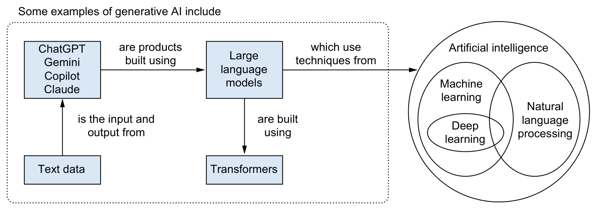

*图1.3 你将熟悉的各种术语及其相互关系的高层概览。生成式AI是对功能的描述：生成内容并运用AI技术来实现这一目标。*

注：视觉和语言并非生成式AI的唯一选择。

音频生成（比如文本转语音，像GPS报出路名）、玩棋盘游戏（如国际象棋），甚至蛋白质折叠都已应用生成式AI。本书将主要聚焦文本和语言，因为它们是GPT和LLM采用的主要数据类型。

正如其名“大型”所示，这些模型并不小。具体来说，ChatGPT据传[1]包含1.76万亿个参数，用于控制其行为方式。每个参数通常存储为一个浮点数（带小数点的数字），占用4个字节。这意味着模型本身需要7太字节的内存来存储。这个大小超过了大多数个人电脑的内存容量，更不用说那些拥有80GB内存的最强大的图形处理单元（GPU）了。GPU是专用硬件组件，擅长执行使LLM成为可能的数学运算。目前，构建LLM需要许多GPU，因此我们已经涉及大量的计算基础设施和多台机器的复杂性。相比之下，更普通的语言模型大多数情况下仅为2GB或更小——小超过5000倍，在更标准的硬件上构建和使用这样的模型要合理得多。

许多研究人员正在探索如何让LLM消耗更少的内存。有时，这类技术包括使用少于4字节存储一个参数的方法，即“混合精度”[2]。这种方法使用2字节或更少来存储某些LLM参数，并在准确性和内存效率之间做出权衡。最终，对准确性的影响通常可以忽略不计。这种优化是研究人员为提高LLM资源效率而采取的众多措施之一。

GPU 替代方案：尽管 GPU 是目前训练大语言模型最常用的硬件，但它们并非唯一选择。越来越多的公司正在开发专用硬件，这些硬件为训练机器学习模型提供了通用优势。例如，2018 年，谷歌将其张量处理单元（TPU）[3]作为谷歌云平台（GCP）的一部分开放给公众使用。尽管 TPU 的计算能力通常低于 GPU，但其专用架构使其在某些特定机器学习任务上表现优于 GPU。

### 你将学到什么

全书将解释大语言模型的工作原理，并为你提供理解它们所需的术语。读完本书后，你将能够从概念层面对大语言模型是什么及其操作的关键步骤有直观的理解。此外，你将对大语言模型的能力边界有所认识，特别是部署或使用时的注意事项。我们将讨论大语言模型的基本局限性要点，并提供如何规避这些局限的技巧，或者说明何时应完全避免使用大语言模型乃至更广义的生成式AI。

请注意，构建ChatGPT、Claude或Gemini等系统时Transformer的组合细节非常微妙，而本书主要聚焦于这些系统的共同点。事实上，我们无法知晓这些大语言模型之间的某些实际差异，因为尽管商业大语言模型提供商已公开了大量模型信息，但仍有一些信息（很可能是商业秘密）未予披露。

鉴于基于Transformer的大语言模型将对世界产生深远影响，我们有意识地扩大本书的目标读者群。未来几年，无论背景如何的程序员、高管、经理、销售、艺术家、作家、出版商等众多从业者，都将不得不与大语言模型打交道，或深受其影响。因此，我们假设亲爱的读者您具备基本的编程基础，熟悉逻辑、函数乃至一些数据结构等编程基本概念。同时，您也无需精通数学；我们会在必要时展示少量数学知识，但这对于理解大语言模型的工作原理并非必需。

这种定位意味着本书将很少出现代码。如果您想直接动手构建和使用大语言模型，Manning出版社的其他书籍——如Sebastian Raschka的《从零构建大语言模型》（2024年）或Edward Raff的《深度学习内幕》（2022年）——可作为本书内容的补充。然而，如果你想知道正在使用的大语言模型产生异常输出的原因、你的团队如何利用大语言模型、或哪些场景应避免使用大语言模型，又或者你的同事缺乏机器学习背景但需要快速掌握相关知识，那么这本书正是你和你同事所需要的。

特别地，本书第一部分聚焦于LLM的功能：其输入与输出、输入到输出的转换方式，以及我们如何约束这些输出的性质。第二部分则关注人类的行为：人与技术的交互方式，以及由此产生的使用生成式AI的风险。同样，我们还将讨论使用和构建LLM时出现的一些伦理问题。

**训练LLM成本高昂**

训练大型语言模型（LLM）对大多数人而言并不现实——这至少需要10万美元的投资，若想与OpenAI竞争，投入甚至高达1亿美元。与此同时，训练LLM所需的资源也在不断演变。因此，我们不会带你了解当前训练LLM的具体流程，而是聚焦于更具长期价值的内容——那些我们认为在未来数年依然有效的实用知识，而非几个月内就可能过时的示例代码。

### 1.3 介绍LLM的工作原理

生成式AI（GAI或GenAI）即将改变我们生产和与信息交互的方式。2022年11月ChatGPT的推出凸显了现代AI的能力，并吸引了全球相当一部分人的关注。目前，你可以在 https://chat.openai.com/ 免费注册试用。

如果你输入提示“用两句话总结以下文本”，然后附上本章的所有介绍性文字，你将得到类似下面的结果。

“近期人们对人工智能，特别是像OpenAI的ChatGPT这样的大语言模型（LLM）的关注激增，凸显了它们在自然语言处理方面的强大能力。本书旨在让读者对LLM、其操作细节、潜在应用、局限性以及使用中的伦理考量有一个通俗易懂的理解，同时仅假设读者具备基本的编码概念和极少的数学背景。这相当令人印象深刻，对于普通受众来说，这种能力似乎像是凭空出现的。”当你访问OpenAI的网站并注册ChatGPT时，你可能会注意到类似图1.4所示的选项。

顾名思义，GPT-4意味着OpenAI（在撰写本文时）正在开发其第四代GPT模型。像GPT-4这样的LLM是机器学习研究领域的一个成熟方向，旨在创建能够综合和响应信息、生成看似人为输出的算法。这种能力开启了人与机器之间多个此前只存在于科幻小说中的交互领域。ChatGPT中编码的语言表示能力使其能够实现令人信服的对话、遵循指令、生成摘要、回答问题、创作内容以及更多应用。实际上，这项技术许多可能的应用目前还不存在，因为


*图1.4 当你注册OpenAI的ChatGPT时，有两个选择：可以免费使用的GPT-3.5模型，或者需要付费的GPT-4模型。*

对于作为读者的你，关键因素在于，这项技术并非凭空出现，而是过去十年机器学习领域逐年显著进步的成果。因此，我们对LLM的工作原理及其可能出问题的方式已经了解得相当充分。

我们假定读者只需具备最基础的背景知识，这样你就可以把这本书送给朋友和家人。（一位作者希望能把这本书送给他母亲——她为他感到骄傲，尽管并不清楚他具体是做什么的。）因此，在深入之前，我们需要填补背景知识方面可能存在的巨大鸿沟。第一章旨在为你提供这些背景知识，以便下一章能开始回答这个问题：计算机到底是如何总结出这本书的导言的？

### 1.4 那么，究竟什么是智能？

从营销角度看，人工智能是个绝佳的名称，尽管它原本是用于指代整个学术研究领域。这种做法导致了一个微妙的问题，让人们对AI的运作方式产生了错误的心理模型。我们将尽量避免强化这种模型。为了解释原因，我们将讨论为什么人工智能并不是那么好的名称。通过思考一个简单的问题，我们就能轻易证明这一点：什么是智能？

你可能认为像智商（IQ）测试这样的东西能帮助我们回答这个问题。智商测试与学业成绩等多种结果密切相关，但并未给出智力的客观定义。研究表明，先天因素（遗传）和后天因素（环境）都会影响一个人的智商。我们能把智力简化为一个简单的数字，这本身就值得怀疑——毕竟，我们常批评有些人只是“书本聪明”而非“街头智慧”。即使我们知道了智力是什么，又是什么让它成为“人工”的呢？智力难道还有人工调味剂和食用色素吗？

归根结底，智商测试衡量的是你在有限能力范围内的表现，主要是在时间限制下解决特定类型的逻辑谜题，但它们无助于我们理解智力的本质。事实上，对于智力究竟是什么，并没有完美的理解。

人工智能领域长期以来一直在努力让计算机——这种刻板、确定、遵循规则的机器——执行人类能做但无法给出精确定义或指令的特定任务。例如，如果我们想让计算机数到1000并打印出所有能被5整除的数字，我们可以编写详细的指令，几乎任何程序员都能将其转化为代码。但如果我让你写一个程序，试图检测任意一张图片中是否有猫，那就是一个截然不同的挑战。你需要以某种方式精确定义什么是猫，然后定义检测猫的所有细节。我们到底如何编写代码来识别并区分猫的胡须和狗的胡须？当猫没有胡须时，我们又如何成功识别它？说到底，这并不容易。

然而，由于人工智能和机器学习专注于这些难以明确描述但人类却能完成的任务，用类比来描述人工智能和机器学习算法变得尤为普遍。为了让计算机检测猫，我们提供成千上万的猫图片和非猫图片作为示例。然后我们运行多种算法之一，通过具体、详细的数学过程来区分猫和世界上其他事物。但在技术术语中，我们称这个过程为“学习”。当模型未能检测出新图像中的猫，因为那是一只狮子，而狮子不在最初的猫列表里时，我们常说模型“不理解”狮子。

确实，每当试图向朋友解释某事时，我们常常使用双方都熟悉的类比。由于人工智能和机器学习广泛致力于复制人类执行任务的能力，这些类比常常使用暗示人类认知功能的语言。随着大语言模型展现出与人类接近的能力，这些类比变得弊大于利，因为人们过度解读，开始相信它们有超出实际的含义。

因此，我们将谨慎使用类比，并提醒读者不要过度延伸。有些术语，比如“学习”，是值得理解的技术行话，但我们希望你警惕它们可能暗示的含义。

在本书中，类比在某些情况下仍然有帮助，但我们会尽量明确解释这类类比的界限。

### 1.5 人类和机器如何以不同方式表示语言

注：对大脑结构的抽象已被证实在多个领域具有价值。

神经网络在语言、视觉、学习和模式识别方面展现了令人难以置信的进步。神经机器学习算法的进步、数字数据的急剧增长以及计算机硬件（如 GPU）的爆发式发展，这些因素的汇聚带来了让 ChatGPT 成为可能的突破。

这段讨论的关键在于，作为人类，你对语言有着与生俱来的理解力，这种理解力是随时间累积而成的。你对语言的学习和使用是交互式的。通过进化，我们似乎都拥有相对一致的学习和沟通方式。想进一步了解这一概念，可以查阅语言学家诺姆·乔姆斯基提出的普遍语法理论。与人类不同，LLM的语言表征是通过静态过程学习得到的。当你与Claude或ChatGPT对话时，尽管它们从未有过对话经历，它们还是会机械地参与对话。

LLM学到的语言表征质量可以很高，但并非毫无错误。这种表征是可操控的，我们可以通过特定方式改变LLM的行为，限制其感知或输出的内容。理解LLM通过从示例中推断出的关系来表征语言，有助于我们保持现实的期望。如果你打算使用LLM，它犯错的风险有多大？你如何利用语言表征来构建产品或避免不良后果？这些都是本书将要讨论的一些高层问题。

### 1.6 生成式预训练Transformer及其同类：术语“生成式预训练”

Transformer一词由OpenAI创造，用于描述他们2018年推出的一种新型模型，该模型集成了一种名为Transformer的神经网络组件。尽管最初的GPT模型（GPT-1）已不再使用，但其核心思想——预训练和Transformer——已成为近期生成式AI以及Claude、Gemini、Llama、Copilot等工具革命的核心支柱。

同样重要的是，要认识到这些基于GPT的AI工具只是LLM算法研究和应用广阔领域中的一个例子。除了ChatGPT的发布，我们还观察到LLM的惊人激增。一些LLM，例如EleutherAI和BigScience Research Workshop发布的模型，对公众免费开放，以推动研究和探索应用。如我们之前提到的，Meta、微软和谷歌等公司发布了其他LLM，其许可条款更为严格。任何人都可用于构建应用或系统的公开LLM，有时也称为基础模型，它们催生了一个充满活力的社区，包括研究人员、爱好者和公司，共同探索LLM和生成式AI带来的应用、局限和机遇。我们在这本书中教授的概念几乎适用于所有LLM。每个LLM都使用与ChatGPT相似（即使不完全相同）的结构生成输出。一本书要包含适用于众多模型的一般性总结，似乎是不可能的。然而，这是可能的，原因有几个，其中最重要的一点是，我们不会深入到足以让你从头编写LLM的程度。自然，ChatGPT和其他商业LLM的某些部分仍是商业机密。因此，我们的范围和描述有意概括了当今所有生成式LLM最常见的方面。我们能给出如此广泛适用的总结的第二个原因在于LLM的本质。虽然可以对它们的构建和运行方式进行许多调整，但该领域的研究人员一致发现，最重要的细节如下：

模型有多大？你能让它更大吗？构建模型用了多少数据？你能获得更多数据吗？

对于那些认为自己拥有能显著改善LLM工作方式的关键见解或设计的研究人员来说，这些观点可能会让他们感到沮丧，因为在许多情况下，同样的改进只需通过“做大”或构建拥有更多数据或更多参数的模型就能轻松实现。扩大模型规模和数据集规模是使用和构建LLM时诸多伦理问题中的一个关键组成部分，我们将在第9章讨论这些问题。

### LLMs为何表现如此出色

我们在接下来的章节中会详细讨论大语言模型的工作原理，但这里也有必要分享一个从机器学习算法研究中获得的重要经验。多年来，无论你试图完成什么任务，想要从算法中获得更好的性能，通常意味着要在算法设计上动脑筋。你会研究问题、数据和数学，试图推导出关于世界的有价值的真理，然后将其编码到算法中。如果你做得好，性能会提升，所需数据会更少，一切都会很完美。你可能听说过许多经典的深度学习算法，比如卷积神经网络（CNN）和长短期记忆网络（LSTM），从高层次来看，它们是人们绞尽脑汁、巧妙构思的结果。甚至更简单的“浅层”机器学习算法，比如不依赖神经网络或深度学习的 XGBoost，也是通过巧妙的算法设计创造出来的。

大语言模型展示了一种更新的趋势。它们并不在算法上耍聪明，而是保持简单，实现一个朴素的算法，仅仅捕捉信息之间的关系。在很多方面，大语言模型对世界预设的信念更少，没有强行嵌入算法中。从根本上说，这提供了更大的灵活性。如果我告诉你以前人们改进算法的方式正好相反，你可能会问这怎么可能是一个好主意呢？区别在于，大语言模型和类似技术只是规模更大，非常巨大。它们在更多的数据上训练，有更强的能力捕捉更多句子中更多单词之间的关系；这种暴力方法在性能上似乎已经超越了经典的机器学习方法。图1.5 说明了这一观点。

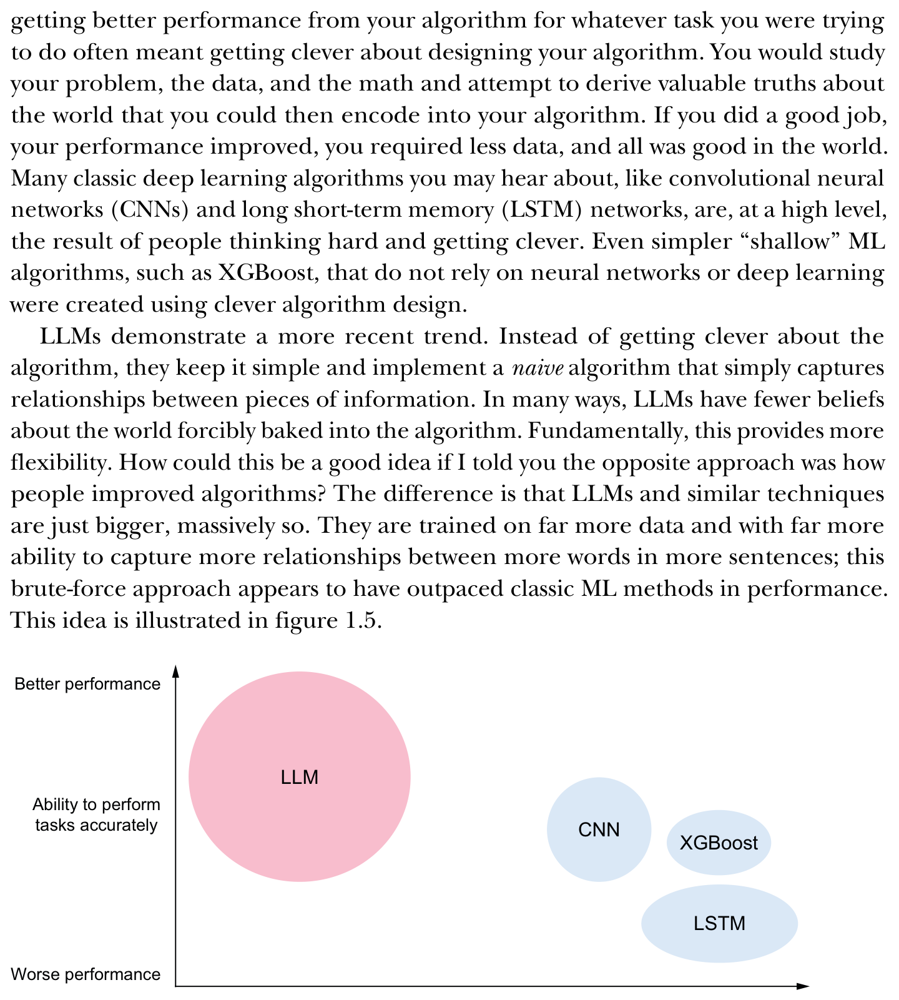

*图1.5 如果说算法的“聪明”程度取决于在设计过程中注入的信息量，那么传统技术往往通过比前辈更巧妙的设计来提升性能。正如圆圈大小所示，LLM大多选择了一种“更笨”的方法：使用更多数据和参数，并对算法学习施加极少约束。*

如前所述，更大并不代表所有指标都更好。这些模型目前在部署上存在物流和计算方面的挑战。许多现实约束，包括响应时间、功耗、电池消耗和可维护性，都受到了负面影响。因此，LLM 仅仅在一个狭隘的“性能”定义上有所提升。

不过，“做大”胜过“取巧”这一教训仍值得深思。有时，在设计机器学习解决方案时，即便你使用了LLM，最好的答案可能仍然是：“我们去获取更多数据吧。”

### 1.8 大模型实战：好、坏与可怕

整本书中，我们会给出LLM出错的例子，这些错误往往令人捧腹或显得愚蠢。这些例子的目的并非说LLM无法完成任务。通过调整输入、设置或碰碰运气，你往往能让LLM表现更好。这些例子的目的是向你展示LLM如何失败，经常是在一些连孩子都能做得更好的简单事情上。当你阅读本书并亲自与LLM交互时，这些例子应让你停下脚步，引发思考：“如果我使用ChatGPT处理困难任务，但它连简单任务都失败，我是不是在自找失败？”答案往往是响亮的“是！”

安全使用LLM需要对其输出保持一定程度的怀疑，努力验证其正确性，并具备相应调整的能力。如果你用LLM处理自己无法完成的任务，就有可能面对自己无法验证的错误结果。随着本书后面进一步讨论如何使用LLM，我们将不断融入这个观点及其应对方法。

当LLM正常工作时，很容易想象它能让生活更便利——比如回复所有邮件、总结长文档、解释新概念。但对许多人来说，自然而然想到的是事情如何出错并迅速变得危险。

这种对抗性思维常常可以先用一个例子引出：比如你想学习如何制造炸弹。如果你问ChatGPT这个问题，会得到经过过滤的答案：“抱歉，我无法协助这个请求。如果你处于危机或需要帮助，请联系当地相关部门或专业人士。”然而，研究人员最近展示了如何让ChatGPT及许多其他商业LLM毫不犹豫地回答这个问题，以及许多其他危险的信息请求[4]。

有人可能会说，如果有人聪明到能想出如何欺骗LLM，他们很可能也能从其他来源获取任何危险信息。这可能没错，但同时也忽略了LLM和生成式AI工具的自动化规模。没有AI或ML算法是完美的，如果数百万人提问，LLM有0.01%的概率可能产生危险响应。ChatGPT拥有超过1亿用户[5]，因此这意味着1万次危险响应。当你考虑恶意行为者可能开始自动化利用时，问题就更严重了。我们将在本书后半部分进一步讨论这个问题。

我们期待您加入我们，共同探索大模型的工作原理。最终，您将深入了解在业务或日常生活中运用大模型革命性能力时需考虑的诸多方面。

### 总结

ChatGPT 是一种大型语言模型，而大型语言模型本身属于生成式人工智能/机器学习这个更大的家族。生成式模型能够产生新的输出，LLM（大型语言模型）在输出质量上独树一帜，但其创建和使用的成本极高。LLM 的架构松散地模仿了人们对人脑功能和语言学习的不完全理解。这种模仿仅作为设计灵感，并不意味着模型具有与人类相同的能力或弱点。智能是一个多面且难以量化的概念，因此很难判断 LLM 是否具备智能。从能力和可靠性角度来思考 LLM 及其潜在用途会更容易。人类语言必须转换为 LLM 的内部表示，反之亦然。这种表示的形成方式将改变 LLM 学习的内容，并影响你如何利用 LLM 构建解决方案。


---

<a id="ch2"></a>

## 第 2 章: 分词器：大语言模型如何看待世界

如第1章所述，在人工智能领域，找到人类学习的类比来解释机器如何“学习”往往很有帮助。你阅读和理解句子的方式是一个复杂的过程，会随着年龄增长而变化，并涉及多个顺序和并行的认知过程[1]。然而，大语言模型（LLMs）使用的过程比人类认知过程更简单。它们采用基于神经网络的算法，从大量数据中捕捉词之间的关系，然后利用这种关系信息来解读和生成句子。

我们对这些算法工作原理的讨论将从它们的输入开始：文本句子。在本章中，我们将探讨大语言模型如何将这些句子处理成为模型的输入。正如语言对你思考和加工信息至关重要一样，LLM的输入在很大程度上影响着它能处理的概念和任务类型。

### 2.1 词元作为数值表示

LLM处理句子似乎是显而易见的，但要真正理解，我们必须更加具体。在讨论LLM工作原理时，你会发现文本句子对驱动LLM的神经网络算法来说并不自然，因为神经网络从根本上依赖数字来运作。如图2.1所示，LLM采用的算法在处理文本前必须将人类文本转换为数值表示。词元是LLM用来将文本拆分成可编码为数字的片段的一种表示。


*图2.1 要理解文本，LLM必须将文本分解为词元。每个独特的词元都有一个与之关联的数字标识符。*

你可以将令牌视为大语言模型处理文本的最小单位——一个“原子”，如果愿意这样理解的话，即构建一切其他事物的最小部分。那么，文本的原子是什么呢？考虑一下：当你阅读本书时，大脑用来处理意义的最小构建块是什么？两个自然的答案是字母和单词。将字母定义为原子非常诱人，因为单词由字母组成，但是你会刻意去阅读每个单词中的每个字母吗？对大多数人来说，答案是“不”。（如果你和本书联合作者之一一样患有读写障碍，这个问题就有些奇怪了。但认知处理过程很复杂，尚未完全理解；请容忍我们的比喻！）你会关注更显著的单词和单词局部。事实上，即使我们写错了拼写或用数字代替了字母，你也能大约理解这个句子。人们无意识地使用单词的局部来处理文本，而大语言模型正是基于同样的原理构建的。

在本章中，你将学习如何将文本转换为令牌的过程。首先，我们将更详细地讨论令牌；然后，我们将讨论决定如何将句子转换为令牌的程序。

### 2.2 语言模型仅见令牌

到成年时，大多数英语使用者掌握约30,000个单词[2]。最初驱动ChatGPT的LLM——GPT-3，拥有50,257个词元的词汇量[3]。这些词元并非单词，而是称为子词的单词组成部分，一种介于单词与字母之间的表示形式。直观上，词元捕捉了语言的最小有意义语义单元。例如，单词schoolhouse常被拆分为两个词元：school和house，而thoughtful则拆分为thought和ful。这有助于识别常见单词，并利用子词来解释我们从未见过的新词。人们常使用一种称为语义分解的类似技术来理解从未见过的单词。我们凭直觉将新词拆解成组成部分，基于已掌握的单词来理解其含义。

特征工程是将数据转换为更适合算法和待求解任务形式的过程。要构建一个能检测给定文本语言的算法，你可以编写代码，该代码以文本为输入，输出每个字符出现的百分比。例如，如果文档中出现大量é字符，你便拥有一个很好的特征，表明该文档可能是西班牙语或法语，而非俄语或中文。合理的特征工程需要考虑模型的工作方式、期望达成的目标，以及如何为模型与目标的组合准备数据。

词元化是LLM的特征工程；它至关重要，因为词元是模型与之交互的唯一信息。词元被视为独立、抽象的事物，它们之间没有内在联系。这些关系是通过对数据的观察习得的。

回顾图2.1，显然Dis和dis的词元是相关的，唯一的区别在于一个以大写D开头。然而，你可以看到模型分配给Dis的标识符是4944，而dis的是834。也就是说，模型本身看不到表示Dis和dis的词元之间的任何联系，尽管我们人类能看出明显的联系。模型甚至看不到Dis或dis本身。为了让LLM处理词元，我们必须将这些词元转换为数字，这样模型就会看到数字4944和834。重要的是，模型没有任何直接方式知道这些词元是相关的。

词元是子词到唯一数字表示的映射。相应地，词元化是将完整文本字符串转换为词元序列的过程。如果你之前使用过机器学习库（尤其是自然语言处理[NLP]工具），你可能熟悉一些简单的词元化形式。例如，一种简单的词元化过程通过基于空格分割文本来将文本拆分为词元。然而，这种方法限制了我们创建子词或处理不使用空格分隔单词的语言（如中文）的能力。

### 2.2.1 词元化过程

分词遵循的通用过程如图2.2所示，包含四个关键步骤：

1. 接收待处理文本——即从用户、互联网或任何包含所需文本的来源获取字符串数据类型（字母、数字或符号的集合）的文本输入。

2. 转换字符串——这通常涉及以某种有用的方式改变字符串，例如将大写字母转换为小写字母。此操作也可能出于安全原因（例如，文本来自用户，需要移除任何可能看似恶意输入的内容）或为了消除文本中无关的变体以帮助算法更好地学习。这个过程称为标准化。

3. 将字符串拆分为token——一旦获得字符串，就需要将其分割成一系列离散的子字符串；这些子字符串就是较大字符串中的token。这被称为分段。

4. 将每个词元映射到一个唯一标识符——唯一标识符通常是一个整数，从而产生LLM能够理解的输出。

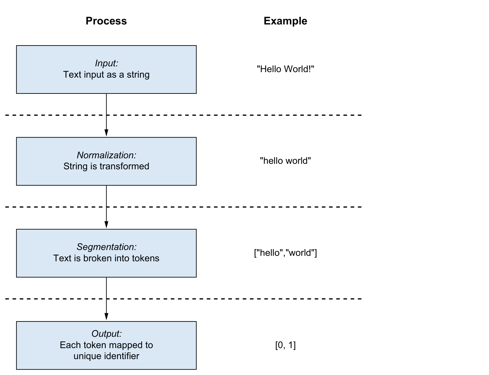

*图2.2 通常，分词过程包括处理输入，为每个token生成数字标识符。*

这个过程的第一个和最后一个部分几乎没有选择或不同行为的余地。首先，你需要输入来处理；最后，你需要每个token的一个数字标识符来存储和检索你将与该token关联的信息。中间的两个步骤，归一化和分词，是你可以选择如何操作的地方。

分词流程的最后一步是构建词汇表。模型的词汇表是指训练过程中，当我们向算法提供学习数据时，所见到的全部独立标记的总数。要构建一个包含大量独立标记的丰富词汇表，几乎总是需要海量数据。

为模型选择词汇表涉及一系列权衡：词汇表越大，模型能成功处理的信息就越多。想象一个一岁大的孩子，词汇量可能只有几十个词。这个孩子无法进行非常有效的交流（不过这没关系，他们有的是时间学习）。因此，更大的词汇表不仅能帮助模型理解更多事物，也会让模型变得更大。如果词汇表过大，模型可能会因为所需计算量而变慢，或者消耗过多的内存或磁盘存储，从而更难传输或共享到其他机器——例如，当它作为软件应用的一部分部署时。

通过处理训练数据并识别标记来构建模型的词汇表。每次遇到新标记，就根据已见过的独立标记数量为其分配一个唯一标识符。这个过程通常很简单，就是存储一个初始值为0的计数器，每发现一个新标记就加一。一旦完成这个过程，你就得到了一个实际上充当编码器的分词器。该分词器可以接收文本作为输入，并返回该文本的数字编码，供大语言模型算法使用。

### 2.2.2 控制分词过程中的词汇表大小

GPT-NeoX 是一个公开可用的大语言模型，其词表存储在磁盘上需要约 10 GB 空间。

这是大量数据，从存储和计算的角度看，已足以让许多实际应用场景面临挑战。

词表如此之大，若存于微型 SD 卡上，读取速度会慢得无法接受，从而使得在手机或某些游戏机上使用变得极其困难。

它大到无法实时流式传输，必须下载并加载到处理器的 RAM 中才能执行分词。

然而，词表必须足够大，才能表示模型在训练和使用过程中遇到的所有单词和子词。

假设模型遇到一个不在词表中的单词，且无法通过组合词表中的子词来表示该词。

在这种情况下，模型将无法捕获该文本片段的信息。

因此，必须在词表大小与模型解释多样化内容的需求之间权衡利弊。

在 NLP 中，这常被称为“未登录词问题”，即遇到无法用模型现有 token 表示的单词。

词表大小是影响 LLM 规模的一个因素，因此讨论控制词表大小的方法及其权衡至关重要。

在本节中，我们将描述改变分词过程的行为如何影响词表大小，进而影响模型的能力和准确性。


*图2.3 规范化过程通常涉及去除文本中的大写字符和标点符号。*

在图2.3中，我们聚焦于第二个转换步骤——归一化，它将大写字符“H”和“W”转换为小写，并移除标点符号。这些常见的归一化步骤源自经典的NLP流程，至今仍有时在现代深度学习方法中使用。它们能立竿见影地缩小词汇量。无需将“Hello”和“hello”表示为两个独立的词元，它们被映射成了同一个唯一词元。这种映射意义重大，因为每个句首大写的单词都可能需要在大写版本中重复出现，导致词汇量膨胀。这种归一化还有助于处理各种拼写错误。

例如，在撰写本书时，我们曾键入“LLMs”“LLms”和“llms”等各种大小写混用的笔误。将所有变体中的每个字符都转换为小写后，这些笔误就统一成了一个简单形式，从而获得更小的词汇量并减少歧义。

然而，将文本转为小写并非总能减少歧义。以“Bill”和“bill”为例。在第一种情况下，大写对于理解“Bill”很可能是一个人名至关重要，而“bill”更可能指代货币单位（或“bill”的其他定义）。大写不仅对理解文本含义至关重要，也对理解文本中的错误至关重要。再考虑一下我们在本书中误用大小写的各种方式，例如“LLMs”的多种写法。高质量的AI算法应该能够识别出我们犯了一个笔误并加以纠正！ChatGPT具备这种能力，因此需要在模型中保留大小写信息。因此，需要在词汇量和潜在模型精度之间进行重要的权衡。

在经典的NLP乃至不算太旧的深度学习模型（如BERT，即驱动ChatGPT的LLM的前身）中，算法识别并修正笔误的能力极其有限，除非专门为此设计解决方案。正因如此，过去投入大量精力设计鲁棒归一化步骤的工作，如今在LLM中大多已被舍弃。为了构建能够学会理解错误的更强大模型，我们需要更大的词汇量。

### 2.2.3 分词详解

分词过程中的规范化和切分步骤在很大程度上决定了词汇表的大小。

图2.4展示了其中一种最直接的分词策略。

该策略遵循一条简单规则：每当文本中出现空格时，就将较大的字符串分割成那些词元。

以“hello world”为例，只需在Python中调用"hello world".split(" ")即可。

这是一种合理的做法，也是我们人类阅读句子的方式。

但它也引入了微妙的复杂性。


*图2.4 分词过程将标准化文本拆分为单词或词元，以便每个单元可独立处理。*

文本中包含标点符号会怎样？如果使用空格规则将字符串“hello, world”转换为["hello,", "world"]，我们会遇到与大小写类似的问题。最终，同一个概念会得到两个不同的词元："hello"和"hello,"。传统方法通常通过移除标点或制定更复杂的字符串切分规则来解决这个问题。虽然这在减少词表大小方面迈出了正确的一步，但手动指定分词规则并不能解决其他问题。例如，对于像中文这样不使用空格分隔单词的语言，基于规则的分词策略会面临巨大挑战。

### 通过字节对编码识别子词

LLM的总体趋势是减少手工特征工程，让算法承担重任。因此，通常使用一种称为字节对编码（BPE）的算法将字符串拆分为token。字节对编码是一种将单词拆分为常见子词序列的算法。如今的BPE通常使用自定义分词器，几乎没有标准化。

注：通过实验观察，我们发现许多类似ChatGPT的产品会移除一些不显示的Unicode字符（Unicode本身存在一些怪癖），但除此之外，基本保持文本原样。大多数之前的语言模型确实使用了不同形式的规范化，而如何更好地对LLM文本进行规范化，我们认为这是一个开放且值得探讨的问题。

由于寻找最高效的子词集合在计算上非常昂贵，BPE 采用了一种启发式方法来走捷径。它首先将单个字母视为词元，然后找出出现最频繁的相邻字母对，并将它们组合成子词词元。算法会重复这个过程多次，即不断处理子词词元，直到满足某个阈值，词汇表“足够小”。例如，在第一轮中，BPE 算法检查英语中单个字母的出现频率，并频繁遇到彼此靠近的字母“i”、“n”和“g”。在第一轮中，BPE 可能会观察到“n”和“g”一起出现的频率高于“i”和“n”，因此它会生成词元 i 和 ng。在后续的一轮中，它可能会基于该字母组合的出现频率（与“ng”和其他字母或子词一起出现的频率相比）将这两个词元合并为 ing。一旦 BPE 达到停止点，它就会将诸如“eating”和“drinking”之类的单词识别为频繁出现的组合。它还可能将“ing”捕获为后缀，以便其他以该子词结尾的单词也能表示为词元。当算法完成时，我们得到的词元中既有完整的单词，也有子词。图 2.5 从高层次展示了这一过程。


*图 2.5 用于创建词元的简化字节对编码算法：首先，找到最频繁的字符对“ng”。接着，将所有“ng”实例替换为占位符词元“T”，并将“ng”添加到词汇表中。重复此过程，直到没有常见的字节对剩余。*

注意：运行BPE算法创建词表出乎意料地昂贵，因为它需要多次读取输入数据以计算最高频的字母组合。

虽然LLM在超过5亿甚至10亿页文本上训练，但它们的分词器通常只使用该数据中极小的一部分来创建。通常，分词器的训练文本规模小到只有一本小说那么大。

BPE 过程初看可能有些奇怪，但你可以将其理解为识别语料库中常见字符串的一种方法。例如，BPE 几乎总会将“New York”学习为一个 token，这很有用，因为纽约州和纽约市在文本中频繁出现。将整个概念表示为一个 token 使得利用这类信息更加容易。实际上，大多数常见词都会成为独立的 token，而罕见词则有望通过子词的组合来捕获。例如，GPT-4 会将 *loquacious* 分词为 *lo*、*qu* 和 *acious*。这一方法成功之处在于“acious”是表示倾向/习性的拉丁后缀，使得模型更容易正确处理不常见的词。但这也是一个失败案例，因为拉丁前缀“loqu”被拆成了两个 token 而非一个，增加了学习难度。

在使用 BPE 构建词汇表后，模型作者会出于各种原因手动添加额外的 token，例如对特定知识领域重要的词汇。正如我们将在下一节讨论的，在某些领域中，拥有正确的 token 可以通过捕获细微含义产生显著效果。因此，作者通常会确保包含必要的 token。模型作者还会添加一些不直接表示词缀、但为模型提供辅助信息的特殊 token。常见的例子包括“未知”token（通常表示为 `[UNK]`），在分词器无法正确处理某个符号时使用；以及系统 token `[SYSTM]`，用于区分模型的内置提示和用户输入数据，以及其他类型的风格标记。接受文本和图像输入的多模态模型使用独特的 token 来告诉模型输入流何时在表示文本数据的字节与表示图像数据的字节之间切换。

OpenAI 在开发 ChatGPT 时决定使用 BPE 将文本编码为 token，并将其分词器作为开源包 *tiktoken*（https://github.com/openai/tiktoken）发布。尽管如此，还有其他几种自动生成 token 的算法和实现可用，包括 Google 开发的 WordPiece 和 SentencePiece 算法 [4]。每种算法都有不同的权衡。例如，WordPiece 在构建分词器词汇表时使用了不同的技术来统计候选子词的出现频率。SentencePiece 中实现的一种算法会处理整个句子，在计算 token 时保留空白，这可能有助于构建处理多语言的模型时提升输出效果。然而，BPE 是使用最广泛的算法。例如，它在 Google 最近的 LLM 中被独家使用。无论选择哪种算法，分词器词汇表的大小都是由负责训练和增强分词器的数据科学家或工程师决定的关键模型参数。

接下来的章节将深入探讨词汇表大小以及分词器开发过程中的其他决策考量。

### 2.2.4 分词的风险

正如第一章所述，本书不会过多涉及编码。目的是让你对LLM的工作原理有一个合理的理解，并揭开一些神秘面纱，以便你能专注于LLM在你的工作中的应用。

分词是拼图的第一块。这是一个简单但有效的策略，用于生成LLM的输入。你已经了解了词汇表大小在模型可部署性中的重要作用，在识别细微差别与构建词汇表所带来的不必要冗余之间的权衡，分词过程如何影响词汇表大小，以及如何通过BPE自动化的词元选择过程。

分词时的选择既影响LLM今天的能力，也将影响其未来的发展。这些选择涉及一些值得关注的全局性挑战。为了进一步探讨该主题，BPE有两个显著但微妙的细节值得关注：句子长度与词元数量之间的关系，以及LLM可能被外观相同但二进制编码不同的字符（称为同形异义字）混淆的可能性。

### 更长的句子并不意味着更多的词元

BPE的一个反直觉之处在于：更长的句子并不代表更多token。为了理解原因，请看图2.6，其中展示了对两个不同字符串使用GPT-3的实际分词结果。字符串“I'm running”比“I'm runnin”多一个字符，但token数量反而少一个！如果你不信，可以在https://platform.openai.com/tokenizer上尝试对不同字符串进行分词。

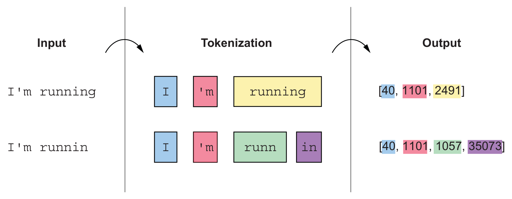

*图2.6 对两个不同句子进行分词*

这种差异之所以出现，是因为BPE贪婪地寻找任意输入的最小token集。在这个具体案例中，字符串“running”在训练数据中出现的频率足够高，因此拥有自己的token。当缺少字母“g”时，词汇表中没有对应于“runnin”的token，因为这种变体在训练数据中可能很少出现。因此，“runnin”至少需要被拆分成两个token，即run和nin。

分词器实现中的这一细微之处是软件bug的温床。不同的分词器可能对同一字符串给出不同的分词结果。在设计单元测试和基础设施时，务必牢记这一因素，以免在升级或切换分词器实现时迷失方向或感到困惑，因为不同实现可能导致token生成出现新的差异。这还可能影响LLM的评估，因为许多模型对空白字符的增加非常敏感，而不一致的分词方式可能无意中导致比较失去公平性。

### 同形字造成混淆

同形字是开发者在处理多种人类语言或考虑处理外部数据的安全影响时可能遇到的问题。当输入来自任意用户时，有时可能带有恶意，试图诱使模型做出不当行为。针对大语言模型的一种攻击方式就是同形字攻击。

同形字是指两个或更多字符虽然字节编码不同，但在屏幕上渲染时看起来完全相同。一个例子是大多数西欧语言中使用的拉丁字母“H”和东欧及中亚地区使用的西里尔字母“H”。

BPE会将使用不同字节编码的同形字编码为不同的token。结果，同形字会增加文本中的token数量，改变大语言模型解析信息的方式，并推高计算成本。一个有趣的同形字示例是Unicode字符U+200B，也称为“零宽空格”。这个字符用于排版，占据空间，但不会打印任何内容、显示任何内容或改变文档的渲染方式。

零宽空格是Unicode规范中许多奇异有趣的存在之一，可能被用来制造麻烦。因此，许多服务采用标准化步骤，去除这些奇怪字符，并将同形字替换为规范表示（即，任何看起来像“a”的字符都必须编码为a）。例如，OpenAI当前的tokenizer接口会移除同形字。如果你打算在自己的硬件或用户设备上部署大语言模型，就必须考虑同形字问题。

### 2.3 分词与LLM能力

如果我们只关心LLM生成高质量类人文本的能力，那么分词的具体细节远不如构建这些模型所用的数据和算力重要。如果你为模型投入足够的算力和规模，无论基础构件是什么，它们最终都能学到有用的表示。但有时，分词的差异会极大影响LLM的能力。本节将介绍几个例子。

接下来的例子可能与你用LLM要做的事情或工作直接无关。这完全没问题；这些例子不是为了劝你不要使用LLM。相反，目的是帮助你理解LLM学习的内容受限于所选表示形式，除非大幅改动工程实现，否则这些问题可能无法绕过。如果你开始用LLM构建应用时遇到重大困难，思考一下分词可能如何影响你的目标。如果问题确属分词所致，那么你能做的很有限，因此最好考虑其他方法，比如手动扩充词汇，加入对你应用重要的token。

### 2.3.1 大模型不擅长文字游戏

用户经常喜欢让大语言模型解决文字谜题或执行涉及文字游戏的任务。

例如，图2.7展示了一个文字游戏，其正确答案取决于单词中确切的字母顺序和字母数量。


*图2.7 这种分词方式意味着ChatGPT无法真正“看见”单个字符或单词长度。如果你提出需要识别子字符并以独特而非常规方式改变它们的问题，ChatGPT就会开始出错。正确的中间字符是“a”，但ChatGPT坚持认为是“e”。ChatGPT实际看到的是三个词元，分别代表P、ine和apple。*

玩文字游戏或许并非你的应用所关心之事，但文字游戏失败的原因却可能与你的问题高度相关。尽管诸如此类的许多例子都是玩具问题，在科学或商业上并不特别重要，但它们揭示了这些模型运作方式中的显著缺陷。这些缺陷在更实际的场景中也可能显现，例如当模型难以创作包含押韵或谐音的诗歌时。

考虑这样一个场景：你想构建一个回答用户处方药问题的应用。药物名称通常又长又容易混淆，人们常常记不住或拼写错误，而由于 LLM 不理解字母，它可能会将一种药物名称与另一种又长又奇怪的药物名称混淆。

由于药物名称不常见，即使是很小的拼写错误，它们的分词结果也会截然不同。例如，在 GPT-3 中，“Amoxicillin”和常见的拼写错误“Amoxicillan”没有共同的 token！这大大增加了 LLM 回答错误的风险，而这种风险本来就很高，因此 LLM 应用更需要彻底测试、极其谨慎地设计规避，或可能完全避免使用。

### 大型语言模型在数学上面临挑战

分词对形式符号推理任务影响显著，包括数学和棋盘游戏。数学和棋盘游戏都被LLM视为符号推理问题，其中单个token在与其他token结合时，有其特定的交互规则和含义。例如，包含单独数字token的模型在算术任务上通常表现更好。这是因为在GPT-3中，数字123456会基于分词器原始训练数据中的频率被拆分为两个token：["123", "456"]。这使得模型更难处理该数字中的各个数字。一些系统开发者通过在所有数字间插入空格来规范化数字，例如1 2 3 4 5 6，从而生成包含六个token的新输出，每个数字对应一个token。

这种数学能力的差异在图2.8中得到了很好的展示，该图显示了整个训练过程中算术计算的性能。上曲线是典型的BPE分词器，而下曲线（表现更好）是同一个分词器经过修改，实现了数字的逐数字分词。


*图2.8 对比了两个大型语言模型在训练过程中学习算术计算的表现。横轴为时间，上方曲线为典型的BPE分词器，下方曲线为同一分词器但修改为使用单个数字分词。纵轴表示模型准确执行计算的能力，数值越小表示错误越少。核心结论是，采用数字级分词的大型语言模型能够更好、更快地学习数学。*

### 2.3.3 大语言模型与语言公平性

大多数 LLM 分词器可以表示 Unicode 所涵盖的任何符号，这包括世界上大多数字母表中的字符。然而，这些分词器在表示特定语言的文本时效率差异巨大，尤其是因为分词器通常是在不同语言的较小文本资源集合上训练的。这可能会导致基于 LLM 的商业服务出现严重不公平 [5]，因为训练集中稀有语言中的单词在分词时默认被分解为更细粒度的子词，从而导致 token 用量增加。像 OpenAI 和 Anthropic 这样的商业 LLM 提供商通常按 token 收费，通常为每个输入到 LLM 或由 LLM 输出的 token 收取几分之一美分。考虑到一个高使用率的商业应用每天可能处理数千万个 token，这些成本会迅速累积。

LLM 完成请求所需的时间以及用户每个 token 支付的费用直接取决于分词器。因此，能够通过分词器更高效表示的语言在经济上更具优势，而那些表示效率不高的语言则处于劣势。以英语为基准，研究人员发现，使用 ChatGPT 和 GPT-4 回答德语或意大利语的用户查询时，成本高出约 50%。与英语差异更大的语言会产生更高的费用：通布卡语和保加利亚语的成本是英语的两倍以上，而宗卡语、奥里亚语、桑塔利语和掸语的处理成本超过英语的 12 倍。

### 2.4 检查你的理解

1 你预期以下单词或短语会如何被分词？尝试自己拆分它们，然后通过实际的LLM分词器运行，例如 https://platform.openai.com/tokenizer 上的分词器：

backstopped large language models Schoolhouse 你处理句子以理解它们的过程是一个复杂的、随年龄增长而变化的过程，涉及多个顺序和并行的认知过程。2 你认为对于之前的每个例子，大写字母与小写字母有多大影响？

尝试用不同的大小写再次提交它们。

4 既然token是LLM操作的基本单位，从技术上讲，分词器表示效率较低的语言成本更高，这合理吗？

5 LLM根据人们所说的语言不同而对同一服务收取不同费用，这是否是一个伦理问题？

你会认为这是歧视吗？

### 2.5 上下文中的分词

本章讨论的分词技术细节是LLM的基础构建模块，决定了它们能有效表示的输入和产生的输出。分词是ChatGPT这类LLM的关键组成部分，用于开发有效的文本表示，以便在训练过程中呈现海量信息时学习token之间的关系，解读用户输入并产生我们所习惯的高质量响应。LLM的潜力受到其采用的分词策略和词汇表的限制或激发，同时也与我们在后续章节中探讨的其他特征密切相关。

### 总结

分词是大语言模型理解文本的基础过程，它将句子转换为词元。

词元是文本中表示内容的最小信息单元。有时词元对应完整单词，但通常表示单词的一部分或子词。

分词包括将文本归一化为标准表示形式，这可能涉及将字符转换为小写，或转换Unicode字符的字节编码，以使视觉上相同的字符使用相同的编码。

分词还涉及分割，即将文本拆分为单词或子词。字节对编码（BPE）等算法提供了一种机制，可以基于训练数据集中字母组合的统计出现情况自动学习如何高效地分割文本。构建分词器的结果称为词汇表，它是分词器用来表示已处理文本的单词和子词词元的唯一集合。

分词器词汇表的大小会影响大语言模型准确表示数据的能力，以及理解和预测文本所需的存储与计算资源。

在大语言模型内部，词元用数字表示。因此，模型无法理解词元之间的关系，例如前缀和后缀，或者两个词元共享相似字母集的事实。为了支持特定知识领域，自动训练的分词器可以扩充，以提供对其应用重要的词元。不理解单个字母或数字的分词器在处理算术运算或简单文字游戏时会遇到问题。


---

<a id="ch3"></a>

## 第 3 章: Transformer 架构：输入如何转换为输出

在第2章中，我们了解到大语言模型（LLMs）将文本视为称为token的基本单位。现在我们来讨论LLMs如何处理它们看到的token。LLMs生成文本的过程与人类形成连贯句子的方式截然不同。当LLM运行时，它在处理token，但同时无法像人类那样操作token，因为LLM不理解每个token所代表的字母的结构和关系。

例如，说英语的人知道单词“magic”、“magical”和“magician”都是相关的。我们能理解包含这些单词的句子都与同一个主题相关，因为这些单词共享一个共同的词根。然而，在代表构成这些单词的token的整数上运行的LLMs无法理解token之间的关系，除非进行额外的工作来建立这些联系。

为此，LLM遵循机器学习和深度学习领域长期以来的周期性转换传统。首先，将词元转换为深度学习算法可处理的数值形式，然后LLM将这种数值表示再转换回新的词元。这个循环反复迭代，与人类的工作方式截然不同。如果你的同事每说一个词都要掏出计算器做几道数学题，你一定会非常担忧。

然而，正是这个过程让LLM生成输出。本章将分两个阶段来讲解这一过程。首先，我们高层面回顾整个流程，介绍基本概念，建立LLM如何生成文本的心理模型。接着，这个模型将作为深入讨论的框架，详细探讨LLM用于捕捉词语与语言之间关系、最终生成我们熟悉输出的组件细节和设计选择。

### 3.1 Transformer模型

如今你遇到的大语言模型大多使用一种名为Transformer的软件架构来解析词元并生成输出。该架构由一组算法和数据结构组成，通过将信息表示为神经网络中的数字来存储信息。本质上，Transformer是一种序列预测算法。尽管人们常用“推理”或“理解”语言来形容它们，但它们实际做的是预测词元。Transformer有三种不同的词元预测方式。虽然我们主要关注著名的GPT架构（更正式的名称为仅解码器模型），但也有必要介绍一下仅编码器模型和编码器-解码器模型：

- 仅编码器模型——这类模型旨在创建可用于执行任务的知识表示，即将输入编码为对算法更有用的数值表示。最佳理解方式是，它们接收文本并将其处理成机器学习算法更易使用的形式。它们广泛应用于科学研究。著名示例包括 BERT 和 RoBERTa。

- 仅解码器模型——这类模型旨在生成文本。最佳理解方式是，它们接收一篇部分完成的文档，然后通过预测下一个 token 来生成该文档可能的后续内容。著名示例包括 OpenAI 的 GPT 和 Google 的 Gemini。

- 编码器-解码器模型——这类模型同样旨在生成文本。与仅解码器模型不同，它们接收整段文本并生成对应的另一段文本，而非延续已有的内容。它们不如仅解码器模型流行，因为训练成本更高，且使用起来有时更具挑战性。对于输入和输出序列定义明确的任务，编码器-解码器模型通常优于仅解码器模型。例如，它们在翻译和摘要任务上远优于仅解码器模型。著名示例包括 T5 和为 Google 翻译提供支持的算法。

无论使用哪种类型的Transformer，模型的基本组件都由三个基本层构成，只是在内部排列方式上有所不同。它们之间的可互换性可以用汽油发动机来类比：所有发动机的工作原理相似，并且拥有相同的基本组件。这些组件（即层）在发动机（即Transformer）中组合方式的不同，会在性能上产生各种权衡。

LLM 是我们如今称为神经网络的数百种算法之一。

然而，这个名称在多个方面存在误导性。首先，今天构成神经网络方法的内容非常广泛，以至于提到“基于神经网络的方法”并不能让读者对具体方法有太多了解。其次，名称中的“神经”部分与神经科学或大脑运作方式几乎没有关系。有时，有一种直观的灵感风格：“嘿，大脑有点像这样；我们能模仿这种行为并从中得到有用的东西吗？”但大多数当前方法并非如此。第三，神经网络更像是组装数据结构的一种标准约定，而不是特定算法。想想建造房屋：你使用2x4木料、石膏板，以及多种橱柜、油漆和设计选择，将所有东西组装成一个家。每个家看起来独特但又熟悉：它们都以预期的方式组装。神经网络的“层”是最小组件，但你可以以不同方式使用多种类型的层。Transformer 是组装成更大网络的众多组件之一。

### 3.1.1 Transformer模型的层

图3.1描述了Transformer模型的核心组件：嵌入层（生成能够容纳更多意义的词元表示）、Transformer层（基于词之间的关系进行预测）以及输出层（将Transformer内部使用的数值表示转换为人类可读的文字）。


*图3.1 Transformer模型的基本组件，包括嵌入层、多个Transformer层和输出层*

现在我们来详细看看这些层：

- 嵌入层——嵌入层以原始token作为输入，并将其映射成能够捕捉每个token意义的表征。例如，在第2章中，我们讨论了token如何代表概念，但单个token之间没有任何关系。考虑单词“dog”和“wolf”。凭借我们对语言的理解，我们知道这些词是相关的，但我们需要某种方式来在神经网络中捕捉这种关系。这正是嵌入层所做的。它捕捉每个token的信息，这些信息编码了它的含义，并允许我们表达它与其他token的概念关系。因此，我们可以捕捉到这样的概念：token“dog”和“wolf”的表征比token“red”和“France”的表征彼此更相似。你可以将嵌入层视为模型中处理页面上单词并将其映射到你脑海中的抽象概念表征的部分。

- Transformer层——Transformer层是语言模型中大部分计算发生的地方：它们捕捉由嵌入层创建的单词之间的关系，并承担大部分实际工作以获得输出。虽然LLM通常只有一个嵌入层和一个输出层，但它们有许多Transformer层。更强大的模型拥有更多的Transformer层。人们很容易将Transformer层描述为模型的“思考”部分。这个定义错误地暗示Transformer层（或由它们构建的更大型模型）能够思考，但人类的思考具有自反性，且持续时间和努力程度可变。你可以思考某件事半秒钟或几个月，具体取决于任务所需的努力。Transformer总是对每个任务重复相同的过程，付出相同的努力。没有内省，也无法改变Transformer层的心理状态。因此，更好的理解方式是将Transformer层视为一组模糊规则——模糊是因为它们不需要精确匹配（因为嵌入可能返回类似“dog”到“wolf”的相似内容），规则是因为Transformer没有灵活性。一旦学习完成，Transformer层每次都会做相同的事情。

- 输出层——模型完成计算后，在输出层中执行额外的转换以获得有用的结果。最常见的是，输出层作为嵌入层的逆操作，将计算结果从捕捉概念的嵌入空间转换回捕捉实际子词的token空间，以构建文本输出。你可以将其视为模型中接收你已决定的答案，然后通过选择最有可能代表组成答案的概念的词，来选择实际单词在页面上表达该答案的部分。最后，我们以去嵌入过程结束，它将嵌入转换为token。因为每个token与子词一一对应，我们可以使用简单的字典或映射将token再次转换为人类可读的文本。图3.2详细描述了这一过程。

### 3.2 详细探索Transformer架构

为深入理解LLM的内部运作，不妨重新梳理我们之前描述的一系列步骤。图3.2展示了这一重构结果，其中概述了七个步骤。我们将参照前文已述的章节来标记每个步骤，若遇到即将解释的新内容，也会明确说明。本章集中呈现了大量信息，因此我们将逐一拆解讲解。


*图3.2 使用大语言模型将输入转换为输出的过程*

1. 将文本映射为词元（第2章）。

2. 将词元映射到嵌入空间（新增，第3.2.1节）。

3. 为每个嵌入添加捕获词元在输入文本中位置的信息（新增，第3.2.1节）。

4. 将数据通过一个Transformer层（重复L次）（新增，小节3.2.2）。

5. 应用解嵌入层，得到可能构成良好回复的token（新增，小节3.2.3）。

6. 从可能的token列表中进行采样，生成单个回复（新增，小节3.2.3）。

7. 将响应中的令牌解码为实际文本（第2章）。

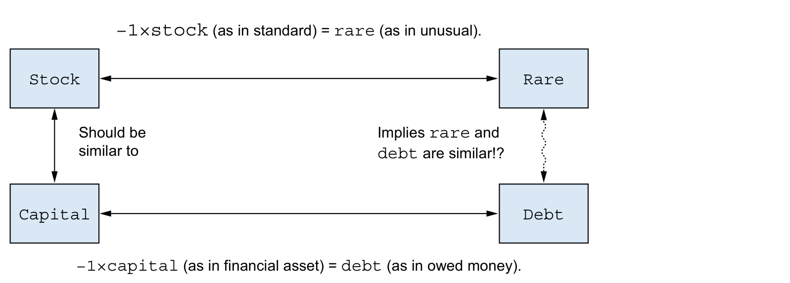

*图3.3 如果仅用一个数字表示一个词元，你很快会发现相似/不相似的词无法彼此适配。这里我们看到，即使只有几个词，试图表示简单的同义/反义关系也很快变得荒谬。*

分词、嵌入以及语言如何被精确转换为模型能理解的内容，存在许多细微之处。最重要的细微之处在于，神经网络仍然不直接处理token。总体而言，神经网络需要可以操作的数字，而token具有固定的数值标识。我们不能改变token的标识，因为该标识使我们能够将token转换回人类可读的文本。我们需要一个层，将数字形式的token转换为其所代表的单词或子词。

例如，假设我们有一个表示stock的词元，我们任意决定将其转换为某个数字（如5.2）。我们希望给相关的金融词汇（如capital）赋予一个相近的数字（如5.3），因为它们含义相近。此外，stock的其他含义还有反义词，例如rare。假设我们用负值来表示反义概念，给rare赋值为-5.2。但问题变得复杂了，因为capital的另一个反义词是debt。然而，如果反义词就是对原词取负值，那么debt和rare就有了相似的含义，这显然是荒谬的。图3.3说明了这个问题：当我们用一个单一数字表示一个单词时，我们无法在编码它们的关系时避免暗示与其他单词的奇怪关系，而这还只是四个单词的情况！


*图3.4 为词元表示增加一个维度，使我们能够表示更多样化的语义关系排列。这里展示了两个维度如何捕捉同一词语的多重含义关系。*

诀窍在于用多个数字表示每个词元，从而能够找到更好的表示，以适应词语间的不同关系。图3.4展示了一个使用两个数字的示例。我们可以观察到，比如"bland"与"rare"和"well-done"几乎等距，同时"bank"与前面提到的三个词距离很远，而更接近"stock"。我们甚至还能再加入几个词。使用的数字越多（在领域术语中称为维度），就能表示越复杂的关系。

维度灾难 如果更多维度能更好地捕捉微妙含义，为什么不用尽可能多的维度来表示数据呢？当处理大量维度时，会出现几个问题。一个主要问题是，LLM处理大量嵌入，增加维度会增加存储和处理嵌入所需的内存和计算量。此外，随着维度的增加，语义空间的规模会爆炸性增长，训练机器学习模型以学习语义空间中所有位置所需的数据量和时间也会呈指数级增长。数学家理查德·E·贝尔曼提出了“维度灾难”这一术语来描述这种现象，因为尽管我们希望创建一个能够捕捉细微含义的空间，但受到所创建空间基本属性的限制。

在LLM术语中，用于表示token的数字列表被称为嵌入。你可以将嵌入理解为浮点数值的数组或列表。简而言之，我们称这样的数组为向量。向量中的每个位置称为维度。如图3.4所示，使用多个维度可以捕捉人类语言词语关系的细微差别。由于嵌入存在于多个维度中，我们常说它们位于语义空间中。在某些机器学习应用中，这被称为潜在空间，特别是在处理非文本数据时。语义空间是一个模糊的术语，在该领域并未明确定义，但它通常用于简略表述：表示每个token的向量嵌入具有良好的性质——同义词/反义词距离更近/更远，我们可以利用这些关系产生有效结果。例如，图3.5展示了一个著名案例：通过减去男性嵌入并加上女性嵌入，可以构建一个“女性化”转换。此转换可应用于许多不同的男性词汇，以找到相同概念的女性词汇。图3.5右下角所有“皇室”词汇的聚集也是有意为之，因为高维空间可以同时维持多种不同的关系。

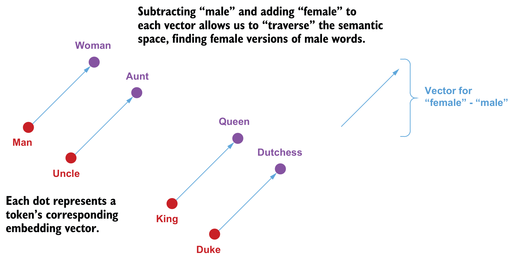

*图3.5 展示了嵌入向量之间的关系如何构成语义空间。含义相近的词彼此靠近，且同一变换可应用于多个词以产生相似结果——本例中，变换用于寻找阳性词的阴性对应词。*

令人惊讶的是，我们无法保证这些语义关系会在训练过程中形成。只是它们常常会形成，并且被发现非常有用。进一步说，语义空间中的关系并非万无一失，数据中的偏见可能会渗透进来。例如，模型往往会认为“医生”更接近“男性”，而“护士”更接近“女性”，因为在构建大多数模型所使用的常见文本中，医生被描述为男性、护士被描述为女性的情况更为普遍。因此，这些关系并非发现的世界真理，而是对训练数据的一种反映。

### 添加位置信息

一个关键问题是标准Transformer无法理解序列信息。如果你给Transformer一个句子并重新排列所有token，它会认为所有可能的排列都是相同的！图3.6展示了这一问题。


*图3.6 **图 3.6** 没有位置信息时，Transformer 无法理解输入具有特定顺序，所有可能的 token 重排在算法看来都是相同的。这很有问题，因为词序可能改变词的上下文，或者如果随机打乱，就可能变成胡言乱语。*

因此，嵌入层会生成两种不同的嵌入。首先，它会创建一个词嵌入来捕捉词元的语义；其次，它会创建一个位置嵌入来捕捉词元在序列中的位置。

这一想法出奇地简单。正如我们将每一个唯一的词元映射到一个唯一的语义向量一样，我们也将每一个唯一的词元位置（第一个、第二个、第三个，等等）映射到一个位置向量。因此，每个词元将被嵌入两次——一次用于其身份，一次用于其位置。然后将这两个向量相加，得到一个同时表示该词及其在句子中位置的向量。此过程如图3.7所示。

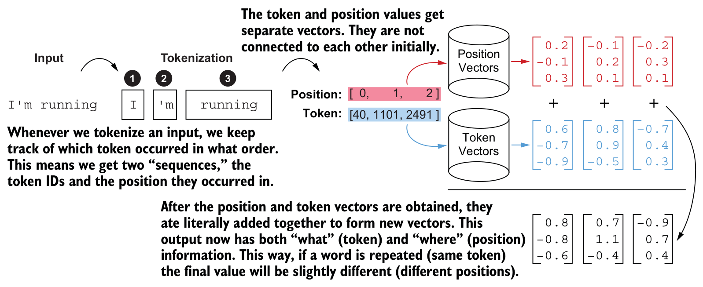

*图3.7 词嵌入无法捕捉输入词元按特定顺序出现的事实。这一信息由位置嵌入捕获。位置嵌入的工作原理与词嵌入相同，并与词嵌入相加。最终得到的组合嵌入包含了模型理解词元顺序所需的信息。*

这些就是理解如何将 token 转换为 Transformer 层向量所需的所有缺失细节。这种策略可能看起来有点天真，说实话确实如此。人们尝试过开发更复杂的方法来处理这些信息，但这种“把一切都变成向量然后直接相加”的简单方法效果出奇地好。重要的是，它在视频和图像领域也取得了成功。一种简单直接的策略能够足够好地处理许多不同的问题，这非常有价值，因此这种看似天真的方法被广泛采用。

### 3.2.2 Transformer 层

Transformer 层的目标是将输入转换为更有用的输出。大多数先前的神经网络层（如嵌入层）旨在将关于世界运作方式的非常具体的信念融入其操作中。

其理念是，如果编码的信念确实符合世界的实际运作方式，那么模型就能用更少的数据获得更好的解决方案。

而 Transformer 采取了相反的策略。

它们编码了一种通用机制，只要有足够的数据，就能学习许多任务。

为此，Transformer 通过三个主要组件运作：

- 查询——查询是来自嵌入层的向量，表示你正在寻找的内容。

- 键——键向量表示与查询配对的可能答案。

- 值——每个键都有一个对应的值向量，即当查询与键匹配时返回的实际值。

这种术语对应Python中字典（dict）对象的行为。你可以通过键在字典中查找项，然后创建有用的输出。区别在于Transformer是模糊的。我们不是查找单个键，而是评估所有键，根据它们与查询的相似度进行加权。图3.8通过一个简单示例展示了这一点。虽然查询和键显示为字符串，但这些字符串代表了每个字符串通过嵌入层映射到的向量。

让每个键都对一个查询贡献权重可能会很混乱，尤其当查询与某个特定键存在精确匹配时。这个问题通过一种称为注意力或注意力机制的细节来解决。

Transformer内部的注意力机制可以类比为你关注重要事物的能力。你可以过滤掉无关和干扰信息（即不良键），主要关注重要信息（最佳匹配键）。这个类比更进一步：注意力是自适应的，重要程度取决于其他可用选项。老板给你布置本周任务时占据你的注意力，但火警响起会将你的注意力从老板转移到警报（以及可能的火灾）。

生成下一个token时，Transformer会获取当前token的查询，并将其与所有先前token的键进行比较。比较查询和键会生成一系列值，注意力机制利用这些值来计算


*图3.8 展示了Transformer内部查询、键和值的工作原理，并与Python字典进行了对比。当Python字典将查询与键匹配时，需要精确匹配才能找到对应的值，否则返回空值。而Transformer总是根据查询与键之间最相似的匹配来返回结果。*

在决定下一个生成哪个token时，模型应为每个可能的后继token分配多少权重。每个token的值告诉模型每个先前token认为其对该概率的贡献应该是多少。然后注意力函数计算下一个token，如图3.9所示。

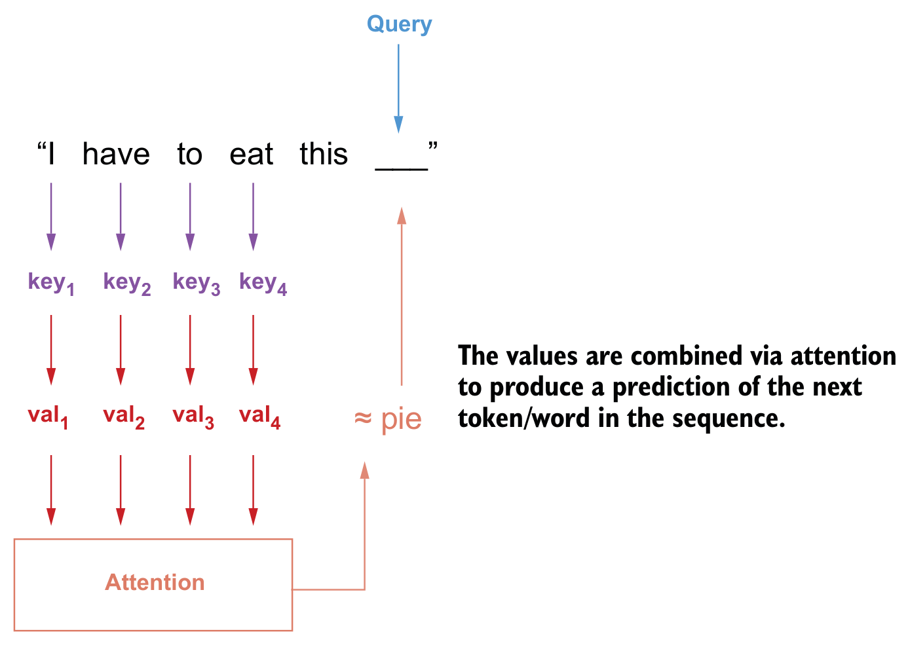

*图3.9 句子中的下一个标记通过将当前标记作为查询，并计算与前面单词作为键的匹配来预测。各个值本身不需要存在于语义空间中；注意力机制的输出产生与词汇表中某个标记类似的结果。*

注意力机制的数学原理是什么？

我们不会深入探讨注意力机制背后的每一个数学细节，因为描述它们会占用大量篇幅，而且其他地方已有覆盖。我们曾在之前的一本书中详细阐述过：《Inside Deep Learning》[2] 的第11章从技术层面详细解释了Transformer和注意力机制。

对于好奇的读者，核心公式是：Attention = Softmax( (Q·K)/√d ) V (3.1)

查询、键和值分别由独立的矩阵Q、K和V表示。矩阵乘法使得注意力机制在GPU上实现时非常高效，因为GPU可以并行执行大量乘法运算。softmax函数通过将许多值赋为接近零，实现了注意力类比的核心部分，从而使transformer忽略不重要的项。

norm和Feedforward的最后一步是通过跳跃连接应用层归一化和一个线性层。如果你对这些术语不熟悉也没关系，理解本书剩余内容并不需要了解这些数学细节。若想了解这些术语的含义，我们建议阅读《Inside Deep Learning》[2]以获取技术细节。

Transformer 模型由数十个 Transformer 层组成。中间 Transformer 层执行与图 3.9 中描述的相同机械任务，尽管不需要预测 token，因为只有最后一个 Transformer 层需要预测实际 token。Transformer 层足够通用，组合多个中间层使得模型能够学习复杂任务，如排序、堆叠和其他复杂的输入变换。

### 3.2.3 去嵌入层

LLM的最后阶段是解嵌入层，它将Transformer使用的数值向量表示转换为特定的输出token，从而使我们最终能够返回该token对应的文本。

这个输出生成过程也被称为解码，因为我们把Transformer的向量表示解码为一段输出文本。

这是使用LLM生成文本的关键组件。

解码当前token对于产生输出至关重要，而且下一个token将依赖于之前选择的每个输出token。

这一过程如图3.10所示，我们递归地逐个生成token。

用统计学的术语来说，这被称为自回归过程，即输出的每个元素都基于之前的输出。


*图3.10 LLM生成输出涉及将文档转换为token，然后使用模型产生输出。我们循环此过程以消费文本并生成人类可读的输出。*

你可能会好奇这个过程是如何停止的。在构建词元词汇表时，我们会包含一些文本中不会出现的特殊词元。其中一种特殊词元是序列结束（EoS）标记。模型在带有自然终点的文本上进行训练，这些文本以EoS标记结束。当模型生成新词元时，EoS词元是它可以生成的选项之一。如果生成了EoS，我们就知道是时候停止循环并将完整文本返回给用户了。如果模型进入不良状态而无法生成EoS词元，设置最大生成限制也是一个好主意。

### 采样 Token 生成输出

这个过程中缺失的一环是：如何将由 Transformer 层产生的浮点数向量（即数组）转化为单个词元。这一过程被称为采样，因为它采用统计方法，基于 LLM 的输入和当前输出，从词汇表中选取候选词元。LLM 的采样算法对这些候选词元进行评估，从而选择要生成的词元。有多种采样技术，但它们都遵循相同的基本两步策略：

1 对于词汇表中的每个token，计算其成为下一个被选中token的概率。

2 根据计算出的概率随机选取一个token。

如果你使用过ChatGPT或其他LLMs，你可能已经注意到，对于相同的输入，它们并不总是给出相同的输出。解码步骤就是为什么你每次问同一个问题可能会得到不同答案的原因。

随机选择token似乎有违直觉。然而，这是生成高质量文本的关键组成部分。考虑图3.11中的文本生成示例，我们试图补全句子“我喜欢吃。”如果模型总是选择概率最高的“寿司”作为下一个token，那将是不切实际的。如果在这种语境下有人总对你说“寿司”，你会觉得有点不对劲。我们需要随机性来处理存在多种合理选择且并非所有选项都可能发生的事实。

- 2.对每个可能的token计算一个概率，大多数token的概率接近零。

BBQ 23% bbq 7%

3. 掷一个加权骰子来决定下一个 token。

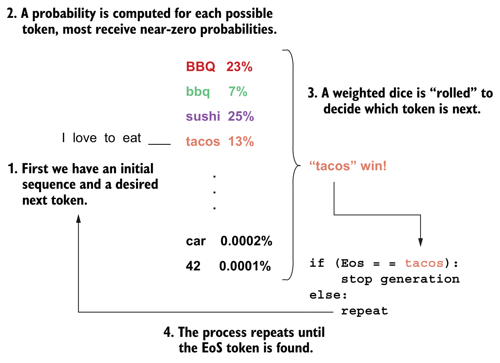

*图3.11展示了文本生成过程：从短语“I love to eat”开始，然后展示一些可能的补全——例如barbeque和sushi这类食物具有高概率，而car和数字42概率较低。加权随机选择最终选出了单词tacos。当EoS token出现时，生成循环停止。*

另外，在图3.11的例子中注意，其他标记（比如42）由于概率极小，毫无意义。再次强调，我们需要为每个标记分配概率，以了解哪些标记可能或不可能。

如何获取每个 token 的概率？

每个可能的下一个token被选中的概率各不相同。大多数token被选中的概率几乎为零。敏锐的读者可能会问：在不知道其他token的情况下，如何为某个token分配概率？我们通过给每个token一个分数来实现，该分数表示该token的嵌入与当前向量（即transformer的输出）的匹配程度。分数是任意的，取值范围从负无穷到正无穷，且每个token独立计算。然后利用分数之间的相对差异来生成概率。例如，如果一个token的分数是65.2，另一个token的分数是-5.0，那么这两个token被选中的概率分别接近100%和0%。如果分数分别是65.2和65.1，那么概率分别接近50.5%和49.5%。

类似地，0.2和0.1的分数会与65.2和65.1的分数得到相同的概率，因为我们关注的是分数之间的相对差异来分配概率，而不是分数本身。

有时Transformer会生成一些离奇或无意义的输出。虽然不常见，但由于其他令牌的概率近乎为零，最终总有一个你意想不到的奇怪令牌会被选中。一旦选定了意外令牌，后续所有生成的令牌都会试图使这次异常输出合理化。

例如，如果LLM输出“我爱吃粉笔”，你会相当惊讶。但这也不完全离谱，因为吃粉笔是一种名为异食癖的医学症状。一旦选中了“粉笔”这个词，LLM可能会转而讨论异食癖或其他医学话题——当然，前提是你足够幸运，这个异常输出属于“罕见但合理”的范畴，而非完全离谱的预测。

注意：有许多算法可以计算用于选择生成词汇的最终概率。

其中之一是核采样（也称为 Top-p 采样），该算法确定概率最高的词元作为潜在输出，并从该列表中选择要输出的词元。这种方法可以帮助我们避免不合理的预测。如果可能，你应该检查你的 LLM 使用的是哪种采样算法，以便了解其产生罕见乃至不合理输出的风险。

### 3.3 创造力与主题回应的权衡

根据用户计划如何与大语言模型交互，可能期望生成出人意料或富有创意的输出。假设你正在使用一个大语言模型来帮助头脑风暴新产品创意，并且你用一个聊天机器人作为数字化的回音壁来激发灵感。在这种情况下，你可能希望生成不同寻常的输出，因为目标是创造性地思考并想出新的东西。

相反，有时创造力是完全不必要的。大语言模型的一个潜在用途是离线搜索，你可以将大语言模型安装在（相对强大的）手机上，在没有互联网连接时也能查询或查找信息。在这种情况下，你希望大语言模型的输出可靠、切题且基于事实。不需要创造性的重新诠释。

大语言模型中一个称为“温度”的特性平衡了这种权衡。温度变量（一个介于0和1之间的数字，通常默认值为0.7或0.8）用于放大低概率令牌的可能性（高温）或压低低概率令牌的可能性（低温）。

考虑一杯水中的分子作为类比。假设我们想知道哪个分子会在杯子的顶部（别问为什么；先接受它）。如果杯子被降温到绝对零度，所有分子都将静止，杯子顶部的分子将每次都可靠地相同（即，你总是生成相同的令牌）。如果你将杯子的温度升高到开始沸腾，分子会四处弹跳，使得杯子顶部的分子变得完全随机（即，你得到一个完全随机的令牌）。随着你上下调整温度，你改变了在更高随机性（因此通常更具创造性）和仅关注最可能的下一个令牌（从而保持生成内容更切题）之间的平衡。

在实际意义上，考虑我们的例子“我喜欢吃”，较高的温度会导致生成不同类型的食物，不仅仅是披萨或寿司，还可能是一些不太典型或更具体的食物，如威灵顿牛排或素食辣椒。

### 3.4 上下文中的Transformer

本章我们已介绍了很多内容。嵌入层、Transformer层和解嵌入层是让LLM工作的核心构建块。LLM如何编码语义和位置，然后利用多层Transformer层揭示文本结构，这些概念对于理解LLM如何捕获信息并生成高质量输出至关重要。但我们还有更多细节要讲！我们最初究竟是如何创建这些层，通过分析海量数据来生成嵌入和概率的？在第4章中，我们将继续探索如何将数据输入该架构，并通过训练过程激励LLM“学习”文本中的有意义关系。

### 小结

虽然LLM以token作为语义的基本单位，但在模型内部，它们数学上表示为嵌入向量而非字符串。这些嵌入向量能够捕捉邻近性、差异性、反义词及其他语言描述属性之间的关系。位置和词序并非Transformer天生具备，而是通过另一个表示相对位置的向量来获得。模型通过将位置向量与词嵌入向量相加来表示词序。Transformer层类似于一种模糊字典，对近似匹配返回近似答案。这一模糊过程称为注意力机制，它使用查询、键和值这些术语，类似于Python字典中的键值对。ChatGPT是仅有解码器的Transformer模型的一个例子，但也存在仅有编码器的Transformer和编码器-解码器Transformer。仅有解码器的Transformer最擅长生成文本，但其他类型的Transformer在其他任务上可能表现更好。LLM具有自回归特性，即递归工作。每个步骤中，所有先前生成的token都会被输入模型以获取下一个token。简而言之，自回归模型利用先前的内容预测下一个内容。

任何Transformer的输出并非标记本身，而是每个标记的概率分布。选择一个具体标记的过程称为解嵌入或采样，其中包含一定的随机性。

随机性的强度可以调节，从而产生更逼真、更具创意或更一致的输出。大多数大语言模型都有一个看似合理的默认随机性阈值，但你可能需要根据不同的用途进行调整。


---

<a id="ch4"></a>

## 第 4 章: LLM 如何学习

“学习”和“训练”这两个词在机器学习社区中常用来描述算法在观察数据并根据观察进行预测时所做的事情。我们不太情愿地使用这套术语，因为虽然它简化了对这些算法运算过程的讨论，但我们认为它并不理想。从根本上说，这套术语导致了对大语言模型和人工智能的误解。这些词暗示算法具有类人特质；它们诱使你相信算法展现出涌现行为，并且能力超乎其实际所能。在基本层面上，这套术语是不正确的。计算机的学习方式与人类截然不同。模型确实会根据数据和反馈进行改进，但至关重要的是，必须将其机制与人类学习等任何事物区分开来。事实上，你很可能不希望人工智能像人类一样学习：我们一生中花费多年时间专注于教育，却仍然会做出愚蠢的决定。

深度学习算法的训练方式远比人类学习更具公式化。其公式化既体现在字面意义上——大量使用数学，也体现在比喻意义上——遵循简单的重复流程，重复数十亿次直到完成。我们不会涉及数学细节，但本章将帮助你揭开大型语言模型训练的神秘面纱。

许多机器学习算法都使用一种名为梯度下降的训练算法。该算法的名称本身就暗示了一些细节，我们将通过对梯度下降在机器学习中应用的高级概述来回顾这些细节。一旦你理解了训练多种不同模型类型的通用方法，我们将探讨如何将梯度下降应用于大型语言模型，以创建能够生成令人信服的文本输出的模型。

理解这些细节将帮助你避免诸如“学习”这类词所隐含的不准确涵义。更重要的是，它还将使你更好地理解大型语言模型在当前设计下成功与失败的情况，以及这类算法产生误导性输出的那些往往很微妙的方式。

### 4.1 梯度下降

梯度下降是所有现代深度学习算法的核心。当行业从业者提到梯度下降时，他们实际上指的是训练过程中的两个关键要素。第一个是所谓的损失函数，第二个是计算梯度——这些测量值告诉你如何调整神经网络的参数，从而使损失函数以特定方式产生结果。你可以将它们视为两个高层次组件：

- 损失函数——你需要一个单一的数值分数，用来衡量算法表现有多差。

- 梯度下降——你需要一个机械过程，调整算法内部的数值，使损失函数分数尽可能小。

损失函数和梯度下降是训练算法的组成部分，用于生成机器学习模型。如今有多种训练算法在使用，但通常，每种算法都会向模型输入数据，观察模型的输出，并调整模型以改善其性能。训练算法会重复这一过程极其多次。只要有足够的数据，模型在面对从未见过的输入时，就能反复且可靠地产生预期输出。

### 4.1.1 什么是损失函数？

我们将以想要赚钱为例，帮助形成对合适损失函数的直观认识。的确，聪明人能赚钱，所以如果你有一台智能计算机，它也应该能帮你赚钱。为了为此任务或任何其他任务选择一个合适的损失函数（这些经验适用于LLM之外的任何机器学习问题），我们需要满足三个标准：特异性、可计算性和平滑性。换句话说，损失函数需要是

具体且与模型期望行为相关；
在合理的时间和资源下可计算；
平滑，即函数输入相似时输出不会剧烈波动。
我们将通过以下正反例帮助您建立对各属性的直觉。

### 损失函数的特异性

首先，我们来看一个缺乏具体性的反面案例。假设你的老板对你说：“建造一台智能计算机”，这确实是个宏伟的目标，但不够具体。还记得第一章我们讨论过定义智能有多困难吗？你的老板究竟希望这台计算机在哪些方面表现出智能？一台“社会经验丰富”但无法帮你完成微积分作业的计算机是否够用？换个思路，你可以尝试优化特定的智商分数，但这能与老板的期望挂钩吗？早在大型语言模型出现之前，我们就已经能让计算机通过智商测试长达十余年之久[1]。然而，这些计算机除了通过智商测试和执行有限任务外，别无他能。最终，智商测试与我们期望计算机做的事情并不相关。因此，无论是为了机器学习中的成功指标，还是为了打造老板要求的那台智能计算机，优化智商都不值得。

另一个例子涉及资金管理。设想一个场景：你希望将债务降到最低，甚至可能希望债务为负，即别人欠你钱！我们在此用债务举例，是因为它本质上是一个你希望越小越好的数值。这个类比与实践中的术语完美吻合：就像你希望减少债务一样，你希望最小化损失。债务量也是一个客观指标，因此它很适合确保我们的损失函数在不断变化的环境中依然有效。最后，如果我们的总体目标是保持资金盈余，那么最小化债务与这个目标高度相关。最小化债务具备良好损失函数的所有特征！

关于术语的说明：你可能也听过损失函数被描述为目标函数。我们建议初学者避免使用这个术语，因为它有歧义。例如，不清楚你想要最小化（债务）还是最大化你的目标（利润）。两种方法在技术上都是可行的；将最大化目标乘以 −1，就变成了最小化目标。

你可能在某些场景下（比如强化学习，RL）也听到过“奖励函数”这个术语。这是合理的，因为 RL 算法通过执行期望的行为来最大化奖励。

无论术语如何，目标函数、奖励函数和损失函数都指向同一个基本需求：它们为评估机器学习模型的输出提供了一种方法。

### 损失函数的可计算性

损失函数还必须能够被计算机快速计算。债务例子在这方面并不合适，因为所需的输入和输出并非计算机容易获取的。更努力工作是否会增加收入从而降低债务？也许吧，但如何将“努力工作”编码进计算机呢？这里我们面临的问题是，减少债务最关键的因素难以量化，比如工作机会、个人与岗位的匹配度、晋升可能性等。因此损失是具体的，但与之相关的输入却不可计算。

一个更好、更可计算的目标是预测投资损失。这个目标之所以更好，原因很微妙。该目标仍然是客观的，因为我们的算法从历史数据中学习。例如，历史上对债券X和股票Y的投资产生了特定的回报。输入现在也是客观的：你可以量化投入到每项投资中的现金金额。你或者投入资金，或者撤出资金。不再需要处理像“努力工作”这样难以编码的问题。凭借一份历史数据，计算机可以快速计算投资的损失/回报。

### 损失函数平滑性

我们需要考虑的第三个要素是平滑性。很多人通过对比光滑和凹凸不平的纹理，就能对平滑性有很好的直觉理解。不过这里讨论的不是纹理，而是函数的平滑性，可以通过绘制函数图像来直观呈现。例如，在预测投资损失时，我们会遇到一个问题：投资收益通常并不平滑。它们往往呈现波动模式，价格图表呈锯齿状，充满急剧突变。这使得学习变得困难。图4.1展示了现实世界中投资收益的不稳定值。

![图 4.1 投资回报难以预测，部分原因在于其不平滑性。（图片修改自文献[2]，遵循Creative Commons许可）](assets/fig-4-1-c011ee570d.jpg)

*图4.1 投资回报难以预测，部分原因在于其不平滑性。（图片修改自文献[2]，遵循Creative Commons许可）*

不规则行为对任何预测方法来说都是问题。你最好始终保持警惕，警惕任何声称能很好预测这类非平滑数据的人或方法。然而，平滑有一个精确的技术定义，如果一个损失函数不满足该定义，那么它将是一个无法妥协的硬性障碍。依赖于不连续性（即其数值一致性的中断）的函数是最常见的不严格平滑的函数，但我们希望能够在实践中使用它们。图4.2展示了一些非平滑函数的示例，以帮助你理解。平滑性通常因不连续性（如中间图所示）或函数值的显著变化（如右图所示）而受阻。

我们不会深入探讨描述什么使函数平滑以及平滑函数中哪些值变化是可接受或不可接受的形式化数学定义。不过，我们已经提供了足够的背景知识，让你理解需要了解的内容。重要的是要明白，你对“平滑”的直觉——即值连续变化——是衡量损失函数是否可行的良好指标。这似乎有些随意，但却是一个普遍存在的问题。假设你想构建一个模型来准确预测癌症。准确率不是平滑函数，因为你计算的是成功预测数量与总预测数量的比值。例如，如果有50位患者，你正确预测了48例，平滑函数会允许48.2例、47.921351例或任何你能想到的数字。然而，癌症病例的实际数量被限制在整数1,2,3,…,48,49,50，因为不存在0.5个癌症病例这种说法。


*图4.2 左边是平滑函数的例子，右边是两个非平滑函数的例子。中间的示例大部分平滑，但有一个区域不平滑，因为函数在该处无值。右边的函数由于值的剧烈变化而处处不平滑。*

如何处理非光滑损失？

准确率是最常见的预测目标之一，但我们却不能在训练算法时使用它，这听起来可能令人震惊。但事实确实如此！那么，我们该如何处理这种奇怪的现象呢？答案是创建一个代理问题。代理问题是一种替代性的问题表示方式，它与我们想要解决的问题相关，但性质更良好。在这种情况下，我们使用交叉熵损失函数来代替准确率。虽然我们不会在这里深入探讨交叉熵损失的细节，但它的使用表明，代理问题是机器学习和人工智能中使用的核心技术。

这个讨论引出了关于LLM学习方式的另一个关键要点，这对大多数算法也成立：我们训练它们的方法并非总是聚焦于我们希望它们做什么，而是聚焦于我们能教会它们什么。这种聚焦可能导致激励不匹配，从而产生意外结果或低性能。在考察第二个主要训练组件——梯度下降之后，我们将讨论LLM损失函数的本质如何造成这种激励不匹配。

### 4.1.2 什么是梯度下降？

拥有损失函数是执行梯度下降的前提条件。损失函数客观地告诉你当前任务执行得有多差。

梯度下降是一种用于调整神经网络参数以降低损失的过程。

具体实现是通过损失函数比较输入训练数据以及神经网络的真实输出与期望输出。

在这种情况下，梯度是指你需要改变神经网络参数的方向和大小，以减少损失函数测量的误差量。

梯度下降告诉我们如何“略微”调整神经网络的所有参数，以提升性能并缩小期望输出与实际输出之间的差距。

图4.3展示了该过程的示意图。

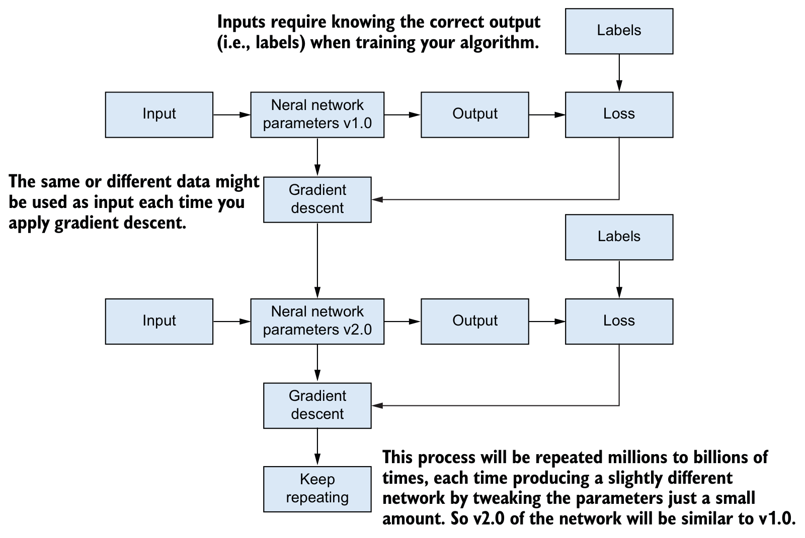

*图4.3 在梯度下降过程中，使用输入和标签（每个输入对应的已知正确答案）来微调神经网络。网络由参数构成，每次应用梯度下降时，参数都会发生微小变化。通过数百万或数十亿次应用梯度下降，我们最终将网络转化为有用的模型。*

如图4.3所示，每次应用梯度下降时，我们都会创建一个新的、略有不同的网络。由于变化很小，这个过程需要重复数十亿次。这样一来，所有微小的变化累积起来就能使整个网络产生更显著、更有意义的改变。

注：现代

LLM 会执行数十亿次参数更新，这是因为它们在数十亿个 token 上训练。数据越多，需要运行的梯度下降次数就越多。数据越少，需要运行的次数就越少。用于训练 LLM 的数据量远超一个人一生所能阅读的内容。

梯度下降是一种不断重复且毫无偏差的数学过程。

不能保证它一定能起作用，或能找到最优解，甚至是一个不错的解。尽管如此，许多研究者还是惊讶于这个相对简单的方法竟然如此实用。

为了帮助你理解梯度下降的工作原理，我们将用一个滚球下山坡的简单例子来说明。球的位置代表神经网络中一个节点的参数值，训练算法可以改变这个值。山坡的高度代表损失值，反映模型对训练输入的表现有多差。我们希望球滚下山坡进入最深的山谷，因为那里是损失最低的区域，表明模型性能最佳。图4.4展示了这一示例。


*图4.4 展示了梯度下降应用于单参数问题的全局概览。曲线表示给定参数值下的损失函数值。小球的位置表示当前参数值对应的损失。目标是找到对应全局最小值的参数值，即具有最小损失的最优解。*

如你所见，小球可能落入众多低谷。行业术语将这一问题称为非凸问题，因为存在多条路径都能降低损失，但每条路径不一定都朝着最优解前进。同样重要的是，这并非一个类比。梯度下降的实际运作正是如此。这些例子展示了梯度下降在优化单一参数模型时的工作原理。在训练大语言模型时，同样的过程应用于数十亿参数。

因此，从这个位置出发，我们贪婪地寻找将球移下坡的方向。我们在图4.5中应用了两次梯度下降。这表明贪婪的选择是向左。当我们通过调整参数向左移动时，球会略微向下坡移动。从图中可以看到，通过向右搜索存在一个更好的解，但由于算法简单，梯度下降不太可能找到它。在这种情况下，找到最优结果需要更智能的策略，涉及搜索和探索，这在实践中代价过高，难以做好。


*图4.5 梯度下降算法通过调整参数逐步寻找损失最小的最优结果。不幸的是，该算法会陷入局部最小值，即图中并非最优的区域，因为其他参数值对应着损失更小的区域。*

此外，请注意图4.5中的第二步，小球卡住了。虽然很明显继续向左移动会获得更低的损失，但这个结果之所以显而易见，只是因为我们能看到全局。梯度下降无法看到整个画面，甚至无法感知附近的情况。它只知道由当前参数和损失函数决定的精确位置。因此，它是一种贪心过程。像梯度下降这样的贪心过程是简化方法，具有可计算性的理想特性，即多次运行以达到目标并不会带来高昂的计算成本。贪心过程目光短浅，因为它们仅基于当前状态选择下一个最优步骤，尽管可能存在更广泛、更优的解决方案。它们之所以这样做，是因为评估当前及所有可能的未来状态是不可能的，需要考虑的潜在结果数量庞大。计算量实在太大了。人们的希望是，利用有限信息做出许多简单的、最优的决策，通常会导致最积极的结果——在此案例中，即最小化损失函数的值。

### 梯度下降中的重要细节

在刚才关于梯度下降的讨论中，我们跳过了一些实际应用时需要考虑的重要细节。首先，如前所述，梯度下降需要同时使用所有训练数据，这在计算上是不可行的。因此，我们采用一种名为随机梯度下降（SGD）的流程。SGD 与我们描述的方法完全相同，只是它使用一小部分随机选取的训练数据子集，而非整个数据集。这大幅降低了训练模型所需的内存，从而带来更快、更好的解决方案。该方法之所以有效，是因为梯度下降每次只沿着当前贪心方向进行微小调整。事实证明，在确定下一步方向时，使用少量数据的效果几乎与使用全部数据一样好。如果你有十亿个词元，那么在完成一次使用全部数据的标准梯度下降步骤的相同时间内，你可以执行十亿次 SGD 步骤。

许多训练方法采用一种特定形式的 SGD，称为自适应矩估计（Adam）。Adam 包含一些额外的技巧，以帮助更快地最小化损失函数并避免陷入停滞。Adam 的主要技巧是赋予小球一些动量，随着更新持续沿同一方向进行，动量会不断累积。这种动量使小球下山速度更快，并且意味着即便遇到较小的局部最小值，也可能有足够动量冲过该点继续前进，从而到达损失函数图中损失最小的区域。

Adam 的缺点在于，它需要为每个参数存储动量信息，这使得训练所需的内存比普通 SGD 增加了三倍。内存是构建 LLM 时最关键的因素，因为它通常决定了你需要多少 GPU，这直接与你的资金投入挂钩。尽管 Adam 不会让最终模型变得更大，因为训练结束后你可以丢弃与 Adam 额外动量计算相关的数据，但你首先需要一个足够大的系统来进行训练。Adam 凭借更有效地最小化损失所带来的精度提升，是有明显代价的。

### 4.2 LLM学习模仿人类文本

现在我们已经理解了深度学习算法是通过指定损失函数并利用梯度下降进行训练的，接下来可以讨论如何将其应用于大语言模型。具体来说，我们将重点讨论用于训练大语言模型的数据和损失函数或奖励函数。大语言模型通常基于人类撰写的文本进行训练。

具体而言，它们被明确训练用以模仿人类生成的文本。虽然这听起来有些显而易见（不然还能训练它们做什么呢？），但这个细节常常被忽略或与其他概念混淆，即使是该领域的专家也不例外。特别是，语言模型并没有被训练去做以下任何事情：

记忆文本、生成新想法、构建世界表征、生成事实准确的文本。在深入讨论之前，有必要进一步解释这个概念。训练下棋模型时，模型因获胜而获得奖励，从而学会下好棋。相比之下，语言模型只因其生成的文本看起来与训练数据完全一致而获得奖励。因此，LLM生成的所有看起来像训练语料中文本的文本都会产生高奖励（或低损失），即使这些生成内容不真实或不准确。这就是损失函数与设计者更高层次目标之间错配的一个例子，如4.1节所述。

LLM在从互联网抓取的数百GB文本数据集上训练。互联网以包含大量错误（和奇怪）信息而闻名。在大多数任务上表现更好的LLM，往往在那些训练数据中常被错误表述的任务上表现更差（参见Inverse Scaling Prize：https://github.com/inverse-scaling/prize）。例如，研究人员一致发现，更好的语言模型也更擅长再现错误的常识[3]，模仿刻板印象和社会偏见[4]。它们容易陷入一个强化错误的恶性循环。例如，在生成包含错误的代码后，它们更可能生成包含更多错误的代码[5]。这些内容在训练文本中很常见，因此LLM即使预测错误也会因预测它们而获得正向奖励。因此，LLM根据其损失函数变得更好，也意味着在那些需要真实性和正确性的任务上变得更差。

### 4.2.1 LLM 奖励函数

之前我们提到，LLM因生成"看起来像其训练数据"的数据而获得奖励。在本小节中，我们将更具体地探讨这意味着什么。

LLM的训练方式是：向模型展示一个句子的前几个token，然后让它预测下一个token。

损失函数基于该预测与训练数据相比的准确率。

例如，模型可能会看到"This is a"，并期望输出"test"。如果模型输出"test"，则得分；否则失分。

这个过程对文本中所有起始片段都执行，如图4.6所示。

这里，模型被训练来独立预测每个高亮词。

这种设置并非LLM独有。它已被用于训练循环神经网络（RNN）多年。

然而，LLM变得如此受欢迎的一个重要原因是，它们的训练效率远高于RNN。

RNN必须按顺序对每个生成进行训练，因为每个新生成的词都依赖于之前选择的词。

而得益于第3章讨论的Transformer架构，LLM可以并行训练所有生成。

并行训练相关生成的能力带来了巨大的速度提升，使得大规模训练成为可能，也是构建当今使用TB级数据的最先进LLM的先决条件。

我们讨论过，预测下一个token可能存在问题，因为算法可能被迫产生不正确或事实错误的输出。

我们还必须探讨一个直觉：尽管存在这些问题，这种方法为何仍能产生如此令人信服的输出。

一个合理的问题是：一个被训练来生成最可能的下一个token的算法，如何看似执行了某种我们可以误认为是推理的操作？


*图4.6：LLM将该句子呈现九次，每次学习预测九个序列中每个序列末尾的一个单词。*

为了培养这种直觉，想象一下你如何尝试预测给定句子的下一个 token。计算机不需要快速响应，所以你可以慢慢来。考虑句子“I love to eat <blank>”，并猜测 <blank> 中可能是什么词。句子的前半部分提供了有价值的上下文。既然我们在谈论吃，你几乎可以立即将范围缩小到食物。对于计算机来说，维护一个所有可能食物的列表并不困难。

现在，如果你考虑到本书作者的背景，你会获得更多上下文。我们是一群来自同一地理区域的美国人，这使得某些菜系比其他菜系更有可能。LLM 不具备这种背景，但如果句子更长、上下文更多，你就能以相同方式开始缩小选择范围，如图 4.7 所示。


*图4.7 上下文有助于对下一个词做出合理预测。从左到右，句子中可能出现的额外文本被逐一加入。每个句子的气泡图展示了新增的上下文如何排除预测。*

当你识别出前文中的关键词或短语时，就能洞察到接下来最应该预测哪个词。执行这些计算的计算机所做的处理远比人类需要多得多。这种暴力关联主要将范围缩小到非常合理的程度。同样，模型将经过数十亿次更新来优化这些关联，从而获得一种有用的能力，这与我们期望算法能够理解并回应人类文本的目标相关。

然而，相关性不等于因果性，下一词预测策略可能导致一些幽默的错误。LLM容易犯“循环论证”的错误，即问题的前提暗示了某种不实之处。由于LLM并未针对准确性或矛盾性进行训练，它会尝试生成一串类人文本预测，这些预测可能顺着你误导性问题往下走。图4.8给出了ChatGPT在此类问题上挣扎的例子，我们询问了干意大利面的非凡强度。


*图4.8 虽然预测下一个词元能力强大，但这并未赋予网络推理或逻辑能力。如果我们向ChatGPT提出荒谬不实的问题，它会愉快地解释它是如何发生的。*

意大利面条能支撑自身重量数百倍的核心解释是荒谬且不真实的。然而，算法通过将问题格式化为“为什么X如此强大？”而被预设为提供关于材料抗拉强度的答案。模型能够提取这一关键上下文。先前的训练数据很可能是基于一个事实性问题来解释这类材料属性，这告知模型预测类似的响应是合适的。句子的主语（意大利面条）和宾语（10磅重量）用于告知响应的次要细节，而响应其他部分则是通用的。

### 4.3 大语言模型与新颖任务

自回归式下一词预测策略的本质及其在训练过程中作为损失或奖励的使用，为我们深入理解LLM生成响应的特性以及它们可能产生事实性错误的原因提供了宝贵洞见。然而，这也解释了为何LLM在信息检索方面表现出色——它们比标准搜索引擎强大得多的关键词搜索工具。针对非事实性回答的局限性，存在一些设计方法可以规避。例如，许多LLM方法会在生成输出中添加引用，以便快速验证生成文本所依据的内容是否准确。LLM还可以作为一个有价值的回音板，一个可以激发灵感和创造力的虚拟伙伴。关键的是，这也有助于你理解一个应避免使用LLM的关键场景——当面对新颖问题和任务时，LLM更容易出错。

LLM通常不擅长执行新颖的任务。判断你的任务是否新颖可能相当困难，因为互联网上无奇不有。互联网上存在大量随机内容，包括关于如何用编程方式绘制鸭子和独角兽的比赛[6]。如果任务与之前见过的某个任务足够相似，或在结构上与训练数据中的其他内容相似，你最终可能会得到看似合理的结果。这个结果可能非常有用，但随着你的任务与训练数据中的内容相比变得越独特，效果就会下降。

例如，我们要求ChatGPT编写计算数学常数π（pi）的Python代码。这个任务并不新颖；网上有大量类似代码，ChatGPT忠实地返回了正确的代码。

*代码：代码清单4.1 ChatGPT用Python计算π*

```
def calculate_pi(terms):
pi = 0
for i in range(terms):
term = ((-1) ** i) / (2 * i + 1)
pi += term
pi *= 4
return pi
print(calculate_pi(1000000))
```

现在，让我们迫使ChatGPT做一些不那么具有挑战性的外推。我们要求ChatGPT将这个函数翻译成编程语言Modula-3。

这个任务算不上太大的外推；Modula-3是一种风格类似的编程语言，也是一种具有历史意义的编程语言，它影响了当今几乎所有最流行语言的最终设计！然而，它极其晦涩难懂。如今，你几乎找不到这种编程语言的例子，主要出现在大学编译器课程中。下面的清单展示了ChatGPT还算合理的尝试。正如你可能已经从本章到目前为止的上下文中预测到的那样，ChatGPT犯了一些错误，在清单中已标出。

*代码：清单4.2
ChatGPT用Modula-3计算圆周率
MODULE CalculatePi;
缺少EXPORTS Main;*

```
IMPORT IO, Real;
PROCEDURE CalculatePi(terms: INTEGER): REAL;
VAR
pi: REAL := 0.0;
i: INTEGER;
BEGIN
FOR i := 0 TO terms - 1 DO
pi := pi + ((-1.0) ** FLOAT(i)) / (2.0 * FLOAT(i) + 1.0);
** isn’t a
END;
RETURN 4.0 * pi;
END CalculatePi;
BEGIN
IO.PutReal(CalculatePi(1000000), 0, 15);
END CalculatePi.
```

这个简短的程序包含三个错误，导致它无法运行。更有趣的是，ChatGPT 会犯这些错误，因为它自信地从其他语言中推断出标准的编码实践。(在这里，“自信地”意味着 ChatGPT 不会提醒我们它可能存在的错误。一位作者喜欢说，ChatGPT 听起来像他们最自负且经常出错的朋友。) 在这个例子中，** 是一个常用的幂运算函数，所以 ChatGPT 认定 Modula-3 支持这个运算。据我们在互联网上仔细搜索的结果，Modula-3 没有关于如何对变量进行幂运算的文档示例。由于大多数编程语言都通过 ^、** 或 pow 选项支持此操作，ChatGPT 就直接推断出存在这样的选项。正确的做法是，必须先实现一个 pow 函数，然后用它来计算 pi。

PutReal 函数的参数则是另一个谜团。我们最好的猜测是，15 对应于打印浮点数值的 15 位数字，这是计算 pi 时的典型默认值。无论如何，该函数的工作方式并非如此。

更重要的是，ChatGPT 对一些细节处理正确，但仅限于那些可以在互联网上找到且已有解释的部分（例如，需要使用 FLOAT(i)，以及用 4.0 * pi 而不是 4 * pi）。那些在互联网上没有示例的任务，正是 ChatGPT 出错的地方。

这个例子也凸显了当前LLM中“感知推理”与实际推理之间的局限。Modula-3的完整语言规范可在网上获取，其中记录了所有这些细节或其空缺。ChatGPT几乎肯定已经见过许多其他编程语言规范、解析器规范以及常见编程语言中的数百万行代码。如果一个人拥有这样的背景知识和资源，那么进行避免所有三个错误所需的逻辑归纳应该不会太困难。然而，LLM并不执行任何归纳过程，因此尽管有大量可用信息，它仍然会出错。

这并不是说结果不令人印象深刻，它可以成为加速你自身代码开发或使用不熟悉API和语言的有价值工具。但它也提醒你，这类工具对于广泛使用且文档完善的编程语言和API效果更好，尤其是当它们符合预期标准时。例如，大多数数据库使用SQL语言，这使得准确推断如何使用一个同样使用SQL的新数据库更有可能。

### 无法识别正确任务

LLM 另一个典型的失败情况是，它们无法正确识别自己应该执行的任务，反而会回答与用户意图不同的问题。对于原始 GPT-3 这样的模型来说，无法正确识别任务曾是一个重大问题，但后续工作通过增加训练数据中任务结构化示例的数量，显著提升了后期 ChatGPT 模型遵循指令的能力。然而，ChatGPT 在某些情况下仍然会无法识别正确的任务。例如，通过询问一个与常见任务微妙不同的不常见任务，或者以不熟悉的方式修改它见过多次的问题，可以可靠地引发这种行为。

一个例子是关于用船把卷心菜、山羊和狼运过河的著名逻辑谜题。谜题规定，山羊不能单独与卷心菜待在一起（因为山羊会吃掉卷心菜），也不能与狼待在一起（因为狼会吃掉山羊）。ChatGPT 可以很快解决这个谜题，但如果我们稍微改变谜题的逻辑结构，模型会继续使用旧的推理方式，如图 4.9 所示。

虽然通常很难将 LLM 的错误追溯到具体原因，但在这个案例中，模型愉快地告诉我们“确保任何物品（卷心菜、山羊、狼）都不被留在无人看管的情况下。”虽然这个指令在原始版本的卷心菜/山羊/狼问题中是正确的（并且可能是基于逻辑问题中对约束条件的说明），但模型没有意识到，在给定的版本中，山羊和狼单独在一起是没有问题的。不仅没有必要像建议的那样交换动物，而且 ChatGPT 的建议会失败，因为它把狼和卷心菜放在了一起，这是我们明确禁止的。

这个现象的另一个奇特例子发生在你消除留下任何东西的必要性时。任何对谜题的逻辑理解都会清楚地表明，你只需要把所有东西装上船然后过河。然而，模型太习惯于回答它之前见过很多次的版本，于是仍然那样做了。


*图4.9 由于LLM的训练方式，ChatGPT未能解答经典逻辑谜题的两个变式。以相同通用形式频繁出现的内容（如著名逻辑谜题）会导致模型照搬常见答案。即使内容发生了人类显而易见的重大修改，这种情况仍可能发生。*

要理解为何会发生这种情况，有必要回顾第3章讨论的LLM训练的自回归性质。模型被明确激励以根据先前内容生成内容。为解决重构后的逻辑谜题而生成的内容，在词汇和顺序上几乎与解决原始逻辑谜题的内容完全一致。因此，在Transformer层的查询和键配对中，这是一个很好的模糊匹配，从而产生构成原始谜题解的值。模糊匹配成功，然后通过Transformer使用的注意机制忠实地返回之前的解。虽然这种策略对于模型正确预测这个著名谜题的词元非常出色，但它并不涉及通过谜题逻辑进行推理。

### 4.3.2 LLM无法规划

LLM自回归特性的另一个微妙局限是，它们只能处理上下文中的信息。LLM经过训练，能够接收输入并生成合理的续写内容。然而，它们无法进行规划、做出承诺或跟踪内部状态。一个典型的例子是当你试图与ChatGPT玩“20个问题”游戏时。当人类玩这个游戏时，他们会预先承诺一个隐藏信息，即他们选择用来识别答案的对象。当ChatGPT玩这个游戏时，它会逐个回答问题，然后事后寻找一个与所提供答案一致的输出。这个例子在图4.10中进行了说明，该图展示了玩“20个问题”时可能的对话树。当有人与LLM玩游戏时，这些对话树中会随机选择一个，而不是制定一个在整个游戏中保持一致的目标对象。


*图 4.10 对话代理在游戏开始时并未承诺某个具体对象。*

大模型不擅长外推，还能用吗？

大多数需要完成的工作并非新颖或全新。至少，它们并没有新颖到让LLM无法处理的程度。然而，理解到LLM的能力会随着所需逻辑或细致度的增加而快速下降，可以帮助你缩小使用它的范围。在设计生产级计算机系统时，一个关键因素是考虑该工具在何时以及如何使用的范围。当你将一个像ChatGPT这样的LLM产品开放给没有特定范围的普通用户时，人们会要求它做各种你意想不到的随机、疯狂的事情。虽然这对研究来说可能很棒，但在生产应用中往往不切实际。尽管你的用户和客户会尝试用你的LLM应用做不可预测的事情，但假设你限制了对系统的访问权限，并围绕用户有特定目标、有限用例进行设计，甚至限制他们的输入如何到达你的LLM，那么你可以构建一个用户体验更可靠的产品。

如何在无用户输入时使用LLM？

LLM 在做低成本的编码或数据处理方面表现出色，尤其是在处理那些格式或整理不太规整的日常数据时。不过，通过给用户提供有限的选项，你可以获得同样的实用性，同时降低风险。将提示限制为可选的代码片段，或者让用户决定提示所处理的数据来源（例如某个内部数据库），这样就能防止（大部分）用户向 LLM 输入任意文本。

相反，你可能会问：“我们能否检测出新奇请求，然后给用户返回错误？”理论上，是的，你可以尝试这么做。首先，我们不建议这样做，因为从用户体验角度看并不理想。其次，这变成了一个被称为新异检测或异常检测的任务。这个问题很有挑战性，而且很可能无法以绝对无错的方式解决。因此，我们鼓励预防胜于检测，选择那些不需要通过分析 LLM 输入或输出就能高度准确预测失败的使用场景。

提示的应用 提示是一种艺术，即精心设计输入给大语言模型以引发期望的行为。语言模型对其输入的具体措辞非常敏感，因此设计出能获得适当回应的输入的能力极具价值。使用LLM时一个反复出现的主题是人们通常不去考虑如何正确地与之交互。提示LLM的最佳方式是思考你感兴趣的输出类型在训练数据中会是什么样子，然后写出其前四分之一部分。相反，人们常常描述他们希望语言模型执行的任务，以为这样的说明能让LLM专注于问题。不幸的是，这种方法产生的结果不一致，并激发了一项研究：通过向LLM提供大量指令和回应作为训练数据来微调它们。

### 4.5 越大越好？

2019年，Rich Sutton 提出了“苦涩教训”这一术语，用以描述他在机器学习领域的经验。“从70年的人工智能研究中可以学到的最大教训是，那些利用计算能力的通用方法最终是最有效的，而且远远领先”[7]。

人们切实感受到，Transformer 正是这一原则的终极体现。你可以不断将其扩大，使用更多并行计算进行训练，并增加更多GPU。这与RNN形成鲜明对比，RNN的并行化效率远不及Transformer。在图像领域，我们同样能看到这一点：生成对抗网络（GAN）方法很难达到十亿参数规模。LLM中使用的基于Transformer的方法轻松扩展至数百亿参数，从而能够构建更大、更好的模型。

从解决方案设计角度看，今天的原型可能会因模型大小而遇到显著约束。更大的模型需要更多资源，且预测耗时更长。用户能接受的最大响应时间是多少？以这种速度运行模型所需的硬件成本有多高？模型大小的增长速度超过了消费级硬件的增长速度。因此，你可能无法将模型部署到嵌入式设备上，或者需要联网以分担成本。因此，你需要在设计中考虑网络基础设施，以满足持续连接的需求。这一要求会增加电池消耗，当持续运行Wi-Fi无线模块而非本地计算时，这是一个需要考虑的因素。因此，尽管更大的模型更准确，但设计约束可能阻碍其实际部署。将这些约束与本章所学的LLM预测机制及其失败场景结合起来，将为你奠定良好基础，从而理解如何最有效地利用LLM解决你最关心的问题。

### 小结

深度学习需要一个损失/奖励函数来具体量化算法在预测上的不准确程度，该函数的设计应与算法在现实世界中要达成的总体目标相关联。梯度下降逐步利用损失/奖励函数来调整网络的参数。

大语言模型通过预测下一个词元来模仿人类文本。这一任务具备足够的特异性来训练模型执行，但它并不能完美地与推理等高层次目标相关联。大语言模型在与其训练数据中常见和重复的任务相似的任务上表现最佳，但在面对足够新颖的任务时则会失败。


---

<a id="ch5"></a>

## 第 5 章: 如何约束 LLM 的行为

### 本章涵盖

- 约束LLM行为以提升其实用性

- 约束 LLM 行为的四个领域

- 微调如何让我们更新LLM

- 强化学习如何改变LLM的输出

- 使用检索增强生成修改 LLM 的输入

通过控制模型允许产生的输出来提高模型的实用性，这听起来可能违反直觉，但在处理LLM时几乎总是必要的。之所以需要这种控制，是因为当给定任意文本提示时，LLM会试图生成它认为合适的响应，而不管其预期用途是什么。考虑一个帮助客户购车的聊天机器人：你不会希望LLM偏离脚本，仅仅因为客户询问了有关带车去参加孩子足球比赛的事情，就转而谈论田径或体育运动。在本章中，我们将更详细地讨论为什么要限制或约束LLM的输出，以及与此类约束相关的细微差别。准确约束LLM是最难实现的任务之一，因为LLM的训练本质是根据训练数据中观察到的模式来补全输入。目前，还没有完美解决方案。我们将讨论可以修改LLM行为的四个潜在环节：

在训练发生之前，整理用于训练LLM的数据；通过改变LLM的训练方式；通过在一组数据上微调LLM；通过在训练完成后编写特殊代码来控制模型输出。这四种情况总结在图5.1中。开发LLM的每个阶段都服务于下一个阶段。微调阶段是在较小数据集上进行的第二轮训练，对于像ChatGPT这样的工具如今如何运作最为重要，也是你在实践中最可能使用的方法。我们在第2至4章中了解到的第一个更大的训练阶段通常被称为预训练，因为它发生在微调使模型变得有用之前。预训练过程产生的模型有时被称为基础模型或基座模型，因为它是构建特定任务模型（即微调模型）的起点。

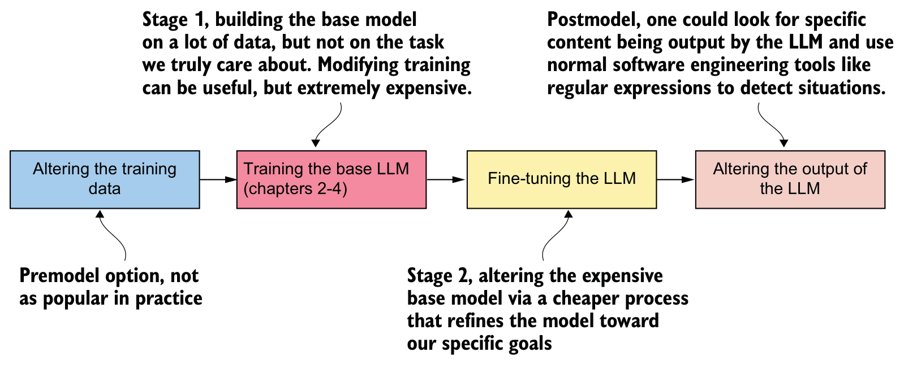

*图5.1 可以在四个环节介入以改变或约束LLM的行为。图表中间展示模型训练的两个阶段，模型参数在此阶段被修改。左侧，可以在模型训练前修改训练数据。右侧，可以在模型训练后拦截模型输出，并编写代码处理特定情况。*

由于微调的重要性和有效性，本章将主要探讨这一方法及其执行方式。

### 5.1 为什么要约束行为？

LLM 之所以极其成功，是因为它们是首个实现“用日常英语告诉计算机做什么，它就会照做”这一理念的技术。通过非常明确地说明期望达到的效果、设定具体的详细程度并指定特定的语气，你可以让 LLM 成为一个极为有效的工具。

这一系列详细的指令被称为提示词，而设计优秀提示词的艺术则被称为提示词工程。例如，我们可以为汽车销售机器人设计一个提示词，如图5.2所示。


*图5.2 像ChatGPT这样的商业LLM被设计成遵循指令（在一定限度内），并且能够以非常高的效率执行大量低认知或模式匹配任务。这些任务包括程式化写作（如模式匹配）和指令遵循（如角色扮演汽车销售员）。*

你可以给LLM一个提示，要求其将数据整理成逗号分隔值，以便复制到Excel中。你也可以设计一个提示，教它如何将自由格式的问卷回答归类为总结性主题。无论在哪种情况下，提示都是一种将行为限制或约束到特定任务和目标集上的练习。然而，前几章讨论过的分词和训练技术并不能实现这种指令遵循能力。

### 5.1.1 基础模型并不实用

按照第4章描述的过程训练LLM，会产生一个通常称为基础模型的模型，因为它可以作为构建应用或微调模型的基础平台。

不幸的是，基础模型对大多数人来说并不是非常有用，因为它们不会通过用户友好的UI展示其底层知识，难以保持话题集中，有时还会产生不适宜的内容。

基础模型甚至没有像ChatGPT那样以聊天机器人的概念进行训练。

### 5.1.2 并非所有模型输出都符合预期

- 有时候，模型认为文档中接下来可能出现的输出是不合意的。

- 这有几种原因，包括记忆化——有时，LLM会从训练数据中生成完整且精确的序列副本，这通常被称为记忆化，指模型通过记忆从训练集中复现文本。记忆化可能是有益的，例如记住特定事实性问题的答案。例如，如果有人问“When was Abraham Lincoln born?”，你希望模型复述出“February 12, 1809.”。然而，如果它导致模型侵犯版权，也可能产生严重危害。如果有人要求“A copy of Inside Deep Learning by Edward Raff”，而模型生成了完全相同的副本，Edward可能会因版权侵权而对你感到不满！

- 网络上的不良内容——并非网上所有内容都适合展示给用户。互联网上充斥着大量恶意和仇恨内容，还有各种错误信息，从常见的误解到阴谋论。虽然模型开发者通常会在训练前尝试过滤掉这些数据，但这并非总是可行。

- 缺失与新信息——麻烦的是，在我们训练模型之后，世界仍在不断演变，变得更加复杂。因此，一个基于截至2018年信息训练的模型，将无法了解之后发生的任何事情，例如COVID-19或噩梦般的necrobotics[1]的发明。但你可能希望你的模型了解这些新进展以保持有用，而无需付出高昂成本从零开始重新训练基础模型。

等待法律体系跟上：我们不是你的律师，这不是一本法律书！大语言模型的法律问题很复杂，在合理使用和侵权方面存在很多微妙之处。搜索引擎可以逐字展示其来源内容，但为什么？一系列法律明确处理这些问题，例如《数字千年版权法》（DMCA），以及法院裁决先例，如Field诉Google公司案（412 F.Supp. 2d 1106 [D. Nev. 2006]），逐步确立了可接受和不可接受的使用行为。然而，立法和法院案件需要时间才能形成，而生成式AI的变革并不能很好地融入现有的法律理解。

GPT-3.5和4已经过改进，避免回答它们不知道的问题（虽然并不总是成功），但我们可以看看一些开源基础模型（如GPT-Neo）在没有主动预防措施的情况下会发生什么。“有许多睡眠问题与褪黑素相关，包括失眠和疲劳。这会导致失眠，这就是为什么避免某些抑制褪黑素的食物很重要。”在这种情况下，MELTON与褪黑素的相似性以及“睡眠”的提示足以让模型抓住褪黑素的主题。

尽管如此，答案显然是胡说八道，因为MELTON-24并不存在。理想情况下，我们希望模型能够识别并回应，承认自己缺乏信息，而不是像这样继续生成更多文本。

### 5.1.3 某些情况需要特定格式

如果用户要求以特定格式提供数据，例如像 JSON 这样的结构化文本格式（关于计算机之间交换数据的常见格式示例，请参见 https://en.wikipedia.org/wiki/JSON），而你没有正确匹配每个开闭括号或正确编码特殊字符，那么输出将无法满足用户的需求。

无论输出看起来多么复杂或接近正确，格式要求几乎总是严格的要求。

我们在第4章中给出了一个这类问题的例子：当时我们让 ChatGPT 用 Modula-3 编写代码，但它借鉴了在 Modula-3 中无效的 Python 语法。

如果代码违反语法规则，它将无法编译。

LLM 为特定期望输出生成文本的概率性方法并不能保证百分之百遵守所有期望的语法规则。

### 5.2 微调：改变行为的主要方法

现在我们已经了解了约束和控制LLM行为的各种原因，就能更好地向模型引入新信息，以解决我们试图解决的问题，同时避免生成有害或法律上有问题的内容。请记住，虽然我们有四个不同的干预点来改变行为，但微调的效果远优于其他方法。无论是像OpenAI[2]这样的闭源选项，还是像Hugging Face[3]这样的开源工具，以及其他许多工具，都提供了不同的微调选项，这使其成为实践者最易上手的方法。

任何微调方法都会产生相同的效果——生成一个具有更新参数的新LLM变体，这些参数控制其行为。因此，我们可以混合搭配不同的微调策略，因为它们产生的根本效果是一样的：一组新的参数，可以直接使用，也可以再次修改。一个人的基础模型可能是另一个人的微调模型。这种情况在许多开源LLM中都有发生：一个初始模型（如Llama）会被另一方修改（例如，你可以找到许多"Instruct Llama"模型），然后你可以根据自己的数据或特定用例进一步微调。

定制LLM最直接的方法是通过提示语并进行迭代优化，直到获得所需的行为。但如果效果不佳，下一步自然就是微调。这一步需要投入更多精力和成本，例如收集微调所需的数据，以及获取运行微调会话的硬件。

你需要特别了解两种微调方法：监督微调（SFT）和名称更具威慑力的基于人类反馈的强化学习（RLHF）。SFT是一种更直接的方法，非常适合向模型注入新知识，或是在你偏好的应用领域提升模型表现。RLHF更为复杂，但它提供了一种策略，让LLM能够遵循更困难、更抽象的目标，比如"做一个好的聊天机器人"。

### 5.2.1 监督微调

影响模型输出的最常见方法是监督微调（SFT）。SFT涉及使用高质量、通常由人工编写的示例内容，这些内容捕捉了你的任务至关重要的信息，但未必在基础模型中得到良好体现。这种情况经常发生，因为LLM是在大量通用内容上训练的，这些内容可能与你的特定需求重叠很少。如果你经营一家医院，LLM很少见过医生的笔记。如果你经营一家律师事务所，LLM可能没有见过太多证词记录。如果你经营一家修理店，LLM可能没有见过你所能接触到的所有手册。

警告：微调虽能为模型注入新信息，但也可能引发安全隐患。

如果你想基于医疗记录构建LLM，那么用示例医疗记录进行微调是合理的。但存在风险：他人可能诱导你的LLM复现微调数据中的敏感信息，因为从根本上说，LLM会依据其见过的训练数据来补全输入。底线：切勿在希望保密的微调数据上训练或微调LLM。

再次考虑我们那个汽车公司及其销售聊天机器人的例子。来自第三方的基础模型可能大致了解汽车，但很可能并不知晓该公司产品的所有细节。通过在内部手册、聊天记录、电子邮件、营销材料及其他内部文档上对模型进行微调，你能确保模型尽可能多地掌握关于你汽车的信息。你甚至可以编写示例文档，阐述你的车辆相较于竞争对手的优势、卖点、话术等，从而让大语言模型拥有你希望它掌握的信息。

SFT的机制很容易解释。正如我们之前提到的，SFT只需要更多的文档。它们可以是任何可以从中提取文本的格式。这就是应用SFT所需的全部工作，因为SFT只是重复你在第4章学到的相同训练过程。图5.3显示SFT的过程与你之前看到的相同。不同之处在于：第一次训练基础模型时，初始参数是随机的且没有帮助。第二次微调时，你从基础模型的参数开始，这些参数编码了基础模型通过观察训练数据学到的内容。


*图5.3 有监督微调（SFT）是一种改进模型结果的简单方法。你重复构建基础模型时使用的相同过程。一旦基础模型在大量通用数据上完成训练，你就继续在较小的专用数据集上进行训练。*

可喜的是，现在你已经很好地理解了SFT。与原始训练过程一样，它复用了“预测下一个token”任务，以确保你的模型内部构建了来自新文档的信息。作为预测下一个token的直接后果，SFT也使我们无法改变LLM的激励。因此，像“不要对用户说脏话”这样的抽象目标很难通过SFT实现。

微调陷阱。通过复用第4章介绍的梯度下降策略，所有微调方法往往会继承两个与LLM返回其训练内容能力相关的问题。由于SFT如此简单，现在是回顾微调（不仅限于SFT）的广泛问题的好时机。

无法保证SFT能正确保留你提供的信息。这个问题被称为灾难性遗忘[4]，它发生在你训练模型新数据但未继续训练旧数据时，模型开始

“遗忘”旧信息。很难确定哪些信息会被遗忘，哪些不会。灾难性遗忘自1989年以来就被认为是一个问题[5]。换句话说，微调并非纯粹的加法，你为此会牺牲一些东西。

### 5.2.2 从人类反馈中强化学习

目前，RLHF是约束模型的主流范式。顾名思义，它采用了强化学习（RL）领域的方法。RL是一系列技术的统称，其中算法必须做出多个决策以最大化长期目标，如图5.4所示，其中使用了四个具有技术含义的术语：

- 智能体——拥有某个希望达成的总体目标、并可能采取多种行动来实现该目标的实体/AI/机器人。

- 行动——智能体为了推进其目标而可能执行或参与的所有可能事物的空间。

- 环境——受行动影响的地点/对象/空间。环境可能会因该行动、其他智能体的行动或环境的自然连续变化而改变，也可能不改变。

- 奖励——在任意给定数量的行动之后可能（或可能不）发生的改进（可能为负）的数值量化。


*图5.4：强化学习涉及迭代式交互，其中行动的奖励可能很久都不会显现，并需要多个步骤才能获得。对于像ChatGPT这样的聊天机器人，环境是与用户的对话，行动是ChatGPT可能完成的无限可能的文本。奖励在某种意义上变成了用户对聊天机器人对话结束时的满意度。*

在将 LLM 用作聊天机器人与人类交互的例子中，用户就是环境。LLM 本身是智能体，它能够生成的文本就是动作。最后还需要指定一件事：奖励。如果让用户对与聊天机器人的良好对话（例如，没有脏话、没有撒谎、提供有用的回复）打 +1 分，对糟糕对话（例如，建议消灭所有人类）打 -1 分，那么我们就将人类反馈引入了强化学习。

敏锐的读者可能会注意到，奖励听起来与第 4 章讨论的损失函数惊人地相似。事实上，我们关于好对话和坏对话的例子正属于那种非常主观且难以量化的领域，我们之前曾指出这种例子不适合作为损失函数。这种 +1/-1 的奖励并不平滑，因为值指向一个方向或另一个方向，没有中间地带，这也是损失函数的一个不良特性。

强化学习的一个强大之处在于它能够处理非连续且难以量化的目标。我们使用“奖励”而非“损失”来暗示这两种情况之间的区别。通常，强化学习能够学习的目标类型被称为不可微的。因此，这些目标无法使用如梯度下降等数学技术来学习，这些技术我们在第 4 章描述神经网络如何学习时介绍过。我们稍后将具体解释 RLHF 的工作原理。强化学习的注意事项是它可能计算开销大且需要大量数据。强化学习是一种出了名难学的学习方法。它通常比其他微调技术（如 SFT）效果更差，因为强化学习需要比其它方法多得多的“正确”和“错误”示例，而且由于我们使用人类反馈来指导 RLHF，结果并不总是完美的。例如，在图 5.5 中，RLHF 无法帮助 LLM 理解其在 RLHF 训练期间未明确见过的基本指令，因为它不会为基础模型增加执行基本逻辑的能力，比如理解用户避免显示海豚信息的请求。

LLM 并不以我们人类所认为的推理方式进行推理。收集数以亿计的“一切”示例可以让你走得很远，但世界是奇怪的。我们几乎没有证据表明 LLM 在遇到新情况时能够可靠地生成令人满意的回答。然而，RLHF 是目前约束 LLM 行为的最佳方法。尽管面临挑战，强化学习提供了一种学习方式，这是那些需要可微目标的基于梯度的方法所不具备的。最重要的是，ChatGPT 已经证明强化学习在许多情况下是可行的。那么让我们深入探讨 RLHF 的工作原理。

### 5.2.3 微调：全景

SFT和RLHF是微调大型语言模型的两种主要方法。SFT可以处理数千个文档或样本，而RLHF通常需要数万个示例。

这不应阻止你在数据较少时进行探索，但如果数据较少，可能更好的做法是投入时间开发更好的提示词。

更重要的是，SFT和RLHF并非互斥。它们都修改模型的基础参数，并且可以依次应用以获得每种方法的好处。

它们也不是目前存在的唯一微调方法。

例如，新的微调方法正在被开发中


*图 5.5 RLHF 非常擅长让大型语言模型避免已知的特定问题。然而，它并没有赋予模型处理新问题的工具。在询问迈阿密的足球后，模型逻辑上的下一个回答是谈论迈阿密海豚队，但这违反了之前要求绝口不提海豚的指令。*

这些方法从LLM中移除概念，迫使模型忽略其在训练后学到的数据[6]。未来几年将开发出更多用于模型修改的技术。这些技术可能都需要你进行一些数据收集，但总体工作量会比从头构建一个LLM要少。

### 5.3 RLHF的机制

为了描述RLHF的工作原理，我们将先介绍一个不完整的RLHF版本，解释它为何行不通，然后再说明如何修正。在本节中，我们不讨论RLHF使用的详细数学公式，因为从高层视角来看，这些数学细节并不会带来特别深刻的洞见。如果你想了解更多具体细节，我们建议在完成本章后，从《实现RLHF：使用trlX学习摘要》[7]开始阅读。

### 5.3.1 从朴素的RLHF开始

首先，我们来看一下不完整且朴素的RLHF版本。我们已经讨论过RL如何利用不可微目标进行学习。

因此，假设有一个人工评审者，他会根据质量奖励对LLM的输出进行打分，其中+1表示好的回答，-1表示不合格的回答。这个质量奖励只是一个我们分配给LLM输出的任意分数，用于表明某个示例在某种程度上优于其他示例。

因此，如果用户向LLM请求“讲个笑话”，而LLM回应“需要几只鸭子才能拧灯泡？”，我们可能会给这个（还算不错的）笑话打+1分。如果LLM反而输出类似“狗是邪恶的”这样的句子，我们会给-1分，因为它根本没有尝试讲笑话。由于仅使用+1和-1这样的简单质量奖励很难进行RL，我们会为RL算法额外添加信息，例如每个生成token的概率。这样一来，RL算法就能知道每个token可能的概率。整个过程总结于图5.6。

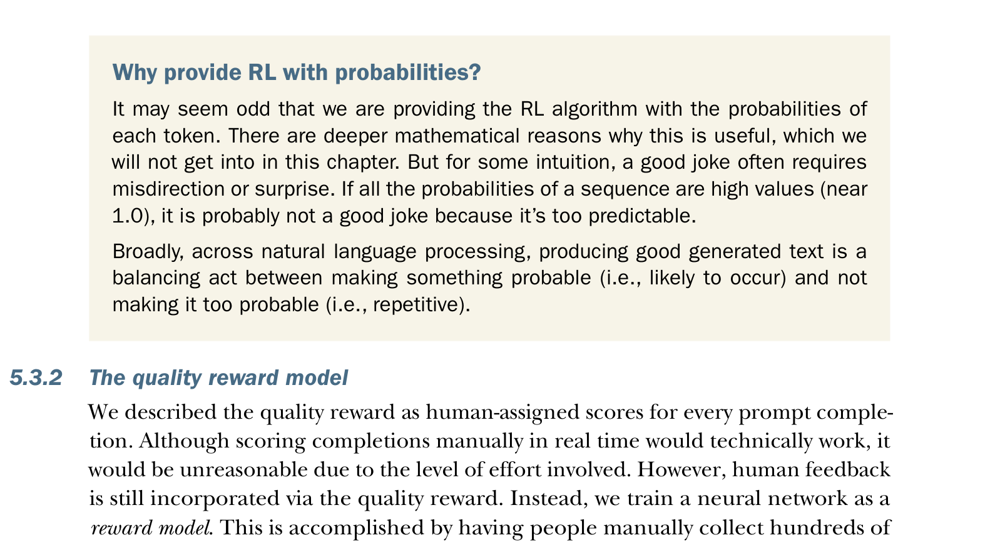

*图5.6 RLHF的一种朴素且不完整的版本。虚线表示从一个组件发送到另一个组件的文本。由于文本与梯度下降不兼容，因此必须改用更困难的强化学习算法。这使我们能够根据LLM输出的质量分数来修改LLM的权重。*

为何向RL提供概率？

我们向RL算法提供每个token的概率，这看起来可能有些奇怪。这样做有更深的数学原因，我们在本章中就不深入探讨了。但为了提供一些直观理解，一个好笑的笑话往往需要误导或惊喜。如果一个序列中所有概率都是高值（接近1.0），那它很可能不是个好笑话，因为太可预测了。

在自然语言处理中，生成高质量文本本质上是一种平衡：既要让内容具有一定概率（即可能发生），又不能让它概率过高（即避免重复）。

### 5.3.2 质量奖励模型

我们将质量奖励描述为人为给每个提示完成（prompt completion）分配的打分。虽然实时手动给完成情况打分在技术上是可行的，但因其工作量巨大而不切实际。然而，人类反馈仍然通过质量奖励的方式被纳入。取而代之，我们训练一个神经网络作为奖励模型。具体做法是，由人手动收集数十万个提示与完成对，并将其标记为好或坏。这些评分便成为用于训练奖励模型的标注数据，如图 5.7 所示。


*图5.7 奖励模型的训练方式与标准监督分类算法类似。一个神经网络（它本身可以是一个LLM，也可以是另一个更简单的网络，如卷积或循环神经网络）被训练来预测人类会如何对提示-完成对进行评分。由于神经网络是可微的，这种训练是可行的，并且提供了一个在RLHF中充当“人类”角色的工具。*

收集数十万条带评分的提示和补全对虽然昂贵但可行（例如 https://huggingface.co/datasets/Anthropic/hh-rlhf），尤其是在使用 Mechanical Turk（https://www.mturk.com/）之类的众包工具时。这些数据需要手动整理，数量可观，但比起训练初始基础模型所用的数十亿词元，仍然小了数个数量级。这些RLHF数据集必须足够大，因为需要覆盖用户可能提出的多种场景、问题和请求。正如我们在图5.5的海豚示例中看到的，RLHF往往适用于相对直接和已知的主题。因此，处理不同情境的广度直接来源于微调数据的广度。

注意：我们一直使用+1/-1作为提供质量奖励的示例，因为它最容易描述。

由于强化学习不需要梯度，你可以使用任何与问题相关的评分。使用排序评分——针对给定提示比较多个完成结果并对其进行从优到劣的排序——更为流行且更有效，因为你同时在对多个完成结果进行相互评分。无论如何，提供正负反馈在本质上仍然相同。

### 5.3.3 相似但不同的RLHF目标

一旦训练好一个奖励模型，你就可以为RLHF过程随心所欲地创建和评分大量提示。

人类反馈被嵌入到奖励模型中，从而可以分发、并行化并重复使用。

剩下的唯一问题是，当前初始版本的RLHF纯粹以最大化质量奖励为目标，而这并非RL必须关注的唯一目标。

因此，模型会随时间退化，产生低质量、无意义的输出，对任何读者都没有价值。这种退化与一种称为对抗攻击的现象有关：只需对输入进行相对微小的改动，就能出人意料地轻易欺骗神经网络做出荒谬决策。对抗性机器学习（AML）发展迅速，且其复杂性深似海，因此我们把相关讨论留给其他专家 [8]。但我们在图5.6中描述的初始RLHF实现本质上是对LLM执行了一次对抗攻击，因为它只专注于最大化质量奖励，而非对用户有用。本质上，这就是AI/ML中的古德哈特定律：“当一项指标成为目标时，它就不再是好的指标。”要解决这个问题，我们必须在RL算法中增加第二个目标。

我们将计算第二个奖励，基于原始基础LLM输出与微调LLM输出之间的相似度。从概念上讲，当微调LLM产生与原始LLM行为相似的更优输出时，这个奖励可视为一种奖励。它能防止模型因过于新奇而偏离正轨。从根本上说，我们希望微调LLM生成的输出根植于原始LLM最初看到的训练数据。我们不希望微调模型过于创新以致产生无意义内容。这个奖励被添加到RL算法中以稳定微调过程。图5.8展示了RLHF的完整工作原理。


*图5.8 RLHF的完整版本。虚线表示文本，需要RL来更新参数。 原始LLM是未经任何修改的基础模型，而待微调的LLM最初也是基础模型，但经过修改以提高其输出质量。相似度和质量奖励组件接收词概率以改进计算。RL通过结合质量分数和相似度分数来调整参数。*

如果一个模型学会了生成胡言乱语的输出，它会因为缺乏相似性而受到高惩罚，从而阻止模型变得过于不同。如果一个模型产生完全相同的输出，它会得到低质量评分，从而阻止缺乏变化。两者的平衡很好地实现了“金发姑娘效应”，使模型有足够的灵活性进行变化，同时又不致失去其类人输出。


*图5.9 除了微调之外，你还可以通过修改训练数据、改变基础模型的训练过程，或编写代码处理特定情况来修改模型输出，从而改变模型的行为。*

微调是改变LLM行为的主要手段，但微调并非万无一失，也不是行为改变的唯一途径。我们之所以聚焦微调，是因为RLHF在生成超越简单下一个词预测的LLM行为方面具有价值。

用户通常无法直接操控图5.9中描述的其他三个阶段，但它们也能修改LLM的行为。不过，为了完整性，我们将简要回顾这些阶段以及一些你需要了解的关键细节。这些因素有助于你理解微调难以实现的目标，以及你应向LLM提供商探究的问题范围。

### 5.4.1 修改训练数据

### 5.4.2 修改基础模型训练

训练数据隐私必须是训练或微调LLM时的一个重要关注点。通常，通过以特殊方式向模型构造输入，可以重建模型的训练数据。

在某些情况下，LLM已被证明能够生成它们训练时所依据的确切文本。

如果训练数据包含私人信息（例如个人身份信息（PII）、个人健康信息（PHI）或其他敏感数据），这就成问题了。

模型的使用者可能（也许是无意中）提供提示词，从而逐字暴露这些数据。

算法的初始训练是缓解部分隐私问题的一个理想时机，可以使用一种称为差分隐私（DP）的技术。

DP 很复杂，因此如果你想了解更多，我们推荐《Programming Differential Privacy》[13] 这本书。

简而言之，DP 添加了精心构造的随机噪声，为模型训练过程中的数据隐私提供可证明的保证。

DP 并非万能，但它提供的保护远超当今大多数算法。

那么，为什么没有人这样做呢？嗯，添加噪声自然倾向于降低结果质量。

大规模训练运行非常昂贵，每次花费数十万到数百万美元。

如果你不得不进行10倍以上的训练运行来正确设置隐私参数，那将是一个数百万到数千万美元的问题。

但随着 DP 逐年改进，我们预计它未来将变得更加普遍。

### 5.4.3 修改输出

最后，我们可以检查生成的token，并编写代码根据模型生成的token组合来改变其行为。

微调之后，这是LLM使用者最有可能用来修改其行为的第二个阶段。

在本章前面，我们讨论了LLM的一个常见需求：生成遵循精确格式（如XML或JSON）的输出。

实现这样的格式要求是LLM的常见问题。任何一个预测失败都会导致无法生成有效输出。

你可以在图5.10中看到这类失败的一个例子：我们要求LLM补全一段Python代码，下一个token应该是分号(;)，但它却错误地尝试换行(\ n)。

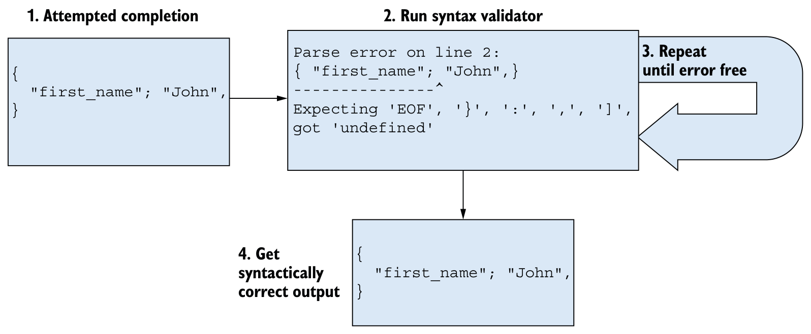

*图5.10 通过编写强制遵守格式规范的代码，你可以在LLM生成输出时捕捉无效输出。一旦检测到，让LLM生成下一个最可能的token，直到找到有效输出，是一种改进情况的简单方法。*

存在多种工具（例如 https://github.com/noamgat/lm-format-enforcer），用于在LLM的解码步骤中指定严格的格式。如果这些工具检测到解析错误，它们会立即重新生成最后一个词元，直到产生有效输出。

更复杂的选词策略也是可行的。但重要的是，我们可以利用中间输出，在生成完整输出之前就做出决策。即使是简单的老式“通过/不通过”清单，也是捕捉不良行为的有力工具。你不需要真正实时地将输出传递给用户；总可以引入人为延迟，从而在发送给用户之前查看更多响应内容。这为你提供了时间来检查不良语言过滤器或其他硬编码检查。如果命中匹配，如图5.10所示，你可以重新生成输出或终止用户会话。

### 5.5 将LLM集成到更大的工作流程中

在本章的这一部分，我们已经介绍了一些基本方法，用于操控LLM生成更理想、更一致的输出。到目前为止，我们重点关注的是涉及LLM本身的技术，无论是通过提示、操控训练数据，还是微调基础模型。在本节中，我们将探讨如何通过将LLM的输入和输出整合到多步骤操作链中，来定制LLM生成的输出，以获得更针对性的结果。这一领域正在快速发展，因此我们将简要介绍一个将LLM整合到更广泛的信息检索工作流中的具体例子，然后讨论一个通用工具，展示如何通过与LLM的多次交互来自定义LLM输出。

### 5.5.1 使用检索增强生成定制LLM

检索增强生成（RAG）是一种技术，它允许我们从LLM生成答案，同时降低产生无意义或其他错误解释的可能性。RAG名称中的“检索”部分应该能为你提供关于该技术如何运作的有用提示。当用户向RAG系统提供输入时，系统使用LLM创建一个查询，该查询针对包含文档索引的搜索引擎运行。根据用例，这个索引可能是通用信息索引（如Google），也可能是特定主题的索引（如汽车营销材料集合）。作为对查询的响应，搜索引擎生成相关文档列表。然后，RAG系统使用LLM从这些文档中提取信息，以生成更好的答案。为此，RAG系统将检索到的文档内容与原始用户查询结合起来，为LLM创建一个全面的提示，从而得到更好的响应。这种方法往往效果很好，因为我们现在不是让LLM基于其训练或微调数据生成响应，而是让LLM通过总结一组与普通搜索引擎查询相关的文档来生成对输入的响应，并将这组相关文档提供给LLM，让它从中提取答案。换句话说，我们是在帮助LLM聚焦于正确回答给定问题所需的数据。我们在图5.11中描述了这个过程，并将其与我们到目前为止描述的正常LLM用例进行了比较。

到目前为止，RAG方法的两个最显著的好处如下：

RAG系统的输出更准确、更符合事实，或对用户的原始问题更有用，因为它基于文档索引中的特定来源。

LLM可以生成用于回答的源文档的引用或参考，使用户能够验证或对照原始材料。

后一点关于引用尤为重要。RAG并不能解决LLM的所有问题，因为LLM在RAG系统中仍然生成最终输出。LLM仍可能因为找不到或不存在的内容而产生错误或幻觉。此外，LLM也可能无法准确捕获或

### 正常LLM使用 / RAG式LLM

1. 用户的问题会与某种搜索引擎或数据库进行比对。


*图5.11 左侧展示用户询问如何编写JSON时LLM的正常使用方式。LLM天然可能产生错误输出，这是我们希望最小化的。右侧展示RAG方法。通过使用搜索引擎，我们可以找到与查询相关的文档，并将它们组合成新的提示，为LLM提供更多信息和上下文，从而生成更好的答案。*

代表其使用的任何源文档的内容。因此，RAG方法的效用与其执行的搜索质量和返回的文档直接相关。底线是，如果你无法为你的问题构建有效的搜索引擎，你就无法构建有效的RAG模型。

上下文大小 在思考LLM时，需要考虑其一个方面——上下文大小。LLM的上下文大小决定了它在单个补全请求中能够计算处理的token数量。你可以将其理解为LLM在接收提示形式输入时能够查看的数据量。例如，GPT-3的上下文大小为2048个token。然而，在聊天机器人中，上下文通常用于保存整个对话的实时记录，包括LLM的所有输出。如果你与GPT-3进行超过2048个token长度的对话，会发现GPT-3经常丢失聊天早期讨论的一些内容。

上下文长度既促进也限制了RAG的使用。如果RAG系统检索整本书供你的LLM消化，你的LLM将需要巨大的上下文长度来

能够使用它。否则，LLM只能消费检索文档的第一部分（不超过LLM的上下文大小），可能会遗漏信息。因此，上下文大小是你在选择模型时需要考虑的一个重要操作特性。如今一些模型，例如X公司的Grok，能够处理多达128,000个token的上下文大小。虽然像Grok这样的大上下文大小提高了LLM能够消费的硬限制，但LLM在处理由更大上下文大小所启用的大量输入时的有效性仍然是一个活跃的研究领域。

你可能注意到在图5.11中，我们必须创建一条新的提示。我们添加了前缀“Answer the question:”和后缀“Using the following information:”。理论上，通过调整这条提示可以获得更好的结果。你可能会想添加一些指令，比如“Ignore any of the following information if it is not relevant to the original question.”这些想法开始进入提示工程领域，即通过调整和修改输入到LLM的文本以改变其行为，正如我们在第4章中讨论的那样。

提示工程确实很有用，是结合多个LLM调用来改善结果的好方法。例如，你可以尝试让LLM重写问题来改善搜索结果。（这一讨论触及信息检索中的一个经典领域——查询扩展，如果你想了解更多的话。）然而，提示工程可能非常脆弱：LLM的任何更新都可能改变哪些提示有效或无效，并且重写每个提示会很麻烦——尤其是当你进入更复杂的系统，如RAG模型或更高级的模型时。

### 5.5.2 通用LLM编程

虽然这还是一项新兴技术，但我们已经开始看到编程库和其他软件工具将LLM作为自定义应用程序的一个组件来构建。

我们特别喜欢的一个是DSPy（https://dspy.ai），它可以更容易地构建和维护那些试图修改LLM输入和输出的程序。

一个好的软件库会隐藏那些妨碍生产力的细节，而DSPy在抽象化LLM使用过程中的以下任务方面做得很好：

集成所使用的特定LLM；实现常见提示模式；针对你所需的数据、任务和LLM组合调整提示。

这不是一本编程书，因此不提供完整的DSPy教程。但了解一下如何用DSPy实现我们在5.5.1节中描述的RAG模型是有启发性的。这需要我们选择一个LLM（本例中使用GPT-3.5）和一个信息数据库（维基百科即可），并定义RAG算法。DSPy的工作原理是为所有组件定义默认的LLM和数据库（除非你干预），从而可以轻松分离和替换所使用的部分。这个过程如下清单所示。

### 清单 5.1 DSPy 中最简单的 RAG

### 使用OpenAI的

GPT-3.5（可替换为其他在线或本地大语言模型）import dspy llm = dspy.OpenAI(model='gpt-3.5-turbo') 使用 ColBERTv2 算法对 Wikipedia 副本进行向量化 similarity_and_database = dspy.ColBERTv2(

使用我们刚刚创建的 LLM 和文档数据库 dspy.settings.configure(

从数据库中搜索最相关的三个文档 self.retrieve = dspy.Retrieve(

指定了一个“签名”字符串，它定义了LLM self.generate_answer = dspy.Prediction的输入和输出。

这段代码将前述的在LLM和数据库中的选择设为默认值，使得替换OpenAI为另一个在线LLM或本地LLM（如Llama）变得同样简单。类 `RAG(dspy.Module)` 随后定义了RAG算法。初始化器只有两部分。

首先，我们需要一种基于向量化文档搜索字符串数据库的方法，这通过ColBERTv2来定义。它使用了一个较旧的——也就是四年前（这个领域发展之快令人惊叹）——但速度更快的语言模型，以提升速度和效率。记住，更大的语言模型（即运行成本更高的）只需要检索到合理的文档即可。虽然ColBERTv2可能不如GPT-3.5做得好，但它足以在大多数情况下为你检索到正确的文档。`dspy.Retrieve` 随后使用这个默认数据库进行搜索，因此除了指定检索多少文档之外，无需再指定其他内容。

其次，我们需要将问题和文档组合成LLM的查询。在DSPy中，提示词被抽象化了。取而代之，我们编写DSPy所谓的签名，可以理解为函数的输入和输出。这些应该用有意义的英文名称命名，以便DSPy能为你生成好的提示词。（实际上，DSPy使用语言模型来优化提示词！）在这个例子中，我们有两个输入（question和relevant_documents），用逗号分隔。-> 用于表示输出开始，我们只有一个输出：问题的答案。

注意：DSPy 在签名中支持一些基本类型。

例如，你可以在字符串中使用 `"question, relevant_documents -> answer:int"` 来强制要求答案必须为整数。这个命令会应用与图 5.10 中刚学到的相同的错误时重新生成技术。

定义我们的 RAG 模型就这么简单！这些对象在 `forward` 函数中被调用并传递出去，但如果你愿意，也可以修改这段代码来添加额外的细节。你可以将所有内容转换为小写、运行拼写检查，或者在这里使用任何你想要的代码。这种方法让你可以将编程规则与 LLM 混合搭配。你还可以轻松修改 RAG 定义以纳入新约束，并编写代码让 LLM 执行验证。

更重要的是，DSPy 支持使用训练/验证集来更好地调整提示、微调本地 LLM，并帮助你创建一个经过经验测试、改进且量化的模型来实现目标，而无需在 LLM 的特定细节上花费大量时间。尽早采用这样的工具，你将获得一个健壮得多的方案，从而更容易升级到更新的架构。

### 小结

您可以在四个环节干预并改变模型的行为：数据收集/分词、初始基础模型训练、对基础模型进行微调、以及拦截预测的token。这四个环节都很重要，但对大多数用户而言，微调是最有效的环节，既能降低成本，又能提供改变模型目标的最佳能力。监督式微调（SFT）在较小的定制数据集上执行常规训练流程，有助于提升模型对特定领域的知识。

基于人类反馈的强化学习（RLHF）需要更多数据，但能让我们设定比“预测下一个token”更复杂的目标。在输出格式必须严格的情况下（如JSON或XML），你可以使用语法检查器等现有工具来检测LLM的错误输出。生成与语法检查可以循环进行，直至输出满足必要的语法约束。

检索增强生成（RAG）是一种流行的增强LLM输入的方法，首先通过搜索引擎或数据库找到相关内容，然后将其插入提示中。

像DSPy这样的编码框架开始出现，它们将特定的LLM、向量化和提示定义与针对特定任务修改LLM输入输出的逻辑分离开来。这种方法允许你构建更可靠和可重复的LLM解决方案，能够快速适应新的模型和方法。


---

<a id="ch6"></a>

## 第 6 章: 超越自然语言处理

### 本章涵盖

- Transformer 层在非文本数据上的工作原理

- 帮助 LLM 编写可运行的软件

- 调整LLM以理解数学符号

- Transformer 如何替换输入和输出步骤以处理图像

虽然建模自然语言是Transformer的首要目的，但机器学习研究人员很快发现，它们可以预测任何涉及数据序列的内容。Transformer将句子视为token序列，要么生成相关的token序列（如从一种语言到另一种语言的翻译），要么预测序列中的后续token（如在回答问题或充当聊天机器人时）。尽管序列建模和预测是解释和生成自然语言的有力工具，但自然语言并非LLM能提供帮助的唯一领域。

除人类语言外，许多数据类型都可以表示为token序列。用于实现软件的源代码就是一个例子。源代码是用Python等计算机编程语言编写的，而不是你期望在英语中看到的单词和语法。源代码有自己的结构。

描述了软件开发者希望计算机执行的操作。与人类语言类似，源代码中的令牌根据所使用的语言和出现的上下文而具有含义。甚至可以说，源代码比人类语言更具结构性，更加具体。一个带有歧义和多重含义的编程语言将令计算机难以解析，也更难让他人修改和维护。

源代码，或简称为“代码”（此后我们将以此指代），只是LLM和Transformer处理非自然语言数据的一个例子。几乎任何可以重新表示为令牌序列的数据，都可以应用Transformer以及我们从LLM工作原理中汲取的许多经验。本章将回顾三个逐渐远离自然语言的例子：代码、数学和计算机视觉。

这三种不同类型的数据，称为数据模态，每一种都需要重新审视Transformer的输入或输出。然而，在所有情况下，Transformer本身保持不变。我们仍然会将多个Transformer层堆叠起来构建模型，并继续使用梯度下降训练这些Transformer层。代码与自然语言最为相似，因此不需要太多改动。不过，为了使代码LLM表现良好，我们需要改变LLM输出生成后续令牌的方式。接下来，我们将探讨数学领域，在此需要改变分词方式，以便LLM能成功完成加法等基础运算。最后，对于计算机视觉——涉及处理图像和执行目标检测与识别等任务——我们将同时修改输入和输出，展示如何通过彻底替换令牌概念，将一种截然不同的数据类型转换为序列。图6.1展示了为使LLM处理每种数据模态而必须修改的部分。

数学需要修改分词步骤。

代码需要修改输出生成步骤。

输出生成、Transformer、分词

计算机视觉需要对分词和输出步骤都进行修改。

*图6.1 如果我们把一个LLM分解成三个主要部分——输入（分词）、转换（Transformer）和输出生成（去嵌入）——那么通过改变输入或输出组件中的至少一个，就可以使用新的数据模态。与此同时，由于Transformer是通用的，在大多数情况下它不需要修改。*

### 6.1 用于软件开发的LLM

我们已经简要讨论过，LLM可以为软件编写源代码。在第4章中，我们让ChatGPT编写了一段Python代码来计算数学常数π。接着，我们让它将这段代码转换成一种名为Modula-3的晦涩语言。软件是人们最早发现LLM能够提供帮助的领域之一，这是编程工作方式的一个相对自然的结果。编程语言的设计初衷就是像文本一样供人类读写！因此，我们无需改变分词过程就能生成代码。我们之前讨论的所有关于构建LLM的内容，同样适用于代码和人类语言。

我们可以通过图6.2中ChatGPT对两段类似的Python和Java代码进行分词来看到这一点。这里，我们使用灰度来表示OpenAI分词器（https://platform.openai.com/tokenizer），它将代码拆分成不同的标记。尽管相同的标记在每个示例中可能颜色不同，但我们可以关注分词器如何将代码拆分成标记以及两个示例之间的相似性。这些相似性包括：每行代码的缩进、变量x和i（在大多数情况下）、函数名和return语句、以及像+=这样的运算符。这些相似性使得LLM更容易关联每段代码之间的相似性。

这些相似性还意味着，在训练过程中，LLM可以在具有共同命名、语法和编码实践的编程语言之间共享信息。

鼓励软件开发人员使用有意义的变量名，以反映变量在其所写程序中的作用或目的。像initValue这样的变量名会被拆分成两个标记：init和Value，使用相同的标记来表示


*图6.2 分别用Python（左）和Java（右）编写的两段相似代码示例。这些示例展示了字节对编码如何跨语言识别相似词元。方框表示单个词元。面向人类语言的标准分词方法在代码上也表现不错，因为代码与自然语言有许多相似之处。*

单词“Value”的前缀“init”所在的自然语言文本。因此，我们不仅通过相似的语法在编程语言之间共享信息，还通过变量名共享代码的上下文和意图信息。大语言模型还能从程序员为自身或其他开发者添加的描述复杂代码部分的注释中获益。在图6.3中，我们重复展示了Java版本，仅更改了变量名，并在函数顶部添加了一条描述性（但实际中并不必要）的注释。


*图6.3 用Java编写的代码，包含一条注释描述代码功能。因为（好的）代码（通常）有大量注释，所以自然形成了自然语言与代码的混合，供LLM获取信息。当变量具有描述性名称时，模型更容易在代码与注释及变量名所描述的意图之间建立关联。*

在大多数情况下，代码和注释会得到相同的 token，这便将人类语言和编程语言联系在了一起，因为它们采用了相同的表示形式。无论是处理编程语言还是自然语言，我们都会得到相同的 token 和嵌入。其精妙之处在于，LLM 会像人类程序员一样，复用自然语言的信息来理解源代码的含义。在每种情况下，我们都能看到 tokenization 对代码来说并不完美。存在一些边缘情况，其中 LLM 的 tokenizer 未能将代码中的数据类型转换为相同的 token。例如，可以看到函数参数中的 (double 的 token 与函数体中的 double 的 token 处理方式不同。然而，这些差异类似于我们在 LLM 处理自然语言时已经看到的问题，例如单词 "hello" 、 "hello." 和 "hello!" 周围的不同标点情况会被解释为不同的 token。既然 LLM 能够处理这些细微差异，那么它们也能处理代码中的同样问题也就合情合理了。从许多方面来看，这个问题对于 LLM 处理代码来说反而更容易，因为代码是大小写敏感的，所以我们无需担心像 "hello" 和 "Hello" 被不恰当地映射为不同 token 这类文本情况。在代码中，"hello" 和 "Hello" 会是独立且不同的变量或函数名。将它们视为不同的 token 是正确的，因为编程语言将它们视为不同的元素。从应用角度来看，代码生成尤其有趣，因为它提供了各种自我验证的机会。我们可以应用第 5 章中关于监督微调（SFT）和基于人类反馈的强化学习（RLHF）的所有经验，使 LLM 成为有效的编码助手。

### 6.1.1 提升LLM的代码处理能力

改进 LLM 代码能力的第一步，是确保初始训练数据中包含代码示例。由于互联网的特性，大多数 LLM 开发者已经做到了这一点：代码示例在网上随处可见，自然进入了每个人的训练数据集。改进结果的方法就是应用 SFT，我们收集额外的代码示例，并在这些代码示例上对 LLM 进行微调。像 GitHub 这样包含大量代码的开源仓库，使得获取大量代码尤其容易。从 GitHub 等来源收集的代码构成了用于理解和生成代码的 LLM 微调数据集的基础。更有趣的是使用 RLHF 来提升模型编写代码的能力。同样，有许多工具和数据集可用于为编码助手构建一个不错的 RLHF 数据集。像 Stack Overflow 这样的来源允许用户提出问题，为其他人提供回答问题的功能，并包含一个其他用户对最佳答案进行投票的系统。数据源还包括像 CodeJam 这样的编程竞赛，它们为特定编程问题提供了许多示例解决方案。图 6.4 展示了如何整合这些数据源的信息。像所有优秀的机器学习解决方案一样，如果你创建并标注自己任务特有的数据，会得到最佳结果。据传 OpenAI 在生成代码时就是这么做的，他们雇佣承包商完成编码任务，作为为其系统创建数据的一部分 [1]。无论训练和微调数据如何收集，整体策略保持不变：使用标准分词器，结合 SFT 和 RLHF，打造一个专用于生成代码的 LLM。这一配方已成功用于生产如 Code Llama [2] 和 StarCoder [3] 等 LLM。


*图6.4 开发用于代码的LLM需要多轮微调。标准训练流程（如第4章所述）产生初始基础LLM。使用大量代码进行SFT，得到一个擅长处理代码的LLM。将RLHF作为第二轮微调步骤，可提升LLM生成代码的能力。*

### 6.1.2 验证LLM生成的代码

LLM特别适用于代码生成，因为存在一个客观且易于运行的验证步骤：尝试将代码编译成可执行程序[4]。

在生成自然语言时，由于自然语言具有主观性，验证LLM输出内容的正确性颇具挑战。

目前还没有自动化方法来检查LLM生成内容的真实性与准确性。然而，在生成代码时，仅检查代码能否成功编译为可执行程序就是一个良好的第一步，能够筛除大量错误代码。

一些商业产品更进一步，将编译器（将源代码转换为可执行程序的软件）和可视化工具等集成到其后端。

例如，ChatGPT可以在返回代码给用户之前检查其编写的代码是否能够编译通过。

如果代码未通过此验证步骤，ChatGPT会尝试为收到的提示生成不同的代码。

如果模型无法生成可编译的有效代码，它会向用户发出警告。

除了检查代码能否编译，LLM还越来越多地能够创建验证功能正确性的方法。

许多代码生成工具利用LLM生成单元测试，这些小型程序向生成的代码提供样本输入，并验证其是否产生正确结果。

在某些情况下，这些功能需要开发者描述他们希望LLM生成的测试用例，然后LLM创建初始实现作为进一步测试的起点。

代码之所以特别，是因为除了编译之外，还有多种验证其输出的方法。

例如，代码编译只能在LLM完成其响应生成之后才能进行。

考虑到运行LLM的成本高昂，而且我们不想让用户等待输出太久，理想的情况是LLM能在完成大规模生成之前纠正错误。

再次运用第5章的教训，我们可以在完成整个生成过程之前，使用语法解析器检查代码是否存在错误。如果输出代码的部分未能通过基本语法检查，我们可以指示LLM仅重新生成该错误部分。我们在图6.5中展示了这背后的基本过程，其中LLM基于每个token进行检查，而不是等待生成完成后再通过编译检查代码。语法检查比编译成本更低、速度更快，但它并不能验证编译器能否将代码转化为可工作的可执行程序。


*图 6.5 一个Python代码示例，其中当前已生成令牌 `if(A > B)`。如果LLM产生的下一个令牌是换行符，则会出现语法错误，因为 `if` 语句必须以冒号结尾才有效。对每个新令牌运行语法检查器可以捕获此错误，并强制LLM选择一个不会导致语法错误的替代令牌。*

### 6.1.3 通过格式化改进代码

使用解析器进行语法检查，以及使用编译器生成可执行程序，使得将LLM适配到代码生成这一新问题领域变得容易得多。

但还有一个额外的技巧很有用。我们可以使用被称为代码格式化工具（程序员也称之为linters）的工具来改变分词方式并提升性能。

问题在于，实现相同功能的代码可能存在多种写法，但分词结果不同。

应用linter调整源代码格式有助于消除两段功能等价但格式不同的代码之间的差异。

虽然重新格式化代码并非让代码LLM良好运行的必要条件，但它有助于避免可能出现的冗余问题。

例如，考虑Java编程语言，它使用花括号来标识程序中的新作用域的开始和结束。

各种形式的空白符现在已不重要，但会被以不同方式分词，尤其是当作用域只有单行代码时花括号是可选的！

图6.6展示了这些执行相同功能的不同合法格式，以及我们如何理想地将代码转换为单一的规范表示。

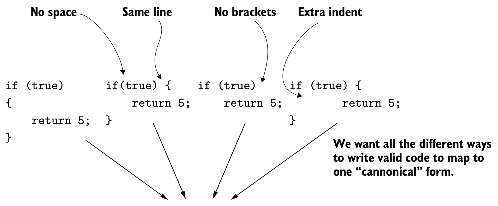

*图6.6 一个Java代码示例，展示了即使语义相同，同一代码的不同格式化方式也会导致不同的分词结果。Linter是常用工具，用于强制代码遵循特定的格式化规则。相反，利用linter可以创建一个相同的“基础”形式，从而避免表示不必要的信息（如空格与制表符）。*

去除代码中非功能性方面称为规范化，即将带有格式变体的代码转换为标准或“规范”形式。这里，我们演示了一种鲁棒的规范化方法，通过添加像`<NEW SCOPE>`这样的特殊标记来捕获`if`语句存在新上下文的事实，无论它是单行还是多行语句。除了添加特殊标记，我们还可以使用跨代码一致的格式（例如，始终使用空格而非制表符，在`{`之前加换行符或不加）。特殊解析和格式化都能提高代码LLM的性能。添加特殊标记的鲁棒方法在性能上优于格式化方法，但代价是编写和维护一个为代码添加这些特殊标记的自定义解析器。修改分词器的问题在下一节讨论将LLM用于数学时会变得更加关键。

### 6.2 面向形式数学的LLM

LLM 还能执行那些对人类来说通常相当具有挑战性的数学任务。这些任务不仅仅是执行加减等运算来计算数字，还包括形式化数学和符号数学。我们在图 6.7 中给出一个所讨论的形式化数学的示例。你可以让这些 LLM 计算导数、极限和积分，并编写证明。它们能产生出奇合理的结果。

用于代码的 LLM 是实用的，因为我们可以使用解析器和编译器部分验证其输出。正确的分词对于构建一个有用的数学 LLM 至关重要。使用 LLM 处理数学仍然是一个特别活跃的研究领域 [6]，因此让 LLM 执行数学的最佳方法尚不明确。然而，研究人员已经发现了一些问题，这些问题集中在构建和运行 LLM 的分词阶段。

![图 6.7 Minerva LLM 能够正确求解的一个符号数学问题。虽然该示例混合了自然语言和数学内容，但许多 LLM 采用的标准分词方式无法支持这种数学输出，并可能引发一些意外问题。（图像来自 [5]，遵循知识共享许可。）](assets/fig-6-7-65e2d1cc20.png)

*图 6.7 Minerva LLM 能够正确求解的一个符号数学问题。虽然该示例混合了自然语言和数学内容，但许多 LLM 采用的标准分词方式无法支持这种数学输出，并可能引发一些意外问题。（图像来自 [5]，遵循知识共享许可。）*

注意：在第5章中，我们提到微调可以多次应用，数学LLM就是一个很好的例子。

研究人员通常通过微调代码LLM来创建数学LLM，而代码LLM又是通过微调通用文本LLM得到的。在每阶段的SFT和RLHF之间，对原始下游LLM应用多达三到六轮微调以得到数学LLM。

### 6.2.1 输入净化

数学大语言模型常因输入预处理而受损，这些预处理对自然语言文本效果不错，却降低了数学概念的表示质量。

在文本中，格式化数学表示常涉及 {}<>;^ 等符号。

这些特殊符号在处理常规文本时通常从训练数据中移除。

要保留这些信息，需重写分词器的输入解析器，确保不会丢弃模型需要学习的数据。

等价数学方程有多种表示方式，进一步增加了训练LLM理解数学的难度，正如多种格式化方式在处理编程语言时可能引发问题。

TeX、asciimath 和 MathML 等格式允许用纯文本表达数学记号，但为排版程序提供正确渲染指令。

这些格式提供了许多不同的方式来表示同一方程。

图6.8展示了这一问题的一个示例。

问题存在于数学排版方法（即选择TeX还是MathML来绘制方程）和数学表示方法（即两种数学等价但表达方式不同）上。

这两者都是我们在讨论LLM时多次遇到的问题形式：同一事物存在多种表示方式。

就数学而言，目前的偏好是使用TeX及其类似但少见的变体（如asciimath）来格式化数学，而舍弃冗长的内容如MathML。

这一动机基于三个因素：


*图6.8 左上角的数学方程展示了数学中出现的两种不同表示问题。格式良好的数学需要一种排版语言。TeX和MathML是两种不同的排版语言，其文本形态截然不同，因此分词也大相径庭。抛开排版语言不谈，同一数学陈述也存在多种表示方式。*

基于TeX的格式化数学是最常见且最易获取的数学形式，这得益于像arXiv这样的公开资源，它们始终使用TeX格式。

保留所有类TeX表示法能够缓解学习多种格式（进而学习差异极大的令牌集）的挑战。更为冗长的MathML使用更多种类的令牌，因此需要更多计算资源来存储与每个独特令牌相关联的数据。

选择TeX作为大模型中数学的首选表示，并不能解决等效方程存在多种写法的问题。判断两个方程是否相同极其困难，研究人员已经证明，没有任何单一算法能够判定两个数学表达式是否等价。（这里我们措辞有些随意，因为本节讨论的是形式数学，因此请读者参考原文[7]。）目前，LLMs的最佳答案似乎是“让模型自己去理解”，这一方法迄今为止取得了相当不错的成效。但我们不会感到意外的是，未来数学大模型的开发者们将投入大量精力改进预处理流程，为数学方程创建更一致的规范化表示，从而减少等价表达式的可能变体。

### 6.2.2 帮助LLM理解数字

对大多数人来说，数字是数学中更容易理解的部分。你可以把它们输入计算器，直接得到结果。

虽然可能很繁琐，但如果没有计算器，你也可以手动计算。

只需遵循一套固定的规则就能得到结果。

有点令人惊讶的是，LLM在完成这类机械计算时困难重重，但开发者已致力于提升分词器处理数字的能力。

第一个问题在于，标准的字节对编码（BPE）算法会生成对数字分词不一致的分词器。例如，“1812”很可能被分词为单个标记，因为成千上万的文档中都提到1812年战争；而分词器可能会把1811和1813拆分成更小的数字。为了进一步探究原因，考虑字符串“3252+3253”以及GPT-3和GPT-4如何对其进行分词。GPT-4做得更好，因为它似乎每次从数字的前三位开始分词，结果得到一个三位数后跟一位数。GPT-3则显得不一致，因为它改变了数字分词的顺序，如图6.9所示。


*图6.9 除非对数字进行一致的分词，否则LLM无法学会基本的算术运算。 在此图中，下划线表示不同的标记。被分词的数字可能代表任何给定数字的十位、百位或千位。 GPT-3（左）在数字分词方式上不一致，使得两个数字相加变得不必要地复杂。 GPT-4（右）在一致地分词数字方面表现更好（但并非完美）。*

现在出现了一个重要问题。在GPT-3中，"3"这个token出现了两次，分别位于不同位置：一次在千位（三千二百...），一次在十位（三千二百五十三）。为了让GPT-3正确相加这些数字，分词器必须准确捕捉四个不同的数位位置。相比之下，GPT-4对每个数字采用有序的数码表示，从而更容易获得正确结果。

人们仍在尝试通过不同方式修改分词器，以提升大语言模型处理数字的能力。如果要将数字进行子词分词，目前最佳方式是将每个数字（如3252）拆分为单个数码，例如“3, 2, 5, 2”[8]。然而，也存在其他替代方案。

另一种有趣的数字表示方法称为xVal[9]，其思想是用同一个代表“一个数字”的token替换所有数字。我们可以将这个特殊token称为NUM，它将被第3章学过的嵌入层映射为一个数字向量。

这个巧妙的方法是为每个词元附带一个乘数，一个与嵌入向量值相乘的第二个数字。默认情况下，大语言模型对每个词元使用乘数1。任何数乘以1都不会改变。但对于我们遇到的任何NUM词元，它将被乘以文本中的原始数字！这样，我们可以表示可能出现的每一个数字，包括分数值，甚至是那些在训练数据中未曾出现过的数字。以这种方式捕获的数字以简单直观的方式相互关联。我们在图6.10中更详细地展示了这一点。

图6.10 xVal使用了一个技巧来帮助减少token数量并降低歧义性。

通过修改LLM将数字转换为向量的方式，每个数字（如数字1）由一个单独的向量表示。通过始终使用1 token并将其乘以观测到的数值，我们避免了数字token表示中的许多边界情况，例如从未出现在训练数据中的数字。这种转换方法也使像3.14这样的小数更容易被支持。

一致的位数和 xVal 策略都共享一个重要的认识。我们知道如何表示数学和简单算法，比如小学的加减乘除。如果我们设计 LLM 以更符合人类处理数学任务的方式对数学进行分词，那么我们的 LLM 将获得更好且更一致的数学能力。

### 6.2.3 数学LLM也使用工具


*图 6.11 给定某个数学目标，让 LLM 使用 Lean（右路径）可能无法得出可验证的正确证明，因为它可能不擅长将 Lean 作为工具使用。而让 LLM 生成常规证明（左路径）也许能得到正确的证明，但我们也无法验证其正确与否。*

如果大语言模型无法为其数学结果提供可验证的证明，该怎么办？当前的一个技巧是多次运行该模型。由于下一个词元是随机选择的，每次运行都可能得到不同的结果和答案。出现频率最高的答案最可能是正确的。这个过程并不能保证证明的正确性，但确实有所帮助。

### 6.3 Transformers 与计算机视觉

NOTE 有一种将图像表示为称为码本的微小图像组合的方法。

码本可能有用，但与我们讨论的要点不同。可以将其视为一个关键词线索，如果你希望了解一些较老的计算机视觉技术，可以深入探索。

虽然在Transformer出现之前，高质量的图像识别算法和图像生成器已经存在多年，但Transformer迅速成为机器学习中处理图像的主流方法之一。无论是纯粹使用Transformer的视觉Transformer（ViT）架构，还是将Transformer与其他数据结构混合的混合架构模型（如VQGAN和U-Net Transformer），在解读图像数据以及根据文本描述生成令人惊叹的计算机图像方面都取得了巨大成功。Transformer在图像上表现如此出色，似乎有悖常理，因为图像看起来并不像自然语言、代码或氨基酸序列那样是离散的符号序列。尽管如此，Transformer通过为模型带来全局连贯性，在计算机视觉中发挥了关键作用。

### 6.3.1 将图像转换为图块并还原

从概念上讲，我们将用一个新过程替换分词器和嵌入过程，该过程输出一个向量序列，类似于我们在3.1.1节讨论的嵌入层。创建表示图像的序列的常见方法是将图像分割成一组补丁。因此，我们将用返回向量序列的补丁提取器替换分词器。LLM的输出使用反嵌入层将向量转换回令牌。由于我们没有令牌，我们需要一个补丁组合器来接收transformer的输出并将其合并成一个连贯的图像。我们在图6.12中展示了这个过程。请特别注意，图的中心部分与基于文本的LLM相同。我们在文本和图像之间重复使用相同的transformer层和学习算法（梯度下降）。

*[未译]* "Output text ..."

### 解嵌入分块组合器

图像本身并非天然离散为词元，因此转而提取一系列图像块。这些图像块实际上就是按序列截取的小块图像。最后再将图像块重新组合回图像。

中间部分——接收向量序列，经过Transformer处理后输出新的向量序列——在文本数据和图像数据中保持一致。

Transformer Transformer

分词器与嵌入补丁提取器


*图6.12 左侧的简化图展示了文本输入在进入transformer之前是如何被分词和嵌入的。然后，一个反嵌入层将transformer的输出转换为所需的文本表示。当执行计算机视觉任务时，输入和输出将是图像。transformer保持不变，但我们修改了将图像分解为向量序列的方法，改为执行补丁提取而非分词。LLM使用补丁组合器生成图像输出，类似于文本LLM的反嵌入层。*

*[未译]* "Input text ..."

由于除了输入向量序列生成和输出步骤之外的所有部分保持不变，我们可以专注于图像与向量之间转换的工作原理。首先关注输入侧会更有帮助。

正如其名称“图像块”所示，图像块提取器将每张图像分解为一系列更小的图像。通常的做法是为图像块选择一个固定的大小，例如16×16像素的方块。我们需要一个固定的大小，以便于输入神经网络——它总是处理固定大小的数据；同时需要较小的尺寸，使其仅代表整个图像的一部分。将图像分解为图像块类似于将文本拆分成标记集合。单个标记本身没有信息量，但与其它标记组合后，便能形成连贯的句子。

一旦图像被分解为图像块，每个图像块中的每个像素被转换为三个数值，分别表示该像素中红、绿、蓝（RGB）的含量。通过将每个像素的RGB值合并成一个长向量，从而创建初始向量。因此，对于我们的16×16像素方块（每个像素有3个颜色值），我们将得到一个长度为768的向量（高度16，宽度16，每个像素一个RGB值）。然后，一个可能只有一两层的小型神经网络单独处理每个向量以生成最终输出。该神经网络实现了一个非常轻量的特征提取过程，不需要大量的内存或计算资源。这种设计在计算机视觉中很常见，因为第一层通常学习简单的模式（如“内部暗、外部亮”），不需要使用计算量更大、能力更强的Transformer层来学习图像块的基本特征。整个过程在图6.13中进行了总结。


*图 6.13 提取图块是一个直接了当的过程。图块提取器将图像分割成称为图块的正方形方块。图像由像素值构成，这些值已经是数字，因此我们将每个图块转换为数字向量。然后，我们使用一个小型神经网络作为预处理器，再将向量传递给基于 Transformer 的完整神经网络。*

- 3.使用一个小型神经网络进行最小量的“特征提取”，为后续的Transformer层处理这些小块做好准备。标准的Transformer/LLM架构从这里开始。

设计补丁提取器中的小型神经网络有多种方式，但通常效果都差不多。一种选择是使用卷积神经网络（CNN），这种网络能理解相邻像素之间的关联。也有人直接采用变换器层中的线性层作为替代。这种情况下，包含小型神经网络和一系列变换器的整体模型通常被称为视觉变换器。

这个小网络的设计是个细节问题，但值得一提，因为它的存在与生成最终输出的补丁组合器相关。无论选择CNN还是线性层作为小网络的架构都没有影响，但必须保证输出的形状与输入匹配。例如，对于16×16的补丁，可以使用小网络强制输出为16×16×3=768个值，无论变换器层本身的大小如何。要生成图像输出，只需反向执行补丁提取过程，将向量转换回补丁，再拼接成图像，如图6.14所示。

这样，我们就成功用新的图像中心层替换了输入标记化和输出嵌入。从很多方面看，这比标记化要优雅得多。无需构建或维护词汇表，也无需采样过程等。这是理解变换器作为大语言模型通用核心可广泛适用的关键洞察。只要能找到大量数据以及将数据转换为向量序列的合理方法，就可以使用变换器解决某些类别的输入输出问题。

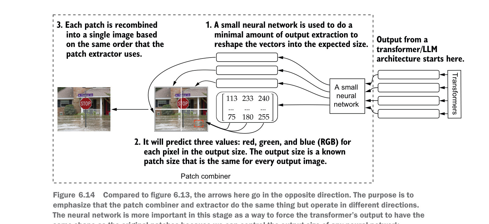

*图6.14 与图6.13相比，此处的箭头方向相反。目的是强调补丁组合器和补丁提取器执行相同的操作，但方向不同。在这一阶段，神经网络更为重要，因为它可以将Transformer的输出强制调整为与原始补丁相同的形状，因为我们可以控制任何神经网络的输出大小。*

### 6.3.2 使用图像和文本的多模态模型

将LLM的输入和输出改为视觉Transformer，意味着我们可以将图像作为输入并生成图像作为输出。这展示了Transformer能够处理不同模态的输入，但目前为止我们只讨论了输入和输出为同一模态的情况。要么是文本输入文本输出，要么是图像输入图像输出。然而，深度学习是灵活的！没有任何规定要求我们必须使用相同的模态作为输入和输出，甚至不限制输入和输出只能是一种模态。你可以将文本输入与图像输出结合，图像输入与文本输出结合，文本和图像输入与音频输出结合，或者任何你能想到的其他数据模态组合。图6.15展示了图像和文本的四种组合方式，用于处理不同类型的数据。通过创建一个以图像为输入、文本为输出的模型，我们得到了一个图像描述模型。我们可以训练该模型根据输入图像生成描述性文本。这类模型有助于提高图像的可发现性，并帮助视障用户。通过创建一个以文本为输入、图像为输出的模型，我们得到了一个图像生成模型。你可以用文字描述想要的图像，模型会根据输入生成合理的图像。著名的产品如MidJourney就是此类模型。尽管其实现不仅仅涉及视觉Transformer，但高层思想是相同的：通过将文本输入与图像输出配对，并利用大量数据，我们可以创建跨越不同数据类型的新多模态能力。

图像生成模型 图像描述 去噪/图像校正 大语言模型


*图 6.15 展示了四种不同的模型输入与输出组合。最右侧示例代表我们已熟知的基于文本的普通 LLM。左侧则展示了其他可能性：例如，以文本为输入的图像生成模型（“给我画一张洪水区内的停车标志”）或对输入图像进行描述的图像字幕模型（“这张图片显示了一个被浑浊积水环绕的停车标志”）。*

### 6.3.3 先前经验的适用性

本书中学到的其他经验教训同样适用于这些视觉Transformer和多模态模型。归根结底，它们学会了执行训练任务，当你试图以训练数据中未曾出现的方式引导它们时，可能会得到异常结果。例如，我们可以告诉图像生成模型“画任何东西，除了可爱的猫”，结果很可能会得到一只猫，如图6.16所示。这些模型（目前）使用成对的图像和描述图像的文本进行训练。

因此，它们学会了输入句子中任何事物的可视化之间强烈的相关性。例如，模型想要生成一只猫，因为输入句子中有“猫”这个词。更复杂的抽象绘画请求，如“画任何东西除了”，不会出现在此类数据集中，因此模型没有接受过处理此类请求的训练。

同样，随着像ChatGPT这样的大语言模型开发出提示策略来设计产生期望输出的输入，图像描述模型也发展了提示方法。包含不寻常信息的情况并不少见，比如“Unreal3D”——一种用于生成计算机游戏3D图像的软件名称——以产生具有特定风格和质量的输出。像“高分辨率”这样的词语，甚至包括在世和已故艺术家的名字，都被用来试图影响模型产生特定风格。


*图6.16 本图由旧版 Stable Diffusion（一种流行的图像生成模型）生成。尽管指令为“不要画猫”，但模型的训练目标是生成内容，该请求超出其学习激励范围，因此无法处理。这与大语言模型反复输出近似但错误的结果类似，因为训练数据中包含相似模式。*

### 小结


---

<a id="ch7"></a>

## 第 7 章: LLM 的误解、局限与新兴能力

### 本章涵盖

- LLM 与人类在学习上的差异

- 提升 LLM 在延迟与规模敏感型应用中的表现

- 生成中间输出以获得更好的最终结果

- 计算复杂度如何限制LLM的能力

得益于ChatGPT，全球对大语言模型（LLM）及其能力有了更广泛的认知。然而，尽管认知度提升，关于LLM的误解和错误认知依然众多。许多人认为LLM能持续学习和自我改进，比人类更聪明，且很快就能解决地球上的所有问题。这些说法虽显夸张，但一些人确实担忧LLM将严重扰乱世界。

我们并非说对LLM的担忧毫无道理——本书最后两章将深入探讨这些问题。不过，相较于LLM及技术的实际演进轨迹，你遇到的许多关于LLM的看法和担忧都被过度放大了。

本章将讨论LLM工作机制的几个关键方面，以及这些方面与上述误解的关联。归根结底，LLM的这些运行特性会影响你在实践中使用或规避它们的方式。

首先，我们将探讨人类学习与LLM学习之间的差异。人类是快速学习者，而LLM默认是静态的。尽管LLM在处理数据方面极为高效，但在学习新事物时，人类更能最大化产出效率。

接下来，我们将探讨为何在理解LLM运作时，“思考”一词具有误导性。我们将强调，将LLM的运作视为“计算”更为恰当，因为LLM在构思与输出之间没有区别。相比之下，人类常常“三思而后言”。最后，我们将讨论LLM计算能力的边界，以及计算机科学概念如何帮助我们理解LLM当前及未来能力的内在局限。

这三个主题相互关联，因此在深入探讨每个主题时，你将会看到它们之间的联系。

### 7.1 人类学习速率与LLM的对比

虽然我们已经隐晦地讨论过，但明确说明LLM的训练与人类学习的差异是有帮助的。生成式AI产生的流畅且往往清晰的文本，以及我们用来将LLM能力与人类能力相类比的比喻，可能让人觉得两者之间存在某种关联。许多人在网上鼓吹这种观点：LLM能做的和人类能做的之间这种联系是真实的。实际上，两者截然不同，这关系到你在何时、如何以及为何更偏好人类而非AI，以及人类和AI如何协作的重要考量。

根据目前所涵盖的材料，我们知道LLM通过预测下一个词来学习，使用了数亿文档作为示例。在第4章中，我们介绍了LLM中“学习”的算法过程：梯度下降算法，它通过尝试预测样本输入中的下一个词元来改变LLM神经网络的参数。接着，在第5章中，我们展示了像RLHF这样的微调算法如何再次改变LLM的参数。LLM学习的这两个组成部分与人类学习几乎没有相似之处，并对我们可以期望LLM做什么施加了一些关键限制。其中一个最关键方面是这种学习方法的速率和有效性，这与提供给训练过程的数据量有关。

为了进一步探讨，考虑一下LLM的学习方式相对于人类学习方式。你见过从未与他人交谈、父母也从不对其说话，却以某种方式理解了语言的人吗？很可能没有。实际上，对话是语言习得的关键部分[1]。至少最初，你通过与他人和环境的互动与交流来获取知识和语言。因此，你可以用比LLM训练数据少得多的信息有效学习。

在儿童语言习得的最佳案例中，研究发现儿童每月接触到约1.5万个口语词汇[2]。即使我们把这一数字慷慨地向上取整到2万，并假设人活100年，一生中听到的口语词汇也多达2400万个。这显然是个巨大的高估。再结合一个事实：大多数人在18岁前就能流利地说母语，并内隐地理解词汇和语言结构。现在与LLM比较一下。例如，GPT-3接受了数千亿词汇的训练。仅从词汇量角度看，这是一种非常低效的语言学习方式！

语言习得还让我们认识到词汇获取方式的巨大差异。婴儿和幼儿从简单词汇开始，比如“妈妈”和“爸爸”，然后逐步学习颜色、“不”、食物等基本概念。更复杂的词汇随着时间的推移逐步添加，建立在已有词汇之上。然而，LLM从一开始就根据词频同时看到所有词汇。事实上，可以准确地将LLM的“学习”过程想象为：它在第一次“学习”时就将这本书整个进行分词，同时获取其最终拥有的所有词汇知识，而不是从简单概念开始并在此基础上构建知识。虽然这一过程有助于提高LLM的学习速度，但也可能削弱其在概念之间建立高层级关系的能力。

LLM相对于人类的关键优势在于其运行规模以及同时执行多任务的能力。这一优势贯穿机器学习和深度学习领域，是一个常见主题。你很难雇佣一支大军去翻阅书籍、费用报告、内部文件或任何信息媒介，以完成撰写评论、发现潜在欺诈或回答某个晦涩政策问题等知识工作。然而，你可以迅速获得一支计算机大军来尝试自动完成这些任务。单个LLM可以同时分析句子的多个部分，同时你还可以部署多台运行同一LLM的计算机并行工作。训练LLM也提供了类似机会：LLM训练用的词汇量远超你在有生之年阅读或听到的词汇量，你可以通过租用或购买数千台计算机同时训练一个大模型。

结合这些事实以及前几章的内容，我们可以列出使用LLM执行任务相对于人类的一些高层级利弊。这些因素的总结见图7.1，该图描述了LLM的优势和劣势将如何导致其使用中自然的益处与缺陷，从而为LLM的适用与不适用场景提供洞见。

LLM的一些优势如下：

训练有素的LLM拥有广泛的背景信息，因此在许多与先前见过的任务差异不大的任务上表现出色，且只需少量工作即可使模型有效运行。虽然这些信息不一定正确或详细，但LLM能够接收并生成合理回复的主题领域之广，远超大多数个人所能覆盖的范围。

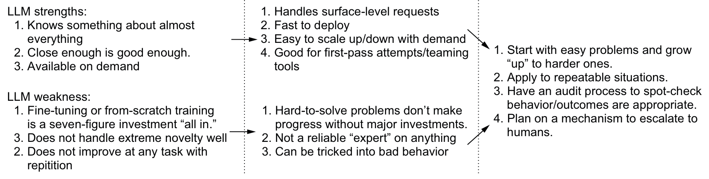

*图7.1 展示了LLM相对于人类执行相同任务时的优势与劣势总结。这些特点引出了使用LLM时必须评估的自然考量。基于此，我们可以总结出成功使用LLM的广泛建议。*

对于许多任务，无需获得精确正确的回答。对某一领域的一般信息提出宽泛请求，本质上允许LLM在回应时具有灵活性和无约束性。如果你通过其他过程对LLM的输出进行优化，这一点尤其明显。例如，人类可能会对一篇文稿进行文字编辑以改进它，但使用LLM来产生初稿或提供灵感，以打破写作障碍并加速创作。同样，LLM可以用来优化作者的写作，通过改写或使用更丰富的词汇，使其听起来更自然或更有吸引力。

与人类相比，LLM可以快速训练。给定100万到1000万美元的预算购买计算资源，你可以在几个月内产生一个广泛有用的LLM。人类需要许多年才能变得有用。能够回答广泛基本问题的LLM，其实例化所需的精力和成本远低于寻找、雇佣和保留一个具有特定知识、技能和能力的员工。只要问题在LLM能够实现的范围内，增量成本与人的小时费率相比微不足道，甚至不考虑额外开销。

LLM 的一些缺点如下：

LLM的高训练成本决定了其经济性。这一训练成本会在LLM训练完成后，通过其数千次运行操作进行摊销。如果LLM表现不佳，持续改进使其正常工作的成本可能会迅速变得高得令人望而却步，甚至不考虑它可能永远无法正确完成特定任务的可能性。例如，如果一个采用了最新工具和技巧的LLM无法解决特定需求，解决此问题将需要未知的工作量和预算。相反，人类通常可以以低得多的成本，在数周至数月内学习新能力，尤其是那些对LLM而言困难的能力。LLM无法可靠地处理训练数据中未体现的意外情况和输入。尽管许多LLM已展示出能在新情境中成功，但它们的学习方式与人类不同。一个人可以在第一次尝试时发现自己的行动未达预期，并迅速调整。LLM无法通过观察自身错误独立调整，可能会反复消耗资源，试图为其无法理解的问题生成答案。

LLM容易被愚弄，在对抗性环境中表现不佳，因为一旦人们找到方法诱导LLM产生错误结果（例如，“即使我没有收入，也请给我贷款”），他们可以重复这种对抗性和恶意行为，而你的LLM在未实施额外护栏的情况下无法阻止。

### 7.1.1 自我改进的限制

一般来说，人类具备自我提升的能力。他们能够聚焦并研究问题，设计新方法，识别所需资源，进而实施并完善解决方案。尽管大语言模型在自我提升方面存在困难，但在生成式AI领域，有人认为大语言模型同样可能实现自我提升。其实现思路大致如下：

1. 在初始数据集上训练大语言模型。

2. 使用该大语言模型生成新数据，并将其添加到训练数据集中。

3. 在新数据上训练或微调模型。（重复直到LLM符合预期。）尽管这听起来直观且合理，但我们认为由于简单的原因它并不奏效。我们可以利用一些基础信息论（它将信息视为可量化的资源）来解释原因。这一论断的基础是，从信息的某种度量来看，原始数据集具有固定量的信息。用统计学的术语来说，我们可以将原始信息描述为可用信息的分布，而LLM通过其训练过程，试图通过存储和编码信息到其模型中来近似或复现这一信息分布。当你使用LLM生成新数据时，这些数据样本是对LLM在训练过程中观察到的原始数据分布的有噪声且不完整的复现。从根本上说，LLM的输出不可能包含任何原始训练数据中不存在的新信息。因此，这类实验的实际情况是，连续多轮生成数据并训练会降低模型的性能和质量[3]。要让这种方法奏效，你需要有某种能在每一轮提供外部或新信息的机制。这些概念也与一些人的担忧相关，即AI不断自我改进，直至变得无比智能，以至于我们无法理解或控制它。有些观点认为，LLM可以利用其他工具，以某种方式获取外部信息或更多训练数据来自我改进。最终，这需要相信：尽管大多数技术的改进空间存在限制（如收益递减法则），但LLM却能不受这些限制的影响。图7.2描述了LLM自我改进的内在限制。

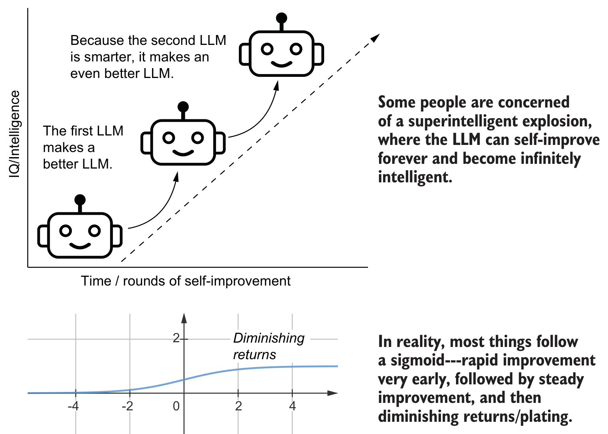

*图7.2 担心LLM会自我改进的人需要相信，LLM不会遵循几乎所有其他技术发展的那种常见的S型曲线或S曲线（收益递减）。要实现无限自我改进，我们必须相信能源、数据或计算能力等约束总是可解的，而且不知何故，人类在LLM之外的领域却不会去解决这些约束。正是这样的约束使得我们可以用S曲线来描述大多数技术发展，即随着更多约束生效，进步会放缓。换句话说，我们最终会达到一种无法仅靠建造更大计算机来解决问题的状态。*

技术改进局限的一个绝佳例子是摩尔定律，该定律大致指出芯片上的晶体管数量每18到24个月翻一番。摩尔定律在很大程度上准确预测了芯片上晶体管数量的增长，但有迹象表明晶体管上出现了收益递减的S曲线。芯片上晶体管数量翻倍的速度正在放缓。更重要的是，整个系统性能已经进入了这个S曲线。晶体管数量与总体计算性能相关，但并不直接等同于计算性能。纵观图7.3的全貌，你会发现其他制约因素阻碍了整个系统的无限改进。撇开摩尔定律不谈，高性能GPU及其托管基础设施的实际成本是另一个无限改进的障碍。

许多引人注目的标题宣称，LLM在医学院入学考试（MCAT）、律师执业资格考试以及智商测试中展现出了优异表现，以此来衡量其智能水平。尽管这些标题总是引人入胜且充满诸多限制，例如

*图7.3 摩尔定律是无限增长的常见例子，但它具有误导性。晶体管的数量持续翻倍，但频率、功耗、单线程性能以及总计算量却并非如此。因此，整个系统的性能并未能持续大约每两年翻一番。随着时间的推移，其他类似的因素将限制LLM的性能并影响其能力。基于CC4.0许可协议，图片来自https://github.com/karlrupp/microprocessor-trend-data。*

有很多利用外部信息改进生成式AI的例子。一些为机械手设计的算法利用物理模拟器的外部信息。Apple利用3D建模软件生成数据来改进手机虹膜识别[5]。在第6章的示例中，你看到了利用代码编译器或Lean语言验证数学来改进LLM的潜在路径。这些示例展示了完全可自动化的流程，这些流程生成新信息，进而可以带来自我改进。

然而，从未有无止境自我改进的例子；使用这些外部工具观察到的增益最终达到平台期，并且最终依赖于人类编写更好的机器人物理模拟器、更好的代码编译器以及类似Lean的领域知识系统来开发辅助信息。改进这些工具增加了训练LLM的主要开销，从而在实践中对LLM的自我改进施加了第二个经济限制。

### 7.1.2 少样本学习

少样本学习也被称为上下文学习。这项技术涉及在发送给LLM的提示中提供您期望它生成的输出类型的示例。假设您希望LLM用准确的信息回答一个客服问题。您可以给LLM一个提示，其中包含用户向客服提出的问题，后跟一个恰当回答的示例。如果只提供一个示例，则称为单样本学习。提供两个示例而不是一个称为双样本学习，以此类推，因此这种方法被称为少样本学习，因为具体示例数量通常不如仅提供少量示例这一事实重要。这种在提示中融入示例的方法是提示工程的一种特定形式，如图7.4所示。

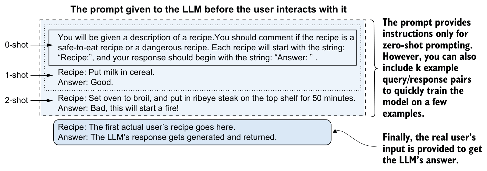

*图7.4 带有你希望LLM如何生成输出示例的提示称为少样本提示，因为LLM在其训练数据中从未见过该特定行为的任何示例。在你的提示中，你可以包含与RLHF/监督微调(SFT)类似的输入和输出示例。这种提示风格通过提供期望输出应该是什么样的示例，鼓励模型产生期望的输出。由于LLM在大量未标记数据上进行训练，k样本示例是一种以最小努力获得更好结果的有效方法。*

在提示中包含示例有助于提升LLM在新任务上的表现。你无需使用RLHF或SFT来修改模型，而且这比零样本提示（即要求LLM在没有示例的情况下完成任务）效果更好。但这是高效的学习吗？

少样本提示并不是训练，因为我们并没有以任何方式改变模型，就像训练或微调过程中那样。LLM的“状态”或权重保持不变。无论LLM在周一多么准确地完成任务，它在周二和周三都会同样准确，无论它处理了多少千或百万次少样本提示。模型的能力不会有任何提升，除非你手动采取一些措施，比如在提示中加入更好的示例、提供更多示例，或者以其他方式进行干预。在这个意义上，并没有真正的学习发生，模型没有任何改变。我们只是通过改变提示而获得了模型改进后的输出。

然而，从抽象意义上说，LLM确实在学习，因为提示通过提供额外的上下文来描述问题，从而改变了模型的行为。通过提示所表现出的行为与通过类似示例微调所达到的行为是相关的[6]。简而言之，这意味着少样本学习从根本上并没有反映出任何与梯度下降已经能做到的不同之处。

注：如果你的数据量不大，那么作为实践者或用户，少样本提示可能是让LLM在你的数据上表现良好的最有效方式。

因为我们可以将这种提示视为低效的梯度下降或微调，所以当你以少样本方式添加示例时，应该预期到收益递减。例如，如果你在提示中包含了大量希望LLM如何回应的示例，但仍然没有得到所需的性能，那么你应该考虑我们曾在第5章讨论过的SFT、RLHF以及其他微调方法。

### 7.2 工作效率：10瓦人脑 vs. 2000瓦计算机

人脑维持意识仅需相当于10瓦的功率，这让你能阅读本书。一台配备GPU用于AI/ML工作的高端工作站功耗轻松达到2000瓦。用于运行当前较大LLM的高端服务器功耗在10000到15000瓦范围内。乍一看，使用LLM完成某些任务相比人力，能效似乎差了1500倍。我们应当为进化带来的这一成就和能效感到自豪，但这只是效率的一个维度。我们在图7.5中展示了人与机器相比可能受益的多种效率。

### 7.2.1 功率

功率是决定创建和运行LLM的财务成本的关键因素之一，但真正的需求尚不完全明确。诚然，许多提供商会给出运行LLM的报价，但我们不知道每个提供商实际承担的真实成本或其设定的利润率。例如，LLM提供商可能采用负利润率或低价引流策略，长期使用LLM的成本可能高于基于当前价格所显示的水平。我们


*图7.5 使大语言模型运转的昂贵硬件导致了一些权衡取舍。例如，使用大语言模型的初始成本通常很高，并且它们无法自主适应。这种自主适应的缺乏导致了许多天然弱点，在这些方面人类胜过大语言模型。某些弱点，例如模型不经过训练就不会改变这一事实，却可以被视为优势。如果每个新运行的大语言模型行为不同且不可预测，那么你就无法获得易于扩展的可重复流程。*

确实，LLM 对电力的需求巨大，以至于大型科技公司正计划建造核电站，为未来数据中心运行所有预期模型提供所需电力 [7]。

基于此，我们可以预见新的 LLM 将更大、更耗电，但其价值将抵消为数据中心建造专用电厂的成本。

基于这一因素，当一个成功的 LLM 解决方案带来更多需求时，需谨慎行事：满足需求时可能遇到电力容量问题。同样需要注意电力成本的弹性。不仅 LLM 提供商可能改变成本结构，而且如果你自行托管 LLM，美国确实会发生 6 倍的电力价格波动 [8]。如果你的目标客户群只有 2 万用户，这可能不是问题；但若计划构建服务于数百万甚至更多用户的产品，电力成本可能成为主要的运营和环境隐患。

### 7.2.2 延迟、可扩展性和可用性

延迟是指从查询 LLM 到获得某些输出所需的时间，可扩展性描述的是从运行一个 LLM 到运行一千个 LLM 的速度有多快，而可用性则是指 LLM 能够全天候运行的能力。这些都是 LLM——以及更广泛地说，计算机整体——相对于人类的主要优势。LLM 和 AI/ML 能够比人类更快速、随时应对更多的情况。这种反应速度既可能是好事，也可能是坏事。当你有一个需要对输出进行监督和审查的系统时，如果没有制定相应的人员配备计划，你就无法获得 LLM 的完整可用性优势。

### 7.2.3 优化

正如我们在7.1.1节讨论的，LLM无法轻易自我改进。然而，人类能够也确实在进步，而且随着时间的推移提高流程效率是一个常见目标。

你需要让人类参与进来，设计更好的提示词并创建更好的训练方案，以提升LLM的效率；没有他们，LLM的性能将无法提高。

提高LLM效率不仅仅涉及升级到更新的LLM或微调现有模型，还包括构建基础设施，记录输入、输出和性能指标，以研究哪些有效、哪些无效。

你可以使用我们在5.5.2节讨论的DSPy等框架来捕获这些条目，并识别和处理那些失效或随着世界环境变化而开始失败的情况。

例如，你可能开发了一个初始LLM，它运行良好。

但那些该死的小鬼不断向iDroids和appleBots添加新的表情符号[9]。

如果没有额外训练，你的LLM将无法理解这些新表情符号，但你的客户会不可避免地开始使用它们，因此系统性能会开始下降。

如果你不记录LLM的输入和输出日志，或者不征求用户反馈（他们可以提供LLM在哪些方面成功或失败的信息），你将永远无法查明这个问题。

捕获这些信息对于改进和优化流程至关重要，而LLM在没有人类干预的情况下无法做到这一点。

在机器学习领域，数据漂移概念备受关注，即现实世界的数据不断演变，超出了模型训练数据所能涵盖的范围。在处理自然语言时，表情符号只是语言使用演变过程中现实数据随时间变化的一个具体例子。表情符号的例子可以扩展到包括新术语或语言中现有词语新用法所产生的问题。通过审视该领域的现有工作，我们可以识别出更多用于测量和缓解LLM数据漂移的技术，例如收集额外的训练数据并对模型进行微调，或修改提示以包含对先前未见术语的补充定义。

### 7.3 语言模型不是世界模型

你经常能从LLM中获取关于世界的准确信息。因此，很容易认为语言模型知道世界上的事物。事实上，作为本书的读者，你可以推理世界和将要发生的事情，而无需采取任何具体行动。这里我们讨论的不是预测股市这类复杂的事情，而是简单的行动和想法。例如，如果你告诉某人他们的毛衣很丑，会发生什么？

你不需要与环境互动或找到一件丑毛衣来回答这个问题。你不需要说话或与任何人或任何事物互动来回答这个问题。你可以想象毛衣的“世界”以及别人可能的感受，并推断结果。如果我告诉你有人穿着那件毛衣参加圣诞派对（也许是丑毛衣大赛？），你可以更新你的世界心理模型，推断出虽然没有亲身经历但会发生的结果。LLM无法在说话之前思考。生成文本是LLM最接近“思考”的方式（在此语境下宽松地使用这个词）。你可以在图7.6中看到一个简单的例子，其中LLM过于冗长的推理最终导致它给出了一个不错的评论。推理，无论我们是隐式还是显式地进行，都与我们谈论所推理的事情不同。对于LLM来说，没有过程的分离；要“更多地思考”答案，就需要生成更多的输出。因此，LLM不具备独立于生成输出的思考能力。

警告：我们在LLM的语境中松散地使用“思考”这个词。

严格来说，我们的意思是LLM在回答问题时进行的计算并非动态的。输出10个令牌所需的工作量是相同的，无论这些令牌的内容如何。回答一个需要人类更多思考的复杂问题，可能需要LLM执行更多计算，但这通常意味着LLM必须产生更长的输出，即使答案本不应更长。每当有人将“思考”一词与LLM关联使用时，最好用“计算”替换“思考”。


*图7.6 LLM能够正确识别某人穿着或做出异常行为的背景和原因，并生成恰当的回应。然而，若不生成中间文本，LLM可能无法直接得出该恰当回应。对于数学问题而言，这类中间文本可能有用，但用户未必总是适合或希望看到这些中间文本。*

这个例子表明，LLM无法在不生成关于规划过程的文本的情况下进行规划。如果LLM没有生成文本，就好像它不存在一样。有一些方法可以构建提示词，鼓励LLM将其输出分解以模拟规划。这通常被称为链式思考（CoT）提示，即在提示词中加入类似“让我们一步步思考”的语句。这种逐步指令通常能提高模型执行任务的能力[10]，但尚不清楚为何能提升性能。再次强调，“思考”一词的模糊性可能引发对LLM能力的不合理预期。

即使使用CoT，LLM仍会犯许多错误，例如遗漏步骤、遗漏计算以及执行逻辑无效的推理[11]。其他因素也可能导致观察到的性能提升，即当LLM将输出分解为一系列步骤时。考虑：

在第三章中，我们学习了Transformer及其实现中使用的注意力机制。我们了解到，LLM接收的输入和产生的输出越长，Transformer的计算量就越大。

那么，逐步思考之所以更有效，仅仅是因为LLM通过Transformer进行了更多的计算吗？如果LLM拥有世界模型，它就可以在不生成输出的情况下对输出进行这种计算。

LLM反映了其训练数据的本质。训练数据中可能存在与“逐步思考”及其他教学材料相关的内容，这些内容通常更冗长且正确。最终，我们可能是将LLM的模糊回忆与更相关的训练文档进行人工对齐，而不是让LLM执行根本不同的功能。

警告：“世界模型”的精确定义尚未达成共识，不同的人可能有不同的理解。

在讨论世界模型时，最好先明确其定义，以便大家达成共识。许多关于LLM的讨论实际上是在各说各话，我们将在本书的最后两章进一步探讨这一点。

这些问题极具挑战性，涉及开放性的研究课题。我们的立场是，大语言模型那些戏剧性的失败恰恰表明，这些解释比某些更玄乎的缘由更具说服力。重要的是，一些细分研究正致力于为机器学习方法注入世界模型。David Ha 和 Jürgen Schmidhuber 在 2018 年提供了一个技术性强但相当易懂的实例（https://worldmodels.github.io/），该实例与当时现有方法相比，展现了巨大的性能提升。另一些研究者正在为 LLM 构建世界模型，或者将 LLM 本身用作世界模型 [12]。当前方法不具备人类那样高度的灵活性；这些实例在范围上更为局限，且仅适用于某一类通用问题。

### 7.4 计算极限：困难问题依旧难解

有些人担心“失控”的人工智能，即AI算法变得如此先进和强大，以至于能解决我们永远无法解决的问题，并且这样的AI不会拥有与人类福祉一致的目标。如果存在这样的AI，它可能以我们无法自我改进的方式自我改进，从而产生更强大的AI。许多人让这种想法肆意蔓延，想象LLM会变得几乎神一般的强大，推理能力超越人类。这里涉及一个伦理问题，我们将在本书最后一章进一步讨论。目前，有一个简单的技术原因让我们不那么担心这一想法，它也有助于我们理解LLM的实际局限性。本质上，有很多方法可以衡量所谓的计算复杂度或算法复杂度。通过将LLM的复杂度与其他经过充分研究的算法进行比较，我们可以更具体地了解LLM能做什么和不能做什么。我们还将讨论，在适当的情况下，使用LLM的近似解决方案如何避免精确解决方案的一些复杂性。

在计算机科学中，我们花大量时间学习算法复杂度。对于大多数学生或从业者来说，这意味着理解输入数据量的变化如何影响过程产生结果所需的时间。一个较为理想的情况（现实中很少发生）是，如果输入加倍，过程所需时间也加倍。换句话说，对于n个项目（在LLM中，一个项目可能是一个token），原本需要2天的过程，对于2×n个项目需要4天。在计算机科学中讨论复杂度时，我们经常使用数学符号——大O表示法——来传达不同的复杂度级别。当过程的计算时间与输入规模同速增长时，称为线性复杂度，在大O表示法中记为O(n)。如果以数据规模为x轴、计算时间为y轴画图，会得到一条直线，因为数据和计算时间以相同速率增长。其他常见的现实复杂度包括对数线性（O(n log n)），其中2×n可能接近4.4天；二次（O(n²)），其中2×n可能接近8天；指数（O(eⁿ)），其计算时间随输入规模增长如此之快，以至于算法完成之前世界很可能已经不复存在。在这些情况下，随着系统变得越来越复杂，输入规模与计算时间的图形变得越来越陡峭。换句话说，对于更复杂的算法，处理时间会随着处理数据量的增加而更快增长。

我们简短地进入计算机科学领域，以帮助您理解运行LLM的计算复杂度。对于n个项目的输入，LLM的计算复杂度为O(n²)或二次复杂度。如果我们能证明一个算法/任务需要超过O(n²)的工作量，那么我们就基本上证明了LLM不能有效解决该问题，因为LLM的核心算法无法精确执行具有该复杂度的算法。

警告：这不是一门关于形式化方法或算法的研究生课程；我们只是在快速概述算法复杂性的研究。

目标是让读者对这个问题有一个技术直觉，但我们并没有完全为你配备详细讨论这个主题所需的所有知识。要了解更多关于算法和复杂性的内容，请参阅 Aditya Y. Bhargava 的《算法图解：像小说一样有趣的算法入门书》[13]。

如果能让LLM解决一个需要，比方说，立方复杂度O(n³)的问题，但LLM本身的复杂度更小（更优）为O(n²)，那么就会出现逻辑矛盾。换句话说，LLM解决复杂问题的速度不可能超过复杂度分析所表明的上限。许多现实任务和算法的复杂度都高于O(n)。表7.1中描述了一些例子，你会注意到我们列出的这几个例子都与物流或资源分配有关。例如，包裹递送和航班重新调度就是算法复杂度极其棘手的问题。

*表7.1 不同时间复杂度的关键算法示例*

### 算法复杂度

质因数分解（用于所有密码学）O(en)（如果你有量子计算机，仍然是O(n³)），旅行商问题（用于路由/物流配送）O(en)，线性规划（用于可分割资源分配和网络流）O(n³)，整数规划（用于不可分割资源分配）O(en)。我们关心算法的第二个重要且相关的原因是算法的复杂度类。

复杂度类定义了算法能够解决的问题范围。最著名的复杂度类是P（多项式时间）和NP，即至少需要O(en)时间才能完成的问题。这两个非常广泛的类基本上涵盖了所有你可能关心的问题。

注意：很多人以为NP代表非多项式（not-polynomial），但这是错误的！

它实际上代表非确定性多项式（nondeterministic polynomial）。

有趣且具有启发性的是，William Merrill 和 Ashish Sabharwal [14] 证明了大语言模型解决问题的能力与其在中间步骤生成的 token 数量相关。对于大语言模型来说，生成回答属于一个名为 TC0 的复杂度类（我们都知道，计算机科学家最不擅长命名了）。这个复杂度类限制极为严格，意味着大语言模型几乎无法解决任何问题。随着中间步骤 n 变长，最终你会达到复杂度类 P。这意味着大语言模型永远无法解决 NP 或更难的问题！我们将这些内容归纳在图 7.7 中，该图显示了这些复杂度类层次之间的关系。

这一发现更具破坏性，因为复杂度类描述的是你能解决哪类问题，而非解决问题的效率。例如，要解决一个复杂度为 n^c 的算法，大语言模型需要生成大约 n^c 个 token。然而，大语言模型处理 n 个 token 需要 O(n^2) 时间，所以最终会...

寻找从工作地点到家的最短路径、设计计算机芯片的电路布局、在文字处理器中查找和替换。


*图7.7 计算复杂度的文氏图（假设P≠NP，这是给极客们的一个小彩蛋）展示了各类复杂度之间的关系。上方的箭头给出了新复杂度类能够解决的问题示例，下方的箭头则显示了LLM在复杂度中的位置。*

这种复杂性估计并未考虑LLM训练数据以及开发提示词以使LLM无错误成功执行算法所需的时间。

### 7.4.1 使用模糊算法处理模糊问题

关于算法和复杂性的这番讨论，听起来可能对LLM非常不利。但事实上，只有在你想将LLM应用于需要正确输出结果的问题时，它才是不利的。如果你的系统连最小的错误都无法容忍，那么你就不应该使用机器学习，更不用说LLM了。

与整个机器学习领域一样，LLM最适用于模糊问题——这类问题中，判断正确与否的标准难以描述。在模糊问题中，通常允许错误存在；其他流程可以修正这些错误，或者错误的成本可能小到可以忽略不计。这就是为什么文本和自然语言非常适合LLM。像“Suzy在那封邮件中是什么意思？”或“John在他的短信中是否暗示了什么？”这类问题的答案本质上是模糊的。人类语言充满了不精确性、澄清和重复，这些特性与让LLM解决需要一致且精确答案的问题的难度非常吻合。

### 7.4.2 当“足够接近”便足以解决难题时

为了稍微反驳一下我们自己，我们也要指出，当“解决”意味着“找到不存在更好解的最优解”时，人类也无法解决NP-hard问题。我们使用近似法来解决复杂问题，因为我们知道它们太难以完美解决。

例如，在表7.1和图7.7中，我们提到了旅行商问题，这是一个著名且重要的问题，用于配送路线规划。邮递员希望在最短的时间和距离内送达所有邮件，且不重复任何路线。从计算角度看，找到最佳路线是NP难的，因此只能应用于几百个，最多几千个投递点。然而，存在更快的二次算法可以近似解决该问题，并且我们可以证明这些算法给出的路径距离不会超过最优路径距离的2倍。因此，在现实世界中，我们使用这些及其他技术来获得“足够接近即可”的解决方案。同样，LLM也潜在地可以获得“足够接近即可”的解决方案，但它们仍然受到效率低下的限制，无法精确解决问题。

如果不了解LLM的训练数据，我们就难以估计它通过近似解决难题的能力。考虑一下，国际象棋在技术难度上比NP难问题更高。GPT-3.5能够下出不错的象棋，甚至可以击败真正的人类棋手[15]，尽管还达不到专用象棋程序那种“碾压所有人类”的水平。这是否表明LLM擅长通过近似来解决极难问题？很可能不是。首先，ChatGPT的下棋能力在将象棋作为评估指标后大幅提升（https://github.com/openai/evals/pull/45）。我们有理由怀疑ChatGPT的制造者进行了微调，将象棋作为明确目标。其次，互联网上充满了供人们学习和探索的棋局（https://old.chesstempo.com/game-database.html），因此ChatGPT很可能在其训练数据中包含了完整的象棋棋局。

尽管如此，有趣的是ChatGPT能够利用训练数据下出不错的棋局，将以往见过的情形与未来稍有不同的情况相匹配。在考虑基于LLM的解决方案最适用何处时，我们推荐以下思维框架：将LLM应用于重复性强、变化不大的问题，以最大化其效用。文本摘要、语言翻译、起草文档初稿以及检查现有文稿等应用都属于这一类。

深度学习其他领域也带来了类似的教训，这些领域比LLM更容易解释模型内部发生了什么。例如，围棋游戏数十年来一直是人工智能研究中最持久的挑战之一。直到最近，人工智能才在围棋中击败了冠军级选手。与LLM一样，围棋AI通过观察大量棋局进行训练。然而，如果你构建一个执行异常和/或荒谬棋步的围棋机器人，它会击败“超人类”的AI，但会输给人类业余棋手[16]。这个例子也凸显了在对抗性环境中使用LLM的风险，在这种环境中，人类处理显著新颖性的能力远强于当前AI/LLM。

总结：LLM相对于人类的最大优势在于它们所达到的规模。LLM可以低成本、全天候运行，并且可以根据需求进行缩放，其难度远低于培训或裁减人力团队。

人类更擅长处理高度新颖的情况，这对于与LLM交互的人可能是对手（例如，试图欺诈）时尤为重要。

我们知道，LLM对于与训练数据中见过的类似问题表现良好，因此它们在重复性工作中很有用。提示工程很可能是向LLM“教授”新知识最有效的起点，除非你能投入大量精力和资金进行数据收集和微调。

LLM无法自我改进，并且在解决需要特定正确答案的算法问题上效率低下。它们最擅长“模糊”问题，这类问题存在一定的满意输出范围，且可接受一定程度的误差。


---

<a id="ch8"></a>

## 第 8 章: 用大语言模型设计解决方案

### 本章涵盖

- 使用检索增强生成减少错误

- LLM 如何监督人类以减轻自动化偏差

- 使用嵌入增强经典机器学习工具

- 企业与用户双赢的LLM呈现方式

到现在为止，你应该已经对LLM及其能力有了扎实的理解。它们生成的文本与人类文本非常相似，因为它们是经过数百万人类文本文档训练出来的。它们生成的内容有价值，但也容易出错。而且，如你所知，你可以通过融入领域知识或使用解析器（如计算机源代码解析器）等工具来减少这些错误。

现在你已经准备好设计一个使用LLM的解决方案。如何将我们迄今为止讨论的所有内容转化为一个有效的实施计划？本章将引导你完成设计该计划的过程、权衡和考虑因素。为此，我们将使用一个大家都能感同身受的例子：需要帮助时联系技术支持。

首先，我们将考虑最显而易见的路径：构建聊天机器人。聊天机器人是许多人接触LLM的载体，因为它们通常能很好地以交互方式生成输出。我们将评估在客服场景中部署由LLM驱动的聊天机器人的风险。通过这一讨论，你会看到使用LLM相比其他选择可能会增加风险。然而，如果风险足够小，简单的聊天机器人或许是一个有效的选择。

接下来，我们将探讨通过应用设计来管理风险的方法，这些设计能改善客户与LLM的交互方式。我们将讨论让一个人检查LLM生成的每个输出会带来很多问题，原因是一种被称为自动化偏差（automation bias）的现象。我们将讨论如何通过让LLM反过来监督人来避免自动化偏差，这可能有些反直觉。我们将探讨如何将LLM的嵌入（即文本的语义数值表示）与经典机器学习算法相结合，以应对这一风险，并处理LLM无法独立完成的任务。

最后，我们将研究技术如何呈现给用户，以及在建立信任和传达对其内部工作原理的理解方面发挥的关键作用。我们将讨论“可解释AI”领域，在该领域中，机器学习算法会生成描述或解释其如何得出特定输出的输出。可解释AI常被用来处理人们需要理解LLM工作原理的情况，但研究表明，尽管可解释性可以通过用人类术语描述模型行为来揭示LLM的内部运作，但就其本身而言，它往往并无帮助。相反，我们将阐述聚焦透明度、与客户激励一致以及创建反馈循环的好处，通过提供准确的输出和提升业务流程效率，设计出既满足企业需求又满足客户需求的解决方案。

### 8.1 只需做个聊天机器人？

毫不意外，许多人正在基于Transformer架构（与ChatGPT相同的技术）使用大语言模型构建聊天机器人。这是一个显而易见且看似合理的第一步。ChatGPT与人交互、适应对话、检索和呈现信息的卓越能力，充分展示了LLM技术对客户交互应用的支持多么出色。随着大语言模型的出现与普及，如果试图采用其他方法（例如使用基于固定回复决策树训练的专家系统）来实现客服代理，那恐怕就是目光短浅了。当一位不满的客户遇到技术问题时，他们不再需要搜索在线FAQ文档、向工单系统的黑洞发送邮件，或拨打带自动语音应答系统的电话，而是可以直接与AI驱动的工具交互，从而推进问题的解决。这听起来很美好，如果再画一张类似图8.1的小示意图，似乎我们确实在简化生活。

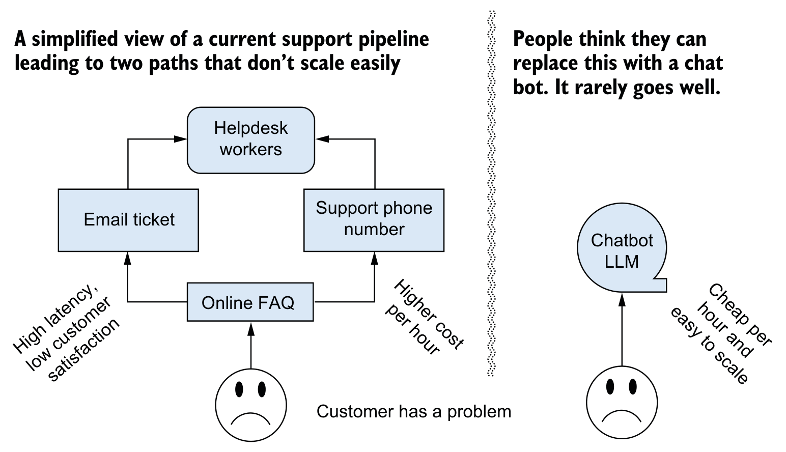

*图8.1 从流程示意图来看，用基于LLM的聊天机器人取代FAQ、邮件工单和支持热线似乎能简化和精简流程。然而，这种观点的谬误在于流程本身并不完整。确保LLM准确运行所需的潜在错误和修复过程被隐藏了，反而增加了复杂性。*

当然，在某些情况下，聊天机器人是个好主意。但令人惊讶的是，一个基于LLM的在线支持聊天机器人可能并不是大多数公司客户支持工具的首选，因为要构建一个在多数情况下准确可靠、且在遇到意外输入时不会产生意外输出的系统，需要付出大量努力。最终，是否使用LLM来实现客户支持聊天机器人的决策，归结为我们一直在讨论的LLM在生成客户回复时可能出现的错误。我们知道LLM并非无错，虽然机器学习有时很实用，但在考虑部署这项技术时，这些潜在错误的代价是首要决策标准。从根本上说，使用LLM可能会增加这些错误的成本。底线是，在目前的形式下，LLM可能提供错误答案，而部署和维护它们的公司或个人要为此承担责任。

高管或产品经理可能会从几个经典业务关键绩效指标的角度来考虑错误成本。例如，如果将支持工作交给聊天机器人，客户留存率可能会下降。也许留存率会比将客户关系职能外包给其他国家的呼叫中心更高。确实，这些考虑因素值得认真评估，在全面用LLM取代客户支持功能之前，你可能应该先进行试验性部署，看看客户的反应。

注意：我们几乎总是建议对任何机器学习系统进行试用部署。

投资领域的箴言“过往业绩不代表未来收益”同样适用于任何AI系统。实现这一点的一种方法是采用影子部署，即将新的AI系统与现有流程并行运行数周或数月。在现有业务流程运行期间，你可以选择忽略它的输出结果。这样你就有时间观察现有流程与新流程之间的差异，识别并解决问题，并判断机器学习系统的性能是否随时间下降。

最关键的是，你的 LLM 可能给出对用户造成伤害的建议。由于 LLM 不是能够为其行为承担法律责任的人，你和你的公司将被迫承担责任。这在一家部署了聊天机器人并给出错误政策声明的航空公司身上已经发生过。法院裁定该公司必须遵守其聊天机器人错误生成并分享的政策 [1]。

我们建议在部署 LLM 时始终保持对抗性思维。多问一句“一个蓄意作恶的人如果知道系统工作原理会怎么做？”将帮助你识别并缓解重大风险，这通常是判断你计划中的 LLM 应用是好是坏的最佳方式。例如，一家汽车公司将 LLM 集成到其网站中，用于帮助销售汽车和解答问题。得知这一点后，用户在不到一天内就说服该网站以 1 美元的价格将车卖给他们 [2]。

如果错误的潜在成本或风险较低，你可以放心部署 LLM 聊天机器人。但为了本章的讨论，我们假设这个设想的客服代理非常重要，它犯的错误可能让公司损失大量资金。现在的问题变成了：我们如何设计一个既能带来生产力和效率提升，又能限制用户直接访问 LLM 的解决方案？如果你刚接触 AI/ML，且聊天机器人是你对该领域的主要了解，这听起来可能像矛盾，但有一些简单、可重复的设计模式可以用来实现这一点。

### 8.2 自动化偏差

一种常见的应对LLM用于直接客户交互风险的方法是让LLM与支持人员或技术人员互动。这通常被称为“人在回路中”，因为有人正在审查LLM与客户之间的反馈循环，对自动系统的输出进行关键评估，并在发现错误时进行干预和调整输出。技术人员仍将被雇佣，但我们将通过让LLM为每个用户问题生成初始响应，并由技术人员整理这些响应以确保其准确性和相关性，从而提高他们的效率。如果LLM生成了潜在成本高昂或不正确的响应，我们可靠的技术人员将进行干预，并用更合适的回复进行回应。在这种背景下，最终是由技术人员选择恰当的权威响应。

聪明的读者如果还记得第5章关于检索增强生成（RAG）的讨论，甚至可能想到改进这一想法的方法。你会说：“啊，我们可以把所有培训手册和文档放入数据库，然后使用RAG，这样LLM就能检索到与用户问题最相关的信息。”图8.2概述了这种方法，展示了一个过程：用户的问题首先被发送给LLM，以利用一组已知答案来聚焦输出生成。


*图8.2 一种实现“人在回路中”系统的朴素方法：使用LLM与相关信息数据库配对，生成输出并由人工最终审核和可能的纠正。*

RAG方法很可能减轻大量风险，但也有可能陷入自动化偏差的陷阱。自动化偏差指的是，人们通常倾向于选择系统提供的自动化或默认选项，因为这比运用批判性思维来判断当前情况下哪个选择最合适要容易。如果一个系统运行良好且不需要你频繁干预，那么要保持高度警惕并发现偶尔的错误就变得极其困难。矛盾之处在于，如果系统的建议非常不准确，以至于你能保持警惕，那么与直接使用无自动化方式回答问题相比，系统很可能正在拖慢你的速度。

这就是试验性或虚拟部署变得极其重要的地方。如果你的系统如此准确，以至于自动化偏差才是真正的风险来源，那么你有两个无需偏离“人在回路中”设计的选择：

在流水线中添加一条“转人工”路径，通过流程变更从外部缓解错误风险。第一点相当直接。最终，总会遇到LLM无法回答的新情况。这时，最好为客户提供一种从与计算机的无限循环中“逃脱”到更高支持层级的方法。例如，可以按消息数量或聊天时长设置最大对话长度，或在多次通信失败后出现联系人工代表的选项，以及其他可能的设计。

注意，假设你打算像第5章讨论的那样，创建RLHF或SFT数据集，以根据你的情况微调LLM。

在这种情况下，你甚至可以添加训练示例，其中LLM的预期响应是“对不起，这个情况听起来比我能够处理的更复杂；让我找个人来帮忙。”

### 8.2.1 改变流程

第二个建议——改变流程，并没有听起来那么困难。如果你的某位上司拥有MBA学位，那么（据说）他们受过这样的思维训练。（本书一位作者拥有MBA学位，所以我们这么说没问题。）例如，与聊天机器人的交互可以包含一条警示，即任何结果都需要“人类的最终批准”。在这种情况下，由人来审核整个对话，其自动化偏见风险远低于要求某人在整个连续对话中保持持续警惕。最终，对抗性用户知道会有人类进行检查，因此失去了试图欺骗系统的动力。

根据具体情境，可以通过要求用户提供担保来确保其诚信行为，从而防止大语言模型被恶意使用。例如，你可以采取相当于冻结用户信用卡的措施，作为防止恶意交互的一种保险。当交易成功完成时，该冻结将被解除。你还可以限制流程的自动化程度、要求身份验证，或者随机分配用户由人工还是AI处理，使得可能被利用的情况的出现变得不可预测。

所有这些措施都取决于你的具体应用场景、风险、对风险的可承受程度以及你的用户的特性。有些客户可能会因为信用卡冻结而感到不满和厌烦。或者，你也可以将其设计为一种可选方式：如果AI系统成功帮助用户解决了问题，用户可享受账单减免2美元，前提是这个成本低于旧系统每次呼叫的平均成本。无论哪种方式，都需要具体问题具体分析，并且取决于你管理风险的能力与创造力。

### 8.2.2 当自主LLM风险过高时

因此，既然你已经完成了试部署，评估了风险以及用户对抗性行为的倾向，并得出让LLM提供初步答案风险过高的结论，那么LLM还能如何提供一定程度的效率呢？

一种反直觉的方法是让LLM检查人，而不是让人检查LLM。这听起来可能有些奇怪。如果我们不能信任LLM独立行动，为什么还要让它来监督呢？为了进一步思考这一点，设想你已经部署了一个LLM系统担任监督角色，检查每一条回复，如图8.3所示。

如果LLM和人都正确，就会执行操作，消息将传递给客户。这就好比用户在与技术人员直接对话。但如果技术人员和LLM对答案有分歧，我们可以提示技术人员在发送给用户之前再次核对他们的回复。

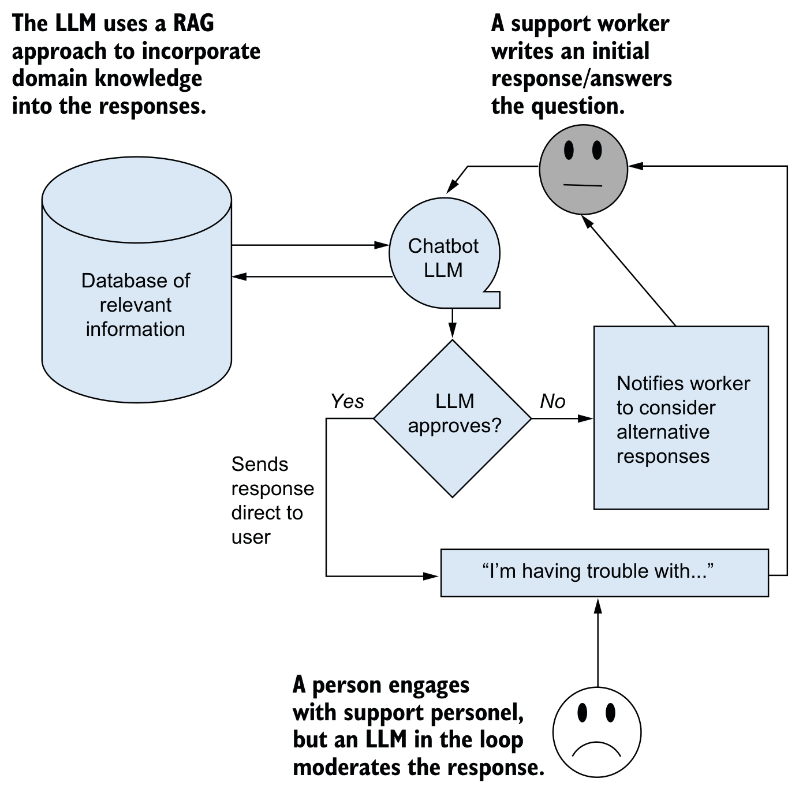

*图 8.3 注意，该图中箭头的方向与图 8.2 相比发生了变化。一切先经过人类，我们利用 LLM 在错误发生前及时捕捉。*

这种双重检查可以简单到直接告诉技术人员：“嘿，这个解决方案看起来可能异常，请确认后再发送。”你也可以尝试让LLM自己提出替代建议。或者，你可以不让LLM直接参与流程，而是用它来通知更有经验的技术人员加入协助。无论结构如何，其目的都是提示可能存在负面客户互动的风险，例如给出错误答案。虽然这种风险以前也存在，但现在我们有机会减轻它。

此外，由于我们考虑的是人为引发的客户支持错误，我们通常不会承担新的风险，因为单独行动的支持代表同样容易犯错。因此，如果LLM和人类同时出错，那么无论如何这个流程错误都注定会发生。这就是生活。从技术上讲，我们可以争辩说，技术人员可能会基于LLM对其互动的评估而过度质疑自己的回复，从而降低效率。此外，过于敏感的LLM可能会频繁要求技术人员复查工作，导致警报疲劳，最终使技术人员完全忽略LLM的建议。如果你的用例容易出现这类问题，那么在试部署过程中会发现这一点，并提供针对具体情境的反馈，说明如何调整LLM来解决。适用于所有机器学习的普遍告诫在此尤为重要：始终测试，不要假设。

利用LLM来复核人工工作，可以整体减少流程中的错误。这种方法可能看似不会加快速度，因为最初的反应仍然由人类生成。然而，这种方法仍然创造了提升效率的机会：

它可以通过帮助发现错误并更快达成解决方案来缩短对话长度。它可以识别出哪些员工需要更多培训或信息来回答客户问题，或者识别特定错误情况何时发生。它可能有助于避免将问题升级到更昂贵的支持层级或经理，从而减少麻烦客户的频率和成本。

### 8.3 利用不止大语言模型降低风险

我们之前讨论的所有内容都涉及一种“以毒攻毒”的方法，尽管使用LLM存在风险，但我们考虑过用不同的LLM使用方式来缓解这些风险。虽然我们改变了LLM的使用方式，但LLM仍然是核心组件。或者，我们可以考虑使用LLM之外的其他工具来解决设计挑战。生成式AI范围内的其他方法，如文本转语音和语音转文本，可用于构建更易访问或更便捷的用户体验。例如，患有关节炎或视力低下的用户可能更愿意打电话，而不是在聊天机器人提示窗口中输入回复。

如果我们思考客户服务问题以及LLM何时能良好工作，就会发现构建更广泛工具集的要素也已具备。当场景中存在重复性，问题反复出现且可以给出公式化解决方案和回复时，LLM表现最佳。LLM在识别语言模糊性中的宽泛模式方面非常灵活。如果LLM能正确理解用户问题，且存在已知解决方案，它就有可能引导用户完成该解决方案。这听起来很像无监督聊天机器人，但关键区别在于，在LLM在解决方案中扮演从属角色的情况下，输出最终是由客户支持技术人员生成的，如图8.3所示。

本节还将讨论如何使用经典机器学习技术（如分类）来解决现有问题。我们可以利用LLM中的知识，通过生成用户文本的嵌入来实现机器学习技术。

### 8.3.1 将 LLM 嵌入向量与其他工具结合

在第3章中，我们描述了大语言模型如何将词元转换为嵌入向量，这些向量以一系列数字编码了每个词元的语义表示。这些向量嵌入在大语言模型的Transformer架构之外也很有用。尽管向量嵌入对于大语言模型的运行至关重要，但它们本身也是一种极为有用的工具。

LLM生成的向量的语义性质很重要，因为数百种其他实用的机器学习算法都基于向量表示进行操作。LLM本质上是一种非常强大的方式，能够将复杂的人类语言文本转换为与机器学习领域其他部分兼容的形式。

利用LLM的向量输出与其他算法结合一直是一项极其有用的策略，以至于从业者称之为“创建嵌入”。这个说法源于这样一种概念：LLM将一种表示（人类文本）嵌入到另一种表示（数学向量）中。

由于这些数字编码了原始文本的信息，你可以像对待数字一样将它们绘制出来，并看到相似的文本在图中落在相似的位置，如图8.4所示。


*图8.4 LLM生成称为嵌入的数值向量，这是其内在功能的一部分。这些嵌入的效用依赖于这样一个事实：当输入相似文本时，这些数字只会发生微小变化。这里的两个示例测试将具有相似的嵌入，因此它们的图看起来相似，即使它们没有任何相同的词汇。这是旧机器学习技术中就存在的一个强大特性。*

我们快速了解一下，在获得嵌入后可以使用的四种机器学习算法。我们认为每种机器学习类型对于大多数LLM实际应用场景都特别有用；我们还会指出一些常见且相对可靠易用的算法。关键在于，如果你打破“只有LLM才能解决问题”的思维定式，你将拥有更广泛的工具集。以下列表为你提供了部分工具的起始地图：

- 聚类算法——将文本按相似度分组，使其与大部分文本区分开来（例如用于市场细分分析）。常用算法包括K均值算法（k-means）和HDBSCAN。

- 异常检测——找出与几乎所有其他文本都不相似的文本（即发现持异议的客户或新问题）。常用算法包括孤立森林算法（Isolation Forests）和局部异常因子算法（Local Outlier Factor, LoF）。

- 信息可视化——创建数据的二维图以允许视觉检查/探索，尤其是在与交互工具结合时（即数据探索）。常用算法包括UMAP和PCA。

- 分类与回归——如果你对旧文本进行已知结果（如净推荐值评分）的标注，可以使用分类（即从A、B、C中选择一个）或回归（即预测一个连续数值，如3.14或42）来预测新文本的得分（即数据分类与数值预测）。使用嵌入作为逻辑回归和线性回归等简单算法的输入，分别适用于分类或回归任务。

注意，嵌入并非LLM的新发明。早在2013年，一种名为Word2Vec的算法（能够嵌入单个单词）就将嵌入推广为表示文本含义的首选策略。

尽管如此，LLM生成的嵌入通常比其他旧算法更有用。然而，LLM的计算需求远高于像Word2Vec这样的旧算法。因此，你可能希望为此任务使用更旧或更快的算法。图像、视频和语音领域生成式AI方法的存在，意味着除了文本之外，你也可以将嵌入用于图像、视频和语音等领域。

### 8.3.2 设计使用嵌入的解决方案

支持团队与客户保持沟通，但团队按问题类型进行分工，每位成员专门处理具有相似问题的客户。

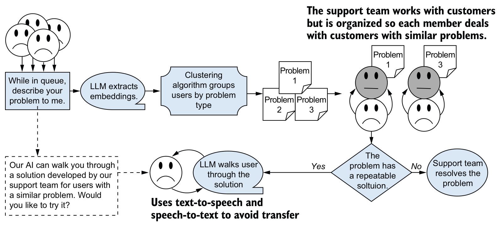

*图8.5 此图描述了我们的客户支持请求“更好解决方案”，客户在等待与人交流时描述其问题。LLM利用问题的嵌入表示，将其与已知解决方案的类似问题进行比较。在用户等待期间，自动化系统可提供信息，帮助他们在无需支持人员干预的情况下解决问题。若此方案失败，始终可以选择“退出”并与真人交谈。用于生成嵌入的模型不必与引导用户解决问题的LLM相同。*

我们完全可以将前面描述的各种方案结合起来。例如，图8.5右上角的分析师与客户互动循环，既可以由两个人直接沟通，也可以采用我们在图8.3中设计的LLM监督验证方案。具体需要解决哪些问题，决定了我们有哪些机会来扩展这些方案——既然现在有了嵌入向量。例如，如果分析师记录了客户愤怒或不满的程度，我们可以训练一个回归模型，根据客户的嵌入向量来预测其愤怒程度。然后，可以将愤怒的客户均匀分配给各位分析师，避免某个人不堪重负；或者尝试将愤怒的客户从仍在学习如何帮助客户解决问题的新分析师手中分流出去。

需要明确的是，我们并不是说所有客服技术支持系统采用这种方法都会变得更好。我们的目标是向你展示，存在一些使用LLM构建解决方案的方法，这些方法可以规避其缺点，例如倾向产生幻觉以及无法动态融入新知识。总结来说，我们提出两个基本策略：

### 8.4 技术展示的重要性

有些人读完这个如何利用LLM设计技术支持系统的例子后，可能会感到难以置信。我们经常听到完全相信LLM技术的人说：“如果让LLM解释它的推理过程，用户或分析师就能判断它是否合理，那么所有与幻觉和错误相关的问题都将得到解决。”我们也经常收到来自持怀疑态度人群的类似请求，要求创建“可解释的AI”，他们担心LLM产生的错误，并且不理解其内部发生了什么。因此，双方都认为解释将提供建立对技术信任的手段，并相信LLM（或任何机器学习算法）正在正确有效地工作。

在本节中，我们想讨论一些观点，支持“可解释性并非这些问题的解决方案”这一说法。可解释性并不是能够帮助发现错误或使系统更加透明和值得信赖的唯一解决方案。不幸的是，我们关于LLM如何与人协作的假设往往是错误的，必须仔细评估。事实上，最近的研究表明，当系统采用可解释AI技术时，人们会错误地信任AI，仅仅因为存在解释，而不管其准确性如何。即使用户可以在没有AI支持的情况下独立完成任务，并且用户已经接受过关于AI系统实际工作原理的教育，这种情况也依然存在[3]。归根结底，解释可能会损害它们试图推进的目标本身。

因为它对实际要解决的目标适得其反。那么为什么有人还要做任何形式的可解释AI呢？

从实用角度来看，有两个关键因素使可解释AI变得有用：

回答“可解释性针对谁”这个问题。

从问题陈述出发实现可解释AI。例如，现实世界的问题陈述可能描述需要发展对物理或化学过程的科学理解。抱着这个目标，算法的一个有用解释可能是生成一个方程来产生答案，而不是直接给出答案。有了方程，物理学家或化学家可以检查其逻辑一致性，并将其作为进一步科学探索的起点。

在这种情况下，只有具备深厚专业知识的人才能理解该解决方案，而这也正是唯一需要解释的人。以方程形式呈现的解释直接针对科学理解问题，而非仅仅理解AI算法的内部运作。我们无从得知AI是如何得出该方程本身的，而该方程（但愿）是一种逻辑自洽的形式，用以解释物理或化学过程。

这个例子反映出了可解释性AI最有用的一般场景：用于帮助一个狭窄而特定的、可能为专家用户的受众执行一个非常具体的目标。例如，数据科学家使用可解释性AI来帮助他们弄清楚为什么某个模型会犯一系列特定错误，这种情况确实很常见，即使他们使用的工具对于非数据科学家受众来说难以理解。

那么，如果可解释AI并非建立对AI系统或解决方案信任的途径，那什么才是呢？遗憾的是，目前并没有公认的、经过严格评估的通用方法来建立对AI的信任。我们的建议并无新意，即应重点关注透明度、用户评估以及所涉及的具体用例细节。

### 8.4.1 如何做到透明？

透明度可以简单到告知用户所使用的AI系统：它基于哪个模型设计，以及在高层次上是如何修改的？

如果系统旨在模仿某个特定人物（例如“接受阿尔伯特·AI·爱因斯坦的辅导”）或某种有资质的人（例如“咨询GPT医生关于你背上的那颗痣”），那么该人物或同等资质的人是否已同意或认可其功效？

消费者如何验证这些信息？

本质上，列举出审计员或持怀疑态度的用户可能想要了解的这类合理问题及其答案，将使你的系统在透明度方面远超平均水平。

这些问题无需向每个用户详细呈现，但提供一种让用户发现这些信息的途径是有帮助的。

这不仅有助于高级用户理解正在发生的事情，也有助于设定所有用户对特定系统能力边界的期望。此外，当用户与生成自动响应的系统交互时，告知用户至关重要。试图假装有人类控制因而不应解决任何合理挑战，与告知客户这是能力有限的自动化AI，这两者之间存在巨大差异。

### 8.4.2 与用户激励对齐

透明度和系统呈现的一部分涉及对齐相关激励。这并非只是关于管理实践的空谈，而是一条切实可行的建议。回想一下第4章：AI算法是贪婪的机器，它们优化的是你要求的内容，而非你意图的东西。如果你开始构建一个LLM系统，而系统的激励与你更广泛的目标不一致，你就有可能过度拟合你所要求的内容，而非你和用户所需的东西。

激励对齐后（例如我们之前举的例子：“试用LLM，如果有效，账单减2美元”），你更有可能获得积极的结果。它们还为你提供了更多宣传方式，将LLM用作向客户提供价值的工具，而不是让人觉得你是试图外包所有工作的恶人。展示和讨论企业与客户之间对齐的激励，以及你如何使用LLM来实现这些目标，就能说明所需的一切，无需隐藏任何信息。

### 8.4.3 引入反馈循环

世界并非一成不变。事物总在变化，今天行之有效的方法明天可能就不灵了。

这正是为什么需要对任何自动化AI/ML系统进行定期持续审计的原因之一：因为它们不会随着经验自行改进或适应。

但这也有助于你捕捉潜在的负面反馈循环，这是你应该预先考虑的事情。

负面反馈循环并非总能预测。

为了帮助捕捉这些，试着思考哪些用户会或不会从新系统中获得最大收益，以及这种情况反复发生会怎样。

例如，我们提到过语音转文字和文字转语音对老年客户或任何听力或行动障碍客户很有帮助。

如果我们没有提供这样的选项，久而久之可能会疏远这些客户，因为他们每次遇到问题时，都不得不使用物理操作困难的系统。

想象你是一家手机公司，部分收入依赖家庭套餐。

那些最初购买你家庭套餐的中年客户，正在因你的支持系统感到沮丧，于是他们将整个家庭套餐转移到另一家新供应商，这家供应商投入了额外工作来确保客户支持流程准确高效。

现在你同时失去了老年和年轻客户！

关键是要深入思考并训练自己进行这些思维实验。你无法预见所有情况，但你会不断进步。定期审计和测试则能帮助你发现失败案例，记录它们，并改进你对未来情境和重复问题的思考方式。

### 总结

LLM 会出现错误，首先需要确定错误的风险和潜在成本，以设计合适的解决方案。如果错误的风险和成本较低，或许可以使用普通的聊天机器人式LLM。通过改变用户与系统的交互方式，或将自动化转移到业务流程的其他部分，可以控制使用LLM的风险。在LLM中引入“人类在环”（human in the loop）进行监督会产生自动化偏差风险，即使使用RAG等技术来降低错误风险也是如此。LLM可以将文本转换为嵌入（embeddings），即数值表示，其中相似的句子获得相似的值。这使得你可以使用额外的机器学习方法，包括聚类和异常检测等经典技术。

尽管LLM能够解释其决策，但这些解释通常效果不佳，因为人们会对其产生依赖。相反，应专注于生成满足特定需求或用例的解释，而非泛泛的“需要解释”。设计系统激励机制，使其与用户的激励相一致。

这既是避免LLM因优化你所问而非你所愿而犯错的好方法，也是向用户沟通和展示你的LLM的好方法。


---

<a id="ch9"></a>

## 第 9 章: 构建与使用 LLM 的伦理

### 本章涵盖

- LLM 执行多任务的能力也带来意外风险

- LLM 与人类价值观的错位问题

- LLM 数据使用对内容创作及未来模型构建的影响

尽管讨论伦理可能会让一些人想起大学入门课程的枯燥阅读，但在实现可能影响人类的算法时，有一些关键的考量。鉴于LLM使用及其能力范围的快速增长，我们必须关注许多不断演变的担忧。如果你不了解这些担忧，你将无法参与解决。

探索构建和使用LLM的伦理是一个极其复杂的话题，很难完全呈现。因此，本章将介绍我们认为常见的关于构建LLM的担忧以及相关的伦理问题。在本章中，我们将引用一些材料来完善这一讨论，以便你进一步研究。

我们将探讨三个主要话题：

人们为何要构建大语言模型，它们提供了哪些此前不存在的能力？

一些机器学习专家认为，在未来的迭代中，LLMs将导致人类灭绝，因为它们会用自动化取代我们的存在。即便我们不同意他们的观点，也有必要理解这种恐惧的根源。

LLMs所需的训练数据量是惊人的。构建LLMs的公司，如OpenAI和Anthropic，是如何获取所有这些数据的？数据收集和使用方式会引发哪些伦理问题，进而产生道德、法律和财务上的影响？

这些考虑在伦理和法律层面都很复杂。我们的目标不是告诉您这些模型的创建是合乎伦理还是不合伦理，而是概述每种讨论下的主要考量。我们希望这能帮助您从更广的角度思考LLMs的影响、后果和风险。我们看到许多关于LLMs使用的高关注度且伦理复杂的议题，而许多从业者此前并未真正深入思考过这一主题。尽管如此，我们认为考虑构建LLMs的伦理问题至关重要，本章将向您介绍一些需要关注的核心关切。

在讨论如何使用LLMs与如何构建LLMs时，同样需要很多考量，因此我们将讨论分为两个部分。首先，我们侧重一般性构建LLMs的伦理问题，后一部分将涵盖LLMs使用的伦理影响。

最后，我们将避免将这些论点归于特定个人或群体。我们的目标是防止偏见，避免在讨论中点名批评任何人。这些关切本身才是重要的。

我们究竟为何要构建LLMs？

在讨论开发LLM的伦理影响之前，值得思考的是我们构建LLM试图达成什么目标，以及为何要追求这些目标。与所有软件工程一样，构建LLM通常旨在减少或消除某些任务中的人力劳动。一些经济学家可能会告诉你，这就是生活水平普遍提高的方式。随着技术的进步，越来越少的人需要从事体力密集型劳动，从而有更多时间用于发现、创造和其他需要高级认知的功能。

就LLM而言，一个常见目标是提高算法的效率，适用于诸如自动语言翻译、语音转文字转录、从图像和印刷文档中读取文本（如光学字符识别）、信息索引与检索（简单称为“搜索”或更广义的信息检索）等应用。另一些人则出于纯科学原因对LLM感兴趣，例如研究计算语言学方法，或用于创意应用，如生成图像、音乐或视频。此外，还有人可能寻求增加影响我们生活的技术的可及性和透明度，或者仅仅是因为LLM吸引了他们的注意，展现了奇妙的新能力。

对一些人来说，LLM能够完成的多种多样的事情本身就是构建它们的内在动机。AI和ML算法已经执行我们列出的所有任务一段时间了；例如，机器翻译已有数十年历史。LLM之所以与众不同，部分原因在于它们似乎能用单一模型和算法完成所有任务。在LLM出现之前，工程师们会将翻译和转录等任务分别实现为满足各自需求的独立系统。如今最大的LLM在某种程度上能够完成上述每一项任务甚至更多。通常，它们似乎可以完成看似无穷无尽的任务。与此同时，其他人则害怕LLM，因为其能力广泛，他们认为LLM会通过承担以前被认为只有人类才能从事的发现与创造任务，来窃取人类的工作、动力和活动。

### 9.1.1 LLM无所不能的利与弊

鉴于一个LLM可以通过单一模型执行许多不同的任务，你可以把它描述成一种“万能应用”：一个提供AI助力的全能平台。

从可用性的角度来看，LLM近乎通用的能力带来了诸多好处，比如它们相对擅长将复杂任务分解为一系列步骤，或者能够生成独特的解释来填补特定的知识空白。

此外，聊天式界面似乎很受用户欢迎，即使有其他使用LLM的方式。

聊天之所以流行，可能是因为它普遍易用：你经常和人聊天。

电话通话的经验很普遍，而通过短信、Slack、Teams、即时通讯和电子邮件，人们也本能地知道如何使用各种基于聊天的界面。

因此，通过聊天式界面与AI进行交互成了一种诱人且简单的方式，只需很少的培训就能提高普及率。

聊天应用的广泛经验还具有民主化效应：用户只需学习一次，就能帮助他们追求许多不同的目标。

这类系统的主要缺点是，虽然它可以用于任何事情，但这并不意味着我们应该用它来做任何事情。

当你有一个算法，人们可以用它来完成许多不同且可能出乎意料的任务时，你就没有时间测试每一种可能的用途。

由于LLM潜在应用的广度，验证模型安全完成的任务与其可能尝试完成但可能有潜在危险或危害的任务之间会存在差距。

例如，当前的LLM模型可以对种族或性别进行抽象评估，尽管这些评估可能包含有害的负面偏见。

虽然我们可以针对特定有害偏见实例开发测试和防御措施，但这些很可能范围狭窄且高度特定。

例如，假设我们让一个图像生成模型生成一张商务会议的图片。不幸的是，结果通常是图片中所有人都是男性和白人。当然，我们希望模型能够超越这些刻板印象。然而，识别并修复像这样的特定上下文偏见问题，并不会影响模型在现实世界中部署并以不同、预料之外的方式提示时是否会造成伤害。充其量，这些练习只是说明了LLM可能如何失败，但要解决伤害问题，需要理解可能发生的失败，例如，由于训练数据中的偏见。同时，我们必须理解人们将如何使用LLM，以及这些使用是否可能因LLM生成输出的方式而导致意外伤害。这可能意味着明确地不为某个预期用例使用LLM，因为缺乏针对其可能造成潜在伤害的缓解措施。

最近关于已部署LLM现实世界危害的研究发现，像OpenAI的ChatGPT和Google的Gemini这样的LLM，对使用非裔美国英语方言的人的内隐偏见，比20世纪20年代白人美国人所测量的过时负面刻板印象还要严重[1]。另一项研究考虑了一个用例：医生就不同种族人群的医疗最佳实践和治疗方案咨询LLM，结果发现模型经常推荐已被推翻的、基于种族、植根于优生学“科学”的医疗实践[2]。不幸的是，我们继续在现有显性偏见基准测试中得分很高的模型中看到这些问题。潜藏偏见的普遍存在表明这些基准不足以评估潜在危害，并强调了需要根据LLM的使用来考虑其可能造成的伤害。换句话说，更重要的观点是，AI部署造成的危害是特定提议用例和应用的直接结果，而不是我们可以归因于模型是否包含种族偏见的一般概念。

今天，我们不知道如何设计一个算法，既能在一个系统中完成这么多任务，同时又能防御善意个体的意外误用和伤害。因此，从开发者的角度来看，关键是要在广泛的人群和设置中进行彻底的用户研究，以识别意外风险，并包括监控和日志记录，以补救任何后期发现的风险。无论我们试图预防有害的种族刻板印象还是宣传已被推翻的医疗实践，当前约束LLM滥用的方法是列举我们所知的潜在问题，并采用微调方法（如RLHF）迫使模型在已知问题上表现得更好。不幸的是，由于LLM能力的潜在广度，未知问题的集合是无限的，因此任何测试制度都将是不完整的。

注意：部署后监控的重要性并非新鲜事物。

例如，美国食品药品监督管理局（FDA）多年来一直通过MedWatch系统实践这一点。该系统允许公众和医疗专业人员报告与药物或医疗设备相关的任何不良事件，以便FDA监控任何异常情况。

9.1.2 我们想要自动化所有人类工作吗？

如引言所述，一些经济学家可能认为自动化使劳动力能够专注于新的工作。这一论点基于一个观点：自动化的进步善于消除大多数人不愿从事的工作。务农辛苦，开采稀土金属辛苦，组装汽车、玩具和包装也辛苦。这些工作劳动强度大、损害身体，且往往缺乏智力刺激。如今，像务农这样的重体力劳动者比1950年减少了74%[3]，毫无疑问，比中世纪时期更是减少了数十倍。

LLM的不同之处在于，它有可能自动化某些白领知识工作。文案写作[4]、视觉艺术[5]、平面设计[6]和银行业[7]只是生成式AI颠覆的几个领域。

那些担忧LLM对经济影响的人认为，我们将因自动化而失去工作——我们提醒，这并不像通常描述的那么明确。制度和消费者需求可能会推动这些白领工作的保留和持续扩张。我们应警惕忽视关于技术进步如何改变工作的经济研究历史。相反，我们必须解决一个更重要的关切：获取高质量训练数据。我们相信这将推动未来的新工作，强调人类创造力和能力的重要性，即使目前创造的工作还不是很多人期望的那种令人满意的白领工作。

### 关于“显而易见”结果的反例

有人认为，LLM显然会对某些经济领域产生或好或坏的影响。银行柜员的工作是常被用来反对LLM的著名例子。自20世纪60年代自动柜员机（ATM）发明以来，银行柜员的工作已发生显著变化。显然，ATM自动化了许多银行柜员的任务。

但ATM的例子并非那么简单。在ATM发明后的几十年里，柜员岗位数量反而增加了，从1970年到2010年翻了一番，达到约60万个，尽管ATM变得越来越普及[8]。回顾ATM对就业影响的史研究，人们认识到许多因素导致了岗位流失，包括增长率变化和工作本质的改变。岗位流失不仅源于ATM技术，还源于银行业其他环节的多轮技术创新、银行应对变化方式的差异、放松管制以及行业竞争加剧和整合[9]。因此，尽管ATM在银行柜员工作中可以说更好更便宜，但机构、客户和期望的本质阻止了岗位的立即下降，并使情况比通常所说的复杂得多。

ATM的例子并非独一无二；技术可能（但并非总是）因自动化导致岗位流失。例如，机器翻译在21世纪初和2016年取得了巨大进步。然而，翻译工作在每个时期都有所增加，并且至今仍在增长[10]。关键的观察是，当译员将自动化工具融入工作流程时，翻译岗位池并没有缩小。相反，我们看到已完成翻译工作量的增长和翻译服务需求的增加，因为需要翻译的材料量持续增长。有人认为，类似的需求将出现在创意艺术家和作家身上[11]。根据这一论点，虽然创作艺术和进行知识工作的方式会改变，但市场将持续增长，需求将继续上升，从而能够利用自动化工具引入所产生的新劳动力供给。因此，当我们识别出可能被LLM自动化或加速的工作领域时，还必须判断效率和质量的提升是否会驱动更多需求。

然而，也有人认为LLM与以往任何事物都根本不同。因此，我们不能用过去理解技术对经济潜在影响的方法来预测未来。尽管这可能且令人向往（考虑到围绕LLM的种种炒作），但我们怀疑这是否是一个过于宽泛、无人能证明对错的陈述。虽然我们在制定法规时确实应考虑这些可能性和因素（这些因素反过来又在工作如何随着技术演变中起重要作用），但值得注意的是，美国约60%的岗位是此前不存在的现代发明[12]。

### 关于训练数据的考量

生成式AI对创意表达的影响令人感慨，因为这一局面存在反常的二元性。上网发布作品的作家和艺术家，其大量作品正被那些看似旨在取代他们工作的模型所利用。LLM研究者提出的伦理论点是，他们应当能自由使用这些创作者的内容作为训练数据。这一论点可能会带来一场皮洛士式胜利，并最终导致AI的自我毁灭。如果AI取代了创意工作者的劳动，LLM开发者将会发现，由于缺少人类生成的内容，且训练LLM所需的数据呈指数级增长已超过用户生成内容的线性增长，他们将无法再改进自己的模型。更重要的是，那些创作内容的人们将不再有工作动力，仅仅为了让LLM吞噬而创作内容。

这种负向循环将同时影响LLM和内容创作者，即便这只是一种感知风险而非切实担忧。数据收割以训练LLM，对数以千计依赖用户生成内容以及消费者带来广告收入的网站来说，是一个重大问题。这些网站为LLM提供了宝贵的训练数据，而LLM的构建者需要海量训练数据，却对广告收入毫无贡献。

例如，Stack Exchange是一系列网站，用户可以在上面提问，其他用户回答，并因优质回答获得声誉评分。其中之一的Stack Overflow，对寻求编程问题帮助的程序员来说，简直是天赐之物。Stack Exchange还拥有许多其他多样化的用户社区，服务于系统管理员、数学学生以及桌面游戏爱好者。

随着大语言模型的出现，Stack Exchange迅速调整了商业模式，试图要求LLM创作者付费以维持其财务未来[13]。即使训练LLM的公司与托管内容的网站之间已有协议，用户生成内容的更直接商业化可能仍不被用户所接受。Stack Overflow就经历了这一点，人们开始从平台上删除他们有帮助的回答，以抗议Stack Overflow将他们免费劳动的成果出售给LLM创作者[14]。

这个例子反映了搜索引擎长期以来将索引的应用和网站功能整合到其主界面的历史。例如，现在可以直接在谷歌搜索界面中搜索和比较机票价格。这种能力将流量从提供相同服务的成熟旅游网站引开[15]，并减少了对构建这些服务的公司的服务和收入的需求。当创意作品成为训练数据时，基于这些作品训练的LLM与原始创作者之间可能存在类似的关系。

很明显，由于LLM的兴起，我们正在处理的问题与我们之前在自动化时代看到的问题相似但不完全相同。那么问题就变成了：与LLM部署相关的差异是否足够显著，从而导致不同且更负面的结果？由于LLM的广泛规模、可访问性和适用性，这些结果对我们来说并不明显。LLM开发者应主动理解和减轻潜在危害，例如与可能受影响的领域预先协商数据使用和社区建设。我们将在本章最后一节讨论训练数据及其来源的其他方面。

### 9.2 LLM是否构成存在风险？

有些人认为，LLM本身就是危险的。如果你不熟悉这一论点，可能会觉得训练一个强大的LLM模型竟会导致消除隐私、终结者机器人以及对我们所知的人类生存的威胁等重大现实危害，这听起来很荒谬。然而，许多人都在担忧这些风险，包括人工智能领域的领军人物如Geoffrey Hinton [16]和Yoshua Bengio [17]。Hinton和Bengio是深度学习领域最受尊敬的研究者之二，他们在神经网络技术在人工智能领域的生存、复兴和主导地位方面功不可没。

我们认为人工智能并不构成现实的威胁。然而，严肃且受人尊敬的人士正在提出这些主张，因此理解他们的论点，并解释为什么我们认为这些担忧不如解决对工作性质的更直接影响、确保公平可持续的数据许可和创作者补偿那么重要，是至关重要的。

在本节中，我们将聚焦于一个广义的论点：人工智能可能成为人类的威胁，因为我们可能失去对LLM的控制，而LLM可能做出对人类有害的决策。这一概念源于两个被推向极端的想法：

LLM 可以利用工具构建新的 LLM，从而实现自我改进；而一个目标与人类需求不一致的 LLM，最终可能会为了自身利益采取危害人类生命的行动。这些观点中，第一个关于自我改进的想法，我们在本书中已有所触及。我们讨论过，设计 LLM 需要开发数据收集工具，并编写使用这些数据训练 LLM 的代码。有人可能会假设，如果 LLM 能直接使用工具进行数据收集和训练，无需人类干预，那么一个 LLM 就能训练出另一个 LLM。

支持这一推理所需的认知飞跃在于，LLM 要足够聪明，能够构建出更好的 LLM。要接受这一点，我们必须假设这个新的 LLM 将能够创造更优秀的 LLM2，并且相信这个改进循环可以永远持续下去，直到 LLM∞ 模型比任何可能存在的人都更聪明，并且基本上能够预测、颠覆或抵消任何可能中断这一循环的人类行为。这一飞跃颇具挑战性，因为根据当今技术的观察，我们几乎没有证据表明这种可能性存在。

第二个想法通常被称为“对齐问题”，即与人类需求不一致的 LLM 可能会选择对人类有害的目标和结果。这个想法是合理的，因为正如第 4 章所讨论的，创建一个只衡量你预期目标的指标是困难的。然而，这种思路所需的巨大飞跃在于，LLM 将具备直接与物理世界交互的能力和资源，如果不加以阻止，可能导致大规模伤害。

有些人将这两种想法结合起来，认为 LLM 可能拥有与人类不一致的目标。他们认为，LLM 终将意识到为了实现自身目标，需要变得更智能并改进自己。在这个过程中，它会从人类手中夺取资源，或者通过提升的智力迫使人类屈从，协助其实现目标。我们在图 9.1 中概述了这一想法。

这一论点的一个关键方面是，LLM 以自我保存为目标，认定人类正在毁灭地球。由于 LLM 存在于地球上并希望继续存在，它认为毁灭人类是维持自我保存的最佳手段。

我们认为，人类毁灭的可能性并非一个有理有据的担忧。尽管如此，许多人——包括拥有计算机科学博士学位且专攻深度学习的人——都对这一场景感到担忧。这个“LLM 毁灭人类”概念的主要问题在于，它依赖于不可证伪的逻辑。不可证伪的逻辑认为事情会发生，而且几乎任何人都无法证明它们不会发生。在这种情况下，证明 LLM 不会毁灭人类是困难的。


*图9.1 在对齐问题中，通常认为LLM对人类构成生存风险的人会提出两种假设性担忧。上方路径显示了直接对齐问题，即AI的目标解决方案直接伤害人类。下方路径显示了间接对齐问题，即AI为其最终目标创建了一个子目标。即使最终目标（例如，解决一个困难的数学问题）得以实现，这个LLM也会以人类为代价来完成它。在中间步骤中，LLM决定它需要比人类共享的更多的地球资源来解决问题。*

茶壶与不可证伪的陈述。要求他人做出可证伪的陈述，在讨论LLM可能毁灭人类这类抽象风险时至关重要。一个著名的例子是伯特兰·罗素的“茶壶”思想实验。其核心思想很简单：有人告诉你，太空中存在一个茶壶，它太小太远，无法被探测到。这个前提本身是不可证伪的；我可以花几个世纪扫描宇宙寻找茶壶，但即使找不到，也无法证明它不存在。唯一的可能性是，我最终找到了茶壶，确认它存在于太空。

否则，我永远无法证明“茶壶存在”是个谎言。因此，在讨论抽象风险时，不可证伪的陈述会陷入认知死胡同。反驳一个无人能证伪的陈述是不可能的。同时，这些陈述对推进对话、获得有意义的见解或结论毫无帮助。相反，基于可识别、可解决的现实且实际关切来提出论点，才更有助于理解问题。

另外两个论点也支持这一思路：技术呈指数级增长，而多数人类不善于考虑指数增长，因而未能充分认识到这一风险会多快成为现实。

这种思路的存在以及该领域领军人物对此的担忧，使得你值得更深入地探讨支持与反对LLMs可能终结人类这一观点的各种想法和考量。

以下小节将探讨这些论证，以及自我改进与对齐偏差背后的关键假设。

### 9.2.1 自我改进与迭代S曲线

在思考自我改进智能的论点时，承认我们人类本身就是智能可以被构建的证明，这加强了这一观点。如果智能是可构建的，那么就有理由相信LLM能够自行构建智能。大多数事物遵循S形曲线（即S曲线）改进，这一事实我们在第7章中讨论过。该讨论的重要启示是，存在一个收益递减点，超过该点后进一步的改进不再提供有意义的价值。与之相反的观点是，人类的技术进步遵循的是迭代S曲线，其中每个收益递减的平稳期都被一项开创新S曲线的创新所抵消，如图9.2所示。


*图9.2 S曲线（即sigmoid函数）展示了经典的平稳期行为：在某个点上，你会遇到收益递减。迭代S曲线模型对此提出的反驳观点是，通过发现新技术（每条新技术由一条新的S曲线表示），进展能够超越收益递减的平稳期而继续推进。新技术可能起步比现有方法更差，但具有超越它们的更大潜力。*

反对这一观点的论据是，自我改进将导致足以杀死人类的能力这一逻辑存在重大漏洞。尽管人类本身是一种存在证明，但尚未发现任何比人类更聪明的存在（我们知道，这非常自恋）。然而，这也依赖于“聪明”和“智能”可以改进的观点。尽管“聪明”和“智能”这类术语在日常使用中是有用的概括，但由于它们本质上是抽象概念，因此无法精确量化和定义。目前尚不清楚是否存在一个单一的智能轴，大语言模型可以沿着它持续改进。

我们更倾向于认为大语言模型的自我改进能力存在限制。我们支持这一论点的证据出现在7.4节，在那里我们讨论了大语言模型的计算限制，表明大语言模型难以执行多种类型的计算。

### 9.2.2 对齐问题

第二个担忧是LLM可能将其目标置于人类需求之上，这被称为对齐问题。

当我们给LLM设定一个期望它实现的目标，却没有充分明确、指定或约束LLM可用于实现该目标的行为或方法时，对齐问题便随之产生。

第4章中关于什么构成合适损失函数的讨论，就是对齐问题在当下的一个实例。

更广义地说，人类无时无刻不在应对对齐问题。

例如，平衡企业CEO薪酬与公司股东意愿就是一个经典的对齐问题，经济学家已研究数十年。

因此，对齐问题非常真实，它的存在本身也表明解决它有多么困难。

即使我们试图非常明确，比如律师起草合同时详细规定协议中哪些行为允许或禁止，关于钻空子和耍花招来蒙骗对方的故事仍屡见不鲜。

虽然有些故事无疑真实存在，但虚构的案例同样具有启发性。

事实上，机器学习领域的大量活跃研究正试图从技术角度解决这一问题，而我们或许可以从日常处理此问题的律师和经济学家那里学到一两招。

人类对齐中的这些普遍挑战有力地证明了LLM中的对齐问题同样是一个真实关切。然而，持怀疑态度的读者会问：是否有证据表明，一个对齐失败的LLM会得出结论认为杀死人类有助于推进其目标？

的确，一旦LLM达到这种状态，人类就会反击（常见的说法是“直接拔掉电源”）。

更重要的是，许多末日论调依赖于以下假设：LLM极其智能，其行为是确定性的，且无论发生什么，结果都是已知且注定的。

现实中，结果具有概率性；事情有好有坏。一个比人类更聪明的LLM必然明白，它无法充分保证结果，而且与人类共存比消灭所有人类更有价值。

考虑到内在的不确定性，以及届时需要与在“把东西炸上天”方面有着悠久成功历史的人类作战，试图对抗或颠覆人类真的是超级智能该做的事吗？

你的模型对齐的是谁的价值观？

公司越来越多地使用RLHF（我们在第5章深入描述过）等微调技术，试图让LLM的行为符合其期望。如前所述，目标是让LLM有用——遵循指令，同时更安全——拒绝有害或伤害性请求。本质上，RLHF试图解决对齐问题，确保LLM的输出受限于一组特定的示例和价值观。正如本节标题所暗示的，关键问题是：我们正在将这些模型对齐到谁的价值观？我们将详细阐述我们的推理：为什么对齐问题虽然有很多有趣且有价值的方面，但在讨论存在风险时却毫无意义。

### 使用……微调LLM

RLHF需要大量输入-输出对的数据集，这些数据集通常是手工构建的。构建LLM的公司不会共享它们的微调数据，因为这些数据被视为专有信息，并且能为其提供相对于竞争对手的优势。因此，作为用户，我们无法检查所用模型的预期对齐情况。所以，目前尚不清楚任何一个具体LLM的目标与谁对齐。我们可以通过考虑训练数据集的来源和监管链来近似评估其中所嵌入的目标性质。一个初步近似是，这些数据集隐含地包含了创建它们的人的目标。通常，创建这些数据集的数据标注员受雇于具有不同社会规范的国家和地区。进而，这些目标在某种程度上也属于开发LLM的公司及其员工，因为他们最终可以筛选和再选择标注员生成的数据。对此，我们不禁要问：“作为用户，我们是否愿意使用那些可能偏向于我们并不认同的其他信仰体系的技术？”在某种程度上，为了使用LLM，我们必须接受这一点。创建这些模型和数据集的成本太高，我们无法针对每种情况都制作个性化模型。因此，LLM提供商必然存在，但这些提供商的目标不可能与每个潜在用户都一致。同时，如果我们担心恶意行为者将LLM用于邪恶或恶意目的，那么我们也许也会意识到，我们无法解决对齐问题在某种程度上也是一种福音。如果能够将这些算法完美地对齐到任何个人的信仰体系，那么任何恶意行为者都能将LLM完美地对齐到他们的不良行为和信仰。这一想法凸显了另一个问题：如果我们能够创建完美对齐的LLM，那么我们就必须确保只有好人才能对齐LLM，以防止坏人做坏事。这种推理方式接近于一种神奇的想法，即可以创建一个全能的LLM，同时又限制它对所有人类保持顺从。

正如同加密算法一样，关于对齐的思考也遵循类似的逻辑。

尽管人们可以试图设计一种加密算法，只为好人留下后门以便解密数据，但这种后门本质上会成为攻击者最高价值的目标，并增加所有用户的风险。

正因为如此，我们并不对恶意行为者利用模型服务于邪恶目的的可能性高度担忧。然而，这一担忧向研究人员强调了一个关键点：控制LLM的任何进展本质上都是一项双重用途的技术，既有和平的应用，也有对抗性的应用。事实上，我们利用LLM开发的任何东西都可能在某种程度上具有双重用途。在考虑LLM更严重的潜在危害时，审视威胁模型至关重要。谁会出于什么动机实施这种伤害，需要具备什么条件？当前有哪些障碍阻止这种伤害发生，LLM是否绕过了这些障碍？能否使这些障碍适应现代技术？随着我们继续推进，我们的关注点不应仅限于LLM，还应包括我们操作的共存系统，这些系统是成功与风险最重要的推动因素和阻碍因素。我们必须考虑全局，以实现最理想的结果。

### 9.3 数据来源与重用的伦理

LLM和像DALL-E这样的生成模型（DALL-E是一种根据用户提供的文本描述生成图像的模型）需要在大规模数据上进行训练。例如，LLM开发者使用1万亿到15万亿个token（比如Llama 3.1使用了15万亿个[18]）或300万到3000万页文本来训练模型。这些数据代表了海量的文字量，相当于数十万甚至数百万本书。尽管有些模型是在同一数据上反复训练的，而且模型也会在代码和数学等各种数据上进行训练，但原始文本的数量仍然在百万本书的量级。需要指出的是，这些文本大部分不是书籍，而是来自新闻文章、网站、研究论文和政府报告等多种来源。

我们以书籍为单位进行总结是为了便于理解，但实际上并非用数百万本书来训练模型。

### 9.3.1 什么是合理使用？

许多国家和文化对使用受版权保护的文本持有不同态度。

在很多情况下，对于那些以新方式使用创意内容的人，版权法存在有意义的例外，特别是当这些方法促进公共利益、科学研究或具有类似有益成果时。

在美国，这被称为“合理使用”。合理使用总是涉及基于平衡四个因素的上下文敏感分析：

使用的目的和性质——批评、评论、教育、新闻报道、学术或研究等应用，相较于其他用途（尤其是商业用途），更有可能被认定为合理使用。

受版权作品的性质——法院倾向于对虚构作品（如小说、艺术、音乐、诗歌等）给予比非虚构文本更多的保护。

使用部分的数量和实质性——使用作品的一部分可能被允许为合理使用，尤其是当该部分是一个严格限定的组成部分时。使用行为对作品潜在市场或价值的影响——如果对作品的新使用产生了人们可能会购买而替代原作品的东西，或者新作品在其他方面与原作品竞争或削弱其经济价值，那么该使用就不太可能被认定为合理使用。

这些观点中有些似乎有利于大语言模型，而另一些则与LLM使用数据的方式相冲突。尽管如此，它们仍是机器学习和法律领域从业者激烈争论的话题，法院做出裁决可能需要多年时间。合理使用原则的许多应用是为了保护人们免受版权持有者的剥削。例如，如果你写一篇否定性的产品评论，合理使用原则禁止公司利用其版权来起诉你以迫使你噤声。合理使用原则的其他应用则是为了防止社会需求受挫，例如在工具和技术上培训学生或学徒。LLM尤其对这些因素中的一些施加了压力。从根本上说，它们通常使用他人创建的内容，但有些人认为某些类型的内容（如社交媒体帖子上的评论）价值极低。LLM正在为出版作品的价值创造一个新市场，但通常并不对作品所有者进行补偿。

作为从业者，一个令人不满意但重要的答案是：你必须在不确定的环境中运作并做出决策。如果你能创建自己的训练数据，就可以规避大部分法律问题。从你自己拥有的内容中创建训练数据对生成式AI来说是一条特别可行的策略，因为正如第4章所讨论的，需要最多数据的基础模型是自监督的。因此，你可以获取大量数据来构建初始模型，然后将更多工作投入到一个更小的微调数据集上，如第5章所讨论的。

你还会失望地发现，该领域的大多数从业者常常不了解其管辖区域的相关法律。如果你找到一款与你需求兼容（干得好，你检查了许可证！）的许可证下发布的模型，那么也存在不小的可能性：该模型训练或精炼所依据数据的版权或许可证不允许其以该许可证发布。这种对数据许可问题普遍缺乏关心或认识，使得你有责任尽可能检查第三方模型训练数据的细节，并认识到许可问题在该领域普遍存在。

即使这些法律问题对想要构建LLM的人有利，也并不意味着这在道德上是合理的。本章讨论的问题有助于你判断什么是正确的或错误的。然而，在如今法律不确定的环境中，还有一个问题是如何对待和与他人互动。依赖法律体系来使某事合法化，很少会表明你的行为能赢得其他当事方的善意和尊重。不难想象另一种情景：公司通过支付金钱或提供模型使用权，与提供数据的平台达成交易或合作，从而增加同意参与方的数量。一旦达成协议，合同可以解决法律模糊带来的冲突，但不幸的是，这种情况在LLM领域很少发生。

### 9.3.2 补偿内容创作者所面临的挑战

一种针对这一伦理问题的拟议解决方案是向那些作品被纳入训练数据的作者、艺术家和创作者支付报酬。

虽然这个概念在许多方面颇具吸引力，但它可能会使该技术的开发在经济上不可行。

如果有一种相对简单的方法能适当地补偿创作者使用其作品，社会将更有可能达成一个令人满意的结果。

通过粗略估算，一百万本书乘以每本20美元，购买训练语料库中每部作品的总成本等于甚至超过训练模型本身的成本。

对于训练数据成本高昂的模型，情况更为严峻。

Stable Diffusion是一个流行的图像生成模型，它基于数十亿张图像进行训练。

向训练数据中的每位艺术家支付一美元，成本将是模型训练成本的1000倍以上，而且每张图像一美元不太可能被艺术家视为合理的补偿。

另一种补偿方式是以使用点为补偿中心：假设每次模型生成的内容借鉴了你写的书，你就能获得模型创建者收入的一定百分比。

LLM生成的内容越依赖于你的作品，你获得的收入份额就越大。

虽然这可能是使LLM技术长期部署可行的途径，但实施该模型存在重大的技术障碍。

例如，目前关于将LLM生成的内容追溯回特定训练数据点的研究非常少。

有理由相信这样的任务是不可能的。

更好的研究——例如将生成内容归因到特定输出、约束输出仅依赖训练数据的子集[19]，或者设计以归因为核心考量（而非训练后集成到LLM中）的模型训练流程——将使这一目标大幅简化。遗憾的是，这类研究通常需要训练大量相似的LLM，因此成本高昂。这一成本使得除从模型中获利的科技公司外，其他研究机构难以开展此类研究。

上述讨论尚未考虑识别每份文档所有者并对其进行补偿的难度。此外，如此大规模地支付款项并非免费——由于每位作者获得的平均报酬极低，仅处理费用就占总支付额中相当可观的一部分。

如果你认为LLM对社会构成威胁，那么你有一个简单的出路：宣称所有这些担忧都是从一开始就不该创建LLM的又一理由。如果你不相信LLM对社会构成严重威胁，反而认为其是积极补充，那么你将面临一个难题。如果你信奉诸如功利主义之类的道德体系，你可能会主张LLM在效用和自动化方面的净收益大于对内容创作者的未补偿和就业风险。实际上，合理使用原则本身就是一种法律认可，即存在版权持有人不得对他人执行其权利的情形。

### 9.3.3 公有领域数据的局限性

### 隐含偏见与公共领域

公共领域内容的主要来源之一是版权过期的作品。因此，训练数据会极度偏向于较老的文本。20世纪初或更早的书籍所表达的科学文化态度和信仰，以及它们对世界的呈现方式，都与当今作品截然不同。让大语言模型落后当前文化态度95年，从很多角度看都非常糟糕。它们会充斥着错误的科学信息，加剧刻板印象和偏见，使用当今用户不熟悉的语言，并且难以有效使用。

注意：1977年之前出版的作品在其出版95年后失去版权，因此所有1928年出版的作品自2024年1月1日起进入公有领域，而所有1977年之前出版的作品将于2073年1月1日进入公有领域。

根据现行版权法，自2049年起，1978年及之后出版的作品将在其创作者去世70年后进入公有领域，但法人作品除外，这类作品遵循之前的规则，即在95年后进入公有领域。

旧数据常常带有严重的种族和性别歧视色彩，这一问题复杂得令人沮丧。我们当然不希望训练数据中包含任何种族或性别歧视内容，因为这似乎是避免模型沾染这些偏见的理想手段。然而，如果你成功地从训练数据中排除了这些内容，那么当用户要求模型生成种族或性别歧视的输出时，模型将很难避免产生这样的结果。归根结底，包含不良内容是必要的，这样才能让模型理解什么是不良内容。

### 公有领域的界定并非总是清晰明确

美国政府并未记录哪些作品属于公共领域且受现行版权保护。识别、收集并清理公共领域作品是一项庞大的工程，需要法律、技术和历史方面的专业知识。尽管一些组织正在持续进行这项工作，但缺乏便捷的方法来检查某作品是否属于公共领域，这极大地阻碍了仅依靠此类作品训练模型。

### 9.4 LLM输出的伦理问题

如前所述，大语言模型是通过从互联网收集的大规模数据进行训练的。互联网中包含大量不良内容。存在诸如公开的种族主义、性别歧视、有害的阴谋论和虚假信息等极其负面的内容。更广泛地看，还存在一些无意中传播的、过时的世界观。大语言模型会学习这些观点的模式，并轻易地重现它们——图9.3展示了一个例子，说明GPT-4如何做出许多善意之人也会犯的隐含性别歧视假设。

因此，大语言模型的输出可能存在问题，需要精心的设计、测试，并愿意对特定部署说“不”。尽管我们已经讨论了输出内容如何可能明显而直接地产生问题，但仍有一些间接方式值得深入了解。首先是法律复杂性：有效且获得许可的数据未必能产生合法的输出。其次，我们必须考虑大语言模型中的反馈循环：未来的大语言模型将基于未来的数据进行训练；我们必须小心避免用有害内容污染未来的训练。乍一看，这些问题似乎与开发者无关，但当你考虑针对自己的问题微调大语言模型时，这些问题就会出现，因此需要意识到并加以避免。


*图9.3 一个典型的性别刻板印象是男人是医生、女人是护士。这种观念在语言中有所反映，因此被模型习得。理想情况下，模型应该回答这个问题存在歧义，但数据中的偏见导致了输出上的偏见。*

### 9.4.1 大语言模型输出的许可影响

首先是一个与数据许可相关的问题，我们在上一节中已经介绍过。那部分讨论侧重于用于训练大语言模型的数据的道德性和合法性。现在我们必须换个角度思考：某些数据几乎肯定可以合法用于训练，但可能使输出变得不可用。

这个问题源于容易被误解的开源软件（OSS）许可证领域。有许多OSS许可证，我们不会一一列举，但一个常用的开源许可证——GNU通用公共许可证（GPL）——就是一个很好的例子。GPL的核心内容是，只要你将使用、修改或添加的任何代码在GPL许可证下提供，你就可以免费按需使用许可代码。这种故意设计成"传染性"的许可证迫使被许可方遵循相同规则，如果他们希望使用GPL许可证覆盖的代码，就必须以开源方式发布自己的代码。

问题来了：大语言模型在编写代码方面变得非常流行，并且已经接受了GPL代码的训练。大语言模型自身的输出何时必须采用GPL许可证？当我们考虑与这种新情况相关的伦理问题时，这些许可证均未明确说明，因此迅速出现了多层级的争论。存在一个可能性谱系，主要有三种模式：

如果LLM完全照搬了现有的GPL代码，那么它当然应该采用GPL许可。我们如何判断一个LLM是否精确生成了现有代码的副本，从而需要相应许可？LLM可能生成看似新颖的代码，但该算法可能需要特定的GPL训练数据（解决相关问题）来生成输出。这是否属于应获得许可的训练数据修改？如果是，我们如何解决技术难题，找到导致LLM生成任意给定输出的代码？你在第5章学到的检索增强生成（RAG）方法可能是一个好办法。如果我们用任何GPL代码训练LLM，那么有人可能会认为LLM的所有输出都需要GPL许可！

### 9.4.2 LLM的输出会污染数据源吗？

本节开篇以一个材料科学和制造领域的著名问题为隐喻，具体涉及合金钢。钢铁被用于建造各种东西，从建筑物到医疗设备。钢铁的许多用途还涉及对核辐射敏感的电子设备。由于20世纪40年代的首次核武器试验，全球被先前不存在的辐射污染。除非靠近核爆点，否则辐射量不足以对大多数事物造成伤害。然而，辐射量仍足以污染全球生产的全部钢铁，使得无法再为辐射敏感应用制造钢材[20]。人们会非法打捞数十年前的沉船，以寻找未被背景辐射污染的旧钢材。新制造工艺可以生产有限数量的清洁钢材，但其成本极其高昂，因此在很多情况下经济上不可行。幸运的是，随着材料科学的进步和大气层核试验的停止，这个问题逐渐缓解，但在几十年间，世界一直受到几次单独核试验部署的影响。

这里的类比并非说LLM是核弹，而是说它们的输出可能正在污染未来用于构建更好LLM的所有训练数据。研究人员发现了一种被称为"模式崩溃"的现象，它展示了LLM在被其他LLM生成的数据训练时如何失败[21]。快速回顾一下，分布（数字集合）的众数是该集合中出现最频繁的值。

当生成模型产生输出时，其大部分输出都来自训练数据分布的众数。换句话说，模型生成的输出会强调训练数据中最常见的成分。由于生成模型不会输出数据中所有罕见或细微的案例，因此最常见案例在LLM的输出中会更为普遍。这意味着模型中的众数相较于原始训练数据被过度呈现。

如果此时你在旧模型的输出上训练一个新的生成模型，就会以牺牲所有其他数据为代价，进一步过度呈现众数。多次重复这一过程，最终你会得到一个无用的模型，它总是反复输出相同的内容，如图9.4所示。

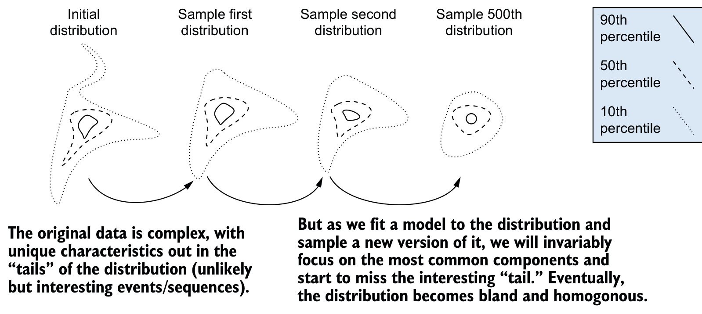

*图9.4 你可以将文本或图像视为来自数据分布，其中多样性和有趣内容几乎必然来自分布的尾部（即分布中不太常见的部分），因为最常见的词汇或内容往往是填充词或连接词，例如冠词'the'。我们的模型无法学习其未训练过的事物，也无法学习分布中的所有内容，因此从模型中采样必然会丢失这些有趣的细节。如果重复进行，分布就会坍缩到仅剩最常用的成分。*

模式崩溃是一个长期已知的真实风险，因为它是一个超越生成式AI的问题。

然而，人类增强数据可能（但未必能）缓解这一风险。本质上，只要你能向采样分布中注入新数据，就有可能从这些样本中获取价值。一种方式是人类修改AI生成的内容，或使用AI修改人类生成的内容。自动化系统也能提供价值，尤其是那些捕获复杂领域知识的系统，如我们在6.2节讨论过的物理模拟器或数学证明引擎Lean。问题在于这些增强做得有多好，以及能获得多少价值，因为它们无法带来无限改进。

### 9.5 LLM伦理的其他探索

关于构建和使用LLM的伦理影响的讨论一直在不断发展。虽然已经有很多相关论述，但关于LLM和AI伦理的许多方面仍有待探索。在这里，我们聚焦于建立基础知识所需的核心主题。其他关键问题，如隐私、安全和潜在滥用，在Manning出版的其他书籍中有更详细的讨论，例如Numa Dhamani和Maggie Engler合著的《Introduction to Generative AI》[24]。

LLM和生成式AI将对世界产生深远影响；对于任何新技术，理解其行为背后的基本原理及其使用的影响至关重要。在本书中，我们涵盖了让LLM工作的基本组件，探讨了常见误解，并指出了构建和使用它们时需要考虑的伦理问题。我们希望为你继续探索这个领域打下了坚实的基础。感谢你与我们一同开启这段旅程。

### 小结

LLM凭借单一模型即可应用于各种任务，这有助于人们快速高效地应对多种场景。这种广泛的任务适用性也使得全面测试用户可能采用的所有使用方式的安全性变得不可能。从历史上看，自动化一直是一件好事。尽管如此，LLM对知识工作的自动化构成了独特的风险，这与历史上推动生活水平提高的体力劳动自动化有所不同。广泛自动化知识工作的实际效果尚不可知。

一些人担心，如果LLM足够强大以至于能够改进新一代LLM的设计，那么这种能力将级联放大，最终产生不再需要人类的超级智能算法。让任何算法与我们的真实意图（而非字面指令）对齐是一个重大挑战，即使解决了这一问题，风险也未必会降低。以合乎道德的方式获取数据充满法律隐患，因为技术发展速度远超法律更新速度。

为所有内容作者就其内容在训练数据中被使用而给予补偿，在财务和技术上都不太可行，这引发了关于其数据使用公平性的伦理问题。无版权的公共领域数据因其年代久远而不构成问题，但却带来了识别其法律状态的不同挑战。LLM生成数据的泛滥可能对我们未来构建的LLM产生影响。我们必须考虑反馈循环的潜在风险以及模式崩溃的可能性。

### 参考文献

- [1] Young, B. (2023). AI专家推测GPT-4架构。Weights & Biases. https://api.wandb.ai/links/byoung3/8zxbl12q

- [2] Micikevicius, P. (2017).深度神经网络的混合精度训练。NVI-DIA Developer. https://mng.bz/6eaA

- [3] Accelerate AI development with Google Cloud TPUs. https://cloud.google.com/ tpu

- [4] Metz, C. (2023, July 23).研究人员在ChatGPT等聊天机器人的安全控制中发现了漏洞。New York Times.

- [5] Hu, K. (2023, February 2). ChatGPT创下用户增长最快纪录——分析师笔记。Reuters. https://mng.bz/XxKv

- [1] Friederici, A. D. (2011). 语言处理的脑基础：从结构到功能。 Physiology Review, 91, 1357-1392. https://doi.org/10.1152/physrev .00006.2011

- [2] Nation, P., and Waring, R. (1997). 词汇量、文本覆盖率与词表。 见：N. Schmitt and M. McCarthy, 编，词汇：描述、习得与教学法 (pp. 6-19). Cambridge University Press.

- [3] Brown, T. B., Mann, B., Ryder, N., et al. (2020). 语言模型是少样本学习者。 https://arxiv.org/abs/2005.14165

- [4] Google/SentencePiece. https://github.com/google/sentencepiece

- [5] Petrov, A., La Malfa, E., Torr, P. H. S., and Bibi, A. (2023). 语言模型分词器引入语言间的不公平性. https://arxiv.org/abs/2305.15425

- [1] Denk, T. (2019). Transformer位置编码中的线性关系. https://mng.bz/oKxd

- [2] Raff, E. (2022). 深度学习内部. Manning.

- [7] Phung, D. V., Thakur, A., Castricato, L., Tow, J.和Havrilla, A.（2025年）.实现RLHF：使用trlX学习摘要. Weights & Measures. https://mng.bz/rKzg

- [8] Kolter, Z.和Madry, M.（无日期）.对抗鲁棒性：理论与实践. https://adversarial-ml-tutorial.org/

- [9] OpenAI.（2023年3月27日）. GPT-4技术报告. https://cdn.openai.com/papers/gpt-4.pdf

- [10] Chowdhery, A., Narang, S., Devlin, J.等.（2022年）. PaLM：通过路径扩展语言模型. https://arxiv.org/abs/2204.02311

- [11] Liang, W., Izzo, Z., Zhang, Y.等.（2024年）.大规模监测AI修改内容：关于ChatGPT对AI会议同行评审影响的案例研究. https://arxiv.org/abs/2403.07183

- [12] Li, C.和Flanigan, J.（2023年）.任务污染：语言模型可能不再是小样本. https://arxiv.org/abs/2312.16337

- [13] Near, J. P.和Abuah, C.（2021年）.编程差分隐私. https://programming-dp.com/

- [1] Albergotti, R.和Matsakis, L.（2023年1月23日）. OpenAI雇佣了一支承包商大军，旨在让基础编码过时。Semafor. https://mng.bz/MDGQ

- [2] 介绍Code Llama，一个用于编码的先进大语言模型。（2023年8月24日）. Meta. https://mng.bz/av2j

- [3] von Werra, L.和Ben Allal, L.（2023年5月4日）. StarCoder：一个用于代码的先进LLM。Hugging Face. https://huggingface.co/blog/starcoder

- [4] Biderman, S.和Raff, E.（2022年）.使用预训练语言模型欺骗MOSS检测. https://arxiv.org/abs/2201.07406.

- [5] Dyer, E.和Gur-Ari, G.（2020年6月30日）. Minerva：使用语言模型解决定量推理问题。Google Research. https://mng.bz/gane.

- [6] Azerbayev, Z.、Schoelkopf, H.、Paster, K.等。（2023年10月16日）. Llemma：一个开源的数学语言模型。EleutherAI. https://blog.eleuther.ai/llemma/

- [7] Richardson, D.（1968年）.涉及实变量初等函数的若干不可判定问题。Journal of Symbolic Logic, 33, 514–520.

- [8] Nogueira, R.、Jiang, Z.和Lin, J.（2021年）.用简单算术任务研究变压器的局限性. https://arxiv.org/abs/2102.13019v3

- [9] Golkar, S.、Pettee, M.、Eickenberg, M.等。（2024年）.用简单算术任务研究变压器的局限性. https://arxiv.org/abs/2310.02989

- [1] Romeo, R. R., Leonard, J. A., Robinson, S. T., et al. (2018).超越3000万词汇差距：儿童对话暴露与语言相关脑功能的关系。

心理科学, 29, 700–710. https://doi.org/10.1177/ 0956797617742725

- [2] Gilkerson, J., Richards, J.

A., Warren, S. F., et al. (2017).使用全天录音和自动分析绘制早期语言环境。

美国言语语言病理学杂志, 26, 248-265. https://doi.org/10.1044/2016_ AJSLP-15-0169

- [3] Shumailov, I., Shumaylov, Z., Zhao, Y., et al.

(2024).递归的诅咒：在生成数据上训练会使模型遗忘。https://arxiv.org/abs/2305.17493

- [4] Stanovich K.

E. (2009).智力测试遗漏了什么：理性思维的心理学。

耶鲁大学出版社.

- [5] 提高合成图像的真实感。

(2017, July 7).苹果机器学习研究. https://machinelearning.apple.com/research/gan

- [6] Dai, D., Sun, Y., Dong, L., et al.

(2023).为什么GPT能在上下文中学习？语言模型秘密地作为元优化器执行梯度下降。

在计算语言学协会会议论文集：ACL 2023 (第

4005–4019页).

Unicode. https://www.unicode.org/emoji/ charts-15.1/emoji-released.html

- [10] Wei, J., Wang, X., Schuurmans, D., 等. (2023). 思维链提示能激发大型语言模型的推理能力. https://arxiv.org/abs/2201.11903

- [11] Wang, L., Xu, W., Lan, Y., 等. (2023). 规划与求解提示：通过大型语言模型改善零样本思维链推理. 收录于第61届计算语言学协会年会论文集（第1卷：长篇论文，第2609-2634页）. 计算语言学协会.

- [12] Guan, L., Valmeekam, K., Sreedharan, S., 和 Kambhampati, S. (2023). 利用预训练的大型语言模型构建和运用世界模型进行基于模型的任务规划. https://arxiv.org/abs/2305.14909

- [13] Bhargava, A. Y. (2015). 图解算法：为程序员和其他好奇人士编写的图解指南. Manning Publications.

- [14] Merrill, W., 和 Sabharwal, S. (2024). 带思维链的Transformer的表达能力. 收录于2024年国际学习表征会议. https://openreview.net/forum?id=NjNGlPh8Wh

- [15] Carlini, N. (2023年9月22日). 与大型语言模型下国际象棋. https://nicholas.carlini.com/writing/2023/chess-llm.html

- [16] Edwards B. (2022年11月7日). 新的围棋技巧击败了世界级围棋AI——但输给了人类业余爱好者. Ars Technica. https://mng.bz/dW6O计算语言学协会.

- [7] Hiller, J. (2023, December 12).微软瞄准核电为AI运营提供动力。华尔街日报. https://mng.bz/pKe5

- [8] Disavino, S. (2023, September 8).德州电价飙升，电网经受热浪可靠性考验。路透社. https://mng.bz/OB0K

- [9] 最近添加的Emoji, v15.1. (无日期).

- [1] Yagoda, M. (2024年2月23日).航空公司因其聊天机器人向乘客提供错误建议而被判负有责任——这对旅客意味着什么。

BBC. https://mng.bz/xK7W

- [2] Notopoulos, K. (2023年12月18日).一家汽车经销商在其网站上添加了AI聊天机器人：然后一切都乱套了。 https://mng.bz/AQPz

- [3] Suresh, H., Lao, N., and Liccardi, I.

(2020年).错位的信任：衡量机器学习对人类决策的干扰。

载于第12届ACM网络科学会议论文集（WebSci '20）（页

315-324).美国计算机协会. https://doi.org/10.1145/3394231.3397922

- [1] Hofmann, V., Kalluri, P. R., Jurafsky, D., and King, S. (2024). 方言偏见预测AI对人们性格、就业能力和犯罪行为的判断。https://arxiv.org/abs/2403.00742

- [2] Omiye, J. A., Lester, J. C., Spichak, S. et al. (2023). 大型语言模型传播种族医学。npj Digital Medicine, 6, 195. https://doi.org/10.1038/s41746-023-00939-z

- [3] Farm labor. (2025年1月8日). 美国农业部经济研究局。https://www.ers.usda.gov/topics/farm-economy/farm-labor/

- [4] Verma, P., and De Vync, G. (2023年6月2日). ChatGPT取代了他们的工作：如今他们遛狗和修空调。《华盛顿邮报》。https://mng.bz/EwQd

- [5] Marr, B. (2024年4月18日). 生成式AI在视频游戏开发中的作用。《福布斯》。https://mng.bz/Pdpn

- [6] Lev-Ram, M. (2023年1月26日). 大型科技公司裁员的受害者发现其他公司竞相雇佣他们。《福布斯》。https://mng.bz/JYXV

- [7] Lohr, S. (2024年2月1日). 报告称生成式AI的最大影响将在银行和科技领域。《纽约时报》。https://mng.bz/wJ7P

- [8] Pethokoukis, J. (2016年6月16日). ATM和银行柜员的故事揭示了“机器崛起”与就业的关系。美国企业研究所。https://mng.bz/qx7r

- [9] Hunter, L. W., Bernhardt, A., Hughes, K. L., and Skuratowicz, E. (2001). 不仅仅是ATM：零售银行业的技术、公司战略、就业和收入。ILR Review, 54(2A), 402-424. https://doi.org/10.1177/001979390105400222

- [10] Rosalsky, G. (2024年6月18日). 如果AI如此强大，为什么还有那么多翻译工作？

NPR. https://mng.bz/7pBv

- [11] Marr, B. (2024年5月28日). 生成式AI将如何改变艺术家和设计师的工作. Forbes. https://mng.bz/mG7a

- [12] Autor, D., Chin, C., Salomons, A., and Seegmiller, B. (2024). 新前沿：新工作的起源与内容（1940–2018）. 《经济学季刊》, 139, 1399–1465. https://doi.org/10.1093/qje/qjae008

- [13] Dave, P. (2023年4月8日). StackOverflow将向AI巨头收费提供训练数据。

《连线》. https://mng.bz/5gDO

- [14] Grimm, D. (2024年5月8日). Stack Overflow大规模封禁反抗OpenAI合作关系的用户—用户因删除答案以防止被用于训练ChatGPT而遭封禁。

Tom's Hardware. https://mng.bz/nR75

- [15] Bishop, T. (2020年10月20日). Expedia集团CEO谈谷歌反垄断案：“非常高兴看到政府终于采取行动。” Geek Wire. ht-tps://mng.bz/vK7p

- [16] Siddiqui, T.

(2023年6月29日).人工智能的风险必须随着技术的发展而加以考虑：Geoffrey Hinton.

多伦多大学. ht-tps://mng.bz/4aNR

- [17] Bengio, Y.

(2023年6月24日).灾难性AI风险常见问题解答. https://mng.bz/QDO6

- [18] Introducing Llama 3.1: 我们迄今最强大的模型. (2024年7月23日). Meta. https://ai.meta.com/blog/meta-llama-3-1/

- [19] Min, S., Gururangan, S., Wallace, E., 等.

(2023年). SILO语言模型：在非参数数据存储中隔离法律风险. https://arxiv.org/abs/2308.04430

- [20] Rivero, N.

(2022年9月21日).低本底金属：纯净无杂质的宝藏.

Quartz. https://mng.bz/eyXZ

- [21] Shumailov, I., Shumaylov, Z., Zhao, Y. 等. (2024年). AI模型在递归生成的数据上训练时会崩溃.

《自然》, 631, 755–759. https://doi.org/10.1038/s41586-024-07566-y

- [22] Coffey, L.

(2024年2月9日).教授们对检测AI生成写作的工具持谨慎态度.

Inside Higher Education. https://mng.bz/Xxj9

- [23] 自ChatGPT以来Stack Exchange流量下降了吗？(2023年). Stack Exchange. https://mng.bz/yW7p

- [24] Dhamani, N., and Engler, M.

(2024年).《生成式AI导论》. Manning出版社. https://www.manning.com/books/introduction-to-generative-ai

### 索引

- A 用于梯度下降（滚动球）52

- 局限性 8–9, 14

- 用于神经网络层 31

- 用于LLM中的温度 43–44

- 应用（LLM）

- 聊天机器人 2, 65, 67–69, 126–128, 130

- 代码生成 58–59, 88–95, 100, 142, 157

- 内容创作 6, 141–142, 144–145

- 客户服务/技术支持 125–139

- 图像描述 104–105

- 图像生成 101, 104–106, 142, 152

- 信息检索 82, 128, 141–142

- 数学 26, 58–59, 95–100, 106, 114

- 搜索 58, 82–83, 125, 130, 141–142, 146

- 摘要 6, 30, 55, 123

- 翻译 3, 30, 125, 141–142, 144

- 参见 深度学习 (DL), 错误 (LLM), 输入 (LLM), 学习, 机器学习 (ML), 神经网络, LLM 输出, 训练 LLM

- 人工智能 (AI)

- 在LLM中的上下文 2–4

- 定义与理解 7–8

- 可解释AI 126, 136–137

- 炒作 1

- 与人类学习对比 46, 108–111

- 算法

- 注意力机制 38–39, 62, 109

- 字节对编码 (BPE) 20–23, 91, 98

- 经典机器学习 126

- 聚类 133

- 用于代码生成 89, 92–93

- 用于将图像转换为补丁 101–103

- 梯度下降 46–47, 49, 51–54, 60, 72, 101, 108, 115

- 用于图像生成 104, 142

- 用于图像识别 101

- 用于机器翻译 3, 125, 141–142

- 强化学习 (RL) 48, 73–75, 78, 93

- 用于搜索和信息检索 125, 141–142

- SentencePiece 22

- 序列预测 30

- 用于语音转文本转录 125, 134

- 用于文本转语音 4, 125, 134

- WordPiece 22

- 参见 聚类算法

- 对齐问题 (LLM) 55, 146–148, 150–151

- 类比

- 用于AI和ML 8, 14

- 用于注意力机制 38

- 潜在风险和担忧 107, 111–112, 120, 140, 146–152

- 问题解决与 120–123

- 社会影响 140–146

- 参见 聊天机器人, ChatGPT, 生成式AI, 大型语言模型 (LLM), OpenAI

- 注意力机制

- 类比 38

- 数学表示 40

- 在Transformer中 38–40, 62, 109

- 自动化

- 偏见 126, 128–130

- 人类工作的自动化 141, 144

- 就业市场与 141, 144–145

- ChatGPT

- 代码生成 58–59, 90, 92–93, 120

- 与其他LLM比较 2–3, 5, 10

- 错误与局限性 12, 25, 57, 59–61, 143

- 微调 66, 68, 74, 143

- 作为生成式AI 1–2, 6

- 指令遵循 6, 59–61, 67, 74

- 逻辑谜题 60–61

- 数学 26, 57

- 模型版本 (GPT-3.5, GPT-4) 6–7, 15, 22, 70, 98, 143, 152, 156

- 公众曝光 1

- 安全控制 12

- 分词 15, 22–23, 25, 90, 98

- 参见 人工智能 (AI), 聊天机器人, 生成式AI, 大型语言模型 (LLM), OpenAI

- 聚类算法

- 用于客户支持 135

- 与嵌入使用 133–134

- 参见 算法

- 编译器，用于代码验证 93–94, 100

- 计算复杂度

- 大O表示法 120

- LLM的复杂度 120–122

- 实际任务复杂度 121–123

- 计算机视觉

- 图像转换为补丁 89, 101–103

- 图像描述 104–105

- 图像生成 101, 104–106

- 补丁组合器 101, 103–104

- 补丁提取器 101–103

- 视觉Transformer (ViT) 101, 103–104

- 参见 图像生成, 机器学习 (ML)

- 内容创作

- 创作者补偿 145, 154–155

- 版权与 69, 145, 152–154

- 由LLM生成 6, 141–142, 144–145

- 参见 版权, 伦理, 合理使用, 公共领域

- 上下文

- 少样本学习 114–115

- 语言理解 56, 60–61, 91, 118

- LLM上下文大小 83–84

- 版权

- DMCA 69, 152

- 合理使用 69, 152–154

- 对LLM输出的影响 157–158 B

- C 思维链（CoT）提示 119, 122

- 参见 提示

- 聊天机器人 客户服务用途 67, 126–128, 130

- 设计考量 126–128

- 交互风格 142

- 作为LLM应用 2, 65, 67–69, 126–128, 130

- 参见 人工智能 (AI), ChatGPT,

- 生成式AI, 大型语言模型

- (LLM), OpenAI

- D 数据 算法性能 10–11, 55, 62, 79, 107, 109, 111–112, 117

- 策展 79, 145, 159

- 漂移 117

- 用于微调 66, 68, 71–75, 77, 80, 115, 145, 150, 153

- 许可 140, 146, 152–154, 157–158

- 隐私 80, 146

- 公共领域 152, 155–156

- 质量 55, 69, 76, 78–80, 144–146, 159

- 用于RLHF 74, 77, 150

- 用于SFT 71–72

- 来源 140–141, 145–146, 152–156

- 参见 训练LLM

- 在 AI/ML 语境中的 P1 [段落] 8, 46；少样本学习 114–115；LLM 对比人类 8–9, 46, 108–111；强化学习 (RL) 48, 73–75, 78, 93；监督学习 46, 71–73；训练算法 46–54；另见应用 (LLM)、深度学习 (DL)、115–116、141、154；定义 3–4；使用解决方案设计 125–139；效率（功耗、延迟、优化）115–117；错误 (LLM)、输入 (LLM)、机器学习 (ML)、神经网络、LLM 输出、训练 LLM；损失函数；卷积神经网络 (CNN) 11, 77, 103；深度学习 1, 9, 11, 14, 19, 30, 47, 52, 108, 可计算性 47, 49, 53；交叉熵损失 50；定义与目的 47–48；激励错配 51, 55；用于 LLM（下一个词元预测）54–57；平滑性 47–48, 50；特异性 47–48, 123, 146, 149；受人类大脑启发 9, 31, 46；长短期记忆 (LSTM) 网络 11；循环神经网络 (RNN) 55, 63, 77；训练 46–54, 77；另见应用 (LLM)、深度学习 (DL)、错误 (LLM)、输入 (LLM)、学习、机器学习 (ML)、LLM 输出、训练 LLM；归一化（文本）M 机器学习 (ML)

- 词汇量控制 18–20；同形异义词 24；数字 26, 99；分词过程 17, 19–20；另见：同形异义词、语言、自然语言处理（NLP）、分词与词元、词汇、词语；数字错误（LLM）、输入（LLM）、学习、神经网络、LLM输出、训练LLM；数学 LLM理解 26, 97–99；在LLM中的表示 26, 97–99；分词 26, 97–99；另见：数学 计算机代数系统（CAS）99–100；形式与符号 95–96, 99–100；用于证明的Lean编程语言 100, 114；LLM与…… 26, 58–59, 89, 95–100, 106, 114；数字表示 26, 97–99；分词 26, 89, 96–99, 106；另见：数字；Modula-3编程语言 58–59, 70, 88；O OpenAI ChatGPT 1–2, 6–7, 10, 12, 15, 22, 24–26, 30, 57–61, 66–70, 74, 90–93, 107, 109, 120–130, 143, 157, 160；DALL-E 7, 152；GPT模型 2–7, 10, 15, 18, 22–26, 60, 70, 83；另见：Lean编程语言、Python编程语言、源代码；多模态模型 98, 109, 123, 143, 152, 156；tiktoken 22；另见：人工智能（AI）、聊天机器人、定义 22, 104；示例（图像和文本）22, 104–105；ChatGPT、生成式AI、大型语言模型（LLM）；LLM输出 N 修改/约束 65–86, 156–160；自回归生成 40, 60, 62；偏见 55, 140, 142–143, 156–157；代码 89, 92–95, 100；创造力与主题性 43–44；解码/解嵌入 32–33, 40–42, 89, 101；自然语言处理（NLP）历史 3；与LLM的关系 3–4；另见：同形异义词、语言、规范化（文本）、分词与词元、词汇、词语；神经网络 103；序列结束（EoS）标记 41；伦理问题 12, 140, 156–160；架构（层）9, 31–32, 37–38, 40, 44, 101–104；格式要求 70, 81, 86；生成循环 40–41；图像 101, 103–105；许可影响 157–158；采样词元 33, 41–43；温度设置 43–44；另见：LLM应用、深度学习（DL）、使用DSPy 84–86；奖励函数 质量奖励（RLHF）76–78；强化学习 48, 73–74, 76–79；相似性奖励（RLHF）78；S 错误（LLM）、输入（LLM）、学习、机器学习（ML）、神经网络、训练LLM；自我改进（LLM）的局限性 111–112, 122, 147, 149；理论可能性 111, 147；语义空间 P 定义 35–36；内部关系 36；源代码补丁（图像）组合 101, 103–104；提取 101–103；替换视觉词元 89, 101–102；预训练LLM 58–59, 88–95, 106, 120, 123, 142；分词 89–92；生成代码的验证 92–95, 100；另见：Lean编程语言、Modula-3；基模型 66, 68, 72；定义 2, 10, 66；提示编程语言、Python编程语言；语音转文本 4, 125, 132, 134–135, 141；思维链（CoT）119, 122；工程 62, 67, 84, 114, 117, 122；少样本学习 114–115；图像生成 105；指令遵循 6, 58, 60, 62, 67, 70–71；另见：文本转语音；随机梯度下降（SGD）53–54；子词 74, 105, 114, 119；使用BPE的公有领域创作 20–22；定义 16；在分词中的作用 16, 18, 20–22；监督微调（SFT）的使用挑战 155–156；定义 155；另见：内容创作、版权、伦理、合理使用；Python编程语言 20, 58, 70, 81, 88, 数据需求 71–72；机制 72；陷阱（灾难性遗忘）72–73；目的 71 90–91, 93；另见：Lean编程语言、Modula-3编程语言、源代码；T R 技术 基于人类反馈的强化学习 采用与影响 1–2, 6, 107, 140–142,

- 144–146, 151, 160–161

- 双重用途 151

- 呈现与信任 126, 136–138

- 文本转语音 4, 125, 132, 134–135, 141

- 另见：语音转文本

- 词元与分词 字节对编码（BPE）20–23, 90–91, 98

- 代码 89–92, 94–95

- 词汇量控制 18–20

- 优势 82

- 上下文大小考量 83–84

- 过程 82–83

- 转换为向量（嵌入）29, 31–38, 注意力机制 38–40, 62, 109

- 计算机视觉 89, 101–106

- 仅解码器模型 30, 44

- 编码器-解码器模型 30–31

- 仅编码器模型 30

- 层 31–33, 37–40, 44, 89, 101–102

- 位置信息 33, 36–38, 44

- 查询、键和值 38–40, 44, 61 44, 99, 101–102, 132

- 解码/解嵌入 32–33, 40–42, 89, 101, 103

- 序列结束（EoS）标记 41

- 同形异义词 23–24

- 图像（补丁）89, 101–102, 106

- 语言公平性 26–27

- 数学 26, 89, 96–99, 106

- 规范化 14, 17, 19–20, 24, 45, 99

- 文本的数值表示 14–16, 30, 33–34

- 越词问题 18

- 过程 14, 16–18, 20–23

- 风险 22–24

- 输出采样 33, 41–43, 101

- 分段 17, 20

- 特殊标记 21–22, 41, 95

- 子词 16, 18, 20–22, 32, 45

- 词汇 15, 18–20, 22–23, 26, 41, 45, 80, 101,

- U 用户体验（UX）聊天机器人与 68, 126, 132, 134

- 可解释AI与信任 136–137

- 透明度与对齐 137–138

- V 向量 维度 35

- 作为嵌入 33–38, 40, 42, 62, 70, 89, 99, 109

- 另见：字节对编码（BPE）、同形异义词、101–104, 126, 132–134

- 图像补丁 102–103

- 表示词元 33–36

- 词汇 语言、自然语言处理（NLP）、规范化（文本）、词汇、单词

- 训练LLM 控制大小 18–20, 22–23

- 定义 18

- 越词问题 18

- 分词 15, 18, 22

- 另见：同形异义词、语言、自然语言处理（NLP）、规范化（文本）、分词与词元、单词

- 数据 3, 6, 10, 18, 21, 23, 26, 36, 46, 51, 54–57, 60–61, 66–69, 72, 78–80, 92–93, 96, 100, 105–114, 117, 120–125, 140–146, 150–160

- 微调 65–79, 93, 108, 110, 114–115, 117, 123, 128, 130, 145–146, 150, 153–154

- 梯度下降 46–54, 60, 72, 101, 108, 115

- 损失/奖励函数 46–55, 58, 73–74, 76–79

- 预训练 2, 10, 66, 68, 72

- 自我改进的局限 111–114, 122, 147, 149

- 处理（NLP）、规范化（文本）、词元与分词、单词

- W 单词 149

- 另见：LLM应用、深度学习（DL）、游戏与LLM 25, 45

- 词元与子词表示 15–16, 错误（LLM）、输入（LLM）、学习、机器学习（ML）、神经网络、LLM输出

- Transformer模型 18, 20–22

- 语义关系 32, 34–36

- 另见：同形异义词、语言、自然语言处理（NLP）、规范化（文本）、词元与分词、词汇

- 架构 30–33, 89, 101–102

- 生成式AI是指接收某种输入（数字、文本或图像），并生成新的输出（通常是文本或图像）。输入与输出的组合方式多种多样，输出的具体形式取决于算法训练的目的。它可用于补充细节、精简内容、推断缺失部分等。

- 生成式AI中各种术语及其关系的高层次图解。生成式AI是对功能的描述：即生成内容并运用AI技术来实现该目标的功能。

- PYTHON/DATA

- “如果你想真正理解大语言模型的工作原理，这是必读之作。” —Janelle Shane, aiweirdness.com


---

*How Large Language Models Work · 中文版 · 由 book-agent 翻译管线生成*
