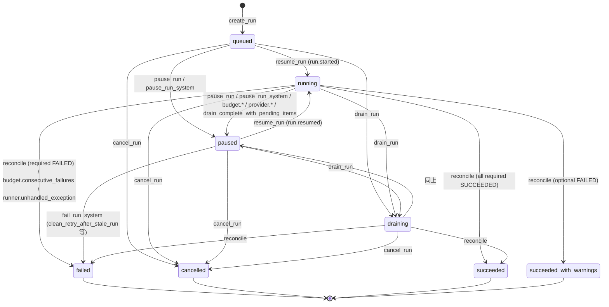
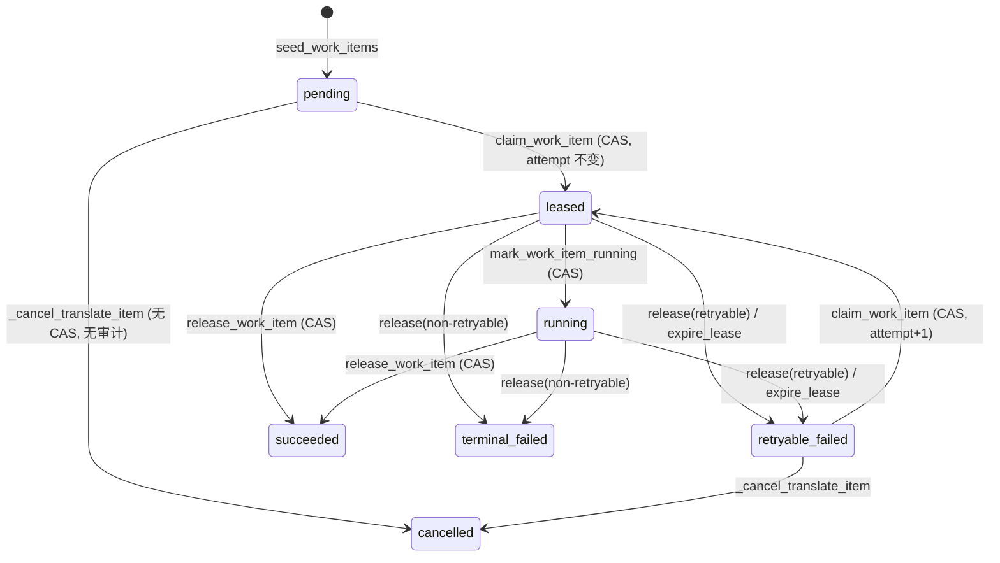

# 02 · 运行时与编排（run 执行器）

> 来源：2026-09-16 对分支 `refactor/p0-stabilize`（HEAD `2176d51`）的逐文件源码阅读。行号对应该基线；标注「待确认」的条目未经运行验证。总览与跨子系统结论见 [`00-overview.md`](00-overview.md)。

# book-agent 运行时（后台 run 执行器）与编排层 —— 源码阅读笔记

阅读基线：分支 `refactor/p0-stabilize`，HEAD `2176d51`（2026-09-16）。所有行号均对应该版本。
路径缩写（正文中一律写全路径，此处仅为索引）：

| 缩写 | 文件 |
|---|---|
| EXE | `src/book_agent/app/runtime/document_run_executor.py`（1800 行） |
| RXS | `src/book_agent/services/run_execution.py`（795 行） |
| RCS | `src/book_agent/services/run_control.py`（883 行） |
| RCR | `src/book_agent/infra/repositories/run_control.py`（577 行） |
| SS  | `src/book_agent/orchestrator/stage_status.py`（501 行） |
| SG  | `src/book_agent/orchestrator/stage_gate.py`（148 行） |
| RP  | `src/book_agent/orchestrator/run_plan.py`（86 行） |
| REC | `src/book_agent/orchestrator/reconciler.py`（169 行） |
| OPS | `src/book_agent/domain/models/ops.py`（368 行） |
| TS  | `src/book_agent/services/translation.py` |

---

## 0. 一页总览

- **拓扑**：单进程 FastAPI 应用在 lifespan 中启动一个 `DocumentRunExecutor`（`src/book_agent/app/main.py:56-58`）。执行器 = 1 个 supervisor 线程 + 每个活跃 run 一个 run-loop 线程 + 每个已领取 work item 一个 work 线程 + 每个 work 线程一个 heartbeat 线程。全部 `daemon=True`。
- **真相源**：物理表 `translation_packets.status` + `work_items.status` 是阶段状态的唯一真相（`StageStatusCalculator`）；`document_runs.status_detail_json.pipeline._cached_pipeline_stages` 只是投影缓存，读 API 时会被派生值覆盖（`src/book_agent/services/run_control.py:468-504`）。
- **并发模型**：所有改 run 行的路径先 `get_run_for_update`（空 UPDATE + `SELECT ... FOR UPDATE`）取行锁；work item 状态变更全部是带 `WHERE status IN (...)` 的 CAS UPDATE；租约（`worker_leases`）到期由 run loop 回收；worker 在提交结果的事务里 `assert_lease_held`（`SELECT ... FOR UPDATE` 锁租约行）。
- **翻译工作项三段事务**：prepare（写 `llm.call.started` 事件）→ 无连接地调用 LLM → persist（写译文 + `assert_lease_held`）→ 第四个事务 `complete_translate_success` 更新 work item / 用量。
- **失败分类**：`workers/failures.py` 按异常类型给 RETRY / PAUSE / FAIL；PAUSE（402/401/403）把 work item 记为 TERMINAL_FAILED 并把 run 置 PAUSED。
- **终态判定**：`reconcile_run_terminal_state` → `classify_run_outcome(stage_status_by_name, plan.required_stages)`；`translate_full` 四个阶段全必需；其他类型只必需自己计划内的阶段，其它阶段 FAILED 只降级为 `succeeded_with_warnings`。
- **最重要的问题（详见 §12）**：
  1. PAUSE 类失败（402 余额不足）把 work item 写成 TERMINAL_FAILED，`resume_run` 后 run 会在下一 tick 因 `stage.evidence_failed` 直接 FAILED，"暂停后续跑"承诺不成立。
  2. 钱包/无进展/墙钟预算都不扣除暂停时长：长暂停后 `resume_run` 会立刻被 `budget.no_progress_exceeded` / `budget.wall_clock_exceeded` 再次暂停。
  3. 只有 RUNNING/DRAINING 的 run 才回收过期租约；PAUSED/CANCELLED run 的在途 work 线程永远持有有效租约，`retry_run` 起的新 run 会与其并发翻译同一 packet（双写风险）。
  4. `events` 目录里 27 个事件种类只有 8 个真正被发出；run 生命周期（created/paused/resumed/cancelled/completed）、cost 预算、review issue 等从不进事件总线，SSE 客户端看不到 run 状态变化。
  5. review/export 阶段内的自动跟进翻译（`RerunService.execute → execute_packet`）不带 `run_id`，其 LLM 事件 `run_id=NULL`：成本物化视图与 `usage_summary` 都统计不到，预算护栏对这部分开销失明；而且这些 LLM 调用在同一个长事务里持有数据库连接（与翻译阶段的三段式设计相悖）。

---

## 1. Run 生命周期

### 1.1 Run 类型

`src/book_agent/domain/enums.py:280-286` 定义 6 种：`bootstrap`、`translate_full`、`translate_targeted`、`review_full`、`export_full`、`repair_targeted`。
可执行的只有 4 种（`src/book_agent/orchestrator/run_plan.py:79-86` `EXECUTABLE_RUN_TYPES`）；`bootstrap`/`repair_targeted` 仍在枚举与 DB CHECK 里（`alembic/versions/20260315_0004_run_control_plane_models.py:23-25`），但 `plan_for_run` 对它们抛 `ValueError`（`run_plan.py:76`），supervisor 的查询也把它们过滤掉（EXE:317）。

### 1.2 RunPlan：类型 + 请求参数 → 阶段集合

`src/book_agent/orchestrator/run_plan.py:53-76`，请求参数取自 `status_detail_json["run_request"]`（`run_plan.py:18,48-50`）：

| run_type | `stages` | `packet_ids` | `review_repairs_blockers` | `auto_followup_on_export_gate` | `max_auto_followup_attempts` |
|---|---|---|---|---|---|
| translate_full | `("translate","review","bilingual_html","merged_html")` | None（全部 BUILT 包） | True | True | None（回退到 budget / 执行器默认 2） |
| translate_targeted | `("translate",)` | `run_request.packet_ids` 或 None | True（无意义） | True（无意义） | None |
| review_full | `("review",)` | – | **False**（只记 issue，不修阻断） | – | – |
| export_full | `(export_type,)`，默认 `merged_html` | – | – | `run_request.auto_execute_followup_on_gate`（默认 False） | `run_request.max_auto_followup_attempts` |

- `required_stages == frozenset(stages)`（`run_plan.py:43-45`）：计划内阶段全部必需。
- `EXPORT_STAGE_KEYS` = `ExportType` 全部 7 个值（`run_plan.py:21`），所以 `export_full` 可以是 `rebuilt_pdf`、`zh_epub` 等任意导出类型。
- API 入队：`src/book_agent/app/api/routes/documents.py:503-588` —— `POST /documents/{id}/translate|review|export` 各自 `create_run` + `resume_run` + `session.commit()` + `executor.wake()`，返回 202。`POST /runs`（`src/book_agent/app/api/routes/runs.py:113-139`）只创建 QUEUED，不 resume。

### 1.3 状态枚举与合法转换

`DocumentRunStatus`（`enums.py:289-302`）：`queued, running, paused, draining, succeeded, succeeded_with_warnings, failed, cancelled`。`succeeded_with_warnings` 由迁移 `20260421_0024` 加入 CHECK。

所有转换都经 `RunControlService._transition_run`（RCS:684-746），先 `get_run_for_update`，`allowed_from` 不满足抛 `RunControlTransitionError`（API 映射 409）。

| 方法（RCS 行号） | allowed_from | → | actor | 副作用 |
|---|---|---|---|---|
| `create_run` :144-193 | – | QUEUED | human | 写 `run_budgets`（全空则不写 :830-844）、审计 `run.created` |
| `resume_run` :366-383 | QUEUED, PAUSED | RUNNING | human | 事件名 `run.started`（自 QUEUED）或 `run.resumed`；`started_at` 只在首次置 RUNNING 时设置（:706-707）；`stop_reason=None`；`finished_at=None` |
| `pause_run` :344-364 | QUEUED, RUNNING, DRAINING | PAUSED | human | `stop_reason = note or "cancelled_by_operator"`（:718-719，暂停也叫 cancelled_by_operator） |
| `pause_run_system` :556-575 | QUEUED, RUNNING, DRAINING（其它状态静默返回摘要） | PAUSED | system | `stop_reason = stop_reason` |
| `drain_run` :534-554 | QUEUED, RUNNING, PAUSED | DRAINING | human | |
| `cancel_run` :661-682 | QUEUED, RUNNING, PAUSED, DRAINING | CANCELLED | human | `finished_at` |
| `succeed_run_system` :577-597 | QUEUED, RUNNING, DRAINING（已 SUCCEEDED 幂等） | SUCCEEDED | system | |
| `succeed_run_with_warnings_system` :599-626 | 同上 | SUCCEEDED_WITH_WARNINGS | system | |
| `fail_run_system` :628-659 | QUEUED, RUNNING, **PAUSED**, DRAINING | FAILED | system | |
| `retry_run` :385-447 | 前驱 ∈ {FAILED, CANCELLED, PAUSED} 或"陈旧的失败阶段 RUNNING run"（:449-466：某阶段派生 FAILED 且 3 分钟无心跳/无更新 → 先 `fail_run_system(clean_retry_after_stale_run)`） | 新建 run（QUEUED→RUNNING） | human | 新 run `resume_from_run_id=旧 id`，复制 budget、`run_request`；`usage_summary`/`control_counters` 归零；pipeline 缓存全部重置为 pending、`current_stage="translate"`（:792-825） |

注意：
- QUEUED 的 run 执行器**不会**拾取（EXE:317-320 只选 RUNNING/DRAINING），但 `claim_next_work_item` 又允许 QUEUED（RXS:154,182）——不一致但无害。
- `fail_run_system` 允许 PAUSED→FAILED，而 `succeed_*` 不允许 PAUSED→SUCCEEDED：暂停中的 run 只会"变坏"不会"变好"。
- 同一文档同时只能有一个 QUEUED/RUNNING/DRAINING 的 run（部分唯一索引 `uq_document_runs_active_per_document`，OPS:112-124，迁移 `20260421_0027`）。PAUSED 不占槽 → 可以 `retry_run` 一个 PAUSED run，旧 run 继续 PAUSED（见 §12 问题 3）。

### 1.4 终态判定规则

`RunExecutionService.reconcile_run_terminal_state`（RXS:581-696）：
1. run 已终态或 PAUSED → 直接返回摘要（:597-604）。
2. `count_inflight_work_items` (LEASED/RUNNING) > 0 → 返回，不判定（:606-608）。
3. DRAINING 且 `count_claimable_work_items` > 0 → `pause_run_system("run.drain_complete_with_pending_items")`（:610-616）。
4. 评估阶段集合 = `plan.stages` + `PIPELINE_STAGES` 里不在计划内且 ≠ translate 的阶段（:622-624）。也就是说 `review_full` 会顺带评估 `bilingual_html`/`merged_html`（作为可选），但**不评估 translate**；`export_full(rebuilt_pdf)` 会评估 `rebuilt_pdf`（必需）+ review/bilingual_html/merged_html（可选）。
5. `translate` 阶段用 `plan.packet_ids` 限定包范围（:631）。
6. `classify_run_outcome`（SS:415-474）决策顺序：任一必需 FAILED → FAILED；任一必需非 SUCCEEDED → RUNNING；任一可选 RUNNING → RUNNING；任一可选 FAILED → SUCCEEDED_WITH_WARNINGS；否则 SUCCEEDED。`PARTIAL` 视作"非 SUCCEEDED"即 RUNNING（:433-434）。
7. FAILED → `fail_run_system("stage.evidence_failed", {failed_required_stages, failed_optional_stages, failed_stages, stage_status, terminal_failed_work_item_count})`（:641-664）。
8. SUCCEEDED → `succeed_run_system({completed_work_item_count, stage_status, run_outcome})`；WITH_WARNINGS 额外 `failed_optional_stages`（:666-690）。

调用点：run loop 每 tick 末尾（EXE:349-352）；work item 失败事务内（EXE:1111）。**成功路径不触发 reconcile**，靠下一 tick。

`SS:63-66` 的 `REQUIRED_PIPELINE_STAGES={"translate"}` / `OPTIONAL_PIPELINE_STAGES` 现在只是 `classify_run_outcome` 的默认参数与测试钉子（`tests/test_run_outcome_classifier.py:35-43`），生产路径总是传 `plan.required_stages`。

---

## 2. 执行器架构

### 2.1 构造参数（全部硬编码默认，无 Settings 项）

EXE:88-128。`src/book_agent/core/config.py:52-160` 的 `Settings` 中**没有任何执行器参数**（轮询、租约、心跳、并行度均不可通过环境变量配置）。

| 参数 | 默认 | 用途 |
|---|---|---|
| `poll_interval_seconds` | 1.0 | supervisor 与 run loop 的 `_wake_event.wait` 超时 |
| `state_reconciler_interval_seconds` | 30 | 每 run 的 Reconciler 漂移扫描节流（EXE:130-151） |
| `lease_seconds` | 120 | translate / export 工作项租约窗口 |
| `review_lease_seconds` | 1800（≥ lease_seconds） | review 工作项租约窗口 |
| `heartbeat_interval_seconds` | 15 | heartbeat 线程周期 |
| `default_max_auto_followup_attempts` | 2 | 无 budget 时 review/export 自动跟进上限 |
| `default_max_blocker_repair_rounds` | 10 | review 阶段阻断修复轮数（取 max(10, followup)）EXE:1669-1673 |
| `default_max_parallel_workers` | 8 | 无 budget 时每 run 并行翻译 work 线程数 |

`ensure_document_run_executor(app)`（EXE:69-85）在 lifespan 及每次 API `wake` 时被调用；`app.state.document_run_executor` 为 None 时懒创建并 `start()`。无锁的 check-then-set：两个并发请求可能各创建一个执行器（仅在 lifespan 未跑的嵌入场景，如 TestClient 未用 `with`）。

Worker 解析：`translation_worker_resolver`（`app.state.resolve_translation_worker`，`main.py:112-116` → `TranslationWorkerProvider.get()` 按凭据 revision 缓存，`workers/factory.py:150-183`）每次构建 `DocumentWorkflowService` 时调用（EXE:215-225），固定 worker 仅作回退。`DocumentRun.backend/model_name` 字段（OPS:139-140）**不参与** worker 选择——只是记录。

### 2.2 线程模型

| 线程 | 名称 | 数量 | 循环/生命周期 | 做什么 |
|---|---|---|---|---|
| supervisor | `book-agent-run-supervisor` | 1 | `_supervisor_loop` EXE:234-247，每 tick：`_reap_finished_threads` → `_list_runnable_run_ids`（RUNNING/DRAINING & 可执行类型，按 created_at）→ 每个 run `_ensure_run_thread`；异常记日志后 sleep ≤1s；`_wake_event.wait(poll)` + `clear()` | 发现 run、拉起 run 线程、清理已结束线程登记 |
| run loop | `book-agent-run-{run_id}` | 每活跃 run 1 | `_run_loop` EXE:326-371 | 见 §2.4 |
| work（translate） | `book-agent-translate-{work_item_id}` | ≤ 并行度/run | `_execute_translate_work_item` EXE:673-684 → `_execute_claimed_work_item` | 三段事务翻译一个 packet |
| work（review） | `book-agent-review-{work_item_id}` | ≤1/run | EXE:686-812 | 全文审校 + 阻断修复 |
| work（export） | `book-agent-export-{type}-{work_item_id}` | ≤1/type/run | EXE:814-887 | 整书导出 |
| heartbeat | 无名 | 每 work 线程 1 | `_heartbeat_loop` EXE:1586-1599 | 每 15s `heartbeat_work_item` 续租；租约不再 ACTIVE 则退出 |

登记表：`_active_run_threads: dict[run_id, Thread]`、`_active_work_threads: dict[run_id, dict[work_item_id, Thread]]`，受 `self._lock` 保护（EXE:126-128）。

### 2.3 `start()` / `stop()` / `wake()` 语义

- `start()` EXE:153-164：幂等（supervisor 存活则返回）；清 stop 事件、置 wake 事件、起 supervisor。
- `stop(work_timeout_seconds=30)` EXE:166-203：置 stop + wake；按层 join：supervisor(5s) → run 线程(各 5s) → work 线程(各 30s，超时仅 warning)；返回"所有线程都退出"布尔；随后**清空登记表并把 `_supervisor_thread=None`**（即使线程还活着）。heartbeat 线程不在登记表内，不 join。
- lifespan（`main.py:59-74`）：`stop()` 返回 True 才 `engine.dispose()`；否则留着连接池让在途 work 线程落库。**但 `app.state.document_run_executor=None` 后任何 API `wake` 都会 `ensure_document_run_executor` 起一个新执行器**（EXE:69-85）——关停期间收到请求会复活执行器（待确认 uvicorn 在 lifespan shutdown 后是否仍派发请求；通常不会）。
- `wake(run_id)` EXE:205-213：置 `_wake_event`；若指定 run 的线程已死则从登记表移除（让 supervisor 立即重建）。API 每次 create/pause/resume/retry/drain/cancel 与 GET 活跃 run 摘要都会 wake（`routes/runs.py:26-32,138,152,225,...`）。
- **`_wake_event` 是 supervisor 与所有 run loop 共用的单个 `threading.Event`**，每个等待者醒来后都 `clear()`（EXE:246-247, 370-371）。结果：任一 wake 唤醒所有循环（惊群，无害），但也可能被先醒的循环 clear 掉，导致目标 run loop 错过唤醒、退化为 1s 轮询（丢失唤醒；影响仅延迟）。

### 2.4 run loop 每 tick 的顺序（EXE:326-371）

1. 新 session 读 `get_run_summary`（含 4 个阶段的派生投影，见 §4 性能）；状态 ∉ {running, draining} → 线程退出。
2. `_maybe_reconcile_state`：≥30s 一次的只读漂移扫描，写 `stage_transitions`（独立事务，异常仅 warning）。
3. `_reclaim_expired_leases`（§3.4）。
4. `_enforce_budget_guardrails`（§7）；超预算 → `_sync_pipeline_status` → 退出。
5. `plan_for_run`；按顺序 `translate` → `review` → 每个 `export_stage`（`any(...)` 短路：某阶段返回 True 就 `continue` 进入下一 tick，不再看后面的阶段）。
6. 都返回 False → `reconcile_run_terminal_state` → `_sync_pipeline_status(status)` → 终态/暂停/取消则退出。
7. 异常：`IntegrityError`/`OperationalError` → warning，下一 tick 重试（EXE:361-364）；其它异常 → `_fail_run("runner.unhandled_exception")`（EXE:365-368）→ 退出。
8. `_wake_event.wait(poll)`；`clear()`。

各 `_process_*_stage` 返回 True 的含义是"本 tick 有推进（播种/领取/起线程）"，返回 False 是"该阶段无事可做（门禁未过 / 全部成功 / 有 terminal_failed / 无可领取）"。

### 2.5 `_process_translate_stage`（EXE:417-512）——单事务内

1. `_list_stage_items(TRANSLATE)`；`_reconcile_translate_work_items`（§3.6 遗留数据修正，可能取消/改写 work item）。
2. `_seed_translate_frontier_work_items`：DECIDE（`_plan_translate_frontier` EXE:1436-1521，纯读）→ EXECUTE（`seed_translate_work_items`）。前沿规则：每章最多一个"活跃"（PENDING/RETRYABLE_FAILED/LEASED/RUNNING）translate item；已被任何状态的 item 代表的包不再播种；每章取 `packet_ordinal` 最小的 BUILT 包。播种后把 translate 缓存写成 `pending` 并带 `total_packet_count`/`pending_packet_count`。
3. 若没有任何非 CANCELLED 的 item：直接 `seed_translate_work_items(所有 BUILT 包)`（**这里不走前沿规则**，EXE:463-482：一次性为全部待翻译包播种——但只在"没有活跃 item"时发生，而 2 已先播过前沿，所以通常只在文档已全部翻译（`packet_ids` 为空 → 缓存 `succeeded`、`current_stage=next_stage`）时走到）。
4. 任一 TERMINAL_FAILED → 返回 False（fail-fast：一个包终止失败会停止所有章节的继续翻译，等 reconcile 把 run 判 FAILED）。
5. 有 PENDING/RETRYABLE_FAILED → 缓存 `running` → `_claim_translate_work_items`（§3.2）。
6. 事务提交后为每个 claimed 起 work 线程；返回 True。
7. 全部 SUCCEEDED → 缓存 `succeeded`、`current_stage=next_stage`（独立事务）；返回 False。

注意 DRAINING 的 run 也会执行 2/3 播种（无 run 状态检查），只是随后 `claim_work_item_by_id` 因状态 ≠ RUNNING/QUEUED 拒绝（RXS:182），于是 reconcile 判 `drain_complete_with_pending_items` 暂停——排空时反而多播了 pending 项。

### 2.6 `_process_review_stage`（EXE:544-599）与 `_process_export_stage`（EXE:601-671）

- 门禁 `StageGateKeeper.can_start(..., plan_stages=plan.stages)`（§5）。
- 无 item → `seed_work_items`（review：scope DOCUMENT/document_id；export：scope EXPORT/`stable_id("document-run-export", run_id, export_type)`，bundle 含 `export_type`）→ 缓存 running → True。
- TERMINAL_FAILED → False。
- PENDING/RETRYABLE_FAILED → `claim_next_work_item(stage)`（列 32 个候选逐个 CAS）→ 起线程 → True。export 的 `claim_next_work_item(stage=EXPORT)` **不按 export_type 过滤**：若 bilingual 与 merged 两个 export item 同时 PENDING，处理 bilingual 时可能领到 merged 的 item 并以 bilingual 的 `_execute_export_work_item` 执行（实际靠门禁顺序避免同时 PENDING：merged 依赖 bilingual SUCCEEDED 才会播种，所以现有流程不会触发；但 `export_full` 单阶段亦无问题）。
- 全部 SUCCEEDED → 缓存 succeeded。

### 2.7 `_execute_claimed_work_item`（EXE:889-960）通用骨架

1. 事务 A：`start_work_item`（LEASED→RUNNING CAS、续租、审计 `work_item.started`）；translate 包写 packet `runtime_state=running`。
2. 起 heartbeat 线程。
3. `payload = worker_fn()`（各自管理事务）。
4. 停 heartbeat（`stop_event` + join ≤15s）。
5. `on_success(payload, lease_token)`（一个事务：`complete_*_success` + 阶段缓存）。
6. `wake(run_id)`。
- `LeaseLostError`（任何阶段）→ 停心跳、warning、丢弃结果、wake（EXE:934-942）。
- 其它异常 → `_complete_failure`（§8）；其中再抛 LeaseLostError → warning；其它异常 → `logger.exception`，依赖租约过期回收（EXE:943-960）。

---

## 3. 工作项与租约

### 3.1 数据模型（OPS）

- `work_items`（OPS:153-207）：`run_id, stage, scope_type, scope_id(UUID), attempt(默认1), priority(100), status, lease_owner, lease_expires_at, last_heartbeat_at, started_at, finished_at, input_version_bundle_json, output_artifact_refs_json, error_class, error_detail_json`。部分唯一索引 `uq_work_items_active_scope(run_id, stage, scope_type, scope_id) WHERE status IN (pending, leased, running, retryable_failed)`（迁移 `20260421_0026`）。
- `worker_leases`（OPS:210-233）：`lease_token UNIQUE, status(active/released/expired), lease_expires_at NOT NULL, last_heartbeat_at, released_at`。每次 claim 新建一行，一个 work item 历史上可有多行租约。
- `run_budgets`（OPS:236-261）：`run_id UNIQUE`。
- `WorkItemStatus`（enums:320-327）：`pending, leased, running, succeeded, retryable_failed, terminal_failed, cancelled`。
- `WorkItemStage`：`bootstrap, translate, review, export`（`repair` 已由迁移 0030 删除）；`bootstrap` 阶段无任何写入方（死枚举）。`WorkItemScopeType.CHAPTER/ISSUE_ACTION` 同样无写入方。

### 3.2 领取（claim）

- `RunControlRepository.claim_work_item`（RCR:318-391）：先 `session.get` 检查状态 ∈ {PENDING, RETRYABLE_FAILED}，再执行 `UPDATE work_items SET status=leased, lease_owner, lease_expires_at, last_heartbeat_at, attempt = CASE WHEN status=retryable_failed THEN attempt+1 ELSE attempt END, error_class=NULL, error_detail_json={} WHERE id=? AND status IN (pending, retryable_failed)`；`rowcount != 1` → None。然后插入 `worker_leases(active)`，translate/packet 项再 `emit_event(PACKET_LEASED)`。
- 无 `SKIP LOCKED`；`_is_work_item_claimable` 只看状态（RCR:393-394，`now` 参数未用）。
- `RunExecutionService.claim_work_item_by_id`（RXS:172-215）：先读 run 状态 ∈ {QUEUED, RUNNING} 否则 None（**不加锁读**）；成功后 `save_run(run, audit=work_item.leased)`（`save_run` 只 `merge` + 更新 `updated_at`，不锁 run）。
- translate 专用 `_claim_translate_work_items`（EXE:1116-1199）：并行度 = budget.max_parallel_workers 或默认 8；`available_slots = limit - len(LEASED/RUNNING)`；候选按 `(priority, created_at, id)` 排序，再按章节取 lane 排序键 `(packet_ordinal, created_at, id)` 最小者，跳过已有活跃项的章节；逐个 CAS claim；每领一个写 packet `runtime_state=leased`。
- `lease_seconds`：claim 时 120s（EXE:1183, 576, 645 均为 `self.lease_seconds`）；`start_work_item` 再按阶段窗口续（review 1800s，EXE:811）。

### 3.3 心跳与续期

- `_heartbeat_loop`（EXE:1586-1599）：`stop_event.wait(15s)` 循环；`heartbeat_work_item`（RXS:265-277 → RCR:455-478）要求租约 ACTIVE 且 work item ∈ {LEASED, RUNNING}，同时更新 `worker_leases` 与 `work_items` 的 `last_heartbeat_at/lease_expires_at`；返回 False 则线程退出并 warning。DB 异常只 warning，继续循环。
- 心跳不锁 run 行、不锁租约行；与 `expire_lease` 竞争时靠 `expire_lease` 的 CAS（§3.4）。

### 3.4 过期与回收

- `reclaim_expired_leases`（RXS:421-469）：`list_expired_active_leases(run_id, lease_expires_at < now)`；有则 `get_run_for_update`；逐个 `expire_lease`（RCR:526-562：`UPDATE work_items SET status=retryable_failed, error_class='lease_expired', ... WHERE id=? AND status IN (leased, running)`；租约行无条件置 EXPIRED；rowcount≠1 → 返回 None 表示 work item 已被 worker 先释放）；审计 `worker_lease.expired`；计数 `expired_lease_reclaim_count`。
- 执行器包装 `_reclaim_expired_leases`（EXE:396-415）额外把 translate 包 `runtime_state=retryable_failed`。
- **只在 run loop 里调用，而 run loop 只对 RUNNING/DRAINING 的 run 存在**（EXE:331-332）→ PAUSED/CANCELLED/FAILED run 的 ACTIVE 租约永不回收（§12 问题 3）。
- 回收后 work item 变 RETRYABLE_FAILED，**不检查 `max_retry_count_per_work_item`**（该上限只在 `complete_work_item_failure` 中检查，RXS:381-384）：一个因租约反复过期的项可无限重试（每次 claim attempt+1，但没有人比较上限）。

### 3.5 `assert_lease_held` 与结果提交

- RXS:261-263 → RCR:407-424：`SELECT worker_leases WHERE lease_token=? AND status=active FOR UPDATE`；查不到抛 `LeaseLostError`。
- 调用位置：翻译 persist 事务末尾（EXE:1010，在 `persist_packet_result` 之后、commit 之前——若租约丢失则整个 persist 回滚）；review 结果事务末尾（EXE:715, 761）；export 事务末尾（EXE:850, 853）。
- `complete_*_success/failure` 本身用 `get_active_lease_by_token`（不加锁）+ `release_work_item` CAS：若 reaper 已把 item 置 RETRYABLE_FAILED，release 不覆盖 item 状态但把租约置 RELEASED（RCR:480-524；测试 `tests/test_work_item_cas.py:131-178`）。
- SQLite 忽略 `FOR UPDATE`；`get_run_for_update` 用先行空 UPDATE 拿写锁弥补（RCR:71-80），`lock_active_lease` 没有等价补偿——SQLite 下租约锁失效（仅测试环境）。

### 3.6 遗留数据修正 `_reconcile_translate_work_items`（EXE:1210-1295）

对每个 translate/packet item：`scope_id` 不在文档包集合但 bundle.packet_id 在 → 改写 `scope_id`；bundle 缺 `chapter_id/packet_ordinal/packet_runtime_substate` → 补齐；包已 TRANSLATED 且 item 仍 PENDING/RETRYABLE_FAILED → `_cancel_translate_item(obsolete_translate_work_item_for_translated_packet)`；解析不到包 → `_cancel_translate_item(stale_translate_packet_reference)`。
- `_cancel_translate_item`（EXE:1312-1328）直接改 ORM 属性，**无 CAS、无 `run_audit_events`、无 `stage_transitions`**，并在**取 run 锁之前**flush（EXE:1294）——违反 RCR:66-68 声明的"先锁 run 再动 work item"顺序，且会给 RUNNING 状态的 item 改 `input_version_bundle_json`（行锁）→ 与持 run 锁后 UPDATE 同一 item 的 work 线程可能形成死锁（Postgres 会中止一方；run loop 侧被当作瞬态错误重试，work 线程侧会误记一次失败）。
- 这段逻辑针对历史上 `scope_id` 写成 document_id 的旧行（测试 `tests/test_run_execution.py:505-553` 构造 `scope_id=document_id`），是迁移期 hack。

### 3.7 重试计数与失败后的流转

- `complete_work_item_failure`（RXS:369-419）：`should_retry = retryable and (max_retry_count is None or attempt < max_retry_count)`；否则 TERMINAL_FAILED。计数 `retryable_failure_count`/`terminal_failure_count`/`consecutive_failures`（+1）、`last_failure`。审计 `work_item.retryable_failed|terminal_failed`。
- `consecutive_failures` 只在 `complete_translate_success` 归零（RXS:747）；review/export 成功不归零。
- RETRYABLE_FAILED 项在下一 tick 由 claim 逻辑重新领取，没有退避（backoff）——瞬态 429/5xx 会以 1s 节奏立即重试，直到 `max_retry_count_per_work_item`（默认 None = 无限）。

---

## 4. 阶段状态推导（`stage_status.py`）

`StageStatusCalculator.stage_evidence(run_id, document_id, stage, packet_ids=None)`（SS:166-181）：

| 阶段 | 证据来源 | 判定（SS 行号） |
|---|---|---|
| `translate` | `translation_packets JOIN chapters WHERE document_id`（可选 `packet_ids` 限定）计数 total/translated/failed；`work_items(run_id, stage=translate)` 非 CANCELLED 计数 | :211-224：无包且无 item → NOT_STARTED；`failed_packets>0 or terminal_failed>0` → FAILED；`translated==total>0 and succeeded==total_items`（允许 0 item）→ SUCCEEDED；否则 RUNNING |
| `review` | `work_items(run_id, stage=review)` | :300-307：0 → NOT_STARTED；有 terminal_failed → FAILED；全 succeeded → SUCCEEDED；否则 RUNNING |
| 任一 `ExportType` 值 | `work_items(run_id, stage=export)` 并在 Python 里按 `input_version_bundle_json.export_type` 过滤（:261-273） | 同上 |
| 其它 | `ValueError`（:181） |

要点：
- translate 的"进度"是**文档级**的（所有包，不分 run），只有 `translate_targeted` 传 `packet_ids` 限定。`translate_full` 若文档里存在其它 run 遗留的 FAILED 包（`PacketStatus.FAILED`，代码中**没有任何写入方**，grep 仅有读取方）会永远 FAILED。
- `succeeded == total`（非 CANCELLED 的 item 全部 SUCCEEDED）是与 run 绑定的，所以一个 run 只翻译了部分包但其它包早已 TRANSLATED 也算 SUCCEEDED。
- `PARTIAL` 只由执行器在 review 有 skipped_chapters 时写入**缓存**（EXE:792-803），计算器不产生 PARTIAL（SS:72-76），读 API 投影时会被派生值（SUCCEEDED）覆盖——"partial" 标签实际上永远到不了 UI（RCS:468-504 覆盖 `status`）。
- 性能：`_work_item_counts` 与 `_export_stage_evidence` 把整段 work item 行加载到 Python 再计数（SS:285-298, 261-273）；`count_claimable_work_items` 同样（RCR:239-245）。每次 `get_run_summary` 调用 4 次 `stage_status`（RCS:489-501），run loop 每 tick 至少调用一次 summary，`_transition_run` 结束又调一次；门禁再算一遍上游。430 包的书每 tick 会多次全量扫描 work_items。
- `stage_status_to_cache_label`：NOT_STARTED→`pending`，其余同名（SS:90-101）。
- `StageTransitionLogger.record`（SS:335-378）：在调用方事务内 `session.add(StageTransition)`，`caused_by_code` 用 `inspect.stack()[2]` 取调用点（每次记录都做一次栈遍历，SS:477-487）。

---

## 5. 阶段门与导出门禁

### 5.1 StageGateKeeper（SG）

`STAGE_DEPENDENCIES`：translate→()、review→(translate)、bilingual_html→(translate, review)、merged_html→(translate, review, bilingual_html)；其它导出类型默认 (translate, review)（SG:35-50）。`evaluate(plan_stages=...)` 只保留计划内的上游（SG:116-118）→ `review_full`/`export_full` 不等待别的 run 的翻译，依赖 review/export 服务自身的检查（SG:111-115 注释）。上游全部 SUCCEEDED 才 `can_start`。门禁只读，不写记录；被阻塞时执行器不记日志、不写缓存（EXE:550-553, 614-617 直接 `return False`）。

### 5.2 导出门禁（`ExportGateError`）

- `DocumentExportUseCase._pass_export_gate`（`src/book_agent/application/export_use_case.py:152-263`）：逐章 `assert_chapter_exportable`；`ExportGateError` 且 `auto_execute_followup_on_gate` → 执行跟进动作（`issue_actions.execute_action(run_followup=...)` → `RerunService.execute`）最多 `max_auto_followup_attempts` 次，停机原因 `no_followup_actions / no_new_actions / manual_hold_required / max_attempts_reached`；每次执行与停机都写 `audit_events`（`export.auto_followup.executed`）。
- 执行器侧（EXE:832-853）：捕获 `ExportGateError` → `assert_lease_held` → **`session.commit()`**（保留门禁期间创建的 review issue / 跟进记录）→ 重新抛出 → `_complete_failure`：`classify_failure(ValueError 子类)` → FAIL → work item TERMINAL_FAILED，`error_detail_json.export_gate = exc.to_http_detail()`，阶段缓存 `status=failed` + `export_gate` 详情（EXE:1056-1057, 1084-1096）→ `reconcile_run_terminal_state` → 该导出阶段 FAILED → `translate_full` 必需 → run FAILED（`stage.evidence_failed`）；`export_full` 同样 FAILED。
- 门禁失败不可"重试同一 run"：work item 是 TERMINAL_FAILED，唯一出路是修 issue 后 `retry_run`（冷启动新 run）。
- 前端 `frontend/src/lib/api.ts:782` 下载流程只读 `stop_reason`，门禁详情在 `status_detail_json.pipeline._cached_pipeline_stages.<export>.export_gate` 与 work item 里，前端未见读取（待确认）。

### 5.3 review 阶段的"阻断修复"

`translate_full`（`review_repairs_blockers=True`，EXE:717-775）：`review_document(auto_execute_packet_followups=True)` → `repair_document_blockers_until_exportable(max_rounds)` → 若有修复再 `review_document` 一次；`remaining_blocking_issue_count>0` → 先在独立事务把缓存写 `running`+payload，再抛 `RuntimeError`（EXE:762-774）→ FAIL → review TERMINAL_FAILED → run FAILED。`review_full` 只记 issue（EXE:703-716）。review 成功且有 `skipped_chapter_count>0` → 缓存 `partial`（但见 §4，会被投影覆盖）。

---

## 6. 事务模型

### 6.1 会话与隔离

`session_scope`（`src/book_agent/infra/db/session.py:40-53`）：`autoflush=False, expire_on_commit=False`；退出时 commit，异常 rollback。未设置隔离级别（Postgres 默认 READ COMMITTED）。引擎 `pool_size=10, max_overflow=20, pool_pre_ping`（session.py:23-26）。API 依赖 `get_db_session` 对 GET/HEAD/OPTIONS 回滚而非提交（`app/api/deps.py:22-26`）。

### 6.2 翻译工作项的事务序列（EXE:968-1037）

| # | 事务 | 内容 | 锁 |
|---|---|---|---|
| A | `start_work_item` + packet runtime_state | LEASED→RUNNING CAS、续租、审计；`save_run` 无锁 merge | 无 run 锁（`save_run` 只 merge） |
| 1 | prepare（EXE:978-992） | 读包；包 ≠ BUILT → 返回 `translation_run_id="already-translated"` 零用量；`prepare_packet` 编译上下文、`emit_event(LLM_CALL_STARTED)` | 无 |
| – | `call_worker`（EXE:995） | 纯 LLM 调用，**不持有连接**（测试 `test_executor_translation_transactions.py:104-112` 断言 checkedout==0） | – |
| 2' | 失败：`record_worker_failure`（TS:365-404） | 插入 FAILED `translation_runs(attempt=next)`、`emit_event(LLM_CALL_FAILED)`；然后重新抛出 | 无 |
| 2 | persist（EXE:1001-1019） | `persist_packet_result`：`LLM_CALL_COMPLETED` 事件、`OutputValidator`（覆盖率不全 → `translation_run.error_code`）、写 translation_run/target_segments/alignment_edges/sentences、包→TRANSLATED、章节可能→TRANSLATED（`repositories/translation.py:143-170`）、`PACKET_TRANSLATED` 事件、hooks（术语违规事件、记忆提案）；最后 `assert_lease_held`（锁租约行） | 租约行 FOR UPDATE |
| 3 | `_complete_translate_success`（EXE:1021-1037） | `get_active_lease_by_token` → **`get_run_for_update`** → `release_work_item` CAS → `usage_summary/control_counters/last_progress` 累加 → 审计 `work_item.succeeded`；包 runtime_state=translated | run 行锁，之后 work item 行 |

- 崩溃在 2 与 3 之间：译文已落库、work item 仍 RUNNING → 租约过期 → RETRYABLE_FAILED → 重领 → 事务 1 走 "already-translated" → 事务 3 记录 `translation_run_id="already-translated"`、用量 0：run 的 `usage_summary` 会少记这次调用（成本 matview 因事件已写不受影响）。
- 事务 2 内 `assert_lease_held` 放在最后：租约丢失时回滚全部译文（PLAN P2.3 意图：丢弃结果）。但 `LLM_CALL_COMPLETED` 事件也随之回滚——这次真实花掉的钱**不会**进成本 matview（事件表是唯一成本来源，§9）。

### 6.3 `get_run_for_update` 与锁顺序

RCR:61-89：`session.flush()` → `UPDATE document_runs SET updated_at=updated_at WHERE id=?`（Postgres 行锁 / SQLite 库级写锁）→ `SELECT ... FOR UPDATE` + `populate_existing`。约定"先锁 run 再动 work item"。遵守者：`seed_work_items`（RXS:88）、`complete_*`（RXS:292, 343, 379）、`reclaim_expired_leases`（RXS:427）、`_transition_run`（RCS:696）、`pause/succeed/fail_*_system`（RCS:563, 583, 612, 635 —— 各自先锁一次再调 `_transition_run` 又锁一次，同事务可重入）、`_do_update_pipeline_stage`（EXE:1702）、`_finalize_stage_snapshots_on_success`（EXE:1752）。
未遵守/无锁写 run 的：`claim_work_item_by_id`、`start_work_item` 的 `save_run(run, audit)`（RXS:196, 242）——只更新 `updated_at` 与追加审计，`merge` 一个已加载的 run 对象；若该对象是在锁前读出的旧快照，merge 会把旧 `status_detail_json` 写回？`merge` 只复制已加载属性值，`run` 对象是本事务内 `session.get` 得到的同一身份对象，不会覆盖别人已提交的值（同事务内无并发），但**没有锁**意味着与并发的 `_transition_run` 形成 lost update 的窗口仅限 `updated_at`。可接受。
锁顺序违规见 §3.6。

### 6.4 review / export 工作项事务

- review（EXE:696-761）：**整个 review + 跟进翻译 + 阻断修复在一个 session/事务**里执行，期间的 LLM 调用（`RerunService.execute → TranslationService.execute_packet`）持有连接；结束 `assert_lease_held`；提交。租约 1800s，心跳持续续期，所以能跑很久。失败（RuntimeError）→ 整个事务回滚，包括已修复的内容（除非 `execute_action` 内部有 commit——待确认，`application/issue_actions.py:37-45` 未见 commit）。
- export（EXE:832-861）：同样单事务；仅 `ExportGateError` 时显式 commit 后再抛。
- `on_success`：`complete_work_item_success` + 缓存更新同事务（EXE:777-803, 863-878）。

### 6.5 SQLite 与 Postgres 差异

| 项 | Postgres | SQLite（仅测试/smoke） |
|---|---|---|
| `FOR UPDATE` | 行锁 | 忽略；`get_run_for_update` 靠空 UPDATE 取库级写锁；`lock_active_lease` 无补偿 |
| 部分唯一索引 | `postgresql_where` | `sqlite_where`（OPS:117-122, 169-175） |
| JSON | JSONB | JSON（`infra/db/base.py:15`） |
| `events.id` | BIGSERIAL | INTEGER autoincrement 变体（OPS:327-335） |
| `events.occurred_at` 默认 | 迁移用 `clock_timestamp()`（0020:25），ORM 用 `current_timestamp()`（OPS:336-344）——`create_all` 与迁移的 schema 不一致（ORM 注释承认） |
| NOTIFY 触发器 / matview | 有 | 无；SSE 与 cost 路由直接 501（`run_stream.py:82-87`, `run_cost.py:35-39`） |
| 时间戳 | tz-aware | naive，`_ensure_utc`/`_isoformat` 统一补 UTC（RXS:33-38, RCS:878-883） |
| 枚举 CHECK | 迁移 + `install_enum_check_constraints` | 同 |

---

## 7. 预算护栏

`RunExecutionService.enforce_budget_guardrails`（RXS:471-579），仅由 run loop 每 tick 调用一次（EXE:337, 384-394）。无 `run_budgets` 行 → 直接放行。检查顺序与动作：

| 顺序 | 条件 | 动作 | stop_reason |
|---|---|---|---|
| 1 | `now - (started_at or created_at) >= max_wall_clock_seconds` | pause | `budget.wall_clock_exceeded` |
| 2 | `now - last_progress.completed_at(或 started_at) >= max_no_progress_seconds` | pause，附 `stuck_retryable_failed_work_item_count` | `budget.no_progress_exceeded` |
| 3 | `usage_summary.cost_usd >= max_total_cost_usd` | pause | `budget.cost_exceeded` |
| 4 | `usage_summary.token_in >= max_total_token_in` | pause | `budget.token_in_exceeded` |
| 5 | `usage_summary.token_out >= ...` | pause | `budget.token_out_exceeded` |
| 6 | `control_counters.consecutive_failures >= max_consecutive_failures` | **fail** | `budget.consecutive_failures_exceeded` |

精度与盲区：
- 检查粒度 = 1 tick（1s）+ 只在 run loop；work 线程完成时不检查 → 超额上限 ≈ 并行度 × 单包成本。
- `usage_summary` 只由 `complete_translate_success` 累加（RXS:302-311, 725-754）；review/export 阶段内的跟进翻译、`RerunService` 走的 `execute_packet` 不带 `run_id`（`services/rerun.py:117-122`）→ 既不进 `usage_summary` 也不进按 run 的成本 matview。预算对这部分开销失明。
- `started_at` 只在首次 RUNNING 设置且 resume 不重置（RCS:706-707）；`last_progress` resume 不刷新（RCS:366-383）→ **暂停时长计入墙钟与无进展窗口**（§12 问题 2）。
- 时钟基线 `run.started_at` 在 `retry_run` 的新 run 上是新的，所以 retry 不受影响。
- `max_parallel_requests_per_provider`：存储、API 回显（`routes/runs.py:66`），**无任何执行逻辑**（grep 仅剩 schema/summary）。跨 run 的 provider 并发无上限。
- `max_retry_count_per_work_item` 语义是 `attempt < max`：`max=0` → 首次失败即终止；`None` → 无限重试。
- `max_auto_followup_attempts` 由执行器读取（EXE:1663-1667），`_max_blocker_repair_rounds = max(10, followup)`（EXE:1669-1673）——"默认 10 轮"下限硬编码。
- `run_cost.py:110-144` 的预算剩余量按 matview 计算，与执行器的 `usage_summary` 是两套口径（前者来自事件 payload，后者来自 work item 成功回调），可能不一致。

---

## 8. 失败分类

`src/book_agent/workers/failures.py:40-72`：

| 异常类型 | disposition | reason | pause_reason |
|---|---|---|---|
| `ProviderHTTPError` 402 | PAUSE | `provider.http_402` | `provider.insufficient_balance` |
| `ProviderHTTPError` 401/403 | PAUSE | `provider.http_{code}` | `provider.authentication_failed` |
| `ProviderHTTPError` ∈ {408,409,425,429} 或 5xx | RETRY | `provider.http_{code}` | – |
| 其它 `ProviderHTTPError`（400/404/422…） | FAIL | `provider.http_{code}` | – |
| `ProviderResponseFormatError` | RETRY | `provider.malformed_response` | – |
| `ProviderTransportError`（含 `ProviderNetworkError`） | RETRY | `provider.transport` | – |
| `sqlalchemy.exc.OperationalError` | RETRY | `database.operational` | – |
| 内置 `TimeoutError` / `ConnectionError` | RETRY | `network` | – |
| 其它（含 `RuntimeError`, `ValueError`, `ExportGateError`, `sqlalchemy.exc.TimeoutError`, `IntegrityError`, `LeaseLostError` 若漏到这里） | FAIL | `unclassified` | – |

- `sqlalchemy.exc.TimeoutError`（连接池耗尽 `QueuePool limit ... timed out`）MRO 为 `SQLAlchemyError → Exception`，不是内置 `TimeoutError` → FAIL → TERMINAL_FAILED → run FAILED。连接池压力会被误判为不可重试的业务失败（§11 背压）。
- `_complete_failure`（EXE:1039-1114）用法：`retryable = failure.retryable`（PAUSE 时为 False）→ `complete_work_item_failure(retryable=False)` → **TERMINAL_FAILED**；包 runtime_state：retry 且无 pause → `retryable_failed`，否则 `terminal_failed`；阶段缓存 `paused|retryable_failed|failed` + `stop_reason`；pause → `pause_run_system(pause_reason, detail={error_class, error_message, work_item_id, scope_type, scope_id})`；否则 `reconcile_run_terminal_state`。同一事务提交后 `_sync_pipeline_status`。
- **暂停原因暴露**：`document_runs.stop_reason`（API 摘要 `stop_reason`）+ `status_detail_json.last_control.{action:"run.paused", note, detail_json}` + 阶段缓存 `stop_reason`。前端目前只在下载失败提示中显示 `stop_reason` 字符串（`frontend/src/lib/api.ts:782`），没有对 `provider.insufficient_balance` 等做人类可读映射（待确认 RunsPage）。
- 翻译失败还会写 `translation_runs(status=FAILED, error_code=reason)` 与 `llm.call.failed` 事件（TS:365-404）。
- 未覆盖：`asyncio.TimeoutError`、`httpx` 原生异常（假定 provider 层已包装）、`MemoryError`、`KeyboardInterrupt`（BaseException 不会进 `except Exception`）。

---

## 9. 事件总线、审计与成本

### 9.1 四张"审计/事件"表

| 表 | 模型 | 写入方 | 读取方 | 用途 |
|---|---|---|---|---|
| `events` | `Event`（OPS:314-353） | `emit_event`（`infra/repositories/events.py:27-58`，校验 kind/actor_kind，flush 触发 NOTIFY） | SSE `GET /runs/{id}/stream`、cost matview、`application/analytics` | 面向 UI 的实时流 + 成本 |
| `run_audit_events` | `RunAuditEvent`（OPS:293-311） | `RunControlRepository.save_run(audit_event=...)` / `create_run` | `GET /runs/{id}/events`、摘要 `events.event_count/latest_event_at` | run 控制面审计（run.created/started/paused/…、work_item.leased/started/succeeded/…、worker_lease.expired、run.work_items.seeded、run.retry_requested） |
| `stage_transitions` | `StageTransition`（OPS:264-290） | `StageTransitionLogger.record`（缓存状态变化 EXE:1719-1727；Reconciler 漂移 REC:104-116） | 无运行时读者（仅测试） | 法医级取证，`caused_by_code` |
| `audit_events` | `AuditEvent`（OPS:63-74） | 导出/审校自动跟进（`export_use_case.py:279-317`、`review_repair.py:689-...`）、issue 动作 | `issue_actions._failed_execution_count`（manual hold 判定） | 领域对象审计 |

四张表全部 append-only（`before_update` 监听抛 `AppendOnlyViolation`，OPS:356-368）。`run_audit_events` 与 `events` 语义重叠但内容不同：前者有 work_item 粒度的完整生命周期，后者只有 `packet.leased`；run 状态变化只进前者。

### 9.2 事件种类：目录 vs 实际

`src/book_agent/domain/event_kinds.py` 定义 27 种。实际 `emit_event` 调用点（grep `emit_event(` 后两行的 `kind=`，共 9 处、8 种）：`packet.built`（`infra/repositories/bootstrap.py:100`、`infra/repositories/ops.py:100`）、`packet.leased`（RCR:379）、`llm.call.started|completed|failed`（TS:345, 428, 388）、`packet.translated`（TS:470）、`glossary.violation`（TS:523）、`glossary.updated`（`services/term_consistency.py:421`）。**从未发出**：`run.created/paused/resumed/cancelled/completed`、`chapter.started/completed`、`packet.failed`、`cost.budget.warning/exceeded`、`review.issue.opened/closed`、`action.dispatched`、`agent.*`、`glossary.injected/resolved/suppressed`。SSE 订阅者因此看不到 run 终态/暂停，前端仍需轮询 `GET /runs/{id}`（该 GET 顺带 wake 执行器，`routes/runs.py:152`）。

### 9.3 NOTIFY 与 SSE

- 迁移 `20260412_0020`：`events` 表 + `AFTER INSERT` 触发器 `pg_notify('events_channel', id)`；索引 `(run_id, id DESC)`、`(kind, id DESC)`、GIN(payload)。
- `run_stream.py`：每个订阅者 `engine.raw_connection()` 设 autocommit 并 `LISTEN events_channel`（:193-202，占用连接池 1 条）；async generator：先按 `Last-Event-ID` 回填 ≤500 行；然后循环 `run_in_threadpool(_poll_notify_ids, 1s)`（占用线程池一个线程持续阻塞）→ 有通知则按 `run_id` 查 `id ∈ (cursor, max_id]`；20s 心跳注释；`request.is_disconnected()` 断开；`finally raw.invalidate()`（不归还带 LISTEN 的连接）。
- 全局单频道：任何 run 的事件都会唤醒所有订阅者去查库。`_fetch_events` 每次最多 500 行，若 1s 内新事件 > 500，`cursor` 会推进到已取的最大 id，但 `next_cursor` 之前未取的行会在下一次 `id > cursor` 查询中补上——正确。
- 容量：pool_size 10 + overflow 20，每个 SSE 客户端常驻 1 连接 + 1 线程池线程；与执行器（每 work 线程峰值 1 连接、心跳 1 连接）共享同一池。

### 9.4 成本物化视图

迁移 `20260412_0021`：`cost_rollup_by_run` / `cost_rollup_by_chapter` 聚合 `events WHERE kind='llm.call.completed' AND run_id IS NOT NULL` 的 payload token/cost；`refresh_cost_rollup()` 先试 `CONCURRENTLY`，未填充时回退全量。刷新时机：**仅** `GET /runs/{id}/cost?refresh=true`（默认 true，`run_cost.py:41-43`）每次请求刷新；无后台调度。
- 只统计成功调用，失败调用（`llm.call.failed`）的 token 不计（provider 通常也不返回）。
- `run_id IS NULL` 的调用（同步 API 翻译、rerun 跟进）不进按 run 的视图。
- `translate_full` 的 review/export 阶段跟进翻译 `run_id=NULL` → 成本视图低估。
- 视图按 `run_id`（TEXT）分组，`retry_run` 的新 run 从零开始，谱系总成本需要客户端自行汇总。

---

## 10. Reconciler、rerun 与 lineage

### 10.1 Reconciler（REC）

只读扫描一个 run 的 4 个 `PIPELINE_STAGES`：缓存 `status=="succeeded"` 而派生 ∈ {NOT_STARTED, RUNNING, FAILED} → `cache_over_reports_success`；缓存 `running` 而派生 NOT_STARTED → `cache_over_reports_running`（REC:120-148）。`check_and_audit` 每个发现写一行 `stage_transitions(to_status="drift_detected", triggered_by="reconciler")`。执行器每 run 每 ≥30s 调一次（EXE:130-151），不做任何修复；`_state_reconciler_last_at_by_run` 字典只增不减（EXE:116, 146，进程级小泄漏）。多实例部署下每个实例各写一份漂移记录。
注意它不检查 `export_full` 的非 bilingual/merged 阶段，也不用 `plan.packet_ids` 限定 translate，因此 `translate_targeted` run 若文档里还有其它 BUILT 包，缓存 `translate=succeeded` 会被误报为漂移（REC:94-96 未传 `packet_ids`，而 `_finalize_stage_snapshots_on_success` EXE:1767 同样未传 → 终态后缓存会被改回 `running`，`get_run_summary` 投影亦如此 RCS:496）。**`translate_targeted` 成功后的 UI 会显示 translate=running**（待确认前端展示，但服务层投影确实如此）。

### 10.2 rerun（编排层 + 服务层）

- `orchestrator/rerun.py`：从 `ReviewIssue` + `IssueAction` 构造 `RerunPlan(issue_id, action_type, scope_type, scope_ids, concept_overrides, style_hints)`；`UNLOCKED_KEY_CONCEPT`/`STALE_CHAPTER_BRIEF` 用 evidence 的 `packet_ids_seen` 作为包范围。
- `orchestrator/rule_engine.py`：`resolve_action` 把 issue 类型 + 根因层映射到 `ActionType`；`build_issue_action` 生成确定性 id 的 `IssueAction`。
- `services/rerun.py:50-146`：合并同包其它未解决 issue 的 overrides/hints；按动作类型分派：REALIGN_ONLY → `RealignService`；REPARSE_* → `PdfStructureRefreshService`；其它 → `TargetedRebuildService.apply` 后对每个包 `mark_packet_ready_for_rerun`（包→BUILT、章→PACKET_BUILT、`packet.built` 事件）并 `execute_packet(auto_commit_memory=False)`（**不传 run_id**）；然后 `review_chapter`；判定 issue 是否 RESOLVED。
- 调用链：executor review/export 工作项 → `workflow.review_document(auto_execute_packet_followups=True)` / `repair_document_blockers_until_exportable` / `export_document(auto_execute_followup_on_gate)` → `issue_actions.execute_action(run_followup=True)` → `RerunService.execute`。同步 API `POST /actions/...` 亦可触发（`routes/actions.py`，未读）。
- 与 run 执行器的关系：rerun 把包重置为 BUILT，若此时有 RUNNING 的 `translate_full` run，其前沿会把这个包再次播种成新的 translate work item（`uq_work_items_active_scope` 只挡活跃行，旧行已 SUCCEEDED）——由 review 工作项内部触发时 translate 阶段已完成，所以只会在下一次 `_process_translate_stage`…… 但 run loop 只在 review 返回 False 后才会再进 translate？不：run loop 每 tick 都先跑 `_process_translate_stage`（EXE:340），review 线程执行期间 translate 阶段会看到新的 BUILT 包并播种/领取/翻译，与 review 线程内的 `execute_packet` **并发翻译同一包**（两个不同 session 各自 `load_packet_bundle` 并写 translation_runs/target_segments）。这是真实存在的竞态（§12 问题 6）。

### 10.3 lineage

`get_run_lineage`（RCS:256-310）：加载文档全部 run，按 `resume_from_run_id` 找根、BFS 收集后代，按 `created_at, id` 排序。`GET /runs/{id}/lineage`。谱系是树（同一前驱可重试多次）。

---

## 11. 缺失的生产要素

### 11.1 多实例部署

> 2026-09-18 更新：本节描述的是升级前状态。现在每个 run 同一时间只有一个实例跑 run loop（`document_runs.executor_owner` 租约），候选 work item 查询带 `SKIP LOCKED`，凭据缓存按库内 `config_revision` 跨进程失效，迁移持 advisory lock，可用 `BOOK_AGENT_RUN_EXECUTOR_ENABLED=false` 部署纯 API 副本。见 `docs/agent-upgrade/03-roadmap.md` H4「多实例」。

- 没有 leader 选举或 run 所有权：每个进程的 supervisor 都会为每个 RUNNING run 起 run loop（EXE:311-324）。正确性主要靠 DB 层：claim CAS（RCR:334-355）、播种唯一索引（IntegrityError 被当瞬态，EXE:361-364）、run 行锁、租约锁。并行度限制读取 DB 中的 LEASED/RUNNING 数（EXE:1125-1130）所以是全局的。
- 副作用：N 倍的 tick 查询与 `get_run_summary` 全表扫描；每个实例都写 Reconciler 漂移行；`wake()` 只唤醒本进程；`worker_instance_id` 只是 `app.translate:{uuid}`（EXE:1182）没有主机/进程标识，无法定位租约属于哪台机器。
- `ensure_document_run_executor` 每个进程一份；uvicorn `--workers N` 即 N 个执行器（无开关可关闭某进程的执行器，也不能部署"纯 worker"进程：`scripts/run_real_book_live.py` 用自己的线程池驱动 `RunExecutionService`，与 app 内执行器并存时会抢同一 run 的 work item——CAS 保证不重复，但实验脚本不会更新 pipeline 缓存）。

### 11.2 崩溃恢复

- 进程死亡：RUNNING run 由任一存活/重启进程的 supervisor 拾取；LEASED/RUNNING 项等待租约到期（translate/export 120s，review 1800s）才被回收重试；已提交的译文通过 "already-translated" 复用；review/export 从头重跑（导出覆盖文件；审校重建 issue，`stable_id` 保证动作 id 幂等，issue 是否去重待确认）。
- 未处理：`worker_leases` 中僵尸 ACTIVE 行（非活跃 run）；`heartbeat` 线程在 `stop()` 后不被 join；`stop()` 超时后 `_active_work_threads` 被清空，后续无法再观测这些线程。

### 11.3 幂等性

- 入队：`POST /documents/{id}/translate` 重复调用 → 第二次 `create_run` 在 flush 时撞 `uq_document_runs_active_per_document` → `IntegrityError` 未被捕获（`documents.py:512-520` 只捕 `ValueError`；`routes/runs.py:120-137` 同）→ 500 而非 409。
- 播种/领取/释放：均幂等或 CAS。
- 审计：改为插入（PLAN P2.7），重复动作产生多条记录。
- 导出：`export_document` 每次生成新 ExportRecord 并 sha256 stamp（`export_use_case.py:85-98`）。

### 11.4 可观测性

- 日志：仅 `logger.warning/exception` 若干处（EXE:151, 195, 244, 364, 366, 938, 953, 956, 1596, 1599；`main.py:74`），无 tick 级 debug、无结构化字段、无 request/run 关联 id；`configure_logging(settings.log_level)` 全局。
- 指标：无（无 Prometheus/StatsD；无线程数、租约过期数、tick 时延、池占用）。可观测面只有 DB：`control_counters`、`run_audit_events`、`stage_transitions`、`events`。
- 追踪：`events.correlation_id = packet:{id}`（TS:244-246）仅翻译调用。
- 健康：`routes/health.py` 不检查执行器（grep `executor|thread` 无结果）；supervisor 线程死亡后 `/health` 仍返回正常，run 会静默停滞。

### 11.5 优雅关闭

- `stop()` 只停止"新起线程"，不能中断 LLM 调用；work 线程在 30s 后仍可能运行，lifespan 选择不 dispose engine（`main.py:67-74`）。进程若被 SIGKILL，靠租约恢复。
- 无 drain 模式（先停止领取、等待在途完成再退出）；`drain_run` 是 per-run 操作，不是进程级。

### 11.6 背压

- 每 run 并行度 ≤8（或 budget），run 数无上限：K 个 run × 8 work 线程 + 8 心跳 + K run loop + supervisor + API + SSE 共享 30 条连接的池。心跳每 15s 短占；work 线程在 persist/complete 事务各占 1 条；review/export 长事务常驻 1 条。池耗尽 → `sqlalchemy.exc.TimeoutError`（30s 默认）→ 被分类为 FAIL（§8）。
- 无 provider 级速率限制（`max_parallel_requests_per_provider` 未实现），429 只靠 RETRY 立即重试（无退避）。
- `_list_runnable_run_ids` 无分页；文档数上千时 supervisor tick 仍是一次查询，可接受。

---

## 12. 发现的 bug / 竞态 / 不一致 / 风险（按严重度）

### P1（正确性）

1. **暂停类失败不可恢复**。`classify_failure` 对 402/401/403 返回 PAUSE 且 `retryable=False`（`workers/failures.py:54-69`）；`_complete_failure` 以 `retryable=False` 调 `complete_work_item_failure` → work item TERMINAL_FAILED（EXE:1060-1065; RXS:383-384；测试 `tests/test_run_execution.py:686` 断言 `terminal_failed == 1`）。`resume_run`（RCS:366-383）不重置任何 work item；下一 tick `_process_translate_stage` 见 TERMINAL_FAILED 返回 False（EXE:484-485），review 门禁因 translate 派生 FAILED 被阻（SS:213-214），`reconcile_run_terminal_state` 判 FAILED（`stage.evidence_failed`）。注释里"pause so the run resumes where it stopped"（failures.py:57-58）与实现矛盾；唯一可行路径是 `retry_run` 冷启动。
2. **暂停时长计入预算**。`_transition_run` 只在 `started_at is None` 时设置（RCS:706-707），resume 不刷新 `last_progress`；`enforce_budget_guardrails` 用 `now - started_at`、`now - last_progress` 判定（RXS:485-525）。设置了 `max_no_progress_seconds` 的 run 暂停超过该窗口再 resume，会在第一个 tick 被再次暂停；`max_wall_clock_seconds` 同理。
3. **非活跃 run 的租约永不回收 + retry 双写**。`_reclaim_expired_leases` 只在 run loop 中调用，run loop 只服务 RUNNING/DRAINING（EXE:331-336）。`pause_run`/`cancel_run` 后在途 work 线程继续持有 ACTIVE 租约并最终提交结果（`assert_lease_held` 通过）。`retry_run` 允许从 PAUSED 起新 run（RCS:394-398），新 run 前沿会立即为同一 BUILT 包播种并翻译 → 两个线程对同一包并发 `persist_packet_result`（各自 `next_attempt`、写 target_segments），产生重复译文/对齐边。`translation_runs.id = stable_id("translation-run", packet_id, attempt)`（失败路径 TS:373、成功路径 TS:552，`attempt = next_attempt(packet_id)` 即 `max(attempt)+1`）在两个事务各自读到相同 `max(attempt)` 时会算出同一主键——后提交者 IntegrityError → 被 `classify_failure` 判为 FAIL（unclassified）→ TERMINAL_FAILED。
4. **review 期间 translate 前沿与跟进翻译并发**（§10.2）。run loop 每 tick 都先跑 `_process_translate_stage`（EXE:340）；review 线程内 `RerunService` 把包置回 BUILT（`services/rerun.py:109`）并在同一事务里翻译；run loop 在另一 session 看到 BUILT 包 → 播种 → 领取 → 翻译。两条路径互不知晓。`uq_work_items_active_scope` 不能防止（旧 work item 已 SUCCEEDED）。
5. **`translate_targeted` 终态后投影/对账不带 `packet_ids`**。`_project_derived_stage_status`（RCS:489-501）、`_finalize_stage_snapshots_on_success`（EXE:1767）、`Reconciler.check_run`（REC:94-96）、`_first_failed_pipeline_stage`（RCS:512-521）均调用 `stage_status(run_id, document_id, stage)` 不传 `packet_ids`，而 `reconcile_run_terminal_state` 传了（RXS:631）。文档仍有其它 BUILT 包时，run 已 SUCCEEDED 但摘要显示 translate=running，Reconciler 每 30s 记一条 `cache_over_reports_success` 伪漂移；若文档里有 `PacketStatus.FAILED` 包（虽然没有写入方），`_is_stale_failed_stage_run` 会把一个健康的 RUNNING run 视为"失败阶段"。
6. **连接池耗尽被判为终止失败**。`sqlalchemy.exc.TimeoutError` 不在 `classify_failure` 的 RETRY 集合（failures.py:47-51）→ `unclassified` → TERMINAL_FAILED → run FAILED。在多 run 并行（§11.6）下会把容量问题变成业务失败。
7. **PAUSE 与 max_consecutive_failures 的交互**：`_complete_failure` 先 `complete_work_item_failure`（`consecutive_failures+1`）再 `pause_run_system`；`pause_run_system` 只在 QUEUED/RUNNING/DRAINING 生效（RCS:564-565），若同一 tick 内另一个 work 线程已把 run 置 PAUSED 则第二个只静默返回（正确）；但若 `consecutive_failures` 已达上限，下一次 resume 的首个 tick `enforce_budget_guardrails` 会直接 `fail_run_system`（RXS:563-573），且 `resume_run` 不清零 `consecutive_failures`。

### P2（一致性 / 设计债）

8. `_cancel_translate_item` 无 CAS、无审计、无 `stage_transitions`，且在取 run 锁前修改 work item（EXE:1210-1295, 1312-1328），违反 RCR:66-68 的锁顺序声明，存在与 work 线程的死锁窗口（Postgres 中止一方）。
9. DRAINING 的 run 仍会播种新的 translate work item（EXE:437-482 无状态检查），随后被 `claim` 拒绝并以 `drain_complete_with_pending_items` 暂停——排空语义变成"多播一批 pending 然后暂停"。
10. 缓存 `partial` 状态永远到不了 API：执行器写 `partial`（EXE:792-803），投影用派生值覆盖（RCS:489-501），派生器不产生 PARTIAL（SS:72-76）。
11. `_sync_pipeline_status` 在 paused/failed/cancelled 时把 `current_stage` 写成状态名（EXE:1737-1738），丢失"停在哪个阶段"的信息；resume 后直到下次阶段更新前 `current_stage` 仍是 `"paused"`。
12. `_translate_single_packet` 在包非 BUILT 时返回 `translation_run_id="already-translated"`（EXE:983-991），该字符串被写进 `output_artifact_refs_json.translation_run_id` 与 `last_progress`，下游按 id 查找会失败；同时 `usage_summary` 少计。
13. `_wake_event` 共享且被每个循环 `clear()`（EXE:246-247, 370-371）→ 唤醒丢失，退化为 1s 轮询。
14. `POST /runs` 创建 QUEUED 但执行器不拾取 QUEUED（EXE:317-320），而 `claim_next_work_item` 又接受 QUEUED（RXS:154）；文档级入队 API 自动 resume（documents.py:521）。两条 API 语义不一致。
15. 不可执行的 run 类型（`bootstrap`, `repair_targeted`）可通过 `POST /runs` 创建并 `resume` 成 RUNNING（schema 接受全部 `DocumentRunType`，`schemas/run_control.py:24`），永远不会被执行却占据文档的唯一活跃槽，直到手工 cancel。
16. `IntegrityError`（唯一活跃 run 冲突）在入队 API 未映射为 409（`documents.py:512-520`, `runs.py:120-137`），返回 500。
17. `claim_next_work_item(stage=EXPORT)` 不按 `export_type` 过滤候选（EXE:640-646; RXS:144-170; RCR:289-316），依赖门禁顺序保证同一时刻只有一种导出 PENDING。
18. `retry_run` 的 `_retry_status_detail` 无条件把 `current_stage` 重置为 `"translate"`（RCS:813），对 `review_full`/`export_full` 不正确。
19. `expire_lease` 回收不检查 `max_retry_count_per_work_item`（RXS:421-469 vs :381-384），租约反复过期的项可无限重试。
20. `heartbeat_lease` 不加锁修改 `worker_leases`/`work_items` 两行（RCR:455-478），与 `expire_lease` 竞争时依赖后者 CAS；心跳线程在 `stop()` 中不被 join。
21. 事件目录 27 种仅 ~8 种在用（§9.2）；`events_notify` 触发器对每行 INSERT 都 `pg_notify`，高频 `llm.call.*` 时通知风暴唤醒所有 SSE 订阅者。
22. `Event.occurred_at` ORM 默认与迁移不一致（OPS:336-344 vs 0020:25）。
23. `RunControlService.pause_run` 的 `stop_reason` 回退值是 `"cancelled_by_operator"`（RCS:718-719），暂停被标成取消。
24. 审计 `run.created` 的 `actor_type=HUMAN` 即便 `requested_by="api.documents"`（RCS:178-180）。
25. `get_run_summary` 在每次 `_transition_run` 尾部（RCS:746）被调用——持有 run 行锁期间做 6 次聚合查询 + 4 次阶段派生（全量加载 work items），延长锁持有时间。
26. `_max_blocker_repair_rounds` 下限硬编码 10（EXE:1669-1673），budget 的 `max_auto_followup_attempts` 无法把它调低。
27. `RunBudget._to_budget_model` 用真值判断（RCS:830-844）：所有字段为 0 的预算（例如 `max_retry_count_per_work_item=0` 单独设置）会被当作"无预算"丢弃。
28. `DocumentRun.priority`/`backend`/`model_name` 仅存储；调度按 `created_at`（EXE:322），worker 由凭据决定。
29. `run_control.py` 与 `run_execution.py` 各自维护 `_utcnow/_ensure_utc/_isoformat`，`ClaimedRunWorkItem.lease_expires_at` 为字符串；时间处理散落。

### P3（死代码 / 命名 / 小问题）

30. 死代码：`RunControlRepository.count_built_packets_for_document`（RCR:279-287）、`record_run_event`（RCR:138-141）、`StageGateKeeper.candidate_evidence`（SG:134-140）、`state_machine.PACKET_RUNTIME_SUBSTATE_READY`/`packet_runtime_substate`（仅测试夹具）、`WorkItemStage.BOOTSTRAP`、`WorkItemScopeType.CHAPTER/ISSUE_ACTION`、`DocumentRunType.BOOTSTRAP/REPAIR_TARGETED`、`PacketStatus.RUNNING/FAILED` 无写入方、`_STALE_FAILED_STAGE_RETRY_AFTER` 逻辑（RCS:449-466）要求 run 仍 RUNNING 且某阶段派生 FAILED——正常情况下 run loop 会在下一 tick 把这种 run 判 FAILED，所以只在没有任何执行器进程在跑（全部宕机）时才可达。`stage_status.py:344` 提到的 `triggered_by="lease_reaper"` 从未使用。
31. `RunControlService.get_run_events` 按 `created_at desc` 分页；`RunAuditEvent` 无 `(run_id, created_at)` 索引在 ORM 中声明（迁移 0004 建了 `idx_run_audit_events_run`，ORM 未声明 → schema drift 测试是否覆盖索引，待确认）。
32. `_claim_translate_work_items` 中 `chapter_frontier` 计算与 `_plan_translate_frontier` 重复实现同一"每章一个"规则（EXE:1137-1172 vs 1468-1508）。
33. `StageTransitionLogger._caller_site` 每次 `inspect.stack()`（SS:477-487），高频缓存更新下有可观开销。
34. `DocumentRunExecutor._state_reconciler_last_at_by_run` 永不清理（EXE:116）。
35. `frontier_plan.TranslateFrontierPlan` 的 `blocked_chapter_ids/represented_packet_ids` 只在测试中被读取。

---

## 13. 测试覆盖

| 测试文件 | 覆盖点 | 未覆盖/备注 |
|---|---|---|
| `test_executor_run_loop.py` | 墙钟预算暂停；无预算 no-op；IntegrityError 瞬态不失败；未知异常 → FAILED；`stop()` 返回值 | 全部直接调 `_run_loop`，不经 supervisor/`start()`；SQLite 内存库 |
| `test_executor_lease_loss.py` | 租约被回收后结果回滚、不写失败记录 | 心跳间隔设 3600 规避心跳；文件 SQLite |
| `test_executor_translation_transactions.py` | LLM 调用期间不占连接；失败事件/FAILED translation_run 落库；覆盖率不全记 error_code | 用 EchoWorker + 真实 bootstrap |
| `test_executor_worker_resolution.py` | resolver 优先；lifespan 内执行器使用 provider 解析的 worker；`stop` 后 `app.state.document_run_executor is None` | |
| `test_run_execution.py` | 成功生命周期与用量；租约回收 attempt+1；执行器回收；前沿领取按 ordinal；前沿播种每章一个；回收后同章阻塞；遗留 item 取消并推进；cost/consecutive 预算；402 暂停 | 未测 resume 后能否继续（问题 1）；未测 wall-clock across pause |
| `test_run_control_models.py` | ORM 持久化；budget 唯一 | |
| `test_run_lineage.py` | 祖先/后代/分支/文档隔离 | |
| `test_run_outcome_classifier.py` | 决策表；plan.required_stages | |
| `test_reconciler.py` | 两类漂移；写 stage_transitions | 未测 `translate_targeted` 伪漂移（问题 5） |
| `test_reconcile_terminal_state.py` | BUILT 剩余不成功；targeted 只需 translate；full 等待 review/export；已全译成功；零证据保持 running；draining 暂停/失败；可选失败降级；full 的 review 失败 → FAILED；terminal_failed → FAILED | |
| `test_retry_run_cold_start.py` | 新 run + lineage；不改前驱；`retry_of_run_id`；拒绝非陈旧 RUNNING | 未测 PAUSED 前驱的在途租约（问题 3） |
| `test_no_progress_budget.py` | 无预算 no-op；窗口内不暂停；超窗暂停并计数；无进展回退 started_at | 未测 resume 后 |
| `test_stage_gate_phase0.py` | review/export 在翻译未完成、空 item、FAILED 包、缺 review、bilingual 未完时被阻 | |
| `test_stage_gatekeeper.py` | DAG；各阻塞场景；未知阶段 | 未测 `plan_stages` 过滤 |
| `test_stage_status_calculator.py` | translate 四态；review；export 按类型隔离；Logger 随事务回滚 | |
| `test_pipeline_stage_finalize.py` | 终态缓存镜像派生值；不伪造 success；非成功终态不改阶段 | |
| `test_work_item_cas.py` | release 不覆盖 reaper 决定；租约仍 RELEASED；expire 对已成功 no-op | |
| `test_work_items_active_scope_unique.py` / `test_document_runs_active_unique.py` | 两个部分唯一索引（SQLite） | |
| `test_postgres_run_concurrency.py`（opt-in） | 12 线程并发 `complete_translate_success` 不丢计数 | 需 `BOOK_AGENT_RUN_PG_TESTS=1` |
| `test_events_bus.py`（opt-in） | emit/校验/全目录可插入/NOTIFY 往返 | |
| `test_failure_classification.py` | RETRY/PAUSE/FAIL 映射 | 未覆盖 `sqlalchemy.exc.TimeoutError` |
| `test_translate_frontier_plan.py` | 数据类冻结 | |
| `test_run_control_api.py` | 创建/转换/409/摘要聚合/GET 唤醒执行器 | |

整体缺口：无端到端"supervisor 起线程 → 翻译 → review → export → 终态"的执行器集成测试（`test_api_workflow.py` 用同步适配器绕过执行器）；无多实例/多进程测试；无心跳线程行为测试；无 SSE 断连/回填测试（PLAN 提到 Postgres 覆盖，文件未在本次范围）；无优雅关闭下 work 线程落库的测试。

---

## 14. 配置项与常量速查

| 位置 | 项 | 值 |
|---|---|---|
| EXE:96-103 | poll / reconciler / lease / review_lease / heartbeat / followup / repair_rounds / parallel | 1.0s / 30s / 120s / 1800s / 15s / 2 / 10 / 8 |
| EXE:166 | `stop(work_timeout_seconds)` | 30s |
| EXE:181,185 | supervisor / run 线程 join | 5s |
| RXS:158 | `claim_next_work_item` 候选数 | 32（扫描 256，RCR:296） |
| RCS:26 | `_STALE_FAILED_STAGE_RETRY_AFTER` | 3 分钟 |
| `run_stream.py:33-35` | SSE 心跳 / notify 轮询 / 回填 | 20s / 1s / 500 |
| `session.py:23-26` | pool_size / max_overflow | 10 / 20 |
| `main.py` | `translation_worker` 覆盖 / provider 解析 | `app.state.translation_worker` / `TranslationWorkerProvider` |
| `Settings`（config.py:52-160） | 执行器相关 | **无**（仅 translation_* provider 参数、OCR、figure clustering） |
| `run_budgets` 列 | 每 run 覆盖 | 见 §7 |

---

## 15. 数据流小结（translate_full 一次完整运行）

1. `POST /runs` 或 UI → `create_run`(QUEUED, budget) → `resume_run`(RUNNING, `run.started`) → `wake`。
2. supervisor 发现 → run loop tick：无 item → 前沿播种每章第一个 BUILT 包（`run.work_items.seeded`）→ 缓存 translate=pending → 领取 ≤8 个（`work_item.leased`, `packet.leased`）→ 起 work 线程。
3. 每个 work 线程：start（`work_item.started`）→ prepare（`llm.call.started`）→ LLM → persist（`llm.call.completed`, `packet.translated`, 包 TRANSLATED）→ complete（`work_item.succeeded`, usage 累加, `last_progress`）→ wake。
4. 下一 tick：该章下一个包播种；……直到无 BUILT 包且 item 全 SUCCEEDED → 缓存 translate=succeeded、current_stage=review。
5. review 门禁通过 → 播种 DOCUMENT item → 领取 → review 线程（≤1800s 租约）：review + 跟进 + 阻断修复 → 成功则缓存 review=succeeded/partial，current_stage=bilingual_html。
6. bilingual_html 门禁通过 → 播种 EXPORT item → 导出 → 成功；merged_html 同理。
7. 所有阶段返回 False → reconcile：4 个必需阶段 SUCCEEDED → `succeed_run_system`（`run.succeeded`）→ `_finalize_stage_snapshots_on_success` + 缓存 pipeline=succeeded/current_stage=completed → run loop 退出。
8. 任何阶段 TERMINAL_FAILED → 该阶段 FAILED → run FAILED（`stage.evidence_failed`）；402 → PAUSED（且不可 resume，见问题 1）。
