# 07 · 数据模型、迁移与存储

> 来源：2026-09-16 对分支 `refactor/p0-stabilize`（HEAD `2176d51`）的逐文件源码阅读。行号对应该基线；标注「待确认」的条目未经运行验证。总览与跨子系统结论见 [`00-overview.md`](00-overview.md)。

# book-agent 数据层认知笔记（数据模型 / schema / 迁移 / 仓储 / 存储）

> 基线：分支 `refactor/p0-stabilize`，Alembic head = `20260915_0033`。所有陈述来自源码阅读；路径相对 `/Users/smy/project/book-agent`。标注「待确认」处未能在源码中找到确定证据。

---

## 0. 总览

- **ORM**：SQLAlchemy 2.0 Declarative，`Base` 在 `src/book_agent/infra/db/base.py:10`。模型分 6 个文件：`domain/models/{document,parse_revision,translation,review,ops,provider_credential}.py`，`domain/models/__init__.py:62` 在导入时调用 `install_enum_check_constraints(Base.metadata)` 为每个非原生枚举列追加 `<table>_<column>_check`。
- **表数**：当前 head 共 **32 张表** + 2 个物化视图（`cost_rollup_by_run`、`cost_rollup_by_chapter`）+ 1 个函数（`refresh_cost_rollup()`）+ 1 个触发器函数/触发器（`events_notify` / `events_notify_trigger`）+ `alembic_version`。
- **ORM 没有任何 `relationship()`**：所有级联完全依赖数据库 FK `ON DELETE`；`session.delete(document)` 只发一条 `DELETE FROM documents`。
- **ID**：应用侧 `uuid4()`（`base.py:30`）或 `stable_id()`（uuid5，`core/ids.py:6-8`）；DB 侧 `DEFAULT gen_random_uuid()`（`pgcrypto`，`0001:19`）。
- **JSON**：ORM 用 `JsonDocument = JSON().with_variant(JSONB(), "postgresql")`（`base.py:15`）；迁移里全部是 `JSONB NOT NULL DEFAULT '{}'::jsonb`（`projection_hints_json`、`target_variants_json` 默认 `'[]'`）。
- **枚举**：全部 `StrEnum`（`domain/enums.py`），列类型 `SAEnum(native_enum=False, values_callable=values, validate_strings=True)`（`base.py:18-26`）→ PG 上是 `TEXT + CHECK`。
- **时间**：全部 `DateTime(timezone=True)`；Python 侧统一 `datetime.now(timezone.utc)`；`created_at/updated_at` 有 `server_default=func.now()`，`updated_at` 另有 ORM `onupdate=func.now()`（`base.py:33-42`）。
- **删除**：全是**硬删除**；唯一的"软删除"是各种 `status=invalidated/superseded` 域状态。
- **数据库**：dev/prod 强制 PostgreSQL（`core/config.py:170-188`）；SQLite 只用于单测与 smoke/e2e（`session.py:18-22` 二次拦截）。
- **连接池**：`pool_pre_ping=True, pool_size=10, max_overflow=20`（`session.py:23-26`），无 `pool_recycle`、无 statement timeout、无隔离级别设置。

---

## 1. ER 描述（当前 head）

### 1.1 总图（mermaid）

```mermaid
erDiagram
    %% ===== document / structure =====
    documents ||--o{ chapters : "document_id CASCADE"
    documents ||--o{ sentences : "document_id CASCADE"
    documents ||--o{ book_profiles : "CASCADE"
    documents ||--o{ memory_snapshots : "CASCADE"
    documents ||--o{ document_images : "CASCADE"
    documents ||--o{ document_parse_revisions : "CASCADE"
    documents ||--o{ term_entries : "CASCADE"
    documents ||--o{ review_issues : "CASCADE"
    documents ||--o{ chapter_quality_summaries : "CASCADE"
    documents ||--o{ chapter_worklist_assignments : "CASCADE"
    documents ||--o{ exports : "CASCADE"
    documents ||--o{ document_runs : "CASCADE"
    documents ||--o{ chapter_memory_proposals : "CASCADE"
    chapters ||--o{ blocks : "chapter_id CASCADE"
    chapters ||--o{ sentences : "chapter_id CASCADE"
    chapters ||--o{ translation_packets : "CASCADE"
    chapters ||--o{ target_segments : "CASCADE"
    chapters ||--o| chapter_quality_summaries : "CASCADE, unique"
    chapters ||--o| chapter_worklist_assignments : "CASCADE, unique"
    chapters ||--o{ review_issues : "CASCADE"
    chapters ||--o{ chapter_memory_proposals : "CASCADE"
    blocks ||--o{ sentences : "block_id CASCADE"
    blocks ||--o{ document_images : "block_id SET NULL"
    blocks ||--o{ translation_packets : "block_start/end_id SET NULL"
    blocks ||--o{ review_issues : "block_id CASCADE"
    document_parse_revisions ||--o{ document_parse_revision_artifacts : "CASCADE"
    document_parse_revisions ||--o{ blocks : "parse_revision_id SET NULL"
    document_parse_revisions ||--o{ sentences : "parse_revision_id SET NULL"

    %% ===== translation / memory =====
    translation_packets ||--o{ packet_sentence_map : "CASCADE"
    sentences ||--o{ packet_sentence_map : "CASCADE"
    translation_packets ||--o{ translation_runs : "CASCADE"
    translation_packets ||--o{ review_issues : "packet_id SET NULL"
    translation_packets ||--o{ chapter_memory_proposals : "CASCADE"
    translation_runs ||--o{ target_segments : "CASCADE"
    translation_runs ||--o| chapter_memory_proposals : "CASCADE, unique"
    target_segments ||--o{ alignment_edges : "CASCADE"
    sentences ||--o{ alignment_edges : "CASCADE"
    sentences ||--o{ term_entries : "evidence_sentence_id SET NULL"
    sentences ||--o{ review_issues : "sentence_id CASCADE"
    memory_snapshots ||--o{ chapter_memory_proposals : "base/committed_snapshot_id SET NULL"

    %% ===== review =====
    review_issues ||--o{ issue_actions : "CASCADE"

    %% ===== run control / ops =====
    document_runs ||--o{ work_items : "CASCADE"
    document_runs ||--o{ worker_leases : "CASCADE"
    document_runs ||--o| run_budgets : "CASCADE, unique"
    document_runs ||--o{ run_audit_events : "CASCADE"
    document_runs ||--o{ stage_transitions : "CASCADE"
    document_runs ||--o{ document_runs : "resume_from_run_id SET NULL"
    work_items ||--o{ worker_leases : "CASCADE"
    work_items ||--o{ run_audit_events : "work_item_id SET NULL"
    work_items ||--o{ stage_transitions : "work_item_id SET NULL"

    %% ===== no-FK tables =====
    job_runs {
        uuid scope_id "no FK"
    }
    artifact_invalidations {
        uuid object_id "no FK"
    }
    audit_events {
        uuid object_id "no FK"
    }
    events {
        bigint id PK
        text run_id "no FK, TEXT"
        text chapter_id "no FK"
        text packet_id "no FK"
    }
    provider_credentials {
        uuid id PK
        bool is_active "partial unique"
    }
```



分组：
- **document/structure**：documents, chapters, blocks, sentences, document_images, document_parse_revisions, document_parse_revision_artifacts, book_profiles
- **translation/memory**：translation_packets, packet_sentence_map, translation_runs, target_segments, alignment_edges, memory_snapshots, chapter_memory_proposals, term_entries
- **review**：review_issues, issue_actions, chapter_quality_summaries, chapter_worklist_assignments
- **run control/ops**：document_runs, work_items, worker_leases, run_budgets, run_audit_events, stage_transitions, job_runs, artifact_invalidations, audit_events, events
- **export**：exports（+ 物化视图 cost_rollup_*）
- **provider**：provider_credentials

### 1.2 逐表定义

列类型按迁移（PG）写法；`TS` = `TIMESTAMPTZ`；`J` = `JSONB NOT NULL DEFAULT '{}'`；枚举列 = `TEXT NOT NULL CHECK(IN ...)`。`created_at/updated_at TS NOT NULL DEFAULT now()` 除特别说明外均存在（带 `TimestampMixin` 的有两列，`CreatedAtMixin` 的只有 `created_at`）。

#### documents（`domain/models/document.py:30-52`）
| 列 | 类型 | 说明 |
|---|---|---|
| id | UUID PK | ORM 默认 uuid4；bootstrap 用 `stable_id("document", sha256(file))`（`services/bootstrap.py:210`）|
| source_type | enum `SourceType` {epub, pdf_text, pdf_scan, pdf_mixed} | CHECK `documents_source_type_check`（0006 扩展）|
| file_fingerprint | TEXT NOT NULL UNIQUE | 文件 sha256 |
| source_path | TEXT | 上传后的绝对路径 |
| title / title_src / title_tgt / author | TEXT | 0007 加 title_src/tgt 并回填 |
| src_lang / tgt_lang | TEXT NOT NULL DEFAULT 'en'/'zh' | |
| status | enum `DocumentStatus` {ingested, parsed, active, partially_exported, exported, failed} | |
| parser_version / segmentation_version | INT NOT NULL DEFAULT 1 | |
| active_book_profile_version | INT | |
| metadata_json | J | 见 §2 |

索引：`file_fingerprint` unique（自动名 `documents_file_fingerprint_key`）。无其它索引；`list_document_history` 按 `updated_at desc` 排序 + 6 列 ILIKE（`application/document_queries.py:170-188`），文档数小可接受。

#### chapters（`document.py:55-77`）
| 列 | 类型 |
|---|---|
| id | UUID PK；`stable_id("chapter", document.id, ordinal, href)` |
| document_id | UUID FK documents CASCADE |
| ordinal | INT NOT NULL；UNIQUE(document_id, ordinal)（ORM 名 `uq_chapters_document_ordinal`，DB 自动名 `chapters_document_id_ordinal_key`）|
| title_src / title_tgt / anchor_start / anchor_end | TEXT |
| status | enum `ChapterStatus` {ready, segmented, packet_built, translated, qa_checked, review_required, approved, exported, failed} |
| summary_version | INT |
| risk_level | enum `Severity`（可空）CHECK `chapters_risk_level_check` |
| metadata_json | J |

索引：`idx_chapters_document_id`（仅迁移）。

#### blocks（`document.py:80-112`）
| 列 | 类型 |
|---|---|
| id | UUID PK；`stable_id("block", doc, chapter, ordinal, source_path, anchor)` |
| chapter_id | UUID FK chapters CASCADE |
| ordinal | INT；UNIQUE(chapter_id, ordinal) |
| block_type | enum `BlockType` 11 值（0006 加 figure/equation/image）|
| parse_revision_id | UUID FK document_parse_revisions SET NULL（0016）|
| canonical_node_id | TEXT（0016）|
| source_text | TEXT NOT NULL（去 NUL 字节，`bootstrap.py:559`）|
| normalized_text / source_anchor | TEXT |
| source_span_json | J |
| parse_confidence | NUMERIC(4,3) |
| protected_policy | enum `ProtectedPolicy` {translate, protect, mixed} |
| status | enum `ArtifactStatus` {active, invalidated} |

索引：`idx_blocks_chapter_id`、`idx_blocks_parse_revision_id`。

#### sentences（`document.py:115-153`）
| 列 | 类型 |
|---|---|
| id | UUID PK；`stable_id("sentence", doc, block, segmentation_version, ordinal)` |
| block_id | FK blocks CASCADE；UNIQUE(block_id, ordinal_in_block) |
| chapter_id | FK chapters CASCADE |
| document_id | FK documents CASCADE（冗余反规范化）|
| parse_revision_id | FK SET NULL；canonical_node_id TEXT |
| ordinal_in_block | INT |
| source_text | TEXT NOT NULL；normalized_text TEXT |
| source_lang | TEXT DEFAULT 'en' |
| translatable | BOOL DEFAULT TRUE；nontranslatable_reason TEXT |
| source_anchor | TEXT；source_span_json J |
| upstream_confidence | NUMERIC(4,3) |
| sentence_status | enum `SentenceStatus` {pending, protected, translated, review_required, finalized, blocked} |
| active_version | INT DEFAULT 1 |

索引：`idx_sentences_chapter_id`、`idx_sentences_document_id`、`idx_sentences_status`、`idx_sentences_parse_revision_id`。

#### book_profiles（`document.py:156-177`，只有 created_at）
id, document_id FK CASCADE, version INT, UNIQUE(document_id, version), book_type enum `BookType` {tech, business, nonfiction, history, fiction, other}, style_policy_json J, quote_policy_json J, special_content_policy_json J, created_by TEXT NOT NULL。无二级索引。

#### memory_snapshots（`document.py:180-213`，只有 created_at）
id, document_id FK CASCADE, scope_type enum `MemoryScopeType` {global, chapter}, **scope_id UUID 可空**（无 FK），snapshot_type enum `SnapshotType` {chapter_brief, chapter_translation_memory, termbase, entity_registry, style_delta, issue_memory}（0017 加 chapter_translation_memory），version INT, content_json J, status enum `MemoryStatus` {active, superseded, invalidated}。
UNIQUE(document_id, scope_type, scope_id, snapshot_type, version) —— **scope_id 为 NULL 时（global）在 PG 里不参与唯一性判断，全局快照同版本可重复插入**（见 §11）。索引 `idx_memory_snapshots_doc_scope_type(document_id, scope_type, snapshot_type, version DESC)`。

#### document_images（`document.py:216-237`，只有 created_at；0006）
id（`stable_id("document-image", doc, block)`）, document_id FK CASCADE, block_id FK blocks SET NULL, page_number INT NOT NULL, image_type TEXT NOT NULL, storage_path TEXT NOT NULL, bbox_json J, ocr_text/latex/alt_text TEXT, width_px/height_px INT, metadata_json J。索引 `ix_document_images_document_id`、`ix_document_images_block_id`。

#### document_parse_revisions（`parse_revision.py:12-38`；0016）
id（`stable_id("parse-revision", doc, version, 1)`）, document_id FK CASCADE, version INT, parser_version INT, parse_ir_version INT DEFAULT 1, source_type enum（CHECK 名 `document_parse_revisions_source_type_check`）, source_path/source_fingerprint TEXT, status enum `ParseRevisionStatus` {active, superseded, invalidated}, canonical_ir_path/canonical_ir_checksum TEXT, projection_hints_json JSONB DEFAULT '[]', metadata_json J。UNIQUE(document_id, version) 名 `uq_document_parse_revisions_document_version`；索引 `idx_document_parse_revisions_document_version(document_id, version DESC)`。

#### document_parse_revision_artifacts（`parse_revision.py:41-65`）
id, document_parse_revision_id FK CASCADE, artifact_type TEXT, storage_path TEXT, content_type/checksum TEXT, status enum `ArtifactStatus`, metadata_json J。UNIQUE(revision_id, artifact_type)；索引 `idx_document_parse_revision_artifacts_revision_id`。

#### translation_packets（`translation.py:33-64`）
id（`stable_id("packet", doc, chapter, block, brief_ver, termbase_ver, entity_ver)`，`domain/context/builders.py:600-608`）, chapter_id FK CASCADE, block_start_id / block_end_id FK blocks SET NULL, packet_type enum `PacketType` {translate, retranslate, review}, book_profile_version INT NOT NULL, chapter_brief_version / termbase_version / entity_snapshot_version / style_snapshot_version INT, packet_json J, risk_score NUMERIC(4,3), status enum `PacketStatus` {built, running, translated, invalidated, failed}。索引 `idx_translation_packets_chapter_id`。**block_start_id/block_end_id 无索引**（SET NULL 级联需全表扫）。

#### packet_sentence_map（`translation.py:67-83`，无时间戳）
PK(packet_id FK CASCADE, sentence_id FK CASCADE), role enum `PacketSentenceRole` {current, prev_context, next_context, lookback}。**sentence_id 无独立索引**。

#### translation_runs（`translation.py:86-108`）
id（`stable_id("translation-run", packet, attempt)`）, packet_id FK CASCADE, model_name TEXT, model_config_json J, prompt_version TEXT, attempt INT DEFAULT 1, UNIQUE(packet_id, attempt), status enum `RunStatus` {running, succeeded, failed}（CHECK 名 `translation_runs_status_check`）, output_json JSONB **可空**, token_in/token_out INT, cost_usd NUMERIC(12,6), latency_ms INT, error_code TEXT。索引 `idx_translation_runs_packet_id`。

#### target_segments（`translation.py:153-178`）
id（`stable_id("target-segment", run, ordinal)`）, chapter_id FK CASCADE, translation_run_id FK CASCADE, ordinal INT, UNIQUE(translation_run_id, ordinal), text_zh TEXT NOT NULL, segment_type enum `SegmentType` 6 值, confidence NUMERIC(4,3), final_status enum `TargetSegmentStatus` {draft, review_required, finalized, superseded}。索引 `idx_target_segments_chapter_id`。

#### alignment_edges（`translation.py:181-202`，只有 created_at）
id（`stable_id("alignment-edge", sentence, target)`）, sentence_id FK CASCADE, target_segment_id FK CASCADE, relation_type enum `RelationType` {'1:1','1:n','n:1','protected'}, confidence NUMERIC(4,3), created_by enum `ActorType`（CHECK 名 `alignment_edges_created_by_check`）。索引两列各一。无 (sentence_id, target_segment_id) 唯一约束——去重靠 `stable_id` + `_dedupe_alignment_edges`（`services/translation.py:608-616`）。

#### term_entries（`translation.py:205-239`）
id（`stable_id("term-entry", doc, "global", key, version)`）, document_id FK CASCADE, scope_type enum `MemoryScopeType`（CHECK `term_entries_scope_type_check`）, scope_id UUID 可空, source_term/target_term TEXT NOT NULL, term_type enum `TermType` 7 值, lock_level enum `LockLevel` {suggested, preferred, locked}, status enum `TermStatus` {active, superseded, rejected}, evidence_sentence_id FK sentences SET NULL, target_variants_json JSONB DEFAULT '[]'（0033）, version INT DEFAULT 1。索引 `idx_term_entries_doc_scope(document_id, scope_type, scope_id)`、`idx_term_entries_source_term`。无 (document_id, source_term, version) 唯一约束——靠 stable_id。

#### chapter_memory_proposals（`translation.py:111-150`；0015）
id（`stable_id("chapter-memory-proposal", translation_run_id)`）, document_id/chapter_id/packet_id FK CASCADE, translation_run_id FK CASCADE UNIQUE（`uq_chapter_memory_proposals_run`）, base_snapshot_id / committed_snapshot_id FK memory_snapshots SET NULL, base_snapshot_version INT, proposed_content_json J, status enum `MemoryProposalStatus` {proposed, committed, rejected}, committed_at TS。索引 `idx_chapter_memory_proposals_chapter_status(chapter_id, status)`。**packet_id、两个 snapshot_id 无索引**。

#### review_issues（`review.py:22-62`）
id（`stable_id("review-issue", doc, chapter, sentence|"no-sentence", issue_type[, unique_key])`，`services/review.py:1919-1926`）, document_id FK CASCADE, chapter_id FK CASCADE, block_id FK CASCADE, sentence_id FK CASCADE, packet_id FK SET NULL, issue_type TEXT（自由字符串，如 TERM_CONFLICT / LAYOUT_VALIDATION_FAILURE / ALIGNMENT_FAILURE / UNLOCKED_KEY_CONCEPT）, root_cause_layer enum 11 值, severity enum, blocking BOOL DEFAULT FALSE, detector enum {rule, model, human}, confidence NUMERIC(4,3), evidence_json J, status enum `IssueStatus` {open, triaged, resolved, wontfix}, suggested_action/resolution_note TEXT。索引 chapter_id / status / issue_type。**document_id、block_id、sentence_id、packet_id 无索引**。

#### issue_actions（`review.py:91-117`）
id（`stable_id("issue-action", issue, action_type)`）, issue_id FK CASCADE, action_type enum `ActionType` 12 个大写值, scope_type enum `JobScopeType`（CHECK 名 `issue_actions_scope_type_check`）, scope_id UUID 可空无 FK, status enum `ActionStatus` 5 值, reason_json J, created_by enum `ActionActorType` {system, human}。索引 `idx_issue_actions_issue_id`。

#### chapter_quality_summaries（`review.py:65-88`；0002）
id, document_id FK CASCADE, chapter_id FK CASCADE UNIQUE, 3 个计数 + 4 个 bool + 3 个计数（全 NOT NULL DEFAULT）。索引 `idx_chapter_quality_summaries_document_id`。

#### chapter_worklist_assignments（`ops.py:77-98`；0003）
id, document_id FK CASCADE, chapter_id FK CASCADE UNIQUE, owner_name/assigned_by TEXT NOT NULL, note TEXT, assigned_at TS NOT NULL DEFAULT now()。索引 document_id、owner_name。**owner_name 是自由文本，没有 user 表**。

#### exports（`review.py:120-164`）
| 列 | 类型 |
|---|---|
| id | UUID；章节导出 `stable_id("export", doc, chapter, type)`，整书 `stable_id("export", doc, type)`（`services/export.py:446, 490`）→ **同一 (doc, chapter, type) 只保留一行，重复导出以 merge 覆盖** |
| document_id | FK CASCADE，**无索引** |
| export_type | enum `ExportType` {bilingual_html, merged_html, merged_markdown, rebuilt_epub, rebuilt_pdf, zh_epub, review_package}（0032 删掉 bilingual_markdown / zh_pdf / jsonl）|
| input_version_bundle_json | J |
| file_path | TEXT NOT NULL；CHECK `exports_file_path_no_tempdir_check`（4 个 NOT LIKE，0028）|
| status | enum `ExportStatus` {running, succeeded, failed} |
| content_sha256 TEXT / byte_count BIGINT / last_verified_at TS / stale_reason TEXT | 0028 完整性字段 |

#### job_runs（`ops.py:24-44`，只有 created_at）
id（`stable_id("job", type, doc[, ...])`）, job_type enum 10 值, scope_type enum `JobScopeType`, scope_id UUID NOT NULL **无 FK**, status enum `JobStatus` 5 值, retry_count INT, rerun_reason TEXT, error_json J, started_at/ended_at TS。索引 `idx_job_runs_scope(scope_type, scope_id, status)`。（bootstrap 阶段的记账表，`load_document_bundle` 按 `scope_id == document_id` 读取，`bootstrap.py:160`。）

#### artifact_invalidations（`ops.py:47-60`，只有 created_at）
id（`stable_id("artifact-invalidation", type, object, issue)`）, object_type enum 9 值, object_id UUID 无 FK, invalidated_by_type enum {issue, version_change, human, system}, invalidated_by_id UUID, reason_json J。索引 (object_type, object_id)。

#### audit_events（`ops.py:63-74`，只有 created_at；append-only）
id uuid4, object_type TEXT, object_id UUID 无 FK, action TEXT, actor_type enum `ActorType`, actor_id TEXT, payload_json J。索引 (object_type, object_id)。

#### document_runs（`ops.py:101-150`；0004）
| 列 | 类型 |
|---|---|
| id | UUID uuid4 |
| document_id | FK CASCADE |
| run_type | enum `DocumentRunType` {bootstrap, translate_full, translate_targeted, review_full, export_full, repair_targeted} |
| status | enum `DocumentRunStatus` {queued, running, paused, draining, succeeded, succeeded_with_warnings, failed, cancelled}（0024 加 succeeded_with_warnings）|
| backend / model_name / requested_by | TEXT |
| priority | INT DEFAULT 100 |
| resume_from_run_id | FK document_runs SET NULL（自引用，无索引）|
| stop_reason | TEXT |
| status_detail_json | J（最重的 JSON，见 §2）|
| started_at / finished_at | TS |

索引：`idx_document_runs_document_status(document_id, status, run_type)`；**部分唯一** `uq_document_runs_active_per_document(document_id) WHERE status IN ('queued','running','draining')`（0027；ORM `ops.py:112-124` 同时声明 postgresql_where 与 sqlite_where）。

#### work_items（`ops.py:153-207`）
id, run_id FK CASCADE, stage enum `WorkItemStage` {bootstrap, translate, review, export}（0030 删 repair）, scope_type enum {document, chapter, packet, issue_action, export}, scope_id UUID NOT NULL 无 FK, attempt INT DEFAULT 1, priority INT DEFAULT 100, status enum `WorkItemStatus` {pending, leased, running, succeeded, retryable_failed, terminal_failed, cancelled}, lease_owner TEXT, lease_expires_at / last_heartbeat_at / started_at / finished_at TS, input_version_bundle_json J, output_artifact_refs_json J, error_class TEXT, error_detail_json J。
索引：`idx_work_items_run_stage_status(run_id, stage, status)`、`idx_work_items_scope_status(scope_type, scope_id, status)`；**部分唯一** `uq_work_items_active_scope(run_id, stage, scope_type, scope_id) WHERE status IN ('pending','leased','running','retryable_failed')`（0026）。

#### worker_leases（`ops.py:210-233`）
id, run_id FK CASCADE, work_item_id FK CASCADE, worker_name / worker_instance_id TEXT, lease_token TEXT UNIQUE, status enum {active, released, expired}, lease_expires_at TS NOT NULL, last_heartbeat_at / released_at TS。索引 `(work_item_id, status)`、`(status, lease_expires_at)`。**run_id 无索引**（`count_worker_leases_by_status`、`latest_worker_heartbeat_at`、`list_expired_active_leases` 都按 run_id 过滤）。

#### run_budgets（`ops.py:236-261`）
id, run_id FK CASCADE UNIQUE, max_wall_clock_seconds, max_no_progress_seconds（0025）, max_total_cost_usd NUMERIC(12,6), max_total_token_in/out, max_retry_count_per_work_item, max_consecutive_failures, max_parallel_workers, max_parallel_requests_per_provider, max_auto_followup_attempts（全部 INT 可空）。

#### run_audit_events（`ops.py:293-311`，append-only）
id, run_id FK CASCADE, work_item_id FK SET NULL（无索引）, event_type TEXT, actor_type enum（CHECK 名 `run_audit_events_actor_type_check`）, actor_id TEXT, payload_json J。索引 `idx_run_audit_events_run(run_id, created_at DESC)`。

#### stage_transitions（`ops.py:264-290`；0023，append-only）
id, created_at（迁移 `DEFAULT CURRENT_TIMESTAMP`）, run_id FK CASCADE, stage TEXT, work_item_id FK SET NULL, from_status/to_status/triggered_by TEXT NOT NULL, reason/caused_by_code TEXT NOT NULL DEFAULT ''。索引 `ix_stage_transitions_run_id`（ORM 有）、`ix_stage_transitions_run_stage_created(run_id, stage, created_at)`（仅迁移）。
**唯一一个 ORM 上声明了 `index=True` 二级索引的表**，也是唯一没有在 `models/__init__.py` 导出的模型（仍随 `ops.py` 导入注册）。

#### events（`ops.py:314-353`；0020，append-only 事件总线）
| 列 | 类型 |
|---|---|
| id | BIGSERIAL PK（ORM `BigInteger().with_variant(Integer(), "sqlite")`）|
| occurred_at | TS NOT NULL；迁移默认 `clock_timestamp()`，ORM 默认 `current_timestamp()`（`ops.py:336-344` 注释说明有意为之）|
| kind | TEXT NOT NULL（应用侧用 `EVENT_KINDS` 校验，DB 无 CHECK）|
| run_id / chapter_id / packet_id | **TEXT**，无 FK（其它表都是 UUID）|
| actor_kind | TEXT DEFAULT 'system' CHECK IN ('user','agent','system')（`events_actor_kind_check`，ORM 显式声明）|
| actor_id | TEXT DEFAULT 'system' |
| org_id | TEXT DEFAULT 'default'（多租户占位，从未写入非默认值）|
| correlation_id | TEXT |
| payload | J |

索引：`events_run_id_idx(run_id, id DESC)`、`events_kind_idx(kind, id DESC)`、`events_occurred_at_idx`、`events_payload_gin_idx`（GIN）。触发器 `events_notify_trigger AFTER INSERT` → `pg_notify('events_channel', NEW.id::text)`。

#### provider_credentials（`provider_credential.py:15-58`；0029/0031）
id, name TEXT, provider_kind enum {openai_compatible, echo}（CHECK 由 0031 补）, model_name / base_url TEXT NOT NULL, api_key_ciphertext BYTEA 可空（Fernet）, streaming BOOL, max_output_tokens / timeout_seconds / max_retries / retry_backoff_seconds_x10 INT NOT NULL（无 server_default，只有 ORM default）, is_active BOOL NOT NULL, last_test_status enum {unknown, ok, failed}, last_test_at TS, last_test_message TEXT。
**部分唯一** `uq_provider_credentials_one_active(is_active) WHERE is_active` —— ORM 只写了 `postgresql_where`（`provider_credential.py:26-31`），见 §11 bug。

#### 物化视图（0021，见 §6）

### 1.3 FK `ON DELETE` 汇总

- `CASCADE`：所有以 documents / chapters / blocks / sentences / translation_packets / translation_runs / target_segments / review_issues / document_runs / work_items / document_parse_revisions 为父的"从属"关系。
- `SET NULL`：blocks.parse_revision_id、sentences.parse_revision_id、document_images.block_id、translation_packets.block_start_id/block_end_id、review_issues.packet_id、term_entries.evidence_sentence_id、chapter_memory_proposals.base_snapshot_id/committed_snapshot_id、document_runs.resume_from_run_id、run_audit_events.work_item_id、stage_transitions.work_item_id。
- **无 FK**（删除文档后成为孤儿）：job_runs.scope_id、artifact_invalidations.object_id/invalidated_by_id、audit_events.object_id、events.run_id/chapter_id/packet_id、issue_actions.scope_id、work_items.scope_id、memory_snapshots.scope_id、term_entries.scope_id。

---

## 2. JSON/JSONB 列的实际 payload

| 表.列 | 写入方（文件:行） | 形状 | 读侧 schema 校验 |
|---|---|---|---|
| documents.metadata_json | `services/bootstrap.py:214-217` | `{file_name, pdf_profile?: PdfFileProfile.to_dict()}`；其它读取键：`pdf_section_family`, `structure_flags`, `translation_heuristics_pack`（PLAN P3.4）；`application/worklist.py`、`pdf_structure_refresh.py`、`epub_structure_refresh.py`、`routes/documents.py` 也会改写（未逐一展开，待确认全部键） | 无 |
| chapters.metadata_json | `bootstrap.py:401-410` | `{href, **parsed_chapter.metadata}` + PDF 时的 `parse_confidence`/`structure_flags`/`source_page_start`/`source_page_end`/`pdf_page_evidence` 等 | 无 |
| blocks.source_span_json | `bootstrap.py:532-543`、`:640+`（关系回填） | `{source_path, anchor, **parsed_block.metadata(source_page_start, pdf_block_role, image_src, storage_path, image_ext, linked_caption_block_id, parse_revision_id, canonical_node_id …), docir_translatability, docir_provenance, docir_confidence_breakdown{}, docir_style_hints{}}`；`_strip_nul_bytes_in_json` 去 NUL | 无（`tests/test_docir_persistence.py` 固定键名）|
| sentences.source_span_json | `bootstrap.py:757-763` | `{block_id, block_type, ordinal_in_block, parse_revision_id, canonical_node_id}` | 无 |
| book_profiles.style_policy_json | `domain/context/builders.py:138-144` | `{tone, sentence_preference, preserve_structure, translation_material, translation_register}` | 无 |
| book_profiles.quote_policy_json | `builders.py:145` | `{preserve_speaker_attribution: true}` | 无 |
| book_profiles.special_content_policy_json | `builders.py:146-150` | `{code: "protect", table: "protect", footnote: "translate"}` | 无 |
| memory_snapshots.content_json (termbase) | `builders.py:162` | `{terms: []}` | 无 |
| memory_snapshots.content_json (entity_registry) | `builders.py:175` | `{entities: []}` | 无 |
| memory_snapshots.content_json (chapter_brief) | `builders.py:302-309` | `{chapter_title, heading_path[], summary, open_questions[], block_count, sentence_count}` | 无 |
| memory_snapshots.content_json (chapter_translation_memory) | `builders.py:357-361` → `translation/chapter_memory.py:49-60` `ChapterMemory.to_content()`；后续由 `services/memory_service.py:212,248`、`infra/repositories/chapter_memory.py:37-69` 写新版本 | `{chapter_id, chapter_title, heading_path, chapter_brief, chapter_brief_version, active_concepts[{...}], recent_accepted_translations[{...}], last_packet_id, last_translation_run_id, ...extras}` | 半校验：`ChapterMemory.from_content` 宽松反序列化 |
| memory_snapshots.content_json (style_delta / issue_memory) | 未找到写入方 | — | 待确认（枚举值存在但疑似未使用）|
| document_images.bbox_json | `bootstrap.py:588-589` | `parsed_block.metadata.source_bbox_json` 或 `{regions: []}` | 无 |
| document_images.metadata_json | `bootstrap.py:620-626`；`export/pdf_crop.py:614-628`；`scripts/backfill_callout_ocr.py:251-256` | `{source_path, anchor, image_ext, linked_caption_block_id, storage_status: "logical_only"|"materialized", materialized_via, materialized_at, materialized_version, materialized_render_scale?, original_asset_availability?, callout_kind?, callout_title_en?, callout_body_en?, callout_title_zh?, callout_translation_zh?}` | 无 |
| document_parse_revisions.projection_hints_json | `services/parse_ir.py:334, 366-372` | `[{source_ref, canonical_node_id, target_kind, ...}]` | 无 |
| document_parse_revisions.metadata_json | `parse_ir.py:335-341` | `{**canonical_ir.metadata(page_plan_reasons…), root_node_id, canonical_ir_node_count, canonical_ir_relation_count, projection_hint_count}` | 无 |
| document_parse_revision_artifacts.metadata_json | `parse_ir.py:351-355` | `{schema_version: 1, revision_id, root_node_id}` | 无 |
| translation_packets.packet_json | `builders.py:613-635` | `ContextPacket.model_dump(mode="json") + packet_ordinal`；字段见 `translation/contracts.py:61-86`（packet_id, document_id, chapter_id, packet_type, book_profile_version, chapter_brief_version, heading_path, current_blocks[PacketBlock{block_id, block_type, sentence_ids, text}], prev_blocks, next_blocks, relevant_terms, relevant_entities, protected_spans, chapter_brief, style_constraints, open_questions, budget_hint, …）。**含前后文完整 text，是最重的 JSON 之一** | **有**：`ContextPacket.model_validate(packet.packet_json)`（`infra/repositories/translation.py:60`）|
| translation_runs.model_config_json | `services/translation.py:376, 555-561` | `{worker, context_compile_version, chapter_memory_snapshot_version_used, compiled_context_metadata{}, **runtime_config}` | 无 |
| translation_runs.output_json | `translation.py:566` | `TranslationWorkerOutput.model_dump()`：`{packet_id, target_segments[{temp_id, text_zh, segment_type, source_sentence_ids, confidence}], alignment_suggestions[], low_confidence_flags[], notes[]}`（`contracts.py:141-146`）| 写侧 pydantic；读侧无 |
| chapter_memory_proposals.proposed_content_json | `memory_service.py:94-102` | ChapterMemory 内容 | 半校验 |
| term_entries.target_variants_json | `services/glossary_service.py:218` | `list[str]` | 无 |
| review_issues.evidence_json | `services/review.py:1906-1937`（多处 `_make_issue`）、`services/export.py:1001-1010`、`export/alignment.py:275` | 按 issue_type 自由结构，例如 UNLOCKED_KEY_CONCEPT：`{missing_concepts, packet_ids_seen, chapter_brief_summary, chapter_brief_version, chapter_memory_snapshot_version}`；LAYOUT_VALIDATION_FAILURE：`{reason, layout_issue_count, layout_issue_codes[], layout_issues[]}` | 无（`orchestrator/rule_engine.py:98-104` 读 `packet_ids_seen`）|
| issue_actions.reason_json | `rule_engine.py:123-127` | `{issue_type, packet_id, root_cause_layer}` | 无 |
| exports.input_version_bundle_json | `services/export.py:446-476`（章节）/ `:490-520`（整书） | `{chapter_id, sentence_count, target_segment_count, issue_count, document_parser_version, document_segmentation_version, book_profile_version, chapter_summary_version, active_snapshot_versions{}, translation_usage_summary{}, translation_usage_breakdown, translation_usage_timeline, translation_usage_highlights, issue_status_summary, sidecar_manifest_path, export_auto_followup_summary, export_time_misalignment_counts{4}}`；整书版 `chapter_id: null, chapter_count, …` | 无；`document_queries.py:474-483` 读 `chapter_id` |
| job_runs.error_json | 未找到写入方（始终 `{}`） | — | 待确认 |
| artifact_invalidations.reason_json | `services/actions.py:150` | `{issue_id}` | 无 |
| audit_events.payload_json | `actions.py:171`；review followup `{attempt}`（`tests/test_append_only_audits.py:37`） | `{issue_id}` 等 | 无 |
| document_runs.status_detail_json | `services/run_control.py:768-790`（默认）、`:748-766`（last_control）、`:792-823`（retry）；`services/run_execution.py:736-753`（usage/progress）、`:755-770`（failure）；`app/runtime/document_run_executor.py:1692-1718`（pipeline cache）；`orchestrator/run_plan.py:18,48-50`（run_request） | 见下方专节 | 无（`orchestrator/pipeline_stage_cache.py` 做 legacy 键兼容）|
| work_items.input_version_bundle_json | translate: `document_run_executor.py:1261-1273`（packet lane metadata，含 `packet_id`）；export: `:621-628` `{document_id, export_type}` | 按 stage 不同 | 无 |
| work_items.output_artifact_refs_json | translate `run_execution.py:297-300` `{packet_id, translation_run_id}`；review `executor.py:782-785` `{document_id, chapter_id?}`；export `:855-862` `{document_id, export_type, file_path, manifest_path, chapter_export_count, chapter_export_ids[]}` | | 无 |
| work_items.error_detail_json | `run_execution.py:433-438`（lease 过期：`{lease_token, worker_name, worker_instance_id, lease_expires_at}`）、`executor.py:1327` | 自由 | 无 |
| run_audit_events.payload_json | `run_control.py:180-187`（run.created）、`:739-744`（状态迁移 `{previous_status, next_status, note, detail_json}`）、`run_execution.py:411-415`（`{error_class, error_detail_json, attempt}`） | 按 event_type | 无 |
| events.payload | `translation.py:353-358`（llm.call.started）、`:435-445`（**llm.call.completed**：`{call_id, backend, model, token_in, token_out, total_tokens, cost_usd, latency_ms, provider_request_id}`）、`:396-403`（failed）；`repositories/run_control.py:384-389`（packet.leased）；`bootstrap.py:98-106`（packet.built）… | 按 kind | 无；物化视图依赖 `payload->>'token_in'` 等键 |

**document_runs.status_detail_json 结构**（合并各写入方）：
```json
{
  "usage_summary": {"token_in": 0, "token_out": 0, "cost_usd": 0.0, "latency_ms": 0},
  "control_counters": {"seeded_work_item_count", "completed_work_item_count", "retryable_failure_count",
                        "terminal_failure_count", "expired_lease_reclaim_count", "consecutive_failures"},
  "last_control": {"action", "actor_id", "note", "detail_json": {...}, "at"},
  "last_progress": {"packet_id", "translation_run_id", "completed_at"},
  "pipeline": {"current_stage": "translate|review|<export_type>|completed",
               "_cached_pipeline_stages": {"<stage>": {"status", "updated_at", ...extra}},
               "stages": "<legacy 键，读时兼容>"},
  "run_request": {"packet_ids"?: [], "export_type"?: "", "auto_execute_followup_on_gate"?: bool, "max_auto_followup_attempts"?: int},
  "retry_of_run_id": "<uuid>"
}
```
该列是**读-改-写热点**：每个 work item 完成、每次 stage 状态变更、每次 API 状态迁移都整列重写；靠 `get_run_for_update` 行锁串行化（§4）。

结论：**除 `packet_json`（读时 pydantic 校验）与 `output_json`（写时 pydantic）外，其余 JSON 列没有任何 schema 校验**；键名散落在写入方代码中，没有集中定义。

---

## 3. ID、时间戳、删除语义

### 3.1 ID 方案
- `core/ids.py:6-8`：`stable_id(*parts) = uuid5(NAMESPACE_URL, "::".join(parts))`，**确定性 ID**。用于 document/chapter/block/sentence/packet/translation_run/target_segment/alignment_edge/term_entry/review_issue/issue_action/export/snapshot/proposal/job/artifact_invalidation/parse_revision（`grep stable_id(` 共约 60 处，列表见 §0 调查）。
- 后果：
  - **幂等写入**：仓储普遍用 `session.merge()`（BootstrapRepository、ReviewRepository、TranslationRepository、OpsRepository、ChapterTranslationMemoryRepository），同 ID 重跑 = UPDATE。
  - **覆盖风险**：exports 的 stable_id 只含 (doc, chapter, type)，重复导出覆盖旧行（历史丢失）；review_issues 同理；audit 曾因此丢行，P2.7 已改为 uuid4 + `add_all`（`repositories/ops.py:127-131`）。
  - `translation_runs` id = `stable_id("translation-run", packet, attempt)`，attempt 由 `MAX(attempt)+1` 计算（`repositories/translation.py:137-141`）→ 并发对同一 packet 翻译会撞 UNIQUE(packet_id, attempt)（由 work_items 部分唯一索引间接避免）。
- 运行时表（document_runs / work_items / worker_leases / run_budgets / run_audit_events / stage_transitions / audit_events / events）用 uuid4 或 BIGSERIAL。
- ORM 用 `Uuid(as_uuid=False)` → Python 侧是 **字符串**；SQLite 存 32 位无连字符 hex，PG 存 UUID。`blobs.py:132-133` 注释提到必须走 ORM 类型绑定才能在 SQLite 匹配。

### 3.2 时间戳
- 全部 `TIMESTAMPTZ`；Python 侧 `datetime.now(timezone.utc)`（`repositories/run_control.py:576-577`、`chapter_memory.py:16-17` 等）。
- SQLite 会丢 tz → `_ensure_utc`（`run_control.py:21-26`）、`run_execution.py:718-722` 处处补 tz。
- `events.occurred_at`：迁移 `clock_timestamp()` vs ORM `current_timestamp()`（事务时间），漂移测试不比较 server_default。
- `updated_at` 双重维护：`server_default now()` + ORM `onupdate`，同时很多服务手工赋值 `updated_at = now`；Core `update()`（如 CAS 更新）不会触发 ORM onupdate → work_items 的 CAS 更新 **不更新 updated_at**（`run_control.py:334-352, 509-516, 541-555`）。

### 3.3 软删除 vs 硬删除
- 无软删除列。域状态：`ArtifactStatus.invalidated`（blocks、parse artifacts）、`MemoryStatus.superseded/invalidated`、`TermStatus.superseded/rejected`、`TargetSegmentStatus.superseded`、`PacketStatus.invalidated`、`exports.stale_reason`（410 Gone 语义）。
- 硬删除入口只有三处：`services/workflows.py:208`（document）、`application/worklist.py:280`（assignment）、`services/provider_credentials.py:149`（credential）；另有 `OpsRepository.replace_alignment_edges` 的批量 `DELETE alignment_edges`（`repositories/ops.py:139-141`）。

### 3.4 `DELETE /v1/documents/{id}` 级联路径
1. 路由 `app/api/routes/documents.py:207-219` → `DocumentWorkflowService.delete_document`（`services/workflows.py:188-209`）。
2. 拒绝条件：最新 run 状态 ∈ {RUNNING, DRAINING} → 409（QUEUED/PAUSED 允许删除，虽然 QUEUED 也占用 active slot）。
3. `session.delete(document)` + flush → 单条 `DELETE FROM documents WHERE id=?`。
4. DB 级联（PG）：documents → chapters → blocks → sentences → packet_sentence_map / alignment_edges；chapters → translation_packets → translation_runs → target_segments → alignment_edges；→ chapter_memory_proposals；documents → memory_snapshots / book_profiles / document_images / document_parse_revisions → artifacts；→ term_entries / review_issues → issue_actions；→ chapter_quality_summaries / chapter_worklist_assignments / exports；→ document_runs → work_items → worker_leases；→ run_budgets / run_audit_events / stage_transitions。
5. **不被清理的**：job_runs、artifact_invalidations、audit_events、events（含 llm.call.* 成本事件 → 物化视图里继续算已删文档的成本）。
6. **文件系统完全不清理**：上传文件、parse-ir sidecar、document-images、exports 目录、blob 硬链接都留在磁盘（blob 可由 `scripts/reap_blob_store.py` 手工回收）。
7. **SQLite 下级联不生效**：`build_engine` 未开 `PRAGMA foreign_keys=ON`；`tests/test_document_delete.py:36-40,52` 自己打开了。smoke/e2e 作用域（SQLite）删除文档会留下全部孤儿行。

---

## 4. 并发原语

| 原语 | 位置 | 语义 |
|---|---|---|
| 行锁（空 UPDATE + `SELECT … FOR UPDATE`） | `RunControlRepository.get_run_for_update`（`repositories/run_control.py:61-89`） | 先 `flush()`；空 `UPDATE document_runs SET updated_at=updated_at WHERE id=?` 取写锁（PG 行锁 / SQLite 库级 RESERVED 锁）；再 `SELECT … FOR UPDATE` + `populate_existing` 刷新身份映射。**锁顺序约定：先 run 后 work_items**。调用方：`complete_translate_success`（`run_execution.py:291`）、`reclaim_expired_leases`（`:425`）、`_do_update_pipeline_stage`（`executor.py:1702`）等 |
| 行锁（lease） | `lock_active_lease`（`run_control.py:407-424`） | `SELECT worker_leases … FOR UPDATE`，让 reaper 等待 worker 提交 |
| CAS UPDATE | `claim_work_item`（`:334-355`）`WHERE status IN (pending, retryable_failed)`，`attempt` 用 `CASE` 自增；`mark_work_item_running`（`:434-446`）`WHERE status = leased`；`release_work_item`（`:509-516`）`WHERE status IN (leased, running)`；`expire_lease`（`:541-561`）同上，`rowcount != 1` 返回 None | 防止 reaper 与 worker 互相覆盖（`tests/test_work_item_cas.py`）|
| 部分唯一索引 | `uq_work_items_active_scope`（`ops.py:161-176`）、`uq_document_runs_active_per_document`（`ops.py:112-124`）、`uq_provider_credentials_one_active`（`provider_credential.py:26-31`） | 前两者同时声明 `postgresql_where` 与 `sqlite_where`，SQLite 测试有效（`test_work_items_active_scope_unique.py`、`test_document_runs_active_unique.py`）；第三者**只有 postgresql_where** |
| 唯一 token | `worker_leases.lease_token UNIQUE` | lease 身份 |
| 应用侧去重 | `seed_work_items`（`run_control.py:210-219`）先查已存在 scope_id 再插入 | 与部分唯一索引配合；**但查询未过滤 status，终态行也会阻止重播种**，与 `ops.py:155-160` 注释（终态行释放槽位）矛盾 |
| 无 `SKIP LOCKED` | `list_claimable_work_item_ids`（`:289-316`）扫 8×limit 候选，再逐个 CAS | 多 worker 时会争抢同一批候选，靠 CAS 失败重试 |
| 追加只写 | `APPEND_ONLY_MODELS` before_update 监听器（`ops.py:356-368`） | 仅拦 ORM flush；Core `update()`/原生 SQL 不受限；DB 无触发器 |
| PG 集成测试 | `tests/test_postgres_run_concurrency.py`（12 线程并发完成 work item，断言 usage_summary 不丢增量） | 需 `BOOK_AGENT_RUN_PG_TESTS=1` |

SQLite 兼容取舍：`FOR UPDATE` 被忽略，靠空 UPDATE 抢库锁；`BIGSERIAL` 换成 `INTEGER PRIMARY KEY`；`clock_timestamp()` 换成 `current_timestamp`；SSE 与成本视图在非 PG 直接 501（`run_stream.py:83-87`、`run_cost.py:36-40`）；`_ensure_utc` 补时区。

乐观锁：**没有** SQLAlchemy `version_id_col`；`sentences.active_version`、`term_entries.version`、`memory_snapshots.version` 都是域版本号，不做并发检测。`session.merge()` 模式是"最后写入者胜"。

---

## 5. 迁移历史与漂移

### 5.1 版本链（线性，无分支；head = `20260915_0033`）

| # | revision | 内容 | 数据迁移 | downgrade |
|---|---|---|---|---|
| 0001 | 20260313_0001 | 原生 SQL 建 18 张表 + 20 个索引；`CREATE EXTENSION pgcrypto`；enum 用内联 CHECK（PG 自动命名 `<t>_<c>_check`）| 无 | 全部 DROP |
| 0002 | 20260313_0002 | chapter_quality_summaries | 无 | 有 |
| 0003 | 20260315_0003 | chapter_worklist_assignments | 无 | 有 |
| 0004 | 20260315_0004 | document_runs / work_items / worker_leases / run_budgets / run_audit_events + 6 索引；work_items.stage 含 'repair' | 无 | 有 |
| 0005 | 20260315_0005 | exports.export_type CHECK 加 merged_html | 无 | 有 |
| 0006 | 20260317_0006 | source_type 加 pdf_mixed；block_type 加 figure/equation/image；document_images | 无 | 有 |
| 0007 | 20260321_0007 | documents.title_src/title_tgt | **有**：`title_src = COALESCE(title_src, title)` | 有（丢数据）|
| 0008 | 20260326_0008 | chapter_runs（已删） | 无 | 有 |
| 0009 | 20260326_0009 | packet_tasks（已删） | 无 | 有 |
| 0010 | 20260326_0010 | runtime_checkpoints（已删） | 无 | 有 |
| 0011 | 20260326_0011 | document_runs/work_items/run_budgets.runtime_bundle_revision_id + 3 索引（已删） | 无 | 有 |
| 0012 | 20260326_0012 | runtime_bundle_revisions / runtime_incidents / runtime_patch_proposals（已删） | 无 | 有 |
| 0013 | 20260327_0013 | review_sessions（已删） | 无 | 有 |
| 0014 | 20260327_0014 | runtime_bundle_revisions 回滚/金丝雀列（已删） | 无 | 有 |
| 0015 | 20260327_0015 | chapter_memory_proposals | 无 | 有 |
| 0016 | 20260403_0016 | document_parse_revisions / _artifacts；blocks/sentences 加 parse_revision_id、canonical_node_id | 无 | 有 |
| 0017 | 20260410_0017 | memory_snapshots.snapshot_type 加 chapter_translation_memory | 无 | 有（若有该类型行则失败）|
| 0018 | 20260410_0018 | exports.export_type 扩到 10 值 | 无 | 有 |
| 0019 | 20260410_0019 | runtime_incidents.incident_kind 扩展（已删） | 无 | 有 |
| 0020 | 20260412_0020 | events 表 + 4 索引 + `events_notify()` 函数 + 触发器 | 无 | 有 |
| 0021 | 20260412_0021 | 物化视图 cost_rollup_by_run / by_chapter（WITH NO DATA）+ 唯一索引 + `refresh_cost_rollup()` | 无 | 有 |
| 0022 | 20260413_0022 | runtime_patch_proposals 审核列（已删）；首个用 `op.add_column` 的迁移 | 无 | 有 |
| 0023 | 20260419_0023 | stage_transitions（`op.create_table`）+ 2 索引 | 无 | 有 |
| 0024 | 20260421_0024 | document_runs.status 加 succeeded_with_warnings | 无 | **有损**：先 `UPDATE … SET status='succeeded'` |
| 0025 | 20260421_0025 | run_budgets.max_no_progress_seconds | 无 | 有 |
| 0026 | 20260421_0026 | 部分唯一 uq_work_items_active_scope | 无 | 有 |
| 0027 | 20260421_0027 | 部分唯一 uq_document_runs_active_per_document | 无 | 有 |
| 0028 | 20260422_0028 | exports 4 个完整性列；**数据迁移**：tempdir 路径改写为 `unrecoverable://<basename>` 并置 stale_reason；再加 CHECK（顺序敏感，PG/SQLite 分支）| **有** | 有（丢完整性列）|
| 0029 | 20260503_0029 | provider_credentials（`sa.Enum(native_enum=False)` **未带 CHECK**）+ 部分唯一索引 | 无 | 有 |
| 0030 | 20260914_0030 | `DELETE FROM work_items WHERE stage='repair'`；重建 stage CHECK；DROP 7 张 runtime 表 CASCADE；DROP 3 列 runtime_bundle_revision_id | **有（删数据）** | **`NotImplementedError`，不可逆** |
| 0031 | 20260914_0031 | provider_credentials 两个 CHECK | 无 | 有 |
| 0032 | 20260914_0032 | 删 export_type 3 值；升级前 `SELECT count(*)` 有行则 `RuntimeError` | 守卫 | 有 |
| 0033 | 20260915_0033 | term_entries.target_variants_json | 无 | 有 |

0030 删除的表：`runtime_patch_proposals, runtime_incidents, review_sessions, packet_tasks, runtime_checkpoints, chapter_runs, runtime_bundle_revisions`；0011 建的三个索引随列删除自动消失。
0032 删除的枚举值：`bilingual_markdown, zh_pdf, jsonl`。

### 5.2 迁移运行方式
- `alembic/env.py:13-19`：导入 settings 与所有模型，**用 `settings.database_url` 覆盖 `alembic.ini` 的 url**（ini 里的 `localhost:5433` 是死值）。online 模式 `NullPool`，单事务 `context.begin_transaction()`。
- compose：一次性 `migrate` 服务 `alembic upgrade head`，`app` 依赖其 `service_completed_successfully`（`compose.yaml:19-30, 46-48`）。`service.sh:138-150` 本地也先跑迁移。
- **多实例**：Alembic 对 PG 不加显式 advisory lock；两个实例同时 `upgrade head` 会在 `alembic_version` 更新处冲突/重复执行（待确认具体行为）。当前 compose 单 migrate 容器规避了这一点。

### 5.3 ORM ↔ 迁移漂移检测（`tests/test_postgres_schema_drift.py`）
在临时 PG 库跑 `alembic upgrade head`，然后比较：表集合（双向）、列集合（双向）、`nullable`、JSON 列在 DB 必须是 JSONB、**ORM 声明的索引必须在 DB 存在（单向）**、CHECK 名称集合（双向）、枚举 CHECK 允许值 == Python 枚举值。
**不比较**：server_default（如 `gen_random_uuid()`、`'{}'::jsonb`、`clock_timestamp()`）、列类型（除 JSON）、FK 及 `ON DELETE`、唯一约束名（0001 自动名 vs ORM `uq_*`）、**迁移独有索引**（ORM 几乎不声明二级索引，见 §9）、物化视图/函数/触发器。
其它固定测试：`test_enum_check_constraints.py`（每个枚举列有 CHECK、SQLite 拒绝非法值、CHECK 文本跟随枚举）；`test_enum_persistence.py`（持久化 value 而非 name；0018/0017/0030 迁移文本覆盖全部枚举值 —— 注意 0018 已被 0032 覆盖，该测试仍检查 0018 文件，含已删值也能通过，属弱断言）。

### 5.4 `alembic revision --autogenerate` 的风险
env.py 提供了 `target_metadata`，但 ORM 与 DB 差异很大，autogenerate 会产出**破坏性**脚本：
1. 删除所有迁移独有的 `idx_*` / `ix_*` / `events_*_idx` 索引（ORM 未声明）。
2. 枚举列：ORM `SAEnum(native_enum=False)` 编译为 `VARCHAR(n)`，DB 是 `TEXT` → 对每个枚举列生成 `ALTER COLUMN TYPE VARCHAR(n)`（Alembic ≥1.12 默认 `compare_type=True`）。
3. server_default 差异（PK 默认、JSON 默认、`events.occurred_at`）。
4. 唯一约束改名（`chapters_document_id_ordinal_key` → `uq_chapters_document_ordinal`）。
5. `events.id` BIGSERIAL 与 ORM BigInteger 差异；`Numeric` 精度。
6. 物化视图/函数不在 metadata 中，autogenerate 不会碰，但也不会保护。
结论：本项目迁移必须手写；应在 CI 里禁止 autogenerate 或加 `include_object` 过滤。

### 5.5 SQLite 与迁移
单测/smoke 用 `Base.metadata.create_all`（`tests/*:Base.metadata.create_all`），**不跑迁移** → SQLite schema 没有任何迁移独有索引、没有 NOTIFY 触发器、没有物化视图；`0028` 特意写了 SQLite 分支但实际不会在 SQLite 上执行迁移（除非手动）。`scripts/migrate_sqlite_to_pg.py` 是早期 SQLite→PG 一次性搬迁脚本：硬编码 `localhost:5433`（`:17`）、`TRUNCATE … CASCADE` 全库、`session_replication_role=replica` 绕过 FK、先 DROP 再 `ADD CONSTRAINT … NOT VALID` 回加 CHECK（`:104`，**永远不 VALIDATE**）、事后修双重编码 JSONB。已过时，不应再用。

---

## 6. 物化视图 `cost_rollup_*`

定义（`alembic/versions/20260412_0021_cost_rollup_materialized_view.py:22-57`）：
```sql
CREATE MATERIALIZED VIEW cost_rollup_by_run AS
SELECT run_id, COUNT(*) call_count,
       COALESCE(SUM((payload->>'token_in')::BIGINT),0) token_in,
       COALESCE(SUM((payload->>'token_out')::BIGINT),0) token_out,
       COALESCE(SUM((payload->>'total_tokens')::BIGINT),0) total_tokens,
       COALESCE(SUM((payload->>'cost_usd')::NUMERIC),0) cost_usd,
       MIN(occurred_at) first_call_at, MAX(occurred_at) last_call_at
FROM events WHERE kind='llm.call.completed' AND run_id IS NOT NULL GROUP BY run_id WITH NO DATA;
CREATE UNIQUE INDEX cost_rollup_by_run_run_id_idx ON cost_rollup_by_run(run_id);
-- cost_rollup_by_chapter 同理，GROUP BY run_id, chapter_id，唯一索引 (run_id, chapter_id)
CREATE FUNCTION refresh_cost_rollup() ... REFRESH MATERIALIZED VIEW CONCURRENTLY x2
  EXCEPTION WHEN feature_not_supported THEN REFRESH MATERIALIZED VIEW x2 (非并发)
```
- 数据来源：`events.payload` 中 `llm.call.completed`（`services/translation.py:435-445` 写入 token_in/token_out/total_tokens/cost_usd）。
- 刷新时机：**仅**在 `GET /v1/runs/{run_id}/cost?refresh=true`（默认 true）时 `SELECT refresh_cost_rollup()`（`app/api/routes/run_cost.py:42-43`）。无定时任务、无触发器、无后台调度。每次请求全量重算所有 run 的聚合（O(events 总量)），并发请求会串行等待 CONCURRENTLY 刷新。
- **风险（待在真实 PG 验证）**：`WITH NO DATA` 的视图第一次 `REFRESH … CONCURRENTLY` 报错 SQLSTATE **55000 `object_not_in_prerequisite_state`**（"CONCURRENTLY cannot be used when the materialized view is not populated"），而函数只捕获 `feature_not_supported`（0A000）→ 新库上第一次调用 cost 端点应会 500，直到有人手工执行非并发 REFRESH。仓库内没有任何测试覆盖 `cost_rollup`/`refresh_cost_rollup`（grep tests 无命中）。
- 已删除文档/运行的 events 仍参与聚合（events.run_id 无 FK）。
- `run_cost.py:70` 用 `run_id::text = :run_id` 查 run_budgets，规避了 UUID 绑定但也绕过索引（小表无碍）。

---

## 7. 事件与审计

### 7.1 `events`（事件总线）
- 表结构见 §1.2；ORM `Event`（`ops.py:314-353`），append-only 监听器。
- 写入统一走 `emit_event()`（`infra/repositories/events.py:27-58`）：校验 `kind ∈ EVENT_KINDS`（`domain/event_kinds.py`，27 种）与 `actor_kind ∈ {user, agent, system}`，`session.add + flush`，**不 commit**（NOTIFY 在调用方 commit 时才投递）。
- 触发器 `events_notify_trigger AFTER INSERT FOR EACH ROW → pg_notify('events_channel', NEW.id::text)`（0020:43-52）。
- 消费者：`app/api/routes/run_stream.py`。`_open_listener` 用 `engine.raw_connection()` + `set_autocommit(True)` + `LISTEN events_channel`（`:194-203`）；先按 `id > last_event_id` 回填（`Last-Event-ID` 头或 query），再 `driver_conn.notifies(timeout=…)` 轮询 id，按 `run_id AND id > cursor AND id <= max_notified` 取行（`:155-174`）；关闭时 `raw.invalidate()` 而非 `close()` 以免带着 LISTEN 的连接回池（`:141-149`）。**每个 SSE 客户端独占一个池连接**直到断开，与 `pool_size=10` 直接冲突。
- 无保留策略；`org_id` 永远 'default'。
- 其它 kind 写入点：`repositories/bootstrap.py:91-106`（packet.built）、`repositories/ops.py:95-106`（packet.built rerun）、`repositories/run_control.py:373-390`（packet.leased，payload 含 lease_token）、`services/translation.py`（llm.*、packet.translated、glossary.violation）等。

### 7.2 `audit_events` / `run_audit_events` / `stage_transitions`
- `audit_events`：通用对象审计，`object_type` 自由文本 + `object_id` 无 FK；写入 `OpsRepository.save_audits/save_invalidations`（`add_all`，`repositories/ops.py:118-131`）；导出时按 `object_id IN (...)` 读取（`repositories/export.py:226-231`），该查询无法用 `(object_type, object_id)` 复合索引前缀 → 全表扫。
- `run_audit_events`：run 生命周期审计（run.created / 状态迁移 / work_item.*），由 `RunControlRepository.create_run/save_run/record_run_event` 写入，`list_run_events` 分页读取（`run_control.py:143-162`，count + offset 分页）。
- `stage_transitions`：`StageTransitionLogger.record`（`orchestrator/stage_status.py:352-380`）在同一事务内写一行，`caused_by_code` 自动记调用点 file:lineno；规约"无审计行 = 非法状态变更"，由 reconciler 校验（`orchestrator/reconciler.py`）。
- 只插入约束：仅 ORM `before_update` 监听器 `AppendOnlyViolation`（`ops.py:356-368`；`tests/test_append_only_audits.py`）。DB 层没有 `REVOKE UPDATE/DELETE` 或触发器；`DELETE` 也未拦截（级联删除依赖这一点）。

---

## 8. 存储

### 8.1 目录布局（默认 artifacts 根 = 仓库 `artifacts/`，`.gitignore` 排除）

| 内容 | 路径 | 写入方 | DB 引用 | 清理 |
|---|---|---|---|---|
| 上传原件 | `artifacts/uploads/<uuid4hex>/<原文件名>` | `routes/documents.py:137-142`（`shutil.copyfileobj`），失败时 `cleanup_path` | `documents.source_path`（绝对路径）、`document_parse_revisions.source_path` | 无；删文档不删文件 |
| 解析 IR sidecar | `artifacts/parse-ir/<document_id>/v<version>/canonical-ir.json` | `services/parse_ir.py:343-347, 353-354` | `document_parse_revisions.canonical_ir_path` + `canonical_ir_checksum`（sha256 of JSON 文本）；`document_parse_revision_artifacts.storage_path`（绝对） | 无 |
| 图片 | 逻辑路径 `document-images/<document_id>/<block_id>.<ext>`（相对，`bootstrap.py:594`）；物化后物理路径 `artifacts/document-images/<doc>/<block>.<ext>`（`services/export.py:3041`）并把 `storage_path` 改写为**绝对路径**（`export/pdf_crop.py:630`） | bootstrap（逻辑）、导出时 materialize（`pdf_crop.py:606-640`） | `document_images.storage_path`（**相对/绝对混用**）、`metadata_json.storage_status` | 无 |
| 导出产物 | `artifacts/exports/<document_id>/…`（章节 HTML、整书 HTML/MD/EPUB/PDF、manifest、`assets/document-images/`、`assets/pdf-images/`） | `services/export.py`（多处） | `exports.file_path`（绝对；CHECK 禁 tempdir）、`content_sha256/byte_count/last_verified_at/stale_reason` | 无自动清理；`verify_exports.py` 标 stale；`heal_exports_by_basename.py` 修路径 |
| Blob CAS | `<export_root 的父目录>/blobs/<aa>/<bb>/<sha256>`（`infra/storage/blobs.py:57-59, 146-149`） | `stamp_and_materialize`：sha256 分块哈希 → 硬链接（EXDEV/EPERM 时复制）→ `UPDATE exports SET content_sha256, byte_count, last_verified_at`（`blobs.py:96-143`，best-effort 不抛错）；`application/export_use_case.py:97` 调用 | 通过 `exports.content_sha256` 反查 | `scripts/reap_blob_store.py`：手工、默认 dry-run、mtime>60min 且不被任何 `status='succeeded' AND stale_reason IS NULL` 行引用才删 |
| 日志 | `artifacts/server.log`、`frontend.log`（`service.sh:29-30`） | | | |
| 密钥 | 项目根 `.env` 的 `BOOK_AGENT_SECRET_KEY`；缺失时**自动生成并写回 .env**（`services/secrets.py:67-95`） | | `provider_credentials.api_key_ciphertext` | 丢 key = 所有已存 API key 不可解密 |

内容寻址只用于导出产物（blob），上传/图片/IR 都不做去重与校验（IR 有 checksum 但无验证脚本）。

### 8.2 容器卷映射（`compose.yaml`）
- `postgres_data:/var/lib/postgresql/data` ✔
- `app_exports:/app/artifacts/exports` ✔（只有这一条）
- **未映射**：`/app/artifacts/uploads`、`/app/artifacts/blobs`（blob_root = exports 的父目录 = `/app/artifacts/blobs`，在卷外）、`/app/artifacts/parse-ir`、`/app/artifacts/document-images`、`/app/.env`（自动生成的 Fernet key）。Dockerfile 只 `mkdir -p /app/artifacts/exports`。容器重建后：上传原件丢失（无法重解析/refresh）、IR sidecar 丢失、图片丢失（导出缺图）、blob 树丢失（CAS 解析退回 canonical path）、**已保存的 provider API key 永久不可解密**。
- `BOOK_AGENT_EXPORT_ROOT=/app/artifacts/exports` 是绝对路径；`upload_root` 未在 compose 中设置，落在 `/app/artifacts/uploads`（相对 cwd）。
- 没有 backup / pg_dump / WAL 归档服务。

---

## 9. 数据量与性能（600 页 / ~3 万句 的书）

### 9.1 行数估计（按代码路径推算，非实测）
| 表 | 估计 | 依据 |
|---|---|---|
| chapters | 20–40 | |
| blocks | 6k–9k | 每页 10–15 块 |
| sentences | 30k | 题设 |
| translation_packets | ≈ 可译 blocks ≈ 5k–7k | **每个 block 一个 packet**（`builders.py:590-640` 按 block 构建）|
| packet_sentence_map | 90k–200k | 每 packet 含 current + prev/next 上下文块的句子（role 4 种）|
| translation_runs | ≥ packets（含失败重试）≈ 6k–10k | 每次尝试一行 |
| target_segments | 30k–45k | ≈ 句子数 |
| alignment_edges | 30k–50k | |
| memory_snapshots | **数千** | 每翻译一个 packet 就 supersede 旧的 chapter_translation_memory 并插新版本（`repositories/chapter_memory.py:37-69`），旧版本不删；每个版本的 content_json 都含累积的 `recent_accepted_translations`/`active_concepts` |
| chapter_memory_proposals | ≈ translation_runs | |
| events | 每 packet 5–8 条（packet.built/leased/translated、llm.call.started/completed、glossary.*）→ 30k–60k / run；重跑累加 | 无清理 |
| work_items / worker_leases | ≈ packets + review + export ≈ 6k–8k / run | |
| run_audit_events | ≈ 2×work_items ≈ 15k / run | |
| stage_transitions | 数百 / run | |
| review_issues / issue_actions | 数百–数千 | |
| exports | chapters×(bilingual, review_package) + 整书 ≈ 60–100（stable_id 覆盖）| |
| audit_events / artifact_invalidations | 与 issue action 执行次数成正比 | |

JSON 体积：`packet_json` 每行含 prev+current+next 完整原文 ≈ 3× 块文本 → packets 表总 JSON ≈ 3× 全书文本；`status_detail_json` 单行但被高频重写；`chapter_translation_memory` 快照随章节推进线性增长且历史版本全部保留 → 该表 JSON 体积 ≈ O(packets × 章节累计记忆)，可能超过正文本身。

### 9.2 N+1 与读放大热点（仓储层）
1. **`BootstrapRepository.load_document_bundle`**（`repositories/bootstrap.py:108-213`）：11 条查询，一次性加载文档的**全部** chapters/blocks/sentences/memory_snapshots（含所有 superseded 版本）/document_images/packets（含 packet_json）/packet_sentence_map/job_runs。被 `get_document_summary`（`application/document_queries.py:96`）调用 → **每次 `GET /v1/documents/{id}` 都拉 30k 句 + 15 万映射 + 全部 packet_json + 数千快照 JSON**，仅为算计数与章节摘要。也被 `translate_document`、bootstrap-upload 返回摘要时调用。
2. **`BootstrapRepository.save`**（`bootstrap.py:51-89`）：逐对象 `session.merge()` → 每行 1 SELECT + 1 INSERT/UPDATE；30k 句 + 15 万 map ≈ 36 万条语句，无 `bulk_insert_mappings`/`insert().values(list)`；每层 `flush()`。
3. **`ExportRepository.load_document_bundle`**（`export.py:249-261`）：每章调用 `load_chapter_bundle`（13 条查询）→ 30 章 ≈ 400 条查询；其中 `audit_events WHERE object_id IN (...)` 无可用索引；`book_profile`、`active_snapshots`（global termbase/entity）每章重复查。
4. **`OpsRepository.list_packet_bundles_for_chapter`**（`ops.py:109-113`）：每 packet 4 条查询（map/runs/segments/edges）→ 200 packet/章 ≈ 800 条。
5. **`RunControlRepository.count_claimable_work_items`**（`run_control.py:239-245`）：把所有 pending/retryable 行加载到 Python 再计数（`_is_work_item_claimable` 只看 status，本可 SQL COUNT）。
6. **`get_run_summary`**（`services/run_control.py:194-220`）：7 条查询（3 个 GROUP BY + 2 个 MAX + count），执行器主循环每秒轮询多次。
7. `ReviewRepository.load_chapter_bundle`（`review.py:34-116`）：11 条查询，可接受，但 `term_entries` 无 (document_id, status) 索引（走 `idx_term_entries_doc_scope` 前缀尚可）。
8. `TranslationRepository.load_packet_bundle`（`translation.py:32-69`）：JOIN 排序 + `IN` 二次加载，OK；`_build_prev_translated_blocks` 单查询，OK。
9. `list_run_events`：`COUNT(*)` + `OFFSET` 分页，深分页在 15k 行内可接受。

### 9.3 缺失索引清单
- `exports(document_id)` —— FK 且 `list_document_exports_filtered` 主过滤列；同时建议 `(document_id, export_type, status, created_at DESC)`。
- `packet_sentence_map(sentence_id)` —— 删除句子/块时级联需全表扫；`ops.py:151-156` 按 packet_id 走 PK 前缀 OK。
- `review_issues(document_id)`、`(packet_id)`、`(block_id)`、`(sentence_id)` —— 级联/`SET NULL` 与 `list_unresolved_issues_for_packet`（`ops.py:46-52`）。
- `translation_packets(block_start_id)`、`(block_end_id)` —— SET NULL 级联。
- `worker_leases(run_id, status)` —— `count_worker_leases_by_status`、`list_expired_active_leases`、`latest_worker_heartbeat_at`。
- `chapter_memory_proposals(packet_id, status)`、`(base_snapshot_id)`、`(committed_snapshot_id)`。
- `term_entries(evidence_sentence_id)`；`run_audit_events(work_item_id)`；`stage_transitions(work_item_id)`；`document_runs(resume_from_run_id)`。
- `audit_events(object_id)` 单列（现有复合索引前导列是 object_type）。
- `memory_snapshots(document_id, scope_type, scope_id, snapshot_type, status)` —— `load_latest`/review 的 ACTIVE 过滤靠唯一索引前缀 + 过滤，可接受；但 superseded 行堆积后前缀扫描变长。
- `events(chapter_id)` —— 仅物化视图 GROUP BY 用，非必需。
- ORM 侧：除 3 个部分唯一索引与 `ix_stage_transitions_run_id` 外**没有声明任何二级索引**，SQLite 测试库全裸跑，性能回归不会在测试暴露。

---

## 10. 缺失的生产要素

| 要素 | 现状 | 证据 |
|---|---|---|
| 备份/恢复 | 无任何 pg_dump / WAL / 卷快照脚本或文档；唯一提及是 0030 downgrade 报错信息"restore from a backup" | `grep -ri pg_dump/backup` 仅命中 `scripts/verify_exports.py:13` 注释 |
| 多租户 / 用户 | **没有 users / orgs 表**；`events.org_id` 固定 'default'；`requested_by`、`owner_name`、`assigned_by`、`actor_id`、`created_by` 全是自由文本；API 无鉴权（路由无依赖注入的认证） | `ops.py:351`、`ops.py:91-92`、`run_control.py:150-153` |
| 数据保留 | events / audit_events / run_audit_events / stage_transitions / worker_leases / superseded memory_snapshots / 失败 translation_runs 永不清理；exports 因 stable_id 覆盖反而**没有历史** | `grep purge/retention` 仅命中导出目录清理 |
| 迁移执行 | compose 单次 `migrate` 容器；应用启动不检查 `alembic_version` 是否为 head；多实例并发升级无锁 | `compose.yaml:19-30`、`app/main.py:40-46` |
| 连接池 | `pool_size=10, max_overflow=20, pre_ping`，无 `pool_recycle`/`pool_timeout`/`statement_timeout`/`lock_timeout`；SSE 每客户端占 1 连接；执行器线程（supervisor + 每 run 线程 + 每 work item 线程）各自开 session；`get_session_factory` 找不到时会**再建一个引擎**（`app/api/deps.py:17-19`） | `session.py:23-28`、`run_stream.py:194-203` |
| 只读副本 | 单一 `database_url`；无读写分离 | `core/config.py:59-61` |
| 密钥管理 | Fernet key 自动生成写入 `.env`；容器内不持久 | `services/secrets.py:67-95` |
| 观测 | 无慢查询/连接池指标；`alembic.ini` 日志 WARN | |
| 配置一致性 | `alembic.ini` url 端口 5433、`scripts/migrate_sqlite_to_pg.py` 5433、`backfill_callout_ocr.py` 55432 + 硬编码 DOC_ID、config 默认 55432 | `alembic.ini:4`、`scripts/migrate_sqlite_to_pg.py:17`、`scripts/backfill_callout_ocr.py:30-31` |
| 文件与行的一致性 | 删文档不删文件；导出/图片路径绝对且含宿主机路径，跨机器/容器不可迁移 | §8 |

---

## 11. 发现的 bug / 不一致 / 风险（带位置）

严重度：**H** 高（数据丢失/生产故障）、**M** 中、**L** 低。

1. **[H] `uq_provider_credentials_one_active` 在 SQLite 上退化为全列唯一** —— `src/book_agent/domain/models/provider_credential.py:26-31` 只声明 `postgresql_where`，无 `sqlite_where`。实测 `CREATE UNIQUE INDEX ... ON provider_credentials (is_active)`，插入第二条 `is_active=False` 报 `UNIQUE constraint failed`。smoke/e2e（SQLite 作用域）最多只能有一条未激活凭据。迁移 `0029:69-75` 同样只写了 `postgresql_where`。
2. **[H] `refresh_cost_rollup()` 首次刷新异常类型不匹配** —— `alembic/versions/20260412_0021_cost_rollup_materialized_view.py:59-68` 捕获 `feature_not_supported`(0A000)，但对 `WITH NO DATA` 的视图执行 `REFRESH … CONCURRENTLY` 抛出的是 `object_not_in_prerequisite_state`(55000)。新库上 `GET /v1/runs/{id}/cost` 首次调用应失败；无测试覆盖。（待在真实 PG 复现。）
3. **[H] compose 卷映射不完整** —— `compose.yaml:44-45` 只挂 `/app/artifacts/exports`；uploads / blobs / parse-ir / document-images / 自动生成的 `.env` 密钥都在容器层。容器重建 = 原件、图片、IR、blob 丢失 + provider API key 不可解密（`services/secrets.py:77-89`）。
4. **[H] `memory_snapshots` 唯一约束对 global 快照无效** —— `document.py:182-191` / `0001:130` 的 UNIQUE 含可空 `scope_id`，PG 中 NULL 互不相等，`(doc, 'global', NULL, 'termbase', 1)` 可重复插入。当前靠 `stable_id` 幂等回避，但任何非 stable_id 写入方（如 `services/rebuild.py`）都可能产生重复 ACTIVE 快照，`load_chapter_bundle` 用 `.scalar()`/`.first()` 会随机取一条。
5. **[H] 删除文档留下文件与孤儿行** —— `services/workflows.py:188-209` 只删 DB 行；job_runs / artifact_invalidations / audit_events / events 无 FK 不清理；磁盘文件全留。`DocumentBusyError` 只拦 RUNNING/DRAINING，QUEUED 的 run 会被级联删掉而执行器可能正要拾取（竞态，待确认执行器如何处理消失的 run）。
6. **[H] SQLite 作用域下 FK 级联不生效** —— `infra/db/session.py:11-28` 未设置 `PRAGMA foreign_keys=ON`；`tests/test_document_delete.py:36-40,52` 自行开启，说明作者知情但未在引擎层统一。smoke/e2e 删除文档产生孤儿。
7. **[M] 应用侧 `seed_work_items` 去重与部分唯一索引语义不一致** —— `infra/repositories/run_control.py:210-219` 查询已存在 scope_id 时不过滤 status，终态（succeeded/terminal_failed/cancelled）行也会阻止重播种；`domain/models/ops.py:155-160` 注释说终态释放槽位以便重播种。二者只有一个是对的。
8. **[M] 漂移测试单向检查索引** —— `tests/test_postgres_schema_drift.py:90-93` 只验证 ORM 索引存在于 DB；ORM 几乎不声明索引，迁移误删 `idx_*` 不会被发现；也不比较 FK/ondelete/server_default/唯一约束名。
9. **[M] `test_enum_persistence.py:31-36` 检查的是被 0032 覆盖的 0018 文件**，含已删除值也通过；应指向 0032。
10. **[M] `exports` 用 `stable_id(doc, chapter, type)` 作主键并 `merge`** —— `services/export.py:446, 490` + `repositories/export.py:292-293`：重复导出覆盖同一行，`created_at` 被新值覆盖（`_record` 每次给 `created_at=now`），导出历史/审计不可追溯；`content_sha256` 旧值被覆盖后旧 blob 成孤儿（只能靠 reaper）。
11. **[M] `document_images.storage_path` 相对/绝对混用** —— bootstrap 写相对 `document-images/<doc>/<block>.png`（`services/bootstrap.py:594`），物化后改成绝对（`export/pdf_crop.py:630`）；读侧 `services/export.py:3041` 与 `scripts/backfill_callout_ocr.py:191` 都按"相对 artifacts 根"拼接，绝对路径会被拼成 `artifacts//abs/path`（`Path / "/abs"` 在 pathlib 中会丢弃左侧，实际能工作，但语义脆弱）。
12. **[M] `events.run_id/chapter_id/packet_id` 为 TEXT 且无 FK**（`ops.py:346-348`），与全库 UUID 不一致；`_fetch_events` 用字符串比较；SQLite 下 UUID 无连字符与 PG 有连字符的字符串形态不同（`blobs.py:132-133` 注释已指出同类问题），`run_id` 字符串在两种后端形态不一致（待确认 emit_event 传入的 run_id 形态）。
13. **[M] CAS/Core `update()` 不更新 `updated_at`** —— `run_control.py:334-352, 434-446, 509-516, 541-555` 均未设置 `updated_at`，ORM `onupdate` 对 Core 语句无效；`_is_stale_failed_stage_run` 等依赖 `updated_at` 的新鲜度判断（`services/run_control.py:460-466`）会被误导。
14. **[M] `get_run_for_update` 的空 UPDATE 也不触发 `updated_at`**（有意为之，`run_control.py:75-80`），但 `save_run` 随后手工设置 —— 一致；只是 `document_runs.updated_at` 被每次 pipeline cache 写入刷新，导致 `documents` 列表按 run 更新时间排序失真（待确认排序依据）。
15. **[M] `BootstrapRepository.save` 逐行 merge**（`bootstrap.py:51-89`）—— 大书 bootstrap 数十万 SQL 往返；无批量插入。
16. **[M] `get_document_summary` 加载全量 bundle**（`document_queries.py:96` → `bootstrap.py:108-160`）—— 每次文档详情请求读 30k 句 + 全部 packet_json + 全部快照，纯为计数。
17. **[M] `count_claimable_work_items` 在 Python 中计数**（`run_control.py:239-245`）。
18. **[M] SSE 每连接占用池连接**（`run_stream.py:194-203`），`pool_size=10+20` 下 ~30 个前端页签即耗尽；且 `raw.invalidate()` 使连接被丢弃重建。
19. **[M] `app/api/deps.py:17-19` 在 `session_factory` 缺失时创建第二个引擎**，与 `app.state.engine` 生命周期脱节（lifespan 不会 dispose 它）。
20. **[M] `translation_runs.output_json` 可空但 `status=failed` 时 `model_config_json` 仍写入**，`attempt` 由 `MAX+1` 计算（`repositories/translation.py:137-141`），并发同 packet 的两次失败会撞 UNIQUE(packet_id, attempt) 抛 IntegrityError 而非重试（依赖 work_items 唯一索引间接避免）。
21. **[L] 迁移 0001 内联 UNIQUE 自动命名**（`chapters_document_id_ordinal_key` 等）与 ORM `uq_*` 名不一致，`ON CONFLICT ON CONSTRAINT` 或 autogenerate 都会踩坑。
22. **[L] `alembic.ini:4` 与 `scripts/migrate_sqlite_to_pg.py:17` 硬编码端口 5433**，与 `core/config.py:60` 默认 55432、`service.sh:31` 不一致；`migrate_sqlite_to_pg.py:104` 用 `NOT VALID` 回加 CHECK 后从不 `VALIDATE CONSTRAINT`。
23. **[L] `scripts/backfill_callout_ocr.py:30-31` 硬编码 DB URL 与单个 DOC_ID**，直接 `json.dumps` 写 JSONB（`:262`）——是一次性脚本，不应留在仓库 scripts 目录。
24. **[L] `events.occurred_at` 迁移默认 `clock_timestamp()`、ORM `current_timestamp()`**（`0020:25` vs `ops.py:343`），create_all 与迁移语义不同；漂移测试不查。
25. **[L] `job_runs.error_json`、`memory_snapshots(style_delta/issue_memory)`、`DocumentRunType.bootstrap/repair_targeted`、`WorkItemScopeType.issue_action`、`PacketType.review`、`SnapshotType.style_delta`** 等枚举值/列在代码中找不到写入方（死枚举，待确认）。
26. **[L] `run_cost.py:2-6` 文档字符串提到 `DocumentRun.budget_json`**，实际是 `run_budgets` 表——注释过时。
27. **[L] `tests/test_enum_check_constraints.py` 与 `install_enum_check_constraints` 依赖 PG 自动命名规则**（`base.py:45-48`）；若某迁移用 `op.create_check_constraint` 起别的名，漂移测试会报"only in database/missing from migrations"——机制正确但脆弱。
28. **[L] `provider_credentials` 迁移 0029 列无 server_default**（`streaming/max_output_tokens/...`），原生 SQL 插入需全字段；ORM 默认值仅 Python 侧。
29. **[L] `DocumentParseRevision.projection_hints_json` 与 `TermEntry.target_variants_json` 用 `JSON` 类型存 list**，其余用 dict；`JsonDocument` 未区分，`migrate_sqlite_to_pg.py:111-131` 的"修双重编码"提示曾出现过 JSON 字符串化问题。
30. **[L] Append-only 仅 ORM 层**（`ops.py:356-368`）：`session.execute(update(AuditEvent))` 或 SQL 均可改写；DB 无 `REVOKE`/触发器。

---

## 12. 运维脚本现状（`scripts/`）

| 脚本 | 用途 | 状态 |
|---|---|---|
| `migrate_sqlite_to_pg.py` | 一次性 SQLite→PG 全量搬迁 | 过时（端口、绕 FK、NOT VALID）|
| `materialize_blob_store.py` | 按 `exports.content_sha256` 把已有导出硬链接进 `artifacts/blobs`（M2.2a）| 幂等，dry-run 默认，校验 sha 不符则报告 |
| `reap_blob_store.py` | 删除无引用 blob（M2.3），60 分钟年龄门槛，`--prune-dirs` | 手工 |
| `backfill_export_paths.py` | 给旧导出行补 sha256/byte_count/last_verified_at，缺文件标 `missing_at_backfill`（M1.2）| 手工 |
| `verify_exports.py` | 定期重哈希，drift 标 `content_drift`，缺失标 `missing_at_verify`（M2.1）| 手工，无调度 |
| `heal_exports_by_basename.py` | 按 basename 在 `exports/<doc>/` 下找回失联 file_path（M0）| 手工 |
| `backfill_chapter_memory.py` | 从已翻译 packet 重建章节翻译记忆快照 | 手工 |
| `backfill_callout_ocr.py` | macOS Vision OCR + 调 provider 翻译 callout 图 | 单文档硬编码 |
| `run_postgres_integration.sh` | `docker compose up postgres` + 迁移 + PG 集成测试 | |

所有运维脚本都是手工 CLI，没有 cron/systemd/compose 定时服务；`reap` 与 `verify` 的"操作手册"仅存在于脚本 docstring。

---

## 13. 给"生产级优化"的输入摘要（按优先级）

1. **持久化完整性**：compose 挂全 `artifacts/`（或改为对象存储）+ 密钥外置（`BOOK_AGENT_SECRET_KEY` 必填、启动即校验）+ pg_dump/WAL 备份任务；删除文档时同步清理文件与无 FK 表。
2. **修复确定性 bug**：SQLite 部分索引（#1）、matview 首刷（#2）、memory_snapshots 全局唯一（#4，改为 `COALESCE(scope_id, '00000000-…')` 表达式唯一索引或拆列）、seed 去重语义（#7）、CAS 的 `updated_at`（#13）。
3. **读写放大**：文档摘要改为聚合 SQL；bootstrap 改批量插入；`packet_json` 去掉上下文原文（按 sentence_ids 现取）或压缩；superseded 快照定期归档；events/audit 保留策略。
4. **索引补齐**（§9.3）并把索引声明进 ORM，漂移测试改为双向比较（含 FK/ondelete/默认值）。
5. **连接与多实例**：SSE 改用独立 LISTEN 连接（不占池）或单一 listener 扇出；执行器 claim 加 `FOR UPDATE SKIP LOCKED`；迁移加 advisory lock；应用启动校验 `alembic_version==head`。
6. **多租户与用户模型**：引入 users/orgs 表，把 `requested_by/owner_name/actor_id/org_id` 改为 FK；events.run_id 改 UUID + FK。
7. **JSON 契约**：为每个 JSON 列定义 pydantic/TypedDict schema 并在仓储读写时校验；`status_detail_json` 拆成独立列或子表（usage / pipeline cache / run_request）。
