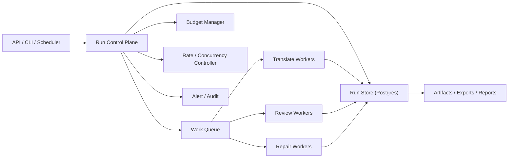

# 长任务运行控制方案

## 1. 为什么这份文档必须独立存在

对我们这个项目来说，“长任务运行控制”不是运维附属能力，而是核心系统能力。

原因很直接：

- 一本真实 EPUB 可能有上千个 packet，整本 live rerun 是小时级任务，不是一次 HTTP 请求的长度。
- 外部 LLM provider 的延迟、限流、偶发格式漂移、坏引用、网络抖动，都会在长任务中放大。
- 人工会中断任务、恢复任务、重跑局部、切换 provider、更新术语、触发 targeted rebuild。
- 我们的目标不是“跑完就行”，而是“能持续跑、能停、能恢复、能证明、能控成本、能把错误限制在局部”。

在这种任务类型里，最危险的做法不是模型不够强，而是把整本书的执行生命期交给一个临时进程、一个长上下文、或者一条不可恢复的串行脚本。

从顶尖业界 AI Agent 工程实践看，长任务的最佳控制思路不是“更聪明的 agent 自己想办法”，而是：

- 用显式状态机管理执行生命期
- 用 durable execution 管理长时任务
- 用 artifact/checkpoint 管理恢复点
- 用预算、速率和错误预算管理外部依赖
- 用细粒度 work unit 管理并发和重试

这份文档的目标，就是把这套原则落到我们当前的真实书籍翻译场景里。

## 2. 设计目标

### 2.1 必须达到的目标

1. 任务可恢复  
任何时候进程退出、手动中断、宿主机重启、provider 异常，都不应该导致整本书从零开始。

2. 任务可控  
必须支持 `pause / resume / cancel / reprioritize / retry / targeted rebuild / force export review` 等控制动作。

3. 任务可观察  
必须知道任务现在卡在哪、已经花了多少钱、成功率如何、还剩多久、失败集中在哪一层。

4. 错误可局部化  
任何一次失败都应尽量被限制在 `packet / chapter / export / repair loop` 这一级，不扩大成整书返工。

5. 成本可预算  
必须支持 token、延迟、并发、时间、错误预算，不允许 live run 无边界烧钱。

6. 执行可审计  
必须记录谁启动的任务、谁暂停的、谁改了 owner、哪次自动修复被执行、哪次任务因什么停止。

### 2.2 明确不是目标的东西

- 不追求“一个超大 agent 自己管理全部运行控制”
- 不追求第一版就上最重的分布式调度系统
- 不追求“整本书一次提交，后台慢慢自己跑完”的黑箱体验
- 不把“长任务控制”简化成 `while true: retry`

## 3. 我们场景下的最佳总体方案

### 3.1 推荐结论

对本项目当前阶段，最佳方案不是直接上一个“全新复杂调度平台”，也不是继续把长跑逻辑塞在 CLI 脚本里。

最佳路线是：

`现有 Postgres / SQLAlchemy 状态机 + 显式 Run Control Plane + DB-backed durable queue + worker lease/heartbeat + budget guardrails`

更具体地说：

- 继续保留当前已存在的文档对象、artifact、workflow service 和 export/review/rerun 语义
- 新增一层专门的 `Run Control Plane`
- 把“长任务怎么运行”从业务逻辑里剥离出来，变成独立的控制语义
- 让 worker 只负责执行 work unit，不负责决定整本书怎么调度

### 3.2 为什么这是当前最佳解

相比“继续强化脚本 runner”，这个方案更稳：

- 任务状态进入数据库，而不是只活在进程内存和 JSON 报告里
- 能做 lease、heartbeat、抢占恢复、暂停和预算熔断
- 能让多个 worker 共享统一控制语义

相比“立刻迁移到 Temporal/Cadence 一类工作流引擎”，这个方案更务实：

- 我们当前已有大量状态和 artifact 已经围绕现有数据库模型形成
- 立刻切到全新 durable workflow 平台，改造面过大、返工高
- 当前最先要解决的是“把真实长跑控制住”，不是“引入最重基础设施”

### 3.3 长期目标

长期如果满足以下条件，可以再考虑升到 Temporal-style durable workflow：

- 多本书并行跑成为常态
- 需要跨机器自动恢复和抢占
- repair/export/review loop 变得更复杂
- 需要更强的 workflow replay / signal / activity timeout 能力

也就是说：

- 当前最佳方案：`DB-backed durable control plane`
- 未来演进目标：`workflow engine-backed durable orchestration`

## 4. 运行控制的核心原则

### 4.1 业务 artifact 和运行控制必须分层

业务层对象：

- `document`
- `chapter`
- `packet`
- `translation_run`
- `review_issue`
- `export`
- `memory_snapshot`

运行控制对象：

- `document_run`
- `run_stage`
- `work_item`
- `worker_lease`
- `heartbeat`
- `run_budget`
- `run_stop_event`
- `run_alert`

不能把这两类东西混在一起。

原因：

- 业务对象描述“这本书现在是什么状态”
- 运行控制对象描述“这次长任务现在怎么跑”

如果混在一起，就无法同时支持：

- 同一份书的多次运行
- 失败后恢复
- 历史 run 对比
- 不同运行模式之间切换

### 4.2 Work Unit 必须足够小

对我们这个项目，推荐的执行粒度是：

- 任务级：`DocumentRun`
- 调度级：`ChapterRun`
- 执行级：`PacketWorkItem`
- 修复级：`RepairWorkItem`
- 导出级：`ExportWorkItem`

不推荐把整章甚至整本书当成最小执行单位。

当前最佳粒度建议：

- `bootstrap`：document 级
- `translate`：packet 级
- `review`：chapter 级
- `rebuild/realign`：packet 或 chapter 级
- `export`：chapter 或 document 级

### 4.3 所有外部返回值都视为不可信

这不是安全口号，而是已经被我们真实运行验证过的工程事实。

必须默认：

- provider 会返回坏 sentence ID
- provider 会返回坏 temp ID
- provider 会返回 schema-compatible 但语义错误的 payload
- provider 会超时、断流、429、半成功

所以运行控制层必须把 provider 视为“不稳定但可恢复”的依赖，而不是“正确率足够高可以信任”的内核。

## 5. 推荐运行时架构

### 5.1 Run Control Plane 职责

这是整个方案的核心。

它负责：

- 创建 run
- 切 stage
- 拆 work item
- 派发和重试
- 维护 lease/heartbeat
- 预算控制
- 停止/暂停/恢复
- 失败升级
- 生成 ops 视图

它不负责：

- 具体翻译
- 具体审校
- 具体对齐修复

### 5.2 Worker 职责

worker 只做两件事：

- 领取 work item
- 执行后回写结果和心跳

worker 不应该：

- 自己决定重跑全书
- 自己调高并发
- 自己选择跳过失败 packet
- 自己持有整本书的运行控制状态

## 6. 必要的运行控制对象

### 6.1 DocumentRun

描述一次整书运行。

建议字段：

- `run_id`
- `document_id`
- `run_type`
  - `bootstrap`
  - `translate_full`
  - `translate_targeted`
  - `review_full`
  - `export_full`
- `requested_by`
- `backend`
- `model_name`
- `priority`
- `status`
  - `queued / running / paused / draining / succeeded / failed / canceled`
- `started_at / updated_at / finished_at`
- `resume_from_run_id`
- `budget_profile_id`
- `stop_reason`

### 6.2 WorkItem

描述一个可调度的原子任务。

建议字段：

- `work_item_id`
- `run_id`
- `stage`
  - `bootstrap / translate / review / repair / export`
- `scope_type`
  - `document / chapter / packet / issue_action`
- `scope_id`
- `attempt`
- `status`
  - `pending / leased / running / succeeded / retryable_failed / terminal_failed / canceled`
- `priority`
- `lease_owner`
- `lease_expires_at`
- `last_heartbeat_at`
- `input_version_bundle`
- `output_artifact_refs`
- `error_class`
- `error_detail`

### 6.3 RunBudget

这是长任务控制里最容易被忽略，但对真实 live run 最关键的对象。

建议字段：

- `max_wall_clock_seconds`
- `max_total_cost_usd`
- `max_total_token_in`
- `max_total_token_out`
- `max_retry_count_per_work_item`
- `max_consecutive_failures`
- `max_parallel_workers`
- `max_parallel_requests_per_provider`
- `max_auto_followup_attempts`

### 6.4 WorkerLease

必须有 lease，而不是只靠“某个 worker 说自己在跑”。

用途：

- worker crash 后自动回收 work item
- 防止一个 item 被多个 worker 长时间重复执行
- 支持 pause/drain 时等待 in-flight item 安全收口

## 7. 推荐状态机

### 7.1 Run 级状态机

`queued -> running -> draining -> succeeded`

`queued -> running -> paused -> running`

`queued -> running -> failed`

`queued -> running -> canceled`

说明：

- `paused`：不再发新 work item，但保留已完成结果
- `draining`：不再发新 item，等待已 leased item 自然结束
- `failed`：预算、错误率或人工策略决定整次 run 停止

### 7.2 Work Item 级状态机

`pending -> leased -> running -> succeeded`

`pending -> leased -> running -> retryable_failed -> pending`

`pending -> leased -> running -> terminal_failed`

`pending -> canceled`

### 7.3 关键原则

- `retryable_failed` 必须显式存在
- `terminal_failed` 必须显式存在
- 不能把所有失败都压成 `failed`

因为长任务控制最重要的是区分：

- “这次可以再试”
- “这次不该再试，应升级”

## 8. 调度与并发控制

### 8.1 层级调度

推荐调度顺序：

1. 先按 `document run`
2. 再按 `chapter`
3. 再按 `packet`
4. 特殊修复 work item 插队

### 8.2 并发控制不是固定值

不能把 `parallel_workers=4` 当成永恒真理。

应该引入动态并发控制器，依据这些信号调节：

- 最近 5 分钟成功率
- 最近 5 分钟 429 比例
- 平均 latency
- 平均 response size
- 当前成本斜率
- 当前错误预算消耗

建议策略：

- 默认并发有上限
- 成功率高、429 低、latency 稳定时缓慢上调
- 出现 429、网络错误、坏引用激增时快速下调

### 8.3 Provider lane

不同 backend/provider 要独立限流。

原因：

- 一个 provider 出问题，不能拖垮整个控制面
- 后续混跑多个 provider 时，需要 lane 级预算和熔断

### 8.4 优先级队列

建议至少三档：

- `interactive`
  - 人工触发的 targeted rebuild / export fix
- `standard`
  - 常规全书 live rerun
- `background`
  - 长时间补跑、低优先级审校批

原则：

- repair work item 可以在 document run 内部抢占低优先级 translate item
- export gate 修复优先级应高于普通长跑包

## 9. Checkpoint 与恢复策略

### 9.1 Checkpoint 应落在哪

最关键的 checkpoint：

- bootstrap 完成后
- 每个 translate batch 完成后
- 每个 packet 完成后
- 每个 review chapter 完成后
- 每次 repair loop 完成后
- 每次 export 完成后

### 9.2 恢复原则

恢复时只重发：

- `pending`
- `retryable_failed`
- lease 过期的 `running`

恢复时不应重发：

- 已 `succeeded`
- 已 `terminal_failed` 且未人工 reopen

### 9.3 Resume 不是“再跑一遍”

最佳恢复逻辑应该是：

- 重建 run control state
- 重扫 work item 状态
- 回收过期 lease
- 重新派发剩余 item
- 保持已完成 artifact 不动

## 10. Retry、熔断与降级

### 10.1 错误分层

必须至少区分：

1. 网络错误
2. 429 / provider 限流
3. 5xx / provider 服务错误
4. schema 解析错误
5. provider 返回坏引用
6. 数据库暂时冲突
7. 数据模型不一致
8. 预算超限

### 10.2 对应动作

- 网络错误：短退避重试
- 429：指数退避 + 并发下调
- 5xx：有限重试 + provider lane 健康分降级
- schema 解析错误：有限重试，必要时切备用 prompt/profile
- 坏引用：记录 raw payload、降级过滤、后续 QA 抓缺失对齐
- DB 暂冲：短退避重试
- 数据模型不一致：直接 terminal + 升级
- 预算超限：run 进入 `paused` 或 `failed_budget_exceeded`

### 10.3 熔断器

建议至少三类熔断：

- provider 熔断
- run 熔断
- chapter 熔断

例子：

- 某 provider 5 分钟内连续高比例 429 -> provider lane 熔断
- 某次 run 连续 50 个 packet 出现 schema/引用问题 -> run 暂停，等待人工检查
- 某章持续触发 `CONTEXT_FAILURE` -> chapter 熔断并切入 targeted rebuild

## 11. 长任务的人机控制面

### 11.1 必须支持的操作

- `pause run`
- `resume run`
- `cancel run`
- `drain run`
- `retry failed items`
- `requeue chapter`
- `rebuild chapter brief`
- `realign packet`
- `switch provider lane`
- `reduce concurrency`

### 11.2 UI / API 返回的不是“跑没跑完”

必须返回：

- 当前 stage
- 已完成 work item 数
- 待处理数
- 当前 in-flight 数
- 当前 cost / token / latency
- 预算剩余
- 最近错误族
- 是否正在熔断
- 是否需要人工介入

### 11.3 Owner-ready

我们的 chapter worklist 已经走到 owner/assignment 这层，所以长任务控制必须跟它打通：

- run 的错误不只是写日志
- 要能直接映射成 chapter 压力、owner-ready 和 SLA 风险

## 12. 观测指标体系

### 12.1 Run 级

- `run_status`
- `run_elapsed_seconds`
- `estimated_remaining_seconds`
- `estimated_finish_at`
- `completed_work_item_count`
- `inflight_work_item_count`
- `retryable_failed_count`
- `terminal_failed_count`

### 12.2 Provider 级

- `requests_per_minute`
- `success_rate`
- `429_rate`
- `5xx_rate`
- `avg_latency_ms`
- `p95_latency_ms`
- `token_in/out rate`
- `cost_usd rate`

### 12.3 质量/修复级

- `review_issue_created_rate`
- `review_issue_resolved_rate`
- `auto_followup_success_rate`
- `realign_success_rate`
- `rebuild_success_rate`
- `flapping_issue_rate`

### 12.4 章节执行级

- `chapter_queue_pressure`
- `chapter_sla_breached_count`
- `owner_workload`
- `owner_blocking_pressure`

## 13. 针对我们项目的最佳落地方案

### 13.1 现在就该做的

1. 新增 `DocumentRun / WorkItem / WorkerLease / RunBudget / RunAuditEvent` 数据模型  
让长任务控制从脚本内存态变成数据库一等对象。

2. 把 `run_real_book_live.py` 降级成 Run Control Plane 的薄入口  
CLI 只负责“发起 run / 查询 run / 暂停 run / 恢复 run”，不再承担主要调度逻辑。

3. 新增 heartbeat / lease reclaim  
当前我们已有 per-packet commit，但还缺 lease/heartbeat 语义。

4. 新增预算控制器  
先把 `wall clock / cost / retry / concurrency / provider lane` 这几个预算控住。

5. 新增 run dashboard / run events API  
让真实长跑能被看见，而不是只看 JSON 报告文件。

### 13.2 近期不该做的

- 不要急着把所有工作流迁到全新 orchestration engine
- 不要急着做“自由对话式 meta-agent 调度器”
- 不要在没有 lease 的情况下简单把并发继续往上拧
- 不要继续把 provider 返回的 ID 当可信输入

### 13.3 推荐的三阶段实施

#### Phase A：控制平面最小闭环

- `DocumentRun / WorkItem / WorkerLease`
- `pause/resume/cancel/drain`
- heartbeat + reclaim
- run summary API

#### Phase B：预算与熔断

- provider lane
- 动态并发
- budget guardrails
- error budget
- circuit breaker

#### Phase C：长任务产品化

- ops dashboard
- run alerts
- run timeline
- chapter pressure 与 run 控制联动
- 需要时再评估迁移 durable workflow engine

### 13.4 当前实现状态（2026-03-15）

- Phase A 已完成：
  - `document_run / work_item / worker_lease / run_budget / run_audit_event` 已 durable 化
  - `/v1/runs` 已支持 `create / summary / events / pause / resume / drain / cancel`
  - translate lane 已具备 `claim / start / heartbeat / release / expiry reclaim / terminal reconcile`
- Phase B 已完成核心 guardrails：
  - `wall-clock / total cost / token in / token out / consecutive failures`
  - 真实 runner 已能在 guardrail 命中时 pause/fail，并保留 resumable run state
- `run_real_book_live.py` 已降级成 Run Control Plane 的薄入口：
  - 支持 `run_id` 恢复
  - 支持 Ctrl-C 优雅暂停
  - 支持 per-work-item lease / heartbeat
  - 支持持续写回 run-level progress report
- 当前仍保留为后续增强项的部分：
  - provider lane caps
  - circuit breaker
  - adaptive concurrency
  - run alerts / timeline 的独立 ops 面

## 14. 与当前项目问题的直接映射

### 问题 1：长时间真实请求被 Ctrl-C 中断

对策：

- run control state 入库
- `paused / interrupted / resumable`
- CLI 只作为控制入口，不持有唯一状态

### 问题 2：整本书单线程 5h+

对策：

- packet 级 work item
- 动态并发
- provider lane 限流
- 成本/吞吐预算

### 问题 3：并发下 SQLite 外键顺序问题

对策：

- 父先子后持久化
- lease 控制
- per-item commit
- 运行控制层统一恢复/重试

### 问题 4：provider 返回坏 sentence ID

对策：

- 句别名协议
- 持久化前过滤
- raw payload 审计
- 让错误降级成 QA 缺失，而不是运行时崩溃

### 问题 5：export auto-followup 已经开始形成循环

对策：

- repair loop 也必须纳入 run control
- 统一 attempt 上限
- 统一 stop reason
- 统一 audit trail

## 15. 验收标准

这套方案落地后，至少应满足：

1. 人工中断后可恢复，不会丢已完成 packet
2. 单 provider 出问题时，run 可 pause/drain，而不是直接黑箱失败
3. 任何 work item 都可追踪到 lease、attempt、心跳、失败原因
4. 任何 run 都能看到实时成本、吞吐、剩余时间估算
5. 导出、review、repair 都能被纳入同一控制语义
6. 真实整书长跑不再依赖单个脚本进程的生命期

## 16. 推荐结论

站在顶尖 AI Agent 工程实践的角度，对我们这个项目最优的长任务运行控制方案不是“把 agent 做得更聪明”，而是：

`把长任务变成一套有状态、有预算、有租约、有检查点、有审计、有恢复能力的 durable execution system`

并且在当前阶段，最佳落地路径不是直接上最重平台，而是：

`以现有 Postgres/状态机为基底，先补 Run Control Plane，再逐步把 live rerun、repair loop、export loop 全部纳入统一控制面。`

这才是最符合我们真实任务形态、最能避免返工、也最能支撑整本书稳定翻译的方案。

## 参考

- [OpenAI Background mode guide](https://platform.openai.com/docs/guides/background)
- [OpenAI evaluation best practices](https://platform.openai.com/docs/guides/evals)
- [Anthropic multi-agent engineering system](https://www.anthropic.com/engineering/multi-agent-research-system)
- [Temporal durable execution overview](https://docs.temporal.io/workflow-execution)
