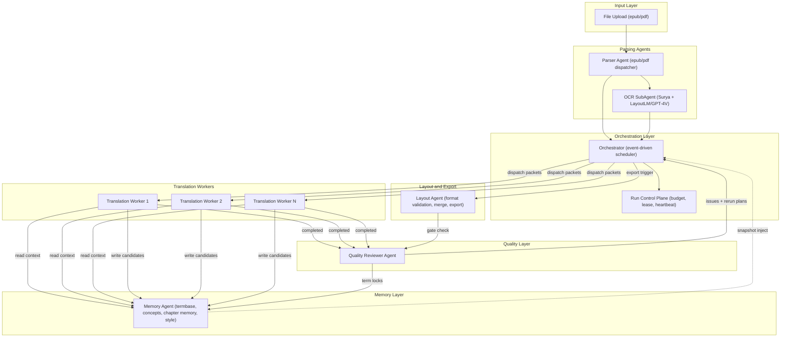

# Multi-Agent Translation System Architecture Design

Last Updated: 2026-03-21
Status: reference-supplement
Role: Detailed technical depth supplement to `multi-agent-final-implementation-plan.md`

Related docs:

- [multi-agent-final-implementation-plan.md](multi-agent-final-implementation-plan.md) (locked Phase 1 scope)
- [multi-agent-translation-product-review.md](multi-agent-translation-product-review.md) (product review)
- [translation-agent-system-design.md](translation-agent-system-design.md)
- [orchestrator-state-machine.md](orchestrator-state-machine.md)

## 1. System Overview

### 1.1 Current State Assessment

The codebase already has a complete pipeline: bootstrap → parse → segment → packet build → translate → review → rerun → export. It includes chapter-level concurrency (ADR-012), work item lease/heartbeat/reclaim, Memory Service, Quality Reviewer with issue routing, and multi-format support (EPUB, text PDF, mixed PDF, scanned PDF via Surya OCR).

The upgrade is not a rewrite. It is an incremental evolution along three axes:

1. **OCR/Layout Recovery independence and enhancement** — Surya OCR is subprocess-only; PDF structure recognition is limited
2. **Orchestrator event-driven upgrade** — `DocumentRunExecutor` is still thread-model
3. **Memory Agent active governance** — `MemoryService` is read-only compilation, no conflict resolution

### 1.2 Design Flaws in Initial Proposal

**Flaw 1: Missing Parser Agent as independent agent.** EPUB and PDF parsing are fundamentally different (`EPUBParser` vs `PDFParser`/`OcrPdfParser`). A unified Parser Agent should dispatch, with OCR as its subagent.

**Flaw 2: Quality Reviewer "direct optimization" path breaks provenance.** Reviewer bypassing Orchestrator state tracking and memory snapshot binding causes provenance rupture. The existing `ReviewService` deliberately does not translate — this is correct.

**Flaw 3: Missing Style Profile management.** Terminology is only part of memory. The codebase already has `style_drift` rules, `literalism_guardrails`, `paragraph_intent`, `discourse_bridge` — these are style-layer control signals. Memory Agent must manage both terminology and style profile.

**Flaw 4: Layout Agent scope too narrow.** "Verify final merged output formatting" is only terminal validation. Format fidelity spans the full pipeline — from parse-stage structure recovery, to translation-stage format marker protection, to export-stage format reconstruction.

### 1.3 Agent Topology



### 1.4 Agent Responsibility Boundaries

| Agent | Input | Output | Not Responsible For |
|-------|-------|--------|---------------------|
| **Parser Agent** | epub/pdf file | `ParsedDocument` + Markdown IR | Translation, term extraction |
| **OCR SubAgent** | scanned/mixed PDF pages | Structured page regions | Translation, semantic understanding |
| **Orchestrator** | Event stream + run budget | Work item scheduling, state transitions, rerun triggers | Direct translation, direct review |
| **Memory Agent** | Term candidates, concept updates, chapter memory writes | Consistent termbase, concept registry, compiled context | Translation decisions, quality judgment |
| **Translation Worker** | `TranslationTask` (context packet + sentences) | `TranslationWorkerResult` (target segments + alignment + flags) | Term locking, global consistency |
| **Quality Reviewer** | Chapter translation results + termbase snapshot | `ReviewArtifacts` (issues + actions + rerun plans + summary) | Re-translation (only judges and routes) |
| **Layout Agent** | Merged chapter results + export config | Validation results + final Markdown/HTML/epub/PDF | Translation, review |

## 2. OCR/Format Recognition Module Design

### 2.1 PDF vs EPUB Parsing Strategies

**EPUB strategy (keep current path, incremental enhancement):**

`EPUBParser` already correctly unpacks spine, reads manifest/nav_map, recovers chapter/block structure. EPUB is a structured source; the core principle remains: **preserve structure nodes first, translation happens above structure.**

Incremental improvements:

- Image handling: current `_finalize_active_block()` uses `[Image]` placeholder for `image_src` but does not extract actual image binary. Upgrade should extract images as independent assets, generating `` Markdown references.
- Table handling: HTML tables in EPUB should convert directly to Markdown table format rather than being stored as `block_type="table"` plain text.

**PDF strategy (structural upgrade):**

Current three paths:

- `PDFParser` (text PDF): pdfplumber/PyMuPDF text extraction
- `OcrPdfParser` (mixed/scan PDF): Surya OCR subprocess

Upgrade: introduce two-stage pipeline.

**Stage 1: Physical Layout Analysis**

- Input: PDF page (rasterized to image)
- Output: page region annotations (text region, image region, table region, formula region, header/footer region, page number region)
- Technology selection: see §2.3

**Stage 2: Region-Level Content Extraction**

- text region → text extraction + reading order recovery
- image region → image cropping + asset storage
- table region → table structure recognition → Markdown table
- formula region → LaTeX extraction or protection marker
- header/footer/page number → mark as non-translatable

### 2.2 Precise Image Region Cropping

**Option A: Semantic segmentation via Layout Analysis model**

Use LayoutLMv3 or DiT (Document Image Transformer) for pixel-level semantic segmentation per page, outputting bounding box + class label.

- Pros: end-to-end single pass; high boundary precision for mixed-layout documents (images surrounded by text)
- Cons: requires GPU inference; large model (~400MB); needs fine-tuning to cover academic paper figure/subfigure layouts
- Accuracy: mAP ~95% on PubLayNet, but may degrade 10-15% on custom paper formats

**Option B: Rule-based pre-extraction + Vision LLM refinement**

First use PyMuPDF `page.get_images()` to extract embedded image objects' native bounding boxes; then use GPT-4V/Claude Vision to validate "image region ± extended margin": confirm whether the bounding box includes text that does not belong to the image.

- Pros: PyMuPDF extraction is fast (millisecond-level); Vision LLM validation only triggers on ambiguous boundaries (cost-controlled)
- Cons: PyMuPDF has incomplete coverage of vector graphics within figures (e.g., matplotlib-generated charts); Vision LLM adds latency
- Accuracy: near 100% for embedded bitmap images; may need fallback to Option A for vector figures

**Recommendation: Option B as default, Option A as fallback.**

Rationale: The current Surya OCR subprocess model already demonstrates that "heavy model full-page inference" has unacceptable latency (evidenced by `heartbeat_interval_seconds` design for controlling long OCR liveness). Option B's two-step approach aligns with the existing "rules first, model supplements" architecture (ADR-004 spirit). For academic papers where PyMuPDF cannot correctly extract vector figures, fall back to LayoutLMv3.

### 2.3 Document Structure Recognition Technology Selection

| Dimension | LayoutLMv3 | GPT-4V / Claude Vision | Surya (current) | DocTR |
|-----------|-----------|----------------------|-----------------|-------|
| **Deployment** | Local GPU inference | API call | Local subprocess | Local CPU/GPU |
| **Structure accuracy** | High (PubLayNet mAP ~95%) | High but unstable (prompt-dependent) | Medium (primarily OCR, no layout) | Medium-high (OCR + basic layout) |
| **Latency/page** | ~200ms (GPU) / ~2s (CPU) | ~3-5s (API RTT) | ~1-3s (Surya subprocess) | ~500ms (GPU) |
| **Cost/page** | Fixed (GPU infra) | ~$0.01-0.03 (token cost) | Fixed | Fixed |
| **Table recognition** | Needs additional model | Can be done in same request | Not supported | Basic |
| **Custom fine-tune** | Supported | Not supported | Not supported | Limited |

**Recommendation:**

- **Default path: LayoutLMv3 local inference for layout analysis.** Rationale: the product batch-processes books/papers with second-level latency tolerance, but high cost sensitivity. A 300-page book calling GPT-4V per page just for layout would cost $3-9. LayoutLMv3 has near-zero marginal cost after deployment.
- **Surya retained for OCR text extraction.** Layout analysis and OCR are different tasks: LayoutLMv3 identifies "this region is text"; Surya converts the region image to text.
- **GPT-4V as high-complexity fallback.** When LayoutLMv3 confidence on a page falls below threshold (e.g., complex multi-column layout), trigger GPT-4V for structure verification.

### 2.4 Output Intermediate Format: Markdown Schema Design

**Recommendation: Markdown replaces JSON as translation intermediate format.** Rationale detailed in §8.1.

```markdown
---
document_id: "doc_xxx"
chapter_id: "ch_01"
chapter_ordinal: 1
title_src: "Introduction to Transformer Architecture"
parse_confidence: 0.95
source_type: "pdf_text"
---

# Introduction to Transformer Architecture

<!-- block:blk_001 type:paragraph translatable:true -->
The Transformer architecture, introduced by Vaswani et al. (2017),
fundamentally changed the landscape of natural language processing.
Unlike recurrent neural networks, Transformers process all positions
in parallel through self-attention mechanisms.
<!-- /block:blk_001 -->

<!-- block:blk_002 type:image translatable:false -->

<!-- caption:blk_002c translatable:true -->
Figure 1: The overall architecture of the Transformer model,
showing the encoder (left) and decoder (right) stacks.
<!-- /caption -->
<!-- /block:blk_002 -->

<!-- block:blk_003 type:table translatable:true -->
| Component | Parameters | BLEU Score |
|-----------|-----------|------------|
| Base Model | 65M | 27.3 |
| Big Model | 213M | 28.4 |
<!-- /block:blk_003 -->

<!-- block:blk_004 type:code translatable:false -->
    class MultiHeadAttention(nn.Module):
        def __init__(self, d_model, num_heads):
            super().__init__()
<!-- /block:blk_004 -->

<!-- block:blk_005 type:formula translatable:false -->
$$\text{Attention}(Q, K, V) = \text{softmax}\left(\frac{QK^T}{\sqrt{d_k}}\right)V$$
<!-- /block:blk_005 -->

<!-- block:blk_006 type:footnote translatable:true ref:blk_001 -->
[^1]: Vaswani, A., et al. "Attention is all you need." NeurIPS 2017.
<!-- /block:blk_006 -->
```

Design principles:

- HTML comments as block metadata carrier, does not interfere with Markdown rendering
- `translatable` flag determines whether translation worker processes the block
- Images, code, formulas default to `translatable:false`; captions and tables are `translatable:true`
- Footnotes linked to source block via `ref`
- YAML frontmatter carries chapter-level metadata

### 2.5 Text Chunking Strategy

The current system already has mature packet building logic. Upgrade points:

| Parameter | Current Value | Recommended | Rationale |
|-----------|--------------|-------------|-----------|
| **Base granularity** | packet = paragraph group | Keep unchanged | Paragraphs are translation semantic units, consistent with `paragraph-led` prompt layout |
| **Chunk target size** | Dynamic by packet builder | 500-800 chars (English) | Lower half of 500-1000 range because translation needs finer granularity than retrieval |
| **Overlap window** | `prev_blocks` + `next_blocks` | Keep prev/next 1-2 blocks (~10-15%) | `ContextPacket` already has `prev_blocks` and `next_blocks` — this is the overlap window |
| **Cross-page handling** | PDF parser internal concatenation | Add explicit cross-page marker | Use `<!-- page_break:42-43 -->` in Markdown IR for Layout Agent to verify |

**Do not change:** Packets do not cross chapters (RFC-002 hard rule); paragraphs as translation window with sentences as alignment granularity (system design §6) — these are correct and should not change due to Markdown intermediate format introduction.

## 3. Orchestrator Design

### 3.1 Task Decomposition Strategy

Current `DocumentRunExecutor` decomposes at **packet** granularity (`seed_translate_work_items` generates work items by `packet_ids`). This granularity is correct.

Layered decomposition:

```
Document
  └─ Chapter (concurrency isolation boundary)
       └─ Packet (scheduling atomic unit, contains 1-3 paragraphs)
            └─ Sentence (alignment and tracking granularity)
```

**No finer decomposition needed.** Rationale: the translation prompt requires paragraph-level semantic coherence (`paragraph-led` layout). Splitting to sentence-level scheduling would break context.

**New decomposition dimension needed:** In review stage, current `ReviewService` processes an entire chapter at once. For large chapters (>20 packets), add **review batch** concept — every 5-8 packets as one review work item, reducing single-review context load.

### 3.2 Task State Machine

The existing `orchestrator-state-machine.md` defines complete document/chapter/sentence/packet/job state machines. The core state machine does not change for Multi-Agent. Addition needed: **agent-level lease state**:

```
Work Item States (upgraded):

                            ┌──────────────┐
                            │   pending     │
                            └──────┬───────┘
                                   │ claim (agent lease)
                            ┌──────▼───────┐
                  ┌─────────│   leased      │──────────┐
                  │         └──────┬───────┘          │
                  │ lease_expired   │ agent_complete    │ agent_fail
           ┌──────▼───────┐  ┌─────▼────────┐  ┌─────▼────────┐
           │ reclaim_queue │  │  completed    │  │   failed      │
           └──────┬───────┘  └──────────────┘  └──────┬───────┘
                  │                                    │ retry?
                  │         ┌──────────────┐          │
                  └─────────►   pending     ◄─────────┘
                            └──────────────┘
```

This is consistent with existing `claim_work_item` / `reclaim_expired_leases` logic (ADR-013), generalized from "worker thread" to "agent instance".

### 3.3 Failure Retry Strategy

| Stage | Max Auto Retry | Backoff Strategy | Manual Escalation Condition |
|-------|---------------|-----------------|----------------------------|
| parse | 1 | None (deterministic failure not worth retrying) | parse confidence < 0.5 → mark `failed`, await manual confirmation |
| translate | 3 | Exponential 2s → 4s → 8s | Same packet has `blocking_issue_count > 0` 3 consecutive times → escalate to manual |
| review | 1 | None | Review itself fails → skip review, mark `review_required` |
| rerun | 2 | Linear 5s → 10s | Same issue's rerun exceeds 2 rounds unresolved → mark `stubborn_blocker` |
| export | 2 | None | Consecutive failures → degrade to review package export |

**Mapping to existing logic:** `max_retry_count_per_work_item: 3` (from `run_real_book_live.py` parameters) is the translate stage cap; `max_consecutive_failures: 25` is the global safety valve. Both levels retained.

### 3.4 Concurrency Control

**Current strategy (ADR-012) is correct: parallel across chapters, serial within chapters.**

Upgraded concurrency parameters:

| Parameter | Default | Rationale |
|-----------|---------|-----------|
| `max_parallel_chapters` | `min(4, chapter_count)` | 4 parallel chapters saturates API throughput; more would worsen term inconsistency |
| `max_parallel_translate_per_chapter` | 1 | Intra-chapter serialization guarantees chapter memory causal consistency |
| `max_parallel_review` | 2 | Review does not depend on chapter memory write order |

**Terminology inconsistency mitigation (not the scheduler's responsibility):**

- Pre-translation: Memory Agent injects current termbase snapshot before packet dispatch
- Post-translation: Quality Reviewer detects `TERM_CONFLICT`
- Fix: Orchestrator triggers `UPDATE_TERMBASE_THEN_RERUN_TARGETED`

This matches the existing `TERM_CONFLICT → rerun` loop. Concurrency scheduling does not need extra locking for terminology consistency — **terminology consistency is review/rerun's responsibility, not the scheduler's.**

## 4. Memory Agent Design

### 4.1 Storage Content

Currently managed by `MemoryService`:

| Data Category | Current Implementation | Upgrade Direction |
|--------------|----------------------|-------------------|
| **Chapter Translation Memory** | `ChapterTranslationMemoryRepository` | Keep |
| **Termbase** | `term_entries` table + `relevant_terms` in packet | Add book-level term conflict detection |
| **Chapter Concepts** | `chapter_concepts` in `ContextPacket` | Add cross-chapter concept propagation |
| **Style Constraints** | `style_constraints` dict in packet | Upgrade to independent `StyleProfile` entity |
| **Prev Translated Blocks** | `prev_translated_blocks` in packet | Keep |

**New additions needed:**

- **Translation Style Decisions**: record style decisions made during translation (e.g., "in this book, 'leverage' is uniformly translated as '利用' not '杠杆化'") as soft constraints for subsequent packets
- **Cross-Chapter Term Propagation Log**: when chapter N locks a new term, record which already-translated chapters 1..N-1 may need retroactive checking

### 4.2 Data Structure Design

```python
@dataclass
class MemoryAgentState:
    # Book-level
    global_termbase: dict[str, TermEntry]           # source_term -> locked/preferred/suggested
    entity_registry: dict[str, EntityEntry]          # entity_name -> canonical_zh + type
    book_style_profile: BookStyleProfile             # material, tone, register decisions

    # Chapter-level
    chapter_memories: dict[str, ChapterMemorySnapshot]  # chapter_id -> snapshot
    chapter_concepts: dict[str, list[ConceptEntry]]     # chapter_id -> concepts
    chapter_briefs: dict[str, str]                      # chapter_id -> brief text

    # Local-level (written after packet translation)
    recent_translations: deque[TranslationRecord]    # most recent N packet translation records
    pending_term_candidates: list[TermCandidate]     # worker-proposed but unlocked candidates

@dataclass
class TermEntry:
    source_term: str
    target_term: str
    lock_level: Literal["locked", "preferred", "suggested"]
    locked_by: Literal["reviewer", "human", "auto"]
    chapter_first_seen: str
    usage_count: int
    conflict_history: list[TermConflictEvent]

@dataclass
class TermCandidate:
    source_term: str
    proposed_target: str
    proposed_by_worker: str
    packet_id: str
    confidence: float
    context_excerpt: str  # for reviewer judgment
```

### 4.3 Read/Write Protocol

**Read timing (Worker → Memory Agent):**

Before Orchestrator dispatches packet to Worker, request compiled context from Memory Agent. This matches the existing `MemoryService.load_compiled_context()` flow. Upgrade: Memory Agent does a **snapshot freeze** on return — ensuring the termbase version used by the worker does not drift due to concurrent writes from other chapters.

**Write timing (Worker → Memory Agent):**

After translation completion, Worker **does not directly write** to termbase or concept registry. Instead, it submits `TermCandidate` and `ConceptCandidate` to Memory Agent's **pending queue**.

Reason: ADR-004 already decided "only Reviewer or human can promote terms to locked". Workers can only propose, not lock.

**Write timing (Reviewer → Memory Agent):**

After review, if Reviewer's `IssueAction` includes `UPDATE_TERMBASE_THEN_RERUN_TARGETED`, Orchestrator calls Memory Agent's `lock_term()` interface.

**Consistency guarantee:**

- Each compiled context return includes `memory_snapshot_version`
- Worker's `TranslationWorkerResult` must carry `input_memory_snapshot_version`
- If review finds worker used a stale snapshot (other chapters locked new terms during translation), mark as `STALE_MEMORY` issue

### 4.4 Terminology Conflict Resolution

```python
def resolve_term_conflict(
    candidate: TermCandidate,
    existing: TermEntry | None,
) -> TermResolution:
    if existing is None:
        return TermResolution(action="add_as_suggested")

    if existing.lock_level == "locked":
        if candidate.proposed_target == existing.target_term:
            return TermResolution(action="noop")  # consistent
        else:
            return TermResolution(
                action="create_conflict_issue",
                issue_type="TERM_CONFLICT",
                evidence=(
                    f"Worker proposed '{candidate.proposed_target}' "
                    f"but locked term is '{existing.target_term}'"
                ),
            )

    if existing.lock_level == "preferred":
        if (
            candidate.confidence > 0.9
            and candidate.proposed_target != existing.target_term
        ):
            return TermResolution(action="escalate_to_reviewer")
        else:
            return TermResolution(action="noop")  # keep preferred

    # suggested level: auto-promote on high usage
    if (
        existing.usage_count > 5
        and existing.target_term == candidate.proposed_target
    ):
        return TermResolution(action="auto_promote_to_preferred")

    return TermResolution(action="keep_suggested")
```

## 5. Translation Worker Design

### 5.1 Single Worker Translation Flow

The existing `build_translation_prompt_request()` is a mature prompt builder. Keep the current flow, add agent communication layer:

```
1. Worker receives work_item from Orchestrator (packet_id + run_id)
2. Worker requests compiled_context from Memory Agent
   → Memory Agent returns CompiledTranslationContext + snapshot_version
3. Worker builds TranslationPromptRequest
   → calls build_translation_prompt_request(task, ...)
4. Worker calls LLM provider
   → TranslationModelClient.generate_translation(request)
5. Worker parses LLM response
   → produces TranslationWorkerResult
6. Worker submits result to Orchestrator
   → includes target_segments + alignment + low_confidence_flags + usage
7. Worker submits term_candidates to Memory Agent
   → new term candidates extracted during translation
8. Worker releases lease
```

### 5.2 Worker Context Acquisition from Memory Agent

**Current path (retained):**

```python
compiled = memory_service.load_compiled_context(
    packet=context_packet,
    options=compile_options,
    rerun_hints=rerun_hints,
)
```

**Post-upgrade change:**

From synchronous method call to async agent message. But **compiled context structure does not change** — `CompiledTranslationContext` is already a complete packet-level context encapsulation containing terms, entities, concepts, prev_translated_blocks, chapter_brief, section_brief, discourse_bridge.

Only change: Memory Agent does snapshot freeze before returning, guaranteeing termbase immutability during worker translation.

### 5.3 Worker Output Specification

Keep existing `TranslationWorkerResult` schema, add fields:

```python
class TranslationWorkerResult:
    output: TranslationWorkerOutput  # packet_id, target_segments, alignment, flags, notes
    usage: TranslationUsage          # token_in, token_out, latency_ms, cost_usd
    # New fields
    input_memory_snapshot_version: str   # memory version used during translation
    term_candidates: list[TermCandidate] # new term candidates discovered during translation
    style_observations: list[str]        # style observations for reviewer reference
```

## 6. Quality Reviewer Design

### 6.1 Review Dimensions

Currently implemented by `ReviewService`:

| Dimension | Current Implementation | Upgrade Direction |
|-----------|----------------------|-------------------|
| **Coverage** | `coverage_ok` | Keep |
| **Alignment integrity** | `alignment_ok` | Keep |
| **Terminology consistency** | `term_ok` + `TERM_CONFLICT` issue | Add cross-chapter term drift detection |
| **Format integrity** | `format_ok` + `format_pollution_count` | Add Markdown schema validation |
| **Style drift** | `STYLE_DRIFT` rules in `style_drift.py` | Keep (ADR-004 validated) |
| **Semantic accuracy** | Via `low_confidence_flags` indirectly | Add LLM-assisted semantic spot check |
| **Translation naturalness** | `literalism_guardrails` | Keep |

**New dimensions:**

- **Cross-packet coherence**: detect referential discontinuity, tone shifts between adjacent packets
- **Caption/table-ref consistency**: verify that figure/table reference numbers remain correct after translation

### 6.2 Scoring Mechanism and Judgment Criteria

Keep the existing **issue-based judgment model**, do not introduce numeric scoring.

Rationale: ADR-004 explicitly states "QA only produces issues + evidence, not just a score". Issue-based models are auditable, traceable, and routable to specific rerun actions — far superior to a single numeric score.

**Gate judgment rules (keep existing):**

- `blocking_issue_count == 0` → eligible for export
- `blocking_issue_count > 0` → enter repair loop (ADR-014)
- `low_confidence_count > threshold` → mark `review_required`

### 6.3 Two Repair Paths: Comparison and Recommendation

| Dimension | Path A: Mark for rerun → Orchestrator re-dispatches to Worker | Path B: Reviewer directly issues LLM request to fix |
|-----------|------|------|
| **Provenance** | Complete (goes through standard translate pipeline) | Broken (bypasses Memory snapshot binding) |
| **Term consistency** | Worker re-queries latest termbase | Reviewer may use stale termbase |
| **State tracking** | Orchestrator records complete rerun event | Needs supplementary audit trail |
| **Latency** | Higher (queue + re-dispatch) | Lower (direct fix) |
| **Applicable scenario** | Structural problems (term errors, omissions, semantic deviation) | Surface text polishing (minor translation artifacts, punctuation) |

**Recommendation: Path A as default, Path B strictly limited.**

Consistency with existing design: `ReviewService` **deliberately does not translate** — `review.py` only produces issues + actions + rerun_plans, then `RerunService` executes. This is correct.

If Path B is needed (lightweight fix), apply these constraints:

- Only allowed for `Severity.LOW` `STYLE_DRIFT` issues
- Fix results must write to the same `translation_runs` + `target_segments` tables as Path A
- Fix must bind to current `memory_snapshot_version`
- Maximum 2 Path B triggers per chapter per review round

### 6.4 Preventing Reviewer-Worker Infinite Loops

Existing partial protections (`max_auto_followup_attempts`, `auto_followup_attempt_limit`) need systematization:

**Three-layer circuit breaker:**

1. **Packet-level**: same packet's same issue type reruns exceed 2 times unresolved → mark as `stubborn_blocker`, stop auto-rerun, escalate to manual review
2. **Chapter-level**: same chapter's repair loop exceeds 3 rounds (ADR-014 blocker repair loop) → chapter enters `failed` state
3. **Run-level**: global `max_consecutive_failures` reaches limit → run pauses (existing `run_real_book_live.py` parameter, value 25)

**Implementation:**

```python
def should_retry_issue(
    issue: ReviewIssue,
    rerun_history: list[RerunEvent],
) -> bool:
    same_type_reruns = [
        r for r in rerun_history
        if r.issue_type == issue.issue_type
        and r.packet_id == issue.scope_id
    ]
    if len(same_type_reruns) >= 2:
        return False  # mark as stubborn_blocker
    if issue.severity == Severity.LOW and len(same_type_reruns) >= 1:
        return False  # low severity only retries once
    return True
```

## 7. Layout Agent Design

### 7.1 Layout Validation Rules

| Rule Category | Specific Checks |
|--------------|-----------------|
| **Structural completeness** | All source blocks have corresponding target blocks; heading hierarchy levels match |
| **Figure/table references** | `Figure N` / `Table N` numbering unchanged in translation; captions adjacent to images |
| **Formula/code protection** | LaTeX formulas and code blocks not translated or corrupted |
| **Punctuation normalization** | Chinese punctuation (，。；："") replaces English punctuation; nested quotes correct |
| **Markdown structure** | Heading `#` count consistent; table column count matches; list indentation correct |
| **Cross-page elements** | Cross-page paragraphs correctly concatenated (verified via `<!-- page_break -->` markers) |
| **Footnote placement** | Footnotes in translation still correspond to source reference positions |

### 7.2 Cross-Page Elements, Mixed Layout, Formula Handling

**Cross-page elements:** Parser Agent completes cross-page concatenation during parse. Layout Agent only verifies concatenation results: check whether blocks before and after `page_break` markers are semantically coherent (simple sentence-initial capitalization + preceding sentence-final punctuation detection, no LLM needed).

**Mixed image-text layout:** Layout Agent maintains an `asset_registry` — all image asset IDs, original positions (after which block), reference counts. During final merge, verify:

- Every `` reference resolves to an actual asset
- Asset position in final output matches relative position in source document

**Formula rendering:**

- Markdown output: preserve `$$..$$` and `$...$` as-is, delegated to downstream renderer
- PDF output: pre-render via MathJax or KaTeX to SVG, then embed
- EPUB output: preserve MathML or inline SVG

### 7.3 Final Output Formats

| Output Format | Use Case | Implementation Priority |
|--------------|----------|------------------------|
| **Markdown** | Default intermediate + review format | P0 (existing `merged_markdown` export) |
| **Bilingual HTML** | Side-by-side review | P0 (existing `bilingual_html` export) |
| **Chinese HTML** | Final reading | P1 |
| **EPUB** | Book delivery | P1 (requires backfilling into EPUB spine structure) |
| **PDF** | Paper delivery | P2 (requires WeasyPrint or Puppeteer rendering) |

## 8. Key Design Decisions and Tradeoffs

### 8.1 Markdown vs JSON as Intermediate Format

| Dimension | Markdown | JSON (current) |
|-----------|---------|----------------|
| **Format fidelity** | Natively preserves headings, lists, tables, code blocks, formulas | Requires custom schema encoding for each format element |
| **Human readability** | Directly renderable | Requires tooling to parse |
| **LLM friendliness** | LLMs natively understand Markdown | JSON schema needs extra prompt explanation |
| **Metadata carrying** | Requires HTML comments or YAML frontmatter | Natively supports arbitrary nested structures |
| **Precision** | Table alignment, nested lists have ambiguity | Unambiguous |
| **Diff friendliness** | Line-level diffs are readable | Structural changes produce large meaningless diffs |

**Conclusion: Markdown as parse → translate intermediate representation; JSON continues as worker ↔ orchestrator communication format.**

Rationale:

- Translation worker prompts already build "human-readable context" (via `_current_paragraph_lines()` etc.). Markdown makes this more natural.
- But `TranslationWorkerResult` remains JSON (Pydantic schema), because alignment, flags, usage — these structured data need precise schema validation.
- Dual-layer format: **Markdown describes content, JSON describes metadata and state.**

This aligns with the locked implementation plan §2.3: "Structured state is the truth; Markdown is the working view."

### 8.2 Quality Reviewer Repair Paths

Summary (detailed in §6.3):

- **Path A (Orchestrator re-dispatch)** for: `TERM_CONFLICT`, `OMISSION`, `ALIGNMENT_ANOMALY`, `STRUCTURE_SUSPECT`, high-severity `STYLE_DRIFT`
- **Path B (Reviewer direct fix)** for: low-severity `STYLE_DRIFT` (punctuation, minor translation artifacts), limited to 2 per chapter per round

### 8.3 Synchronous vs Asynchronous Agent Communication

**Recommendation: async messages + sync RPC hybrid.**

| Communication Path | Mode | Rationale |
|-------------------|------|-----------|
| Orchestrator → Worker (dispatch) | Async (work item queue) | Worker may be busy, needs queuing |
| Worker → Memory Agent (read context) | Sync RPC | Worker must have context before starting translation |
| Worker → Memory Agent (write candidates) | Async (fire-and-forget) | Does not block worker's next task |
| Worker → Orchestrator (completion notification) | Async (event) | Orchestrator consumes at its own pace |
| Reviewer → Orchestrator (issues + rerun plan) | Async (event) | Decouples review from rerun execution |

**Implementation note:** No need for Kafka or RabbitMQ short-term. The current SQLite/PostgreSQL + work_item table is already a sufficient persistent queue. Only need to generalize `seed_work_items` / `claim_next_work_item` / `complete_work_item` semantics from "intra-thread calls" to "cross-process queue protocol".

### 8.4 Terminology Consistency Timing

| Strategy | Description | Pros | Cons |
|----------|-------------|------|------|
| **Pre-translation unification** | Extract + lock all terms before any translation | Best consistency | Requires extra pass; new terms only emerge during translation |
| **Post-translation alignment** | Translate entire book first, then do global term replacement | Does not block translation | Global replacement risks context-dependent errors (same English term may need different translations in different contexts) |
| **Real-time sync** | Each worker syncs terms to Memory Agent after translation | Progressive convergence | Consistency window during cross-chapter concurrency |

**Recommendation: real-time sync + post-review locking, consistent with existing architecture.**

The system already follows this path:

1. Worker consumes `relevant_terms` snapshot during translation
2. Worker produces candidates (currently implicit in alignment; upgrade to explicit `term_candidates`)
3. Reviewer detects `TERM_CONFLICT`
4. Orchestrator executes `UPDATE_TERMBASE_THEN_RERUN_TARGETED`
5. Affected packets re-translated

**No extra pre-translation unification pass needed.** Rationale: for technical books, core terms appear in chapters 1-2 and get locked during review; subsequent chapters already consume the locked termbase.

## 9. Risks and Boundaries

### 9.1 Architecture Failure Scenarios

| Scenario | Risk Level | Mitigation |
|----------|-----------|------------|
| **Oversized chapters (>50 packets)** | High | Chapter memory grows too large, causing prompt overflow. Mitigation: section-level memory layering (existing `section_brief` already does this) |
| **High-density cross-reference documents** | High | Terms and entities cross-referenced across many chapters; real-time sync latency causes inconsistency. Mitigation: cross-chapter term propagation log |
| **Very poor scan quality PDFs** | Medium | OCR errors get "rationalized" by LLM into plausible-looking but wrong translations. Mitigation: OCR confidence < 0.7 blocks auto-tagged `structure_suspect` |
| **All workers fail simultaneously** | Medium | All workers timeout simultaneously (provider rate limiting). Mitigation: existing `max_consecutive_failures` safety valve + lease reclaim |
| **Memory Agent single point** | Low | Currently Memory is DB queries, inherently highly available. After upgrade to independent agent, need availability guarantee |

### 9.2 LLM Call Cost Estimation (300-page book)

Based on real run data extrapolation:

| Stage | Est. Packets | Avg Tokens/Packet | Total Tokens | Unit Price (DeepSeek) | Cost |
|-------|-------------|-------------------|-------------|----------------------|------|
| **Translation (first pass)** | ~300 | ~3000 (in) + ~1500 (out) | ~1.35M | $0.14/M in + $0.28/M out | ~$0.61 |
| **Review (LLM-assisted)** | ~60 (20% need LLM review) | ~2000 (in) + ~500 (out) | ~150K | same | ~$0.04 |
| **Rerun (~15% packets)** | ~45 | ~3500 (in) + ~1500 (out) | ~225K | same | ~$0.10 |
| **Layout analysis (GPT-4V fallback)** | ~30 pages (10% need fallback) | ~1000 tokens/page | ~30K | $10/M (GPT-4V) | ~$0.30 |
| **Total** | | | | | **~$1.05** |

If using GPT-4o for translation instead of DeepSeek, cost is approximately **$8-12**.

The existing `max_total_cost_usd: 5.0` budget is sufficient for DeepSeek (one 300-page book), but needs to increase to $15 for GPT-4o.

### 9.3 Latency Bottleneck Analysis

| Stage | Latency | Bottleneck | Optimization |
|-------|---------|-----------|--------------|
| **PDF Layout Analysis** | ~60-90s (full book) | LayoutLMv3 per-page inference | GPU batch inference; only do detailed analysis on `layout_risk=high` pages |
| **OCR (scanned PDF)** | ~2-5min (full book) | Surya subprocess serial | Per-page parallel OCR (Surya already supports `page_range`) |
| **Translation** | ~15-30min (300 packets × 3-6s/packet) | LLM API latency + serialization | Chapter-level concurrency (existing); increase to 4-8 parallel chapters |
| **Review** | ~3-5min | Rule engine + occasional LLM calls | Can parallel-review multiple chapters |
| **Export** | ~10s | I/O bound | Not a bottleneck |

**Total latency estimate:** One 300-page text PDF with 4 parallel chapters: approximately **20-40 minutes**. Bottleneck is LLM API latency in translation stage.

### 9.4 Quality Weak Points (ranked)

1. **PDF structure recovery** — upstream errors pollute entire downstream pipeline (system design §13, risk #1)
2. **Cross-chapter terminology consistency** — consistency window during concurrent translation
3. **Long chapter late-stage style instability** — chapter memory dilutes as packet count grows
4. **Figure/table/formula protection** — current Markdown intermediate format has limited expressiveness for complex tables and formulas

## 10. Phased Implementation Path

### Phase 1: MVP (4-6 weeks)

**Goal:** Incremental upgrade on existing architecture, no major teardown.

**Included agents:**

- Orchestrator (upgrade to event-driven, refactor from `DocumentRunExecutor`)
- Translation Worker (keep existing, add `term_candidates` output)
- Quality Reviewer (keep existing)
- Memory Agent (upgrade from `MemoryService`, add term conflict detection)

**Deferred:**

- OCR SubAgent LayoutLMv3/GPT-4V enhancement (continue using Surya)
- Layout Agent (continue using existing export pipeline)
- Reviewer direct fix path (Path B)

**Deliverables:**

- Event-driven Orchestrator replacing current thread model
- Memory Agent as independently testable service
- Worker outputting `term_candidates`
- Cross-chapter term drift detection

**Acceptance criteria:**

- Real book end-to-end translation time does not regress
- Terminology consistency issues decrease ≥30%
- All existing tests pass

This aligns with the locked implementation plan's WS1-WS7 ordering: WS2 (memory service) + WS3 (compiled context) first, then WS4 (chapter-lane control), WS5 (review gate), WS6 (layout validation), WS7 (regression harness).

### Phase 2: Format Enhancement (3-4 weeks)

**New additions:**

- Markdown intermediate format (replacing current JSON block representation)
- PDF Layout Analysis (LayoutLMv3 integration)
- Precise image cropping (Option B)
- Layout Agent (Markdown schema validation)

**Deliverables:**

- `ParsedDocument` outputs Markdown intermediate format
- PDF image region cropping no longer includes surrounding text
- Layout Agent validates format before export

**Acceptance criteria:**

- Academic paper PDF image cropping accuracy ≥95%
- Markdown intermediate format round-trip completeness (parse → markdown → verify no information loss)

### Phase 3: Distributed Agents (4-6 weeks)

**New additions:**

- Cross-process agent communication (work_item queue upgraded from DB-based to message broker)
- Worker horizontal scaling (multi-process/multi-machine)
- GPT-4V fallback for complex layout
- Reviewer Path B (lightweight direct fix)

**Deliverables:**

- Workers can run as independent processes
- Support 8+ parallel workers
- 300-page book translation time < 15 minutes

**Acceptance criteria:**

- 4 worker vs 1 worker translation speed scales linearly (at least 3x)
- Worker process crash followed by lease reclaim + automatic recovery
- Quality metrics do not regress
