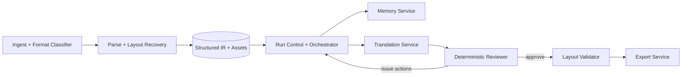

# Multi-Agent Translation Final Implementation Plan

Last Updated: 2026-03-22
Status: phase-1-complete
Owner: repo-aligned implementation baseline

Related docs:

- [translation-agent-system-design.md](translation-agent-system-design.md)
- [multi-agent-translation-product-review.md](multi-agent-translation-product-review.md)
- [chapter-local-translation-memory-design.md](chapter-local-translation-memory-design.md)
- [orchestrator-state-machine.md](orchestrator-state-machine.md)
- [pdf-ocr-layout-refactoring-plan.md](pdf-ocr-layout-refactoring-plan.md)

## 0. Completion Snapshot

Phase 1 is now closed on the locked MVP boundary.

Delivered control-plane changes:

- explicit `MemoryService + CompiledTranslationContext`
- chapter-lane packet serialization with packet runtime sub-state
- deterministic review routing with repeated-failure stop rules and manual hold escalation
- export-time layout validation that blocks final artifacts and routes structure failures to explicit followup actions

Acceptance evidence used for closure:

- `tests.test_api_workflow.ApiWorkflowTests.test_translate_full_run_executes_review_and_exports_in_background`
- `tests.test_pdf_support.PdfBootstrapPipelineTests.test_bootstrap_pipeline_supports_low_risk_text_pdf`
- `tests.test_pdf_support.BasicPdfOutlineRecoveryTests.test_parse_service_routes_pdf_mixed_documents_to_ocr_parser`
- `tests.test_pdf_support.PdfDocumentImagePersistenceTests.test_export_merges_linked_pdf_image_caption_into_single_render_block`

Boundary note:

- `PDF_MIXED` is accepted in Phase 1 at the control-plane and protected-artifact routing layer.
- It is not yet a claim of publication-grade OCR/layout fidelity for complex scanned documents.

## 1. Scope Freeze

This document locks the Phase 1 implementation scope to the following baseline:

- Input formats: `EPUB`, `PDF_TEXT`, `PDF_MIXED`
- Deferred input format: `PDF_SCAN`
- Delivery artifacts: `MERGED_MARKDOWN`, `BILINGUAL_HTML`
- Pipeline shape: deterministic control plane with explicit service roles
- Chapter concurrency: chapter lanes can run in parallel
- Packet concurrency: exactly one active translation packet per chapter lane

Explicit non-goals for Phase 1:

- Free-form swarm or agent-to-agent conversation loops
- Reviewer-led default rewriting
- Figure-internal OCR rewrite and image text replacement
- Publication-grade `ZH_EPUB` or rebuilt PDF output
- Full support for complex scanned documents

## 2. Locked Architectural Decisions

### 2.1 Control plane stays deterministic

The existing workflow spine remains the source of truth:

- bootstrap
- packet build
- translate
- review
- export

We do not convert the system into autonomous agents exchanging natural-language tasks. We keep state, versions, and rerun policy explicit in code and in the database.

### 2.2 Service roles become explicit without becoming separate processes

Phase 1 treats agent roles as service boundaries inside the current app:

- `Parse/Layout Recovery`
- `Orchestrator`
- `Memory Service`
- `Translation Worker`
- `Deterministic Reviewer`
- `Layout Validator`

This gives us clearer contracts without introducing premature distributed-systems complexity.

### 2.3 Structured state is the truth; Markdown is the working view

- Database rows plus packet payloads remain the canonical control-plane state.
- Markdown becomes the standard human-readable intermediate and final reading format.
- Markdown does not replace sentence alignment, packet provenance, bbox evidence, issue routing, or rerun state.

### 2.4 Translation packets are semantic, not RAG chunks

RAG-style fixed windows remain optional for retrieval features only.

Translation packets are built from:

- heading boundaries
- paragraph continuity
- table/code/caption/equation boundaries
- chapter continuity constraints

They are not built from a fixed `500-1000 characters + overlap` rule.

## 3. Repo-Aligned Target Topology



## 4. Current Repo to Target Role Mapping

| Target role | Keep as backbone | Extend | New |
|---|---|---|---|
| Parse/Layout Recovery | `src/book_agent/domain/structure/pdf.py`, `src/book_agent/domain/structure/epub.py`, `src/book_agent/services/bootstrap.py` | PDF block metadata, page family, figure/caption linkage confidence, mixed-PDF risk routing | optional `src/book_agent/services/layout_recovery.py` helper if `bootstrap.py` becomes too large |
| Orchestrator | `src/book_agent/app/runtime/document_run_executor.py`, `src/book_agent/services/run_execution.py`, `src/book_agent/orchestrator/state_machine.py` | packet preparation gate, blocked-structure handling, layout validation stage, chapter lane policy | none required in Phase 1 |
| Memory Service | `src/book_agent/services/context_compile.py`, `src/book_agent/infra/repositories/chapter_memory.py`, `MemorySnapshot`, `TermEntry` | compiled-context API, proposal vs commit split, chapter carryover refresh | `src/book_agent/services/memory_service.py` |
| Translation Worker | `src/book_agent/services/translation.py`, `src/book_agent/workers/translator.py`, `src/book_agent/workers/contracts.py` | compiled context contract, uncertainty flags, memory proposal writeback | none required in Phase 1 |
| Deterministic Reviewer | `src/book_agent/services/review.py`, `src/book_agent/orchestrator/rule_engine.py` | hard gate separation, issue family normalization, chapter-ready decision | none required in Phase 1 |
| Layout Validator | `src/book_agent/services/export.py` | pre-export structure validation | `src/book_agent/services/layout_validate.py` |

## 5. End-to-End Control Flow

Phase 1 runtime flow:

1. Ingest file and classify source type.
2. Parse into chapter/block/sentence IR and persist image assets metadata.
3. Build chapter packets from semantic block groups.
4. For each chapter lane, prepare the next packet with a frozen memory snapshot.
5. Translate the packet.
6. Run deterministic review on the chapter when all packets in the chapter have a latest successful run.
7. If blocking issues exist, route to targeted rerun, reparse, or manual hold.
8. If the chapter passes review, run layout validation.
9. Export `MERGED_MARKDOWN` and `BILINGUAL_HTML`.

Key invariant:

> Chapter lanes may run in parallel; packet acceptance within a chapter remains serialized.

## 6. Module Implementation Details

### 6.1 Parse/Layout Recovery

Primary files:

- `src/book_agent/domain/structure/pdf.py`
- `src/book_agent/domain/structure/epub.py`
- `src/book_agent/services/bootstrap.py`
- `src/book_agent/domain/structure/models.py`

Phase 1 requirements:

- Keep separate parse entry paths for `EPUB`, `PDF_TEXT`, `PDF_MIXED`.
- Persist enough provenance to re-run structure-sensitive chapters without re-ingesting the whole document.
- Treat figure, caption, footnote, code, table, and equation boundaries as first-class block semantics.

Phase 1 additions:

- Persist `page_number`, `bbox`, `pdf_page_family`, `pdf_section_family`, `linked_caption_block_id`, and `structure_flags` into `Block.source_span_json` or `Block.metadata_json` equivalent payloads.
- Mark non-translatable artifacts at parse time, not later in translation.
- Carry `layout_risk` from parse into chapter metadata so review and rerun can route structure failures correctly.

Implementation note:

- Reuse JSON metadata before adding many new columns.
- The only hard requirement is that downstream services can reliably query `page family`, `bbox`, `linked caption`, and `layout risk`.

### 6.2 Orchestrator

Primary files:

- `src/book_agent/app/runtime/document_run_executor.py`
- `src/book_agent/services/run_execution.py`
- `src/book_agent/services/run_control.py`
- `src/book_agent/orchestrator/state_machine.py`
- `src/book_agent/orchestrator/rule_engine.py`

Phase 1 orchestration rules:

- Seed translate work items by packet, but only claim the next packet of a chapter if the previous packet is finalized or accepted for that chapter memory version.
- Treat `structure` issues differently from `translation` issues.
- Do not requeue a packet with the same version bundle forever.

Target chapter lane policy:

- Multiple chapters may be active.
- A chapter may only have one active packet in `running` or `review-pending` state.
- Chapters with `layout_risk=high` are allowed to complete parse, but the translate lane should pause until the risk is explicitly downgraded or manually approved.

Recommended state updates:

Document status remains unchanged for Phase 1.

Chapter state machine becomes:

```text
ready
  -> segmented
  -> packet_built
  -> translated
  -> qa_checked
  -> review_required | approved
  -> exported

review_required
  -> ready | segmented | packet_built
```

Packet state machine should be extended logically, even if Phase 1 stores some sub-state in `packet_json`:

```text
built -> prepared -> running -> translated -> reviewed -> approved
translated -> retry_queued
reviewed -> invalidated
running -> failed
```

Implementation rule:

- If we want to avoid a Phase 1 enum migration, `prepared`, `reviewed`, and `retry_queued` may live in `packet_json.runtime_state`.
- `PacketStatus` stays the coarse persisted state until the new control plane has proven stable.

### 6.3 Memory Service

Primary files:

- `src/book_agent/services/context_compile.py`
- `src/book_agent/infra/repositories/chapter_memory.py`
- `src/book_agent/domain/models/document.py`
- `src/book_agent/domain/models/translation.py`

Phase 1 contract:

- Worker reads a frozen memory snapshot before translation.
- Worker can only propose terms or open questions.
- Review approval is the only default path that commits new chapter memory.

Recommended new service:

- `src/book_agent/services/memory_service.py`

Suggested responsibilities:

- `load_compiled_context(packet_id)`
- `load_latest_chapter_memory(document_id, chapter_id)`
- `record_translation_proposals(packet_id, proposals)`
- `commit_approved_packet_memory(packet_id, translation_run_id)`

Data to persist:

- chapter summary
- active concepts
- recent accepted translations
- style observations
- open decisions
- term proposals with evidence

Phase 1 persistence rule:

- Continue using `MemorySnapshot` for chapter memory and document-global memory payloads.
- Continue using `TermEntry` for committed terminology.
- Do not create a second term system.

Recommended payload split:

- `MemorySnapshot(snapshot_type=CHAPTER_TRANSLATION_MEMORY)` for chapter-local carryover
- `MemorySnapshot(snapshot_type=TERMBASE, scope_type=GLOBAL)` for document-level term snapshot metadata
- `TermEntry` for active committed terms used in review and prompt compilation

### 6.4 Translation Worker

Primary files:

- `src/book_agent/services/translation.py`
- `src/book_agent/workers/contracts.py`
- `src/book_agent/workers/translator.py`

Phase 1 worker contract changes:

- Context passed to workers should already be compiled.
- Worker output must preserve block order.
- Worker output must be able to carry uncertainty and term proposals without mutating the global termbase.

Recommended contract additions in `src/book_agent/workers/contracts.py`:

- `CompiledTranslationContext`
- `TermProposal`
- `UncertaintyFlag`
- `PacketTranslationBlock`

Minimum `CompiledTranslationContext` fields:

- `packet_id`
- `document_id`
- `chapter_id`
- `heading_path`
- `section_brief`
- `current_blocks`
- `prev_accepted_blocks`
- `relevant_terms`
- `relevant_entities`
- `style_policy`
- `open_questions`
- `memory_version_used`

Worker output requirements:

- packet-level success or failure
- translated blocks in source order
- alignment suggestions
- low-confidence flags
- term proposals
- notes for rerun hints

### 6.5 Deterministic Reviewer

Primary files:

- `src/book_agent/services/review.py`
- `src/book_agent/orchestrator/rule_engine.py`
- `src/book_agent/orchestrator/rerun.py`

Phase 1 reviewer scope is hard-gate QA only:

- omission
- alignment failure
- format pollution
- locked term mismatch
- duplicated translation
- stale chapter brief
- packet continuity failure
- PDF structure leakage

Phase 1 reviewer does not do free-form style rewriting.

Review outcomes:

- `approve chapter`
- `rerun packet`
- `rebuild packet then rerun`
- `rebuild chapter brief`
- `update termbase then rerun targeted`
- `reparse chapter`
- `manual finalize`

Required review invariant:

- A packet rerun must reference an explicit issue family and an explicit version bundle.
- Repeated reruns with the same issue fingerprint and no version change should escalate to manual hold.

### 6.6 Layout Validator

Primary files:

- new `src/book_agent/services/layout_validate.py`
- `src/book_agent/services/export.py`

Phase 1 validator scope:

- heading hierarchy continuity
- figure asset presence
- caption linkage presence for academic-paper lanes
- footnote reference integrity
- code fence balance
- equation renderability marker presence
- table markup well-formedness
- duplicate or dropped artifact detection in merged markdown

Implementation rule:

- Layout validation happens after deterministic review passes and before export writes final artifacts.
- Failures become normal `ReviewIssue` records with `root_cause_layer=EXPORT` or `STRUCTURE`, not a separate bug system.

## 7. Data Model Increment Plan

Phase 1 should prefer additive JSON payload changes over new normalized tables unless a field is required for filtering, uniqueness, or joins.

### 7.1 No-regret changes

These changes are worth doing in Phase 1:

1. Extend `TranslationPacket.packet_json`
   - add `runtime_state`
   - add `chapter_memory_version`
   - add `input_version_bundle`
   - add `packet_ordinal`

2. Extend `TranslationRun.model_config_json`
   - persist `context_compile_version`
   - persist `chapter_memory_snapshot_version_used`
   - persist `rerun_hints`

3. Extend `Block.source_span_json`
   - add `page_number`
   - add `bbox`
   - add `pdf_page_family`
   - add `pdf_section_family`
   - add `linked_caption_block_id`
   - add `structure_flags`

4. Extend `Chapter.metadata_json`
   - add `layout_risk`
   - add `requires_manual_structure_review`
   - add `source_lane`

5. Extend `ChapterQualitySummary`
   - add `structure_ok`
   - add `layout_ok`
   - add `term_conflict_count`

### 7.2 Defer unless Phase 1 pain proves it necessary

- new `packet_review_runs` table
- dedicated `layout_validation_runs` table
- separate `term_proposals` table
- enum expansion for every packet sub-state

### 7.3 Enum guidance

Keep the following enums unchanged in Phase 1 unless they become a true operational blocker:

- `DocumentStatus`
- `ChapterStatus`
- `PacketStatus`

Use JSON sub-state first. Promote to enums only after the behavior is stable.

## 8. Agent Protocols

### 8.1 Orchestrator -> Memory Service

Input:

- `document_id`
- `chapter_id`
- `packet_id`

Output:

- compiled context
- active memory versions
- chapter lane readiness flag

### 8.2 Orchestrator -> Translation Service

Input:

- `packet_id`
- optional rerun hints

Output:

- `TranslationRun`
- target segments
- alignment edges
- proposal payloads

### 8.3 Translation Service -> Memory Service

Input:

- `packet_id`
- translation proposals
- recent accepted translation candidate

Output:

- proposal recorded only

Constraint:

- no committed term or chapter memory mutation here

### 8.4 Review Service -> Orchestrator

Input:

- `chapter_id`

Output:

- issues
- actions
- rerun plans
- chapter summary

### 8.5 Layout Validator -> Export Service

Input:

- `document_id`
- approved chapters

Output:

- pass/fail
- blocking issues if any

## 9. File-Level Change List

### 9.1 Extend existing files

- `src/book_agent/domain/structure/pdf.py`
- `src/book_agent/services/bootstrap.py`
- `src/book_agent/services/context_compile.py`
- `src/book_agent/services/translation.py`
- `src/book_agent/workers/contracts.py`
- `src/book_agent/services/review.py`
- `src/book_agent/services/export.py`
- `src/book_agent/app/runtime/document_run_executor.py`
- `src/book_agent/orchestrator/state_machine.py`

### 9.2 New files

- `src/book_agent/services/memory_service.py`
- `src/book_agent/services/layout_validate.py`
- `tests/test_memory_service.py`
- `tests/test_layout_validate.py`

### 9.3 Supporting docs to align opportunistically after Phase 1

- `docs/orchestrator-state-machine.md`
- `docs/chapter-local-translation-memory-design.md`
- `docs/pdf-ocr-layout-refactoring-plan.md`

## 10. Phase 1 Delivery Order

### Step 1: make memory explicit

Deliver:

- `memory_service.py`
- compiled context contract
- proposal vs commit split

Acceptance:

- translation requests always carry an explicit memory version
- reruns can reproduce the memory snapshot they used

### Step 2: harden packet orchestration

Deliver:

- chapter-lane serialization
- packet runtime sub-state
- rerun stop conditions for repeated failures

Acceptance:

- no two active translation packets for the same chapter
- identical version bundle does not loop forever

### Step 3: finish deterministic review as the phase gate

Deliver:

- review issue normalization
- chapter pass/fail gate
- manual hold escalation rule

Acceptance:

- blocking issues prevent export
- issue routing resolves to a concrete action family

### Step 4: add layout validation before export

Deliver:

- `layout_validate.py`
- export preflight gate

Acceptance:

- broken heading trees, missing figure assets, or malformed merged markdown block export

### Step 5: tighten PDF structure provenance

Deliver:

- richer block metadata
- lane routing from parse risk to review/rerun

Acceptance:

- academic-paper figure/caption failures route to `REPARSE_CHAPTER`
- non-translatable PDF artifacts do not leak into translation packets

## 11. Phase 1 Acceptance Criteria

Phase 1 is complete when all of the following are true:

- `EPUB`, `PDF_TEXT`, and `PDF_MIXED` share the same downstream packet, review, and export control plane.
- Every translated packet records the exact memory version it used.
- Chapter translation is serialized within a chapter and parallelizable across chapters.
- Review failures route to explicit actions instead of implicit retries.
- `MERGED_MARKDOWN` and `BILINGUAL_HTML` are blocked by deterministic review and layout validation.
- Figure, caption, footnote, code, table, and equation boundaries survive into exported markdown.

## 12. Deferred to Phase 2

- scanned PDF OCR lane
- stylistic reviewer
- reviewer local rewrite path
- document-level automatic terminology governance beyond current termbase machinery
- rebuilt EPUB/PDF output
- figure-internal OCR translation and image rewriting

## 13. Final Implementation Principle

The Phase 1 system is not "multi-agent" because many models talk to each other.

It is multi-agent because each role has:

- a narrow contract
- explicit input and output
- stateful provenance
- deterministic rerun behavior

That is the version of multi-agent architecture this repository can implement safely now.

## 14. Workstream Breakdown

The Phase 1 implementation should be treated as seven bounded workstreams, not as one long refactor.

| Workstream | Primary output | Depends on | Main files | Done when |
|---|---|---|---|---|
| WS1. Structure provenance hardening | richer block and chapter metadata | none | `domain/structure/pdf.py`, `services/bootstrap.py`, `domain/models/document.py` | downstream services can read `layout_risk`, `page family`, `bbox`, `linked caption` without special-case guessing |
| WS2. Memory service extraction | explicit memory read/propose/commit facade | WS1 not required | `services/memory_service.py`, `services/context_compile.py`, `infra/repositories/chapter_memory.py` | translation no longer reads chapter memory ad hoc from multiple places |
| WS3. Compiled translation context contract | frozen runtime context schema | WS2 | `workers/contracts.py`, `services/translation.py`, `infra/repositories/translation.py` | every translation run records one compiled context version and one memory version |
| WS4. Chapter-lane packet control | one active packet per chapter | WS3 | `app/runtime/document_run_executor.py`, `services/run_execution.py`, `orchestrator/state_machine.py` | same chapter never has competing packet execution paths |
| WS5. Deterministic review gate cleanup | stable issue families and stop conditions | WS3 | `services/review.py`, `orchestrator/rule_engine.py`, `orchestrator/rerun.py`, `infra/repositories/review.py` | rerun decisions are explicit and repeatable |
| WS6. Layout validation gate | pre-export structural validation | WS1, WS5 | `services/layout_validate.py`, `services/export.py` | export can fail fast on structural corruption |
| WS7. Regression harness | tests and sample fixtures that prove the new control plane | WS1-WS6 incrementally | `tests/*` | each workstream has at least one focused regression and one integration proof |

Execution rule:

- Finish WS2 plus WS3 before touching WS4.
- Finish WS5 before allowing WS6 to block export.
- Keep WS7 running in parallel with implementation, not at the end.

## 15. Pre-Code Readiness Checklist

Code should not start until all items below are explicitly true.

### 15.1 Scope checklist

- Phase 1 only targets `EPUB`, `PDF_TEXT`, and `PDF_MIXED`.
- Phase 1 only ships `MERGED_MARKDOWN` and `BILINGUAL_HTML`.
- Reviewer rewriting is disabled by default.
- `PDF_SCAN`, rebuilt EPUB, rebuilt PDF, and figure-internal rewrite remain deferred.

### 15.2 Contract checklist

- `ContextPacket` vs `CompiledTranslationContext` boundary is agreed.
- Memory write authority is agreed: worker proposes, review approves, memory service commits.
- Chapter lane rule is agreed: one active packet per chapter.
- Layout validation is agreed to block export.

### 15.3 Data checklist

- `packet_json`, `model_config_json`, `source_span_json`, and `chapter.metadata_json` are the preferred Phase 1 extension points.
- New tables are not introduced unless a join, uniqueness rule, or audit requirement forces them.
- Packet sub-state stays in JSON before being promoted to enums.

### 15.4 Operational checklist

- We have at least one stable EPUB sample and one stable text/mixed PDF sample for regression.
- We have a single agreed path for issue escalation: rerun, reparse, or manual hold.
- We have a clear stop rule for repeated failures with the same version bundle.

If any item above is not true, we are not ready to code Phase 1 safely.

## 16. Coding Sequence Guardrails

The coding order matters. The safest sequence is:

1. introduce `memory_service.py`
2. introduce `CompiledTranslationContext`
3. wire translation through compiled context and proposal recording
4. enforce chapter-lane packet serialization
5. normalize deterministic review outputs
6. add layout validation gate
7. tighten export preflight and regression tests

Do not invert this order.

Specifically:

- do not start with layout validation before review routing is stable
- do not start with export refactors before compiled context is frozen
- do not start with UI or operator workflow changes before the runtime contracts hold
- do not introduce stylistic review before deterministic review is trustworthy

## 17. Regression Plan

Every workstream must land with both focused tests and at least one control-plane regression.

### 17.1 Test layers

- unit tests for memory merge rules and compiled context shaping
- repository tests for packet bundle and chapter review bundle loading
- service tests for translation, review, and layout validation behavior
- runtime integration tests for run executor behavior
- export golden checks for merged markdown structure

### 17.2 Existing tests to extend first

- `tests/test_translation_worker_abstraction.py`
- `tests/test_run_execution.py`
- `tests/test_persistence_and_review.py`
- `tests/test_pdf_support.py`
- `tests/test_postgres_workflow_integration.py`

### 17.3 Tests added or expanded during Phase 1

- `tests/test_memory_service.py`
- `tests/test_layout_validate.py`
- `tests/test_export_layout_gate.py`
- `tests/test_run_execution.py`
- `tests/test_translation_worker_abstraction.py`

### 17.4 Minimum regression corpus

Phase 1 closure uses the following regression set:

- `tests.test_api_workflow.ApiWorkflowTests.test_translate_full_run_executes_review_and_exports_in_background`
- `tests.test_pdf_support.PdfBootstrapPipelineTests.test_bootstrap_pipeline_supports_low_risk_text_pdf`
- `tests.test_pdf_support.BasicPdfOutlineRecoveryTests.test_parse_service_routes_pdf_mixed_documents_to_ocr_parser`
- `tests.test_pdf_support.PdfDocumentImagePersistenceTests.test_export_merges_linked_pdf_image_caption_into_single_render_block`

This corpus proves four things at once:

- `EPUB` can still traverse bootstrap -> translate_full -> review -> export end to end.
- `PDF_TEXT` still supports low-risk bootstrap recovery on the shared control plane.
- `PDF_MIXED` is still routed through the OCR/mixed lane while preserving protected-artifact intent.
- PDF figure/caption provenance still survives into export-time render blocks.

The point of the corpus is not breadth. The point is to prove that the control plane remains stable while we change it.

## 18. Delivery Risks That Can Derail Schedule

These are the highest-probability schedule killers:

- turning `memory service` into a second term system
- expanding Phase 1 to scanned PDF
- trying to design perfect packet sub-state enums before behavior stabilizes
- coupling layout validation to a large export rewrite
- mixing stylistic review requirements into deterministic review work
- chasing UI or operator tooling before runtime contracts are stable

Mitigation rule:

- if a change does not reduce ambiguity in control flow, memory provenance, or export gating, it probably does not belong in Phase 1

## 19. Anti-Drift Rules

When coding starts, the team should actively reject the following temptations:

- "while we are here, let's support scanned PDF too"
- "while we are here, let's add a smarter reviewer that rewrites text"
- "while we are here, let's replace JSON payloads with several new tables"
- "while we are here, let's add a vector store for memory retrieval"
- "while we are here, let's split services into separate processes"

All of those are valid later. None of them are Phase 1 necessities.

## 20. Definition Of Ready

We are ready to begin coding only when:

- this document remains consistent with the locked scope in Section 1
- WS1-WS7 ordering is accepted
- the three-sample regression corpus is chosen
- the first implementation target is explicitly `WS2 + WS3`
- no one expects Phase 1 to output rebuilt EPUB or rebuilt PDF

## 21. Definition Of Done For Phase 1

Phase 1 is done when:

- the runtime contracts are explicit enough that a new contributor can trace parse -> memory -> translate -> review -> export without guessing hidden state
- translation provenance is reproducible at packet level
- rerun actions are stable and bounded
- export is blocked by deterministic review and layout validation
- the regression corpus passes without relying on manual state repair
- the evidence in Section 0 and Section 17.4 remains reproducible
