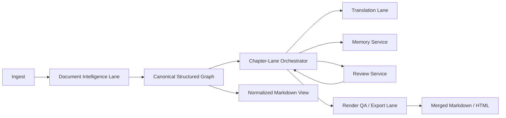

# Multi-Agent Translation Product Review

Last Updated: 2026-03-19
Review Mode: selective_expansion
Verdict: keep the current deterministic pipeline as the control plane, then selectively promote high-leverage stages into explicit agent roles
Scope: PDF books, PDF papers, EPUB books, English technical blogs

## 1. Executive Verdict

你的升级方向是对的，但不应该直接把系统重构成“多个自由协作的 LLM agent 互相对话”的形态。

更优解是：

- 保留现有 `bootstrap -> translate -> review -> export` 的可重放主链路
- 把真正高价值、且已经在系统里以“隐式角色”存在的能力，逐步提升成显式的 agent/service role
- 先强化文档结构理解、章节内连续翻译、章节记忆、质量复检和排版验收
- 不把 Markdown 当成唯一控制格式，而是把它当成“标准化中间阅读格式 + 最终交付格式”

结论上，这不是 `hold scope`，也不是无脑 `scope expansion`，而是明确的 `selective expansion`。

## 2. What Already Exists

当前系统并不是从 0 开始，它已经有一条完整而且可运行的控制面。

已有能力：

- ingest / parse / segment / profile / packet build 主链路，见 [bootstrap.py](/Users/smy/project/book-agent/src/book_agent/services/bootstrap.py)
- EPUB / text PDF / OCR PDF 差异化解析，见 [bootstrap.py](/Users/smy/project/book-agent/src/book_agent/services/bootstrap.py)
- packet 翻译 worker 抽象、上下文编译、usage 持久化，见 [translation.py](/Users/smy/project/book-agent/src/book_agent/services/translation.py) 和 [translator.py](/Users/smy/project/book-agent/src/book_agent/workers/translator.py)
- chapter brief / termbase / entity / chapter translation memory，见 [builders.py](/Users/smy/project/book-agent/src/book_agent/domain/context/builders.py) 和 [context_compile.py](/Users/smy/project/book-agent/src/book_agent/services/context_compile.py)
- review / rerun / issue-action 矩阵，见 [review.py](/Users/smy/project/book-agent/src/book_agent/services/review.py) 和 [issue-rerun-matrix.md](/Users/smy/project/book-agent/docs/issue-rerun-matrix.md)
- export gate、bilingual HTML、merged HTML、merged Markdown，见 [export.py](/Users/smy/project/book-agent/src/book_agent/services/export.py)
- long-run run control / executor / budget / retry / pause-resume，见 [document_run_executor.py](/Users/smy/project/book-agent/src/book_agent/app/runtime/document_run_executor.py)

也就是说，你提议中的几个角色，其实大多已经存在雏形：

- `orchestrator`：当前是 workflow + run-control + executor
- `memory agent`：当前是 chapter brief / termbase / entity / chapter translation memory
- `translation workers`：当前是 translation worker + packet execution
- `reviewer`：当前是 review service + issue/action/rerun
- `layout agent`：当前分散在 parse/bootstrap/export 里，但还不够强

真正缺的不是“有没有 agent 名字”，而是这些角色还没有被产品化为更清晰、更高精度、更低成本的协作层。

## 3. Where Your Proposal Is Directionally Right

### 3.1 OCR + Layout 是整个 PDF 质量上限

这个判断完全正确。

当前 PDF 问题最深的根因并不在“翻译 prompt 还不够长”，而在上游结构恢复：

- 论文双栏、标题续接、caption 绑定、figure crop、代码块边界
- 图片区域精确截取
- 正文 / 代码 / 图注 / 参考文献 / frontmatter 的分类

如果结构错了，后面的翻译、review、merged 排版都会被污染。

### 3.2 需要更显式的调度核心

这也正确。

当前系统已经有 run-control，但它更像“可靠执行器”，还不像“面向文档理解任务的调度脑”。

尤其在这几类场景里，需要更强的 orchestrator：

- PDF paper 结构高风险章节优先走 layout-recovery lane
- 章节内 packet 严格串行，章节间有限并行
- issue family 驱动 targeted rerun，而不是只靠通用 run
- export / review / relayout / recrop 之间的重试策略统一

### 3.3 需要更强的 memory layer

这也对。

当前 chapter memory 已经存在，但还不够“主动”：

- 对核心术语、标题风格、摘要风格、作者口吻的治理不够强
- 对论文摘要 / 引言 / 相关工作 / 结论的 register 区分还不够细
- 对章节内连续翻译的显式 session state 仍然偏弱

### 3.4 需要独立的质量 reviewer

也正确。

当前 reviewer 更偏：

- 覆盖率
- 对齐
- format pollution
- term / concept miss

但对“翻译腔、技术中文不自然、章节语气漂移、论文风格不学术化”的把关仍偏弱。

### 3.5 Markdown 应该成为标准交付与结构中间层

方向对，但不能理解成“只保留 Markdown，放弃结构化控制数据”。

## 4. Where The Proposal Overshoots

### 4.1 不要直接上“自由协作 multi-agent”

如果现在就做成：

- orchestrator 发任务
- memory subagent 自主总结
- review subagent 自主重写
- 排版 subagent 自主修复

那么会立刻出现 4 个副作用：

- 成本上升：同一 packet 可能被 worker、reviewer、rewriter 多次消费 token
- 可追踪性下降：问题出在 parse、memory、review 还是 rewrite 会变模糊
- 可恢复性下降：run 中断后很难复原精确上下文
- 系统一致性变差：多个 agent 分别维护自己的“记忆”，容易漂移

对于当前产品阶段，这类复杂度超过收益。

### 4.2 不要把 Markdown 当成唯一控制面格式

Markdown 很适合：

- 文档标准化存档
- merged export
- RAG ingestion
- 人类阅读和外部渲染器消费

但不适合取代这些控制面数据：

- sentence / packet / segment / alignment edge
- issue / rerun action / snapshot version
- figure / caption / bbox / page anchor
- code / table / protected span 的结构约束

所以正确做法是：

- DB 中继续保留结构化 graph / JSON / relational artifacts
- 同时输出一份规范化 Markdown 视图
- 后续 retrieval 或渲染优先消费 Markdown
- 但 workflow 控制、对齐、rerun、审计继续依赖结构化状态

### 4.3 不要直接照搬 RAG chunk 原则当翻译 packet 原则

你提到的 `500-1000 字符 + 10%-20% overlap`，对 RAG retrieval 很合理，但对翻译不一定最优。

原因：

- 检索强调召回
- 翻译强调语义边界、句法连续性、结构类型和风格一致性

翻译 packet 更应该优先按：

- heading / paragraph / list / caption / table / code boundary
- 章节内连贯性
- 当前 block 的语义完成度

来切，而不是固定字符窗。

换句话说：

- retrieval chunk 可以更接近 `500-1000` 字符策略
- translation packet 应该优先语义块策略
- 两者不必绑定成一套切法

## 5. Product-Level Answer To Your Four Core Ideas

### 5.1 OCR + AI layout assist

建议做，而且应该成为下一阶段最高优先级之一。

但建议采用“双层结构恢复”：

1. 规则 / 几何 / 解析器优先
2. 仅在高风险区域调用 vision-language layout assist

高风险区域包括：

- 学术论文首页
- 双栏错序页
- figure + caption 紧邻区域
- 表格 / 公式 / 代码混排区域
- 标题被断裂成多个 block 的区域

这会比“整页都丢给大模型识别结构”更稳、更便宜、更可解释。

### 5.2 Orchestrator

建议升级，但不是重写。

当前最值得做的是把现有 run-control 演进成“chapter-lane orchestrator”：

- 文档级：决定哪些 chapter lane 可以并行
- 章节级：packet 严格串行
- issue 级：根据 review issue family 触发 relayout / rebuild / rerun / reexport
- 预算级：决定何时降级策略、暂停 run、只做 targeted repair

### 5.3 Memory subagent

值得做，但优先做成显式 memory service，而不是自由 LLM subagent。

建议 memory 分为 4 层：

- document memory：书/论文级术语、作者、文风、主题
- chapter memory：章节概念、已接受译法、局部 register
- packet carryover：最近 1-2 个已接受译文块
- render memory：figure caption / code language / table label / heading hierarchy

其中最值得先做的是：

- chapter memory refresh
- concept auto-lock
- prev_translated_blocks 主导连续性

### 5.4 Translation quality reviewer

值得做，但应该拆成两类 reviewer：

- deterministic reviewer：coverage / alignment / format / structure / code-prose mistake / figure-caption mismatch
- stylistic reviewer：翻译腔、技术中文不自然、论文中文不够学术

第一类优先自动执行。
第二类优先作为 rerun hint / targeted rewrite guardrail，不要直接放任它无限重写。

### 5.5 Layout / merged QA agent

值得做，而且这是最终体验的关键。

但建议定义为“render QA + export repair lane”，职责包括：

- 目录顺序
- heading hierarchy
- code block continuity
- image presence and crop precision
- figure-caption adjacency
- Markdown / HTML 合并装配正确性

## 6. Recommended Target Architecture

关键点：

- `Canonical Structured Graph` 仍然是主系统真相源
- `Normalized Markdown View` 是阅读、检索、外部渲染的首选视图
- orchestrator 只调度显式 lane，不依赖多个 agent 的隐式会话记忆

## 7. Recommended Scope Split

### Phase A: Document Intelligence First

先做：

- PDF page layout risk classifier
- figure box 精确裁切
- caption linking
- code vs prose vs reference vs frontmatter 分类器
- heading continuation merge
- paper-specific front page / abstract / intro 修复
- canonical Markdown normalization

这一步对 PDF 书和 PDF 论文都会直接提质。

### Phase B: Chapter-Lane Translation Execution

按你提出的思路，演进成：

- 章节间有限并行
- 章节内 packet 严格串行
- 默认上下文以 `current_blocks + prev_translated_blocks + narrow concept memory` 为主
- `prev_blocks / next_blocks` 只在命中桥接启发式时注入

这是值得做的，而且和我们已有方向一致。

### Phase C: Explicit Memory Service

新增：

- chapter memory refresh policy
- concept lock / unlock workflow
- title style memory
- paper register memory
- code language / artifact class memory

### Phase D: Reviewer Split

新增两路 reviewer：

- structure reviewer
- language reviewer

前者更偏硬规则，后者更偏小模型 / 同模型 targeted pass。

### Phase E: Render QA Lane

最终 merged 导出前执行：

- chapter order sanity
- heading continuity
- asset completeness
- code continuity
- Markdown integrity

## 8. NOT In Scope

这几项现在不建议纳入主线：

- 让多个 agent 长时间共享隐式 provider session，作为唯一连续性来源
- 让 reviewer 自主无限重写译文
- 用 Markdown 彻底替代结构化 DB / alignment / issue graph
- 把 retrieval chunking 和 translation packet 完全绑定成同一套规则
- 全页、全书默认走 vision-language parse
- 为“agent 框架感”而引入额外消息总线或复杂子代理协议

## 9. Failure Modes Registry

### 9.1 上游结构失败导致下游全线污染

表现：

- 标题断裂
- figure crop 带入周边文字
- prose 被误识别为 code
- abstract 掉入 introduction

后果：

- 翻译、review、merged 全部变形

控制策略：

- layout-risk gating
- page-region level repair
- structure-first review

### 9.2 Reviewer 和 worker 反复打架

表现：

- reviewer 不断否定译文
- rerun 成本膨胀

控制策略：

- reviewer 分级
- 只允许特定 issue family 自动 rerun
- stylistic reviewer 默认输出 rewrite hint，而非直接覆写

### 9.3 Memory service 污染全章译法

表现：

- 错误术语在章节内被强化

控制策略：

- concept lock provenance
- memory snapshot versioning
- targeted invalidation

### 9.4 Markdown 成为“看起来简洁，实际上丢结构”的黑洞

表现：

- bbox、caption anchor、alignment、protected spans 丢失

控制策略：

- Markdown 只做视图，不替代底层结构化 artifacts
- Markdown manifest / sidecar 保留结构证据

## 10. Error And Rescue Registry

| Failure | Best Rescue |
| --- | --- |
| 标题被拆成两段 | relayout chapter + heading continuation merge |
| paper figure crop 不准 | rerun page-region crop lane |
| prose 被识别成 code | artifact classifier repair + targeted retranslate |
| 术语漂移 | update concept memory + targeted rerun |
| 论文中文不够学术 | language reviewer hint + packet rerun |
| merged 排版错序 | reexport lane，不触发重译 |

## 11. Recommended Build Order

### P1. Strengthen document intelligence

验收：

- PDF paper 的 abstract / intro / references 不再串行错乱
- 图片裁切 precision 显著提升
- code/prose 误判率显著下降

### P2. Convert run-control into chapter-lane orchestrator

验收：

- 章节间并行
- 章节内 packet 严格串行
- prompt 默认不再依赖 raw `next_blocks`

### P3. Promote memory to first-class service

验收：

- chapter memory 可以独立刷新
- concept lock 能驱动 targeted rerun
- 标题 / 论文 register 有显式记忆

### P4. Split reviewer into structure and language lanes

验收：

- 硬错误和风格错误分流
- 自动修复成本可控

### P5. Build render QA lane

验收：

- merged Markdown / HTML 的章节顺序、图片、代码连续性可自动验收

## 12. Acceptance Standard For This Upgrade Direction

当且仅当下面 5 条同时成立，才算这条产品升级路线成功：

- PDF 书与 PDF 论文都能稳定生成结构可信的 canonical Markdown
- figure crop、caption、heading、code/prose 边界不再成为高频阻断项
- 翻译默认 prompt 明显缩短，但质量不降
- chapter-lane 执行后，章节内连续性优于当前 packet 独立执行
- merged Markdown 成为稳定主交付，而结构化控制面仍保持可重放、可审计

## 13. Final Recommendation

最终建议不是“上 multi-agent”，而是：

- 以当前系统为骨架
- 先补强 document intelligence
- 再把 chapter-lane orchestrator、memory service、review lanes、render QA lane 显式化
- 把 Markdown 提升为主阅读与交换格式
- 但保留结构化 DB/JSON/control plane 作为系统真相源

如果要用一句话概括：

> 这应该是一套“由确定性控制面驱动、由少数高价值 agent role 增强”的翻译系统，而不是一套自由协作、彼此抢状态的 agent swarm。
