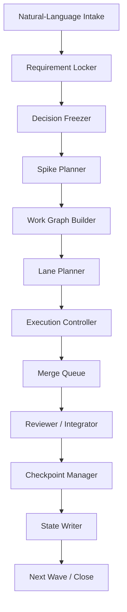

# Parallel Autopilot MVP Specification

## 1. MVP Goal

本 MVP 的目标不是做一个“真正多 agent 并发写代码”的终局系统，而是交付一个最小可运行、可验证、可恢复的新版开发接管 skill：

- 用户输入一句需求即可接管开发流程
- 系统自动完成需求锁定、架构决策、任务拆解和执行编排
- 系统能识别哪些工作可以并行
- 系统能把可并行工作组织成 lane / wave
- 系统能记录 lane 状态、阻塞关系和集成顺序
- 系统仍以单一控制面保证质量和可恢复性

一句话定义：

`MVP = 自然语言接管入口 + 并行感知调度 + lane 状态治理 + 串行集成收敛`

## 2. MVP Explicit Non-Goals

本 MVP 明确不做：

- 真正的多 lane 同时自动写代码
- 自由 swarm 式 agent 协作
- 自动 merge 多条并发代码分支
- 自动处理复杂共享写集冲突
- 完整通用化到任意 repo 零配置使用
- 替换或修改现有 [auto-pilot.md](/Users/smy/project/book-agent/auto-pilot.md) 工作流本体

这几个点必须延后，否则 MVP 会失焦。

## 3. Product Positioning

MVP 产物应被定义为：

- 一个新的开发型通用 skill
- 一个自然语言驱动的开发 orchestration layer
- 一个“先看清并行可能性、再安全推进”的调度器

而不是：

- 命令行 wrapper
- autopilot.md 的小修小补
- 真并行 agent runtime

## 4. MVP Success Criteria

MVP 完成时，必须同时满足以下条件：

1. 用户只输入一句需求，skill 能自动进入接管模式。
2. skill 能输出 `locked_requirement`，不依赖斜杠命令。
3. skill 能生成 ADR 基线和任务树。
4. skill 能生成结构化工作图，并识别可并行节点。
5. skill 能把工作图划分为 `wave -> lane -> MDU`。
6. skill 能为每个 lane 输出：
   - 目标
   - 依赖
   - 写集
   - 状态
   - 阻塞原因
7. skill 能输出统一的集成顺序，而不是让 lane 自行收敛。
8. skill 能处理三种治理动作：
   - resume
   - change request
   - rollback
9. skill 能持续更新人类可读进度面。
10. 全流程仍保留 bug-driven evolution 和阶段验收。

## 5. MVP Scope Boundary

### In Scope

- 自然语言入口替代命令式入口
- requirement lock
- ADR freeze
- 必要技术探针
- 任务拆解
- 工作图构建
- lane / wave 分配
- lane 状态跟踪
- merge queue 设计
- reviewer / integrator gate 设计
- resume / change / rollback 基础协议
- 状态工件落盘

### Out Of Scope

- 真并行执行多个写代码 worker
- 自动 branch 管理
- 自动 cherry-pick / rebase / merge conflict resolution
- 分布式 agent 网络
- 自适应负载均衡
- 跨 repo 的零配置通用化

## 6. MVP Recommended Architecture

推荐采用：



### Why This Is MVP-Appropriate

- 保留单一 orchestrator，避免控制面分裂
- 把并行限制在“规划与状态表达层”，而不是执行引擎层
- 让未来真并行执行可在此架构上追加，而不是返工

## 7. MVP Execution Model

### Core Principle

MVP 不是“并行执行”，而是“并行感知调度”。

### Scheduling Unit

推荐调度单位为 `lane`。

原因：

- `task` 太粗
- `MDU` 太细
- `lane` 能容纳一个小而完整的可交付 slice

### Lane Rules

每个 lane 必须声明：

- `lane_id`
- `objective`
- `depends_on`
- `candidate_mdus`
- `write_set`
- `contract_tags`
- `status`
- `blocked_by`
- `integration_gate`

### Wave Rules

每个 wave 代表一批理论上可以并行推进的 lane。

但在 MVP 中：

- wave 内 lane 可以被并行标记
- 默认执行仍由单控制面串行推进
- 并行的价值主要体现在：
  - 可见性
  - 优先级排序
  - 阻塞传播
  - 将来真并行的可升级性

## 8. MVP Parallelism Policy

### Allowed As Parallel Candidates

以下工作可进入同一 wave：

- 互不依赖的技术探针
- 不共享写集的实现任务
- 独立测试补强
- 独立文档和观测改造

### Must Stay Serial

- 需求锁定
- 关键 ADR 冻结
- 工作图生成
- lane 划分
- 契约升级
- merge gate
- phase checkpoint
- rollback 决策

### Shared Write-Set Rule

若两个节点满足任一条件，则不能进入不同并行 lane：

- 修改同一文件
- 修改同一核心模块目录
- 修改同一 schema / type contract
- 修改同一状态协议
- 修改同一测试基座且相互影响

## 9. MVP State Artifacts

MVP 最少保留并扩展以下状态工件：

### 9.1 `PROGRESS.md`

继续作为人类可读总览，但新增：

- 当前 wave
- 当前 active lanes
- 被阻塞 lanes
- 当前 integration gate

### 9.2 `DECISIONS.md`

继续记录 ADR，不变为调度真相。

### 9.3 `WORK_GRAPH.json`

MVP 新增，作为调度真相源。

最小字段：

```json
{
  "nodes": [],
  "edges": [],
  "waves": [],
  "contracts": [],
  "write_sets": []
}
```

### 9.4 `LANE_STATE.json`

MVP 新增，记录：

- lane 生命周期
- 当前执行位置
- blocked / stale / ready / merged 状态
- 最新检查点

### 9.5 `RUN_CONTEXT.md`

MVP 新增，记录：

- 当前模式
- 当前波次
- 当前 lane
- 当前阻塞
- 下一步动作

### 9.6 Deferred From MVP

以下状态对象不要求 MVP 必须实现：

- `MERGE_QUEUE.json`
- `CONTRACT_MAP.json`

但建议预留 schema 占位。

## 10. MVP Workflow

### Step 1: Intake

输入一句需求，自动识别：

- new run
- resume
- change request
- rollback recovery

### Step 2: Requirement Lock

自动追问最少的问题，生成唯一 `locked_requirement`。

### Step 3: Decision Freeze

把关键架构和边界写入 `DECISIONS.md`。

### Step 4: Spike Planning

仅对高风险决策做最小探针。

### Step 5: Work Graph Build

生成 task / MDU / dependency / write set / contract tag。

### Step 6: Lane Planning

将无冲突节点组织进 wave 和 lane。

### Step 7: Controlled Execution

MVP 中仍按 lane 串行推进，不要求真并行。

### Step 8: Integration Gate

每个 lane 完成后必须进入统一集成检查。

### Step 9: Checkpoint

wave 结束后做一次 checkpoint；阶段结束后做 phase checkpoint。

### Step 10: State Sync

同步更新全部状态工件。

## 11. MVP Resume / Change / Rollback

### Resume

恢复时必须读：

- `PROGRESS.md`
- `DECISIONS.md`
- `WORK_GRAPH.json`
- `LANE_STATE.json`

恢复结果必须明确：

- 当前 wave
- 当前 lane
- 未完成节点
- 阻塞节点

### Change Request

变更请求必须：

- 暂停当前 lane
- 标记受影响节点
- 重建受影响子图
- 重新输出 wave / lane 划分

### Rollback

MVP 中 rollback 只要求支持：

- 基于依赖图识别受影响节点
- 标记节点失效
- 从最近稳定节点重新规划

不要求支持自动代码回滚。

## 12. MVP Bug-Driven Evolution

每次发现 bug 后，必须至少完成：

1. 记录 bug 根因层
2. 判断是否需要修改：
   - 工作图规则
   - lane 划分规则
   - 依赖分析规则
   - checkpoint 检查项
3. 把新约束回写到 skill 规格或状态协议

MVP 不要求自动化这一流程，但必须在协议层明确定义。

## 13. MVP Acceptance Criteria

MVP 验收不能只看文档存在，还必须能证明：

- 可以从一句需求进入自然语言接管模式
- 可以稳定生成 `locked_requirement`
- 可以生成 ADR 和任务树
- 可以生成至少一份 `WORK_GRAPH.json`
- 可以把任务划分成至少两个 lane，其中一个被识别为并行候选
- 可以记录 lane 阻塞与依赖
- 可以支持一次 resume
- 可以支持一次 change request 重排
- 可以支持一次 rollback impact 标记

## 14. Recommended MVP Delivery Order

### Phase M1: Skill Shell

交付：

- 新 skill 基础文档
- 自然语言入口协议
- 输入/输出契约

### Phase M2: Graph Planning

交付：

- requirement lock
- decision freeze
- work graph builder
- lane planner

### Phase M3: State Layer

交付：

- `WORK_GRAPH.json`
- `LANE_STATE.json`
- `RUN_CONTEXT.md`
- `PROGRESS.md` 扩展

### Phase M4: Lifecycle Control

交付：

- resume
- change request
- rollback impact analysis
- checkpoint protocol

## 15. Recommended MVP File Set

建议最少文件集合：

- `SKILL.md`
- `references/runtime-protocol.md`
- `references/state-artifacts.md`
- `references/lane-policy.md`
- `references/change-and-rollback.md`
- `templates/WORK_GRAPH.example.json`
- `templates/LANE_STATE.example.json`

如果只做 repo 内原型，也至少应有：

- 一份主规格文档
- 两份状态模板
- 一份执行协议说明

## 16. Key Design Decisions For MVP

### 真并行执行 vs 并行感知调度

MVP 选：并行感知调度。

### 单文件状态 vs 多状态对象

MVP 选：保留 `PROGRESS.md` / `DECISIONS.md`，新增少量 JSON 真相文件。

### repo 专用 vs 完全通用

MVP 选：协议通用，落地先面向当前 repo。

### MDU 并行 vs lane 并行

MVP 选：lane 并行感知，MDU 仍在 lane 内串行。

## 17. Exit Condition

当以下条件同时满足时，MVP 可以宣布完成：

- skill 可被一句需求触发
- 任务会被转换成 lane-aware work graph
- 状态工件可支持 resume / change / rollback
- 不需要命令行入口即可接管
- 不需要真并行执行也能证明并行调度模型成立

## 18. Final Principle

这个 MVP 的本质，不是“让系统已经并行写代码”，而是“先让系统知道什么时候应该并行、什么时候绝不能并行，并把这一判断变成可执行、可恢复、可治理的工作流真相”。

只有先把这个最小闭环做扎实，后续的真并行执行才不会演变成不可控的伪并行。
